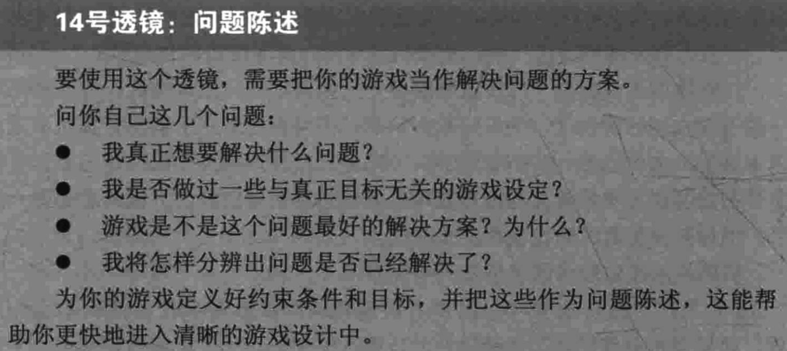

### 游戏设计艺术

## 概述

### 游戏设计师需要什么技能

- 最重要的技能:==沟通==--以一颗宁静的心灵、一种期盼而又宽容的心境去倾听，抛弃一切欲望和激情，抛弃一切评判与见解。
  - 团队/听众/游戏/客户/自己

1. 动画——现代的游戏有许多需要看起来鲜活的角色。“动画(animation)”这个词的本意就是“赋予生命”。了解角色动画的能力与局限，可为你打开一扇门，发现前所未有的游戏设计创意。人类学——你要在受众的自然栖息地研究他们，并设法探究他们内心的欲望，你的游戏才能满足其欲望。
2. 建筑学——你设计的将不止是建筑，你要设计整座城市、整个世界。熟悉建筑领域，也就是了解人与空间的关系。这能让你在创造游戏世界时占尽先机。
3. 头脑风暴——你需要创造数以十计，不，数以百计的新想法。
4. 商业——游戏产业也就是一种产业。大部分游戏都是为赚钱而做的。对事情的商业部分了解越深，就越有可能做出你梦想中的游戏。电影制作方法——许多游戏里都有电影。几乎所有现代的电子游戏中都有个虚拟的摄像机。如果想要传达有冲击力的情感体验，就必须了解电影的艺术。
   沟通——此处列出的、未列出的一切学科领域的人员，你都要与之交流。你需要平息争论，需要解决沟通不畅的问题，了解你的团队成员、客户和受众对游戏的真实感受。
5. 创意写作——你将要创造完整的虚拟世界及其中的住民，还要决定其中发生的一切事件。
6. 经济学——现代的许多游戏都是包含游戏资源的复杂经济体系。了解经济学的原理，会有意料之外的用处。
7. 工程学——现代的电子游戏牵涉当今世界最复杂的工程,一些作品的代码量数以百万行计。技术创新让新的玩法成为可能。有创意的游戏设计师必须了解每一项技术的局限和能力。
8. 玩游戏——自然，熟悉游戏对你颇有用处，但不仅限于你想要创作的游戏类型。了解从购T以颀的原材料。..程，会为你创作新游戏提供必须的原材料。
9. 历史——许多游戏设定在真实的历史中。就算是有着幻想类背景设定的游戏，也能从历史中汲取大量灵感。
10. 管理——只要有刀大内E况下，通过秘密的“向上管理”完成仕分，计师可以在管理不善的情况下，通过秘密的“向上管理”
    完成任务，
    取得成功。
11. 数学——游戏里充满着数学、概率、风险分析以及复杂的计分系统，更不用说计算机图形学和计算机科学背后的数学了。熟练的设计师必须时不时到数学领域中深挖一下，不能有所畏惧。
12. 音乐——音乐是灵魂的语言。如果你的游戏要真正触动人、浸没人、拥抱人，没有音乐是不可能的。
13. 心理学——你的目标是令人感到幸福。你必须理解人的心理运作机制，否则设计过程便漫无目的。
14. 公开演讲——你需要经常向一群人展示你的想法。有时候你的演说是
    为了获取反馈;有时乂定为」比白饮而又有趣，否则大家会怀疑你么，你的演说都必须自信、清晰、自然而又有趣，否则大家会怀疑你自己也不知道自己在干嘛。
15. 声音设计——只有户首力肥L八ne1HIno闻为实。”
16. 技术写作——你需要创建文档，清晰地描述你复杂的设计，不留任何漏洞或缺陷。
17. 视觉艺术——你的游戏将充满图形元素。你必须熟练运用图形设计的语言，知道怎么在游戏中创造你想要的感觉。

## 创造体验

- 游戏设计师真正关注的就是创造体验。我们无法回避它，退回到游戏中的具体概念。我们必须尽可能领悟、理解，掌握人类体验的本质。
- 游戏不等于体验。游戏能够带来体验，但是它并不是体验本身。
- 我们制作游戏是因为它创造的体验。游戏体验会产生特定的感受，选择感、自由感、责任感、成就感、友情和其他只有基于游戏体验才能获得的感受。这就是为什么我们要克服所有的困难─—产生那些无法通过其他方式获得的体验的原因。

### 三种方式

1. 心理学
2. 人类学是另一个研究人类及其思想行为的主要分支，它采用比心理学更综合的方式观察人类，包括他们的身体、精神和文化方面。人类学研究世界上各种人群的相同点和不同点，不仅包括现在，而且贯穿整个人类的历史。
3. 设计学:我们几乎能从所有行业的设计师身上学习到有用的东西:音乐家、建筑学家、作家、制片人、工业设计师、网页设计师、编舞家、视觉设计师等。这些来源于不同学科的“经验规则”完美描绘了人类本质的有用准则。

### 反思:力量、风险和实践

- 反思可能导致对事实的错误结论
- 自己的体验不一定适用于其他人

### 仔细分析你的想法

- 透镜1
  - 

### 战胜海森堡原理

- 反思仍然有一个巨大的挑战。我们怎样才能获得不受干扰的体验?由于观测行为本身就是一种体验。我们往往会面临这样一个问题。当你尝试观察自己打字时，你会发现你的打字速度减慢了，并且会产生很多错误。在享受一个游戏或者电影时尝试观察你自己，享受感会很快消失殆尽。

- 有人把这称作“分析的无奈”，也有人把这比作“海森堡原理”。这条原理引用自量子力学中的“海森堡不确定原理”。这个原理指出，无法在不干扰一个物体运动的情况下测量这个物体的运动。类似的，体验的本质无法在不被干扰的情况下获得。这让反思看起来毫无希望。尽管这是一个具有挑战性的难题，实践过程中仍然存在一些有效的应对方法。我们中大多数人并不愿意公开讨论自己思想进程的本质
- 分析记忆

### 本质体验

- 一个优秀的游戏不需要你完美复制真实的体验。你需要做的是为你的游戏找出这种体验的精髓。那什么是“体验的精髓”呢?每个值得纪念的体验都有一些让它与众不同的关键特征。
- 作为游戏设计师，在尝试设计一种体验时，你的目标是寻找能够定义你所想要的体验的基本元素，并想办法让他们成为游戏中的一部分。通过这种方式，你的玩家能够体会到这些基本元素。
- 透镜2
  - 

## 体验发生于场景

### 私人场景

- 游戏玩法常常具有私密性。为了沉浸在幻想世界中，我们需要一个安全的地方，既不孤单，也不被认识的人们包围。我们的家中自然就是最重要的游戏空间之一。
- 炉边
- 工作台
- 读书角

### 公共场合

- 当然不是所有的游戏玩法都在家中进行。世界上充满了兴奋的人、地点和事物。几千年以前，我们就已经知道了基于地点的娱乐活动的秘密。无论你在运营一间酒馆、剧院、饭店、妓院、主题公园，或者街机游戏厅，游戏的规则就是:给予他们在家中无法得到的体验。

### 半公开/半私人场景

- 在家庭的私密性和公共场合的开放性之间，还存在着一些其他的场景，或者说这些场景找到了一种在二者之间共存的方法。这种存活在公共和私人边缘的灵活性赋予了它们趣味性和重要性。
- 游戏桌
- 操场

### 场景之间的混合与搭配

- 找出这些场景的缺失和重合部分很简单。当我在一间餐厅中玩弹球游戏时，我到底处于哪一种场景之下呢?保龄球馆是哪一种场景?赌场是一座博物馆，还是竞技场，还是游戏桌，或者其他东西?能否找出完美的场景分类并不重要，重要的是审视过去的游戏和平台，这样你就能够熟知这些场景的特点。虽然游戏和技术总是在发生改变，场景却很少变化。
- 透镜3
  - 

## 体验从游戏中诞生

- 快乐是一种带有惊喜的满足感。

- 玩耍是一种满足好奇心的行为。

- 玩具是你玩耍的对象。

- 优秀的玩具是一个能够带来乐趣的物品。

- ==游戏是一种以嬉戏的态度进行的解决问题的活动.==

- 讨论体验设计是一件美妙的事。我们的目标就是创造伟大的体验。但我们无法接触体验，也无法直接操纵它。游戏设计师能够直接控制的是游戏。游戏就是你的黏土，你可以把它捏成各种形状，创造令人着迷的游戏体验。
- 透镜4
  - 

- 透镜5
  - 

- 透镜6
  - 

- 透镜7
  - 

- 透镜8
  - 

## 游戏由元素构成

没有任何一种元素比其他的更重要

### 四种基本元素

1. 机制:游戏中的过程和规则。机制描述了玩家怎样才能完成你的游戏目标，当他们尝试时，会发生什么。如果你把游戏与更加线性的娱乐体验相比(小说、电影等），你会注意到尽管线性体验会包含技术、故事和美学，但它们并不包含机制，因为机制让游戏成为了游戏。当你选择了一系列对玩法有重要作用的机制时，你需要选择技术来支持它们;需要选择美学来呈献给玩家;需要一个故事来让你的（有时候很奇怪）机制吸引玩家。机制在第12章到第14章会有更详细的阐述。
2. 故事:这是游戏中事件展开的顺序。它可能是线性或预先设定的;也可能是有分支或者随机发生的。当你想通过游戏讲述一个故事时，你需要选择合适的机制来推动故事的发展，让故事浮出水面。就像所有的说书人一样，你想要通过美学来加强故事的表现力;通过技术来配合游戏中将要出现的特定的故事。我们将在第17章和18章中研究故事及其与机制的特殊关系。
3. 美学:这是游戏的外观、声音、气味、味道和感觉。美学对玩家的体验有最直接的影响，因而它是游戏设计中非常重要的一个方面。如果你想让玩家体验到特定的外观、语音并让玩家沉浸于其中，你需要选择一种技术，不仅能够将美学表达出来，而且能够放大它们。你需要选择一种机制让玩家们感受到游戏世界中的美学已经被确定了，你需要一个有一系列事件的故事让你的美学在合适的时机凸显出来，展现出最强的影响力。美学能够强化其他游戏元素，创造一个更有纪念意义的体验，它将会在第22章被讨论。
4. 技术:我们不是专门谈及“高科技”，但是对于任何让你游戏实现的材质和交互，就像纸和铅笔，塑料原型或者高能激光一样。你选择的技术应该能够让你的游戏完成特定的目标，并禁止它完成其他事情。技术从本质上是一种媒介，美学通过它展现出来，机制通过它产生作用，故事通过它被讲述。我们将在第28章详细讨论怎样为你的游戏选择合适的技术。

- 透镜9
  - 

- 透过游戏的皮肤（玩家体验），深入到骨骼之中（组成游戏的元素）。但你必须了解一个其他设计师可能会踏入的陷阱:一些设计师总是思考游戏内部的细节而忘记了玩家体验。你不仅需要理解各种各样的游戏元素以及它们之间的关系，你还必须考虑它们与体验的关系。这是游戏设计中的一个巨大挑战:在理解元素及其关系是如何产生体验的同时感受游戏体验。你必须同时看到皮肤和骨骼。如果你只专注于皮肤，你会思考体验的感受，却不理解为什么会有这样的感受或者怎样提高这种感受。如果你只关注骨骼，你可能让一个游戏结构在理论上十分完美，而在实践中十分糟糕。如果你能够同时专注于这两件事，你就能在看到游戏运行的方式，同时也可以感受到游戏体验的力量。

- 透镜10
  - 

## 元素支撑起主题

- 主题就是你的游戏是关于什么的。这是一种能够把整个游戏联系起来的创意——一种所有的元素都必须支撑的创意。如果你不知道你的主题是什么，你的游戏很可能无法最大限度地吸引玩家。大多数游戏的主题都基于体验，这就是说，设计的目标是给玩家传达必要的体验。

### 统一主题

- 利用主题增强你的游戏体验，可以通过两个简单的步骤来实现:
  1. 确定你的主题是什么。
  2. 采用所有可能的方法来强化这个主题。
- 透镜11
  - 

- 最好的主题能引起玩家的共鸣
  - 透镜12

## 游戏始于创意

- 设计游戏的方法
  1. 想出一个创意。
  2. 尝试制作出来。
  3. 不断测试和改进，直到它看起来不错为止。

### 灵感

1. 透镜13
   1. 

1. 陈述问题
   1. 设计的目的就是解决问题，游戏设计也不例外。在你开始想出创意之前，你需要确定你为什么要做这件事，那么陈述问题就是一种清晰表达的方式。好的问题描述能够体现你的目标与约束。
      1. 更广阔的创造空间。很多人快速转向解决方案并开始他们的创作过程。如果你带着问题而不是建议性的方案开始你的工作，你将可以探索一个更广阔的创造空间，找到其他人无法发现的隐藏的解决方案。
      2. 更清晰地叶怕。Y-袖澎晰地定义解决问题的质量怎样?
      3. 更顺畅的交流。当你参与一个团队的设计时，一个问题被清晰地定义之后，交流将会更加便捷。合作者们往往会尝试解决不同的问题而没有意识到这个问题还没有被清晰地陈述过。
   2. .透镜14
      1. 

### 如何睡眠

- 睡眠是产生创意的重要组成部分——优秀的设计师会最大化地利用睡眠的力量。
- 创造性潜意识
  - 无法交谈。或者至少不选择用语言交流。它也不会通过文字交流，而倾向于通过想象力和情感交流。
  - 冲动。不会提前作好规划，想要活在当下。
  - 情绪化。会扫过你所有的感受——开心、生气、兴奋、害怕--潜意识对事物的感受看起来比显意识更加深刻和强大。
  - 贪玩。总是充满好奇心，喜欢玩文字游戏和恶作剧。
  - 荒谬的。不被逻辑和理性约束，潜意识带来的想法经常毫无意义。想要去月亮上吗?可能你需要一个长梯子。有时候这些错误的想法会分散你的注意力，但有时候它们可能就是你一直在寻找的明智的观点——例如谁会听说过一个环形的分子呢?
- 潜意识建议
  1. 给予关注:与往常一样，倾听是关键，这一次是倾听你自己（的一部分）。潜意识和其他人没有什么区别:如果你习惯于忽视它，它就会停止提供建议。如果你习惯于倾听它，认真考虑它的想法，当它为你提供了一个优秀的创意时感谢它，它就会开始给予更多更好的建议。那么应该怎样倾听那些不会说话的潜意识呢?你需要做的就是对你的思想、你的感受、你的情感以及你的梦境给予更多的关注，因为这些都是潜意识与你交流的方式。这听起来很奇怪，但是很有效，你对潜意识所表达的关注越多，它就会为你完成越多的工作。
  2. 记录创意:
  3. 满足它的欲望:如果你没有食物、安全感和健康的人际关系，就难以从事自我实现的创造性工作。所以，把这些提高优先级来完成，然后做出让步满足你的潜意识，这样它就能投入时间来想出天才般的创意。
  4. 睡眠
  5. 尽力而为
  6. 个人关系:为了成为最棒的游戏设计师，你必须找到对自己有效的技巧，没有人能告诉你这种技巧是什么——你必须自己探索。

### 头脑风暴建议

1. 记下答案
2. 写字还是打字(选择最适合的)
3. 草图
4. 玩具
5. 改变你的视角
6. 开几个玩笑
7. 沉浸你自己
8. 不要节约
9. 颠覆你的设定

## 游戏通过迭代提高

### 选择创意

- 在做出决策之后，你突然意识到自己犯了一个错误怎么办?答案很简单:当意识到错误时，你准备好推翻之前的决策。许多人觉得这很困难——他们一旦做了一个设计决策，就不愿意放弃它。你不能这样优柔寡断。创意不是一个完好的瓷器，而是一次性纸杯—--它很廉价，能够大量生产。如果有人得到了一个纸杯，去拿另一个就好了。

### 测试检验

1. 艺术冲动。这是最个人化的一项测试。你作为设计师，问自己对这个游戏是否“感觉不错”。如果是的，它就通过了测试。如果不是，就需要做出一些改变。你
2. 的直觉和你团队的直觉都很重要。直觉并不总是正确的，但是其他测试会平衡这一点。
   - 关键问题:.“这个游戏看起来不错吗?”
3. 测试2:人群特征。你的游戏有一群特定的受众。这些受众的分类标准可能是年龄阶段、性别，或者其他（比如:高尔夫爱好者）。你需要考虑你的设计是否适合目标受众。我们将会在第9章《玩家》里对人群特征进行深入讨论。
   - 关键问题:“我们的目标受众很喜欢这个游戏吗?”
4. 测试3:体验设计。为了通过这项测试，你需要尽一切努力创造良好的体验，包括美学、兴趣曲线、共鸣主题和游戏平衡。这本书中的许多透镜都是关于体验设计的——为了通过这项测试，你的游戏必须经得起这些透镜的检验。
   - 关键问题:“这个游戏设计得不错吗?”
5. 测试4:革新。如果你在设计一个新游戏，从定义上说，它需要包含一些玩家从未见到过的新内容。虽然你的游戏是否与众不同是一个主观的问题，但却是个很重要的问题。
   - 关键问题:“这个游戏是否与众不同?
6. 测试5:商业和市场。游戏商业是商业的一种，想要卖出游戏的设计师必须考虑这种现实，并将它们融入到游戏设计中。这带来了很多问题。游戏的主题和故事对玩家们具有吸引力吗?游戏是否通俗易懂，一个玩家能否仅仅通过观看概述就能明白这个游戏的内容?消费者对这种题材的游戏有怎样的期待?在市场上，这个游戏与其他相似的游戏相比有哪些特点?这个游戏的开发成本是否过高以至于无法盈利?这些问题和其他问题的答案将会影响你的设计。讽刺的是，在考虑这项测试时，推动初始设计方案的创意可能被证明是完全站不住脚的。我们将会在第31章《利润》中讨论更多的细节。
   - 关键问题:“这个游戏能够盈利吗?”
7. 测试6:工程。在完成整个工程之前，游戏创意只是一个创意，而创意并不总是与约束结合在一起，比如什么是可能的或者可行的。为了通过这项测试，你必须要回答这个问题:“我们怎样构建这个游戏?”答案可能是，技术的限制并不允许将这个想法以最初想象的形式实现。新手设计师经常对设计方案中工程实现的限制感到心烦意乱。然而工程测试正好可以将游戏引向一个新方向，因为在通过这项测试的过程中，你可能会意识到工程为游戏实现而创造的一些特性最初并不是因你产生。在完成这项测试的过程中产生的创意将会尤为珍贵，因为你可以确定这些创意都是可行的。我们将在第28章《技术》中讨论更多关于工程和技术的问题。
   - 关键问题:“这个游戏在技术上是否具备可行性?”
8. 测试7:社交/社区。有时候，一个好玩的游戏可能并不足够。一些设计目标可能需要很强的社交元素，迅速蔓延的病毒式传播，或者围绕你的游戏形成社区。你的游戏设计将会对这些要素产生很强的影响力。我们将在第23章和第24章讨论这些内容。
   - 关键问题:“这个游戏完成我们的社交或者社区目标了吗
9. 测试8:玩法测试。当游戏开发到可玩的程度时，你必须通过玩法测试，它是所有测试中最重要的。想象一个游戏是一回事，而实际玩起来却是另一回事，而被你的目标受众玩起来则又是另外一回事了。你应该尽快把你的游戏开发到可玩的程度，因为当你能实际看到游戏的表现时，才知道需要做出哪些重大改变。除了游戏自身的不断改进，这项测试的目标也经常需要改变，其他测试也要不断调整，因为你开始更深刻地了解游戏的机制和目标受众的心理感受。我们将会在第27章更加详细地讲述玩法测试。
   - 关键问题:“游戏测试者是否享受这个游戏?”

- 透镜15
  - 

### 迭代规则

- 迭代规则:你的游戏测试和改进的次数越多，就会越出色。
- 迭代问题1:我怎样让每次迭代都有意义?
  - 螺旋模型的答案:评估并消除风险。
- 迭代问题2:我怎样尽可能快地进行迭代?
  - 螺旋模型的答案:构建许多粗糙的原型。

- 透镜16
  - 

### 制作原型的技巧

1. 回答问题:每个原型都应该设计为回答一个问题，有时候甚至更多。你应该能够清楚地描述问题。如果你不能，你的原型就可能陷入一种浪费时间的危险境地，而不是它本应承担的节约时间的作用。
2. 忘记质量:不要逃避迭代规则。你需要尽快构建出能回答疑问的原型，别管它有多难看。
3. 不要太过留念
4. 区分原型的优先级
5. 有效的并行模型
6. 不总需要数字化
7. 无需交互
8. 使用"快速迭代"的游戏引擎
9. 先构建玩具
10. 抓住更多迭代的机会

- 透镜17
  - 

### 完成迭代

- 非正式迭代
  1. 想出一个创意。
  2. 试验它。
  3. 测试和改进它直到变得足够好为止。
- 正式迭代
  1. 描述一个问题。
  2. 用头脑风暴的方式找到几种可能的解决方案。
  3. 选择一个解决方案。
  4. 列出使用这种解决方案的风险。
  5. 构建原型来消除这些风险。
  6. 测试原型，直到足够好为止。
  7. 描述一个新的你想要解决的问题，然后回到第2步。
- 透镜18
  - 

## 游戏为玩家而生

### 设身处地

### 人群特征

- 透镜19
  - 

### 心理特征

- 某个游戏乐趣分类
  1. 感官:感官的乐趣包含使用你的感官。看到美丽的事物，聆听音乐，触摸丝绸和闻到或者品尝美味的食物都是感官的快乐。你的游戏的美感主要带来这种快乐。
  2. 幻想:这是一种想象世界的乐趣和想象你自己变为其他人的乐趣。我们将在第19章和第20章进行更加深入的讨论。
  3. 叙事:在叙事的乐趣中，勒布朗并不意味着讲述一个确定的线性故事。他的意思是故事的发生经过了一系列事件的戏剧化演变。我们将在第16章和第17章进行更加深入的讨论。
  4. 挑战:在某种程度上，挑战可以被当作游戏玩法的核心乐趣之一，因为每个游戏的核心都有一个需要被解决的问题。对于某些玩家，这种乐趣就足够了，但是其他的玩家想要更多的乐趣。
  5. 团队关系:勒布朗在这里指的是友情、合作和社区带来的乐趣。毫无疑问，这是一些玩家玩游戏的主要吸引力。我们将在第23章和第24章进行更加深入的讨论。
  6. 探索:探索的乐趣是很广泛的，每次你搜寻并找到新的东西，就是探索。有时候是对游戏世界的探索，有时候是对一个隐藏特性或者巧妙策略的探索。毫无疑问，探索新事物是游戏乐趣的关键。
  7. 表达:这是一种表达自我的乐趣和创造事物的乐趣。过去，这种乐趣通常会被游戏设计忽视。时至今日，很多游戏允许玩家改变自己的角色，创造和分享自己设计的关卡。这种“表达”很少与完成游戏目标有关。在大多数游戏中，为你的角色设计新的外观并不能帮助你取得优势——但是对一些玩家而言，这可能是他们玩游戏的原因。
  8. 服从:这是一个踏入魔法阵的快乐——离开真实世界进入一个全新的、令人愉悦的、充满规则和更有意义的世界。在某种程度上，所有的游戏都包含了服从的乐趣，但是一些游戏世界显然比其他的更加快乐和有趣。在一些游戏中，你被迫抛开疑问——在另一些中，游戏本身看起来会不费力气地打消你的怀疑，你的思维很容易进入并停留在游戏世界中。这些游戏让服从变成了一种真正的乐趣。

- 某个玩家类型分类
  1. 成功者:想要完成游戏目标。他们主要的乐趣源于挑战。
  2. 探索者:想要了解游戏的方方面面。他们主要的乐趣源于探索。
  3. 社交者:对与人们之间的关系更感兴趣。他们主要寻求团队合作的乐趣
  4. 杀手:喜欢竞争并击败其他人。
- 

# 游戏改变世界

## 游戏化，互联时代的重要趋势

### 游戏化洞察

- 游戏：玩游戏，就是自愿尝试克服种种不必要的障碍。
  - 主动挑战障碍：一旦进入了心流状态，人们就想长久地停留在那里，不管是放弃还是获胜，两种结果都同样无法
    让你心满意足。
  - 保持不懈的乐观：与游戏相比，现实令人沮丧。游戏让我们保持不懈的乐观态度，把精力放在自己擅长且享受的事情上。
- 游戏的4大决定性特征：定义游戏的只有目标、规则、反馈系统和自愿参与这4个核心要素，其他的一切都只是起到
  强化和巩固这些要素的作用。
  1. 目标（goal），指的是玩家努力达成的具体结果。它吸引了玩家的注意力，不断调整他们的参与度。目标为玩家提供了“目的性”（sense of purpose）。
  2. 规则（rules），为玩家如何实现目标做出限制。它消除或限制了达成目标最明显的方式，推动玩家去探索此前未知的可能空间。规则可以释放玩家的创造力，培养玩家的策略性思维。
  3. 反馈系统（feedback system），告诉玩家距离实现目标还有多远。它通过点数、级别、得分、进度条等形式来反映。反馈系统最基本也最简单的形式，就是让玩家认识到一个客观结果：“等……的时候，游戏就结束了。”对玩家而言，实时反馈是一种承诺：目标绝对是可以达到的，它给了人们继续玩下去的动力。
  4. 自愿参与（voluntary participation），要求所有玩游戏的人都了解并愿意接受目标、规则和反馈。了解是建立多人游戏的共同基础。任意参与和离去的自由，则是为了保证玩家把游戏中蓄意设计的高压挑战工作视为安全且愉快的活动。
- 希望探索、学习和改进，自愿从事不必要的艰苦工作，真诚地看重自己努力得来的结果。
  - 如果游戏的目标真正具有吸引力、反馈又足以激励人心，我们会在相当长的时间里发挥创造力、满怀热情、真心实意地不断挑战游戏设置的重重障碍。我们会一直玩下去，直到将自己的能力完全榨干，或者直到通关。我们会认真对待游戏，因为玩一轮精彩的游戏绝非无关紧要——游戏很重要。

### 游戏，唤起积极的情感

- 事实证明，没有什么能比出色而艰苦的工作更能让我们开心。
- 玩的对立面不是工作，而是抑郁。
  - 在玩精彩的游戏时，也即在克服不必要障碍时，我们主动让自己朝着情感频谱的积极一端前进。我们紧张地投入其中，而这恰恰是产生各类积极情绪和体验的正确心态和身体状况。玩游戏充分激活了与快乐相关的所有神经系统和生理系统——我们的注意力系统、激励中心、动机系统以及情绪和记忆中心。
    - 这一极端的情绪激活，是当今最成功的电脑和视频游戏让人如此沉迷亢奋的主要原因。
  - 别人要求我们所做的艰苦工作，不能以相同的方式激活我们的快乐系统，很难让我们打起精神、乐观向上、斗志昂扬。

### 游戏的7大艰苦之乐

1. 第一类是高风险工作。在谈到视频游戏时，很多人马上就会想起它。它速度快、多以动作为导向，用成功和惨败的可能性对我们施以双重刺激。不管是在《GT赛车》一类的竞速游戏里全速漂移，还是在《求生之路》（Left4Dead）等第一人称射击游戏里打僵尸，撞车、燃烧、脑子被僵尸吸掉的风险都让我们感觉活起来更带劲。
2. 第二类是重复工作。这类工作单调，完全可以预测。在现实生活中，重复工作的名声很糟，可如果我们主动选择从事这样的工作，其实有助于让我们感到自得而多产。在《宝石迷阵》（Bejeweled）等休闲游戏里调换五彩宝石、在《农场小镇》（FarmVille）等社交游戏里收割虚拟庄稼时，我们很乐于让自己的手脚和思维都集中在一项能产生明确结果的活动上。
3. 第三类是脑力工作。这类工作主要是调动我们的认知能力。它可以是快速而简单的，类似任天堂《大脑时代》里的30秒数学题；也可以是漫长而复杂的， 类似即时战略游戏《帝国时代》（ Age of Empires）模拟10000多年来的征战。不管是哪种方式，只要我们把大脑很好地利用起来，都能体会到奔涌而来的成就感。
4. 第四类是体力工作。这类工作让我们心跳加快、呼吸急促、汗水狂洒。如果工作足够辛苦，我们的大脑会分泌大量的内啡肽，这种化学物质能让人自我感觉良好。但更重要的是，不管我们是在《Wii拳击》上狠狠出拳，还是在《劲舞革命》（Dance Dance Revolution）里跳来跳去，我们都分外享受让自己精疲力竭的整个过程。第五类是探索性工作。这类工作通过主动调查不熟悉的物体和空间带来乐趣。探索类工作让我们感到自信、强大，激励我们积极进取。我们在神秘的3D环境下探索时，或是和陌生人互动时，总是分外享受对所有东西展现好奇心的机会。
5. 第五类是探索性工作。这类工作通过主动调查不熟悉的物体和空间带来乐趣。探索类工作让我们感到自信、强大，激励我们积极进取。我们在神秘的3D环境下探索时，或是和陌生人互动时，总是分外享受对所有东西展现好奇心的机会。
6. 第六类是团队工作。如今，这类工作在电脑和视频游戏中越来越多，它强调协力合作，为群体做出贡献。当我们在复杂任务中承担起个人的职责，或是在4人合作游戏中保护朋友的性命时，我们总是备感满足，因为我们知道自己要在集体行动中发挥独特而重要的作用。
7. 第七类是创造性工作。从事创造性工作时，我们要做出有意义的决定，会为自己已经做好的事情感到自豪。创造性工作可以是在《模拟人生》（Sims）游戏里设计自己的家，可以是把自己做好的卡拉OK视频表演上传到《歌星》（SingStar）网络，也可以是在《疯狂美式橄榄球》（Madden NFL）里组建和管理在线大联盟。我们每完成一轮创造性工作，都会觉得自己更加能干了。

- 在承受能力范围内，我们宁肯艰苦工作，也不愿无聊娱乐。

### 体验自豪的快感

- 艰苦的乐趣对情绪还有一项更重要的好处：自豪（fiero）。它恐怕是我们能体验到的最原始的情绪涌动了。
  - 游戏设计师用它来形容一种英语里找不到确切说法的高亢情绪。自豪是我们走出逆境后的感觉。只要一感觉到它或一看到它，你就明白了，因为我们几乎所有人都以相同的方式表达过“自豪”：双手高举过头顶，欣喜若狂地呼喊。

### 随时随地创造幸福的力量

- 实现幸福有多种途径，但我们就是发现不了幸福。没有哪一种物体、事件、结果或生活环境一定能给我们带来真正的幸福。我们必须自己创造幸福：从事艰苦工作，从事那些能带来奖励的活动。
  - 一方面，如果我们尝试在自身之外寻找幸福，就把焦点放在了积极心理学家称为“外在”奖励的东西上，即金钱、物质、地位或赞许。等我们得到了自己想要的东西，就会感觉很好。可惜，幸福的愉悦感不会持续太久
  - 另一方面，如果我们着手自己创造幸福，就把焦点放在了产生内在奖励的活动上，即通过强烈投入周围世界所产生的积极情绪、个人优势和社会联系。我们不是在寻找赞美或付出，我们所做的事情，能因充分投入而带来享受，就足够了。
- 只要经常沉浸在自我奖励的艰苦工作当中，我们就会更频繁地感受到幸福，不管我们在生活中还遭遇了其他什么事情。

### 让现实更美好的4大秘密

1. 我们每一天都在渴望满意的工作。
2. 我们渴望体验成功，至少也是希望成功。
3. 我们渴望与社会建立联系。
4. 我们渴望过得有意义，渴望成为超越自身的宏伟事业的一部分。

- 玩游戏，并不是为了逃避现实生活，而是为了主动让现实变得更有价值！