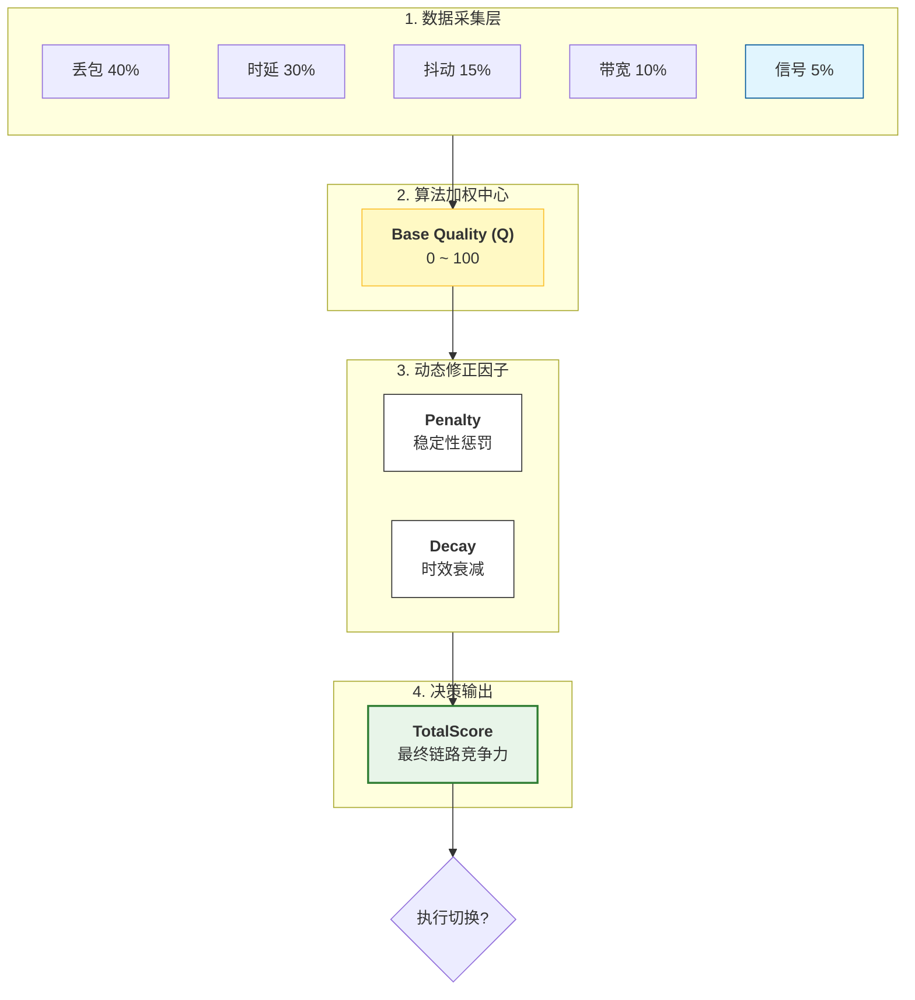

# Android 14 DSDT 网络链路质量优化方案

# 评分架构设计

## 1. 架构可视化图解

下图展示了从底层数据输入到最终评分决策的完整数据流向。

## 2. 核心公式与设计原则

本架构旨在通过量化指标精准反映链路的真实业务承载能力。

### 2.1 总分公式

$$ 总分= \text{范围}(质量分- 惩罚分- 衰减分, 0, 100) $$

- **质量分 (0-100)**: 纯粹的链路物理质量，越高越好。
- **惩罚分 (0-20)**: 针对不稳定性、频繁切换的惩罚项。
- **衰减分 (0-20)**: 针对数据陈旧度的衰减项。
  - 平衡时效和资源开销
- **范围**:取值范围为0到100,总分可能小于0,如果小于0,值为0,

## 3. 质量分 (QualityScore) 详解

质量分反映了“如果现在使用这条链路，体验会如何”。

**计算公式：** $$ Q = 0.4 \cdot S_{丢包} + 0.3 \cdot S_{rtt} + 0.15 \cdot S_{抖动} + 0.1 \cdot S_{带宽} + 0.05 \cdot S_{信号} $$

### 3.1 详细评分标准表

- | 指标类型               | 权重 | 测量值区间  | 得分 | 等级说明                        | 业务体验参考               |
  | ---------------------- | ---- | ----------- | ---- | ------------------------------- | -------------------------- |
  | 1. 丢包率(Packet Loss) | 40%  | 0%          | 100  |                                 | 视频会议不卡顿             |
  |                        |      | ≤ 0.1%      | 95   | 优秀                            | ---                        |
  |                        |      | ≤ 0.5%      | 85   | 良好                            | ---                        |
  |                        |      | ≤ 1%        | 70   | 中等                            | 网页加载正常               |
  |                        |      | ≤ 2%        | 50   | 一般 (警告)                     | 警告：开始体感不稳         |
  |                        |      | ≤ 5%        | 25   | 差 (红线)                       | 红线：明显丢包断联         |
  |                        |      | ≤ 10%       | 10   | 很差                            |                            |
  |                        |      | > 10%       | 0    | 极差                            |                            |
  | 2. 时延(RTT)           | 30%  | ≤ 20ms      | 100  | 优秀                            | 5G/光纤级响应              |
  |                        |      | 20 - 50ms   | 90   | 良好                            | 正常 LTE 网络              |
  |                        |      | 50 - 100ms  | 75   | 中等                            | ---                        |
  |                        |      | 100 - 200ms | 50   | 一般 (警告)                     | 警告：操作有延迟感         |
  |                        |      | 200 - 500ms | 20   | 差 (红线)                       | 红线：极高延迟             |
  |                        |      | > 500ms     | 0    | 极差                            | 不可用                     |
  | 3. 抖动                | 15%  | ≤ 5ms       | 100  | 优秀                            | 语音通话极清晰             |
  | (Jitter)               |      | 5 - 10ms    | 90   | 良好                            | ---                        |
  |                        |      | 10 - 20ms   | 70   | 中等                            | ---                        |
  |                        |      | 20 - 50ms   | 40   | 一般 (警告)                     | 警告：通话偶有破碎         |
  |                        |      | 50 - 100ms  | 15   | 差 (红线)                       | ---                        |
  |                        |      | > 100ms     | 0    | 极差                            | 极度不稳定                 |
  | 4. 带宽                | 10%  | ≥ 100Mbps   | 100  | 优秀                            | 高速下载                   |
  | (Bandwidth)            |      | ≥ 50Mbps    | 90   | 良好                            | 高清视频                   |
  |                        |      | ≥ 10Mbps    | 75   | 中等                            | 基础保障                   |
  |                        |      | ≥ 5Mbps     | 60   | 一般                            | 网页浏览                   |
  |                        |      | ≥ 1Mbps     | 40   | 差                              | 文字通讯                   |
  |                        |      | < 1Mbps     | 20   | 极差                            | 仅能维持连接               |
  | 5. 信号强度            | 5%   |             |      | 复合分                          | 兼顾“信号格数”与“干扰质量” |
  |                        |      | 见下表      |      | 计算公式：(RSRP分 + SINR分) / 2 |                            |

- rsrp和sinr(todo:MIMO/QAM)

- | 等级 | RSRP 测量值    | 得分 | SINR 测量值 | 得分 |
  | ---- | -------------- | ---- | ----------- | ---- |
  | 优秀 | ≥ -80dBm       | 100  | ≥ 20dB      | 100  |
  | 良好 | -80 ~ -90dBm   | 80   | 13 ~ 20dB   | 80   |
  | 中等 | -90 ~ -100dBm  | 60   | 0 ~ 13dB    | 50   |
  | 一般 | -100 ~ -110dBm | 40   | < 0dB       | 0    |
  | 差   | -110 ~ -120dBm | 20   | -           | -    |
  | 极差 | < -120dBm      | 0    | -           | -    |

## 4. 惩罚分 (PenaltyScore) 机制

**目的**：防止“乒乓切换”（Ping-Pong Effect）和过滤虚假好网络。 **最大上限**：20分。

| 触发场景                | 扣分值  | 逻辑解释                                                    |
| ----------------------- | ------- | ----------------------------------------------------------- |
| **冷却期 (Cooldown)**   | **-10** | 刚切换过网络，强行降低本网络分数，防止立即切走。            |
| **保持期 (Hold)**       | **-5**  | 切换后 10 秒内，即使质量变好，也适当压分，维持稳定性。      |
| **剧烈波动 (Variance)** | **-3**  | 过去 10 秒内质量方差 > 20，说明网络虽然现在好，但很不稳定。 |
| **验证失败 (Invalid)**  | **-10** | 网络连接层不可达（如 captive portal 检测失败）。            |

## 5. 衰减分 (DecayScore) 机制

**目的**：确保使用的是“实时”数据。如果底层 eBPF 或 Modem 很久没有上报新数据，分数应自动降低，迫使系统重新探测或切换。

| 数据“年龄” (Age) | 衰减扣分 | 说明                   |
| ---------------- | -------- | ---------------------- |
| **≤ 5秒**        | **0**    | 数据新鲜，完全可信     |
| **5 - 10秒**     | **-2**   | 轻微过期               |
| **10 - 30秒**    | **-8**   | 中度过期，权重下降     |
| **30 - 60秒**    | **-15**  | 严重过期               |
| **> 60秒**       | **-20**  | 数据不可信，按最差处理 |

## 6. 决策阈值与示例

### 6.1 决策阈值

在得到双卡的 `TotalScore` 后，系统根据差值决定是否切换。

- **稳定网络切换阈值 (Delta > 15)**: 如果当前网络还行，目标网络必须比当前网络高出 15 分才切。
- **波动网络切换阈值 (Delta > 5)**: 如果当前网络已经很差（TotalScore < 30），只要目标网络高出 5 分就赶紧切。
  - 同时通过警告和红线值设置标志位,通知参数质量特别差,可以启动相应提前状态处理

### 6.2 综合计算演示

**场景：一条看着还行，但其实已经有点卡顿的 4G 链路。**

1. **输入数据**:
   - 丢包率 1.5% (得分 65)
   - RTT 150ms (得分 60)
   - 抖动 30ms (得分 40)
   - 带宽 8Mbps (得分 70)
   - 信号 -105dBm (得分 45)
   - *状态：刚切换过来 6 秒，数据有点旧 (8秒前)*
2. **QualityScore 计算**: $$ Q = (0.4 \times 65) + (0.3 \times 60) + (0.15 \times 40) + (0.1 \times 70) + (0.05 \times 45) $$ $$ Q = 26 + 18 + 6 + 7 + 2.25 = \mathbf{59.25} $$
3. **Penalty & Decay 计算**:
   - **Penalty**: 处于切换后保持期 (<10s) $\rightarrow$ **5分**
   - **Decay**: 数据 8s (在 5-10s 区间) $\rightarrow$ **2分**
4. **最终得分**: $$ Total = 59.25 - 5 - 2 = \mathbf{52.25} $$

**结论**：该分数属于“中等偏下”，如果另一张卡得分超过 67.25 (52.25 + 15)，系统将触发切换。

## 7. 市面上的质量计算策略详细说明

### 一、3GPP标准方案（TS 23.401/TS 36.304）

#### 1.1 核心计算策略

公式：

CellRank = RSRP + Qoffset + Qhyst

参数说明：

- RSRP：参考信号接收功率（-140dBm 到 -44dBm）

- Qoffset：小区偏移量（运营商配置，通常 -24dB 到 +24dB）

- Qhyst：滞回值（防止乒乓切换，通常 0-30dB）

#### 1.2 详细评分规则

RSRP评分（直接使用dBm值）：

RSRP_Score = RSRP (直接使用，不做归一化)

RSRP阈值定义：

| RSRP范围       | 等级 | 说明     |
| :------------- | :--- | :------- |
| ≥ -80dBm       | 优秀 | 强信号   |
| -80 ~ -90dBm   | 良好 | 正常信号 |
| -90 ~ -100dBm  | 中等 | 可接受   |
| -100 ~ -110dBm | 较差 | 弱信号   |
| < -110dBm      | 差   | 极弱信号 |

RSRQ辅助评分：

RSRQ_Score = RSRQ (范围 -19.5dB 到 -3dB)

SINR评分：

SINR_Score = SINR (范围 -23dB 到 40dB)

#### 1.3 综合排名计算

方式1：仅RSRP（最常见）

Rank = RSRP + Qoffset

方式2：RSRP + RSRQ（高级）

Rank = RSRP + α×RSRQ + Qoffset

其中 α 通常为 0.1-0.3

方式3：RSRP + SINR（5G）

Rank = RSRP + β×SINR + Qoffset

其中 β 通常为 0.2-0.5

#### 1.4 切换决策

切换条件：

if (TargetCellRank > CurrentCellRank + Qhyst) {

  // 执行切换

}

特点：

- 无归一化，直接使用物理值

- 无多维度加权，主要看信号强度

- 固定阈值，无动态调整

- 不考虑应用层质量（RTT、丢包等）

------

### 二、Android AOSP NetworkScore方案

#### 2.1 核心计算策略

公式：

NetworkScore = BaseScore + PolicyBonus - PolicyPenalty

参数说明：

- BaseScore：基础分数（0-100），由NetworkAgent设置

- PolicyBonus：策略奖励（通过标志位）

- PolicyPenalty：策略惩罚（通过标志位）

#### 2.2 详细评分规则

基础分数设置（由各NetworkAgent决定）：

WiFi网络：

// WiFi通常设置高分

BaseScore = 60-80 (取决于信号强度)

Cellular网络：

// Cellular通常设置中分

BaseScore = 50-70 (取决于信号强度)

VPN网络：

// VPN通常设置低分（除非应用明确请求）

BaseScore = 30-50

策略标志位影响：

| 标志位                   | 含义     | 影响                  |
| :----------------------- | :------- | :-------------------- |
| POLICY_TRANSPORT_PRIMARY | 主传输   | +20分（优先选择）     |
| POLICY_IS_VALIDATED      | 已验证   | +10分（必须验证）     |
| POLICY_IS_VPN            | VPN网络  | -10分（除非应用请求） |
| POLICY_IS_METERED        | 计费网络 | -5分（避免计费）      |

#### 2.3 综合评分计算

完整公式：

finalScore = baseScore;

if (hasTransportPrimary) finalScore += 20;

if (isValidated) finalScore += 10;

if (isVpn && !appRequestedVpn) finalScore -= 10;

if (isMetered && !appRequestedMetered) finalScore -= 5;

finalScore = clamp(finalScore, 0, 100);

NetworkRanker排序逻辑：

// 1. 按分数降序排序

// 2. 分数相同时，按能力匹配度排序

// 3. 能力相同时，按传输类型偏好排序

#### 2.4 特点

- 分数由网络提供者设置，系统不直接计算质量

- 策略标志位影响排序

- 无统一的质量评分公式

- 不直接考虑RTT、丢包等实时质量指标

------

### 三、高通（Qualcomm）Modem层方案

#### 3.1 核心计算策略

公式：

QualityScore = w1×RSRP_Score + w2×SINR_Score + w3×Throughput_Score 

​       \+ w4×Load_Score - w5×Interference_Penalty

权重分配（典型值）：

- w1 (RSRP)：0.40-0.50

- w2 (SINR)：0.20-0.30

- w3 (Throughput)：0.15-0.20

- w4 (Load)：0.10-0.15

- w5 (Interference)：0.05-0.10

#### 3.2 详细评分规则

RSRP评分（0-100分）：

if (RSRP >= -80dBm) {

  RSRP_Score = 100;

} else if (RSRP >= -90dBm) {

  RSRP_Score = 80 + (RSRP + 90) × 2; // 80-100

} else if (RSRP >= -100dBm) {

  RSRP_Score = 60 + (RSRP + 100) × 2; // 60-80

} else if (RSRP >= -110dBm) {

  RSRP_Score = 40 + (RSRP + 110) × 2; // 40-60

} else if (RSRP >= -120dBm) {

  RSRP_Score = 20 + (RSRP + 120) × 2; // 20-40

} else {

  RSRP_Score = 0;

}

SINR评分（0-100分）：

if (SINR >= 20dB) {

  SINR_Score = 100;

} else if (SINR >= 13dB) {

  SINR_Score = 80 + (SINR - 13) × 2.86; // 80-100

} else if (SINR >= 0dB) {

  SINR_Score = 50 + (SINR / 13) × 30; // 50-80

} else {

  SINR_Score = max(0, 50 + SINR × 2.17); // 0-50

}

吞吐量评分（0-100分）：

Throughput_Score = min(100, (ActualThroughput / TargetThroughput) × 100)

其中 TargetThroughput 根据网络类型设定：

- 5G: 100Mbps

- 4G: 50Mbps

- 3G: 10Mbps

负载评分（0-100分）：

Load_Score = 100 - (CellLoad / MaxLoad) × 100

其中 CellLoad 为小区负载百分比（0-100%）

干扰惩罚（0-20分）：

Interference_Penalty = min(20, (InterferenceLevel / MaxInterference) × 20)

#### 3.3 特点

- Modem层实现，上层不可见

- 偏重物理层指标（RSRP/SINR权重高）

- 考虑小区负载和干扰

- 权重由固件配置，不可动态调整

------

### 四、华为运营商方案

#### 4.1 核心计算策略

公式：

TotalScore = 0.40×SignalScore + 0.35×PerformanceScore 

​     \+ 0.15×LoadScore + 0.10×ServiceScore

#### 4.2 详细评分规则

信号质量评分（40%权重）：

SignalScore = 0.6×RSRP_Score + 0.4×SINR_Score

RSRP_Score计算：

if (RSRP >= -80dBm) return 100;

else if (RSRP >= -90dBm) return 80 + (RSRP + 90) × 2;

else if (RSRP >= -100dBm) return 60 + (RSRP + 100) × 2;

else if (RSRP >= -110dBm) return 40 + (RSRP + 110) × 2;

else if (RSRP >= -120dBm) return 20 + (RSRP + 120) × 2;

else return 0;

SINR_Score计算：

if (SINR >= 20dB) return 100;

else if (SINR >= 13dB) return 80 + (SINR - 13) × 2.86;

else if (SINR >= 0dB) return 50 + (SINR / 13) × 30;

else return max(0, 50 + SINR × 2.17);

网络性能评分（35%权重）：

PerformanceScore = 0.40×RTT_Score + 0.35×PacketLoss_Score 

​         \+ 0.25×Throughput_Score

RTT_Score计算：

if (RTT <= 20ms) return 100;

else if (RTT <= 50ms) return 90 - (RTT - 20) × 0.67;

else if (RTT <= 100ms) return 75 - (RTT - 50) × 0.5;

else if (RTT <= 200ms) return 50 - (RTT - 100) × 0.5;

else if (RTT <= 500ms) return 20 - (RTT - 200) × 0.067;

else return 0;

PacketLoss_Score计算：

if (LossRate == 0) return 100;

else if (LossRate <= 0.1%) return 95;

else if (LossRate <= 0.5%) return 85;

else if (LossRate <= 1%) return 70;

else if (LossRate <= 2%) return 50;

else if (LossRate <= 5%) return 25;

else if (LossRate <= 10%) return 10;

else return 0;

Throughput_Score计算：

if (Throughput >= 100Mbps) return 100;

else if (Throughput >= 50Mbps) return 90;

else if (Throughput >= 10Mbps) return 75;

else if (Throughput >= 5Mbps) return 60;

else if (Throughput >= 1Mbps) return 40;

else return 20;

网络负载评分（15%权重）：

LoadScore = 100 - CellLoadPercentage

其中 CellLoadPercentage 为小区负载百分比（0-100%）

业务适配评分（10%权重）：

ServiceScore = BusinessTypeMatch × 100

根据业务类型（语音/视频/数据）与网络能力匹配度计算

#### 4.3 动态权重调整

根据网络状态调整权重：

if (NetworkState == STABLE) {

  // 稳定网络：更重视性能

  PerformanceWeight = 0.45;

  SignalWeight = 0.35;

} else if (NetworkState == VOLATILE) {

  // 波动网络：更重视信号

  SignalWeight = 0.50;

  PerformanceWeight = 0.30;

}

#### 4.4 特点

- 多维度加权（信号、性能、负载、业务）

- 考虑网络负载

- 业务感知

- 支持动态权重调整

------

### 五、自适应负载均衡方案（百度云等）

#### 5.1 核心计算策略

公式：

实际权重 = 基础权重 × 成功率系数 × 资源可用系数

#### 5.2 详细评分规则

基础权重（初始值）：

BaseWeight = 1.0 / ServerCount // 平均分配

成功率系数计算：

SuccessRate = (TotalRequests - FailedRequests) / TotalRequests

SuccessCoefficient = SuccessRate^α

其中 α 通常为 0.5-1.0（控制敏感度）

资源可用系数计算：

ResourceCoefficient = (1 - CPU_Usage) × w1 

​          \+ (1 - Memory_Usage) × w2

​          \+ (1 - Network_Usage) × w3

其中 w1 + w2 + w3 = 1.0，典型值：w1=0.4, w2=0.3, w3=0.3

网络质量系数（新增）：

NetworkCoefficient = (1 - PacketLossRate) × 0.5 

​          \+ (1 - min(RTT / MaxRTT, 1.0)) × 0.3

​          \+ (1 - min(Jitter / MaxJitter, 1.0)) × 0.2

#### 5.3 完整权重计算

最终公式：

FinalWeight = BaseWeight 

​      × SuccessCoefficient 

​      × ResourceCoefficient 

​      × NetworkCoefficient

​      × SmoothingFactor

平滑因子（防止震荡）：

SmoothingFactor = 0.8 × OldWeight + 0.2 × NewWeight

权重限制：

FinalWeight = clamp(FinalWeight, 

​          BaseWeight × 0.8, // 最小80%

​          BaseWeight × 1.2) // 最大120%

#### 5.4 特点

- 渐进式调整（±20%限制）

- 多维度考虑（成功率、资源、网络）

- 平滑机制防止震荡

- 实时动态调整

------

### 七、方案对比总结

| 方案         | 评分范围 | 主要指标  | 权重方式 | 动态调整 | 应用层质量 |
| :----------- | :------- | :-------- | :------- | :------- | :--------- |
| 3GPP         | 物理值   | RSRP/RSRQ | 固定     | 否       | 否         |
| Android AOSP | 0-100    | 策略标志  | 固定     | 否       | 部分       |
| 高通         | 0-100    | 信号+吞吐 | 固件配置 | 部分     | 否         |
| 华为         | 0-100    | 多维度    | 可配置   | 是       | 是         |
| 负载均衡     | 相对权重 | 资源+业务 | 动态     | 是       | 部分       |

------

### 八、各方案适用场景

1. 3GPP方案：适用于小区切换，不适用于应用层链路选择
2. Android AOSP：适用于系统级网络排序，不直接计算质量
3. 高通方案：适用于Modem层选择，上层不可见
4. 华为方案：适用于运营商网络优化，需要网络侧支持
5. 负载均衡方案：适用于服务器负载均衡，不适用于移动网络