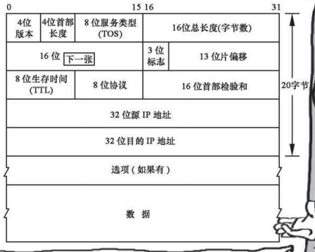
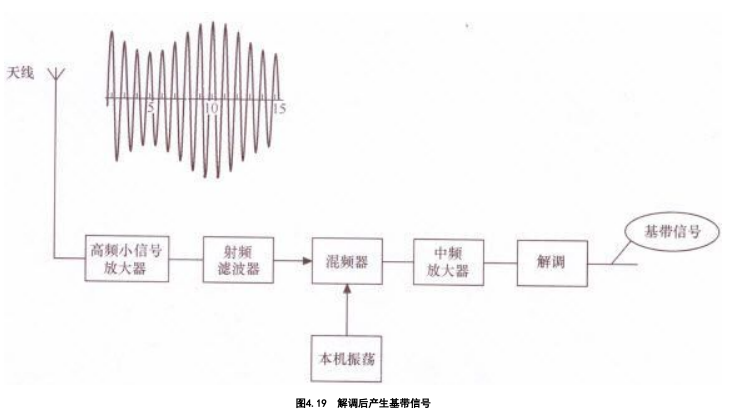
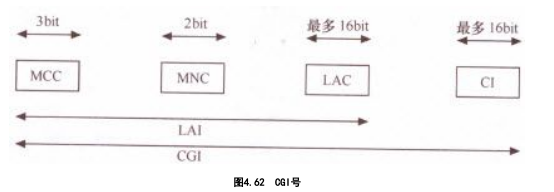

# 通信基础

- DICT:CT（Communication Technology）、IT（Information Technology）到ICT（IT+CT），从ICT再到DICT（ICT+DT，DT：Data Technology）
- 通信：通信技术研究的就是从信息的源头到信息的目的地整个过程的技术问题。
  - 根据接收对象的不同
    - 单播
    - 广播
    - 组播
  - 电信：或称电讯（英语：Telecommunication），是用电磁设备实现的利用有线电、无线电或光传输信息的通信方式。
  - 计算机网络（英语：computer network），通常也简称网络，是指容许节点分享资源的数字电信网络
    - 沟通语言：通信协议
      - 通信协议（英语：Communications Protocol，也称传输协议）：在任何物理介质中允许两个或多个在传输系统中的终端之间传播信息的系统标准，也是指计算机通信或网络设备的共同语言。通信协议定义了通信中的语法学、语义学和同步规则以及可能存在的错误检测与纠正。通信协议在硬件、软件或两者之间皆可实现
- 通信和数学不同。
  - 数学是诠释 大自然普遍规律的基础学科，任何定律，虽然是人发现的，但没有人 感性的成分存在。
  - 通信中的大量协议，是在科学基础上人为定义的，它符合科学规律，能够提高效率，但并非只能是这个范围，当然，在人们定义明确以后，就不 
    能再去随意更改和调整了

- 通信协议都是通过通信标准进行定义和规范
  - 通信标准是各个国家之间、机构之间、企业之间或者国家内部协商确定的。
  - 一些行业自己定义了自己的标准，一般称之为“行业标准”。

## 基础概念

- 信号：通信信道上传输的电编码、电磁编码或光编码叫作信号。信号分为模拟信号和数字信号两类。
  - 脉冲编码调制（英语：Pulse-code modulation，缩写：PCM）是一种模拟信号的数字化方法。PCM将信号的强度依照同样的间距分成数段，然后用独特的数字记号（通常是二进制）来量化。
- 信道：信道是传送信号的通路。信道本身可以是模拟方式的，也可以是数字方式的。用以传输模拟信号的信道叫作模拟信道，用以传输数字信号的信道叫作数字信道。
- 信息
  - 凡是在一种情况下能减少不确定性的任何事物都叫信息。
  - 哲学观点：信息是一种带普遍性的关系属性，是物质存在方式及其运动规律、特点的外在表现。
  - 通信观点：生物体通过感觉器官或具有一定功能的机器通过特定装置同外界交换的内容的总称。
- 数据：它是任何描述物体概念、情况、形势的事实、数字、字母和符号。
  - 数据（data）经由处理后称为信息（information），从这些信息中分析出来的讯息称为知识（knowledge），再通过不断地行动与验证，逐渐形成智慧（wisdom）
- 信息和数据的关系：数据是传递信息的实体，而信息是数据的内容或表达形式。
  - 无法用数据描述的信息是无法传递的，比如至今人类还无法通过电信网传递的气味、直觉等。

- 通信概念模糊的原因
  - 任何时代都不可能忽略过去多年的技术积累和资本投入，去重新设计一套与原有技术毫不相干的革命性技术并付诸实践。
  - 由于电信概念、机理和技术发展太快，专家们来不及仔细考虑某个标准定义可能带来的后果。
  - 相互替代性较强的概念，有的定义比较含糊
  - 通信专家的工作习惯和命名时存在的某些缺陷扩大了概念混淆
- 通信概念发展规律：长期上永恒的技术融合和技术发展，短期上不断产生新的、混淆的概念。

# 发展史

- 时期	
  - 古代通信，人类基于最原始的需求，利用自然界的基本规律和人的基础感官可达性建立通信系统
  - 近、现代通信，从电磁技术引入通信开始，人们尝试使用电话、电报、传真，到成规模地建设各种电信网络和专网网络，并创造 了性能更强、质量更好、效率更高的数字通信、光纤通信。
  - 当代通信，是指在前人基础上创造的移动通信、互联网通信、物联网和融合技术的发展历程。
  - 未来通信，是在目前人类文明和科技发展的基础上，在可以预见和不可预见的未来，更加强大的通信工具变革和更加广阔的通信发展前景。

## 古代通信:信息沟通的起步

- 烽火通信是典型的“存储——转发”模式的、半双工模式的（两个相邻烽火台可以互相传递但不能同时互相传递信息）、广播模式的（传递给所有可看到的地方）、可视模式的 （必须视线可达）、无线模式的（没有连接线）、数字化的（只有两种状态“无”和“有”）通信手段。
- 人类的文明史，就是网络的发展史。

## 近现代通信:电磁通信和数字时代的起步

- 利用电和磁的技术，实现通信目的，被称为“电信”。
  - 近代通信起始的标志，就是开始应用“电信技术”。
  - 电磁技术最早的电信应用，就是电报。电报的原理是人们用长、短音电信号来标识文字或者词汇，相当于给每个字（或字母）做了一个编码，发报员只要按照编码把文字或者词汇翻译并通过专用的发报装置发送出去即可。
- 名词
  - ENIAC电子数值积分计算机（英语：Electronic Numerical Integrator And Computer）
  - STM：同步转移模式（synchronous transfer mode）是指传统的电路传送模式，也就是电路交换模式（CSM）+时分复用传输（TDM）。
  - PSTN：公共交换电话网（Public Switched Telephone Network或简称PSTN）是一种用于全球语音通信的电路交换网络，是目前世界上最大的网络，拥有用户数量大约是8亿。PSTN包括电话线（双绞线），光纤电缆，微波传输链路，蜂窝网络，通信卫星，与海底电话电缆，所有互连通过交换中心包括移动和固定电话，从而允许在世界上的任何电话与任何其他终端通信。最初是固定线路的模拟电话系统的网络，PSTN的核心目前几乎已完全数字化。
  - ISDN：综合业务数字网（Integrated Services Digital Network，ISDN）是一个数字电话网络国际标准，是一种典型的电路交换网络系统。ISDN是一种在数字电话网IDN（该网能够提供端到端的的数字连接）的基础上发展起来的通信网络，ISDN能够支持多种业务（包括电话业务以及非电话业务）。ISDN的最重要特征是能够支持端到端的数字连接，并且可实现传统话音业务和分组数据业务的综合，使数据和话音能够在同一网络中传递。
  - ITU：国际电信联盟（ 英语：International Telecommunication Union，简称 ITU）是一个国际组织，主要负责确立国际无线电和电信的管理制度和标准。它的前身是1865年5月17日在巴黎创立的国际电报联盟，是世界上最悠久的国际组织。

- 在模拟PSTN形态的基础上,形成了综合数字网(IDN)的形态。成就
  - 统一了语音信号数字编码标准;
  - 用数字传输系统代替模拟传输系统;
  - 用数字复用器代替载波机;
  - 用数字电子交换机代替模拟机电交换机;
  - 发明了分组交换机。

## 当代通信:移动通信和互联网时代

- 新技术的探索是随着经济的发展、各种自然基础学科的发展、人们生活方式的改变而不断深入的。
- 许多被看好的技术惨遭淘汰,而很多不被看好的技术却异军突起。

## 未来通信:大融合时代

- 一切皆有可能

# 通信的实现

- 人类最大的缺点就是永不满足,人类最大的优点也是永不满足
- 方式：书信、旗语、电报、电话、手机、计算机。。。

## 电信网中的通讯工具

- 电话机，通信网昔日第一终端：电话机是指“固定电话”，曾经是人类最普遍使用的通信终端，统治全球的通信界近100年的时间。电话机是通过电信号双向传输话音的终端设备。早期电话机的原理为：说话声音为空气里的复合振动，可传输到固体上，通过电脉冲于导电金属上传递。
- 传真，不可或缺的通信配角：传真机将需发送的原件按照规定的顺序，通过光学扫描系统分解成许多微小单元（称为像素），然后将这些微小单元的亮度信息由光电变换器件顺序地转变成电信号，经放大、编码或调制后转化为一种被称为“霍夫曼编码”的数字信号送至信道。接收机将收到的信号放大、解码或解调后，按照与发送机相同的扫描速度和顺序，以记录的形式复制出原件的副本。
- 手机，第一终端：移动电话，又称手提式电话机或手提电话，简称手机，是可以在较大范围内使用的便携式电话。
  - 个人数字助理（英语：personal digital assistant，缩写：PDA），一般是指像手机一样大小，却拥有电脑等级硬件的移动电子设备
- 寻呼
- 电报，逐渐消逝的电波。

## 互联网的通讯工具

- 电子计算机（亦称电脑）是利用数字电子技术，根据一系列指令指示并且自动执行任意算术或逻辑操作串行的设备。通用计算机因有能遵循被称为“程序”的一般操作集的能力而使得它们能够执行极其广泛的任务。

## 专业领域的通信工具

- 对讲机

## 家电中的通信工具

- 电视机
- 智能家电
- 智能穿戴设备

# 通信的原理

- 通信的根本问题是报文的再生，在两个端点上报文应该精确地或者近似地重现
- 问题和解决方法
  - 用什么方式传递给对方？
    - ==编码==问题。研究类似人 类语言学的问题，用什么样的表达方式表述信息，通过什么媒介将表述内容传递到对方（假设已经能够确定找到对方），对方能够接收并接受？
  - 如何找到对方？
    - ==寻址==问题。研究类似门牌号码规划、寻找道路等问题。
  - 有没有信息传递的额外要求，如安全、便捷、节约、多需求的并行处理？
    - ==优化==问题。研究加密、节省成本、提高效率、增强管理、方便运营等问题。

- 编码综述

  - 如何把声音、图像、文字等信息变成电磁信号，如何把一系列的电磁信号有效地传送到对方，又如何在对端还原为声音、图像和文字

  - 任何选择都是适应需求的，“绝对适合”任何场景和需求的选择是不存在的。任何编码都是为了适应不同的传送需求

  - 电磁信号的可复制性和可再生性，差错控制。

- 寻址综述

  - 给任何信息的出发点和目的地做个编号, 通过编号可以识别世界.上任何一个出发点和目的地
    - 如何在一个局部区域分配了地址之后，能够让全网知道该地址所在的位置。

  - 通过相关机制，使信息依照一定的路径在这两者之间传送。
    - 寻址方式
      - 用信令寻址后自动建立专门的通道
      - 在路由器上做好路由策略，让数据包根据这些策略寻找到达目的地的路径
      - 将目的地址在全网做广播宣告，真正的目的地址给出回应
      - 在出发地和目的地之间人工建立一条专门的通道等

  - 无论是电话网、传输网，还是数据网，都各有各的编址方法和寻址方法；
    - 移动通信中的FDMA（频分多址，如TACS、 AMPS）、时分多址（TDMA）、码分多址（CDMA）等技术体制， 都有一整套完善的寻址方式。

- 网络优化综述

  - 人们改造世界的过程：先保证解决基本问题，再思考如何用更好的方法解决问题。
    - 网络优化，就是在基本的通信问题（如连通性、信息还原能力）得以解决后，如何更方便、快捷、安全、经济地规划网络、建设网络、使用网络的问题。

  - 互相通信问题：用什么方式能让许多人都能同时通话而投入的平均成本不会大幅度增加？有没有方法让很多人共用中间的传送线缆。

  - 信息交互方式
    - “面向连接”。建立一条确定的线路然后传送信息
      - 实现：PSTN、帧中继、ATM、MPLS网络
    - “无连接”。让每个信息源发出的信息包“一跳一跳”（Hop-Hop）向下一个网络节点迈进，即采用“存储——转发”模式
      - 实现：传统IP网络

  -  优化的高级阶段：人性化

    - 通信理念发展的进程：前人无，我有->前人有，我优->前人优，我人性化。“人性化”是优化问题的高级阶段。

    - “用户体验”,人性化是一个很难标准化的东西，但却是目前通信领域中最重要的课题之一

## 编码

- 背景
  - 以太的由来：19世纪，科学家们逐步发现光是一种波，而生活中的波大多需要传播介质（如声波的传递需要借助于空气，水波的传播借助于水等）。受经典力学思想影响，于是他们便假想宇宙到处都存在着一种称之为以太的物质，是这种物质作为光的传播中的介质。
  - 网络价值与用户数的平方成正比。网络使用者越多，价值就越大。
    - 网络的价值V =K ×N  ；（K  为价值系数，N  为用户数量。）
  - 编码是通信的基本组成部分，是通信里面的“语文课”
  - 信息用什么信息格式传送到目的地
    - 信息论中的信源编码和信道编码过程
    - 数模、模数转换、抽样、复用解复用
    - 各种数据帧、分组、信元等数据报文的封装格式。

- ==香农公式==：“在被高斯白噪声干扰的信道中，计算最大信息传送速率C 的公式”：C =B log2 （1+S /N ）。
  - B 是信道带宽 （Hz）
    - **信道**、频道或波道，是信号在通信系统中传输的通道，由信号从发射端传输到接收端所经过的传输媒质所构成。
    - **带宽**（英语：Bandwidth）指信号所占据的频带宽度；在被用来描述信道时，带宽是指能够有效通过该信道的信号的最大频带宽度。对于模拟信号而言，带宽又称为频宽，以赫兹（Hz）为单位。对于数字信号而言，带宽是指单位时间内链路能够通过的数据量。为了与模拟带宽进行区分，数字信道的带宽一般直接用波特率或符号率来描述。
  - S 是信号功率（W）
  - N 是噪声功率（W）
    - **噪声**（英语：Noise）在电子学中指，信号在传输过程中会受到一些外在能量所产生信号（如杂散电磁场）的干扰，这些能量即噪声。噪声通常会造成信号的失真。其来源除了来自系统外部，亦有可能由接收系统本身产生。噪声的强度通常都是与信号带宽成正比，所以当信号带宽越宽，噪声的干扰也会越大。
    - **信噪比**（英语：Signal-to-noise ratio，缩写为SNR或S/N），又称訊噪比，用于比较所需信号的强度与背景噪声的强度。其定义为信号功率与噪声功率的比率，以分贝（dB）为单位表示。大于比率1:1（高于0分贝）表示信号多于噪声。
  - 信道容量C 与信道带宽B 成正比，同时还取决于系统信噪比以及编码技术种类。
- 
  - **调制信道**是指信号从调制器的输出端传输到解调器的输入端经过的部分。对于调制和解调的研究者来说，信号在调制信道上经过的传输媒质和变换设备都对信号做出了某种形式的变换，研究者只关心这些变换的输入和输出的关系，并不关心实现这一系列变换的具体物理过程。这一系列变换的输入与输出之间的关系，通常用多端口时变网络作为调制信道的数学模型进行描述。
  - **编码信道**是指数字信号由编码器输出端传输到译码器输入端经过的部分。对于编译码的研究者来说，编码器输出的数字串行经过编码信道上的一系列变换之后，在译码器的输入端成为另一组数字串行，研究者只关心这两组数字串行之间的变换关系，而并不关心这一系列变换发生的具体物理过程，甚至并不关心信号在调制信道上的具体变化。编码器输出的数字串行与到译码器输入的数字串行之间的关系，通常用多端口网络的转移概率作为编码信道的数学模型进行描述。

###声音->模拟信号

- 声音是振动产生的声波，通过介质（气体、固体、液体）传播并能被人或动物听觉器官所感知的波动现象。振幅和频率
- 模拟信号（英语：analog signal）是指在时域上数学形式为连续函数的讯号。
- 贝尔发明的碳粒电话机，是基于振膜对碳粒造成忽紧忽松的压力引起其电阻大小的变化
  - 电流=电压/ 电阻，在电阻变化而电压不变的情况下，电流就会发生线性变化。
  - 忽大忽小的电流，就是电信信号。假设这些信号已经陆续传送到对方的听筒。听筒内有一电磁铁随电流大小而磁性不同，它对埋有金属丝的薄膜时吸时 
    放，薄膜便发出了像人说话一样的声音。
- 转换方式
  - 以信号的原始频率（或称为“基带频率”）表示或以另一种频率表示。
  - 电话网络可以将我们的信号与另一更高频率的信号（称为“载波”）结合，然后在不同的频率上传输这些合成的信号。
    - **载波**（carrier wave）是指被调制以传输信号的波形，一般为正弦波。一般要求正弦载波的频率远远高于调制信号的带宽，否则会发生混叠，使传输信号失真。
    - **调制**（英语：modulation）是一种将**一个或多个周期性**的载波混入想传送之信号的技术，常用于无线电波的传播与通信、利用电话线的数据通信等各方面。依调制信号的不同，可区分为数位调制及类比调制，这些不同的调制，是以不同的方法，将信号和载波合成的技术。调制的逆过程叫做“解调”，用以解出原始的信号。
    - 在模拟调制中，表示数据的模拟信号被转换成另一模拟信号，后者就是“已调载波”。

### 模数/数模转换( A/D和D/A )、PCM和线路编码

- 背景
  - 模拟信号在传输过程中，由于受到外界干扰，总能量会损失惨重，信号本身也会发生畸变和衰减。
- 如果模拟信号以规则的时间间隔抽样，且抽样速率是模拟信号中最高频率的两倍，那么所得样本是原始信号的精确表示。
  - **滤波器**：由电容、电感和电阻组成的滤波电路。滤波器可以对电源线中特定频率的频点或该频点以外的频率进行有效滤除，得到一个特定频率的电源信号，或消除一个特定频率后的电源信号。
  - 人类语音产生的频率的正常范围是300～ 3400Hz。分配4000Hz的信道，当模拟语音信号转换为数字形式时，要保证每秒8000次抽样。
  - 脉冲信号变成数字信号的过程中的关键步骤：量值“阶梯量化”，因为数字信号要求脉冲幅度只能取有限个数值。
  - 把每次抽样的幅度按照256个阶梯排列，每个排列都是一个8位的二进制数。8000×8=64000，也就是64kbit。将64kbit/s称为一路语音信号的带 
    宽需求量。这种量化的方式被称为==脉冲编码调制==（PCM，Pulse Code Modulation）。
    - 脉冲编码信号是一种类比信号(模拟信号)的数位化方法。PCM将信号的强度依照同样的间距分成数段，然后用独特的数位记号（通常是二进位）来量化。
  - 信道编码：将数字信息转换为可以在线路上传送的数字信号的过程。
    - 曼彻斯特编码（Manchester coding），又称自同步码、相位编码（phase encoding，PE），能够用信号的变化来保持发送设备和接收设备之间的同步。它用电压的变化来分辨0和1，从高电平到低电平的跳变代表1，而从低电平到高电平的跳变代表0
    - 差分曼彻斯特编码在每个时钟周期的中间都有一次电平跳变，这个跳变做同步之用。 在每个时钟周期的起始处：跳变则说明该比特是0，不跳变则说明该比特是1。
    - 不归零编码 (non-return-to-zero line code, NRZ) ：信号电平的一次反转代表1，电平不变化表示0，并且在表示完一个码元后，电压不需回到0
    - 原因：要考虑误码率最低、传送准确率最高、最易于差错恢复，需要遵从电流在导线中传导的物理规律。这就造成不同的技术体制采用的信道编码方式会有一定的差异。

### 复用与解复用

- 方式
  - 时分多路复用（Time-Division Multiplexing，TDM）是一种数字或者模拟（较罕见）的多路复用技术。两个以上的信号或数据流同时在一条通信线路上传输，时间域被分成周期循环的一些小段，每段时间长度是固定的，每个时段用来传输一个子信道。
    - Timeslot（时隙）专用于某一个单个通道的时隙信息的串行自复用的一个部分，通常指PCM E1和T1信号中的一个话音信道（64kbps）。是时分复用模式（TDM）中的一个时间片。
  - 频分多路复用（Frequency-division multiplexing，FDM），也叫分频多任务，是一种将多路基带信号调制到不同频率载波上再进行叠加形成一个复合信号的多路复用技术。
  - 波分复用（Wavelength Division Multiplexing，WDM）是利用多个激光器在单条光纤上同时发送多束不同波长激光的技术。每个信号经过数据（文本、语音、视频等）调制后都在它独有的色带内传输。
- “同步”：在若干个语音64kbit/s的信息流汇聚到一起时，必须步调一致，就像一个大型乐队，需要步调一致才能奏出美妙的音乐。

### 波特率和比特率

- 波特率是指载波调制状态以多进制数表示时单位时间内信号状态的改变次数。当采用二进制时，即为比特率。

### 数据技术的数据格式

- 技术体制采用不同的编码格式原因
  - 道路的特征：比如单行道和双向车道是不一样的，车道宽窄是不一样的，水运和空运是不一样的，道路不同，选用容器的类型也不完全相同。
  - 货物的特征：运送不同类型的货物，选用容器的类型也会相同。
  - 货物本身的运送要求：时间要求、安全性要求、完整性要求等，都会对选用容器的类型带来影响。
- 技术本身的特性和所承担的业务类型，决定了其编码格式。编码格式也决定了这种技术本身的特性和适用的业务类型。
- 在数据通信中，各种技术体制都有自己对数据格式的严格定义， 而每种技术体制的数据格式名称各不相同，加上翻译方法上的差别， 造成名称不像数据格式的定义那样统一。
  - IP的数据格式，有的人称为“IP数据包”（IP Packet），有的人称为“IP数据报”（IP Datagram）；
  - 以太网的数据格式，有的人称为“以 太网数据报”（Ethernet Datagram），有的人称为“以太网帧”（Ethernet Frame）；
  - 最统一的叫法，是帧中继中的“帧”和ATM技术中的“信元”（Cell）。
  - 一般来说，“数据报”是比较通用的说法，不限定在任何层，也不限定任何技术；而“帧”一般指数据链路层的数据报；“数据包”一般指网络层的数据报。

#### 以太网帧

- 逻辑上，以太网使用总线型拓扑和载波侦听多路访问——冲突检测（CSMA/CD，Carrier Sense Multiple Access/Collision Detect）的总线争用技术。
- 以太网采用总线型结构，一根主线贯穿始末，其他的线只是主线的分叉，每台主机都通过网线连接到“总线”上
  - 状态切换
    1. 开始：如果线路空闲，则启动传输，否则转到第4步
    2. 发送：如果检测到冲突，继续发送数据直到达到最小报文时间（保证所有其他转发器或终端检测到冲突），再转到第4步。
    3. 成功传输：向更高层的网络协议报告发送成功，退出传 输模式。
    4. 线路忙：等待，直到线路空闲。
    5. 线路进入空闲状态：等待一个随机的时间，转到第1步，除非超过最大尝试次数。
    6. 超过最大尝试传输次数：向更高层的网络协议报告发送失败，退出传输模式。
  - 问题：以太网上的任何节点都可以选择是否监听线路上传输的所有信息
  - 以太网帧：
    - 循环冗余校验（Cyclic redundancy check，CRC）：是一种根据网络数据包或电脑文件等数据产生简短固定位数校验码的一种散列函数，主要用来检测或校验数据传输或者保存后可能出现的错误。生成的数字在传输或者存储之前计算出来并且附加到数据后面，然后接收方进行检验确定数据是否发生变化。
    - 前导码和帧开始符：采用0和1交替出现的7个字节的前导码和1个字节的帧开始符作为帧的开始
    - 以太网帧的长度是64~1518字节。

#### IP数据包格式

- 
  - 版本号：版本号类型为IPv4和IPv6。
  - 首部长度：这是指IP包头的长度。IPv4以32 位（4字节）为一个单位，从“首部长度”4位的情况看，IP包头最大也就64字节，512位。
  - TOS：标识传送优先级。在具有QoS保障的IP网络，比如MPLS里，TOS的意义才真正体现出来。这个字段由现在不再使用的3个优先权位、4个TOS位和1个必须为0的未用位组成。4个TOS位是：最小延迟、最大吞吐量、最高可靠性和最小费用。这4位只能有1位为1
  - 字节总长度：这是整个IP包的总长度指示，以字节为单位。用这个字段和包头长度做减法，可以得出IP包中 
    数据部分的起始地址和长度。最大尺寸是2的16次方，即65536字节。	
  - 标识：第几个包
  - 片偏移：在最早那个数据包中的位置。标识和片偏移配合使用，才能使分段和重组工作正常进行。
  - 存活時間（Time To Live）：能跨越多少台路由器
  - 协议：携带的信息是属于哪类服务协议。1是ICMP，2是 IGMP，6表示TCP，17表示UDP。
  - 头检验：包头检验值。仅在包头范围进行计算，不涉及包头后面的任何数据。校验的目的只有一个：判断IP包头是否被正确传输。
  - 选项：是该数据包可选信息的可变长列表。
  - 数据：这是IP数据包携带的真实的数据信息。IP数据包其他所有字段，都是为了传送本字段而设立的。

#### 帧中继帧格式

- 特点：用户信息以帧（frame）为单位进行传送，网络在传送过程中对帧结构、传送差错等情况进行检查，对出错帧直接予以丢弃，同时，通过对帧中地址段DLCI的识别，实现用户信息的统计复用。

#### ATM信元

- 异步传输模式（ATM Asynchronous Transfer Mode）、同步传输模式（STM Synchronous Transfer Mode）
- 通信网上的传递方式可分为同步传递方式（STM）和异步传递方式（ATM）两种。
  - STM：在由N 路原始信号复合成的时分复用信号中，各路原始信号都是按一定时间间隔周期性出现。PCM编码格式属于STM
  - ATM：各路原始信号不一定按照一定的时间间隔周期性地出现，因而需要另外附加一个标志来表明某一段信息属于哪一段原始信号。
- ATM的工作原理是：每个分组作为一个单元独立传输，分组之间的传输间隔为任意时间。
  - 信元的开始：ATM的信元头中藏有相关信息，可以识别信元处在哪个位置。这个隐藏的信息就是HEC。
  - 信元的逻辑链路归属：ATM信元头中的VPI/VCI值，就是链路标识符，通过这两个值的搭配使用，系统就能很容易识别这个信元属于哪条逻辑链路

#### SDH与SONET

- 同步数字体系（SDH）与同步数字光纤网（SONET）是国际电信传输的两大标准体系，它们统一了世界上原有的数字传输系列，实现了数字传输体制上的国际标准及多厂家设备的横向兼容，比准同步数字体系（PDH）有更多的优势。
  - 语音、数字数据网（DDN）、帧中继、以太网、IP、ATM都可以承载在SDH/SONET 上。

### 图像和视频编码

- 通信中提到的图像和视频，有一个专用的英文词叫作Videograph，研究的核心问题是如何实时地传送它们。
  - 实时性要求
  - 清晰度
  - 音画同步
- 大规模应用的基础：国际音视频编解码标准
  - ISO制定的MPEG系列标准
  - ITU针对多媒体通信制定的H.26X系列视频编码标准和 G.7系列音频编码标准。
- H.265目的：在有限带宽下传输更高的网络视频，仅需原先的一半带宽，就可以播放相同质量的视频
- 第二代“信源编码”标准AVS：“信源”是信息的“源头”，信源编码技术解决的重点问题是数字音视频海量数据（初始数据、信源）的编码压缩问题，故也称“数字音视频编解码技术”。

## 寻址

- 交换机类别
  - 步进制自动交换机
    - 程控交换机
- 通信方向：两个网络节点设备之间的数据流方向，并不是指管线本身的数据流方向
  - 单工（Simplex）：数据只能在一个方向上流动，如传统的电视信号传送。
  - 半双工（Half-Duplex）：可切换方向的单工通信，从某一时刻看，是单工的；从总体看，又是双工的，如行业使用的对讲机。
  - 全双工（Full-Duplex）：通信允许数据在两个方向上同时传输，它在能力上相当于两个单工通信方式的结合，如我们的电话、互 
    联网、交互式视频通信等。
- 在任何一个通信网络上，每个节点都需要有规范的、可查询的地址标识。
- 不同的网络，地址标识的设置方式不同。
- 有了地址，还要有找到地址的方法。而同类的网络节点，寻址的方式、方法以及规则必须相同或者类似
  - 路由表（routing table）或称路由择域信息库（RIB, Routing Information Base），是一个存储在路由器或者联网计算机中的电子表格（文件）或类数据库。
    - 路由表存储着指向特定网络地址的路径（在有些情况下，还记录有路径的路由度量值）。
    - 路由表中含有网络周边的拓扑信息。
    - 路由表建立的主要目标是为了实现路由协议和静态路由选择。

### 电路交换网寻址

- 电话交换网的地址编号就是我们熟悉的电话号码。电话号码在全球都有统一的规范。
  - 原则
    - 电话交换网上的电话号码（地址）必须统一分配
    - 任何电话交换机都必须了解这一分配规则
    - 电话交换机将无条件执行人赋予它的功能
    - 电话交换网上的终端才分配号码，交换机本身并不分配电话号码
  - 分配
    - 给每个国家分配一个唯一标识的国家代码,比如中国是86,美国1
    - 中国大陸手机号码以1开头（未来预留92和98开头），共11位数，前7位数字通常称为手机号段，可用于区分运营商和归属地，其作用类似于固定电话区号，但并不能相互对应。 示例：1XX-YYYY-ZZZZ
      - 第1~3位数表示电信运营商（1XX）；
      - 第4~7位数表示地区号码，即归属地（YYYY）；
      - 第8~11位数表示客户号码（ZZZZ）。

### 以太网内的寻址

- MAC地址（英语：Media Access Control Address），直译为媒体存取控制位址，也称为局域网地址（LAN Address），MAC位址，以太网地址（Ethernet Address）或物理地址（Physical Address），它是一个用来确认网络设备位置的位址。
- 工作方式：初始节点是根据目标节点的地址 ，将目标节点的IP地址映射到中间节点的MAC地址，找到第一个中间节点。从第一个中间节点出发，根据目标节点的IP地址映射到第二个中间节点的MAC地址，从而找到第二个中间节点……，以此类推，直到当找到最后一个中间节点后，从最后一个中间节点出发，根据目标节点的地址映射到目的节点的MAC地址，从而将数据包传送给目标主机。
  - 不断地将目标节点的地址映射到一个个中间节点的MAC地址，再从一个个中间节点出发，直到找到最终的目标节点
  - MAC地址和IP地址的映射关系，被每台主机不断更新并保存，就成了“地址映射表”。

### IP网的寻址

- 全球唯一的IP网地址管理机构，互联网名称和数字地址分配机构（ICANN）负责负 IP地址的空间分配、协议标识符的指派、通用顶级域名（gTLD）以 及国家和地区顶级域名（ccTLD）系统以及根服务器系统的管理
- IP网络中，所有的终端都应该有IP地址，而网络上的路由器和带路由功能的交换机，一般情况下每个路由接口也都应分配IP地址
- 组成
  - “主机地址”
  - “子网掩码”，用来标识该IP地址所在的子网（大部分是局域网）网段有多大。
- 分类
  - A类、B类和C类是最常用的单播IP地址，D类地址用于组播，E类地址被保留用于扩展和实验开发与研究。
  - 特殊功能地址
    - 0.0.0.0/0，未知网络，通常默认保留，常用于代表“缺省网络”，在路由器表中用于描述“缺省路径”。缺省路径的意思是享有最低优先级，在没有特别定义的情况下，IP数据包会按照该地址所定义的路由表项进行转发。
    - 127.0.0.0/8，表示回环地址和本地软件回送测试之用，保留而不分配。
    - 255.255.255.255/32，有限广播地址。
    - 私有IP地址：
      - 这3个IP地址段不会被互联网的公用服务器使用，而是在局域网中使用。

- **域名系统**（英语：Domain Name System，缩写：DNS）是互联网的一项服务。它作为将域名和IP地址相互映射的一个分布式数据库，能够使人更方便地访问互联网。DNS使用TCP和UDP端口53[1]。当前，对于每一级域名长度的限制是63个字符，域名总长度则不能超过253个字符。

#### IP路由

- IP路由的技术原理，就是将任何一个IP数据包的目的IP地址取出，与路由表对照，定位出口在哪里，并将IP数据包输送到该出口上去。当然，如果该输出端口为帧中继端口，那么IP数据包必须按照相关规范封装成特定DLCI值的帧中继帧格式，从该端口传送出去。
- 在PSTN里，每台交换机都存储着一张路由表，这张表，是人为输入的。整个PSTN是一个完全可管理的、可控制的、分层的网络。
- IP路由协议就是路由表获取和建立的机制
  - IP路由协议，如RIP2、OSPF、IS-IS和BGP
- 某主机发送同一数据包到多台主机（一次的、同时的），叫作“组播”。组播可以在一个局域网范围，也可以扩展到整个IP世界。
  - 组播能使一个或多个组播源把数据包只发送给特定的组播组。只有加入该组播组的主机才能接收到数据包，并不影响组播组之外的其他终端。
  - 组播组的地址：5类IP地址中的D类地址。这类地址的范围是224.0.0.0～239.255.255.255，它们又被划分为局部链接组播地址、预留组播地址、管理权限组播地址3类。
    - 局部链接组播地址是为路由协议和其他用途保留的地址，范围是224.0.0.0～224.0.0.255，只有256个地址，路由器并不转发属于这个范围的IP包。
    - 预留组播地址为224.0.1.0～238.255.255.255，可用于全球范围的网 
    - 管理权限组播地址是剩下的239.0.0.0～239.255.255.255，可供组织内部使用，类似于私有IP地址，不能用于互联网，可限制组播范围。
- 一台主机发送同一数据包到**子网**内所有主机，叫作“广播”

## 优化

- 拓扑学：拓扑学（英语：Topology）也可写成拓朴学，或意译为位相几何学，是一门研究拓扑空间的学科，主要研究空间内，在连续变化下维持不变的性质。在拓扑学里，重要的拓扑性质包括连通性与紧致性。
- “优化”隐藏在通信领域的每个细节中，是对诸多技术体制、诸多工程实践的高度浓缩，它无孔不入、无处不在、见缝插针，又由表及里、由外至内、由浅至深。
  - 融入编码、复用、寻址、交换、传输、信令、安全、调度、开发、建设、运维等各个环节中去
    - 网络节点、网络拓扑、拥塞控制、网络安全
    - 内容分发网络（CDN）、VPN技术、P2P、边缘计算、雾计算、负载均衡
    - SDH网的自动倒换技术
- 而“优化”又是相对的，新的代替旧的，先进的代替落后的，哪怕同一种技术体制内，也会出现越来越频繁的技术迭代
- 数据网络互连和安全
  - 多协议标签交换（Multi-Protocol Label Switching，MPLS）是一种在开放的通信网上利用标签引导数据高速、高效传输的新技术。多协议的含义是指MPLS不但可以支持多种网络层层面上的协议，还可以兼容第二层的多种数据链路层技术。
  - 软件定义网络（Software Defined Network，SDN）是一种新型网络创新架构，是网络虚拟化的一种实现方式。其核心技术OpenFlow通过将网络设备的控制面与数据面分离开来，从而实现了网络流量的灵活控制，使网络变得更加智能，为核心网络及应用的创新提供了良好的平台。
    - SD-WAN（软件定义广域网）：SD-WAN(软件定义广域网)产品，是利用SDN(软件定义网络)的技术，通过将网络硬件与其控制平面分离，简化WAN的部署与管理，同时结合了广域网优化、基于应用的智能选路、私有的安全加密隧道、端到端的QoS和全球骨干网等技术，为企业构建高速安全、稳定可靠的广域网，同时大幅降低部署和运维成本，并可基于业务视角来快速构建企业网络。
- 节能与综合利用是通信行业的一个综合优化领域，是关系国计民生的重要课题，也是通信网络优化最严肃、最迫切的课题之一。

### 通信分层结构

- 作用
  - 每层的职责范围明确定义
  - 明确层之间的关系
  - 明确对等层之间的关系
- 要求
  - 要分出若干层次，管理上类似的功能要放在同一层，在实现技术经常变化的地方增加层次，每个层次有自己的职责；
  - 要明确每个层次与上下层的关系，层次之间的边界要合理，使层次间的信息流量尽量最小；
  - 要明确每个层面与其对等层面的关系。
- 设计：ISO/OSI（International Organization for Standardization/Open Systems Interconnection）
  - 层次
    - 物理层：物理层解决最基础的传送通道问题，涉及建立、维护和释放物理链路所需的机械的、电气的/光学的、功能的和规程的特性等
    - 数据链路层：在物理层提供的按“位（bit）”服务的基础上，在相邻的网络节点之间提供简单的、以帧为单位传输的数据，同时它还强调数据链路不要拥堵，减少出错，出错了要想办法弥补。
    - 网络层：在数据链路层的“帧”的服务上，网络层所干的工作，就是进行路由选择、拥塞控制和网络互连。
    - 传输层：在网络层的“数据包”的服务上，传输层的任务是向用户提供可靠的、透明的端到端的数据传输， 以及差错控制和流量控制机制。
      - 面向连接：在一次通信过程中，信令在需要通信的双方或者多方之间呼叫， 利用网络资源建立起一条通道，并在这条通道上传递信号，在通信结束后关闭这一通道，这就是面向连接。
      - 面向非连接：在一次数据传送过程中，数据包逐节点传递，在每个网络节点上，根据数据包中的目的地址，借助于网络节点的路由信息，选择通往下一个节点的通道。
    - 会话层：在不同的机器之间提供会话进程的通信，如建立、管理和拆除会话进程。会话层还提供了许多增值服务，如交互式对话管理、允许一路交 
      互、两路交换和两路同时会话；管理用户登录远程系统；在两机器之间传输文件，进行同步控制等。
    - 表示层：表示层就是处理通信进程之间交换数据的表示方法，包括语法转换、数据格式的转换、加密与解密、压缩与解压缩等。
    - 应用层：应用层负责管理应用程序之间的通信。应用层为用户提供最直接的服务，包括虚拟终端、文件传输、事务处理、网络管理等。
- TCP连接的建立
  - 第一次握手：建立连接时，客户端发送SYN包到服务器，并进入SYN_SEND（已经发送SYN）状态，等待服务器确认。
  - 第二次握手：服务器收到SYN包，必须确认客户的SYN，同时自己也发送一个SYN包，即SYN+ACK包，此时服务器进入SYN_RECV（已经接收到SYN）状态。
  - 第三次握手：客户端收到服务器的SYN＋ACK包，向服务器发送确认包ACK，这个包发送完毕，客户端和服务器进入ESTABLISHED（已经建立）状态，完成3次握手。之后，客户端与服务器开始传送数据。
- TCP连接的断开
  1. 客户端调用 close() 函数后，向服务器发送 FIN 数据包，进入FIN_WAIT_1状态。FIN 是 Finish 的缩写，表示完成任务需要断开连接。
  2. 
     1. 服务器收到数据包后，检测到设置了 FIN 标志位，知道要断开连接，于是向客户端发送“确认包”，进入CLOSE_WAIT状态。
        - 注意：服务器收到请求后并不是立即断开连接，而是先向客户端发送“确认包”，告诉它我知道了，我需要准备一下才能断开连接。
     2. 客户端收到“确认包”后进入FIN_WAIT_2状态，等待服务器准备完毕后再次发送数据包。
  3. 等待片刻后，服务器准备完毕，可以断开连接，于是再主动向客户端发送 FIN 包，告诉它我准备好了，断开连接吧。然后进入LAST_ACK状态。
  4. 客户端收到服务器的 FIN 包后，再向服务器发送 ACK 包，告诉它你断开连接吧。然后进入TIME_WAIT状态。
     - 服务器收到客户端的 ACK 包后，就断开连接，关闭套接字，进入CLOSED状态。

### 复用技术

- 确定复用
  - 在一次呼叫过程中
    - 同时建立两个方向的连接;
    - 每个方向只涉及一条电路;
    - 使用一一个电路的一部分 确定容量;
    - 在整个呼叫过程中始终专用这部分容量
  - 来源于电话网
  - 技术：FDM、PDH、SDH、 MSTP、WDM
- 统计复用
  - 在多次呼叫过程中
    - 一次呼叫只建立一个方向的连接;
    - 随机使用一个方向的所有电路;
    - 数据包竞争使用一条电路的全部容量;
    - 整个呼叫过程中，断续使用随机电路
  - 每条业务连接通过各自的标识号来进行区分，各个业务连接根据自身需要来争抢资源，系统会定义争抢的优先级以及拥塞时的抛弃优先级
  - 技术：PSPDN（X.25）、 帧中继、点对点协议（PPP，Point-to-Point Protocol）、ATM、以太网、IP网、IPRAN、PTN。
    - PPP是高级数据链路控制（HDLC）协议族的一般报文格式。它是为两个对等实体间传送数据包建立简单链接而设计的全双工操作。

### 网络拓扑

- 根据每种网络所提供服务的不同，可以采用合适的拓扑结构。在节约投资的基本要求下，合理的拓扑结构会帮助尽可能多的用户从尽可能近的地方、尽可能快地获取尽可能丰富的信息。
- 传统的电信网，都会分为核心层、汇聚层和接入层。在上述每个层次中，它们的“布阵方法”又千差万别。如总线型、星形、网状、环状、树形、双子星形等
  - 每一种类型都不能用“好”和“不好”来评价，而只能以“合理”和“不合理”来衡量。

###机理分类

- 寻址技术和网元设备分类方法
  - 按可用资源分类
  - 按应用场合分类
  - 按实现技术分类或者按实现技术机理分类。
    - 连接操作寻址技术
      - 实现：语音交换网PSTN和多协议标签交换MPLS网
    - 无连接操作寻址技术
      - 实现：传统路由器和交换机组成的IP网络
    - 与复用技术相比，有连接和无连接从另外一个角度节省了通信网络的资源， 提高了网络的综合利用率，提高了通信网络的传输和交换效率，并让通信网更加可用、易用。

### 传输损耗

- 损耗类型
  - 误码（Error）：接收与发送数字信号之间的单个数字的差异。如把0变成了1，1变成了0。
  - 抖动（Jitter）：数字信号的各有效瞬间相对于其理想时间位置的短时的、非累积性的偏移。如信号的个别迟到随即又恢复的现象。
  - 漂移（Wander）：数字信号的各有效瞬间相对于其理想时间位置的长期偏移。就好比每天晚来一点点，并得寸进尺，来得越来越晚。
  - 滑动（Slip）：数字信号连续数字位置不可恢复地丢失或增加。 如因时间不一致而造成的“无中生有”或者“丢三落四”
  - 时延（Delay）：数字信号的各有效瞬间相对于其理想时间位置的推迟，就是信号的整体“迟到”。
  - 时延抖动（Delay Variation）：数字信号的各有效瞬间相对于其理想时间位置的推迟变化幅度，也就是信号“迟到”时间长度的变化区间。
  - 分组（信元）丢失（Packet Loss&Cell Loss）：数据分组或数据信元不可恢复的丢失，就是连续的信号段的完全丢失。
- 无论是数据网还是语音网，都对传输损耗参数制定规范，并提出损耗类型的最大可接受值。
- 传输损耗是永远存在的。只能通过优化，尽力减小其对业务的影响。百分之百去除任何一种损耗，不现实。
- 解决办法：通信技术的综合发展，如传输介质、编码格式、校验技术、同步技术等的发展。

### 网络安全

- 大部分对“网络安全”的定义，基本都是针对计算机网络而言的，其实质内容多数是指计算机系统安全。
  - 最可能发生危险的地方才有对“安全”的讨论，基本不可能发生危险的地方，人们是不会去考虑安全问题的。
- 含义
  - 信息安全：信息内容的保密性
    - 通信和密码的结合->计算机系统安全->网络的边界保护
  - 网络通道的安全：通信“管道”（信道）本身的安全性
    - 广电网的典型网络安全问题是电视插播问题
    - PSTN和移动通信网的典型网络安全问题：电话骚扰；垃圾短信；通信诈骗等
    - 互联网的网络安全问题：数据包目的地地址容易被发现；IP源地址很容易修改伪造等
    - 无线网络的典型网络安全问题：黑客截取电波信号并解调数据；干扰阻断通信形成拒绝服务攻击等
- 信息系统(互联网)由信息基础设施（基础架构）和信息业务系统（内容）组成；信息基础设施由电信网络和计算机系统组成。互联网是一种电信网络。
- 安全服务
  - 访问控制服务：防止未授权使用系统资源，或者当网络资源已经饱和，防止新的呼叫进入，如连接接纳控制（CAC，Call Access Control）机制。PSTN、 ATM、MPLS网络都有相应的CAC机制。
  - 鉴别服务：防止假冒伪劣，盗用其他用户的身份，包括IP地址、MAC地址、无线频率等占用网络资源
  - 数据完整性服务：防止数据非法修改、插入、删除、中断，如黑客被商家雇用攻击竞争对手的网站这样的行为。
  - 数据保密性服务：防止泄密、信息流量分布，对保密性信息必须进行数据加密。
  - 抗抵赖性服务：防止抵赖，应尽可能做到可以追溯历史数据
  - 木马检测服务

### 数据加密

- 方面
  - 数据本身的加密
  - 数据传输的加密

### 压缩技术

- 目的
  - 节约存储空间、节省线路带宽、节省传送时间
  - 资源有限不得不压缩。
- 压缩造成的失真，如果用户能够接受，这种压缩就是成功的；如果用户不感知，这种压缩就是非常成功的
- 语音压缩技术ADPCM，中文翻译为“差分自适应PCM”。是一种采用平均值的方法来压缩语音编码的技术，采用差值替代绝对值。比如要传送一组较大的数字，只需传送其中一个数字和其他数字与它的差值即可。

### 通信服务质量

- 服务质量（QoS，Quality of Service）是指决定用户满足程度的业务性能的综合效果
  - 研究通信的QoS问题，并不只是研究如何提高QoS，而是研究如何用最低的代价、最少的投入，让通信网满足更多的业务QoS的需求。
- 国际电信联盟电信标准化部门(ITU Telecommunication Standardization Sector,ITU-T)提出了一套严肃、规范、难以理解的描述服务质量的参量
  - 业务保障性能：电信主管部门提供业务，并且在使用过程中提供支持的能力。
  - 业务适用性能：通信网络保证业务能够支持用户成功而且方便操作的能力。
  - 服务能力性能：通信网络保障用户请求提供业务和在请求过程中继续提供服务的能力。
  - 业务完善性能：电信网络保证业务建立之后传输损伤不能超过限定范围的能力。

### 应用

- SDH的线路保护：对于受重点保护的线路，从发送端到接收端可以理解为沿着光纤环路两个方向都有线路可以达到，当主用线路发生故障时，系统将自动切换到备用线路上去，并且切换时间要求控制在50ms以内，从而保证业务的连续性。
- 异步传输模式（ATM Asynchronous Transfer Mode）和IP：ATM技术复杂得让人窒息，从而使其开放性和灵活性远远落后于IP技术。而IP技术吸收了ATM中的优秀成分
- 多协议标签交换（Multi-Protocol Label Switching）：MPLS将IP数据包根据其业务类型打上不同的“标签”，每种标签标识不同的传送优先级。
  - 优势
    - QoS：MPLS可以给每种数据包打标签，标签可用于标识传送优先级
    - VPN：MPLS可以组成VPN。打上标签的数据包只会沿着特定路径传送，这就给公网上运行企业专用线路提供了技术基础。
    - 流量工程：MPLS可以根据网络的瞬时状态进行路径选择
  - 服务质量
    - IntServ集成服务：任何一个信息流都有一次资源预留的操作，将严重消耗系统资源
      - 资源预留协议（Resource Reservation Protocol，简称RSVP）：RSVP要求接收者在连接建立之初进行资源预留，它必须支持单播和多播数据流
    - DiffServ区分服务
      - 运营商在与客户签署的服务等级协议（SLA,Service Level Agreement）或流量调解协议中明确定义服务等级， DiffServ将根据不同的服务等级设置不同的ToS值
- 流媒体业务
  - 接收网络信息到本地方式
    - 下载：需要比较大的存储容量、需要完整下载、版权问题
    - 流：不需要较大的存储容量、“边看边下”、版权保护
- TCP加速技术
  - 双边TCP优化：TCP连接的两端部署硬件设备或安装软件，TCP透明代理工作在TCP连接的两端，两个代理之间通常通过UDP或其他自定义协议进行工作。
  - 单边TCP优化：只在TCP的一端部署软件或设备，一个基本要求就是经过透明代理出去的协议必须是TCP。单边TCP加速的透明代理，在广域网一侧运行的应该是一个与标准TCP兼容，同时性能提高的TCP。绝大多数的单边TCP加速，都通过改进TCP的拥塞控制算法来进行TCP加速。单边比多边适应性更广且更灵活
- TCP BBR加速
  - BBR（Bottleneck Bandwidth and Round-trip propagation time）：以往大部分拥塞算法是基于丢包来作为降低传输速率的信号，而BBR则基于模型主动探测。该算法使用网络最近出站数据分组当时的最大带宽和往返时间来建立网络的显式模型。数据包传输的每个累积或选择性确认用于生成记录在数据包传输过程和确认返回期间的时间内所传送数据量的采样率。

- p2p、p4p
  - p2p是去中心化、依靠用户群（peers）交换信息的互联网体系。对等网络的每个用户端既是一个节点，也有服务器的功能，任何一个节点无法直接找到其他节点，必须依靠其户群进行信息交流。

# 通信网络框架

- 通信之美：错综复杂的逻辑关系、构思巧妙的设计理念、严丝合缝的理论推演、千变万化的表现形式
- 对每个类型的通信网络的研究重点进行提纲性分析
  - 目的：在不同业务种类的通信网技术之间进行比较，区分各种技术之间的关联。区分各个概念所属的范畴
- 分类本身的价值如果无法体现，反倒会引起更大的困惑

## 传送网：一切的基础

- 传送网是电信网的基础网络，专门用于多种业务的传送保障，使每个业务网的不同节点之间、不同业务网之间互相连接在一起，形成四通八达的业务网络。

- 研究重点：传送网的容量、安全性、容错能力、成本及其适用范围。

- 定位：它一般处于交换网、数据网、移动网和支撑网之下，是用来提供信号传送和转换的基础架构。
- 这一行业的从业人员往往管这个领域叫“传输专业”。

## 语音网

- 语音网为用户提供相互之间的语音通信，包括固定网（PSTN）和移动网（PLMN）的语音通信，它往往被称为“交换网”。

- 介质实体：程控交换机、移动基站、接入网设备、软交换、NGN、IMS，当然也包括电话机、传真机、手机、SIM卡等。

- 技术：有A/D和D/A转换、交换原理、电话号码管理、 传真技术、语音压缩技术等。

- 定位：PSTN是最成熟的电信网，和数据网的结合越来越紧密。随着NGN(Next Generation Network)/IMS技术的发展，PSTN被逐步替代。

- “交换专业”。

## 数据网

- 数据网是用来传送数据信息的，包括互联网数据、DDN、帧中继、VPN、视频业务等，随着业务的不断融合，语音也作为数据业务传送，典型的案例是4G网络的语音就全部采用VoLTE。
- 介质实体：路由器、交换机、防火墙、服务器、视频终端、MCU、音视频编码等。
- 技术：帧中继技术、ATM技术、 TCP/IP、路由协议、MPLS、P2P（P4P）、CDN、流媒体、未来数据网络（FDN）等。
- 定位：数据网技术体制多样，应用广泛，以TCP/IP为基础的数据网成为电信网的基础承载网络。
- “数据专业”。

## 支撑网

- 支撑网是现代电信网运行的支撑系统。一个完整的电信网除了有以传递电信业务为主的业务网之外，还需有若干个用来保障业务网正常运行、增强网络功能、加强网络控制和管理能力、提高网络服务质量的支撑网络。
- 范围：支撑网中传递相应的监测和控制信号。支撑网包括同步系统、公共信道信令网、传输监控系统、计费、认证和营账系统以及网络管理系统等，其并非业务开通必需的系统，但没有它们，电信网就不能称之为电信网；
- 作用：传统增值服务、管理、运维、营账、计费、监控等
- “支撑专业”。

## 综合网

- 背景：通信网中的新鲜事物，大都具备“不遵守规则”的特征。可能跨度几种网络， 综合几种技术体制的优势和特点，给通信学界带来新的热点，但是， 却难以分类。
- MSTP，将以太网技术、IP技术和SDH技术结合在一起，能够解决城域网中IP传送的安全问题
- NGN和移动网的IMS只是一种网络架构，它应该由语音网、数据网、支撑网等多种网络混合而成，提供的也是语音、数据以及它们相结合的业务（如Voicemail等）
- ATM网络是利用固定帧长的ATM技术，承载数据业务、语音业务和视频业务，其统计复用的特点，能够同时将多种业务根据各自服务要求等级在同一个网络上传送
- ASON,Automatically Switched Optical Network:在光传送网中引入控制平面，以实现网络资源的按需分配从而实现光网络的智能化。 使未来的光传送网能发展为向任何地点和任何用户提供连接的网，成为一个由成千上万个交换接点和千万个终端构成的网络，并且是一个智能化的全自动交换的光网络。

## 各种网络的结构关系

- 

# 传送介质和传输网

- 光纤，是一种由玻璃或塑料制成的纤维，利用光在这些纤维中以全内反射原理传输的光传导工具。
  - 全内反射（英语：Total Internal Reflection），又称全反射，是一种光学现象。当光线经过两个不同折射率的介质时，部份的光线会于介质的界面被折射，其馀的则被反射。但是，当入射角比临界角大时（光线远离法线），光线会停止进入另一介面，全部向内面反射。
  - 只发生在当光线从光密介质（较高折射率的介质）进入到光疏介质（较低折射率的介质），入射角大于临界角(critical angle)时。因为没有折射（折射光线消失）而都是反射，故称之为全内反射。
- 容量的影响因素：线路的介质本身，和线路“两端的设备”，都会对其承载带宽造成决定性影响

- 传送介质的选择依据
  - 拓扑结构：如星形结构不适合选用同轴电缆，可选择双绞线等方式（注意这里提到的星形结构是指物理结构，实际上双绞线组成的局域网从机理角度来说，应该是总线型结构）。
  - 容量：介质提供的传输速率、可靠性和差错率应能够满足要求。在可能的情况下，尽量选择可靠性高的介质。当然，可靠性高的介质，其本身的成本也会增加。
  - 应用环境：包括传输距离、环境恶劣程度、信号强度等。 
  - 成本：选择网络介质的一个重要因素是考虑已有投资成本，以及新投资的成本

##频谱、带宽

- 频谱
  - 频谱是频率谱密度的简称，是频率的分布曲线。复杂振荡分解为振幅不同和频率不同的谐振荡，这些谐振荡的幅值按频率排列的图形叫做频谱。
  - 电磁波在物理介质中传播，不同频率、波长的电磁波，其穿透过程和结果是不一样的；同一个频率的电磁波，在不同的物理介质中传送，其过程和结果也是不一样的。
- 通过频率：物理介质能够通过的电磁波的频率范围。
  - 作用
    - 频率越高，在相同时间内可做的动作就越多。并不是每个高频自身的波形都一定携带更丰富的信息量。
      - 调制把低频率的信号搬移到高频率中去，让信号更易于在线路上传送，不易受到干扰源的影响，使通信的传输距离和传输质量都获得质的飞跃。
        - 调制之前或解调之后的信号，称为“基带信号”，一般都在低频范围内，这时候每个波形承载的信息量越大，其数据带宽则越宽。
        - 调制之后的信号，称为“频带信号”，其数据带宽并没有发生改变，只是信号更容易在线路中传送了。
- 带宽
  - 频率范围（单位是 Hz），
  - 数据流的频率（单位是bit/s，每秒钟的位数）
  - 模拟通信和数字通信中，频率范围和数据流的频率所表示的含义有所不同

## 有线网络

### 传输介质

- 光纤
  - 模式组成：由圆柱形玻璃纤芯和玻璃包层构成，最外层是一种弹性耐磨的聚乙烯护套，整根光纤呈圆柱形。
  - 影响因素：纤芯的粗细、材料和包层材料的折射率
  - 模式
    - 单模光纤：单模光纤纤芯极细，直径一般小于10µm，模间色散很小，适合于远程通信，一般承载1310nm或者1550nm波长的光波
      - 模间色散：一种频率的光波以不同的角度入射到光纤中，到达终端的时间先后顺序不同，造成了脉冲展宽，从而出现的色散现象，这种现象将会降低数据精确度，造成了对传送距离的限制
    - 多模光纤：多模光纤纤芯较粗，通常直径在50µm（接近头发丝直径），模间色散较大，承载850nm或者1310nm波长的光波
      - 1310nm正好处于光纤的低损耗窗口，因此成为光纤通信的理想工作窗口，也是现在实用光纤通信系统的主要工作波段
  - 光纤收发器：将接收来的以太网电信号转化为光信号，并在光纤上传送，接收到光信号后还原为电信号，送入路由或者交换 设备、终端上的电接口。“光猫”
    - 单模光调制解调器
    - 多模光调制解调器
- 海底光缆：又称海底通讯光缆（英语：Submarine communication cables），是用绝缘材料包裹的导线，铺设在海底，用于设立国家或地区之间的电信或电力传输。

- 同轴电缆：同轴电缆由同轴的内外两个导体组成，内导体是一根金属线，外导体是一根圆柱形的套管，一般是细金属线编制成的网状结构，内外导体之间有绝缘层。
- 双绞线：每一对双绞线由绞合在一起的相互绝缘的两根铜线组成，每根铜线的直径在1mm左右，可以用于模拟或数字传输。
  - 作用：在通信中是为了抗干扰，也就是防止“噪声”对数据造成影响。
  - 分类
    - 屏蔽双绞线（STP，Shielded Twisted Pair）的抗干扰性好，性能高，用于远程中继线时，最大距离可以达到十几千米。价格高，被光纤取代
    - 非屏蔽双绞线（UTP，Unshielded Twisted Pair），其传输距离一般为100m左右，常用的有5类线、超5类线、6类线等， 5类线可以支持100Mbit/s，而6类线则可以支持1000Mbit/s的以太网连接，是连接桌面设备的首选传输介质。

### 网络技术

- 线路物理特征决定其传送的容限和特征
- 线缆两端连接着设备，它们的作用是接收外部信号并进行有效的信号调整，以保证信号在接下来的线路上稳定传送，或者将调整后的信号通过某种方式呈现出来。
- PDH：准同步数字系列(Plesiochronous Digital Hierarchy)
  - 在数字通信网的每个节点上都分别设置高精度的时钟，这些时钟的信号都具有统一的标准速率。尽管每个时钟的精度都很高，但总还是有一些微小的差别。为了保证通信的质量，要求这些时钟的差别不能超过规定的范围。因此，这种同步方式严格来说不是真正的同步，所以叫做“准同步”。
  - 在数字通信系统中，传送的信号都是数字化的脉冲序列。这些数字信号流在数字交换设备之间传输时，其速率必须完全保持一致，才能保证信息传送的准确无误，这就叫做“同步”。
- SDH：同步数字系列（Synchronous Digital Hierarchy）
  - 一开始提出了SONET（Synchronous Optical Network），通过一系列有关SONET的标准，而后ITU的前身CCITT接受了SONET概念，并将其重新定名为“同步数字系列”，使之成为不仅适用于光纤也适用于微波和卫星传输的通用技术体制。
  - SDH拥有全世界统一的网络节点接口（NNI），它是真正的数字传输体制上的国际性标准。
  - 优点
    - 它拥有一套标准化的信息结构等级，称为同步传送模块 （STM），并采用同步复用方式，使得利用 软件就可以从高速复用信号中一次分出、插入低速支路信号，不仅简化了上下话路的业务，也使交叉连接得以方便实现。SDH拥有丰富的开销比特（约占信号的5%），以用于网络的运行、维护，并实现了远程管理。
    - SDH具有自愈保护功能，可大大提高网络的通信质量和应付紧急状况的能力。SDH的环保护能力。
    - SDH网的结构有很强的适应性，PDH、ATM、IP甚至Ethernet都能够承载。

- MSTP：多业务传送平台（Multi-Service Transport Platform）
  - 背景：随着各种数据业务的比例持续增大，TDM、ATM和以太网等多业务混合传送需求的增多，广大用户的接入网和驻地网都陆续升级为宽 
    带，城域网原本的承载语音业务的定位无论是在带宽容量还是在接口数量上都不再能达到传输汇聚的要求。
  - 将传统的SDH复用器、光波分复用系统终端、数字交叉连接器、网络二层交换机以及IP边缘路由器等各种独立的设备合成为一个网络设备，进行统一的控制和管理，所以它也被称为基于SDH技术的多业务传送平台。
- WDM：波分复用 （WDM，Wavelength Division Multiplexing）
  - 光通信信号复用方式
    - 频分复用系统，指按频率进行分割
    - 时分复用系统，指按时间进行分割
    - 波分复用 （WDM，Wavelength Division Multiplexing）系统，指按波长进行分割
    - 空分复用 （SDM，Space Division Multiplexing）系统，指按空间进行分割
  - c=λf  ，频率f  与波长λ 的乘积则是光速c，光速c是恒定的，波长λ 和频率f  成反比关系。
    - 波长（wavelength）是指波在一个振动周期内传播的距离。
    - “频分”本应和“波分”没有区别，但在光通信系统中，由于波分复用系统采用专门的光学分光元件分离波长，不同于一般通信中采用的滤波器（限制不需要的频率通过的装置），所以两者属于完全不同的系统。
  - WDM利用一根光纤可以同时传输多个不同波长的光载波的特点，把光纤可能应用的波长范围划分成若干个“波段”，每个波段作为 一个独立的通道，来传输一种预定波长的光信号。光波分复用的实质是在光纤上进行光频分复用（OFDM），只是因为光波通常采用波长参数而不用频率参数来描述、监测与控制。
    - 密集波分复用（DWDM，Dense WDM）：波长的密度高
    - 粗波分复用（CWDM，Coarse WDM）：波长的密度低
- PTN：分组传送网(Packet Transport Network)：PTN就是利用传统传送思维来解决分组数据传送的一种技术，底层技术使用了MPLS标签转发，但是去掉了IP/MPLS中的动态部分，改由网管集中下发和管理，对于TDM业务则通过一系列的仿真技术来兼容(PWE3)。同时具有了分组数据的高效和传送网络强大OAM特性。
- IPRAN:IP化无线接入网(IP Radio Access Network)
  - IPRAN并非无线接入部分，而是对基站类设备进行用户的无线接入后，通过有线网络将数据信息在城域范围内传送到中心机房的传送技术
- SPN:切片分组网(Slicing Packet Network)
  - SPN架构融合了从物理层到网络层的功能，设备形态是光电一体的融合设备
- OTN:光传送网（optical transport network）
  - 以波分复用技术为基础，利用其中与SDH/SONET类似的电层，为客户信号提供在波长或子波长上传送、复用、交换、监控和保护恢复的技术。
- ASON:自动交换光网络(Automatically Switched Optical Network)
  - 以OTN为基础的自动交换传送网， 基本设想是在光传送网中引入控制平面，以实现网络资源的按需分配从而实现先网络的智能化

## 无线传输技术

- “无线网”是一个笼统的概念，不用线缆的传输都是无线传输
- 根据频率、应用场合、传送信号类型的不同，常见的无线网络通信系统除了广播、电视外，还有Wi-Fi、移动网（从GSM到5G）、蓝牙、ZigBee、对讲系统、LMDS/MMDS、卫星等。
- 频率或波长分类
  - 长波：主要沿地球表面进行传播，又称地波，也可在地面与大气层中的电离层之间形成的波道中传播，距离可达几千千米到上万千米，能穿透海水和土壤。但波长越长，干扰噪声也会越大。
  - 中波 ：中波在白天主要靠地面传播，夜间也可由电离层反射传播，主要用于广播和导航。一般中波广播（MW）采用了调幅方式（AM），。实际上中波广播只是诸多利用AM调制方式中的一种。
    - 振幅调变（Amplitude Modulation，AM），也可简称为调幅，是在电子通信中使用的一种调变方法，最常用于无线电载波传输信息。在振幅调制中，载波的振幅（信号强度）是与所发送的波形成比例变化的。
    - 振幅（amplitude）是在波动或振动中距离振荡中心的最大位移
  - 短波：短波主要靠电离层反射的天波传播，可经电离层一次或多次反射，传播距离可达几千甚至上万千米，适用于应急、抗灾通信和远距离越洋通信
  - 微波：微波主要是以直线距离传播，但受到地形、地物及雨、雪、雾、 灯天气因素影响较大。它传播稳定、传输带宽宽，地面传播距离只有几十千米，能穿透电离层，对空传播可达数万千米，主要用于干线或支线无线通信、卫星通信等。

### 微波通信

- 物理学中的微波，是指频率在300MHz～300GHz的微波信号，波长在0.1mm～1m的电磁波，也叫作“超高频电磁波”，说它“高”，是和一般的电磁波 
  相比；说它“微”，是指波长值很小。

- 波段

  - | 波段   | 频率      | 说明                                                         |
    | ------ | --------- | ------------------------------------------------------------ |
    | L波段  | 1～2GHz   | 常用于移动通信                                               |
    | S波段  | 2～4GHz   | 主要应用于微波接力通信和地球站之间的卫星通信。               |
    | C波段  | 4～8GHz   | 主要应用于微波接力通信和地球站之间的卫星通信，C波段是其中应用最多的。 |
    | X波段  | 8～13GHz  | 主要应用于微波接力通信和地球站之间的卫星通信。               |
    | Ku波段 | 13～18GHz | 主要应用于微波接力通信和地球站之间的卫星通信。               |
    | K波段  | 18～28GHz | 主要应用于空间通信和近距离的地面通信。                       |
    | Ka波段 | 28～40GHz | 主要应用于地球站与空间站之间的通信。                         |

    - 我国的3G、4G网络运行在L和S波段
    - 我国的5G将采用S和C波段。当前工业和信息化部向三大电信运营商发放了5G系统中低频段试验频率使用许可

- 微波站的设备包括天线、收发信机、调制器、多路复用设备以及电源设备、自动控制设备

- 微波作为通信首选频段的原因：频带宽、容量大、传播稳定，地面传播距离只有几十千米，能穿透电离层，对空传播可达数万千米。

  - 弱点
    - 经空中传送，微波易受其他外部环境的干扰，在同一微波电路上不能在同一方向使用相同的频率
    - 由于微波直线传播的特性，在电波波束方向上，不能有高楼阻挡

### 调制和解调

- 背景
  - 辐射效率：为了获得较高的辐射效率，天线的尺寸一般应大于发射信号波长的四分之一
  - 多路复用：将原始频率的信号调制到载波频率上，可以把多个基带信号分别搬移到不同的载波频率上，可以实现信道的多路复用
  - 干扰能力：经过调制后的信号，系统抗干扰、抗衰落能力明显增强，传输的信噪比也会提高
- 方式
  - 模拟信号->模拟调制
    - 调幅（AM）、调频（FM）和 调相（PM）等
  - 数字信号->数字调制
    - 振幅键控（ASK）:通过两种振幅图形表示0和1
    - 移频键控 （FSK）:用两种频率图形表示0和1
    - 移相键控（PSK）:两种相位变化表示0和1
    - 差分相移键控（DPSK）、正交幅度调制（QAM）、正交频分复用（OFDM）等
- 数字调制技术比模拟调制技术具有更好的抗噪声能力、稳定性高、灵活性强、安全性好，但传输带宽较大，对设备的处理能力要求也随之提高。目前，微波通信大都采用数字调制。

### 扩频

- 扩频（Spread Spectrum，SS）是将传输信号的频谱（spectrum）打散到较其原始带宽更宽的一种通信技术，常用于无线通信领域。
  - 扩频调制之后，其信号传输带宽应远大于原始信号；
  - 传输端会采用一个独特的码（code），此码与发送数据是无关的，接收端也必须使用这个独特的码才能解扩频以获得传输端的数据。
- 实现方式
  - 直接序列扩频（简称直序扩频，Direct-sequence spread spectrum，DSSS）
    - 直接用具有高码率的扩频码序列在发送端去扩展信号的频谱，而在接收端用相同的扩频码序列去进行“解扩”，把展宽的扩频信号还原成原始的信息。
    - 在应用中，实际信号与一系列精心挑选过的“噪声”信号相结合
  - 跳频（Frequency-hopping spread spectrum，FHSS）
    - 指用伪随机码序列进行频移键控，使载波频率不断跳变而扩展频谱的一种方法。
    - 移动通信信道环境恶劣，各种干扰会不约而至。为了抵御出现的某些频率的干扰，采用跳频技术是有效的方法之一。
  - 跳时扩频、混合扩频等。
- FHSS和DSSS构成了无线LAN初期标准的功能基础，并最终被融进我们再熟悉不过的Wi-Fi中

### WIFI

- Wi-Fi已经成为无线局域网（WLAN）的代名词
  - WLAN的最初目的是在传统的局域网中引入无线的概念，从而使局域网中的用户可以摆脱线缆的束缚而具有一定的移动性。
- AC（Access Controller）+AP(Access Point)
- 协议：802.11->802.11a->802.11b->802.11g->802.11n->802.11ac->802.11ax
  - 802.11ac及之前Wi-Fi标准采用的都是OFDM调制方式
  - 而802.11ax采用的是正交频分多址（OFDMA）调制方式，这项技术是OFDM技术的演进版本。

### 蓝牙技术

- 蓝牙技术（Blue Tooth）目的是实现终端之间短距离数据传送，比如手机和耳机之间、笔记本和手机之间、笔记本之间的数据传送。由于其传输速率不高，传输距离也不能太远，因此被称为“短距离无线电技术”。
- 蓝牙技术可使一些能随身携带的移动通信设备和计算机设备，不必借助电缆就能连网，并且能够实现无线接入互联网
- 蓝牙设备采用的是跳频技术（FHSS），能够抗信号衰减，有效地减少同频干扰，提高通信的安全性。与Wi-Fi早期所占用的频段一样，它也运行于全球范围开放的2.4GHz上。

### 其他无线通信技术

- WAPI:无线局域网鉴别与保密基础结构(WLAN Authentication and Privacy Infrastructure)，是无线局域网（WLAN） 中的一种传输协议，它与现行的802.11b传输协议比较相近。WAPI是针对IEEE802.11系列中所涉及的安全问题，经反复论证并充分考虑各种应用模式，在中国无线局域网国家标准GB15629.11中提出的WLAN安全解决方案。
  - WAPI是我国自行制定的无线网传输标准。
-  “无线光纤”
  - LMDS：工作频段在10GHz以上的点到多点固定无线传输设备一般称为本地多点分配系统（LMDS，Local Multipoint Distribution System）
  - MMDS：3.5GHz频率的设备被称为多通道微波分配系统（MMDS，Multichannel Microwave Distribution System）。
- 超宽带（UWB，Ultra Wide Band）：该技术是一种以极低的功率（约20mW），在极宽的频率范围内（最高可达7.5GHz），以极高的速率（可达500Mbit/s）传输信息的无线通信技术。
- ZigBee技术：一种耗电极低的短距离无线网络技术。
- Z-Wave技术：Z-Wave是一种低成本、低能耗、高可靠性的短距离双向无线通信技术，主要应用于家庭自动化、小型工业控制等领域。
- RFID技术：无线射频识别技术（RFID，Radio Frequency Identification），它利用无线电射频与被识别物体进行双向通信，实现数据交换，从而达 
  到识别物体的目的。
- 无线Mesh网：又称为“无线网状网”或者“无线多路网”。它可以与各种宽带接入技术和移动通信技术结合在一起，组成一个含有多跳无线链路的无线网状网。

### 天线

- 所有无线网络都离不开天线
- 手机也有天线，但由于技术进步，被隐藏起来了。
- 无线电发射机输出的射频信号功率，通过馈线（电缆）输送到天线，由天线以电磁波的形式辐射出去。电磁波到达接收地点后，由天线接下来（仅仅接收很小一部分能量），并通过馈线送到无线电接收机。
- 分类
  - 频率：短波天线、超短波天线、微波天线等
  - 用途：通信天线、电视天线、雷达天线等
  - 方向性：全向天线、定向天线、点对点天线等
  - 外形：线状天线、面状天线
- 辐射原理
  - 当导体上通以高频电流时，在其周围空间会产生电场与磁场。按电磁场在空间的分布特性，可分为近区、中间区和远区。
  - 设R  为空间一点距导体的距离
    - 在R  <<λ /2π时的区域称近区，在该区内的电磁场与导体中电流、电压有紧密的联系。
    - 在R  >>λ /2π的区域称为远区，在 该区域内电磁场能离开导体向空间传播，它的变化相对于导体上的电流、电压就要滞后一段时间，此时传播出去的电磁波已不与导线上的 电流、电压有直接的联系了，此区域的电磁场称为辐射场。
    - 注意：
      - 当导线的长度L 远小于波长λ 时，辐射很微弱；
      - 导线的长度L 增大到波长的四分之一左右时，导线上的电流将大大增加，因而就能形成较强的辐射。

## 卫星通信

- 地球上（包括地面和低层大气中）的无线电通信站间利用卫星作为中继而进行的通信
  - 卫星在空中起“中继站”的作用，即把地球站发上来的电磁波放大后再反送回另一地球站
- 组成：卫星、对应的一系列装置
- 静止卫星在赤道上空3600km，它绕地球一周的时间恰好与地球自转一周一致。三颗相距120°的卫星就能覆盖整个赤道圆周

# 电话交换网

- 自动交换机从步进制、纵横制发展到程控交换机和今天的软交换

## 公共电话交换网(PSTN)

- 分层架构
  - Class 1 (regional center)
  - Class 2 (sectional center)
  - Class 3 (primary center)
  - Class 4 (toll center)
  - Class 5 (local exchange)
  - 在中国，最早划分是按照C1为大区中心、C2为省中心、C3为地区中心、C4为县中心、C5为端局设计的，但是在实际的交换网络建设中，C2、C3逐渐退化并最终消失，只有C1、 C4和C5交换机真实存在
- 电话号码分配
  - 要求
    - 号码长度必须规范
    - 号码前缀代表某个特定地区或者特定应用
  - 国际上制定了全球规范，各个国家在国际规范的基础上结合自身特点制定了本国规范。中国本地网规范：
    - 本地网的编号：本地网用户进行长途、特种业务等通信时，由首位号区分。
      - 1为特种业务号码或移动电话号码的首位号
      - 2～8为市话号码的首位号
      - 9为长市话号码或市郊号码的首位号 
      - 0为长途全自动的字冠前缀
    - 特种业务号码和特服号码
      - 特种业务号码不同于普通用户的号码，是作为电信业务和社会服务而设的，要求接续速度快、准确无误，因此特种业务的电话号码位数少，有利于用户记忆和拨打。
      - 10开头的5位号码，是电信运营商保留的特别服务号码，如10000。以10开头的3位号码，都是和国际电话业务有关的特服号码。部分以13、14、 
        15、17和18开头的11位号码，属于移动运营商使用的手机号码段。
    - 长途网的编号：长途前缀（“0”）+区号+本地网号码
    - 国际电话编号
      - 要拨打国际长途，就必须先拨呼叫国际电话的标志号，这个号由国内长话局接收识别后，呼叫接入国际电话网。每个国家的标志号不完全相同。
      - 国际长途的区号，国家号码：按ITU规定， 国家号码由1～3位数字组成，第1位数为“世界编号区”，即世界分成若干个编号区，每个编号区配1位号码。
- 拓扑结构
  - PSTN是由电话机、电话交换机和它们之间的连线组成的。PSTN中的交换机组成特定的“形状”，有助于有效利用资源、提高电话呼叫的稳定性。
  - 程控交换机都有一个中继单元，中继单元上有若干个中继端口，任意两台程控交换机的中继端口，如果速率一致、信令一致，就可以通过数字中继线连接起来。信令可以是7号信令，也可以是PRI信令。
  - 电话交换网最适合的拓扑结构是树状结构，自上而下的行政管理模型。但是在较为核心的层面，一般采用全网状或不完全网状结构，用于对路由备份
  - 城市的每台直接连接用户的交换局都部署一定容量的程控交换机，它们一边通过铜线连接用户的电话机，一边通过E1/T1或者STM-1连接汇接层交换机。这就是我们之前提到的C5局连接到C4局。
  - 国家级语音骨干网一般按照国家行政区划分为几个大区，每个大区设置一个核心节点，所有该大区的省份，其核心地市的交换机直连大区核心节点
  - 交换机一般都可以设置“迂回路由”

-  电话接入网（AN）
  - “接入网”（AN，Access Network），特指语音网络。AN是一种将PSTN用更加廉价的方式接入企业和家庭的网络形式。
- 话务强度测定
  - 在语音通信网络中，“爱尔兰”（Erl）是衡量话务量大小的指标。它根据语音信道的占空比来计算。
  - 呼叫频率
    - 忙时试呼次数（BHCA，Busy Hour Call Attempts）：在一小时之内，系统能建立通话连接的绝对数量值
    - 每秒建立呼叫数量（CAPS，Call Attempts Per Second）：BHCA值最后体现为CAPS， CAPS×3600=BHCA

## 交换机原理

- 交换机基本能力
  - 寻址：必须能够通过路由表识别出应该如何找到被叫方。
  - 建链/拆链：必须有指挥“搭通”电路的能力，并在通话结束后拆除电路。
  - 交换：可以识别主叫方的请求并通过内部机制搭通电路。
  - 馈电：如果连接了电话机，必须能够向电话机供电。
  - 记录：CDR（Call Detail Records），存储能够存储所有电话通话的重要参数，如起始时间、终止时间、时长、主叫号码、被叫号码等，以作为计费的依据。

### 程控交换机

- 路由表
  - 路由表中所有内容都是根据实际网络情况人为设定的，不是交换机通过某种机制自动获得的。程控交换网的号码分配非常规则，因此路由也非常规则：根据不同的被叫号码，选择不同的出局路径。
- 信令
  - 在网络中传输着各种信号，其中一部分是我们需要的（例如打电话的语音，上网的数据包等等），而另外一部分是我们不需要的（只能说不是直接需要）它用来专门控制电路的，这一类型的信号我们就称之为信令，信令的传输需要一个信令网。
  - 作用：通过特定格式的“语言”，在PSTN的各个交换机之间、交换机与电话机之间互相转告消息，并共同处理一次通信的整个过程。
  - 作用区域分类
    - 用户线信令：在用户线两头交互，用于电话机和交换机之间的信令传递
    - 局间信令：在交换机之间的中继线两头交互，也就是两台交换机之间的信令传递。
  - 话路数量分类
    - 随路信令：随路信令是指信令和语音在同一条话路中传送的信令方式
    - 共路信令：共路信令是在一条高速数据链路上传送一群话路信令的信令方式

## 智能网

- “增值业务”：指通话以外的所有业务
- 增值业务方式
  - 直接通过程控交换机实现
    - 缩位拨号：在电信公司办理完这项业务后，你就可以把自己经常拨打的一些电话，用1～3位自编代码来代替。
    - 呼叫前转：你可以在离开家或办公室时，把临时去处的电话号码“告诉”PSTN，这以后，打到你家或者办公室的电话便会自动转移到你的临时去处的电话号码
    - 遇忙回叫：启用“遇忙回叫”服务后，拨不通电话时便可挂上话筒等待，一旦对方电话空出来，交换机便会自动回叫你的电话
    - 三方通话：在不中断与对方通话的情况下拨叫第三方，实现三方共同通话。
  - “智能网”：控制权的分离，程控交换机只完成基本的交换和话务统计功能，业务控制逻辑则由专门的部件——业务控制点（SCP，Service Control Point）来完成

### 软交换网络

- 背景：智能网提出了业务与交换分离，但这两者之间的复杂信令，让技术体制上的分离，变成了技术难度垄断上的合并，没有足够的实力，要通过智能网开发新业务，仍然困难重重
- 下一代网络（Next Generation Network，NGN）：NGN不是某个具体协议，也不是某项具体的技术创造或者技术创新，而是在基于任何传送、交换、路 
  由等技术机制的网络架构基础上的、更加符合行业价值链成长的、更能快速实现用户个性化需求的新一代电信网络架构。
- 交换硬度分类，交换芯片与控制软件是否解耦
  - “硬交换”：控制软件不独立于交换芯片
  - “软交换”：控制软件独立于交换芯片
- 要求
  - 承载与控制分离：控制是指对NGN中所有组成部件的协调、组织和管理，而这种控制不依托于任何一种承载网络。
  - 业务与呼叫分离
- NGN/软交换是基于TDM的PSTN语音网络和基于IP/MPLS分组网络融合的产物
- 特点
  - 平滑继承PSTN的语音业务和智能网业务；
  - 语音增值业务提供能力更为灵活，且具备支持多媒体业务的能力。
- 组件
  - 内部控制部分：采用通用的CPU或者专用高端CPU，加入IP端口，采用标准信令呼叫协议（如 H.323或SIP或其他），并提供标准的增值业务开发API，就成了一台软交换服务器（“大脑”）。
  - 外接线部分：外接口线部分增加IP端口后，加入适当的逻辑控制部分，就成了我们常说的“网关”（Gateway）或综合接入设备（IAD，Integrated Access Device），网关和IAD就是“四肢”了。
- 实体：应用服务器、信令网关、媒体网关

### IP呼叫信令

- NGN主要承载在IP/MPLS网络之上。NGN、软交换的各种实体都将采用IP呼叫信令来建立链路，这就像基于TDM网络的PSTN各个实体之间采用电话信令进行通信一样。最常用的IP呼叫信令有H.323、SIP、MGCP/H.248等

#### H.323协议

- 会议电视系统标准：把基于局域网的多媒体系统连接到基于广域网络的多媒体系统上。
  - H.320：基于ISDN的TDM电路
  - H.323：基于IP分组
- H.323是一个“协议族”，由一系列协议组成的“框架性结构规范”，包含了多种ITU标准。H.323架构定义了4个主要的组件终端（Terminal）、网关（Gateway）、关守（Gatekeeper，简写为GK，也称“网守”）、多点控制单元（MCU， Multi-Point Control Unit）。
  - GK作为核心管理和控制部件，与所有终端建立关系， 当有呼叫申请，通过号码把主叫与被叫呼通，并通过MCU控制媒体流的混合和分发，形成会议机制。
  - 当需要与其他体制的网络互通时，如和PSTN语音互通，还要通过网关在中间进行翻译

#### SIP

- 会话初始化协议（SIP，Session Initial Protocol）
- SIP是一种应用层控制协议，它可用来创建、修改或终止多媒体会话
- SIP 能够邀请参与者加入已存在的会话，如组播会议。现有的会话中可以添加或删除媒体。SIP 支持名称映射和重定向服务，其支持用户移动性。

#### H.323协议与SIP

- H.323和SIP分别是通信领域与互联网两大阵营推出的建议
  - H.323试图把IP电话当作是众所周知的传统电话，只是传输方式发生了改变，由电路交换变成了分组交换。 
  - SIP侧重于将IP电话作为互联网上的一个应用，较其他应用（如FTP、E-mail等）增加了信令和QoS的要求。

#### MGCP与MeGaCo/H.248

- 媒体网关控制协议（MGCP）一般应用于分开的多媒体网关单元之间。
  - 组成部件
    - 媒体网关控制器（MGC）：负责媒体控制，执行对媒体网关的管理、控制
    - 多媒体网关（MG）：负责媒体处理和转换的叫作，执行由TDM语音到VoIP的转化。
- MeGaCo/H.248被看作是MGCP的升级版本

### VoIP

- VoIP，其实就是将语音的媒体流从TDM转换到IP网络的所有技术体制的总称。
- VoIP技术为NGN、软交换技术提供了丰富的历史经验和教训，并成为这两者的重要技术基础。

### NGN

- 业务驱动型网络架构：NGN被定义为一种全新的电信网络体系架构， 它融合了IP/MPLS技术和多媒体通信技术，提出了分层和开放的概念，从面向技术和管理的传统电信网络转变成面向客户、面向业务的新一代网络
- 关键技术：软交换
- 特点：架构开放、业务驱动、支持分组化承载和拥有独立的网络控制层
- 问题
  - 网络安全
  - 承载网QoS
  - 网络互连互通
- 未来：融合：“融合”可以向用户提供各种形式的业务和“一站式”的服务，使用户不管是在固定环境中还是在移动环境中都能享受同样的服务。

## 实时传输协议RTP

- Real-time Transport Protocol，RTP协议详细说明了在互联网上传递音频和视频的标准数据包格式。它一开始被设计为一个多播协议，但后来被用在很多单播应用中。RTP协议常用于流媒体系统（配合RTSP协议）
- 升级：RTP结合RTCP
  - RTP本身并不能为按顺序传送数据包提供可靠的传送机制，也无法规避网络拥塞
  - RTCP触发每个参与通话者周期性地传送RTCP包，其中含有已发送数据包的数量、丢失数据包的数量等统计资料。 发送方可以利用这些信息动态地改变传输速率，甚至改变有效载荷类型

## IP网络的语音编码

- 在IP网络上传送语音，可以对数字语音编码进行压缩后传送，节省带宽资源，减少语音时延，但也不可避免地损失了声音的信息。
- G.711编码
  - G.711编码是指用一个64kbit/s未压缩通道传输语音信号，这种64kbit/s的通道，可以是TDM的E1通道，也可以是IP通道。如果采用IP通道，一般在IP网络边缘将PCM的64kbit/s语音信号直接“塞入”IP数据包后进行传送。在IP网络质量完全有保障的前提下，使用G.711格式，音质与PSTN是没有区别的；在IP网络质量无保障的情况下，使用G.711格式会有较大隐患：IP网络稍有问题，如某个时刻发生网络拥塞，语音质量将严重下降。

- G.729编码
  - 提供了分组化语音应用所需的“静音抑制”算法，G.729对语音进行编码和压缩，使语音的传输速率降低为8kbit/s即可。VAD（静音检测）、DTX（断续传送）、CNG（静音抑制）配合使用
- G.723编码
  - 双速率语音编码
    - 5.3kbit/s：代数码激励线性预测（ACELP）
    - 6.3kbit/s：多脉冲最大似能量化（MP-MLQ）
  - G.723是压缩率较高的IP语音编码，与G.729B一样，在VoIP系统中获得了广泛的应用。实际上，大量的VoIP系统都采用G.711、G.723和G.729混合编码。
- iLBC编码
  - iLBC编码格式是一种特别适合互联网传送的编码方式。无论在高丢包率条件下还是在没有丢包的条件下，iLBC的语音质量都优于目前流行的G.723、G.729等标准的编解码。
  - Skype使用iLBC编码
- G.726编码
  - 自适应差分脉冲编码调制 （ADPCM，Adaptive Differential Pulse Code Modulation）
  - ADPCM是针对16位（或8位或者更高）声音波形数据的一种有损压缩算法，它将声音流中每次抽样的16位数据以4位存储，压缩比1∶4。压缩/解压缩算法非常简单，是一种低空间消耗、高质量、高效率声音获得的好途径。

## IP多媒体子系统IMS

- IP多媒体子系统（IP Multimedia Subsystem，IMS）或IP多媒体核心网络子系统（IP Multimedia Core Network Subsystem, IMCNS）是一个基于互联网协议提供多媒体业务的体系架构。传统移动电话使用类电路交换网络提供语音通话服务，而非使用计算机分组交换通信方式的网络。
- 技术机理：对控制层功能进行了进一步分解，实现了会话控制和承载控制在功能上的分离，使网络架构更为开放、灵活
- 安全性保障：鉴权认证、接入安全建立、信令加密、承载和业务流的安全控制、划分安全域等方式

## 统一通信

- 统一通信（UC，Uniform Communication）
- 内容都集合到一起，可以用手边的任何一款设备发送和获取信息。
- UC是一个概念、一个理想，并不是一种特定的技术体制。

## ICT

- 背景
- 通信如何为信息服务、信息如何利用通信渠道
- IT：IT是随着计算机的广泛应用发展起来的。IT涵盖了计算机信息的存储、运算、读写、识别、鉴权、压缩、查询、检索等环节的处理工作，也就是说，如何利用计算机的CPU来生成、管理、分析和使用大量的数据。
- CT：CT是电话、传真、数据、互联网等技术的统称。CT解决信息的传送问题。也就是说，根据信息的属性不同，采用合理的手段交换信息。

# 数据通信

- 假想图灵机：由一个控制器、一个读写头和一根无限长的纸带组成。纸带起着存储的作用，读写头能够读取纸带上的信息，纸带上可以用固定间隔是否有小孔表示1和0，将运算结果写进纸带，控制器则负责对搜集到的信息进行处理。
- 定义：数字信息的接收、存储、处理和传输

## xDSL

- 数字用户线路（Digital Subscriber Line，缩写：DSL）是通过铜线或者本地电话网提供数字连接的一种技术。可以让数字信号加载到电话线路未使用频段，这就实现了不影响话音服务的前提下在普通电话线上提供数据通信。
- 技术
  - ADSL：非对称数字用户线路（Asymmetric Digital Subscriber Line).是一个依靠铜质电话线的数据传输技术比传统的调制器更快。ADSL因为上行（从用户到电信服务提供商方向，如上传动作）和下行（从电信服务提供商到用户的方向，如下载动作）带宽不对称（即上行和下行的速率不相同）因此称为非对称数字用户线路。
    - 网络登录方式
      - 桥接，直接提供静态IP
      - PPPoA（Point-to-Point Protocol over Asynchronous Transfer Mode），基于ATM的端对端协议
      - PPPoE（Point-to-Point Protocol over Ethernet），基于以太网的端对端协议
  - HDSL：高比特DSL（High Speed Data Rate DSL）非常成熟并已经获得较为广泛的应用。这种技术可以通过现有的铜双绞线以全双工T1或E1方式传输，且传送距离可达3.6～5km！
  - VDSL：高比特率DSL（VDSL，Very High Data Rate DSL）技术是部分高端IP用户享受的一种IP接入方式
  - SDSL：对称比特DSL（SDSL，Symmetric Data Rate DSL）技术也是部分高端IP用户享用的、对称的IP接入方式，一般应用于双向带宽相同的线路中
  - 带有G字头的若干DSL技术。
- 随着光纤入户的流行，DSL技术正在逐渐退出历史舞台。

## 帧中继

- 帧中继（FR，Frame Relay）是一种连接局域网的技术。
- 将数据信息以“帧”的形式传送，并采用存储转发模式，其使用的传输链路只是一种逻辑链路，可以实现统计复用，而不像电话交换网那样是实际的物理连接。
- 在一条物理连接上，可以同时通过多条帧中继的逻辑链路，不同的逻辑链路，用不同的数据链路通路标识符（DLCI，Data Link Channel Identity）来进行标识（如用颜色来标识逻辑链路），而每个DLCI标识出来的“链路”，将承载一个业务流
- 帧中继是典型的面向连接的交换技术
- 随着ATM的成熟，帧中继业务被承载在ATM网络上，纯粹的帧中继网逐渐退出了历史舞台。

## ATM

- ATM是以信元为基础的一种分组交换和复用技术，它是一种为了多种业务设计的通用的面向连接的传输模式。信元的长度为固定帧长53个字节
- 特性
  - 协议标准严谨：无论ATM的分层结构还是帧格式，以及ATM的适配层协议，每一种封装、每一种适配，都是精心设计出来的
  - 应用宽泛而有序：ATM适应所有语音、数据和视频业务，并提供所有业务的承载能力。
  - QoS完美而烦琐：对可能影响网络形态的所有参数都考虑进去了，但也提升了复杂度

### 技术要点

- 固定帧长保证快速交换
  - 固定帧长有利于交换芯片的转发。在通信网这个完全自治的系统中，固定的分组长度，可以很容易判断头和体，而不需要耗费专门的机制去确认
    - 信元头中有该信元要路过的通道的标志。虚通道标识（VPI，Virtual Path Identity）和虚通路标识 （VCI，Virtual Channel Identity）值。VPI和VCI在信元中作为帧的标识，也在ATM交换机中用于电路的标识。
- 统计复用支持多种业务
  - 统计复用就是动态而非静态地、见缝插针地、勤俭节约地、公平合理地利用信道资源
    - 优先级最高的人独享其中的一部分；剩下的，按照优先级高低来分享。
    - ATM把业务按照优先级特点起名为CBR、VBR、 UBR、ABR等。利用不同的适配层（AAL，ATMAdaptation Layer）， 接入交换机将数据信息向ATM信元进行“适配”
- 两级交换实现粗细颗粒
  - ATM技术充分考虑了配置链路过程中的便捷性。一般来说，某一类型的业务用一个VPI进行标识，这类业务中的每个呼叫用VPI/VCI的组合进行标识

## IPover SDH

- IP是一种不定包长的、突发性强的技术；而SDH则是固定帧格式的传送模式。SDH的稳定性、安全性让IP技术觊觎已久。不断创新的通信技术让IP享受到了SDH的承载水平
- 方式
  - IPover ATMover SDH
    - 对于急件可以保证其先运输出来，对于时间要求不严的货物，可以晚些运送
    - 优：IPover ATM可以充分利用ATM速度快、容量大、多业务支持能力强，以及IP简单、灵活、易扩充和统一性强的优点
    - 缺：然而其网络体系复杂、传输效率低、开销损失大（25%～30%），而且ATM设备比较昂贵，因此无法满足IP业务发展的要求。
  - IP/PPP/HDLC/SDH
    - 将货物分堆摆放，每堆分别装入通用容器（PPP和HDLC），然后装船。通用的容器存放货物，稍显麻烦，有一定开销，效率中等。
    - PPP/HDLC是IETF定义的IPover SDH链路层映射协议，它是将IP数据包通过PPP进行分组，并使用HDLC协议对PPP分组进行封装，构成一个个HDLC的帧，最后将其映射到SDH的虚容器中。这种方式开销损失少，比IPvoer ATM的方式在效率方面有所提高。这种方式的具体应用就是路由器上的POS端口（Packet over SDH）
  - IP/LAPS/SDH
    - 将货物分堆摆放，每堆分别装入专用容器LAPS中，然后装船。专用的容器更加适合货物存放，因此效率较高。
    - 优点：SDH上的链路接入规程（LAPS，Link Access Procedure SDH）与PPP/HDLC类似，但它是把以太网的MAC帧直接封装到LAPS帧的数据区，比 
      PPP/HDLC操作简单，因而效率提高。这种方式的具体体现是MSTP中的以太网传送，有时候称为EoS（Ethernet over SDH）
  -  GFP封装方式
    - 各种业务都可以通过一种叫作GFP的技术进行封装后在SDH上传输，使用GFP一方面可以克服ATM开销大的缺点，同时它还能避免LAPS、PPP/HDLC等采用帧标志定位带来的一系列缺点；另一方面它又能提供各种数据接口，使SDH能承载多种类型的业务。

## IPover WDM/OTN

- 背景：SDH的最高商用速率是10Gbit/s，已经不能满足数据流量的爆炸式增长
- IPover WDM/OTN，在WDM/OTN系统中采用SDH帧或者GE/10GE/40GE/100GE等帧结构，将IP业务映射进WDM/OTN系统，通过WDM/OTN系统的波道复用技术，实现IP业务的超大带宽传输。目前商用OTN可接入的IP速率可以达到400Gbit/s以上。

## MSTP

- 在SDH设备上增加IP板卡，并进行一定技术优化，最终形成了一个新的传输网门类——多业务传送平台（MSTP，Multi-Services Transport Platform）
  - MSTP是以SDH技术为基础的，吸取SDH安全、可靠的优点，既能提供传统的TDM语音链路，也能提供日益增长的、突发性强的数据和视频专线链路。
- 原理：把以太网的帧“塞入”GFP、PPP、LAPS、 VC虚级联（如DCAS）等容器里，将端到端的以太网线路隐藏在了SDH中
- “多业务”特征
  - 支持丰富的业务端口，而不仅仅是支持IP端口或者TDM端口； 
  - 提供的交换、交叉连接带宽丰富，能够支持各种大带宽业务； 
  - 对每种业务类型都有所贡献，而不仅仅提供透明的传送通道；否则，几乎所有的网络形态都可以称为“多业务网”，那么也就无所谓“多业务网”了；
  - 对每种业务的QoS差异有所考虑，对带宽的利用率提高有所贡献。

## 无线光网络PON

- PON下行采用广播方式，上行采用时分多址方式，可以灵活地组成树形、星形、总线型等拓扑结构，在光分支点只需要安装一个简单的无源光分支器即可
  - 无源光网络（PON，Passive Optical Network）的光分支器不需要电源
- 最初的PON包括基于ATM的PON（APON）和基于以太网的PON（EPON/GPON）
  - GPON（吉比特以太网无源光网络）的标准，它可以灵活地提供多种对称和非对称上下行速率，传输距离至少达60km。
- EPON/GPON特点
  - 高接入带宽：  GPON下行速率高达2.5Gbit/s，上行速率也可达1.25Gbit/s，EPON采用上下行各1.25Gbit/s的速率。两者的速率都不低。
  - 节省光纤资源： 都采用点到多点的树状广播形网络拓扑结构，从局端的一芯光纤，最后可以分支到32/64个终端ONU设备，极大地节省了馈线部分的光纤资源，特别是对于地域广阔的地区，或者原有光纤资源有限的运营商，采用PON技术组网可以大大提高光纤资源的使用效率。
  - 设备运维和管理成本低：  PON光纤接入技术，只有局端（OLT）和用户侧设备（ONU）为有源设备，其中间的光分布网络采用稳定性高、体积小巧、成本低的无源光分支器。

## CATV（Cable TV）

- CATV是由光纤和同轴电缆混合而成的网络
- 光纤同轴电缆混合网(Hybric of Fiber and Coax):HFC是一种综合应用模拟和数字传输技术、同轴电缆和光缆技术、射频技术、高度分布式智能形的接入网络，是电信网和有线电视(CATV)网相结合的产物是将光纤爱渐向用户延伸的一种新型、经济的演进策略。
- CATV的双向改造，本质上是对其光纤和同轴电缆两部分分别进行从单向传输到双向传输的改造过程。从前端到光纤节点这一段光纤通道，可采用WDM方式。从光节点到住户这段同轴电缆通道，一般采用FDM频分复用。

# 路由与交换

## 路由和交换节点

- HUB、以太网交换机和路由器
  - 目的：将真实数据从出发地发送到目的地
    - “真实数据”：终端设备之间传送的、携带有效信息的数据。
- HUB的工作原理是广播，一个数据包需要送达所有端口
- 交换式以太网的交换机保存着每个终端的MAC地址对应表，可以直接传送数据，无需广播到所有端口
  - 二层交换机：二层交换机工作在TCP/IP架构的第2层——数据链路层，就是以太网层。二层交换机不处理任何路由功能，与之连接的每个终端都在同一个IP地址段中。
    - VLAN（虚拟局域网）：“虚拟”是“逻辑”的意思。也就是说，按照一定的逻辑关系将主机划分为若干群组，这种群组是逻辑组，和主机所在的物理位置无关。
    - 在一个VLAN内，由一台主机发出的信息只能被具有相同虚拟网编号的其他主机接收，局域网的其他成员则收不到这些信息。
  - 三层交换机。三层交换机则可以工作在第2层和第3层（协议层，即IP层）。三层交换机则带有路由功能。
    - 在一个以太网内的主机，如果被划分在不同的VLAN中，它们之间的通信，只要通过一台路由设备就行
    - 三层交换机的路由查找是针对“流”的，它利用高速缓存技术，在成本不高的情况下能够实现快速转发。
- 路由器
  - 路由器是一个信息中转站，它能够将不同制式的网络连接在一起。数据可能以各种方式进入路由器，如以太网帧、ATM信元、SDH帧、PPP帧、HDLC帧、帧中继帧等。无论采用哪种方式，路由器都会把数据“打开”并进行分析，根据出口线路的类型重新封装到帧或者信元中。
  - 路由器还是一台特殊的计算机。早期的路由器，就完全采用传统计算机的体系结构。路由器专门执行各种路由协议，并进行数据包的转发工作。
  - 路由器还能做很多诸如安全、拨号、VPN、流量控制、负载均衡、地址转换、安全等方面的工作
  - 路由器的接口类型可以涵盖通信技术中几乎所有的接口类型，选择哪些接口类型的路由器，完全取决于它们的应用场景
    - 以太网接口：包括电接口（RJ-45居多）和光接口（单模或多模光纤接口）
    - E1/E3接口、T1/T3接口、DS3接口：BNC接口、RJ-48接口，在逻辑上还分信道化、非信道化，信道化是指可以将一个E1/E3、 T1/T3、DS3接口拆分成多个逻辑端口，每个逻辑端口可以有自己独立的IP地址、封装格式等。
    - 通用串行接口
    - POS接口
    - 电话接口
    - ATM接口
  - 每台路由器可以静态存储一些路由表，这些静态存储的路由表项叫作“静态路由”；也可以按照一定规则动态更新它的记忆，也就是通过某些机制不断获取并更新自己的路由表
  - 分类：路由器因所管辖范围的不同，体积、容量、端口类型和密度、转发性能也有很大的差异
    - 核心路由器（也可称作“骨干层路由器”）、汇聚路由器（有人称作“分发层路由器”）和接入路由器（又称“访问层路由器”）
  - 性能提升
    - 使用精简指令集（ASIC）芯片装备路由器
    - 放弃使用共享总线，采用交换背板，这就是“交换式路由技术”。
    - 并行处理技术在路由器中运行，模块化设计

## 路由协议

- 路由协议是为了满足路由器获取路由表的需要而制定的标准化协议。通过一系列路由协议，让IP网的所有路由器快速、准确地获取全网路由信息，从而指 
  引IP数据包的方向。
- 静态路由协议和动态路由协议。路由表获取方式，是一种混合方式，通过人工设定一部分，通过路由协议获取一部分，由这两部分合成完整的路由表。
  - 静态路由中，一类是由于明确知道某个IP地址段的精确方向，而由人工设定该路由表项；另一类则称为“缺省路由”，就是向路由表中没有明确 
    标识方向的所有数据包提供一个统一的、默认的出口。缺省路由非常重要，使用好了可以简化路由表，使用不当可能导致路由循环。
  - 动态路由，采用动态路由协议获取路由信息。常用的动态路由协议有RIP2、OSPF、IS-IS、EIGRP、IGRP、BGP等。动态路由协议能够在一定范围内很快通知所有运行相同路由协议的相关路由器进行路由表的更新
- 自治域AS（Autonomous system）：在IP网络中，一个自治域是拥有同一选路策略、在同一技术管理部门下运行的一组路由器。
  - 整个路由环境首先被分割成许多AS，每个AS都使用自己的内部路由环境。
  - 域间路由环境描述了AS间是如何互联的，并且避开维护各个域内的传输路径。

### RIP2和RIPng：距离向量协议

- 在RIP中，路由器每隔30s就将所谓的“距离向量”信息发送到相邻路由器，路由表只存储到目的地站点的最佳路径的下一跳地址。RIP允许最大跳数为15跳（Hop，就是通过的网络节点数），超过15跳被认为是不可达的。新的基于IPv6的RIP协议RIPng，在信息格式和地址方面比RIP2有所加强。

### OSPF：开放最短路径优先

- 开放最短路径优先（OSPF，Open Shortest Path First）是一种典型的“内部网关协议”。
  - 采用SPF（最短路径优先）算法：把每一台路由器都作为“根”（Root）来计算其到每一个目的地路由器的距离，每一台路由器根据一个统一的数据库计算出网络的拓扑结构图，这个结构图类似于一棵树
- 流程：路由器A，假设它已经做好了相关的物理连接、路由协议、IP地址的配置
  1. 路由器进行初始化或网络结构发生变化（如增减路由器、 链路状态发生变化等）时，路由器会产生链路状态广播数据包 （LSA，Link-State Advertisement），这个数据包里包含路由器上所有相连链路的信息——其实也是所有端口的状态信息。
  2. 所有路由器会通过刷新（Flooding）的方法来交换链路状态数据。Flooding是指路由器将其LSA数据包传送给所有与其相邻的运行OSPF协议的路由器，相邻路由器根据其接收到的链路状态信息更新自己的数据库，并将该链路状态信息转送给与其相邻的路由器，直至全网稳定。
  3. 经过传送LSA的过程，每个路由器都开始根据SPF算法计算到达所有网段的最短路径，并自动编写一条条路由表项。路由表中包含路由器到每一个可到达目的地的成本以及到达该目的地所要转发的下一个路由器（Next-Hop）。

### IS-IS：中间系统互连协议

- 在ISO规范中，一台路由器就是一个中间系统（IS，Interactive System），一台主机就是一个末端系统（ES，End System）。提供IS和ES（路由器和主机）之间通信的协议，就是ES-IS；提供IS和IS（路由器和路由器）之间通信的协议（也就是路由协议），叫IS-IS
- 与OSPF一样，IS-IS也维护一个链路状态数据库，并使用SPF算法得出最佳路径，采用Hello报文来查找和维护邻居关系。但是IS-IS使用“区域”来维护一个“等级”的概念，在区域之间都可以使用路由汇总来减少路由器的负担，并具有认证功能。

###BGP：边界网关协议

- 互联网上每个AS都通过BGP向其“对等互联伙伴”广播其网络信息。

- BGP是一种“路径向量协议”，因为它所广播的是到达某一特定目的地所需的路径信息，而不像前面讲到的OSPF一样采用LSA广播路由器的直连网段。
- BGP拥有的一些属性让它比别的路由协议多了一些路由控制手段，其实就是AS的管理手段
  - AS_PATH属性：由AS路径段的序列组成，BGP允许通过加长BGP路由表项中的AS_PATH属性来影响选路结果，从而达到管理者的某种目的。
  - COMMUNITY属性：就是一系列4个八位组的数值，BGP允许 在路由中携带附加的数值，并在两个AS之间传递互连双方已经商量好的数值，这些数值可看作是区分不同用户的“暗号”，这样就方便对不同的“暗号”实施不同的路由策略了。

## 互联网报文控制协议ICMP

- 互联网报文控制协议（ICMP，Internet Control Message Protocol）：它用于网际协议（IP）中发送控制消息，提供可能发生在通信环境中的各种问题反馈。通过这些信息，使管理者可以对所发生的问题作出诊断，然后采取适当的措施解决。

# 通信方式

## 互联网通信

- 电脑网路与电脑网路之间所串连成的庞大网路系统。这些网路以一些标准的网路协议相连
- 实现
  - e-mail：POP3、SMTP
  - www：HTTP、HTTPS
  - BBS
  - FTP
  - Telnet
  - 即时通信（IM，Instant Messaging）：ICQ来源于I seek you
  - 搜索引擎
  - 电子商务：按照甲方乙方类型可以分为B2C（企业对用户）、 B2B（企业对企业）、C2C（个人对个人）和B2G（企业对政府）4 类。
  - 远程教学、远程通信、网络游戏、网络直播、共享经济、知识付费
- Web2.0：是一种更广泛利用社会资源的管理理念。每个人都可以成为互联网信息的发布者，从而更深入地参与互联网信息的发布

### Internet数据中心IDC

- 基础服务类型
  - 主机托管：把服务器保存在机房并且通过一定带宽连接到互联网上去
  - 虚拟主机托管：多个客户把信息存放在同一台服务器里，对于每个客户而言，都仿佛拥有一台自己的计算机，而实际上，只是大家共享一台而已，这就叫“虚拟”主机，如VPS
- 电信级的IDC必备要素
  - 带宽
  - 对等网络、独立的AS和IP地址
  - 以太网交换机
  - 服务器：IDC的核心设施是服务器。专门为ISP、ICP和ASP设计的Internet服务器，除在性能上满足Internet应用的要求外，从结构上考虑，它应当是一种薄型机架式服务器，或者“刀片式”服务器
  - 存储设备

### 网络攻击

- 主动攻击：攻击者携带访问所需信息主动出击，他们伪装成用户需要的信息类型，对被攻击者实施破坏行为
  - 篡改消息：消息的某些部分被篡改、删除。
  - 伪造消息：攻击者发出含有其他实体身份的数据信息，假扮成其他实体，从而以欺骗方式获取一些合法的数据或者用户权限。
  - 拒绝服务型：对被攻击者实施的导致其异常的、资源耗尽的、欺骗型的攻击类型。
  - 数据驱动攻击：包括缓冲区溢出、格式化字符串攻击、输入验证攻击、同步漏洞攻击、信任漏洞攻击。
- 被动攻击：不进行数据修改，而是收集被攻击者的信息
  - 窃听类：键击记录、网络监听、非法访问数据、获取密码文件等。
  - 欺骗类：主动获取口令、隐藏恶意代码、部署网络欺骗。
- 木马病毒
- APT攻击
  - 高级持续性威胁（APT，Advanced Persistent Threat），就是利用先进的攻击手段对特定目标进行长期、持续性网络攻击的入侵形式。
  - 步骤：扫描探测、工具投递、漏洞利用、木马植入、远程控制、横向渗透（从一台被攻击的机器向内网延伸），行动
- 分布式拒绝服务DDoS（distributed denial-of-service attack）攻击
  - 
  - 借助于客户/服务器技术，将多台计算机联合起来作为攻击平台，对一个或多个目标发动DDoS攻击，从而成倍地提高拒绝服务攻击的威力。

### 安全防护

#### 防火墙

- 硬件防火墙可以理解为一台计算机，也可以理解为一台路由器。

  - 它拥有和一台计算机一样的CPU、内存操作系统、软件等，只是它的作用比较单一。

  - 它具备如路由器一样的物理接口，还具备基本的路由功能。

- 技术变革

  - 最早的网络层防火墙为第一代防火墙，采用了包过滤技术，也就是把包打开，看看源地址是哪里，目的地址是哪里，协议类型是什么，源端口、目的端口是什么，根据这些信息来判断这个包是否安全，并决定这个包接收（Accept）还是放弃（Drop）。
  - 第二代防火墙能够主动截获TCP与被保护主机间的连接，并代表主机完成握手工作。当握手完成后，防火墙负责检查，只有属于该连接的数据分组才可以通过，而不属于该连接的则被拒绝
  - 第三代防火墙是在建立连接之前，基于应用层对数据进行验证，所有数据包都在应用层被检测，并且维护了完整的连接状态以及序列信息。
  - 第四代防火墙可以同时工作在OSI的第3、4、5层上。这一代防火墙也称为有状态的防火墙，它通过本地的状态监控表，用来追踪通过流量的各种信息，包括源/目的TCP和UDP端口号、TCP序列号、TCP标记、TCP会话状态以及基于计时器的UDP流量追踪；同时，有状态防火墙通常内置高级IP处理的特性，比如数据分片的重新组装以及IP选项的消除或者拒绝。

- 防火墙作为企业保护自身数据和网络安全的关键设备，从传统的数据包过滤、网络地址转换、协议状态检查以及VPN为技术主体过渡到以深度数据包检测（DPI）、全栈可视化、内容检测、统一防护等为主体的下一代防火墙（NGFW），从而实现企业的智能化主动防御。

#### 态势感知

- 态势感知是一种基于环境的、动态而整体地洞悉安全风险的能力，是以安全大数据为基础，从全局视角提升对安全威胁的发现识别、理解分析、响应处置等能力的一种安全策略

## 移动通信

- 技术变革
  - 第一代移动通信是指模拟移动网技术。当然，“第一代”是模拟移动通信技术的“庙号”，因为在它高速发展时，并没有“第一代”这个称谓，GSM网开始规模建设并放号后，业界对之前基于模拟网的移动通信统称为第一代移动通信。
  - 第二代：GSM和CDMA
    - GSM
      - 移动台（MS）:手机+SIM卡就是MS的一种
      - 基站收发台（BTS）:基站收发台是基站子系统（BSS）的信号收发部分。在一定的无线电区域覆盖范围内，通过移动通信交换中心，与移动电话终端之间进行信息传递的无线电收发信电台。
      - 基站控制器（BSC）:通常控制几个基站收发台，通过收发台和移动台的远端命令，基站控制器负责所有移动通信接口的管理，主要是无线信道的分配、释放和管理。
      - 移动业务交换中心（MSC）:从基站获取手机信号进入交换机，采用和PSTN一致的方式进行交换。MSC和所有的基站都有逻辑通道，协调多个基站
      - 拜访位置寄存器（VLR）：存储与呼叫处理有关的数据，如用户的号码、所处位置区、向用户提供的服务类型等参数
      - 归属位置寄存器（HLR）：任何一部手机原始的注册地
      - 设备识别寄存器（EIR）：存储有关移动台设备参数的数据库，用于识别手机标识的数据库服务器。
      - 鉴权中心（AUC）：主管用户的鉴权
      - 操作维护中心（OMC）：负责对整个网络的管理和维护
    - CDMA：“码分多址”是每一个信号被分配一个“伪随机二进制”的序列进行扩频，不同信号被分配到不同的伪随机序列中。在接收机中，信号用“相关器”加以分离，这种“相关器”只接收选定的二进制序列并压缩其频谱，凡不符合该用户二进制序列的信号就不被压缩带宽。结果只有有用信号的信息才被识别和提取出来。
    - 数字集群移动调度系统：把有限的信道集中起来，通过自动、动态、快捷的分配方式，为众多行业用户建立一套统一的无线电调度系统，采用统一 
      的频率
  - 第三代：IMT-2000，IMT是指International Mobile Telecommunication
    - 标准：宽带码分多址（WCDMA，Wideband CDMA）、cdma2000、时分同步的码分多址技术（TD-SCDMA，Time Division- 
      Synchronous CDMA）以及2007年年底加入的WiMax
  - 第四代：IMT-Advanced标准
    - 标准：LTE-Advanced和WirelessMAN-Advanced
    - 制式：频分双工（FDD，Frequency DivisionDuplexing）和时分双工（TDD，Time Division Duplexing）
  - 第五代：革命性的、刚刚走出实验室的、标准化进程已经初具规模的新一代移动通信技术
- “多址移动通信”问题：让每部手机都要有一个和其他手机不一样的“地址”，让移动通信的网络系统能根据这个地址准确地找到它，而这个地址一定不能是手机号码，而是临时的。
- c=λf：c是光速，为3×10^8m/s;λ是波长；f是频率
- 无线多址的主要方式有：模拟系统中的FDMA、数字系统中的TDMA和CDMA。
  - 实现“多址”连接的理论基础是信号“分割”技术，也就是说，发送端进行恰当的信号设计，使发送的每一路信号都有所差异，以形成不同的信道，对应每个接收终端（如手机）；接收端必须安装具有信号识别能力的装置，从混合信号中分离、选择出相应的信号，反之亦然。

## 个人和家庭的通信

- 固定电话、移动通信、电力网、有限电视电缆、IPTV(Internet Protocol Television)

## 行业和企业的通信

- VPN
  - VPN的隧道协议有PPTP、L2TP、IPSec、GRE以及MPLS VPN。
  - 应用场景分类
    - 远程接入VPN（Access VPN）：客户端到网关，使用公网作为骨干网在设备之间传输VPN数据流量。
    - 内联网VPN（Intranet VPN）：网关到网关，通过公司的网络架构连接来自同公司的资源。
    - 外联网VPN（Extranet VPN）：与合作伙伴企业网构成Extranet，将一个公司与另一个公司的资源进行连接
- 企业存储网络
  - 直连式存储（DAS，Direct Access Storage）：将存储设备通过SCSI接口直接连接到一台服务器上使用。
  - 存储区域网络（SAN，storage area network）：是一种连接外接存储设备和服务器的架构。连接到服务器的存储设备，将被操作系统视为直接连接的存储设备
  - 网络接入存储（NAS，Network Attached Storage）：NAS是一种带有网络文件服务器操作系统的存储设备。NAS设备直接连接到TCP/IP网络上，网络文件服务器通过IP网络存取和管理数据，网络文件服务器将多块硬盘的数据统一管理和调度
- 独立硬盘冗余阵列（RAID, Redundant Array of Independent Disks）
  - 利用虚拟化存储技术把多个硬盘组合起来，成为一个或多个硬盘阵列组，目的为提升性能或资料冗余，或是两者同时提升。

# 电信业务

- 为了满足特定的电信需求，由主管部门或者经过认可的经营机构向其客户提供的服务。
- 服务能力分类
  - 承载业务：用户群可以是电信网本身，也可以是企业用户，比如用SDH网络承载语音业务，DWDM承载IP业务等，都属于一种技术体制“搭载”在另外一种技术体制之上，并不是直接向最终用户提供服务
  - 用户终端业务：一般是指家庭、个人接入PSTN、接入互联网、接入移动网等。
  - 补充业务：种类繁多，来电显示、会议电话、彩铃、彩信等，它们都是语音、数据业务的附属产品，是对单调的基本通话和数据业务的“补充”。

- 基础电信业务

  - 第一类基础电信业务
    - 固定通信业务、移动通信业务、第一类卫星通信业务
    - 第一类数据通信业务：数据通信业务是通过互联网、帧中继、ATM、DDN等技术体制提供的各类数据传送业务

  - 第二类基础电信业务
    - 集群通信业务、无线寻呼业务
    - 第二类数据通信业务：固定网国内数据传送业务、无线数据传送业务，包括拨号、ADSL、GPRS、Wi-Fi等
    - 第二类卫星通信业务：卫星转发器出租、出售业务、国内VSAT通信业务
    - 网络接入业务
    - 国内通信设施服务业务
    - 网络托管业务

- 增值电信业务

  - 固定电话网增值电信业务：包括电话信息服务、呼叫中心服务、语音信箱、可视电话会议服务。
  - 移动网增值电信业务，如彩铃、彩信、来话提醒、手机报纸等。
  - 卫星网增值电信业务。
  - 互联网增值电信业务：包括IDC、信息服务、虚拟专用网、 CDN、会议电视图像服务、托管式呼叫中心和其他互联网增值电信业务。
  - 其他数据传送网络增值电信业务：包括计算机信息服务、电子数据交换、语音信箱、电子邮件、传真存储转发。

# 运营支持和管理计费

- 同步：采用技术手段保持同一个节奏，接收端和发送端保持节拍一致，不至于在发送端开始发送信息时，接收端还没有调整好节奏来接收信息。“时钟同步”是通信网调整基准“节奏”的过程。同步网就是电信网络节点的“时钟”，它保证整个电信网（尤其是TDM网络）在某一个特定的“节奏”下步调一致地交互信息
  - 实现
    - 在通信中，一台设备可以取同步卫星或者原子钟、石英钟等公认的标准时钟，它必须具有获取标准时钟的装置，这个装置就是“局钟设备”
      - 局钟设备是一个高可靠性的频率综合设备，实现时钟提纯、频率变换、并行输出标准时钟等功能。其中的输入接口单元接收来自本地原子钟、石英钟或上级局钟的5MHz标准频率信号。
    - 在通信网中，设备可以从传输线路中“提取”时钟
- 认证和鉴权
- 网络管理：配置管理、故障管理、性能管理、账务管理、安全管理
- 计费模式：时长*单价、数据流量、次数、带宽、发起接收、混合
- 网络运维
  - 封网：在规定时间、规定范围内停止有关电信网络的工程施工、系统割接与升级、电路调度、业务开通与调整、局数据制作、网管数据制作（不含用户数据制作与接入端设备调整）等工作
  - 网络割接：“割”原有网络的线路、设备等；把新的线路、设备接上去
  - 重保：在特殊历史时期的特殊保护措施，如特殊的节日
  - 信息登记包含：信息安全等级保护国家重要信息、法人和其他组织及公民的专有信息以及公开信息在存储、传输、处理过程中，分等级实行安全保护，对信息系统中使用的信息安全产品实行按等级管理

# 通信前沿技术

## 云计算

- 云计算（cloud computing）是分布式计算的一种，指的是通过网络“云”将巨大的数据计算处理程序分解成无数个小程序，然后，通过多部服务器组成的系统进行处理和分析这些小程序得到结果并返回给用户。
- 服务模式分类
  - IaaS（Infrastructure as a Service），即基础设施即服务。指把IT基础设施作为一种服务通过网络对外提供，并根据用户对资源的实际使用量或占用量进行计费的一种服务模式。
  - PaaS是（Platform as a Service），是指平台即服务。 把服务器平台作为一种服务提供的商业模式，通过网络进行程序提供的服务称之为SaaS(Software as a Service)
  - SaaS(Software-as-a-Service)，即通过网络提供软件服务.SaaS平台供应商将应用软件统一部署在自己的服务器上，客户可以根据工作实际需求，通过互联网向厂商定购所需的应用软件服务，按定购的服务多少和时间长短向厂商支付费用，并通过互联网获得Saas平台供应商提供的服务。
- 目标群体分类：公有云、私有云和混合云
- 虚拟化：在操作系统和硬件之间加入一个“虚拟化软件层”，通过存储空间上的分割、CPU时间上的分时以及模拟物理机的实现机理，将服务器物理资源“抽象”成逻辑资源，向上层操作系统提供一个与其原先期待一致的服务器硬件环境。
- 容器技术可以同时将操作系统镜像和应用程序加载到内存当中。 还可以从网络磁盘进行加载它能够在同一台服务器上创建相当于之前两倍的虚拟机实例数量

## 大数据

- 利用人们在互联网上留下的各种数据信息，以及人们在各个机构提交的可处理和分析的数据信息，将所有信息用新的处理模式统一整理，从而获取具有更强的决策力、洞察发现力和流程优化能力的海量、高增长率和多样化的信息资产
- 特征
  - 数据体量巨大（Volume）
  - 数据类型繁多（Variety）
  - 价值密度低（Value）
  - 处理速度快（Velocity）

## 物联网

- 物联网（英语：Internet of Things，简称IoT）是一种计算设备、机械、数字机器相互关系的系统，具备通用唯一识别码（UID），并具有通过网络传输数据的能力，无需人与人、或是人与设备的交互
  - 构成
    - 感知层：让物品说话的层次，传感器（执行器）、传感器网关是这一层的主要构件
    - 网络层：需要将感知层说出的话准确无误地传送到应用层。由各种私有网络、互联网、无线通信网、网管系统及云计算平台等组成的。
    - 应用层：物联网和用户（包括人、组织）的接口，它与行业的具体需求结合，实现物联网的智能服务。
  - 关键技术
    - 传感器技术
    - RFID标签：射频识别（Radio Frequency IDentification，RFID）是一种无线通信技术，可以通过无线电信号识别特定目标并读写相关数据，而无需识别系统与特定目标之间建立机械或者光学接触。
    - 嵌入式系统技术
    - ipv6和云计算、模糊识别等其他智能计算技术

## 软件定义网络

- SDN ( Software Defined Network )即软件定义网络,是一种网络设计理念， 或者一种推倒重来的设计思想。只要网络硬件可以集中式软件管理,可编程化,控制转发层面分开,则可以认为这个网络是一个SDN网络。
- 传统通信设备的三个方面
  - 交换和转发平面负责数据的转发
  - 控制平面，用于控制各种网络协议的运行
  - 管理平面，提供给网络管理人员使用telnet、Web、ssh、SNMP、RMON等方式管理设备的各种管理接口。
- 良好的系统设计应该是使控制平面与转发平面尽量分离，互不影响，各自寻求最优化的算法。
- SD-WAN ( Software Defined Wide Area Network，软件定义的广域网)将企业的分支、总部和多云之间互联起来,应用在不同混台链路( MPLS , Internet, 5G , LTE等)之间选择最优的进行传输,提供优质的上云体验。

## 量子通信

- 将处于量子态的原子所携带的信息转移到一组别的原子上去，从而实现量子信息的传递

## 区块链

- 区块链是一个分布式的公共账本。任何人都可以对这个公共账本进行核查，但不存在一个单一的用户对其进行控制。在区块链系统中的所有参与者，会共同维持账本的更新

## 人工智能

- 人工智能（英语：artificial intelligence，缩写为AI）亦称智械、机器智能，指由人制造出来的机器所表现出来的智能。通常人工智能是指通过普通计算机程序来呈现人类智能的技术。该词也指出研究这样的智能系统是否能够实现，以及如何实现。

## VR和AR

- 虚拟现实（英语：virtual reality，缩写VR），简称为虚拟技术，也称虚拟环境，是利用电脑模拟产生一个三维空间的虚拟世界，提供使用者关于视觉等感官的模拟，让使用者感觉仿佛身历其境，可以即时、没有限制地观察三维空间内的事物。
- 增强现实(Augmented Reality，AR)技术是一种将虚拟信息与真实世界巧妙融合的技术，广泛运用了多媒体、三维建模、实时跟踪及注册、智能交互、传感等多种技术手段，将计算机生成的文字、图像、三维模型、音乐、视频等虚拟信息模拟仿真后，应用到真实世界中，两种信息互为补充，从而实现对真实世界的“增强”。

# 大话无线通信

- 
  - BSS = ‘BTS’ （ Base Transceiver Station ， 基 站 收 发 信机）+ ‘BSC’（Base Station Controller，基站控制器）
  - ‘HLR’（Home Location Register， 归属位置寄存器），存储了IMSI号、Ki号及其他详细信息
  - ‘VLR’（Visitor Location Register，访问位置寄存器）
    - 情况一旦有所变化，‘VLR’都会实时和‘HLR’联系，到HLR下属的AuC’（Authentication Center，鉴权中心）里进行认证。
  
- 信令
  - 
  
  - BTS<->MS
    - TCH（Traffic CHannel，业务信道）
    
      - 
    
    - CCH（Control CHannel，控制信道）等几类
    
      - 
      - SDCCH,独立专用控制信道（Stand-Alone Dedicated Control Channel）
      - SACCH(Slow Associated Control Channel 慢速随路控制信道)
      - FACCH（Fast Associated Control CHannel,快 速 随 路 控 制 信 道 ）
    
      - ‘BCCH’ （ Broadcast Control CHannel，广播控制信道）
      - ‘FCCH’（Frequency Correction CHannel ， 频 率 校 正 信 道 ）
      - ‘SCH’ （ Synchronization CHannel ， 同 步 信 道 ） 。
      - CCCH（  通 用 控 制 信 道 ， Common Control CHannel）
        - 还未建立起连接的就称为通用，已经建立好连接的，单独占用一条信道的就称为专用。在RACH、AGCH、PCH之时，移动台尚未与网络建立起连接，尚未单独占用一条独立的信道用于通信，所以称为通用控制信道。
      - RACH（随机接入信道，Random Access CHannel）:MS通过此信道申请分配一个独立专用控制信道（SDCCH），可作为对寻呼的响应或MS主叫／登记时的接入。RACH在上行BCCH载频的0号时隙上传送。
      - AGCH（允许接入信道，Access Grant CHannel）:AGCH用于为MS分配一个独立专用控制信道（SDCCH），AGCH在下行BCCH载频的0号时隙上传送。
      - PCH（寻呼信道，Paging CHannel）:PCH用于寻呼MS（可以通过IMSI、TMSI、IMEI来寻呼移动台），PCH在下行BCCH载频的0时隙上传送。
      - CBCH（小区广播信道，Cell Broadcast CHannel）PCH消息是以位置区进行寻呼（其实也是广播）的，而CBCH消息是以小区来进行广播的.该信道用来传递需要广播到小区中所有移动台的信息。CBCH用专用控制信道（SDCCH）来发送信息，但是通常被看作是通用信道，因为小区内所有的移动台都能收到它发送的信息。
    
  - 编号
    - Cell：‘CI’（Cell Identity，小区标识）
    - BSC：‘LAC’（Location Area Code，位置区域码）
    - BTS：‘BSIC’（Base Station Identity Code，基站标识码）

## 通信系统

- 
  - 信源编码是以提高通信有效性为目的的编码。信源编码的效率通常是通过压缩信源的冗余度来实现的。信源编码追求的是相同信息量的最少比特位。
  - 信道编码是以提高信息传输的可靠性为目的的编码。通常通过增加信源的冗余度来实现。
    - 在信源编码的基础上，另外安排了一些冗余的比特传给收端，让收端自行验证信息是不是都收对了，这些“冗余信息”就称为信道编码。
      1. 检错重发法
      2. 前向纠错法
      3. 反馈校正法
- DRX（Discontinuous Reception）技术
  - 是一种在移动通信中用于节省移动设备电池电量的方法。
  - 移动设备和网络协商数据传输发生的阶段。在其他时间，设备会关闭其接收器并进入低功耗状态。
  - GSM按IMSI号把手机划分为不同的寻呼组，没有轮到寻呼自己这个组的时候，GSM手机处于睡眠状态（也就是待机状态），对于网络的寻呼消 
    息直接忽略；当寻呼到本组时，GSM手机开始对PCH信道的消息进行解码，查看要找的究竟是不是自己。

- 不连续发射（Discontinuous Transimission，DTX）
  - 在没有信息传输的时候降低速率
  - 通过话音激活检测（Voice Activity Detection，VAD）技术，由编码器来检测是否有声音发出。

- 功率控制
  - 手机在小区移动时，它的发射功率需要变化。当它离基站较近时，需要降低发射功率，以减少对其他用户的干扰；当它离基站较远时，就应该增大发射功率，以用于克服增加了的路径衰耗。

## GSM系统组成

- 
  - 一 套 完 整 的 蜂 窝 无 线 通 信 系 统 通 常 由 交 换 子 系 统 （ NSS ， Network Switched Subsystem ） 、 基 站 子 系 统 （ BSS ， Base Station 
    Subsystem），移动台（MS，Mobile Station）以及操作维护中心（OMC，Operations & Maintenance Center）构成。
    - NSS包括移动业务交换中心（MSC）、访问位置寄存器（VLR）、归属位置寄存器（HLR）、鉴权中心 （ AuC ） 和 移 动 设 备 识 别 寄 存 器 （ EIR ） ；
    - BSS 包 括 基 站 控 制 器（ BSC ） 和 基 站 收 发 信 机 （ BTS ） 。 
    - 交 换 子 系 统 和 其 他 网 络 如 PSTN（Public Switched Telephone Network，公用电话交换网）、 PLMN（Public Lands Mobile-communication Network，公用陆地移动通信网）之间一般都有接口。
  - GSM系统的接口
    - 
  - WCDMA的接口
    - 
      - 无线网络控制器（RNC，Radio Network Controller）
      - Uu：UMTS Air Interface，This is the radio interface between the UTRAN (UMTS Terrestrial Radio Access Network) and the UE (User Equipment) utilizing CDMA.
  - 
- 手机部件
  - 天线
    - 一是将空中的电磁波转化为高频电流并将其输送到接收电路中。发射的时候则恰好相反，把高频电流转化为电磁波；
    - 二是分离发射信号与接收信号，避免二者之间互相干扰

  - LNA（Low Noise Amplifier，低噪声放大器）
  - 射频滤波器：对特定接收频段以外的信号通通过滤掉
  - 超外差电路：把高频电流信号降下来变成中频电流信号， 然后进行放大和选频的电路
  - 

- BSC
  - 链路
    - MTL（Message Transition Link，消息传送链路）：MTL存在于MSC与BSC之间，采用C7信令系统，此链路在BSC-MSC、MSC-MS之间提供所有控制信息，包括：初始连接请求、通话过程中任何属性的变化、处理切换。
    - RSL（Radio Signalling Link，无线信令链路）：RSL存在于BSC和BTS之间。RSL使用格式化的LAPD信令，一般都需要占用一个64kbit/s的时隙，也有占用一个16kbit/s的信道的。该链路主要是为BTS上的话务处理软件提供支持，允许BSC向BTS发送和接收控制信息。它也支持统计信息的收集和故障报告工作。
      - 实现MS与BSC的业务管理消息的互通；
      - 在BSC的控制下完成一部分无线资源管理功能。
    - OML （ Operations and Maintenance Link ， 操 作 和 维 护 链 路 ）
    - CBL（Cell Broadcast Link，小区广播链路）
- 交换子系统
  - 移动交换中心（MSC）
    1. 完成话音的接续功能，主要工作就是我们前面所说的交换，包括被叫用户所在地查询与寻呼、信道的分配、话务量控制以及计费等功能；
    2. 作为网络的核心，配合HLR/AUC和VLR完成移动用户位置登记、自动漫游、合法性检验等功能；
    3. 配合BSC完成跨BSC的切换，以及通过信令来指示无线信道的建立和释放；
    4. 提供面向系统其他功能实体和面向固定网（PSTN、ISDN等）的接口功能。

  - 归属位置寄存器（HLR),GSM中的根DNS
    - 静态数据，也称为用户参数，包括用户号码（MSISDN）、移动用户识别码IMSI号、Ki号、接入的优先等级、补充业务等；
    - 动态数据，也称为用户的位置信息，用户会经常漫游到HLR所服务的区域之外，那么HLR需要登记由该区传来的位置信息。

  - 访问位置寄存器（VLR）,GSM中的本地DNS
    - HLR可以指向MS所在的VLR，VLR再指向MS所在的位置区，最后通过位置区寻呼找到该用户。
    - VLR往往和MSC合并在一个设备实体中，因为每一次呼叫，这两者之间总有大量的信令流通。
    - VLR是用来存储用户当前位置信息的数据库。当用户漫游到新的MSC控制区时，它必须向该地区的VLR申请登记。VLR要从该用户的HLR查询有关的参数，要为该用户分配一个新的漫游号码（MSRN），并通知其HLR修改该用户的位置信息，准备为其他用户呼叫此移动用户时提供路由信息。如果移动用户从一个VLR服务区移动到另一个VLR服务区，HLR在修改了该用户的位置信息后，还得通知原来的VLR删除此移动用户的位置信息。
    - VLR是一个动态的数据库，它的数据随用户的变化而不断改变；VLR也相当于一个分布式的HLR。它也存储了两类信息：一是当前VLR下的用户参数，该参数是从HLR中获得的；二是当前交换区MS的位置区标识 （LAI）。

  - 鉴权中心（AuC）,GSM系统的守护神
    - AuC属于HLR的一个功能单元部分，专用于GSM系统的安全性管理。 它的作用是产生一个三参数组——RAND、SRES和Kc的功能实体。这几个参数用于确定移动用户的身份和对呼叫进行加密。
    - AuC存储着鉴权信息，用来对用户进行鉴权，防止非法用户的接入；AuC还存储着密钥，用来对无线接口上的语音、数据、信令信号进行加密，保证用户的通信安全。
    - 每个用户在运营商处进行开户登记的时候，就会被分配一个用户号码（MSISDN号）和用户识别码（IMSI号）。IMSI通过SIM卡写卡机写入SIM卡中，同时在写卡机中又产生了一个对应此IMSI的唯一的用户密钥Ki。IMSI号与Ki号在SIM卡和AuC中都有存储，便于核对。
    - AuC的两大功能是鉴权和加密，AuC中有一个伪随机码发生器，用于产生一个不可预测的伪随机数（RAND）。RAND和Ki经A8算法（加密算法）产生一个Kc，经A3算法（鉴权算法）产生一个响应数（SRES）。 由RAND、SRES、Kc一起组成了一个用户的三参数组，AUC每次对一个用户产生7～10组三参数组，传送给HLR，HLR将其存储在该用户的用户资料库中。
      - 
      - 

- 编号
  - 
    - MSISDN（Mobile Station International ISDN Number）：指主叫用户为呼叫数字公用陆地蜂窝移动通信网中的用户所需拨的号码。
      - 综合业务数字网（Integrated Services Digital Network，ISDN）是一个数字电话网络国际标准，是一种典型的电路交换网络系统（circuit-switching network）。
    - CC（Country Code）＝国家码，即在国际长途电话通信网中要使用的标识号
    - NDC（National Destination Code）＝国内目的地码，即网络接入号，也就是平时手机拨号的前3位。
    - SN（Subcriber Number）＝用户号码，采用等长8位编号计划。
  - 
    - MCC（Mobile Country Code）＝移动国家号码，由3位数字组成，唯一地识别移动用户所属的国家，我国为460。
    - MNC（Mobile Network Code）＝移动网号，由2位数字组成，用于识别移动用户所归属的移动网。中国移动的GSM PLMN网为00，中国联通的GSM PLMN网为01。MSIN（Mobile Station Identity Number）＝移动用户识别码，采 
    - 用等长10位数字构成，用于唯一地识别国内GSM移动通信网中的移动用户。
  - 移动台漫游号码（MSRN，Mobile Station Roaming Number）
    - MSRN的结构和MSISDN的完全一致，所不同的地方是这个号码是由用户漫游地的MSC/VLR临时分配的，不像MSISDN是在HLR中长久记录的。
    - 被叫用户所归属的HLR知道该用户目前是处于哪一个MSC/VLR业务区，为了提供给入口MSC/VLR（GMSC）一个用于选路的临时号码，HLR 
      请求被叫所在业务区的MSC/VLR为该被叫用户分配一个MSRN，并将此号码送至HLR，HLR收到后再发送给GMSC，GMSC根据此号码选路，将呼叫 
      接至被叫用户目前正在访问的MSC/VLR交换局。路由一旦建立，此号码就可立即释放。
  - 临时移动用户识别码（TMSI，Temporary Mobile Subscriber Identity）
    - TMSI是为了对用户身份进行保密，而在无线通道上代替IMSI使用的临时移动用户标识，这样可以保护用户在空中的话务及信令通道的隐 
      私，它的IMSI不会暴露给别人。它是由VLR分配给在其覆盖区内漫游的移动用户的标识码，和用户的IMSI号相对应，只在本地VLR内有效， 
      TMSI可用作位置更新、切换、呼叫、寻呼等操作时的用户识别码，并可在每次鉴权成功之后被重新分配，该号只在本MSC内有效。
  - 国际移动台设备识别码（IMEI，International Mobile Equipment Identity）
    - 该识别码用于唯一地识别一个移动台设备，而与使用该手机的SIM卡用户无关。在用户不用SIM卡作紧急呼救时，IMEI可被用作用户标识号码，这也是唯一的IMEI用于呼叫的情况。
    - IMEI＝TAC＋FAC＋SNR＋SP
      - TAC＝型号批准码，由欧洲型号认证中心分配。
      - FAC＝工厂装配码，由厂家编码，表示生产厂家及其装配地。 
      - SNR＝序号码，由厂家分配，识别每个TAC和FAC中的某个设备的。 
      - SP＝备用，备作将来使用。
  - 
    - 位置区识别码（LAI）
      - LAI代表MSC业务区的不同位置区（如图4.61所示），用于移动用户的位置更新
        - LAI＝MCC＋MNC＋LAC
        - LAC＝位置区号码，用于识别一个GSM网中的位置区，LAC的最大长度为16bit，在一个GSM PLMN中可定义65536个不同的位置区。
    - 全球小区识别码（CGI）
      - CGI用来识别一个位置区内的小区，一个位置区有若干个BTS，每个BTS一般有3个位置区。它是在位置区识别码，（LAI）后加上一个小区识别码（CI，Cell Identity）
      - CGI＝MCC＋MNC＋LAC＋CI
  - 基站识别码（BSIC）
    - 它不是唯一的，它的位数很短，数量也很少。其主要目的是用于移动台识别相邻的、采用相同载频的、不同的基站收发信机（BTS）。
    - BSIC＝NCC＋BCC
      - NCC是网络色码，用于识别GSM移动网。 
      - BCC是基站色码，用于识别基站。

## 接口物理层设计

### TDMA空中接口技术

- GSM在无线路径上的传输单位是由GMSK调制的比特组成的脉冲串，称 为 “Burst”—— 突 发 脉 冲 
- 突发脉冲在一个时间和频率的窗口上发送，这个窗口称为“time slot”——时隙
  - 
- TDMA信道上一个时隙中的信息格式称为突发脉冲序列。
  - 普通突发（NB，Normal Burst）脉冲序列
  - 空闲突发（DB，Dummy Burst）脉冲序列
  - 频率校正突发（FB， Frequency Correction Burst ） 脉 冲 序 列 
  - 同 步 突 发 （ SB ，Synchronization Burst）脉冲序列
  - 接入突发（AB，Access Burst）脉冲序列。
- 普通突发脉冲序列
  - 普通突发脉冲序列用于携带业务信道（TCH）及除RACH、SCH、FCCH控制信道上的信息。
  - 
    - TB（Tail Bit）是尾比特的意思，TB的数值总是000，以帮助均衡器识别起始位和终止位。
    - 普通突发脉冲序列有一个26bit的训练序列，这是一串特定的比特序列，共有8种。BTS在设置BSIC号的时候，相应的比特序列也就设置了。其作用是帮助均衡器产生和修正信道模型， 以消除时间色散
    - GP（Guard Period）是保护间隔，共8.25bit，大约30ms，这是一段空白信息，防止有时隙交错时，有用的比特信息不会交错
    - Encrypted bit是加密比特的意思，语音信号经过A5算法加密后就填充进了上述两段比特信息中
    - F是借用标志的意思，打电话的时候，我们一直占用的是TCH，信令都没地方传了，如果出现了比较紧急的信令要传递，比如说切换信息，那就把两个F位“偷帧信号”置为1，说明此时突发脉冲序列已经被FACCH信令借用。如果只设置了一个比特，表示突发脉冲序列只有一半被盗用。其中，“0”表示是TCH，“1”表示是FACCH。
- 频率校正突发脉冲序列
  - 突发脉冲序列传送下行的FCCH，使MS能校正自己振荡器的频率并锁定到BTS的频率，它相当于一个特定频率的未调制的载波在FCCH上发送
  - 
  - 频率校正突发脉冲序列也有前后各3bit的尾比特和8.25bit的保护比特，其作用和普通突发脉冲序列相同。142个固定比特全为0，这个信息很特殊，便于MS一眼识别并锁定载波频率
- 同步突发脉冲序列
  - 同步突发脉冲序列用于MS和BTS间的时间同步，这里含有一个长同步序列TDMA帧号（FN，Frame Number）以及基站识别码（BSIC）的相关信息。
  - 
    - 与突发脉冲序列有所不同的是，它有长达64bit的同步序列。这个同步序列是固定的，也可以看作是训练序列，此时网络还未建立连接，需要更多的比特位用于信道均衡来确保信息传递的有效性。
- 接入突发脉冲序列
  - 
  - 接入突发脉冲序列用于MS的随机接入。这种突发脉冲序列设置了一个较长的保护间隔（GP），所以其有用信息比其他类型的脉冲序列短很多。因为MS试图接入到系统时还不知道发射定时，所以要增加保护带。MS发送该突发脉冲序列时，BTS并不知道MS的位置，所以来自MS的消息的定时也无法准确计算（接入突发脉冲序列仅为上行）。由于第一个突发脉冲序列中没有时间调整，MS接入与后一个串有一定的交错，基站可以根据交错码个数来计算TA值。
- 空闲突发脉冲序列
  - 
  - 在其他信道不发送突发脉冲序列时，基站收发信机须在小区配置中C0的下行信道的每个时隙发送一个突发脉冲。因为MS是要不断监视BCCH射频的功率的，以便于进行小区选择。如果BCCH载频的TCH时隙有时候不发送信号，就会影响周围的MS对该载频信号强度的评估，因为 
    评估信号强度是根据采样点取平均值而得来的。所以如果有BCCH载频的时隙处于空闲状态，那就要发送空闲突发脉冲序列，不能让它闲着。
- TDMA帧
  - 在GSM的TDMA中，每个载频被定义为一个TDMA帧，每个帧包含8个时隙（TS0～TS7），需要定义TDMA帧号。TDMA帧号需要用来做MS与BTS的 
    同步以及语音信号的加密，同步用在SCH上，加密是和Kc以及原始信号一起通过A5算法进行的。
  - 有了TDMA帧号，MS也可以判断当前载频到底是BCCH载频还是TCH载频，它的0号时隙传递的到底是BCCH信号还是TCH信号。因为BCCH载频包含了SCH，SCH告知了BCCH的TDMA帧号，因此载频的性质是可以根据TDMA帧号来分辨的。
  - 复帧，复帧是针对TDMA帧中的一个特定时隙来定义的
    - 
    - 含26帧持续时间为120ms复帧结构
      - 26帧的复帧包括26个TDMA帧，持续时间为120ms，一般用于TCH（以及跟随TCH的SACCH和FACCH），作为话音信道及其随路控制信道。
      - 在26帧业务信道复帧中，帧12（帧从0号帧算起，所以是第13帧）被用作慢速随路控制信道（SACCH），用来在MS和BTS之间传送链路控制信息。小区给每个业务信道分配的时隙都是这种格式，也就是说，最开始是12个突发脉冲序列的业务信息，接下来是1个Burst的SACCH， 然后是12个Burst的业务信息和一个空闲的Burst。
      - 当采用半速率时，26帧业务复帧中每个用来传业务的帧可以传两路 MS用户通话（空中接口中MS的数据速率是原来的一半）。尽管业务数 据速率减半了，但SACCH信息没有少，所以要把原来空闲的帧25也用作SACCH。图5.10就是一个典型的26帧复帧。
    - 含51帧持续时间为235.8ms
      - 51帧的复帧包括51个TDMA帧，持续时间为235.385ms。这种复帧用于携带BCH和CCCH，专用于控制信道。
  - 超帧（Superframe）：51帧和26帧之间是没有公约数的，要设置一种帧可以容纳这两种帧，那么这个帧的容量就必须要达到51×26＝1326帧。这种 
    帧称为超帧，1326个TDMA帧相当于6.12s的时间。
  - 巨帧（Hyperframe）:一个巨帧包含了2048个超帧结构 。 巨 帧 结 构 含 26×51×2048 ＝ 2715648 个 TDMA 帧 ， 持 续 时 间 为3h28min53s760ms。每个TDMA帧由帧计数器（FN）来标记。这些TDMA帧按照顺序排列，依次从0到2715647，帧号在同步信道中传送。巨帧也与加密和跳频有关系，一个巨帧持续3个多小时，每当一个新的巨帧开始时，加密和跳频算法也重新开始。
  - 

## 第三层协议以及七号信令

- 无线资源管理（RRM， Radio Resource Management ） RRM的职能在于管理无线接口，包括信道的配置、传输的模式、上下行电平及通信质量的测量、切换的操作等内容，其目的在于建立一条点对点的链路，并负责这条链路的维护和控制；
- 移 动 性 管 理 （ MM ， Mobility Management）:MM是建立在RRM之上用于处理移动性和安全保密性的功能组；
- 接续管理（CM，Connection Management）:CM位于上述两组之上，用于完成点对点通信的建立和释放。

# LTE

- LTE系统的处理机制及信令流程
  - 处理机制与信令流程这两块内容是透视LTE系统运行 、优化LTE系统运作的必由之路
  - LTE系统的处理机制与LTE终端的工作模式密切相关，而工作模式可以理解为终端的状态。
    - 来源：gsm->wcdma->lte
    - 关机、待机、联机

## 待机状态

- 
- 
- 待机状态的最大特点是终端的任务比较少，还没有建立与网络的业务连接，基本不占用网络的资源，也就是待机状态开销小、省资源。
- 终端工作模式的差别
  - 关机后终端并没有完全断电，还有一部分模块以极低的功耗工作着。
  - 处在联机状态的终端需要消耗大量的资源，无论是终端自身还是网络侧的开销都很大
    - 终端就是为了联机状态而生，有了联机状态终端才有存在价值。
- 目的
  - 必须跟对小区，团结在合适的基站的周围； 
    - 闻——测量周边环境
    - 听——小区广播和寻呼
  - 时刻准备建立业务连接。
- 要求
  - 省电：也就是尽量延长终端的待机时间； 
  - 响应快：也就是网络寻呼后终端能尽快连接。
    - DRX（Discontinuous Recive，不连续接收）：就是把待机状态再细分为休眠和唤醒两种状态，两种状态周期性地出现
      - DRX机制就是终端平时休眠，短时唤醒，唤醒时才会执行待机状态的相关工作。
      - 计时以无线帧为单位，终端唤醒的时刻是固定的，与无线帧的系统帧编号SFN相关。
      - DRX周期：把两个相邻唤醒时刻的时间差定义为一个休眠周期
        - LTE的 技 术 规 范 TS36.331定 义 了 4种 DRX周 期 长 度 ， 分 别 是 32、 64、128或256个无线帧，对应320ms、640ms、1.28s或2.56s。
        - LTE系统为每个小区设置一种默认的DRX周期，还允许为终端设置独立的DRX周期。终端最终使用其中最短的一个DRX周期。
- 任务
  - PLMN选择；
    - User PLMN、Operator PLMN、forbidden PLMN、Interrogating PLMN、Home PLMN、Visited PLMN、Equivalent PLMN
  - 小区选择与重选； 
  - 位置登记。
- 运行流程
  - 
    - 小区
      - 服务小区，终端当前驻留的小区；
      - 邻区，终端能感知到的其他小区。

### 驻留

- Camp
- 度量：看终端是否与小区同步。
  - 同步：指的是终端接收到了小区广播的系统信息，包括接入参数、邻区信息等一系列的系统信息。
- 要求
  - 需要终端始终监听网络的寻呼，从而实现一呼即应，就像孩子时刻听从父母的召唤一样。
  - 需要终端始终驻留在最好的小区中，这样可以保证终端在建立业务连接后，业务效果是最好的。这就要求终端不间断地感知周边的环境。

### PLMN选择

- 原因：用户只能在归属PLMN、等价PLMN和漫游PLMN上得到服务
- PLMN选 择 基 于 PLMN在 无 线 侧 的 三 大 特 性 
  - 工 作 频 段
    - 工 作 频 段 与 终 端 的 制 式 有 关 ， 现 在 的 LTE 终 端 普 遍 都 是 多 模 终端，还可以支持3G或者2G的制式
  - 频 点 
  - PLMN标识
- 过程
  - PLMN搜索：这个步骤与频点和PLMN标识相关；
    - PLMN 搜 索 是 终 端 扫 描 所 在 区 域 的 PLMN 信 息 ， 产 生 一 个 可 用PLMN列表，列表中包括工作频点以及PLMN标识，PLMN标识也就是 
      MCC和MNC。
      - 终端在进行PLMN搜索时，将进行初始小区选择的过程，以获得PLMN标识和工作频点。
      - 在初始小区选择的过程中，终端搜索工作频段上的各个频点，得到PLMN标识，加入到一个可用的PLMN列表中。可用PLMN列表中包括 USIM 卡 上 存 储 的 PLMN 信 息 ， 还 包 含 PLMN 搜 索 过 程 中 得 到 的PLMN。可用PLMN列表中的PLMN按优先级进行排序。
      - 
  - PLMN注册。
    - PLMN注册是终端根据PLMN列表的信息注册到PLMN中，PLMN注册又称为附着，终端需要与网络交互。
      - PLMN注册从普通小区选择过程开始，以终端驻留到一个合适的小区结束。
      - 终端在选定PLMN对应的频点上进行普通小区选择过程，找到目标小区后，终端进行附着，注册到PLMN中。注册成功后，终端进入驻留状态。

### 小区选择

- 小区选择分为初始小区选择和普通小区选择两种方式
  - 
    1. 在进行初始小区选择时，终端并不确定工作频点；而在进行普通小区选择时，终端已经确定了工作频点。工作频点的信息，可能来自 
       终 端 和 USIM卡 中 存 储 的 信 息 ， 也 可 能 来 自 初 始 小 区 选 择 得 到 的 可 用PLMN列表。
    2. 初始小区选择用于终端开机后以及从覆盖盲区回到覆盖区域 的 PLMN搜 索 过 程 中 ； 而 普 通 小 区 选 择 用 于 终 端 开 机 后 的 PLMN注 
       册过程或者从联机状态返回待机状态。
- 普通小区选择

- 初始小区选择
  - 终端在进行初始小区选择时需要了解所有频段的环境，因此会在每个频段上扫描频点；
  - 在每个频点上终端只关注最强的小区信号，并与之同步； 
  - 终端同步后只需要获得PLMN标识，而且不需要驻留到目标小区中。
  - 初始小区选择是个循环过程，直到扫描完全部频段。

### 小区重选

- 

### 终端的测量机制与判决

- 测量（Measurement）
- 小区选择中的测量
  - 测量对象
    - RSRP：RSRP (Reference Signal Receiving Power，参考信号接收功率) 是LTE网络中可以代表无线信号强度的关键参数以及物理层测量需求之一，是在某个符号内承载参考信号的所有RE(资源粒子)上接收到的信号功率的平均值。
    - RSRQ：RSRQ（Reference Signal Receiving Quality）表示LTE参考信号接收质量，这种度量主要是根据信号质量来对不同LTE候选小区进行排序。这种测量用作切换和小区重选决定的输入。
  - 测量范围
    - 初始小区选择。这时终端会对全频段进行测量，耗时会比较长。
    - 普通小区选择，是指终端根据确定的频点信息对进行小区选择。
- 小区重选中的测量
  - 测量对象
    - 小 区 重 选 与 小 区 选 择 类 似 ， 终 端 需 要 测 量 RSRP 或 者RSRQ（R9），同样，对于LTE系统而言，终端通常测量RSRP就足够了。
  - 测量范围
    - 在小区重选时，终端需要测量服务小区以及周围的邻区。
- 判决（Criterion）：判决很简单，就是终端根据测量结果，决定要不要动作，判决的依据就是算法的结果。
- 小区重选过程与判据
  - 考量
    - LTE系统设置了很多门限值，只有达到了相应的门限，终端才会启动相应的测量。
    - 优先级，不同的频点可以设置不同的优先级，这样网络侧更容易控制终端的重选行为
    - 终端的移动速度
  - 

### 小区同步

- LTE的时间结构

  - FDD
    - FDD LTE空中接口的时间结构分无线帧、子帧和时隙三个层次，无线帧的时长为10ms，子帧的时长为1ms，时隙的时长为0.5ms。每个时隙还由多个OFDM符号组成，每个OFDM符号的时长也是固定的，与子载波间隔相关。在现网中，子载波间隔为15kHz，对应的OFDM符号时长为66.7s。66.7s等于2048个Ts，Ts是采样点时长的意思，是LTE系统最小的一个时间单位。
    - 

  - TDD
  - 尽管TD-LTE增加了一层时间结构，并且引入了可变的上下行比例和特殊子帧格式，但是无线帧、子帧和时隙的时长以及时隙的内部结构与FDD LTE还是保持了高度地一致，实现了尽可能地兼容。

- 过程

  - 时间同步，就是在终端侧复制小区的时间结构，实现的方法就是同步机制。
  - 为了实施同步机制，终端还需要小区的帮助，提供一些信号，这些信号用于同步过程，称为同步信号。
  - 

### 小区广播机制

- 小区通过广播各种系统信息，可以控制终端相应的处理机制。

- 小区会采用周期性广播系统信息的方式，循环发送系统信息，保证终端都能尽快地接收到系统信息。当然，终端为了省电，只要接收到了有效的系统信息，就不用总是去接收系统信息了。

  - MIB是主信息块的缩写，全称是Master Information Block；

    - LTE系统的MIB一共有24比特
    - 下行带宽：长3比特，对应6、15、25、50、75和100个RB六种带宽，也就是1.4MHz、3MHz、5MHz、10MHz、15MHz和20MHz的带宽。
    - PHICH信道位置：长1比特，对应正常或扩展的PHICH信道。
    - PHICH信道参数：长2比特，代表PHICH信道参数Ng，对应1/6、1/2、1或2四种取值。关于PHICH的配置，请大家翻阅《LTE教程：结构与实施》一书。
    - SFN系统帧号：长8比特，代表SFN的高8位，剩下的低2位需要终端自行判断。
    - 预留比特：长度为10比特，目前没有使用。
    - 注意：MIB还利用编码，附带传送了天线的数量，只有知道了天线数量，终端才能准确测量出RSRP。

  - SIB是系统信息块的缩写，全称是System Information Block。

    - PLMN标识：MCC和MNC，LTE小区可广播多达6组RLMN标识；
    - TAC：跟踪区标识；
    - CID：小区标识，注意这个标识与PCI不是一回事，CID用于核心网，而PCI只用于无线网；
    - 小区选择参数：Qrxlevmin；
    - 工作频段标识：如果是中国联通和中国电信的1.8G FDD LTE网络，对应的频段标识就是3，如果是中国移动的TD-LTE网络，对应的频段标识是38、39或者40；
    - SIB调度信息；
    - TDD配置参数：包含上下行比例和特殊子帧格式等信息。

  - | 类型 | 内容                      | 特点 |
    | ---- | ------------------------- | ---- |
    | MIB  | 系统基本信息              | 必备 |
    | SIB1 | 小区选择参数、SIB调度信息 | 必备 |
    | SIB2 | 随机接入参数、信道配置    | 必备 |
    | SIB3 | 小区重选参数              | 必备 |
    | SIB4 | 同频邻区信息              | 必备 |
    | SIB5 | 异频邻区信息              | 可选 |
    | SIB6 | WCDMA/TD-SCDMA邻区信息    | 可选 |
    | SIB7 | GSM邻区信息               | 可选 |
    | SIB8 | cdma2000邻区信息          | 可选 |

### 位置登记与寻呼机制

- 位置区
  - 由地理上相邻的小区组成的一个区域，这些小区实现连续覆盖。
  - 设置了位置区后，终端只有改变了位置区，才会向基站汇报，进行位置更新，这样终端的汇报频率就大幅减少了，大大降低了网络和终端的开销。
  - 网络侧掌握的终端位置从小区变成了位置区，不够精确。为了解决这个问题，需要寻呼机制的支持，而且位置区也不是越大越好。
  - 移动通信系统
    - GSM系统采用了位置区Location Area，缩写是LA，WCDMA系统的电路交换CS业务也沿用了LA。
    - GPRS系统则采用了路由区Routing Area，缩写是RA，WCDMA系统的分组交换PS业务也沿用了RA。
    - LTE系统变为跟踪区Tracking Area，缩写是TA，TA继承自RA。
      - TA列表：可以理解为TA组，也就是1～16个相邻TA的组合。
        - 作用：在LTE系统中，LTE终端如果在TA列表的范围内移动，即使改变了TA，也不用进行位置更新。
- 寻呼
  - Paging，用于网络侧呼叫终端，从而实现被叫。另外，无线网络还可以通知终端系统信息发生了改变，从而触发终端重新来接收系统信息。
  - 网络侧采用S-TMSI来寻呼终端，S-TMSI是LTE终端在核心网EPC中的临时标识。如果终端没有分配到S-TMSI，就只能用终端的 IMSI来寻呼终端了
    - 临时移动用户识别（Temporary Mobile Subscriber Identity，TMSI）。
    - S-TMSI：为了保证用户身份的机密性，在E-UTRAN系统中，MME会分配临时移动用户识别码S-TMSI访问移动用户。S-TMSI是GUTI的一种缩短格式，以保证能够对无线信令进行更有效的处理（如寻呼及服务请求）。S-TMSI由MMEC和M-TMSI组成，用于对用户进行寻呼。
  - 寻呼区域：网络侧知道终端所在的TA列表，所以寻呼区就等于终端TA列表中的所有基站。如果终端没有响应寻呼，网络还可以进行第二次寻呼，这时网络可以扩大寻呼区，变成在MME下属的所有基站中寻呼。
  - 消息发送方式：
    - 在LTE系统中，寻呼信息由PDSCH信道来承载，与业务数据和其他信令一起分享PDSCH信道
    - 寻呼帧：寻呼帧就是承载有寻呼消息的无线帧，6种密度，对应每个DRX周期无线帧中寻呼帧的比例，分别是1、1/2、1/4、1/8、1/16和1/32
    - 寻呼时机（Paging Occasion，PO），就是寻呼帧中承载有寻呼信息的子帧。，按FDD和TDD两种双工方式，各定义了3种密度的寻呼时机的位置分布，一个无线帧中可以安排1、2或4个子帧来承载寻呼信息寻。呼时机的密度在规范TS36.304中称为Ns，取值为1、2或4。
    - 寻呼信息的发送
      - 子帧发送位置：与终端的UE_ID参数相关，而UE_ID等于终端的IMSI对1024取模的结果。
      - 基站寻呼步骤
        1. 得到终端的UE_ID。
        2. 得到一个DRX周期中寻呼帧的数量N。
        3. 根据UE_ID和N，采用散列的方法，确定终端寻呼信息所在无线帧的SFN。
        4. 得到每个寻呼帧中寻呼信息占用的子帧数量Ns。
        5. 根据双工方式、UE_ID、N和Ns，采用散列的方法，再确定终端寻呼信息所在的寻呼时机。

## 联机状态

- Connect mode，终端可以说就是为了联机状 态而生，有了联机状态终端才有存在价值。
  - 

- 使命
  - 建立业务连接；
  - 建立安全的业务连接； 
  - 保持业务连接的连续性； 
  - 减少对其他设备的干扰。
- 流程
  - 