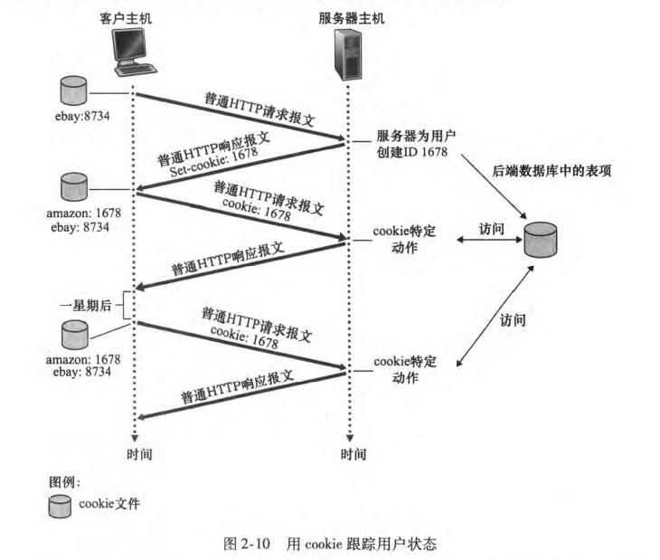
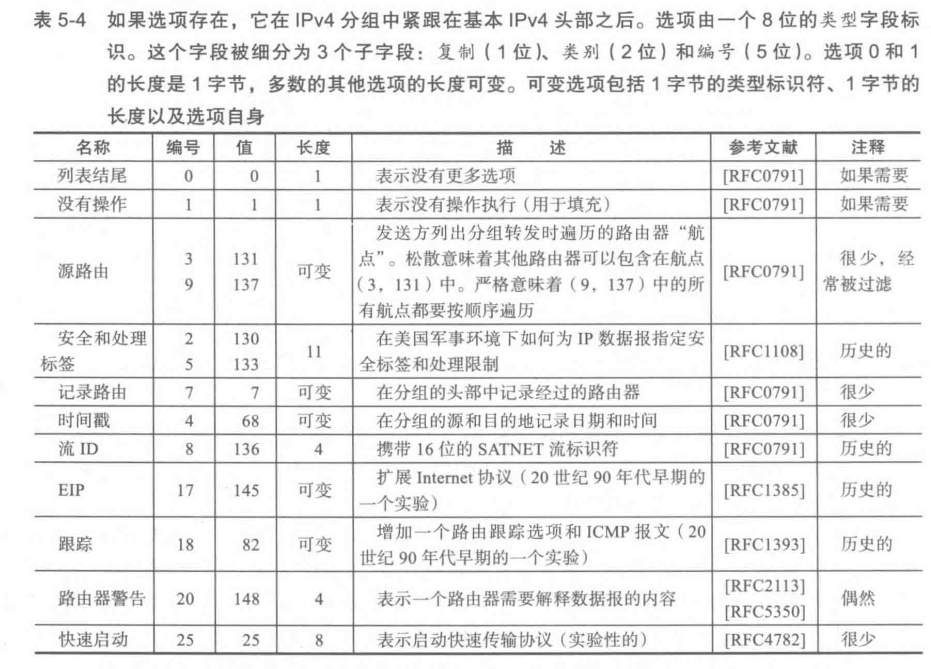
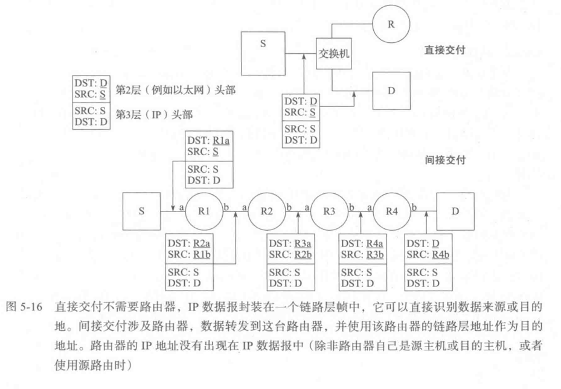
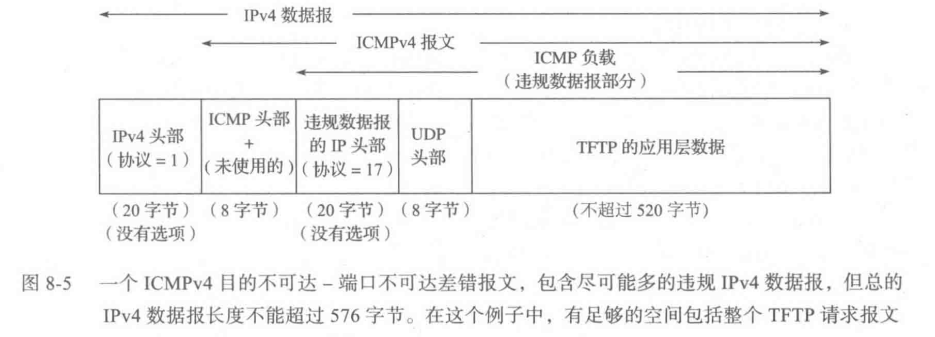

# 引言

## 是什么：计算机网络的定义

- **计算机网络**（Computer Network）是指将地理位置不同的具有独立功能的多台计算机及其外部设备，通过通信线路连接起来，在网络操作系统、网络管理软件及网络通信协议的管理和协调下，实现资源共享和信息传递的计算机系统。
- 从技术角度，计算机网络是**由若干节点（node）和连接这些节点的链路（link）组成**。节点可以是计算机、集线器、交换机或路由器等。多个网络还可以通过路由器互连起来，构成一个覆盖范围更大的网络，即互联网（internet），因此**互联网是"网络的网络"**。
- 从功能角度，计算机网络主要是实现**资源共享**（硬件、软件、数据）和**信息传递**（数据通信、分布式处理）。
- 从服务角度，计算机网络为**分布式应用**提供基础设施，使得运行在不同端系统上的应用程序能够通过网络交换数据，实现协同工作。

### 基础概念

- **因特网**（Internet）：因特网是一个世界范围的计算机网络，即它是一个互联了遍及全世界数十亿计算设备的网络。由端系统和主机以及连接他们的通信链路和分组交换机连接起来，协议控制网络中信息的接收和发送。
- **协议**（Protocol）：定义了在两个或多个通信实体之间交换的报文(message)的格式和顺序，以及报文发送和／ 或接收一条报文或其他事件所采取的动作。协议的三要素包括：
  - **语法**：即数据与控制信息的结构或格式
  - **语义**：即需要发出何种控制信息，完成何种动作以及做出何种响应
  - **时序（同步）**：即事件实现顺序的详细说明

---

## 为什么：学习计算机网络的意义

- **掌握计算机网络的核心知识**：理解网络的基本概念、工作原理和常用技术，为后续学习、应用和研究打下坚实基础。
- **理解现代互联网的基础**：因特网已成为现代社会的基础设施，理解其工作原理有助于更好地使用和开发网络应用。
- **适应技术发展**：计算机网络是一个动态发展的领域，理解网络的原则和实践，不仅能理解今天的网络，还能理解明天的网络。
- **解决实际问题**：掌握网络知识有助于诊断网络问题、优化网络性能、设计网络应用、保障网络安全。

---

## 怎么做：文档结构与学习方法

### 文档组织方式

本文档采用**自顶向下**的学习路径，从应用层开始，逐步深入到传输层、网络层和链路层，帮助读者建立从应用场景到协议实现的完整认知。

### 主要内容结构

1. **第一章：计算机网络和互联网**
   - 概述计算机网络和因特网的整体架构
   - 介绍端系统、通信链路、分组交换机等基本构件
   - 探讨分组交换与电路交换、时延、丢包、吞吐量等核心概念
   - 介绍协议分层和服务模型

2. **自顶向下的分层学习**
   - **应用层**：Web/HTTP、电子邮件、DNS、FTP等应用协议
   - **传输层**：TCP和UDP协议，多路复用、可靠传输、流量控制、拥塞控制
   - **网络层**：IP协议、路由转发、地址结构、ICMP、DHCP
   - **链路层**：以太网、802.11（Wi-Fi）、PPP、ARP等

3. **拓展内容**
   - 网络安全
   - 无线和移动网络
   - 多媒体网络
   - 网络管理

### 各层及各业务简要说明

以下对每一层及层内主要协议/业务做简要说明，均包含**要解决什么问题**与**怎么解决**。先给出**网络核心与性能**的全局概念，再按层展开。

#### 总览：网络核心与性能概念

- **分组交换与电路交换**
  - 要解决：数据**如何通过网络传输**——独占通道 versus 共享、存储转发。
  - 怎么解决：**电路交换**（FDM/TDM）为呼叫预留专用电路，时延小、实时性好，但信道利用率低；**分组交换**将数据分片、**存储转发**、统计复用链路，利用率高，但存在排队时延与丢包。

- **时延、丢包与吞吐量**
  - 要解决：如何**刻画与优化网络性能**。
  - 怎么解决：**节点总时延** = 处理 + 排队 + 传输 + 传播；**流量强度**（La/R）过大导致排队增长与**丢包**；**端到端时延**与 **RTT** 影响交互；**瞬时/平均吞吐量**刻画送达速率。用于分析瓶颈与调优。

- **封装（encapsulation）**
  - 要解决：各层**如何协同**、**如何标识**本层所载数据。
  - 怎么解决：每层为上层 PDU 加**首部**（及可选尾部），形成本层 PDU；**应用层报文 → 运输层报文段 → 网络层数据报 → 链路层帧**逐层封装；接收端按首部**多路分解**、逐层解封装。

#### 应用层

- **应用层（整体）**
  - 要解决：不同端系统上的**应用进程如何交换报文**、如何约定报文格式与交互规则。
  - 怎么解决：定义**应用层协议**（报文类型、语法、语义、交互时序）；通过**套接字**使用运输层服务；采用 **C/S** 或 **P2P** 等体系结构组织应用。

- **HTTP**
  - 要解决：浏览器与 Web 服务器之间**请求与传递 Web 对象**（如 HTML、图片等）。
  - 怎么解决：基于 **请求/响应** 的报文交换；使用 **TCP**；支持**持续连接**（含流水线）以减少 RTT；通过 **URL** 标识对象，**Cookie** 维护状态。

- **电子邮件（SMTP / POP3 / IMAP / 基于 Web）**
  - 要解决：**邮件从发方到收方的传输**，以及**用户从邮件服务器取信、管理**。
  - 怎么解决：**SMTP** 在邮件服务器之间推送邮件（推、TCP、7 位 ASCII）；**POP3** 拉取并通常删除服务器副本；**IMAP** 在服务器维护文件夹，多端同步；**基于 Web 的邮箱**通过 **HTTP** 拉取/发送，无需专用邮件客户端；基于 **RFC 5322** 报文格式。

- **DNS**
  - 要解决：**域名与 IP 的映射**、主机/邮件服务器别名、多机负载分配等。
  - 怎么解决：**分层分布式数据库**（根、顶级域、权威等）；**UDP 53** 的查询/响应协议；支持**迭代/递归**解析；可用**轮转**实现简单负载均衡。

- **FTP**
  - 要解决：**不同主机系统之间可靠地传输文件**（跨硬件/OS）。
  - 怎么解决：**C/S** 模型；**控制连接**（带外，端口 21）与**数据连接**（带内）分离；支持 **ASCII / 二进制** 模式；基于 **TCP** 可靠传输。

- **TFTP**
  - 要解决：**极简、无认证**场景下的文件传输（如 boot、配置下发）。
  - 怎么解决：基于 **UDP**；协议极简、无目录与认证；常用于局域网内固件/配置加载；可靠性由应用层简单重传弥补。

- **套接字（Socket）**
  - 要解决：应用进程**如何向网络发送/接收数据**、如何选择运输层与参数。
  - 怎么解决：**应用层与运输层之间的 API**；进程通过套接字收发报文，由运输层多路复用/分解；可选 **TCP/UDP**、部分运输层参数（如缓冲区、MSS）；**四元组/二元组**标识连接或数据报交付。

#### 传输层

- **传输层（整体）**
  - 要解决：网络层只提供**主机到主机**的尽力而为交付，应用需要**进程到进程**的交付，且部分应用需要**可靠、按序、流量与拥塞控制**。
  - 怎么解决：**多路复用/多路分解**（端口号）将 IP 交付扩展到进程；**UDP** 提供最小服务（进程间交付 + 可选校验和）；**TCP** 提供可靠传输、流量控制、拥塞控制、连接管理。

- **多路复用与多路分解**
  - 要解决：单台主机多进程**共享 IP**，如何把到达的报文段**正确交给对应进程**。
  - 怎么解决：**端口号**标识套接字；UDP 用**二元组**（目的 IP、目的端口）、TCP 用**四元组**（源/目的 IP + 端口）分解到相应套接字；发送方封装端口等首部实现复用。

- **UDP**
  - 要解决：需要**低延迟、无连接、最小开销**的进程间数据报交付（如实时、广播、简单查询）。
  - 怎么解决：**无连接**、无握手；仅**复用/分解 + 可选校验和**；无重传、流量控制、拥塞控制；首部 8 字节，应用自行处理可靠性与速率。

- **TCP**
  - 要解决：在**不可靠 IP** 之上实现**可靠、按序、无重复**的进程间字节流，并避免**发送过快**（接收方、网络）导致溢出或拥塞。
  - 怎么解决：**三次握手**建立连接；**序号/确认号、重传、累积确认**实现可靠按序交付；**接收窗口**做流量控制；**拥塞窗口 + 慢启动/拥塞避免/快重传**等做拥塞控制；**四次挥手**释放连接。

#### 网络层

- **网络层（整体）**
  - 要解决：在**全球范围**内把数据报从源主机送到目的主机，需要**编址、转发、路由**，以及**配置、诊断、安全**等支撑。
  - 怎么解决：**IP** 定义地址与数据报格式，**尽力而为、无连接**转发；**转发表 + 最长前缀匹配**决定下一跳；**ICMP** 提供差错与诊断；**DHCP** 自动分配 IP 等配置；**NAT/防火墙** 做地址转换与访问控制；**IP 分片**适配不同链路 **MTU**。

- **IP 协议（寻址与转发）**
  - 要解决：**统一编址**与**跨网段、跨 AS 的逐跳转发**。
  - 怎么解决：**IPv4/IPv6** 地址与数据报格式；**转发表**按目的地址**最长前缀匹配**得到下一跳与出接口；**TTL/跳数限制**防环；**协议/下一头部**字段多路分解到上层。

- **ICMP**
  - 要解决：IP 不反馈**丢包、不可达、超时**等异常，也缺乏**连通性测试、路径探测**等手段。
  - 怎么解决：**差错报文**（不可达、超时、重定向等）与**查询报文**（回显请求/应答、路由发现）；被 **ping、traceroute** 等工具使用；封装在 IP 中传输。

- **DHCP**
  - 要解决：主机接入网络时**自动获得 IP、掩码、网关、DNS** 等，避免手配。
  - 怎么解决：**客户-服务器**模型，**UDP**；**发现-提供-请求-确认**等阶段；**地址池 + 租期**动态分配；可续租。

- **防火墙与 NAT**
  - 要解决：**内网安全隔离**、**公网 IP 不足**下多机共享出口、**访问控制**。
  - 怎么解决：**防火墙**按 ZONE、策略过滤流；**NAT** 在网关重写源/目的 IP 与端口，维护映射表，实现私网访问公网及反向会话。

- **IP 分片**
  - 要解决：数据报**大于链路 MTU** 时无法完整传输。
  - 怎么解决：**分片**：按 MTU 将数据报拆成多个片，每片独立传输；**重组**仅在**目的主机**进行；IPv4 允许中间路由器分片，IPv6 仅源端分片。

- **路由与路由协议**
  - 要解决：**转发表**如何生成、更新，以正确转发数据报。
  - 怎么解决：**路由协议**（如 **RIP、OSPF、BGP、IS-IS**）在路由器间交换路由信息，计算并填充转发表；域内（RIP、OSPF）与域间（BGP）分工；与 **IP 转发**（最长前缀匹配）配合实现逐跳转发。

- **子网与 VLSM**
  - 要解决：同一**网络号**下如何**划分子网**、灵活分配地址。
  - 怎么解决：**子网掩码**区分网络/子网与主机位；**可变长子网掩码（VLSM）** 在同一网络号内对不同子网使用不同掩码，提高利用率；站点内部局部使用，不影响全球路由。

#### 链路层

- **链路层（整体）**
  - 要解决：在**单跳**链路上，把**网络层分组**可靠或尽力而为地传到**相邻节点**；需**成帧、寻址、差错检测、多机共享介质**等。
  - 怎么解决：**成帧**（如以太网、802.11、PPP）承载 IP 等；**MAC 地址**在局域网内寻址；**CRC** 等做差错检测；**MAC 协议**（如 CSMA/CD、CSMA/CA）解决共享介质访问；**ARP** 解析 IP↔MAC。

- **以太网（含 CSMA/CD）**
  - 要解决：**多机共享总线**时，谁在何时发送、**碰撞**如何处理。
  - 怎么解决：**CSMA/CD**：先侦听再发；碰撞则**退避**（指数退避）重试；**以太网帧**（目的/源 MAC、类型、载荷、FCS）；**CRC** 检错；交换机使冲突域缩小，全双工下可不用 CSMA/CD。

- **802.11（Wi‑Fi）**
  - 要解决：**无线共享信道**下的**竞争发送**、**隐藏终端**、**省电**等。
  - 怎么解决：**CSMA/CA**；可选 **RTS/CTS** 减轻隐藏终端；**BSS/ESS**、**AP** 组网；**管理/控制/数据帧**；**PSM + 信标**实现省电；**WPA/WPA2** 等保障安全。

- **PPP**
  - 要解决：**点对点链路**（如拨号、DSL）上**承载 IP**，支持认证、压缩等。
  - 怎么解决：**成帧**（标识、地址、控制、协议、载荷、FCS）；**LCP** 建链与协商；**NCP** 配置网络层；**认证**（如 PAP/CHAP）；常用于**PPPoE/PPPoA** 等接入。

- **环回（loopback）**
  - 要解决：本机**进程间经 TCP/IP 通信**（如 localhost 服务），不走物理网络。
  - 怎么解决：**虚拟环回接口**（如 `lo`）；**127.x.x.x / ::1** 为目的时，协议栈在**网络层**或之后回环，不出口。

- **MTU 与路径 MTU**
  - 要解决：不同链路**最大帧长**不同，过大 IP 数据报无法传送。
  - 怎么解决：每条链路有 **MTU**；路径的 **路径 MTU** = 整条路径最小 MTU；**IP 分片**或 **Path MTU Discovery**（如 ICMP 超时）适配。

- **ARP**
  - 要解决：**已知目的 IP、未知 MAC** 时无法在链路上投递帧。
  - 怎么解决：**ARP 请求**（广播）问「谁有 IP X？」；**ARP 应答**（单播）回「IP X 的 MAC 是 Y」；**ARP 缓存**减少重复请求；**免费 ARP** 用于冲突检测等。

- **VLAN（802.1q）**
  - 要解决：同一**物理 LAN** 内需要**逻辑隔离**、分段与访问控制。
  - 怎么解决：**802.1q** 在以太网帧中加 **VLAN 标签**（类型 0x8100）；按 VLAN 划分**广播域**；交换机按标签转发，实现逻辑子网分离；可与子网、策略配合。

- **链路层交换机**
  - 要解决：**多机接入**同一网段时，如何**按 MAC 转发**、缩小冲突域、提高吞吐。
  - 怎么解决：**二层交换机**基于 **MAC 表**转发帧，只解到链路层；与**路由器**（网络层、跨网段）分工：交换机用于接入/局域网，路由器用于网络核心与跨网转发。

### 学习方法建议

- **理论与实践结合**：理解协议原理的同时，通过抓包工具（如Wireshark）观察实际网络流量
- **自顶向下理解**：从应用需求出发，理解各层如何协作实现功能
- **对比学习**：对比TCP与UDP、IPv4与IPv6、电路交换与分组交换等，加深理解
- **关联学习**：结合 `Communication Technology.md`（通信原理）、`IPv6 概念、技术与实践.md` 等相关文档，建立完整的知识体系

# 第一章 计算机网络和互联网

- 第1章概述了==计算机网络和因特网==。这一章的目标是从==整体上==粗线条地==勾勒出====计算机网络==的==概貌==，并且描述本书内容的==框架==。这一章包括大量的背景知识，讨论大量的计算机网络构件,而且将它们放在整个网络的大环境中进行讨论。
- 本章将以如下方式组织计算机网络的概述:在介绍了某些基本术语和概念后，将首先查看构成网络的基本硬件和软件组件。我们从网络的边缘开始，考察在网络中运行的==端系统和网络应用==;接下来探究计算机网络的核心，查看传输数据的链路和父抉机，以从付项系统与网络核心相连接的接入网和物理媒体。我们将了解因特网是“网络的网络”，开将得知这些网络是怎样彼此连接起来的。
- 在浏览完计算机网络的边缘和核心之后，本章的后半部分将从更广泛、更抽象的角度来考察计算机网络。我们将考察在计算机网络中数据的==时延、丢包和吞吐量==，给出一个端到端吞吐量和时延的简单定量模型:该模型兼顾了传输、传播和排队时延等因素。接下来，我们将介绍计算机联网时的一些关键的体系结构原则，如协议分层和服务模型。我们还将了解到计算机网络对于许多不同类型的攻击来说是脆弱的，将回顾其中的某些攻击并且考虑使计算机网络更为安全的方法。最后，我们将以计算机网络的简要历史结束本章的学习。

## 互联网的组成部分

- 什么是互联网?回答这个问题有两种方式:
  - 其一，我们能够描述因特网的具体构成，即构成因特网的基本硬件和软件组件;
  - 其二，我们能够根据为分布式应用提供服务的联网基础设施来描述因特网。

### 具体构成

1. ==因特网是一个世界范围的计算机网络，即它是一个互联了遍及全世界数十亿计算设备的网络==。
   - 由==端系统和主机==以及连接他们的==通信链路和分组交换机==连接起来，==协议==控制网络中信息的接受和发送。
     - 掌握计算机网络领域知识的过程就是理解网络协议的构成、原理和工作方式的过程。
2. 计算机网络（computer network)这个术语开始听起来有些过时了。用因特网术语来说，所有这些设备都称为==主机（host）或端系统（end system)==。
   - 设备：如传统的桌面PC、Linux 工作站和非传统的因寺网“物品”智能手机、平板电脑、电视和游戏机等
3. ==端系统通过**通信链路**（communication link）和**分组交换机**（packet switch)连接到一起==。
   - ==通信链路==：由不同类型的物理媒体组成。这些物理媒体包括同轴电缆、铜线、光纤和无线电频谱。
     - 不同的链路能够以不同的速率传输数据，链路的==传输速率== （ transmission rate)以比特/秒( bit/s，或bps）度量。
     - ==分组==：当一台端系统要向另一台端系统发送数据时，发送端系统将数据分段，并为每段加上首部字节。由此形成的信息包用计算机网络的术语来说称为分组( packet)。
   - ==分组交换机==从它的一条入通信链路接收到达的分组，并从它的一条出通信链路转发该分组。
     - 分类：这两种类型的交换机朝着最终目的地转发分组
       - 路由器(（router)：通常用于网络核心中
         - 网络核心：为边缘部分服务。
           - 边缘部分：用户直接使用：如c/s和p2p
       - 链路层交换机(（link-layer switch)：通常用于接入网中
         - 接入网是指骨干网络到用户终端之间的所有设备。其长度一般为几百米到几公里，因而被形象地称为"最后一公里"。
     - ==路径==:从发送端系统到接收端系统，一个分组所经历的一系列通信链路和分组交换机称为通过该网络的路径（route或path)。
4. ==端系统通过**因特网服务提供商**（Internet Service Provider,ISP）接入因特网==,如中国移动，中国联通的宽带。
   - 每个ISP自身就是一个由多台分组交换机和多段通信链路组成的网络。
   - 各ISP为端系统提供了各种不同类型的网络接入
     - 包括如线缆调制解调器或DSL那样的住宅宽带接入、高速局域网接入和移动无线接入。
     - ISP也为内容提供者提供因特网接入服务，将Web站点和视频服务器直接连人因特网。
   - 因特网就是将端系统彼此互联，因此为端系统提供接入的ISP也必须互联。
   - 较低层的ISP通过国家的、国际的较高层ISP(如 Level 3 Communica-tions、AT&T、Sprint和 NTT)互联起来。较高层ISP是由通过高速光纤链路互联的高速路由器组成的。无论是较高层还是较低层ISP网络，它们每个都是独立管理的，运行着IP协议（详情见后)，遵从一定的命名和地址规则。
5. ==端系统、分组交换机和其他因特网部件都要运行一系列**协议**（protocol)，这些协议控制因特网中信息的接收和发送。==
   - 协议定义了在两个或多个通信实体之间交换的报文格式和次序，以及在报文传输和/或接收或其他事件方面所采取的动作
   - 协议，网络协议的简称，网络协议是通信计算机双方必须共同遵从的一组约定。如怎么样建立连接、怎么样互相识别等。只有遵守这个约定，计算机之间才能相互通信交流。它的三要素是：语法、语义、时序。
     - ==语法==：即数据与控制信息的结构或格式；
     - ==语义==：即需要发出何种控制信息，完成何种动作以及做出何种响应；
     - ==时序（同步）==，即事件实现顺序的详细说明

### 服务描述

- 为应用程序提供服务的基础设施的角度来描述因特网。
- ==分布式应用程序==：应用程序分布在不同计算机上，通过网络来共同完成一项任务。通常为服务器/客户端模式。应用程序涉及多个相互交换数据的端系统，故它们被称为分布式应用程序 （ distributed application)。
- 运行在不同端系统上的软件将需要互相发送数据。此时我们碰到一个核心问题，这个问题导致了另一种描述因特网的方法，即将因特网描述为应用程序的平台。运行在一个端系统上的应用程序怎样才能指令因特网向运行在另一个端系统上的软件发送数据呢?
  - 与因特网相连的端系统提供了一个==套接字接口==( socket interface)，该接口规定了运行在一个端系统上的程序请求因特网基础设施向运行在另一个端系统上的特定目的地程序交付数据的方式。因特网套接字接口是一套发送程序必须遵循的规则集合，因此因特网能够将数据交付给目的地。

## 互联网的工作方式

### 边缘网络

- 通常把与因特网相连的计算机和其他设备称为端系统，因为它们位于因特网的边缘，故而被称为端系统。
- 主机=端系统
  - 分类
    - 客户端 client
    - 服务端 server

#### 接入网

- 接入网，这是指将端系统物理连接到其边缘路由器(edge router)的网络。边缘路由器是端系统到任何其他远程端系统的路径上的第一台路由器。

##### 接入方式

###### 家庭接入

- DSL、电缆、FTTH、拨号和卫星
- 宽带接入方式
  - 数字用户线（Digital Subscriber Line,DSL)
  - 电缆。住户通常从提供本地电话接入的本地电话公司处获得 DSL 因特网接入。

###### 企业（和家庭)接入

- 以太网和WiFi

###### 广域无线接人

- 3G和LTE

#### 物理媒体（physical medium)

##### 类型

- 导引型媒体（guided media）：电波沿着固体媒体前行，如光缆、双绞铜线或同轴电缆。
- 非导引型媒体（unguided media)。：电波在空气或外层空间中传播，例如在无线局域网或数字卫星频道中。

### 网络核心

- 由互联因特网端系统的分组交换机和链路构成的网状网络。
- 基本问题：数据如何通过网络进行传输？
  - 电路交换:为每个呼叫预留一条专有电路:如电话网
  - 分组交换
    - 将要传送的数据分成一个个单位:分组
    - 将分组从一个路由器传到相邻路由器(hop)，一段段最终从源端传到目标端
    - 每段:采用链路的最大传输能力（带宽)

#### 分组交换

- 在各种网络应用中、端系统彼此交换报文 ( message)
  - 报文(message)是网络中交换与传输的数据单元，即站点一次性要发送的数据块。报文包含了将要发送的完整的数据信息，其长短很不一致，长度不限且可变。
  - 分组：为了从源端系统向目的端系统发送一个报文，源将长报文划分为较小的数据块，称之为分组( packet)。
  - 在源和目的地之间，每个分组都通过通信链路和分组交换机（ packet switch )传送。
  - 交换机主要有两类:路由器（ router)和链路层交换机（ link-layer switch)。)
  - 分组以等于该链路最大传输速率的速度传输通过通信链路。因此如果某源端系统或分组交换机经过一条链路发送一个L比特的分组，链路的传输速率为R比特/秒，则传输该分组的时间为L/R秒。

##### 存储转发传输

- 多数分组交换机在链路的输人端使用存储转发传输（ store- and- forward transmission)机制。存储转发传输是指在交换机能够开始向输出链路传输该分组的第一个比特之前,必须接收到整个分组。

##### 排队时延和分组丢失

- ==输出队列/输出缓存==：每台分组交换机有多条链路与之相连。对于每条相连的链路，该分组交换机具有一个输出缓存（output buffer，也称为输出队列(output queue))它用于存储路由器准备发往那条链路的分组。该输出缓存在分组交换中起着重要的作用
- ==排队时延==：如果到达的分组需要传输到某条链路，但发现该链路正忙于传输其他分组，该到达分组必须在输出缓存中等待。因此，除了存储转发时延以外，分组还要承受输出缓存的排队时延( queuing delay)。这些时延是变化的，变化的程度取决于网络的拥塞程度。
- ==分组丢失/丢包==
  - 丢包（Packet loss）是指一个或多个数据数据包（packet）的数据无法透过网上到达目的地。
  - 因为缓存空间的大小是有限的，一个到达的分组可能发现该缓存已被其他等待传输的分组完全充满了。在此情况下，将出现分组丢失（丢包)(packet loss)，到达的分组或已经排队的分组之一将被丢弃。
  - 丢包可能原因是多方面，包括在网上中由于多路径衰落（multi-path fading）所造成的信号衰减（signal degradation），或是因为通道阻塞造成的丢包（packet drop），再者损坏的数据包（corrupted packets）被拒绝通过，或有缺陷的网上硬件，网上驱动程序故障都可能造成丢包。此外，丢包也受信号的信噪比（SNR）的影响。

##### 转发表和路由选择协议

- 路由器从与它相连的一条通信链路得到分组，然后向与它相连的另一条通信链路转发该分组。 但是路由器怎样决定它应当向哪条链路进行转发呢？不同的计算机网络实际上是以不同的方式完成分组转发的。
- 在因特网中，每个端系统具有一个称为IP 地址的地址 当源主机要向目的端系统发送一个分组时，源在该分组的首部包含了目的地的IP 地址。
- ==转发表==：当一个分组到达网络中的路由器时，路由器检查该分组的目的地址的一部分， 并向一台相邻路由器转发该分组。  更特别的是，每台路由器具有一个转发表( forwarding table) ,   用于将目的地址 （或目的地址的一部分）映射成为输出链路。
  - 当某分组到达一台路由器时，路由器检查该地址，并用这个目的地址搜索其转发表，以发现适当的出链路。路由器则将分组导向该出链路。

#### 电路交换

- 电路交换（CS:circuit switching）是通信网中最早出现的一种交换方式，也是应用最普遍的一种交换方式，主要应用于电话通信网中，完成电话交换，已有100多年的历史。

##### 电路交换网络中的复用

- 链路中的电路是通过频分复用(Frequency- Division Multiplexing，FDM）或时分复用(Time- Division Multiplexing，TDM）来实现的。
  - 频分复用(FDM，Frequency Division Multiplexing)就是将用于传输信道的总带宽划分成若干个子频带（或称子信道），每一个子信道传输1路信号。频分复用要求总频率宽度大于各个子信道频率之和，同时为了保证各子信道中所传输的信号互不干扰，应在各子信道之间设立隔离带，这样就保证了各路信号互不干扰（条件之一）。频分复用技术的特点是所有子信道传输的信号以并行的方式工作，每一路信号传输时可不考虑传输时延，因而频分复用技术取得了非常广泛的应用。频分复用技术除传统意义上的频分复用(FDM)外，还有一种是正交频分复用(OFDM)。
  - 时分复用TDM是采用同一物理连接的不同时段来传输不同的信号，也能达到多路传输的目的。时分多路复用以时间作为信号分割的参量，故必须使各路信号在时间轴上互不重叠。时分复用（TDM，Time-division multiplexing）就是将提供给整个信道传输信息的时间划分成若干时间片(简称时隙)，并将这些时隙分配给每一个信号源使用，保证资源的利用率。

###分组交换与电路交换的对比

- |      | 分组交换                                                     |      | 电路交换                                                     |
  | ---- | ------------------------------------------------------------ | ---- | ------------------------------------------------------------ |
  | 概念 | 分组交换是以分组为单位进行传输和交换的，它是一种存储——转发交换方式，即将到达交换机的分组先送到存储器暂时存储和处理，等到相应的输出电路有空闲时再送出。 |      | 电路交换是以电路连接为目的的交换方式，通信之前要在通信双方之间建立一条被双方独占的物理通道 |
  | 优点 | 分组交换不需要为通信双反预先建立一条专用的通信线路，不存在连接建立时延，用户可随时发送分组。 | 缺点 | 电路交换平均连接建立时间对计算机通信来说较长                 |
  |      | 由于采用存储转发方式，加之交换节点具有路径选择，当某条传输线路故障时可选择其他传输线路，提高了传输的可靠性。 |      | 电路交换家里连接后，物理通路被通信双方独占，即使通信线路空闲，也不能供其他用户使用，因而信道利用 |
  |      | 通信双反不是固定的战友一条通信线路，而是在不同的时间一段一段地部分占有这条物理通路，因而大大提高了通信线路的利用率。 |      | 电路交换时，数据直达，不同类型，不同规格，不同速率的终端很难相互进行通信，也难以在通信过程中进行差错控制。 |
  |      | 加速了数据在网络中的传输。因而分组是逐个传输，可以使后一个分组的存储操作与前一个分组的转发操作并行，这种流水线式传输方式减少了传输时间。 |      |                                                              |
  |      | 分组长度固定，相应的缓冲区的大小也固定，所以简化了交换节点中存储器的管理。 |      |                                                              |
  |      | 分组较短，出错几率减少，每次重发的数据量也减少，不仅提高了可靠性，也减少了时延。 |      |                                                              |
  | 缺点 | 由于数据进入交换节点后要经历存储转发这一过程，从而引起的转发时延（包括接受分组、检验正确性、排队、发送时间等），而且网络的通信量越大，造成的时延就越大，实时性较差。 | 优点 | 由于通信线路为通信双方用户专用，数据直达，所以传输数据的时延非常小。 |
  |      | 分组交换可能出现失序，丢失或重复分组，分组到达目的节点时，对分组按编号进行排序等工作，增加了麻烦。 |      | 双方通信时按发送顺序传送数据，不存在失序问题。               |
  |      | 分组交换只适用于数字信号。                                   |      | 电路交换既适用于传输模拟信号，也适用于传输数字信号。         |
  |      |                                                              |      | 电路交换的交换设备及控制均比较简单。                         |
  |      |                                                              |      | 通信双方之间的屋里通路一旦建立，双方可以随时通信，实时性强。 |

### 网络的网络

## 分组交换网中的时延、丢包和吞吐量

### 时延

- 当分组从一个节点（主机或路由器）沿着这条路径到后继节点（主机或路由器），该分组在沿途的每个节点经受了几种不同类型的时延。
- 节点总时延 ( total nodal delay ) 
  - 节点处理时延 (nodal processing delay) 
  - 排队时延 (queuing delay) 
  - 传输时延 ( transmission delay) 
  - 传播时延 (propagation delay) 

#### 处理时延

- 检查分组首部和决定将该分组导向何处所需要的时间是处理时延的一部分。

- 处理时延也能够包括其他因素，如检查比特级别的差错所需要的时间，该差错出现在从上游节点向路由器A传输这些分组比特的过程中。

- 高速路由器的处理时延通常是微秒或更低的数量级。在这种节点处理之后，路由器将该分组引向通往路由器B链路之前的队列。

#### 排队时延

- 在队列中，当分组在链路上等待传输时，它经受排队时延。
- 一个特定分组的排队时延长度将取决于先期到达的正在排队等待向链路传输的分组数量。
  - 如果该队列是空的,并且当前没有其他分组正在传输，则该分组的排队时延为0。
  - 另一方面，如果流量很大，并且许多其他分组也在等待传输，该排队时延将很长。
- 实际的排队时延可以是毫秒到微秒量级。

#### 传输时延

- 假定分组以先到先服务方式传输——这在分组交换网中是常见的方式，仅当所有已经到达的分组被传输后，才能传输刚到达的分组。
- 用L比特表示该分组的长度，用R bps(即 b/s)表示从路由器A到路由器B的链路传输速率。例如，对于一条10Mbps的以太网链路，速率R=10Mbps;对于100Mbps 的以太网链路，速率R = 100Mbps。传输时延是L/R。这是将所有分组的比特推向链路（即传输，或者说发射）所需要的时间。实际的传输时延通常在毫秒到微秒量级。

#### 传播时延

- 一旦一个比特被推向链路，该比特需要向路由器B传播。从该链路的起点到路由器B传播所需要的时间是传播时延。
  - 该比特以该链路的传播速率传播。
  - 该传播速率取决于该链路的物理媒体（即光纤、双绞铜线等)，其速率范围是2x108~3 x10'm/s，这等于或略小于光速。
  - 该传播时延等于两台路由器之间的距离除以传播速率。即传播时延是d/s，其中d是路由器A和路由器B之间的距离，s是该链路的传播速率。
  - 一旦该分组的最后一个比特传播到节点B，该比特及前面的所有比特被存储于路由器B。整个过程将随着路由器B执行转发而持续下去。
  - 在广域网中,传播时延为毫秒量级

#### 传输时延和传播时延的比较

- 传输时延是路由器推出分组所需要的时间，它是分组长度和链路传输速率的函数，而与两台路由器之间的距离无关。
- 传播时延是一个比特从一台路由器传播到另一台路由器所需要的时间，它是两台路由器之间距离的函数，而与分组长度或链路传输速率无关。

### 排队时延和丢包

- 排队时延
  - 什么时候排队时延大，什么时候又不大呢?该问题的答案很大程度取决于流量到达该队列的速率、链路的传输速率和到达流量的性质，即流量是周期性到达还是以突发形式到达。
  - 比率La/R 被称为流量强度(traffic intensity)
    - 令a 表示分组到达队列的平均速率(a 的单位是分组／秒，即pkt/s) 。
    - R 是传输速率，即从队列中推出比特的速率（以bps 即bis 为单位） 。
    - 假定所有分组都是由L 比特组成的。则比特到达队列的平均速率是La bps 。
    - 假定该队列非常大，因此它基本能容纳无限数量的比特。
  
- 丢包
  - 在上述讨论中，我们已经假设队列能够容纳无穷多的分组。在现实中，一条链路前的队列只有有限的容量，尽管排队容量极大地依赖于路由器设计和成本。因为该排队容量是有限的，随着流量强度接近1，排队时延并不真正趋向无穷大。相反，到达的分组将发现一个满的队列。由于没有地方存储这个分组,路由器将丢弃( drop）该分组,即该分组将会丢失(lost)。

### 端到端时延

- 从源到目的地的总时延

### 吞吐量

- 为了定义吞吐量，考虑从主机A到主机B跨越计算机网络传送一个大文件。例如，也许是从一个P2P文件共享系统中的一个对等方向另一个对等方传送一个大视频片段：
  - 在任何时间瞬间的瞬时吞吐量(instantaneous throughput）是主机B接收到该文件的速率（以bps 计)。(许多应用程序包括许多PP文件共享系统，其用户界面显示了下载期间的瞬时吞吐重，也计你以前已经观察过它!)
  - 如果该文件由F比特组成，主机B接收到所有F比特用去T秒,则文件传送的平均吞吐量 （ average throughput）是F/T' bps。

## 协议层次及其服务模型

### 分层的体系结构

- 利用分层的体系结构，我们可以讨论一个大而复杂系统的定义良好的特定部分。这种简化本身由于提供模块化而具有很高价值，这使某层所提供的服务实现易于改变。
- 只要该层对其上面的层提供相同的服务，并且使用来自下面层次的相同服务，当某层的实现变化时，该系统的其余部分保持不变。(注意到改变一个服务的实现与改变服务本身是极为不同的!）例如，如果登机口功能被改变了（例如让人们按身高登机和离机)，航线系统的其余部分将保持不变,因为登机口仍然提供相同的功能人们登机和离机);改变后,它仅是以不同的方式实现了该功能。对于大而复杂且需要不断更新的系统，改变服务的实现而不影响该系统其他组件是分层的另一个重要优点。

#### 协议分层

- 为了给网络协议的设计提供一个结构，网络设计者以分层 (layer) 的方式组织协议以及实现这些协议的网络硬件和软件。
- 每个协议属于这些层次之一
- 我们再次关注某层向它的上一层提供的服务 (service) ,   即所谓一层的服务模型 (service model) 。 
- 一个协议层能够用软件、硬件或两者的结合来实现。
- 协议分层具有概念化和结构化的优点。分层提供了一种结构化方式来讨论系统组件。模块化使更新系统组件更为容易。
- 一个分组具有两种类型的字段： 首部字段和有效载荷字段(payload field)
- 将这些综合起来，各层的所有协议被称为协议栈(protocol stack）。因特网的协议栈由5个层次组成
  - 应用层
    - 应用层是网络应用程序及它们的应用层协议存留的地方。
    - 应用层协议分布在多个端系统上，而一个端系统中的应用程序使用协议与另一个端系统中的应用程序交换信息分组。我们把这种位于==应用层的信息分组==称为==报文（message)==。
  - 运输层
    - 因特网的运输层在应用程序端点之间传送应用层报文。
    - 在因特网中,有两种运输协议，即TCP和 UDP，利用其中的任一个都能运输应用层报文TCP向它的应用程序提供了面向连接的服务。这种服务包括了应用层报文向目的地的确保传递和流量控制（即发送方/接收方速率匹配)。TCP也将长报文划分为短报文，并提供拥塞控制机制，因此当网络拥塞时，源抑制其传输速率。UDP协议向它的应用程序提供无连接服务。这是一种不提供不必要服务的服务，没有可靠性，没有流量控制，也没有拥塞控制。
    - 在本书中，我们把==运输层的分组==称为==报文段(segment)==。
  - 网络层
    - 因特网的网络层负责将称为==数据报 (datagram)或数据包（packet）== 的==网络层分组==从一台主机移动到另一台主机。 
    - 在一台源主机中的因特网运输层协议 (TCP 或UDP) 向网络层递交运输层报文段和目的地址，就像你通过邮政服务寄信件时提供一个目的地址一样。
    - 因特网的网络层包括著名的网际协议IP, 该协议定义了在数据报中的各个字段以及端系统和路由器如何作用于这些字段。
  - 链路层
    - 因特网的网络层通过源和目的地之间的一系列路由器路由数据报。
    - 为了将分组从一个节点（主机或路由器）移动到路径上的下一个节点，网络层必须依靠该链路层的服务。特别是在每个节点，网络层将数据报下传给链路层，链路层沿着路径将数据报传递给下一个节点。在该下一个节点，链路层将数据报上传给网络层。由链路层提供的服务取决于应用于该链路的特定链路层协议。例如，某些协议基于链路提供可靠传递，从传输节点跨越一条链路到接收节点。值得注意的是，这种可靠的传递服务不同于TCP的可靠传递服务，TCP提供从一个端系统到另一个端系统的可靠交付。链路层的例子包括以太网、WiFi和电缆接入网的DOCSIS 协议。因为数据报从源到目的地传送通常需要经过几条链路，一个数据报可能被沿途不同链路上的不同链路层协议处理。例如，一个数据报可能被一段链路上的以太网和下一段链路上的PPP所处理。网络层将受到来自每个不同的链路层协议的不同服务。
    - 在本书中，我们把==链路层分组==称为==帧(frame)==。
  - 物理层
    - 虽然链路层的任务是将整个帧从一个网络元素移动到邻近的网络元素，而物理层的任务是将该帧中的一个个**==比特==**从一个节点移动到下一个节点。在这层中的协议仍然是链路相关的，并且进一步与该链路（例如，双绞铜线、单模光纤)的实际传输媒体相关。例如，以太网具有许多物理层协议:一个是关于双绞铜线的，另一个是关于同轴电缆的,还有一个是关于光纤的，等等。在每种场合中，跨越这些链路移动一个比特是以不同的方式进行的。

#### OSI模型

### 封装（encapsulation)

- 在发送主机端，要发送信息，产生一个==应用层报文==（application-layer message)。
- ==应用层报文被传送给运输层==,在最简单的情况下，运输层收取到报文并附上附加信息，该首部将被接收端的运输层使用。应用层报文和运输层首部信息一道构成了运输层报文（transport-layer segment)。运输层报文段因此封装了应用层报文。附加的信息也许包括了下列信息:允许接收端运输层向上向适当的应用程序交付报文的信息;差错检测位信息，该信息让接收方能够判断报文中的比特是否在途中已被改变。
- ==运输层则向网络层传递该报文段==，网络层增加了如源和目的端系统地址等网络层首部信息，生成了网络层数据报(network- layer datagram)。
- ==网络层数据报接下来被传递给链路层==，链路层（自然而然地)增加它自己的链路层首部信息并生成链路层帧(link-layer frame)。
- 在每一层，一个分组具有两种类型的字段:首部字段和有效载荷字段( payload field)。有效载荷通常是来自上一层的分组。

## 面对攻击的网络

- 分布式拒绝服务攻击（Distributed denial of service attack，DDos）

## 计算机网络和因特网的历史

# 应用层

- 网络应用是计算机网络存在的理由，如果我们不能构想出任何有用的应用，也就没有任何必要去设计支持它们的网络协议了。

## 应用层协议原理

- 应用层对应用程序的通信提供服务。

- 应用层协议（application- layer protocol）∶定义了运行在不同端系统上的应用程序进程如何相互传递报文。

  - 应用进程交换的报文类型，请求还是响应?
  - 各种报文类型的语法，如报文中的各个字段及其详细描述。
  - 字段的语义，即包含在字段中的信息的含义。
  - 进程何时、如何发送报文，以及对报文进行响应的规则。

- | 应用层的功能           | 应用层的重要协议                                             |
  | ---------------------- | ------------------------------------------------------------ |
  | 文件传输、访问和管理   | FTP（File Transfer Protocol）                                |
  | 电子邮件               | SMTP(Simple Mail Transfer Protocol)、POP3(Post Office Protocol - Version 3) |
  | 虚拟终端               | HTTP(Hyper Text Transfer Protocol)                           |
  | 查询服务和远程作业登录 | DNS(Domain Name System)                                      |

### 网络应用程序体系结构

- 应用程序体系结构 (application architecture) : 由应用程序研发者设计，规定了如何在各种端系统上组织该应用程序。
  - 客户－服务器体系结构 (client-server architecture)
  - P2P 体系结构 (Peer-to-peer architecture)

#### 客户－服务器体系结构

- 服务器︰提供计算服务的设备。
  - 永久提供服务
  - 永久性访问地址/域名

- 客户机︰请求计算服务的主机。
  - 与服务器通信，使用服务器提供的服务
  - 间歇性接入网络
  - 可能使用动态IP地址
  - 不与其他客户机直接通信

- 应用: Web，文件传输FTP，远程登录，电子邮件

#### P2P 体系结构

- 不存在永远在线的服务器
- 每个主机既可以==提供服务==，也可以==请求服务==
- 任意端系统/节点之间可以==直接通讯==
- 节点间歇性接入网络
- 节点可能改变IP地址可扩展性好
- 网络健壮性强
- 自扩展性 (self- scalability) :在一个P2P 文件共享应用中，尽管每个对等方都由于请求文件产生工作负载，但每个对等方通过向其他对等方分发文件也为系统增加服务能力。

### 进程通信

- 用操作系统的术语来说，进行通信的实际上是进程（process）而不是程序。

- 一个进程可以被认为是运行在端系统中的一个程序。当多个进程运行在相同的端系统上时，它们使用进程间通信机制相互通信。进程间通信的规则由端系统上的操作系统确定。
- 在两个不同端系统上的进程，通过跨越计算机网络交换报文（message）而相互通信。

#### 客户和服务器进程

- 网络应用程序由成对的进程组成，这些进程通过网络相互发送报文。  
- 对每对通信进程,我们通常将这两个进程之一标识为客户（client)，而另一个进程标识为服务器（server) 
  - 在一对进程之间的通信会话场景中
    - 客户：发起通信（即在该会话开始时发起与其他进程的联系）的进程被标识为客户
    - 服务器：在会话开始时等待联系的进程是服务器。

#### 进程与计算机网络之问的接口

- 从一个进程向另一个进程发送的报文必须通过下面的网络。 进程通过一个称为==套接字== (sock­et )  的软件接口向网络发送报文和从网络接收报文。
- 套接字是同一台主机内应用层与运输层之间的接口。
  - 对于使用面向连接服务（TCP）的应用而言，套接字是4元组的一个具有本地意义的标示
    - 4元组：(源IP，源port，目标IP，目标port)
    - 唯一的指定了一个会话（2个进程之间的会话关系）
    - 应用使用这个标示，与远程的应用进程通信

- 由于该套接字是建立网络应用程序的可编程接口，因此套接字也称为应用程序和网络之间的应用程序编程接口 (Application Programming Interface,  API ) 。
- 应用程序开发者可以控制套接字在应用层端的一切，但是对该套接字的运输层端几乎没有控制权。
  - 对传输层的控制
    - 选择运输层协议
    - 也许能设定几个运输层参数，如最大缓存和最大报文段长度等

#### 进程寻址

- 为了向特定目的地发送邮政邮件，目的地需要有一个地址，类似地，在一台主机上运行的进程为了向在另一台主机上运行的进程发送分组，接收进程需要有一个地址。为了标识该接收进程， 需要定义两种信息：
  - 主机的地址。
  - 在目的主机中指定接收进程的标识符。（目的主机地址）
- 在因特网中，主机由其IP (internet address) 标识

### 可供应用程序使用的运输服务

- 套接字是应用程序进程和运输层协议之间的接口。在发送端的应用程序将报文推进该套接字。  在该套接字的另一侧，运输层协议负责从接收进程的套接字得到该报文。

- 运输层服务分类
  - 可靠数据传输
  - 吞吐量：在沿着一条网络路径上的两个进程之间的通信会话场景中，可用吞吐量就是发送进程能够向接收进程交付比特的速率。
  - 定时：运输层协议也能提供定时保证
  - 安全性：运输协议能够为应用程序提供一种或多种安全性服务。

### 因特网提供的运输服务

- TCP 服务模型包括面向连接服务和可靠数据传输服务以及拥塞控制机制
- UDP是一种不提供不必要服务的轻量级运输协议，它仅提供最小服务。  UDP 是无连接的，因此在两个进程通信前没有握手过程。 UDP 协议提供一种不可靠数据传送服务，也就是说，当进程将一个报文发送进UDP 套接字时， UDP 协议并不保证该报文将到达接收
  进程。  不仅如此，到达接收进程的报文也可能是乱序到达的。没有包括拥塞控制机制

## Web 和HTTP

- Web的应用层协议是超文本传输协议（HyperText Transfer Protocol, HTTP)，它是Web的核心，在「[RFC 1945]和[RFC 2616]中进行了定义。
- HTTP由两个程序实现:一个客户程序和一个服务器程序。客户程序和服务器程序运行在不同的端系统中,通过交换HTTP 报文进行会话。
  - 客户: 请求、接收和显示 Web对象的浏览器
  - 服务器: 对请求进行响应，发送对象的Web服务器

- HTTP定义了这些报文的结构以及客户和服务器进行报文交换的方式。
- 术语
  - Web页：由一些对象组成
    - 对象可以是HTML文件、JPEG图像、Java小程序、声音剪辑文件等
    - Web页含有一个基本的HTML文件，该基本HTML文 件又包含若干对象的引用（链接）
    - 通过URL对每个对象进行引用 ，形式：访问协议，用户名，口令字，端口等；
- HTTP 使用TCP 作为它的支撑运输协议（而不是在UDP上运行)。
- 因为 HTTP服务器并不保存关于客户的任何信息，所以我们说HTTP是一个无状态协议（ stateless protocol)。
  - 维护状态的协议很复杂！ 
  - 必须维护历史信息(状态) 
  - 如果服务器/客户端死机，它们的状态信息可能不一致， 二者的信息必须是一致
  - 无状态的服务器能够支持更多的客户端

### 非持续连接和持续连接

- 非持续连接（ non- persistent connection)：当客户 －服务器的交互是经TCP 进行的，每个请求／响应对经一个单独的TCP 连接发送

- 持续连接（persistent connection)：当客户 －服务器的交互是经TCP 进行的，所有的请求及其响应经相同的TCP 连接发送

#### 采用非持续连接的HTTP

- 往返时间 ( Round-Trip Time,  RTT)：该时间是指一个短分组从客户到服务器然后再返回客户所花费的时间。 
- 从服务楛向客户传送一个Web 页面的步骤：假设该页面含有一个HTML 基本文件和10 个JPEG 图形、并且这1 1 个对象位于同一台服务器上。进一步假设该HTML文件的URL为:http:// www. someSchool. edu/someDepartment/home. index 。
  1. HTTP客户进程在端口号80发起一个到服务器www.someSchool. edu的TCP连接,该端口号是 HTTP的默认端口。在客户和服务器上分别有一个套接字与该连接相关联。
  2. HTTP客户经它的套接字向该服务器发送一个HTTP请求报文。请求报文中包含了路径名/ someDepartment/home. index（后面我们会详细讨论HTTP报文)。
  3. HTTP服务器进程经它的套接字接收该请求报文，从其存储器（RAM或磁盘)中检索出对象www. someSchool. edu/ someDepartment/home. index，在一个 HTTP响应报文中封装对象，并通过其套接字向客户发送响应报文。
  4. HTTP服务器进程通知TCP断开该TCP连接。(但是直到TCP确认客户已经完整地收到响应报文为止，它才会实际中断连接。)
  5. HTTP客户接收响应报文，TCP 连接关闭。该报文指出封装的对象是一个 HTML文件，客户从响应报文中提取出该文件，检查该HTML 文件，得到对10个JPEG图形的引用。
  6. 对每个引用的JPEG图形对象重复前4个步骤。
- 缺点
  - 每个对象要2个 RTT
  - 操作系统必须为每个TCP连接分 配资源
  - 但浏览器通常打开并行TCP连接 ，以获取引用对象

#### 采用持续连接的HTTP

- 服务器在发送响应后，仍保持 TCP连接

- 在相同客户端和服务器之间的后 续请求和响应报文通过相同的连 接进行传送

- 客户端在遇到一个引用对象的时候，就可以尽快发送该对象的请 求
- 非流水方式的持久HTTP： 
  - 客户端只能在收到前一个响应后才能发出新的请求
  - 每个引用对象花费一个RTT
- 流水方式的持久HTTP：
  - HTTP/1.1的默认模式
  - 客户端遇到一个引用对象就立即产生一个请求
  - 所有引用（小）对象只花费一个 RTT是可能的

### HTTP 报文格式

- HTTP 规范 [ RFC 1945;  RFC 2616;  RFC 7540]  包含了对HTTP报文格式的定义。HTTP报文有两种：请求报文和响应报文
- 

  - ```text
    CR  = <US-ASCII CR, carriage return (13)>
    LF  = <US-ASCII LF, linefeed (10)>
    SP  = <US-ASCII SP, space (32)>
    ```

#### HTTP 请求报文

- ```java
  GET   /somedir/page.html  HTTP/1.1 
  Host:   www. someschool.edu
  Connection :   close
  User- age nt:   Mozilla/5.0 
  Accept-language:   fr
  
  (一个额外的换行回车符) //换行回车符，表示报文结束
  ```

- 一个请求报文能够具有更多的行或者至少为一行。

- HTTP 请求报文的第一行叫作请求行 ( request line) ,  其后继的行叫作首部行 (header line) 。

  - 请求行有3 个字段：方法字段、 URL 字段和HTTP 版本字段。  
    - 方法字段可以取几种不同的值，包括GET、  POST、  HEAD、  PUT 和 DELETE
    - 当浏览器请求一个对象时，使用GET方法，在URL字段带有请求对象的标识。
    - 其版本字段是自解释的； 在本例中，浏览器实现的是HTTP/1. 1 版本。
  - 首部行:首部行仅是HTTP 中可用的众多内容协商首部之一
    - Host :    www. sorneschool. edu 指明了对象所在的主机。你也许认为该首部行是不必要的，因为在该主机中已经有一条TCP 连接存在了。但是该首部行提供的信息是Web 代理高速缓存所要求的。
    - Connection : close 首部行，该浏览器告诉服务器不要麻烦地使用持续连接，它要求 服务器在发送完被请求的对象后就关闭这条连接。
    - User- agent : 首部行用来指明用户代理,即向服务器发送请求的浏览器的类型。 这里浏览器类型是Mozilla/5. 0, 即 Firefox 浏览器。
    - Accept- language : 首部行表示用户想得到该对象的法语版本 （ 如果服务器中有这样的对象的话）;否则，服务器应当发送它的默认版本。

- 

#### HTTP 响应报文

- ```java
  HTTP/1.1 200 OK\r\n  //状态行 (协议版本、状态码和相应状态信息)
  Connection close\r\n          //首部行开始
  Date: Thu, 06 Aug 1998 12:00:15 GMT\r\ 
  Server: Apache/1.3.0 (Unix) \r\n 
  Last-Modified: Mon, 22 Jun 1998 …... \ 
  Content-Length: 6821\r\n
  Content-Type: text/html\r\n   //首部行结束
  \r\n
  \r\n
  data data data data data ... //数据，如请求的HTML文件
  ```

- 状态码

  - 200 OK：请求成功，请求对象包含在响应报文的后续部分
  - 301 Moved Permanently：请求的对象已经被永久转移了;新的URL在响应报文的Location:首部行中指定，客户端软件自动用新的URL去获取对象
  - 400 Bad Request：一个通用的差错代码，表示该请求不能被服务器解读
  - 404 Not Found：请求的文档在该服务上没有找到
  - 505 HTTP Version Not supported
  - 500 internal server error：服务器内部错误

#### 用户与服务器的交互：   cookie

- cookie技术有4个组件:
  - 在 HTTP响应报文中的一个cookie首部行;
  - 在 HTTP请求报文中的一个cookie首部行;
  - 在用户端系统中保留有一个cookie文件，并由用户的浏览器进行管理;
  - 位于Web站点的一个后端数据库。
- 

## 电子邮件

### SMTP

- 电子邮件系统组成：用户代理（user agent）、邮件服务器(mail server)和简单邮件传输协议（Simple Mail Transfer Protocol， SMTP)。
  - 邮件服务器形成了电子邮件体系结构的核心。  每个接收方（如Bob) 在其中的某个邮件服务器上有一个邮箱 (mailbox) .邮箱管理和维护着发送给他的报文。
  - 如果A 的服务器不能将邮件交付给B 的服务器，A的邮件服务器在一个报文队列 (message queue) 中保持该报文并在以后尝试再次发送。如果几天后仍不能成功，服务器就删除该报文并以电子邮件的形式通知发送方 (A) 。
  - 
- SMTP是因特网电子邮件中主要的应用层协议。  它使用TCP 可靠数据传输服务，从发送方的邮件服务器向接收方的邮件服务器发送邮件。
- 使用TCP在客户端和服务器之间传送报文，端口 号为25
- 直接传输：从发送方服务器到接收方服务器 
- 传输的3个阶段 握手->传输报文->关闭
- 命令/响应交互
  - 命令：ASCII文本
  - 响应：状态码和状态信息 
  - 报文必须为7位ASCII码
- 步骤
  1. Alice使用用户代理撰写邮件并发送给bob@someschool.edu
  2. Alice的用户代理将邮件发送到她的邮件服务器；邮件放在报文队列中
  3. SMTP的客户端打开到Bob邮件服务器的TCP连接
  4. SMTP客户端通过TCP连接发送Alice的邮件
  5. Bob的邮件服务器将邮件放到Bob的邮箱
  6. Bob调用他的用户代理阅读邮件
- 
- 

### SMTP与HTTP 的对比

| SMTP                                                         | HTTP                                                         |
| ------------------------------------------------------------ | ------------------------------------------------------------ |
| SMTP 从一个邮件服务器向另一个邮件服务器传送文件(即电子邮件报文)。 | HTTP 从 Web服务器向Web客户（通常是一个浏览器）传送文件（也称为对象) |
| TCP                                                          | TCP                                                          |
| 推协议 (push protocol) ,  即发送邮件服务器把文件推向接收邮件服务器 | 拉协议（pull protocol ),即在方便的时候，某些人在Web服务器上装载信息，用户使用HTTP从该服务器拉取这些信息。 |
| TCP连接是由要发送该文件的机器发起的。                        | TCP 连接是由想接收文件的机器发起的。                         |
| 每个报文（包括它们的体）采用7 比特ASCII 码格式。如果某报文包含了非7 比特ASCII 字符（如具有重音的法文字符）或二进制数据（如图形文件），则该报文必须按照7 比特ASCII 码进行编码。 | 不受这种限制。                                               |
| 处理一个既包含文本又包含图形的文档，SMTP则把所有报文对象放在一个报文之中 | 把每个对象封装到它自己的HTTP 响应报文中                      |

### 邮件报文格式

- ```java
  From: alice@crepes.fr 
  To: bob@hamburger.edu
  Subject:   Searching for the meaning of life.
  ```

  - 当一个人给另一个人发送电子邮件时，一个包含环境信息的首部位于报文体前面。这些环境信息包括在一系列首部行中，这些行由 RFC 5322 定义。  首部行和该报文的体用空行（即回车换行）进行分隔。  RFC 5322 定义了邮件首部行和它们的语义解释的精确格式。

  - 每个首部必须含有一个From: 首部行和一个To:    首部行；一个首部也许包含一个Subject: 首部行以及其他可选的首部行。

  - 在报文首部之后，紧接着一个空白行，然后是以ACSII 格式表示的报文体。 你应当用Telnet 向邮件服务器发送包含一些首部行的报文，包括Subject: 首部行。  为此，输入命令telnet serverName 25

### 邮件访问协议

- 第三版的邮局协议 ( Post Office Protocol—Version 3,  POP3 ) 、   因特网邮件访问协议 ( Internet Mail  Access  Protocol IMAP) 以及HTTP。

####  POP3

- 端口110 

- 

#### IMAP


#### 基千Web 的电子邮件


## DNS

- 域名系统（英文：Domain Name System，缩写：DNS）是互联网的一项服务。它作为将域名和IP地址相互映射的一个分布式数据库，能够使人更方便地访问互联网。DNS 协议运行在UDP 之上，使用53 号端口。当前，对于每一级域名长度的限制是63个字符，域名总长度则不能超过253个字符。
  1. 一个由分层的DNS 服务器( DNS server) 实现的分布式数据库；

  2. 一个使得主机能够查询分布式数据库的应用层协议。

- 主机别名 ( host aliasing儿 有着复杂主机名的主机能拥有一个或者多个别名。 例 如， 一台名为relayl. west- coast. enterprise. com 的主机，可能还有两个别名为enter­prise. com 和www. enterprise. com。 在这种情况下， relay1. west- coast enterprise. com也称为规范主机名 (canonical hoslname) 。  主机别名（当存在时）比主机规范名更加容易记忆。 应用程序可以调用DNS 来获得主机别名对应的规范主机名以及主机的IP 地址。
- 邮件服务器别名 (（mail server aliasing)。显而易见，人们也非常希望电子邮件地址好记忆。例如，如果Bob在雅虎邮件上有一个账户，Bob 的邮件地址就像bob@ ya-hoo. com这样简单。然而，雅虎邮件服务器的主机名可能更为复杂，不像 ya-hoo.com那样简单好记（例如，规范主机名可能像relayl. west- coast. hotmail. com.那样)。电子邮件应用程序可以调用DNS，对提供的主机名别名进行解析，以获得该主机的规范主机名及其IP地址。
- 负载分配(（ load distribution)。DNS也用于在冗余的服务器（如冗余的Web服务器等)之间进行负载分配。繁忙的站点（如cnn.com）被冗余分布在多台服务器上，每台服务器均运行在不同的端系统上，每个都有看不同的地址。田丁这些几尔的Web服务器，一个IP地址集合因此与同一个规范主机名相联系。DNS数据库中存储着这些IP地址集合。当客户对映射到某地址集合的名字发出一个 DNS请求时，该服务器用IP地址的整个集合进行响应，但在每个回答中循环这些地址次序。因为客户通常总是向IP地址排在最前面的服务器发送HTTP请求报文，所以DNS就在所有这些冗余的 Web服务器之间循环分配了负载。DNS 的循环同样可以用于邮件服务器，因此，多个邮件服务器可以具有相同的别名。

- 

## FTP

- 文件传送协议FTP (File Transfer Protocol) ：提供不同种类主机系统（硬、软件体系等都可以不同）之间的文件传输能力。
- 简单文件传送协议TFTP (Trivial File Transfer Protocol) 

### FTP服务器和用户端

- FTP是基于客户/服务器(C/S)的协议。
- 用户通过一个客户机程序连接至在远程计算机上运行的服务器程序。
- 依照FTP协议提供服务，进行文件传送的计算机就是FTP服务器。
- 连接FTP服务器，遵循FTP协议与服务器传送文件的电脑就是FTP客户端。

- 


- FTP传输模式
  - 文本模式︰ASCII模式，以文本序列传输数据﹔
  - 二进制模式:Binary模式,以二进制序列传输数据。

# 传输层

- 传输层是整个网络体系结构中的关键层次之一，主要负责向两个主机中进程之间的通信提供服务。
- 由于一个主机同时运行多个进程，因此运输层具有复用和分用功能。
- 传输层在终端用户之间提供透明的数据传输，向上层提供可靠的数据传输服务。
- 传输层在给定的链路上通过流量控制、分段/重组和差错控制来保证数据传输的可靠性。
- 传输层的一些协议是面向链接的，这就意味着传输层能保持对分段的跟踪，并且重传那些失败的分段。

## 运输层和网络层的关系

- 网络层提供了主机之间的逻辑通信，
- 运输层为运行在不同主机上的进程之间提供了逻辑通信。

## 传输层概览

- 网络层iP 的服务模型是尽力而为交付服务 (best- effort  deli very  service) ，但它并不做任何确保。  特别是，它不确保报文段的交付，不保证报文段的按序交付， 不保证报文段中数据的完整性。  由于这些原因， IP 被称为不可靠服务 ( unreliable service) 。

- UDP 和 TCP 所提供的服务模型，UDP 和TCP 最基本的责任是，将两个端系统间IP 的交付服务扩展为运行在端系统上的两个进程之间的交付服务。  
- 将主机间交付扩展到进程间交付被称为运输层的多路复用(transport- layer 1nultiplexing)  与多路分解 (demultiplexing) 。
- UDP 和TCP 还可以通过在其报文段首部中包括差错检查字段而提供完整性检查。
- ==UDP服务==：进程到进程的数据交付和差错检查是两种最低限度的运输层服务、也是UDP 所能提供的仅有的两种服务。  
- ==TCP服务==：在UDP服务的基础上
  - 它提供可靠数据传输（relia-ble data transfer)。通过使用流量控制、序号、确认和定时器（本章将详细介绍这些技术),TCP确保正确地、按序地将数据从发送进程交付给接收进程。这样，TCP就将两个端系统间的不可靠IP服务转换成了一种进程间的可靠数据传输服务。
  - TCP还提供拥塞控制(con-gestion control)。拥塞控制与其说是一种提供给调用它的应用程序的服务，不如说是一种提供给整个因特网的服务，这是—种带来通用好处的服务。不太严格地说,TCP 拥塞控制防止任何一条TCP连接用过多流量来淹没通信主机之间的链路和交换设备。TCP力求为每个通过一条拥塞网络链路的连接平等地共享网络链路带宽。这可以通过调节TCP连接的发送端发送进网络的流量速率来做到。在另一方面，UDP流量是不可调节的。使用UDP传输的应用程序可以根据其需要以其愿意的任何速率发送数据。

## 多路复用与多路分解

- 将主机间交付扩展到进程间交付被称为运输层的多路复用( transport-layer multiplexing)与多路分解（demultiplexing)。将运输层报文段中的数据交付到正确的套接字的工作称为多路分解 (demulti plexing)
- 在源主机从不同套接字中收集数据块，并为每个数据块封装上首部信息（这将在以后用于分解）从而生成报文段，然后将报文段传递到网络层，所有这些工作称为多路复用 ( multiplexing) 。  
- 主机怎样将一个到达的运输层报文段定向到适当的套接字：为此目的，每个运输层报文段中具有几个字段。在接收端，运输层检查这些字段，标识出接收套接字，进而将报文段定向到该套接字。将运输层报文段中的数据交付到正确的套接字的工作称为多路分解( demultiplexing)。
- 在源主机从不同套接字中收集数据块，并为每个数据块封装上首部信息（这将在以后用于分解）从而生成报文段，然后将报文段传递到网络层，所有这些工作称为多路复用( multiplexing)。
  - 它们与在某层（在运输层或别处)的单一协议何时被位于接下来的较高层的多个协议使用有关。
  - 运输层多路复用要求:①套接字有唯一标识符;②每个报文段有特殊字段来指示该报文段所要交付到的套接字

- 

  - 特殊字段是源端口号字段 (source port number field) 和目的端口号字段 ( destination port number field ) 。 (UDP 报文段和TCP报文段还有其他的一些字段）
  - 端口号是一个16比特的数,其大小在0~65535之间。0 ~1023范围的端口号称为周知端口号( well-known portnumber)，是受限制的,这是指它们保留给诸如HTTP(它使用端口号80)和FTP(它使用端口号21)之类的周知应用层协议来使用。
  - 

  - 

### 无连接的多路复用与多路分解


- 一个UDP 套接字是由一个二元组全面标识的，该二元组包含一个目的IP 地址和一个目的端口号。  


- 在接收主机中的运输层实际上并没有直接将数据交付给进程，而是将数据交给了一个中间的套接字。由于在任一时刻，在接收主机上可能有不止一个套接字，所以每个套接字都有唯一的标识符。标识符的格式取决于它是UDP还是TCP套接字

### 面对链接的多路复用与多路分解

- TCP 套接字是由 一个四元组（源 1P 地址，源端口号，目的 IP 地址．目的端口号）来标识的。因此 ． 当一个 TCP 报文段从网络到达  一台主机时， 该主机使用全部 4 个值来将报文段定向（分解）到相应的套接字。特别与UDP 不同的是，两个具有不同源 IP 地址或源端口号的到达 TCP 报 文段将被定向 到两个不同的套接字 ，除非 TCP 报文段携带了初始创建连接的请求 。
  - 所有后续到达的报文段，如果它们的源端口号、源主机 IP 地址 、 目的端口号和目的 IP 地址都与创立套接字时的4个值匹配，则被分解到这个套接字 。 
- 端口扫描：一个服务器进程潜在地在一个打开的端口等待远程客户的接触 ，通过扫描可以得知在主机上运行的服务。

### 无链接运输：UDP

- 由 [ RFC 768 ] 定 义的 UDP 只是做了运输协议能够做的最少 工作 。 除了复用／分解功能及少量 的差错检测外，它几乎没有对 IP 增加别的东西 。
- 在发送报文段之前，发送方和接收方的运输层实体之间没有握手 J 正因为如此， UDP 被称为是无连接的 。、
- UDP优点
  - 关于发送什么数据以及何时发送的应用层控制更为精细 ，采用 UDP 时，只要应用进程将数据传递给 UDP. UDP 就会将此数据打包进 UDP 报文段并立即将其传递给网络层 。 在另 一方而、 TCP 有 一个拥塞控制机制，以便当源和目的主机间的一条或多条链路变得极度拥塞时来遏制运输层 TCP 发送方 。TCP 仍将继续重新发送数据报文段直到目的主机收到此报文并加以确认，而不管可靠交付需要用多长时间 。
  - 无须连接建立 。 如我们后面所讨论的， TCP 在开始数据传输之前要经过三次握手。UDP 却不需要任何准备即可进行数据传输 。 因此 UDP 不会引入建立连接的时延 。
  - 无连接状态 TCP 需要在端系统中维护连接状态 。 此连接状态包括接收和发送缓存、拥塞控制、参数以及序号与确认号的参数。要实现 TCP 的可靠数据传输服务并提供拥塞控制，这些状态信息是必要的。另一方面， UDP 不维护连接状态，也不跟踪这些参数。
  - 分组首部开销小 。 每个 TCP 报文段都有 20 字节 的首部开销，而 UDP 仅有 8字节的开销。

#### UDP 报文段结构  

- 
  - UDP 首部只有 4 个字段，每个字段由两个字节组成 。 通过端口号可以使目的主机将应用数据交给运 行在目的端系统中的相应进程（即执行分解功能） 。 长度字段指示了在 UDP 报文段中的字节数 （首部加数据） 。 因为数据字段的长度在一个 UDP 段 中不同于在另一个段中，故需要一个明确的长度 。接收方使用检验和来检查在该报文段中是否出现了差错 J    

#### UDP 检验和

- UDP 检验和提供了差错检测功能。 这就是说，检验和用于确定当 UDP 报文段从源到达目的地移动时． 其中的比特是否发生了改变（例如 ，由于链路中的噪声干扰或者存储在路由器中时引入问题 ）
- 发送方的 UDP 对报文段中的所有 16 比特字的和进行反码运算，求和时遇到的任何溢出都被回卷。 得到的结果被放在 UDP 报文段中的检验和字段 。 

### 面向连接的运输： TCP  

- 差错检测、重传、累积确认、定时器以及用于序号和确认号的首部字段   
- TCP 被称为是面向连接的 (connection- oriented) , 这是因为在 一 个应用进程可以开始向另一个应用进程发送数据之前，这两个进程必须先相互＂握手”，即它们必须相互发送某些预备报文段，以建立确保数据传输的参数 。 作为 TCP 连接建立 的一部分，连接的双方都将初始化与 TCP 连接相关的许多 TCP 状态变量  
- TCP 可从缓存中取出并放入报文段中的数据数量受限于 最大报文段长度 ( Maximum Segment Size,MSS) 。 MSS 通常根据最初确定的由本地发送主机发送的最大链路层 帧 长度（ 即所谓的最大传输单元 (Maximum Transmission Unit, MTU)) 来设置 。 设置该 MSS 要保证一个 TCP报文段（当封装在一个 IP 数据报中）加上 TCP/ IP 首部长度（通常 40 字节） 将适合单个链路层帧 。 以太网和 PPP 链路层协议都具有） 500 字节的 MTU, 因此 MSS 的典型值为 1460字节 。 已经提出了多种发现路径 MTU 的方法，并基于路径 MTU 值设置 MSS (路径 MTU是指能在从源到目的地的所有链路上发送的最大链路层帧 [ RFC 1191 ]) 。 注意到 MSS 是指在报文段里应用层数据的最大长度，而不是指包括首部的 TCP 报文段的最大长度 。 

#### TCP 报文段结构  

- 

  - 由于 TCP 的首部一般是 20 字节 （比UDP 首部多 12 字节）

  - 32 比特的序号字段 ( sequence number field) 和 32 比特的确认号字段 (acknowledgment number field ) 。 这些字段被 TCP 发送方和接收方用来实现可靠数据传输服务

  - 16 比特的接收窗口字段 (receive window field ) , 该字段用于流量控制 。 该字段用于指示接收方愿意接受的字节数量 。

  - 4 比特的首部长度字段 ( header length field) , 该字段指示了以 32 比特的字为单位的 TCP 首部长度 。 由于 TCP 选项字段的原因， TCP 首部的长度是可变的 。 （通常选项字段为空 ，所以 TCP 首部的典型长度是 20 字节 。 ）

  - 可选与变长的选项字段 (options field) , 该字段用于发送方与接收方协商最大报文段长度 (MSS) 时，或在高速网络环境下用作窗口调节因子时使用 。 首部字段中还定义了 一个时间戳选项 。

  - 6 比特的标志字段 (flag field) 。 ACK 比特用于指示确认字段中的值是有效的，即该报文段包括一个对已被成功接收报文段的确认 。 AST 、 SYN 和 FIN 比

    特用于连接建立和拆除。在明确拥塞通告中使用了 CWR 和ECE 比特 。 当 PSH 比特被置位时，就指示接收方应立即将数据交给上层 。 最后， URG 比特用来指示报文段里存在着被发送端的上层实体置为＂紧急＂的数据 。 紧急数据的最后一个字节由 16 比特的 紧急数据指针字段( urgent data pointer field) 指出 。 当紧急数据存在并给出指 向紧急数据尾指针的时候， TCP 必须通知接收端的上层实体 。 （在实践中， PSH 、 URG 和紧急数据指针并没有使用 。 为了完整性起见，我们才提到这些字段 。 ）

#### 序号和确认号

- TCP 报文段 首部中两个最重要的字段是序号字段和确认号字段 。 这两个字段是 TCP 可靠传输服务的关键部分 。  
- TCP 把数据看成一个无结构的、有序的字节流 。 我们从 TCP 对序号的使用上可以看出这一点 ． 因为序号是建立在传送的字节流之上，而不是建立在传送的报文段的序列之上 一个报文段的序号 (sequence number for a segment) 因此是该报文段首字节的字节流编号 。
  - 

#### 往返时间的估计与超时  

- EstimatedRTT = (1 - a ) ·EstimatedRTT + a·SampleRTT(a为0.125)
- 
  - 

- 设置和管理重传超时间隔
  - 超时间隔应该大于等于 EstimatedRTI, 否则，将造成不必要 的重传 。 但是超时间隔也不应该比 Estimated RTT 大太多，否则当报文段丢失时， TCP 不能很快地重传该报文段，导致数据传输时延大 。 因此要求将超时间隔设为 EstimatedRTI 加 上一定余量 。 当ampleRTI 值波动较大时，这个余量应该大些；当波动较小时，这个余量应该 小些 。
    -   
    - 推荐的初始 Timeoutlnterval 值为 1秒，超时问隔加倍  

#### 流量控制  

- 流量控制因此是一个速度匹配服务，即发送方的发送速率与接收方应用程序的读取速率相匹配 。 
- TCP 发送方也可能因为 IP 网络的拥塞而被遏制 ； 这种形式的发送方的控制被称为拥塞控制 (congestion control) ,
- TCP 通过让发送方维护 一个称为接收窗口 (receive window) 的变量来提供流量控制。通俗地说，接收窗口用于给发送方一个指示——该接收方还有多少可用的缓存空间 。 
  - 假设主机 A 通过一条 TCP 连接向主机 B 发送一个大文件 。 主机 B 为该连接分配了一个接收缓存，并用 RcvBuffer 来表示其大小 。主机 B 上的应用进程不时地从该缓存中读取数据 。 我们定义以下变量：  
    - LastByteRead : 主机 B 上的应用进程从缓存读出的数据流的最后一个字节的编号 
    - LastByteRcvd: 从网络中到达的并且已放入主机 B 接收缓存中的数据流的最后一个字节的编号 
  - 
    - 主机 B 通过把当前的rwnd 值放入它发给主机 A 的报文段接收窗口字段中，通知主机 A 它在该连接的缓存中还有多少可用空间 。
    - 当主机 B 的接收窗口为 0 时，主机 A 继续发送只有一个字节数据的报文段 。 这些报文段将会被接收方确认 。 最终缓存将开始清空，并且确认报文里将包含一个非 0 的nvnd 值 。

#### 连接管理

- 
- 
- 

#### 拥塞控制原理  

- 分组重传因此作为网络拥塞的征兆（某个特定的运输层报文段的丢失）来对待，但是却无法处理导致网络拥塞的原因，因为有太多的源想以过高的速率发送数据 。 为了处理网络拥塞原因，需要一些机制以在面临网络拥塞时遏制发送方。
- 如果没次进行

# TCP/IP协议

## 概述

- 
  - `协议族`：一系列相关协议的集合称为一个协议族。指定一个协议族中的各种协议之间的相互关系并划分需要完成的任务的设计，称为协议族的体系结构或参考模型。
  - `协议`：
    1. 国家事务或外交场合的正式程序或规则系统。
    2. 通信协议（英语：communication protocol，也称传输协议）在电信领域中指的是：在任何物理介质中允许两个或多个在传输系统中的终端之间传播信息的系统标准，也是指计算机通信或网络设备的共同语言。通信协议定义了通信中的语法学、语义学和同步规则以及可能存在的错误检测与纠正。通信协议在硬件、软件或两者之间皆可实现。
    3. 为了交换大量信息，通信系统使用通用格式（协议）。每条信息都有明确的意义使得预定位置给予响应，并独立实施回应指定的行为，通信协议须参与实体都同意才能生效。为了达成一致，协议必须要有技术标准。编程语言在计算方面也应有相应标准，所以在这个方面可以用编程语言做类比：“编程语言是为了模式化的计算，而传输协议为了更畅通的交流。”
  - `传输控制协议`（英语：Transmission Control Protocol，缩写：TCP）是一种面向连接的、可靠的、基于字节流的传输层通信协议，由IETF的RFC 793定义。
  - `网际协议`（internet protocol，IP），又称互联网协议，是互联网协议包中的网络层通信协议，用于跨网络边界分组交换。它的路由功能实现了互联互通，并从本质上建立了互联网。
- 下面的图表试图显示不同的TCP/IP和其他的协议在最初OSI模型中的位置：
  - 
    - `开放式系统互联模型`:（英语：Open System Interconnection Model，缩写：OSI；简称为OSI模型）是一种概念模型，由国际标准化组织提出，一个试图使各种计算机在世界范围内互连为网络的标准框架。定义于ISO/IEC 7498-1。

### 体系结构规则

- 交换类型
  - `电路交换`：（英语：Circuit Switching）是相对于报文交换（或称分组交换）的一个概念。电路交换要求必须首先在通信双方之间建立连接通道。在连接建立成功之后，双方的通信活动才能开始。通信双方需要传递的信息都是通过已经建立好的连接来进行传递的，而且这个连接也将一直被维持到双方的通信结束。在某次通信活动的整个过程中，这个连接将始终占用着。
  - `分组交换`（英语：Packet switching）：在计算机网络和通信中，分组交换是一种相对于电路交换的通信范例，分组（又称消息、或消息碎片）在节点间单独路由，不需要在传输前先建立通信路径。

- `端到端原则`：是人们在设计计算机网络时遵循的一种思路。根据此原则，网络中进行通信的终端节点必须要有可靠性和安全性等特性。而网络中的中间节点，如网关和路由器，即使有足够的可靠性和安全性，但不能保证终端节点就能有足够的可靠性和安全性。
- `命运共享`：建议将所有必要的状态放在通信端点，这些状态用于维护一个活动的通信关联(例如虚拟连接)。命运共享是一种通过虚拟连接(例如，由TCP实现)维持活动的设计理念，即便网络连接在一段时间内失效。
- 差错控制和流量控制：针对网络中可靠、按顺序交付的实现开销，帧中继和Internet协议采用一种称为`尽力而为交付的服务`。在尽力而为的交付中，网络不会花费很大努力来确保数据在没有差错或缺陷的情况下交付。某些差错通常用差错检测码或校验和来检测，例如那些可能影响一个数据报定向的差错，当检测到这种差错时，出错的数据报仅被丢弃而没有进一步行动。

### 设计和实现

- 协议体系结构和实现体系结构：虽然建议用一个特定方法实现一个协议体系结构，但是这通常不是强制的。因此，对协议体系结构和实现体系结构加以区分，实现体系结构定义了协议体系结构中的概念如何用于软件形式的实现中。
- 分层
  - 
  - 分层实现中的复用、分解和封装
    - 复用：分层体系结构的一个主要优点是具有协议复用的能力。这种复用形式允许多种协议共存于同一基础设施中。它也允许相同协议对象(例如连接)的多个实例同时存在，并且不会被混淆。
    - 封装：当某层的一个称为协议数据单元(PDU)的对象(分组、消息等)被低层携带时，这个过程称为在相邻低层的封装(作为不透明数据)。因此，第N层的多个对象可以通过第N-1层的封装而复用。封装通常与分层-一起使用。单纯的封装涉及获得某层的PDU,并在低层将它作为不透明(无须解释)的数据来处理。
    - 分解：封装发生在发送方，拆封(还原操作)发生在接收方。多数协议在封装过程中使用头部，少数协议也使用尾部来标识
  - 分层的具体实现设计
    - 

## Internet地址结构

### 地址表示

- IPv4 地址:这些地址通常采用所谓的点分四组或点分十进制表示法，例如165.195. 130.107。点分四组表示法由四个用点分隔的十进制数组成。每个这样的数字是一个非负整数，范围为[0, 255]，代表整个IP地址的四分之一。
- IPv6地址:地址的长度是128位，是IPv4地址长度的4倍。IPv6 地址的传统表示方法是采用称为块或字段的四个十六进制数，这些被称为块或字段的数由冒号分隔。例如，一个包含8个块的IPv6地址可写为5f05:2000:80ad:5800:0058:0800:2023:1d71。虽然不像用户熟悉的十进制数，但将十六进制数转换为二进制更容易。另外，一些已取得共识的IPv6地址简化表示法已被标准化:
  1. 一个块中前导的零不必书写。在前面的例子中，地址可写为5f05:2000:80ad:5800:58:800:2023:1d71。(`新规则` 前导的零必须压缩(例如，2001:0db8::0022变成2001 :db8::22 ))
  2. 全零的块可以省略，并用符号::代替。例如，IPv6 地址0:0:0:0:0:0:0:1 可简写为::1。同样，地址2001:0db8:0:0:0:0:0:2可简写为2001:db8::2。为了避免出现歧义，一个IPv6地址中符号::只能使用一次。(`新规则` ::只能用于影响最大的地方(压缩最多的零)，但并不只是针对16位的块。如果多个
     块中包含等长度的零，顺序靠前的块将被替换为::
  3. a到f的十六进制数字应该用小写表示。
  4. 在IPv6格式中嵌入IPv4地址可使用混合符号形式，紧接着IPv4部分的地址块的值为fff，地址的其余部分使用点分四组格式。例如，IPv6 地址:fff:10.0.0.10可表示IPv4地址10.0.0.1。它被称为IPv4映射的IPv6地址。
  5. IPv6地址的低32位通常采用点分四组表示法。因此，IPv6地址::0102:f001相当于地址:1.2.240.1。它被称为IPv4兼容的IPv6地址。需要注意，IPv4 兼容地址与IPv4映射地址不同;它们只是在能用类似IPv4地址的方式书写或由软件处理方面给人以兼容的感觉。这种地址最初用于IPv4和IPv6之间的过渡计划，但现在不再需要。

### IP地址结构

- 地址类型
  - 单播（原文：unicast）是指数据包在计算机网络的传输中，目的地址为单一目标的一种传输方式。通常所使用的网络协议大多采用单播传输，例如TCP和UDP。
  - 广播（英语：broadcast）是指将信息数据包发往指定网络范围内的所有设备。其发送范围称为“广播域”。
  - 多播（英语：multicast，又称群播，中国大陆也译作组播），是计算机网络中的一种群组通信，它把信息同时传递给一组目的计算机。多播可以是一对多或多对多布置。不应将其与物理层的点到多点通信混淆。群组通信可由应用层多播实现，也可由网络级多播协助实现，后者能让一个源地址用一次传输将数据发给群组。数据到达包含该组成员的网络区域时，由路由器、交换机、基站子系统等网络组件自动完成复制分发。网络级多播可能通过数据链路层的一对多地址交换实现，如以太网多播地址、异步传输模式(ATM)、P2MP及Infiniband多播，也可能通过网络层由IP多播实现。在IP多播中，多播发生在IP路由层面，路由器创建一个最佳路径将数据发往多播目的地址。多播通常应用于IP网络上的流媒体传输，如IPTV、多点视频会议（Multipoint videoconferencing） 等。
- 
- 子网寻址:一个站点被分配一个A类、B类或C类的网络号，保留一些剩余主机号进一步用于站点内分配。该站点可能将基础地址中的主机部分进一步划分为一个子网号和一个主机号。从本质上来说，子网寻址为IP地址结构增加了一个额外部分，但它没有为地址增加长度。因此，一个站点管理员能在子网数和每个子
  网中预期的主机数之间折中，同时不需要与其他站点协调。
- 掩码由路由器和主机使用，以确定-一个IP地址的网络/子网部分的结束和主机部分的开始。
  - 
  - 子网是边界路由器需要的信息，以确定一个目的地址为128.32.1.14的数据报需要转发到的系统所在的子网。注意，Internet 路由系统其余部分不需要子网掩码的知识，因为站点之外的路由器做出路由决策只基于地址的网络号部分，并不需要网络1子网或主机部分。因此，子网掩码纯粹是站点内部的局部问题。
- 可变长子网掩码:在同一站点的不同部分，可将不同长度的子网掩码应用于相同网络号。虽然这样增加了地址配置管理的复杂性，但也提高了子网结构的灵活性，这是由于不同子网可容纳不同数量的主机。
  - 
- 广播地址
  - 
  - 

## 链路层

- pdu在各层的名称
  1. 物理层 比特(bit)
  2. 数据链路层 帧(frame)
  3. 网络层 分组 (package)
  4. 传输层 段/报文(segment/datagram)
- TCP/IP协议族中设计链路层的目的是为IP模块发送和接收IP数据报。它可用于携带一些支持IP的辅助性协议，例如ARP 。TCP/IP支持多种不同的链路层，它依赖于使用的网络硬件类型:有线局域网，例如以太网;城城网( MAN),例如服务供应商提供的有线电视和DSL连接;有线语音网络，例如支持调制解调器的电话线;无线网络，例如Wi-Fi (无线局域网);基于蜂窝技术的各种无线数据服务，例如HSPA、EV-DO、LTE和WiMAX。

### 以太网和IEEE802局域网/城域网标准

- 
  - 带冲突(或称碰撞)检测的载波侦听多路访问(CSMA/CD)
    - 背景:由于多个站共享同一网络，该标准需要在每个以太网接口实现一种分布式算法，以控制一个站发送自己的数据。
    - 目的:它协调哪些计算机可访问共享的介质(电缆)，同时不需要其他特殊协议或同步。这种相对简单的方法有助于降低成本和促进以太网技术普及。
    - 实现:采用CSMA/CD,一个站(例如计算机)首先检测目前网络.上正在发送的信号，并在网络空闲时发送自己的帧。这是协议中的“载波侦听”部分。如果其他站碰巧同时发送，发生重叠的电信号被检测为一-次碰撞。在这种情况下，每个站等待一个随机时间，然后再次尝试发送。这个时间量的选择依据一个统一的概率分布，随后每个碰撞被检测到的时间长度加倍。最终，每个站会得到机会发送，或者在尝试一定次数(传统以太网为16)后超时。采用
      CSMA/CD，在任何给定的时间内，网络中只能有一个帧传输。如CSMA/CD这样的访问方法更正式的名称为介质访问控制( MAC)协议。MAC协议有很多类型，有些基于每个站尝试独立使用网络(例如CSMA/CD的基于竞争的协议)，有些基于预先安排的协调(例如依据为每个站分配的时段发送)。
- 

- IEEE 802局域网/城域网标准
  - 由IEEE标准化为一种CSMA/CD网络，称为802.3。在IEEE标准中，带802前缀的标准定义了局域网和城域网的工作过程。当前最流行的802标准包括802.3 (以太网)和802.11 (WLAN/Wi-Fi)。

#### 以太网帧格式

- 
  - 以太网帧开始是一个前导字段，接收器电路用它确定一个帧的到达时间，并确定编码位(称为时钟恢复)之间的时间量。由于以太网是一个异步的局域网( 即每个以太网接口卡中不保持精确的时钟同步)，从一个接口到另一个接口的编码位之间的间隔可能不同。前导是一个公认的模式( 典型值为0xAA),在发现帧起始分隔符(SFD)时，接收器使用它“恢复时钟”。SFD的固定值为0xAB。
  - 这个基本的帧格式包括48位(6字节)的目的地址(DST)和源地址(SRC) 字段。这些地址有时也采用其他名称，例如“MAC地址”、“链路层地址”、“802 地址”、“硬件地址”或“物理地址”。以太网帧的目的地址也允许寻址到多个站点(称为“广播”或“组播”)。广播功能用于ARP协议,组播功能用于ICMPv6协议,以
    实现网络层地址和链路层地址之间的转换。源地址后面紧跟着一个类型字段，或一个长度字段。在多数情况下，它用于确定头部后面的数据类型。TCP/IP网络使用的常见值包括IPv4(0x0800)、IPv6(0x86DD)和ARP ( 0x0806)。0x8100 表示一个Q标签帧(可携带一个“ 虚拟局域网”或802.1q标准的VLAN ID)。一个以太网帧的基本大小是1518字节，但最近的标准将该值扩大到2000字节。
  - 帧的数据区或有效载荷部分。这里是放高层PDU (例如IP数据报)的地方。传统上，以太网的有效载荷一-直是1500字节，它代表以太网的MTU。目前，大多数系统为以太网使用1500字节的MTU,虽然在必要时它也可设置为一个较小的值。有效载荷有时被填充(添加)数个0,以确保帧总体长度符合最小长度要求
  - 帧校验序列(FCS)/循环冗余校验(CRC)
    - 在以太网帧格式中，有效载荷区域之后的最后字段提供了对帧完整性的检查。循环冗余校验(CRC)字段位于尾部，有32位，有时称之为IEEE/ANSI标准的CRC32 [802.3-2008]。要使用一个n位CRC检测数据传输错误，被检查的消息首先需要追加n位0形成一个扩展消息。然后，扩展消息(使用模2除法)除以一个(n+ 1)位的值，这个作为除数的值称为生成多项式。放置在消息的CRC字段中的值是这次除法计算中余数的二进制反码(商被丢弃)。生成多项式已，被标准化为一系列不同的n值。以太网使用n= 32, CRC32的生成多项式是33位的二进制数1000001001 0000010001110110110111。
    - 
      - CRC4的简单例子。国际电信联盟(ITU)将CRC4的生成多项式值标准化为10011， 这是在G.704 [G704]标准中规定的。如果我们要发送16位的消息
        1011110001111，首先开始进行图3-4所示的(mod2)二进制除法。在该图中，我们看到这个除法的余数是4位的值1111。通常，该余数的反码
        ( 0000)将放置在帧的CRC或帧校验序列(FCS)字段中。在接收到数据之后，接收方执行相同的除法计算出余数，并判断该值与FCS字段的值是否匹配。如果两者不匹配，帧可能在传输过程中受损，通常被丢弃。CRC功能可用于提示信息受损，因为位模式的任何改变极可能导致余数的改变。
    - 帧大小:以太网帧有最小和最大尺寸。
      - 最小的帧是64字节，要求数据区(有效载荷)长度(无标签)最小为48字节。当有效载荷较小时，填充字节(值为0)被添加到有效载荷尾部，以确保达到最小长度。
      - 传统以太网的最大帧长度是1518字节(包括4字节CRC和14字节头部)。选择这个值出于一种折中:如果一个帧中包括一个错误( 接收到不正确的CRC校验)，只需重发1.5KB以修复该问题。另一方面，MTU大小限制为1500字节。为了发送一一个更大的消息，则需要多个帧(例如，对于TCP/IP网络常用的较大尺寸64KB,需要至少44个帧)。

### 无线局域网一IEEE 802.11 (Wi-Fi)

- 
  - 网络包括多个站( STA)。 在通常情况下，站和接入点(AP)组成一个操作子集。一个AP和相关的站被称为一个基本服务集(BSS)。AP之间通常使用一种有
    线的分布式服务(称为DS,基本是“主干”)连接，形成一个扩展服务集(ESS)。 这种方式通常被称为基础设施模式。802.11标准也提供了一种Ad hoc (自组织)模式。在这种配置中没有AP或DS，而是直接采用站到站(对等)的通信。在IEEE的术语中，加入一个Ad hoc网络的STA形成-一个独立基本服务集(IBSS)。由BSS或IBSS的集合形成的无线局域网称为服务集，它由一个服务集标识符(SSID)来标识。扩展服务集标识符( ESSID)是由SSID命名的一个BSS集合，它实际上是一个最长32个字符的局域网名称。在WLAN第一次建立时， 该名称通常分配给AP。

#### 802.11帧

- 
  - 帧包括一个用于同步的前导码，它取决于正在使用的802.11协议类型。接下来，物理层会聚程序(PLCP)头部以独立于物理层的方式提供特定的物理层信息。帧的PLCP部分的传输速率通常比其余部分低。这样做有两个目的:提高正确交付的概率(较低速度通常具有更好的容错性能),提供对传统设备的兼容性和防止慢速操作的干扰。帧的MAC PDU (MPDU)与以太网相似，但是有一些额外的字段。MPDU以帧控制字开始，其中包括2位的类型字段，用于识别该帧的类型。这里有三种类型的帧:`管理帧`、`控制帧`和`数据帧`。每种类型有不同的子类型。。剩余字段由帧类型( 如果有的话)来决定
    - 管理帧用于创建、维持、终止站和接人点之间的连接。它们也被用于确定是否采用加密，传输网络名称( SSID或ESSID),支持哪种传输速率，以及采用的时间数据库等。当一个Wi-Fi接口“扫描”临近的接入点时，这些帧被用于提供必要的信息。
    - 控制帧与帧确认被用于一种流量控制方式。流量控制有助于接收方使一个过快的发送方降低发送速度。帧确认有助于发送方知道哪些帧已正确接收。这些概念也适用于传输层的TCP协议。802.11网络支持可选的请求发送/明确发送(RTS/CTS), 通过放缓传输来进行流量控制。当RTS/CTS启用时，一个站在发送数据帧之前发送一个RTS帧，当接收方愿意接收额外的流量时，它会响应一个CTS帧。在RTS/CTS交换之后，这个站开启一个时间窗口(在CTS帧中标识),用于向确认接收的站发送数据帧。这种协同传输方法在无线网络中是常见的，模拟流量控制信号多年前已被用于有线的串行线路(有时称为硬件流量控制)。
    - 数据帧携带数据。在通常情况下，802.11 帧和链路层(LLC)帧之间存在一对一关系，它们保证更高层协议(例如IP)是可用的。但是，802.11支持帧分片，可将一个帧分为多个分片。根据802.11n的规定，它也支持帧聚合，可将多个帧合并发送以减少开销。当使用帧分片时，每个分片有自己的MAC头部和尾部的CRC，并且它们独立于其他分片处理。例如，到不同目的地的分片可以交错。当信道有明显的干扰时，分片有助于提高性能。除非使用块确认功能，否则每个分片将被单独发送，并由接收方为每个分片产生一个ACK。由于分片小于全尺寸的帧，如果需要启动一次重传，则只需要重传少量数据。分片仅用于目的地址为单播(非广播或组播)的帧。为了具备这种能力，顺序控制字段包含一个分片号(4位)和一个序列号(12位)。如果一个帧经过分片，所有分片包含相同的序列号值，而每个相邻的分片的分片号之差为1。由于分片号字段长度为4位，同一帧最多可能有15个分片。帧控制字中的更多标志字段表示更多分片还没有到达。最后一个分片将这个位设置为0。接收方将接收到的同一序列号的分片根据分片号重组成原始帧。当所有包含同一序列号的分片被接收，并且最后一个分片将更多标志字段设为0时，这个帧被重组并交给更高层协议来处理。

#### 省电模式和时间同步功能

- 省电模式(PSM):802.11规范提供一种使站进人有限电源状态的方式，称为省电模式(PSM)。PSM的设计目标是为了节省电源，STA可在某个时间关闭无线电收发器电路。在不使用PSM时，收发器电路将始终运行，并消耗能量。在使用PSM时，STA的输出帧在帧控制字中设置1位。当AP发现某些帧的该位被设置时，它会缓冲该帧直到该站需要时为止。AP发送信标帧(一种管理帧)提供不同信息，例如SSID、信道和认证信息。当某个站使用PSM时，AP可向该站提示存在缓冲的帧，只需在发送帧的帧控制字中设置一个标识。在某个站执行PSM后，它会一直保持这样，直到接收到下一个AP信标帧，这时它将苏醒过来，并确定AP中是否有为它缓存的帧。
- 时间同步功能(TSF):在正确的时间(即一一个AP打算发送一个信标帧时)唤醒STA检查等候帧的能力，取决
  于这个AP和它所服务的站对时间的感知。Wi-Fi 采用时间同步功能(TSF)。 每个站保持一
  个64位计数器的参考时间(微秒)，这个时间与网络中的其他站保持同步。同步保持在4μs
  加PHY (速率为1Mb/s或以上)最大传播延迟之内。这是通过多个站接收-一个TSF更新(另
  一个站发送的64位计数器副本)，并检查其中的值是否比自己的值更大来实现。如果是，接
  收站将自己的时间更新为更大的值。这种方法可确保时钟总是向前走，但它也会带来-些问
  题，如果不同站的时钟速率稍有差异，较慢的站就会被最快的站的时钟所同步。

#### 物理层细节:速率、信道、和频率

- 

#### 安全

- 802.11网络的安全模型有很大变化。早期，802.11 采用一-种称为有线等效保密( WEP)的加密方法。WEP后来被证明安全性薄弱，并出现了替换它的需求。工业界通过Wi-Fi 保护访问( WPA)来回应，它使用加密块(见第18章的密码学基础知识)代替密钥方式。在WPA中，采用一种称为临时密钥完整性协议(TKIP)的方案，确保每个帧都用不同密钥加密。它还包括一种称为Michael的消息完整性检查，以弥补WEP中的主要弱点之一。WPA被创建为一个占位符，可通过硬件升级方式使设备支持WEP功能。IEEE 802.11i工作组制定了一个功能更强的标准，最终被吸收到[802.11-2007]的第8条，并被工业界称为“WPA2”。WEP和WPA都使用RC4加密算法[S96]。WPA2使用高级加密标准(AES) 算法[AES01]。

### 点到点协议

- 点对点协议（英语：Point-to-Point Protocol，缩写：PPP）工作在数据链路层（以OSI参考模型的观点）。它通常用在两节点间建立直接的连接，并可以提供连接认证、传输加密以及压缩。
- PPP被用在许多类型的物理网络中，包括串口线、电话线、中继链接、移动电话、特殊无线电链路以及光纤链路（如SONET）。
- PPP还用在互联网接入上。早年，互联网服务提供商（ISP）使用PPP为用户提供到Internet的拨号连接，这是因为IP报文无法在没有数据链路协议的情况下通过调制解调器线路自行传输。PPP的两个派生物PPPoE和PPPoA被ISP广泛用来与用户建立数字用户线路（DSL）、FTTx互联网服务连接。
- PPP被广泛用作连接同步和异步电路的数据链路层协议，取代了陈旧的串行线路IP协议（SLIP）以及电话公司的拥有的标准（如 X.25协议族中的LAPB）
- PPP被设计用来与许多网络层协议协同工作，包括网际协议（IP）、TRILL、Novell的互联网分组交换协议（IPX）、NBF以及AppleTalk。

### 环回(loopback)

- 在很多情况下，客户机可能希望使用Internet协议(例如TCP/IP)与同一计算机上的服务器通信。为了实现这个目标，大多数实现支持一种工作在网络层的环回(或称“回送")能力一通 常使用一个虚拟的环回网络接口来实现。它就像一个真正的网络接口，但实际上是一个由操作系统提供的专用软件，可通过TCP/IP与同一主机的其他部分通信。以127开始的IPv4地址就是为这个目的而保留，IPv6 地址::1 用于同样目的。传统上，类UNIX系统(包括Linux)为环回接口分配的IPv4地址为127.0.0.1 (IPv6地址为::1 ),为它分配的名称为localhost。发送到环回接口的IP数据报不会出现在任何网络中。尽管我们可以想象传输层检测到另一端是一个环回地址，并跳过某些传输层逻辑和所有网络层逻辑，但大多数的实现在传输层和网络层对数据执行完整的处理流程,并仅在数据报离开网络层时将其回送给网络层协议栈。这种处理对于性能测试可能有用，例如在没有任何硬件开销的情况下，测量执行协议栈软件所需的时间。在Linux中，环回接口被称为lo。

### MTU和路径MTU

- 最大传输单元(MTU):在很多链路层网络( 例如以太网)中，携带高层协议PDU的帧大小是有限制的。以太网有效载荷的字节数通常被限制为1500，PPP通常采用相同大小以保持与以太网兼容。链路层的这种特征被称为最大传输单元(MTU)。大多数的分组网络(例如以太网)都有固定的上限。大多数的流类型网络(串行链路)提供可设置的上限，它可被帧协议(例如PPP)所使用。如果IP需要发送一个数据报，并且这个数据报比链路层MTU大，则IP通过分片将数据报分解成较小的部分，使每个分片都小于MTU。
- 路径MTU:当同一网络中的两台主机之间通信时，本地链路的MTU在会话期间对数据报大小有直接影响。当两台主机之间跨越多个网络通信时，每条链路可能有不同大小的MTU。在包含所有链路的整个网络路径上，最小的MTU称为路径MTU。

## 地址解析协议ARP

- 背景:IP协议的设计目标是为跨越不同类型物理网络的分组交换提供互操作。这需要网络层软件使用的地址和底层网络硬件使用的地址之间进行转换。网络接口硬件通常有一个主要的硬件地址(例如以太网或802.11无线接口的48位地址)。由硬件交换的帧需要使用正确的硬件地址定位到正确的接口;否则，无法传输数据。但是，一个传统IPv4网络需要使用自己的地址: 32 位的IPv4地址。如果一台主机要将一个帧发送到另一台主机，仅知道这台主机的IP地址是不够的，还需要知道主机在网络中的有效硬件地址。操作系统软件(即以太网驱动程序)必须知道目的主机的硬件地址，以便直接向它发送数据。
- 作用:对于TCP/IP网络，地址解析协议(ARP)[RFC0826]提供了一种在IPv4地址和各种网络技术使用的硬件地址之间的映射。ARP仅用于IPv4, IPv6 使用邻居发现协议
  - 需要注意的是，网络层地址和链路层地址是由不同部门分配的。对于网络硬件，主地址是由设备制造商定义的，并存储在设备的永久性内存中，所以它不会改变。因此，工作在特定硬件技术上的任意协议族，必须利用特定类型的地址。这允许不同协议族中的网络层协议同时运行。另一方面，网络接口的IP地址是由用户或网络管理员分配的，并且可以按需选择。为便携设备分配的IP地址可能改变，例如设备移动时。IP 地址通常从维护附近网络连接点的地址池中获得。当两个局域网的主机之间传输的以太网帧包含IP数据报时，由48位以太网地址确定该帧的目的接口。
  - 地址解析是发现两个地址之间的映射关系的过程。对于使用IPv4的TCP/IP协议族，这是由运行的ARP来实现的。ARP是一个通用的协议，从这个意义上来看，它被设计为支持多种地址之间的映射。实际上，ARP几乎总是用于32位IPv4地址和以太网的48位MAC地址之间的映射。
  - ARP提供从网络层地址到相关硬件地址的动态映射。我们使用动态这个术语是因为它会自动执行和随时间变化，而不需要系统管理员重新配置。也就是说，如果一台主机改变它的网络接口卡，从而改变了它的硬件地址(但保留其分配的IP地址), ARP可以在一定延时后继续正常运作。ARP操作通常与用户或系统管理员无关。

### 直接交付和ARP

- 假设使用Web浏览器打开以下网址:`http://10.0.0.1`
  1. 在这种情况下，应用程序是一个Web浏览器，调用一个特殊函数来解析URL，看它是否包含主机名。这里不是，应用程序使用32位IPv4地址10.0.0.1。
  2. 应用程序要求TCP协议建立一条到10.0.0.1 的连接。
  3. 通过向10.0.0.1发送一一个IPv4数据报，TCP 尝试向远程主机发送一个连接请求 
  4. 我们假设地址10.0.0.1 使用与发送主机相同的网络前缀，数据报可被直接发送到这个地址而不经过任何路由器。
  5. 假设以太网兼容地址被用于IPv4子网，发送主机必须将32位的IPv4目的地址转换为48位的以太网地址。使用[RFC0826]的术语，`就是需要从逻辑Internet地址向对应物理硬件地址进行转换。这是ARP功能`。ARP工作在正常模式下，仅适用于广播网络，链路层能将一个消息交付到它连接的所有网络设备。这是ARP运行的一个重要要求。在非广播网络(有时被称为非广播多路访问(NBMA)) 中，可能需要更复杂的映射协议[RFC2332]。
  6. 在一个共享的链路层网段上，ARP向所有主机发送一个称为ARP请求的以太网帧。这被称为链路层广播。斜线阴影中显示了一个广播域。ARP请求包含目的主机的IPv4地址( 10.0.0.1 ),并寻找以下问题的答案:“如果你将IPv4地址10.0.0.1 配置为自己的地址，请向我回应你的MAC地址。”
     - 
  7. 通过ARP,同一广播域中的所有系统可接收ARP请求。这包括可能根本不运行IPv4或IPv6协议的系统，但不包括位于不同VLAN中的系统，即使支持它们。如果某个系统使用请求中指出的IPv4地址，它仅需要响应一个ARP应答。这个应答包含IPv4地址(与请求相匹配)和对应的MAC地址。这个应答通常不是广播，而是仅直接发送给请求的发送方。同时，接收ARP请求的主机学习IPv4到MAC地址的映射,并记录在内存中供以后使用。
  8. ARP应答被原始请求的发送方接收，现在可发送引起这次ARP请求/应答交换过程的数据报。
  9. 发送方可将数据报封装在以太网帧中直接发送到目的主机，并使用由ARP交换学到的以太网地址作为目的地址。由于这个以太网地址仅指向正确的目的主机，所以其他主机或路由器不会接收到这个数据报。因此，当仅使用直接交付时，并不需要经过路由器。
     - 注意:ARP用于运行IPv4的多接入链路层网络，每个主机都有自己首选的硬件地址。点到点链路(例如PPP)不使用ARP 。当这些链路被建立后(通常是由用户或系统来发起创建)，在链路两端通知正在使用的地址。由于不涉及硬件地址，因此不需要地址解析或ARP。

### ARP缓存和超时

- ARP高效运行的关键是维护每个主机和路由器上的ARP缓存(或表)。该缓存使用地址解析为每个接口维护从网络层地址到硬件地址的最新映射。当IPv4地址映射到硬件地址时，它对应于高速缓存中的一个条目，其正常到期时间是条目创建开始后的20分钟，这在[RFC1122]中描述。
- 超时通常与ARP缓存中的每个条目相关(我们在后面将会看到，arp 命令允许管理员设置缓存条目永远不超时)。在大多数实现中，完整条目的超时为20分钟，而不完整条目的超时为3分钟。这些实现通常在每次使用一个条目后为它重新启动20分钟的超时。[RFC1122]描述主机需求的RFC,它规定每个条目即使在使用也应启动超时，但很多实现并不这样做，它们在每次使用条目后重新启动超时。
  - 注意，这是关于软状态的一个重要例子。软状态是指在超时到达前没有更新而被丢弃的信息。如果网络条件发生改变，软状态有助于启动自动重新配置，因此很多Internet协议使用软状态。软状态的成本是协议必须刷新状态以避免过期。在一些协议设计中，经常包括“软状态刷新”，以保持软状态的活跃。

### ARP帧格式

- 
  - ARP帧的以太网头部中，前两个字段包含目的和源以太网地址。对于ARP请求，目的以太网地址ff:f::ff:ff (全部为1)是广播地址，在同一广播域中的所有
    以太网接口可接收这些帧。在以太网帧中，对于ARP (请求或应答)，2字节的长度或类型字段必须为0x0806。
  - 长度/类型字段之后的前4个字段指定了最后4个字段的类型和大小。这些值由IANA[RFC5494]来指定。术语硬件和协议用于描述ARP分组中的字段。例如，一个ARP请求询问协议地址(在这种情况下是IPv4地址)对应的硬件地址(在这种情况下是以太网地址)。这些术语很少被用于ARP之外。相对来说，硬件地址的常见术语有MAC、物理或链路层地址(或以太网地址，当网络基于IEEE802.3/以太网的一.系列规范时)。
  - 硬件类型字段指出硬件地址类型。对于以太网，该值为1。协议类型字段指出映射的协议地址类型。对于IPv4地址，该值为0x0800。当以太网帧包含IPv4数据报时，这可能与以太网帧的类型字段值一致。对于下面两个1字节的字段，硬件大小和协议大小分别指出硬件地址和协议地址的字节数。对于以太网中使用IPv4地址的ARP请求或应答，它们的值分别为6和4。Op字段指出该操作是ARP请求(值为1)、ARP应答(2)、RARP请求(3)或RARP应答(4)。由于ARP请求和ARP应答的长度1类型字段相同，因此这个字段是必需的。
  - 紧跟在后面的4个字段是发送方硬件地址(在这个例子中是以太网MAC地址)、发送方协议地址(IPv4地址)、目的硬件地址( MAC/以太网地址)和目的协议地址( IPv4地址)。注意，这里存在一些重复的信息:以太网头部和ARP消息都包含发送方硬件地址。对于一个ARP请求，除了目的硬件地址(设为0)之外，其他字段都需要填充。当一个系统接收到一个ARP请求，它填充自已的硬件地址，将两个发送方地址和两个接收方地址互换，将Op字段设置为2，然后发送生成的应答。

### 免费ARP和地址冲突检测

- ARP的另一个功能被称为免费ARP。它发生在一台主机发送ARP请求以寻找自己的地址时。它通常出现在启动时，当接口被配置为“上行”时常这样做。
  - 
    - 就ARP请求字段而言，发送方协议地址和目的协议地址相同: 10.0.0.56。 另外，以太网头部中的源地址字段被tcpdump显示为0:0:c0:6f:2d:40，它等于发送方硬件地址。免费ARP需要达到两个目标:
      1. 允许一台主机确定另一台主机是否配置相同的IPv4地址。发送免费ARP的主机并不期望它的请求获得应答。但是，如果它接收到一个应答，通常显示的是错误消息“从以太网地址...发送的重复IP地址”。这是对系统管理员和用户的警告，在同一广播域(例如局域网或VLAN)中有一个系统配置出错。
      2. 如果发送免费ARP的主机已改变硬件地址(关闭主机或替换接口卡，然后重新启动主机)，该帧导致任何接收广播并且其缓存中有该条目的其他主机，将该条目中的旧硬件地址更新为与该帧一致。如前面所述，如果一台主机接收到一个ARP请求，该请求来自一个已存在接收方缓存中的IPv4地址，则缓存条目更新为ARP请求中发送方的硬件地址。这由接收到ARP请求的主机完成，免费ARP正好利用这个特性。
- 虽然免费ARP提供的一些迹象显示，多个站可尝试使用相同IPv4地址，但它实际上没有对这种情况提供解决机制(除了显示一个消息，实际由系统管理员完成)。为了解决这个问题，[RFC5227] 描述了IPv4 地址冲突检测( ACD)。ACD定义了ARP探测分组和ARP通告分组。ARP探测分组是-一个 ARP请求分组，其中发送方协议(IPv4)地址字段被设置为0。探测分组用于查看一个候选IPv4地址是否被广播域中的任何其他系统所使用。通过将发送方协议地址字段设置为0，避免候选IPv4地址被另一台主机使用时的缓存污染，这是它与免费ARP工作方式的一个差别。ARP通告与ARP探测相同，除了其发送方协议地址和目的协
  议地址字段被填充为候选IPv4地址外。它用于通告发送方使用候选IPv4地址的意图。
  - 为了执行ACD,当一个接口被启用或从睡眠中唤醒，或一个新链路建立(例如，当一个新的无线网络关联建立)时，这台主机发送一个ARP探测分组。在发送3个探测分组之前，首先需要等待一个随机时间(范围为0 ~ 1秒，均匀分布)。当多个系统同时启用时，通过延迟来避免启用带来的拥塞，否则都立即执行ACD,这将导致网络流量激增。探测分组之间存在一个随机的时间间距，大约1 ~ 2秒的延迟(均匀分布)。当请求站发送自己的探测时，它可能接收到ARP请求或应答。对其探测的应答表明其他站已使用候选IP地址。从不同系统发送的请求，其目的协议地址字段中包含相同的候选IPv4地址，表明其他系统也在同时尝试获得候选IPv4地址。在这两种情况下，该系统将会显示一个地址冲突消息，并采用其他可选地址。例如，当使用DHCP 分配地址
    时，这是推荐的行为。
  - [RFC5227]对尝试获得地址设置了10次的冲突限制，在请求的主机进入限速阶段之前，它被允许每60秒执行一次ACD，直至成功。根据前面所描述的过程，如果发送请求的主机没有发现冲突，它会间隔2秒向广播域中发送2个ARP通告，以表明它现在使用这个IPv4地址。在这个通告中，发送方协议地址和
    目的协议地址字段被设置为其声称的地址。发送这些通告的目的是确保更新缓存地址映射，以正确反映发送方当前使用的地址。

## Internet协议

- IP是TCP/IP协议族中的核心协议。所有TCP、UDP、ICMP和IGMP数据都通过IP数据报传输。IP提供了一种尽力而为、无连接的数据报交付服务。“尽力而为”的含义是不保证IP数据报能成功到达目的地。虽然IP不是简单丢弃所有不必要流量，但它也不对自己尝试交付的数据报提供保证。当某些错误发生时，例如一台路由器临时用尽缓冲区，IP 提供一个简单的错误处理方法:丢弃一些数据(通常是最后到达的数据报)。任何可靠性必须由上层(例如TCP)提供。IPv4和IPv6都使用这种尽力而为的基本交付模式。“无连接”意味着IP不维护网络单元(即路由器)中数据报相关的任何链接状态信息，每个数据报独立于其他数据报来处理。这也意味着IP数据报可不按顺序交付。如果一个源主机向同一目的地发送两个连续的数据报(第一个为A，第二个为B),每个数据报可以独立路由，通过不同路径，并且B可能在A之前到达。IP 数据报也可能发生其他问题:它们可能在传输过程中被复制，可能改变内容从而导致错误。此外，IP之上的一些协议(通常是
  TCP)需要处理这些潜在问题，以便为应用提供无差错的交付。

### IPv4头部和IPv6头部

- 
  1. 第一个字段(只有4位或半个字节)是版本字段。它包含IP数据报的版本号: IPv4为4, IPv6为6。IPv4头部和IPv6头部除版本字段位置相同外再无其他是一样的。因此，这两个协议不能直接互操作，主机或路由器必须分别处理IPv4或IPv6 (或两者,称为双栈)。虽然也提出并发展了其他IP版本，但只有版本4和6经常使用。IANA负责保存这些版本号的正式注册信息[IV]。
  2. Internet头部长度( IHL)字段保存IPv4头部中32位字的数量，包括任何选项。由于它是一个4位的字段,所以IPv4头部被限制为最多15个32位字，即60字节。后面，我们将看到，这种限制使一些选项(例如“记录路由”选项)当前几乎无法使用。这个字段的正常值(当没有选项时)是5。IPv6 中不存在这个字段，其头部长度固定为40字节。
  3. 在头部长度之后，IPv4[RFC0791]的最初规范指定了一个服务类型(ToS)字段，IPv6[RFC2460]指定了一个等效的通信类型字段。由于它们从来没被广泛使用，因此最终这个8位长的字段被分为两个部分，并由一组RFC ( `[RFC3260][RFC3168][RFC2474]`和其
     他RFC)重新定义。目前，前6位被称为区分服务字段(DS字段)
  4. 后2位是显式拥塞通知(ECN)字段或指示位。现在，这些RFC适用于IPv4和IPv6。这些字段被用于数据报转发时的特殊处理
  5. 总长度字段是IPv4数据报的总长度(以字节为单位)。通过这个字段和IHL字段，我们知道数据报的数据部分从哪里开始，以及它的长度。由于它是一一个16位的字段，所以IPv4数据报的最大长度(包括头部)为65535字节。由于一些携带IPv4数据报的低层协议不能(精确)表达自己封装的数据报大小，所以需要在头部中给出总长度字段。例如，以太网会将短帧填充到最小长度(64字节)。虽然以太网最小有效载荷为46字节,但一个IPv4数据报也可能会更小(20字节)。如果没有提供总长度字段, IPv4 实现将无法知道一个46字节的以太网帧是一个IP数据报，还是经过填充的IP数据报，这样可能会导致混淆。尽管可发送一个65535字节的IP数据报，但大多数链路层(例如以太网)不能携带这么大的数据，除非将它分(拆)成更小的片。另外，主机不需要接收大于576字节的IPv4数据报。(在IPv6中，主机需要能处理所连接链路MTU大小的数据报，而最小链路MTU为1280字节。)很多使用UDP协议传输数据(例如DNS、DHCP等)的应用程序,限制为使用512字节大小的数据，以避免576字节的IPv4限制。TCP根据额外信息选择自己的数据报大小。
     - 当一个IPv4数据报被分为多个更小的分片时，每个分片自身仍是一个独立的IP数据报，总长度字段反映具体的分片长度。。IPv6 头部不支持分片，其长度可由负载长度字段获得。这个字段提供IPv6数据报长度，不包括头部长度,但扩展头部包括在负载长度中。对于IPv4,这个16位的字段限制其最大值为65 535。对于IPv6，负载长度被限制为64KB，而不是整个数据报。另外，IPv6还支持一个超长数据报选项，它至少在理论上提供了可能性，即单个分组的有效载荷可达到4GB(4 294 967 295字节) !
  6. 标识字段帮助标识由IPv4主机发送的数据报。为了避免将一个数据报分片和其他数据报分片混淆，发送主机通常在每次(从它的一个IP地址)发送数据报时都将一个内 部计数器加1，并将该计数器值复制到IPv4标识字段。在IPv6中，这个字段显示在分片扩展头部中.
  7. 生存期(TTL)字段用于设置一个数据报可经过的路由器数量的上限。发送方将它初始化为某个值([RFC1122]建议为64，但128或255也不少见)，每台路由器在转发数据报时将该值减1。当这个字段值达到0时，该数据报被丢弃，并使用一个ICMP消息通知发送方。这可以防止由于出现不希望的路由环路而导致数据报在网络中永远循环。
  8. IPv4头部中的协议字段包含一个数字，表示数据报有效载荷部分的数据类型。最常用的值为17(UDP)和6(TCP)。这提供了多路分解的功能，以便IP协议可用于携带多种协议类型的有效载荷。虽然该字段最初仅用于指定数据报封装的传输层协议，但它现在用于识别其中封装的协议是否为一种传输层协议。其他封装也是可能的，例如IPv4-in-IPv4 (值为4)。数字分配页面[AN]给出了可能的协议字段值的正式列表。IPv6 头部中的下一个头部字段给出了IPv4中的协议字段。它用于指出IPv6头部之后的头部类型。这个字段可能包含由IPv4协议字段定义的任何值，IPv6扩展头部的相关值。
  9. 头部校验和字段仅计算IPv4头部。理解这一点很重要，因为这意味着IP协议不检查IPv4数据报有效载荷(例如TCP或UDP数据)的正确性。为了确保IP数据报的有效载荷部分已正确传输，其他协议必须通过自已的数据完整性检验机制来检查重要数据。我们看到，封装在IP中的几乎所有协议(ICMP、IGMP、UDP和TCP)在自己头部中都有一个涵盖其头部和数据的校验和，也涵盖它们认为重要的IP头部的某些部分(一种“违反分层”的形式)。令人惊讶的是，IPv6 头部没有任何校验和字段。
- 
  - 在IPv6中，那些由IPv4选项提供的特殊功能，通过在IPv6头部之后增加扩展头部实现。IPv4路由和时间戳功能都采用这种方式，其他功能(例如分片和超大分组)很少在IPv6中使用(但仍需要)，因此没有为它们在IPv6头部分配相应的位。基于这种设计，IPv6头部固定为40字节，扩展头部仅在需要时添加。在选择IPv6头部为固定大小时，要求扩展头部仅由终端主机(仅有一个例外)处理，IPv6 设计者简化了高性能路由器的设计和实现，这是因为IPv6路由器处理分组所需的命令比IPv4简单。实际上,分组处理性能受很多因素影响，包括协议复杂性、路由器硬件和软件功能，以及流量负载等。扩展头部和更高层协议(例如TCP或UDP)头部与IPv6头部链接起来构成级联的头部。每个头部中的下一个头部字段表示紧跟着的头部的类型，它可能是一个IPv6扩展头部或其他类型。值59表示这个头部链的结尾。下一个头部字段的可能值定义在[IP6PARAM]中
    - 
    - 
      - IPv6扩展头部机制将一些功能(例如路由和分片)与选项加以区分。除了“逐跳选项”的位置之外(它是强制性的)，扩展头部的顺序是建议性的，因
        此一个IPv6实现必须按接收的顺序处理扩展头部。只有“目的地选项”头部可以使用两次，第一次是指出包含在IPv6头部中的目的IPv6地址，第二次(位置8)是关于数据报的最终目的地。在某些情况下(例如使用路由头部)，当数据报被转发到最终目的地时，IPv6 头部中的目的IP地址字段将会改变。
- 在关于IP头部和数据报的印象中，最高有效位在左侧且编号为0，一个32位值的最低有效位在右侧且编号为31。一个32位值的4字节按以下顺序传输:首先是0 ~ 7位，然后是8 ~ 15位，接着是16 ~ 23位，最后是24 ~ 31位。这就是所谓的高位优先字节序，它是TCP/IP头部中所有二进制整数在网络中传输时所需的字节顺序。它也被称为网络字节序。计算机的CPU使用其他格式存储二进制整数，例如大多数PC使用低位优先字节序，在传输时必须将头部值转换为网络字节序，并在接收时再转换回来。

#### IP选项

- IPv4支持一些可供数据报选择的选项.
  - 
    - 目前，多数标准化选项在Internet中很少或从未使用。例如，源路由和记录路由选项需要将IPv4地址放在IPv4头部中。由于头部(总计60字节，其中20字节是基本IPv4头部)空间有限，这些选项在当前基于IPv4的Internet中用处不大，其中一条Internet 路径的平均路由器跳步数约为15[LFS07]。另外，这些选项主要用于诊断目的，它们为防火墙的构建带来麻烦和风险。因此，IPv4选项通常在企业网络边界处被防火墙拒绝或剥离。
- IPv6选项
  - 相对于IPv4, IPv6 提供了一种更灵活和可扩展的方式，将扩展和选项相结合。由于IPv4头部空间的限制，那些来自IPv4的选项已停止使用，而IPv6可变长度的扩展头部或编码在特殊扩展头部中的选项可适应当前更大的Internet。如果选项存在，可放入逐跳选项(与一个数据报传输路径上的每个路由器相关)或目的地选项(仅与接收方相关)。逐跳选项(称为HOPOPT)是唯一由分组经过的每个路由器处理的选项。逐跳选项和目的地选项的编码格式一样。逐跳选项和目的地选项头部的出现可以超过一次。这些选项均被编码为类型-长度-值(TLV)集合
    - 
      - 
    - 

#### 分片头部

- 分片头部用于IPv6源节点向目的地发送一个大于路径MTU的数据报。对于路径MTU以及如何确定它，1280字节是整个网络中针对IPv6定义的链路层最小MTU(见[RFC2460]的第5节)。在IPv4中，如果数据报大小超过下一跳MTU,任何主机或路由器可将该数据报分片，IPv4 头部中第二个32位字段表示分片信息。在IPv6中，仅数据报的发送者可以执行分片操作，在这种情况下需要添加一个分片头部。分片头部包括的信息与IPv4头部中的相同，只不过标识符字段是32位，而不是IPv4中采用的16位。这个更大的字段提供了在网络中容纳更多分片的能力。
  - 
    - 保留字段和2位的Res字段都为0，并且都会被接收方所忽略。分片偏移字段表明数据以8字节为单位的偏移量放置在分片头部之后(相对于原始IPv6数据报的“可分片部分”，见下一段)。如果M位字段设置为1，表示在数据报中包含更多分片。如果该值为0，表示该分片是原始数据报的最后一个分片。
- 在分片过程中，输人的数据报称为“原始数据报”，它由两部分组成:“不可分片部分'和“可分片部分”。不可分片部分包括IPv6头部和任何在到达目的地之前需由中间节点处理的扩展头部(即包括路由头部之前的所有头部，如果有逐跳选项扩展头部，则是该头部之前的所有头部)。可分片部分包括数据报的其余部分(即目的选项头部、上层头部和有效载荷数据)。
- 当原始数据报被分片后，将会产生多个分片，其中每个分片都包含一个原始数据报中不可分片部分的副本，但是需要修改每个IPv6头部的负载长度字段，以反映它所描述的分片的大小。在不可分片部分之后，每个新的分片都包含一个分片头部，其中包含一个分片相应的分片偏移字段(例如第-一个分片的偏移量为0),以及一个原始分组的标识符字段的副本。最后一个分片的M (更多分片)位字段设置为0。
- 分片举例
  - 

### IP转发

- 如果目的地是直接相连的主机(例如点到点链接)或共享网络( 例如以太网)，IP 数据报直接发送到目的地，不需要或者不使用路由器。否则，主机将数据报发送到一台路由器(称为默认路由器)，由该路由器将数据报交付到目的地。这个简单方案适用于大多数主机配置。
- 在整个方案中，IP协议可接收一个数据报，它可来自同一主机上的其他协议(TCP、UDP等)，也可来自一个网络接口。IP 层包括一些位于内存中的信息，通常称为路由表或转发表，每次转发一个数据报时需要从中查找信息。当一个网络接口接收到一个数据报时， IP 模块首先检查目的地址是否为自己的IP地址(与自己的某个网络接口相关的IP地址)，或是它可以接收其流量的一些其他地址，例如IP广播或组播地址。如果是的话,数据报交付给由IPv4头部的协议字段或IPv6头部的下一个头部字段指定的协议模块。如果数据报的目的地不是本地IP模块使用的IP地址，那么: (1)如果IP层配置为一台路由器，则转发该数据报(也就是
  说，作为一个输出的数据报处理); (2)数据报被默默地丢弃。在某些情况下(例如在情况1中没有路由)，ICMP 消息可能发送回源节点，以表明发生了一个错误。

#### 转发表

- IP协议标准没有规定转发表所需的精确数据，这个选择工作留给IP协议的实现者。但IP转发表通常需要包含几个关键信息。至少在理论上，路由或转发表中的每个条目包含以下字段信息:
  1. 目的地:它是一个32位字段(或128位字段，用于IPv6), 用于与一个掩码操作结果相匹配。针对涵盖所有目的地的“默认路由”的情况，目的地可简单地设为零;对于仅描述一一个目的地的“主机路由”的情况，目的地可设为完整长度的IP地址。
  2. 掩码:它是一个32位字段(或128位字段，用于IPv6)， 用作数据报目的IP地址按位与操作的掩码，其中的目的IP地址是要在转发表中查找的地址。掩码结果与转发表条目中的多个目的地进行比较。
  3. 下一跳:它是下一个IP实体(路由器或主机)的32位IPv4地址或128位IPv6地址,数据报将被转发到该地址。下一跳实体通常在一个网络中由执行转发查找的系统所共享，这意味着它们共享同一网络前缀。
  4. 接口:它包含一个由IP层使用的标识符，以确定将数据报发送到下一跳的网络接口。例如，它可能是一台主机的802.11无线接口、一个有线的以太网接口或-一个与串行端口相关联的PPP接口。如果转发系统也是IP数据报的发送方，该字段用于选择输出数据报的源IP地址。
- IP转发逐跳进行。我们从这个转发表的信息中看到，路由器和主机不包含到任何目的地的完整转发路径(除了那些直接连接主机或路由器的目的地)。IP转发只提供数据报发送的下一跳实体的IP地址。它假设下一跳比执行转发的系统“更接近”目的地，并且下一跳路由器与执行转发的系统直接连接(即共享同一网络前缀)。 它通常也假设与下一跳实体之间没有“环路”，数据报不会在网络中循环，直至其TTL或跳数限制到期。由一个或多个路由协议来确保路由表正确。多种路由协议能做好这项工作，包括RIP、OSPF、BGP和IS-IS。

#### IP 转发行动

- 当一台主机或路由器中的IP层需要向下一跳的路由器或主机发送一个数据报时，它首先检查数据报中的目的IP地址(D)。在转发表中使用该值D来执行最长前缀匹配算法:
  1. 在表中搜索具有以下属性的所有条目: (D^m)=d,其中m,是索引为j的转发条目ey的掩码字段值，dy 是转发条目ey的目的地字段值。这意味着目的IP地址D与每个转发表条目中的掩码(m)执行按位与，并将该结果与同一转发条目中的目的地(d)比较。如果满足这个属性，该条目(这里为e)与目的IP地址相“匹配”。当进行匹配时，该算法查看这个条目的索引(这里为j)，以及在掩码m,中有多少位设置为1。设置为1的位数越多，说明匹配得“越好”。
  2. 选择最匹配的条目ex (即掩码m;中最多位为1的条目)，并将其下一跳字段n;作为转发数据报的下一跳IP地址。如果在转发表中没有发现匹配的条目，这个数据报无法交付。如果在本地出现(在这台主机)无法交付的数据报，通常向生成数据报的应用程序返回一个“主机不可达”错误。在一台路由器上，ICMP消息通常返回给发送数据报的主机。
  3. 在某些情况下，可能有多个条目是匹配的(即为1的位数一样)。例如当多个默认路由可用时会发生这种情况(如连接到多个ISP时，称为多宿主)。在这种情况下，协议标准没有规定终端系统的具体行为，而是由具体操作系统的协议实现来决定。通常是简单地选择第一个匹配的结果。更复杂的系统可能尝试在多个路由上平衡负载或拆分流量。研究表明，多宿主可能不仅对大型企业有用，也包括家庭用户[THL06]。
- 

### IP数据报的主机处理

- 虽然路由器在转发分组时通常不会考虑将哪个IP地址放在分组的源IP地址和目的IP地址字段中，但主机必须考虑它们。应用程序(例如Web浏览器)可能尝试连接一台指定的主机或服务器，它们也可能有多个地址。因此，发送数据报时使用哪个地址(和IP版本)就有问题。

#### 主机模式

- 确定一个单播数据报是否匹配一台主机的IP地址并被处理，它取决于接收系统的主机模式[RFC1122]，以及它是否为最相关的多宿主主机。这
  里存在两种主机模式:强主机模式和弱主机模式。
  - 在强主机模式中，只有当目的IP地址字段中包含的IP地址与数据报到达的接口配置的IP地址匹配时，才同意把将数据报交付本地协议栈。
  - 在弱主机模式的系统实现中，实际情况相反，一个数据报携带的目的地址与它到达的任何接口的任何本地地址匹配，无论它到达哪个网络接口，它都会被接收的协议栈处理。主机模式也适用于发送行为。也就是说，只有当接口配置的地址与发送数据报的源IP地址字段匹配时，这台采用强主机模式的主机才可从这个特定接口发送数据报。

#### 地址选择

- 当一台主机发送一个IP数据报时，它必须将自己的IP地址写入数据报的源IP地址字段，在它已知多个地址的情况下，数据报的目的地址确定一台特定的目的主机。在有些情况下源地址是已知的，这是因为它可以由一个应用程序提供，或者为响应同一连接的前一个分组而发送该分组

- 在当前的IP实现中，数据报的源IP地址和目的IP地址字段中使用的IP地址，是通过一组称为源地址选择程序和目的地址选择程序获得的。从历史上来看，大多数Internet主机只有一个IP地址用于外部通信，因此选择地址并不是很困难。随着一个接口可使用多个地址和支持多个地址范围的IPv6的使用，有些程序必须开始使用。当两台实现IPv4和IPv6(“双协议栈”主机见[RFC4213])的主机之间通信时，这个情况变得更复杂。地址选择失败
  可能导致非对称路由、不必要的过滤或丢弃分组。[RFC3484]给出了IPv6默认地址的选择规则，纯IPv4主机通常不会面临这样复杂的问题。一般情况下，应用程序可调用特定的API执行默认操作，正如上面所提到的那样。即使样，棘手的部署问题还是可能出现[RFC5220]。[RFC3484] 中的默认规则是优先在相同范围内选择成对的源目的地址，优先选择更小而不是更大的范围以避免在其他地址可用时使用临时地址，以及优先选择具有更长的通用前缀的成对地址。当全球地址有效时，优先选择它而不是临时地址。

- 默认地址选择通过一个策略表来控制，它(至少在理论上)存在于每台主机中。它是一个最长匹配前缀查找表，类似于IP路由使用的转发表。对于一个地址A,在该表中进行一次查找过程，对A生成一个优先级P(A)，以及一个标签L(A)。优先级的数值越大，表示更加偏好。标签用于相似地址类型的分组。例如，如果L(S)= L(D)，该算法倾向于使用该对(S，D)作为源/目的地址对。如果没有规定其他策略，[RFC3484] 建议使用表5-10中的策略值。

  - 

  ##### 源地址选择算法

  - 在当前的IP实现中，数据报的源IP地址和目的IP地址字段中使用的IP地址，是通过一组称为源地址选择程序和目的地址选择程序获得的。从历史上来看，大多数Internet主机只有一个IP地址用于外部通信，因此选择地址并不是很困难。随着一个接口可使用多个地址和支持多个地址范围的IPv6的使用，有些程序必须开始使用。当两台实现IPv4和IPv6(“双协议栈”主机见[RFC4213])的主机之间通信时，这个情况变得更复杂。地址选择失败可能导致非对称路由、不必要的过滤或丢弃分组。
  - 源地址选择算法定义了一个源地址的候选集合CS(D)，它基于一个特定的目的地址D。这里有一个限制，对于任何D，任播、组播和未指定地址从未出现在CS(D)中。我们使用符号R(A)表示地址A在集合CS(D)中的等级。在CS(D)中，A比B的等级更高(即R(A)值更大)，表示R(A)> R(B)，意味着优先选择A而不是B作为到达地址D的源地址。表达式R(A)* > R(B)表示在CS(D)中为A分配一个比B更高的等级。符号I(D)表示选择(通过前面所述的最长匹配前缀转发算法)到达目的地D的接口。符号@(i)是分配给接口i的地址集合。如果A是一个临时地址(见第6章)，T(A)为布尔值true ;否则，T(A)为false。

## DHCP

- 为了使用TCP/IP协议族，每台主机和路由器需要一定的配置信息。配置信息用于为系统指定本地名称，以及为接口指定标识符(例如IP地址)。它还用于提供或使用各种网络服务，例如域名系统(DNS)和移动IP家乡代理。多年来，已有很多方法可提供和获得这种信息，但基本上采用3种方法:手工获得信息，通过一个系统获得使用的网络服务，或使用某种算法自动确定。
- 动态主机设置协议（英语：Dynamic Host Configuration Protocol，缩写：DHCP），又称动态主机组态协定，是一个用于IP网络的网络协议，位于OSI模型的应用层，使用UDP协议工作，主要有两个用途：
  - 用于内部网或网络服务供应商自动分配IP地址给用户
  - 用于内部网管理员对所有电脑作中央管理
- DHCP用一台或一组DHCP服务器来管理网络参数的分配，这种方案具有容错性。即使在一个仅拥有少量机器的网络中，DHCP仍然是有用的，因为一台机器可以几乎不造成任何影响地被增加到本地网络中。
- DHCP由两个主要部分组成:地址管理和配置数据交付。地址管理用于IP地址的动态分配，并为客户机提供地址租用。配置数据交付包括DHCP协议的消息格式和状态机。DHCP服务器可配置为提供三种地址分配:自动分配、动态分配和手动分配。三者之间的差异是地址分配是否基于客户机的身份，以及该地址是否可撤销或变更。最常用方法是动态分配，客户机从服务器配置的地址池(通常为一个预定义的范围)中获得一个可撤销的IP地址。自动分配使用的是相同方法，但地址不可撤销。在手动分配中，DHCP协议用于传输地址，但地址对于请求的客户机是不变的(即它不是由服务器维护的可分配池的一部分)。在最后一种模式
  中，DHCP的作用如同BOOTP。我们将专注于动态分配，它是最有趣和最常见的情况。

### 地址池和租用

- 在动态分配中，DHCP客户机请求分配一个IP地址。服务器从可用的地址池中选择一个地址作为响应。在通常情况下，这个池是专门为DHCP用途而分配的一个连续的IP地址范围。分配给客户机的地址只在一段特定时间内有效，这段时间称为租用期。客户机可使用这个地址直到租用期到期，尽管它能提出延长租用期的要求。在大多数情况下，客户机可在希望延长租用期时续订租约。
- 租用期是DHCP服务器的一个重要配置参数。租用期范围可从几分钟到几天或更长时间(“无限”是可能的，但不推荐这样做，除非是简单的网络)。确定租用期的最佳数值需要对预期客户数、地址池大小和地址稳定性等因素加以权衡。较长的租用期通常会较快耗尽可用的地址池，但能提供更稳定的地址和减小网络开销(因为续租请求较少)。较短的租用期可为其他客户提供可用性更高的地址池，随之而来的是稳定性减小和网络流量负荷增大。常见的默认值包括12 ~ 24小时，取决于使用的DHCP服务器。例如，微软建议较小的网络采用8天，较大的网络采用16 ~ 24天。客户机在租用期过半时开始尝试续订租约。

### 需要补充

## 防火墙和网络地址转换

- 网络地址转换（英语：Network Address Translation，缩写：NAT），又称IP动态伪装（英语：IP Masquerade）[1]:176，是一种在IP数据包通过路由器或防火墙时重写来源或目的IP地址或端口的技术。这种技术普遍应用于有多台主机，但只通过一个公有IP地址访问互联网的私有网络中。

  NAT技术部署方便，且得到了广泛应用。然而，NAT也让主机之间的通信变得复杂，导致了通信效率的降低。

  防火墙（英语：Firewall）在计算机科学领域中是一个架设在互联网与内网之间的信息安全系统，根据持有者预定的策略来监控往来的传输。防火墙可能是一台专属的网络设备，也可执行于主机之上，以检查各个网络接口的网络传输。它是目前最重要的一种网络防护设备，从专业角度来说，防火墙是位于两个或以上网络间，实行网络间访问或控制的一组组件集合之硬件或软件。

  - 防火墙最基本的功能就是隔离网络，透过将网络划分成不同的区域（通常情况下称为ZONE），制定出不同区域之间的访问控制策略来控制不同信任程度区域间传送的数据流。例如互联网是不可信任的区域，而内部网络是高度信任的区域。以避免安全策略中禁止的一些通信。它有控制信息基本的任务在不同信任的区域。 典型信任的区域包括互联网(一个没有信任的区域) 和一个内部网络(一个高信任的区域) 。 最终目标是:根据最小特权原则，在不同水平的信任区域，透过连通安全政策的运行，提供受控制的连通性。 例如：TCP/IP Port 135~139是 Microsoft Windows 的【网上邻居】所使用的。如果电脑有使用【网上邻居】的【共享文件夹】，又没使用任何防火墙相关的防护措施的话，就等于把自己的【共享文件夹】公开到Internet，使得任何人都有机会浏览目录内的文件。且早期版本的Windows有【网上邻居】系统溢出的无密码保护的漏洞（这里是指【共享文件夹】有设密码，但可经由此系统漏洞，达到无须密码便能浏览文件夹的需求）。防火墙的本义，是指古代构筑和使用木制结构房屋时，为防止火灾发生及蔓延，人们将坚固石块堆砌在房屋周围做为屏障，这种防护结构建筑就被称为防火墙。现代网络时代引用此喻意，指隔离本地网络与外界网络或是局域网间与互联网或互联网的一道防御系统，借由控制过滤限制消息来保护内部网资料的安全。

### 需要补充

## Internet控制报文协议:icmp

- IP协议本身并没有为终端系统提供直接的方法来发现那些发往目的地址失败的IP数据包。此外，IP 没有提供直接的方式来获取诊断信息(例如，哪些路由器在沿途中被使用了或使用一种方法来估计往返时间)。为了解决这些不足之处，将一个特殊的Internet 控制报文协议(Internet Control Message Protocol, ICMP) `[RFC0792][RFC4443]`与IP结合使用，以便提供与IP协议层配置和IP数据包处置相关的诊断和控制信息。ICMP通常被认为是IP层的一部分，它需要在所有IP实现中存在。它使用IP协议进行传输。因此，确切地说，它既不是一个网络层协议，也不是一个传输层 协议，而是位于两者之间。
- ICMP负责传递可能需要注意的差错和控制报文。ICMP报文通常是由IP层本身、上层的传输协议( 例如TCP或者UDP),甚至某些情况下是用户应用触发执行的。请注意，ICMP并不为IP网络提供可靠性。相反，它表明了某些类别的故障和配置信息。最常见的丢包(路由器缓冲区溢出)并不会触发任何的ICMP信息。由其他协议如TCP来处理这种情况。鉴于ICMP能够影响重要的系统功能操作和获取配置信息，黑客们已经在大量攻击中使用ICMP报文。由于担心这种攻击，网络管理员经常会用防火墙封阻ICMP报文，特别是在边界路由器上。如果ICMP被封锁，大量的诊断程序(例如ping，traceroute)将无法正常工作[RFC4890]。

### icmp的封装

- 
- 

### 类型

- 有关IP数据报传递的ICMP报文(称为差错报文(error message))
- 有关信息采集和配置的ICMP报文(称为查询(query) 或者信息类报文(informational message))。
- icmpv4
  - 对于ICMPv4，信息类报文包括回显请求和回显应答(分别为类型8和0),以及路由器通告和路由器请求(分别为类型9和10,统一被称为路由器发现)。
  - 最常见的差错报文类型包括目的不可达(类型3)、重定向(类型5)、超时(类型11)和参数问题(类型12)
  - 
  - 

- icmpv6
  - ICMPv6负责的不仅是差错和信息类报文，也负责大量IPv6路由器和主机的配置。
  - 
  - 
  - 

- 

### 待补充

## 用户数据报协议

### 结构

- UDP是一种保留消息边界的简单的面向数据报的传输层协议。它不提供差错纠正、队列管理、重复消除、流量控制和拥塞控制。它提供差错检测，包含在传输层中碰到的第一个真实的端到端( end-to-end)校验和。这种协议自身提供最小功能，因此使用它的应用程序要做许多关于数据包如何发送和处理的控制工作。想要保证数据被可靠投递或正确排序,应用程序必须自已实现这些保护功能。一般来说，每个被应用程序请求的UDP输出操作只产生一个UDP数据报，从而发送一个IP数据报。这不同于面向数据流的协议，例如TCP,应用程序写入的全部数据与真正在单个IP数据报里传送的或接收方接收的内
  容可能没有联系。
  - 
  - 

### UDP校验和

- UDP校验和是一个端到端的传输层校验和(ICMP有一个端到端的校验和，但它不是一个真正的传输协议)。它覆盖了UDP头部、UDP数据和一个伪头部(在本节
  稍后有定义)。它由初始的发送方计算得到，由最终的目的方校验。它在传送中不会被修改(除非它通过一个NAT)。IPv4头部中的校验和只覆盖整个头部(即它并不覆盖IP分组中的任何数据)，它在每个IP跳都要被重新计算(因为IPv4 TTL字段的值在数据报转发时会被路由器减少)。传输协议(如TCP、UDP)使用校验和来覆盖它们的头部和数据。对于UDP来说，校验和是可选的(尽管强烈推荐使用)，而其他的则是强制的。当UDP在IPv6中使用时，校验和的计算与使用是强制的，因为在IP层没有头部校验和。为了给应用程序提供无差错数据，像UDP这样的传输层协议，在投递数据到接收方应用程序之前，必须计算校验和或者使用其他差错检测机制。
- 虽然计算UDP校验和的基本方法与普通互联网校验和( 16位字的反码和的反码)类似，但是要注意两个小的细节。首先，UDP数据报长度可以是奇数个字节，
  而校验和算法只相加16位字(总是偶数个字节)。UDP的处理过程是在奇数长度的数据报尾部追加一个值为0的填充(虚)字节，这仅仅是为了校验和的计算与验证。这个填充字节实际上是不会被传送出去的，因此在这里称之为“虚”的。
- 第二个细节是UDP (也包括TCP)计算它的校验和时包含了(仅仅)衍生自IPv4头部的字段的一个12字节的伪头部或衍生自IPv6头部的字段的一一个40字节的伪头部。这个伪头部也是虚的，它的目的只是用于校验和的计算(在发送方和接收方)。实际上，它从来不会被传送出去。这个伪头部包含了来自IP头部的源和目的地址以及协议或下一个头部字段(它的值应该是17)。它的目的是让UDP层验证数据是否已经到达正确的目的地(即，该IP没有接受地址错误的数据报，也没有给UDP一个本该是其他传输协议的数据报)。
- 
- 

## IP分片

- 链路层通常对可传输的每个帧的最大长度有一个上限。为了保持IP数据报抽象与链路层细节的一致和分离，IP引入了分片和重组。当IP层接收到一个要发送的IP数据报时，它会判断该数据报应该从哪个本地接口发送(通过查找一个转发表)以及要求的MTU是多少。IP比较外出接口的MTU和数据的大小，如果数据报
  太大则进行分片。IPv4 中的分片可以在原始发送方主机和端到端路径上的任何中间路由器上进行。值得一提的是，数据报分片自身也可被分片。IPv6中的分片有些不一样，它只允许源主机进行分片。
- 当一个IP数据报被分片了，直到它到达最终目的地才会被重组。对此有两个原因
  1. 在网络中不进行重组要比重组更能减轻路由器转发软件(或硬件)的负担。
  2. 主要原因:同一数据报的不同分片可能经由不同的路径到达相同的目的地。如果发生这种情况，路径上的路由器通常没有能力来重组原始的数据报，因为它们都只
     能看到所有分片的一个子集。
- 