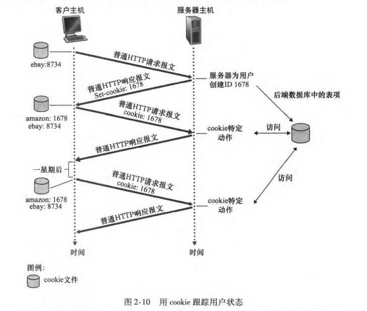
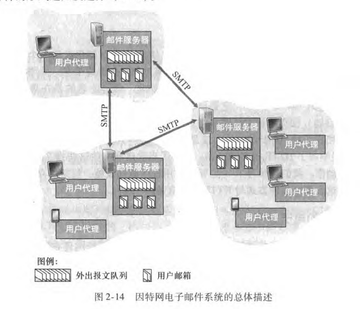

# 引言

## 基础概念

- 因特网：计算机网络(cornputer network )。因特网是一个世界范围的计算机网络，即它是一个互联了遍及全世界数十亿计算设备的网络。
- 协议(protocol)： 定义了在两个或多个通信实体之间交换的报文(message)的格式和顺序，以及报文发送和／ 或接收一条报文或其他事件所采取的动作。

## 目的

- 掌握计算机网络
  - 基本概念
  - 工作原理
  - 常用技术
- 为将来学习、应用和研究计算机网络打下一个坚实的基础
- 介绍计算机网络这个动态领域的最新知识，使他们深入地理解网络的原则和实践，使读者不仅能理解今天的网络,而且能理解明天的网络。

## 总览

1. 计算机网络和互联网
   - 第1章概述了计算机网络和因特网。这一章的目标是从整体上粗线条地勾勒出计算机网络的概貌，并且描述本书内容的框架。这一章包括大量的背景知识，讨论大量的计算机网络构件,而且将它们放在整个网络的大环境中进行讨论。

2. 自顶向下的分层
   - 应用层
   - 传输层
   - 网络层：数据平面
   - 网络层︰控制平面数据链路层和局域网
3. 拓展
   - 网络安全
   - 无线和移动网络
   - 多媒体网络
   - 网络管理

# 第一章 计算机网络和互联网

- 第1章概述了==计算机网络和因特网==。这一章的目标是从==整体上==粗线条地==勾勒出====计算机网络==的==概貌==，并且描述本书内容的==框架==。这一章包括大量的背景知识，讨论大量的计算机网络构件,而且将它们放在整个网络的大环境中进行讨论。
- 本章将以如下方式组织计算机网络的概述:在介绍了某些基本术语和概念后，将首先查看构成网络的基本硬件和软件组件。我们从网络的边缘开始，考察在网络中运行的==端系统和网络应用==;接下来探究计算机网络的核心，查看传输数据的链路和父抉机，以从付项系统与网络核心相连接的接入网和物理媒体。我们将了解因特网是“网络的网络”，开将得知这些网络是怎样彼此连接起来的。
- 在浏览完计算机网络的边缘和核心之后，本章的后半部分将从更广泛、更抽象的角度来考察计算机网络。我们将考察在计算机网络中数据的==时延、丢包和吞吐量==，给出一个端到端吞吐量和时延的简单定量模型:该模型兼顾了传输、传播和排队时延等因素。接下来，我们将介绍计算机联网时的一些关键的体系结构原则，如协议分层和服务模型。我们还将了解到计算机网络对于许多不同类型的攻击来说是脆弱的，将回顾其中的某些攻击并且考虑使计算机网络更为安全的方法。最后，我们将以计算机网络的简要历史结束本章的学习。

## 互联网的组成部分

- 什么是互联网?回答这个问题有两种方式:
  - 其一，我们能够描述因特网的具体构成，即构成因特网的基本硬件和软件组件;
  - 其二，我们能够根据为分布式应用提供服务的联网基础设施来描述因特网。

### 具体构成

1. ==因特网是一个世界范围的计算机网络，即它是一个互联了遍及全世界数十亿计算设备的网络==。
   - 由==端系统和主机==以及连接他们的==通信链路和分组交换机==连接起来，==协议==控制网络中信息的接受和发送。
     - 掌握计算机网络领域知识的过程就是理解网络协议的构成、原理和工作方式的过程。
2. 计算机网络（computer network)这个术语开始听起来有些过时了。用因特网术语来说，所有这些设备都称为==主机（host）或端系统（end system)==。
   - 设备：如传统的桌面PC、Linux 工作站和非传统的因寺网“物品”智能手机、平板电脑、电视和游戏机等
3. ==端系统通过**通信链路**（communication link）和**分组交换机**（packet switch)连接到一起==。
   - ==通信链路==：由不同类型的物理媒体组成。这些物理媒体包括同轴电缆、铜线、光纤和无线电频谱。
     - 不同的链路能够以不同的速率传输数据，链路的==传输速率== （ transmission rate)以比特/秒( bit/s，或bps）度量。
     - ==分组==：当一台端系统要向另一台端系统发送数据时，发送端系统将数据分段，并为每段加上首部字节。由此形成的信息包用计算机网络的术语来说称为分组( packet)。
   - ==分组交换机==从它的一条入通信链路接收到达的分组，并从它的一条出通信链路转发该分组。
     - 分类：这两种类型的交换机朝着最终目的地转发分组
       - 路由器(（router)：通常用于网络核心中
         - 网络核心：为边缘部分服务。
           - 边缘部分：用户直接使用：如c/s和p2p
       - 链路层交换机(（link-layer switch)：通常用于接入网中
         - 接入网是指骨干网络到用户终端之间的所有设备。其长度一般为几百米到几公里，因而被形象地称为"最后一公里"。
     - ==路径==:从发送端系统到接收端系统，一个分组所经历的一系列通信链路和分组交换机称为通过该网络的路径（route或path)。
4. ==端系统通过**因特网服务提供商**（Internet Service Provider,ISP）接入因特网==,如中国移动，中国联通的宽带。
   - 每个ISP自身就是一个由多台分组交换机和多段通信链路组成的网络。
   - 各ISP为端系统提供了各种不同类型的网络接入
     - 包括如线缆调制解调器或DSL那样的住宅宽带接入、高速局域网接入和移动无线接入。
     - ISP也为内容提供者提供因特网接入服务，将Web站点和视频服务器直接连人因特网。
   - 因特网就是将端系统彼此互联，因此为端系统提供接入的ISP也必须互联。
   - 较低层的ISP通过国家的、国际的较高层ISP(如 Level 3 Communica-tions、AT&T、Sprint和 NTT)互联起来。较高层ISP是由通过高速光纤链路互联的高速路由器组成的。无论是较高层还是较低层ISP网络，它们每个都是独立管理的，运行着IP协议（详情见后)，遵从一定的命名和地址规则。
5. ==端系统、分组交换机和其他因特网部件都要运行一系列**协议**（protocol)，这些协议控制因特网中信息的接收和发送。==
   - 协议定义了在两个或多个通信实体之间交换的报文格式和次序，以及在报文传输和/或接收或其他事件方面所采取的动作
   - 协议，网络协议的简称，网络协议是通信计算机双方必须共同遵从的一组约定。如怎么样建立连接、怎么样互相识别等。只有遵守这个约定，计算机之间才能相互通信交流。它的三要素是：语法、语义、时序。
     - ==语法==：即数据与控制信息的结构或格式；
     - ==语义==：即需要发出何种控制信息，完成何种动作以及做出何种响应；
     - ==时序（同步）==，即事件实现顺序的详细说明

### 服务描述

- 为应用程序提供服务的基础设施的角度来描述因特网。
- ==分布式应用程序==：应用程序分布在不同计算机上，通过网络来共同完成一项任务。通常为服务器/客户端模式。应用程序涉及多个相互交换数据的端系统，故它们被称为分布式应用程序 （ distributed application)。
- 运行在不同端系统上的软件将需要互相发送数据。此时我们碰到一个核心问题，这个问题导致了另一种描述因特网的方法，即将因特网描述为应用程序的平台。运行在一个端系统上的应用程序怎样才能指令因特网向运行在另一个端系统上的软件发送数据呢?
  - 与因特网相连的端系统提供了一个==套接字接口==( socket interface)，该接口规定了运行在一个端系统上的程序请求因特网基础设施向运行在另一个端系统上的特定目的地程序交付数据的方式。因特网套接字接口是一套发送程序必须遵循的规则集合，因此因特网能够将数据交付给目的地。

## 互联网的工作方式

### 边缘网络

- 通常把与因特网相连的计算机和其他设备称为端系统，因为它们位于因特网的边缘，故而被称为端系统。
- 主机=端系统
  - 分类
    - 客户端 client
    - 服务端 server

#### 接入网

- 接入网，这是指将端系统物理连接到其边缘路由器(edge router)的网络。边缘路由器是端系统到任何其他远程端系统的路径上的第一台路由器。

##### 接入方式

###### 家庭接入

- DSL、电缆、FTTH、拨号和卫星
- 宽带接入方式
  - 数字用户线（Digital Subscriber Line,DSL)
  - 电缆。住户通常从提供本地电话接入的本地电话公司处获得 DSL 因特网接入。

###### 企业（和家庭)接入

- 以太网和WiFi

###### 广域无线接人

- 3G和LTE

#### 物理媒体（physical medium)

##### 类型

- 导引型媒体（guided media）：电波沿着固体媒体前行，如光缆、双绞铜线或同轴电缆。
- 非导引型媒体（unguided media)。：电波在空气或外层空间中传播，例如在无线局域网或数字卫星频道中。

### 网络核心

- 由互联因特网端系统的分组交换机和链路构成的网状网络。
- 基本问题：数据如何通过网络进行传输？
  - 电路交换:为每个呼叫预留一条专有电路:如电话网
  - 分组交换
    - 将要传送的数据分成一个个单位:分组
    - 将分组从一个路由器传到相邻路由器(hop)，一段段最终从源端传到目标端
    - 每段:采用链路的最大传输能力（带宽)

#### 分组交换

- 在各种网络应用中、端系统彼此交换报文 ( message)
  - 报文(message)是网络中交换与传输的数据单元，即站点一次性要发送的数据块。报文包含了将要发送的完整的数据信息，其长短很不一致，长度不限且可变。
  - 分组：为了从源端系统向目的端系统发送一个报文，源将长报文划分为较小的数据块，称之为分组( packet)。
  - 在源和目的地之间，每个分组都通过通信链路和分组交换机（ packet switch )传送。
  - 交换机主要有两类:路由器（ router)和链路层交换机（ link-layer switch)。)
  - 分组以等于该链路最大传输速率的速度传输通过通信链路。因此如果某源端系统或分组交换机经过一条链路发送一个L比特的分组，链路的传输速率为R比特/秒，则传输该分组的时间为L/R秒。

##### 存储转发传输

- 多数分组交换机在链路的输人端使用存储转发传输（ store- and- forward transmission)机制。存储转发传输是指在交换机能够开始向输出链路传输该分组的第一个比特之前,必须接收到整个分组。

##### 排队时延和分组丢失

- ==输出队列/输出缓存==：每台分组交换机有多条链路与之相连。对于每条相连的链路，该分组交换机具有一个输出缓存（output buffer，也称为输出队列(output queue))它用于存储路由器准备发往那条链路的分组。该输出缓存在分组交换中起着重要的作用
- ==排队时延==：如果到达的分组需要传输到某条链路，但发现该链路正忙于传输其他分组，该到达分组必须在输出缓存中等待。因此，除了存储转发时延以外，分组还要承受输出缓存的排队时延( queuing delay)。这些时延是变化的，变化的程度取决于网络的拥塞程度。
- ==分组丢失/丢包==
  - 丢包（Packet loss）是指一个或多个数据数据包（packet）的数据无法透过网上到达目的地。
  - 因为缓存空间的大小是有限的，一个到达的分组可能发现该缓存已被其他等待传输的分组完全充满了。在此情况下，将出现分组丢失（丢包)(packet loss)，到达的分组或已经排队的分组之一将被丢弃。
  - 丢包可能原因是多方面，包括在网上中由于多路径衰落（multi-path fading）所造成的信号衰减（signal degradation），或是因为通道阻塞造成的丢包（packet drop），再者损坏的数据包（corrupted packets）被拒绝通过，或有缺陷的网上硬件，网上驱动程序故障都可能造成丢包。此外，丢包也受信号的信噪比（SNR）的影响。

##### 转发表和路由选择协议

- 路由器从与它相连的一条通信链路得到分组，然后向与它相连的另一条通信链路转发该分组。 但是路由器怎样决定它应当向哪条链路进行转发呢？不同的计算机网络实际上是以不同的方式完成分组转发的。
- 在因特网中，每个端系统具有一个称为IP 地址的地址 当源主机要向目的端系统发送一个分组时，源在该分组的首部包含了目的地的IP 地址。
- ==转发表==：当一个分组到达网络中的路由器时，路由器检查该分组的目的地址的一部分， 并向一台相邻路由器转发该分组。  更特别的是，每台路由器具有一个转发表( forwarding table) ,   用于将目的地址 （或目的地址的一部分）映射成为输出链路。
  - 当某分组到达一台路由器时，路由器检查该地址，并用这个目的地址搜索其转发表，以发现适当的出链路。路由器则将分组导向该出链路。

#### 电路交换

- 电路交换（CS:circuit switching）是通信网中最早出现的一种交换方式，也是应用最普遍的一种交换方式，主要应用于电话通信网中，完成电话交换，已有100多年的历史。

##### 电路交换网络中的复用

- 链路中的电路是通过频分复用(Frequency- Division Multiplexing，FDM）或时分复用(Time- Division Multiplexing，TDM）来实现的。
  - 频分复用(FDM，Frequency Division Multiplexing)就是将用于传输信道的总带宽划分成若干个子频带（或称子信道），每一个子信道传输1路信号。频分复用要求总频率宽度大于各个子信道频率之和，同时为了保证各子信道中所传输的信号互不干扰，应在各子信道之间设立隔离带，这样就保证了各路信号互不干扰（条件之一）。频分复用技术的特点是所有子信道传输的信号以并行的方式工作，每一路信号传输时可不考虑传输时延，因而频分复用技术取得了非常广泛的应用。频分复用技术除传统意义上的频分复用(FDM)外，还有一种是正交频分复用(OFDM)。
  - 时分复用TDM是采用同一物理连接的不同时段来传输不同的信号，也能达到多路传输的目的。时分多路复用以时间作为信号分割的参量，故必须使各路信号在时间轴上互不重叠。时分复用（TDM，Time-division multiplexing）就是将提供给整个信道传输信息的时间划分成若干时间片(简称时隙)，并将这些时隙分配给每一个信号源使用，保证资源的利用率。

###分组交换与电路交换的对比

- |      | 分组交换                                                     |      | 电路交换                                                     |
  | ---- | ------------------------------------------------------------ | ---- | ------------------------------------------------------------ |
  | 概念 | 分组交换是以分组为单位进行传输和交换的，它是一种存储——转发交换方式，即将到达交换机的分组先送到存储器暂时存储和处理，等到相应的输出电路有空闲时再送出。 |      | 电路交换是以电路连接为目的的交换方式，通信之前要在通信双方之间建立一条被双方独占的物理通道 |
  | 优点 | 分组交换不需要为通信双反预先建立一条专用的通信线路，不存在连接建立时延，用户可随时发送分组。 | 缺点 | 电路交换平均连接建立时间对计算机通信来说较长                 |
  |      | 由于采用存储转发方式，加之交换节点具有路径选择，当某条传输线路故障时可选择其他传输线路，提高了传输的可靠性。 |      | 电路交换家里连接后，物理通路被通信双方独占，即使通信线路空闲，也不能供其他用户使用，因而信道利用 |
  |      | 通信双反不是固定的战友一条通信线路，而是在不同的时间一段一段地部分占有这条物理通路，因而大大提高了通信线路的利用率。 |      | 电路交换时，数据直达，不同类型，不同规格，不同速率的终端很难相互进行通信，也难以在通信过程中进行差错控制。 |
  |      | 加速了数据在网络中的传输。因而分组是逐个传输，可以使后一个分组的存储操作与前一个分组的转发操作并行，这种流水线式传输方式减少了传输时间。 |      |                                                              |
  |      | 分组长度固定，相应的缓冲区的大小也固定，所以简化了交换节点中存储器的管理。 |      |                                                              |
  |      | 分组较短，出错几率减少，每次重发的数据量也减少，不仅提高了可靠性，也减少了时延。 |      |                                                              |
  | 缺点 | 由于数据进入交换节点后要经历存储转发这一过程，从而引起的转发时延（包括接受分组、检验正确性、排队、发送时间等），而且网络的通信量越大，造成的时延就越大，实时性较差。 | 优点 | 由于通信线路为通信双方用户专用，数据直达，所以传输数据的时延非常小。 |
  |      | 分组交换可能出现失序，丢失或重复分组，分组到达目的节点时，对分组按编号进行排序等工作，增加了麻烦。 |      | 双方通信时按发送顺序传送数据，不存在失序问题。               |
  |      | 分组交换只适用于数字信号。                                   |      | 电路交换既适用于传输模拟信号，也适用于传输数字信号。         |
  |      |                                                              |      | 电路交换的交换设备及控制均比较简单。                         |
  |      |                                                              |      | 通信双方之间的屋里通路一旦建立，双方可以随时通信，实时性强。 |

### 网络的网络

## 分组交换网中的时延、丢包和吞吐量

### 时延

- 当分组从一个节点（主机或路由器）沿着这条路径到后继节点（主机或路由器），该分组在沿途的每个节点经受了几种不同类型的时延。
- 节点总时延 ( total nodal delay ) 
  - 节点处理时延 (nodal processing delay) 
  - 排队时延 (queuing delay) 
  - 传输时延 ( transmission delay) 
  - 传播时延 (propagation delay) 

#### 处理时延

- 检查分组首部和决定将该分组导向何处所需要的时间是处理时延的一部分。

- 处理时延也能够包括其他因素，如检查比特级别的差错所需要的时间，该差错出现在从上游节点向路由器A传输这些分组比特的过程中。

- 高速路由器的处理时延通常是微秒或更低的数量级。在这种节点处理之后，路由器将该分组引向通往路由器B链路之前的队列。

#### 排队时延

- 在队列中，当分组在链路上等待传输时，它经受排队时延。
- 一个特定分组的排队时延长度将取决于先期到达的正在排队等待向链路传输的分组数量。
  - 如果该队列是空的,并且当前没有其他分组正在传输，则该分组的排队时延为0。
  - 另一方面，如果流量很大，并且许多其他分组也在等待传输，该排队时延将很长。
- 实际的排队时延可以是毫秒到微秒量级。

#### 传输时延

- 假定分组以先到先服务方式传输——这在分组交换网中是常见的方式，仅当所有已经到达的分组被传输后，才能传输刚到达的分组。
- 用L比特表示该分组的长度，用R bps(即 b/s)表示从路由器A到路由器B的链路传输速率。例如，对于一条10Mbps的以太网链路，速率R=10Mbps;对于100Mbps 的以太网链路，速率R = 100Mbps。传输时延是L/R。这是将所有分组的比特推向链路（即传输，或者说发射）所需要的时间。实际的传输时延通常在毫秒到微秒量级。

#### 传播时延

- 一旦一个比特被推向链路，该比特需要向路由器B传播。从该链路的起点到路由器B传播所需要的时间是传播时延。
  - 该比特以该链路的传播速率传播。
  - 该传播速率取决于该链路的物理媒体（即光纤、双绞铜线等)，其速率范围是2x108~3 x10'm/s，这等于或略小于光速。
  - 该传播时延等于两台路由器之间的距离除以传播速率。即传播时延是d/s，其中d是路由器A和路由器B之间的距离，s是该链路的传播速率。
  - 一旦该分组的最后一个比特传播到节点B，该比特及前面的所有比特被存储于路由器B。整个过程将随着路由器B执行转发而持续下去。
  - 在广域网中,传播时延为毫秒量级

#### 传输时延和传播时延的比较

- 传输时延是路由器推出分组所需要的时间，它是分组长度和链路传输速率的函数，而与两台路由器之间的距离无关。
- 传播时延是一个比特从一台路由器传播到另一台路由器所需要的时间，它是两台路由器之间距离的函数，而与分组长度或链路传输速率无关。

### 排队时延和丢包

- 排队时延
  - 什么时候排队时延大，什么时候又不大呢?该问题的答案很大程度取决于流量到达该队列的速率、链路的传输速率和到达流量的性质，即流量是周期性到达还是以突发形式到达。
  - 比率La/R 被称为流量强度(traffic intensity)
    - 令a 表示分组到达队列的平均速率(a 的单位是分组／秒，即pkt/s) 。
    - R 是传输速率，即从队列中推出比特的速率（以bps 即bis 为单位） 。
    - 假定所有分组都是由L 比特组成的。则比特到达队列的平均速率是La bps 。
    - 假定该队列非常大，因此它基本能容纳无限数量的比特。
  
- 丢包
  - 在上述讨论中，我们已经假设队列能够容纳无穷多的分组。在现实中，一条链路前的队列只有有限的容量，尽管排队容量极大地依赖于路由器设计和成本。因为该排队容量是有限的，随着流量强度接近1，排队时延并不真正趋向无穷大。相反，到达的分组将发现一个满的队列。由于没有地方存储这个分组,路由器将丢弃( drop）该分组,即该分组将会丢失(lost)。

### 端到端时延

- 从源到目的地的总时延

### 吞吐量

- 为了定义吞吐量，考虑从主机A到主机B跨越计算机网络传送一个大文件。例如，也许是从一个P2P文件共享系统中的一个对等方向另一个对等方传送一个大视频片段：
  - 在任何时间瞬间的瞬时吞吐量(instantaneous throughput）是主机B接收到该文件的速率（以bps 计)。(许多应用程序包括许多PP文件共享系统，其用户界面显示了下载期间的瞬时吞吐重，也计你以前已经观察过它!)
  - 如果该文件由F比特组成，主机B接收到所有F比特用去T秒,则文件传送的平均吞吐量 （ average throughput）是F/T' bps。

## 协议层次及其服务模型

### 分层的体系结构

- 利用分层的体系结构，我们可以讨论一个大而复杂系统的定义良好的特定部分。这种简化本身由于提供模块化而具有很高价值，这使某层所提供的服务实现易于改变。
- 只要该层对其上面的层提供相同的服务，并且使用来自下面层次的相同服务，当某层的实现变化时，该系统的其余部分保持不变。(注意到改变一个服务的实现与改变服务本身是极为不同的!）例如，如果登机口功能被改变了（例如让人们按身高登机和离机)，航线系统的其余部分将保持不变,因为登机口仍然提供相同的功能人们登机和离机);改变后,它仅是以不同的方式实现了该功能。对于大而复杂且需要不断更新的系统，改变服务的实现而不影响该系统其他组件是分层的另一个重要优点。

#### 协议分层

- 为了给网络协议的设计提供一个结构，网络设计者以分层 (layer) 的方式组织协议以及实现这些协议的网络硬件和软件。
- 每个协议属于这些层次之一
- 我们再次关注某层向它的上一层提供的服务 (service) ,   即所谓一层的服务模型 (service model) 。 
- 一个协议层能够用软件、硬件或两者的结合来实现。
- 协议分层具有概念化和结构化的优点。分层提供了一种结构化方式来讨论系统组件。模块化使更新系统组件更为容易。
- 一个分组具有两种类型的字段： 首部字段和有效载荷字段(payload field)
- 将这些综合起来，各层的所有协议被称为协议栈(protocol stack）。因特网的协议栈由5个层次组成
  - 应用层
    - 应用层是网络应用程序及它们的应用层协议存留的地方。
    - 应用层协议分布在多个端系统上，而一个端系统中的应用程序使用协议与另一个端系统中的应用程序交换信息分组。我们把这种位于==应用层的信息分组==称为==报文（message)==。
  - 运输层
    - 因特网的运输层在应用程序端点之间传送应用层报文。
    - 在因特网中,有两种运输协议，即TCP和 UDP，利用其中的任一个都能运输应用层报文TCP向它的应用程序提供了面向连接的服务。这种服务包括了应用层报文向目的地的确保传递和流量控制（即发送方/接收方速率匹配)。TCP也将长报文划分为短报文，并提供拥塞控制机制，因此当网络拥塞时，源抑制其传输速率。UDP协议向它的应用程序提供无连接服务。这是一种不提供不必要服务的服务，没有可靠性，没有流量控制，也没有拥塞控制。
    - 在本书中，我们把==运输层的分组==称为==报文段(segment)==。
  - 网络层
    - 因特网的网络层负责将称为==数据报 (datagram)或数据包（packet）== 的==网络层分组==从一台主机移动到另一台主机。 
    - 在一台源主机中的因特网运输层协议 (TCP 或UDP) 向网络层递交运输层报文段和目的地址，就像你通过邮政服务寄信件时提供一个目的地址一样。
    - 因特网的网络层包括著名的网际协议IP, 该协议定义了在数据报中的各个字段以及端系统和路由器如何作用于这些字段。
  - 链路层
    - 因特网的网络层通过源和目的地之间的一系列路由器路由数据报。
    - 为了将分组从一个节点（主机或路由器）移动到路径上的下一个节点，网络层必须依靠该链路层的服务。特别是在每个节点，网络层将数据报下传给链路层，链路层沿着路径将数据报传递给下一个节点。在该下一个节点，链路层将数据报上传给网络层。由链路层提供的服务取决于应用于该链路的特定链路层协议。例如，某些协议基于链路提供可靠传递，从传输节点跨越一条链路到接收节点。值得注意的是，这种可靠的传递服务不同于TCP的可靠传递服务，TCP提供从一个端系统到另一个端系统的可靠交付。链路层的例子包括以太网、WiFi和电缆接入网的DOCSIS 协议。因为数据报从源到目的地传送通常需要经过几条链路，一个数据报可能被沿途不同链路上的不同链路层协议处理。例如，一个数据报可能被一段链路上的以太网和下一段链路上的PPP所处理。网络层将受到来自每个不同的链路层协议的不同服务。
    - 在本书中，我们把==链路层分组==称为==帧(frame)==。
  - 物理层
    - 虽然链路层的任务是将整个帧从一个网络元素移动到邻近的网络元素，而物理层的任务是将该帧中的一个个**==比特==**从一个节点移动到下一个节点。在这层中的协议仍然是链路相关的，并且进一步与该链路（例如，双绞铜线、单模光纤)的实际传输媒体相关。例如，以太网具有许多物理层协议:一个是关于双绞铜线的，另一个是关于同轴电缆的,还有一个是关于光纤的，等等。在每种场合中，跨越这些链路移动一个比特是以不同的方式进行的。

#### OSI模型

### 封装（encapsulation)

- 在发送主机端，要发送信息，产生一个==应用层报文==（application-layer message)。
- ==应用层报文被传送给运输层==,在最简单的情况下，运输层收取到报文并附上附加信息，该首部将被接收端的运输层使用。应用层报文和运输层首部信息一道构成了运输层报文（transport-layer segment)。运输层报文段因此封装了应用层报文。附加的信息也许包括了下列信息:允许接收端运输层向上向适当的应用程序交付报文的信息;差错检测位信息，该信息让接收方能够判断报文中的比特是否在途中已被改变。
- ==运输层则向网络层传递该报文段==，网络层增加了如源和目的端系统地址等网络层首部信息，生成了网络层数据报(network- layer datagram)。
- ==网络层数据报接下来被传递给链路层==，链路层（自然而然地)增加它自己的链路层首部信息并生成链路层帧(link-layer frame)。
- 在每一层，一个分组具有两种类型的字段:首部字段和有效载荷字段( payload field)。有效载荷通常是来自上一层的分组。

## 面对攻击的网络

- 分布式拒绝服务攻击（Distributed denial of service attack，DDos）

## 计算机网络和因特网的历史

# 应用层

- 网络应用是计算机网络存在的理由，如果我们不能构想出任何有用的应用，也就没有任何必要去设计支持它们的网络协议了。

## 应用层协议原理

- 应用层对应用程序的通信提供服务。

- 应用层协议（application- layer protocol）∶定义了运行在不同端系统上的应用程序进程如何相互传递报文。

  - 应用进程交换的报文类型，请求还是响应?
  - 各种报文类型的语法，如报文中的各个字段及其详细描述。
  - 字段的语义，即包含在字段中的信息的含义。
  - 进程何时、如何发送报文，以及对报文进行响应的规则。

- | 应用层的功能           | 应用层的重要协议                                             |
  | ---------------------- | ------------------------------------------------------------ |
  | 文件传输、访问和管理   | FTP（File Transfer Protocol）                                |
  | 电子邮件               | SMTP(Simple Mail Transfer Protocol)、POP3(Post Office Protocol - Version 3) |
  | 虚拟终端               | HTTP(Hyper Text Transfer Protocol)                           |
  | 查询服务和远程作业登录 | DNS(Domain Name System)                                      |

### 网络应用程序体系结构

- 应用程序体系结构 (application architecture) : 由应用程序研发者设计，规定了如何在各种端系统上组织该应用程序。
  - 客户－服务器体系结构 (client-server architecture)
  - P2P 体系结构 (Peer-to-peer architecture)

#### 客户－服务器体系结构

- 服务器︰提供计算服务的设备。
  - 永久提供服务
  - 永久性访问地址/域名

- 客户机︰请求计算服务的主机。
  - 与服务器通信，使用服务器提供的服务
  - 间歇性接入网络
  - 可能使用动态IP地址
  - 不与其他客户机直接通信

- 应用: Web，文件传输FTP，远程登录，电子邮件

#### P2P 体系结构

- 不存在永远在线的服务器
- 每个主机既可以==提供服务==，也可以==请求服务==
- 任意端系统/节点之间可以==直接通讯==
- 节点间歇性接入网络
- 节点可能改变IP地址可扩展性好
- 网络健壮性强
- 自扩展性 (self- scalability) :在一个P2P 文件共享应用中，尽管每个对等方都由于请求文件产生工作负载，但每个对等方通过向其他对等方分发文件也为系统增加服务能力。

### 进程通信

- 用操作系统的术语来说，进行通信的实际上是进程（process）而不是程序。

- 一个进程可以被认为是运行在端系统中的一个程序。当多个进程运行在相同的端系统上时，它们使用进程间通信机制相互通信。进程间通信的规则由端系统上的操作系统确定。
- 在两个不同端系统上的进程，通过跨越计算机网络交换报文（message）而相互通信。

#### 客户和服务器进程

- 网络应用程序由成对的进程组成，这些进程通过网络相互发送报文。  
- 对每对通信进程,我们通常将这两个进程之一标识为客户（client)，而另一个进程标识为服务器（server) 
  - 在一对进程之间的通信会话场景中
    - 客户：发起通信（即在该会话开始时发起与其他进程的联系）的进程被标识为客户
    - 服务器：在会话开始时等待联系的进程是服务器。

#### 进程与计算机网络之问的接口

- 从一个进程向另一个进程发送的报文必须通过下面的网络。 进程通过一个称为==套接字== (sock­et )  的软件接口向网络发送报文和从网络接收报文。
- 套接字是同一台主机内应用层与运输层之间的接口。
  - 对于使用面向连接服务（TCP）的应用而言，套接字是4元组的一个具有本地意义的标示
    - 4元组：(源IP，源port，目标IP，目标port)
    - 唯一的指定了一个会话（2个进程之间的会话关系）
    - 应用使用这个标示，与远程的应用进程通信

- 由于该套接字是建立网络应用程序的可编程接口，因此套接字也称为应用程序和网络之间的应用程序编程接口 (Application Programming Interface,  API ) 。
- 应用程序开发者可以控制套接字在应用层端的一切，但是对该套接字的运输层端几乎没有控制权。
  - 对传输层的控制
    - 选择运输层协议
    - 也许能设定几个运输层参数，如最大缓存和最大报文段长度等

#### 进程寻址

- 为了向特定目的地发送邮政邮件，目的地需要有一个地址，类似地，在一台主机上运行的进程为了向在另一台主机上运行的进程发送分组，接收进程需要有一个地址。为了标识该接收进程， 需要定义两种信息：
  - 主机的地址。
  - 在目的主机中指定接收进程的标识符。（目的主机地址）
- 在因特网中，主机由其IP (internet address) 标识

### 可供应用程序使用的运输服务

- 套接字是应用程序进程和运输层协议之间的接口。在发送端的应用程序将报文推进该套接字。  在该套接字的另一侧，运输层协议负责从接收进程的套接字得到该报文。

- 运输层服务分类
  - 可靠数据传输
  - 吞吐量：在沿着一条网络路径上的两个进程之间的通信会话场景中，可用吞吐量就是发送进程能够向接收进程交付比特的速率。
  - 定时：运输层协议也能提供定时保证
  - 安全性：运输协议能够为应用程序提供一种或多种安全性服务。

### 因特网提供的运输服务

- TCP 服务模型包括面向连接服务和可靠数据传输服务以及拥塞控制机制
- UDP是一种不提供不必要服务的轻量级运输协议，它仅提供最小服务。  UDP 是无连接的，因此在两个进程通信前没有握手过程。 UDP 协议提供一种不可靠数据传送服务，也就是说，当进程将一个报文发送进UDP 套接字时， UDP 协议并不保证该报文将到达接收
  进程。  不仅如此，到达接收进程的报文也可能是乱序到达的。没有包括拥塞控制机制

## Web 和HTTP

- Web的应用层协议是超文本传输协议（HyperText Transfer Protocol, HTTP)，它是Web的核心，在「[RFC 1945]和[RFC 2616]中进行了定义。
- HTTP由两个程序实现:一个客户程序和一个服务器程序。客户程序和服务器程序运行在不同的端系统中,通过交换HTTP 报文进行会话。
  - 客户: 请求、接收和显示 Web对象的浏览器
  - 服务器: 对请求进行响应，发送对象的Web服务器

- HTTP定义了这些报文的结构以及客户和服务器进行报文交换的方式。
- 术语
  - Web页：由一些对象组成
    - 对象可以是HTML文件、JPEG图像、Java小程序、声音剪辑文件等
    - Web页含有一个基本的HTML文件，该基本HTML文 件又包含若干对象的引用（链接）
    - 通过URL对每个对象进行引用 ，形式：访问协议，用户名，口令字，端口等；
- HTTP 使用TCP 作为它的支撑运输协议（而不是在UDP上运行)。
- 因为 HTTP服务器并不保存关于客户的任何信息，所以我们说HTTP是一个无状态协议（ stateless protocol)。
  - 维护状态的协议很复杂！ 
  - 必须维护历史信息(状态) 
  - 如果服务器/客户端死机，它们的状态信息可能不一致， 二者的信息必须是一致
  - 无状态的服务器能够支持更多的客户端

### 非持续连接和持续连接

- 非持续连接（ non- persistent connection)：当客户 －服务器的交互是经TCP 进行的，每个请求／响应对经一个单独的TCP 连接发送

- 持续连接（persistent connection)：当客户 －服务器的交互是经TCP 进行的，所有的请求及其响应经相同的TCP 连接发送

#### 采用非持续连接的HTTP

- 往返时间 ( Round-Trip Time,  RTT)：该时间是指一个短分组从客户到服务器然后再返回客户所花费的时间。 
- 从服务楛向客户传送一个Web 页面的步骤：假设该页面含有一个HTML 基本文件和10 个JPEG 图形、并且这1 1 个对象位于同一台服务器上。进一步假设该HTML文件的URL为:http:// www. someSchool. edu/someDepartment/home. index 。
  1. HTTP客户进程在端口号80发起一个到服务器www.someSchool. edu的TCP连接,该端口号是 HTTP的默认端口。在客户和服务器上分别有一个套接字与该连接相关联。
  2. HTTP客户经它的套接字向该服务器发送一个HTTP请求报文。请求报文中包含了路径名/ someDepartment/home. index（后面我们会详细讨论HTTP报文)。
  3. HTTP服务器进程经它的套接字接收该请求报文，从其存储器（RAM或磁盘)中检索出对象www. someSchool. edu/ someDepartment/home. index，在一个 HTTP响应报文中封装对象，并通过其套接字向客户发送响应报文。
  4. HTTP服务器进程通知TCP断开该TCP连接。(但是直到TCP确认客户已经完整地收到响应报文为止，它才会实际中断连接。)
  5. HTTP客户接收响应报文，TCP 连接关闭。该报文指出封装的对象是一个 HTML文件，客户从响应报文中提取出该文件，检查该HTML 文件，得到对10个JPEG图形的引用。
  6. 对每个引用的JPEG图形对象重复前4个步骤。
- 缺点
  - 每个对象要2个 RTT
  - 操作系统必须为每个TCP连接分 配资源
  - 但浏览器通常打开并行TCP连接 ，以获取引用对象

#### 采用持续连接的HTTP

- 服务器在发送响应后，仍保持 TCP连接

- 在相同客户端和服务器之间的后 续请求和响应报文通过相同的连 接进行传送

- 客户端在遇到一个引用对象的时候，就可以尽快发送该对象的请 求
- 非流水方式的持久HTTP： 
  - 客户端只能在收到前一个响应后才能发出新的请求
  - 每个引用对象花费一个RTT
- 流水方式的持久HTTP：
  - HTTP/1.1的默认模式
  - 客户端遇到一个引用对象就立即产生一个请求
  - 所有引用（小）对象只花费一个 RTT是可能的

### HTTP 报文格式

- HTTP 规范 [ RFC 1945;  RFC 2616;  RFC 7540]  包含了对HTTP报文格式的定义。HTTP报文有两种：请求报文和响应报文
- 

  - ```text
    CR  = <US-ASCII CR, carriage return (13)>
    LF  = <US-ASCII LF, linefeed (10)>
    SP  = <US-ASCII SP, space (32)>
    ```

#### HTTP 请求报文

- ```java
  GET   /somedir/page.html  HTTP/1.1 
  Host:   www. someschool.edu
  Connection :   close
  User- age nt:   Mozilla/5.0 
  Accept-language:   fr
  
  (一个额外的换行回车符) //换行回车符，表示报文结束
  ```

- 一个请求报文能够具有更多的行或者至少为一行。

- HTTP 请求报文的第一行叫作请求行 ( request line) ,  其后继的行叫作首部行 (header line) 。

  - 请求行有3 个字段：方法字段、 URL 字段和HTTP 版本字段。  
    - 方法字段可以取几种不同的值，包括GET、  POST、  HEAD、  PUT 和 DELETE
    - 当浏览器请求一个对象时，使用GET方法，在URL字段带有请求对象的标识。
    - 其版本字段是自解释的； 在本例中，浏览器实现的是HTTP/1. 1 版本。
  - 首部行:首部行仅是HTTP 中可用的众多内容协商首部之一
    - Host :    www. sorneschool. edu 指明了对象所在的主机。你也许认为该首部行是不必要的，因为在该主机中已经有一条TCP 连接存在了。但是该首部行提供的信息是Web 代理高速缓存所要求的。
    - Connection : close 首部行，该浏览器告诉服务器不要麻烦地使用持续连接，它要求 服务器在发送完被请求的对象后就关闭这条连接。
    - User- agent : 首部行用来指明用户代理,即向服务器发送请求的浏览器的类型。 这里浏览器类型是Mozilla/5. 0, 即 Firefox 浏览器。
    - Accept- language : 首部行表示用户想得到该对象的法语版本 （ 如果服务器中有这样的对象的话）;否则，服务器应当发送它的默认版本。

- 

#### HTTP 响应报文

- ```java
  HTTP/1.1 200 OK\r\n  //状态行 (协议版本、状态码和相应状态信息)
  Connection close\r\n          //首部行开始
  Date: Thu, 06 Aug 1998 12:00:15 GMT\r\ 
  Server: Apache/1.3.0 (Unix) \r\n 
  Last-Modified: Mon, 22 Jun 1998 …... \ 
  Content-Length: 6821\r\n
  Content-Type: text/html\r\n   //首部行结束
  \r\n
  \r\n
  data data data data data ... //数据，如请求的HTML文件
  ```

- 状态码

  - 200 OK：请求成功，请求对象包含在响应报文的后续部分
  - 301 Moved Permanently：请求的对象已经被永久转移了;新的URL在响应报文的Location:首部行中指定，客户端软件自动用新的URL去获取对象
  - 400 Bad Request：一个通用的差错代码，表示该请求不能被服务器解读
  - 404 Not Found：请求的文档在该服务上没有找到
  - 505 HTTP Version Not supported
  - 500 internal server error：服务器内部错误

#### 用户与服务器的交互：   cookie

- cookie技术有4个组件:
  - 在 HTTP响应报文中的一个cookie首部行;
  - 在 HTTP请求报文中的一个cookie首部行;
  - 在用户端系统中保留有一个cookie文件，并由用户的浏览器进行管理;
  - 位于Web站点的一个后端数据库。
- 

## 电子邮件

### SMTP

- 电子邮件系统组成：用户代理（user agent）、邮件服务器(mail server)和简单邮件传输协议（Simple Mail Transfer Protocol， SMTP)。
  - 邮件服务器形成了电子邮件体系结构的核心。  每个接收方（如Bob) 在其中的某个邮件服务器上有一个邮箱 (mailbox) .邮箱管理和维护着发送给他的报文。
  - 如果A 的服务器不能将邮件交付给B 的服务器，A的邮件服务器在一个报文队列 (message queue) 中保持该报文并在以后尝试再次发送。如果几天后仍不能成功，服务器就删除该报文并以电子邮件的形式通知发送方 (A) 。
  - 
- SMTP是因特网电子邮件中主要的应用层协议。  它使用TCP 可靠数据传输服务，从发送方的邮件服务器向接收方的邮件服务器发送邮件。
- 使用TCP在客户端和服务器之间传送报文，端口 号为25
- 直接传输：从发送方服务器到接收方服务器 
- 传输的3个阶段 握手->传输报文->关闭
- 命令/响应交互
  - 命令：ASCII文本
  - 响应：状态码和状态信息 
  - 报文必须为7位ASCII码
- 步骤
  1. Alice使用用户代理撰写邮件并发送给bob@someschool.edu
  2. Alice的用户代理将邮件发送到她的邮件服务器；邮件放在报文队列中
  3. SMTP的客户端打开到Bob邮件服务器的TCP连接
  4. SMTP客户端通过TCP连接发送Alice的邮件
  5. Bob的邮件服务器将邮件放到Bob的邮箱
  6. Bob调用他的用户代理阅读邮件
- 
- 

### SMTP与HTTP 的对比

| SMTP                                                         | HTTP                                                         |
| ------------------------------------------------------------ | ------------------------------------------------------------ |
| SMTP 从一个邮件服务器向另一个邮件服务器传送文件(即电子邮件报文)。 | HTTP 从 Web服务器向Web客户（通常是一个浏览器）传送文件（也称为对象) |
| TCP                                                          | TCP                                                          |
| 推协议 (push protocol) ,  即发送邮件服务器把文件推向接收邮件服务器 | 拉协议（pull protocol ),即在方便的时候，某些人在Web服务器上装载信息，用户使用HTTP从该服务器拉取这些信息。 |
| TCP连接是由要发送该文件的机器发起的。                        | TCP 连接是由想接收文件的机器发起的。                         |
| 每个报文（包括它们的体）采用7 比特ASCII 码格式。如果某报文包含了非7 比特ASCII 字符（如具有重音的法文字符）或二进制数据（如图形文件），则该报文必须按照7 比特ASCII 码进行编码。 | 不受这种限制。                                               |
| 处理一个既包含文本又包含图形的文档，SMTP则把所有报文对象放在一个报文之中 | 把每个对象封装到它自己的HTTP 响应报文中                      |

### 邮件报文格式

- ```java
  From: alice@crepes.fr 
  To: bob@hamburger.edu
  Subject:   Searching for the meaning of life.
  ```

  - 当一个人给另一个人发送电子邮件时，一个包含环境信息的首部位于报文体前面。这些环境信息包括在一系列首部行中，这些行由 RFC 5322 定义。  首部行和该报文的体用空行（即回车换行）进行分隔。  RFC 5322 定义了邮件首部行和它们的语义解释的精确格式。

  - 每个首部必须含有一个From: 首部行和一个To:    首部行；一个首部也许包含一个Subject: 首部行以及其他可选的首部行。

  - 在报文首部之后，紧接着一个空白行，然后是以ACSII 格式表示的报文体。 你应当用Telnet 向邮件服务器发送包含一些首部行的报文，包括Subject: 首部行。  为此，输入命令telnet serverName 25

### 邮件访问协议

- 第三版的邮局协议 ( Post Office Protocol—Version 3,  POP3 ) 、   因特网邮件访问协议 ( Internet Mail  Access  Protocol IMAP) 以及HTTP。

####  POP3

- 端口110 

- 

#### IMAP


#### 基千Web 的电子邮件


## DNS

- 域名系统（英文：Domain Name System，缩写：DNS）是互联网的一项服务。它作为将域名和IP地址相互映射的一个分布式数据库，能够使人更方便地访问互联网。DNS 协议运行在UDP 之上，使用53 号端口。当前，对于每一级域名长度的限制是63个字符，域名总长度则不能超过253个字符。
  1. 一个由分层的DNS 服务器( DNS server) 实现的分布式数据库；

  2. 一个使得主机能够查询分布式数据库的应用层协议。

- 主机别名 ( host aliasing儿 有着复杂主机名的主机能拥有一个或者多个别名。 例 如， 一台名为relayl. west- coast. enterprise. com 的主机，可能还有两个别名为enter­prise. com 和www. enterprise. com。 在这种情况下， relay1. west- coast enterprise. com也称为规范主机名 (canonical hoslname) 。  主机别名（当存在时）比主机规范名更加容易记忆。 应用程序可以调用DNS 来获得主机别名对应的规范主机名以及主机的IP 地址。
- 邮件服务器别名 (（mail server aliasing)。显而易见，人们也非常希望电子邮件地址好记忆。例如，如果Bob在雅虎邮件上有一个账户，Bob 的邮件地址就像bob@ ya-hoo. com这样简单。然而，雅虎邮件服务器的主机名可能更为复杂，不像 ya-hoo.com那样简单好记（例如，规范主机名可能像relayl. west- coast. hotmail. com.那样)。电子邮件应用程序可以调用DNS，对提供的主机名别名进行解析，以获得该主机的规范主机名及其IP地址。
- 负载分配(（ load distribution)。DNS也用于在冗余的服务器（如冗余的Web服务器等)之间进行负载分配。繁忙的站点（如cnn.com）被冗余分布在多台服务器上，每台服务器均运行在不同的端系统上，每个都有看不同的地址。田丁这些几尔的Web服务器，一个IP地址集合因此与同一个规范主机名相联系。DNS数据库中存储着这些IP地址集合。当客户对映射到某地址集合的名字发出一个 DNS请求时，该服务器用IP地址的整个集合进行响应，但在每个回答中循环这些地址次序。因为客户通常总是向IP地址排在最前面的服务器发送HTTP请求报文，所以DNS就在所有这些冗余的 Web服务器之间循环分配了负载。DNS 的循环同样可以用于邮件服务器，因此，多个邮件服务器可以具有相同的别名。

- 

## FTP

- 文件传送协议FTP (File Transfer Protocol) ：提供不同种类主机系统（硬、软件体系等都可以不同）之间的文件传输能力。
- 简单文件传送协议TFTP (Trivial File Transfer Protocol) 

### FTP服务器和用户端

- FTP是基于客户/服务器(C/S)的协议。
- 用户通过一个客户机程序连接至在远程计算机上运行的服务器程序。
- 依照FTP协议提供服务，进行文件传送的计算机就是FTP服务器。
- 连接FTP服务器，遵循FTP协议与服务器传送文件的电脑就是FTP客户端。

- 


- FTP传输模式
  - 文本模式︰ASCII模式，以文本序列传输数据﹔
  - 二进制模式:Binary模式,以二进制序列传输数据。

# 传输层

- 传输层是整个网络体系结构中的关键层次之一，主要负责向两个主机中进程之间的通信提供服务。
- 由于一个主机同时运行多个进程，因此运输层具有复用和分用功能。
- 传输层在终端用户之间提供透明的数据传输，向上层提供可靠的数据传输服务。
- 传输层在给定的链路上通过流量控制、分段/重组和差错控制来保证数据传输的可靠性。
- 传输层的一些协议是面向链接的，这就意味着传输层能保持对分段的跟踪，并且重传那些失败的分段。

## 运输层和网络层的关系

- 网络层提供了主机之间的逻辑通信，
- 运输层为运行在不同主机上的进程之间提供了逻辑通信。

## 传输层概览

- 网络层iP 的服务模型是尽力而为交付服务 (best- effort  deli very  service) ，但它并不做任何确保。  特别是，它不确保报文段的交付，不保证报文段的按序交付， 不保证报文段中数据的完整性。  由于这些原因， IP 被称为不可靠服务 ( unreliable service) 。

- UDP 和 TCP 所提供的服务模型，UDP 和TCP 最基本的责任是，将两个端系统间IP 的交付服务扩展为运行在端系统上的两个进程之间的交付服务。  
- 将主机间交付扩展到进程间交付被称为运输层的多路复用(transport- layer 1nultiplexing)  与多路分解 (demultiplexing) 。
- UDP 和TCP 还可以通过在其报文段首部中包括差错检查字段而提供完整性检查。
- ==UDP服务==：进程到进程的数据交付和差错检查是两种最低限度的运输层服务、也是UDP 所能提供的仅有的两种服务。  
- ==TCP服务==：在UDP服务的基础上
  - 它提供可靠数据传输（relia-ble data transfer)。通过使用流量控制、序号、确认和定时器（本章将详细介绍这些技术),TCP确保正确地、按序地将数据从发送进程交付给接收进程。这样，TCP就将两个端系统间的不可靠IP服务转换成了一种进程间的可靠数据传输服务。
  - TCP还提供拥塞控制(con-gestion control)。拥塞控制与其说是一种提供给调用它的应用程序的服务，不如说是一种提供给整个因特网的服务，这是—种带来通用好处的服务。不太严格地说,TCP 拥塞控制防止任何一条TCP连接用过多流量来淹没通信主机之间的链路和交换设备。TCP力求为每个通过一条拥塞网络链路的连接平等地共享网络链路带宽。这可以通过调节TCP连接的发送端发送进网络的流量速率来做到。在另一方面，UDP流量是不可调节的。使用UDP传输的应用程序可以根据其需要以其愿意的任何速率发送数据。

## 多路复用与多路分解

- 将运输层报文段中的数据交付到正确的套接字的工作称为多路分解 (demulti plexing)

- 在源主机从不同套接字中收集数据块，并为每个数据块封装上首部信息（这将在以后用于分解）从而生成报文段，然后将报文段传递到网络层，所有这些工作称为多路复用 ( multiplexing) 。  

- 

  - 特殊字段是源端口号字段 (source port number field) 和目的端口号字段 ( destination port number field ) 。 (UDP 报文段和TCP报文段还有其他的一些字段）
  - 

  - 

### 无连接的多路复用与多路分解


- 一个UDP 套接字是由一个二元组全面标识的，该二元组包含一个目的IP 地址和一个目的端口号。  


