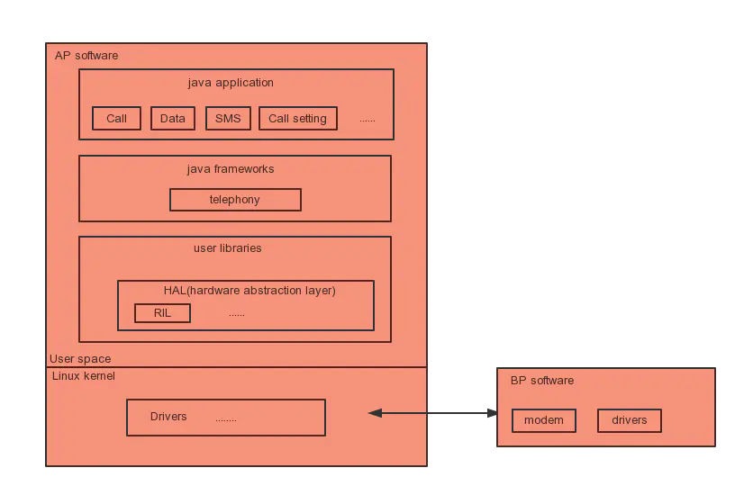

# 序言

- 背景：Android Telephone作为Android手机中的核心模块，为手机提供了基础的通信能力，其逻辑处理、运行效率和稳定性是Android手机定制开发过程中的重点和难点
- Telephony模块作为一个智能手机的核心部件, 是区别移动OS与桌面OS的重要标志。
- 从接打电话、网络服务、数据上网三方面解析Telephony。
  - 深入解析通话流程、详解Telecom、详解TeleService、Voice Call语音通话模型、ServiceState 网络服务、Data Call移动数据业务、SMS & MMS业务、Radio Interface Layer.
- Android Telephony业务跨度大，涉及多个层之间的交互:应用层、系统框架层、HAL 硬件抽象层和BP Modem。

# 初识Android

## 智能手机的系统结构

- 手机分类
  - 功能手机( Feature Phone )：具有传统手机的基本功能，如打电话、发短信、照相等。
  - 智能手机( Smart Phone )：具有开放的操作系统、硬件和软件的可扩充性和支持第三方的二次开发。
- 
  - 智能手机的基本硬件结构大多采用双处理器架构:主处理器和从处理器。
    - 主处理器运行开放式操作系统以及操作系统之上的各种应用，负责整个系统的控制;
    - 从处理器负责无线通信基本能力，主要包括DBB ( Digital Baseband,数字基带)和ABB( Analog Baseband,模拟基带), 完成语音信号和数字信号调制解调、信道编码解码和无线Modem控制。
    - 主处理器AP ( Application Processor,应用处理器),从处理器BP ( Baseband Processor,基带处理器)，它们之间通过串口、总线或USB等方式进行通信。

## Android系统架构

- Android 是一个分层的基于Linux Kernel的智能手机操作系统，共分为四层，从上到下依次是应用层( Applications )、应用框架层( Framework)、系统运行库层( Libraries )和核心层( Linux Kernel )
  - 系统运行库层
    - 系统运行库层包含了Android Runtime,其核心为Dalvik虚拟机。每一个Andraid应用程序都运行在Dalvik虚拟机之上，且每一个应用程序都有自己独立运行的进程空间; Dalvik 虚拟机只执行DEX可执行文件。DEX(Dalvik Executable)格式是专为Dalvik 设计的一种压缩格式，适合内存和处理器速度有限的系统。要生成DEX格式文件，首先通过Java程序编译生成class文件，然后通过Android提供的dx工具将class文件格式转换成DEX格式。
      - 特征
        - 每一个Android应用运行在-个Dalvik虚拟机实例中，而每一个虚拟机实例都是一个独立的进程空间。
        - 虚拟机的线程机制、内存分配和管理、Mutex (进程同步)等的实现都依赖底层Linux操作系统。
        - 所有Android应用的线程都对应一个Linux线程，因而虚拟机可以更多地使用Linux操作系统的线程调度和管理机制。
      - Dalvik虚拟机并不是按照Java虚拟机的规范来实现的，两者并不兼容;它们之间最大的不同在于Java虚拟机运行的是Java字节码，而Dalvik虚拟机运行的是其专有的文件格式DEX ( Dalvik Executable )文件。

## Android Telephony框架结构

- 
  - Android Telephony的业务应用跨越AP和BP，AP与BP相互通信，符合前面介绍的智能手机的硬件基本结构。
  - Android系统在AP上运行，而Telephony运行在Linux Kernel之上的用户空间。
  - Android Telephony也采用了分层结构的设计,共跨越了三层:应用层、应用框架层和系统运行库层，与Android操作系统整体分层结构保持一致;
  - Android Telephony从上到下共分三层: Telephony 应用、Telephony 框架、RIL ( Radio Interface Layer,无线通信接口层，主要位于系统运行库层的HAL中)
  - BP SoftWare在BP上运行，主要负责实际的无线通信能力处理

### 系统运行库层的HAL

- HAL ( Hardware Abstraction Layer, 硬件抽象层)在Linux和Windows操作系统平台下有不同的实现方式。
  - Windows下的HAL位于操作系统的最底层，它直接操作物理硬件设备，用来隔离与不同硬件相关的信息，为上层的操作系统和设备驱动程序提供一个统一接口， 起到对硬件的抽象作用。
  - Linux下的HAL并不是位于操作系统的最底层，它位于操作系统核心层和驱动程序之上，是一个运行在用户空间中的服务程序。
- 

- 作用
  - HAL是一个位于操作系统和驱动程序之上，运行在用户空间中的服务程序。其目的是对上层应用提供一个统一的查询硬件设备的接口。HAL所谓的抽象并不提供对硬件的实际操作，对硬件的操作仍然由具体的驱动程序来完成。
  - 将原本应该包括在Linux Kernel中的某些驱动关键处理逻辑，转移到了HAL层中，从而达到了不必开源的目的。避免使用linux kernel的GPL（General Public License），而使用Android的ASL(Apache Software License)

#### HAL的运行结构

- 
  - 分类
    - 老式HAL结构：应用或框架通过so动态链接库调用从而达到对硬件驱动的访问。在so动态链接库里，实现了对驱动的访问逻辑处理。
    - 新式HAL结构：采用Stub代理方式调用。HAL Stub是一种代理概念，虽然Stub仍是以`*.so`的形式存在，但HAL已经将`*.so` 的具体实
      现隐藏了起来。Stub 向HAL提供operations方法，Runtime 通过Stub提供的so获取它的operations方法，并告知Runtime的callback方法。这样Runtime和Stub都有对方调用的方法，一个应用的请求通过Runtime调用Stub的operations方法，而Stub响应operations方法并完成后，再调用Runtime的callback方法返回。
      - 
      - HAL Stub有一种包含关系， 即HAL里包含了很多的Stub。Runtime 只要说明请求类型，就可以取得并操作Stub对应的operations方法。其实现主要在hardware.c和hardware.h文件中。实质也是通过dlopen方法加载.so动态链接库,从而调用.so里的符号( symbol )实现。

# 搭建Android源代码编译调试环境

- 步骤
  1. 安装Ubuntu
  2. 安装JDK
  3. 更新Ubuntu系统工具包
  4. 编译Android源代码
  5. 下载AndroidStudio和AndroidSDK

## Android Debug Bridge (adb)

- Android 调试桥 (adb) 是一种功能多样的命令行工具，可让您与设备进行通信。adb 命令可用于执行各种设备操作（例如安装和调试应用），并提供对 Unix shell（可用来在设备上运行各种命令）的访问权限。它是一种客户端-服务器程序，组件：

  - **客户端**：用于发送命令。客户端在开发机器上运行。您可以通过发出 adb 命令从命令行终端调用客户端。

  - **守护程序 (adbd)**：用于在设备上运行命令。守护程序在每个设备上作为后台进程运行。

  - **服务器**：用于管理客户端与守护程序之间的通信。服务器在开发机器上作为后台进程运行。

- | 命令                        | 说明                |
  | --------------------------- | ------------------- |
  | adb logcat -vthreadtime     | 查看main日志的命令  |
  | adb logcat -vtime -b radio  | 查看radio日志的命令 |
  | adb logcat -vtime -b events | 查看event日志的命令 |

# 通话流程

## 前置

### 同步和异步

- Synchronous (同步)和Asynchronous (异步)的概念最早来自通信领域。
  - 通信的同步指客户端在发送请求后,必须要在服务端有回应后客户端才继续发送其他请求,所以这时所有请求将会在服务端得到同步，直到服务端返回请求。
  - 通信的异步:指客户端在发送请求后,不必等待服务端的回应就可以发送下一个请求,对所有的请求动作来说将会在服务端得到异步,这条请求的链路就像是一个请求队列,所有的请求动作在这里不会得到同步。

### Handler消息处理机制

- 每一个消息发送到主线程的消息队列中，消息队列遵循先进先出原则，发送消息并不会阻塞线程，而接收线程会阻塞线程。
- Handler允许发送并处理Message消息，Message对象通过主线程的MessageQueue消息队列相关联的Message和Runnable对象进行存取。每个Handler实例对Message消息发送和接收与对应主线程和主线程的消息队列有关。当创建一个新Handler时，Handler就属于当前主线程，主线程的MessageQueue消息队列也同步创建，即Handler会绑定到创建该Handler主线程/消息队列中。然后，Handler就可以通过主线程的消息队列发送和接收Message消息对象了。
- 特性
  - Android里没有全局Message Queue消息队列，每个Activity主线程都有一个独立的Message Queue消息队列，消息队列采用先进先出原 则。不同APK应用不能通过Handler进行Message通信，同一个APK应用中可通过Handler对象传递而进行Message通信。
  - 个Handler实例都会绑定到创建它的线程中（一般位于主线程，即Activity线程），但Handler实例均可在主线程或子线程中创建。
  - Handler发送消息使用Message Queue消息队列，每个Message发送到消息队列里面，遵循先进先出原则；发送消息采用异步方式不 
    会阻塞线程，而接收线程采用同步方式会阻塞线程，所以当Handler处理完一个Message对象后才会接着去取下一个消息进行处理。
- 作用
  - Handler主要作用是异步处理较费时的逻辑，优先将界面返回给用户，异步处理完成后再去更新用户界面。

### AIDL跨应用服务

- AIDL（Android Interface Definition Language, Android接口定义语 言）Android系统平台的接口定义语言与您可能已经使用过的其他IDLs接口定义语言相似。程序员可以利用AIDL自定义编程接口，在客户端和服务端之间实现进程间通信（IPC）。在Android平台上，一个进程通常不能访问另外一个进程的内存空间，因此，Android平台将这些跨进程访问的对象分解成操作系统能够识别的简单对象，并且为跨应用访问而特殊编排和整理这些对象。用于编排和整理这些对象的代码编写起来非常冗长，所以Android的AIDL提供了相关工具来自动生成这些代码供程序员使用。

### 广播

- 发送方仅需要将广播内容完成发送，而接收方过滤自己需要的广播信息和内容，然后进行处理，接收方信息是发送方不知道的。

## 流程分析

- Android Telephony主要的手机通信能力
  - Call（通话）
  - ServiceState（服务状态） 
  - DataConnection（数据连接） 
  - SMS（**S**hort **M**essage **S**ervice,短信）

### 拨号流程分析

#### 打开Nexus 6P手机的拨号盘

1. 首先使用adb devices 命令查看和确认手机与计算机连接是否成功，然后使用adb logcat命令查看Nexus 6P手机的运行日志，最后操作手机，点击Home界面最下面一排最左边带有电话图标的应用按钮，打开拨号界面。
2. ActivityManagerService将启动com.android.dialer包下的DialtactsActivity。system_ server, 即ActivityManagerService所在的系统进程; 通过`adb`
   `shell ps -ef`查看进程信息命令可以确认相关的进程信息

#### DialtactsActivity

- 可在Android Studio连续两次按下右边的Shift 按键, 打开Search Everywhere对话框，输入DialtactsActivity,在输入过程中有逐个英文字母匹配的过程,输入完成后便可完整匹配DialtactsActivity.java文件。

1. 快捷键Ctrl+F12快速打开当前类属性和方法列表浮动菜单
2. 在Android Studio快速匹配过程中，可使用* (匹配多个字符)进行模糊匹配，并且输入的字符不区分大小写。
3. DialpadFragment提供用户拨号的交互界面
4. CalllntentBuilder创建拨号请求的intent对象
5. TelecomManager继续传递拨号请求intent对象

#### lTelecomService接收拨号请求服务

- lTelecomService的实现类TelecomServicelmpl的placeCall 方法，响应Dialer 应用发起的跨进程服务接口调用。将发出一个定向广播，由Telecom应用中的PrimaryCallReceiver 对象接收。
- PrimaryCallReceiver的sendNewOutgoingCallIntent 方法，其调用过程是: sendNewOutgoingCallIntent→NewOutgoingCallntentBroadcaster.processIntent-→mCallsManager.placeOutgoingCall.这两个关键的处理逻辑最终是调用了CallsManager 对象的两个不同方法。
  - startOutgoingCall()：startOutgoingCall()将开始拨号前的准备工作
  - placeOutgoingCall():placeOutgoingCall将继续传递拨号请求，实现将拨号请求发送给BP Modem处理。

#### CallsManager的startOutgoingCall()

- CallsManager.startOutgoingCall:主要逻辑是创建、更新和保存Call 对象
  - 如果不是以前保存在mCalls列表的Call对象，调用addCall (call) 方法保存并触发增加Call对象的通知，CallsManager对象将保存多个Call 对象到mCalls 集合中，Call对象则设置Listener 对象为CallsManager,对象之间相互引用。而CallsManager对象通过mListeners发出onCallAdded消息
    回调。
    - 在onCallAdded()方法中实现绑定服务。首先，创建InCallServiceBindingConnection对象，创建该对象的同时将同步创建一个mServiceConnection对象，此对象为匿名的ServiceConnection类型，重写了onServiceConnected和onServiceDisconnected方法;接着，创建action为InCallService.SERVICE_ INTERFACE的intent对象，并更新了PhoneAccount和Call的一些关键信息;然后，调用Android 系统的bindServiceAsUser 方法绑定服务;最后是绑定服务成功以后的onConnected系统回调，将发起对InCallController.this.onConnected的调用
      - InCallController.this.onConnected()将之前保存的Call对象通过inCallService发送出去
    - Telecom应用中完成了第一次绑定服务和对应服务的接口调用。绑定的SERVICE INTERFACE定义为“android.telecom.InCallService"，InCallController 通过绑定服务的方式，开启拨号流程中的第二次跨进程访问，从Telecom应用的system_ server 进程再次回到Dialer应用的com.android.dialer进程。

#### IInCallService服务的响应过程

- InCallServicelmpl类继承于InCallService类，类代码文件在packages/apps/Dialer工程下，而InCallService类对应的代码文件则在framework 下，其服务接口的定义文件为: frameworks/base/telecomm/java/com/android/intermal/telecom/InCallService.aidl,主要定义了addCall setInCallAdapter、updateCall等接口方法。
- InCallController在拨号流程中，首先绑定服务，接着调用服务的setInCallAdapter、 addCall 和onCallXXChanged接口。
  - onBind服务被绑定的响应方法
    - onBind()的返回Intent是InCallServiceBinder，InCallServiceBinder实现了IInCallService.aidl的接口，这些接口通过发送Handler消息，将服务接收到的服务请求转化为异步处理方式
  - setInCallAdapter设置Adapter
    - setInCallAdapter接口的响应逻辑，主要是创建Phone对象和设置Phone对象的Listener属性。
  - addCall增加主动拨号Outgoing Call
    - 在Telecom应用中，首先会创建Call对象，Dialer应用中也会创建Call对象，但这两个Call对象的定义是不同的。
    - Call对象的创建与转换。从Telecom应用中创建com.android.server.telecom.Call,并通过此对象创建跨进程传递android.telecom.parcelableCall对象(支持序列化和反序列化，因此可以跨进程传递此对象)，而Dialer应用中是接收到parcelableCall对象后，通过此对象相关信息创建android.telecom.Call对象。
    - 调用fireCallAdded(call)方法，使用多个监听器完成通话界面的展示和更新

#### CallsManager的placeOutgoingCall()

- CallsManager 分别调用startOutgoingCall 和placeOutgoingCall。startOutgoingCall 方法将通过绑定服务和调用其服务接口，启动和更新Dialer应用中的InCallActivity, 展示出通话界面;但拨号请求并未发送到BP Modem处理。
- placeOutgoingCall关键调用过程： sendNewOutgoingCalIntent->NewOutgoing->CallntentBroadcaster. processIntent→mCallsManager.placeOutgoingCall->call.startCreateConnection→CreateConnectionProcessor.process→attemptNextPhoneAccount
  - 在CreateConnectionProcessor类中的定义是private ConnectionServiceWrapper mService服务,ConnectionServiceWrapper的createConnection 方法是拨号流程在Telecom应用中将发起第二次绑定服务的跨进程服务访问，绑定服务的服务对象为: SERVICE_INTERFACE，即“android.telecom.ConnectionService"
    - 流程
      - bind Service:创建intent的Action有一个比较隐含的设置， 在ConnectionServiceWrapper类的构造方法中调用了super构造方法，从而设置了绑定服务的对象为ConnectionService.SERVICE _INTERFACE。
      - addConnectionServiceAdapter:将传递实现IConnectionServiceAdapter. aidI接口Stub的跨进程访问binder对象。
      - createConnection:通过Call对象拨号请求相关信息创建ConnectionRequest对象，传递给packages/services/Telephony中对应的服务。
    - 拨号流程中，Telecom应用第一次跨进程服务调用，将与Call对象相关的拨号请求信息传递给了Dialer应用，去加载和展现通话界面;那么第二次跨进程服务调用，Call 拨号请求相关信息转换成了ConnectionRequest对象并传递给了TeleService 应用。TeleService 将接收到的ConnectionRequest请求相关信息传递给BP Modem来发起电话拨号请求。

#### IConnectionService服务的响应过程

- 根据AndroidManifest.xml中对android.telecom.ConnectionService 服务的定义，其服务的Java类为com.android.services.telephony.TelephonyConnectionService, 继承自android.telecom. ConnectionService抽象类。在frameworks/base工程下，代码文件为frameworks/base/telecomm/java/android/telecom/ConnectionService.java
- frameworks/base/telecomm/java/com/android/internal/telecom/lConnectionService.aidl文件作为IConnectionService服务的接口定义，主要定义了addConnectionServiceAdapter、createConnection、answer、hold 等接口。通过这些接口的名字，可以知道此服务主要提供了Call 状态管理的接口供
  Telecom应用调用，比如接听电话、保持呼叫、挂断电话等。
  1. onBind():TelephonyConnectionService继承于ConnectionService 类，并未重写父类的onBind 方法。onBind逻辑简单，返回了IConnectionService.Stub 类型的mBinder对象。
  2. addConnectionServiceAdapter() 设置Adapter：使用Handler的异步消息处理机制，将服务调用的同步方式转为异步方式处理, addConnect ionServiceAdapter服务接口将立即返回
  3. createConnection() 继续发送拨号请求：ConnectionService服务的接口createConnection 的响应逻辑仍然是通过mHandler将同步调用转为异步处理。mHandler发出MSG_ CREATE_ CONNECTION 消息,并在handleMessage中响应此方法，再调用父类的createConnection方法,createConnection方法利用onCreateXXXConnection 创建Connection 对象和通过mAdapter传递过来的Binder对象进行handleCreateConnectionComplete接口回调。
     1. Connection对象的创建过程，TelephonyConnectionService 重写了父类ConnectionService的onCreateOutgoing
        Connection方法，会判断是否是紧急电话，而且Connection连接失败将不是TelephonyConnection，从而不能打电话，如果成功会执行placeoutgoingConnection（）方法，placeoutgoingConnection方法中，如果phone不为空执行phone.dial()方法
     2. phone是com.android.interal.telephony.GsmCdmaPhone类型对象，其代码为frameworks/opt/telephony/src/java/com/android/internal/telephony/GsmCdmaPhone.java。phone的dial 方法的调用过程：diallnternal-→mCT.dial的调用过程，mCT即GsmCdmaCalITracker，dial方法中会使用mCi.dial方法，mCi即RIL对象，其Java代码是frameworks/optelephony/src/java/com/android/internal/telephony/RlL.java，这里将发出RIL的拨号请求。跟踪拨号流程已经到了HAL (硬件抽象层)，在这一层不同的芯片厂家将完成不同的实现，比如高通平台将RIL请求转为QMI消息与Modem交互，MTK平台则采用AT命令的方式与Modem交互。
        - Qualcomm messaging Interface(QMI):QMI是高通提供的一种多处理器进程间通信的功能接口，用于AP和BP侧的交互，通俗说法就是让终端设备TE（可以是手机，PDA，计算机）对高通BP侧的AMSS系统进行操作，如调用函数，读取数据，设置其中的NV项等。
        - 全球移动通讯系统（G lobal S ystem for M obile Communications），即GSM，又称泛欧数位式行动电话系统，是当前应用最为广泛的移动电话标准。全球超过200个国家和地区超过10亿人正在使用GSM电话。GSM标准的广泛使用使得在移动电话运营商之间签署“漫游协定”后用户的国际漫游变得很平常。GSM相较它以前的标准最大的不同是他的信令和语音信道都是数位的，因此GSM被看作是第二代（2G）移动电话系统。GSM标准当前由3GPP组织负责制定和维护。
        - 第三代移动通信技术，简称3G（英语：3rd-Generation），规范名称IMT-2000（International Mobile Telecommunications-2000），是指支持高速数据传输的蜂窝网络移动电话技术。3G服务能够同时发送声音（通话）及信息（电子邮件、即时通信等）。3G的代表特征是提供高速数据业务，速率一般在几百kbps以上，自从4G出来后3G逐渐淘汰。
        - 第四代移动通信技术（英语：The fourth generation of mobile phone mobile communication technology standards，缩写为4G），是3G之后的延伸。 IMT-Advanced的4G标准:高级长期演进技术（又译作长期演进技术升级版，英语：LTE-Advanced，简称LTE-A，在中国大陆称4G+）是长期演进技术（LTE）的提升版本，理论上网速度比3G快十倍以上，也是4G规范的国际高速无线通信标准。

#### TelecomAdapter接收消息回调

1. ConnectionServiceWrapper.Adapter 将接收TeleService应用的接口回调，将通过this调用ConnectionServiceWrapper对象的handleCreateConnectionComplete 方法，接着是mPendingResponses属性对象的handleCreateConnectionSuccess 方法调用，即CreateConnectionProcessor 对象，最后是mCallResponse.handleCreateConnectionSuccess对象，即Call对象的handleCreateConnectionSuccess方法响应TeleService应用的接口回调,会调用Listener的onSuccessfulOutgoingCall进行拨号流程处理
2. Call 类中有Listener 的接口定义，同时也定义了ListenerBase抽象类，它实现了Listener 接口。ListenerBase抽象类实现了Listener 接口的所有方法，并且这些方法都是空实现，没有具体逻辑。ListenerBase 抽象类有三个子类，分别是:CallsManager,InCallController 匿名内部类对象mCallListener,IncomingCallNotifier匿名内部类对象mCallListener。这三个类中，仅有CallsManager重写了父类ListenerBase的onSuccessfulOutgoingCall方法
3. Adapter的接口回调是将当前呼出的电话状态进行更新，更新为dialing,即正在拨号的状态，最终会调用IInCallService的接口去更新通话界面。

### 接听流程分析

- 可以理解为与主动拨号流程正好相反的过程，手机BP Modem侧接收到网络端的来电请求，消息从Modem发给RIL，RIL 再发给TeleService 应用,然后再传递给Telecom应用，最终Dialer 应用接收到来电请求，进行来电响铃(可选震动)和展示来电界面，通知手机用户有新的来电了。
- 流程
  1. Modem从网络端接收到来电，由RIL发出Call状态产生了变化的RIL_UNSOL_RESPONSE_CALL_STATE_CHANGED消息通知， RIL.java发出mCallStateRegistrants.notifyRegistrants通知， CallTracker.java进行响应。
  2. GsmCallTracker.java进入handleMessage，响应EVENT_CALL_STATE_CHANGE，交给父类的pollCallsWhenSafe方法 查询当前Call List，首先创建EVENT_POLL_CALLS_RESULT类型的Handler消息，并向RIL发起getCurrentCalls当前Call List请求。
  3. RIL内部进行处理，向Modem发出执行CLCC查询当前Call List的AT命令，查询完成后，RIL.java向CallTracker发送EVENT_POLL_CALLS_RESULT的Handler消息。
  4. CallTracker进入handleMessage响应EVENT_POLL_CALLS_RESULT消息，进入handlePollCalls处理Call状态查询结果，判断如果是来电，则通过Phone对象发起mNewRingingConnectionRegistrants.notifyRegistrants的消息通知。
  5. CallManager进入handleMessage响应EVENT_NEW_RINGING_CONNECTION消息，通过mNewRingingConnectionRegistrants.notifyRegistrants发起消息，Telephony Frameworks层来电处理流程结束，接着进入Phone应用层。
  6. CallNotifier进入handleMessage响应PHONE_NEW_RINGING_CONNECTION消息，交给 onNewRingingConnection方法处理来电消息，根据来电的电话号码完成联系人查询、来电响铃和显示来电界面，进入Phone应用层。
  7. InCallScreen启动Activity，进入onCreate或onNewIntent方法，显示来电界面。

#### 模拟接受来电

1. RIL.java接收到Call状态变化消息后,CallTracker发起查询Call List操作,然后RIL执行AT+CLCC命令查询Modem数据,返回Call List数据给RIL.java。
2. 进入RIL.java查找UNSOL_ RESPONSE_ CALL_ STATE_ CHANGED消息的处理逻辑,responseToString()方法进行该消息的处理。在此方法中根据底层上报的
   response类型有两处针对switch ( response )逻辑处理,前面的逻辑是对数据进行收集和整理,而后面的逻辑是完成对应response的逻辑处理和消息通知。
3. 查询Call List操作不是由RIL.java接收到Call状态变化消息后直接发起的。RIL.java处理RIL_UNSOL_RESPONSE_CALL_STATE_CHANGED消息 的逻辑中只有mCallStateRegistrants对外发出消息通知，mCallStateRegistrants为RegistrantList类型
   - RegistrantList消息处理机制包括两个重要的Java类：RegistrantList.java和Registrant.java。RegistrantList中使用的观察者模式为：RegistrantList为通知者， Registrant为观察者，RegistrantList通知者支持对通知者的增加（add/addUnique）、删除（remove），并且能够发出通知（notifyRegistrants）；而Registrant作为观察者，响应通知者发出的notifyRegistrants通知，并由其internalNotifyRegistrants方法响应通知者发出的通知。
     - notifyRegistrants方法调用后，找到对应的进行响应的Registrant 对象流程
       1. 查找RegistrantList对象注册观察者Registrant对象的方法， 在Android源代码中一般为registerForXXX方法，在此方法中调用RegistrantList对象的add/addUnique等注册观察者Registrant对象的方 法。
       2. 查找registerForXXX方法的调用方，重点关注其调用的形参，特别是形参1，多数情况为this或mHandler。
       3. 通过步骤的形参，找到的即是对象发出通知
     - mCallStateRegistrants.notifyRegistrants发出通知后，有两处可响应此通知，即GsmCallTracker和CdmaCallTracker两个类的handleMessage方法。在默认的Android虚拟设备上，仅有GsmCallTracker的handleMessage方法可响应。
       - 码分多址（英语：Code Division Multiple Access，即：CDMA）或分码多重进接、码分复存，是一种多址接入的无线通信技术。CDMA最早用于军用通信，但时至今日，已广泛应用到全球不同的民用通信中。在CDMA移动通信中，将语音频号转换为数字信号，给每组数据语音分组增加一个地址，进行扰码处理，然后将它发射到空中。CDMA最大的优点就是相同的带宽下可以容纳更多的呼叫，而且它还可以随语音传送数据信息。

#### GsmCallTracker响应RIL的Call状态变化通知

1. 进入GsmCallTracker的handleMessage方法，找到EVENT_CALL_STATE_CHANGE消息类型的处理方式，会调用pollCallsWhenSafe()方法，其实质为调用父类CallTracker查询Call List方法。RIL.java接收到Modem发出的Call状态变化后，由 CallTracker发起Call List的查询。
2. 在GsmCallTracker的 父类CallTracker类中实现的pollCallsWhenSafe方法通过RIL对象调用其getCurrentCalls方法

#### RIL.java的getCurrentCalls方法

1. 在getCurrentCalls方法中，会使用lastRelevantPoll Message消息对象封装RIL_REQUEST_GET_CURRENT_CALLS类型的RILRequest请求对象，然后发送此RILRequest对象；同样，在RIL.java类中，找到 RIL_REQUEST_GET_CURRENT_CALLS消息类型的其他三种处理方法processSolicited、retToString、requestToString，后面两种都是对RIL 消息类型日志的转换处理，真正的逻辑处理在processSolicited方法中，分为三个部分
   - 根据消息流水号获取RILRequest请求对象。
   - 根据RILRequest请求对象的mRequest请求类型，对数据进行收集和整理，返回Object的对象ret。
   - 根据RILRequest请求对象的mResult回调Message消息，加上整理好的ret数据对象，发起Handler消息通知。
2. 发出Handler消息通知后，会在CallTracker中的handleMessage方法中响应，并且它的消息类型为“EVENT_POLL_CALLS_RESULT”。

#### GsmCallTracker响应消息通知

1. 底层发送Call状态变化发出通知后，在Telephony Frameworks层最终由CallTracker的handlePollCalls方法进行处理
2. handlePollCalls方法根据RIL发出的Call List对象，判断Call的状态，并发出不同通知
   - 新来电通知（phone.notifyNewRingingConnection） 
   - 通话断开通知（conn.onDisconnect）
   - Call状态变化通知（phone.notifyPreciseCallStateChanged）

#### GSMPhone的通知方法notifyNewRingingConnection

- GSMPhone的notifyNewRingingConnection方法，调用了它父类PhoneBase的notifyNewRingingConnectionP方法。也用了RegistrantList观察者模式的消息处理机制，消息响应方为PhoneProxy和 CallManage，通过类的继承关系，能再排除PhoneProxy类，只有CallManage类中的mHandler子类进行响应。

#### CallManager响应来电消息通知

1. 进入CallManager类中mHandler的handleMessage方法，找到EVENT_NEW_RINGING_CONNECTION消息处理逻辑,如果当前正在拨号或是有多于一路的来电，则挂掉当前来电，否则发出消息通知
2. CallNotifier和InCallScreen中的 handleMessage方法响应消息通知。这两个Java代码均在Phone应用层，说明手机来电流程已经从RIL层跟踪到Phone应用层相关代码。
3. 总结
   1. RIL首先发出Call状态变化消息通知，CallTracker中handleMessage方法对此消息做出响应。
   2. CallTracker向RIL发出消息查询Call List状态列表，RIL内部处理 完成后返回CallList给CallTracker，最后CallTacker中的handlePollCalls方法处理Call List，该方法根据Call List状态列表提取出具体的Call状态变化，这里是“来电状态”。

#### CallNotifier响应来电通知

- Phone应用层中的CallNotifier和InCallScreen会响应Telephony Frameworks发出的来电消息通知，即在CallManager mNewRingingConnectionRegistrants.notifyRegistrants发出通知后， CallNotifier和InCallScreen中的Handler会响应此消息通知
- 流程
  1. CallNotifier中来电处理方法入口为onNewRingingConnection。
  2. CallNotifier处理来电流程最终目的是：来电响铃（振动，是否振动根据用户设置进行判断）和显示来电界面。
  3. CallNotifier在响铃和显示来电界面之前主要是根据来电号码查询Contacts联系人相关信息，如联系人名称、联系人电话号码类型、联 系人图片、联系人来电铃音等。其实，查询联系人相关信息也都是为了来电响铃和显示来电界面做一些准备。

#### InCallScreen展现来电界面

CallNotifier的showIncomingCall()方法更新通知栏和加载来电界面。而InCallScreen界面的展示过程，是在更新通知栏时由Notification加载了InCallScreen界面的展示。

### 通话状态更新消息上报流程

- 拨号成功后，对方接听了此路通话，那么通话界面将更新当前通话为通话中的状态，并开始通话计时，可以理解为Modem->RIL→TeleService→Telecom->Dialer, 一层一层上报通话状态为“通话中”的消息处理和发送过程
- 三个应用的Call信息传递
  1. TeleService应用首先接收到通话状态更新的消息，通过Telecom的Adapter服务设置不同的通话状态; 
  2. 接着Telecom应用更新Call状态;
  3. 最后Telecom调用IInCallService的updateCall接口更新Call状态。
- RegistrantList 消息处理
  - 在GsmCdmaPhone对象发出RegistrantList消息通知后,在TelephonyConnection对象的mHandler匿名内部类对象的handleMessage中响应MSG_ PRECISE_CALL_ STATE_ CHANGED类型的Handler消息，该Handler消息的注册入口在TelephonyConnection抽象类的两个子类GsmConnection
    和CdmaConnection的setC riginalConnection方法中实现注册MSG_ PRECISE_ CALL STATE_ CHANGED类型的Registrant,并在GsmConnection的构造方法中调用setOriginalConnection接口进行消息注册的初始化操作;而TelephonyConnection对象在TelephonyConnectionSerice类的onCreateOutgoingConnection和onCreatelncomingConnection方法中创建。
- TelephonyConnection 对象的Listener注册
  - 通过Listener对象的onStateChanged进行消息回调，Listener 对象是在ConnectionService的createConnection方法中，首先创建TelephonyConnection对象，然后调用addConnection 方法，设置当前类的私有内部类Connection.Listener 对象mConnectionListener为TelephonyConnection对象的Listener。
-  IConnectionServiceAdapter接口汇总
  - IConnectionServiceAdapter的Stub接口实现在Telecom应用ConnectionServiceWrapper类的私有内部类Adapter 中，它主要由setActive、 setRinging、setDialing、 setAudioRoute 等设置Call相关状态信息的接口，以及onConnectionEvent、onRttInitiationSuccess、 onRemoteRttRequest等消息通知接口构成。
- IInCallService接口汇总
  - IInCallService的Stub接口实现在framework/base 下的InCallService 抽象类的私有内部类InCallServiceBinder中，它主要由setInCallAdapter. addCall updateCall等增加和更新Call对象相关的接口，以及onConnectionEvent、onCallAudioStateChanged 等消息通知接口构成。而在Dialer应用中，InCallServicelmpl继承了抽象类InCallService。

### 控制通话消息下发流程

- 在通话界面若想更改当前通话状态，比如挂断/接听当前接收来电，挂断/保持当前通话等操作，可以理解为是控制通话消息下发的过程，从Dialer- >Telecom- >TeleService→RIL→Modem,通话控制消息一层一层的下发，最终交给Modem处理具体的通话控制。
- 三个应用的控制消息传递
  1. Dialer应用展示的通话界面或来电界面均有控制通话状态请求的界面控件，通过滑动或是点击相
     关的控件，将触发通话状态控制，调用android.telecom.Call对象的hold方法;
  2. 在Dialer应用中，调用InCallAdapter的holdCall 服务接口完成第一次的跨进程服务接口调用，进入Telecom应用。
  3. Telecom应用首先更新Call状态，此处的Call 对象为Telecom应用内部定义的类com.android.server.telecom.Call,调用IConnectionService的hold服务接口，完成第二次的跨进程服务接口调用，进入到TeleService 应用。
  4. TeleService应用中经过层层方法调用，由CalTracker对象进行Call的hold操作，并将请求发给RIL对象，发出对应的RIL请求。
- lInCallAdapter接口汇总
  - lInCallAdapter的Stub接口实现在Telecom应用的InCallAdapter 类中，它主要由answerCall、rejectCall、playDtmfTone、 mergeConference 等接口构成;
  -  InCallAdapter 对象则在InCallController对象绑定InCallService 成功后创建。
- IConnectionService 接口汇总
  - IConnectionService的Stub接口实现在frameworks/base下的ConnectionService抽象类的匿名内部类中，mBinder为其对象，它主要由addConnectionServiceAdapter、createConnection 等创建TelephonyConnection接口，以及answer、reject、hold、playDtmfTone 等控制通话状态的接口构成。
  - 在TeleService应用中，TelephonyConnectionService 继承了抽象类TelephonyConnection。

### Android通话模型

- 

- 系统的分层
  - Dialer 应用是普通的Android App应用，其运行进程的用户信息和进程信息，也能说明此问题; 
  - Telecom 应用运行在system_ server 进程上，其进程用户名为system系统用户，说明它是运行在Android Framework框架层;
  -  TeleService应用运行的进程名是com.android.phone，用户名是radio,承载着Telephony Call协议栈，它运行在Android Framework框架层;
  - RIL，它运行在HAL (硬件抽象层)。
- 交互方式
  - Dialer、Telecom、 TeleService 和RIL都是通过服务进行交互的。它们之间有箭头连接的都是通过Service跨进程的接口调用实现的。
  - Dialer与TeleService之间没有直接的消息传递,要通过Telecom进行消息中转，Telecom 与RIL之间同样没有直接的消息传递，要通过TeleService进行消息中转。
  - 通过服务进行跨进程接口调用实现消息的传递，服务接口调用本身就是同步的接口调用，在Service端的实现将转换为异步的方式处理，待消息处理完成后，再使用回调的接口传递消息处理的结果。
- 分解通话相关流程
  - 传递方向
    - 控制通话消息下发流程:应用层通过框架层向RIL发起通话管理和控制相关RIL请求，RIL转换成对应的消息发送给Modem执行，其中包括拨号、接听电话、拒接电话、保持、恢复通话等;
    - 通话状态更新消息上报流程: RIL 接收到Modem的通话状态变化通知，通过框架层向应用层发起通话状态变化通知，包括来电、电话接通、进入通话中等。

# Telecom

在Android Telephony通话模型中Telecom作为Dialer和TeleService的消息中转站，消息的处理任务非常繁重和复杂，并且它作为拨号和来电消息处理的关键入口
