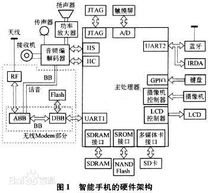

# 序言

- 背景：Android Telephone作为Android手机中的核心模块，为手机提供了基础的通信能力，其逻辑处理、运行效率和稳定性是Android手机定制开发过程中的重点和难点
- Telephony模块作为一个智能手机的核心部件, 是区别移动OS与桌面OS的重要标志。
- 从接打电话、网络服务、数据上网三方面解析Telephony。
  - 深入解析通话流程、详解Telecom、详解TeleService、Voice Call语音通话模型、ServiceState 网络服务、Data Call移动数据业务、SMS & MMS业务、Radio Interface Layer.
- Android Telephony业务跨度大，涉及多个层之间的交互:应用层、系统框架层、HAL 硬件抽象层和BP Modem。

# 初识Android

## 智能手机的系统结构

- 手机分类
  - 功能手机( Feature Phone )：具有传统手机的基本功能，如打电话、发短信、照相等。
  - 智能手机( Smart Phone )：具有开放的操作系统、硬件和软件的可扩充性和支持第三方的二次开发。
- 
  - 智能手机的基本硬件结构大多采用双处理器架构:主处理器和从处理器。
    - 主处理器运行开放式操作系统以及操作系统之上的各种应用，负责整个系统的控制;
    - 从处理器负责无线通信基本能力，主要包括DBB ( Digital Baseband,数字基带)和ABB( Analog Baseband,模拟基带), 完成语音信号和数字信号调制解调、信道编码解码和无线Modem控制。
    - 主处理器AP ( Application Processor,应用处理器),从处理器BP ( Baseband Processor,基带处理器)，它们之间通过串口、总线或USB等方式进行通信。

## Android系统架构

- Android 是一个分层的基于Linux Kernel的智能手机操作系统，共分为四层，从上到下依次是应用层( Applications )、应用框架层( Framework)、系统运行库层( Libraries )和核心层( Linux Kernel )
  - 系统运行库层
    - 系统运行库层包含了Android Runtime,其核心为Dalvik虚拟机。每一个Andraid应用程序都运行在Dalvik虚拟机之上，且每一个应用程序都有自己独立运行的进程空间; Dalvik 虚拟机只执行DEX可执行文件。DEX(Dalvik Executable)格式是专为Dalvik 设计的一种压缩格式，适合内存和处理器速度有限的系统。要生成DEX格式文件，首先通过Java程序编译生成class文件，然后通过Android提供的dx工具将class文件格式转换成DEX格式。
      - 特征
        - 每一个Android应用运行在-个Dalvik虚拟机实例中，而每一个虚拟机实例都是一个独立的进程空间。
        - 虚拟机的线程机制、内存分配和管理、Mutex (进程同步)等的实现都依赖底层Linux操作系统。
        - 所有Android应用的线程都对应一个Linux线程，因而虚拟机可以更多地使用Linux操作系统的线程调度和管理机制。
      - Dalvik虚拟机并不是按照Java虚拟机的规范来实现的，两者并不兼容;它们之间最大的不同在于Java虚拟机运行的是Java字节码，而Dalvik虚拟机运行的是其专有的文件格式DEX ( Dalvik Executable )文件。

## Android Telephony框架结构

- 
  - Android Telephony的业务应用跨越AP和BP，AP与BP相互通信，符合前面介绍的智能手机的硬件基本结构。
  - Android系统在AP上运行，而Telephony运行在Linux Kernel之上的用户空间。
  - Android Telephony也采用了分层结构的设计,共跨越了三层:应用层、应用框架层和系统运行库层，与Android操作系统整体分层结构保持一致;
  - Android Telephony从上到下共分三层: Telephony 应用、Telephony 框架、RIL ( Radio Interface Layer,无线通信接口层，主要位于系统运行库层的HAL中)
  - BP SoftWare在BP上运行，主要负责实际的无线通信能力处理

### 系统运行库层的HAL

- HAL ( Hardware Abstraction Layer, 硬件抽象层)在Linux和Windows操作系统平台下有不同的实现方式。
  - Windows下的HAL位于操作系统的最底层，它直接操作物理硬件设备，用来隔离与不同硬件相关的信息，为上层的操作系统和设备驱动程序提供一个统一接口， 起到对硬件的抽象作用。
  - Linux下的HAL并不是位于操作系统的最底层，它位于操作系统核心层和驱动程序之上，是一个运行在用户空间中的服务程序。
- 

- 作用
  - HAL是一个位于操作系统和驱动程序之上，运行在用户空间中的服务程序。其目的是对上层应用提供一个统一的查询硬件设备的接口。HAL所谓的抽象并不提供对硬件的实际操作，对硬件的操作仍然由具体的驱动程序来完成。
  - 将原本应该包括在Linux Kernel中的某些驱动关键处理逻辑，转移到了HAL层中，从而达到了不必开源的目的。避免使用linux kernel的GPL（General Public License），而使用Android的ASL(Apache Software License)

#### HAL的运行结构

- 
  - 分类
    - 老式HAL结构：应用或框架通过so动态链接库调用从而达到对硬件驱动的访问。在so动态链接库里，实现了对驱动的访问逻辑处理。
    - 新式HAL结构：采用Stub代理方式调用。HAL Stub是一种代理概念，虽然Stub仍是以`*.so`的形式存在，但HAL已经将`*.so` 的具体实
      现隐藏了起来。Stub 向HAL提供operations方法，Runtime 通过Stub提供的so获取它的operations方法，并告知Runtime的callback方法。这样Runtime和Stub都有对方调用的方法，一个应用的请求通过Runtime调用Stub的operations方法，而Stub响应operations方法并完成后，再调用Runtime的callback方法返回。
      - 
      - HAL Stub有一种包含关系， 即HAL里包含了很多的Stub。Runtime 只要说明请求类型，就可以取得并操作Stub对应的operations方法。其实现主要在hardware.c和hardware.h文件中。实质也是通过dlopen方法加载.so动态链接库,从而调用.so里的符号( symbol )实现。

# 搭建Android源代码编译调试环境

- 步骤
  1. 安装Ubuntu
  2. 安装JDK
  3. 更新Ubuntu系统工具包
  4. 安装Android源代码