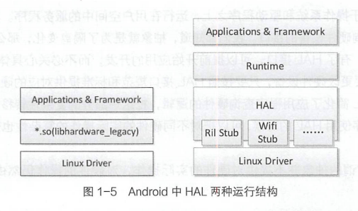
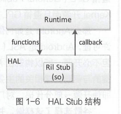
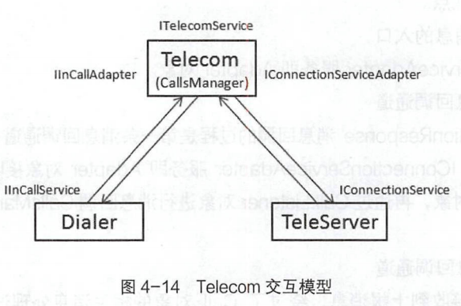
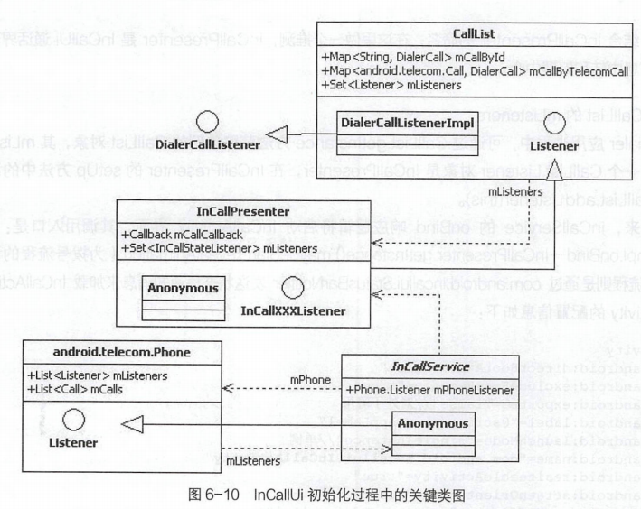
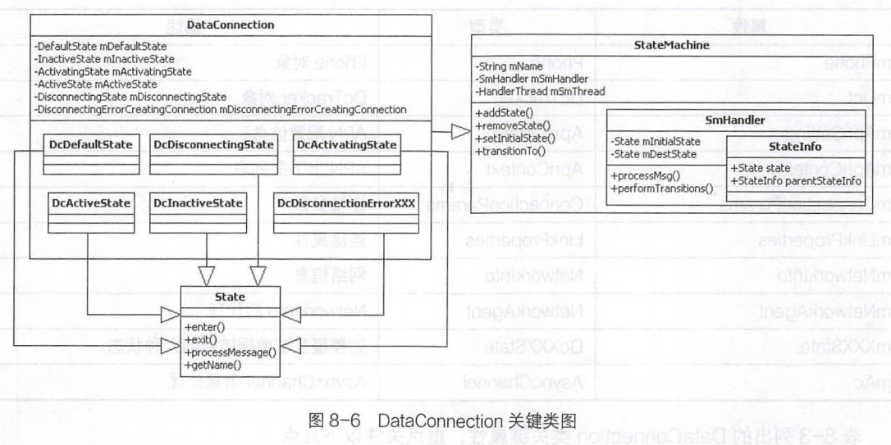
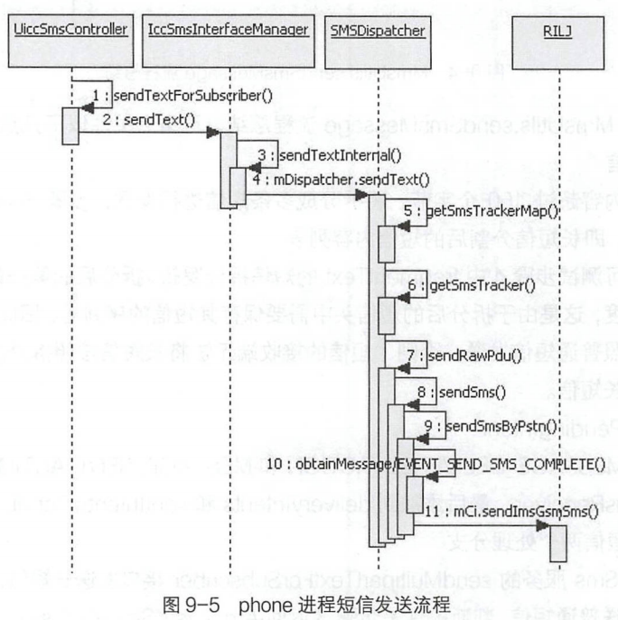
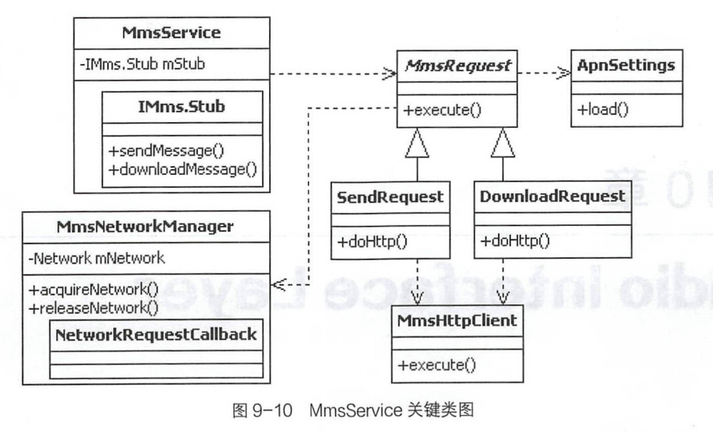

# 概述

- 背景：Android Telephone作为Android手机中的核心模块，为手机提供了基础的通信能力，其逻辑处理、运行效率和稳定性是Android手机定制开发过程中的重点和难点
- Telephony模块作为一个智能手机的核心部件, 是区别移动OS与桌面OS的重要标志。
- 从接打电话、网络服务、数据上网三方面解析Telephony。
  - 深入解析通话流程、详解Telecom、详解TeleService、Voice Call语音通话模型、ServiceState 网络服务、Data Call移动数据业务、SMS & MMS业务、Radio Interface Layer.
- Android Telephony业务跨度大，涉及多个层之间的交互:应用层、系统框架层、HAL 硬件抽象层和BP Modem。

# 初识Android

## 智能手机的系统结构

- 手机分类
  - 功能手机( Feature Phone )：具有传统手机的基本功能，如打电话、发短信、照相等。
  - 智能手机( Smart Phone )：具有开放的操作系统、硬件和软件的可扩充性和支持第三方的二次开发。
- 
  - 智能手机的基本硬件结构大多采用双处理器架构:主处理器和从处理器。
    - 主处理器运行开放式操作系统以及操作系统之上的各种应用，负责整个系统的控制;
    - 从处理器负责无线通信基本能力，主要包括DBB ( Digital Baseband,数字基带)和ABB( Analog Baseband,模拟基带), 完成语音信号和数字信号调制解调、信道编码解码和无线Modem控制。
    - 主处理器AP ( Application Processor,应用处理器),从处理器BP ( Baseband Processor,基带处理器)，它们之间通过串口、总线或USB等方式进行通信。

## Android系统架构

- Android 是一个分层的基于Linux Kernel的智能手机操作系统，共分为四层，从上到下依次是应用层( Applications )、应用框架层( Framework)、系统运行库层( Libraries )和核心层( Linux Kernel )
  - 系统运行库层
    - 系统运行库层包含了Android Runtime,其核心为Dalvik虚拟机。每一个Andraid应用程序都运行在Dalvik虚拟机之上，且每一个应用程序都有自己独立运行的进程空间; Dalvik 虚拟机只执行DEX可执行文件。DEX(Dalvik Executable)格式是专为Dalvik 设计的一种压缩格式，适合内存和处理器速度有限的系统。要生成DEX格式文件，首先通过Java程序编译生成class文件，然后通过Android提供的dx工具将class文件格式转换成DEX格式。
      - 特征
        - 每一个Android应用运行在一个Dalvik虚拟机实例中，而每一个虚拟机实例都是一个独立的进程空间。
        - 虚拟机的线程机制、内存分配和管理、Mutex (进程同步)等的实现都依赖底层Linux操作系统。
        - 所有Android应用的线程都对应一个Linux线程，因而虚拟机可以更多地使用Linux操作系统的线程调度和管理机制。
      - Dalvik虚拟机并不是按照Java虚拟机的规范来实现的，两者并不兼容;它们之间最大的不同在于Java虚拟机运行的是Java字节码，而Dalvik虚拟机运行的是其专有的文件格式DEX ( Dalvik Executable )文件。

## Android Telephony框架结构

- 
  - Android Telephony的业务应用跨越AP和BP，AP与BP相互通信，符合前面介绍的智能手机的硬件基本结构。
  - Android系统在AP上运行，而Telephony运行在Linux Kernel之上的用户空间。
  - Android Telephony也采用了分层结构的设计,共跨越了三层:应用层、应用框架层和系统运行库层，与Android操作系统整体分层结构保持一致;
  - Android Telephony从上到下共分三层: Telephony 应用、Telephony 框架、RIL ( Radio Interface Layer,无线通信接口层，主要位于系统运行库层的HAL中)
  - BP SoftWare在BP上运行，主要负责实际的无线通信能力处理

### 系统运行库层的HAL

- HAL ( Hardware Abstraction Layer, 硬件抽象层)在Linux和Windows操作系统平台下有不同的实现方式。
  - Windows下的HAL位于操作系统的最底层，它直接操作物理硬件设备，用来隔离与不同硬件相关的信息，为上层的操作系统和设备驱动程序提供一个统一接口， 起到对硬件的抽象作用。
  - Linux下的HAL并不是位于操作系统的最底层，它位于操作系统核心层和驱动程序之上，是一个运行在用户空间中的服务程序。
- 

- 作用
  - HAL是一个位于操作系统和驱动程序之上，运行在用户空间中的服务程序。其目的是对上层应用提供一个统一的查询硬件设备的接口。HAL所谓的抽象并不提供对硬件的实际操作，对硬件的操作仍然由具体的驱动程序来完成。
  - 将原本应该包括在Linux Kernel中的某些驱动关键处理逻辑，转移到了HAL层中，从而达到了不必开源的目的。避免使用linux kernel的GPL（General Public License），而使用Android的ASL(Apache Software License)

#### HAL的运行结构

- 
  - 分类
    - 老式HAL结构：应用或框架通过so动态链接库调用从而达到对硬件驱动的访问。在so动态链接库里，实现了对驱动的访问逻辑处理。
    - 新式HAL结构：采用Stub代理方式调用。HAL Stub是一种代理概念，虽然Stub仍是以`*.so`的形式存在，但HAL已经将`*.so` 的具体实
      现隐藏了起来。Stub 向HAL提供operations方法，Runtime 通过Stub提供的so获取它的operations方法，并告知Runtime的callback方法。这样Runtime和Stub都有对方调用的方法，一个应用的请求通过Runtime调用Stub的operations方法，而Stub响应operations方法并完成后，再调用Runtime的callback方法返回。
      - 
      - HAL Stub有一种包含关系， 即HAL里包含了很多的Stub。Runtime 只要说明请求类型，就可以取得并操作Stub对应的operations方法。其实现主要在hardware.c和hardware.h文件中。实质也是通过dlopen方法加载.so动态链接库,从而调用.so里的符号( symbol )实现。

# 搭建Android源代码编译调试环境

- 步骤
  1. 安装Ubuntu
  2. 安装JDK
  3. 更新Ubuntu系统工具包
  4. 编译Android源代码
  5. 下载AndroidStudio和AndroidSDK

## Android Debug Bridge (adb)

- Android 调试桥 (adb) 是一种功能多样的命令行工具，可让您与设备进行通信。adb 命令可用于执行各种设备操作（例如安装和调试应用），并提供对 Unix shell（可用来在设备上运行各种命令）的访问权限。它是一种客户端-服务器程序，组件：

  - **客户端**：用于发送命令。客户端在开发机器上运行。您可以通过发出 adb 命令从命令行终端调用客户端。

  - **守护程序 (adbd)**：用于在设备上运行命令。守护程序在每个设备上作为后台进程运行。

  - **服务器**：用于管理客户端与守护程序之间的通信。服务器在开发机器上作为后台进程运行。

- | 命令                        | 说明                |
  | --------------------------- | ------------------- |
  | adb logcat -vthreadtime     | 查看main日志的命令  |
  | adb logcat -vtime -b radio  | 查看radio日志的命令 |
  | adb logcat -vtime -b events | 查看event日志的命令 |

# 通话流程

## 前置

### 同步和异步

- Synchronous (同步)和Asynchronous (异步)的概念最早来自通信领域。
  - 通信的同步指客户端在发送请求后,必须要在服务端有回应后客户端才继续发送其他请求,所以这时所有请求将会在服务端得到同步，直到服务端返回请求。
  - 通信的异步:指客户端在发送请求后,不必等待服务端的回应就可以发送下一个请求,对所有的请求动作来说将会在服务端得到异步,这条请求的链路就像是一个请求队列,所有的请求动作在这里不会得到同步。

### Handler消息处理机制

- 每一个消息发送到主线程的消息队列中，消息队列遵循先进先出原则，发送消息并不会阻塞线程，而接收线程会阻塞线程。
- Handler允许发送并处理Message消息，Message对象通过主线程的MessageQueue消息队列相关联的Message和Runnable对象进行存取。每个Handler实例对Message消息发送和接收与对应主线程和主线程的消息队列有关。当创建一个新Handler时，Handler就属于当前主线程，主线程的MessageQueue消息队列也同步创建，即Handler会绑定到创建该Handler主线程/消息队列中。然后，Handler就可以通过主线程的消息队列发送和接收Message消息对象了。
- 特性
  - Android里没有全局Message Queue消息队列，每个Activity主线程都有一个独立的Message Queue消息队列，消息队列采用先进先出原 则。不同APK应用不能通过Handler进行Message通信，同一个APK应用中可通过Handler对象传递而进行Message通信。
  - 每个Handler实例都会绑定到创建它的线程中（一般位于主线程，即Activity线程），但Handler实例均可在主线程或子线程中创建。
  - Handler发送消息使用Message Queue消息队列，每个Message发送到消息队列里面，遵循先进先出原则；发送消息采用异步方式不 
    会阻塞线程，而接收线程采用同步方式会阻塞线程，所以当Handler处理完一个Message对象后才会接着去取下一个消息进行处理。
- 作用
  - Handler主要作用是异步处理较费时的逻辑，优先将界面返回给用户，异步处理完成后再去更新用户界面。

### AIDL跨应用服务

- AIDL（Android Interface Definition Language, Android接口定义语 言）Android系统平台的接口定义语言与您可能已经使用过的其他IDLs接口定义语言相似。程序员可以利用AIDL自定义编程接口，在客户端和服务端之间实现进程间通信（IPC）。在Android平台上，一个进程通常不能访问另外一个进程的内存空间，因此，Android平台将这些跨进程访问的对象分解成操作系统能够识别的简单对象，并且为跨应用访问而特殊编排和整理这些对象。用于编排和整理这些对象的代码编写起来非常冗长，所以Android的AIDL提供了相关工具来自动生成这些代码供程序员使用。

### 广播

- 发送方仅需要将广播内容完成发送，而接收方过滤自己需要的广播信息和内容，然后进行处理，接收方信息是发送方不知道的。

## 流程分析

- Android Telephony主要的手机通信能力
  - Call（通话）
  - ServiceState（服务状态） 
  - DataConnection（数据连接） 
  - **S**hort **M**essage **S**ervice（SMS,短信）/Mutimedia Message Service（MMS，彩信）

  

- | 代码库                       | Android.mk核心配置                                           | 说明                                                         |
  | ---------------------------- | ------------------------------------------------------------ | ------------------------------------------------------------ |
  | packages/apps/Dialer         | LOCAL_PACKAGE_NAME:=Dialer<br /> include $(BUILD_PACKAGE)    | 编译出 Dialer.apk应用                                        |
  | packages/services/ Telecomm  | LOCAL_JAVA_LIBRARIES := telephony-common LOCAL_PACKAGE_NAME:=Telecom <br />LOCAL_CERTIFICATE:= <br />platform $(BUILD_PACKAGE) | 编译出Telecom.apk应用，并使 用平台签名                       |
  | packages/services/ Telephony | LOCAL_JAVA_LIBRARIES:= telephony-common <br />LOCAL_PACKAGE_NAME:= TeleService <br />LOCAL_CERTIFICATE:= platform<br />$(BUILD_PACKAGE) | 编译出TeleService.apk应用，并 使用平台签名orqsloT.E pivs2slsTBmoostsl |
  | frameworks/base/telecomm     |                                                              | 编译出framework.jar                                          |
  | frameworks/opt/telephony     | LOCAL_MODULE:= telephony-common <br />include $(BUILD_JAVA_LIBRARY) | 编译出telephony-common.jar                                   |

- 

- | 代码库                      | 名称        | 进程                            |
  | --------------------------- | ----------- | ------------------------------- |
  | packageslapps/Dialer        | Dialer      | com.android.dialer              |
  | packages/services/Telecomm  | Telecom     | system_server                   |
  | packages/services/Telephony | TeleService | com.android.phone               |
  | frameworks/base/telecomm    | framework   |                                 |
  | frameworks/opt/telephony    | Telephony   | system_server&com.android.phone |

### 拨号流程分析

- 拨号入口 DialpadFragment
  - Dialer应用中的拨号流程将发起第一次的跨进程服务接口调用，即TelecomManager的placeCall方法调用。
- 第一次跨进程访问
  - 拨号流程中的第一次跨进程访问，将从Dialer应用访问到Telecom应用中的ITelecomService服务接口

- Telecom 应用第一次绑定服务
  - Telecom应用中InCallController 对象的bindToServices方法将绑定Dialer应用中的lInCallService服务，并调用该服务提供的setInCallAdapter和addCall等方法，Dialer应用中将展示和更新InCallActivity进行通话界面的显示。

- Telecom应用第二次绑定服务
  - Telecom应用中ConnectionServiceWrapper对象的createConnection方法将绑定TeleService应用中的IConnectionService服务，并调用该服务提供的addConnectionServiceAdapter和createConnection等方法，TeleService应用将通过RIL对象发出拨号的RIL请求。

#### 打开Nexus 6P手机的拨号盘

- 

1. 首先使用adb devices 命令查看和确认手机与计算机连接是否成功，然后使用adb logcat命令查看Nexus 6P手机的运行日志，最后操作手机，点击Home界面最下面一排最左边带有电话图标的应用按钮，打开拨号界面。
2. ActivityManagerService将启动com.android.dialer包下的DialtactsActivity。system_server, 即ActivityManagerService所在的系统进程; 通过`adb`
   `shell ps -ef`查看进程信息命令可以确认相关的进程信息

#### DialtactsActivity

- ==Dialer==：DialtactsActivity.java文件的详细路径是packages/apps/Dialer/java/com/android/dialer/app/DialtactsActivity.java。查看对应的Android.mk，文件，此代码库将编译出Dialer. apk Android应用程序，以后统一称其 为Dialer应用，其运行的进程名是com.android.dialer。
- 可在Android Studio连续两次按下右边的Shift 按键, 打开Search Everywhere对话框，输入DialtactsActivity,在输入过程中有逐个英文字母匹配的过程,输入完成后便可完整匹配DialtactsActivity.java文件。

1. 快捷键Ctrl+F12快速打开当前类属性和方法列表浮动菜单
2. 在Android Studio快速匹配过程中，可使用* (匹配多个字符)进行模糊匹配，并且输入的字符不区分大小写。
3. DialpadFragment提供用户拨号的交互界面
4. 创建拨号请求 intent 对象：CallntentBuilder.build方法构造Action为Intent.ACTION_ CALL的intent 对象，并添加Extra附加信息，如isVideoCall、phoneAccountHandle、 createTime 等。
5. 发送 intent 拨号请求消息：DialerUtils .startActivityWithErrorToast方法，根据intent的action 将有两个分支处理逻辑，分别执行placeCallOrMakeToast(context, intent)和context.startActivity(intent)。placeCallOrMakeToast方法将继续执行拨号请求，最终将调用TelecomManager类的placeCall方法。
   - TelecomManager.java程序在framework/base路径下，将编译出framework.jar包，是程序的静态关系
   - 一个进程只有一 个TelecomManager对象。对于整个Android系统来说，支持多个进程

6. TelecomManager 获取ITelecomService服务并调用其placeCall 方法继续传递intent发出通话呼叫请求，将涉及第一次跨进程的服务调用。
   - Dialer 应用的com.android.dialer进程提供用户拨号界面并响应用户的拨号请求，把拨号请求包装成action为Intent.ACTION_ CALL的intent对象。通过调用ITelecomService服务提供的placeCall接口，将拨号请求intent 对象发送给了Telecom应用( system_ server 进程)，完成了第一次跨进程的服务调用，传递的是包括拨号请求相关信息的intent对象。


#### lTelecomService接收拨号请求服务

##### lTelecomService

- ITelecomService**接口定义**: frameworks/base/telecomm/java/com/android/internal/telecom/ITelecomService.aidl,同样在framework/base下，它定义了placeCall、addNewIncomingCall、 endCall和getCallState等接口。
- ITelecomService的**接口实现**：TelecomServicelmpl.java,其代码文件的详细路径是:packages/services/Telecomm/src/com/android/server/telecom/TelecomServicelmpl.java
- ==Telecom== ：packages/services/Telecomm是拨号流程涉及的第二个代码库，查看对应的Android.mk文件，此代码库将编译出Telecom.apk Android应用程序，称为Telecom 应用。此服务的运行进程指定为system,即此服务将运行在system_server 系统进程空间，而它的唯一action是android.telecom.ITelecomService。
  - Context.TELECOM_SERVICE 系统服务名“ telecom”与服务定义的Action : android.telecom.ITelecomService相对应


##### 拨号请求服务

1. lTelecomService的实现类TelecomServicelmpl的placeCall 方法，响应Dialer 应用发起的跨进程服务接口调用。
   - 首先通过mUserCallIntentProcessorFactory创建UserallIntentProcessor对象，并执行其processIntent方法，然后通过判断intent的action来调用processOutgoingCalIntent方法，继续调用sendBroadcastToReceiver方法。
2. 将发出一个定向广播，由Telecom应用中的PrimaryCallReceiver 对象接收。
   - 同一个应用中使用广播来传递消息将同步方法调用转换成异步处理。ITelecomService 的服务方法placeCall快速返回给了Dialer 应用的调用，而Telecom应用中接收到广播后继续处理对应的拨号请求intent对象。
3. PrimaryCallReceiver对象的onReceive的sendNewOutgoingCallIntent 方法，最终调用了CallsManager 对象的两个不同方法。
  - startOutgoingCall()：startOutgoingCall()将开始拨号前的准备工作
  - placeOutgoingCall():placeOutgoingCall将继续传递拨号请求，实现将拨号请求发送给BP Modem处理。

#### CallsManager拨号流程处理

- startOutgoingCal方法将通过绑定服务和调用其服务接口，启动和更新Dialer应用中的 InCallActivity，展示出通话界面
  - Dialer应用提供用户拨号操作界面，用户输入电话号码发起拨号请求，到Telecom应用接收拨号请求，完成第一次跨进程传递的android.telecom.parcelableCallserver.telecom.Call对象，然后通过此对象信息创建可跨进程传递android.telecom.parcelableCall对象，完成第二次跨进程服务接口调用;回到Dialer应用的com.android.dialer进程中的IlnCallService服务响应，通过接收到的 parcelableCall对象信息创建本地的 android.telecom.Call对象，最后根据此对象更新和显示InCallActivity通话界面相关信息。

##### startOutgoingCall()

1. CallsManager.startOutgoingCall:主要逻辑是创建、更新和保存Call 对象。Call对象的名字非常特殊，其代码是:packages/services/Telecomm/srclcomlandroidlserver/telecomICall.java，由Telecom应用中的com.android.server.telecom.call类定义。
  1. CallsManager.addCall
    1. 创建Call对象，如果不是以前保存在mCalls列表的Call对象，调用addCall (call) 方法保存并触发增加Call对象的通知，CallsManager对象将保存多个Call 对象到mCalls 集合中，Call对象则设置Listener 对象为CallsManager,对象之间相互引用。而CallsManager对象通过mListeners发出onCallAdded消息回调。
2. 有九个Listener对象，在拨号流程中重点关注mlnCallController 这个注册的CallsManagerlistene对象，即com.android.server.telecom.InCallController。
  1. 
  2. 
  3. 在onCallAdded()方法中实现绑定服务。首先，创建InCallServiceBindingConnection对象，创建该对象的同时将同步创建一个mServiceConnection对象，此对象为匿名的ServiceConnection类型，重写了onServiceConnected和onServiceDisconnected方法;接着，创建action为InCallService.SERVICE_ INTERFACE的intent对象，并更新了PhoneAccount和Call的一些关键信息;然后，调用Android 系统的bindServiceAsUser 方法绑定服务;最后是绑定服务成功以后的onConnected系统回调，将发起对InCallController.this.onConnected的调用
    - action InCallService.SERVICE_ INTERFACE定义为“android.telecom.InCallService"，InCallController 通过绑定服务的方式，开启拨号流程中的第二次跨进程访问，从Telecom应用的system_ server 进程再次回到Dialer应用的com.android.dialer进程。Telecom应用中完成了第一次绑定服务和对应服务的接口调用。
    - InCallController.this.onConnected()首先绑定服务，接着调用服务的setInCallAdapter、 addCall 和onCallXXChanged接口将之前保存的Call对象通过inCallService发送出去

###### IInCallService服务的响应过程

- InCallServicelmpl类继承于InCallService类，类代码文件在packages/apps/Dialer工程下，而InCallService类对应的代码文件则在framework 下，其服务接口的定义文件为: frameworks/base/telecomm/java/com/android/intermal/telecom/InCallService.aidl,主要定义了addCall setInCallAdapter、updateCall等接口方法。
- InCallController在拨号流程中，首先绑定服务，接着调用服务的setInCallAdapter、 addCall 和onCallXXChanged接口。
  1. onBind服务被绑定的响应方法
    - 
    - onBind()的返回Intent是InCallServiceBinder，InCallServiceBinder实现了IInCallService.aidl的接口，这些接口通过发送Handler消息，将服务接收到的服务请求转化为异步处理方式
  2. setInCallAdapter设置Adapter
    - 
    - setInCallAdapter接口的响应逻辑，主要是创建Phone对象和设置Phone对象的Listener属性。
      - Phone即frameworks/base/telecomm/java/android/telecom/Phone.java
      - 步骤12和步骤13，创建 Phone对象和增加Listener 为InCallService类的.mPhoneListener对象，也是拨号流程Dialer应用中的第一个Listener。
      - 在创建 Phone对象之通过lInCallAdapterBinder对象创建了InCallAdapter。InCallAdapter接口定义文件 frameworks/base/telecomm/java/com/android/internal/telecom/InCallAdapter.aidl ，提供了answerCall、rejectCall、mute、setAudioRoute、 playDtmfTone 等控制通话的接口，因此通过Binder对象可跨进程访问Telecom应用，即system server进程的系统服务相关接口。
  3. addCall增加主动拨号Outgoing Call
    - ​	
    - 在Telecom应用中，首先会创建Call对象，Dialer应用中也会创建Call对象，但这两个Call对象的定义是不同的。
    - Call对象的创建与转换。从Telecom应用中创建com.android.server.telecom.Call,并通过此对象创建跨进程传递android.telecom.parcelableCall对象(支持序列化和反序列化，因此可以跨进程传递此对象)，而Dialer应用中是接收到parcelableCall对象后，通过此对象相关信息创建android.telecom.Call对象。
    - 调用fireCallAdded(call)方法，使用多个监听器完成通话界面的展示和更新

##### placeOutgoingCall()

- 
  - 在CreateConnectionProcessor类中的定义是private ConnectionServiceWrapper mService服务,ConnectionServiceWrapper的createConnection 方法
    - 流程
      - ==TeleService==：拨号流程在Telecom应用中将发起第二次绑定服务的跨进程服务访问，绑定的服务对象在packages/services/Telephony代码库中，这是我们涉及的第三个代码库。查看对应的 Android.mk文件，此代码库将编译出TeleService.apk Android 应用程序，称其为TeleService应用。
      - addConnectionServiceAdapter方法将通过mServicelnterface调用addConnectionServiceAdapter接口增加IConnectionServiceAdapter，为成功绑定TeleService服务后的第一次跨进程调用。
        - IConnectionServiceAdapter接口的定义文件是:frameworks/base/telecommljavalcomlandroid/internal/telecom/lConnectionServiceAdapter.aidl,主要定义了setActive、setRinging、setDialing.setConnectionCapabilities等接口方法。通过接口名，当前绑定的服务“android.telecom.ConnectionService”将通过此Adapter接口调用去更新Telecom中的通话状态。
      - createConnection:通过Call对象拨号请求相关信息创建ConnectionRequest对象，传递packages/services/Telephony中对应的服务。
    - 拨号流程中，Telecom应用第一次跨进程服务调用，将与Call对象相关的拨号请求信息传递给了Dialer应用，去加载和展现通话界面;那么第二次跨进程服务调用，Call 拨号请求相关信息转换成了ConnectionRequest对象并传递给了TeleService 应用。TeleService 将接收到的ConnectionRequest请求相关信息传递给BP Modem来发起电话拨号请求。

#### IConnectionService服务的响应过程

- 根据AndroidManifest.xml中对android.telecom.ConnectionService 服务的定义，其服务的Java类为com.android.services.telephony.TelephonyConnectionService, 继承自android.telecom. ConnectionService抽象类。在frameworks/base工程下，代码文件为frameworks/base/telecomm/java/android/telecom/ConnectionService.java

- frameworks/base/telecomm/java/com/android/internal/telecom/lConnectionService.aidl文件作为IConnectionService服务的接口定义，主要定义了addConnectionServiceAdapter、createConnection、answer、hold 等接口。通过这些接口的名字，可以知道此服务主要提供了Call 状态管理的接口供Telecom应用调用，比如接听电话、保持呼叫、挂断电话等。
  
- 
  
  1. onBind():TelephonyConnectionService继承于ConnectionService 类，并未重写父类的onBind 方法。onBind逻辑简单，返回了IConnectionService.Stub 类型的mBinder对象。
  
  2. addConnectionServiceAdapter() 设置Adapter：使用Handler的异步消息处理机制，将服务调用的同步方式转为异步方式处理, addConnect ionServiceAdapter服务接口将立即返回
  
  3. createConnection() 继续发送拨号请求：ConnectionService服务的接口createConnection 的响应逻辑仍然是通过mHandler将同步调用转为异步处理。mHandler发出MSG_ CREATE_ CONNECTION 消息,并在handleMessage中响应此方法，再调用父类的createConnection方法,createConnection方法利用onCreateXXXConnection 创建Connection 对象和通过mAdapter传递过来的Binder对象进行handleCreateConnectionComplete接口回调。
     1. Connection对象的创建过程，TelephonyConnectionService 重写了父类ConnectionService的onCreateOutgoing
        Connection方法，会判断是否是紧急电话，而且Connection连接失败将不是TelephonyConnection，从而不能打电话，如果成功会执行placeoutgoingConnection（）方法，placeoutgoingConnection方法中，如果phone不为空执行phone.dial()方法
     
     2. phone是com.android.interal.telephony.GsmCdmaPhone类型对象，其代码为frameworks/opt/telephony/src/java/com/android/internal/telephony/GsmCdmaPhone.java。phone的dial 方法的调用过程：diallnternal-→mCT.dial的调用过程，mCT即GsmCdmaCalITracker，dial方法中会使用mCi.dial方法，mCi即RIL对象，其Java代码是frameworks/optelephony/src/java/com/android/internal/telephony/RlL.java，这里将发出RIL的拨号请求。跟踪拨号流程已经到了HAL (硬件抽象层)，在这一层不同的芯片厂家将完成不同的实现，比如高通平台将RIL请求转为QMI消息与Modem交互，MTK平台则采用AT命令的方式与Modem交互。
     
        - ==Telephony==:frameworks/opt/telephony是涉及的第四个代码库，查看对应的Android.mk文件，此代码库将编译出 telephony-common.jar，我们以后统一称其为Telephony
     
        - Qualcomm messaging Interface(QMI):QMI是高通提供的一种多处理器进程间通信的功能接口，用于AP和BP侧的交互，通俗说法就是让终端设备TE（可以是手机，PDA，计算机）对高通BP侧的AMSS系统进行操作，如调用函数，读取数据，设置其中的NV项等。、
     
        - AT：Hayes 命令集（也称为AT 命令集）是一种特定的命令语言，最初由Dennis Hayes 于 1981 年 为Hayes Smartmodem 300波特 调制解调器开发。命令集由一系列短文本字符串组成，这些短文本字符串可以组合起来产生诸如拨号、挂断和更改连接参数等操作的命令。绝大多数拨号调制解调器以多种变体形式使用 Hayes 命令集。
     
        - 全球移动通讯系统（Global System for Mobile Communications），即GSM，又称泛欧数位式行动电话系统，是当前应用最为广泛的移动电话标准。全球超过200个国家和地区超过10亿人正在使用GSM电话。GSM标准的广泛使用使得在移动电话运营商之间签署“漫游协定”后用户的国际漫游变得很平常。GSM相较它以前的标准最大的不同是他的信令和语音信道都是数位的，因此GSM被看作是第二代（2G）移动电话系统。GSM标准当前由3GPP组织负责制定和维护。
     
        - 第三代移动通信技术，简称3G（英语：3rd-Generation），规范名称IMT-2000（International Mobile Telecommunications-2000），是指支持高速数据传输的蜂窝网络移动电话技术。3G服务能够同时发送声音（通话）及信息（电子邮件、即时通信等）。3G的代表特征是提供高速数据业务，速率一般在几百kbps以上，自从4G出来后3G逐渐淘汰。
     
        - 第四代移动通信技术（英语：The fourth generation of mobile phone mobile communication technology standards，缩写为4G），是3G之后的延伸。 IMT-Advanced的4G标准:高级长期演进技术（又译作长期演进技术升级版，英语：LTE-Advanced，简称LTE-A，在中国大陆称4G+）是长期演进技术（LTE）的提升版本，理论上网速度比3G快十倍以上，也是4G规范的国际高速无线通信标准。
     
        - 第五代移动通信技术（英语：5th generation mobile networks或5th generation wireless systems，简称 5G）是最新一代移动通信技术，为 4G（LTE-A、WiMAX-A、LTE）系统后的演进。
     
           
     

#### TelecomAdapter接收消息回调

- 

1. ConnectionServiceWrapper.Adapter 将接收TeleService应用的接口回调，将通过this调用ConnectionServiceWrapper对象的handleCreateConnectionComplete 方法，接着是mPendingResponses属性对象的handleCreateConnectionSuccess 方法调用，即CreateConnectionProcessor 对象，最后是mCallResponse.handleCreateConnectionSuccess对象，即Call对象的handleCreateConnectionSuccess方法响应TeleService应用的接口回调,会调用Listener的onSuccessfulOutgoingCall进行拨号流程处理
2. Call 类中有Listener 的接口定义，同时也定义了ListenerBase抽象类，它实现了Listener 接口。ListenerBase抽象类实现了Listener 接口的所有方法，并且这些方法都是空实现，没有具体逻辑。ListenerBase 抽象类有三个子类，分别是:CallsManager,InCallController 匿名内部类对象mCallListener,IncomingCallNotifier匿名内部类对象mCallListener。这三个类中，仅有CallsManager重写了父类ListenerBase的onSuccessfulOutgoingCall方法
3. Adapter的接口回调是将当前呼出的电话状态进行更新，更新为dialing,即正在拨号的状态，最终会调用IInCallService的接口去更新通话界面。

### 接听流程分析

- 可以理解为与主动拨号流程正好相反的过程，手机BP Modem侧接收到网络端的来电请求，消息从Modem发给RIL，RIL 再发给TeleService 应用,然后再传递给Telecom应用，最终Dialer 应用接收到来电请求，进行来电响铃(可选震动)和展示来电界面，通知手机用户有新的来电了。
- 
- 
- 流程
  1. Modem从网络端接收到来电，由RIL发出Call状态产生了变化的RIL_UNSOL_RESPONSE_CALL_STATE_CHANGED消息通知， RIL.java发出mCallStateRegistrants.notifyRegistrants通知， CallTracker.java进行响应。
  2. GsmCallTracker.java进入handleMessage，响应EVENT_CALL_STATE_CHANGE，交给父类的pollCallsWhenSafe方法 查询当前Call List，首先创建EVENT_POLL_CALLS_RESULT类型的Handler消息，并向RIL发起getCurrentCalls当前Call List请求。
  3. RIL内部进行处理，向Modem发出执行CLCC查询当前Call List的AT命令，查询完成后，RIL.java向CallTracker发送EVENT_POLL_CALLS_RESULT的Handler消息。
  4. CallTracker进入handleMessage响应EVENT_POLL_CALLS_RESULT消息，进入handlePollCalls处理Call状态查询结果，判断如果是来电，则通过Phone对象发起mNewRingingConnectionRegistrants.notifyRegistrants的消息通知。
  5. CallManager进入handleMessage响应EVENT_NEW_RINGING_CONNECTION消息，通过mNewRingingConnectionRegistrants.notifyRegistrants发起消息，Telephony Frameworks层来电处理流程结束，接着进入Phone应用层。
  6. CallNotifier进入handleMessage响应PHONE_NEW_RINGING_CONNECTION消息，交给 onNewRingingConnection方法处理来电消息，根据来电的电话号码完成联系人查询、来电响铃和显示来电界面，进入Phone应用层。
  7. InCallScreen启动Activity，进入onCreate或onNewIntent方法，显示来电界面。

#### 模拟接受来电

1. RIL.java接收到Call状态变化消息后,CallTracker发起查询Call List操作,然后RIL执行AT+CLCC命令查询Modem数据,返回Call List数据给RIL.java。
2. 进入RIL.java查找UNSOL_RESPONSE_CALL_STATE_CHANGED消息的处理逻辑,responseToString()方法进行该消息的处理。在此方法中根据底层上报的
   response类型有两处针对switch ( response )逻辑处理,前面的逻辑是对数据进行收集和整理,而后面的逻辑是完成对应response的逻辑处理和消息通知。
3. 查询Call List操作不是由RIL.java接收到Call状态变化消息后直接发起的。RIL.java处理RIL_UNSOL_RESPONSE_CALL_STATE_CHANGED消息的逻辑中只有mCallStateRegistrants对外发出消息通知，mCallStateRegistrants为RegistrantList类型
   - 
   - RegistrantList消息处理机制包括两个重要的Java类：RegistrantList.java和Registrant.java。RegistrantList中使用的观察者模式为：RegistrantList为通知者， Registrant为观察者，RegistrantList通知者支持对通知者的增加（add/addUnique）、删除（remove），并且能够发出通知（notifyRegistrants）；而Registrant作为观察者，响应通知者发出的notifyRegistrants通知，并由其internalNotifyRegistrants方法响应通知者发出的通知。
     - notifyRegistrants方法调用后，找到对应的进行响应的Registrant 对象流程
       1. 查找RegistrantList对象注册观察者Registrant对象的方法， 在Android源代码中一般为registerForXXX方法，在此方法中调用RegistrantList对象的add/addUnique等注册观察者Registrant对象的方 法。
       2. 查找registerForXXX方法的调用方，重点关注其调用的形参，特别是形参1，多数情况为this或mHandler。
       3. 通过步骤的形参，找到的即是对象发出通知
     - mCallStateRegistrants.notifyRegistrants发出通知后，有两处可响应此通知，即GsmCallTracker和CdmaCallTracker两个类的handleMessage方法。在默认的Android虚拟设备上，仅有GsmCallTracker的handleMessage方法可响应。
       - 码分多址（英语：Code Division Multiple Access，即：CDMA）或分码多重进接、码分复存，是一种多址接入的无线通信技术。CDMA最早用于军用通信，但时至今日，已广泛应用到全球不同的民用通信中。在CDMA移动通信中，将语音频号转换为数字信号，给每组数据语音分组增加一个地址，进行扰码处理，然后将它发射到空中。CDMA最大的优点就是相同的带宽下可以容纳更多的呼叫，而且它还可以随语音传送数据信息。


#### GsmCallTracker响应RIL的Call状态变化通知

1. 进入GsmCallTracker的handleMessage方法，找到EVENT_CALL_STATE_CHANGE消息类型的处理方式，会调用pollCallsWhenSafe()方法，其实质为调用父类CallTracker查询Call List方法。RIL.java接收到Modem发出的Call状态变化后，由 CallTracker发起Call List的查询。
2. 在GsmCallTracker的 父类CallTracker类中实现的pollCallsWhenSafe方法通过RIL对象调用其getCurrentCalls方法

#### RIL.java的getCurrentCalls方法

1. 在getCurrentCalls方法中，会使用lastRelevantPoll Message消息对象封装RIL_REQUEST_GET_CURRENT_CALLS类型的RILRequest请求对象，然后发送此RILRequest对象；同样，在RIL.java类中，找到 RIL_REQUEST_GET_CURRENT_CALLS消息类型的其他三种处理方法processSolicited、retToString、requestToString，后面两种都是对RIL 消息类型日志的转换处理，真正的逻辑处理在processSolicited方法中，分为三个部分
   - 根据消息流水号获取RILRequest请求对象。
   - 根据RILRequest请求对象的mRequest请求类型，对数据进行收集和整理，返回Object的对象ret。
   - 根据RILRequest请求对象的mResult回调Message消息，加上整理好的ret数据对象，发起Handler消息通知。
2. 发出Handler消息通知后，会在CallTracker中的handleMessage方法中响应，并且它的消息类型为“EVENT_POLL_CALLS_RESULT”。

#### GsmCallTracker响应消息通知

1. 底层发送Call状态变化发出通知后，在Telephony Frameworks层最终由CallTracker的handlePollCalls方法进行处理
2. handlePollCalls方法根据RIL发出的Call List对象，判断Call的状态，并发出不同通知
   - 新来电通知（phone.notifyNewRingingConnection） 
   - 通话断开通知（conn.onDisconnect）
   - Call状态变化通知（phone.notifyPreciseCallStateChanged）

#### GSMPhone的通知方法notifyNewRingingConnection

- GSMPhone的notifyNewRingingConnection方法，调用了它父类PhoneBase的notifyNewRingingConnectionP方法。也用了RegistrantList观察者模式的消息处理机制，消息响应方为PhoneProxy和 CallManage，通过类的继承关系，能再排除PhoneProxy类，只有CallManage类中的mHandler子类进行响应。

#### CallManager响应来电消息通知

1. 进入CallManager类中mHandler的handleMessage方法，找到EVENT_NEW_RINGING_CONNECTION消息处理逻辑,如果当前正在拨号或是有多于一路的来电，则挂掉当前来电，否则发出消息通知
2. CallNotifier和InCallScreen中的 handleMessage方法响应消息通知。这两个Java代码均在Phone应用层，说明手机来电流程已经从RIL层跟踪到Phone应用层相关代码。
3. 总结
   1. RIL首先发出Call状态变化消息通知，CallTracker中handleMessage方法对此消息做出响应。
   2. CallTracker向RIL发出消息查询Call List状态列表，RIL内部处理 完成后返回CallList给CallTracker，最后CallTacker中的handlePollCalls方法处理Call List，该方法根据Call List状态列表提取出具体的Call状态变化，这里是“来电状态”。

#### CallNotifier响应来电通知

- Phone应用层中的CallNotifier和InCallScreen会响应Telephony Frameworks发出的来电消息通知，即在CallManager mNewRingingConnectionRegistrants.notifyRegistrants发出通知后， CallNotifier和InCallScreen中的Handler会响应此消息通知
- 流程
  1. CallNotifier中来电处理方法入口为onNewRingingConnection。
  2. CallNotifier处理来电流程最终目的是：来电响铃（振动，是否振动根据用户设置进行判断）和显示来电界面。
  3. CallNotifier在响铃和显示来电界面之前主要是根据来电号码查询Contacts联系人相关信息，如联系人名称、联系人电话号码类型、联 系人图片、联系人来电铃音等。其实，查询联系人相关信息也都是为了来电响铃和显示来电界面做一些准备。

#### InCallScreen展现来电界面

CallNotifier的showIncomingCall()方法更新通知栏和加载来电界面。而InCallScreen界面的展示过程，是在更新通知栏时由Notification加载了InCallScreen界面的展示。

### 通话状态更新消息上报流程

- 拨号成功后，对方接听了此路通话，那么通话界面将更新当前通话为通话中的状态，并开始通话计时，可以理解为Modem->RIL→TeleService→Telecom->Dialer, 一层一层上报通话状态为“通话中”的消息处理和发送过程
  - 

- 三个应用的Call信息传递
  1. TeleService应用首先接收到通话状态更新的消息，通过Telecom的Adapter服务设置不同的通话状态; 
  2. 接着Telecom应用更新Call状态;
  3. 最后Telecom调用IInCallService的updateCall接口更新Call状态。
- RegistrantList 消息处理
  - 在GsmCdmaPhone对象发出RegistrantList消息通知后,在TelephonyConnection对象的mHandler匿名内部类对象的handleMessage中响应MSG_ PRECISE_CALL_ STATE_ CHANGED类型的Handler消息，该Handler消息的注册入口在TelephonyConnection抽象类的两个子类GsmConnection
    和CdmaConnection的setC riginalConnection方法中实现注册MSG_ PRECISE_ CALL STATE_ CHANGED类型的Registrant,并在GsmConnection的构造方法中调用setOriginalConnection接口进行消息注册的初始化操作;而TelephonyConnection对象在TelephonyConnectionSerice类的onCreateOutgoingConnection和onCreatelncomingConnection方法中创建。
- TelephonyConnection 对象的Listener注册
  - 通过Listener对象的onStateChanged进行消息回调，Listener 对象是在ConnectionService的createConnection方法中，首先创建TelephonyConnection对象，然后调用addConnection 方法，设置当前类的私有内部类Connection.Listener 对象mConnectionListener为TelephonyConnection对象的Listener。
- IConnectionServiceAdapter接口汇总
  - IConnectionServiceAdapter的Stub接口实现在Telecom应用ConnectionServiceWrapper类的私有内部类Adapter 中，它主要由setActive、 setRinging、setDialing、 setAudioRoute 等设置Call相关状态信息的接口，以及onConnectionEvent、onRttInitiationSuccess、 onRemoteRttRequest等消息通知接口构成。
- IInCallService接口汇总
  - IInCallService的Stub接口实现在framework/base 下的InCallService 抽象类的私有内部类InCallServiceBinder中，它主要由setInCallAdapter. addCall updateCall等增加和更新Call对象相关的接口，以及onConnectionEvent、onCallAudioStateChanged 等消息通知接口构成。而在Dialer应用中，InCallServicelmpl继承了抽象类InCallService。

### 控制通话消息下发流程

- 在通话界面若想更改当前通话状态，比如挂断/接听当前接收来电，挂断/保持当前通话等操作，可以理解为是控制通话消息下发的过程，从Dialer- >Telecom- >TeleService→RIL→Modem,通话控制消息一层一层的下发，最终交给Modem处理具体的通话控制。
  - 

- 三个应用的控制消息传递
  1. Dialer应用展示的通话界面或来电界面均有控制通话状态请求的界面控件，通过滑动或是点击相
     关的控件，将触发通话状态控制，调用android.telecom.Call对象的hold方法;
  2. 在Dialer应用中，调用InCallAdapter的holdCall 服务接口完成第一次的跨进程服务接口调用，进入Telecom应用。
  3. Telecom应用首先更新Call状态，此处的Call 对象为Telecom应用内部定义的类com.android.server.telecom.Call,调用IConnectionService的hold服务接口，完成第二次的跨进程服务接口调用，进入到TeleService 应用。
  4. TeleService应用中经过层层方法调用，由CalTracker对象进行Call的hold操作，并将请求发给RIL对象，发出对应的RIL请求。
- lInCallAdapter接口汇总
  - lInCallAdapter的Stub接口实现在Telecom应用的InCallAdapter 类中，它主要由answerCall、rejectCall、playDtmfTone、 mergeConference 等接口构成;
  - InCallAdapter 对象则在InCallController对象绑定InCallService 成功后创建。
- IConnectionService 接口汇总
  - IConnectionService的Stub接口实现在frameworks/base下的ConnectionService抽象类的匿名内部类中，mBinder为其对象，它主要由addConnectionServiceAdapter、createConnection 等创建TelephonyConnection接口，以及answer、reject、hold、playDtmfTone 等控制通话状态的接口构成。
  - 在TeleService应用中，TelephonyConnectionService 继承了抽象类TelephonyConnection。

### Android通话模型

- 

- 系统的分层
  - Dialer 应用是普通的Android App应用，其运行进程的用户信息和进程信息，也能说明此问题; 
  - Telecom 应用运行在system_ server 进程上，android:process=" sys tem ",LOCAL_CERTIFICATE =,其进程用户名为system系统用户，说明它是运行在Android Framework框架层;
  - TeleService应用运行的进程名是com.android.phone，用户名是radio,承载着Telephony Call协议栈，它运行在Android Framework框架层;
  - RIL，它运行在HAL (硬件抽象层)。
- 交互方式
  - Dialer、Telecom、 TeleService 和RIL都是通过服务进行交互的。它们之间有箭头连接的都是通过Service跨进程的接口调用实现的。
  - Dialer与TeleService之间没有直接的消息传递,要通过Telecom进行消息中转，Telecom 与RIL之间同样没有直接的消息传递，要通过TeleService进行消息中转。
  - 通过服务进行跨进程接口调用实现消息的传递，服务接口调用本身就是同步的接口调用，在Service端的实现将转换为异步的方式处理，待消息处理完成后，再使用回调的接口传递消息处理的结果。
- 分解通话相关流程
  - 传递方向
    - 控制通话消息下发流程:应用层通过框架层向RIL发起通话管理和控制相关RIL请求，RIL转换成对应的消息发送给Modem执行，其中包括拨号、接听电话、拒接电话、保持、恢复通话等;
    - 通话状态更新消息上报流程: RIL 接收到Modem的通话状态变化通知，通过框架层向应用层发起通话状态变化通知，包括来电、电话接通、进入通话中等。

# Telecom

- 在Android Telephony通话模型中Telecom作为Dialer和TeleService的消息中转站，消息的处理任务非常繁重和复杂，而且是拨号和来电消息处理的关键入口
  - 相对Dialer应用而言，发送Call状态变化消息给InCallService服务，并接收Dialer应用发出的Call状态的控制消息。
  - 相对TeleService应用而言,Telecom应用继续传递接收到Dialer应用发出的Call状态的控制消息给IConnectionService服务,并接收TeleService应用发出的Call 状态变化消息传递给Dialer应用。
- Telecom交互模型
  - Telecom消息入口:ITelecomService、InCallAdapter 和IConnectionServiceAdapter三个服务作为三种不同类型的消息的入口。
  - Telecom消息出口:InCallController和ConnectionServiceWrapper两次绑定服务操作作为Telecom应用消息的出口。
  - 下发顺时针、上报逆时针消息机制：Telecom应用通过消息入口和出口的五个服务，承载两种类型的消息:控制通话下发的顺时针方向消息处理和控制.上报通话状态变化的逆时针方法消息处理。
- Listener 消息回调机制
- Call和CallsManager对象是Listener回调消息的交换中心，CallsManagerListener对象接收到CallsManager mListeners 消息回调，判断当前Call的
  属性和状态，将实现通话日志、通知栏信息同步、电源管理、耳机交互等通话扩展功能。

## Telecom包结构

- 

- 代码库：明确代码库packages/services/Telecomm,注意Telecomm有两个m字符，而其编译出的应用文件名为Telecom.apk。
- 系统签名：packages/services/Telecomm代码库根据Android.mk编译脚本,将编译出Telecom.apk Android应用文件，并使用平台签名，可以保障获取到system用户权限并运行在system_server系统进程空间。
- Java 程序包名：Telecom应用统一使用了com.android.server.telecom 包名，此包名下包括解析通话流程时比较重要的类，如Call. CallsManager、ConnectionServiceWrapper和TelecomServicelmpl等。此包名下还有五个子包名: bluetooth、 alfitering、 components、 settings 和ui。
- Test工程：有两个测试工程testapps和tests,它们都有对应的Android.mk和AndroidManifest.xml,为了更加方便地编译和调试，已经将Android.mk文件改成Android.mk.bak文件，让我们单独编译当前模块时，不必再编译测试相关的工程。

## Telecom应用加载入口

- 对拨号流程和来电流程的解析和总结过程中，业务流程进入Telecom应用的入口是TelecomManager类的placeCall和addNewlncomingCall方法

### TelecomManager类核心逻辑分析

- Contex.TELECOM _SERVICE系统服务名"telecom”与服务定义的Action: androidtelecom.TelecomService的关联
  - TelecomManager对象的获取
    - TelecomManager类的from方法，将使用Context对象的getSystemService获取SystemServiceRegistry中保存的TelecomManager普通java对象。此对象的创建时机在System_server进程的启动过程中。
  - ITelecomService服务的加载过程
    - 在Android系统启动过程中，SystemServer 加载时将启动ITelecomService 系统服务，而TelecomLoaderService类中的connectToTelecom方法调用，将以绑定服务的方式绑定ITelecomService服务，在绑定服务成功的回调接口中，会将Binder服务对象添加到ServiceManager中，其服务名为
      "telecom”
  - TelecomManager对象和telecom系统服务均是在手机启动过程中，SystemServer加载时同步创建的。
    - TelecomManager类的from方法通过Context获取的是TelecomManager对象。
    - TelecomManager类的getTelecomService方法通过ServiceManager获取的是ITelecomService服务对象。

### ITelecomService的onBind过程

- 

- 

- AndroidManifest.xml应用配置文件中对android.telecom.ITelecomService服务的配置，可以找到com.android.server.telecom.components. TelecomService类，它就是Telecom应用的加载入口。此服务将在SystemServer系统启动过程中被加载。
- 流程
  - 创建TelecomSystem对象，初始化Telecom应用中的核心对象。
    - CallsManager和TelecomServicelmpl对象的创建。CallsManager对象创建时将同步创建CallsManagerListener对象，并注册Listener 消息通知。
      - 重点解析和区分Telecom应用中的核心Listener消息处理机制。
    - TelecomServicelmpl对象创建的同时，也将同步创建ITelecomService.Stub的匿名类对象。
  - 获取Binder对象并返回。
    - TelecomService类获取的Binder对象是TelecomServicelmpl对象的内部ITelecomService.Stub匿名对象，它们之间没有继承关系。先获取单例的TelecomSystem对象，再获取TelecomServicelmpl对象，最终获取到ITelecomService.Stub 类型的Binder对象。
- Telecom 加载入口：Telecom应用的加载入口是TelecomService类的onBind方法，它是一个Service类型，并且在AndroidManifest.xml中明确定义了它是一一个服务。
- TelecomService 和TelecomServicelmpl的关系：TelecomService服务通过TelecomServicelmpl的mBinderlmpl属性对象，承载了ITelecomService服务，它们之间本没有继承关系，通过TelecomSystem才有了一定的依赖关系。

### 拨号入口二.components.UserCallActivity

- ".components.UserCallActivity”的Activity 定义，该配置文件中有PrivilegedCallActivity 和EmergencyCallActivity两个别名Activity 定义。
- 老的Android版本中，Telecom应用通过此Activity 接收拨号Intent 请求。Dialer应用的拨号流程中，有一个分支就是使用context.startActivity 发出拨号请求的Intent 对象，此Activity响应onCreate系统调用，从而接收到拨号请求的intent对象。
- Intent.ACTION_ CALL 与Telecom应用的AndroidManifest.xml配置文件，对UserCallActivity的Action: "android.intent.action.CALL"已经成功匹配。

## Telecom交互模型

### frameworks/base/telecomm包结构

- 
  - InCallService和ConnectionService等Java程序放在frameworks/base/telecomm中的原因：涉及一个非常有用的设计模式——模板方法。 也就是在Android Framework中定义模板，在具体的应用实现类中重写模板的方法。


### 绑定 IInCallService 机制

- 在来电流程和拨号流程中，Telecom 应用有两次绑定服务操作，绑定InCallService 的过程将与Dialer应用中的服务交互，最终展示和更新通话界面
  - 绑定服务
  - setInCallAdapter
  - addCall
  - 
  - InCallService.aidl 和lInCallAdapter .aidI接口实现
    - com.android.server. telecom.InCallAdapter实现了InCallAdapter.aidl 接口; 
    - android.telecom.InCallService抽象类的私有内部类InCallServiceBinder继承实现了InCallService.aidl 接口。
  - 两个 InCallAdapter
    - android.telecom.InCallAdapter在frameworks/base/telecomm包下定义，它是一个普通的 Java类，代理了lInCallAdapter mAdapter 对象的所有操作; 
    - com.android.server.telecom.InCallAdapter正是InCallAdapter服务接口的实现。它们之间的依赖关系可以理解为android.telecom.InCallAdapter对象通过InCallAdapter mAdapter对象发起跨进程的服务接口调用。
  - 区分运行空间
    - com.android.server.telecom.InCallAdapter和InCallController对象运行在Telecom应用进程空间。Telecom应用提供lInCallAdapter服务，InCallController 对象绑定InCallService时保存了lInCallService Binder 对象，从而使用此对象可以调用addCall/updateCall等接口，跨进程访问Dialer应用提供的InCallService 服务;
    - 除com.android.server.telecom.InCallAdapter和InCallController的其他类都运行在Dialer应用的进程空间。
- Telecom应用主动发起的绑定InCallService服务，其入口是InCallController类的onCallAdded()方法
  - 
  - InCallController内部类：InCallController有六个内部类: InCallServiceConnection 、InCallServicelnfo、 InCallService、BindingConnection、EmergencyInCallServiceConnection、 CarSwappingInCallServiceConnection和NonUlInCallServiceConnectionCollection
  - CarSwappinglnCallServiceConnection的代理关系：通过调用setCarMode方法设置mlsCarMode和mCurrentConnection属性，在调用connect或
    disconnect方法时则调用mCurrentConnection 对象的对应方法，而mCurrentConnection是InCallServiceConnection对象类型，即InCallServiceBindingConnection对象。
  - 内部调用：InCallServiceBindingConnection对象的connect 方法绑定IInCallService，内部匿名mServiceConnection对象的onServiceConnected 方法，将响应绑定成功后的系统回调，最后通过InCallController.this.onConnected方式调用主类的onConnected方法。
  - InCallController 关键属性和方法：mInCallServices属性保存InCallService的Binder对象列表，onCallAdded 和bindToServices方法是绑定InCallService的入口，onConnected 方法是响应绑定成功后setInCallAdapter、addCall服务接口的调用入口。

### 绑定IConnectionService机制

- 将与TeleService应用中的服务交互，发出通话控制消息或是接收通话状态更新的消息
  - bind Service
  - addConnectionServiceAdapter
  - createConnection
- 
  - ConnectionService.aidl 和IConnectionServiceAdapter .aidl接口实现
    - 抽象类ConnectionService的匿名内部类实现了ConnectionService.aidl 接口，而ConnectionService的mBinder属性对象将同步创建该匿名内部类对象。
    - 在Telecom应用中，ConnectionServiceWrapper类的私有内部类Adapter 继承实现了ConnectionService.aidl。
  - 区分运行空间
    - Telecom应用进程空间：ConnectionServiceWrapper 对象运行在Telecom 应用进程空间，由Telecom应用提供IConnectionServiceAdapter服务，而TeleService应用中的TelephonyConnectionService对象保存了IConnectionServiceAdapter Binder 对象，使用此对象可以调用setActive/setOnHold等接口,跨进程调用Telecom应用提供的IConnectionServiceAdapter 服务，发送通话状态变化的消息。
    - TeleService 应用进程空间：除了ConnectionServiceWrapper类，其他类均运行在TeleService应用的进程空间。

- Telecom应用主动发起的绑定IConnectionService 调用过程的入口是ConnectionServiceWrapper类的createConnection 方法
  - 
  - ConnectionServiceWrapper 内部类及继承关系
    - ConnectionServiceWrapper是一个普通的Java类型，继承了抽象的ServiceBinder类，但是在Telecom应用中，此对象是通过ConnectionServiceRepository的getService方法获取
    - ConnectionServiceWrapper 有一个内部类Adapter ，它实现了lConnectionServiceAdapter服务接口，并且在方法调用过程中临时创建三个BindCallback的匿名对象。
  - Binder2
    - Binder2对象负责绑定IConnectionService 的所有处理逻辑，作为ConnectionServiceWrapper对象的mBinder属性，与ConnectionServiceWrapper对象同步创建。
    - ServiceBinderConnection对象的onServiceConnected方法将响应绑定IConnectionService成功后的回调，而回调过程将调用主类对象的setBinder和handleSuccessfulConnection两个方法。
  - 绑定服务回调逻辑
    - setBinder和handleSuccessfulConnection两个方法的实现都在ServiceBinder类中。
    - setBinder方法将保存绑定服务成功后的Binder对象,调用子类中实现的setServiceInterface 方法,最终调用服务的addConnectionServiceAdapter接口;
    - handleSuccessfulConnection方法则通过BindCallback对象进行回调，在创建Connection的过程中调用服务的createConnection方法。
  - ConnectionServiceWrapper 关键属性和方法
    - mServiceAction属性确定绑定服务的Action; mServiceInterface 属性保存IConnectionService的Binder对象; mAdapter 属性对象是IConnectionServiceAdapter服务Binder对象;
    - createConnection方法是绑定IConnectionService的程序入口，onServiceConnected 、setServiceInterface、onSuccess 等不同对象的方法是响应绑定服务成功后，调用服务addConnectionServiceAdapter、createConnection 接口的入口。

## 演进Telecom交互模型

- 
  - 通话控制消息下发:Dialer应用接收用户操作后，通过InCallAdapter服务接口调用发出通话控制消息; Telecom 接收通话控制消息，经过处理后通过IConnectionService服务接口，将通话控制消息发送给TeleService 应用。
  - 通话状态变化消息上报:右边的模型说明了通话状态变化消息上报的过程，TeleService应用接收RIL消息后，通过IConnectionServiceAdapter服务接口调用发出通话状态变化消息; Telecom 接收通话状态变化消息，经过处理后通过IInCallService服务接口，将通话状态变化消息发送给Dialer应用。
  - 
    - 消息顺时针方向传递为通话控制消息下发的流程。
    - 消息逆时针方向传递为通话状态变化消息上报的流程。
    - Telecom应用承载lInCallAdapter和IConnectionServiceAdapter两个Adapter服务;而Dialer和TeleService应用各自承载着InCallService和IConnectionService两个Service服务。
    - IInCallAdapter接收顺时针方向的通话控制消息; IConnectionServiceAdapter 接收逆时针方向的通话状态变化上报消息。
      - Telecom应用有三个关键入口: ITelecomService系统服务、lInCallAdapter 服务和IConnectionServiceAdapter服务。
      - ITelecomService提供了两个拨号入口: lInCallAdapter 提供通话控制相关接口，IConnectionServiceAdapter提供通话状态变化的消息上报接口。
    - InCallController由Telecom向Dialer应用发送逆时针方向的通话状态变化上报消息，ConnectionServiceWrapper由Telecom向TeleService应用发送顺时针方向的通话控制消息。

## 核心Listener回调消息处理

- 在Telecom应用中主要处理两种消息类型:顺时针方向下发的通话控制消息和逆时针方向上报的通话状态变化消息。而Listener消息回调承载着上报消息的业务处理逻辑，其应用场景是ConnectionServiceWrapper 的Adapter服务对象接收到TeleService应用的接口调用，通知当前Connection和Call的状态或属性发生的变化，再经过一系列的Listener消息回调处理，最终由InCallController创建ParcelableCall对象，使用IInCallService服务接口调用发送给Dialer应用。
- Telecom应用中消息回调的全貌
  - 
    - 接收上报消息的入口：IConnectionServiceAdapter服务即Adapter对象。
    - 第一条消息回调通道：CreateConnectionResponse消息回调的过程是第一条消息回调通道，也就是在Connection 相关的接口调用过程中，IConnectionServiceAdapter 服务即Adapter 对象接收到上报消息，通过消息回调将消息发送到Call对象，再通过Call.Listener对象进行消息回调CallsManager对象和InCallController的内部匿名对象。
    - 第二条消息回调通道：Adapter对象接收到.上报消息，绕过了Call 对象的相关消息处理过程，直接使用ConnectionServiceWrapper对象的mCallsManager属性调用CallsManager对象的方法，再通过CallsManagerListener对象进行Listener消息回调，最后交给InCallController处理。

### CallsManagerlistener

- 在TelecomSystem初始化过程中创建CallsManager对象时，将同步创建CallsManagerListener对象，并增加到CallsManager对象的`Set<CallsManagerListener> mListeners`集合中;而通话的相关状态或属性发生改变时，CallsManager将遍历mListeners列表，进行onXXX的消息回调

- 

  - CallsManagerListener 接口定义

    - CallsManagerListener接口定义在CallsManager类中，CallsManagerListenerBase类实现了此接口的所有方法，而且这些方法都没有任何的业务逻辑代码。模板模式。

  - CallsManagerlistenerBase子类

    - | 类名                                                         | 重写父类方法           | 关键业务                                                     |
      | ------------------------------------------------------------ | ---------------------- | ------------------------------------------------------------ |
      | IncomingCallNotifier                                         | onCallAdded            | 手机状态栏显示来电信息，并附加了接听和拒接操作入口           |
      |                                                              | onCallRemoved          |                                                              |
      |                                                              | onCallStateChanged     |                                                              |
      | RespondViaSmsManager                                         | onIncomingCallRejected | 拒接来电后，发送短信                                         |
      | CallAudioManager                                             | onCallStateChanged     | 根据通话状态设置Audio音频策略                                |
      |                                                              | onCallAdded            |                                                              |
      |                                                              | onCallRemoved          |                                                              |
      | HeadsetMediaButton                                           | onCallAdded            | 耳机按钮控制事件的响应，根据通话状态进行接听或是挂断电话操作 |
      |                                                              | onCallRemoved          |                                                              |
      |                                                              | onExternalCallChanged  |                                                              |
      | CalLogManager                                                | onCallStateChanged     | 记录通话曰志                                                 |
      | PhoneStateBroadcaster                                        | onCallStateChanged     | 根据telephony.registry 服务发起通话状态改变的注册消息回调和广播的发送 |
      |                                                              | onCallRemoved          |                                                              |
      |                                                              | onExternalCallChanged  |                                                              |
      |                                                              | onCallAdded            |                                                              |
      | MissedCallNotifierlmpl                                       |                        | 未重写父类CallsManagerListenerBase的任何方法，通过对象方法调用的方式在通知栏增加未接电话的提示 |
      | ProximitySensorManager                                       | onCallRemoved          | 距离感应器处理                                               |
      | StatusBarNotifier                                            | onCallRemoved          | 状态栏静音、扬声器状态同步                                   |
      | InCallWakeLockController                                     | onCallAdded            | 电源管理                                                     |
      |                                                              | onCallRemoved          |                                                              |
      |                                                              | onCallStateChanged     |                                                              |
      | InCallController                                             | onCallAdded            | 根据通话状态调用updateCall方法，创建ParcelableCall对象，通过InCallService服务传递给Dialer应用 |
      |                                                              | onCallRemoved          |                                                              |
      |                                                              | onCallStateChanged     |                                                              |
      | Anonymous in mCallsManagerListener in BluetoothPhoneServicelmpl | onCallAdded            | 蓝牙耳机的交互                                               |
      |                                                              | onCallStateChanged     |                                                              |
      |                                                              | onCallRemoved          |                                                              |

### Call.Listener

- 拨号流程或是来电流程中，都会创建com.android.server.telecom.Call对象，此类中定义了Listener接口，主要有onSuccessfulOutgoingCall、onFailedOutgoingCall、onSuccessullncomingCall、onFailedIncomingCall、onXXXChanged，都是以onXXX开头的，并且都传递Call对象的引用，当前Call类中的内部抽象类ListenerBase实现了Listener接口的所有方法，ListenerBase 实现的所有方法没有具体的代码逻辑。
- 
  - Call.Listener接口定义
    - Call. Listener接口在Call类中定义，ListenerBase 抽象类实现了此接口的所有方法，并且这些方法都没有任何的业务逻辑代码，与CallsManagerListenerBase类的设计思想是一致的。
  - ListenerBase子类
    - Telecom应用中ListenerBase总共有三个子类: CallsManager和InCallController、 IncomingCallNotifier两个匿名内部类。
  - Call对象的mListeners
    - Call对象在CallsManager中创建，同时调用call.addListener(this)逻辑，将CallsManager对象作为Call对象的mListeners中的一员; 
    - InCallController和IncomingCallNotifier两个匿名内部类对象在TelecomSystem创建的过程中将同步创建，对象名均为: mCallListener; InCallController 在绑定IInCallService 成功后调用addCall方法的过程中，调用call.addL istener(mCalL istener)逻辑，将mCallL istener添加到Call对象的mL isteners中;同理，IncomingCallNotifier在Call变化的消息回调中，将mCallistener添加到Call 对象的mListeners中。
  - CallsManager
    - CallsManager作为Call.Listener接口的子类，由Call对象触发mListeners Call 对象变化的消息回调，CallsManager对象将通过自己的mListeners,继续发出Call 对象变化的消息回调，而这一-次的消息回调将接收并处理12个对象;因此，可以将CallsManager看作Call对象变化Listener消息回调的消息中转站，将Call.Listener和CallsManagerListener这两个Listener紧密联系在一起。

### CreateConnectionResponse

- 不论拨号流程还是来电流程，Telecom 在Call对象创建完成后，都将调用其startCreateConnection方法最终完成绑定lConnectionService服务相关的操作;在此过程中将涉及CreateConnectionResponse接口对象的创建和传递过程
  - CreateConnectionResponse接口定义了两个方法: handleCreateConnectionSuccess 和handleCreateConnectionFailure，它总共有两个子类: Call 和CreateConnectionProcessor, Call 和CreateConnectionProcessor都是CreateConnectionResponse接口对象。
  - CreateConnectionProcessor的mCallResponse属性是Call 对象,ConnectionServiceWrapper的mPendingResponses将保存CreateConnectionProcessor对象列表。

## 扩展CallsManager

- CallsManager承载了对Telecom应用中Call关键消息的处理
  - 响应 ITelecomService服务调用，完成两次绑定服务处理。
  - 响应InCallAdapter服务调用，完成通话控制消息转发。
  - 响应IConnectionServiceAdapter服务调用，完成通话状态变化消息转发。
- Telecom应用接收到外界的通话关键信息后，将统一汇总到CallsManager 中处理
  - 

### 记录通话日志

- CallLogManager类负责记录通话日志，它重写了CallsManagerlistener父类的onCallStateChanged方法。在响应CallsManager Listener 消息回调时，通过判断通话的发起方和通话断开的DisconnectCause将通话日志分为呼出、呼入、拒绝和未接四类。在onCallStateChanged中再调用logCall()方法，此方法先将通话日志信息封装成AddCallArgs对象，再通过LogCallAsyncTask在后台执行android.provider.CallLog对象的addCall方法，完成通话日志SQLite数据库的写入操作。

### 耳机Hook事件

- HeadsetMediaButton类负责监听耳机Hook按键的事件,在事件消息的回调响应过程中，可接收到耳机Hook按键的长按或短按事件，将其交给CallsManager对象的onMediaButton方法处理，包括接听电话、拒接电话和通话静音三个操作。
- HeadsetMediaButton的匿名内部类对象mSessionCallback注册为Android系统MediaSession的Call Back对象，在主类HeadsetMediaButton的onCallAdded、onCallRemoved和onExtermalCallChanged方法的Listener回调响应过程中，通过Handler消息MSG_ MEDIA_ SESSION_ SET _ACTIVE的处理过程设置MediaSession的激活状态。在通话的过程中需要激活MediaSession 来接收耳机Hook按键的事件;通话断开以后则需要关闭MediaSession，不再接收耳机Hook按键的事件。

### 通知栏信息同步

- IncomingCallNotifier
  - IncomingCallNotifier类负责在手机状态栏显示或隐藏来电信息，通过onCallAdded、onCallRemoved、onCallSstateChanged方法的消息回调，在updatelncomingCall方法中实现显示或隐藏来电信息
- StatusBarNotifier
  - StatusBarNotifier类负责通知栏中通话静音和扬声器状态的同步显示，仅重写了父类CallsManagerListener的onCallRemoved方法，通话断开的时候调用notifyMute或notifySpeakerphone来取消通知栏通话静音和扬声器的信息显示。
  - StatusBarNotifier类响应onCallRemoved消息回调只能取消静音或扬声器通知栏图标的显示。在打开静音或是扬声器时，CallAudioRouteStateMachine 将通过StatusBarNotifier 对象直接调用notifyMute或notifySpeakerphone方法，在通知栏上显示对应的信息。

# TeleService

- 在通话业务的交互模型中，TeleService 负责与RILJ对象进行交互，完成通话管理
  - 顺时针方向的通话管理和控制消息
    - IConnectionService服务接收Telecom应用中转的通话管理和控制请求，将请求提交给Telephony模型处理，最终与RILJ对象进行交互，完成通话管理和控制。
  - 逆时针方向的通话变化消息上报
    - Telephony业务模型与RILJ对象交互，通过Telecom应用设置的Adapter跨进程Binder对象，发出通话信息或状态发生改变的跨进程消息上报。
- TeleService 加载过程
  - TeleService系统应用常驻内存, PhoneApp.onCreate是该应用的加载入口, com.android.phone进程中则运行着以GsmCdmaPhone对象为中心的Telephony业务模型;
  - TeleService加载过程概括如下:加载Telephony业务模型(创建以GsmCdmaPhone对象为中心的核心业务对象),完成PhoneAccount初始化注册操作，发布名字为phone、 isub 的两个系统服务。
- Telephony Phone业务模型
  - GsmCdmaPhone与三大Tracker: GsmCdmaCallTracker、 ServiceStateTracker、 DcTracker的Composition (组合)关系以及Facade Pattern (门面设计模式)的应用。GsmCdmaPhone 作为门面提供了Voice Call语音通话、ServiceState 网络服务和Data Call移动数据业务三大Telephony能力。
- PhoneAccount
  - PhoneAccount作为Parcelable类型，在Telecom和TeleService两个系统应用间跨进程传递,保障了通话相关请求的正常响应，过滤掉非法、异常或不支持的通话请求消息。

- TeleService 服务
  - TeleService系统应用在加载过程中同步加载和发布两个系统服务，服务名称分别是phone和isub。PhoneInterfaceManager实现了ITelephony.aidl 接口定义，包装了GsmCdmaPhone 对象的部分能力和属性，并通过提供的系统服务供第三方应用使用。
    SubscriptionController实现了ISub.aidl 接口定义，读取siminfo数据库表中的SIM卡相关信息，
    并通过提供的系统服务供第三方应用使用，掌握slotld、phoneld、subld 的关系与区别。


## 加载过程分析

### TeleService包结构

- 
  - TeleService系统应用的编译文件Android.mk依赖telephony-common.jar包,即Telephony业务模型的实现。
  - com.android.phone:TeleService:系统应用基础包，主要包括phoneApp、PhoneInterfaceManager等Java代码文件。
  - com.android.services.telephony:与lonnectionService 服务实现相关的Java 代码，如TelephonyConnection、TelephonyConnectionService 等Java代码文件。
  - AndroidManifest配置信息
    - package="com.android.phone"唯一标识应 用程序及基础包名, TeleService 系统应用的运行进程名也是com.android.phone。
    - android:sharedUserld="android.uid.phone"设置TeleService 系统应用进程时使用的用户是android.uid.phone,即radio用户，可通过adb shell ps命令查看并验证com.android.phone进程的相关信息。
    - android:persistent属性设置为true,定义此Application应用常驻内存。如果进程异常退出或被人为“杀掉”，Android 系统机制会将此应用重新唤醒。
    - android:name属性设定为PhoneApp,再结合package属性定义，可知TeleService系统应用加载入口的Java类是com.android.phone.PhoneApp。PhoneApp继承于Application类，重写了onCreate方法。onCreate方法是TeleService 系统应用的加载入口。系统加载TeleService系统应用的com.android.phone进程时,方能发起两个onCreate方法调用，以避免其他应用或进程非法加载TeleService系统应用。在PhoneApp的onCreate方法中会调用PhoneGlobals.onCreate()和TelephonyGlobals.onCreate方法

### PhoneGlobals.onCreate()

- 创建Phone 对象
  - 调用PhoneFactory类的静态方法makeDefaultPhones创建GsmCdmaPhone对象，将同步创建和初始化Telephony业务模型的核心对象，比如RILJ和各种Tracker对象。
  - 为区分HAL层与Telephony Framework 层与RIL相关的信息，com.android.phone进程空间的com.android.internal.telephony.RIL对象，统一约定为RILJ。
- CallManager 的消息注册:CallManager向所有创建的GsmCdmaPhone对象注册相关消息(双卡或多卡)。
- 初始化 ITelephony服务
  - 通过PhoneInterfaceManager的init 方法创建ITelephony.Stub 类型的Binder 对象，再通过ServiceManager.addService的调用增加系统服务ITelephony。
- 其他操作
  包括TelephonyDebugService、NotificationMgr 等初始化操作,并注册了两个广播接收器mReceiver和mSipReceiver。

### TelephonyGlobals.onCreate()

- 初始化TTY:Text Telephones (TTY)即聋哑人电话，在手机插入专用设备后支持收发文本，但需网络支持。
- 加载PhoneAcount

## Telephony Phone

- TeleService系统应用的加载过程也可以理解为Telephony业务模型的加载过程，即以创建GsmCdmaPhone对象为中心，同步创建GsmCdmaCallTracker、ServiceStateTracker、DcTracker和RILJ等关键业务对象的过程，同时向RILJ对象注册HandlerMessage回调消息。
  - 加载入口：PhoneFactory.makeDefaultPhones作为Telephony业务模型的加载入口。
  - GsmCdmaPhone 对象创建：创建GsmCdmaPhone对象，将传入对RILJ、sPhoneNotifier. TelephonyComponentFactory等对象的引用，以及Phone类型的GSM或CDMA。
  - phoneld的隐藏逻辑：for循环中创建RILJ和Phone对象并传入循环下标值作为phoneld的参数。比如双卡双待numPhones取值2,将创建两个RILJ对象和两个Phone对象，phoneld为0代表SIM卡卡槽1对应的Telephony业务模型，phoneld 为1代表SIM卡卡槽2对应的Telephony业务模型。
  - GsmCdmaPhone 对象的消息注册：调用registerXXX方法向RILJ注册RegistrantList消息，向RILJ注册GsmCdmaPhone对象的Handler Message回调消息。
  - 创建Tracker对象
    在GsmCdmaPhone构造方法中，通过TelephonyComponentFactory类的makeXXXTracker方法，创建非常关键的三个对象: GsmCdmaCallTracker、ServiceStateTracker、DcTracker,它们将分别承载Telephony业务模型中非常重要的三个业务能力: Voice Call语音通话、ServiceState网络服务和Data Call移动数据业务。

### GsmCdmaPhone

- 

  - GsmCdmaPhone 对象本质
    - Phone抽象类实现PhoneInterallnterface接口并继承Handler 类，通过重写handleMessage方法实现消息的异步处理。
  - Phone 抽象类的三个子类
    - SipPhone负责Sip网络电话业务
    - GsmCdmaPhone承载CS ( Circuit Switch,电路交换)域的电信业务
    - ImsPhone承载高清语音通话业务
  - phoneld
    - phoneld对应SIM卡卡槽承载的Telephony业务模型。
  - 关键属性对象
    - mCi是RILJ对象引用，mDcTracker是DcTracker对象引用，mCT是GsmCdmaCallTracker对象引用，mSST是ServiceStateTracker对象引用。

- GsmCdmaPhone对象关键属性

  - | 属性            | 类型                | 说明                   |
    | --------------- | ------------------- | ---------------------- |
    | mRilVersion     | int                 | RIL版本号              |
    | mImei           | String              | IMEI串号               |
    | mlmeiSv         | String              | IMEI串号的软件版本     |
    | mVmNumber       | String              | 语音信箱( Voice Mail ) |
    | mCi             | RIL                 | RIL的Java服务对象      |
    | mSST            | ServiceStateTracker | 服务状态跟踪者         |
    | mCT             | GsmCdmaCallTracker  | 通话跟踪者             |
    | mDcTracker      | DcTracker           | 移动数据跟踪者         |
    | mXXXRegistrants | RegistrantList      | 14个Observer列表       |
    | mNotifier       | PhoneNotifier       | 通知Phone状态变化      |

- GsmCdmaPhone对象关键方法

  - | 分类             | 方法/接口                                                    | 说明                                        |
    | ---------------- | ------------------------------------------------------------ | ------------------------------------------- |
    | 消息处理         | registerForXXX                                               | Handler消息注册                             |
    |                  | unregisterForXXX                                             | 取消Handler消息注册                         |
    |                  | notifyXXX                                                    | 发出Handler消息通知                         |
    | 通话控制相关接口 | dial、acceptCall、rejectCal..                                | 拨号、接听来电、拒接来电等控制和管理接口    |
    |                  | setRadioPower、updateServiceLocation、disableLocationUpdates | 开关飞行模式、设置位置服务                  |
    |                  | setDataRoamingEnabled、setDataEnabled                        | 漫游移动数据设置接口和移动数据开关接口      |
    | 获取信息接口     | getForegroundCall、getBackgroundCall、getRingingCall         | 获取Call通话管理对象                        |
    |                  | getServiceState、getCellLocation                             | 获取ServiceState 驻网服务管理对象和小区信息 |
    |                  | getDataActivityState、getDataRoamingEnabled、getDataEnabled、getActiveApnTypes... | 获取移动数据状态、APN等信息                 |

### Composition (组合)关系

- GsmCdmaPhone类的构造方法可体现它与mCi、mCT、mSST、mDcTracker等对象之间的关系,它们之间具有强组合( Composition)的逻辑关系。
  - RILJ和PhoneNotifier对象的创建在PhoneFactory中完成，GsmCdmaPhone 的构造方法中则通过supper调用，将这两个对象的引用传递给父类Phone的构造方法，进行mCi和mNotifier属性的初始化。
  - mCT、mSST、mDcTracker等对象均在GsmCdmaPhone的构造方法中同步完成创建，调用这些类的构造方法时传入了this，即GsmCdmaPhone对象。

### Facade Pattern

- 门面模式(Facade Pattern)：外部与一个子系统的通信必须通过一个统一的外观对象进行，为子系统中的一组接口提供一个一致的界面，外观模式定义了一个高层接口，这个接口使得这一子系统更加容易使用。门面模式又称为外观模式，它是一种对象结构型模式。
  - GsmCdmaPhone 为Facade (门面)，而GsmCdmaCallTracker、ServiceStateTracker、 DcTracker、RILJ都作为内部的子系统
  - GsmCdmaPhone对象的关键方法主要有两类:控制管理接口和信息查询接口，这些接口实现逻辑有一个规律:mXXX.doXXX/mXXX.getXXX

### Handler消息处理机制

- GsmCdmaPhone类的父类是Phone抽象类，它不仅实现了PhoneInternallnterface 接口，而且继承了Handler类，是一个自定义的Handler消息处理类。

- GsmCdmaPhone类的Handler消息处理机制

  - 基本Handler消息注册和响应机制。

    - 调用mCi.registerForXXX方法，向RILJ对象注册单个的Handler消息
    - Handler对象handleMessage接收并响应Message消息
    - 在GsmCdmaPhone类的构造方法的调用过程中，即加载Telephony业务模型的过程中，以调用mCi.registerForXXX(this，what, null)的方式向 RILJ对象发起消息注册。在GsmCdmaPhone和Phone类中均重写了父类的handleMessage方法，从而响应RILJ对象发出的Handler消息回调通知。

  - RegistrantList封装的Handler消息运行机制。

    - 在Phone抽象类中，共定义了14个RegistrantList对象。针对这14个RegistrantList 对象，分别实现了registerForXXX和unregisterForXXX方法来完成多个Handler消息的注册和取消注册

    - RegistrantL ist对象需要正常运转Handler消息处理，不仅需要提供registerForXX 和unregisterForXXX方法完成Handler消息的注册和取消注册，还需要notifyXXX方法来发出多个注册的Handler通知。

    - 在GsmCdmaPhone对象中，这些RegistrantList 对象发出消息通知的方法的实现逻辑在Phone抽象类和GsmCdmaPhone类中均有不同程度的实现。notifyXXXP 消息通知方法，它们的名称最后都有一个大写的P字母作为方法名称的结尾，P是Parent的首字母。这些方法调用时，都是由其子类调用其父类的super.notifyXXXP对应的方法。notifyXXX通知消息的调用是在GsmCdmaPhone对象提供的通信管理和控制的方法中，调用notifyXXX方法来发出Handler消息的通知。比如，MMI拨号请求、输入PIN码、请求USSD码等一系列主动请求的处理逻辑。

    - | RegistrantList列表                 | 说明                           |
      | ---------------------------------- | ------------------------------ |
      | mPreciseCallStateRegistrants       | 通话状态变化消息通知           |
      | mHandoverRegistrants               | SRVCC通话切换消息通知          |
      | mNewRingingConnectionRegistrants   | 接收到新来电请求的消息通知     |
      | mIncomingRingRegistrants           | 来电响铃消息通知               |
      | mDisconnectRegistrants             | 通话连接断开消息通知           |
      | mServiceStateRegistrants           | 服务状态变化消息通知           |
      | mMmiCompleteRegistrants            | MMI执行完毕消息通知            |
      | mMmiRegistrants                    | 执行MMI消息通知                |
      | mUnknownConnectionRegistrants      | 出现未知连接消息通知           |
      | mSuppServiceFailedRegistrants      | 附加服务请求失败消息通知       |
      | mRadioOffOrNotAvailableRegistrants | Radio状态不可用消息通知        |
      | mSimRecordsL oadedRegistrants      | SIM卡加载完成消息通知          |
      | mVideoCapabilityChangedRegistrants | 视频通话能力变化消息通知       |
      | mEmergencyCallToggledRegistrants   | Emergency callcallback消息通知 |

      - SIM卡:用户身份模块（Subscriber Identity Module，SIM），通常称为“SIM卡”或“电话卡”，是主要用于存储用户身份识别数据、短信数据和电话号码的智能卡，ICCID：Integrate circuit card identity 集成电路卡识别码即SIM卡卡号，相当于手机号码的身份证。
      - MMI是指Man Machine Interface即人机界面,MMI是进行移动通信的人与提供移动通信服务的手机之间交往的界面。包括硬件和软件。

  - 创建的Message对象作为RILJ对象回调入口。

    - GsmCdmaPhone对象在与RILJ对象的交互过程中创建Message对象，作为RILJ对象的回调入口。使用这种方式不需要向RILJ注册Hanlder消息，其生命周期很短，仅在一次交互过程中有效。单次Handler消息处理的实现机制非常灵活和简单
    - GsmCdmaPhone对象提供的方法中有一些处理逻辑。
      1. 创建基于GsmCdmaPhone对象的Message对象，然后将此对象作为参数调用mCi对象的方法;
      2. RILJ对象处理完成后，通过Message对象进行回调;
      3. 在GsmCdmaPhone对象的handleMessage 方法中接收和响应Message对象发出的Handler消息。

## 扩展PhoneAccount

- PhoneAccount在通话流程中究竟起到什么样的作用需分析TeleService系统应用加载过程中调用的TelephonyGlobals.onCreate 方法，来完成PhoneAccount 初始化操作，即TelecomAccountRegistry.getInstance(mContext).setupOnBoot()涉及的业务逻辑。
- PhoneAccount是在TeleService系统应用中创建的，注册到Telecom系统应用。
- PhoneAcount的唯一标识 为PhoneAccountHandle。
- PhoneAccountHandle通过mld即ICCID与GsmCdmaPhone对象产生了唯一关联。
- PhoneAcount的主要功能是描述GsmCdmaPhone对象的通话能力，其中最关键的是capabilities和supported_uri。
- Telecom系统应用通过拨号请求信息匹配对应的PhoneAcount (能力匹配和IConnectionService服务匹配),过滤非法或不支持的拨号请求。
- TeleService系统应用接收createConnection 请求，通过PhoneAcount 找出关联的GsmCdmaPhone对象，支持对应的通话管理和控制请求。
- PhoneAcount在Telecom和TeleService两个系统应用间流转，保障了通话相关请求的正常响应，过滤掉非法或不支持的通话请求消息。

### PhoneAccount创建

- TelecomAccountRegistry完成PhoneAccount初始化业务逻辑关键步骤
  - 创建 TelecomAccountRegistry对象
    - TelecomAccountRegistry类提供了静态同步getInstance方法，创建并获取TelecomAccountRegistry对象。TelecomAccountRegistry的构造方法中通过Context获取了三个Manager对象: TelecomManager、 TelephonyManager 和SubscriptionManager，并同步创建mUserSwitchedReceiver、
      mOnSubscriptionsChangedListener、mPhoneStateListener三个内部匿名对象。
  - 调用setupOnBoot方法
    1. setupOnBoot方法注册了两个Listener 回调和一个广播接收器，使用了三个内部匿名对象:mOnSubscriptionsChangedListener、 mPhoneStateListener和mUserSwitchedReceiver作为监听回调的响应。这三个对象回调响应逻辑全部发起了tearDownAccounts和setupAccounts的方法调用,将当前服务状态保存在STATE_ IN_ SERVICE 中，当ServiceState已发生改变时，调用tearDownAccounts方法清空已注册的PhoneAccount,接着调用setupAccounts重新设置并注册新的PhoneAccount
    2. 在setupAccounts中，通过PhoneFactory获取Phone对象数组后，再通过Phone对象创建TelecomAccountRegistry类的内部类AccountEntry对象。
    3. AccountEntry类实现了PstnPhoneCapabilitiesNotifier.Listener 接口，它只有一个方法onVideoCapabilitiesChanged,在视频电话能力变化后将进行消息回调;在AccountEntry的构造方法中，registerPstnPhoneAccount()方法将创建PhoneAccount对象，在registerPstnPhoneAccount中：
       1. 同步创建PhoneAccountHandle对象。PhoneAccountHandle对象的id通过phone.getFulllccSerialNumber 获取，即当前SIM卡的ICCID; ComponentName对象的构造方法为: new ComponentName("com.android.phone", "com.android.services.telephony.TelephonyConnectionService")，即TeleService 系统应用中的IConnectionService服务; PhoneAccountHandle对象的构造方法this(componentName,id, Process.myUserHandle())， 用来获取com.android.phone进程的UserHandle，其为SYSTEM类型。
       2. 通过GsmCdmaPhone对象获取一些基础数据，如Subld、Slotld、 SubscriptionInfo 等信息。
       3. 通过取值capabilities配置信息计算能力。
       4. 根据前面获取的信息创建PhoneAccount对象。
       5. 使用TelecomManager调用registerPhoneAccount接口注册PhoneAccount。

### Telecom对PhoneAccount注册的响应

- Telecom系统应用中PhoneAccountRegistrar 类的addOrReplacePhoneAccount 方法将响应TeleService系统应用发起的注册PhoneAccount请求
- TeleService系统应用中创建的PhoneAccount对象，在Telecom系统应用中有两种表现形式:
  - 内存， 保存在PhoneAccountRegistrar对象的mState.accounts属性列表。
  - 存储，写入XML文件。

### PhoneAccount在拨号流程中的作用

- Telecom系统应用中响应的拨号请求处理逻辑，最关键的是CallsManager对象的startOutgoingCall和placeOutgoingCall方法调用，它们分别创建Call对象和发起Connection请求，这两个方法都涉及PhoneAccount对象的使用和传递。
  - startOutgoingCall
    - CallIntentProcessor. processOutgoingCallntent作为Telecom系统应用响应拨号请求的处理入口,通过Intent获取PhoneAccountHandle对象，并调用callsManager.startOutgoingCall方法创建Call对象，因传入的PhoneAccountHandle对象为NULL,连续两次的mPhoneAccountRegistrar.getPhoneAccount方法调用均返回了NULL,从而调用constructPossiblePhoneAccounts方法获取到由PhoneAccountRegistrar保存的已注册PhoneAccount 对象
    - 调用过程: constructPossiblePhoneAccounts→mPhoneAccountRegistrar.getCallCapablePhoneAccounts-→getPhoneAccountHandles→
      getPhoneAccountHandles->getPhoneAccounts。
    - startOutgoingCall中的逻辑根据拨号请求匹配到TeleService 注册的PhoneAccount对象，然后通过call.setTargetPhoneAccount调用，将PhoneAccount与Call产生了关联。
  - placeOutgoingCall
    - placeOutgoingCall发起的拨号请求的主要调用过程: placeOutgoingCall->call.startCreate->Connection->CreateConnectionProcessor.process->attemptNextPhoneAccount。
    - CreateConnectionProcessor. attemptNextPhoneAccount方法中有关于PhoneAccount的处理逻辑，mPhoneAccountRegistrar.phoneAccountRequiresBindPermission调用最终会通过PackageManager判断Telephony提供的IConnectionService是否可用
  - createConnection
    - Telecom首先匹配到已注册的PhoneAccount,然后通过PhoneAccount判断TeleService 提供的IConnectionService服务是否可用。在这两个条件都满足的请求下，createConnection继续发起拨号请求;否则调用notifyCallConnectionFailure发出拨号失败的通知。
    - 创建的ConnectionRequest对象包含了PhoneAccount 对象,调用IConnectionService服务接口createConnection传递PhoneAccount对象和ConnectionRequest对象。
  - IConnectionService
    - 在IConnectionService 的createConnection->onCreateOutgoingConnection方法中，经过getPhoneForAccount调用最终获取了GsmCdmaPhone对象。
    - GsmCdmaPhone与PhoneAccountHandle对象通过PhoneAccountHandle的mld即ICCID与GsmCdmaPhone对象进行的关联

## TeleService服务

- TeleService系统应用中的服务类型

  - 系统级服务：TeleService系统应用加载过程中将创建和发布的系统服务，如phone、 isub 等系统服务。Android系统平台中的所有应用，均可通过ServiceManager.getService的方式获取服务的Binder 对象，从而访问系统服务接口。

  - 应用级服务：即IConnectionService应用服务,通话业务中Telecom系统应用将通过绑定服务的方式访问TeleService系统应用提供的服务。

### phone 系统服务

- phone系统服务是在TeleService系统应用加载过程中创建和发布的

- 初始化调用过程如下:PhoneApp.onCreate→PhoneGlobals.onCreate- →PhoneInterfaceManager.init
- ServiceManager. addService()添加了PhoneInterfaceManager，它继承了ITelephony . Stub，实现机制：
  - 获取GsmCdmaPhone对象进行对应的操作。
  - GsmCdmaPhone对象的操作主要有两类:发出控制请求和查询相关属性，其主要的调用方式: phone.setXXX ( phone.XXX )或phone.getXXX。

### isub系统服务

- isub系统服务是在TeleService系统应用加载过程中创建和发布的

- 其初始化调用过程：PhoneApp.onCreate→PhoneGlobals.onCreate →PhoneFactory.makeDefaultPhones →makeDefaultPhone->SubscriptionController.init.
  - ServiceManager. addService()添加了SubscriptionController，SubscriptionController实现了ISub.aidl 定义的34个接口，主要是对SubscriptionInfo的管理和查询接口，以及在多SIM卡模式下的默认卡管理接口
    - SubscriptionInfo的主要属性有: mld、mlccld、mSimSlotIndex、mDisplayName、mDataRoaming、mMcc、mMnC。
    - SubscriptionController类有两个非常重要的私有方法: getSublInfo 和getSubInfoRecord。getSubInfo方法通过SubscriptionManager.CONTENT_URI即Uri.parse("contet:/telephony/siminfo")获取查询sQLite数据库的cursor, 再由getSubInfoRecord方法使用cursor查询到的数据创建SubscriptionInfo。
- isub 系统服务都是围绕siminfo数据库表来运行的,siminfo数据库的来源
  - SubscriptionInfoUpdater
    - 在PhoneFactory加载Telephony业务模型时，将初始化SubscriptionInfoUpdater, 主要是创建广播接收器，接收TelephonyIntents.ACTION_ SIM_ STATE_CHANGED和IccCardProxy.ACTION_INTERNAL_SIM_STATE_CHANGED两个广播。
  - 响应SIM卡状态变化广播
    - Telephony 运行的业务模型将通过IccCardProxy发送SIM卡状态变化广播。

- slotld、phoneld、 subld
  - slotld:代码中以simld、SimSlotIndex、 SlotIndex 等方式出现，保存在siminfo数据库的sim_id字段中，与phoneld一一对应 ;
  - phoneld: GsmCdmaPhone对象数组的下标;
  - subld: siminfo 数据库中的“id” 字段，即siminfo数据唯一标识。
  - phoneld 与subld的对应关系可体现在SubscriptionInfo对象的mSimSlotIndex与mld属性，对应siminfo数据库的sim_id与_id 字段。

### IConnectionService应用服务

- Telecom交互模型绑定IConnectionService服务的处理机制，IConnectionService 服务接收到createConnection请求后，通过ConnectionRequest对象获取相关信息创建TelephonyConnection对象，在完成通话相关操作后，通过TelephonyConnection对象的相关信息创建ParcelableConnection对象并返回给Telecom进程。
- 
  - IConnectionService核心类图的代码归属于两个库: frameworks/base/telecomm( Android Framework )和packages/services/Telephony ( TeleService系统应用)。
  - TelephonyConnectionService继承抽象类ConnectionService,运行在TeleService系统应用空间，承载IConnectionService服务; TelephonyConnection 继承抽象类Connection,同样运行在TeleService系统应用空间。
- 区分Connection
  - ConnectionRequest和ParcelableConnection对象均实现了Parcelable 接口，可跨进程在Telecom和TeleService两个系统应用进程间传递。
  - ConnectionRequest对象在Telecom 系统应用中创建，传递到TeleService系统应用;
  - ParcelableConnection对象在TeleService系统应用中创建，传递到Telecom系统应用。
  - TelephonyConnection对象在TeleService系统应用中创建，作为普通Java 对象，仅在com.android.phone进程空间运行。
- TelephonyConnection 对象的创建过程
  - 拨号流程：首先使用ConnectionRequest 对象选择将要使用的GsmCdmaPhone对象，然后再使用GsmCdmaPhone对象和ConnectionRequest对象的PhoneAcountHandle、TelecomCalldl 和Address(URI)等属性创建TelephonyConnection对象。
  - 来电流程：与拨号流程类似
- setOriginalConnection()
  - TelephonyConnectionService在成功创建TelephonyConnection对象后，通过setOriginalConnection()调用将Telephony Voice Call业务模型关联在一起。
  - 拨号流程中由TelephonyConnectionService类的onCreateOutgoingConnection方法创建TelephonyConnection对象，再调用placeOutgoingConnection方法，使用GsmCdmaPhone对象继续发起拨号请求调用,拨号请求调用后，返回com.android.internal.telephony.Connection对象，TelephonyConnection对象调用setOriginalConnection()将Telephony Voice Call 语音通话模型的Connection对象与TelephonyConnection对象产生了关联。
  - 来电流程中由TelephonyConnectionService类的onCreatelncomingConnection方法首先获取com.android.internal.telephony.Connection对象，然后再创建TelephonyConnection 对象，然后再将Connection和TelephonyConnection关联。

- TelephonyConnection消息处理机制
  - Telecom系统应用中保存着Call对象，如果当前手机正好有一路通话，不论是进行通话保持或挂断电话，在Telecom系统应用中都是通过callldl 找到对应的Call 对象，然后跨进程调用TeleService系统应用提供的IConnectionService服务接口
  - TelephonyConnectionService.createConnection方法响应Telecom系统应用发起的**接口调用**,首先创建TelephonyConnection对象，然后调用addConnection方法保存Connection对象并设置相关的Listener
  - TelephonyConnectionService响应Telecom系统应用发起的**通话控制请求**，首先是通过allld获取Connection 对象，然后调用Connection对象的onXXX方法进行通话控制的调用
  - Telecom系统应用发起通话控制请求的参数是callld。TeleService系统应用ConnectionService通过alld找到TelephonyConnection对象，并且通过此对象继续传递Telecom系统应用发起的通话控制请求。
  - 当通话状态变化后TelephonyConnectionService 通知Telecom系统应用：在connection.addConnectionListener(mConnectionListener)， 即TelephonyConnection 与TelephonyConnectionService的mConnectionListener 属性产生的Listener 消息关联中使用TelephonyConnection对象获取对应的Callld,再通过mAdapter调用Telecom系统应用中的服务来设置当前通话的最新状态。

# Voice Call语音通话模型

- Voice Call业务以GsmCdmaCallTracker为中心。
- GsmCdmaCalITracker的本质是Handler子类，响应RILJ对象发出的Handler Message消息回调，最终汇总到handlePollCalls方法调用。
- GsmCdmaCallTracker与RILJ的交互机制：GsmCdmaCallTracker 主动发起通话管理和控制请求和被动接收RILJ对象发出的通话状态变化消息。

## GsmCdmaCallTracker

- GsmCdmaPhone对象将语音通话业务交给GsmCdmaCallTracker对象来管理和维护
  - 查询语音通话状态
  - 提供语音通话控制能力
- 
  - CalITracker抽象类是一个自定义的Handler 消息处理类，它实现了pollCallsWhenSafe 、handleRadioAvailable等重要方法。
  - CallTracker抽象类有两个子类: GsmCdmaCallTracker 和ImsPhoneCalTracker类，分别在CS域(Circuit Switch,电路交换)域和PS ( Packet Switch,分组交换)域完成通话能力管理和控制的处理逻辑。

### 类结构解析

- 关键属性
  - mCi:为RILJ对象，类型为CommandInterface，GsmCdmaCallTracker 对象与GsmCdmaPhone对象一样，通过mCi对象具备与RIL的交互能力。
  - mState属性:体现手机的通话状态，mRingingCall、 mForegroundCall、 mBackgroundCall对象体现了通话状态及基本的通话信息。
  - mConnections:类型为GsmCdmaConnection，最多能够保存MAX_ CONNECTIONS_GSM 或MAX_CONNECTIONS_CDMA个GsmCdmaConnection通话连接对象。
  - mPhone:为GsmCdmaPhone对象，GsmCdmaPhone 与GsmCdmaCallTracker对象可相互引用对方。
- 关键方法
  - 通话控制能力：GsmCdmaCallTracker类提供语音通话控制方法来完成语音通话控制请求，如拨号请求、接听来电、拒接来电等通话能力控制请求。
  - Handler 消息处理：GsmCdmaCallTracker对象接收到RILJ对象发出的Handler消息后，能及时更新和记录当前时间点通话状态以及通话的基本信息，或是继续向RILJ对象发出请求。

### Handler消息处理方式

- Handler消息注册机制
  - GsmCdmaCallTracker 对象会被动接收并响应RILJ对象发出的通话状态变化、无线通信模块可用状态、无线通信状态不可用模块三种Handler消息
  - EVENT_CALL_STATE_CHANGE通话状态变化的Handler消息，仅在GsmCdmaCalITracker类中响应;也就是说，仅有GsmCdmaCallTracker对象会
    接收和响应RILJ对象发出的通话状态变化通知。
- Handler消息响应机制
  - 三种通话状态变化都会调用pollCallsWhenSafe()方法，在此方法中，当Voice Call 状态和Radio 状态发生改变时，RILJ 对象会向GsmCdmaCallTracker对象发出这三个对应的Handler消息; GsmCdmaCallTracker对象接收到这三个类型的Handler消息后，最终调用mCi.getCurrentCalls方法，向RILJ对象查询当前Call List (通话列表)。

- Handle消息CallBack（回调）处理方式
  - GsmCdmaPhone对象发起的通话管理和控制操作,实际上都是通过调用mCT相关的方法来完成的。mCT即GsmCdmaCallTracker对象，GsmCdmaCallTracker的通话控制方法，实现的逻辑框架基本一致, 全部采用Handler消息的回调处理机制，直接向RILJ对象发起通话管理和控制请求
    - 步骤
      - 调用 obtainCompleteMessage方法创建Message对象。
      - 使用mCi对象向RILJ对象发起通话管理和控制相关方法调用。
    - GsmCdmaCallTracker和RILJ提供的通话管理和控制方法的名称保持一致。
    - RIL对象发起消息回调后，在CallITracker对象中的响应和处理方式不同，但最终都会调用operationComplete方法处理，从字面意思理解就是完成了通话管理和控制操作(GSM网络制式)。
    - 接收到非EVENT_OPERATION_COMPLETE类型Handler消息的情况下，增加了phone.notifySuppServiceFailed方法调用;这个方法发出通话服务失败的消息通知，如无法切换通话、无法进行多方通话等消息通知。

### 与RILJ对象的交互机制

- GsmCdmaCallTracker与RILJ 对象的交互完成了通话的控制，以及通话状态和通话基本信息的保存、更新，在Telephony Call通话模型中非常重要和关键。
- 交互方式
  - CallTracker对象主动发起
  - CallTracker对象被动接收

#### CallTracker对象主动发起

- 流程
  1. GsmCdmaCallTracker对象发起dial、acceptCall. rejectCall 等通话管理和控制请求方法调用时，会调用RILJ对象提供的对应通话管理和控制方法。
  2. RIL处理完GsmCdmaCallTracker对象发出的通话管理和控制请求后,由RILJ对象使用Message消息对象发出Handler消息通知，GsmCdmaCallTracker 对象中的handleMessage方法接收和响应此消息，至此，完成了第一次的Handler消息回调处理。
  3. 接下来GsmCdmaCallTracker对象会进行第二次的Handler 消息回调处理流程，调用operationComplete方法来查询当前最新的Call List列表
  4. RIL处理完GsmCdmaCallTracker对象发出的查询当前最新的Call List 列表的请求后，由RILJ对象使用Message消息对象发出Handler消息通知, GsmCdmaCallTracker对象中的handleMessage方法接收和响应此消息，至此，完成了第二次的Handler消息回调处理。

- 
  1. ConnectionService和TelephonyConnection是TeleService 系统应用中的代码，运行在com.android.phone进程空间，用来接收Telecom系统应用发起的通话控制请求，并通过Telecom alld匹配到TelephonyConnection对象。
  2. TelephonyConnection通过getPhone方法，首先获取GsmCdmaConnection对象，然后获取到GsmCdmaPhone 对象，再调用GsmCdmaPhone对象的dial、acceptCall、rejectCall 等通话管理和控制方法。
  3. GsmCdmaPhone对象接收到这些方法调用请求后，使用mCT对象(即GsmCdmaCallTracker对象)继续调用对应的通话管理和控制方法
  4. GsmCdmaCallTracker对象首先调用obtainCompleteMessage创建Message消息对象接着调用RILJ对象中对应的通话控制方法，同时传递刚创建的Message消息对象作为回调参数。RILJ对象中的通话管理和控制方法都采用了异步方式的处理机制
  5. 在RIL中完成通话管理和控制后，通过RILJ对象发起EVENT_OPERATION_COMPLETE类型的Handler Callback消息回调。
  6. GsmCdmaCallTracker对象响应EVENT_ OPERATION_ COMPLETE类型的Handler消息,将调用operationComplete方法。
  7. operationComplete方法生成EVENT_ POLL_ CALLS_RESULT类型的Message消息对象，调用mCi. getCurrentCalls开始查询CallList列表。
  8. 在RIL中完成查询Call List列表后，发起EVENT_POLL_CALLS_RESULT类型的HandlerCallback消息回调。
  9. GsmCdmaCallTracker对象响应EVENT_POLL_CALLS_RESULT 类型的Handler消息,最终调用handlePollCalls方法。
- GsmCdmaCallTracker对象向RILJ对象发起两次请求，第一次发起管理或控制通话请求，第二次发起查询当前通话列表请求。RILJ对象处理这两次请求并发起两次处理结果的Callback消息回调，两次消息回调的Handler类型分别为EVENT_OPERATION_COMPLETE和EVENT_POLL_CALLS_RESULT。

#### CallTracker对象被动接收

- GsmCdmaCallTracker对象的Handler 消息处理机制会被动接收和处理RILJ对象上报的三种类型的Handler消息，这三个消息与通话状态的关系非常密切
- 
  1. TeleService 系统应用加载Telephony业务模型创建GsmCdmaCallTracker对象的同时，向RILJ对象注册EVENT_CALL_STATE_CHANGE等三个类型的Handler消息。
  2. RILJ层接收到Modem发出的通话状态变化消息,向GsmCdmaCallTracker对象发出EVENT_CALL_ STATE_ CHANGE类型的Handler消息通知
  3. GsmCdmaCallTracker对象调用pollCallsWhenSafe方法响应EVENT_CALL STATE_CHANGE类型的Message消息。pollCallsWhenSafe方法首先会生成EVENT_POLL_CALLS_RESULT类型的Handler消息对象，接着使用此对象作为参数发起mCi.getCurrentCalls调用，向RILJ对象发出查询最新Cal lList列表的消息
  4. 在RIL中完成查询CallList列表后，发起EVENT_POLL_CALLS_RESULT类型的HandlerCallback消息回调。GsmCdmaCallTracker对象最终调用handlePollCalls方法响应EVENT_ POLL_ CALLS_ RESULT类型的Handler消息。
- CallTracker对象与RILJ 对象之间的交互不论采用什么形式，所有处理逻辑都会汇总到handlePollCalls方法，它会根据RILJ对象返回的Call List列表，更新通话状态以及发出相关的消息通知。可以说CallTracker类中的核心处理逻辑都集中到了此方法中

## handlePollCalls()方法

- GsmCdmaCallTracker 对象主动发起的通话管理或控制请求和被动接收到RILJ对象发起的通话状态变化的消息回调，都会调用mCi.getCurrentCalls方法查询Call List 获取当前所有的通话连接，查询的结果将交给handlePollCalls 方法处理。handlePollCalls方法将根据RILJ对象上报的Call List列表对象，更新GsmCdmaCallTracker类的三个Call对象和mConnections通话连接列表
- handlePollCalls()方法处理逻辑
  - 准备阶段，获取Call List列表。
  - 更新通话状态及对应信息。更新GsmCdmaCallTracker对象中的mState、mConnections、mForegroundCall、mBackground-Call和mRingingCall等属性。
  - 继续传递消息。根据当前最新的通话状态，发出通话状态变化的消息通知。

### 准备阶段

- 接收到Message消息后，获取Call List对象列表，然后声明一些重要的变量。
- RILJ 对象发给GsmCdmaCallTracker对象Handler消息中的result属性，通过强制类型转换成List列表对象。保存的是DriverCall对象列表，是在RILJ对象中创建的。

### 更新通话相关信息

1. 获取最新的DriverCall List 对象列表后，紧接着遍历mConnections保存通话连接对象列表，再通过DriverCall List 中对应的DriverCall 对象，更新GsmCdmaCallTracker对象中的通话相关信息。

2. 循环获取 conn 对象和 dc 对象：根据i数组mConnections的下标取值获取GsmCdmaConnection对象，然后通过curDC索引值获取polledCalls列表中的DriverCall对象dc,匹配DriverCall对象是通过dc.index==i+1关系来完成的，如果无法匹配到DriverCall 对象，则进入下一次循环完成DriverCall 对象的匹配
   - 通过MAX_CONNECTIONS_GSM和MAX_CONNECTIONS_CDMA两个常量的定义，mConnections数组最多可保存19个或8个GsmCdmaConnection对象。在循环connections数组的过程中，不论获取的conn对象如何取值，都会完成19次或8次循环。
   - dc对象的index是从1开始递增的。
   
3. 通话状态的变化
   - 根据conn和dc这两个对象基本信息的组合关系，可得出四种通话状态的变化
     - 出现新的通话
     - 通话连接断开
     - 通话连接断开并且有新的来电
     - 通话状态发生变化
   
   - | 条件                                                         | 说明                                              |
     | ------------------------------------------------------------ | ------------------------------------------------- |
     | conn == null && dc != null                                   | 主动拨号后第一次查询到此通话连接 和接收到来电请求 |
     | conn != null && dc== null                                    | 通话连接已经断开                                  |
     | conn!= null && dc != null && !conn.compareTo(dc)&& isPhoneTypeGsm() | GSM网络下，通话连接断开的同时,接收到新的来电请求  |
     | conn != null && dc != null                                   | 通话状态发生了变化                                |
   

### 发出通知

- 完成循环mConnections数组更新GsmCdmaCallTracker对象通话相关信息后，根据最新的通话基本信息发出通话状态变化的相关消息通知。
- 调用updatePhoneState()方法是没有任何条件限制的，此方法将更新GsmCdmaCalITracker对象的mState状态

### 更新mState

- updatePhoneState()方法
- 通过 Call对象获取其mState状态从而更新GsmCdmaCallTracker的mState属性，它们之间的状态是保持同步的。
- 发出mState状态变化的消息通知。
- Call.State和PhoneConstants.State之间的状态转换
  - 
  - Call.State 共有九个状态，可对应PhoneConstants.State的三个状态。
  - 除去非IDLE 和INCOMING这两个状态，Call State剩余的七个状态将对应PhoneConstants.State的OFFHOOK状态。
  - PhoneConstants.State.RINGING 可理解为特殊的OFFHOOK状态。
  - Call.State.DISCONNECTED可转换为PhoneConstants.State.IDLE状态。
- GsmCdmaCallTracker和GsmCdmaCall 类中都有mConnections 数组，可保存多个GsmCdmaConnection通话连接对象
  - 关系: GsmCdmaCallTracker 对象的mConnections数组将保存所有的通话Connection 对象;保存三个GsmCdmaCall 对象的mConnections数组的集合，也同样保存了当前所有的通话Connection 对象
    - GsmCdmaCalTracker.mConnections = mRingigCall.mConnections + mForegroundCall.mConnections+mBackgroundCall. mConnections。

## 通话管理模型分析

- 创建GsmCdmaCallTracker对象的同时，将同步创建三个GsmCdmaCall对象，这三个对象分别代表了三路通话。
  - mRingingCall 来电
  - mForegroundCall 第一路通话
  - mBackgroundCall 第二路通话
- Telephony Call 通话模型最多支持三路通话，在每一路通话中 可以包含多个通话连接。每个GsmCdmaCall对象都有独立的mState状态和mConnections通话连接对象列表。
- 以GsmCdmaCall为核心的通话模型主要集中在GsmCdmaCall、GsmCdmaConnection 和DriverCall 三个关键类，它们共同构建了Telephony Voice Call语音通话模型; GsmCdmaConnection 和DriverCall对象作为基石则构建了以GsmCdmaCall对象为中心的通话模型框架。
- 当DriverCall List列表中的DriverCall对象发生变化时,根据DriverCall对象的基本信息创建或更新GsmCdmaConnection对象，与此同时，会同步更新GsmCdmaConnection对象的parent属性，即更新GsmCdmaCall对象的mState和mConnections属性，从而同步更新通话模型中的通话信息。
- GsmCdmaCall对象的状态更新的驱动入口是在GsmCdmaConnection对象的创建或更新的方法中。

### GsmCdmaCall类结构

- GsmCdmaCall类继承于Call 抽象类frameworks/opt/telephony/src/java/com/android/internal/telephony/Call.java,与Telecom系统应用中的Call对象不同

- 关键属性

  - | 属性         | 类型                    | 说明                     |
    | ------------ | ----------------------- | ------------------------ |
    | mState       | State                   | 当前通话的状态           |
    | mConnections | `ArrayList<Connection>` | 通话的连接对象列表       |
    | mOwner       | GsmCdmaCallTracker      | 所有者是GsmCdmalITracker |

- 关键方法

  - 更新Call State通话状态：update()、attach()、detach()、clearDisconnected()
  - 挂断电话的处理：hangup()、onHangupLocal()
  - 获得通话连接：getEarliestConnection()、getLatestConnection()

### GsmCdmaConnection类结构

- GsmCdmaCall类中涉及的GsmCdmaConnection类继承于Connection抽象类，即frameworks/opt/telephony/src/java/com/android/internal/telephony/Connection.java,与TeleService系统应用中的Connection不同
- 关键属性
  - GsmCdmaCalTracker.connections数组的下标值、通话连接的一些基本信息、电源管理
  - mParent的类型是GsmCdmaCall，它的来源是 GsmCdmaCall,即GsmCdmaCall对象拥有它。说明任意一个Connection 对象都归属于一个Call 对象。通俗来讲，任意一个通话连接都可归为GsmCdmaCallTracker三路通话中的一路。
  - GsmCdmaConnection类的关键属性用来保存通话连接比较全面的一些基本信息，如电话号码、通话计时时间等; GsmCdmaConnection 类和GsmCdmaCall类的mOwner属性都是GsmCdmaCallTracker对象。
- 关键方法
  - 更新状态、获取Call对象、获取通话连接的基本信息、获取通话状态、通话断开。

### GsmCdmaCall和GsmCdmaConnection的关系

- 
  - GsmCdmaConnection 作为基石，保存了通话连接的基本信息，多个GsmCdmaConnection对象组合成一路通话;GsmCdmaCall作为框架，主要管理mState当前通话状态和mConnections列表，一路通话中有多个通话连接。
  - 二者都在同一个包: com. andrid.iteteal.telephony。
  - GsmCdmaCall 类的mConnections属性可以保存多个GsmCdmaConnection对象;而GsmCdmaConnection对象的mParent属性，则是它对应的唯一GsmCdmaCall对象。
  - GsmCdmaCall和GsmCdmaConnection两个类的mOwner属性,都是GsmCdmaCallTracker对象。

### DriverCall、 Call、Connection

- DriverCall是RILJ中创建的对象，Modem查询完通话列表后，返回给RIL固定格式的字符串，RILJ对象将这些字符串信息拼装成DriverCall对象列表，一行字符串信息可创建一个DriverCall对象。
- DriverCall对象列表能够真实反映出Modem无线通信模块中所有通话连接的真实信息。

#### DriverCall和Connection

- 一个GsmCdmaConnection对象保存着一个通话连接的基本信息，这些基本信息在Telephony Voice Call语音通话模型中是GsmCdmaConnection对象根据DriverCall对象的一些基 本信息创建的,并且在GsmCdmaConnection对象创建成功后,还能通过新的DriverCall
  对象更新自身的一些基本信息，它们之间的匹配关系是通过mIndex下标来标识的。

- GsmCdmaConnection对象的创建或更新，其数据来源和依据都是DriverCall对象。

- GsmCdmaConnection对象在创建或更新的同时，同步调用mParent的更新方法来更新它所属的GsmCdmaCall对象，主要是mParent.attach、mParent.detach 和mParent.update这三个方法调用。

- mParent的切换

  - 在parentFromDCState方法中可找到通过DrierCall.State 获取对应mParent 的逻辑代码。

  - DriverCall对象的基本信息发生变化以后，由它创建的或通过mIndex下标对应的GsmCdmaConnection对象也会跟着调整。其中，最重要的就是更新了GsmCdmaConnection 对象的mParent。

  - 注意：在这个过程中不会创建新的GsmCdmaCall对象，只会在GsmCdmaCallTracker对象的三个GsmCdmaCall对象之间进行切换，其处理逻辑在parentFromDCState方法中可体现出来

  - | GsmCdmaConnection对象的mParent取值 | DriverCall.State          | 说明                                                         |
    | ---------------------------------- | ------------------------- | ------------------------------------------------------------ |
    | mForegroundCall                    | ACTIVE、DIALING、ALERTING | 第一路通话包含ACTIVE、DIALING和ALERTING三种状态的通话连接    |
    | mBackgroundCall                    | HOLDING                   | 第二路通话仅包含HOLDING状态的通话连接，即第二路通话的状态只能是HOLDING |
    | mRingingCall                       | INCOMING、WAITING         | 来电仅包含INCOMING和WAITING这两种状态的通话连接，在有一路或两路通话的情况下接收到来电，此时DriverCall.State的状态为WAITING |

    1. GsmCdmaCallITracker对象接收到新的来电请求消息后，首先会创建一个GsmCdmaConnection 对象，此对象的mParent 属性为mRingingCall对象。
    2. 然后，接听此来电请求，进入正在通话中状态，此时GsmCdmaCallTracker对象会更新之前创建的GsmCdmaConnection 对象。在更新过程中，mParent 的引用会更改为mForegroundCall对象，同时将mRingingCall 对象中的mConnections中的GsmCdmaConnection对象删除，完成GsmCdmaConnection对象的mParent的切换和更新。

#### DriverCall与GsmCdmaCall

- GsmCdmaCall对象可以保存多个GsmCdmaConnection通话连接基本信息对象，并且可以在GsmCdmaConnection对象中调用attach、detach和update这三个方法来更新GsmCdmaCall对象。三个方法主要更新mState和更新 mConnections。
- attach、detach 和update方法更新GsmCdmaCall对象时，仅在GsmCdmaConnection类中有相关方法的调用，意味着RIL上报的DriverCall 对象发生变化后，首先通过创建或更新GsmCdmaConnection对象来同步调用GsmCdmaCall 对象的更新方法，从而更新GsmCdmaCall对象的mState和mConnections。

- Telephony Voice Call语音通话模型分析过程中，有三种与Call相关的State：Call.State、DriverCall.State、PhoneConstants.State
  - 
    - Call.State和DriverCall.State 的状态一一对应，但Call.State 多出IDLE、 DISCONNECTED和DISCONNECTING三种状态; 
    - PhoneConstants.State与DrivrCall.State 没有直接的转换关系，需要通过Call.State进行中转。


## 通话连接断开处理机制

- 通话连接断开类型
  - 本地主动挂断通话
  - 远端断开通话连接(包括网络断开和对方挂断)
- 不论是本地主动挂断通话还是远端断开通话连接，其差异仅在于获取通话连接断开的原因，调用conn. onDisconnect来更新conn及mParent ( GsmCdmaCall )等通话相关信息，最后调用GsmCdmaCallTracker.intemalClearDisconnected方法清理所有与通话连接断开相关的信息。
- 本地主动挂断通话中,首先将对应某一路通话对象GsmCdmaCall的状态修改为DISCONNECTING,同时更新对应的GsmCdmaConnection对象断开通话连接的原因是LOCAL.
- 远端断开通话连接中，GsmCdmaCall对象并不会进入DISCONNECTING状态而是直接变为DISCONNECTED状态，对应的GsmCdmaConnection对象断开通话连接的原因可通过RIL查询Modem获取。
- IDLE待机状态是创建GsmCdmallTracker时，构造mRingingCall、mForegroundCall、mBackgroundCall三个Call对象的默认状态。

### 本地主动挂断通话

- ConnectionService接收Telecom系统应用发起的挂断通话请求，通过Telecom alld 匹配TelephonyConnection对象并调用TelephonyConnection的onDisconnect 方法进行挂断电话请求的响应
- TelephonyConnection类的hangup方法中有两种挂断电话的实现机制，分别调用GsmCdmaCall对象和GsmCdmaConnection对象的hangup方法，这两个方法的处理逻辑都是调用mOwner.hangup(this)，mOwner是对GsmCdmaCallTracker的引用。

#### 请求过程

- 查看GsmCdmaCalITracker类中的两个hangup方法，它们的处理逻辑分为三步
  1. 调用mCi对象hangupXXX挂断电话的相关方法，向RIL请求挂断电话。
  2. 调用GsmCdmall.onHangupl ocal或GsmCdmaConnection.onHangupLocal方法，完成Call对象或Connection对象的更新。
     - 挂断来电：更新GsmCdmaCall对象的状态为DISCONNECTING,这个状态在DrierCall.State中是没有定义的;同时设置GsmCdmaCall对象包含的所有GsmCdmaConnection对象的通话连接断开原因，设置为DisconnectCause.LOCAL。
     - 挂断通话：仅设置GsmCdmaConnection的mCause为DisconnectCause.LOCAL。
  3. 调用mPhone.notifyPreciseCallStateChanged方法，发出通话状态变化通知。

#### 响应过程

1. GsmCdmaCallTracker类中响应通话连接断开的处理方法：在handlePollCalls方法中，通话连接断开的GsmCdmaConnection对象会保存到mDroppedDuringPoll列表中,然后将围绕此列表对通话断开的GsmCdmaConnection对象进行处理
2. 在mDroppedDuringPoll列表的循环逻辑中，有两个主要的流程处理分支，其发现处理逻辑基本相同。其中，最关键的逻辑是获取通话连接断开的原因，最终调用conn.onDisconnect()处理通话连接断开。
3. 清理通话连接状态为DISCONNECTED的Connection对象

### 远端断开通话连接

1. 在handlePollCalls方法中，处理完本地主动挂断通话连接的请求之后，接着会处理是否从远端挂断电话的逻辑
2. GsmCdmaCalITracker对象会向RILJ对象查询最后一路通话连接断开的原因，RIL 处理完成后,回调的Handler消息类型为EVENT_GET_LAST_CALL_FAIL_CAUSE。
3. 在回调响应方法中获取causeCode,作为参数调用conn.onRemoteDisconnect()方法，最终调用onDisconnect()完成与通话连接从远端断开相关的处理并更新mState并发出通话状态变化的消息通知。

## 区分Connection

- 
  - 两个Connection抽象类对应的代码分别在frameworks/base/telecomm 和frameworks/opt/telephony代码库中
  - android.telecom.Connection的子类位于在TeleService代码库中，有TelephonyConnection抽象类，GsmConnection 和CdmaConnection作为TelephonyConnection抽象类的子类。
  - com.android.internal.telephony.Connection的子类代码在frameworks/opt/telephony代码库中，仅有一个子类com.android.internal.telephony.GsmCdmaConnection。
  - 运行空间：GsmConnection、CdmaConnection 和GsmCdmaConnection对象全部运行在com.android.phone进程空间。
  - 两个Connection的关系：TelephonyConnection对象的mOriginalConnection属性是GsmCdmaConnection对象的引用，在创建此对象时便建立起了依赖关系; GsmCdmaConnection 对象的mListeners 列表中，保存着TelephonyConnection内部匿名类对象mOriginalConnectionL istener,它重写了com.android.internal.telephony.Connection.ListenerBase类的方法。
  - 消息流转
    - TelephonyConnection通过mOriginalConnection属性访问Telephony Voice Call 语音通话模型中的属性和方法。
    - GsmCdmaConnection通过mListeners 列表，调用其Listener 接口，从而访问TelephonyConnection主类的方法，传递通话变化相关信息。
  - TelephonyConnection对象接收通话变化消息的通道
    - GsmCdmaPhone对象的RegistrantList消息回调( setOriginalConnection方法调用时注册Handler消息)。
    - GsmCdmaConnection对象的mListeners接口调用。
    - 两个通道接收到的通话变化消息，最后都是通过TelephonyConnection的mListeners消息调用进行传递的。TelephonyConnection mListeners保存着android.telecom.Connection.Listener对象，它有8个子类，其中最关键的是ConnectionService和TelephonyConferenceController类的mConnectionl istener内部匿名类对象。

## InCallUi

- Dialer应用中的InCallUi通话界面，用来展示通话信息并提供通话控制交互界面;代码主要集中在packages/apps/Dialer/javacom/andoid/incallui路径下，运行在Dialer应用空间。
- 根据界面加载顺序的关键处理逻辑
  - 初始化过程
  - addCall
  - updateCall

### 初始化过程

- InCallUi通话界面的初始化过程可理解为Telecom系统应用绑定InCallService 的过程,
  - onBind
    - InCallService的onBind响应逻辑，首先创建InCallPresenter. CallList和ExternalCallList等关键对象,并调用InCallPresenter 对象的setUp方法建立与CallList的消息传递框架结构
  - setInCallAdapter
    - 创建Phone对象并初始化其Listener消息处理框架。
- InCallPresenter与CalList的关系
  - 
    - InCallPresenter类实现了CallList.Listener接口，在Dialer应用进程中,可通过getinstance方法获取单例的InCallPresenter对象。
    - InCallPresenter 是InCallUi通话界面的消息中转和处理中心。
    - 在Dialer应用进程中，可通过Call ist.getInstance方法获取单例的CallList对象，其mListeners列表中有一个CallList.Listener对象是InCallPresenter, 在InCallPresenter的setUp方法中的调用逻辑为mCall ist. addl istener(this)。随后，InCallService的onBind 响应逻辑将启动InCallActivity 界面
    - InCallService接收到Telecom 系统应用发出的addCall、 updateCall 等接口调用后，将通过mPhone即android.telecom.Phone对象发出对应的mPhone.internalXXX调用。

### addCall

- 创建以 android.telecom.Phone和android.telecom.Call 对象为中心的Call.Callback 消息处理框架。加载 InCallFragment和InCallButtonGridFragment 界面，同时创建CallCardPresenter、CallButtonPresenter与InCallPresenter的消息处理框架。

- Telecom系统应用处理拨号请求或是接收到来电消息时，都会创建对象com.android.server.telecom.Call,并将其转换为ParcelableCall 对象,再通过调用lInCallService服务的addCall方法，传递ParcelableCall对象给InCallUi通话界面以进行通话信息的展示;
- 
- 

#### InCallUi通话界面

- InCallActivity通话界面的加载和显示可根据通话类型和状态分为两种情况
  - 通话中的 InCallUi界面
  - 来电响铃中的InCallUi 界面
  - 两种情况都将加载InCallActivity通话界面，因为其特殊定义，只能在Dialer应用中通过Class类的方式进行加载，而在InCallctivity 的getlntent方法中将获取加载此Activity 的Intent对象
  - 在InCallActivity的onStart 方法中，将调用showMainInCallFragment 方法来展示通话界面相关View控件。

### UpdateCall

- InCallUi无论展示的是来电界面还是通话中界面，接收到通话信息改变的消息通知时，比如:来电界面用户接听后进入到通话中状态、通话中被对方Hold或本地主动Hold当前通话等，都是Telecom系统应用向ICallervice服务发起updateCall接口调用

## 验证Call运行模型

- Android Voice Call 语音通话业务涉及多个Call对象，根据它们不同的用途和运行空间，可分为
  - 以GsmCdmaCall对象为核心的Telephony Voice Call语音通话业务模型：GsmCdmaCallTracker类的三个Call对象mRingingCall、mForegroundCall、 mBackgroundCall作为Telephony Voice Call 业务模型的核心
  - 以 com.android.server.telecom.Call为中心的Telecom交互模型：Telecom系统应用以com.android.server.telecom.Call为中心，建立了与TeleService和InCallUi两个应用的通话交互模型。
  - 围绕 android.telecom.Call 对象的通话界面InCallUi：InCallUi通话界面是围绕android.telecom.Call对象信息来展示通话信息和提供通话控制交互界面
    的。

# ServiceState网络服务

- ServiceState网络服务的管理和更新由ServiceStateTracker 对象完成,主要维护ServiceState类的两个实体对象: mSS和mNewSS,从而完成ServiceState服务状态的管理和更新。
- 解析ServiceState网络服务业务的关键运行流程和核心处理机制的两个方面。
  - ServiceState类。
  - ServiceStateTracker的运行机制。
- 公共陆地移动网（Public Land Mobile Network，简称：PLMN），由政府或它所批准的经营者，为公众提供陆地移动通信业务目的而建立和经营的网络。该网路通常与公众交换电话网（PSTN）互连，形成整个地区或国家规模的通信网。PLMN = MCC + MNC
  - 移动设备国家代码（Mobile Country Code，MCC）
  - 移动设备网络代码（Mobile Network Code，MNC）
  - mcc和mnc相结合用来表示唯一一个的移动设备的网络运营商。这些运营商可以是使用的GSM/LTE、CDMA、iDEN、TETRA和通用移动通讯系统的公共陆基移动网亦或是卫星网络。


## ServiceState

- Android手机插入SIM卡后，将有一个驻网的过程，来完成SIM卡中信息的验证和运营商移动网络的注册，完成后才能使用运营商提供的网络服务，如接打电话、发送接收短信彩信、移动数据上网等。
- ServiceState从字面意思可以理解为服务状态。在Android Telephony 业务模型中，使用ServiceState实体类来保存SIM卡网络注册成功后运营商网络的一些基本服务信息,如服务状态(VoiceCall语音通话和DataCall移动数据)、运营商信息、Radio无线通信模块使用的技术类型和状态、运营商网络是否处于漫游状态等网络服务的基本信息。
- ServiceState类作为保存网络服务基本信息的实体类，其代码源文件为: frameworks/base/telephony/java/androidtelephony/ServiceState.java

### 本质

- ServiceState类实现了Parcelable 接口，有两个方向
  - writeToParcel序列化过程，将对象数据写入外部提供的Parcel中。
  - createFromParcel反序列化过程，通过外部提供的Parcel获取基本数据来创建ServiceState对象。
- Android 中使用Parcelable接口实现序列化和反序列化必须实现writeToParcel方法和Parcelable.Creator 接口

### 关键常量

- | 分类             | 定义                     | 描述                               |
  | ---------------- | ------------------------ | ---------------------------------- |
  | 网络服务状态     | STATE_IN_SERVICE         | 服务状态正常                       |
  |                  | STATE_OUT_OF_SERVICE     | 不在服务中                         |
  |                  | STATE_EMERGENCY_ONLY     | 只能呼叫紧急号码                   |
  |                  | STATE_POWER_OFF          | 无线通信模块已经关闭               |
  | 网络注册信息     | RIL_REG_STATE_XXX        | （网络未注册、注册本地网络......） |
  | 无线通信网络类型 | RIL_RADIO_TECHNOLOGY_XXX | (2G、3G、4G......)                 |

  - ServiceState类中共定义了4种网络服务状态、10 个网络注册信息和19种无线通信网络类型。

### 关键属性

- | 属性                                              | 类型    | 描述                 |
  | ------------------------------------------------- | ------- | -------------------- |
  | mVoiceRegState                                    | int     | 网络服务状态(语音)   |
  | mDataRegState                                     | int     | 移动数据服务状态     |
  | mVoiceRoamingType                                 | int     | 语音漫游类型         |
  | mDataRoamingType                                  | int     | 移动数据漫游类型     |
  | mViceOperatorAlphaLong、mDataOperatorAlphaLong    | String  | 运营商名称           |
  | mDataOperatorAlphaShort、mVoiceOperatorAlphaShort | String  | 运营商名称           |
  | MVoiceOperatorNumeric、mDataOperatorNumeric       | String  | 运营商编号           |
  | mlsManualNetworkSelection                         | boolean | 手动选择运营商标志   |
  | mlsEmergencyOnly                                  | boolean | 仅有紧急呼救状态标志 |

  - ServiceState实体类主要从Voice Call语音通话业务和Data Call移动数据业务两个方面，保存运营商网络服务状态以及运营商的基本信息。


### 关键方法

- ServiceState类实现了Parcelable接口，使用Parcel序列化方式，关键方法主要体现在以下三个方面。
  - get/set 方法
  - rilRadioTechnologyToString方法获取手机网络类型对应关系
  - toString 方法
    - toString方法将主要的网络服务信息转换为字符串

- ServiceState类的序列化过程和反序列化过程主要包括writeToParcel 序列化过程和createFromParcel反序列化过程.在序列化过程和反序列化过程中,对序列化流的操作将保持一致。

## ServiceStateTracker

- 以ServiceStateTracker类为核心的ServiceState网络服务信息的管理和运行机制。
- ServiceStateTracker可理解为网络服务信息业务管理的跟踪者，GsmCdmaPhone对象将网络服务信息交给它来管理和维护
  - 管理网络服务信息
  - 提供网络服务控制管理能力

### 关键属性

- 
  - ServiceStateTracker与GsmCdmaCallITracker类相同，它继承于Handler类，其实质是自定义Handler消息处理类。
  - ServiceState、Cellnfo 和SignalStrength三个类均实现了Parcelable 接口，对象都可以跨进程传递
  - ServiceStateTracker和GsmCdmaPhone对象相互引用。
  - mSS和mNewSS,保存接入的运营商网络服务状态以及运营商的基本信息，主要包括两个方面:VoiceCall语音通话业务和DataCall移动数据业务的网络服务信息。

### 关键方法

- | 分类             | 方法名                            | 描述                                                         |
  | ---------------- | --------------------------------- | ------------------------------------------------------------ |
  | Handler消息处理  | handleMessage                     | 响应RILJ发出的消息回调                                       |
  |                  | handlePollStateResult             | 四个查询网络服务的消息响应方法EVENT_POLL_STATE_XXX ;         |
  | 更新网络服务信息 | pollState/modemTriggeredPollState | 查询基本网络服务信息,包括getOperator查询电信运营商信息、getDataRegistrationState 查询移动数据注册状态、getVoiceRegistrationState查询语音注册状态、getNetworkSelectionMode 查询网络模式 |
  |                  | pollStateDone                     | 根据pollState的查询结果，完成mSS信息的更新并发出ServiceState变化的消息通知 |
  | 更新网络服务信息 | updateSpnDisplay                  | 更新网络运营商显示名称，SPN：Service Provider Name           |
  |                  | queueNextSignalStrengthPoll       | 查询当前无线信号                                             |
  |                  | onSignalStrengthResult            | 根据queueNextSignalStrengthPoll的查询结果，更新信号          |
  | 网络服务控制     | setRadioPower                     | 开关Radio无线通信模块                                        |
  |                  | enableLocationUpdates             | 开启位置更新消息上报                                         |
  |                  | disableLocationUpdates            | 关闭位置更新消息上报                                         |

  - pollStateDone方法根据查询网络服务的结果,更新mSS和mSignalStrength对象来完成网络服务信息的更新，主要处理逻辑与GsmCdmaCallTracker 对象的处理方式非常相似，handlePollCalls与handlePollStateResult方法相对应，都是处理RILJ对象返回的查询信息。
  - 网络服务的控制由GsmCdmaPhone对外提供统一的方法， 通过ServiceStateTracker mSST对象调用对应的方法来实现

### Handler 消息处理机制

- ServiceStateTracker类的本质是自定义的Handler消息处理类，Handler 消息的处理逻辑是当前类的核心业务。

  - 基本的Handler消息注册和响应处理机制

  - Handler 消息Callback回调处理方式

#### 消息注册

- 在ServiceStateTracker类的构造方法进行Handler消息注册
- ServiceStateTracker对象会被动接收并响应RILJ对象发出的七种类型的Handler消息。服务状态变化的Handler消息都定义在ServiceState Tracker抽象类
  中，并且仅在ServiceStateTracker 相关的类中产生响应。有且仅有ServiceStateTracker对象会接收和响应RILJ 对象发出的这几种与网络服务状态相关的
  Handler消息通知。

#### 消息响应

- 针对在构造方法中注册的七种Handler 消息，handleMessage响应逻辑中提取这七种Handler消息的响应逻辑
  - 在五个重要的Handler类型消息的响应过程中，会产生两次modemTriggeredPollState方法调用来查询网络服务信息，onSignalStrengthResult 方法调用更新网络信号，onRestrictedStateChanged方法调用更新网络注册信息。
    - modemTriggeredPollState方法，是Modem触发的查询PollState调用，将发起对pollState(true)的调用来查询当前最新网络服务信息
      - 查询网络服务逻辑:使用mCi对象连续向RILJ对象发出四个关于网络服务信息的查询请求
      - Radio 无线通信模块状态异常的处理逻辑

#### Callback 处理机制

- 在GsmCdmaCallTracker对象中,直接使用Message对象作为参数访问RILJ对象的通话管理接口，RILJ再通过Message对象发起Callback回调;在ServiceStateTracker类中，同样也采用了这种消息处理机制。
- 步骤
  - 调用 obtainMessage()方法创建Message对象.
  - 通过mCi 对象向RILJ对象发起查询网络服务信息的方法调用.
- 在RIL中处理完ServiceStateTracker对象发起的ServiceState相关的请求后，使用Message对象发起Callback回调消息通知。ServiceStateTracker 对象中的响应和处理方式全部一致
- 对四个查询网络服务的请求的响应方式都一样，都是调用handlePollStateResult 方法。
- handlePollStateResult与GsmCdmaCallTracker类中的handlePollCalls 方法的处理机制非常相似，都是处理向RILJ对象发起查询请求返回的结果。

#### 与RILJ对象的交互机制

- ServiceStateTracker与RILJ对象的交互完成了服务信息的管理和控制,并将服务信息保存在两个属性对象mSS和mNewSS中。与GsmCdmaCallITracker一样，其交互方式可分为两大类。
  - ServiceStateTracker 对象主动发起
  - ServiceStateTracker对象被动接收

##### 被动接受

- 
  - ServiceStateTracker 对象的Handler消息处理机制，它会被动接收RILJ 对象上报的七种类型的Handler消息,其中EVENT_ RADIO_STATE_CHANGED和EVENT_NETWORK_ STATE_CHANGED类型的Handler消息将触发modemTriggeredPollState调用
  - ServiceStateTracker与GsmCdmaPhone对象具有相同的生命周期。TeleService 系统应用加载Telephony业务模型的过程中,同步完成ServiceStateTracker对象的创建
  - 在handlePollStateResult方法中，对四种不同类型Handler 消息区分处理，主要是更新mNewSS对象对应的属性，最后调用pollStateDone方法完成收尾工作。pollStateDone方法主要是通过mNewSS更新mSS对象，若网络服务信息发生了改变，将发起对应的消息通知。

#####   主动发起

- ServiceStateTracker对象主动向RILJ 对象发起网络服务管理控制请求，其中最重要的是调用setRadioPower方法打开或关闭Radio无线通信模块，ServiceStateTracker 对象则会调用RILJ对象中对应的服务状态控制方法
- 由ServiceStateTracker对象主动向RILJ对象发起ServiceState管理和控制的交互流程
  1. mCi.setRadioPower交互，没有直接的Message消息回调处理过程
  2. 响应EVENT_RADIO_STATE_CHANGED类型的Handler消息。

##   handlePollStateResult方法

- RIL完成ServiceStateTracker对象发起的查询最新网络服务信息的请求后，RILJ对象使用ServiceStateTracker对象创建的Message发起Callback消息回调。在ServiceStateTracker对象中，由handlePollStateResult 方法进行网络服务信息处理，将查询出的当前最新网络服务信息更新并保存在ServiceStateTracker对象的多个属性中
  1. 异常处理。
  2. 调用 handlePollStateResultMessage方法，分别处理四个不同网络信息查询的返回结果。
  3. 收尾工作， 四个网络信息查询工作全部处理完成后，再更新mNewSS属性和调用pollStateDone方法。

###   处理网络信息查询结果

- EVENT_POLL_STATE_REGISTRATION逻辑分支将处理当前注册的语音网络服务信息的查询结果
- EVENT_POLL_STATE_GPRS逻辑分支将处理当前注册的移动数据网络服务信息的查询结果
- EVENT_POLL_STATE_OPERATOR逻辑分支将处理当前注册的运营商网络服务信息的查询结果
- EVENT_POLL_STATE_NETWORK_SELECTION_MODE逻辑分支将处理查询网络选择类型是手动还是自动
- GsmCdmaPhone对象通过getServiceState方法获取ServiceStateTracker对象的mSS属性，即当前网络服务信息，handlePollStateResultMessage 方法根据查询的网络服务信息更新mNewSS属性。mNewSS对象更新后，在pollStateDone方法中将最新的网络服务信息更新到ServiceStateTracker对象的mSS属性中。

###   再更新mNewSS属性

- 在handlePollStateResult方法中调用pollStateDone方法来完成查询网络服务信息结果的收尾工作，需要一个前提条件，就是EVENT_ POLL_ STATE _XXX类型的四个查询网络服务信息必须全部处理完成
- 在查询网络服务信息结束后根据ServiceStateTracker对象的mGsmRoaming和mDataRoaming属性，获取漫游标志roaming, 然后调用mNewSS.setVoiceRoaming(roaming)和mNewSS.setDataRoaming(roaming)完成mNewSS对象的更新。在mNewSS对象更新了Roaming和mlsEmergencyOnly状态后，才调用pollStateDone方法完成收尾工作。

###  收尾工作pollStateDone()方法

- pollStateDone方法的主要处理逻辑是完成查询网络服务信息结果的收尾工作
  - 对比mSS和mNewSS两个ServiceState对象的网络服务信息，获取hasXXX网络服务信息更新标志。
  - 更新mSS、mCellL oc对象信息，同时更新mRejectCode、mMaxDataCalls、 mReasonDataDenied等属性。
    - 在ServiceStateTracker 与RILJ 对象的交互过程中，首先更新ServiceStateTracker 对象的mNewXXX属性，在调用pollStateDone方法进行收尾工作时，更新ServiceStateTracker对象中对应的mXXX属性，即当前网络服务信息对象或属性
  - 发出网络服务变化的消息通知。
    - 在网络服务信息发生了变化以后，主要是调用 updateSpnDisplay方法更新SPN的显示。和通过 TelephonyManager设置驻网的运营商的名称和编号、是否漫游标志。TelephonyManager对应的处理逻辑是设置对应的SystemProperties
    - 通过GsmCdmaPhone对象的notifyServiceStateChanged方法调用，发出网络服务变化的通知
    - pollStateDone方法的其他消息通知，绝大部分都是发起mXXXRegistrants. notifyRegistrants调用

## `*#*#4636#*#*`测试工具

- 子项
  - Phone information
    - 网络服务信息
      - 获取方式：通过GsmCdmaPhone对象直接获取；通过ITelephonyRegistry回调。
    - 小区信息
  - Usage statistics
  - WiFi information

### ITelephonyRegistry

- ITelephonyRegistry消息的注册是在RadioInfo类的onResume方法中完成的
- TelephonyManager向ITelephonyRegistry服务监听了10个PhoneState变化的消息，Callback消息回调是mPhoneStatel istener,它继承自PhoneStatel istener类，重写了父类的11个方法。
- PhoneStateL istener类为了实现跨进程的Callback调用，有一个IPhoneStatel istenerStub类型的内部类对象callback, 继承了IPhoneStateListener .Stub，其中的方法逻辑是通过Handler消息转化为对主类方法的调用，从而实现了模板方法。
- ITelephonyRegistry系统服务运行在system_server 进程空间，加载Android系统的过程中将同步加入到系统服务中，服务名为"telephony.registry"。

- 
  - TelephonyRegistry实现了ITelephonyRegistry, 提供的系统服务主要有两个类型: listen/listenForSubscriber对mRecords进行管理( Callback列表)。
  - TelephonyRegistry的内部类Record将记录Callback信息。
  - GsmCdmaPhone对象触发PhoneState变化消息Callback调用。在创建GsmCdmaPhone对象时，将同步创建DefaultPhoneNotifier 对象并保存mNotifier引用。在DefaultPhoneNotifier的构造方法中，将获取ITelephonyRegistry服务的Binder对象。因此，GsmCdmaPhone 通过mNotifier发起PhoneState变化消息通知，通过第一次的跨进程调用( com.android.phone→system_ server )触发TelephonyRegistry提供的消息通知接口。
  - TelephonyRegistry接收notifyXXX调用，遍历mRecords,发出callback调用
  - ITelephonyRegistry系统服务的运行机制主要是两次跨进程接口调用
    1. GsmCdmaPhone对象调用ITelephonyRegistry 系统服务的ntifyXXX, 消息源头是com.android.phone进程中的GsmCdmaPhone对象;
    2. 通过已经注册监听的mRecords列表通过IPhoneStatel istener发起Callback回调，消息的处理终点在监听PhoneState变化的应用进程中。

### 小区信息

- 设置小区信息更新频率
- 展示小区信息

### 小区信息更新源头

- Radiolnfo界面通过向ITelephonyRegistry 系统服务注册小区信息变化的监听mPhoneStateListener.onCeIIInfoChanged接收到Callback 回调，获取当前最新的小区信息列表从而在Phone information界面显示。
- PhoneState 状态变化的消息源是com.android.phone进程中的GsmCdmaPhone对象，反推onCellInfoChanged,可追溯到ServiceStateTracker响应RILJ对象发出的EVENT_UNSOL_CELL_INFO_LIST 消息回调。经过mPhone.notify→Celllnfo→mNotifier.notifyCellnfo→mRegistry.notifyCellnfoForSubscriber调用过程，ltelephonyRegistry系统服务响应notifyCllInfoForSubscriber服务接口调用，最终遍历mRecords发出onCllnfoChanged调用，整个过程将传递Celllnfo列表对象。

### 信号实时变化

- 信号强度实时变化Phone information 界面的dBm控件展示了当前网络的信号强度，可通过它直接观察到信号强度的实时变化。
- 信号强度的实时更新实现机制与mCelllnfo 实时展示小区信息的原理是相似的，通过TelephonyManager注册PhoneStateListener.LISTEN_SIGNAL_STRENGTHS类型的监听完成信号强度更新的消息回调
- PhoneState 状态变化的消息源是com.android.phone进程中的GsmCdmaPhone对象，反推onSignalStrengthsChanged,可追溯到ServiceStateTracker响应RILJ对象发出的EVENT_ SIGNAL_STRENGTH_UPDATE和EVENT_GET_SIGNAL_ STRENGTH 消息回调。经过ServiceStateTracker.onSignalStrengthResult→mPhone.notifySignalStrength→mNotifier.notifySignalStrength→mRegistry.notifySignalStrengthForPhoneld调用过程，ITelephonyRegistry系统服务响应notifySignalStrengthForPhoneld 服务接口调用，最终遍历mRecords发出onSignalStrengthsChanged调用，整个过程将传递SignalStrength对象。
  - EVENT_GET_SIGNAL_STRENGTH消息是由ServiceStateTracker每隔20秒循环调用queueNextSignalStrengthPoll方法来查询当前最新的网络信号强度。
  - EVENT_ SIGNAL_STRENGTH_UPDATE则是RILJ根据变化的网络信号强度主动上报。

## 飞行模式

- 手机在飞行模式开启的情况下，将关闭所有的无线网络，包括无线通信模块、WiFi 和蓝牙
- Android平台飞行模式的实现机制。
  - 飞行模式开启关闭**入口**逻辑
  - 无线通信模块**响应**飞行模式开启关闭逻辑

### 飞行模式开启关闭入口逻辑

- 设置方式
  - 网络设置
    - 更新Settings.Global.AIRPLANE_MODE_ON 系统设置信息
    - 发出ACTION_AIRPLANE_MODE_CHANGED的广播
  - 通知栏快捷键
    - ConnectivityService系统服务提供了对飞行模式的控制接口setAirplaneMode，其处理逻辑和网络设置相同

### Radio模块开启关闭

- Intent.ACTION_AIRPLANE_MODE_CHANGED广播接收器中，开启或关闭Radio无线通信模块的处理逻辑是在PhoneGlobals类中。
- 流程PhoneAppBroadcast Receiver.onReceive接收到该广播之后，经过handleAirplaneModeChange→maybeTurnCellOff/ maybeTurnCellOn→
  setRadioPoweroff/setRadioPowerOn→PhoneUtils.setRadioPower→GsmCdmaPhone.setRadioPower()最终由GsmCdmaPhone对象的ServiceStateTracker对象向RILJ对象发起关闭或开启Radio无线通信模块的请求。

### WiFi模块开启关闭

- WifiServicelmpl中注册了Intent.ACTION_AIRPL ANE_MODE_CHANGED类型的广播接收器，在广播接收器中同步开关WiFi

### 蓝牙模块开启关闭

- BluetoothManagerService中监听Settings.Global.AIRPLANE_MODE_ON数据变化，完成蓝牙模块状态切换

## SIM卡业务

- SIM ( Subscriber ldentification Module )卡也称为用户身份识别卡，由CPU、ROM、RAM、EEPROM和I/O电路组成，与COS( Chip Operation System,芯片操作系统) 一起构成一个完整的计算机系统，具有独立的数据处理能力; COS控制SIM卡与外界交换信息，管理卡内存储器并在卡内完成各种命令的处理。
  - 电子式可擦除可编程只读存储器 （英语：Electrically-Erasable Programmable Read-Only Memory，简称：EEPROM或E2PROM），是一种只读存储器（ROM），可以通过电子方式多次复写。
- 规格
  - Full-size（FF）：与标准信用卡相同
  - Mini-SIM（2FF）
  - Micro-SIM（3FF）
  - Nano-SIM (4FF)
  - Embedded-SIM
- 业务
  - 存储功能：保存电话号码、短信等信息。
  - 安全管理：PIN、PIN2、PUK等安全管理。
    - PIN码（Personal Identification Number，又称PIN1码）：该密码可由用户自行设置，可用于开机解锁等操作，如果输错3次，SIM卡会被锁住，此时需要使用PUK码解锁
    - PUK码（Personal Unlock Key，又称PUK1码）：该密码由运营商提供，可用于在PIN码输错3次后解锁并重置PIN码，如果输错超过10次，SIM将无法继续使用，此时需要向运营商申请换卡
    - PIN2码：主要用于计费等，如果输错3次，SIM卡会被锁住，此时需要使用PUK2码解锁
    - PUK2码：该密码由运营商提供，可用于在PIN2码输错3次后解锁并重置PIN2码，如果输错超过10次，SIM将无法继续使用，此时需要向运营商申请换卡
  - 驻网鉴权：移动网络端匹配SIM卡内驻网鉴权的计算结果，保障只有运营商发出的合法SIM卡才能接入和使用其移动网络，达到身份验证的目的。
  - STK：STK ( SIM Tool Kit，SIM 卡应用工具包)运行卡内的小应用程序与手机用户进行交互，实现增值服务。
  - 业务通过APDU( Application Protocol Data Unit )与手机进行数据交互实现的，APDU可以是命令，也可以是命令的响应
- 形态
  - eSIM：又名嵌入式SIM（embedded-SIM），是一种直接嵌入设备（焊接在PCB板上）的可编程SIM卡。使用eSIM的手机、穿戴式装置、车载装置及未来物联网等设备可以无需配有SIM卡卡槽，用户不用插入实体SIM卡就能开通移动网络运营商提供的电信服务，当更换移动网络运营商时，运营商根据用户的更换请求，通过网络推送SIM配置文件至用户设备。
    - 面向物联网M2M ( Machine to Machine)的eSIM规范
    - 面向消费者可穿戴设备的eSIM规范
  - SoftSim：即用软件模拟SIM卡业务。因没有物理卡存在，与eSIM相似均采用空中发卡机制，由软件模拟SIM卡COS系统中的APDU响应来完成SIM卡的驻网鉴权。

### 驻网过程分析

- GSM网络的鉴权采用A3A8算法，又称Comp128算法，3G、4G网络的鉴权采用的则是Milenage算法。
  - A3A8：在手机注册移动网络的时候，移动网络会产生一个128 位16字节的随机数据RAND发送给手机，手机再将这个数据发给SIM卡，SIM卡使用自己的密钥Ki和RAND做运算以后，生成一个32位4字节的应答SRES发回给手机，最后发送到移动网络;移动网络收到SRES后进行相同运算，比较手机端和本地的运算结果是否相同，相同就说明这个卡是合法的，准其注册和使用移动网络服务。这个算法在GSM规范里面叫作A3, m= 128bit, K= 128bit, c= 32bit。这个算法要求已知m和k可以很简单地算出c,但是已知m和c却很难算出k。SIM卡计算出SRES后，还会使用RAND和K计算出通信过程中加密使用的密钥Kc,密钥Kc的长度是64位8字节，生成密钥K的算法是A8，因为A3和A8算法的输入参数完全相同，所以在实现的时候使用了同一个函数，同时生成SRES和Kc，因此统一称为A3A8算法。
  - 在通信过程中加密算法叫作A5。

### SoftSim 业务实现分析

1. 模拟SIM卡App应用：模拟COS ( Chip Operation System,芯片操作系统)对SIM卡的管理，完成APDU命令的响应逻辑，主要集中在模拟SIM卡文件系统和Milenage驻网鉴权算法这两个方面。
2. 打通与应用 APDU通道：将Modem与实体SIM卡的APDU交互完成驻网鉴权，修改为与AP侧SoftSim应用APDU交互，并扩展RIL接口，打通BP与AP侧APDU的数据交换通道。
   - 需要从技术上保障空中发卡过程中、 本地保存和使用的 SIM 卡信息不被泄露。将SIM卡、Ki、Kc等敏感信息进行非对称加密传输和保存，并在TEE ( Trusted Execution Environment )、QSEE ( Qualcomm Secure Execution Environment )等可信执行环境中解密及使用。

# Data Call移动数据业务

- DcTracker的运行机制与GsmCdmaCallTracker和ServiceStateTracker 的运行机制的不同：DcTracker 能直接接收和响应GsmCdmaCallTracker 和
  ServiceStateTracker发出的Handler消息，例如移动数据连接挂起状态。

## DataCallTracker

- TeleService系统应用在加载Telephony业务模型的过程中，会同步创建DcTracker 对象。
- 构造方法业务逻辑
  - Handler 消息注册
  - 初始化 ApnContext
  - 创建DcController对象
  - 注册Observer
  - 注册广播接收器
- 

### Handler消息注册

- 调用registerForllEvents和registerServiceStateTrackerEvents两个方法的调用
  - DcTracker主要向RILJ、 GsmCdmaCallTracker、 ServiceStateTracker 三个对象发起HandlerMessage消息注册。
  - DcTracker注册的Handler消息类型，以DctConstants. EVENT_XXX为主。
  - DcTracker作为自定义的Handler对象，在发起Handler Message消息注册时，传入this对象，并在handleMessage方法中响应Message消息回调。

### 初始化ApnContext

1. 创建string数组networkConfigStrings从xml配置文件中获取mobile移动数据上网和mobile mms彩信移动数据上网等配置
2. 循环networkConfigStrings数组，首先根据网络配置的String 字符串信息创建NetworkConfig对象，然后使用NetworkConfig对象构造ApnContext对象。最后保存ApnContext对象。
3. 创建并保存 ApnContext 对象到mApnContexts、mApnContextsByid、mPrioritySortedApnContexts三个集合中
   - mPrioritySortedApnContexts列表中将根据ApnContext对象的priority属性(即config.xml配置信息的倒数第二个选项: 网络配置的优先级)排序; 
   - 优先级从高到低依次是: hipri、 mms、supl、 cbs、dun、fota、 ims、default、 ia、 emergency。

- NetworkConfig 和ApnContext的关系
  - NetworkConfig 对象的type属性( config.xml配置字符串中的第二个配置项)为ConectivityManager.TYPE _MOBILE _XXX, 对应关系可参考initApnContexts的switch分支处理逻辑。因此，3个集合中均保存了10 个ApnContext对象列表。

### APN

- APN ( Access Point Name )是Android手机实现移动数据上网业务必须配置的参数，用来决定手机通过哪种接入方式来访问网络，其配置信息全部记录在telephony.db 的SQLite数据库中名为carriers的表中。

- 配置关键字段

  - | 字段     | 说明                            |
    | -------- | ------------------------------- |
    | name     | APN配置名称                     |
    | numeric  | 运营商编号                      |
    | apn      | APN接入点，中国移动cmwap和cmnet |
    | Proxy    | 代理服务器地址                  |
    | port     | 端口号                          |
    | mmsproxy | 彩信代理服务器地址              |
    | mmsport  | 彩信代理服务器端口号            |
    | mmsc     | 彩信接入服务地址                |
    | type     | APN接入类型                     |

#### 增加APN配置

- 方法
  - 修改配置文件
    - 对应的xml配置文件在Android 8.1源码中的路径是:device/huawei/angler/apns-full-conf.xml。
    - 由TelephonyProvider中的initDatabase方法将apns-full-conf.xml文件中的APN信息插入到carriers数据库表中
  - APN配置管理界面
    - APN配置管理界面的进入路径是Settings→Network&Internet→Mobile network→ Access PointNames,在该界面中可手动修改APN配置，同时，提供的Reset to default功能可重置为默认配置信息。

### 创建DcController

- DcTracker的mDcc属性是DcController类型。DcController类继承自StateMachine 类，其有一个内部类DccDefaultState 对象mDccDefaultState，继承自State类。StateMachine实现了State状态模式。

### 注册Observer

- 在DcTracker的构造方法中完成了mApnObserver 和mSettingsObserver两个对象的创建，并且完成了Observer的注册。
  - mApnObserver监听Telephony.Carriers.CONTENT_URI，即Telephony数据库Carriers表中保存的APN信息是否发生改变; ApnObserver的onChange 方法响应APN配置信息的变化，通过sendMessage(obtainMessage(DctConstants.EVENT_ APN_ CHANGED))发 出Handler消息，最终由DcTracker的handleMessage方法响应。
  - mSettingsObserver则监听Settings.Global.DEVICE PROVISIONING_ MOBILE_DATA_ENABLED、Settings.Global.DATA_ ROAMING和Setings.Global.DEVICE_PROVISIONED数据库更新。

### 广播接收器

- mIntentReceiver作为DcTracker的匿名内部类对象，继承自BroadcastReceiver类。

### 加载ApnSetting

- DcTracker的mllApnSettings属性将保存当前运营商的APN配置信息列表，即ApnSetting对象列表。

## StateMachine

- StateMachine状态机类实现了State 设计模式，主要体现在蓝牙、Wifi 和Telephony三个模块中。
- 状态模式：在状态模式（State Pattern）中，类的行为是基于它的状态改变的。这种类型的设计模式属于行为型模式。
  - 意图：允许对象在内部状态发生改变时改变它的行为，对象看起来好像修改了它的类。
  - 主要解决：对象的行为依赖于它的状态（属性），并且可以根据它的状态改变而改变它的相关行为。
  - 何时使用：代码中包含大量与对象状态有关的条件语句。
  - 如何解决：将各种具体的状态类抽象出来。
- StateMachine类对外提供对State对象操作的相关接口，如addState、setlnitialState和start启动状态机的基本方法。
- SmHandler内部类作为自定义的Handler消息处理类，通过发送、接收和处理Handler消息来管理和更新所有的State对象。
- StateMachine管理的所有State状态对象之间具有树状关系，一个State对象自己不能处理的消息，会交给其父节点处理，如果父节点仍不能处理，又交给上一个父节点处理，直到根节点（职责链模式，Chain of Responsibility )。

### 类结构

- 
  - StateMachine 类对外提供状态相关操作的接口方法，而 SmHandler 类则是作为 StateMachine 状态机的核心，负责 Handle消息的发送和接收，用来管理和更新 State 对象。

### 初始化

- 	

### 运行流程

- 
  - SmHandler对象的handleMessage方法作为StateMachine的消息入口。DcController作为StateMachine的子类，调用getHandler方法将返回mSmHandler对象，RILJ对象发起EVENT_ DATA STATE_CHANGED的Message消息回调时，由SmHandler对象的handleMessage方法进行响应。
    - 在processMsg方法的处理逻辑中，完成了切换状态的前置任务，更新了mDestState,切换操作是在performTransitions方法中完成的。
    - 切换操作核心思想是根据mDestState设置mTempStateStack,然后再将mTempStateStack更新到mStateStack中，最终完成状态切换工作。
    - ConcreteState对象的exit和enter响应过程：performTransitions将更新当前状态，因此涉及新旧状态ConcreteState对象的响应，调
      用旧状态ConcreteState对象的exit 方法，退出当前状态;调用新状态ConcreteState 对象的enter方法，进入当前状态。

## DataConnection

- DataConnection (数据连接)类在Telephony业务模型中管理移动数据业务，一个DataConnection对象代表手机移动数据业务的一个数据连接。

### 类结构

- 

#### 关键属性

- 在DataConnection切换过程中或是不同的连接状态下，分别由这六个mXXXState对象的enter、exit 和processMessage三个方法响应不同的业务逻辑
- 具有GsmCdmaPhone、DcTracker 对象的引用。
- 保存ApnSetting和ApnContext配置信息。

#### 关键方法

- 包括对象创建、Data Call操作和消息通知
- DataConnection对象必须通过public static类型的makeDataConnection方法来创建，它的构造方法是private类型的。
- Data Call操作和消息通知对应的方法都是私有的，这些方法的调用方都是六大State对象。

### 状态切换

- 
  - DcInactiveState作为初始化状态，所有的状态转换最终都将回到此状态。

## 开启移动数据

- 开启关闭移动数据方式
  - 通知栏 Mobile data快捷控制
  - Mobile network设置界面
- 成功开启移动数据业务后可查看上网的基本信息：adb shell ifconfig
- 调用过程：TelephonyManager.setDataEnabled→ITelephony(PhoneInterfaceManager).setDataEnabled→phone.setDataEnabled→mDcTracker.setDataEnabled
- 流程:
  - mDcTracker.setDataEnabled()方法通过CMD_SET_USER_DATA_ENABLE类型的Handler 消息，转换成onSetUserDataEnabled方法调用
  - onSetUserDataEnabled()方法有两个逻辑处理分支:开启移动数据业务和关闭移动数据业务。
  - setupDataOnConnectableApns()方法中从优先级高的ApnContext对象开始遍历mPrioritySortedApnContexts列表，并判断ApnContext是否可连接。
  - setupData()
    - 使用createDataConnection方法创建DataConnection对象，并建立两个Handler消息传递通道AsyncChannel。
    - ApnContext和ApnSetting对象最后更新并建立关联。
    - 使用GsmCdmaPhone对象发出DataConnection变化消息通知。
    - 使用bringUp激活移动数据业务。
  - createDataConnection()
    - DataConnection.makeDataConnection创建DataConnection对象并启动StateMachine。
    - DcTracker对象的mDataConnections属性保存了DataConnection列表。
    - DcAsyncChannel打通了DcTracker 和DataConnection的两个Handler消息传递通道。
  - 最终需要RIL完成Data Call移动数据业务的处理，处理之后，发起 Callback 调用，DataConnection. SmHandler 对象的 handleMessage 方法进行晌应，根据状态由相应的状态子类进行处理
    - 根据RIL激活Data Call移动数据业务的返回信息,判断并获取激活Data Call移动数据业务的处理结果。再根据处理结果切换数据连接DataConnection状态。

### 前置条件分析

- isConnectable
  - 在setupDataOnConnectableApns方法中遍历mPrioritySortedApnContexts,找出isConnectable的ApnContext对象来激活移动数据业务
    1. 关注mState的状态，发现并不是CONNECTING、CONNECTED和DISCONNECTING这三个状态，因此都返回true
    2. 根据配置文件信息，isReady的条件判断和mDependencyMet 都默认为true。
    3. isConnectable的条件判断中，最关键的就是mDataEnabled,它在构造方法中默认为false。 TelephonyNetworkFactory 类可以改变mDataEnabled属性，这个类继承自NetworkFactory 。
- isDataAllowed
  - 不在紧急呼救业务中，internalDataEnabled 为true。
  - DcTracker.mAttached为true, Data Reg移动数据网络注册成功。
  - Radio Power为开启状态desiredPowerState和radioStateFromCarrier。
  - SIM卡加载完成，recordsLoaded为true。
  - 默认上网卡与当前DcTracker保持一致， 为defaultDataSelected。
- buildWaitingApns
  - DcTracker的buildWaitingApns 方法传递的参数是ApnContext 的requestedApnType 和radioTech,返回ApnSetting对象列表
    - 调用 getPreferredApn方法获取ApnSetting对象列表。getPreferredApn方法获取ApnSetting对象，通过缓存的id在mllAnSettings中进行匹配，缓存过程是调用setPreferredApn 方法实现的。第一次匹配是ApnContext的mApnType与ApnSetting的String 类型数组中的信息进行匹配;第二次匹配是注册数据网络radioTech与ApnSetting配置的bearerBitmask进行匹配。最终返回APN类型匹配、radioTech 匹配的ApnSetting列表。
    - 直接使用mAllApnSettings列表匹配ApnSetting对象。

### DcActiveState收尾工作

- DataConnection与RILJ交互，RIL的setupDataCall成功之后,状态mActivatingState将转换为mActiveState,根据StateMachine的处理机制，将调用此状态的enter方法，enter的处理逻辑
  - 更新mNetworkInfo:调用NetworkInfo 的setSubtype、setRoaming、 setDetailedState 和setExtraInfo方法来更新mNetworkInfo。
  - 注册消息:通过mPhone.getCallTracker).registerForXXX调用，向GsmCdmaCallTracker注册EVENT_DATA_CONNECTION_VOICE_CALL_STARTED和EVENT_ DATA_CONNECTION_VOICE_CALL_ENDED消息，Handler对象是SmHandler。
    - 在开启移动数据的情况下，DcActiveState将响应VoiceCall变化的消息回调，通过GsmCdmaCallTracker获取当前通话状态,将通话非IDLE状态设置为NetworkInfo.DetailedState.SUSPENDED。IDLE 状态设置为NetworkInfo.DetailedState.CONNECTED。
  - 保存 DataConnection对象到DcController.mDcL istActiveByCid列表。
  - 创建DcNetworkAgent对象。
    - DcNetworkAgent是DataConnection的内部私有类，将建立NetworkAgent 与ConnectivityService 之间的mTrackerHandler AsyncChannel消息通道。
    - 作用:在网络状态和能力信息发生改变时，使用mNetworkAgent.sendLinkProperties、mNetworkAgent.sendNetworkCapabilities 和mNetworkAgent. sendNetworkInfo调用,通过AsyncChannel消息通道向ConnectivityService发送网络信息变化的最新信息。

## 关闭移动数据

- 
  - onCleanUpAllConnections 方法响应移动数据业务关闭请求。
  - 循环mApnContext通过ApnContext对象获取到对应的DcAsyncChannel,发起tearDown或tearDownAll请求。
  - 除了发出EVENT_DISCONNECT还可以发出EVENT_DISCONNECT_ALL消息请求。DataConnection SmHandler对象响应此消息，交给当前状态mActiveState处理。
  - DataConnection.tearDownData()调用mPhone.mCi.deactivateDataCall(),回调Message消息类型是EVENT_DEACTIVATE_DONE。

## 获取Android手机上网数据包

- 流程

  - 获取上网数据包。

    - ```shell
      //抓取TCP数据包，将数据文件保存在虚拟设备的/sdcard/目录下的tcp.pcap文件中，可修改数据文件保存的目录
      adb shell tcpdump -i any -p -s 0 -w /sdcard/tcp.pcap
      //将抓取的TCP数据包路径复制到计算机当前目录下
      adb pull /sdcard/ tcp.pcap .
      ```

  - Wireshark分析数据。

# SMS&MMS业务

- 短消息业务( ShortMessaging Service, SMS )和彩信业务( Multimedia Messaging Service, MMS )。
  - 发送MO ( Mobile Originate )
  - 接收MT ( Mobile Terminate )

## 短信

- 
  - SMSDispatcher负责短信发送业务，是自定义的Handler类型，有三个子类分别承载Gsm、Cdma和Ims三种不同网络类型的短信发送业务。
  - InboundSmsHandler负责短信接收业务，实现了StateMachine状态机，由五个状态协作完成短信接收业务。

### 短信发送流程

#### 进入短信应用

- 对应的Java代码是ConversationListActivity.java， 短信应用package 包路径为com.android.messaging。

#### 短信编辑发送

- 
  - 点击发送短信按钮，其响应事件是调用ConversationMessageView 类的sendMessageInternal()方法
    - 如果短信验证成功，将调用mHost.sendMessage (message)，即ConversationFragment类的sendMessage方法开始发送Message。之后会调用InsertNewMessageAction类的insertNewMessage方法，InsertNewMessageAction继承自Action 类。
      - 先将message信息插入数据库表中。然后从数据库读取MessageData
      - 发起MmsUtils.sendSmsMessage()调用

- sendSmsMessage()
  - 拆分长短信 :如果短信中的内容超过160 个字节，将拆分成多条短信进行发送，divideMessage()和fragmentText()的返回值是`ArrayList<String>`,即长短信分割后的短信内容列表。
  - fragmentText()的短信拆分逻辑:拆分后的第一条短信长度没有达到一条短信的最大长度，这是由于拆分后的短信头中需要保存其短信的序列号，因此短信头增加了长度。而且长短信不能按照普通短信发送，否则，短信的接收端无法将长短信按照拆分后的短信序列号顺序重新拼接成为一条长短信。
  - 创建MESSAGE_DELIVERED_ACTION和MESSAGE_SENT_ACTION两个Intent对象，class为SendStatusReceiver, 最后添加到deliveryIntents 和sentIntents PendingIntent 中。
  - 调用lSms服务的sendMultipartTextForSubscriber接口发送长短信，调用sendTextForSubscriber接口发送普通短信,判断条件是`ArrayList<String>`的size,大于1发送长短信,否则发送正常短信。
  - SmsManager代码空间和运行空间:SmsManager在framework代码库中，供所有Android应用使用，运行在Messaging应用空间。它提供了短信拆分、短信发送、将短信复制到SIM卡上、从SIM卡上删除短信和小区广播等操作接口。

##### Action处理机制

- 
  - Action抽象类实现了Parcelable 接口，有28个子类，提供的start和schedule方法将调用DataModel的静态方法startActionService和scheduleAction,传入的参数是Action对象。
  - DataModellmpl作为普通Java类，继承自DataModel抽象类，并实现了其抽象方法;其startActionService和scheduleAction方法逻辑通过mActionService发起startAction和scheduleAction调用。
  - ActionService作为普通Java类,提供了五个ActionServicelmpl静态方法的代理调用。
  - ActionServicelmpl继承自IntentService 类，其提供的五个静态方法中的主要处理逻辑是启动ActionServicelmpl服务，onHandleIntent 则返回后台执行耗时的异步任务。
  - Action.executeAction是运行在后台的异步任务，使用了Android IntentService 的运行机制，而Messaging应用使用Action,并不关心如何异步以及后台调度等处理机制。

#### phony进程中的短信发送流程

- ISms系统服务运行在com.android.phone 进程空间，接口定义为ISms.aidl，UiccSmsController.java 实现了ISms
- isms 系统服务是在加载Telephony业务模型时，同步完成的初始化和系统服务的发布：在PhoneFactory.makeDefaultPhone逻辑中，通过ProxyController.getInstance调用创建ProxyController对象,再在ProxyController 的构造方法中创建UiccSmsController对象。
- UiccSmsController对象的sendTextForSubscriber方法响应Messaging应用发起的发送短信请求调用。
- 
  - SMSDispatcher是抽象类，主要有getFormat、sendText、 sendSms和sendSmsByPstn等抽象方法，其三个子类分别是CdmaSMSDispatcher、GsmSMSDispatcher 和ImsSMSDispatcher,，它们分别作为Cdma、Gsm和Ims类型的短信分发器。
  - getSmsTrackerMap()和getSmsTracker创建SmsTracker对象，mData是getSmsTrackerMap()根据destAddr、scAddr、text 和pdu ( Protocol Data Unit,短信协议数据单元)等参数，创建的HashMap; mSentIntent 和mDeliveryIntent 则是Messaging 应用传过来的回调PendingIntent对象。
  - sendSmsByPstn作为发送短信流程中SMSDispatcher对象最后调用的方法，将创建EVENT_ SEND_SMS_COMPLETE类型的Message对象和mCi.sendSMS向RILJ发起发送短信接口调用，将发送短信请求转换成RIL的处理逻辑。

### RILJ回调处理业务

- 分类
  - 确认短信发送结果
  - 重发机制
  - 状态报告

#### 确认短信发送结果

1. SMSDispatcher调用mCi.sendSMS发送短信，回调的Message对象是SMSDispatcher创建的EVENT_SEND_SMS_COMPLETE类型Message。
2. SMSDispatcher 作为自定义的Handler消息处理对象,在handleMessage方法中响应EVENT_SEND_SMS_COMPLETE类型Message消息。
3. 在SMSDispatcher对象的handleMessage方法中调用handleSendComplete方法，传入的参数msg.obj对象中将保留SmsTracker对象。
4. 将在Messaging应用中由SendStatusReceiver接收短信发送成功消息。

#### 重发机制

- SMSDispatcher 对象的 handleSendComplete 方法响应 RILJ 返回的短信发送结果，该方法有一个分支逻辑，分别为发送成功和发送异常
- 发送异常会尝试重发，即重发次数为3,重发时间间隔为2秒。
- 流程：handleMessage.EVENT_SEND_RETRY→sendRetrySms→mlmsSMSDispatcher.sendRetrySms→mGsmDispatcher.sendSms→sendSmsByPstn。
  - 整个过程将传递SmsTracker,最后调用SMSDispatcher的sendSmsByPstn方法重发短信。

#### 状态报告

- 短信发送状态报告:手机通过移动网络将短信成功发送到运营商的短信中心，短信中心再经过短信路由将短信成功发送给短信接收方，并将短信成功发送到短信接收方的消息发给短信发送方
- handleSendComplete中仅能确认短信成功发送到运营商的短信中心,而短信发送状态报告的作用和目的是精确地标识短信已被对方正常接收。
- 短信发送状态报告是MT类型的消息，Modem最先接收到，然后将消息分发给RIL，再由RILJ对象发出EVENT_NEW_SMS_STATUS_REPORT类型的Message消息。将在Messaging应用中由SendStatusReceiver接收短信状态报告,短信应用界面展示的短信发送状态将增加显示“√”

### 短信接收流程

#### RIL 接收短信消息

- RILJ接收到UNSOL_RESPONSE_NEW_SMS类型的消息，找到Radiolndication类中的newSms方法，将发出mRil.mGsmSmsRegistrant.notifyRegistrant消息通知。而mGsmSmsRegistrant的注册方为GsmInboundSmsHandler

#### GsmlnboundSmsHandler

- 

1. GsmInboundSmsHandler继承自抽象类InboundSmsHandler,而InboundSmsHandler又继承自StateMachine 类。
   - 共有五个状态对象: mDefaultState、mStartupState、mldleState、mDeliveringState 和mWaitingState,设置的初始化状态是mStartupState。
2. 在创建GsmCdmaPhone对象的过程中，同步创建了GsmInboundSmsHandler对象，完成了EVENT_NEW_SMS消息注册和StateMachine初始化操作。
3. 在GsmInboundSmsHandler的初始化过程中，ImsSMSDispatcher构造方法中初始化调用SmsBroadcastUndelivered.initialize, 发出InboundSmsHandler.EVENT_START_ACCEPTING_SMS 消息，将GsmInboundSmsHandler的状态切换到mldleState状态。
4. mldleState 的processMessage方法响应EVENT_NEW_SMS消息，执行deferMessage和transitionTo(mDeliveringState);接着mDeliveringState 状态将响应EVENT_NEW_SMS消息，调用handleNewSms方法。
5. handleNewSms()方法中，在dispatchNormalMessage方法中创建InboundSmsTracker对象;在addTrackerToRawTableAndSendMessage 方法中调用addTrackerToRawTable方法记录数据库并发送EVENT_BROADCAST_SMS消息，其参数是InboundSmsTracker对象。
6. 在EVENT_BROADCAST_SMS中
   - processMessagePart发出新短信广播：在processMessagePart中调用filterSms 方法来过滤接收到的短信，再发起dispatchSmsDeliveryIntent调用，主要逻辑是创建Intent对象。dispatchIntent调用sendOrderedBroadcastAsUser发出广播。
   - transitionTo(mWaitingState)：mWaitingState的主要作用是对新短信广播超时的处理
7. SmsBroadcastReceiver接收到新短信广播后，发出EVENT_BROADCAST _COMPLETE类型的消息，即mWaitingState退出短信广播发送超时处理机制。、
8. 接收到新消息后，最终发出的广播Action为Intents.SMS_RECEIVED_ACTION, 即android.provider.Telephony.SMS_ RECEIVED。

#### Messaging 应用接收新短信

- 操作
  - 在通知栏展示接收到新短信
  - 将短信内容保存到本地数据库中

1. Messaging应用的SmsReceiver广播接收器将接收GsmInboundSmsHandler发出的新短信消息广播通知android.provider.Telephony .SMS_RECEIVED。
2. SmsReceiver类的onReceive 方法接收到广播后，首先调用deliverSmsIntent 方法，接着调用deliverSmsMessages方法。
   1. 解析短信内容：getMessagesFromIntent方法首先在intent 对象中获取pdu 和format 两个信息，最后调用SmsMessage.createFromPdu(pdu, format)创建SmsMessage对象。
   2. 启动 ReceiveSmsMessageAction：ReceiveSmsMessageAction作为Messaging应用中的Action子类，调用start方法，在后台激活executeAction异步任务，将短信保存到数据库中，并发起新短信的通知栏显示。
3. 最后发出新短信的状态栏消息通知。

#### PDU

- 短信的发送和接收流程PDU的转换都是通过SmsMessage的两个静态方法完成的。

  - 短信发送流程中，将发送的短信内容转换为PDU信息后再发送给RILJ对象，最终将短信发送给短信接收方。
    - getSubmitPdu将文本信息转换为pdu byte数组。

  - 短信接收流程中，RILJ通过Telephony Framework 框架层将接收到短信的PDU信息发送给Messaging应用，转换为接收到的短信内容后，再展示给手机用户
    - createFromPdu将pdu byte数组转换为文本信息并创建SmsMessage对象

## 彩信

- 彩信业务MMS可看作短信业务SMS的扩展和升级，它突破了短信业务仅能收发文本信息的限制，可发送和接收多媒体信息。
- 彩信业务的设计基于WAP协议，作为WAP协议层上的网络应用，因此，在收发彩信的时候，可以传输多媒体信息。
- 
  - MmsService。提供了发送和接收彩信的接口，imms服务的实现是MmsServiceBroker,它代理MmsService服务。
  - MmsRequest模板类。实现了发送或接收彩信关键四个步骤的调度模板，首先请求MMS类型的Data Call 移动数据业务，接着加载ApnSetting,然后通过http下载或发送彩信内容，有Send和Download两个子类，最后由releaseNetwork释放Data Call移动数据业务。
  - MmsNetworkManager负责请求或释放MMS类型的Data Call移动数据业务。
  - MmsHttpClient负责http 数据传输，实现了数据的上传和下载。

### 彩信发送入口

- SmsManager提供了短信的发送入口，同样sendMultimediaMessage提供了彩信的发送入口
- 在Messaging应用中，短信发送流程和彩信发送流程基本一致 ，都是通过SendMessageAction的doBackgroundWork方法在后台异步执行，根据发送内容是短信或是彩信有两个处理分支。SmsManager的sendMultimediaMessage 方法的主要逻辑是获取imms系统服务，并调用imms.sendMessage()方法来发送彩信

#### imms 系统服务

- imms 系统服务的接口定义文件是IMms.aidl,接口实现是MnsService.java,包名 com.android . mms .service
- 运行资源信息：运行在 com.android . phone 进程空间，用户 id 是 android.uid.phone ，即 radio用户。
- MmsService 服务： MmsService 应用中仅有 com.android.mms.service. MmsService 服务
- IMms接实现了两个类: MmsServiceBroker 和MmsService。
  - imms系统服务是MmsServiceBroker服务在system_server系统进程启动过程中加载的，在onStart方法中调用publishBinderService("imms",new BinderService())增加了 名字为imms 的系统服务，
  - BinderService实现了IMms.Stub ,实现的接口处理逻辑是代理MmsSenvice服务对应的接口。首先绑定MmsService服务获取Client Binder对象,再通过Binder对象调用代理MmsService服务提供的服务接口。

### 彩信发送流程

- sendMessage响应发送彩信调用
  1. 创建SendRequest
  2. addSimRequest→addToRunningRequestQueueSynchronized
     - 调用getNetworkManager方法将创建MmsNetworkManager对象，并保存在mNetworkManagerCache缓存列表中。在创建MmsNetworkManager对象的逻辑中，最关键的是创建NetworkRequest对象,NetworkRequest的execute 方法中的业务逻辑：
       1. acquireNetwork请求MMS移动数据业务。
       2. ApnSettings.load加载MMS类型的APN设置信息。
       3. doHttp创建http连接发送彩信内容。
       4. releaseNetwork释放网络资源。

#### Data Call

- 
  - 对connectivityManager.requestNetwork()的调用，由ConnectivityService系统服务响应requestNetwork()接口调用。requestNetwork()的参数 mNetworkRequest请求NetworkCapabilities.NET_CAPABILITY_MMS类型的数据连接。ConnectivityService接收到mNetworkRequest请求后，调用sendUpdatedScoreToFactories方法，遍历mNetworkFactoryInfos列表发送网络请求
    -  nfi.asyncChanel.sendMessage使用AsyncChannel发送的Handler消息，com.android.phone进程中TelephonyNetworkFactory对象的needNetworkFor方法响应。发起DcTracker 对象的requestNetwork 调用，从而更新MMS类型ApnContext对象的可用状态为true,最终调用trySetupData,创建MMS类型的Data Call 移动数据业务。
    - DataConnection成功发起MMS类型Data Call进入DcActiveState状态,创建DcNetworkAgent对象，向ConnectivityService发起registerNetworkAgent请求，经过ConnectivityService服务的处理，最终调用notifyNetworkCallbacks,由NetworkRequestCallback对象接收网络请求的结果。
    - NetworkRequestCallback响应网络请求回调。更新mNetwork并发出MmsNetworkManager.thisnotifyAll,结束MmsNetworkManager等待。
    - MmsNetworkManager对象的acquireNetwork调用有两种处理结果: MMS数据连接成功建立，返回void;抛出异常。

#### doHttp

- MmsRequest作为抽象类,它的两个子类SendRequest和DownloadRequest分别实现了doHttp抽象方法，这两个子类分别承载发送彩信和接收彩信的处理逻辑。
- SendRequest类的doHttp方法将创建MmsHttpClient对象并执行其execute方法，该方法中是一个非常标准的基于Http网络的消息处理机制，同时也说明了彩信业务是基于MMS类型的Data Call移动数据业务的网络应用。

### 接收彩信

1. 接收到一条彩信 , InboundSmsHandler的DeliveringState将首先接收到一条比较特殊的短信，在调用processMessagePart方法时，若判断接收的端口号是2948,则按照WAP Push的方式处理。
   - WAP Push叫作服务信息或推入信息，是一种特殊格式的短信，其类型和功能比较多，如SI、SL类型的WAP Push,或者OMA OTA (通过WAP Push更新本地APN配置)等功能。
2. 接着调用WapPushOverSms.dispatchWapPdu方法,将创建Action 为Intents.WAP_PUSH_DELIVER_ACTION 类型的Intent 对象，再次调InboundSmsHandler对象的dispatchIntent 发出广播通知，SmsBroadcastReceiver接收到此广播，将Action 转换为Intents.WAP_PUSH_RECEIVED_ACTION类型消息，第二次调用dispatchIntent 发出接收到WAP Push 消息的广播通知。即android.provider.Telephony.WAP_ PUSH_ RECEIVED 类型的广播，Messaging应用中的MmsWapPushReceiver将接收此广播,并激活ReceiveSmsMessageAction的executeAction后台异步处理机制。executeAction 处理逻辑
   1. 记录数据库
   2. 调用ProcessPendingMessagesAction.scheduleProcessPendingMessagesAction
      - 显示彩信基本信息，提供界面让用户手动下载彩信内容。
      - 激活DownloadMmsAction下载彩信内容。
      - 两个处理分支只是激活方式不同，最终的结果都是调用imms系统服务的downloadMessage进入运营商的彩信服务器，通过Http下载彩信内容。

# Radio Interface Layer

- 
  - RIL主要分RILJ和RILC两部分。RILJ 运行在com.android.phone进程空间的Telephony Framework框架层，RILC运行在User Libraries系统运行库层中的HAL子层。

  - rild、libril 和第三方RIL实现都运行在rild 进程中，通过rild.rc配置文件由Linux init 进程进行加载和管理。

  - RILJ与RIL C通过IRadio、lRadioIndication 和lRadioResponse服务接口调用，完成Solicited和UnSolicited消息交互。

  - 第三方RIL库文件与Modem交互，完成Modem的操作控制和查询请求，以及接收Modem主动上报的消息。

  - 在RILConstants.java和ril.h中定义的RIL Solicited和UnSolicited消息是一致的，分别是RIL_REQUEST_XXX和RIL_UNSOL_XXX。

  - RILJ对象mRequestList列表中的RILRequest 对象与libril 中s_pendingRequests链表中的RequestInfo具有相同的处理逻辑，都是完成Solicited Request和Solicited Response消息处理。

- Radio Interface Layer (无线通信接口层，RIL) 运行在Android硬件抽象层(HAL)之上

  - Telephony RILJ

  - HAL层中的C/C++程序统一称为RILC
    - 
      - RIL .C将编译出rild 可执行文件和libril.so和libreference-ril.so两个动态库。
      - 头文件：在ril.h 头文件中，主要定义了以RIL开头的RIL_Init、RIL_register、RIL_ onRequestComplete等函数和RIL_Env、RIL_RadioFunctions 等结构体，以及RIL_REQUEST_XXX和RIL_UNSOL_XXX等RIL消息。
      - libril：主要有ril_ commands.h和ril_unsol_commands.h头文件，以及ril.cpp和ril_service.cpp 两个重要的C++代码文件。
      - reference-ril：依赖于libril。 作为Android源码中ril的参考实现，实现了RIL AT命令的交互机制;该目录下的ril.h头文件，是一个
        链接文件。
      - rild：rild.c文件编译出rild可执行文件，依赖于libril

## RILJ

- RILJ对象与Telephony业务模型产生最直接的交互，完成Telephony核心业务
- 
  - package包路径统一是 com.android.internal.telephony
  - RIL类继承自BaseCommands抽象类并实现了CommandsInterface接口。RIL 类的对象统一称为RILJ对象，Telephony业务模型中三大Tracker和SMSDispatcher等对象的mCi属性，就是RILJ对象，ci 即CommandsInterface的缩写。
  - BaseCommands抽象类mXXXRegistrants和mXXXRegistrant保存监听CallBack的消息对象，提供注册和取消注册的管理方法registerXXX和unregisterXXX。
  - RIL类有一个内部类RIL Request,作为RIL请求对象的封装类，提供mSerial请求序列号、mRequest请求类型和mResult消息回调对象等属性，提供静态方法obtain来统一创建RILRequest对象。

### RIL类的关键属性

- | 属性             | 类型                      | 描述                                   |
  | ---------------- | ------------------------- | -------------------------------------- |
  | mPhoneld         | Integer                   | Phoneld                                |
  | mRilVersion      | int                       | RIL版本号                              |
  | mState           | RadioState                | RADIO_UNAVAILABLE、RADIO_OFF、RADIO_ON |
  | mXXXRegistrants  | RegistrantList            | 39个mXXXRegistrants                    |
  | mXXXRegistrant   | Registrant                | 20个Registrant                         |
  | mRequestList     | `SparseArray<RILRequest>` | RILRequest RIL请求对象列表             |
  | mRadioProxy      | IRadio                    | IRadio服务Client                       |
  | mRadioResponse   | RadioResponse             | RadioResponse服务对象                  |
  | mRadioIndication | RadioIndication           | RadioResponse服务对象                  |

  - mRequestL ist列表保存内部类RILRequest对象。
  - RILJ的消息处理主要集中在39个RegistrantList对象和20个Registrant对象，其实现逻辑在父类BaseCommands中; RILJ 对象在接收到RILC发出的消息后，上述对象负责发出相应的Handler消息通知。
  - RadioState枚举类型在CommandsInterface接口中定义，共有三种状态的定义。
  - lRadio、RadioResponse和RadioIndication都是基于Service服务的处理框架，涉及跨进程的服务访问。

### RIL类的关键方法

- 类型

  - 控制接口：通话控制相关接口、移动数据业务控制接口、网络服务控制、发送短信接口

  - 查询接口：获取基带版本、查询Voice Call列表、查询Data Call列表、获取数据网络驻网状态、查询信号

  - 消息处理：初始化IRadio相关服务、创建RILRequest对象、保存RIL Request对象、处理RIL请求返回结果、处理RIL上报信息

- obtainRequest 封装了创建RILRequest 对象的过程，addRequest将保存RIL Request对象到mRequestList 列表中，还有findAndRemove
  RequestFromList、clearRequestList 等方法也是用来处理RIL Request对象的。

### RILRequest

- RILJ接收到Telephony业务模型发出的接口调用后将请求封装成RIL Request对象，主要保存请求消息类型以及Callback回调的Message消息对象等信息

- 关键属性

  - | 属性             | 说明                      |
    | ---------------- | ------------------------- |
    | int mSerial      | RILRequest对象唯一编号    |
    | int mRequest     | RIL请求类型               |
    | Message mResult  | RIL请求回调的Message对象  |
    | RILRequest mNext | 下一个 RILRequest处理对象 |

    - Message对象保存了请求参数，RIL 处理完RIL请求后，使用此对象发出Message消息通知，RIL请求方即可接收到发出请求的响应结果。

- 关键方法

  - obtain():RILRequest类中重载了obtain 方法，一个是private static obtain方法，将创建RILRequest对象;另一个是 public static obtain方法，作为private static obtain方法的代理，提供给RILJ对象调用。
    - synchronized(sPoolSync)同步机制保障了sPool 对象处理的正确性。
    - mSerial标识唯一的RILRequest对象，使用AtomicInteger自动加1取值。
    - mRequest和mResult作为RILRequest对象非常关键的属性，通过obtain方法传入的参数进行初始化操作。
  - onError():RIL 请求返回异常或失败， 将调用 RILRequest 对象的onError()方法
    - 调用CommandException.fromRilErrno方法获取CommandException对象，逻辑非常简单，即根据异常编号构造不同Error类型的CommandException对象。
    - 根据异常编号及对应的CommandException对象创建AsyncResult对象,更新mResult消息对象的obj属性，最后发出Message消息通知。

### lRadio关联的服务

- android.hardware.radio.V1_0包下的众多类，其中最关键的是IRadio类，其代码文件在Android源码编译输出的out目录下
  - 
  - .hal:HIDL( HAL interface definition language,硬件抽象层接口定义语言)与AIDL( Android interface definition language )类似。AIDL的实现基于Android Binder跨进程服务访问，用来定义Android基于Binder通信的Client与Service之间的接口; HIDL同样定义基于Binder通信的Client与Service之间的接口，用来定义与HAL层的交互接口，以及支持Java、C/C++接口程序的生成。
    - RadioIndication 和IRadioResponse， 对应的HIDL 接口描述文件分别是lRadioIndication.hal和lRadioResponse.hal。
- 作用
  - 编译实体类：根据types.hal中的结构定义编译出对应的实体类Java程序。
    - 编译出的RadioResponselnfo.java文件有三个public int属性: type、serial和error,与types.hal中的定义struct RadioResponseInfo相对应;并且生成了readFromParcel和writeToParcel等方法,可使用HwParcel进行序列化和反序列化操作。
  - 编译接口文件
    - 编译出lRadio.java文件
      - 继承android.hidl.base.V1_0.IBase 
      - 静态方法getService可获取对应服务调用的Client对象
      - Proxy作为代理，实现了IRadio 接口
      - 抽象类Stub同样实现了IRadio 接口，并继承自android.os.HwBinder类
- 创建RILJ对象时，将同步初始化IRadio、IRadioResponse 和IRadioIndication三个关键的接口服务。
  1. 在RIL类的构造方法中，同步创建mRadioRespons和mRadioIndication两个对象
     - RadioResponse和Radiolndication两个类分别继承自IRadioResponse和IRadioIndication两个接口类的内部Stub接口类; lRadioResponse和IRadiolndication 两个接口服务，将运行在com.android.phone进程空间，与RILJ对象相互引用。
  2. 在RIL类的构造方法中，调用getRadioProxy方法完成三个接口的初始化操作
     - lRadio.getService获取IlRadio服务对象
     - 设置回调的两个服务对象lRadioResponse和lRadioIndication

### RIL 消息

- 类别
  - Solicited
    - 常用的如dial拨号、answer接听电话、hangup挂断电话等这些AP侧主动请求的操作，称为Solicited消息。Solicited请求类的RIL消息，根据其消息传递方向，可分为Solicited Request和SolicitedResponse两种;正常情况下，Solicited Request 与Solicited Response消息成对出现，请求和应答是一一对应的。
  - UnSolicited
    - BP侧主动上报的消息，如通话状态变化、新短信、新彩信、基站信息等,称为UnSolicited消息。非请求类的RIL消息只有上报流程。

#### Solicited

- 
  - IRadio 服务：lRadio.Stub是HAL层实现了IRadio.hal 接口定义的服务。.
  - Solicited Request：是RILJ对象向HAL层lRadio服务发起的接口调用，最主要的参数是RIL Request对象mSerial(唯一编号)。
  - Solicited Response：IRadio服务处理完RIL请求后，调用com.android.phone进程中的RadioResponse服务对应的XXXResponse接口，将传递HAL层的处理结果RadioResponseInfo和数据对象。
  - RadioResponse 服务处理逻辑：调用RILJ 对象的processResponse和processResponseDone方法完成请求结果的回调，最关键的是通过mSerial (唯一编号)在mRequestList列表中匹配RILRequest对象，发出Message消息通知。

##### Solicited Request

- RILJ对象提供两类与RIL请求相关的接口:控制和查询接口，这些接口的处理逻辑非常相似
- RILJ接口与RIL请求类型在RIL.java代码中有静态的对应关系，如在getDataRegistrationState方法中创建RIL_REQUEST_DATA_REGISTRATION_STATE类型的RIL Request对象。
- 记录RILJ 请求日志
  - 格式：mSerial( 唯一编号)+消息请求方向>+requestToString(r. mRequest)调用将RIL请求编号转换成对应的字符串信息。
    - `>`是发送RIL请求，<是接收到RIL请求的返回信息。
- 调用IRadio服务对应的请求接口
  - RILJ响应的RIL请求最终会转换为IRadio服务对应接口的调用,参数是RILRequest对象mSerial(唯一编号属性)和RIL请求相关数据对象(在types.hal中定义)。
  - IRadio服务接口并未提供返回结果，也不传入RILRequest对象。

##### Solicited Response

- RILJ接收到的RIL请求响应在IRadio服务中通过跨进程调用RadioResponse对应的服务接口来返回IRadio接口请求的处理结果。
- 处理逻辑
  1. 在RadioResponseInfo对象中获取serial、error 和type信息。
  2. 使用唯一编号serial在mRequestl ist列表中获取RIL Request对象。
  3. 若mRequestList列表中移除对应的RILRequest对象，说明RIL请求已经完成。
- RIL类的processResponse方法，最终返回RIL 请求时保存的RIL Request对象。再次回到RadioResponse的处理逻辑，调用sendMessageResponse方法发出Message消息通知。最后，调用RILJ对象的processResponseDone方法进行收尾工作

#### Unsolicited

- com.android.phone进程中的Radiolndication服务将接收HAL层发出的UnSolicited消息接口调用。
- RadioStateChange
  - radioStateChanged与RIL_UNSOL_RESPONSE_RADIO_STATE_CHANGED、callStateChanged与RIL_UNSOL_RESPONSE_CALL_STATE_CHANGED等静态对应关系。
  - 调用mRil.unsljLogMore方法记录UnSolicited RIL日志,没有消息编号，消息方向为<
  - 使用RILJ对象的mXXXRegistrants和mXXXRegistrant属性发出对应的消息通知，主要是以Tracker为主的Telephony业务模型核心Handler对象在handleMessage方法中响应Message消息通知。

## rild

- 
  1. 调用libril中的RIL_startEventLoop 函数;
  2. 调用第三方库中的RIL_ Init 函数，传入参数是指向RIL_Env结构体的s_riEnv指针，返回指向第三方库中RIL_RadioFunctions 结构体的s_callbacks 指针;
  3. 调用libril中的RIL_RadioFunctions函数，传入调用RIL_Init 函数返回的指向第三方库中RIL_RadioFunctions结构体的s_callbacks 指针。
- rild.rc主要逻辑
  - init 进程将运行rild 可执行文件，加载ril-daemon service。
  - ril-daemon service进程使用radio用户。
- rild.c主要逻辑
  - RIL_startEventLoop()
    - rild.c文件中的main方法将调用RIL_startEventLoop函数
    - rild进程中调用的RIL_startEventLoop 函数是libril中的实现
  - 获取RIL_RadioFunctions()
    - ril ibPath:main函数传入的参数信息中，rilLibPath 是获取Android 系统的Properties : [rild.libpath]:[/vendorlib64/ibril-qc-qmi-1.so]。
    - dlopen:以RTLD_ NOW方式打开动态链接库文件libril-qc-qmi-1.so。
    - dlsym:在libril-qc-qmi-1.so库文件中获取RIL_Init 函数地址并保存rllnit函数指针变量。
    - rillnit函数调用:调用libril-qc-qmi-1.so动态链接库中的RIL_Init 函数，传入指向RIL_ Env结构体的指针，返回指向RIL_RadioFunctions 类型的指针。
      - 动态链接库获取了libril 的RIL_ onRequestComplete、RIL_ onUnsolicitedResponse 等四个函数指针，是RIL请求之后回调的函数。
      - libril获取对应动态链接库文件中的onRequest、currentState 等函数指针，是继续发起RIL请求的响应函数。
  - 注册RIL_RadioFunctions()
    - RIL _register(funcs),其参数是获取动态链接库文件中RIL_RadioFunctions 结构体的地址，即指向RIL RadioFunctions 的指针。

## libril

- rild进程在加载过程中，会调用rild.c代码中的main函数，而main函数中将调用三个libril 中的函数
- RIL_startEventLoop()
- RIL_register()
- rilc_thread_pool():rild最后调用rilc_thread_pool 完成rild进程加载，ril service.cpp中提供了对应的函数.在rild进程中完成IRadio和lOemHook两个HIDL接口服务的启动。

### RIL_startEventLoop()

- 创建基于eventloop函数调用的子线程。会使用到pthread。

  - Linux 系统下的多线程遵循POSIX线程接口，称为pthread。编写Linux平台下的多线程程序时，需要引入头文件pthread.h。

  - 可移植作业系统接口（英语：Portable Operating System Interface，缩写为POSIX）是IEEE为要在各种UNIX操作系统上运行软件，而定义API的一系列互相关联的标准的总称

- eventLoop函数

  1. 修改s_ started 启动状态的取值为1,并发出状态修改通知,由RIL_ startEventL oop函数接收。
  2. 创建并激活s_ wakeupfd_ event 的事件处理,此事件的发送和接收实现的方式基于pipe管道
     - 通信: filedes[0]和filedes[1]。
     - ril_event双向链表中此时仅有一一个节点，那就是S_wakeupfd_event, 此节点的fd文件描述符为s_fdWakeupRead, RIL 事件的回调函数为: processWakeupCallback。
  3. 调用ril_ event_loop 函数，循环接收和处理ril_ event 事件。
     - rilevent_loop函数的处理逻辑的核心是for()循环，只要循环中的处理逻辑不发生变化，ril_event_loop函数调用是不会返回的。
       

- s_wakeupfd_event 事件处理
  - 创建 管道获取其输入和输出文件描述符s_fdWakeupRead、s_fdWakeupWrite。
  - 使用S_fdWakeupRead和processWakeupCallback创建s_wakeupfd_event 事件。
  - 增加并激活s_wakeupfd_event 事件。

-  ril_ event_loop()函数
  - 启动子线程，调用ril_event_loop函数，进入for循环监听ril_event事件。
  - 完成s_wakeupfd_event 事件的节点初始化和激活。

### RIL_register()

- 首先验证callbacks参数,是否为空和版本号等,然后是拷贝参数，即保存指向RIL_RadioFunctions结构体的指针。因此，libril 中就可以调用第三方动态链接库文件提供的RIL请求相关函数，保障第三方厂家代码的安全和保密。
- radio::registerService() 调用
  - 定义了SIM卡的支持数：4张
  - Radiolmpl 对象：Radiolmpl类在ril_service.cpp中定义，继承自IRadio类。Radiolmpl类实现了IRadio.hal定义的接口。RILJ对象发出的IRadio接口调用将在Radiolmpl服务对象中响应，即rild进程响应RILJ发出的lRadio接口调用。
- registerAsService：为HIDL服务注册接口
  - serviceNames服务名：s_vendorFunctions和s_commands

## RILC

- 运行机制
  - Solicited消息处理机制
  - UnSolicited消息处理机制
- 
  - phone 进程与rild 进程交互，采用HIDL接口服务调用。com.android.phone进程中提供lRadioResponse服务和IRadiolndication 服务，rild 进程提供lRadio服务。
  - RIL_ register 调用建立了libril 与等三方ril互相持有对方的函数指针;在rild进程中，使用函数指针发起进程内的函数调用。
  - 在第三方ril动态链接库中，实现了将RIL请求转换为与BP的交互机制，不同厂家实现的机制不同; 高通平台，使用了QMI ( Qualcomm Message Interface )来完成AP与BP的通信。MTK使用AT

### Solicited消息处理机制

- IRadio服务接收Solicited Request消息，而IRadio服务的实现是在Radiolmpl类中，Radiolmpl类提供的接口处理机制基本一致。
- 发起语音通话拨号业务
  1. RILJ中的对应关系延伸到了libril中,而RIL_REQUEST_DIAL等RIL请求类型的定义在hardware/rilinclude/telephony/ril.h头文件中，与RILConstants.java文件中的定义是一致的。
  2. addRequestToList()：传入RIL请求唯一编号(RILJ 中生成)和RIL请求类型，创建并保存Requestlnfo。
     - pRI→pCI = &(s_ commands[request])匹配的回调函数：request取值为: RIL_REQUEST_DIAL，pRI→pCI→requestNumber为RIL_REQUEST_DIAL，RI→pCl→responseFunction是radio::dialResponse函数。
       - p：Pointer
       - RI：RequestInfo
       - CI：CommandInfo
  3. CALL ONREQUEST：CALL_ONREQUEST将调用第三方动态链接库中的onRequest函数。S_vendorFunctions是第三方动态链接库中RIL_Init 函数返回的RIL_RadioFunctions 结构体指针,而onRequest是指向第三方动态链接库中onRequest函数的指针。
  4. reference-ril.c文件中onRequest()
     - reference-ril.c文件中onRequest 参考实现的处理逻辑主要是根据传入的参数request,即RIL请求类型和请求数据创建command AT指令，并发送AT指令给BP处理;然后通过RIL_onRequestComplete，发起libril 中的OnRequestComplete函数调用，返回RIL请求的结果。
       - onRequest()请求参数RIL_Token, OnRequestComplete 发起回调的参数同样使用了RIL_Token,它们的调用是成对出现的，使用RIL_Token可匹配到对应的调用。
  5. OnRequestComplete函数调用
     - 调用checkAndDequeueRequestInfolfAck() 函数找到RIL请求对应的RequestInfo结构体，然后通过pRI→pCI→responseFunction发起XXXResponse函数调用。
  6. dialResponse()
     - 通过radioService[slotld]→mRadioResponse→dialResponse调用com.android.phone 进程中的lRadioResponse服务的dialResponse接口。

### Unsolicited消息

- 由于UnSolicited消息是HAL层主动上报的，BP产生的通信状态变化的消息将发送给AP，第三方ril库首先接收到，再发送给libril.libril 中的RIL_onUnsolicitedResponse函数将响应UnSolicited消息请求的调用。
- Call 状态变化
  1. 调用 s_unsolResponses[unsolResponselndex].responseFunction
     - unsolResponselndex=unsolResponse-RIL_UNSOL_RESPONSE_BASE减去了1000这个基数。
     - s_unsolResponses初始化和ril_unsol_commands.h的消息进行了对应。在ril_unsol_commands.h头文件中，固化了UnSolicited 消息类型与调用函数的对应关系:UnSolicited消息RIL_UNSOL_RESPONSE_XXX类型和调用函数XXXInd的关系。
     - radio:callStateChangedInd函数
       - radioService[slotld]→mRadioIndication→ callStateChanged调用，将调用com.android.phone进程中IRadiolndication服务的callStateChanged接口。

# Telephony系统服务

- Telephony模块中会提供一些System Service系统服务，供其他应用与Telephony模块进行交互。
- Android Telephony通过AIDL对外（第三方应用）提供系统服务， 第三方应用通过这些服务可查询Telephony主要的信息或状态，并且能够向Telephony注册观察者，监听Telephony相关的状态变化。

## PhoneInterfaceManager

- PhoneInterfaceManager类实现了ITelephony.Stub抽象类，该抽象类在Android编译过程中通过AIDL接口定义文件ITelephony.aidl的内容
  - Telephony相关的控制操作，如dial、endCall、setRadio、enableApnType、disableApn-Type等接口定义；
  - Telephony相关的查询接口，如isOffhook、isRadioOn、 getCallState、getDataState和getNetworkType等接口的定义；
  - 通话界面的显示接口，如showCallScreen和showCallScreenWithDialpad。

## TelephonyRegistry

- TelephonyRegistry负责登记、注册 Telephony相关状态的监听，提供了注册Telephony状态变化相关的Observer观察者对象的接口，某个应用成功完成Observer注册后，Telephony的状态一旦发生变化，Telephony-Registry便会发出通知给注册的Observer观察者。

## TelephonyManager

- TelephonyManager本身会注册成为系统服务供第三方应用使用，但提供的接口实现逻辑全部通过获取PhoneInterfaceManager和TelephonyRegistry服务对象实现具体的逻辑处理。
