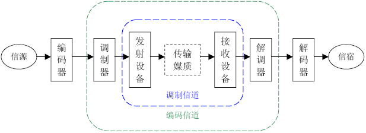

# 通信基础

- DICT:CT（Communication Technology）、IT（Information Technology）到ICT（IT+CT），从ICT再到DICT（ICT+DT，DT：Data Technology）
- 通信：通信技术研究的就是从信息的源头到信息的目的地整个过程的技术问题。
  - 根据接收对象的不同
    - 单播
    - 广播
    - 组播
  - 电信：或称电讯（英语：Telecommunication），是用电磁设备实现的利用有线电、无线电或光传输信息的通信方式。
  - 计算机网络（英语：computer network），通常也简称网络，是指容许节点分享资源的数字电信网络
    - 沟通语言：通信协议
      - 通信协议（英语：Communications Protocol，也称传输协议）：在任何物理介质中允许两个或多个在传输系统中的终端之间传播信息的系统标准，也是指计算机通信或网络设备的共同语言。通信协议定义了通信中的语法学、语义学和同步规则以及可能存在的错误检测与纠正。通信协议在硬件、软件或两者之间皆可实现
- 通信和数学不同。
  - 数学是诠释 大自然普遍规律的基础学科，任何定律，虽然是人发现的，但没有人 感性的成分存在。
  - 通信中的大量协议，是在科学基础上人为定义的，它符合科学规律，能够提高效率，但并非只能是这个范围，当然，在人们定义明确以后，就不 
    能再去随意更改和调整了

- 通信协议都是通过通信标准进行定义和规范
  - 通信标准是各个国家之间、机构之间、企业之间或者国家内部协商确定的。
  - 一些行业自己定义了自己的标准，一般称之为“行业标准”。

## 基础概念

- 信号：通信信道上传输的电编码、电磁编码或光编码叫作信号。信号分为模拟信号和数字信号两类。
  - 脉冲编码调制（英语：Pulse-code modulation，缩写：PCM）是一种模拟信号的数字化方法。PCM将信号的强度依照同样的间距分成数段，然后用独特的数字记号（通常是二进制）来量化。
- 信道：信道是传送信号的通路。信道本身可以是模拟方式的，也可以是数字方式的。用以传输模拟信号的信道叫作模拟信道，用以传输数字信号的信道叫作数字信道。
- 信息
  - 凡是在一种情况下能减少不确定性的任何事物都叫信息。
  - 哲学观点：信息是一种带普遍性的关系属性，是物质存在方式及其运动规律、特点的外在表现。
  - 通信观点：生物体通过感觉器官或具有一定功能的机器通过特定装置同外界交换的内容的总称。
- 数据：它是任何描述物体概念、情况、形势的事实、数字、字母和符号。
  - 数据（data）经由处理后称为信息（information），从这些信息中分析出来的讯息称为知识（knowledge），再通过不断地行动与验证，逐渐形成智慧（wisdom）
- 信息和数据的关系：数据是传递信息的实体，而信息是数据的内容或表达形式。
  - 无法用数据描述的信息是无法传递的，比如至今人类还无法通过电信网传递的气味、直觉等。

- 通信概念模糊的原因
  - 任何时代都不可能忽略过去多年的技术积累和资本投入，去重新设计一套与原有技术毫不相干的革命性技术并付诸实践。
  - 由于电信概念、机理和技术发展太快，专家们来不及仔细考虑某个标准定义可能带来的后果。
  - 相互替代性较强的概念，有的定义比较含糊
  - 通信专家的工作习惯和命名时存在的某些缺陷扩大了概念混淆
- 通信概念发展规律：长期上永恒的技术融合和技术发展，短期上不断产生新的、混淆的概念。

# 发展史

- 时期	
  - 古代通信，人类基于最原始的需求，利用自然界的基本规律和人的基础感官可达性建立通信系统
  - 近、现代通信，从电磁技术引入通信开始，人们尝试使用电话、电报、传真，到成规模地建设各种电信网络和专网网络，并创造 了性能更强、质量更好、效率更高的数字通信、光纤通信。
  - 当代通信，是指在前人基础上创造的移动通信、互联网通信、物联网和融合技术的发展历程。
  - 未来通信，是在目前人类文明和科技发展的基础上，在可以预见和不可预见的未来，更加强大的通信工具变革和更加广阔的通信发展前景。

## 古代通信:信息沟通的起步

- 烽火通信是典型的“存储——转发”模式的、半双工模式的（两个相邻烽火台可以互相传递但不能同时互相传递信息）、广播模式的（传递给所有可看到的地方）、可视模式的 （必须视线可达）、无线模式的（没有连接线）、数字化的（只有两种状态“无”和“有”）通信手段。
- 人类的文明史，就是网络的发展史。

## 近现代通信:电磁通信和数字时代的起步

- 利用电和磁的技术，实现通信目的，被称为“电信”。
  - 近代通信起始的标志，就是开始应用“电信技术”。
  - 电磁技术最早的电信应用，就是电报。电报的原理是人们用长、短音电信号来标识文字或者词汇，相当于给每个字（或字母）做了一个编码，发报员只要按照编码把文字或者词汇翻译并通过专用的发报装置发送出去即可。
- 名词
  - ENIAC电子数值积分计算机（英语：Electronic Numerical Integrator And Computer）
  - STM：同步转移模式（synchronous transfer mode）是指传统的电路传送模式，也就是电路交换模式（CSM）+时分复用传输（TDM）。
  - PSTN：公共交换电话网（Public Switched Telephone Network或简称PSTN）是一种用于全球语音通信的电路交换网络，是目前世界上最大的网络，拥有用户数量大约是8亿。PSTN包括电话线（双绞线），光纤电缆，微波传输链路，蜂窝网络，通信卫星，与海底电话电缆，所有互连通过交换中心包括移动和固定电话，从而允许在世界上的任何电话与任何其他终端通信。最初是固定线路的模拟电话系统的网络，PSTN的核心目前几乎已完全数字化。
  - ISDN：综合业务数字网（Integrated Services Digital Network，ISDN）是一个数字电话网络国际标准，是一种典型的电路交换网络系统。ISDN是一种在数字电话网IDN（该网能够提供端到端的的数字连接）的基础上发展起来的通信网络，ISDN能够支持多种业务（包括电话业务以及非电话业务）。ISDN的最重要特征是能够支持端到端的数字连接，并且可实现传统话音业务和分组数据业务的综合，使数据和话音能够在同一网络中传递。
  - ITU：国际电信联盟（ 英语：International Telecommunication Union，简称 ITU）是一个国际组织，主要负责确立国际无线电和电信的管理制度和标准。它的前身是1865年5月17日在巴黎创立的国际电报联盟，是世界上最悠久的国际组织。

- 在模拟PSTN形态的基础上,形成了综合数字网(IDN)的形态。成就
  - 统一了语音信号数字编码标准;
  - 用数字传输系统代替模拟传输系统;
  - 用数字复用器代替载波机;
  - 用数字电子交换机代替模拟机电交换机;
  - 发明了分组交换机。

## 当代通信:移动通信和互联网时代

- 新技术的探索是随着经济的发展、各种自然基础学科的发展、人们生活方式的改变而不断深入的。
- 许多被看好的技术惨遭淘汰,而很多不被看好的技术却异军突起。

## 未来通信:大融合时代

- 一切皆有可能

# 通信的实现

- 人类最大的缺点就是永不满足,人类最大的优点也是永不满足
- 方式：书信、旗语、电报、电话、手机、计算机。。。

## 电信网中的通讯工具

- 电话机，通信网昔日第一终端：电话机是指“固定电话”，曾经是人类最普遍使用的通信终端，统治全球的通信界近100年的时间。电话机是通过电信号双向传输话音的终端设备。早期电话机的原理为：说话声音为空气里的复合振动，可传输到固体上，通过电脉冲于导电金属上传递。
- 传真，不可或缺的通信配角：传真机将需发送的原件按照规定的顺序，通过光学扫描系统分解成许多微小单元（称为像素），然后将这些微小单元的亮度信息由光电变换器件顺序地转变成电信号，经放大、编码或调制后转化为一种被称为“霍夫曼编码”的数字信号送至信道。接收机将收到的信号放大、解码或解调后，按照与发送机相同的扫描速度和顺序，以记录的形式复制出原件的副本。
- 手机，第一终端：移动电话，又称手提式电话机或手提电话，简称手机，是可以在较大范围内使用的便携式电话。
  - 个人数字助理（英语：personal digital assistant，缩写：PDA），一般是指像手机一样大小，却拥有电脑等级硬件的移动电子设备
- 寻呼
- 电报，逐渐消逝的电波。

## 互联网的通讯工具

- 电子计算机（亦称电脑）是利用数字电子技术，根据一系列指令指示并且自动执行任意算术或逻辑操作串行的设备。通用计算机因有能遵循被称为“程序”的一般操作集的能力而使得它们能够执行极其广泛的任务。

## 专业领域的通信工具

- 对讲机

## 家电中的通信工具

- 电视机
- 智能家电
- 智能穿戴设备

# 通信的原理

- 通信的根本问题是报文的再生，在两个端点上报文应该精确地或者近似地重现
- 问题和解决方法
  - 用什么方式传递给对方？
    - ==编码==问题。研究类似人 类语言学的问题，用什么样的表达方式表述信息，通过什么媒介将表述内容传递到对方（假设已经能够确定找到对方），对方能够接收并接受？
  - 如何找到对方？
    - ==寻址==问题。研究类似门牌号码规划、寻找道路等问题。
  - 有没有信息传递的额外要求，如安全、便捷、节约、多需求的并行处理？
    - ==优化==问题。研究加密、节省成本、提高效率、增强管理、方便运营等问题。

## 编码综述

- 如何把声音、图像、文字等信息变成电磁信号，如何把一系列的电磁信号有效地传送到对方，又如何在对端还原为声音、图像和文字
- 任何选择都是适应需求的，“绝对适合”任何场景和需求的选择是不存在的。任何编码都是为了适应不同的传送需求
- 电磁信号的可复制性和可再生性，差错控制。

## 寻址综述

- 给任何信息的出发点和目的地做个编号, 通过编号可以识别世界.上任何一个出发点和目的地
  - 如何在一个局部区域分配了地址之后，能够让全网知道该地址所在的位置。
- 通过相关机制，使信息依照一定的路径在这两者之间传送。
- 寻址方式
  - 用信令寻址后自动建立专门的通道
  - 在路由器上做好路由策略，让数据包根据这些策略寻找到达目的地的路径
  - 将目的地址在全网做广播宣告，真正的目的地址给出回应
  - 在出发地和目的地之间人工建立一条专门的通道等
- 无论是电话网、传输网，还是数据网，都各有各的编址方法和寻址方法；
  - 移动通信中的FDMA（频分多址，如TACS、 AMPS）、时分多址（TDMA）、码分多址（CDMA）等技术体制， 都有一整套完善的寻址方式。

## 网络优化综述

- 人们改造世界的过程：先保证解决基本问题，再思考如何用更好的方法解决问题。
  - 网络优化，就是在基本的通信问题（如连通性、信息还原能力）得以解决后，如何更方便、快捷、安全、经济地规划网络、建设网络、使用网络的问题。
- 互相通信问题：用什么方式能让许多人都能同时通话而投入的平均成本不会大幅度增加？有没有方法让很多人共用中间的传送线缆。
- 信息交互方式
  - “面向连接”。建立一条确定的线路然后传送信息
    - 实现：PSTN、帧中继、ATM、MPLS网络
  - “无连接”。让每个信息源发出的信息包“一跳一跳”（Hop-Hop）向下一个网络节点迈进，即采用“存储——转发”模式
    - 实现：传统IP网络

### 优化的高级阶段：人性化

- 通信理念发展的进程：前人无，我有->前人有，我优->前人优，我人性化。“人性化”是优化问题的高级阶段。
- “用户体验”,人性化是一个很难标准化的东西，但却是目前通信领域中最重要的课题之一

# 编码

- 背景
  - 以太的由来：19世纪，科学家们逐步发现光是一种波，而生活中的波大多需要传播介质（如声波的传递需要借助于空气，水波的传播借助于水等）。受经典力学思想影响，于是他们便假想宇宙到处都存在着一种称之为以太的物质，是这种物质作为光的传播中的介质。
  - 网络价值与用户数的平方成正比。网络使用者越多，价值就越大。
    - 网络的价值V =K ×N  ；（K  为价值系数，N  为用户数量。）
  - 编码是通信的基本组成部分，是通信里面的“语文课”
  - 信息用什么信息格式传送到目的地
    - 信息论中的信源编码和信道编码过程
    - 数模、模数转换、抽样、复用解复用
    - 各种数据帧、分组、信元等数据报文的封装格式。

- ==香农公式==：“在被高斯白噪声干扰的信道中，计算最大信息传送速率C 的公式”：C =B log2 （1+S /N ）。
  - B 是信道带宽 （Hz）
    - 信道、频道或波道，是信号在通信系统中传输的通道，由信号从发射端传输到接收端所经过的传输媒质所构成。
    - 带宽（英语：Bandwidth）指信号所占据的频带宽度；在被用来描述信道时，带宽是指能够有效通过该信道的信号的最大频带宽度。对于模拟信号而言，带宽又称为频宽，以赫兹（Hz）为单位。对于数字信号而言，带宽是指单位时间内链路能够通过的数据量。为了与模拟带宽进行区分，数字信道的带宽一般直接用波特率或符号率来描述。
  - S 是信号功率（W）
  - N 是噪声功率（W）
    - 噪声（英语：Noise）在电子学中指，信号在传输过程中会受到一些外在能量所产生信号（如杂散电磁场）的干扰，这些能量即噪声。噪声通常会造成信号的失真。其来源除了来自系统外部，亦有可能由接收系统本身产生。噪声的强度通常都是与信号带宽成正比，所以当信号带宽越宽，噪声的干扰也会越大。
    - 信噪比（英语：Signal-to-noise ratio，缩写为SNR或S/N），又称訊噪比，用于比较所需信号的强度与背景噪声的强度。其定义为信号功率与噪声功率的比率，以分贝（dB）为单位表示。大于比率1:1（高于0分贝）表示信号多于噪声。
  - 信道容量C 与信道带宽B 成正比，同时还取决于系统信噪比以及编码技术种类。
- 
  - 调制信道是指信号从调制器的输出端传输到解调器的输入端经过的部分。对于调制和解调的研究者来说，信号在调制信道上经过的传输媒质和变换设备都对信号做出了某种形式的变换，研究者只关心这些变换的输入和输出的关系，并不关心实现这一系列变换的具体物理过程。这一系列变换的输入与输出之间的关系，通常用多端口时变网络作为调制信道的数学模型进行描述。
  - 编码信道是指数字信号由编码器输出端传输到译码器输入端经过的部分。对于编译码的研究者来说，编码器输出的数字串行经过编码信道上的一系列变换之后，在译码器的输入端成为另一组数字串行，研究者只关心这两组数字串行之间的变换关系，而并不关心这一系列变换发生的具体物理过程，甚至并不关心信号在调制信道上的具体变化。编码器输出的数字串行与到译码器输入的数字串行之间的关系，通常用多端口网络的转移概率作为编码信道的数学模型进行描述。

##声音->模拟信号

- 声音是振动产生的声波，通过介质（气体、固体、液体）传播并能被人或动物听觉器官所感知的波动现象。振幅和频率
- 模拟信号（英语：analog signal）是指在时域上数学形式为连续函数的讯号。
- 贝尔发明的碳粒电话机，是基于振膜对碳粒造成忽紧忽松的压力引起其电阻大小的变化
  - 电流=电压/ 电阻，在电阻变化而电压不变的情况下，电流就会发生线性变化。
  - 忽大忽小的电流，就是电信信号。假设这些信号已经陆续传送到对方的听筒。听筒内有一电磁铁随电流大小而磁性不同，它对埋有金属丝的薄膜时吸时 
    放，薄膜便发出了像人说话一样的声音。
- 转换方式
  - 以信号的原始频率（或称为“基带频率”）表示或以另一种频率表示。
  - 