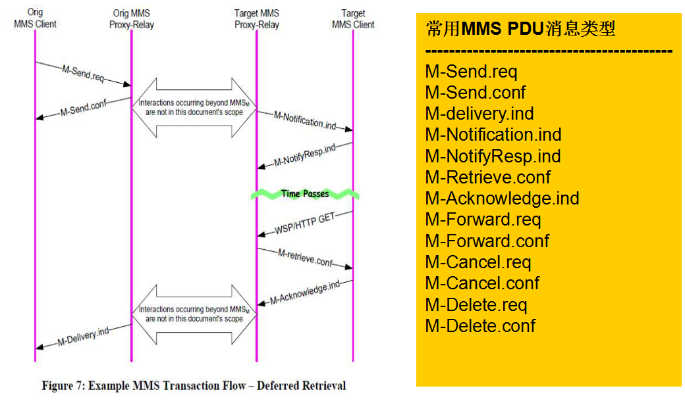

# SMS

- 长度：140 byte之内
- 业务
  - 小区广播短消息业务
  - 点对点短消息业务
    - SMS MO（Short Message Mobile Originated）:MS->SC
    - SMS MT (Short Message Mobile Terminated):SC->MS
    - MS：Mobile Station
    - SC：Service Center
- 短信类型
  - SMS-DELIVER
  - SMS-DELIVER-REPORT
  - SMS-SUBMIT
  - SMS-SUBMIT-REPORT
  - SMS-STATUS-REPORT
  - SMS-COMMAND

- 短信发送流程：app->framework->ril->modem

## 发送流程

### packages

#### apps

1. 打开短信应用会进入ConversationListActivity，位于packages/apps/Messaging/src/com/android/messaging/ui/conversationlist/ConversationlistActivity.java

  - ConversationListActivity的布局文件是单独一个fragment：ConversationListFragment.java，位于packages/apps/Messaging/src/com/android/messaging/ui/conversationlist/ConversationListFragment.java‘

2. 在ConversationListFragment的布局文件中定义了新对话的按钮，在onCreateView()中，为右下角的新的对话绑定点击事件

  - ```xml-dtd
    <!--packages/apps/Messaging/res/layout/conversation_list_fragment.xml -->
    <ImageView
        style="@style/ConversationListFragmentStartNewButtonStyle"
        android:id="@+id/start_new_conversation_button"
        android:layout_width="@dimen/fab_size"
        android:layout_height="@dimen/fab_size"
        android:layout_gravity="bottom|end"
        android:layout_marginBottom="@dimen/fab_bottom_margin"
        android:paddingBottom="@dimen/fab_padding_bottom"
        android:background="@drawable/fab_new_message_bg"
        android:elevation="@dimen/fab_elevation"
        android:scaleType="center"
        android:src="@drawable/ic_add_white"
        android:stateListAnimator="@animator/fab_anim"
        android:contentDescription="@string/start_new_conversation"/>
    ```

  - ```java
    //packages/apps/Messaging/src/com/android/messaging/ui/conversationlist/ConversationListFragment.java
    private ImageView mStartNewConversationButton;
    private ConversationListFragmentHost mHost;
    public View onCreateView(final LayoutInflater inflater, final ViewGroup container,
                final Bundle savedInstanceState) {
        mStartNewConversationButton = (ImageView) rootView.findViewById(
                R.id.start_new_conversation_button);
        if (mArchiveMode) {
            mStartNewConversationButton.setVisibility(View.GONE);
        } else {
            mStartNewConversationButton.setVisibility(View.VISIBLE);
            mStartNewConversationButton.setOnClickListener(new OnClickListener() {
                @Override
                public void onClick(final View clickView) {
                    mHost.onCreateConversationClick();
                }
            });
        }
    }
    ```

3. ConversationListFragmentHost是一个接口，实现是AbstractConversationListActivity

  - AbstractConversationListActivity：Base class for many Conversation List activities. This will handle the common actions of multi select and common launching of intents.

  - ```java
    //packages/apps/Messaging/src/com/android/messaging/ui/conversationlist/AbstractConversationListActivity.java
    @Override
    public void onCreateConversationClick() {
        //Launch an activity to start a new conversation
        UIIntents.get().launchCreateNewConversationActivity(this, null);
    }
    ```

4. UIIntents是一个接口，UIIntentsImpl实现了它

  - UIIntentsImpl：A central repository of Intents used to start activities.

  - ```java
    //packages/apps/Messaging/src/com/android/messaging/ui/UIIntentsImpl.java
    @Override
    public void launchCreateNewConversationActivity(final Context context,
            final MessageData draft) {
        final Intent intent = getConversationActivityIntent(context, null, draft,
                false /* withCustomTransition */);
        context.startActivity(intent);
    }
    ```

  - ```java
    /**
     * Get an intent which takes you to a conversation
     */
    private Intent getConversationActivityIntent(final Context context,
            final String conversationId, final MessageData draft,
            final boolean withCustomTransition) {
        final Intent intent = new Intent(context, ConversationActivity.class);
    
        // Always try to reuse the same ConversationActivity in the current task so that we don't
        // have two conversation activities in the back stack.
        intent.setFlags(Intent.FLAG_ACTIVITY_CLEAR_TOP);
    
        // Otherwise we're starting a new conversation
        if (conversationId != null) {
            intent.putExtra(UI_INTENT_EXTRA_CONVERSATION_ID, conversationId);
        }
        if (draft != null) {
            intent.putExtra(UI_INTENT_EXTRA_DRAFT_DATA, draft);
    
            // If draft attachments came from an external content provider via a share intent, we
            // need to propagate the URI permissions through to ConversationActivity. This requires
            // putting the URIs into the ClipData (setData also works, but accepts only one URI).
            ClipData clipData = null;
            for (final MessagePartData partData : draft.getParts()) {
                if (partData.isAttachment()) {
                    final Uri uri = partData.getContentUri();
                    if (clipData == null) {
                        clipData = ClipData.newRawUri("Attachments", uri);
                    } else {
                        clipData.addItem(new ClipData.Item(uri));
                    }
                }
            }
            if (clipData != null) {
                intent.setClipData(clipData);
                intent.addFlags(Intent.FLAG_GRANT_READ_URI_PERMISSION);
            }
        }
        if (withCustomTransition) {
            intent.putExtra(UI_INTENT_EXTRA_WITH_CUSTOM_TRANSITION, true);
        }
    
        if (!(context instanceof Activity)) {
            // If the caller supplies an application context, and not an activity context, we must
            // include this flag
            intent.addFlags(Intent.FLAG_ACTIVITY_NEW_TASK);
        }
        return intent;
    }
    ```

5. 创建新的消息，进入ConversationActivity，位于ui/conversation/ConversationActivity.java	

   - 在onCreate()中调用updateUiState()创建ConversationFragment对象

   - ```java
     //packages/apps/Messaging/src/com/android/messaging/ui/conversation/ConversationActivity.java
     @Override
     protected void onCreate(final Bundle savedInstanceState) {
         // Don't animate UI state change for initial setup.
         updateUiState(false /* animate */);
     }
     
     private void updateUiState(final boolean animate) {
         // Set up the conversation fragment.
         if (needConversationFragment) {
             Assert.notNull(conversationId);
             if (conversationFragment == null) {
                 conversationFragment = new ConversationFragment();
                 fragmentTransaction.add(R.id.conversation_fragment_container,
                         conversationFragment, ConversationFragment.FRAGMENT_TAG);
             }
             final MessageData draftData = intent.getParcelableExtra(
                     UIIntents.UI_INTENT_EXTRA_DRAFT_DATA);
             if (!needContactPickerFragment) {
                 // Once the user has committed the audience,remove the draft data from the
                 // intent to prevent reuse
                 intent.removeExtra(UIIntents.UI_INTENT_EXTRA_DRAFT_DATA);
             }
             conversationFragment.setHost(this);
             conversationFragment.setConversationInfo(this, conversationId, draftData);
         } else if (conversationFragment != null) {
             // Don't save draft to DB when removing conversation fragment and switching to
             // contact picking mode.  The draft is intended for the new group.
             conversationFragment.suppressWriteDraft();
             fragmentTransaction.remove(conversationFragment);
         }
     }
     ```

6. 在ConversationFragment的onCreateView获得ComposeMessageView并bind

   - ConversationFragment的布局文件中id message_compose_view_container引用自compose_message_view.xml，在compose_message_view布局文件中包含send_message_button按钮

     - ```xml-dtd
       <!--packages/apps/Messaging/res/layout/conversation_fragment.xml-->
       <!-- Attachments to send, compose message view, media picker. -->
       <include layout="@layout/compose_message_view"
           android:id="@+id/message_compose_view_container"
           android:layout_width="match_parent"
           android:layout_height="wrap_content"/>
       ```

     - ```xml-dtd
       <!--packages/apps/Messaging/res/layout/compose_message_view.xml-->
       <ImageButton
           android:id="@+id/send_message_button"
           android:layout_width="@dimen/conversation_message_contact_icon_size"
           android:layout_height="@dimen/conversation_message_contact_icon_size"
           android:src="@drawable/ic_send_light"
           android:background="@drawable/send_arrow_background"
           android:contentDescription="@string/sendButtonContentDescription"
           android:visibility="gone" />
       ```

   - ComposeMessageView：This view contains the UI required to generate and send messages.

     - ```java
       //packages/apps/Messaging/src/com/android/messaging/ui/conversation/ConversationFragment.java
       public View onCreateView(final LayoutInflater inflater, final ViewGroup container,final Bundle savedInstanceState) {
            mComposeMessageView = (ComposeMessageView)view.findViewById(R.id.message_compose_view_container);
            // Bind the compose message view to the DraftMessageData
            mComposeMessageView.bind(DataModel.get().createDraftMessageData(mBinding.getData().getConversationId()), this);
       }
       ```

7. 在ComposeMessageView的onFinishInflate()中获取发送按钮并绑定点击事件

   - ```java
     private ImageButton mSendButton;
     protected void onFinishInflate() {
         mSendButton = (ImageButton) findViewById(R.id.send_message_button);
         mSendButton.setOnClickListener(new OnClickListener() {
             @Override
             public void onClick(final View clickView) {
                 sendMessageInternal(true /* checkMessageSize */);
             }
         });
     }
     ```

   - 在sendMessageInternal（）中设置短信的内容和接收者，检查短信格式，根据结果执行相对应的操作

     - ```java
       //packages/apps/Messaging/src/com/android/messaging/ui/conversation/ComposeMessageView.java
       //ConversationFragment实现了IComposeMessageViewHost
       private IComposeMessageViewHost mHost;
       private void sendMessageInternal(final boolean checkMessageSize) {
           LogUtil.i(LogUtil.BUGLE_TAG, "UI initiated message sending in conversation " +
                 mBinding.getData().getConversationId());
           // Check the host for pre-conditions about any action.
           if (mHost.isReadyForAction()) {
             mInputManager.showHideSimSelector(false /* show */, true /* animate */);
             //mBinding.getData()获得DraftMessageData对象，设置短信的内容
             final String messageToSend = mComposeEditText.getText().toString();
             mBinding.getData().setMessageText(messageToSend);
             //设置短信的接收者
             final String subject = mComposeSubjectText.getText().toString();
             mBinding.getData().setMessageSubject(subject);
             // Asynchronously check the draft against various requirements before sending.
             mBinding.getData().checkDraftForAction(checkMessageSize,
                     mHost.getConversationSelfSubId(), new CheckDraftTaskCallback() {
                 @Override
                 public void onDraftChecked(DraftMessageData data, int result) {
                     mBinding.ensureBound(data);
                     switch (result) {
                         case CheckDraftForSendTask.RESULT_PASSED:
                             // Continue sending after check succeeded.
                             //检查通过，将DraftMessageData对象变为MessageData对象
                             final MessageData message = mBinding.getData().prepareMessageForSending(mBinding);
                             if (message != null && message.hasContent()) {
                                 playSentSound();
                                 //使用ConversationFragment类的sendMessage()方法开始发送Message。
                                 mHost.sendMessage(message);
                                 hideSubjectEditor();
                                 if (AccessibilityUtil.isTouchExplorationEnabled(getContext())) {
                                     AccessibilityUtil.announceForAccessibilityCompat(
                                             ComposeMessageView.this, null,
                                             R.string.sending_message);
                                 }
                             }
                             break;
                     }
                 }
             }, mBinding);
           } 
       }  
       ```
       
       - ```java
         /*首先创建DraftMessageData类的内部类对象CheckDraftForSendTask,它继承了SafeAsyncTask;接着调用此对象的executeOnThreadPool()方法触发重写父类的三个方法调用onPreExecute、dolnBackgroundTimed 和onPostExecute,这几个方法的处理逻辑是发送短信的前置条件判断，最终通过mCallback.onDraftChecked调用将判断结果发送给CheckDraftTaskCallback对象。*/
         
         //packages/apps/Messaging/src/com/android/messaging/datamodel/data/DraftMessageData.java
         public void checkDraftForAction(final boolean checkMessageSize, final int selfSubId,final CheckDraftTaskCallback callback, final Binding<DraftMessageData> binding) {
              new CheckDraftForSendTask(checkMessageSize, selfSubId, callback, binding).executeOnThreadPool((Void) null);
         }
         
         public class CheckDraftForSendTask extends SafeAsyncTask<Void, Void, Integer> {
             public static final int RESULT_PASSED = 0;
             public static final int RESULT_HAS_PENDING_ATTACHMENTS = 1;
             public static final int RESULT_NO_SELF_PHONE_NUMBER_IN_GROUP_MMS = 2;
             public static final int RESULT_MESSAGE_OVER_LIMIT = 3;
             public static final int RESULT_VIDEO_ATTACHMENT_LIMIT_EXCEEDED = 4;
             public static final int RESULT_SIM_NOT_READY = 5;
             private final boolean mCheckMessageSize;
             private final int mSelfSubId;
             private final CheckDraftTaskCallback mCallback;
             private final String mBindingId;
             private final List<MessagePartData> mAttachmentsCopy;
             private int mPreExecuteResult = RESULT_PASSED;
         
             public CheckDraftForSendTask(final boolean checkMessageSize, final int selfSubId,
                     final CheckDraftTaskCallback callback, final Binding<DraftMessageData> binding) {
                 mCheckMessageSize = checkMessageSize;
                 mSelfSubId = selfSubId;
                 mCallback = callback;
                 mBindingId = binding.getBindingId();
                 // Obtain an immutable copy of the attachment list so we can operate on it in the
                 // background thread.
                 mAttachmentsCopy = new ArrayList<MessagePartData>(mAttachments);
         
                 mCheckDraftForSendTask = this;
             }
         
             @Override
             protected void onPreExecute() {
                 // Perform checking work that can happen on the main thread.
                 if (hasPendingAttachments()) {
                     mPreExecuteResult = RESULT_HAS_PENDING_ATTACHMENTS;
                     return;
                 }
                 if (getIsGroupMmsConversation()) {
                     try {
                         if (TextUtils.isEmpty(PhoneUtils.get(mSelfSubId).getSelfRawNumber(true))) {
                             mPreExecuteResult = RESULT_NO_SELF_PHONE_NUMBER_IN_GROUP_MMS;
                             return;
                         }
                     } catch (IllegalStateException e) {
                         // This happens when there is no active subscription, e.g. on Nova
                         // when the phone switches carrier.
                         mPreExecuteResult = RESULT_SIM_NOT_READY;
                         return;
                     }
                 }
                 if (getVideoAttachmentCount() > MmsUtils.MAX_VIDEO_ATTACHMENT_COUNT) {
                     mPreExecuteResult = RESULT_VIDEO_ATTACHMENT_LIMIT_EXCEEDED;
                     return;
                 }
             }
         
             @Override
             protected Integer doInBackgroundTimed(Void... params) {
                 if (mPreExecuteResult != RESULT_PASSED) {
                     return mPreExecuteResult;
                 }
         
                 if (mCheckMessageSize && getIsMessageOverLimit()) {
                     return RESULT_MESSAGE_OVER_LIMIT;
                 }
                 return RESULT_PASSED;
             }
         
             @Override
             protected void onPostExecute(Integer result) {
                 mCheckDraftForSendTask = null;
                 // Only call back if we are bound to the original binding.
                 if (isBound(mBindingId) && !isCancelled()) {
                     mCallback.onDraftChecked(DraftMessageData.this, result);
                 } else {
                     if (!isBound(mBindingId)) {
                         LogUtil.w(LogUtil.BUGLE_TAG, "Message can't be sent: draft not bound");
                     }
                     if (isCancelled()) {
                         LogUtil.w(LogUtil.BUGLE_TAG, "Message can't be sent: draft is cancelled");
                     }
                 }
             }
         
             @Override
             protected void onCancelled() {
                 mCheckDraftForSendTask = null;
             }
         
             /**
              * 1. Check if the draft message contains too many attachments to send
              * 2. Computes the minimum size that this message could be compressed/downsampled/encoded
              * before sending and check if it meets the carrier max size for sending.
              * @see MessagePartData#getMinimumSizeInBytesForSending()
              */
             @DoesNotRunOnMainThread
             private boolean getIsMessageOverLimit() {
                 Assert.isNotMainThread();
                 if (mAttachmentsCopy.size() > getAttachmentLimit()) {
                     return true;
                 }
         
                 // Aggregate the size from all the attachments.
                 long totalSize = 0;
                 for (final MessagePartData attachment : mAttachmentsCopy) {
                     totalSize += attachment.getMinimumSizeInBytesForSending();
                 }
                 return totalSize > MmsConfig.get(mSelfSubId).getMaxMessageSize();
             }
         }
         ```

8. 在ConversationFragment类的sendMessage()中，调用ConversationData的sendMessage()方法.将普通的文本和多媒体关联到一起

   - ```java
     //packages/apps/Messaging/src/com/android/messaging/ui/conversation/ConversationFragment.java
     
     // This binding keeps track of our associated ConversationData instance
     // A binding should have the lifetime of the owning component,
     //  don't recreate, unbind and bind if you need new data
     @VisibleForTesting
     final Binding<ConversationData> mBinding = BindingBase.createBinding(this);
     
     public void sendMessage(final MessageData message) {
         if (isReadyForAction()) {
             if (ensureKnownRecipients()) {
                 // Merge the caption text from attachments into the text body of the messages
                 message.consolidateText();
     			//获得ConversationData，调用它的sendMessage()方法
                 mBinding.getData().sendMessage(mBinding, message);
                 mComposeMessageView.resetMediaPickerState();
             } 
         } 
     }
     
     //packages/apps/Messaging/src/com/android/messaging/datamodel/data/MessageData.java
     /**
      * Takes all captions from attachments and adds them as a prefix to the first text part or
      * appends a text part
      */
     //packages/apps/Messaging/src/com/android/messaging/datamodel/data/MessageData.java
     public final void consolidateText() {
         final String separator = System.getProperty("line.separator");
         final StringBuilder captionText = new StringBuilder();
         //Represents a single message part. Messages consist of one or more parts which may contain either text or media.   
         MessagePartData firstTextPart = null;
         int firstTextPartIndex = -1;
         for (int i = 0; i < mParts.size(); i++) {
             final MessagePartData part = mParts.get(i);
             if (firstTextPart == null && !part.isAttachment()) {
                 firstTextPart = part;
                 firstTextPartIndex = i;
             }
             if (part.isAttachment() && !TextUtils.isEmpty(part.getText())) {
                 if (captionText.length() > 0) {
                     captionText.append(separator);
                 }
                 captionText.append(part.getText());
             }
         }
     
         if (captionText.length() == 0) {
             // Nothing to consolidate
             return;
         }
     
         if (firstTextPart == null) {
             addPart(MessagePartData.createTextMessagePart(captionText.toString()));
         } else {
             final String partText = firstTextPart.getText();
             if (partText.length() > 0) {
                 captionText.append(separator);
                 captionText.append(partText);
             }
             mParts.set(firstTextPartIndex,
                     MessagePartData.createTextMessagePart(captionText.toString()));
         }
     }
     ```

9. 在ConversationData的sendMessage()中判断并根据用户的api和sub执行对应的insertNewMessage()方法，将Message存入数据库。

  - ```java
    //packages/apps/Messaging/src/com/android/messaging/datamodel/data/ConversationData.java
    public void sendMessage(final BindingBase<ConversationData> binding,final MessageData message) {
        //boolean isAtLeastL_MR1()：True if the version of Android that we're running on is at least L MR1(API level 22)    
        if (!OsUtil.isAtLeastL_MR1() || message.getSelfId() == null) {
                InsertNewMessageAction.insertNewMessage(message);
            } else {
                final int systemDefaultSubId = PhoneUtils.getDefault().getDefaultSmsSubscriptionId();
                if (systemDefaultSubId != ParticipantData.DEFAULT_SELF_SUB_ID &&
                        mSelfParticipantsData.isDefaultSelf(message.getSelfId())) {
                    // Lock the sub selection to the system default SIM as soon as the user clicks on
                    // the send button to avoid races between this and when InsertNewMessageAction is
                    // actually executed on the data model thread, during which the user can potentially
                    // change the system default SIM in Settings.
                    InsertNewMessageAction.insertNewMessage(message, systemDefaultSubId);
                } else {
                    InsertNewMessageAction.insertNewMessage(message);
                }
            }
    ```

10. 在InsertNewMessageAction中执行insertNewMessage()

  - InsertNewMessageAction used to **convert a draft message to an outgoing message**. Its writes SMS messages to the telephony db, but SendMessageAction is responsible for inserting MMS message into the telephony DB. The latter also does the actual sending of the message in the background.The latter is also responsible for re-sending a failed message.

  - ```java
    //Insert message (no listener)
    //packages/apps/Messaging/src/com/android/messaging/datamodel/action/InsertNewMessageAction.java
    public static void insertNewMessage(final MessageData message) {
        final InsertNewMessageAction action = new InsertNewMessageAction(message);
        action.start();
    }
    ```

    - ```java
      //ActionServicelmpl继承自JobIntentService,使用enqueueWork()将任务入队，在onHandleWork()中处理任务
      start方法调用过程：Action.start() -> DataModel.startActionService() ->ActionService.startAction() -> ActionServicelmpl.startAction() -> ActionServicelmpl.startServiceWithIntent（）->ActionServicelmpl.enqueueWork（） ->ActionServicelmpl.onHandleWork（）
      
      //packages/apps/Messaging/src/com/android/messaging/datamodel/action/ActionServiceImpl.java
       /**
       * Start action by sending intent to the service
       * @param action - action to start
       */
      protected static void startAction(final Action action) {
          final Intent intent = makeIntent(OP_START_ACTION);
          final Bundle actionBundle = new Bundle();
          actionBundle.putParcelable(BUNDLE_ACTION, action);
          intent.putExtra(EXTRA_ACTION_BUNDLE, actionBundle);
          action.markStart();
          startServiceWithIntent(intent);
      }
       /**
       * Queue intent to the ActionService.
       */
      private static void startServiceWithIntent(final Intent intent) {
          final Context context = Factory.get().getApplicationContext();
          final int opcode = intent.getIntExtra(EXTRA_OP_CODE, 0);
          intent.setClass(context, ActionServiceImpl.class);
          enqueueWork(context, intent);
      }
      
      public static void enqueueWork(Context context, Intent work) {
          enqueueWork(context, ActionServiceImpl.class, JOB_ID, work);
      }
      
      /**
       * {@inheritDoc}
       */
      @Override
      protected void onHandleWork(final Intent intent) {
          if (intent == null) {
              // Shouldn't happen but sometimes does following another crash.
              LogUtil.w(TAG, "ActionService.onHandleIntent: Called with null intent");
              return;
          }
          final int opcode = intent.getIntExtra(EXTRA_OP_CODE, 0);
      
          Action action;
          final Bundle actionBundle = intent.getBundleExtra(EXTRA_ACTION_BUNDLE);
          actionBundle.setClassLoader(getClassLoader());
          switch(opcode) {
              case OP_START_ACTION: {
                  action = (Action) actionBundle.getParcelable(BUNDLE_ACTION);
                  executeAction(action);
                  break;
              }
      
              case OP_RECEIVE_BACKGROUND_RESPONSE: {
                  action = (Action) actionBundle.getParcelable(BUNDLE_ACTION);
                  final Bundle response = intent.getBundleExtra(EXTRA_WORKER_RESPONSE);
                  processBackgroundResponse(action, response);
                  break;
              }
      
              case OP_RECEIVE_BACKGROUND_FAILURE: {
                  action = (Action) actionBundle.getParcelable(BUNDLE_ACTION);
                  processBackgroundFailure(action);
                  break;
              }
      
              default:
                  throw new RuntimeException("Unrecognized opcode in ActionServiceImpl");
          }
      
          action.sendBackgroundActions(mBackgroundWorker);
      }
      ```

11. 根据Action 的处理机制，将以后台异步方式调用InsertNewMessageAction对象的executeAction().使用了JobIntentService运行机制

   - ```java
     //packages/apps/Messaging/src/com/android/messaging/datamodel/action/InsertNewMessageAction.java
     /**
      * Add message to database in pending state and queue actual sending
      */
     @Override
     protected Object executeAction() {
         MessageData message = actionParameters.getParcelable(KEY_MESSAGE);
         if (message == null) {
             LogUtil.i(TAG, "InsertNewMessageAction: Creating MessageData with provided data");
             message = createMessage();
             if (message == null) {
                 LogUtil.w(TAG, "InsertNewMessageAction: Could not create MessageData");
                 return null;
             }
         }
         
         final DatabaseWrapper db = DataModel.get().getDatabase();
         final String conversationId = message.getConversationId();
     	
         //获取ParticipantData:A class that encapsulates all of the data for a specific participant in a conversation.
         final ParticipantData self = getSelf(db, conversationId, message);
         if (self == null) {
             return null;
         }
         message.bindSelfId(self.getId());
         // If the user taps the Send button before the conversation draft is created/loaded by
         // ReadDraftDataAction (maybe the action service thread was busy), the MessageData may not
         // have the participant id set. It should be equal to the self id, so we'll use that.
         if (message.getParticipantId() == null) {
             message.bindParticipantId(self.getId());
         }
     
         final long timestamp = System.currentTimeMillis();
         final ArrayList<String> recipients =
                 BugleDatabaseOperations.getRecipientsForConversation(db, conversationId);
         if (recipients.size() < 1) {
             LogUtil.w(TAG, "InsertNewMessageAction: message recipients is empty");
             return null;
         }
         final int subId = self.getSubId();
         LogUtil.i(TAG, "InsertNewMessageAction: inserting new message for subId " + subId);
         actionParameters.putInt(KEY_SUB_ID, subId);
     
         // TODO: Work out whether to send with SMS or MMS (taking into account recipients)?
         final boolean isSms = (message.getProtocol() == MessageData.PROTOCOL_SMS);
         if (isSms) {
             String sendingConversationId = conversationId;
             if (recipients.size() > 1) {
                 // Broadcast SMS - put message in "fake conversation" before farming out to real 1:1
                 final long laterTimestamp = timestamp + 1;
                 // Send a single message
                 insertBroadcastSmsMessage(conversationId, message, subId,
                         laterTimestamp, recipients);
     
                 sendingConversationId = null;
             }
     
             for (final String recipient : recipients) {
                 // Start actual sending
                 insertSendingSmsMessage(message, subId, recipient,
                         timestamp, sendingConversationId);
             }
     
             // Can now clear draft from conversation (deleting attachments if necessary)
             BugleDatabaseOperations.updateDraftMessageData(db, conversationId,
                     null /* message */, BugleDatabaseOperations.UPDATE_MODE_CLEAR_DRAFT);
         } else {
             final long timestampRoundedToSecond = 1000 * ((timestamp + 500) / 1000);
             // Write place holder message directly referencing parts from the draft
             final MessageData messageToSend = insertSendingMmsMessage(conversationId,
                     message, timestampRoundedToSecond);
     
             // Can now clear draft from conversation (preserving attachments which are now
             // referenced by messageToSend)
             BugleDatabaseOperations.updateDraftMessageData(db, conversationId,
                     messageToSend, BugleDatabaseOperations.UPDATE_MODE_CLEAR_DRAFT);
         }
         //MessagingContentProvider:A centralized provider for Uris exposed by Bugle.
         MessagingContentProvider.notifyConversationListChanged();
         ProcessPendingMessagesAction.scheduleProcessPendingMessagesAction(false, this);
     
         return message;
     }
     ```

     - ```java
       //packages/apps/Messaging/src/com/android/messaging/datamodel/action/InsertNewMessageAction.java
       数据库的获取
       final DatabaseWrapper db = DataModel.get().getDatabase();
       //packages/apps/Messaging/src/com/android/messaging/datamodel/DataModel.java
       //packages/apps/Messaging/src/com/android/messaging/datamodel/DataModelImpl.java
       //DataModelImpl继承了DataModel，实现了getDatabase()抽象方法
       private final DatabaseHelper mDatabaseHelper;
       
       @Override
       @DoesNotRunOnMainThread
       public DatabaseWrapper getDatabase() {
           // We prevent the main UI thread from accessing the database since we have to allow
           // public access to this class to enable sub-packages to access data.
           Assert.isNotMainThread();
           return mDatabaseHelper.getDatabase();
       }
       //DataModelImpl初始化的时候获得了mDatabaseHelper
       public DataModelImpl(final Context context) {
           super();
           mContext = context;
           mActionService = new ActionService();
           mDataModelWorker = new BackgroundWorker();
           mDatabaseHelper = DatabaseHelper.getInstance(context);
           mSyncManager = new SyncManager();
       }
       //packages/apps/Messaging/src/com/android/messaging/datamodel/DatabaseHelper.java
       public static final String DATABASE_NAME = "bugle_db";
       /**
        * Get a (singleton) instance of {@link DatabaseHelper}, creating one if there isn't one yet.
        * This is the only public method for getting a new instance of the class.
        * @param context Should be the application context (or something that will live for the
        * lifetime of the application).
        * @return The current (or a new) DatabaseHelper instance.
        */
       public static DatabaseHelper getInstance(final Context context) {
           synchronized (sLock) {
               if (sHelperInstance == null) {
                   sHelperInstance = new DatabaseHelper(context);
               }
               return sHelperInstance;
           }
       }
       /**
        * Private constructor, used from {@link #getInstance()}.
        * @param context Should be the application context (or something that will live for the
        * lifetime of the application).
        */
       private DatabaseHelper(final Context context) {
           super(context, DATABASE_NAME, null, getDatabaseVersion(context), null);
           mApplicationContext = context;
       }
       DATABASE_NAME字段是bugle_db，位于/data/data/com.google.android.apps.messaging/databases/bugle_db
       ///data/data/com.android.providers.telephony/databases/mmssms.db
       ```
       
     - ```java
       //packages/apps/Messaging/src/com/android/messaging/datamodel/action/InsertNewMessageAction.java
       private ParticipantData getSelf(
               final DatabaseWrapper db, final String conversationId, final MessageData message) {
           ParticipantData self;
           // Check if we are asked to bind to a non-default subId. This is directly passed in from
           // the UI thread so that the sub id may be locked as soon as the user clicks on the Send
           // button.
           final int requestedSubId = actionParameters.getInt(
                   KEY_SUB_ID, ParticipantData.DEFAULT_SELF_SUB_ID);
           if (requestedSubId != ParticipantData.DEFAULT_SELF_SUB_ID) {
               //从数据库获取或者创建ParticipantData
               self = BugleDatabaseOperations.getOrCreateSelf(db, requestedSubId);
           } else {
               String selfId = message.getSelfId();
               if (selfId == null) {
                   // The conversation draft provides no self id hint, meaning that 1) conversation
                   // self id was not loaded AND 2) the user didn't pick a SIM from the SIM selector.
                   // In this case, use the conversation's self id.
                   final ConversationListItemData conversation =
                           ConversationListItemData.getExistingConversation(db, conversationId);
                   if (conversation != null) {
                       selfId = conversation.getSelfId();
                   } else {
                       LogUtil.w(LogUtil.BUGLE_DATAMODEL_TAG, "Conversation " + conversationId +
                               "already deleted before sending draft message " +
                               message.getMessageId() + ". Aborting InsertNewMessageAction.");
                       return null;
                   }
               }
       
               // We do not use SubscriptionManager.DEFAULT_SUB_ID for sending a message, so we need
               // to bind the message to the system default subscription if it's unbound.
               final ParticipantData unboundSelf = BugleDatabaseOperations.getExistingParticipant(
                       db, selfId);
               if (unboundSelf.getSubId() == ParticipantData.DEFAULT_SELF_SUB_ID
                       && OsUtil.isAtLeastL_MR1()) {
                   final int defaultSubId = PhoneUtils.getDefault().getDefaultSmsSubscriptionId();
                   self = BugleDatabaseOperations.getOrCreateSelf(db, defaultSubId);
               } else {
                   self = unboundSelf;
               }
           }
           return self;
       }
       ```
     
     - ```java
       @DoesNotRunOnMainThread
       public static ParticipantData getOrCreateSelf(final DatabaseWrapper dbWrapper,
               final int subId) {
           Assert.isNotMainThread();
           ParticipantData participant = null;
           dbWrapper.beginTransaction();
           try {
               final ParticipantData shell = ParticipantData.getSelfParticipant(subId);
               final String participantId = getOrCreateParticipantInTransaction(dbWrapper, shell);
               participant = getExistingParticipant(dbWrapper, participantId);
               dbWrapper.setTransactionSuccessful();
           } finally {
               dbWrapper.endTransaction();
           }
           return participant;
       }
       ```
     
     - ```java
       @DoesNotRunOnMainThread
       public static String getOrCreateParticipantInTransaction(final DatabaseWrapper dbWrapper,
               final ParticipantData participant) {
           Assert.isNotMainThread();
           Assert.isTrue(dbWrapper.getDatabase().inTransaction());
           int subId = ParticipantData.OTHER_THAN_SELF_SUB_ID;
           String participantId = null;
           String canonicalRecipient = null;
           if (participant.isSelf()) {
               subId = participant.getSubId();
               canonicalRecipient = getCanonicalRecipientFromSubId(subId);
           } else {
               canonicalRecipient = participant.getNormalizedDestination();
           }
           Assert.notNull(canonicalRecipient);
           participantId = getParticipantId(dbWrapper, subId, canonicalRecipient);
       
           if (participantId != null) {
               return participantId;
           }
       
           if (!participant.isContactIdResolved()) {
               // Refresh participant's name and avatar with matching contact in CP2.
               ParticipantRefresh.refreshParticipant(dbWrapper, participant);
           }
       
           // Insert the participant into the participants table
           final ContentValues values = participant.toContentValues();
           final long participantRow = dbWrapper.insert(DatabaseHelper.PARTICIPANTS_TABLE, null,
                   values);
           participantId = Long.toString(participantRow);
           Assert.notNull(canonicalRecipient);
       
           synchronized (sNormalizedPhoneNumberToParticipantIdCache) {
               // Now that we've inserted it, add it to our cache
               sNormalizedPhoneNumberToParticipantIdCache.put(canonicalRecipient, participantId);
           }
       
           return participantId;
       }
       ```
     
     - ```java
       /**
        * Insert SMS messaging into our database and telephony db.
        */
       private MessageData insertSendingSmsMessage(final MessageData content, final int subId,
               final String recipient, final long timestamp, final String sendingConversationId) {
           sLastSentMessageTimestamp = timestamp;
       
           final Context context = Factory.get().getApplicationContext();
       
           // Inform sync that message is being added at timestamp
           final SyncManager syncManager = DataModel.get().getSyncManager();
           syncManager.onNewMessageInserted(timestamp);
       
           final DatabaseWrapper db = DataModel.get().getDatabase();
       
           // Send a single message
           long threadId;
           String conversationId;
           if (sendingConversationId == null) {
               // For 1:1 message generated sending broadcast need to look up threadId+conversationId
               threadId = MmsUtils.getOrCreateSmsThreadId(context, recipient);
               conversationId = BugleDatabaseOperations.getOrCreateConversationFromRecipient(
                       db, threadId, false /* sender blocked */,
                       ParticipantData.getFromRawPhoneBySimLocale(recipient, subId));
           } else {
               // Otherwise just look up threadId
               threadId = BugleDatabaseOperations.getThreadId(db, sendingConversationId);
               conversationId = sendingConversationId;
           }
       
           final String messageText = content.getMessageText();
       
           // Insert message into telephony database sms message table
           final Uri messageUri = MmsUtils.insertSmsMessage(context,
                   Telephony.Sms.CONTENT_URI,
                   subId,
                   recipient,
                   messageText,
                   timestamp,
                   Telephony.Sms.STATUS_NONE,
                   Telephony.Sms.MESSAGE_TYPE_SENT, threadId);
       
           MessageData message = null;
           if (messageUri != null && !TextUtils.isEmpty(messageUri.toString())) {
               db.beginTransaction();
               try {
                   message = MessageData.createDraftSmsMessage(conversationId,
                           content.getSelfId(), messageText);
                   message.updateSendingMessage(conversationId, messageUri, timestamp);
       
                   BugleDatabaseOperations.insertNewMessageInTransaction(db, message);
       
                   // Do not update the conversation summary to reflect autogenerated 1:1 messages
                   if (sendingConversationId != null) {
                       BugleDatabaseOperations.updateConversationMetadataInTransaction(db,
                               conversationId, message.getMessageId(), timestamp,
                               false /* senderBlocked */, false /* shouldAutoSwitchSelfId */);
                   }
                   db.setTransactionSuccessful();
               } finally {
                   db.endTransaction();
               }
       
               if (LogUtil.isLoggable(TAG, LogUtil.DEBUG)) {
                   LogUtil.d(TAG, "InsertNewMessageAction: Inserted SMS message "
                           + message.getMessageId() + " (uri = " + message.getSmsMessageUri()
                           + ", timestamp = " + message.getReceivedTimeStamp() + ")");
               }
               MessagingContentProvider.notifyMessagesChanged(conversationId);
               MessagingContentProvider.notifyPartsChanged();
           } else {
               LogUtil.e(TAG, "InsertNewMessageAction: No uri for SMS inserted into telephony DB");
           }
       
           return message;
       }
       ```
     
       

12. 在ProcessPendingMessagesAction的scheduleProcessPendingMessagesAction()中

   - ProcessPendingMessagesAction:Action used to lookup any messages in the pending send/download state and either fail them or retry their action based on subscriptions. This action only initiates one retry at a time for both sending/downloading. Further retries should be triggered by successful sending/downloading of a message, network status change or exponential backoff timer.

   - ```java
     //packages/apps/Messaging/src/com/android/messaging/datamodel/action/ProcessPendingMessagesAction.java
     public static void scheduleProcessPendingMessagesAction(final boolean failed,
             final Action processingAction) {
         final int subId = processingAction.actionParameters
                 .getInt(KEY_SUB_ID, ParticipantData.DEFAULT_SELF_SUB_ID);
         LogUtil.i(TAG, "ProcessPendingMessagesAction: Scheduling pending messages"
                 + (failed ? "(message failed)" : "") + " for subId " + subId);
         // Can safely clear any pending alarms or connectivity events as either an action
         // is currently running or we will run now or register if pending actions possible.
         unregister(subId);
     
         final boolean isDefaultSmsApp = PhoneUtils.getDefault().isDefaultSmsApp();
         boolean scheduleAlarm = false;
         // If message succeeded and if Bugle is default SMS app just carry on with next message
         if (!failed && isDefaultSmsApp) {
             // Clear retry attempt count as something just succeeded
             setRetry(0, subId);
     
             // Lookup and queue next message for each sending/downloading for immediate processing
             // by background worker. If there are no pending messages, this will do nothing and
             // return true.
             final ProcessPendingMessagesAction action = new ProcessPendingMessagesAction();
             if (action.queueActions(processingAction)) {
                 if (LogUtil.isLoggable(TAG, LogUtil.VERBOSE)) {
                     if (processingAction.hasBackgroundActions()) {
                         LogUtil.v(TAG, "ProcessPendingMessagesAction: Action queued");
                     } else {
                         LogUtil.v(TAG, "ProcessPendingMessagesAction: No actions to queue");
                     }
                 }
                 // Have queued next action if needed, nothing more to do
                 return;
             }
             // In case of error queuing schedule a retry
             scheduleAlarm = true;
             LogUtil.w(TAG, "ProcessPendingMessagesAction: Action failed to queue; retrying");
         }
         if (getHavePendingMessages(subId) || scheduleAlarm) {
             // Still have a pending message that needs to be queued for processing
             final ConnectivityListener listener = new ConnectivityListener() {
                 @Override
                 public void onPhoneStateChanged(final int serviceState) {
                     if (serviceState == ServiceState.STATE_IN_SERVICE) {
                         LogUtil.i(TAG, "ProcessPendingMessagesAction: Now connected for subId "
                                 + subId + ", starting action");
     
                         // Clear any pending alarms or connectivity events but leave attempt count
                         // alone
                         unregister(subId);
     
                         // Start action
                         final ProcessPendingMessagesAction action =
                                 new ProcessPendingMessagesAction();
                         action.actionParameters.putInt(KEY_SUB_ID, subId);
                         action.start();
                     }
                 }
             };
             // Read and increment attempt number from shared prefs
             final int retryAttempt = getNextRetry(subId);
             register(listener, retryAttempt, subId);
         } else {
             // No more pending messages (presumably the message that failed has expired) or it
             // may be possible that a send and a download are already in process.
             // Clear retry attempt count.
             // TODO Might be premature if send and download in process...
             // but worst case means we try to send a bit more often.
             setRetry(0, subId);
             LogUtil.i(TAG, "ProcessPendingMessagesAction: No more pending messages");
         }
     }
     ```

   - ```java
     //packages/apps/Messaging/src/com/android/messaging/datamodel/action/ProcessPendingMessagesAction.java
     /**
      * Queue any pending actions
      *
      * @param actionState
      * @return true if action queued (or no actions to queue) else false
      */
     private boolean queueActions(final Action processingAction) {
         final DatabaseWrapper db = DataModel.get().getDatabase();
         final long now = System.currentTimeMillis();
         boolean succeeded = true;
         final int subId = processingAction.actionParameters
                 .getInt(KEY_SUB_ID, ParticipantData.DEFAULT_SELF_SUB_ID);
     
         LogUtil.i(TAG, "ProcessPendingMessagesAction: Start queueing for subId " + subId);
     
         final String selfId = ParticipantData.getParticipantId(db, subId);
         if (selfId == null) {
             // This could be happened before refreshing participant.
             LogUtil.w(TAG, "ProcessPendingMessagesAction: selfId is null");
             return false;
         }
     
         // Will queue no more than one message to send plus one message to download
         // This keeps outgoing messages "in order" but allow downloads to happen even if sending
         // gets blocked until messages time out. Manual resend bumps messages to head of queue.
         final String toSendMessageId = findNextMessageToSend(db, now, selfId);
         final String toDownloadMessageId = findNextMessageToDownload(db, now, selfId);
         if (toSendMessageId != null) {
             LogUtil.i(TAG, "ProcessPendingMessagesAction: Queueing message " + toSendMessageId
                     + " for sending");
             // This could queue nothing
             if (!SendMessageAction.queueForSendInBackground(toSendMessageId, processingAction)) {
                 LogUtil.w(TAG, "ProcessPendingMessagesAction: Failed to queue message "
                         + toSendMessageId + " for sending");
                 succeeded = false;
             }
         }
         if (toDownloadMessageId != null) {
             LogUtil.i(TAG, "ProcessPendingMessagesAction: Queueing message " + toDownloadMessageId
                     + " for download");
             // This could queue nothing
             if (!DownloadMmsAction.queueMmsForDownloadInBackground(toDownloadMessageId,
                     processingAction)) {
                 LogUtil.w(TAG, "ProcessPendingMessagesAction: Failed to queue message "
                         + toDownloadMessageId + " for download");
                 succeeded = false;
             }
         }
         if (toSendMessageId == null && toDownloadMessageId == null) {
             LogUtil.i(TAG, "ProcessPendingMessagesAction: No messages to send or download");
         }
         return succeeded;
     }
     ```

13. 在SendMessageAction的queueForSendInBackground()中

   - Action used to send an outgoing message. It writes MMS messages to the telephony db.InsertNewMessageAction writes SMS messages to the telephony db). It also initiates the actual sending. It will all be used for re-sending a failed message.

   - ```java
     //packages/apps/Messaging/src/com/android/messaging/datamodel/action/SendMessageAction.java
     //Queue sending of existing message (can only be called during execute of action)
     static boolean queueForSendInBackground(final String messageId,final Action processingAction) {
         final SendMessageAction action = new SendMessageAction();
         return action.queueAction(messageId, processingAction);
     }
     
     //Read message from database and queue actual sending
     private boolean queueAction(final String messageId, final Action processingAction) {
         //从数据库中读取Message，如果数据库没有就不用发送了
         ...
         //根据读取到的协议是不是sms的
         final boolean isSms = (message.getProtocol() == MessageData.PROTOCOL_SMS);
         if (isSms) {
             //获得服务中心
             //BugleDatabaseOperations:manages updating our local database
             final String smsc = BugleDatabaseOperations.getSmsServiceCenterForConversation(db, conversationId);
             actionParameters.putString(KEY_SMS_SERVICE_CENTER, smsc);
     
             if (recipients.size() == 1) {
                 final String recipient = recipients.get(0);
     
                 actionParameters.putString(KEY_RECIPIENT, recipient);
                 // Queue actual sending for SMS
                 //Queues up background actions for background processing after the current action has completed its processing
                 //将当前的发送短信的业务添加到队列中，轮到这条短信时会调用SendMessageAction 对象的doBackgroundWork()在后台执行耗时的异步任务
                 processingAction.requestBackgroundWork(this);
     
                 if (LogUtil.isLoggable(TAG, LogUtil.DEBUG)) {
                     LogUtil.d(TAG, "SendMessageAction: Queued SMS message " + messageId
                             + " for sending");
                 }
                 return true;
             }
         }
     }
     
     //Do work in a long running background worker thread.requestBackgroundWork() needs to be called for this method to be called
     protected Bundle doBackgroundWork() {
         final MessageData message = actionParameters.getParcelable(KEY_MESSAGE);
         final String messageId = actionParameters.getString(KEY_MESSAGE_ID);
         Uri messageUri = actionParameters.getParcelable(KEY_MESSAGE_URI);
         Uri updatedMessageUri = null;
         final boolean isSms = message.getProtocol() == MessageData.PROTOCOL_SMS;
         final int subId = actionParameters.getInt(KEY_SUB_ID, ParticipantData.DEFAULT_SELF_SUB_ID);
         final String subPhoneNumber = actionParameters.getString(KEY_SUB_PHONE_NUMBER);
     
         LogUtil.i(TAG, "SendMessageAction: Sending " + (isSms ? "SMS" : "MMS") + " message "
                 + messageId + " in conversation " + message.getConversationId());
     
         int status;
         int rawStatus = MessageData.RAW_TELEPHONY_STATUS_UNDEFINED;
         int resultCode = MessageData.UNKNOWN_RESULT_CODE;
         if (isSms) {
             Assert.notNull(messageUri);
             final String recipient = actionParameters.getString(KEY_RECIPIENT);
             final String messageText = message.getMessageText();
             final String smsServiceCenter = actionParameters.getString(KEY_SMS_SERVICE_CENTER);
             final boolean deliveryReportRequired = MmsUtils.isDeliveryReportRequired(subId);
     
             status = MmsUtils.sendSmsMessage(recipient, messageText, messageUri, subId,
                     smsServiceCenter, deliveryReportRequired);
         }
     }
     ```

14. 在MmsUtils的sendSmsMessage()中

   - MmsUtils：Utils for sending sms/mms messages.

   - ```java
     public static int sendSmsMessage(final String recipient, final String messageText,final Uri requestUri, final int subId,
                 final String smsServiceCenter, final boolean requireDeliveryReport) {
             final Context context = Factory.get().getApplicationContext();
             int status = MMS_REQUEST_MANUAL_RETRY;
             try {
                 // Send a single message
                 final SendResult result = SmsSender.sendMessage(
                         context,
                         subId,
                         recipient,
                         messageText,
                         smsServiceCenter,
                         requireDeliveryReport,
                         requestUri);
             } catch (final Exception e) {
                 LogUtil.e(TAG, "MmsUtils: failed to send SMS " + e, e);
             }
             return status;
         }
     ```

15. 在SmsSender的sendMessage()中

   - SmsSender：Class that sends chat message via SMS

   - ```java
     public static SendResult sendMessage(final Context context,  final int subId, String dest,String message, final String serviceCenter, final boolean requireDeliveryReport,final Uri messageUri) throws SmsException {
         // Divide the input message by SMS length limit
         final SmsManager smsManager = PhoneUtils.get(subId).getSmsManager();
         final ArrayList<String> messages = smsManager.divideMessage(message);
         if (messages == null || messages.size() < 1) {
             throw new SmsException("SmsSender: fails to divide message");
         }
         // Prepare the send result, which collects the send status for each part
         final SendResult pendingResult = new SendResult(messages.size());
         sPendingMessageMap.put(messageUri, pendingResult);
         // Actually send the sms
         sendInternal(context, subId, dest, messages, serviceCenter, requireDeliveryReport, messageUri);
     }
     
     // Actually sending the message using SmsManager
     private static void sendInternal(final Context context, final int subId, String dest,final ArrayList<String> messages, final String serviceCenter,final boolean requireDeliveryReport, final Uri messageUri) throws SmsException {
         Assert.notNull(context);
         final SmsManager smsManager = PhoneUtils.get(subId).getSmsManager();
         final int messageCount = messages.size();
         final ArrayList<PendingIntent> deliveryIntents = new ArrayList<PendingIntent>(messageCount);
         final ArrayList<PendingIntent> sentIntents = new ArrayList<PendingIntent>(messageCount);
         for (int i = 0; i < messageCount; i++) {
             // Make pending intents different for each message part
             final int partId = (messageCount <= 1 ? 0 : i + 1);
             if (requireDeliveryReport && (i == (messageCount - 1))) {
                 // only care about the delivery status of the last part
                 //如果是最后一个部分使用deliveryIntents，MESSAGE_DELIVERED_ACTION
                 deliveryIntents.add(PendingIntent.getBroadcast(
                         context,
                         partId,
                         getSendStatusIntent(context, SendStatusReceiver.MESSAGE_DELIVERED_ACTION,
                                 messageUri, partId, subId),
                         0/*flag*/));
             } else {
                 deliveryIntents.add(null);
             }
             //如果不是最后一个部分，使用sentIntents，MESSAGE_SENT_ACTION
             sentIntents.add(PendingIntent.getBroadcast(
                     context,
                     partId,
                     getSendStatusIntent(context, SendStatusReceiver.MESSAGE_SENT_ACTION,
                             messageUri, partId, subId),
                     0/*flag*/));
         }
         if (sSendMultipartSmsAsSeparateMessages == null) {
             sSendMultipartSmsAsSeparateMessages = MmsConfig.get(subId)
                     .getSendMultipartSmsAsSeparateMessages();
         }
         try {
             if (sSendMultipartSmsAsSeparateMessages) {
                 // If multipart sms is not supported, send them as separate messages
                 for (int i = 0; i < messageCount; i++) {
                     smsManager.sendTextMessage(dest,
                             serviceCenter,
                             messages.get(i),
                             sentIntents.get(i),
                             deliveryIntents.get(i));
                 }
             } else {
                 smsManager.sendMultipartTextMessage(
                         dest, serviceCenter, messages, sentIntents, deliveryIntents);
             }
         } catch (final Exception e) {
             throw new SmsException("SmsSender: caught exception in sending " + e);
         }
     }
     ```

### Framework

1. SmsManager的sendTextMessage()中

   - SmsManager位于frameworks/base/telephony/java/android/telephony/java/android/telephony/SmsManager.java

   - ```java
     //Send a text based SMS
     public void sendTextMessage(String destinationAddress, String scAddress, String text,PendingIntent sentIntent, PendingIntent deliveryIntent) {
         sendTextMessageInternal(destinationAddress, scAddress, text, sentIntent, deliveryIntent,
                 true /* persistMessage*/);
     }
     private void sendTextMessageInternal(String destinationAddress, String scAddress,
             String text, PendingIntent sentIntent, PendingIntent deliveryIntent,
             boolean persistMessage) {
         try {
             //SmsController继承了ISmsImplBase，而ISmsImplBase继承了ISms.Stub
             ISms iccISms = getISmsServiceOrThrow();
             iccISms.sendTextForSubscriber(getSubscriptionId(), ActivityThread.currentPackageName(),
                     destinationAddress,
                     scAddress, text, sentIntent, deliveryIntent,
                     persistMessage);
         } catch (RemoteException ex) {
             // ignore it
         }
     }
     ```

2. SmsController的sendTextForSubscriber()中

   - 跨进程调用，从Messaging进程到phone进程

   - ISms.aidl位于frameworks/base/telephony/java/com/android/internal/telephony/ISms.aidl

   - UiccSmsController位于frameworks/opt/telephony/java/com/android/internal/telephony/SmsController.java

   - ```java
     public void sendTextForSubscriber(int subId, String callingPackage,String callingAttributionTag, String destAddr, String scAddr, String text,PendingIntent sentIntent, PendingIntent deliveryIntent,boolean persistMessageForNonDefaultSmsApp, long messageId) {
           if (callingPackage == null) {
               callingPackage = getCallingPackage();
           }
           if (!getSmsPermissions(subId).checkCallingCanSendText(persistMessageForNonDefaultSmsApp,
                   callingPackage, callingAttributionTag, "Sending SMS message")) {
               sendErrorInPendingIntent(sentIntent, SmsManager.RESULT_ERROR_GENERIC_FAILURE);
               return;
           }
           long token = Binder.clearCallingIdentity();
           //获得发送者的信息
           SubscriptionInfo info;
           try {
               info = getSubscriptionInfo(subId);
           } finally {
               Binder.restoreCallingIdentity(token);
           }
           if (isBluetoothSubscription(info)) {
               sendBluetoothText(info, destAddr, text, sentIntent, deliveryIntent);
           } else {
               //关键步骤
               sendIccText(subId, callingPackage, destAddr, scAddr, text, sentIntent, deliveryIntent,
                       persistMessageForNonDefaultSmsApp, messageId);
           }
     }
     private void sendIccText(int subId, String callingPackage, String destAddr,
                   String scAddr, String text, PendingIntent sentIntent, PendingIntent deliveryIntent,
                   boolean persistMessageForNonDefaultSmsApp, long messageId) {
           Rlog.d(LOG_TAG, "sendTextForSubscriber iccSmsIntMgr"+ " Subscription: " + subId + " id: " + messageId);
           IccSmsInterfaceManager iccSmsIntMgr = getIccSmsInterfaceManager(subId);
           if (iccSmsIntMgr != null) {
               //关键步骤
               iccSmsIntMgr.sendText(callingPackage, destAddr, scAddr, text, sentIntent,
                       deliveryIntent, persistMessageForNonDefaultSmsApp, messageId);
           } else {
               Rlog.e(LOG_TAG, "sendTextForSubscriber iccSmsIntMgr is null for"
                       + " Subscription: " + subId + " id: " + messageId);
               sendErrorInPendingIntent(sentIntent, SmsManager.RESULT_ERROR_GENERIC_FAILURE);
           }
     }
     ```

3. 在IccSmsInterfaceManager的sendText()中

  - IccSmsInterfaceManager to provide an inter-process communication to access Sms in Icc

  - Uicc:The universal integrated circuit card (UICC) is the smart card (integrated circuit card) used in mobile terminals in GSM and UMTS networks. The UICC ensures the integrity and security of all kinds of personal data, and it typically holds a few hundred kilobytes. The UICC's primary component is a SIM card.

    - UMTS：Universal Mobile Telecommunications System，a 3g technology

  - ```java
    public void sendText(String callingPackage, String destAddr, String scAddr,String text, PendingIntent sentIntent, PendingIntent deliveryIntent,boolean persistMessageForNonDefaultSmsApp) {
        //A permissions check
        //This method checks only if the calling package has the permission to send the sms.
        mPhone.getContext().enforceCallingPermission(Manifest.permission.SEND_SMS,"Sending SMS message");
        //关键步骤
        sendTextInternal(callingPackage, destAddr, scAddr, text, sentIntent, deliveryIntent,
            persistMessageForNonDefaultSmsApp);
    }
    
    //Send a text based SMS
    public SmsDispatchersController mDispatchersController;
    private void sendTextInternal(String callingPackage, String destAddr, String scAddr,String text, PendingIntent sentIntent, PendingIntent deliveryIntent,boolean persistMessageForNonDefaultSmsApp, int priority, boolean expectMore,
    int validityPeriod, boolean isForVvm, long messageId) {
          if (Rlog.isLoggable("SMS", Log.VERBOSE)) {
              log("sendText: destAddr=" + destAddr + " scAddr=" + scAddr
                      + " text='" + text + "' sentIntent=" + sentIntent + " deliveryIntent="
                      + deliveryIntent + " priority=" + priority + " expectMore=" + expectMore
                      + " validityPeriod=" + validityPeriod + " isForVVM=" + isForVvm
                      + " " + SmsController.formatCrossStackMessageId(messageId));
          }
          notifyIfOutgoingEmergencySms(destAddr);
          destAddr = filterDestAddress(destAddr);
          //关键步骤
          mDispatchersController.sendText(destAddr, scAddr, text, sentIntent, deliveryIntent,
                  null/*messageUri*/, callingPackage, persistMessageForNonDefaultSmsApp,
                  priority, expectMore, validityPeriod, isForVvm, messageId);
        }
    ```

4. 在SmsDispatchersController的sendText（）方法中

  - ```java
    //在SmsDispatchersController的构造方法中mCdmaDispatcher = new CdmaSMSDispatcher(phone, this);
    //在SmsDispatchersController的构造方法中mGsmDispatcher = new GsmSMSDispatcher(phone, this, mGsmInboundSmsHandler);
    private SMSDispatcher mCdmaDispatcher;mCdmaDispatcher = new GsmSMSDispatcher()
    private SMSDispatcher mGsmDispatcher;//在SmsDispatchersController的构造方法中mGsmDispatcher = new GsmSMSDispatcher()
    private ImsSmsDispatcher mImsSmsDispatcher;
    
    public void sendText(String destAddr, String scAddr, String text, PendingIntent sentIntent,
            PendingIntent deliveryIntent, Uri messageUri, String callingPkg, boolean persistMessage,
            int priority, boolean expectMore, int validityPeriod, boolean isForVvm,
            long messageId) {
        //根据不同的情况将sms分发掉
        if (mImsSmsDispatcher.isAvailable() || mImsSmsDispatcher.isEmergencySmsSupport(destAddr)) {
            mImsSmsDispatcher.sendText(destAddr, scAddr, text, sentIntent, deliveryIntent,
                    messageUri, callingPkg, persistMessage, priority, false /z*expectMore*/,
                    validityPeriod, isForVvm, messageId);
        } else {
            if (isCdmaMo()) {
                mCdmaDispatcher.sendText(destAddr, scAddr, text, sentIntent, deliveryIntent,messageUri, callingPkg, 		                     persistMessage, priority, expectMore,validityPeriod, isForVvm, messageId);
            } else {
                mGsmDispatcher.sendText(destAddr, scAddr, text, sentIntent, deliveryIntent,
                        messageUri, callingPkg, persistMessage, priority, expectMore,
                        validityPeriod, isForVvm, messageId);
            }
        }
     }
    ```

5. 在SMSDispatcher的sendText（）中

  - ```java
      public void sendText(String destAddr, String scAddr, String text,
                           PendingIntent sentIntent, PendingIntent deliveryIntent, Uri messageUri,
                           String callingPkg, boolean persistMessage, int priority,
                           boolean expectMore, int validityPeriod, boolean isForVvm,
                           long messageId) {
          Rlog.d(TAG, "sendText id: " + messageId);
          //根据获得的信息生成对应的pdu
          SmsMessageBase.SubmitPduBase pdu = getSubmitPdu(
                  scAddr, destAddr, text, (deliveryIntent != null), null, priority, validityPeriod);
          if (pdu != null) {
              //根据获得的信息生成对应的SmsTracker
              HashMap map = getSmsTrackerMap(destAddr, scAddr, text, pdu);
              SmsTracker tracker = getSmsTracker(callingPkg, map, sentIntent, deliveryIntent,
                      getFormat(), messageUri, expectMore, text, true /*isText*/,
                      persistMessage, priority, validityPeriod, isForVvm, messageId);
      
              if (!sendSmsByCarrierApp(false /* isDataSms */, tracker)) {
                  sendSubmitPdu(tracker);
              }
          } else {
              Rlog.e(TAG, "SmsDispatcher.sendText(): getSubmitPdu() returned null" + " id: "
                      + messageId);
              triggerSentIntentForFailure(sentIntent);
          }
      }
      
      /** Send a single SMS PDU. */
      @UnsupportedAppUsage(maxTargetSdk = Build.VERSION_CODES.R, trackingBug = 170729553)
      private void sendSubmitPdu(SmsTracker tracker) {
          sendSubmitPdu(new SmsTracker[] {tracker});
      }
      
      /** Send a multi-part SMS PDU. Usually just calls sendRawPdu(). */
      private void sendSubmitPdu(SmsTracker[] trackers) {
          if (shouldBlockSmsForEcbm()) {
              Rlog.d(TAG, "Block SMS in Emergency Callback mode");
              handleSmsTrackersFailure(trackers, SmsManager.RESULT_SMS_BLOCKED_DURING_EMERGENCY,
                      NO_ERROR_CODE);
          } else {
              sendRawPdu(trackers);
          }
      }
      
      //Send a single or a multi-part SMS
      public void sendRawPdu(SmsTracker[] trackers) {
          //差错验证，获取包信息
          ...
          // checkDestination() returns true if the destination is not a premium short code or the
          // sending app is approved to send to short codes. Otherwise, a message is sent to our
          // handler with the SmsTracker to request user confirmation before sending.
          if (checkDestination(trackers)) {
              // check for excessive outgoing SMS usage by this app
              if (!mSmsDispatchersController
                      .getUsageMonitor()
                      .check(appInfo.packageName, trackers.length)) {
                  sendMessage(obtainMessage(EVENT_SEND_LIMIT_REACHED_CONFIRMATION, trackers));
                  return;
              }
      
              for (SmsTracker tracker : trackers) {
                  //判断授权开关是否开启
                  if (mSmsDispatchersController.getUsageMonitor().isSmsAuthorizationEnabled()) {
                      final SmsAuthorizationCallback callback = new SmsAuthorizationCallback() {
                          @Override
                          public void onAuthorizationResult(final boolean accepted) {
                              if (accepted) {
                                  sendSms(tracker);
                              } else {
                                  tracker.onFailed(mContext, SmsManager.RESULT_ERROR_GENERIC_FAILURE,
                                          SmsUsageMonitor.ERROR_CODE_BLOCKED);
                              }
                          }
                      };
                     mSmsDispatchersController.getUsageMonitor().authorizeOutgoingSms(tracker.mAppInfo,
                              tracker.mDestAddress,tracker.mFullMessageText, callback, this);
                  } else {
                      //没开启直接发送
                      //实际调用的是GsmSMSDispatcher的sendSms（）方法，
                      sendSms(tracker);
                  }
              }
          }
      		//如果是打给紧急号码，启用异步的紧急服务。
          if (mTelephonyManager.isEmergencyNumber(trackers[0].mDestAddress)) {
              new AsyncEmergencyContactNotifier(mContext).execute();
          }
      }
    ```

6. 在GsmSMSDispatcher的sendSms()中

  - ```java
    protected void sendSms(SmsTracker tracker) {
        int ss = mPhone.getServiceState().getState();
    
        Rlog.d(TAG, "sendSms: "
                + " isIms()=" + isIms()
                + " mRetryCount=" + tracker.mRetryCount
                + " mImsRetry=" + tracker.mImsRetry
                + " mMessageRef=" + tracker.mMessageRef
                + " mUsesImsServiceForIms=" + tracker.mUsesImsServiceForIms
                + " SS=" + ss
                + " " + SmsController.formatCrossStackMessageId(tracker.mMessageId));
    
        // if sms over IMS is not supported on data and voice is not available...
        if (!isIms() && ss != ServiceState.STATE_IN_SERVICE) {
        //In 5G case only Data Rat is reported.
            if(mPhone.getServiceState().getRilDataRadioTechnology()
                    != ServiceState.RIL_RADIO_TECHNOLOGY_NR) {
                tracker.onFailed(mContext, getNotInServiceError(ss), NO_ERROR_CODE);
                return;
            }
        }
    	//当发送完成，执行EVENT_SEND_SMS_COMPLETE消息回调
        Message reply = obtainMessage(EVENT_SEND_SMS_COMPLETE, tracker);
        HashMap<String, Object> map = tracker.getData();
        byte pdu[] = (byte[]) map.get("pdu");
        byte smsc[] = (byte[]) map.get("smsc");
        if (tracker.mRetryCount > 0) {
            // per TS 23.040 Section 9.2.3.6:  If TP-MTI SMS-SUBMIT (0x01) type
            //   TP-RD (bit 2) is 1 for retry
            //   and TP-MR is set to previously failed sms TP-MR
            if (((0x01 & pdu[0]) == 0x01)) {
                pdu[0] |= 0x04; // TP-RD
                pdu[1] = (byte) tracker.mMessageRef; // TP-MR
            }
        }
    
        // sms over gsm is used:
        //   if sms over IMS is not supported AND
        //   this is not a retry case after sms over IMS failed
        //     indicated by mImsRetry > 0 OR
        //   this tracker uses ImsSmsDispatcher to handle SMS over IMS. This dispatcher has received
        //     this message because the ImsSmsDispatcher has indicated that the message needs to
        //     fall back to sending over CS.
        if (0 == tracker.mImsRetry && !isIms() || tracker.mUsesImsServiceForIms) {
            if (tracker.mRetryCount == 0 && tracker.mExpectMore) {
                mCi.sendSMSExpectMore(IccUtils.bytesToHexString(smsc),
                        IccUtils.bytesToHexString(pdu), reply);
            } else {
                mCi.sendSMS(IccUtils.bytesToHexString(smsc),
                        IccUtils.bytesToHexString(pdu), reply);
            }
        } else {
            mCi.sendImsGsmSms(IccUtils.bytesToHexString(smsc),
                    IccUtils.bytesToHexString(pdu), tracker.mImsRetry,
                    tracker.mMessageRef, reply);
            // increment it here, so in case of SMS_FAIL_RETRY over IMS
            // next retry will be sent using IMS request again.
            tracker.mImsRetry++;
        }
    }
    ```

7. RIL的sendSMS()

   - ```java
      public void sendSMS(String smscPdu, String pdu, Message result) {
          获得radio代理
          IRadio radioProxy = getRadioProxy(result);
          if (radioProxy != null) {
              //注册消息
              RILRequest rr = obtainRequest(RIL_REQUEST_SEND_SMS, result,
                      mRILDefaultWorkSource);
      
              // Do not log function args for privacy
              if (RILJ_LOGD) riljLog(rr.serialString() + "> " + requestToString(rr.mRequest));
      
              GsmSmsMessage msg = constructGsmSendSmsRilRequest(smscPdu, pdu);
              if (mRadioVersion.greaterOrEqual(RADIO_HAL_VERSION_1_6)) {
                  try {
                      android.hardware.radio.V1_6.IRadio radioProxy16 =
                              (android.hardware.radio.V1_6.IRadio) radioProxy;
                      //通过rilc继续发送
                      radioProxy16.sendSms_1_6(rr.mSerial, msg);
                      mMetrics.writeRilSendSms(mPhoneId, rr.mSerial, SmsSession.Event.Tech.SMS_GSM,
                              SmsSession.Event.Format.SMS_FORMAT_3GPP,
                              getOutgoingSmsMessageId(result));
                  } catch (RemoteException | RuntimeException e) {
                      handleRadioProxyExceptionForRR(rr, "sendSMS", e);
                  }
              } else {
                  try {
                      radioProxy.sendSms(rr.mSerial, msg);
                      mMetrics.writeRilSendSms(mPhoneId, rr.mSerial, SmsSession.Event.Tech.SMS_GSM,
                              SmsSession.Event.Format.SMS_FORMAT_3GPP,
                              getOutgoingSmsMessageId(result));
                  } catch (RemoteException | RuntimeException e) {
                      handleRadioProxyExceptionForRR(rr, "sendSMS", e);
                  }
              }
          }
      }
      ```

### RIL

- 根据不同的radio版本发送sms，绑定RIL_REQUEST_SEND_SMS消息回调

## 接收流程

1. 接收到UNSOL_RESPONSE_NEW_SMS消息

   - hardware/ril/libril/ril_unsol_commands.h定义了接收的消息类型对应的处理方法
   - 具体的处理在hardware/ril/libril/ril_service.cpp中，通过IRadioIndication.newSms()处理

2. IRadioIndication.newSms()跨进程调用

   - IRadioIndication.hidl位于hardware/interfaces/radio/1.0/IRadioIndication.hal

   - IRadioIndication.hidl的实现在frameworks/opt/telephony/src/java/com/android/internal/telephony/RadioIndication.java

   - newSms():Indicates when new SMS is received.

   - ```java
     public void newSms(int indicationType, ArrayList<Byte> pdu) {
         mRil.processIndication(indicationType);
     	//将ArrayList<Byte>转换为byte[]
         byte[] pduArray = RIL.arrayListToPrimitiveArray(pdu);
         if (RIL.RILJ_LOGD) mRil.unsljLog(RIL_UNSOL_RESPONSE_NEW_SMS);
     
         SmsMessageBase smsb = com.android.internal.telephony.gsm.SmsMessage.createFromPdu(pduArray);
         if (mRil.mGsmSmsRegistrant != null) {
             //protected Registrant mGsmSmsRegistrant;
             mRil.mGsmSmsRegistrant.notifyRegistrant(
                     new AsyncResult(null, smsb == null ? null : new SmsMessage(smsb), null));
         }
     }
     
     //mGsmSmsRegistrant的注册
         //在GsmInboundSmsHandler的构造方法中调用了ril的setOnNewGSmSms()
         protected GsmInboundSmsHandler(Context context, SmsStorageMonitor storageMonitor,
                 Phone phone) {
             super("GsmInboundSmsHandler", context, storageMonitor, phone);
         // MTK-END
             phone.mCi.setOnNewGsmSms(getHandler(), EVENT_NEW_SMS, null);
             mDataDownloadHandler = new UsimDataDownloadHandler(phone.mCi, phone.getPhoneId());
             mCellBroadcastServiceManager.enable();
     
             if (TEST_MODE) {
                 if (sTestBroadcastReceiver == null) {
                     sTestBroadcastReceiver = new GsmCbTestBroadcastReceiver();
                     IntentFilter filter = new IntentFilter();
                     filter.addAction(TEST_ACTION);
                     context.registerReceiver(sTestBroadcastReceiver, filter);
                 }
             }
         }
     
         //ril是CommandsInterface，BaseCommands实现了CommandsInterface接口
         //BaseCommands.setOnNewGsmSms（）
         public void setOnNewGsmSms(Handler h, int what, Object obj) {
             mGsmSmsRegistrant = new Registrant (h, what, obj);
         }
     ```

3. Registrant的notifyRegistrant()方法

   - 位于frameworks/base/core/java/android/os/Registrant.java

   - ```java
     public void notifyRegistrant(AsyncResult ar)
     {
         internalNotifyRegistrant (ar.result, ar.exception);
     }
     
     void internalNotifyRegistrant (Object result, Throwable exception)
     {
         Handler h = getHandler();
     
         if (h == null) {
             clear();
         } else {
             Message msg = Message.obtain();
     
             msg.what = what;
             msg.obj = new AsyncResult(userObj, result, exception);
             //发出消息
             h.sendMessage(msg);
         }
     }
     ```

4. GsmInboundSmsHandler响应消息请求

   - GsmInboundSmsHandler继承自InboundSmsHandler。InboundSmsHandler继承自StateMachine。InboundSmsHandler有五个状态，分别为default、startup、idle、delivering、waiting。接收到短信，从一开始的idle状态进入delivering状态。

     - DeliveringState：In the delivering state, the inbound SMS is processed and stored in the raw table.The message is acknowledged before we exit this state. If there is a message to broadcast,transition to **WaitingState** state to send the ordered broadcast and wait for the results. When all messages have been processed, the halting state will release the wakelock.

   - GsmInboundSmsHandler位于frameworks/opt/telephony/src/java/com/android/internal/telephony/gsm/GsmInboundSmsHandler.java

   - ```java
     //InboundSmsHandler的内部类DeliveringState的processMessage()响应EVENT_NEW_SMS消息
     public boolean processMessage(Message msg) {
         if (DBG) log("DeliveringState.processMessage: processing " + getWhatToString(msg.what));
         switch (msg.what) {
             case EVENT_NEW_SMS:
                 // handle new SMS from RIL
                 handleNewSms((AsyncResult) msg.obj);
                 sendMessage(EVENT_RETURN_TO_IDLE);
                 return HANDLED;
         }
     }
     
     private void handleNewSms(AsyncResult ar) {
         if (ar.exception != null) {
             loge("Exception processing incoming SMS: " + ar.exception);
             return;
         }
     
         int result;
         try {
             SmsMessage sms = (SmsMessage) ar.result;
             result = dispatchMessage(sms.mWrappedSmsMessage, SOURCE_NOT_INJECTED);
         } catch (RuntimeException ex) {
             loge("Exception dispatching message", ex);
             result = RESULT_SMS_DISPATCH_FAILURE;
         }
     
         // RESULT_OK means that the SMS will be acknowledged by special handling,
         // e.g. for SMS-PP data download. Any other result, we should ack here.
         if (result != Activity.RESULT_OK) {
             boolean handled = (result == Intents.RESULT_SMS_HANDLED);
             notifyAndAcknowledgeLastIncomingSms(handled, result, null);
         }
     }
     
     private int dispatchMessage(SmsMessageBase smsb, @SmsSource int smsSource) {
         int result = dispatchMessageRadioSpecific(smsb, smsSource);
     
         // In case of error, add to metrics. This is not required in case of success, as the
         // data will be tracked when the message is processed (processMessagePart).
         if (result != Intents.RESULT_SMS_HANDLED && result != Activity.RESULT_OK) {
             mMetrics.writeIncomingSmsError(mPhone.getPhoneId(), is3gpp2(), smsSource, result);
             mPhone.getSmsStats().onIncomingSmsError(is3gpp2(), smsSource, result);
         }
         return result;
     }
     ```

5. InboundSmsHandler的子类GsmInboundSmsHandler的dispatchMessageRadioSpecific()方法

   - ```java
     protected int dispatchMessageRadioSpecific(SmsMessageBase smsb, @SmsSource int smsSource) {
         SmsMessage sms = (SmsMessage) smsb;
         return dispatchNormalMessage(smsb, smsSource);
     }
     ```

6. InboundSmsHandler的内部类SmsBroadcastReceiver接收Intents.SMS_DELIVER_ACTION广播

   - ```java
     //InboundSmsHandler的dispatchNormalMessage()方法
     /*Dispatch a normal incoming SMS. This is called from dispatchMessageRadioSpecific.
     if no format-specific handling was required. Saves the PDU to the SMS provider raw table,creates an InboundSmsTracker, then sends it to the state machine as an EVENT_BROADCAST_SMS. Returns Intents#RESULT_SMS_HANDLED or an error value.
     */
     protected int dispatchNormalMessage(SmsMessageBase sms, @SmsSource int smsSource) {
         SmsHeader smsHeader = sms.getUserDataHeader();
         /*InboundSmsTracker:Tracker for an incoming SMS message ready to broadcast to listeners.This is similar to com.android.internal.telephony.SMSDispatcher.SmsTracker used for outgoing messages.*/
         InboundSmsTracker tracker;
     
         if ((smsHeader == null) || (smsHeader.concatRef == null)) {
             // Message is not concatenated.
             int destPort = -1;
             if (smsHeader != null && smsHeader.portAddrs != null) {
                 // The message was sent to a port.
                 destPort = smsHeader.portAddrs.destPort;
                 if (DBG) log("destination port: " + destPort);
             }
             tracker = TelephonyComponentFactory.getInstance()
                     .inject(InboundSmsTracker.class.getName())
                     .makeInboundSmsTracker(mContext, sms.getPdu(),
                             sms.getTimestampMillis(), destPort, is3gpp2(), false,
                             sms.getOriginatingAddress(), sms.getDisplayOriginatingAddress(),
                             sms.getMessageBody(), sms.getMessageClass() == MessageClass.CLASS_0,
                             mPhone.getSubId(), smsSource);
         } else {
             // Create a tracker for this message segment.
             SmsHeader.ConcatRef concatRef = smsHeader.concatRef;
             SmsHeader.PortAddrs portAddrs = smsHeader.portAddrs;
             int destPort = (portAddrs != null ? portAddrs.destPort : -1);
             tracker = TelephonyComponentFactory.getInstance()
                     .inject(InboundSmsTracker.class.getName())
                     .makeInboundSmsTracker(mContext, sms.getPdu(),
                             sms.getTimestampMillis(), destPort, is3gpp2(),
                             sms.getOriginatingAddress(), sms.getDisplayOriginatingAddress(),
                             concatRef.refNumber, concatRef.seqNumber, concatRef.msgCount, false,
                             sms.getMessageBody(), sms.getMessageClass() == MessageClass.CLASS_0,
                             mPhone.getSubId(), smsSource);
         }
     
         if (VDBG) log("created tracker: " + tracker);
     
         // de-duping is done only for text messages
         // destPort = -1 indicates text messages, otherwise it's a data sms
         return addTrackerToRawTableAndSendMessage(tracker,tracker.getDestPort() == -1 /* de-dup if text message */);
     }
     
     //Helper to add the tracker to the raw table and then send a message to broadcast it, if successful. Returns the SMS intent status to return to the SMSC.
     protected int addTrackerToRawTableAndSendMessage(InboundSmsTracker tracker, boolean deDup) {
         //记录数据库
         int result = addTrackerToRawTable(tracker, deDup);
         switch(result) {
             case Intents.RESULT_SMS_HANDLED:
                 sendMessage(EVENT_BROADCAST_SMS, tracker);
                 return Intents.RESULT_SMS_HANDLED;
     
             case Intents.RESULT_SMS_DUPLICATED:
                 return Intents.RESULT_SMS_HANDLED;
     
             default:
                 return result;
         }
     }
     
     //InboundSmsHandler的内部类DeliveringState的processMessage()响应EVENT_BROADCAST_SMS消息
     public boolean processMessage(Message msg) {
         if (DBG) log("DeliveringState.processMessage: processing " + getWhatToString(msg.what));
         switch (msg.what) {
             case EVENT_BROADCAST_SMS:
                 // if any broadcasts were sent, transition to waiting state
                 InboundSmsTracker inboundSmsTracker = (InboundSmsTracker) msg.obj;
                 if (processMessagePart(inboundSmsTracker)) {
                     sendMessage(obtainMessage(EVENT_UPDATE_TRACKER, msg.obj));
                     //mWaitingState主要是对新短信广播超时的处理
                     transitionTo(mWaitingState);
                 } else {
                     // if event is sent from SmsBroadcastUndelivered.broadcastSms(), and
                     // processMessagePart() returns false, the state machine will be stuck in
                     // DeliveringState until next message is received. Send message to
                     // transition to idle to avoid that so that wakelock can be released
                     log("DeliveringState.processMessage: EVENT_BROADCAST_SMS: No broadcast "
                             + "sent. Return to IdleState");
                     sendMessage(EVENT_RETURN_TO_IDLE);
                 }
                 return HANDLED;
         }
     }
     
     /*Process the inbound SMS segment. If the message is complete, send it as an ordered broadcast to interested receivers and return true. If the message is a segment of an incomplete multi-part SMS, return false.*/
     protected boolean processMessagePart(InboundSmsTracker tracker) {
     // MTK-END
         int messageCount = tracker.getMessageCount();
         byte[][] pdus;
         long[] timestamps;
         int destPort = tracker.getDestPort();
         boolean block = false;
         String address = tracker.getAddress();
         //根据messageCount执行相对应的single或multipart处理逻辑
         ...
         SmsBroadcastReceiver resultReceiver = tracker.getSmsBroadcastReceiver(this);
     
         // Always invoke SMS filters, even if the number ends up being blocked, to prevent
         // surprising bugs due to blocking numbers that happen to be used for visual voicemail SMS
         // or other carrier system messages.
         boolean filterInvoked = filterSms(
                 pdus, destPort, tracker, resultReceiver, true /* userUnlocked */, block);
     
         if (!filterInvoked) {
             // Block now if the filter wasn't invoked. Otherwise, it will be the responsibility of
             // the filter to delete the SMS once processing completes.
             if (block) {
                 deleteFromRawTable(tracker.getDeleteWhere(), tracker.getDeleteWhereArgs(),
                         DELETE_PERMANENTLY);
                 log("processMessagePart: returning false as the phone number is blocked",
                         tracker.getMessageId());
                 return false;
             }
     
             dispatchSmsDeliveryIntent(pdus, format, destPort, resultReceiver,
                     tracker.isClass0(), tracker.getSubId(), tracker.getMessageId());
         }
     
         return true;
     }
     
     // Creates and dispatches the intent to the default SMS app, appropriate port or via the AppSmsManager
     protected void dispatchSmsDeliveryIntent(byte[][] pdus, String format, int destPort,
             SmsBroadcastReceiver resultReceiver, boolean isClass0, int subId, long messageId) {
     // MTK-END
         Intent intent = new Intent();
         intent.putExtra("pdus", pdus);
         intent.putExtra("format", format);
         if (messageId != 0L) {
             intent.putExtra("messageId", messageId);
         }
     
         if (destPort == -1) {
             //设置action类型
             intent.setAction(Intents.SMS_DELIVER_ACTION);
             // Direct the intent to only the default SMS app. If we can't find a default SMS app
             // then sent it to all broadcast receivers.
             // We are deliberately delivering to the primary user's default SMS App.
             ComponentName componentName = SmsApplication.getDefaultSmsApplication(mContext, true);
             if (componentName != null) {
                 // Deliver SMS message only to this receiver.
                 intent.setComponent(componentName);
                 logWithLocalLog("Delivering SMS to: " + componentName.getPackageName()
                         + " " + componentName.getClassName(), messageId);
             } else {
                 intent.setComponent(null);
             }
     
             // Handle app specific sms messages.
             AppSmsManager appManager = mPhone.getAppSmsManager();
             if (appManager.handleSmsReceivedIntent(intent)) {
                 // The AppSmsManager handled this intent, we're done.
                 dropSms(resultReceiver);
                 return;
             }
         } else {
             intent.setAction(Intents.DATA_SMS_RECEIVED_ACTION);
             Uri uri = Uri.parse("sms://localhost:" + destPort);
             intent.setData(uri);
             intent.setComponent(null);
         }
     
         Bundle options = handleSmsWhitelisting(intent.getComponent(), isClass0);
         //调用sendOrderedBroadcastAsUser发出Intents.SMS_DELIVER_ACTION广播。
         dispatchIntent(intent, android.Manifest.permission.RECEIVE_SMS,
                 AppOpsManager.OPSTR_RECEIVE_SMS, options, resultReceiver, UserHandle.SYSTEM, subId);
         }
     }
     ```

7. InboundSmsHandler的SmsBroadcastReceiver接收Intents.SMS_DELIVER_ACTION广播

   - ```java
     public void onReceive(Context context, Intent intent) {
                 handleAction(intent, true);
     }
     private synchronized void handleAction(Intent intent, boolean onReceive) {
         String action = intent.getAction();
         int subId = intent.getIntExtra(SubscriptionManager.EXTRA_SUBSCRIPTION_INDEX,
                 SubscriptionManager.INVALID_SUBSCRIPTION_ID);
         if (action.equals(Intents.SMS_DELIVER_ACTION)) {
             // Now dispatch the notification only intent
             //将Intents.SMS_DELIVER_ACTION转换为Intents.SMS_RECEIVED_ACTION
             intent.setAction(Intents.SMS_RECEIVED_ACTION);
             // Allow registered broadcast receivers to get this intent even
             // when they are in the background.
             intent.setComponent(null);
             // All running users will be notified of the received sms.
             Bundle options = handleSmsWhitelisting(null, false /* bgActivityStartAllowed */);
     
             setWaitingForIntent(intent);
             //继续调用dispatchIntent发出第二次广播
             dispatchIntent(intent, android.Manifest.permission.RECEIVE_SMS,
                     AppOpsManager.OPSTR_RECEIVE_SMS,
                     options, this, UserHandle.ALL, subId);
         }
     }
     ```

8. 在android/packages/apps/Messaging/AndroidManifest.xml中SmsReceiver接收Intents.SMS_RECEIVED_ACTION广播

   - ```xml-dtd
     <receiver android:name=".receiver.SmsReceiver"
               android:enabled="false"
               android:exported="true"
               android:permission="android.permission.BROADCAST_SMS">
         <intent-filter android:priority="2147483647">
             <action android:name="android.provider.Telephony.SMS_RECEIVED" />
         </intent-filter>
         <intent-filter android:priority="2147483647">
             <action android:name="android.provider.Telephony.MMS_DOWNLOADED" />
         </intent-filter>
     </receiver>
     ```

   - SmsReceiver位于packages/apps/Messaging/src/com/android/messaging/receiver/SmsReceiver.java

   - ```java
     public void onReceive(final Context context, final Intent intent) {
         LogUtil.v(TAG, "SmsReceiver.onReceive " + intent);
         // On KLP+ we only take delivery of SMS messages in SmsDeliverReceiver.
         if (PhoneUtils.getDefault().isSmsEnabled()) {
             final String action = intent.getAction();
             if (OsUtil.isSecondaryUser() &&
                     (Telephony.Sms.Intents.SMS_RECEIVED_ACTION.equals(action) ||
                             // TODO: update this with the actual constant from Telephony
                             "android.provider.Telephony.MMS_DOWNLOADED".equals(action))) {
                 postNewMessageSecondaryUserNotification();
             } else if (!OsUtil.isAtLeastKLP()) {
                 deliverSmsIntent(context, intent);
             }
         }
     }
     
     public static void deliverSmsIntent(final Context context, final Intent intent) {
         //首先在intent 对象中获取pdu 和format 两个信息，最后调用SmsMessage.createFromPdu(pdu, format)创建SmsMessage对象。
         final android.telephony.SmsMessage[] messages = getMessagesFromIntent(intent);
     
         // Check messages for validity
         if (messages == null || messages.length < 1) {
             LogUtil.e(TAG, "processReceivedSms: null or zero or ignored message");
             return;
         }
     
         final int errorCode =
                 intent.getIntExtra(EXTRA_ERROR_CODE, SendStatusReceiver.NO_ERROR_CODE);
         // Always convert negative subIds into -1
         int subId = PhoneUtils.getDefault().getEffectiveIncomingSubIdFromSystem(
                 intent, EXTRA_SUB_ID);
         deliverSmsMessages(context, subId, errorCode, messages);
         if (MmsUtils.isDumpSmsEnabled()) {
             final String format = intent.getStringExtra("format");
             DebugUtils.dumpSms(messages[0].getTimestampMillis(), messages, format);
         }
     }
     
     public static void deliverSmsMessages(final Context context, final int subId,
             final int errorCode, final android.telephony.SmsMessage[] messages) {
         final ContentValues messageValues =
                 MmsUtils.parseReceivedSmsMessage(context, messages, errorCode);
     
         LogUtil.v(TAG, "SmsReceiver.deliverSmsMessages");
     
         final long nowInMillis =  System.currentTimeMillis();
         final long receivedTimestampMs = MmsUtils.getMessageDate(messages[0], nowInMillis);
     
         messageValues.put(Sms.Inbox.DATE, receivedTimestampMs);
         // Default to unread and unseen for us but ReceiveSmsMessageAction will override
         // seen for the telephony db.
         messageValues.put(Sms.Inbox.READ, 0);
         messageValues.put(Sms.Inbox.SEEN, 0);
         if (OsUtil.isAtLeastL_MR1()) {
             messageValues.put(Sms.SUBSCRIPTION_ID, subId);
         }
     
         if (messages[0].getMessageClass() == android.telephony.SmsMessage.MessageClass.CLASS_0 ||
                 DebugUtils.debugClassZeroSmsEnabled()) {
             Factory.get().getUIIntents().launchClassZeroActivity(context, messageValues);
         } else {
             final ReceiveSmsMessageAction action = new ReceiveSmsMessageAction(messageValues);
             //在后台激活executeAction()异步任务
             action.start();
         }
     }
     ```

9. ReceiveSmsMessageAction的executeAction()方法将新短信保存到数据库并通过Notification显示短信通知

   - ```java
     protected Object executeAction() {
         final Context context = Factory.get().getApplicationContext();
         final ContentValues messageValues = actionParameters.getParcelable(KEY_MESSAGE_VALUES);
         final DatabaseWrapper db = DataModel.get().getDatabase();
     
         // Get the SIM subscription ID
         Integer subId = messageValues.getAsInteger(Sms.SUBSCRIPTION_ID);
         // already in the conversation.
         if (!OsUtil.isSecondaryUser()) {
             final String text = messageValues.getAsString(Sms.BODY);
             final String subject = messageValues.getAsString(Sms.SUBJECT);
             final long sent = messageValues.getAsLong(Sms.DATE_SENT);
             final ParticipantData self = ParticipantData.getSelfParticipant(subId);
             final Integer pathPresent = messageValues.getAsInteger(Sms.REPLY_PATH_PRESENT);
             final String smsServiceCenter = messageValues.getAsString(Sms.SERVICE_CENTER);
             String conversationServiceCenter = null;
             // Only set service center if message REPLY_PATH_PRESENT = 1
             if (pathPresent != null && pathPresent == 1 && !TextUtils.isEmpty(smsServiceCenter)) {
                 conversationServiceCenter = smsServiceCenter;
             }
            
             db.beginTransaction();
             try {
                 final String participantId =
                         BugleDatabaseOperations.getOrCreateParticipantInTransaction(db, rawSender);
                 final String selfId =
                         BugleDatabaseOperations.getOrCreateParticipantInTransaction(db, self);
     
                 message = MessageData.createReceivedSmsMessage(messageUri, conversationId,
                         participantId, selfId, text, subject, sent, received, seen, read);
     			 //将新短信存入数据库
                 BugleDatabaseOperations.insertNewMessageInTransaction(db, message);
     			//更新短信会话消息
                 BugleDatabaseOperations.updateConversationMetadataInTransaction(db, conversationId,
                         message.getMessageId(), message.getReceivedTimeStamp(), blocked,
                         conversationServiceCenter, true /* shouldAutoSwitchSelfId */);
                 SyncManager.immediateSync();//TINNO ADD FOR UDCFAA-1295 BY HONGGJIANG.XIAO 20200611
                 final ParticipantData sender = ParticipantData.getFromId(db, participantId);
                 BugleActionToasts.onMessageReceived(conversationId, sender, message);
                 db.setTransactionSuccessful();
             } finally {
                 db.endTransaction();
             }
             LogUtil.i(TAG, "ReceiveSmsMessageAction: Received SMS message " + message.getMessageId()
                     + " in conversation " + message.getConversationId()
                     + ", uri = " + messageUri);
     
             actionParameters.putInt(KEY_SUB_ID, subId);
             ProcessPendingMessagesAction.scheduleProcessPendingMessagesAction(false, this);
         } else {
             if (LogUtil.isLoggable(TAG, LogUtil.DEBUG)) {
                 LogUtil.d(TAG, "ReceiveSmsMessageAction: Not inserting received SMS message for "
                         + "secondary user.");
             }
         }
         // Show a notification to let the user know a new message has arrived
         BugleNotifications.update(false/*silent*/, conversationId, BugleNotifications.UPDATE_ALL);
     
         MessagingContentProvider.notifyMessagesChanged(conversationId);
         MessagingContentProvider.notifyPartsChanged();
     
         return message;
     }
     ```


# WEA

- Wireless Emergency Alerts ( WEA，以前称为商业移动警报系统( Commercial Mobile Alert System ，CMAS )，在此之前称为个人本地化警报网络( Personal Localized Alerting Network ，PLAN)是美国的一个警报网络，旨在将紧急警报传播到移动设备，例如手机和寻呼机。机构能够使用综合公共警报和警告系统通过 WEA 和其他公共系统传播和协调紧急警报和警告信息。
- 背景
  - 法案：*Warning, Alert, and Response Network (WARN) Act* 
- CMAS 将允许联邦机构接受和汇总来自美国总统、国家气象局(NWS) 和紧急行动中心的警报，并将警报发送给参与的无线提供商，无线提供商将通过小区广播方式将警报分发给兼容设备
- 类型
  - 美国总统或联邦紧急事务管理局(FEMA)行政长官发出的警报，Channel ID：4370
  - 涉及生命安全迫在眉睫威胁的警报
    - 极端威胁，Channel ID：4371、4372
    - 严重威胁，Channel ID：4373——4378
  - AMBER Alerts，Channel ID：4379
    - 美国失踪人口：广播紧急回应（America's Missing: Broadcasting Emergency Response，AMBER），通称安珀警报，是一个主要用于美国和加拿大的儿童失踪或绑架预警系统。当确认发生儿童绑架案件时，警务部门透过各种大众媒体向社会大众传播警报消息，以大范围搜寻失踪儿童。
- 其他alert的Channel ID
  - Require Monthly Test：4380
  - CMAS Exercise ：4381
  - Operator Defined Use ：4382
  - Public Safety:4396
  - Public Safety Spanish : 4397
  - State Local/Test : 4398
  - State Local/Test Spanish : 4399
  - WEA Handset Action Message(WHAM) : 4400
- NV配置：Non Volatile

## 接收流程

1. 接收到RIL_UNSOL_RESPONSE_NEW_BROADCAST_SMS

   - 位于hardware/ril/libril/ril_unsol_commands.h

   - 具体的处理在hardware/ril/libril/ril_service.cpp中，通过IRadioIndication.newBroadcastSms()处理

   - ```c++
     {RIL_UNSOL_RESPONSE_NEW_BROADCAST_SMS, radio::newBroadcastSmsInd, WAKE_PARTIAL}
     
     int radio::newBroadcastSmsInd(int slotId,
                                   int indicationType, int token, RIL_Errno e, void *response,
                                   size_t responseLen) {
         if (radioService[slotId] != NULL && radioService[slotId]->mRadioIndication != NULL) {
             if (response == NULL || responseLen == 0) {
                 RLOGE("newBroadcastSmsInd: invalid response");
                 return 0;
             }
     
             hidl_vec<uint8_t> data;
             data.setToExternal((uint8_t *) response, responseLen);
     #if VDBG
             RLOGD("newBroadcastSmsInd");
     #endif
             //具体处理
             Return<void> retStatus = radioService[slotId]->mRadioIndication->newBroadcastSms(
                     convertIntToRadioIndicationType(indicationType), data);
             radioService[slotId]->checkReturnStatus(retStatus);
         } else {
             RLOGE("newBroadcastSmsInd: radioService[%d]->mRadioIndication == NULL", slotId);
         }
     
         return 0;
     }
     ```

2. IRadioIndication.newBroadcastSms()跨进程调用

   - IRadioIndication.hidl位于hardware/interfaces/radio/1.0/IRadioIndication.hal

   - IRadioIndication.hidl的实现在frameworks/opt/telephony/src/java/com/android/internal/telephony/RadioIndication.java

   - ```java
     public void newBroadcastSms(int indicationType, ArrayList<Byte> data) {
         mRil.processIndication(indicationType);
     	
         //将ArrayList<Byte>转换为byte[]
         byte response[] = RIL.arrayListToPrimitiveArray(data);
         if (RIL.RILJ_LOGD) {
             mRil.unsljLogvRet(RIL_UNSOL_RESPONSE_NEW_BROADCAST_SMS,
                     IccUtils.bytesToHexString(response));
         }
     
         if (mRil.mGsmBroadcastSmsRegistrant != null) {
             
             mRil.mGsmBroadcastSmsRegistrant.notifyRegistrant(new AsyncResult(null, response, null));
         }
     }
     ```

3. 在CellBroadcastServiceManager注册mGsmBroadcastSmsRegistrant和响应EVENT_NEW_GSM_SMS_CB消息

   - CellBroadcastServiceManager：Manages a single binding to the CellBroadcastService from the platform. In mSIM cases callers should have one CellBroadcastServiceManager per phone, and the CellBroadcastServiceManager will handle the single binding.

   - ```java
     /*Enable the CB module. The CellBroadcastService will be bound to and CB messages from the RIL will be forwarded to the module*/
     public void enable() {
         initCellBroadcastServiceModule();
     }
     
     private void initCellBroadcastServiceModule() {
         mEnabled = true;
         if (sServiceConnection == null) {
             sServiceConnection = new CellBroadcastServiceConnection();
         }
         mCellBroadcastServicePackage = getCellBroadcastServicePackage();
         if (mCellBroadcastServicePackage != null) {
             //private Handler mModuleCellBroadcastHandler = null;
             mModuleCellBroadcastHandler = new Handler() {
                 @Override
                 public void handleMessage(@NonNull Message msg) {
                     if (!mEnabled) {
                         Log.d(TAG, "CB module is disabled.");
                         return;
                     }
                     if (sServiceConnection.mService == null) {
                         final String errorMessage = "sServiceConnection.mService is null, ignoring message.";
                         Log.d(TAG, errorMessage);
                         CellBroadcastStatsLog.write(CellBroadcastStatsLog.CB_MESSAGE_ERROR,
                                 CellBroadcastStatsLog.CELL_BROADCAST_MESSAGE_ERROR__TYPE__NO_CONNECTION_TO_CB_SERVICE,
                                 errorMessage);
                         return;
                     }
                     try {
                         ICellBroadcastService cellBroadcastService =
                                 ICellBroadcastService.Stub.asInterface(
                                         sServiceConnection.mService);
                         //响应EVENT_NEW_GSM_SMS_CB消息
                         if (msg.what == EVENT_NEW_GSM_SMS_CB消息) {
                             mLocalLog.log("GSM SMS CB for phone " + mPhone.getPhoneId());
                             CellBroadcastStatsLog.write(CellBroadcastStatsLog.CB_MESSAGE_REPORTED,
                                     CellBroadcastStatsLog.CELL_BROADCAST_MESSAGE_REPORTED__TYPE__GSM,
                                     CellBroadcastStatsLog.CELL_BROADCAST_MESSAGE_REPORTED__SOURCE__FRAMEWORK);
                             cellBroadcastService.handleGsmCellBroadcastSms(mPhone.getPhoneId(),
                                     (byte[]) ((AsyncResult) msg.obj).result);
                         } 
                     } catch (RemoteException e) {
                         final String errorMessage = "Failed to connect to default app: "
                                 + mCellBroadcastServicePackage + " err: " + e.toString();
                         Log.e(TAG, errorMessage);
                         mLocalLog.log(errorMessage);
                         CellBroadcastStatsLog.write(CellBroadcastStatsLog.CB_MESSAGE_ERROR,
                                 CellBroadcastStatsLog.CELL_BROADCAST_MESSAGE_ERROR__TYPE__NO_CONNECTION_TO_CB_SERVICE,
                                 errorMessage);
                         mContext.unbindService(sServiceConnection);
                         sServiceConnection = null;
                     }
                 }
             };
             //绑定EVENT_NEW_GSM_SMS_CB消息
             mPhone.mCi.setOnNewGsmBroadcastSms(mModuleCellBroadcastHandler, EVENT_NEW_GSM_SMS_CB,null);
         }
     }
     
     //ril是CommandsInterface，BaseCommands实现了CommandsInterface接口
     //BaseCommands.setOnNewGsmBroadcastSms（）
     public void setOnNewGsmBroadcastSms(Handler h, int what, Object obj) {
         mGsmBroadcastSmsRegistrant = new Registrant (h, what, obj);
     }
     ```

4. Registrant的notifyRegistrant()方法

   - 位于frameworks/base/core/java/android/os/Registrant.java

   - ```java
     public void notifyRegistrant(AsyncResult ar)
     {
         internalNotifyRegistrant (ar.result, ar.exception);
     }
     
     void internalNotifyRegistrant (Object result, Throwable exception)
     {
         Handler h = getHandler();
     
         if (h == null) {
             clear();
         } else {
             Message msg = Message.obtain();
     
             msg.what = what;
             msg.obj = new AsyncResult(userObj, result, exception);
             //发出消息
             h.sendMessage(msg);
         }
     }
     ```

5. CellBroadcastService的内部类ICellBroadcastServiceWrapper的handleGsmCellBroadcastSms()方法

   - CellBroadcastService位于frameworks/base/telephony/java/android/telephony/CellBroadcastService.java。

   - ICellBroadcastService.aidl位于frameworks/base/telephony/java/android/telephony/ICellBroadcastService.aidl

   - CellBroadcastService的内部类ICellBroadcastServiceWrapper实现了ICellBroadcastService，而CellBroadcastService的构造方法创建了ICellBroadcastServiceWrapper对象

     - ```java
       private final ICellBroadcastService.Stub mStubWrapper;
       
       public CellBroadcastService() {
           mStubWrapper = new ICellBroadcastServiceWrapper();
       }
       ```

   - ICellBroadcastServiceWrapper的handleGsmCellBroadcastSms()

     - ```java
       /**
        * Handle a GSM cell broadcast SMS.
        *
        * @param slotIndex the index of the slot which received the broadcast.mPhone.getPhoneId()，使用哪张卡接收
        * @param message   the SMS message PDU
        */
       @Override
       public void handleGsmCellBroadcastSms(int slotIndex, byte[] message) {
           //抽象方法，实际是DefaultCellBroadcastService的onGsmCellBroadcastSms()方法
           CellBroadcastService.this.onGsmCellBroadcastSms(slotIndex, message);
       }
       ```

6. DefaultCellBroadcastService的onGsmCellBroadcastSms()方法

   - DefaultCellBroadcastService位于packages/modules/CellBroadcastService/src/com/android/cellbroadcastservice/DefaultCellBroadcastService.java

   - DefaultCellBroadcastService：The default implementation of CellBroadcastService, which is used for handling GSM and CDMA cell broadcast messages.

   - ```java
     private GsmCellBroadcastHandler mGsmCellBroadcastHandler;
     public void onGsmCellBroadcastSms(int slotIndex, byte[] message) {
         Log.d(TAG, "onGsmCellBroadcastSms received message on slotId=" + slotIndex);
         CellBroadcastStatsLog.write(CellBroadcastStatsLog.CB_MESSAGE_REPORTED,
                 CellBroadcastStatsLog.CELL_BROADCAST_MESSAGE_REPORTED__TYPE__GSM,
                 CellBroadcastStatsLog.CELL_BROADCAST_MESSAGE_REPORTED__SOURCE__CB_SERVICE);
         mGsmCellBroadcastHandler.onGsmCellBroadcastSms(slotIndex, message);
     }
     ```

7. GsmCellBroadcastHandler的onGsmCellBroadcastSms()方法

   - GsmCellBroadcastHandler：Handler for 3GPP format Cell Broadcasts. Parent class can also handle CDMA Cell Broadcasts.

   - ```java
     //Handle a GSM cell broadcast message passed from the telephony framework.
     public void onGsmCellBroadcastSms(int slotIndex, byte[] message) {
         sendMessage(EVENT_NEW_SMS_MESSAGE, slotIndex, -1, message);
     }
     ```

8. EVENT_NEW_SMS_MESSAGE的消息响应

   - GsmCellBroadcastHandler的父类是CellBroadcastHandler。CellBroadcastHandler的父类是WakeLockStateMachine。WakeLockStateMachine的父类是StateMachine

   - WakeLockStateMachine：Generic state machine for handling messages and waiting for ordered broadcasts to complete.Subclasses implement handleSmsMessage(), which returns true to transition into waiting state, or false to remain in idle state. The wakelock is acquired on exit from idle state,and is released a few seconds after returning to idle state, or immediately upon calling quit().

     - IdleState：Idle state delivers Cell Broadcasts to receivers. It acquires the wakelock, which is released when the broadcast completes.
     - WaitingState：Waiting state waits for the result receiver to be called for the current cell broadcast.In this state, any new cell broadcasts are deferred until we return to Idle state.

   - ```java
     //IdleState的processMessage()方法
     public boolean processMessage(Message msg) {
         switch (msg.what) {
             case EVENT_NEW_SMS_MESSAGE:
                 log("Idle: new cell broadcast message");
                 // transition to waiting state if we sent a broadcast
                 if (handleSmsMessage(msg)) {
                     transitionTo(mWaitingState);
                 }
                 return HANDLED;
     
             case EVENT_RELEASE_WAKE_LOCK:
                 log("Idle: release wakelock");
                 releaseWakeLock();
                 return HANDLED;
     
             case EVENT_BROADCAST_NOT_REQUIRED:
                 log("Idle: broadcast not required");
                 return HANDLED;
     
             default:
                 return NOT_HANDLED;
         }
     }
     ```

9. GsmCellBroadcastHandler的handleSmsMessage()

   - ```java
     protected boolean handleSmsMessage(Message message) {
     	if (message.obj instanceof SmsCbMessage) {
             //GsmCellBroadcastHandler的父类为CellBroadcastHandler
                 return super.handleSmsMessage(message);
             }
     }
     ```

10. CellBroadcastHandler的handleSmsMessage

    - ```java
      protected boolean handleSmsMessage(Message message) {
          if (message.obj instanceof SmsCbMessage) {
              if (!isDuplicate((SmsCbMessage) message.obj)) {
                  handleBroadcastSms((SmsCbMessage) message.obj);
                  return true;
              } else {
                  CellBroadcastStatsLog.write(CellBroadcastStatsLog.CB_MESSAGE_FILTERED,
                          CellBroadcastStatsLog.CELL_BROADCAST_MESSAGE_FILTERED__TYPE__CDMA,
                          CellBroadcastStatsLog.CELL_BROADCAST_MESSAGE_FILTERED__FILTER__DUPLICATE_MESSAGE);
              }
              return false;
          } else {
              final String errorMessage =
                      "handleSmsMessage got object of type: " + message.obj.getClass().getName();
              loge(errorMessage);
              CellBroadcastStatsLog.write(CellBroadcastStatsLog.CB_MESSAGE_ERROR,
                      CELL_BROADCAST_MESSAGE_ERROR__TYPE__UNEXPECTED_CDMA_MESSAGE_TYPE_FROM_FWK,
                      errorMessage);
              return false;
          }
      }
      
      //Dispatch a Cell Broadcast message to listeners.
      protected void handleBroadcastSms(SmsCbMessage message) {
          int slotIndex = message.getSlotIndex();
      
          // TODO: Database inserting can be time consuming, therefore this should be changed to
          // asynchronous.
          ContentValues cv = message.getContentValues();
          Uri uri = mContext.getContentResolver().insert(CellBroadcasts.CONTENT_URI, cv);
          //需要Geo_Fencing
          if (message.needGeoFencingCheck()) {
              int maximumWaitingTime = getMaxLocationWaitingTime(message);
              if (DBG) {
                  log("Requesting location for geo-fencing. serialNumber = "
                          + message.getSerialNumber() + ", maximumWaitingTime = "
                          + maximumWaitingTime);
              }
      
              CbSendMessageCalculator calculator =
                      mCbSendMessageCalculatorFactory.createNew(mContext, message.getGeometries());
              requestLocationUpdate(new LocationUpdateCallback() {
                  @Override
                  public void onLocationUpdate(@NonNull LatLng location,
                          float accuracy) {
                      if (VDBG) {
                          logd("onLocationUpdate: location=" + location
                                  + ", acc=" + accuracy + ". "  + getMessageString(message));
                      }
                      performGeoFencing(message, uri, calculator, location, slotIndex,
                              accuracy);
                      if (!isMessageInAmbiguousState(calculator)) {
                          cancelLocationRequest();
                      }
                  }
      
                  @Override
                  public void onLocationUnavailable() {
                      CellBroadcastHandler.this.onLocationUnavailable(
                              calculator, message, uri, slotIndex);
                  }
              }, maximumWaitingTime);
          } else {
              if (DBG) {
                  log("Broadcast the message directly because no geo-fencing required, "
                          + " needGeoFencing = " + message.needGeoFencingCheck() + ". "
                          + getMessageString(message));
              }
              broadcastMessage(message, uri, slotIndex);
          }
      }
      ```

    - ```java
      //Broadcast the code message to the applications.
      protected void broadcastMessage(@NonNull SmsCbMessage message, @Nullable Uri messageUri,
              int slotIndex) {
          String msg;
          Intent intent;
          if (VDBG) {
              logd("broadcastMessage: " + getMessageString(message));
          }
          
          if (message.isEmergencyMessage()) {
              msg = "Dispatching emergency SMS CB, SmsCbMessage is: " + message;
              log(msg);
              mLocalLog.log(msg);
              //ACTION_SMS_EMERGENCY_CB_RECEIVED
              intent = new Intent(Telephony.Sms.Intents.ACTION_SMS_EMERGENCY_CB_RECEIVED);
              //Emergency alerts need to be delivered with high priority
              intent.addFlags(Intent.FLAG_RECEIVER_FOREGROUND);
      
              intent.putExtra(EXTRA_MESSAGE, message);
              putPhoneIdAndSubIdExtra(mContext, intent, slotIndex);
      
              if (IS_DEBUGGABLE) {
                  // Send additional broadcast intent to the specified package. This is only for sl4a
                  // automation tests.
                  String[] testPkgs = mContext.getResources().getStringArray(
                          R.array.test_cell_broadcast_receiver_packages);
                  if (testPkgs != null) {
                      Intent additionalIntent = new Intent(intent);
                      for (String pkg : testPkgs) {
                          additionalIntent.setPackage(pkg);
                          mContext.createContextAsUser(UserHandle.ALL, 0).sendOrderedBroadcast(
                                  intent, null, (Bundle) null, null, getHandler(),
                                  Activity.RESULT_OK, null, null);
      
                      }
                  }
              }
      
              List<String> pkgs = new ArrayList<>();
              pkgs.add(getDefaultCBRPackageName(mContext, intent));
              pkgs.addAll(Arrays.asList(mContext.getResources().getStringArray(
                      R.array.additional_cell_broadcast_receiver_packages)));
              if (pkgs != null) {
                  mReceiverCount.addAndGet(pkgs.size());
                  for (String pkg : pkgs) {
                      // Explicitly send the intent to all the configured cell broadcast receivers.
                      intent.setPackage(pkg);
                      mContext.createContextAsUser(UserHandle.ALL, 0).sendOrderedBroadcast(
                              intent, null, (Bundle) null, mOrderedBroadcastReceiver, getHandler(),
                              Activity.RESULT_OK, null, null);
                  }
              }
          } else {
              msg = "Dispatching SMS CB, SmsCbMessage is: " + message;
              log(msg);
              mLocalLog.log(msg);
              // Send implicit intent since there are various 3rd party carrier apps listen to
              // this intent.
      
              mReceiverCount.incrementAndGet();
              CellBroadcastIntents.sendSmsCbReceivedBroadcast(
                      mContext, UserHandle.ALL, message, mOrderedBroadcastReceiver, getHandler(),
                      Activity.RESULT_OK, slotIndex);
          }
      
          if (messageUri != null) {
              ContentValues cv = new ContentValues();
              cv.put(CellBroadcasts.MESSAGE_BROADCASTED, 1);
              mContext.getContentResolver().update(CellBroadcasts.CONTENT_URI, cv,
                      CellBroadcasts._ID + "=?", new String[] {messageUri.getLastPathSegment()});
          }
      }
      ```

11. CellBroadcastReceiver接受广播

    - 在packages/apps/CellBroadcastReceiver/AndroidManifest.xml中CellBroadcastReceiver接收ACTION_SMS_EMERGENCY_CB_RECEIVED

      - ```xml-dtd
        <receiver android:name="com.android.cellbroadcastreceiver.CellBroadcastReceiver"
            android:exported="true">
            <intent-filter>
                <action android:name="android.telephony.action.DEFAULT_SMS_SUBSCRIPTION_CHANGED" />
                <action android:name="android.telephony.action.CARRIER_CONFIG_CHANGED" />
                <action android:name="android.provider.action.SMS_EMERGENCY_CB_RECEIVED" />
                <action android:name="android.provider.Telephony.SMS_CB_RECEIVED" />
                <action android:name="android.cellbroadcastreceiver.START_CONFIG" />
                <action android:name="android.provider.Telephony.SMS_SERVICE_CATEGORY_PROGRAM_DATA_RECEIVED" />
                <action android:name="android.intent.action.LOCALE_CHANGED" />
                <action android:name="android.intent.action.SERVICE_STATE" />
                <action android:name="android.intent.action.BOOT_COMPLETED" />
                <action android:name="android.telephony.action.SIM_CARD_STATE_CHANGED" />
            </intent-filter>
            <intent-filter>
                <action android:name="android.telephony.action.SECRET_CODE" />
                <!-- CMAS: To toggle test mode for cell broadcast testing on userdebug build -->
                <data android:scheme="android_secret_code" android:host="2627" />
            </intent-filter>
        </receiver>
        ```

    - onReceive()

      - ```java
        public void onReceive(Context context, Intent intent) {
            if (DBG) log("onReceive " + intent);
        
            mContext = context.getApplicationContext();
            String action = intent.getAction();
            Resources res = getResourcesMethod();
        
            else if (Telephony.Sms.Intents.ACTION_SMS_EMERGENCY_CB_RECEIVED.equals(action) ||
                    Telephony.Sms.Intents.SMS_CB_RECEIVED_ACTION.equals(action)) {
                intent.setClass(mContext, CellBroadcastAlertService.class);
                mContext.startService(intent);
            }
        }
        ```

12. CellBroadcastAlertService的onStartCommand()

    - ```java
      public int onStartCommand(Intent intent, int flags, int startId) {
          mContext = getApplicationContext();
          String action = intent.getAction();
          Log.d(TAG, "onStartCommand: " + action);
          if (Telephony.Sms.Intents.ACTION_SMS_EMERGENCY_CB_RECEIVED.equals(action) ||
                  Telephony.Sms.Intents.SMS_CB_RECEIVED_ACTION.equals(action)) {
              handleCellBroadcastIntent(intent);
          } else if (SHOW_NEW_ALERT_ACTION.equals(action)) {
              if (UserHandle.myUserId() == ((ActivityManager) getSystemService(
                      Context.ACTIVITY_SERVICE)).getCurrentUser()) {
                  showNewAlert(intent);
              } else {
                  Log.d(TAG, "Not active user, ignore the alert display");
              }
          } else {
              Log.e(TAG, "Unrecognized intent action: " + action);
          }
          return START_NOT_STICKY;
      }
      ```

13. CellBroadcastAlertService的handleCellBroadcastIntent()

    - ```java
      private void handleCellBroadcastIntent(Intent intent) {
          Bundle extras = intent.getExtras();
          if (extras == null) {
              Log.e(TAG, "received SMS_CB_RECEIVED_ACTION with no extras!");
              return;
          }
      
          SmsCbMessage message = (SmsCbMessage) extras.get(EXTRA_MESSAGE);
      
          if (message == null) {
              Log.e(TAG, "received SMS_CB_RECEIVED_ACTION with no message extra");
              return;
          }
      
          if (message.getMessageFormat() == MESSAGE_FORMAT_3GPP) {
              CellBroadcastStatsLog.write(CellBroadcastStatsLog.CB_MESSAGE_REPORTED,
                      CellBroadcastStatsLog.CELL_BROADCAST_MESSAGE_REPORTED__TYPE__GSM,
                      CellBroadcastStatsLog.CELL_BROADCAST_MESSAGE_REPORTED__SOURCE__CB_RECEIVER_APP);
          } else if (message.getMessageFormat() == MESSAGE_FORMAT_3GPP2) {
              CellBroadcastStatsLog.write(CellBroadcastStatsLog.CB_MESSAGE_REPORTED,
                      CellBroadcastStatsLog.CELL_BROADCAST_MESSAGE_REPORTED__TYPE__CDMA,
                      CellBroadcastStatsLog.CELL_BROADCAST_MESSAGE_REPORTED__SOURCE__CB_RECEIVER_APP);
          }
      
          if (!shouldDisplayMessage(message)) {
              return;
          }
      
          final Intent alertIntent = new Intent(SHOW_NEW_ALERT_ACTION);
          alertIntent.setClass(this, CellBroadcastAlertService.class);
          alertIntent.putExtra(EXTRA_MESSAGE, message);
      
          // write to database on a background thread
          new CellBroadcastContentProvider.AsyncCellBroadcastTask(getContentResolver())
                  .execute((CellBroadcastContentProvider.CellBroadcastOperation) provider -> {
                      CellBroadcastChannelManager channelManager =
                              new CellBroadcastChannelManager(mContext, message.getSubscriptionId());
                      CellBroadcastChannelRange range = channelManager
                              .getCellBroadcastChannelRangeFromMessage(message);
                      // Check if the message was marked as do not display. Some channels
                      // are reserved for biz purpose where the msg should be routed as a data SMS
                      // rather than being displayed as pop-up or notification. However,
                      // per requirements those messages might also need to write to sms inbox...
                      boolean ret = false;
                      if (range != null && range.mDisplay == true) {
                          if (provider.insertNewBroadcast(message)) {
                              // new message, show the alert or notification on UI thread
                              // if not display..
                              startService(alertIntent);
                              // mark the message as displayed to the user.
                              markMessageDisplayed(message);
                              ret = true;
                          }
                      } else {
                          Log.d(TAG, "ignoring the alert due to configured channels was marked "
                                  + "as do not display");
                      }
                      if (CellBroadcastSettings.getResources(mContext, message.getSubscriptionId())
                              .getBoolean(R.bool.enable_write_alerts_to_sms_inbox)) {
                          if (CellBroadcastReceiver.isTestingMode(getApplicationContext())
                                  || (range != null && range.mWriteToSmsInbox)) {
                              provider.writeMessageToSmsInbox(message, mContext);
                          }
                      }
                      return ret;
                  });
      }
      ```

14. SHOW_NEW_ALERT_ACTION的处理逻辑是CellBroadcastAlertService的showNewAlert()根据

    - ```java
      
      private void showNewAlert(Intent intent) {
          Bundle extras = intent.getExtras();
          if (extras == null) {
              Log.e(TAG, "received SHOW_NEW_ALERT_ACTION with no extras!");
              return;
          }
      
          SmsCbMessage cbm = intent.getParcelableExtra(EXTRA_MESSAGE);
      
          if (cbm == null) {
              Log.e(TAG, "received SHOW_NEW_ALERT_ACTION with no message extra");
              return;
          }
      
          if (mTelephonyManager.getCallState() != TelephonyManager.CALL_STATE_IDLE
                  && CellBroadcastSettings.getResources(mContext, cbm.getSubscriptionId())
                  .getBoolean(R.bool.enable_alert_handling_during_call)) {
              Log.d(TAG, "CMAS received in dialing/during voicecall.");
              sRemindAfterCallFinish = true;
          }
      
          // Either shown the dialog, adding it to notification (non emergency, or delayed emergency),
          //CellBroadcastChannelManager handles the additional cell broadcast channels that carriers might enable through resources.
          CellBroadcastChannelManager channelManager = new CellBroadcastChannelManager(
                  mContext, cbm.getSubscriptionId());
          if (channelManager.isEmergencyMessage(cbm) && !sRemindAfterCallFinish) {
              // start alert sound / vibration / TTS and display full-screen alert
              openEmergencyAlertNotification(cbm);
              Resources res = CellBroadcastSettings.getResources(mContext, cbm.getSubscriptionId());
              // KR carriers mandate to always show notifications along with alert dialog.
              if (res.getBoolean(R.bool.show_alert_dialog_with_notification) ||
                      // to support emergency alert on companion devices use flag
                      // show_notification_if_connected_to_companion_devices instead.
                      (res.getBoolean(R.bool.show_notification_if_connected_to_companion_devices)
                              && isConnectedToCompanionDevices())) {
                  // add notification to the bar by passing the list of unread non-emergency
                  // cell broadcast messages. The notification should be of LOW_IMPORTANCE if the
                  // notification is shown together with full-screen dialog.
                  addToNotificationBar(cbm, CellBroadcastReceiverApp.addNewMessageToList(cbm),
                          this, false, true, shouldDisplayFullScreenMessage(cbm));
              }
          } else {
              // add notification to the bar by passing the list of unread non-emergency
              // cell broadcast messages
              ArrayList<SmsCbMessage> messageList = CellBroadcastReceiverApp
                      .addNewMessageToList(cbm);
              addToNotificationBar(cbm, messageList, this, false, true, false);
          }
      }
      ```


# PLMN和SPN

- PLMN(Public Land Mobile Network):当前SIM所驻留的网络

- SPN(Service Provider Name)：当前发行SIM卡的运营商的名称

## PLMN流程

1. TeleService 系统应用加载Telephony业务模型的过程中，同步完成 ServiceStateTracker 对象的创建，同时注册网络变化相关的Registration。

   - ServiceStateTracker 位于frameworks/opt/telephony/src/java/com/android/internal/telephony/ServiceStateTracker.java

   - ```java
     //ServiceStateTracker类体
     protected final TransportManager mTransportManager;
     protected final SparseArray<NetworkRegistrationManager> mRegStateManagers = new SparseArray<>();
     mTransportManager = mPhone.getTransportManager();
         for (int transportType : mTransportManager.getAvailableTransports()) {
             mRegStateManagers.append(transportType, new NetworkRegistrationManager(
                     transportType, phone));
             mRegStateManagers.get(transportType).registerForNetworkRegistrationInfoChanged(
                     this, EVENT_NETWORK_STATE_CHANGED, null);
         }
     ```

2. 当网络发生变化时ServiceStateTracker响应EVENT_NETWORK_STATE_CHANGED消息

   - ```java
     public void handleMessage(Message msg) {
         AsyncResult ar;
         int[] ints;
         Message message;
     
         if (VDBG) log("received event " + msg.what);
         switch (msg.what) {
             case EVENT_NETWORK_STATE_CHANGED:
                 pollStateInternal(true);
                 break;
         }
     }
     
     protected void pollStateInternal(boolean modemTriggered) {
     // MTK-END
         mPollingContext = new int[1];
         mPollingContext[0] = 0;
     
         log("pollState: modemTriggered=" + modemTriggered);
     
         switch (mCi.getRadioState()) {
             case TelephonyManager.RADIO_POWER_UNAVAILABLE:
                 mNewSS.setStateOutOfService();
                 setSignalStrengthDefaultValues();
                 mLastNitzData = null;
                 mNitzState.handleNetworkUnavailable();
                 pollStateDone();
                 break;
     
             case TelephonyManager.RADIO_POWER_OFF:
                 mNewSS.setStateOff();
                 setSignalStrengthDefaultValues();
                 mLastNitzData = null;
                 mNitzState.handleNetworkUnavailable();
                 // don't poll when device is shutting down or the poll was not modemTrigged
                 // (they sent us new radio data) and current network is not IWLAN
                 if (mDeviceShuttingDown ||
                         (!modemTriggered && ServiceState.RIL_RADIO_TECHNOLOGY_IWLAN
                         != mSS.getRilDataRadioTechnology())) {
                     pollStateDone();
                     break;
                 }
     
             default:
                 // Issue all poll-related commands at once then count down the responses, which
                 // are allowed to arrive out-of-order
                 mPollingContext[0]++;
                 //获取PLMN信息
                 mCi.getOperator(obtainMessage(EVENT_POLL_STATE_OPERATOR, mPollingContext));
                 break;
         }
     }
     ```

   - modem侧获取PLMN优先级

     1. Eons(Enhanced Operator Name String)，也就是从SIM的EF_OPL和EF_PNN分区来读取Plmn Name
        - EF:Elementary File
     2. CPHS ONS(Common PCN Handset Specification Operator Name String)，该字串也是保存在SIM文件系统中
        - PCN:Personal Communication Network
     3. NITZ Operator Name
        - NITZ:Network Identity and Time Zone
     4. 配置文件读取
     5. MCC、MNC数字作为Plmn Name

3. 接收到RIL的返回数据时，ServiceStateTracker响应EVENT_POLL_STATE_OPERATOR消息

   - ```java
     public void handleMessage(Message msg) {
         AsyncResult ar;
         int[] ints;
         Message message;
     
         if (VDBG) log("received event " + msg.what);
         switch (msg.what) {
             case EVENT_POLL_STATE_OPERATOR:
                     ar = (AsyncResult) msg.obj;
                     handlePollStateResult(msg.what, ar);
                     break;
         }
     }
     
     protected void handlePollStateResult(int what, AsyncResult ar) {
         // Ignore stale requests from last poll
         if (ar.userObj != mPollingContext) return;
     
         if (ar.exception != null) {
            ...
         } else try {
             handlePollStateResultMessage(what, ar);
         }
     }
     protected void handlePollStateResultMessage(int what, AsyncResult ar) {
         int ints[];
         switch (what) {
             case EVENT_POLL_STATE_OPERATOR: {
                 if (mPhone.isPhoneTypeGsm()) {
                     String opNames[] = (String[]) ar.result;
     
                     if (opNames != null && opNames.length >= 3) {
                         //protected ServiceState mNewSS;
                         mNewSS.setOperatorAlphaLongRaw(opNames[0]);
                         mNewSS.setOperatorAlphaShortRaw(opNames[1]);
                         // FIXME: Giving brandOverride higher precedence, is this desired?
                         String brandOverride = getOperatorBrandOverride();
                         mCdnr.updateEfForBrandOverride(brandOverride);
                         if (brandOverride != null) {
                             log("EVENT_POLL_STATE_OPERATOR: use brandOverride=" + brandOverride);
                             mNewSS.setOperatorName(brandOverride, brandOverride, opNames[2]);
                         } else {
                             mNewSS.setOperatorName(opNames[0], opNames[1], opNames[2]);
                         }
                     }
                 } 
                 break;
             }
         }
     }
     
     protected String getOperatorBrandOverride() {
     // MTK-END
         UiccCard card = mPhone.getUiccCard();
         if (card == null) return null;
         UiccProfile profile = card.getUiccProfile();
         if (profile == null) return null;
         return profile.getOperatorBrandOverride();
     }
     ```

4. ServiceState的setOperatorName()

   - ```java
     public void setOperatorName(String longName, String shortName, String numeric) {
         mOperatorAlphaLong = longName;
         mOperatorAlphaShort = shortName;
         mOperatorNumeric = numeric;
     }
     ```

5. ServiceState提供了三个对应的getXXX()方法获取PLMN

   - ```java
     //Get current registered operator name in long alphanumeric format.
     //In GSM/UMTS, long format can be up to 16 characters long.
     //In CDMA, returns the ERI text, if set. Otherwise, returns the ONS.
     public String getOperatorAlphaLong() {
         return mOperatorAlphaLong;
     }
     
     //Get current registered operator numeric id.
     //In GSM/UMTS, numeric format is 3 digit country code plus 2 or 3 digit
     //network code.
     public String getOperatorNumeric() {
         return mOperatorNumeric;
     }
     ```

## SPN流程

### 从SIM卡读取

### 从配置文件读取

# MMS

- MMS：Mutimedia Message Service

- WAP：Wireless Application Protocol

- SMIL：Synchronized Multimedia Integration Language

- 作用：文字、图片、视频、音频

- 流程：MT->WAP网关(无线网络)->SMSC（Internet）->MT
  - 发送：MMS client与WAP 网关建立连接，通过WAP 将信息发送至MMSC，MMSC暂时保存彩信，并会给发送方一个确认消息。
  - 接收：MMSC接收到消息后，通过PUSH协议给接收方发送一条WAPPUSH 消息，这个消息通常是一条特殊短信，里面包含彩信的位置URL。接收方收到短信通知后，从中取出URL，然后通过标准的HTTP GET请求从MMS Proxy-Relay上获取彩信。
  
- 

- PDU结构

  - 由MMS Header和MMS Body组成，MMS头由多个域名和域值组成，由客户端指定。
    - 一个MMS PDU对应一种消息格式。不同类型的MMS PDU有不同的MMS Header ；
    - 大多数MMS PDU只含有MMS头，它们起到建立和维持通信的作用，只有在M-Send.req和M-Retrieve.conf PDU中才有消息体。

- |       域名        | 说明                                     | 编码 |
  | :---------------: | ---------------------------------------- | ---- |
  |        Bcc        | 密送者地址                               | 0x01 |
  |        Cc         | 抄送者地址                               | 0x02 |
  | Content-Location  | 短息通知时用于存放MM所在服务器的Uri地 址 | 0x03 |
  |   Content-Type    | 内容类型                                 | 0x04 |
  |       Date        | 日期                                     | 0x05 |
  |  Delivery-Report  | 状态报告（默认为不需要)                  | 0x06 |
  |   Delivery-Time   | 报告时间                                 | 0x07 |
  |      Expiry       | 有效期                                   | 0x08 |
  |       From        | 发送者信息                               | 0x09 |
  |   Message-Class   | 信息的类型(个人·广告·信息还是自动)       | 0x0A |
  |    Message-ID     | 信息ID，识别不同的彩信                   | 0x0B |
  |   Message-Type    | PDU类型                                  | 0x0c |
  |    MMs-Version    | 使用MMS协议的版本                        | 0x0D |
  |   Message-Size    | MM的大小                                 | 0x0E |
  |     Priority      | 优先级                                   | 0x0F |
  |    Read-Reply     | 是否需要阅读报告                         | 0x10 |
  |  Report-Allowed   | 是否允许报告                             | 0x11 |
  |  Response-Status  | 回复状态                                 | 0x12 |
  |   Response-Text   | 回复文本                                 | 0x13 |
  | Sender-Visibility | 发送者是否可见(即是否匿名发送)           | 0x14 |
  |      status       | 信息状态（是否立即接收，拒绝还是不支 持) | 0x15 |
  |      Subject      | 主题                                     | 0x16 |
  |        To         | 接收者地址                               | 0x17 |
  |  Transaction-ld   | 传输ID(用于网络控制，识别不同的传输)     | 0x18 |