# 方法论

- 语法：语法就是对语言现象提出合乎逻辑的解释，以揭示语言规律。我们读的英语句子都只是语言现象，而这些现象背后是语言规律在起作用。所以，语法学 习应该让我们真正掌握语言规律，然后按照所掌握的语言规律造出地道的英语句子。
- 见人皆所见，思人所未思
- 步骤
  1. 关 注 （ Attention）
  2. 理 解 （ Understanding）
  3. 记 住 （ Memorization）
  4. 运 用 （ Use ）
- 做好英语料理：培养英语思维
- 头重脚轻与脚重头轻： 英汉句子重心的差异
- 收音机何时坏了： 在语境中学习英语

# 语法体系及底层逻辑

- 定义：语法就是研究语⾔形式、意义和⽤法之间的关系。
- 目的：
  1. 能读懂句⼦
  2. 会造句⼦。

## 动词短语

- 从谓语动词短语的形式结构（form）
  - 在谓语动词短语中，情态动词最多只能⽤⼀次
  - 助动词have最多也只能⽤⼀次，助动词be最多可以⽤两次
- 从谓语动词短语的意义（meaning）
  - ==**情态+时态+语态+主动词**==
    - 顺序也只能这么排列，不能乱
    - 变化
      - 情态+完成态+进⾏态+被动态+主动词。
      - 时+情态+完成态+进⾏态+被动态+主动词
  - 

### 三类动词及谓语动词短语类型

- 
  - 谓语必然是动词（但动词不⼀ 定是谓语，因为动词还可以是⾮谓语)；谓语是句⼦必不可少的成分，它决定了句⼦的核⼼意思
  - 实义动词：既有词义⼜能独⽴作谓语。
  - 情态动词：有词义，但不能独⽴作谓语。
  - 助动词：既没有词义⼜不能独⽴作谓语。助动词虽然不能独⽴作谓语（只能构成谓语的⼀部分），也没有 
    词义，但是它依然对谓语意思有影响。⽐如助动词be帮助构成进⾏时态。
  - 与 其 说 某 个 动 词 是 系 动 词 ， 不 如 说 某 个 动 词具 有 系 动 词 用 法。区别只是某种用法更加典型。
    - 最典型、最纯粹的系动词————最不典型、最不纯粹的系动词
    - 系动词be————特定的不及物动词

### 句子的四型谓语结构与四种用途

- 
  - 
  - 
    - 如果句中没有be动词（am、is、are、was和were）、have done 型谓语（have done、has done和had done）及will型谓语（will/would、 shall/should、can/could、may/might、must +动词原形），那么都要借助于do、does或did来构成否定和提问。
  - 
    - 不同类型的谓语动词要根据**时态、⼈称以及单复数**来进⾏相应的变换，在此基础上再进⾏**否定和提问**。
  - 
    - 疑问句
      1. 一般疑问句
      2. 特殊疑问句
         - ⽤于对句⼦中某⼀特殊部分或某⼀具体内容进⾏提问。涉及特殊疑问词who、whom、what、which、whose、where、when、how和why。
         - 
      3. 选择疑问句
         - 提供两种或两种以上情形供对⽅选择；
         - 不⽤yes或no来回答。
      4. 反意疑问句
         - 附在陈述句之后，对陈述句所说的事实和观点提出疑问；
         - ⼀般来说有两种形式：陈述句肯定，则所附问句否定；陈述句否定，则所附问句肯定。
      5. 祈使句
         - ⽤于表⽰命令、劝告、建议等语⽓；
         - 典型的祈使句中没有主语和助动词，⽽是以动词原形开头。
           - 因为祈使句是针对听话⼈you的，you就在眼前，因此，它的主语在语义上可以意会，也就能省略you。
           - ⼜因为祈使句是催促听话⼈去完成某⼀个未来的动作，因⽽也就没有时态、数和⼈称的区别

### 五种基本句型

- 
  - “谓语成分”，其实就是谓语动词决定的句⼦成分，即宾语和补⾜语。因为宾语和补⾜语都是由谓语动词决定的，所以我把宾语和补⾜语称为谓语成分。
    - 宾语和补⾜语是对谓语动词的补充，谓语成分也可以称为谓语补⾜语（predicate complement）
  - 

### 时、态、动、境

- 英语时态的⽤法和含义，就是这四⽅⾯因素相互作⽤、彼此影响的结果。这就是英语时态的全部奥秘！

- 
  1. 
  2. 
  3. 
  4. 
     1. 时：英语有四种“时（tense）”，即现在时、过去时、将来时和过去将来时。
     2. 态：英语有四种“态（grammatical aspect）”，即⼀般动作、进⾏动作、完成动作以及完成进⾏动作。
     3. 动：即“动词态（lexical aspect）”。我⽤“动”来标记动词的词义属性（lexical properties）。所谓动词词义属性，简单来说就是某个动词是表⽰状态（如live）、表⽰延续动作（如run）还是表⽰短暂动作 （如die）。
     4. 境：我⽤“境（situation）”来标记英语中的三种事件类型：延续事件、重复事件和单⼀事件。
  5. 

#### 时态和时间

- 时间是客观的，是不分种族和语⾔的客观存在，是独⽴于任何语⾔的（independent of language）
- 时态是主观的，是⼈为的⼀种语⾔形式符号⽽已（这种形式符号在英语中是通过动词变化来表达的），是依附于特定语⾔并且是因语⾔⽽异的。

##### 语法时

- 

##### 自然时

- 
- 
- 

- 五分法

- 
  - the last week 和last week
  - 在英语中，“过去”与现在之间是存在“时间差（a time gap）”的，⽽“现在之前”则是把过去和现在连接起来，不存在时间差。
  - ⼈类的语⾔普遍会把“现在”（⽐如现在讲话的时间或写作的时间）作为参照时间，来谈论之前或之后发⽣的事情。很多时候我们不需要提及现在时间，就会把现在默认为参照时间。对此我们太习以为常了，以⾄于忘记了时间的相对性。
    - 
    - 
    - 英语的动词时态，本质上就是⼀个时间参照系统，⽽“现在”（即说话时间或写作时间，the moment of speaking or writing）就是这个参照坐标系的原点，英语⺟语⼈借助这个参照系来表达说话或写作时间与各种动作或状态之间的相对时间关系。
      - 相对时间
      - 参照时间

##### 时间与时态

- 
- 

#### 语法态

- 动词都有完成时态，但是很多动词不能⽤于进⾏时态。完成时态主要是连接前后两个时间，⽽进⾏时态对动词本⾝产⽣影响。
- 一般现在时态的时间：表⽰⼀个 包含现在的、向过去以及将来延伸的、或⼤或⼩的⼀个时间范围，⼤到可以⽆限延续，⼩到极限就是“当下”的⼀个时间点。
  - The Present Simple Tense is used to express a general truth or fact, or an action that occurs regularly or habitually.
  - 英语中的“现在”是包含现在时刻的⼀个时间段

#### 动词态

- 动作
  - 短暂动作
  - 延续动作
- 状态

#### 境

- 
  - 关系：延续事件与单⼀事件是两个极端，⽽联系这两个极端的就是重复事件，⽽且是各种各样不同特点的重复活动
  - 看物质世界：单数名词、复数名词和不可数名词。
  - 看物质世界的运动规律：单⼀事件、重复事件和延续事件。

### 被动语态

- 
  - 被动语态在某种程度上可以帮助英语句⼦摆脱语序的桎梏，使得句⼦有逆天改命的机会。
  - 
- 通过⽤被动句，我们可以只是客观地描述某件事或某个现象，⽽不必指明⾏为主体，尤其是在讲述负⾯消息的时候，这样可以避免责怪⾏为主体的意味。
- 避免悬垂结构：当句⾸出现各种短语（⽐如介词短语、不定式短语、 名词短语、分词短语等）时，这些短语最好要与后⾯句⼦的主语有内在逻辑呼应关系

### 情态动词

- 
  - 根据语境和意思表达的需要，谓语中可以⽤或不⽤情态动词。
  - 情态动词后⾯必须接动词原形
    - 不⼀定⾮得是do，可以是have done、be doing以及have been doing。并且，这些不同的结构形式与情态动词的意义之间是有内在联系的
    - 动词原形其实是省去了to的不定式
- 
  - 情态动词所接的“语法态”形式与情态意义之间的关系虽然不是绝对的，但也适合⼤多数情况。

- 意义
  1. 虚拟语气可以看成是推测用法的一个特例，即确信X取值为0
     - 推测含义主要就是⽤来传递信息的，因此被称为“信息型的情态意义（knowledge-based meaning）“
  2. 除了上⾯推测含义之外的其他情态含义都是内在意义
     - “能⼒（ability）” “许可（permission）” “必须（necessity）” “义务（obligation）” “礼貌请求 （request）”
     - can“能⼒”、may“许可”、must“必须”、 should“应该”
     - 常涉及⼈际交往，因此也称为“社交型的情态意义
  3. 

### 虚拟语气

- 

- 语⽓（mood）是英语谓语动词的⼀种变化形式，它⽤来表⽰说话者的意图和态度等。
  - 陈述语⽓（the indicative mood）、祈使语⽓（the imperative mood）和虚拟语⽓（the subjunctive mood）。
  - 
- 

### 主谓倒装

- 
  1. “否定词 + 主语”不倒装。否定状语、谓语、宾语时倒装。
  2. 倒装结构相当于做了⼀个标记（mark），以明⽰句⼦结构的异动。
  3. 倒装主要原因
     1. 提到句⾸的信息是已知信息（known information）。
     2. 提到句⾸的信息是新信息，为了与上⽂已知信息构成对⽐强 
        调（emphatic comparison）
     3. 尾重原则（Principle of End-weight），即把复杂的成分放在句末。

### 主谓一致

- 
  - 主谓⼀致规则也都存在争议的空间
  - 

### 非谓语 /动词

- 
  - 谓语动词（the finite verb）和⾮谓语动词（the non-finite verb）：动词的限定形式带有时间标记，⽽动词的⾮限定形式没有时间标记
  - 
  - 

## 从句

- 

### 名词从句

- 
- 

### 定语从句

- 

#### 概述

- 定语从句是一种后置定语
- 由两个简单句合并而成
- 先行词和关系词
  - 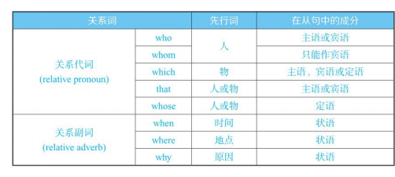

#### 结构

- 关系词在定语从句中的位置
  - 主语关系代词（subject relatives）
  - 动词宾语关系代词（verb-object relatives）
  - 介词宾语关系代词（preposition-object relatives）
  - 定语关系限定词（possessive relatives）
    - “whose+名词”与“名词+of which”：只限于whose的先行词是事物，而不是人，因为of which不能指代人。
      1. 只能修饰事物，即此时的先行词是“指物”。
      2. 一般在名词前面有the限定，即“the+名词+of which”。
      3. 一般有逗号分隔定语从句与先行词。如上面b句中a house与the roof之间有逗号。
      4. 可以换成“of which+the+名词”结构。
      5. 主要用于正式的书面语中。
    - which+名词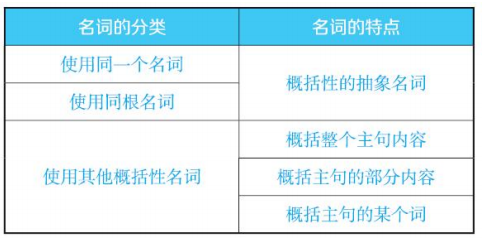
  - 补语关系代词（complement relatives）
  - 状语关系副词（adverbial relatives）
    - where引导具体地点抽象地点名词（情况、情形、心理、情感、语言、交流、时间）
    - 空 间 结 构 是 人 类 认 知 活 动 中 最 基 本 的 概 念 ， 时 间 概 念 是 根 植 于 空 间 概 念 的 。
- 判断逻辑
  - 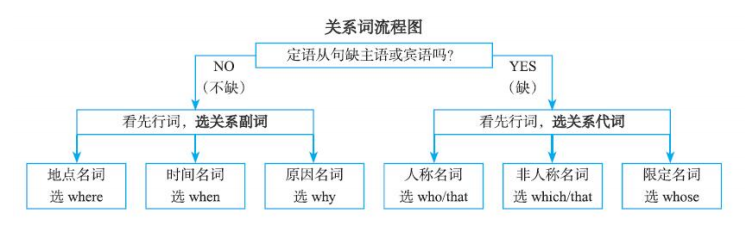
  - 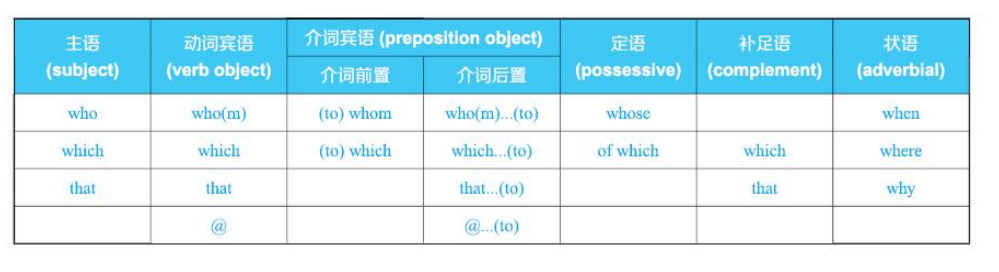
  - 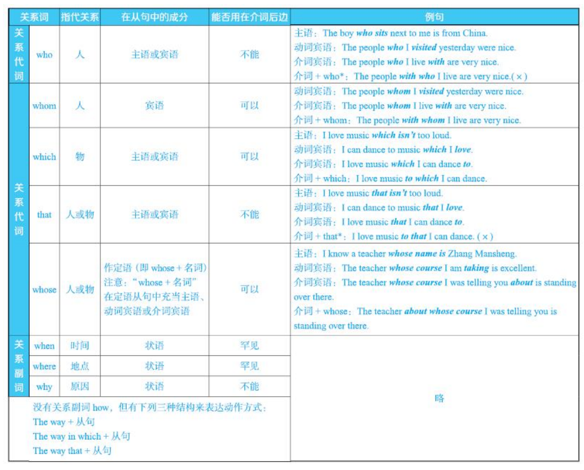

- 注意
  - 当 关 系 代 词在定语从句中充当主语补足语时，不论先行词是人还是物，都用which引 导 定 语 从 句 。作主语补足语的先行词虽然指人，但是泛指“一类人”，此时我们用which来引导定语从句，以表达分类的概念。
  - 作主语补足语的先行词虽然指人，但当其表示一种身份或一种职业时，用which来引导定语从句。
  - 有时 ， 主 句 中 指 人 的 名 词 并 非 先 行 词 ， 所 以 ， 自 然 不 用 who来引 导 定 语 从 句 。 此 时 我 们 用 which来 指 代 主 句 中 的 其 他 部 分 ， 引 导一个定语从句。

#### 定语从句与先行词的位置

- 定语从句的位置：定语从句的最典型位置无外乎两种：句末（final position）和句中 （medial position）。定语从句一般不会出现在句首（as引导的非限制 
  性定语从句可以出现在句首），这是因为定语从句一般要放在被修饰的对象之后，所以它不是在句中，就是在句末。位于句末的定语从句就称为句末定语从句（relative clause in final position），位于句中的定语从句就称为句中定语从句（relative clause in medial position）。
  - 句末定语从句往往是为了引出新的信息（used to introduce new information）。
  - 句中定语从句往往是为了在已知信息之间建立联系（used to connect with given information）
- 先行词与定语从句的分隔
  - 先行词+定语+定语从句
  - 先行词+状语+定语从句
  - 先行词+谓语+定语从句

#### 限制性及非限制性定语从句

- 总的原则：逗号的使用与先行词、定语从句的内容以及语境都有密切关系。
- 检验
  1. 去掉非限制性定语从句，不会影响主句的核心意思。
  2. 若去掉限制性定语从句，会严重影响主句的核心意思。
- 情形
  1. 必须添加逗号，即写成非限制性定语从句。
     1. 专有名词作先行词，加逗号
     2. 专有意义的普通名词作先行词，加逗号
     3. 泛指意义的普通名词作先行词，加逗号
        - 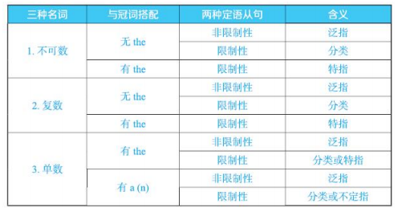
     4. 句子作先行词，加逗号
     5. 数量关系或所属关系的定语从句，加逗号
  2. 必须不加逗号，即写成限制性定语从句。
  3. 逗号可加或可不加，但意思有区别，由语境决定。
     1. 语境决定加或不加逗号
     2. 非限制性定语从句与逗号
- 定 语 从 句 的 内 容 是 判 断先行词的根本，然后根据不同的先行词来确定是否该加逗号
- 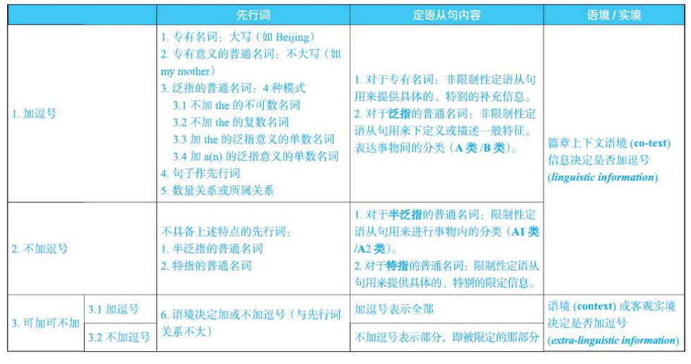
- 非限制性定语从句与逗号
  - 关系词that前面有逗号不一定就是非限制性定语从句
  - 非限制性定语从句不一定都用逗号分隔

#### 介词+关系代词

- 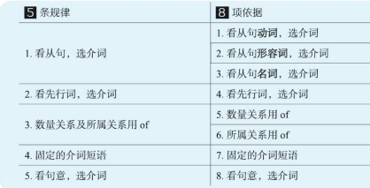
  - 介 词 只 能 用 在 动词、形容词和名词 的 后 面 ， 构 成 固 定 搭 配 。
  - 动词，既可以是定语从句中的谓 语 动 词 ，也可以是非 谓 语 动 词 。
- 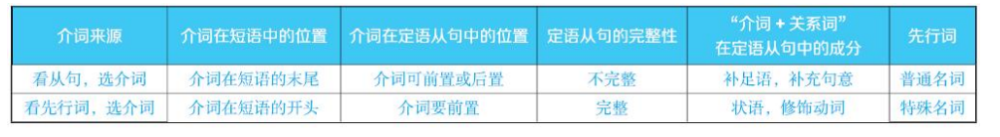
- 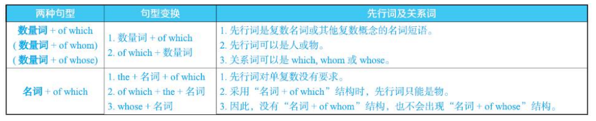
- 倒装结构，即“介 词 +关 系 代 词 +谓 语 动 词 +主 语 部 分 ”
  - 符合全部倒装的一般规律：句首出现表示地点的介词短语（此时句子要用全部倒装）。
  - 符合尾重原则：定语从句的主语比谓语复杂（此时导致主语后置）。

### 状语从句

- 
  - 状语从句是表达句间逻辑语义关系的⼀种⽅式。状语从句就是⽤恰当的从属连词将两个或多个完整独⽴的句⼦连
    接起来，以表达各句之间所具有的逻辑语义关系。
  - 反向的因果关系：让步关系(concession)
  - 两个简单句之间，先有了逻辑语义关系，然后再使⽤能表达这种逻辑语义关系的从属连词把⼆者连接起来。从属连词的使⽤，只不过是进⼀步标明了句间早已存在的逻辑语义关系。
  - 状语种类
    - 因果客观规律：原因、结果、⽬的、让步、条件
    - 主观认知心理：比较
    - 动作的方式、地点和时间

##名词短语及其他篇

### 名词、限定及名词短语

- 
  - 
  - 瞻前顾后
  - 名词+限定 = 名词短语。也就是说，名词与其前后的限定修饰语（即定语）⼀起构成名词短语。
  - 把名词变为复数也看成是对名词的⼀种限定。
- 限定性和可数性
  - 
  - 
- 名词的分类
  - 
  - 
    - 名词的可数性可以根据语义和使⽤语境⽽灵活变化。⼀旦名词的可数性发⽣改变，它的单复数就会改变，最终会使它与限定词的搭配发⽣改变。
    - 名词可数性改变 → 名词单复数随之改变 → 搭配的限定词也随之改变
  - 
- 限定
  - 
  - 名词的可数与不可数其实反映了使⽤英汉这两种语⾔的⼈不同的物质世界观。从这个意义上来说，如果不了解英语⺟语⼈是如何看待物质世界的，我们就很难做到像他们那样灵活处理名词的可数性。
  - 离名词越近的形容词，与名词关系越密切。遵循着由主观到客观的排序

### 介词

- 
  - 表达逻辑关系
  - 英⽂介词不是难在数量，⽽是难在意义（senses or meanings）和⽤法（usages）。英⽂介词数量有限，⼤约100多个。
  - 认知语⾔学认为，所有的英语介词最初都是为了表达两个实体之间的空间关系（spatial relations between two physical entities）。不过，这两个实体的地位是不同的。

### 副词

- 
- 
- 
- 
- 
- 
- 
- 
- 

# 句子成分

- 为什么要分析？断句，使用语法术语进行一般性表述和分析。
- 句子成分有哪些？
- 怎么分析句子成分

## 概述

- 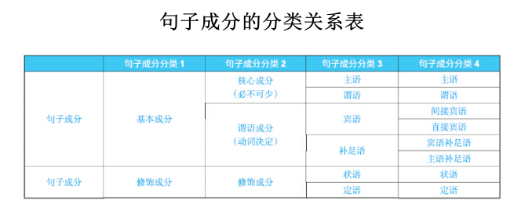
  - 基本成分
    - 主语（subject）
    - 谓语动词（main verb）
    - 宾语（object）
    - 补足语（complement）
  - 修 饰 成 分 （modifiers），就近修饰和多重修饰：
    - 状语（adverbial）：这是用来修饰动 词 的成分（注：状语的修饰对象不仅限于动词）。状语不是由动词决定的句子成分
    - 定语（attribute）：这是用来修饰名 词 的成分。定语不是句子成分，而是名词短语的构成成分，属于短语成分。
- 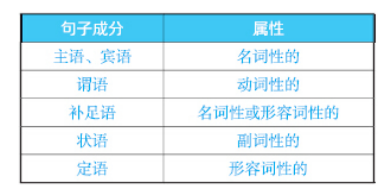
- 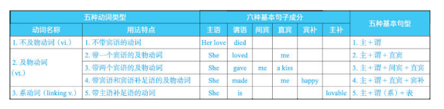

## 分析

### 核心成分

#### 主语

- 汉语和英语区别：有无主语，物或人做主语。
- 形式结构
  - 名词或名词短语
  - 动名词
  - 动词不定式
  - 名词性从句，即连词that, whether以及wh-连词引导的主语从句

- 句中位置
  1. 在谓语动词前
  2. 在谓语动词后（全部倒装）
  3. 在助动词后（部分倒装）
- 句法功能
  - 主语与谓语在数上一致
  - 主语与句中名词短语在数上一致
  - 主语与代词在数上一致
- 语义特征
  - 主语是谓语动作的执行者
  - 主语是谈论的话题

#### 谓语

- 形式结构：动词
- 句中位置
  1. 它是句子的核心成分之一，一般不可缺少；
  2. 它通常位于句中，而不在句首或句末；
  3. 它一般不能移到句子的其他位置；
  4. 它帮助确定其他句子成分。
- 句法功能
  1. 谓语决定句子的宾语和补足语；
  2. 谓语帮助判断主语。
- 语义特征
  1. 谓语是陈述内容；
  2. 谓语决定句子的核心意思。
     - 对于简单句来说，句子的核心意思在谓 语 上；
     -  对于主从复合句来说，句子的核心意思在主 句 谓 语 上。

### 动词决定的成分

#### 宾语

- 形式结构

  1. 名词或名词短语

  2. 动名词

  3. 动词不定式

  4. 名词从句，即连词that, whether以及wh-连词引导的宾语从句

- 句中位置

  1. 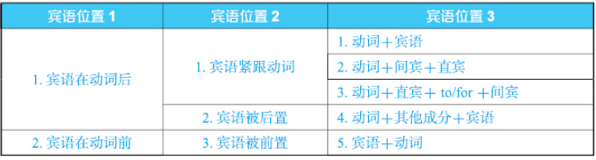
  2. 在动词或介词之后；
     - 单宾语：动词+宾语
     - 双 宾 语 ——结 构 1： 动 词 ＋ 间 接 宾 语 ＋ 直 接 宾 语
     - 双 宾 语 ——结 构 2： 动 词 ＋ 直 接 宾 语 ＋ 介 词 （ to/for） ＋ 间 接 宾语
       1. 间 接 宾 语 在 动 词 后 和 介 词 后 均 可 ——介 词 用 to
       2. 间 接 宾 语 在 动 词 后 和 介 词 后 均 可 ——介 词 用 for
       3. 间 接 宾 语 只 能 在 介 词 后 ——介 词 用 to
       4. 间 接 宾 语 只 能 在 介 词 后 ——介 词 用 for
       5. 间 接 宾 语 只 能 在 动 词 后
       6. 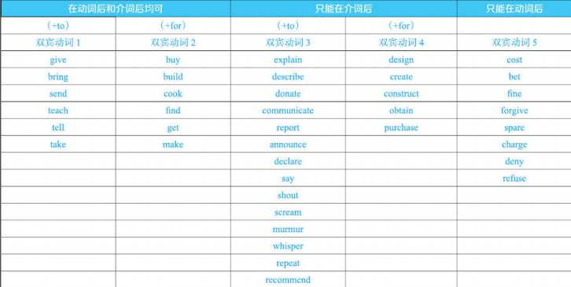
  3. 在动词或介词之前。一种情况是定语从句，被修饰的名词在定语从句中作从句谓语的宾语；另一种情况是不定式作后置定语，被修饰的名词作不定式中动词的宾语。

#### 补足语

- 分类
  - 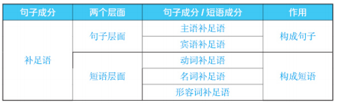
    - 句子层面的补足语：主语和宾语的补足语
    - 短语层面的补足语：动词、名词和形容词的补足语
- 形式结构
  - 句子层面的补足语（即主语补足语 和宾语补足语）通常是名词短语或者形容词短语。与宾语不同，补足语可以是形容词短语，而宾语只能由名词性成分充当。
    - 介词短语作主语补足语
    - 介词短语作宾语补足语
    - 副词作主语补足语
    - 副词作宾语补足语
      - 一般来说，副词（尤其是以-ly结尾的副词）不能作补足语，但是像over, off, on, away, in, out, there, here, up, down等（方位）副词可以作 补足语。
  - 从短语层面的补足语角度来看，动词、名词及形容词的补足语一般由介词短语充当，并且介词与相应的动词、名词及形容词是固定搭配。
  - 词性
    1. 名词
    2. 形容词
    3. 方位副词
    4. 介词短语
    5. 不定式
    6. 现在分词doing
    7. 过去分词done
- 句中位置
  - 一方面，从句子层面的补足语角度来看，主语补足语在系动词后边，宾语补足语一般位于直接宾语之后。不过有时也会出现倒装结构，此时主语补足语在句首，宾语补足语在宾语之前。
  - 另一方面，从短语层面的补足语角度来看，作补足语的介词短语一般位于动词、名词及形容词后边。
- 句法功能
  - 一致性问题：主语补足语如果是名词短语，那么一般就与主语的数一致，而宾语补足语一般与直接宾语的数保持一致。
  - 被动性问题：关于主语补足语。“主谓宾”（SVO）句型与“主系表”（SVC）句型对比：与宾语不同，补足语不能成为对应的被动句中的主语。因此，SVC句型没有相应的被动句。
  - 主语补足语与表语：系 动 词 后 边 的 主 语 补 足 语 也 可 以 称 作 表 语 ， 而 其 他 结 构 中 的 主 语 补 足 语 不 能 称 为 表 语 。表语是主语补足语的一种，前者范围窄，后者包含的范围更广。
- 语义特征
  - 补足语，顾名思义，就是用来对相关联的句子成分（即主语和宾语）或对相关联的词（即动词、名词及形容词）进行语义补充的。如果缺少补足语，句子的意思就可能会不明确、不完整，甚至会导致句子语法错误。
  - 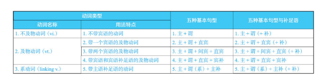
    1. be＋主补:系动词be不论作何种变形，其实质就类似于一个等于号“＝”，或者说类似于一座桥梁，一边连着主语，另一边连着主语补足语。
    2. die+名词短语：如果是宾语，只能是同源宾语
  - 
  - 系动词的语义分类
    - 单 纯 表 示 主 语 的 特 征 、 状 态 的：feel, look, sound, taste, smell, seem, appear等。
    - 表 示 主 语 由 一 种 状 态 转 变 为 另 一 种 状 态 的：become, grow, get, turn, fall, go, come等
    - 表 示 主 语 保 持 或 继 续 某 种 状 态 的：continue, remain, stay, keep等
  - 各种句型＋主补
    - 主 语 ＋ 谓 语 ＋ 主 语 补 足 语
    - 主 语 ＋ 谓 语 ＋ 状 语 ＋ 主 语 补 足 语
    - 主 语 +谓 语 +宾 语 +主 语 补 足 语 
  - 宾语补足语
    - 三 类 及 物 动 词 后 边 都 可 以 接 宾 语 补 足 语 ， 只不过宾补动词后边接宾语补足语最典型，而单宾动词和双宾动词后 边 接 宾 语 补 足 语 不 那 么 典 型 。
    - 产生宾语补足语的动词
      - 感官动词：see, hear, observe, watch, feel, find等
      - 使役动词：let, make, have, get等；
      - 要求类动词：wish, would like, want, order, ask等。
  - 短语层面的补足语
    - 与 动 词 是 固 定 搭 配 的 介 词 短 语 ， 可 看 成 动 词 的 补足语；与动词不是固定搭配的介词短语，可看成动词的状语。作 补 足 语 的 介 词 短 语 ， 其中的介词与动词构成固定搭配；作状语的介词短语，其中的介词与动 词 通 常 不 是 固 定 搭 配 。
    - 与 名 词 是 固 定 搭 配 的 介 词 短 语 ， 可 看 成 名词的补足语；与名词不是固定搭配的介词短语，可看成名词的后置定语。
    - 作形容词补足语的结构形式很多，除了介词短语之外，还有不定式、that从句等。
  - 宾语与补足语比较
    - 宾语是属于名词性的，而补足语可以是名词性的，也可以是形容词性的。
    - “主谓宾”与“主系主补”;“主谓间宾直宾”与“主谓宾宾补”;
      - 主 语 补 足 语 谈 论 的 是 一 个 对 象 ， 而 宾 语 则 涉 及 两 个不 同 的 对 象 。
      - 主 语 补 足 语 涉 及 一 个 对 象 或 者 说 一 个 元 素 ， 我 称 之 为 “一 元 性 ”； 而 宾 语 则 涉 及 两 个 对 象 或 者 说 两 个 元 素 ， 我 称 之 为 “二 元 性 ”。
      - 带 有 双 宾 语 的 句 子 涉 及 三 个 元 素 ， 我 称 之 为 “三 元 性 ”； 而 带 有 宾 语 补 足 语 的 句 子 涉 及 两 个 元 素 ， 我 称 之 为 “二 元 性 ”

### 修饰成分

#### 状语

- 形式结构
  - 通常情况下，状语是一个副词短语、介词短语或状语从句。它也可以是一个名词短语。
- 句中位置
  - 通常来说，状语在句中的位置非常灵活，这取决于状语的类型和形式，它可以出现在句首、句中或句末。一般来说，状语在宾语后边或在句末多见。
- 句法功能
  - 对于某些句子来说，状语是必需的，否则会影响到句子意思的完整性。但一般来说，状语都是可有可无的。比如把它们去掉不会影响到句子的成立，也不会影响句子中其余部分的结构和含义关系。在句法上可能起到的其他作用主要取决于状语的类型。最笼统地说，状语可以说没有什么特点可言，它没有其他句子成分（如主语、谓语等）所具有的句法特征。
- 语义特征
  - An adverb is a word or an expression that generally modifies a verb, adjective, another adverb, determiner, clause, preposition, or sentence. Adverbs typically express manner, place, time, frequency, degree, level of certainty, etc., answering questions such as how, in what way, when, where, to what extent. This is called the adverbial function and may be performed by single words (adverbs) or by multi-word adverbial phrases and adverbial clauses.
  - Adverbs are traditionally regarded as one of the parts of speech. Modern linguists note that the term "adverb" has come to be used as a kind of "catch-all" category, used to classify words with various types of syntactic behavior, not necessarily having much in common except that they do not fit into any of the other available categories (noun, adjective, preposition, etc.) 
- 比较
  - 状语和宾语
    - 一般来说，宾语是动词动作的作用对象，或者说是动词动作的承受者，或者说是一个动作产生的结果；状语表示动作发生的时间、地点 、 原 因 、 方 式 等 。
    - 动 词 与 宾 语 的 关 系 是 影 响 与 被 影 响 的 关 系 。 与 此 相 反 ， 动 词 与 状 语 的 关 系 是 被 影 响 与 影 响 的 关 系 。 
  - 状语和补足语
    - 补 足 语 是 对 主 语 或 宾 语 的 补 充 说 明 ， 而 主 语 或 宾语都属于名词性成分，由名词以及其他名词性短语或从句充当。因此，换句话说，补足语是对名词性句子成分进行补充。既然副词一般不能修饰名词，形容词才能修饰名词，因而补足语也自然就不能用副词 ， 而要用形容词充当 。

#### 定语

- 形式结构
  1. 限定词
  2. 形容词及形容词短语
  3. 介词短语
  4. 不定式短语
  5. 分词短语
  6. 定语从句
- 句中位置
  - 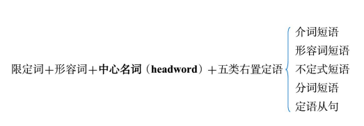
- 句法功能
  - 由于定语不是句子层级的成分，所以它没有特别典型的句法功能。如果一定要说有，可以考虑定语的长度变化对句子语序的影响。
- 语义特征
  - 从语义的角度来看，定语与其所修饰的名词之间的关系有亲疏之分。
  - 定语与状语比较
    1. 它们的修饰对象不同；
    2. 它们与其修饰对象的位置关系不尽相同。

### 名词短语的补语成分：同位语

- 同位语就是两个或多个名词性成分之间的补充说明关系。具体来说，我们可以用一个或多个名词、名词短语或从句（即为同位语从句）来对另外一个名词或名词性结构进行补充说明。
- 名 词 的 同 位 语 ，其 实 就 是 名 词 补 足 语 的 一 种 ， 即 不 需 要 用 介 词 连 接 的 补 足 语 。
- 一般来说，一 些 概 括 性 的 、 抽 象 的 名 词 （ 如 advice, fact, suggestion等 ） 后 边 才 可以接从句作同位语，从而构成同位语从句。
- 同位语、同位语从句和介词短语补足语都属于名词补足语。
  - 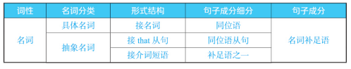
    - 具体名词后边接具体名词作同位语；
    - 抽象名词后边接介词短语作补足语，以及接从句作同位语，构成同位语从句。
- 同位语与定语
  - 同位语与定语都是名词短语的组成成分。

### 句子成分和词性

- 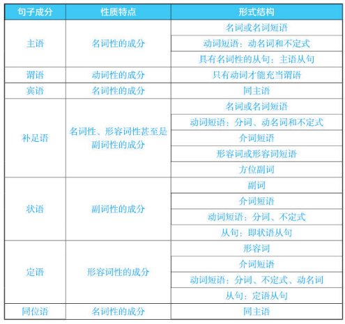
  - 名 词 性 结 构 ：若位于谓语前，就作主语；若位于及物动词或介词后，就作宾语；若位于系动词或宾语后，就作补足语。这些成分与谓语一起构成句子的主体结构，也是五种基本句型的构成要素。
  - 形 容 词 性 结 构 ：一方面，它主要与名词发生关系，不在名词之前就在名词之后，都是作定语。另一方面，若它位于系动词或宾语 
    后，则是作补足语。
  - 副 词 性 结 构 ：主要是修饰动词，作状语。方位副词可以作补足 语。

## 简单句和复合句

- 英语中连词成句的三大主要手段是：动词、介词和连词，尤其是介词和连词，能够帮助实现由简单句到复杂难句的飞跃。
- 动词决定了句子的基本结构。不过，要想使英语句子实现由简单句到复杂难句的飞跃，光靠动词还不行，还得借助于两大虚词——介 词 和连 词 。具体来说，介词（比如with）与其后的宾 语（比如one hand）一起构成介词短语（with one hand），既可以作后置定语，修饰名词（比如an elephant with one hand），也可以作状语，修饰动词（比如lift an elephant with one hand）。同样的道理，连词引导从句，既可以修饰名词（比如定语从句和同位语从句），也可以修饰动词（比如各种状语从句）。
- 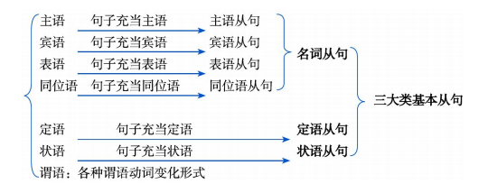
  - 一般来讲，一个句子中除了有主语、谓语之外，其他可能包含的成分还有宾语、表语（或称作“补足语”）、同位语、定语、状语等。 在这些成分中，谓语较特殊，只能由动词来充当，而其他成分则可以由单词、短语或者句子来充当。当用一个完整的句子来充当另一个句子的某个句子成分时，即构成相应的从句。

# 长难句

- 准确、完整和通顺
  - 不要跑偏，不要漏译，听起来像人话

- 主干+修饰成分
- 任何语法现象都是语义的表现法
- 学习英语的最小单位应该是句子，而不是单词
- 刻意练习，不留暧昧
- 方法论+实践

## 主干

| 组成         | 举例                  |
| ------------ | --------------------- |
| 主谓         | I will leave.         |
| 主谓宾       | I love you.           |
| 主谓宾宾     | I give you a book.    |
| 主谓宾宾补   | love makes you crazy. |
| 主系表(主补) | I am a student.       |

## 修饰成分

### 基本成分

- 主语:动作的发出者或描述的主体
- 谓语:带有时间信息和状态信息的动作
- 宾语:被动作作用或被介绍的主体
- 补语:补充说明主语或宾语的内容

### 简单修饰成分

- 名词
- 形容词
- 副词
- 代词

### 复杂修饰成分

- 介词短语：介词(of/in/during...)+宾语（最远的名词结束）
- 从句：连词(when/what/where...)+句子
- 不定式： to do sth
- 分词
  - doing sth
  - done sth

## 分析

- 长难句->主干->主干的谓语动词
- 核心是如何快速找出主干的谓语动词
  - 找出谓语动词
  - 找出主干
  - 找出主干的谓语动词

### 主干

- 看标点,做预判
  - 逗号，分号，冒号；破折号

##### 逗号

介词短语(Of......)/从句(When..... )/非谓语短语(Ved sth.. ),主干

##### 分号

主干；(and,but,or)并列句

##### 冒号

主干：同位语

破折号

主干——同位语

### 谓语动词

- 分类
  - 

| 过去时(did)        | 现在时(do)          | 将来时(will)           | 动作状态      |
| ------------------ | ------------------- | ---------------------- | ------------- |
| did+do=did(do)     | do+do=do(do)        | will do do=will do(do) | —般态(do)     |
| was/were doing(be) | am/is/are doing(be) | will be doing(be)      | 进行态(doing) |
| had done(have)     | have done(have)     | will have done(have)   | 完成(done)    |

- 如何区分did和done同体的情况？
  - n+ved(过去式) ：主语+谓语
  - n+ved（过去分词）：主语+(后置)定语
  - 区分方法：在n和ved中间加be动词
    - 如果语态不变，语义很通顺，则是n+ved（过去分词）
      - 过去分词本身就带有被动意思，加be构成被动，不影响语义和语态。
    - 如果语态变化，语义不通顺，则是n+ved(过去式) 
      - 过去式did是主动，加be构成被动，影响了语义和语态

#### 三种形式

- 各种时态：have（状语）+done
- 语态：be（状语）+done
- 情态：Can +be
  - 情态动词+动词原型
- 组合：时态+语态：have been done；情态+时态：should have done

### 连词

- 连接句子的连词和从句的连词

### 主干公式

- 连词/动词 = (n-1)/n

- n是动词个数，n-1是连词个数

#### 作用

- 每个句子有n个动词就有n-1的连接词。
- 有n-1个连接词，就有n个句子。
- 每个连词都有一个谓语动词
- 不是连词的谓语动词，就只能是主干的谓语动词 n-(n-1)=1
- 每有一个谓语动词就必定有一个句子或类似于句子的成分（并列句，从句）

## 汉化

### 语意

- 语境为王
  - 合理性
  - 完整性（增/减词）

### 语序

- 英汉基本成分语序一致
- 英汉修饰成分语序不一致：倒序
  - 注意：并列处，顺序不变

| 语言 |       |       |      |       |      |       |      |       |       |
| ---- | ----- | ----- | ---- | ----- | ---- | ----- | ---- | ----- | ----- |
| 汉语 | 状语1 | 定语1 | 主语 | 状语2 | 谓语 | 定语2 | 宾语 |       |       |
| 英语 | 状语1 |       | 主语 | 定语1 | 谓语 | 状语2 | 宾语 | 定语2 | 状语1 |

#### 倒序

- |          | 成分              |
  | -------- | ----------------- |
  | 普通     | N of a of b       |
  | ->       | baN               |
  | 有并列处 | N of a and b of c |
  | ->       | a and b           |
  | ->       | caN and cbN       |

### 定语

- 后置定语：介词短语、从句、不定式、分词、形容词
- 翻译
  - “六八原则”
    - 较长（单词数>=8）建议单独翻译，较短(单词数<=6)建议倒序翻译，其他长度则以上两种随意选择，都是建议使用的
  - 倒序
  - 单独翻译
    - 非限制性定语从句：，而这。。。
    - 同谓语，即。。。/也就是。。。

## 实践

### 形式主语的翻译

- it做形式主语
- 真正的主语包括：
  - to do sth
  - 从句（主从）
- It is difficult to the point of impossibility for the average reader under the age of forty to imagine a time when high-quality arts criticism could be found in most big-city newspapers.

### 被动句的翻译

- 被动->主动
- 方式
  - 主谓 ->谓宾（倒转的主语）
    - 无主句可以添加我们，人们等充当主语
  - 用其他词代替
    - 由。。。所
    - 为。。。所
    - 由。。。来
- It is difficult to the point of impossibility for the average reader under the age of forty to imagine a time when high-quality arts criticism could be found in most big-city newspapers.

### 宾语后置的处理

- 谓语+==宾语==+宾补/状语
- 当宾语太长时会将宾语后置
  - 谓语+宾补/状语+==宾语==

### 名词的左二右六

- 左二
  - 限定词：冠词、序数词、量词和指代词
  - 修饰词：形容词和形容词性的短语
- 右六
  - 同位语、定语从句、不定式、介词短语、分词和形容词

### 时态的翻译

### 名词性从句

### 定语从句

- 关系副词引导定从和状从的区别
  - 沿着关系副词往前看，如果有和关系副词匹配的名词，一定是定语从句
    - when-> time/age...
    - where->place/city...
    - why->reason/cause...
  - 没有则是状语从句
  - It is difficult to the point of impossibility for the average reader under the age of forty to imagine a time when high-quality arts criticism could be found in most big-city newspapers.
- 简化
  - 关系代词在定语从句中做主语
  - 步骤
    1. 将关系代词省略
    2. 将定语从句的谓语变为非谓语
       - be+其他->其他
       - 非be->doing
- 名词性从句的翻译->转换为定语从句
  - where->the place that
  - when->the thing that
  - why->the reason that
  - how->the way that

### 状语从句

- 关系代词在状语从句中做主语
- 步骤
  1. 将关系代词省略
  2. 将定语从句的谓语变为非谓语
     - be+其他->其他
     - 非be->doing

### 独立主格

- 两个句子的主语不同，变为一句话时，将另外一句的的谓语动词变为非谓语：
  - be+其他->其他
  - 非be->doing
- Marry stood under a tree。 Her dog sat at her feet。
- 转换
  - Marry stood under a tree，with her dog setting at her feet。
  - with her dog setting at her feet，Marry stood under a tree。
  - Marry stood under a tree with her dog setting at her feet。
  - Marry stood under a tree ， her dog setting at her feet。

### 不定式

### 动名词

### 分词

### 从句的嵌套

- 名词性从句（主/宾/表/同）
- 形容词性从句（定语从句）
- 副词性从句（状语从句）

### 定语从句的简化

### 状语从句的简化

### 倒装

### 省略

### 综合应用

#### 难题

1. 句中ed 形式结尾的词是 did、done还是adj?
2. 复杂句的主干把握、从句的范围以及综合翻译问题
3. 被省略的定语从句甚至名词性从句引导词。
4. that引导了什么从句;which引导的是不是非限?
5. for、as等词是介词还是连词?and并列的是名词还是句子?
6. 倒装、插入、省略、强调、后置等干扰正常语序的语法现象。

#### 核心原则

- 拒绝晴天借伞,雨天收伞。专为长难句打造策略，雪中送炭!

- 涉及国王身份（谓语)的问题都是天大的问题!
- 主谓宾状定补，目的、因果与条件!
- 实践是对抗不确定性的最佳武器―—二分原则
- 以史为鉴一一大数定律
  - that省略or==没省略==? that引导了名从or==定从==? that==引导了从句==or只是个代词?
  - which引导的是限制性定语从句or非限制性定语从句?(==Ta or 这==)
  - as、for后跟的是从句or==名词==?
  - and 并列的是句子、动词o==其它==?
  - ed结尾的词是did or ==done和adj==?
  - 谓语是谁的谓语

#### 步骤

### 特殊语法专题

#### 后置

##### 定语

- 定语后置:定语本体超过1词时需要放在所修饰的名词后，避免喧宾夺主。
- The man in the stage is Monkey.

##### 主语

- 主语后置: it做形式主语――避免头重脚轻，使语句结构更易识别。
- That he came to the party vasa surprise. 

##### 宾语

- it做形式宾语―突出“主谓宾补”、“主谓双宾”句型的主干结构
- 谓语+长宾语+补语结构的后置→谓语+补语+宾语（难!)
  - We often define what earlier generation considered as weakness of will as addictions.
  - 培养“主干强迫症”!积累有双宾语、宾补用法的典型单词!

#### 强调

- it is/was...that...句型强调主语、宾语、状语
  - 强调句的本质:重要的内容优先、突出说明!众星捧月!
- do, did, does 强调谓语(仅限现在时和过去时)将所强调的谓语动词原型分离，将所强调的谓语动词原型分离，并添加do, did,does承接其时态与单三特征，如take→ do take; takes→ does take; took→ did take
- so that; too, to; such that 强调程度so... that...强调形容词、副词的程度
  - She is so beautiful that Tom cannot take his eyes off her.
- too...to...强调形容词、副词的程度+引向否定性结果
  - She is so beautiful that she must be an angel.→She is too beautiful to be a human/mortal.
- such. ..that...强调名词的程度

#### 倒装

- 存在即合理，无需刻意还原语序!

  - Here is a ticket for you.

  - Now comes your turn.

#### 插入

- 情景特点:节外生枝，心血来潮。识别特征:双逗号包夹
- 不违反语法规则的插入语
  - 做同位语: Steve Jobs,CEO of Apple, was rich.
  - 做定语: Steve Jobs, who was the CEO of Apple, was rich
  - 做状语:Bill Gates, in my view, is a great man.
- 违反语法规则的插入语――有(主)谓
  - Bill Gates, she said, is a great man.→She said that Bill Gates is a great man.

# 单词

初学词汇，应选取简单但能体现生词典型意思与用法的词典例句!
