# 概述

- 口腔
  - 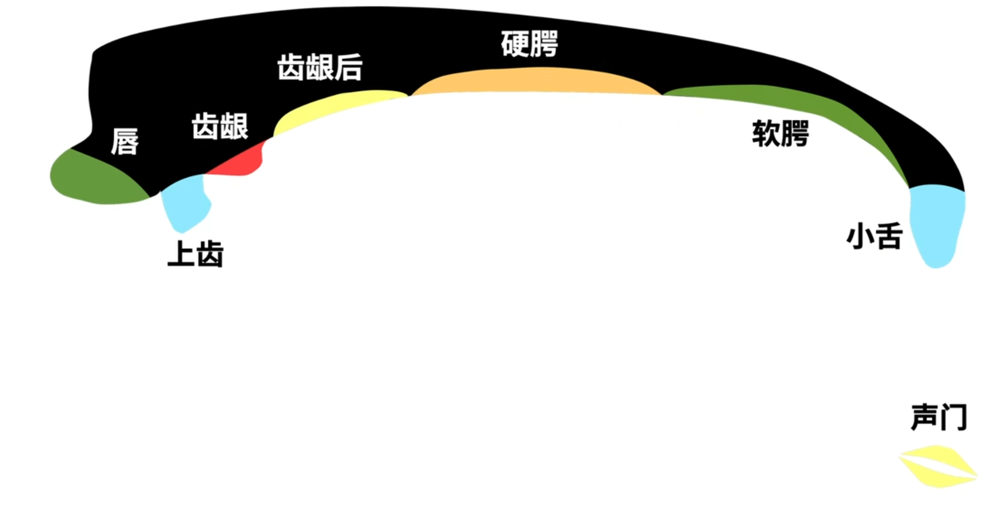

# 音标体系

- DJ音标
  - 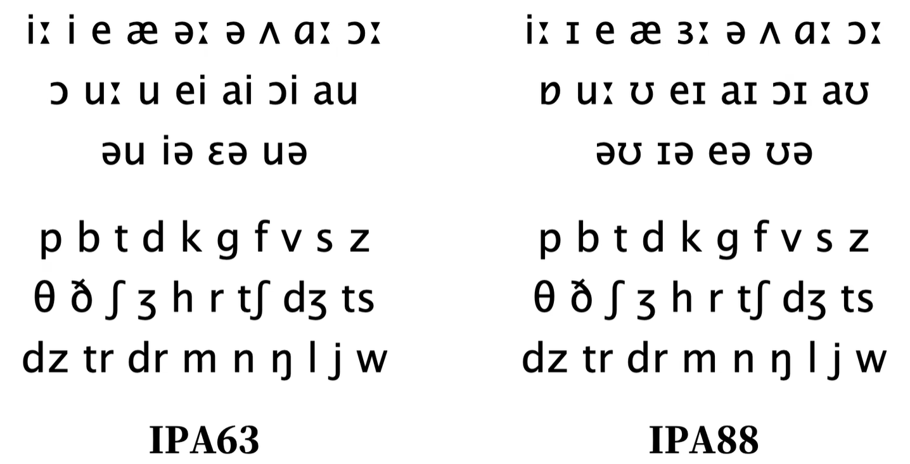
- KK音标
  - 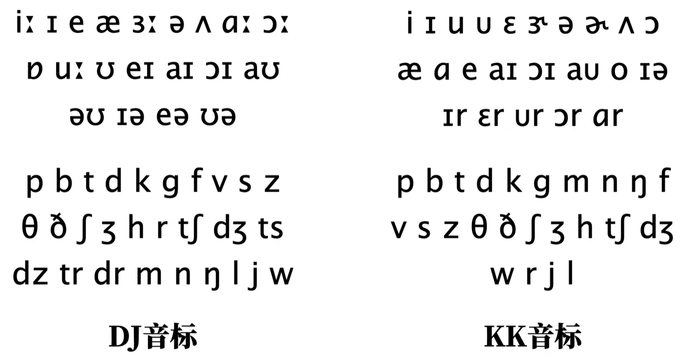

- Merriam韦氏词典
- American Heritage Dictionary

# 元音

- 三要素

  - 
    - 舌位：发音时舌面隆起的最高点在口腔中的位置。

- 分布

  - 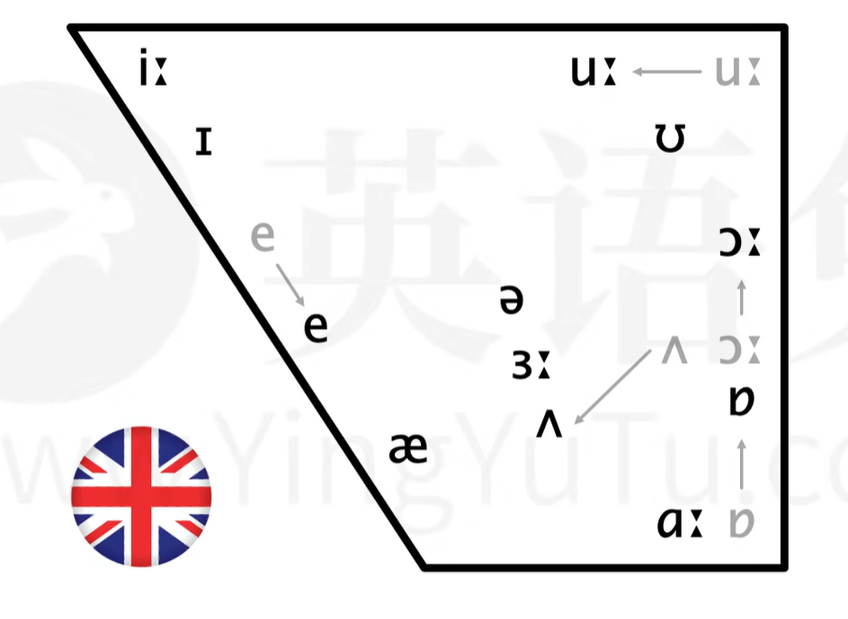

  - 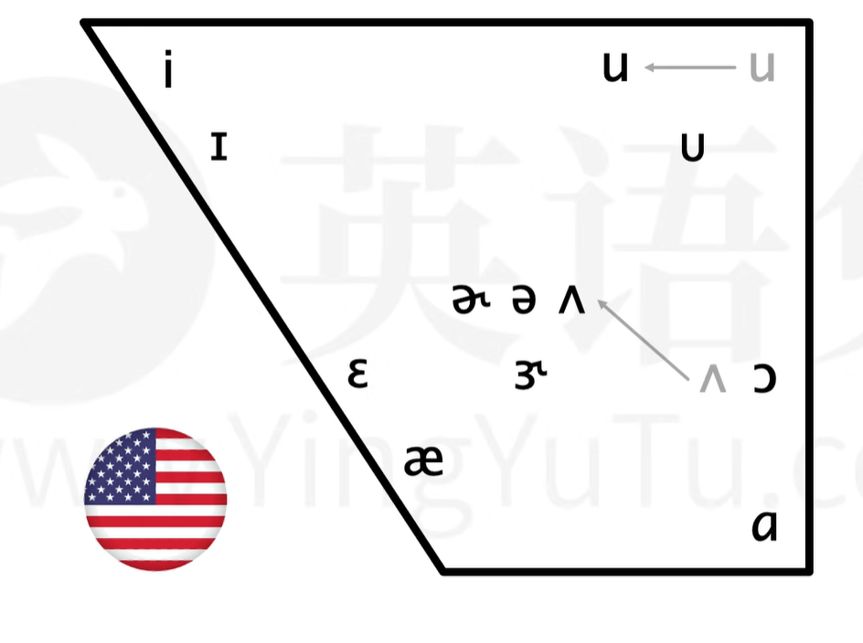

- 声带振动分类
  - 浊音：由声带震动发出的音叫做浊音，voiced sound
  - 清音：不由声带震动发出的音叫清音(也产生了振动，但振动不来自声带)，voiceless sound

- 气流阻碍分类
  - 元音vowels：气流不被阻碍。
  - 辅音consonants：气流全部时间都被阻碍或部分时间被阻碍。

# 辅音

- 而辅音是发音过程中气流在全部时间或一部纷时间被阻碍所发出的音
- 发音阶段
  1. 成阻(catch)：气流被阻塞
  2. 持阻(hold)：气流持续向外冲，但仍被阻塞
  3. 除阻(release)：阻塞被去除,气流冲出
- 三要素
  - 清浊
  - 调音部分，在发辅音的时候，阻碍气流就用到的主要发音器官
    - 双唇
    - 唇齿
  - 调音方式
    - 塞音、爆破：在成阻时完全阻塞气流再释放而发出的音
    - 擦音、摩擦音：逃气流持续通过一个发音器官形成的通道

# 技巧

- 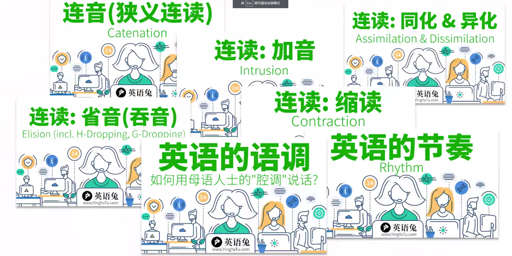

## 连读

- 辅音字母结尾+元音字母开头
  - 中文会习惯将每个字用辅音开头，元音结尾当做一个词。

## 加音

- 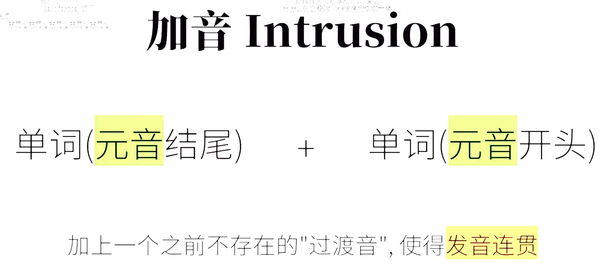
  1. 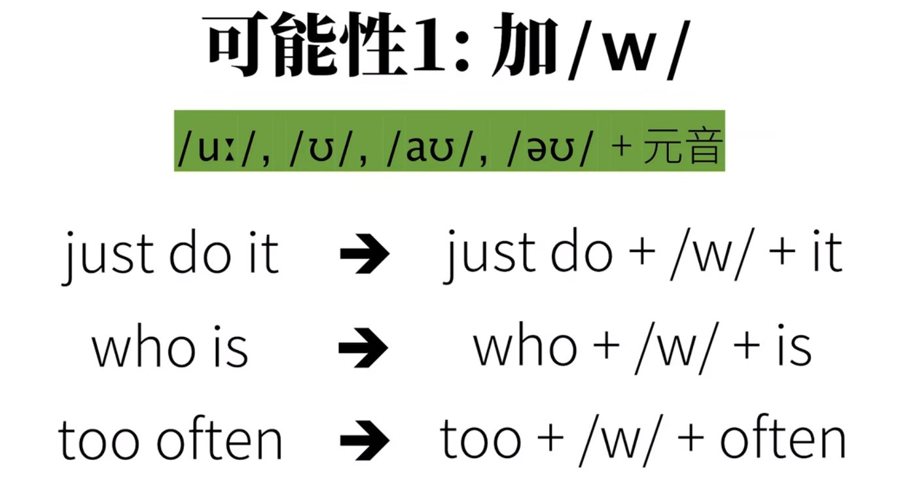
  2. 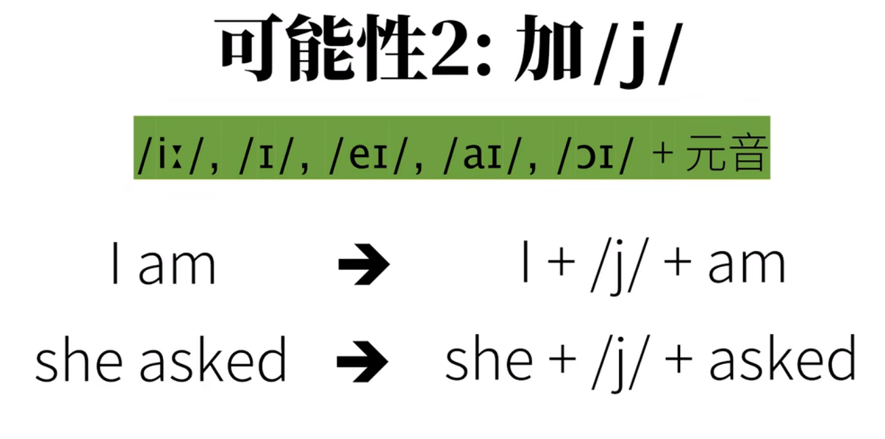
  3. 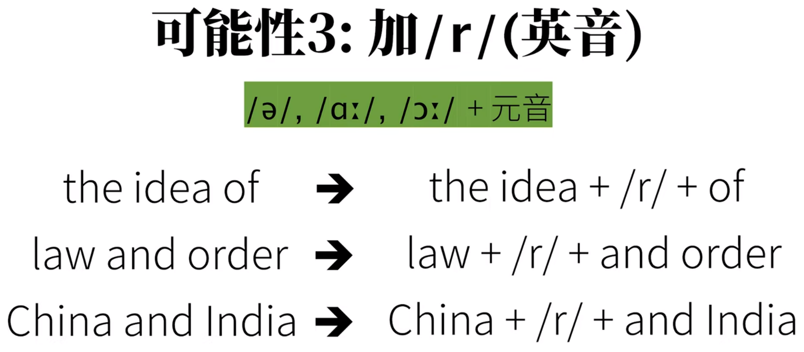

## 同化

- 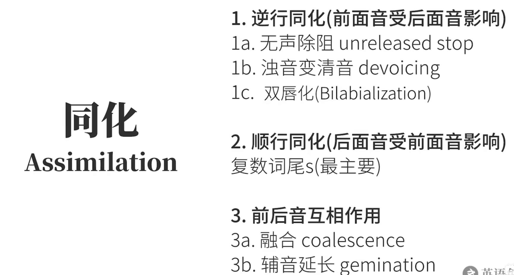

## 异化

- 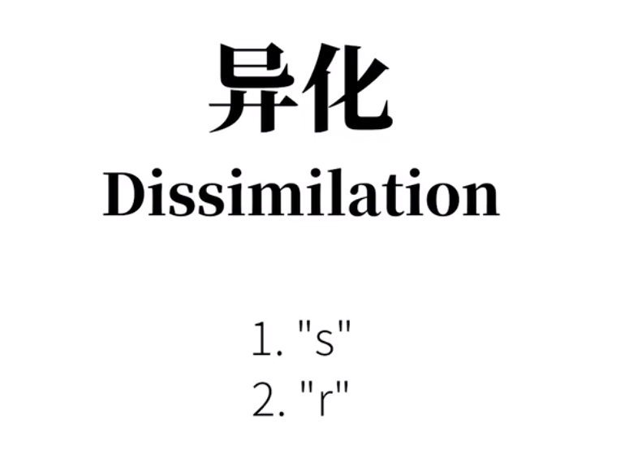

## 省音

- 那些原来该发的音略过

## 缩读

- 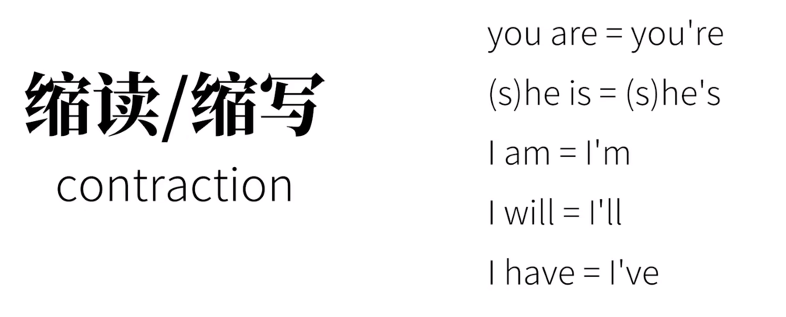

## 弱读

- 将元音都变为倒e。
- 英语中所谓的"弱读"并不是指音量要弱,而是指一些词在词组语句中发生元音的音变

## 节奏

- 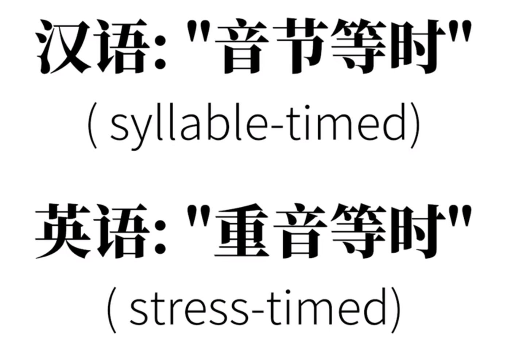
  - 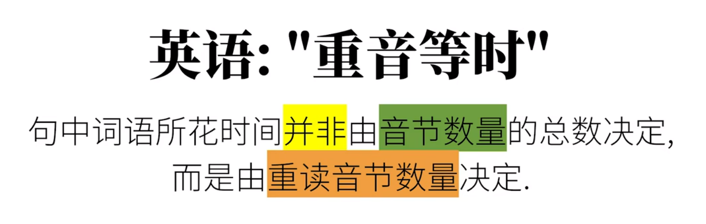

## 语调

- 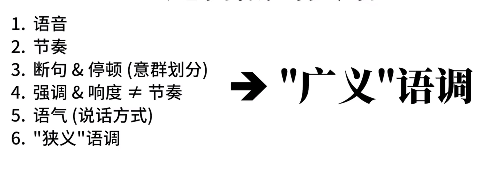
  - 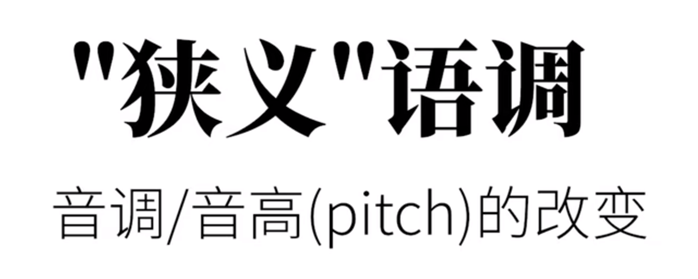
  - 
