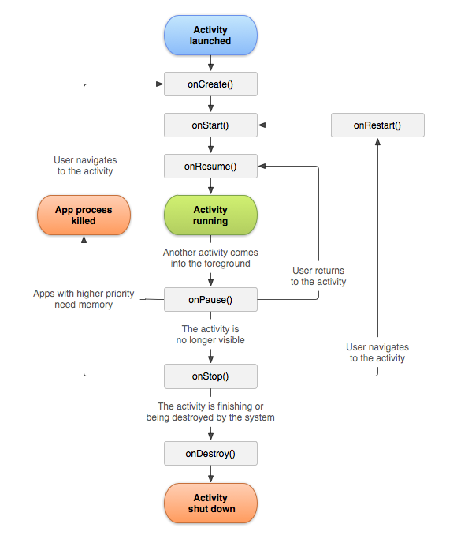
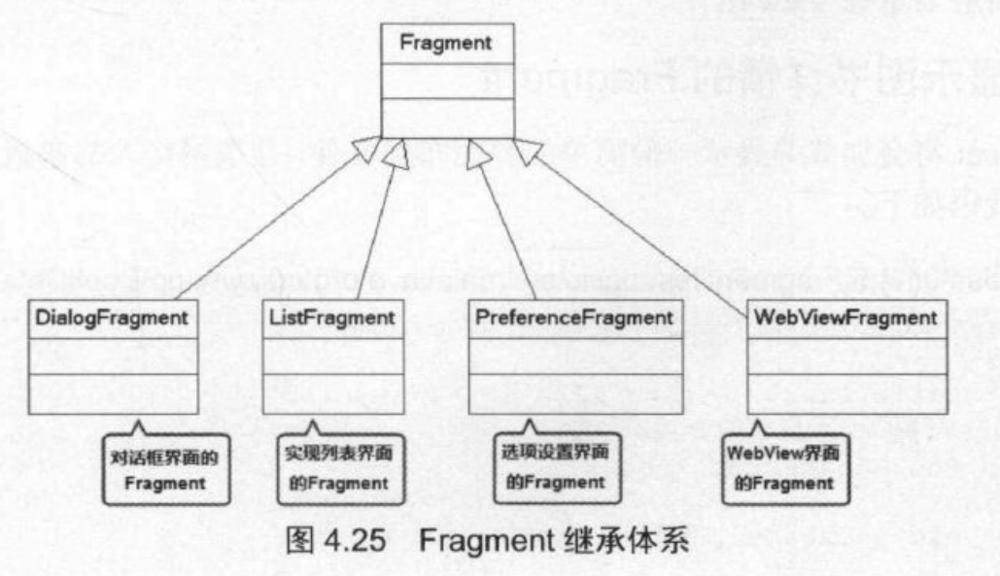
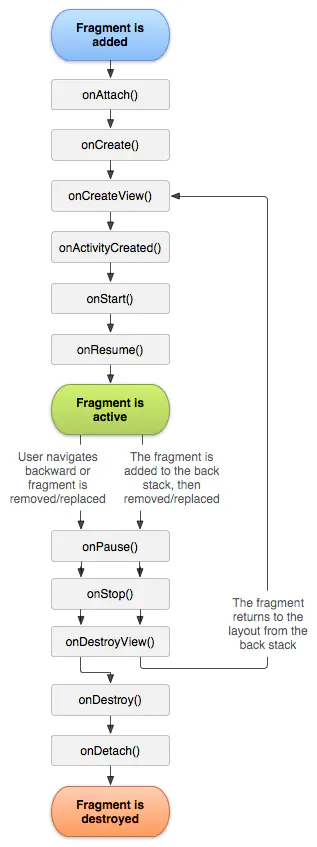

# 概述

- 上周总结：主要学习了Android应用的基本组成部分，并深入学习如何做出好的界面，以及如何通过事件和Activity完成界面的交互
- 6-20疯狂Android讲义（229页-288页，第六章 Android应用资源）
  - 第四章
    - 数据交互Bundle的剩余部分
    - Activity的回调函数、生命周期和加载模式
    - Fragment、Fragment和Activity的通信、Fragment管理、事务和生命周期
  - 第五章
    - Intent
    - Intent7大属性Component、Action、Category、Data、Type、Extra、Flag以及它们和Intent-Filter的联系
  - 第六章
    - 总览所有Android的资源
    - 如何使用，包括在代码中和XML中。

# 疯狂Android第四章

## 数据交互Bundle的剩余部分

#### 启动其他Activity并返回结果

- Activity 还提供一个startActivityForResult(Intent intent, int requestCode)方法来启动其他Activity。该方法用于启动指定Activity,而且期望获取指定Activity 返回的结果。
  - 一个Activity中可能调用多个startActivityForResult()方法来打开多个不同的Activity处理不同的业务，当这些新Activity 关闭后，系统都将回调前面Activity 的onActivityResult(int requestCode, int resultCode, Intent data)方法。
    - **requestCode**：为了知道该方法是由哪个请求的结果所触发的
    - **resultCode**：为了知道返回的数据来自哪个新的Activity
  - 获取被启动的Activity所返回的结果
    1. 当前 Activity需要重写onActivityResult(int requestCode, int resultCode，Intent intent)，当被启动的Activity返回结果时，该方法将会被触发，其中requestCode代表请求码,而resultCode代表Activity 返回的结果码，这个结果码也是由开发者根据业务自行设定的。
    2. 被启动的Activity需要调用setResult()方法设置处理结果。

### 回调机制

- 回调函数，或简称回调（Callback 即call then back 被主函数调用运算后会返回主函数），是指通过参数将函式传递到其它代码的，某一块可执行代码的引用。这一设计允许了底层代码调用在高层定义的子程序。
- java实现方式
  1. 以接口形式存在:该接口由开发者实现，实现该接口时将会实现该接口的方法，那么通用的程序架构就会回调该方法来完成业务相关的处理。
  2. 以抽象方法(也可以是非抽象方法)的形式存在:这就是Activity 的实现形式。在这些特定的点上方法已经被定义了，如onCreate、onActivityResult 等方法，开发者可以有选择性地重写这些方法，通用的程序架构就会回调该方法来完成业务相关的处理。

### 生命周期

- Activity运行过程所处的不同状态也被称为生命周期

- 系统中的活动作为 活动堆栈进行管理。当一个新的activity启动时，它通常被放置在当前栈的顶部，成为正在运行的activity——前一个activity在栈中始终保持在它的下方，并且在新的activity退出之前不会再次来到前台。屏幕上可以看到一个或多个活动堆栈。

  - 状态

    - 运行状态:当前Activity位于前台，用户可见，可以获得焦点。
    - 暂停状态:其他Activity位于前台，该Activity依然可见，只是不能获得焦点。
    - 停止状态:该Activity不可见，失去焦点。
    - 销毁状态:该Activity结束，或Activity所在的进程被结束。

  - 

  - 方法

    - | 方法                         | 说明                                                         |
      | ---------------------------- | ------------------------------------------------------------ |
      | onCreate(Bundle savedStatus) | 创建Activity时被回调。该方法只会被调用一一次。               |
      | onStart()                    | 启动Activity时被回调。                                       |
      | onRestart()                  | 重新启动Activity时被回调。                                   |
      | onResume()                   | 恢复Activity 时被回调。在onStart0方法后一定 会回调onResume0方法。 |
      | onPause()                    | 暂停Activity时被回调。                                       |
      | onStop()                     | 停止Activity 时被回调。                                      |
      | onDestroy()                  | 销毁Activity 时被回调。该方法只会被调用一次。                |

### Activity与Servlet

- 相同

  1. Activity、 Servlet的职责都是向用户呈现界面。
  2. 开发者开发Activity、Servlet 都继承系统的基类。
  3. Activity、Servlet 开发出来之后都需要进行配置。
  4. Activity运行于Android应用中，Servlet 运行于Web应用中。
  5. 开发者无须创建Activity、Servlet 的实例，无须调用它们的方法。Activity、 Servlet 的方法都由系统以回调的方式来调用。
  6. Activity、Servlet都有各自的生命周期，它们的生命周期都由外部负责管理。
  7. Activity、Servlet 都不会直接相互调用，因此都不能直接进行数据交换。Servlet之间的数据交换需要借助于Web应用提供的requestScope、sessionScope 等; Activity 之间的数据交换要借助于Bundle。

- 区别

  - | Activity                                                     | Servlet                                                      |
    | ------------------------------------------------------------ | ------------------------------------------------------------ |
    | Activity是Android窗口的容器，因此Activity最终以窗口的形式显示出来 | Servlet 并不会生成应用界面，只是向浏览者生成文本响应。       |
    | Activity运行于Android应用中，因此Activity 的本质还是通过各种界面组件来搭建界面 | Servlet则主要以I0流向浏览者生成文本响应，浏览者看到的界面其实是由浏览器负责生成的。 |
    | Activity之间的跳转主要通过Intent对象来控制                   | 而Servlet之间的跳转则主要由用户请求来控制。                  |

### 加载模式

- 配置Activity时可指定android:launchMode 属性，该属性用于配置该Activity的加载模式。该属性支持4个属性值。

  - | 属性值         | 说明                           |
    | -------------- | ------------------------------ |
    | standard       | 标准模式，这是默认的加载模式。 |
    | singleTop      | Task 栈顶单例模式。            |
    | singleTask     | Task 内单例模式。              |
    | singleInstance | 全局单例模式。                 |

- Android对Activity 的管理：Android 采用Task来管理多个Activity, 当启动一个应用时，Android 就会为之创建一个Task, 然后启动这个应用的入口Activity (即
  `<intent- ft...>`中配置为MAIN和LAUNCHER的Activity)。

  - **Task**：开发者无法真正去访问Task,只能调用Activity的getTaskld()方法来获取它所在的Task的ID.可以把Task理解成**Activity栈**，Task以栈的形式来管理Activity:先启动的Activity被放在Task栈底，后启动的Activity被放在Task栈项。

- Activity的加载模式:负责管理实例化、加载Activity的方式，并可以控制Activity 与Task之间的加载关系。

#### standard模式

- 每次通过standard模式启动目标Activity时，Android总会为目标Activity创建一个新的实例，并将该Activity添加到当前Task栈中,这种 模式**不会启动新的Task,新Activity 将被添加到原有的Task中。**

#### singleTop模式

- singleTop模式与standard模式基本相似。不同之处为：当将要启动的目标Activity已经位于Task栈项时，系统不会重新创建目标Activity的实例，而是直接复用已有的Activity实例。
  - 如果将要启动的目标Activity没有位于Task栈顶，此时系统会重新创建目标Activity的实例，并将它加载到Task栈项一此时与standard模式完全相同。

#### singleTask 模式

- 采用singleTask这种加载模式的Activity 能保证在同一个Task内只有一个实例，当系统采用singleTask 模式启动目标Activity时，可分为如下三种情况。

  - 如果将要启动的目标Activity

    - 不存在，系统将会创建目标Activity的实例，并将它加入Task栈顶。

    - 已经存在

      - 并且位于Task栈项，此时与singleTop模式的行为相同。

      - 但没有位于Task栈顶，系统将会把位于该Activity上面的所有Activity移出Task栈，从而使得目标Activity转入栈顶。

#### singleInstance模式

- 在singleInstance这种加载模式下，系统保证无论从哪个Task中启动目标Activity, 只会创建一个目标Activity实例，并会使用一个全新的Task栈来加载该Activity实例。
  - 如果将要启动的目标Activity
    - 不存在，系统会先创建-一个全新的Task,再创建目标Activity的实例，并将它加入新的Task栈顶。
    - 已经存在，无论它位于哪个应用程序中、位于哪个Task中，系统都会把该Activity所在的Task转到前台，从而使该Activity显示出来。
  - 注意：需要指出的是，采用singleInstance模式加载Activity总是位于Task栈顶，且采用singleInstance模式加载的Activity所在Task将只包含该Activity。

## Fragment

- Fragment代表了Activity 的子模块，因此可以把Fragment理解成Activity 片段(Fragment 本身就是片段的意思)。Fragment 拥有自己的生命周期，也可以接受它自己的输入事件。

- Fragment必须被“嵌入”Activity 中使用，因此，虽然Fragment也拥有自己的生命周期，但Fragment的生命周期会受它所在的Activity的生命周期控制。
- 特征
  1. Fragment总是作为Activity 界面的组成部分。Fragment可调用getActivity()方法获取它所在的Activity, Activity 可调用FragmentManager的findFragmentById()或findFragmentByTag()方法来获取Fragment。
  2. 在Activity运行过程中，可调用FragmentManager的add()、remove()、 replace()方法动态地添加、删除或替换Fragment。
  3. 一个Activity 可以同时组合多个Fragment;反过来，一个Fragment也可被多个Activity 复用(多对多)。
  4. Fragment可以响应自己的输入事件，并拥有自己的生命周期，但它们的生命周期直接被其所属的Activity的生命周期控制。
- 作用
  - 适应大屏幕的平板电脑，由于平板电脑的屏幕比手机屏幕更大，因此可以容纳更多的UI组件，且这些UI组件之间存在交互关系。
  - 简化了大屏幕UI的设计，它不需要开发者管理组件包含关系的复杂变化，开发者使用Fragment对UI组件进行分组、模块化管理，就可以更方便地在运行过程中动态更新Activity 的用户界面。
- 

### 创建Fragment

- 实现Fragment与实现Activity 非常相似，它们都需要实现与Activity类似的回调方法，例如onCreate()、onCreateView()、 onStart()、 onResume()、 onPause()、 onStop()等 。
  - onCreateView():当Fragment 绘制界面组件时会回调该方法。该方法必须返回一个View,该View也就是该Fragment所显示的View。
- 创建ListFragment的子类:无须重写onCreateView()方法,与 ListActivity 类似，只要调用ListFragment 的setListAdapter()方法为该Fragment设置Adapter即可。该LitFragment将会显示该Adapter提供的列表项。

### Fragment和Activity通信

- 为了在Activity中显示Fragment,还必须将Fragment添加到Activity 中。
  - 方法
    1. 在布局文件中使用<fragment..>元素添加Fragment, <fragmen.../> 元素的android:name属性指定Fragment的实现类。
       - 在界面布局文件中使用<fragment...>元素添加Fragment 时，可以为<fragmen...>元素指定android:id或android:tag 属性，这两个属性都可用于标识该Fragment
    2. 在代码中通过FragmentTransaction对象的add()方法来添加Fragment。
  - Activity的getSupportFragmentManager()方法可返回FragmentManager, FragmentManager 对象的beginTransaction()方法即可开启并返回FragmentTransaction 对象。

#### Fragment和Activity传递数据

- Activity向Fragment 传递数据：在Activity 中创建Bundle 数据包，并调用Fragment 的setArguments(Bundle bundle)方法即可将Bundle数据包传给Fragment。
- Fragment向Activity传递数据或Activity需要在Fragment运行中进行实时通信:在Fragment中定义一个内部回调接口，再让包含该Fragment的Activity实现该回调接口，这样Fragment即可调用该回调方法将数据传给Activity。

### 	FragmentManager与FragmentTransaction

- FragmentManager的功能。
  - 使用findFragmentById0或findFragmentByTag0方法来获取指定Fragment。
  - 调用popBackStackO方法将Fragment从后台栈中弹出(模拟用户按下BACK按键)。
  - 调用addOnBackStackChangeListener()注册一个监听器，用于监听后台栈的变化。
- FragmentTransaction功能
  - 每个FragmentTransaction可以包含多个对Fragment 的修改，比如包含调用了多个add()、remove()、和replace(操作，最后调用commit()方法提交事务即可。
  - 在调用commit分()之前，开发者也可调用addToBackStackO将事务添加到Back栈，该栈由Activity负责管理，这样允许用户按BACK按键返回到前一个Fragment状态。

### 生命周期

- 

  - | 方法                | 说明                                                         |
    | ------------------- | ------------------------------------------------------------ |
    | onAttach()          | 当该Fragment被添加到它所在的Context时被回调。该方法只会被调用一次。 |
    | onCreate()          | 创建Fragment时被回调。该方法只会被调用一次。                 |
    | onCreateView()      | 每次创建、绘制该Fragment的View组件时回调该方法，Fragment 将会显示该方法返回的View组件。 |
    | onActivityCreated() | 当Fragment 所在的Activity被启动完成后回调该方法。            |
    | onStart()           | 启动Fragment时被回调。                                       |
    | onResume()          | 恢复Fragment 时被回调，在onStart()方法后一定会回调onResume()方法。 |
    | onPause()           | 暂停Fragment时被回调。                                       |
    | onStop()            | 停止Fragment时被回调。                                       |
    | onDestroyView(）    | 销毁该Fragment 所包含的View组件时调用。                      |
    | onDestroy()         | 销毁Fragment时被回调。该方法只会被调用一次。                 |
    | onDetach()          | 将该Fragment 从它所在的Context中删除、替换完成时回调该方法，在onDestroy()方法后一定会回调onDetach(）方法。该方法只会被调用一次。 |

### Fragment导航

- 背景：当一个Activity包含多个Fragment时，用户可能需要在多个Fragment之间导航。
- Android 在support-fragment下提供了一个ViewPager组件，该组件可以非常方便地实现分页导航。
  - ViewPager组件的用法与AdapterView有点类似，ViewPager 只是一个容器(它继承了ViewGroup),该组件所显示的内容由它的Adapter 提供，因此使用ViewPager时必须为它设置一个Adapter。
  - ViewPager所使用的Adpater 也是它独有的PagerAdapter, 该PagerAdapter 还有一个FragmentPagerAdapter子类，专门用于管理多个Fragment。
- tab导航，将TableLayout和ViewPage关联

# Intent和IntentFilter

- 优点
  - Android使用统一的Intent对象来封装这种“启动意图”,很明显使用Intent提供了一致的编程模型。
  - 在某些时候，应用程序只是想启动具有某种特征的组件，而不启动具体的组件
  - 将intent和组件解耦，提高系统的可拓展性和可维护性
  - 应用程序组件之间通信的重要媒介

## Intent对象

- Activity、 Service、 BroadcastReceiver都是依靠 Intent来启动，Intent就封装了程序想要启动程序的意图。Intent还可用于与被启动组件交换信息。

- | 组件类型          | 启动方法                                                     |
  | ----------------- | ------------------------------------------------------------ |
  | Activity          | startActivity(Intent intent)                                 |
  |                   | startActivityForResult(Intent intent, int requestCode)       |
  | Service           | ComponentName startService(Intent service)                   |
  |                   | boolean bindService(Intent service, ServiceConnection conn, int flags) |
  | BroadcastReceiver | sendBroadcast(Intent intent)                                 |
  |                   | sendBroadcast(Intent intent, String receiverPermission)      |
  |                   | sendOrderedBroadcast(Intent intent, String receiverPermission) |
  |                   | sendOrderedBroadcast(Intent intent, String receiverPermnission,BroadcastReceiver resultReceiver, Handler scheduler, int initialCode, String initialData, Bundle initialExtras) |
  |                   | sendStickyBroadcast(Intent intent)                           |
  |                   | sendStickyOrderedBroadcast(Intent intent, BroadcastReceiver resultReceiver, Handler scheduler, int initialCode,String initialData, Bundle initialExtras) |

## Intent的属性及intent-filter 配置

- 属性：Intent对象大致包含Component、Action、 Category、 Data、 Type、Extra 和Flag这7种属性，其中Component用于明确指定需要启动的目标组件，而Extra则用于"携带”需要交换的数据。
  - Intent代表了Android应用的启动“意图”，Android应用将会根据Intent来启动指定组件，至于到底启动哪个组件，则取决于Intent的各属性。

### Component属性

- Intent的Component属性需要接受一个ComponentName对象

  - | 构造器                                   | 说明                                     |
    | ---------------------------------------- | ---------------------------------------- |
    | ComponentName(String pkg, String cls)    | 创建pkg所在包下的cls类所对应的组件。     |
    | ComponentName(Context pkg, String cls)   | 创建pkg所对应的包下的cls类所对应的组件。 |
    | ComponentName(Context pkg, Class<?> cls) | 创建pkg所对应的包下的cls类所对应的组件。 |

    - 一个ComponentName需要指定包名和类名,这就可以唯一地确定一个组件类，这样应用程序即可根据给定的组件类去启动特定的组件。

  - Intent 还包含了如下三个方法。

    - | 方法                                                   | 说明                                   |
      | ------------------------------------------------------ | -------------------------------------- |
      | setClass(Context packageContext, Class<?> cls)         | 设置该Intent将要启动的组件对应的类。   |
      | setClassName(Context packageContext, String className) | 设置该Intent将要启动的组件对应的类名。 |
      | setClassName(String packageName, String className)     | 设置该Intent将要启动的组件对应的类名。 |

- 显式Intent：指定Component属性的Intent已经明确了它将要启动哪个组件，因此这种Intent也被称为显式Intent

- 隐式Intent：没有指定Component属性的Intent被称为隐式Intent,隐式Intent没有明确指定要启动哪个组件，应用将会根据Intent指定的规则去启动符合条件的组件，但具体是哪个组件则不确定。

### Action、Category 属性与intent-filter 配置

- Intent的Action、Category 属性的值都是一个普通的字符串，其中Action代表该Intent所要完成的一个抽象“动作”，而Category则用于为Action增加额外的附加类别信息。
  - Action要完成的只是一个抽象动作，这个动作具体由哪个组件(或许是Activity, 或许是BroadcastReceiver)来完成，Action 这个字符串本身并不管。
- `<intent- filter..>`元素是AndroidManifest.xml文件中<activtit.../>元素的子元素，<activity../> 元素用于为应用程序配置Activity, <activity.../>的<intent-fite...>.子元素则用于配置该Activity 所能“响应”的Intent。
  - <intent-fiter...>元素的子元素。
    - 0~N个<acion.../>子元素。
      - <action..>、 <category../> 子元素的配置非常简单，都可指定android:name属性，该属性的值就是一个普通字符串。
      - 当<activity...>元素 的<intent-filter..>.子元素里包含多个<action..>子元素(相当于指定了多个字符串)时，就表明该Activity 能响应Action属性值为其中任意一个字符串的Intent。
    - 0~N个<category...>子元素。
    - 0~1个<da...>子元素。
  - 注意：<intent-filter...>元素也可以是<service...>. <receiver..>两个元素的子元素，用于表明它们可以响应的Intent.

- 每个Intent只能指定一个 Action “要求”，但可以指定多个Category“要求”
  - 一个Intent 对象最多只能包括一个Action属性，程序可调用Intent 的setAction(String str)方法来设置Action属性值;
  - 一个Intent对象可以包括多个Category属性，程序可调用Intent的addCategory (String str)方法来为Intent添加Category属性。
  - 当程序创建Intent时，该Intent 默认启动Category 属性值为Intent.CATEGORY DEFAULT常量(常量值为android.intent.category.DEFAULT)的组件。

### 指定Action、Category调用系统Activity

- Intent对象不仅可以启动本应用内程序组件，也可以启动Android系统的其他应用的程序组件，包括系统自带的程序组件(只要权限允许)。
- Android内部提供了大量标准的Action、Catetory 常量。

### Data、Type 属性与intent-filter 配置

- Data属性通常用于向Action属性提供操作的数据。Data 属性接受一个 Uri对象，该Uri对象通常通过**`scheme://host:port/path`**形式的字符串来表示。
- Type属性用于指定该Data属性所指定Uri对应的MIME类型，这种MIME类型可以是任何自定义的MIME类型，只要符合abc/xyz 格式的字符串即可。
  - MIME(Multipurpose Internet Mail Extensions)多用途互联网邮件扩展类型。它是一个互联网标准，扩展了电子邮件标准，使其能够支持：非ASCII字符文本；非文本格式附件（二进制、声音、图像等）；由多部分（multiple parts）组成的消息体；包含非ASCII字符的头信息（Header information）。在万维网中使用的HTTP协议中也使用了MIME的框架，标准被扩展为互联网媒体类型。
- Data属性与Type属性会相互覆盖
  - 如果为Intent先设置Data属性，后设置Type属性，那么Type属性将会覆盖Data属性。
  - 如果为Intent先设置Type属性，后设置Data属性，那么Data属性将会覆盖Type属性。
  - 如果希望Intent 既有Data属性，也有Type属性，则应该调用Intent 的setDataAndType()方法。
- 在AndroidManifest.xml文件中为组件声明Data、Type 属性都通过<data../>元素
  - mimeType指定Type
    - mimeType和Type必须一致才能启动
  - scheme、host、port、path、pathPrefix、pathPattern指定Data
    - pathPrefix：指定Data属性的path前缀。
    - pathPattern：指定Data属性的path字符串模板。
    - 并不要求完全一致。Data属性的“匹配”过程则有些差别，它会先检查<intent-filte.../>里的<data...>子元素
      - 如果目标组件的<data.../>子元素只指定了android:scheme 属性，那么只要Intent的Data属性的scheme部分与android:scheme属性值相同，即可启动该组件。
      - 如果目标组件的<data..>子元素只指定了android:scheme、 android:host属性，那么只要Intent的Data属性的scheme、host部分与android:scheme、android:host 属性值相同，即可启动该组件。
      - 如果目标组件的<data.../> 子元素指定了android:scheme 、android:host、 android:port 属性,那么只要Intent 的Data属性的scheme、host、 port 部分与android:scheme 、android:host、android:host属性值相同，即可启动该组件。
      - 如果<data.../>子元素只有android:port 属性，没有指定android:host 属性，那么android:port属性将不会起作用。
      - android:port属性可省略。
  - **注意**：如果希望<data.../>子元素能正常起作用，至少要配置一个<action.../>子元素，但该子元素的android:name属性值可以是任意的字符串。

#### 使用Action、Data 属性启动系统Activity

- 一旦为Intent同时指定了Action、Data属性，Android就可根据指定的数据类型来启动特定的应用程序，并对指定数据执行相应的操作。

### Extra属性

- Intent的Extra属性通常用于在多个Action之间进行数据交换，Intent的Extra属性值应该是一个Bundle对象，Bundle 对象就像一个 Map对象，它可以存入多个key-value对，这样就可以通过Intent在不同Activity之间进行数据交换了。

### Flag属性

- Intent的Flag属性用于为该Intent添加一些额外的控制旗标，Intent 可调用addFlags()方法来添加控制旗标。
  - 例如：FLAG_ ACTIVITY CLEAR_ _TOP: 该Flag相当于加载模式中的singleTask,通过这种Flag启动的Activity将会把要启动的Activity之上的Activity 全部弹出Activity 栈。

# Android应用资源

## 概述

- 物理存在形式分类

  - 界面布局文件:XML文件，文件中每个标签都对应于相应的View标签。
  - 程序源文件:应用中的Activity、 Service、 BroadcastReceiver、 ContentProvider 四大组件都是由Java或Kotin源代码来实现的。
  - 资源文件:主要以各种XML文件为主，还可包括`*.png`、`*jpg`、 `*.gif` 图片资源。

- 是否能通过R资源清单类访问分类

  - 无法通过R资源清单类访问的原生资源，保存在assets目录下。

  - 可通过R资源清单类访问的资源，保存在/res/目录下。

    - | 目录           | 存放的资源                                                   |
      | -------------- | ------------------------------------------------------------ |
      | /res/animator/ | 存放定义属性动画的XML文件                                    |
      | /res/anim/     | 存放定义补间动画的XML文件                                    |
      | /res/color/    | 存放定义不同状态下颜色列表的XML文件                          |
      | /res/drawable/ | 存放适应不同屏幕分辨率的各种位图文件(如*.png、 *.9.png、 *jpg、 *.gif 等)。此外，也可能编译成如下各种Drawable对象的XML文件。 |
      |                | BitmapDrawable 对象                                          |
      |                | NinePatchDrawable对象                                        |
      |                | StateListDrawable对象                                        |
      |                | ShapeDrawable对象                                            |
      |                | AnimationDrawable 对象                                       |
      |                | Drawable的其他各种子类的对象                                 |
      | /res/mipmap    | 主要存放适应不同屏幕分辨率的应用程序图标，以及其他系统保留的Drawable资源 |
      | /res/layout    | 存放各种用户界面的布局文件                                   |
      | /res/menu/     | 存放为应用程序定义各种菜单的资源，包括选项菜单、子菜单、上下文菜单资源 |
      | /res/raw/      | 存放任意类型的原生资源(比如音频文件、视频文件等)。在Java或Kotlin代码中可通过调用Resources 对象的openRawResource(int id)方法来获取该资源的二进制输入流。实际上，如果应用程序需要使用原生资源，也可把这些原生资源保存到/assets/目录下，然后在应用程序中使用AssetManager来访问这些资源 |
      | /res/values/   | 存放各种简单值的XML文件。这些简单值包括字符串值、整数值、颜色值、数组等。这些资源文件的根元素都是<resources../>,为该Tesources..>元素添加不同的子元素则代表不同的资源。如string/integer/bool、color 、array 等子元素 由于各种简单值都可定义在/res/values/目录下的资源文件中，如果在同一份资源文件中定义各种值，势必增加程序维护的难度。为此，Android 建议使用不同的文件来存放不同类型的值 |
      |                | arrays.xml: 定义数组资源                                     |
      |                | colors.xml:定义颜色值资源                                    |
      |                | dimens.xml: 定义尺寸值资源                                   |
      |                | strings.xml:定义字符串资源                                   |
      |                | styles.xml:定义样式资源                                      |
      | /res/xm/       | 存放任意的原生XML文件。这些XML文件可以在Java或Kotlin代码中使用Resources. getXML()方法进行访问 |

    - /res/目录下的drawable 和mipmap子目录都可针对不同的分辨率建立对应的子目录，比如drawable-ldpi (低分辨率)、drawable-mdpi (中等分辨率)、drawable -hdpi (高分辨率)、drawable-xhdpi(超高分辨率)、 drawable-xxhdpi (超超高分辨率)等子目录。 这种做法可以让系统根据屏幕分辨
      率来选择对应子目录下的图片。如果开发时为所有分辨率的屏幕提供的是同一张图片，则可直接将该图片放在drawable目录下。

## 使用资源

- 在Android应用中使用资源可分为在Java或Kotlin代码和XML文件中使用资源，其中Java或Kotlin程序用于为Android应用定义四大组件;而XML文件则用于为Android应用定义各种资源。

### 在源程序中使用资源清单项

- 由于Android SDK会在编译应用时在R类中为/res/目录下所有资源创建索引项，因此在Java或Kotlin代码中访问资源主要通过R类来完成。

- 格式：`[<package_ name>. ]R.<resource type>.<resource name>`
  - `<package _name>`:指定R类所在包，实际上就是使用全限定类名。当然，如果在源程序中导入R类所在包，就可以省略包名。
  - `<resource_type>`: R类中代表不同资源类型的子类，例如string代表字符串资源。
  - `<resource_name>`:指定资源的名称。该资源名称可能是无后缀的文件名(如图片资源)，也可能是XML资源元素中由android:name属性所指定的名称。

### 在源代码中访问实际资源

- 背景：R资源清单类为所有的资源都定义了一个资源清单项，但这个清单项只是一个int类型的值，并不是实际的资源对象。有些时候，程序也需要使用实际的Android资源，为了通过资源清单项来获取实际资源，可以借助于Android提供的Resources类。

- Resources由Context调用getResources()方法来获取。

  - | 方法           | 说明                                           |
    | -------------- | ---------------------------------------------- |
    | getXxx(int id) | 根据资源清单ID来获取实际资源。                 |
    | getAssets()    | 获取访问/assets/目录下资源的AssetManager对象。 |

### 在XML文件中使用资源

- 当定义XML资源文件时，其中的XML元素可能需要指定不同的值，这些值就可设置为已定义的资源项。
- 格式：`@[<package name>: ]<resource_ type>/ <resource_ name>`