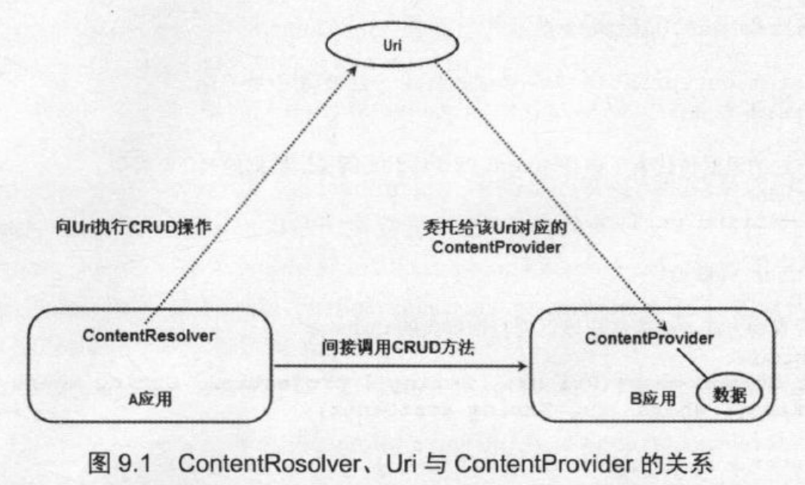

# 概述

- 疯狂Android讲义（380页-452页，第十章 Service和BroadcastReceiver）
  - 第八章
    - 从文件和SQLite数据库中存取数据
    - 进行手势检测和手势识别
    - 自动朗读
  - 第九章
    - ContentProvider、Uri、ContentReceiver以及三者的关系
    - 系统的ContentProvider
    - 检测ContentProvider变化的ContentObserver
  - 第十章
    - Service的作用以及如何创建、配置、启动和关闭Service

# 疯狂Android第八章

## File

- Context提供了方法来处理应用程序的数据文件夹里的文件IO流。

  - | 方法                                                   | 说明                                                 |
    | ------------------------------------------------------ | ---------------------------------------------------- |
    | FileInputStream openFileInput(String name)             | 打开应用程序的数据文件夹下的name文件对应的输入流。   |
    | FileOutputStream openFileOutput(String name, int mode) | 打开应用程序的数据文件夹下的name文件对应的输出流。   |
    | getDir(String name, int mode)                          | 在应用程序的数据文件夹下获取或创建name对应的子目录。 |
    | File getFilesDir()                                     | 获取应用程序的数据文件夹的绝对路径。                 |
    | String[] fileList()                                    | 返回应用程序的数据文件夹下的全部文件。               |
    | deleteFile(String)                                     | 删除应用程序的数据文件夹下的指定文件。               |

    - mode:指定打开文件的模式，该模式的可选项为
      - MODE _PRIVATE:该文件只能被当前程序读写。
      - MODE APPEND:以追加方式打开该文件，应用程序可以向该文件中追加内容。
      - MODE WORLD READABLE:该文件的内容可以被其他程序读取。
      - MODE WORLD WRITEABLE:该文件的内容可由其他程序读写。

### SD卡

- Secure Digital，缩写为SD，全名为Secure Digital Memory Card
- 读写SD卡步骤
  - 请求动态获取读写SD卡的权限，只有当用户授权读写SD卡时才执行读写。
  - 调用Environment的getExternalStorageDirectory()方法来获取外部存储器，也就是SD卡的目录。
  - 使用FileInputStream、FileOutputStream、 FileReader 或FileWriter读写SD卡里的文件。

## SQLite

- Android系统集成了一个轻量级的数据库: SQLite，SQLite 是一个嵌入式的数据库引擎，专门适用于资源有限的设备(如手机、PDA等)上适量数据存取。

- SQLite支持绝大部分SQL92语法，也允许开发者使用SQL语句操作数据库中的数据，SQLite数据只是一个文件

- Android提供了SQLiteDatabase 代表一个数据库( 底层就是一个数据库文件)，一旦应用程序获得了代表指定数据库的SQLiteDatabase对象，接下来就可通过SQLiteDatabase对象来管理、操作数据库了。

- 如果真的需要在App中频繁地操作SQLite 数据库，则强烈建议使用ORM工具，比如OrmLite、 GreenDao、 LitePal 等。

- SQLiteDatabase方法

  - |            | 方法                                                         | 说明                                                         |
    | ---------- | ------------------------------------------------------------ | ------------------------------------------------------------ |
    | 打开或创建 | static SQLiteDatabase openDatabase(String path, SQLiteDatabase.CursorFactory factory, int flags) | 打开path文件所代表的SQLite数据库。                           |
    |            | static SQLiteDatabase openOrCreateDatabase(**File** file, SQLiteDatabase.Cursor Factory factory) | 打开或创建(如果不存在) file 文件所代表的SQLite数据库。       |
    |            | static SQLiteDatabase openOrCreateDatabase(**String** path,SQLiteDatabase. Cursor Factoryfactory) | 打开或创建(如果不存在) path 文件所代表的SQLite数据库。       |
    | 操作       | execSQL(String sql, Object[] bindArgs)                       | 执行带占位符的SQL语句。                                      |
    |            | execSOL(String sal)                                          | 执行SOL语句。                                                |
    |            | insert(String table, String nullColumnHack, ContentValues values) | 向指定表中插入数据。                                         |
    |            | update(String table, ContentV alues values, String whereClause, String[] whereArgs) | 更新指定表中的特定数据。                                     |
    |            | delete(String table, String whereClause, String[] whereArgs) | 删除指定表中的特定数据。                                     |
    |            | Cursor query(String table, String[] columns, String whereClause, String[] whereArgs, String groupBy, String having, String orderBy) | 对指定数据表执行查询。                                       |
    |            | Cursor query(String table, String[] columns, String whereClause, String[] whereArgs, String groupBy, String having, String orderBy, String limit) | 对指定数据表执行查询。limit 参数控制最多查询几条记录(用于控制分页的参数)。 |
    |            | Cursor query(boolean distinct, String table, String[] columns, String whereClause, String[]whereArgs, String groupBy, String having, String orderBy, String limit) | 对指定数据表执行查询。其中第-一个参数控制是否去除重复值。    |
    |            | rawQuery(String sql, String] selectionArgs)                  | 执行带占位符的SQL查询                                        |
    |            | beginTransaction()                                           | 开始事务。                                                   |
    |            | endTransaction()                                             | 结束事务。                                                   |

  - Cursor对象，Android 中的Cursor类似于JDBC的ResultSet, Cursor同样提供了方法来移动查询结果的记录指针。

    - | 方法                                 | 说明                                                         |
      | ------------------------------------ | ------------------------------------------------------------ |
      | move(int offset)                     | 将记录指针向上或向下移动指定的行数。offset 为正数就是向下移动;为负数就是向上移动。 |
      | boolean moveToFirst()                | 将记录指针移动到第一行，如果移动成功则返回true。             |
      | boolean moveToLast()                 | 将记录指针移动到最后一行，如果移动成功则返回true。           |
      | boolean moveToNext()                 | 将记录指针移动到下一行，如果移动成功则返回true。             |
      | boolean moveToPosition(int position) | 将记录指针移动到指定行,如果移动成功则返回true。              |
      | boolean moveToPrevious()             | 将记录指针移动到上一行，如果移动成功则返回true。             |

  - SQLiteDatabase.CursorFactory:该参数是一个用于返回Cursor的工厂，如果指定该参数为null, 则意味着使用默认的工厂。

### SQLiteOpenHelper类

- SQLiteOpenHelper是Android 提供的一个管理数据库的工具类，可用于管理数据库的创建和版本更新。一般的用法是创建SQLiteOpenHelper的子类，并扩展它的onCreate (SQLiteDatabase db)和onUpgrade(SQLiteDatabase db, int oldVersion, int newVersion)方法。

- | 方法                                                         | 说明                                             |
  | ------------------------------------------------------------ | ------------------------------------------------ |
  | synchronized sQLiteDatabase getReadableDatabase()            | 以读写的方式打开数据库对应的SQLiteDatabase对象。 |
  | synchronized SQLiteDatabase getWritableDatabase()            | 以写的方式打开数据库对应的SQLiteDatabase对象。   |
  | abstract void onCreate(SQLiteDatabase db)                    | 当第一次创建数据库时回调该方法。                 |
  | abstract void onUpgrade(SQLiteDatabase db, int oldVersion, int newVersion) | 当数据库版本更新时回调该方法。                   |
  | synchronized void close()                                    | 关闭所有打开的SQLiteDatabase对象。               |

  - onCreate(SQLiteDatabase db):用于初次使用软件时生成数据库表。当调用SQLiteOpenHelper的getWritableDatabase()或getReadableDatabase()方法获取用于操作数据库的SQLiteDatabase实例时，如果数据库不存在，Android系统会自动生成一个数据库，然后调用onCreate()方法，该方法在**初次生成数据库表时才会被调用**。重写onCreate(）方法时，可以生成数据库表结构，也可以添加应用使用到的一些初始化数据。
  - onUpgrade(SQLiteDatabase db, int oldVersion, int newVersion):用于升级软件时更新数据库表结构，此方法在数据库的版本发生变化时会被调用，该方法被调用时oldVersion代表数据库之前的版本号，newVersion代表数据库当前的版本号。当程序创建SQLiteOpenHelper对象时，必须指定一个version 参数，该参数就决定了所使用的数据库的版本,只要某次创建SQLiteOpenHelper时指定的数据库版本号高于之前指定的版本号，系统就会自动触发
    onUpgrade()方法
  - 数据库的磁盘空间满了，数据库就只能读而不能写
    - getWritableDatabase(）方法以写的方式打开数据库,倘若使用getWritableDatabase()打开数据库就会出错。
    - getReadableDatabase()方法先以读写的方式打开数据库，如果数据库的磁盘空间满了，就会打开失败，当打开失败后会继续尝试以只读的方式打开数据库。

### 操作数据库

- SQLiteDatabase 的execSQL()方法可执行任意的SQL语句，包括带占位符的SQL语句。但该方法没有返回值.如果需要执行查询语句，则可调用SQLiteDatabase的rawQuery(String sql, StringD] selectionArgs)方法。

  - ```sqlite
    db.execSQL ("insert into news inf values (nul1，?,?)"，new String[] {title，content});
    ```

- 流程

  1. 通过SQLiteOpenHelper的子类获取SQLiteDatabase对象，它代表了与数据库的连接。
  2. 调用SQLiteDatabase的方法来执行SQL语句。
  3. 操作SQL语句的执行结果，比如用CursorRecyclerViewAdapter封装Cursor。
  4. 关闭SQLiteDatabase,回收资源。

### sqlite3工具

- 在Android SDK的platform-tools目录下提供了一个sqlite3.exe文件，它是一个简单的SQLite数据库管理工具，类似于MySQL提供的命令行窗口。

  - ```sqlite
    sqlite3 f: /my.db3
    ```

  - SQLite数据库还支持绝大部分常用的SQL语句，可以在命令行窗口中运行各种DDL、DML、查询语句来测试它们。

  - SQLite 内部只支持NULL、INTEGER、REAL (浮点数)、TEXT (文本)和BLOB (大二进制对象)这5种数据类型，但实际上SQLite完全可以接受varchar(n)、 char(n)、decimal(p,s)等数据类型，只不过SQLite会在运算或保存时将它们转换为上面5种数据类型中相应的类型。

  - SQLite允许把各种类型的数据保存到任何类型字段中，开发者可以不用关心声明该字段所使用的数据类型。例如，程序可以把字符串类型的值存入INTEGER类型的字段中，也可以把数值类型的值存入布尔类型的字段....但有种情况例外:定义为INTEGER PRIMARY KEY的字段只能存储64位整数，当向这种字段中保存除整数以外的其他类型的数据时，SQLite 会产生错误。

### 事务

- | 方法               | 说明                                                 |
  | ------------------ | ---------------------------------------------------- |
  | beginTransaction() | 开始事务。                                           |
  | endTransaction()   | 结束事务。                                           |
  | inTransaction()    | 如果当前上下文处于事务中，则返回true;否则返回false。 |

  - 当程序执行endTransaction0方法时将会结束事务，提交和回滚取决于SQLiteDatabase是否调用了setTransactionSuccesful()方法来设置事务标志，如果程序在事务执行中调用该方法设置了事务成功则提交事务;否则程序将会回滚事务。

## Gesture

- 手势，是指用户手指或触摸笔在触摸屏上的连续触碰行为，手势这种连续的触碰会形成某个方向上的移动趋势，也会形成一个不规则的几何图形。
  - 比如在屏幕上从左至右划出的一个动作，就是手势;
    - Android提供了手势检测，并为手势检测提供了相应的监听器。
  - 再比如在屏幕上画出一个圆圈也是手势。
    - Android允许开发者添加手势，并提供了相应的API识别用户手势。

### 手势检测

- Android为手势检测提供了一个GestureDetector 类，GestureDetector 实例代表了一个手势检测器，创建GestureDetector时需要传入一 个GestureDetector.OnGestureListener 实例，负责对用户的手势行为提供响应。

- GestureDetector.OnGestureListener 方法

  - | 方法                                                         | 说明                                                         |
    | ------------------------------------------------------------ | ------------------------------------------------------------ |
    | boolean onDown(MotionEvent e)                                | 当触碰事件按下时触发该方法。                                 |
    | boolean onFling(MotionEvent el, MotionEvent e2, float velocityX, float velocityY) | 当用户手指在触摸屏上“拖过”时触发该方法。其中velocityX、velocityY 代表“拖过”动作在横向、纵向上的速度。 |
    | abstract void onLongPress(MotionEvent e)                     | 当用户手指在屏幕上长按时触发该方法。                         |
    | boolean onScroll(MotionEvent el, MotionEvent e2, float distanceX, float distanceY) | 当用户手指在屏幕上“滚动"时触发该方法。                       |
    | void onShowPress(MotionEvent e)                              | 当用户手指在触摸屏上按下，而且还未移动和松开时触发该方法。   |
    | boolean onSingleTapUp(MotionEvent e)                         | 用户手指在触摸屏上的轻击事件将会触发该方法。                 |

- 使用流程

  1. 创建一个GestureDetector对象。创建该对象时必须实现GestureDetector.OnGestureListener监听器接口。
  2. 为应用程序的Activity (偶尔也可为特定组件)的TouchEvent事件绑定监听器，在事件处理中指定把Activity (或特定组件)上的TouchEvent事件交给GestureDetector处理。

- 多点触碰

  - Android也为多点触碰提供了支持，处理多点触碰也通过重写onTouch方法来实现，通过该方法的MotionEvent参数的getPointerCount0方 法可判断触碰点的数量。
  - 在处理多点触碰事件时，程序要通过MotionEvent的getActionMasked()方法来判断触碰事件的类型(按下、移动、松开等)。
  - 根据两个手指的距离(捏合)来计算缩放比

### 增加手垫

- Android除提供手势检测之外，还允许应用程序把用户手势(多个持续的触摸事件在屏幕上形成特定的形状)添加到指定文件中，以备以后使用一如果程序需要，当用户下次再次画出该手势时，系统将可识别该手势。

- Android使用GestureLibrary来代表手势库，并提供了GestureLibraries 工具类来创建手势库。

- GestureLibraries方法

  - | 方法                                                         | 说明                                               |
    | ------------------------------------------------------------ | -------------------------------------------------- |
    | static GestureLibrary fromFile(String path)                  | 从path代表的文件中加载手势库。                     |
    | static GestureLibrary fromFile(File path)                    | 从path代表的文件中加载手势库。                     |
    | static GestureLibrary fromPrivateFile(Context context, String name) | 从指定应用程序的数据文件夹的name文件中加载手势库。 |
    | static GestureLibrary fromRawResource(Context context, int resourceld) | 从resourceld所代表的资源中加载手势库。             |

  - 获得了GestureLibrary对象之后，该对象提供了如下方法来添加手势、识别手势。

    - | 方法                                                  | 说明                                                       |
      | ----------------------------------------------------- | ---------------------------------------------------------- |
      | void addGesture(String entryName, Gesture gesture)    | 添加一一个名为entryName的手势。                            |
      | Set<String> getGestureEntries()                       | 获取该手势库中的所有手势的名称。                           |
      | ArrayList<Gesture> getGestures(String entryName)      | 获取entryName名称对应的全部手势。                          |
      | ArrayList <Prediction> recognize(Gesture gesture)     | 从当前手势库中识别与gesture匹配的全部手势。                |
      | void removeEntry(String entryName)                    | 删除手势库中entryName对应的手势。                          |
      | void removeGesture(String entryName, Gesture gesture) | 删除手势库中entryName、gesture对应的手势。                 |
      | booleansave()                                         | 当向手势库中添加手势或从中删除手势后调用该方法保存手势库。 |

- GestureOverlayView：提供了一个专门的手势编辑组件:, 该组件就像一个“绘图组件”，只是用户在组件上绘制的不是图形，而是手势。

  - 为了监听GestureOverlayView 组件上的手势事件，Android 为GestureOverlayView 提供了OnGestureListener、OnGesturePerformedListener 、
    OnGesturingListener三个监听器接口
  - android:gestureStrokeType 参数：该参数控制手势是否需要多笔完成。可设置为single和multiple

#### recognize

- GestureLibrary 提供了recognize(Gesture ges)方法来识别手势，该方法将会返回该手势库中所有与ges匹配的手势一两 个手势的图形越相似，相似度越高。
- recognize(Gesture ges)方法的返回值为ArrayList<Prediction>, 其中Prediction 封装了手势的匹配信息，Prediction对象的name属性代表了匹配的手势名，score属性代表了手势的相似度。

## TTS

- TTS:text to speech

- Android提供了自动朗读支持。自动朗读支持可以对指定文本内容进行朗读，从而发出声音不仅如此，Android 的自动朗读支持还允许把文本对应的音频录制成音频文件，方便以后播放。

- 使用流程

  1. 通过TextToSpeech类的构造器TextToSpeech(Context context, TextToSpeech.OnInitListener listener)创建一个TextToSpeech对象

  2. 调用TextToSpeech 的setLanguage(Locale loc)方法来设置该TTS语音引擎应使用的语言、国家选项。

     - 如果调用setLanguage(Locale loc)的返回值是“TextToSpeech.LANG COUNTRY_ AVAILABLE",则说明当前TTS系统可以支持所设置的语言、国家选项。

  3. 通过TexttoSpeech朗读文本

     - | 方法                                                         | 说明                                                      |
       | ------------------------------------------------------------ | --------------------------------------------------------- |
       | speak(CharSequence text, int queueMode, Bundle params, String utteranceld) | 把text 文字内容转换为音频，播放转换的音频                 |
       | synthesizeToFile (CharSequence text, Bundle params, File file, String utteranceId) | 把text 文字内容转换为音频，把转换得到的音频保存成声音文件 |

     - queueMode：指定TTS的发音队列模式，该参数支持如下两个常量。

       - TextToSpeech.QUEUE_ FLUSH:如果指定该模式，当TTS调用speak()方法时，它会中断当前实例正在运行的任务(也可以理解为清除当前语音任务，转而执行新的语音任务)。
         - TextToSpeech.QUEUE ADD:如果指定为该模式，当TTS调用speak()方法时，会把新的发音任务添加到当前发音任务列队之后,也就是等任务队列中的发音任务执行完成后再来执行speak()方法指定的发音任务。

  4. 当程序用完了TextToSpeech对象之后,在Activity的OnDestroy()方法中调用TextToSpeech的shutdown()来关闭TextToSpeech,释放TextToSpeech所占用的资源。

# ContentProvider

- 为了在应用程序之间交换数据，Android 提供了ContentProvider, 它是不同应用程序之间进行数据交换的标准API,当一个应用程序需要把自己的数据暴露给其他程序使用时，该应用程序就可通过提供ContentProvider来实现;其他应用程序就可通过ContentResolver来操作ContentProvider暴露的数据。

  - ContentProvider 以某种Uri的形式对外提供数据,其他应用程序使用ContentResolver 根据Uri去访问操作指定数据。

- ContentProvider也是Android 应用的四大组件之一， 与Activity、 Service 、BroadcastReceiver相似，它们都需要在AndroidManifest.xml文件中进行配置。

- 一旦某个应用程序通过ContentProvider 暴露了自己的数据操作接口，那么不管该应用程序是否启动，其他应用程序都可通过该接口来操作该应用程序的内部数据，包括增加数据、删除数据、修改数据、查询数据等。

- 定义流程

  1. 定义自己的ContentProvider类，该类需要继承Android提供的ContentProvider基类。

  2. 向Android 系统注册这个“网站”， 也就是在AndroidManifest.xml 文件中注册这个ContentProvider,就像注册Activity一样。 注册ContentProvider时需要为它绑定一个Uri。

     - ```xml
       <!--在Application元素下添加，name属性指定ContentProvider类，authorities就相当于为该ContentProvider指定域名-- >
       <provider 
       	android:name=".DictProvider"
       	android:authorities="org.hello'
       	android:exported="true"/>
       ```

- | 方法                                                         | 说明                                                         |
  | ------------------------------------------------------------ | ------------------------------------------------------------ |
  | boolean onCreate()                                           | 该方法在ContentProvider创建后会被调用，当其他应用程序第一次访问ContentProvider时，该ContentProvider会被创建出来，并立即回调该onCreate0方法。 |
  | Uri insert(Uri uri, ContentValues values)                    | 根据该Uri插入values对应的数据。                              |
  | int delete(Uri uri, String selection, String[] selectionArgs) | 根据Uri删除selection 条件所匹配的全部记录。                  |
  | int update(Uri uri, ContentValues values, String selection, String[] selectionArgs) | 根据Uri修改selection条件所匹配的全部记录。                   |
  | Cursor query(Uri uri, String[] projection, String selection, String[] selectionArgs, String sortOrder) | 根据Uri查询出selection条件所匹配的全部记录，其中projection 就是一个列名列表，表明只选择出指定的数据列。 |
  | String getType(Uri uri)                                      | 该方法用于返回当前Uri所代表的数据的MIME类型。如果该Uri对应的数据可能包括多条记录,那么MIME类型字符串应该以vnd.android.cursor dir/开头;如果该Uri对应的数据只包含一条记录，那么MIME类型字符串应该以vnd. android.cursor.item/开头。 |

## URI

- 统一资源标志符（英语：Uniform Resource Identifier，缩写：URI）在电脑术语中是用于标志某一互联网资源名称的字符串。

  - 统一资源定位符（英语：Uniform Resource Locator，缩写：URL，或称统一资源定位器、定位地址、URL地址）

- Uri是ContentResolver和ContentProvider进行数据交换的标识。

- ContentProvider要求的Uri

  - ```
    content://org.hello/words
    ```

    - content://:这个部分是Android的ContentProvider 规定的，就像上网的协议默认是http://一样。 暴露ContentProvider、访问ContentProvider的协议默认是content://。
    - org.hello:这个部分就是ContentProvider 的authorities。系统就是由这个部分来找到操作哪个ContentProvider的。只要访问指定的ContentProvider,这个部分就是固定的。
    - words:资源部分(或者说数据部分)。当访问者需要访问不同资源时，这个部分是动态改变的。

- 为了将一个字符串转换成Uri, Uri 工具类提供了parse()静态方法。

  - ```
    Uri uri = Uri.parse("content://org.hello/word/2") ;
    ```

### Uri的有效性判断

- 为了确定该ContentProvider实际能处理的Uri, 以及确定每个方法中Uri参数所操作的数据，Android系统提供了**UriMatcher**工具类。

- UriMatcher工具类方法。

  - | 方法                                                 | 说明                                                         |
    | ---------------------------------------------------- | ------------------------------------------------------------ |
    | void addURI(String authority, String path, int code) | 该方法用于向UriMatcher对象注册Uri。其中authority和path组合成一个Uri,而code则代表该Uri对应的标识码。 |
    | int match(Uri uri)                                   | 根据前面注册的Uri来判断指定Uri对应的标识码。如果找不到匹配的标识码，该方法将会返回-1。 |

### 操作Uri字符串

- Android 提供了一个**ContentUris**工具类，它是一个操作Uri字符串的工具类

- ContentUris方法

  - | 方法                    | 说明                                |
    | ----------------------- | ----------------------------------- |
    | withAppendedld(uri, id) | 用于为路径加上ID部分。              |
    | parseId(uri)            | 用于从指定Uri中解析出所包含的ID值。 |
    |                         |                                     |

## ContentResolver

- Context提供了getContentResolver()方法获取该应用默认的ContentResolver对象

- ContentResolver方法

  - 

  - | 方法                                                         | 说明                                                         |
    | ------------------------------------------------------------ | ------------------------------------------------------------ |
    | Uri insert(Uri uri, ContentValues values)                    | 根据该Uri对应的ContentProvider插入values对应的数据。         |
    | int delete(Uri uri, String selection, String[] selectionArgs) | 根据Uri对应的ContentProvider删除selection 条件所匹配的全部记录。 |
    | int update(Uri uri, ContentValues values, String selection, String[] selectionArgs) | 根据Uri对应的ContentProvider修改selection条件所匹配的全部记录。 |
    | Cursor query(Uri uri, String[] projection, String selection, String[] selectionArgs, String sortOrder) | 根据Uri对应的ContentProvider查询出selection条件所匹配的全部记录，其中projection 就是一个列名列表，表明只选择出指定的数据列。 |

- 一般来说，ContentProvider 是单实例模式的，当多个应用程序通过ContentResolver 来操作ContentProvider提供的数据时, ContentResolver 调用的数据操作将会委托给同一个ContentProvider处理。

## 开发ContentProvider

- 

- 步骤
  1. 开发一个ContentProvider子类，该子类需要实现query0、insert()、 update()和 delete)等方法。
     - 实现的方法并不是给该应用本身调用的，而是供其他应用来调用的。
     - 如何实现方法，完全由程序员决定
  2. 在AndroidManifest.xml文件中注册该ContentProvider,指定android:authorities属性。

## 配置ContentProvider

- Android应用要求所有应用程序组件( Activity、Service、 ContentProvider 、BroadcastReceiver )都必须显式进行配置。

- 只要为<applcation..>元素添加<provier../>子元素即可配置ContentProvider，provier子元素属性

  - | 属性             | 说明                                                         |
    | ---------------- | ------------------------------------------------------------ |
    | name             | 指定该ContentProvider的实现类的类名。                        |
    | authorities      | 指定该ContentProvider对应的Uri(相当于为该ContentProvider分配一个域名 )。 |
    | android:exported | 指定该ContentProvider是否允许其他应用调用。如果将该属性设为false,那么该ContentProvider将不允许其他应用调用。 |
    | readPermission   | 指定读取该ContentProvider所需要的权限。也就是调用ContentProvider的query()方法所需要的权限 |
    | writePermission  | 指定写入该ContentProvider 所需要的权限。也就是调用ContentProvider的insert()、delete()、 update()方法所需要的权限。 |
    | permission       | 该属性相当于同时配置readPermission和writePermission两个权限。 |

    - 如果不配置上面的readPermission、 writePermission、 permission 权限，则表明没有权限限制.那意味着该ContentProvider可以被所有App访问。

    - 如果配置了permission，为了让Android系统知道该权限，还必须在AndroidManifest.xml 文件的根元素下(与<applcatio...>元素同级)增加如下配置。

      - ```xml
        <!--指定该应用暴露了一个权限-->
        <permission android:name="permission属性的属性值" android:protectionLevel="normal" />
        ```

      - ContentProvider声明了使用需要权限，因此在要使用到该ContentProvider的应用中必须声明本应用所需的权限。

        - ```xml
          <uses-permission android: name= "permission属性的属性值"/>
          ```

## Android的ContentProvider

- Android 系统本身提供了大量的ContentProvider, 例如联系人信息、系统的多媒体信息等
- 为了操作系统提供的ContentProvider, 需要了解该ContentProvider 的Uri,以及该ContentProvider所操作的数据列的列名，可以通过查阅Android官方文档来获取这些信息。

### Contacts的ContentProvider

- Uri

  - | Uri                                                 | 说明                    |
    | --------------------------------------------------- | ----------------------- |
    | ContactsContract.Contacts.CONTENT_URI               | 管理联系人的Uri。       |
    | ContactsContract.CommonDataKinds. Phone.CONTENT_URI | 管理联系人的电话的Uri。 |
    | ContactsContract.CommonDataKinds.Email.CONTENT URI  | 管理联系人的E-mail的Uri |

### Camera的ContentProvider

- Android提供了Camera 程序来支持拍照、拍摄视频，用户拍摄的照片、视频都将存放在固定的位置。有些时候，其他应用程序可能需要直接访问Camera所拍摄的照片、视频等，为了处理这种需求，Android 同样为这些多媒体内容提供了ContentProvider。

## ContentObserver

- 有些时候，应用程序需要实时监听ContentProvider所共享数据的改变，并随着ContentProvider的数据的改变而提供响应,这就需要利用ContentObserver了。

- 只要导致ContentProvider数据的改变，程序就调用context. getContentResolver () . notifyChange (uri, null) ，这行代码可用于通知所有注册在该Uri上的监听者:该ContentProvider所共享的数据发生了改变。
  - 监听ContentProvider数据改变的监听器需要继承ContentObserver类，并重写该基类所定义的onChange(boolean selfChange)方法一当 它所监听的ContentProvider 数据发生改变时，该onChange()方法将会被触发。
  - 为了监听指定ContentProvider 的数据变化，需要通过ContentResolver 的registerContentObserver (Uri uri, boolean notifyForDescendents, ContentObserver observer)向指定Uri 注册ContentObserver监听器
    - uri: 该监听器所监听的ContentProvider的Uri。
    - notifyForDescendents: 如果该参数设为true,假如注册监听的Uri为content://abc,那么Uri为contet:/abc/xyz、content:/abc/xyz/foo 的数据改变时也会触发该监听器;如果该参数设为false,假如注册监听的Uri为content://abc,那么只有content://abc的数据发生改变时才会触发该监听器。
    - observer: 监听器实例。

# Service和BroadcastReceiver

- Service 一直在后台运行，它没有用户界面。一旦Service被启动起来之后，它就与Activity一样，它完全具有自己的生命周期。
- BroadcastReceiver组件就像一个全局的事件监听器，只不过它用于监听系统发出的Broadcast。 通过使用BroadcastReceiver, 即可在不同应用程序
  之间通信。

## Service

### 创建、配置Service

- 创建

  1. 定义一个继承Service的子类。
  2. 在AndroidManifest.xml文件中配置该Service。

- Service与Activity都是从Context派生出来的，因此它们都可调用Context里定义的如getResources()、 getContentResolver()等方法。

- 生命周期

  - | 方法                                                       | 说明                                                         |
    | ---------------------------------------------------------- | ------------------------------------------------------------ |
    | IBinder onBind(Intent intent)                              | 该方法是Service 子类必须实现的方法。该方法返回一个IBinder对象，应用程序可通过该对象与Service组件通信。 |
    | void onCreate()                                            | 在该Service第一次被创建后将立即回调该方法。                  |
    | void onDestroy()                                           | 在该Service 被关闭之前将会回调该方法。                       |
    | void onStartCommand(Intent intent, int flags, int startId) | 该方法的早期版本是void onStart(Intent intent, Int startId)，每次客户端调用startService(Intent)方 法启动该Service时都会回调该方法。 |
    | boolean onUnbind(Intent intent)                            | 当该Service上绑定的所有客户端都断开连接时将会回调该方法      |
    |                                                            |                                                              |

- 配置:定义了Service之后，在AndroidManifest.xml文件中配置该Service, 配置Service使用<service...>元素。与配置Activity相似的是，配置Service时也可为<service.../>元素配置<intent-filter../>子元素，用于说明该Service可被哪些Intent 启动。

  - <service.../>元素属性

    - | 属性       | 说明                                                         |
      | ---------- | ------------------------------------------------------------ |
      | name       | 指定该Service的实现类类名。                                  |
      | exported   | 指定该 Service是否能被其他 App启动。如果在配置该Service时指定了<intent-filter...> 子元素，则该属性默认为true。 |
      | permission | 指定启动该Service所需的权限。                                |
      | process    | 指定该Service所处的进程，该Service组件默认处于该App所在的进程中。实际上，Android的四大组件都可通过该属性指定进程。 |

### 启动和停止Service

- 启动Service的方式
  - 通过Context的startService(Intent service)方法:通过该方法启动Service,访问者与Service 之间没有关联，即使访问者退出了，Service 也仍然运行。
  - 通过Context的bindService(Intent service, ServiceConnection conn, int flags)方法:使用该方法启动Service, 访问者与Service绑定在一起，访问者一旦退出，Service 也就终止了。用于Service 和访问者之间需要进行方法调用或交换数据的情况。
    - **service**:该参数通过Intent指定要启动的Service。
    - **conn**:该参数是一个ServiceConnection对象，该对象用于监听访问者与Service 之间的连接情况。
      - 当访问者与Service 之间连接成功时将回调该ServiceConnection 对象的onServiceConnected(ComponentName name, IBinder service)方法
        - IBinder对象:该对象即可实现与被绑定Service之间的通信。
      - 当Service所在的宿主进程由于异常中止或其他原因终止，导致该Service 与访问者之间断开连接时回调该ServiceConnection对象的onServiceDisconnected(ComponentName)方法。
        - 注意：当调用者主动通过unBindService()方法断开与Service的连接时，ServiceConnection对象的onServiceDisconnected (ComponentName)方法并不会被调用。
    - **flags**:指定绑定时是否自动创建Service ( 如果Service还未创建)。该参数可指定为0 (不自动创建)或BIND_ AUTO_CREATE (自动创建)。
- 关闭Service的方式
  - startService()对应stopService()
  - bindService(Intent service, ServiceConnection conn, int flags)对应unbindService()

- 当开发Service类时，该Service类必须提供一个IBinder onBind(Intent intent)方法，在绑定本地Service的情况下，onBind(Intent intent)方法所返回的IBinder对象将会传给ServiceConnection对象里onServiceConnected(ComponentName name, IBinder service)方法的service 参数，这样访问者就可通过该IBinder对象与Service进行通信了。可以继承Binder (IBinder的实现类)的方式实现自己的IBinder对象。