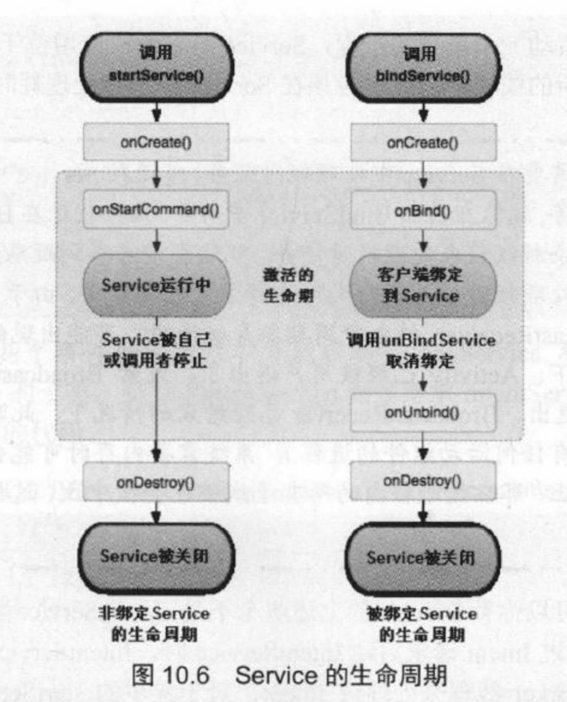

# 简述

- 疯狂Android讲义（452页-581页，第十三章 Android网络应用）
  - 第十章
    - Service的生命周期、子类IntentService、跨进程通信AIDL Service
    - 如何使用系统提供的Service：TelephoneManager、SmsManager、AudioManager、Vibrator和AlarmManager
    - 全局监听器BroadcastReceiver收发广播
    - 如何监听系统的广播
  - 第十三章
    - 基于TCP的网络通信：ServerSocket、Socket、URL、URLConnection、Http和OkHttp

# 疯狂Android第十章

### 生命周期

- 

### IntentService

- 背景
  - Service不会专门启动一个单独的进程，Service 与它所在应用位于同一个进程中。
  - Service不是一条新的线程，因此不应该在Service中直接处理耗时的任务。
- IntentService是Service 的子类。IntentService将会使用队列来管理请求Intent,每当客户端代码通过Intent 请求启动IntentService 时，IntentService 会将该Intent加入队列中，然后开启一条新的worker线程来处理该Intent。 对于异步的startService()请求， IntentService会按次序依次处理队列中的Intent,该线程保证同一时刻只处理一个Intent。由于IntentService 使用新的worker线程处理Intent请求，因此IntentService 不会阻塞主线程，所以IntentService自己就可
  以处理耗时任务。
- 特征
  - IntentService会创建单独的worker线程来处理所有的Intent 请求。
  - IntentService会创建单独的worker线程来处理onHandleIntent()方法实现的代码，因此开发者无须处理多线程问题。
  - 当所有请求处理完成后，IntentService 会自动停止，因此开发者无须调用stopSelf()方法来停止该Service。为Service的onBind()方法提供了默认实现，默认实现的onBind()方法返回null。
    为Service的onStartCommand0方法提供了默认实现，该实现会将请求Intent添加到队列中。

### AIDL Service 

- AIDL :Android Interface Definition Language (AIDL)
- 在Android系统中，各应用程序都运行在自己的进程中，进程之间一般无法直接进行数据交换。为了实现跨进程通信(Interprocess Communication,简称IPC)，Android 提供了AIDL Service。
- Android的远程Service调用与Java的RMI基本相似，都是先定义一个远程调用接口，然后为该接口提供一个实现类即可。但Android并不是直接返回Service对象给客户端Service 只是将它的代理对象(IBinder对象)通过onBind()方法返回给客户端。因此，Android 的AIDL远程接口的实现类就是那个IBinder实现类。
  与绑定本地Service不同的是，本地Service的onBind()方法会直接把IBinder对象本身传给客户端的ServiceConnection的onServiceConnected方法的第二个参数;而远程Service的onBind()方法只是将IBinder对象的代理传给客户端的ServiceConnection的onServiceConnected方法的第二个参数。

#### 创建AIDL

- Android需要AIDL ( Android Interface Definition Language, Android 接口定义语言)来定义远程接口。
- 规则
  - AIDL定义接口的源代码必须以.aidl结尾。
  - 在AIDL接口中用到的数据类型，除基本类型、String、 List、 Map、CharSequence之外，其他类型全都需要导包，即使它们在同一个包中也需要导包。
- 开发人员定义的AIDL接口只是定义了进程之间的通信接口，Service 端、客户端都需要使用Android SDK安装目录下的build-tools子目录下的aidl.exe工具为该接口提供实现。如果开发人员使用Android Studio工具进行开发，那么Android Studio工具会自动为该AIDL接口生成实现。
- 使用：定义一个Service实现类了,该Service的onBind（）方法所返回的IBinder对象应该是ADT所生成的类的子类实例。
  - 在绑定本地Service的情况下，该对象会直接传给客户端的ServiceConnection对象的onServiceConnected()方法的第二个参数
  - 在绑定远程Service的情况下，只将该对象的代理传给客户端的ServiceConnection对象的onServiceConnected()方法的第二个参数

#### 客户端访问AIDL Service

- AIDL接口定义了两个进程之间的通信接口,不仅服务器端需要AIDL接口，客户端也同样需要前面定义的AIDL接口。所以开发客户端的第一步就是将Service端的AIDL接口文件复制到客户端应用中，然后ADT工具会为AIDL接口生成相应的实现。

- 绑定远程Service流程

  - 创建ServiceConnection对象。

  - 以ServiceConnection对象作为参数，调用Context的bindService()方法绑定远程Service即可。

    - 绑定远程Service的ServiceConnection并不能直接获取Service的onBind()方法所返回的对象，它只能获取onBind()方法所返回的对象的代理，因此在	ServiceConnection的onServiceConnected方法中需要进行处理。

      - ```java
        catService = ICat.Stub.asInterface (service)
        ```

- Android要求调用远程Service 的参数和返回值都必须实现Parcelable 接口。实现Parcelable 接口不仅要求实现该接口中定义的方法，而且要求在实现类中定义一个名为CREATOR、类型为Parcelable.Creator的静态常量。除此之外，还要求使用AIDL代码来定义这些自定义类型。

  - 定义了一个实现Parcelable 接口的类，要就是实现writerToParcel(Parceldest, int flags)方法，该方法负责把Person对象的数据写入Parcel中。与此同时，该类必须定义一个类型为Parcelable.Creator<Person>、名为CREATOR的静态常量，该静态常量的值负责从Parcel数据包中恢复Person对象，因此该对象定义的createFromPerson()方法用于恢复Person 对象。

### 系统Service

- Android系统本身提供了大量的系统Service,开发者只要在程序中调用Context的getSystemService(String name)即可获取对应的系统Service。
  - getSystemService(String name):根据Service名称来获取系统Service。

#### 电话管理器( TelephonyManager )

- TelephonyManager是一个管理手机通话状态、电话网络信息的服务类，该类提供了大量的getXxx()方法来获取电话网络的相关信息。还提供
  了一个listen(PhoneStateListener listener, int events)方法来监听通话状态。

#### 短信管理器( SmsManager )

- SmsManager提供了一系列sendXxxMessage()方法用于发送短信

#### 音频管理器( AudioManager )

- 在某些时候，程序需要管理系统音量，或者直接让系统静音，这就可借助于Android 提供的AudioManager来实现。
- AudioManager方法
  - adjustStreamVolume(int streamType, int direction, int flags):调整手机指定类型的声音。
    - streamType指定声音类型
    - direction：指定对声音进行增大、减小还是静音等;
    - flags：调整声音时的标志，例如指定FLAG SHOW_ UI,则调整声音时显示音量进度条。
  - setMicrophoneMute(boolean on):设置是否让麦克风静音。
  - setMode(int mode):设置声音模式，可设置的值有NORMAL、RINGTONE和IN CALL。
  - setRingerMode(int ringerMode):设置手机的电话铃声模式。

#### 振动器( Vibrator )

- 系统获取Vibrator 也是调用Context的getSystemService0方法即可，接下来就可调用Vibrator的方法来控制手机振动了。

- Vibrator方法

  - | 方法                                                      | 说明                                                         |
    | --------------------------------------------------------- | ------------------------------------------------------------ |
    | vibrate(VibrationEffect vibe)                             | 控制手机按VibrationEffect效果执行振动。                      |
    | vibrate(VibrationEffect vibe, AudioAttributes attributes) | 控制手机按VibrationEffect效果执行振动，并执行AudioAttributes指定的声音效果。 |
    | cancel()                                                  | 关闭手机振动。                                               |

  - VibrationEffect方法

    - | 方法                                            | 说明                                                         |
      | ----------------------------------------------- | ------------------------------------------------------------ |
      | createOneShot(long milliseconds, int amplitude) | 创建只振动一次的振动效果。其中milliseconds指定振动时间，amplitude 指定振动幅度，该值可以是0~255之间的幅度。 |
      | createW aveform(long[] timings, int repeat)     | 创建波形振动的振动效果。其中timings指定振动停止、开始的时间，比如[400, 800, 1200], 就是指定在400ms、800ms、 1200ms 这些时间点交替关闭、启动振动。 |

#### 闹钟服务（AlarmManager）

- AlarmManager不仅可用于开发闹钟应用，还可作为一个全局定时器使用，在Android应用程序中也是通过Context 的getSystemServiceQ方法来获取AlarmManager对象的。

- AlarmManager方法

  - | 方法                                                         | 说明                                                         |
    | ------------------------------------------------------------ | ------------------------------------------------------------ |
    | set(int type, long triggerAtTime, PendingIntent operation)   | 设置在triggerAtTime时间启动由operation参数指定的组件。其中第一个参数指定定时服务的类型 |
    | setInexactRepeating(int type, long triggerAtTime, long interval, PendingIntent operation) | 设置一个非精确的周期性任务。例如，我们设置Alarm每个小时启动一次，但系统并不一定总在每个小时的开始启动Alarm服务。 |
    | setRepeating(int type, long triggerAtTime, long interval, PendingIntent operation) | 设置一个周期性执行的定时服务                                 |
    | cancel(PendingIntent operation)                              | 取消AlarmManager 的定时服务。                                |

## BroadcastReceiver

- 本质上就是一个全局监听器，用于监听系统全局的广播消息。它可以非常方便地实现系统中不同组件之间的通信。
  - 各种OnXxxListener只是程序级别的监听器，这些监听器运行在指定程序所在进程中，当程序退出时，OnXxxListener 监听器也就随之关闭了。但BroadcastReceiver属于系统级的监听器，它拥有自己的进程，只要存在与之匹配的Intent被广播出来，BroadcastReceiver 就会被激发。
- BroadcastReceiver用于接收程序(包括用户开发的程序和系统内建的程序)所发出的BroadcastIntent
- 使用
  1. 创建需要启动的BroadcastReceiver的Intent。
     - 实现BroadcastReceiver只要重写BroadcastReceiver的onReceive(Context context, Intent intent)方法即可。
     - 接下来就应该指定该BroadcastReceiver能匹配的Intent
       - 使用代码进行指定，调用BroadcastReceiver的Context的registerReceiver (BroadcastReceiver receiver, IntentFilter filter)方法指定。
       - 在AndroidManifest.xml文件中配置。
  2. 调用Context 的sendBroadcast() 或sendOrderedBroadcast0方法来启动指定的BroadcastReceiver.
     - 当应用程序发出一个BroadcastIntent之后,所有匹配该Intent 的BroadcastReceiver都有可能被启动。
- 每次系统Broadcast事件发生后，系统都会创建对应的BroadcastReceiver实例，并自动触发它的onReceive()方法，onReceive()方 法执行完后，BroadcastReceiver 实例就会被销毁。
  - 与Activity组件不同的是，当系统通过Intent 启动指定了Activity 组件时，如果系统没有找到合适的Activity 组件，则会导致程序异常中止;但系统通过Intent激发BroadcastReceiver时，如果找不到合适的BroadcastReceiver组件，应用不会有任何问题。
  - 如果BroadcastReceiver 的onReceive()方法不能在10 秒内执行完成，Android 会认为该程序无响应。如果确实需要根据Broadcast来完成一项比较耗时的操作，则可以考虑通过Intent 启动一个Service来完成该操作。

### 发送广播

- 调用Context的sendBroadcast(Intent intent)方法， 这条广播将会启动intent参数所对应的BroadcastReceiver。

- 分类
  - Normal Broadcast (普通广播,sendBroadcast()) : Normal Broadcast是完全异步的，可以在同一时刻(逻辑上)被所有接收者接收到，消息传递的效率比较高。但缺点是接收者不能将处理结果传递给下一个接收者，并且无法终止Broadcast Intent的传播。
  - Ordered Broadcast (有序广播,sendOrderedBroadcast()) : Ordered Broadcast的接收者将按预先声明的优先级依次接收Broadcasto比如A的级别高于B、B的级别高于C,那么Broadcast先传给A,再传给B,最后传给C。优先级别声明在<intent fiter...元素的android:priority属性中，数越大优先级别越高，取值范围为-1000~ 1000，也可以调用IntentFilter 对象的setPriority()设置优先级别。Ordered Broadcast接收者可以终止Broadcast Intent 的传播，Broadcast Intent 的传播一旦终止，后面的接收者就无法接收到Broadcast。另外，Ordered Broadcast的接收者可以将数据传递给下一个接收者，比如A得到Broadcast后，可以往它的结果对象中存入数据，当Broadcast传给B时，B可以从A的结果对象中得到A存入的数据。
    - 优先接收到Broadcast的接收者可以通过setResultExtras(Bundle)方法将处理结果存入Broadcast 中，然后传给下一个接收者，下一个接收者通过代码`Bundle bundle = getResultExtras(true)`可以获取上一个接收者存入的数据。

### 系统广播消息

- 除接收用户发送的广播之外，BroadcastReceiver还可以接收系统广播。如果应用需要在系统特定时刻执行某些操作，就可以通过监听系统广播来实现。Android的大量系统事件都会对外发送标准广播。
  - 广播Action常量：参考Android API文档中关于Intent的说明

# 网络应用

- Android完全支持JDK本身的TCP、UDP网络通信API,也可以使用ServerSocket、Socket 来建立基于TCP/IP协议的网络通信还可以使用DatagramSocket、Datagrampacket、MulticastSocket 来建立基于UDP协议的网络通信。Android也支持JDK提供的URL、URLConnection等网络通信API。
- OkHttp:使用OkHttp取代原来的Apache HttpClient,依然可以非常方便地发送HTTP请求，并获取HTTP响应，从而简化网络编程。

## 基于TCP协议的网络通信

- TCP
  - 传输控制协议（英语：Transmission Control Protocol，缩写：TCP）是一种面向连接的、可靠的、基于字节流的传输层通信协议，由IETF的RFC 793定义。在简化的计算机网络OSI模型中，它完成第四层传输层所指定的功能。用户数据报协议（UDP）是同一层内另一个重要的传输协议。
  - 在因特网协议族（Internet protocol suite）中，TCP层是位于IP层之上，应用层之下的中间层。不同主机的应用层之间经常需要可靠的、像管道一样的连接，但是IP层不提供这样的流机制，而是提供不可靠的包交换。
  - 应用层向TCP层发送用于网间传输的、用8位字节表示的数据流，然后TCP把数据流分割成适当长度的报文段（通常受该计算机连接的网络的数据链路层的最大传输单元（MTU）的限制）。之后TCP把结果包传给IP层，由它来透过网络将包传送给接收端实体的TCP层。TCP为了保证不发生丢包，就给每个包一个序号，同时序号也保证了传送到接收端实体的包的按序接收。然后接收端实体对已成功收到的包发回一个相应的确认信息（ACK）；如果发送端实体在合理的往返时延（RTT）内未收到确认，那么对应的数据包就被假设为已丢失并进行重传。TCP用一个校验和函数来检验数据是否有错误，在发送和接收时都要计算校验和。
  - 在不可靠的网络环境中，提供可靠的网络连接
- Java对基于TCP协议的网络通信提供了良好的封装，程序使用Socket对象来代表两端的通信接口，并通过Socket产生IO流来进行网络通信。

### 使用ServerSocket创建TCP服务器端

能接收其他通信实体连接请求的类是ServerSocket, ServerSocket 对象用于监听来自客户端的Socket连接，如果没有连接，它将一直处于 等待状态。ServerSocket 包含一个监听来自客户端连接请求的方法。

ServerSocket方法

- | 方法                                                     | 说明                                                         |
  | -------------------------------------------------------- | ------------------------------------------------------------ |
  | Socket accept()                                          | 如果接收到一个客户端Socket的连接请求，该方法将返回一个与连接客户端Socket对应的Socket，否则该方法直处于等待状态，线程也被阻塞。 |
  | ServerSocket(int port)                                   | 用指定的端口port 来创建一个 ServerSocket。该端口应该有一个有效的端口整数值0~-65535。 |
  | ServerSocket(int port,int backlog)                       | 增加一个用来改变连接队列长度的参数backlog。                  |
  | ServerSocket(int port,int backlog,InetAddress localAddr) | 在机器存在多个IP 地址的情况下，允许通过localAddr这个参数来指定将ServerSocket绑定到指定的IP地址。 |
  | close()                                                  | 关闭该ServerSocket                                           |

  -  服务器不应该只接收一个客户端请求，而应该不断地接收来自客户端的所有请求，所以程序通常会通过循环不断地调用ServerSocket的accept()方法
  -  创建ServerSocket时没有指定IP地址，ServerSocket将会绑定到本机默认的IP地址。

### 使用Socket进行通信

- 客户端通常可以使用Socket的构造器来连接到指定服务器

- Socket方法

  - | 方法                                                         | 说明                                                         |
    | ------------------------------------------------------------ | ------------------------------------------------------------ |
    | Socket(InetAddress/String remoteAddress, int port)           | 创建连接到指定远程主机、远程端口的 Socket,该构造器没有指定本地地址、本地端口，默认使用本地主机的默认IP地址，默认使用系统动态分配的端口。 |
    | Socket(InetAddress/String remoteAddress, int port, InetAddress localAddr, int localPort) | 创建连接到指定远程主机、远程端口的Socket,并指定本地IP地址和本地端口，适用于本地主 |
    | InputStream getInputStream()                                 | 返回该Socket 对象对应的输入流，让程序通过该输入流从Socket中取出数据。 |
    | OutputStream getOutputStream()                               | 返回该Socket对象对应的输出流，让程序通过该输出流向Socket中输出数据。 |
    | setSoTimeout( int timeout)                                   | 当网络连接、读取操作超过timeout之后，系统自动认为该操作失败  |

  - 多线程

    - C/S聊天室
      - 服务器：服务器端应该包含多条线程，每个Socket对应一条线程，该线程负责读取Socket对应输入流的数据(从客户端发送过来的数据)，并将读到的数据向每个Socket 输出流发送一遍(将一个客户端发送的数据“广播”给其他客户端)，因此需要在服务器端使用List来保存所有的Socket。
      - 客户端：每个客户端应该包含两条线程:一条负责生成主界面，响应用户动作，并将用户输入的数据写入Socket对应的输出流中;另一条负责读取Socket对应输入流中的数据(从服务器发送过来的数据)，并负责将这些数据在程序界面上显示出来。

### 使用URL访问网络资源

- URL (Uniform Resource Locator)对象代表统一资 源定位器，它是指向互联网“资源”的指针。资源可以是简单的文件或目录，也可以是对更复杂的对象的引用，例如对数据库或搜索引擎的查询。就通常情况而言，URL可以由协议名、主机、端口和资源组成

- URL类方法

  - | 方法                           | 说明                                                         |
    | ------------------------------ | ------------------------------------------------------------ |
    | String getFile()               | 获取此URL的资源名。                                          |
    | String getHost()               | 获取此URL的主机名。                                          |
    | String getPath()               | 获取此URL的路径部分。                                        |
    | int getPort()                  | 获取此URL的端口号。                                          |
    | String getProtocol()           | 获取此URL的协议名称。                                        |
    | String getQuery()              | 获取此URL的查询字符串部分。                                  |
    | URLConnection openConnection() | 返回一个URLConnection对象，它表示到URL所引用的远程对象的连接。 |
    | InputStream openStream()       | 打开与此URL的连接，并返回一个用于读取该URL资源的InputStream。 |

- 从Android 9开始，Android 默认要求使用加密连接,需要使用传输层安全协议(TransportLayer Security)。 但如果目标网站就是使用HTTP协议，那么App确实需要使用HTTP协议与目标网站通信，可以在AndroidManifest.xml文件配置

  - 在<application.../>元素 中通过android:networkSecurityConfig属性指定网络安全配置，通过该配置文件将目标网站加入白名单中。
  - 将<application.../>元素的android:usesCleartextTraffic 属性指定为true,该App将完全不受加密连接的限制。

### 使用URLConnection提交请求

- URL的openConnection0方法将返回一个URLConnection对象，该对象表示应用程序和URL之间的通信连接。程序可以通过URLConnection实例向该URL发送请求，读取URL引用的资源。通常创建一个和URL的连接，并发送请求、读取此URL引用的资源需要如下几个步骤。

  1. 通过调用URL对象的openConnection()方法来创建URLConnection对象。

  2. 设置URLConnection的参数和普通请求属性。

     - setRequestProperty(String key, String value):设置该URLConnection的key请求头字段的值为value

  3. 如果只是发送GET方式的请求，那么使用connect方法建立和远程资源之间的实际连接即可;如果需要发送POST方式的请求，则需要获取URLConnection实例对应的输出流来发送请求参数。

  4. 远程资源变为可用，程序可以访问远程资源的头字段，或通过输入流读取远程资源的数据。

     - | 方法                               | 说明                                                         |
       | ---------------------------------- | ------------------------------------------------------------ |
       | Object getContent()                | 获取该URLConnection的内容。                                  |
       | String getHeaderField(String name) | 获取指定响应头字段的值。                                     |
       | getInputStream()                   | 返回该URLConnection对应的输入流，用于获取URLConnection响应的内容。 |
       | getOutputStream()                  | 返回该URLConnection对应的输出流，用于向URLConnection发送请求参数。 |

### 使用HTTP访问网络

- HttpURLConection继承自URLConnection，HttpURLConnection 在URLConnection的基础上做了进一步改进， 增加了一些用于操作HTTP资源的便捷方法。

- HttpURLConection方法

  - | 方法                            | 说明                   |
    | ------------------------------- | ---------------------- |
    | int getResponseCode()           | 获取服务器的响应代码。 |
    | String getResponseMessage()     | 获取服务器的响应消息。 |
    | String getRequestMethod()       | 获取发送请求的方法。   |
    | setRequestMethod(String method) | 设置发送请求的方法。   |

- 多线程下载步骤

  1. 创建URL对象。
  2. 获取指定URL对象所指向资源的大小(由getContentLength()方 法实现)，此处用到了HttpURLConnection类。
  3. 在本地磁盘上创建一个与网络资源相同大小的空文件。
  4. 计算每条线程应该下载网络资源的哪个部分(从哪个字节开始，到哪个字节结束)。
  5. 依次创建、启动多条线程来下载网络资源的指定部分。

### 使用OkHttp

- 为了更好地处理向Web站点请求，包括处理Session、Cookie等细节问题，可以使用OkHttp用于发送HTTP请求，接收HTTP响应。
  - Android开发中的网络框架Retrofit 就是基于OkHttp 做的封装，Retrofit封装之后更符合RESTful风格，但Retrofit也丢失了部分灵活性。