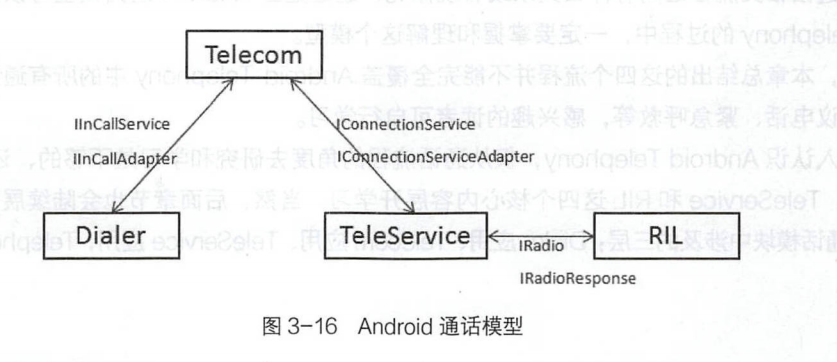

# 简述

- Android Telephone
  - 接听来电的流程
  - 通话状态更新消息上报流程
  - 控制通话消息下发流程
  - Android通话模型

# Android Telephone

### 接听流程分析

- 可以理解为与主动拨号流程正好相反的过程，手机BP Modem侧接收到网络端的来电请求，消息从Modem发给RIL，RIL 再发给TeleService 应用,然后再传递给Telecom应用，最终Dialer 应用接收到来电请求，进行来电响铃(可选震动)和展示来电界面，通知手机用户有新的来电了。
- 流程
  1. Modem从网络端接收到来电，由RIL发出Call状态产生了变化的RIL_UNSOL_RESPONSE_CALL_STATE_CHANGED消息通知， RIL.java发出mCallStateRegistrants.notifyRegistrants通知， CallTracker.java进行响应。
  2. GsmCallTracker.java进入handleMessage，响应EVENT_CALL_STATE_CHANGE，交给父类的pollCallsWhenSafe方法 查询当前Call List，首先创建EVENT_POLL_CALLS_RESULT类型的Handler消息，并向RIL发起getCurrentCalls当前Call List请求。
  3. RIL内部进行处理，向Modem发出执行CLCC查询当前Call List的AT命令，查询完成后，RIL.java向CallTracker发送EVENT_POLL_CALLS_RESULT的Handler消息。
  4. CallTracker进入handleMessage响应EVENT_POLL_CALLS_RESULT消息，进入handlePollCalls处理Call状态查询结果，判断如果是来电，则通过Phone对象发起mNewRingingConnectionRegistrants.notifyRegistrants的消息通知。
  5. CallManager进入handleMessage响应EVENT_NEW_RINGING_CONNECTION消息，通过mNewRingingConnectionRegistrants.notifyRegistrants发起消息，Telephony Frameworks层来电处理流程结束，接着进入Phone应用层。
  6. CallNotifier进入handleMessage响应PHONE_NEW_RINGING_CONNECTION消息，交给 onNewRingingConnection方法处理来电消息，根据来电的电话号码完成联系人查询、来电响铃和显示来电界面，进入Phone应用层。
  7. InCallScreen启动Activity，进入onCreate或onNewIntent方法，显示来电界面。

#### 模拟接受来电

1. RIL.java接收到Call状态变化消息后,CallTracker发起查询Call List操作,然后RIL执行AT+CLCC命令查询Modem数据,返回Call List数据给RIL.java。
2. 进入RIL.java查找UNSOL_ RESPONSE_ CALL_ STATE_ CHANGED消息的处理逻辑,responseToString()方法进行该消息的处理。在此方法中根据底层上报的
   response类型有两处针对switch ( response )逻辑处理,前面的逻辑是对数据进行收集和整理,而后面的逻辑是完成对应response的逻辑处理和消息通知。
3. 查询Call List操作不是由RIL.java接收到Call状态变化消息后直接发起的。RIL.java处理RIL_UNSOL_RESPONSE_CALL_STATE_CHANGED消息 的逻辑中只有mCallStateRegistrants对外发出消息通知，mCallStateRegistrants为RegistrantList类型
   - RegistrantList消息处理机制包括两个重要的Java类：RegistrantList.java和Registrant.java。RegistrantList中使用的观察者模式为：RegistrantList为通知者， Registrant为观察者，RegistrantList通知者支持对通知者的增加（add/addUnique）、删除（remove），并且能够发出通知（notifyRegistrants）；而Registrant作为观察者，响应通知者发出的notifyRegistrants通知，并由其internalNotifyRegistrants方法响应通知者发出的通知。
     - notifyRegistrants方法调用后，找到对应的进行响应的Registrant 对象流程
       1. 查找RegistrantList对象注册观察者Registrant对象的方法， 在Android源代码中一般为registerForXXX方法，在此方法中调用RegistrantList对象的add/addUnique等注册观察者Registrant对象的方 法。
       2. 查找registerForXXX方法的调用方，重点关注其调用的形参，特别是形参1，多数情况为this或mHandler。
       3. 通过步骤的形参，找到的即是对象发出通知
     - mCallStateRegistrants.notifyRegistrants发出通知后，有两处可响应此通知，即GsmCallTracker和CdmaCallTracker两个类的handleMessage方法。在默认的Android虚拟设备上，仅有GsmCallTracker的handleMessage方法可响应。
       - 码分多址（英语：Code Division Multiple Access，即：CDMA）或分码多重进接、码分复存，是一种多址接入的无线通信技术。CDMA最早用于军用通信，但时至今日，已广泛应用到全球不同的民用通信中。在CDMA移动通信中，将语音频号转换为数字信号，给每组数据语音分组增加一个地址，进行扰码处理，然后将它发射到空中。CDMA最大的优点就是相同的带宽下可以容纳更多的呼叫，而且它还可以随语音传送数据信息。

#### GsmCallTracker响应RIL的Call状态变化通知

1. 进入GsmCallTracker的handleMessage方法，找到EVENT_CALL_STATE_CHANGE消息类型的处理方式，会调用pollCallsWhenSafe()方法，其实质为调用父类CallTracker查询Call List方法。RIL.java接收到Modem发出的Call状态变化后，由 CallTracker发起Call List的查询。
2. 在GsmCallTracker的 父类CallTracker类中实现的pollCallsWhenSafe方法通过RIL对象调用其getCurrentCalls方法

#### RIL.java的getCurrentCalls方法

1. 在getCurrentCalls方法中，会使用lastRelevantPoll Message消息对象封装RIL_REQUEST_GET_CURRENT_CALLS类型的RILRequest请求对象，然后发送此RILRequest对象；同样，在RIL.java类中，找到 RIL_REQUEST_GET_CURRENT_CALLS消息类型的其他三种处理方法processSolicited、retToString、requestToString，后面两种都是对RIL 消息类型日志的转换处理，真正的逻辑处理在processSolicited方法中，分为三个部分
   - 根据消息流水号获取RILRequest请求对象。
   - 根据RILRequest请求对象的mRequest请求类型，对数据进行收集和整理，返回Object的对象ret。
   - 根据RILRequest请求对象的mResult回调Message消息，加上整理好的ret数据对象，发起Handler消息通知。
2. 发出Handler消息通知后，会在CallTracker中的handleMessage方法中响应，并且它的消息类型为“EVENT_POLL_CALLS_RESULT”。

#### GsmCallTracker响应消息通知

1. 底层发送Call状态变化发出通知后，在Telephony Frameworks层最终由CallTracker的handlePollCalls方法进行处理
2. handlePollCalls方法根据RIL发出的Call List对象，判断Call的状态，并发出不同通知
   - 新来电通知（phone.notifyNewRingingConnection） 
   - 通话断开通知（conn.onDisconnect）
   - Call状态变化通知（phone.notifyPreciseCallStateChanged）

#### GSMPhone的通知方法notifyNewRingingConnection

- GSMPhone的notifyNewRingingConnection方法，调用了它父类PhoneBase的notifyNewRingingConnectionP方法。也用了RegistrantList观察者模式的消息处理机制，消息响应方为PhoneProxy和 CallManage，通过类的继承关系，能再排除PhoneProxy类，只有CallManage类中的mHandler子类进行响应。

#### CallManager响应来电消息通知

1. 进入CallManager类中mHandler的handleMessage方法，找到EVENT_NEW_RINGING_CONNECTION消息处理逻辑,如果当前正在拨号或是有多于一路的来电，则挂掉当前来电，否则发出消息通知
2. CallNotifier和InCallScreen中的 handleMessage方法响应消息通知。这两个Java代码均在Phone应用层，说明手机来电流程已经从RIL层跟踪到Phone应用层相关代码。
3. 总结
   1. RIL首先发出Call状态变化消息通知，CallTracker中handleMessage方法对此消息做出响应。
   2. CallTracker向RIL发出消息查询Call List状态列表，RIL内部处理 完成后返回CallList给CallTracker，最后CallTacker中的handlePollCalls方法处理Call List，该方法根据Call List状态列表提取出具体的Call状态变化，这里是“来电状态”。

#### CallNotifier响应来电通知

- Phone应用层中的CallNotifier和InCallScreen会响应Telephony Frameworks发出的来电消息通知，即在CallManager mNewRingingConnectionRegistrants.notifyRegistrants发出通知后， CallNotifier和InCallScreen中的Handler会响应此消息通知
- 流程
  1. CallNotifier中来电处理方法入口为onNewRingingConnection。
  2. CallNotifier处理来电流程最终目的是：来电响铃（振动，是否振动根据用户设置进行判断）和显示来电界面。
  3. CallNotifier在响铃和显示来电界面之前主要是根据来电号码查询Contacts联系人相关信息，如联系人名称、联系人电话号码类型、联 系人图片、联系人来电铃音等。其实，查询联系人相关信息也都是为了来电响铃和显示来电界面做一些准备。

#### InCallScreen展现来电界面

CallNotifier的showIncomingCall()方法更新通知栏和加载来电界面。而InCallScreen界面的展示过程，是在更新通知栏时由Notification加载了InCallScreen界面的展示。

### 通话状态更新消息上报流程

- 拨号成功后，对方接听了此路通话，那么通话界面将更新当前通话为通话中的状态，并开始通话计时，可以理解为Modem->RIL→TeleService→Telecom->Dialer, 一层一层上报通话状态为“通话中”的消息处理和发送过程
- 三个应用的Call信息传递
  1. TeleService应用首先接收到通话状态更新的消息，通过Telecom的Adapter服务设置不同的通话状态; 
  2. 接着Telecom应用更新Call状态;
  3. 最后Telecom调用IInCallService的updateCall接口更新Call状态。
- RegistrantList 消息处理
  - 在GsmCdmaPhone对象发出RegistrantList消息通知后,在TelephonyConnection对象的mHandler匿名内部类对象的handleMessage中响应MSG_ PRECISE_CALL_ STATE_ CHANGED类型的Handler消息，该Handler消息的注册入口在TelephonyConnection抽象类的两个子类GsmConnection
    和CdmaConnection的setC riginalConnection方法中实现注册MSG_ PRECISE_ CALL STATE_ CHANGED类型的Registrant,并在GsmConnection的构造方法中调用setOriginalConnection接口进行消息注册的初始化操作;而TelephonyConnection对象在TelephonyConnectionSerice类的onCreateOutgoingConnection和onCreatelncomingConnection方法中创建。
- TelephonyConnection 对象的Listener注册
  - 通过Listener对象的onStateChanged进行消息回调，Listener 对象是在ConnectionService的createConnection方法中，首先创建TelephonyConnection对象，然后调用addConnection 方法，设置当前类的私有内部类Connection.Listener 对象mConnectionListener为TelephonyConnection对象的Listener。
- IConnectionServiceAdapter接口汇总
  - IConnectionServiceAdapter的Stub接口实现在Telecom应用ConnectionServiceWrapper类的私有内部类Adapter 中，它主要由setActive、 setRinging、setDialing、 setAudioRoute 等设置Call相关状态信息的接口，以及onConnectionEvent、onRttInitiationSuccess、 onRemoteRttRequest等消息通知接口构成。
- IInCallService接口汇总
  - IInCallService的Stub接口实现在framework/base 下的InCallService 抽象类的私有内部类InCallServiceBinder中，它主要由setInCallAdapter. addCall updateCall等增加和更新Call对象相关的接口，以及onConnectionEvent、onCallAudioStateChanged 等消息通知接口构成。而在Dialer应用中，InCallServicelmpl继承了抽象类InCallService。

### 控制通话消息下发流程

- 在通话界面若想更改当前通话状态，比如挂断/接听当前接收来电，挂断/保持当前通话等操作，可以理解为是控制通话消息下发的过程，从Dialer- >Telecom- >TeleService→RIL→Modem,通话控制消息一层一层的下发，最终交给Modem处理具体的通话控制。
- 三个应用的控制消息传递
  1. Dialer应用展示的通话界面或来电界面均有控制通话状态请求的界面控件，通过滑动或是点击相
     关的控件，将触发通话状态控制，调用android.telecom.Call对象的hold方法;
  2. 在Dialer应用中，调用InCallAdapter的holdCall 服务接口完成第一次的跨进程服务接口调用，进入Telecom应用。
  3. Telecom应用首先更新Call状态，此处的Call 对象为Telecom应用内部定义的类com.android.server.telecom.Call,调用IConnectionService的hold服务接口，完成第二次的跨进程服务接口调用，进入到TeleService 应用。
  4. TeleService应用中经过层层方法调用，由CalTracker对象进行Call的hold操作，并将请求发给RIL对象，发出对应的RIL请求。
- lInCallAdapter接口汇总
  - lInCallAdapter的Stub接口实现在Telecom应用的InCallAdapter 类中，它主要由answerCall、rejectCall、playDtmfTone、 mergeConference 等接口构成;
  - InCallAdapter 对象则在InCallController对象绑定InCallService 成功后创建。
- IConnectionService 接口汇总
  - IConnectionService的Stub接口实现在frameworks/base下的ConnectionService抽象类的匿名内部类中，mBinder为其对象，它主要由addConnectionServiceAdapter、createConnection 等创建TelephonyConnection接口，以及answer、reject、hold、playDtmfTone 等控制通话状态的接口构成。
  - 在TeleService应用中，TelephonyConnectionService 继承了抽象类TelephonyConnection。

### Android通话模型

- 

- 系统的分层
  - Dialer 应用是普通的Android App应用，其运行进程的用户信息和进程信息，也能说明此问题; 
  - Telecom 应用运行在system_ server 进程上，其进程用户名为system系统用户，说明它是运行在Android Framework框架层;
  - TeleService应用运行的进程名是com.android.phone，用户名是radio,承载着Telephony Call协议栈，它运行在Android Framework框架层;
  - RIL，它运行在HAL (硬件抽象层)。
- 交互方式
  - Dialer、Telecom、 TeleService 和RIL都是通过服务进行交互的。它们之间有箭头连接的都是通过Service跨进程的接口调用实现的。
  - Dialer与TeleService之间没有直接的消息传递,要通过Telecom进行消息中转，Telecom 与RIL之间同样没有直接的消息传递，要通过TeleService进行消息中转。
  - 通过服务进行跨进程接口调用实现消息的传递，服务接口调用本身就是同步的接口调用，在Service端的实现将转换为异步的方式处理，待消息处理完成后，再使用回调的接口传递消息处理的结果。
- 分解通话相关流程
  - 传递方向
    - 控制通话消息下发流程:应用层通过框架层向RIL发起通话管理和控制相关RIL请求，RIL转换成对应的消息发送给Modem执行，其中包括拨号、接听电话、拒接电话、保持、恢复通话等;
    - 通话状态更新消息上报流程: RIL 接收到Modem的通话状态变化通知，通过框架层向应用层发起通话状态变化通知，包括来电、电话接通、进入通话中等。

# Telecom

在Android Telephony通话模型中Telecom作为Dialer和TeleService的消息中转站，消息的处理任务非常繁重和复杂，并且它作为拨号和来电消息处理的关键入口