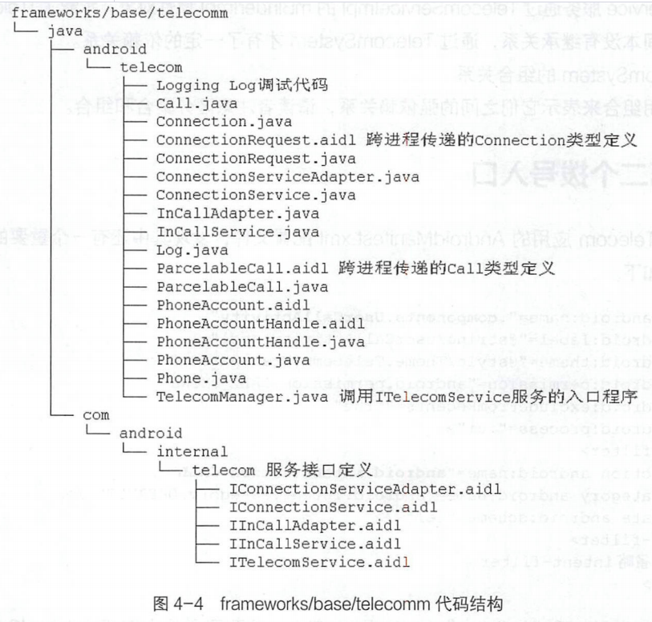
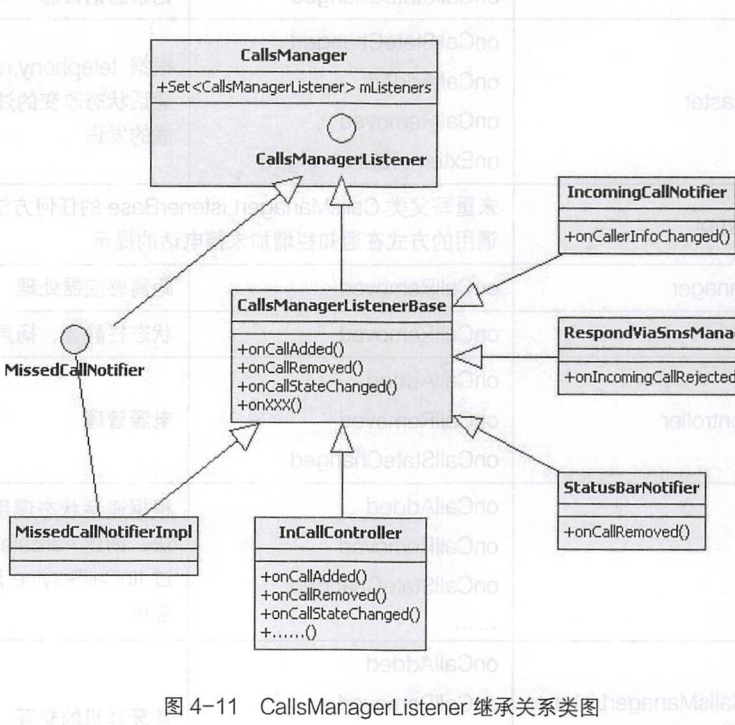
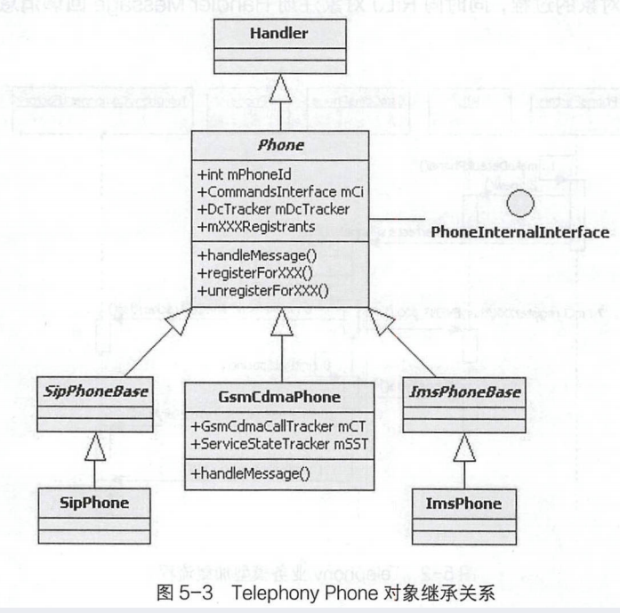

# 简述

- Android Telephone
  - Telecom的代码结构和Telecom应用的加载入口TeleService
  - Telecom的交互模型
  - 和兴Listener回调信息
  - TeleService的代码结构和加载过程
  - GsmCdmaPhone

# Telecom

- 在Android Telephony通话模型中Telecom作为Dialer和TeleService的消息中转站，消息的处理任务非常繁重和复杂，而且是拨号和来电消息处理的关键入口
  - 相对Dialer应用而言，发送Call状态变化消息给InCallService服务，并接收Dialer应用发出的Call状态的控制消息。
  - 相对TeleService应用而言,Telecom应用继续传递接收到Dialer应用发出的Call状态的控制消息给IConnectionService服务,并接收TeleService应用发出的Call 状态变化消息传递给Dialer应用。
- Telecom交互模型
  - Telecom消息入口:ITelecomService、InCallAdapter 和IConnectionServiceAdapter三个服务作为三种不同类型的消息的入口。
  - Telecom消息出口:InCallController和ConnectionServiceWrapper两次绑定服务操作作为Telecom应用消息的出口。
  - 下发顺时针、上报逆时针消息机制：Telecom应用通过消息入口和出口的五个服务，承载两种类型的消息:控制通话下发的顺时针方向消息处理和控制.上报通话状态变化的逆时针方法消息处理。
- Listener 消息回调机制
- Call和CallsManager对象是Listener回调消息的交换中心，CallsManagerListener对象接收到CallsManager mListeners 消息回调，判断当前Call的
  属性和状态，将实现通话日志、通知栏信息同步、电源管理、耳机交互等通话扩展功能。

## Telecom代码结构

- 

- 代码库：明确代码库packages/services/Telecomm,注意Telecomm有两个m字符，而其编译出的应用文件名为Telecom.apk。
- 系统签名：packages/services/Telecomm代码库根据Android.mk编译脚本,将编译出Telecom.apk Android应用文件，并使用平台签名，可以保障获取到system用户权限并运行在system_server系统进程空间。
- Java 程序包名：Telecom应用统一使用了com.android.server.telecom 包名，此包名下包括解析通话流程时比较重要的类，如Call. CallsManager、ConnectionServiceWrapper和TelecomServicelmpl等。此包名下还有五个子包名: bluetooth、 alfitering、 components、 settings 和ui。
- Test工程：有两个测试工程testapps和tests,它们都有对应的Android.mk和AndroidManifest.xml,为了更加方便地编译和调试，已经将Android.mk文件改成Android.mk.bak文件，让我们单独编译当前模块时，不必再编译测试相关的工程。

## Telecom应用加载入口

- 对拨号流程和来电流程的解析和总结过程中，业务流程进入Telecom应用的入口是TelecomManager类的placeCall和addNewlncomingCall方法

### TelecomManager类核心逻辑分析

- Contex.TELECOM _SERVICE系统服务名"telecom”与服务定义的Action: androidtelecom.TelecomService的关联
  - TelecomManager对象的获取
    - TelecomManager类的from方法，将使用Context对象的getSystemService获取SystemServiceRegistry中保存的TelecomManager普通java对象。此对象的创建时机在System_server进程的启动过程中。
  - ITelecomService服务的加载过程
    - 在Android系统启动过程中，SystemServer 加载时将启动ITelecomService 系统服务，而TelecomLoaderService类中的connectToTelecom方法调用，将以绑定服务的方式绑定ITelecomService服务，在绑定服务成功的回调接口中，会将Binder服务对象添加到ServiceManager中，其服务名为
      "telecom”
  - TelecomManager对象和telecom系统服务均是在手机启动过程中，SystemServer加载时同步创建的。
    - TelecomManager类的from方法通过Context获取的是TelecomManager对象。
    - TelecomManager类的getTelecomService方法通过ServiceManager获取的是ITelecomService服务对象。

### ITelecomService的onBind过程

- 

- AndroidManifest.xml应用配置文件中对android.telecom.ITelecomService服务的配置，可以找到com.android.server.telecom.components. TelecomService类，它就是Telecom应用的加载入口。此服务将在SystemServer系统启动过程中被加载。
- 流程
  - 创建TelecomSystem对象，初始化Telecom应用中的核心对象。
    - CallsManager和TelecomServicelmpl对象的创建。CallsManager对象创建时将同步创建CallsManagerListener对象，并注册Listener 消息通知。
      - 重点解析和区分Telecom应用中的核心Listener消息处理机制。
    - TelecomServicelmpl对象创建的同时，也将同步创建ITelecomService.Stub的匿名类对象。
  - 获取Binder对象并返回。
    - TelecomService类获取的Binder对象是TelecomServicelmpl对象的内部ITelecomService.Stub匿名对象，它们之间没有继承关系。先获取单例的TelecomSystem对象，再获取TelecomServicelmpl对象，最终获取到ITelecomService.Stub 类型的Binder对象。
- Telecom 加载入口：Telecom应用的加载入口是TelecomService类的onBind方法，它是一个Service类型，并且在AndroidManifest.xml中明确定义了它是一一个服务。
- TelecomService 和TelecomServicelmpl的关系：TelecomService服务通过TelecomServicelmpl的mBinderlmpl属性对象，承载了ITelecomService服务，它们之间本没有继承关系，通过TelecomSystem才有了一定的依赖关系。

### 拨号入口二.components.UserCallActivity

- ".components.UserCallActivity”的Activity 定义，该配置文件中有PrivilegedCallActivity 和EmergencyCallActivity两个别名Activity 定义。
- 老的Android版本中，Telecom应用通过此Activity 接收拨号Intent 请求。Dialer应用的拨号流程中，有一个分支就是使用context.startActivity 发出拨号请求的Intent 对象，此Activity响应onCreate系统调用，从而接收到拨号请求的intent对象。
- Intent.ACTION_ CALL 与Telecom应用的AndroidManifest.xml配置文件，对UserCallActivity的Action: "android.intent.action.CALL"已经成功匹配。

## Telecom交互模型

### frameworks/base/telecomm代码结构

- 

### 绑定 IInCallService 机制

- 在来电流程和拨号流程中，Telecom 应用有两次绑定服务操作，绑定InCallService 的过程将与Dialer应用中的服务交互，最终展示和更新通话界面
  - 绑定服务
  - setInCallAdapter
  - addCall
  - 
  - InCallService.aidl 和lInCallAdapter .aidI接口实现
    - com.android.server. telecom.InCallAdapter实现了InCallAdapter.aidl 接口; 
    - android.telecom.InCallService抽象类的私有内部类InCallServiceBinder继承实现了InCallService.aidl 接口。
  - 两个 InCallAdapter
    - android.telecom.InCallAdapter在frameworks/base/telecomm包下定义，它是一个普通的 Java类，代理了lInCallAdapter mAdapter 对象的所有操作; 
    - com.android.server.telecom.InCallAdapter正是InCallAdapter服务接口的实现。它们之间的依赖关系可以理解为android.telecom.InCallAdapter对象通过InCallAdapter mAdapter对象发起跨进程的服务接口调用。
  - 区分运行空间
    - com.android.server.telecom.InCallAdapter和InCallController对象运行在Telecom应用进程空间。Telecom应用提供lInCallAdapter服务，InCallController 对象绑定InCallService时保存了lInCallService Binder 对象，从而使用此对象可以调用addCall/updateCall等接口，跨进程访问Dialer应用提供的InCallService 服务;
    - 除com.android.server.telecom.InCallAdapter和InCallController的其他类都运行在Dialer应用的进程空间。
- Telecom应用主动发起的绑定InCallService服务，其入口是InCallController类的onCallAdded()方法
  - 
  - InCallController内部类：InCallController有六个内部类: InCallServiceConnection 、InCallServicelnfo、 InCallService、BindingConnection、EmergencyInCallServiceConnection、 CarSwappingInCallServiceConnection和NonUlInCallServiceConnectionCollection
  - CarSwappinglnCallServiceConnection的代理关系：通过调用setCarMode方法设置mlsCarMode和mCurrentConnection属性，在调用connect或
    disconnect方法时则调用mCurrentConnection 对象的对应方法，而mCurrentConnection是InCallServiceConnection对象类型，即InCallServiceBindingConnection对象。
  - 内部调用：InCallServiceBindingConnection对象的connect 方法绑定IInCallService，内部匿名mServiceConnection对象的onServiceConnected 方法，将响应绑定成功后的系统回调，最后通过InCallController.this.onConnected方式调用主类的onConnected方法。
  - InCallController 关键属性和方法：mInCallServices属性保存InCallService的Binder对象列表，onCallAdded 和bindToServices方法是绑定InCallService的入口，onConnected 方法是响应绑定成功后setInCallAdapter、addCall服务接口的调用入口。

### 绑定IConnectionService机制

- 将与TeleService应用中的服务交互，发出通话控制消息或是接收通话状态更新的消息
  - bind Service
  - addConnectionServiceAdapter
  - createConnection
- 
  - ConnectionService.aidl 和IConnectionServiceAdapter .aidl接口实现
    - 抽象类ConnectionService的匿名内部类实现了ConnectionService.aidl 接口，而ConnectionService的mBinder属性对象将同步创建该匿名内部类对象。
    - 在Telecom应用中，ConnectionServiceWrapper类的私有内部类Adapter 继承实现了ConnectionService.aidl。
  - 区分运行空间
    - Telecom应用进程空间：ConnectionServiceWrapper 对象运行在Telecom 应用进程空间，由Telecom应用提供IConnectionServiceAdapter服务，而TeleService应用中的TelephonyConnectionService对象保存了IConnectionServiceAdapter Binder 对象，使用此对象可以调用setActive/setOnHold等接口,跨进程调用Telecom应用提供的IConnectionServiceAdapter 服务，发送通话状态变化的消息。
    - TeleService 应用进程空间：除了ConnectionServiceWrapper类，其他类均运行在TeleService应用的进程空间。

- Telecom应用主动发起的绑定IConnectionService 调用过程的入口是ConnectionServiceWrapper类的createConnection 方法
  - 
  - ConnectionServiceWrapper 内部类及继承关系
    - ConnectionServiceWrapper是一个普通的Java类型，继承了抽象的ServiceBinder类，但是在Telecom应用中，此对象是通过ConnectionServiceRepository的getService方法获取
    - ConnectionServiceWrapper 有一个内部类Adapter ，它实现了lConnectionServiceAdapter服务接口，并且在方法调用过程中临时创建三个BindCallback的匿名对象。
  - Binder2
    - Binder2对象负责绑定IConnectionService 的所有处理逻辑，作为ConnectionServiceWrapper对象的mBinder属性，与ConnectionServiceWrapper对象同步创建。
    - ServiceBinderConnection对象的onServiceConnected方法将响应绑定IConnectionService成功后的回调，而回调过程将调用主类对象的setBinder和handleSuccessfulConnection两个方法。
  - 绑定服务回调逻辑
    - setBinder和handleSuccessfulConnection两个方法的实现都在ServiceBinder类中。
    - setBinder方法将保存绑定服务成功后的Binder对象,调用子类中实现的setServiceInterface 方法,最终调用服务的addConnectionServiceAdapter接口;
    - handleSuccessfulConnection方法则通过BindCallback对象进行回调，在创建Connection的过程中调用服务的createConnection方法。
  - ConnectionServiceWrapper 关键属性和方法
    - mServiceAction属性确定绑定服务的Action; mServiceInterface 属性保存IConnectionService的Binder对象; mAdapter 属性对象是IConnectionServiceAdapter服务Binder对象;
    - createConnection方法是绑定IConnectionService的程序入口，onServiceConnected 、setServiceInterface、onSuccess 等不同对象的方法是响应绑定服务成功后，调用服务addConnectionServiceAdapter、createConnection 接口的入口。

## 演进Telecom交互模型

- 
  - 通话控制消息下发:Dialer应用接收用户操作后，通过InCallAdapter服务接口调用发出通话控制消息; Telecom 接收通话控制消息，经过处理后通过IConnectionService服务接口，将通话控制消息发送给TeleService 应用。
  - 通话状态变化消息上报:右边的模型说明了通话状态变化消息上报的过程，TeleService应用接收RIL消息后，通过IConnectionServiceAdapter服务接口调用发出通话状态变化消息; Telecom 接收通话状态变化消息，经过处理后通过IInCallService服务接口，将通话状态变化消息发送给Dialer应用。
  - 
    - 消息顺时针方向传递为通话控制消息下发的流程。
    - 消息逆时针方向传递为通话状态变化消息上报的流程。
    - Telecom应用承载lInCallAdapter和IConnectionServiceAdapter两个Adapter服务;而Dialer和TeleService应用各自承载着InCallService和IConnectionService两个Service服务。
    - IInCallAdapter接收顺时针方向的通话控制消息; IConnectionServiceAdapter 接收逆时针方向的通话状态变化上报消息。
      - Telecom应用有三个关键入口: ITelecomService系统服务、lInCallAdapter 服务和IConnectionServiceAdapter服务。
      - ITelecomService提供了两个拨号入口: lInCallAdapter 提供通话控制相关接口，IConnectionServiceAdapter提供通话状态变化的消息上报接口。
    - InCallController由Telecom向Dialer应用发送逆时针方向的通话状态变化上报消息，ConnectionServiceWrapper由Telecom向TeleService应用发送顺时针方向的通话控制消息。

## 核心Listener回调消息处理

- 在Telecom应用中主要处理两种消息类型:顺时针方向下发的通话控制消息和逆时针方向上报的通话状态变化消息。而Listener消息回调承载着上报消息的业务处理逻辑，其应用场景是ConnectionServiceWrapper 的Adapter服务对象接收到TeleService应用的接口调用，通知当前Connection和Call的状态或属性发生的变化，再经过一系列的Listener消息回调处理，最终由InCallController创建ParcelableCall对象，使用IInCallService服务接口调用发送给Dialer应用。
- Telecom应用中消息回调的全貌
  - 
    - 接收上报消息的入口：IConnectionServiceAdapter服务即Adapter对象。
    - 第一条消息回调通道：CreateConnectionResponse消息回调的过程是第一条消息回调通道，也就是在Connection 相关的接口调用过程中，IConnectionServiceAdapter 服务即Adapter 对象接收到上报消息，通过消息回调将消息发送到Call对象，再通过Call.Listener对象进行消息回调CallsManager对象和InCallController的内部匿名对象。
    - 第二条消息回调通道：Adapter对象接收到.上报消息，绕过了Call 对象的相关消息处理过程，直接使用ConnectionServiceWrapper对象的mCallsManager属性调用CallsManager对象的方法，再通过CallsManagerListener对象进行Listener消息回调，最后交给InCallController处理。

### CallsManagerlistener

- 在TelecomSystem初始化过程中创建CallsManager对象时，将同步创建CallsManagerListener对象，并增加到CallsManager对象的`Set<CallsManagerListener> mListeners`集合中;而通话的相关状态或属性发生改变时，CallsManager将遍历mListeners列表，进行onXXX的消息回调

- 

  - CallsManagerListener 接口定义

    - CallsManagerListener接口定义在CallsManager类中，CallsManagerListenerBase类实现了此接口的所有方法，而且这些方法都没有任何的业务逻辑代码。模板模式。

  - CallsManagerlistenerBase子类

    - | 类名                                                         | 重写父类方法           | 关键业务                                                     |
      | ------------------------------------------------------------ | ---------------------- | ------------------------------------------------------------ |
      | IncomingCallNotifier                                         | onCallAdded            | 手机状态栏显示来电信息，并附加了接听和拒接操作入口           |
      |                                                              | onCallRemoved          |                                                              |
      |                                                              | onCallStateChanged     |                                                              |
      | RespondViaSmsManager                                         | onIncomingCallRejected | 拒接来电后，发送短信                                         |
      | CallAudioManager                                             | onCallStateChanged     | 根据通话状态设置Audio音频策略                                |
      |                                                              | onCallAdded            |                                                              |
      |                                                              | onCallRemoved          |                                                              |
      | HeadsetMediaButton                                           | onCallAdded            | 耳机按钮控制事件的响应，根据通话状态进行接听或是挂断电话操作 |
      |                                                              | onCallRemoved          |                                                              |
      |                                                              | onExternalCallChanged  |                                                              |
      | CalLogManager                                                | onCallStateChanged     | 记录通话曰志                                                 |
      | PhoneStateBroadcaster                                        | onCallStateChanged     | 根据telephony.registry 服务发起通话状态改变的注册消息回调和广播的发送 |
      |                                                              | onCallRemoved          |                                                              |
      |                                                              | onExternalCallChanged  |                                                              |
      |                                                              | onCallAdded            |                                                              |
      | MissedCallNotifierlmpl                                       |                        | 未重写父类CallsManagerListenerBase的任何方法，通过对象方法调用的方式在通知栏增加未接电话的提示 |
      | ProximitySensorManager                                       | onCallRemoved          | 距离感应器处理                                               |
      | StatusBarNotifier                                            | onCallRemoved          | 状态栏静音、扬声器状态同步                                   |
      | InCallWakeLockController                                     | onCallAdded            | 电源管理                                                     |
      |                                                              | onCallRemoved          |                                                              |
      |                                                              | onCallStateChanged     |                                                              |
      | InCallController                                             | onCallAdded            | 根据通话状态调用updateCall方法，创建ParcelableCall对象，通过InCallService服务传递给Dialer应用 |
      |                                                              | onCallRemoved          |                                                              |
      |                                                              | onCallStateChanged     |                                                              |
      | Anonymous in mCallsManagerListener in BluetoothPhoneServicelmpl | onCallAdded            | 蓝牙耳机的交互                                               |
      |                                                              | onCallStateChanged     |                                                              |
      |                                                              | onCallRemoved          |                                                              |

### Call.Listener

- 拨号流程或是来电流程中，都会创建com.android.server.telecom.Call对象，此类中定义了Listener接口，主要有onSuccessfulOutgoingCall、onFailedOutgoingCall、onSuccessullncomingCall、onFailedIncomingCall、onXXXChanged，都是以onXXX开头的，并且都传递Call对象的引用，当前Call类中的内部抽象类ListenerBase实现了Listener接口的所有方法，ListenerBase 实现的所有方法没有具体的代码逻辑。
- 
  - Call.Listener接口定义
    - Call. Listener接口在Call类中定义，ListenerBase 抽象类实现了此接口的所有方法，并且这些方法都没有任何的业务逻辑代码，与CallsManagerListenerBase类的设计思想是一致的。
  - ListenerBase子类
    - Telecom应用中ListenerBase总共有三个子类: CallsManager和InCallController、 IncomingCallNotifier两个匿名内部类。
  - Call对象的mListeners
    - Call对象在CallsManager中创建，同时调用call.addListener(this)逻辑，将CallsManager对象作为Call对象的mListeners中的一员; 
    - InCallController和IncomingCallNotifier两个匿名内部类对象在TelecomSystem创建的过程中将同步创建，对象名均为: mCallListener; InCallController 在绑定IInCallService 成功后调用addCall方法的过程中，调用call.addL istener(mCalL istener)逻辑，将mCallL istener添加到Call对象的mL isteners中;同理，IncomingCallNotifier在Call变化的消息回调中，将mCallistener添加到Call 对象的mListeners中。
  - CallsManager
    - CallsManager作为Call.Listener接口的子类，由Call对象触发mListeners Call 对象变化的消息回调，CallsManager对象将通过自己的mListeners,继续发出Call 对象变化的消息回调，而这一-次的消息回调将接收并处理12个对象;因此，可以将CallsManager看作Call对象变化Listener消息回调的消息中转站，将Call.Listener和CallsManagerListener这两个Listener紧密联系在一起。

### CreateConnectionResponse

- 不论拨号流程还是来电流程，Telecom 在Call对象创建完成后，都将调用其startCreateConnection方法最终完成绑定lConnectionService服务相关的操作;在此过程中将涉及CreateConnectionResponse接口对象的创建和传递过程
  - CreateConnectionResponse接口定义了两个方法: handleCreateConnectionSuccess 和handleCreateConnectionFailure，它总共有两个子类: Call 和CreateConnectionProcessor, Call 和CreateConnectionProcessor都是CreateConnectionResponse接口对象。
  - CreateConnectionProcessor的mCallResponse属性是Call 对象,ConnectionServiceWrapper的mPendingResponses将保存CreateConnectionProcessor对象列表。

## 扩展CallsManager

- CallsManager承载了对Telecom应用中Call关键消息的处理
  - 响应 ITelecomService服务调用，完成两次绑定服务处理。
  - 响应InCallAdapter服务调用，完成通话控制消息转发。
  - 响应IConnectionServiceAdapter服务调用，完成通话状态变化消息转发。
- Telecom应用接收到外界的通话关键信息后，将统一汇总到CallsManager 中处理
  - 

### 记录通话日志

- CallLogManager类负责记录通话日志，它重写了CallsManagerlistener父类的onCallStateChanged方法。在响应CallsManager Listener 消息回调时，通过判断通话的发起方和通话断开的DisconnectCause将通话日志分为呼出、呼入、拒绝和未接四类。在onCallStateChanged中再调用logCall()方法，此方法先将通话日志信息封装成AddCallArgs对象，再通过LogCallAsyncTask在后台执行android.provider.CallLog对象的addCall方法，完成通话日志SQLite数据库的写入操作。

### 耳机Hook事件

- HeadsetMediaButton类负责监听耳机Hook按键的事件,在事件消息的回调响应过程中，可接收到耳机Hook按键的长按或短按事件，将其交给CallsManager对象的onMediaButton方法处理，包括接听电话、拒接电话和通话静音三个操作。
- HeadsetMediaButton的匿名内部类对象mSessionCallback注册为Android系统MediaSession的Call Back对象，在主类HeadsetMediaButton的onCallAdded、onCallRemoved和onExtermalCallChanged方法的Listener回调响应过程中，通过Handler消息MSG_ MEDIA_ SESSION_ SET _ACTIVE的处理过程设置MediaSession的激活状态。在通话的过程中需要激活MediaSession 来接收耳机Hook按键的事件;通话断开以后则需要关闭MediaSession，不再接收耳机Hook按键的事件。

### 通知栏信息同步

- IncomingCallNotifier
  - IncomingCallNotifier类负责在手机状态栏显示或隐藏来电信息，通过onCallAdded、onCallRemoved、onCallSstateChanged方法的消息回调，在updatelncomingCall方法中实现显示或隐藏来电信息
- StatusBarNotifier
  - StatusBarNotifier类负责通知栏中通话静音和扬声器状态的同步显示，仅重写了父类CallsManagerListener的onCallRemoved方法，通话断开的时候调用notifyMute或notifySpeakerphone来取消通知栏通话静音和扬声器的信息显示。
  - StatusBarNotifier类响应onCallRemoved消息回调只能取消静音或扬声器通知栏图标的显示。在打开静音或是扬声器时，CallAudioRouteStateMachine 将通过StatusBarNotifier 对象直接调用notifyMute或notifySpeakerphone方法，在通知栏上显示对应的信息。

# TeleService

- 在通话业务的交互模型中，TeleService 负责与RILJ对象进行交互，完成通话管理
  - 顺时针方向的通话管理和控制消息
    - IConnectionService服务接收Telecom应用中转的通话管理和控制请求，将请求提交给Telephony模型处理，最终与RILJ对象进行交互，完成通话管理和控制。
  - 逆时针方向的通话变化消息上报
    - Telephony业务模型与RILJ对象交互，通过Telecom应用设置的Adapter跨进程Binder对象，发出通话信息或状态发生改变的跨进程消息上报。

## 加载过程分析

### TeleService代码结构

- 
  - TeleService系统应用的编译文件Android.mk依赖telephony-common.jar包,即Telephony业务模型的实现。
  - com.android.phone:TeleService:系统应用基础包，主要包括phoneApp、PhoneInterfaceManager等Java代码文件。
  - com.android.services.telephony:与lonnectionService 服务实现相关的Java 代码，如TelephonyConnection、TelephonyConnectionService 等Java代码文件。
  - AndroidManifest配置信息
    - package="com.android.phone"唯一标识应 用程序及基础包名, TeleService 系统应用的运行进程名也是com.android.phone。
    - android:sharedUserld="android.uid.phone"设置TeleService 系统应用进程时使用的用户是android.uid.phone,即radio用户，可通过adb shell ps命令查看并验证com.android.phone进程的相关信息。
    - android:persistent属性设置为true,定义此Application应用常驻内存。如果进程异常退出或被人为“杀掉”，Android 系统机制会将此应用重新唤醒。
    - android:name属性设定为PhoneApp,再结合package属性定义，可知TeleService系统应用加载入口的Java类是com.android.phone.PhoneApp。PhoneApp继承于Application类，重写了onCreate方法。onCreate方法是TeleService 系统应用的加载入口。系统加载TeleService系统应用的com.android.phone进程时,方能发起两个onCreate方法调用，以避免其他应用或进程非法加载TeleService系统应用。在PhoneApp的onCreate方法中会调用PhoneGlobals.onCreate()和TelephonyGlobals.onCreate方法

### PhoneGlobals.onCreate()

- 创建Phone 对象
  - 调用PhoneFactory类的静态方法makeDefaultPhones创建GsmCdmaPhone对象，将同步创建和初始化Telephony业务模型的核心对象，比如RILJ和各种Tracker对象。
  - 为区分HAL层与Telephony Framework 层与RIL相关的信息，com.android.phone进程空间的com.android.internal.telephony.RIL对象，统一约定为RILJ。
- CallManager 的消息注册:CallManager向所有创建的GsmCdmaPhone对象注册相关消息(双卡或多卡)。
- 初始化 ITelephony服务
  - 通过PhoneInterfaceManager的init 方法创建ITelephony.Stub 类型的Binder 对象，再通过ServiceManager.addService的调用增加系统服务ITelephony。
- 其他操作
  包括TelephonyDebugService、NotificationMgr 等初始化操作,并注册了两个广播接收器mReceiver和mSipReceiver。

### TelephonyGlobals.onCreate()

- 初始化TTY:Text Telephones (TTY)即聋哑人电话，在手机插入专用设备后支持收发文本，但需网络支持。
- 加载PhoneAcount

## Telephony Phone

- TeleService系统应用的加载过程也可以理解为Telephony业务模型的加载过程，即以创建GsmCdmaPhone对象为中心，同步创建GsmCdmaCallTracker、ServiceStateTracker、DcTracker和RILJ等关键业务对象的过程，同时向RILJ对象注册HandlerMessage回调消息。
  - 加载入口：PhoneFactory.makeDefaultPhones作为Telephony业务模型的加载入口。
  - GsmCdmaPhone 对象创建：创建GsmCdmaPhone对象，将传入对RILJ、sPhoneNotifier. TelephonyComponentFactory等对象的引用，以及Phone类型的GSM或CDMA。
  - phoneld的隐藏逻辑：for循环中创建RILJ和Phone对象并传入循环下标值作为phoneld的参数。比如双卡双待numPhones取值2,将创建两个RILJ对象和两个Phone对象，phoneld为0代表SIM卡卡槽1对应的Telephony业务模型，phoneld 为1代表SIM卡卡槽2对应的Telephony业务模型。
  - GsmCdmaPhone 对象的消息注册：调用registerXXX方法向RILJ注册RegistrantList消息，向RILJ注册GsmCdmaPhone对象的Handler Message回调消息。
  - 创建Tracker对象
    在GsmCdmaPhone构造方法中，通过TelephonyComponentFactory类的makeXXXTracker方法，创建非常关键的三个对象: GsmCdmaCallTracker、ServiceStateTracker、DcTracker,它们将分别承载Telephony业务模型中非常重要的三个业务能力: Voice Call语音通话、ServiceState网络服务和Data Call移动数据业务。

### GsmCdmaPhone

- 

  - GsmCdmaPhone 对象本质
    - Phone抽象类实现PhoneInterallnterface接口并继承Handler 类，通过重写handleMessage方法实现消息的异步处理。
  - Phone 抽象类的三个子类
    - SipPhone负责Sip网络电话业务
    - GsmCdmaPhone承载CS ( Circuit Switch,电路交换)域的电信业务
    - ImsPhone承载高清语音通话业务
  - phoneld
    - phoneld对应SIM卡卡槽承载的Telephony业务模型。
  - 关键属性对象
    - mCi是RILJ对象引用，mDcTracker是DcTracker对象引用，mCT是GsmCdmaCallTracker对象引用，mSST是ServiceStateTracker对象引用。

- GsmCdmaPhone对象关键属性

  - | 属性            | 类型                | 说明                   |
    | --------------- | ------------------- | ---------------------- |
    | mRilVersion     | int                 | RIL版本号              |
    | mImei           | String              | IMEI串号               |
    | mlmeiSv         | String              | IMEI串号的软件版本     |
    | mVmNumber       | String              | 语音信箱( Voice Mail ) |
    | mCi             | RIL                 | RIL的Java服务对象      |
    | mSST            | ServiceStateTracker | 服务状态跟踪者         |
    | mCT             | GsmCdmaCallTracker  | 通话跟踪者             |
    | mDcTracker      | DcTracker           | 移动数据跟踪者         |
    | mXXXRegistrants | RegistrantList      | 14个Observer列表       |
    | mNotifier       | PhoneNotifier       | 通知Phone状态变化      |

- GsmCdmaPhone对象关键方法

  - | 分类             | 方法/接口                                                    | 说明                                        |
    | ---------------- | ------------------------------------------------------------ | ------------------------------------------- |
    | 消息处理         | registerForXXX                                               | Handler消息注册                             |
    |                  | unregisterForXXX                                             | 取消Handler消息注册                         |
    |                  | notifyXXX                                                    | 发出Handler消息通知                         |
    | 通话控制相关接口 | dial、acceptCall、rejectCal..                                | 拨号、接听来电、拒接来电等控制和管理接口    |
    |                  | setRadioPower、updateServiceLocation、disableLocationUpdates | 开关飞行模式、设置位置服务                  |
    |                  | setDataRoamingEnabled、setDataEnabled                        | 漫游移动数据设置接口和移动数据开关接口      |
    | 获取信息接口     | getForegroundCall、getBackgroundCall、getRingingCall         | 获取Call通话管理对象                        |
    |                  | getServiceState、getCellLocation                             | 获取ServiceState 驻网服务管理对象和小区信息 |
    |                  | getDataActivityState、getDataRoamingEnabled、getDataEnabled、getActiveApnTypes... | 获取移动数据状态、APN等信息                 |

### Composition (组合)关系

- GsmCdmaPhone类的构造方法可体现它与mCi、mCT、mSST、mDcTracker等对象之间的关系,它们之间具有强组合( Composition)的逻辑关系。
- RILJ和PhoneNotifier对象的创建在PhoneFactory中完成，GsmCdmaPhone 的构造方法中则通过supper调用，将这两个对象的引用传递给父类Phone的构造方法，进行mCi和mNotifier属性的初始化。
- mCT、mSST、mDcTracker等对象均在GsmCdmaPhone的构造方法中同步完成创建，调用这些类的构造方法时传入了this，即GsmCdmaPhone对象。

