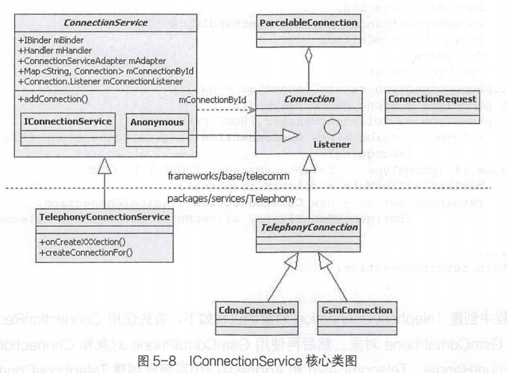
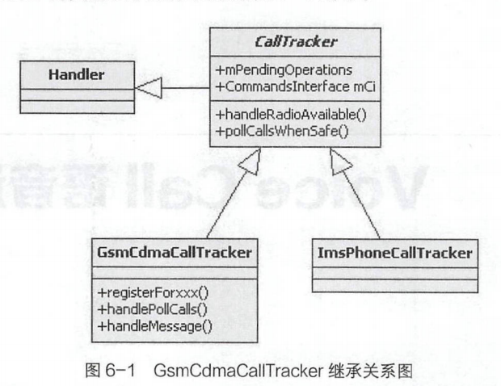

# 简述

- Android Telephone
  - GsmCdmaPhoneHandle消息处理机制
  - PhoneAccount在Telecom和TeleService跨进程传递
  - TeleService的系统服务phone、isub和应用服务IconnectionService
  - GsmCdmaCallTracker类结构

# TeleService

## Telephony phony

### Facade Pattern

- 门面模式(Facade Pattern)：外部与一个子系统的通信必须通过一个统一的外观对象进行，为子系统中的一组接口提供一个一致的界面，外观模式定义了一个高层接口，这个接口使得这一子系统更加容易使用。门面模式又称为外观模式，它是一种对象结构型模式。
  - GsmCdmaPhone 为Facade (门面)，而GsmCdmaCallTracker、ServiceStateTracker、 DcTracker、RILJ都作为内部的子系统
  - GsmCdmaPhone对象的关键方法主要有两类:控制管理接口和信息查询接口，这些接口实现逻辑有一个规律:mXXX.doXXX/mXXX.getXXX

### Handler 消息处理机制

- GsmCdmaPhone类的父类是Phone抽象类，它不仅实现了PhoneInternallnterface 接口，而且继承了Handler类，是一个自定义的Handler消息处理类。

- GsmCdmaPhone类的Handler消息处理机制

  - 基本Handler消息注册和响应机制。

    - 调用mCi.registerForXXX方法，向RILJ对象注册单个的Handler消息
    - Handler对象handleMessage接收并响应Message消息
    - 在GsmCdmaPhone类的构造方法的调用过程中，即加载Telephony业务模型的过程中，以调用mCi.registerForXXX(this，what, null)的方式向 RILJ对象发起消息注册。在GsmCdmaPhone和Phone类中均重写了父类的handleMessage方法，从而响应RILJ对象发出的Handler消息回调通知。

  - RegistrantList封装的Handler消息运行机制。

    - 在Phone抽象类中，共定义了14个RegistrantList对象。针对这14个RegistrantList 对象，分别实现了registerForXXX和unregisterForXXX方法来完成多个Handler消息的注册和取消注册

    - RegistrantL ist对象需要正常运转Handler消息处理，不仅需要提供registerForXX 和unregisterForXXX方法完成Handler消息的注册和取消注册，还需要notifyXXX方法来发出多个注册的Handler通知。

    - 在GsmCdmaPhone对象中，这些RegistrantList 对象发出消息通知的方法的实现逻辑在Phone抽象类和GsmCdmaPhone类中均有不同程度的实现。notifyXXXP 消息通知方法，它们的名称最后都有一个大写的P字母作为方法名称的结尾，P是Parent的首字母。这些方法调用时，都是由其子类调用其父类的super.notifyXXXP对应的方法。notifyXXX通知消息的调用是在GsmCdmaPhone对象提供的通信管理和控制的方法中，调用notifyXXX方法来发出Handler消息的通知。比如，MMI拨号请求、输入PIN码、请求USSD码等一系列主动请求的处理逻辑。

    - | RegistrantList列表                 | 说明                           |
      | ---------------------------------- | ------------------------------ |
      | mPreciseCallStateRegistrants       | 通话状态变化消息通知           |
      | mHandoverRegistrants               | SRVCC通话切换消息通知          |
      | mNewRingingConnectionRegistrants   | 接收到新来电请求的消息通知     |
      | mIncomingRingRegistrants           | 来电响铃消息通知               |
      | mDisconnectRegistrants             | 通话连接断开消息通知           |
      | mServiceStateRegistrants           | 服务状态变化消息通知           |
      | mMmiCompleteRegistrants            | MMI执行完毕消息通知            |
      | mMmiRegistrants                    | 执行MMI消息通知                |
      | mUnknownConnectionRegistrants      | 出现未知连接消息通知           |
      | mSuppServiceFailedRegistrants      | 附加服务请求失败消息通知       |
      | mRadioOffOrNotAvailableRegistrants | Radio状态不可用消息通知        |
      | mSimRecordsL oadedRegistrants      | SIM卡加载完成消息通知          |
      | mVideoCapabilityChangedRegistrants | 视频通话能力变化消息通知       |
      | mEmergencyCallToggledRegistrants   | Emergency callcallback消息通知 |

      - SIM卡:用户身份模块（Subscriber Identity Module，SIM），通常称为“SIM卡”或“电话卡”，是主要用于存储用户身份识别数据、短信数据和电话号码的智能卡，ICCID：Integrate circuit card identity 集成电路卡识别码即SIM卡卡号，相当于手机号码的身份证。
      - MMI是指Man Machine Interface即人机界面,MMI是进行移动通信的人与提供移动通信服务的手机之间交往的界面。包括硬件和软件。

  - 创建的Message对象作为RILJ对象回调入口。

    - GsmCdmaPhone对象在与RILJ对象的交互过程中创建Message对象，作为RILJ对象的回调入口。使用这种方式不需要向RILJ注册Hanlder消息，其生命周期很短，仅在一次交互过程中有效。单次Handler消息处理的实现机制非常灵活和简单
    - GsmCdmaPhone对象提供的方法中有一些处理逻辑。
      1. 创建基于GsmCdmaPhone对象的Message对象，然后将此对象作为参数调用mCi对象的方法;
      2. RILJ对象处理完成后，通过Message对象进行回调;
      3. 在GsmCdmaPhone对象的handleMessage 方法中接收和响应Message对象发出的Handler消息。

## 扩展PhoneAccount

- PhoneAccount在通话流程中究竟起到什么样的作用需分析TeleService系统应用加载过程中调用的TelephonyGlobals.onCreate 方法，来完成PhoneAccount 初始化操作，即TelecomAccountRegistry.getInstance(mContext).setupOnBoot()涉及的业务逻辑。
- PhoneAccount是在TeleService系统应用中创建的，注册到Telecom系统应用。
- PhoneAcount的唯一标识 为PhoneAccountHandle。
- PhoneAccountHandle通过mld即ICCID与GsmCdmaPhone对象产生了唯一关联。
- PhoneAcount的主要功能是描述GsmCdmaPhone对象的通话能力，其中最关键的是capabilities和supported_uri。
- Telecom系统应用通过拨号请求信息匹配对应的PhoneAcount (能力匹配和IConnectionService服务匹配),过滤非法或不支持的拨号请求。
- TeleService系统应用接收createConnection 请求，通过PhoneAcount 找出关联的GsmCdmaPhone对象，支持对应的通话管理和控制请求。
- PhoneAcount在Telecom和TeleService两个系统应用间流转，保障了通话相关请求的正常响应，过滤掉非法或不支持的通话请求消息。

### PhoneAccount创建

- TelecomAccountRegistry完成PhoneAccount初始化业务逻辑关键步骤
  - 创建 TelecomAccountRegistry对象
    - TelecomAccountRegistry类提供了静态同步getInstance方法，创建并获取TelecomAccountRegistry对象。TelecomAccountRegistry的构造方法中通过Context获取了三个Manager对象: TelecomManager、 TelephonyManager 和SubscriptionManager，并同步创建mUserSwitchedReceiver、
      mOnSubscriptionsChangedListener、mPhoneStateListener三个内部匿名对象。
  - 调用setupOnBoot方法
    1. setupOnBoot方法注册了两个Listener 回调和一个广播接收器，使用了三个内部匿名对象:mOnSubscriptionsChangedListener、 mPhoneStateListener和mUserSwitchedReceiver作为监听回调的响应。这三个对象回调响应逻辑全部发起了tearDownAccounts和setupAccounts的方法调用,将当前服务状态保存在STATE_ IN_ SERVICE 中，当ServiceState已发生改变时，调用tearDownAccounts方法清空已注册的PhoneAccount,接着调用setupAccounts重新设置并注册新的PhoneAccount
    2. 在setupAccounts中，通过PhoneFactory获取Phone对象数组后，再通过Phone对象创建TelecomAccountRegistry类的内部类AccountEntry对象。
    3. AccountEntry类实现了PstnPhoneCapabilitiesNotifier.Listener 接口，它只有一个方法onVideoCapabilitiesChanged,在视频电话能力变化后将进行消息回调;在AccountEntry的构造方法中，registerPstnPhoneAccount()方法将创建PhoneAccount对象，在registerPstnPhoneAccount中：
       1. 同步创建PhoneAccountHandle对象。PhoneAccountHandle对象的id通过phone.getFulllccSerialNumber 获取，即当前SIM卡的ICCID; ComponentName对象的构造方法为: new ComponentName("com.android.phone", "com.android.services.telephony.TelephonyConnectionService")，即TeleService 系统应用中的IConnectionService服务; PhoneAccountHandle对象的构造方法this(componentName,id, Process.myUserHandle())， 用来获取com.android.phone进程的UserHandle，其为SYSTEM类型。
       2. 通过GsmCdmaPhone对象获取一些基础数据，如Subld、Slotld、 SubscriptionInfo 等信息。
       3. 通过取值capabilities配置信息计算能力。
       4. 根据前面获取的信息创建PhoneAccount对象。
       5. 使用TelecomManager调用registerPhoneAccount接口注册PhoneAccount。

### Telecom对PhoneAccount注册的响应

- Telecom系统应用中PhoneAccountRegistrar 类的addOrReplacePhoneAccount 方法将响应TeleService系统应用发起的注册PhoneAccount请求
- TeleService系统应用中创建的PhoneAccount对象，在Telecom系统应用中有两种表现形式:
  - 内存， 保存在PhoneAccountRegistrar对象的mState.accounts属性列表。
  - 存储，写入XML文件。

### PhoneAccount在拨号流程中的作用

- Telecom系统应用中响应的拨号请求处理逻辑，最关键的是CallsManager对象的startOutgoingCall和placeOutgoingCall方法调用，它们分别创建Call对象和发起Connection请求，这两个方法都涉及PhoneAccount对象的使用和传递。
  - startOutgoingCall
    - CallIntentProcessor. processOutgoingCallntent作为Telecom系统应用响应拨号请求的处理入口,通过Intent获取PhoneAccountHandle对象，并调用callsManager.startOutgoingCall方法创建Call对象，因传入的PhoneAccountHandle对象为NULL,连续两次的mPhoneAccountRegistrar.getPhoneAccount方法调用均返回了NULL,从而调用constructPossiblePhoneAccounts方法获取到由PhoneAccountRegistrar保存的已注册PhoneAccount 对象
    - 调用过程: constructPossiblePhoneAccounts→mPhoneAccountRegistrar.getCallCapablePhoneAccounts-→getPhoneAccountHandles→
      getPhoneAccountHandles->getPhoneAccounts。
    - startOutgoingCall中的逻辑根据拨号请求匹配到TeleService 注册的PhoneAccount对象，然后通过call.setTargetPhoneAccount调用，将PhoneAccount与Call产生了关联。
  - placeOutgoingCall
    - placeOutgoingCall发起的拨号请求的主要调用过程: placeOutgoingCall->call.startCreate->Connection->CreateConnectionProcessor.process->attemptNextPhoneAccount。
    - CreateConnectionProcessor. attemptNextPhoneAccount方法中有关于PhoneAccount的处理逻辑，mPhoneAccountRegistrar.phoneAccountRequiresBindPermission调用最终会通过PackageManager判断Telephony提供的IConnectionService是否可用
  - createConnection
    - Telecom首先匹配到已注册的PhoneAccount,然后通过PhoneAccount判断TeleService 提供的IConnectionService服务是否可用。在这两个条件都满足的请求下，createConnection继续发起拨号请求;否则调用notifyCallConnectionFailure发出拨号失败的通知。
    - 创建的ConnectionRequest对象包含了PhoneAccount 对象,调用IConnectionService服务接口createConnection传递PhoneAccount对象和ConnectionRequest对象。
  - IConnectionService
    - 在IConnectionService 的createConnection->onCreateOutgoingConnection方法中，经过getPhoneForAccount调用最终获取了GsmCdmaPhone对象。
    - GsmCdmaPhone与PhoneAccountHandle对象通过PhoneAccountHandle的mld即ICCID与GsmCdmaPhone对象进行的关联

## TeleService服务

- TeleService系统应用中的服务类型

  - 系统级服务：TeleService系统应用加载过程中将创建和发布的系统服务，如phone、 isub 等系统服务。Android系统平台中的所有应用，均可通过ServiceManager.getService的方式获取服务的Binder 对象，从而访问系统服务接口。

  - 应用级服务：即IConnectionService应用服务,通话业务中Telecom系统应用将通过绑定服务的方式访问TeleService系统应用提供的服务。

### phone 系统服务

- phone系统服务是在TeleService系统应用加载过程中创建和发布的

- 初始化调用过程如下:PhoneApp.onCreate→PhoneGlobals.onCreate- →PhoneInterfaceManager.init
- ServiceManager. addService()添加了PhoneInterfaceManager，它继承了ITelephony . Stub，实现机制：
  - 获取GsmCdmaPhone对象进行对应的操作。
  - GsmCdmaPhone对象的操作主要有两类:发出控制请求和查询相关属性，其主要的调用方式: phone.setXXX ( phone.XXX )或phone.getXXX。

### isub系统服务

- isub系统服务是在TeleService系统应用加载过程中创建和发布的

- 其初始化调用过程：PhoneApp.onCreate→PhoneGlobals.onCreate →PhoneFactory.makeDefaultPhones →makeDefaultPhone->SubscriptionController.init.
  - ServiceManager. addService()添加了SubscriptionController，SubscriptionController实现了ISub.aidl 定义的34个接口，主要是对SubscriptionInfo的管理和查询接口，以及在多SIM卡模式下的默认卡管理接口
    - SubscriptionInfo的主要属性有: mld、mlccld、mSimSlotIndex、mDisplayName、mDataRoaming、mMcc、mMnC。
    - SubscriptionController类有两个非常重要的私有方法: getSublInfo 和getSubInfoRecord。getSubInfo方法通过SubscriptionManager.CONTENT_URI即Uri.parse("contet:/telephony/siminfo")获取查询sQLite数据库的cursor, 再由getSubInfoRecord方法使用cursor查询到的数据创建SubscriptionInfo。
- isub 系统服务都是围绕siminfo数据库表来运行的,siminfo数据库的来源
  - SubscriptionInfoUpdater
    - 在PhoneFactory加载Telephony业务模型时，将初始化SubscriptionInfoUpdater, 主要是创建广播接收器，接收TelephonyIntents.ACTION_ SIM_ STATE_CHANGED和IccCardProxy.ACTION_INTERNAL_SIM_STATE_CHANGED两个广播。
  - 响应SIM卡状态变化广播
    - Telephony 运行的业务模型将通过IccCardProxy发送SIM卡状态变化广播。

- slotld、phoneld、 subld
  - slotld:代码中以simld、SimSlotIndex、 SlotIndex 等方式出现，保存在siminfo数据库的sim_id字段中，与phoneld一一对应 ;
  - phoneld: GsmCdmaPhone对象数组的下标;
  - subld: siminfo 数据库中的“id” 字段，即siminfo数据唯一标识。
  - phoneld 与subld的对应关系可体现在SubscriptionInfo对象的mSimSlotIndex与mld属性，对应siminfo数据库的sim_id与_id 字段。

### IConnectionService应用服务

- Telecom交互模型绑定IConnectionService服务的处理机制，IConnectionService 服务接收到createConnection请求后，通过ConnectionRequest对象获取相关信息创建TelephonyConnection对象，在完成通话相关操作后，通过TelephonyConnection对象的相关信息创建ParcelableConnection对象并返回给Telecom进程。
- 
  - IConnectionService核心类图的代码归属于两个库: frameworks/base/telecomm( Android Framework )和packages/services/Telephony ( TeleService系统应用)。
  - TelephonyConnectionService继承抽象类ConnectionService,运行在TeleService系统应用空间，承载IConnectionService服务; TelephonyConnection 继承抽象类Connection,同样运行在TeleService系统应用空间。
- 区分Connection
  - ConnectionRequest和ParcelableConnection对象均实现了Parcelable 接口，可跨进程在Telecom和TeleService两个系统应用进程间传递。
  - ConnectionRequest对象在Telecom 系统应用中创建，传递到TeleService系统应用;
  - ParcelableConnection对象在TeleService系统应用中创建，传递到Telecom系统应用。
  - TelephonyConnection对象在TeleService系统应用中创建，作为普通Java 对象，仅在com.android.phone进程空间运行。
- TelephonyConnection 对象的创建过程
  - 拨号流程：首先使用ConnectionRequest 对象选择将要使用的GsmCdmaPhone对象，然后再使用GsmCdmaPhone对象和ConnectionRequest对象的PhoneAcountHandle、TelecomCalldl 和Address(URI)等属性创建TelephonyConnection对象。
  - 来电流程：与拨号流程类似
- setOriginalConnection()
  - TelephonyConnectionService在成功创建TelephonyConnection对象后，通过setOriginalConnection()调用将Telephony Voice Call业务模型关联在一起。
  - 拨号流程中由TelephonyConnectionService类的onCreateOutgoingConnection方法创建TelephonyConnection对象，再调用placeOutgoingConnection方法，使用GsmCdmaPhone对象继续发起拨号请求调用,拨号请求调用后，返回com.android.internal.telephony.Connection对象，TelephonyConnection对象调用setOriginalConnection()将Telephony Voice Call 语音通话模型的Connection对象与TelephonyConnection对象产生了关联。
  - 来电流程中由TelephonyConnectionService类的onCreatelncomingConnection方法首先获取com.android.internal.telephony.Connection对象，然后再创建TelephonyConnection 对象，然后再将Connection和TelephonyConnection关联。

- TelephonyConnection消息处理机制
  - Telecom系统应用中保存着Call对象，如果当前手机正好有一路通话，不论是进行通话保持或挂断电话，在Telecom系统应用中都是通过callldl 找到对应的Call 对象，然后跨进程调用TeleService系统应用提供的IConnectionService服务接口
  - TelephonyConnectionService.createConnection方法响应Telecom系统应用发起的**接口调用**,首先创建TelephonyConnection对象，然后调用addConnection方法保存Connection对象并设置相关的Listener
  - TelephonyConnectionService响应Telecom系统应用发起的**通话控制请求**，首先是通过allld获取Connection 对象，然后调用Connection对象的onXXX方法进行通话控制的调用
  - Telecom系统应用发起通话控制请求的参数是callld。TeleService系统应用ConnectionService通过alld找到TelephonyConnection对象，并且通过此对象继续传递Telecom系统应用发起的通话控制请求。
  - 当通话状态变化后TelephonyConnectionService 通知Telecom系统应用：在connection.addConnectionListener(mConnectionListener)， 即TelephonyConnection 与TelephonyConnectionService的mConnectionListener 属性产生的Listener 消息关联中使用TelephonyConnection对象获取对应的Callld,再通过mAdapter调用Telecom系统应用中的服务来设置当前通话的最新状态。

# Voice Call语音通话模型

- Voice Call业务以GsmCdmaCallTracker为中心。

## GsmCdmaCallTracker

- GsmCdmaPhone对象将语音通话业务交给GsmCdmaCallTracker对象来管理和维护
  - 查询语音通话状态
  - 提供语音通话控制能力
- 
  - CalITracker抽象类是一个自定义的Handler 消息处理类，它实现了pollCallsWhenSafe 、handleRadioAvailable等重要方法。
  - CallTracker抽象类有两个子类: GsmCdmaCallTracker 和ImsPhoneCalTracker类，分别在CS域(Circuit Switch,电路交换)域和PS ( Packet Switch,分组交换)域完成通话能力管理和控制的处理逻辑。

### 代码结构解析

- 关键属性
  - mCi:为RILJ对象，类型为CommandInterface，GsmCdmaCallTracker 对象与GsmCdmaPhone对象一样，通过mCi对象具备与RIL的交互能力。
  - mState属性:体现手机的通话状态，mRingingCall、 mForegroundCall、 mBackgroundCall对象体现了通话状态及基本的通话信息。
  - mConnections:类型为GsmCdmaConnection，最多能够保存MAX_ CONNECTIONS_GSM 或MAX_CONNECTIONS_CDMA个GsmCdmaConnection通话连接对象。
  - mPhone:为GsmCdmaPhone对象，GsmCdmaPhone 与GsmCdmaCallTracker对象可相互引用对方。
- 关键方法
  - 通话控制能力：GsmCdmaCallTracker类提供语音通话控制方法来完成语音通话控制请求，如拨号请求、接听来电、拒接来电等通话能力控制请求。
  - Handler 消息处理：GsmCdmaCallTracker对象接收到RILJ对象发出的Handler消息后，能及时更新和记录当前时间点通话状态以及通话的基本信息，或是继续向RILJ对象发出请求。