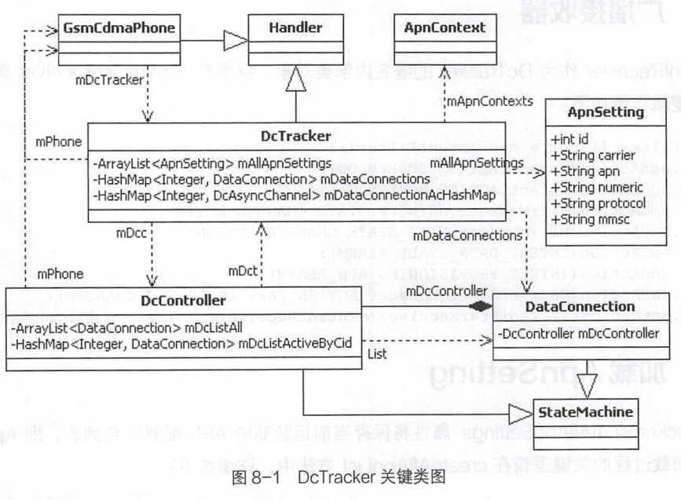
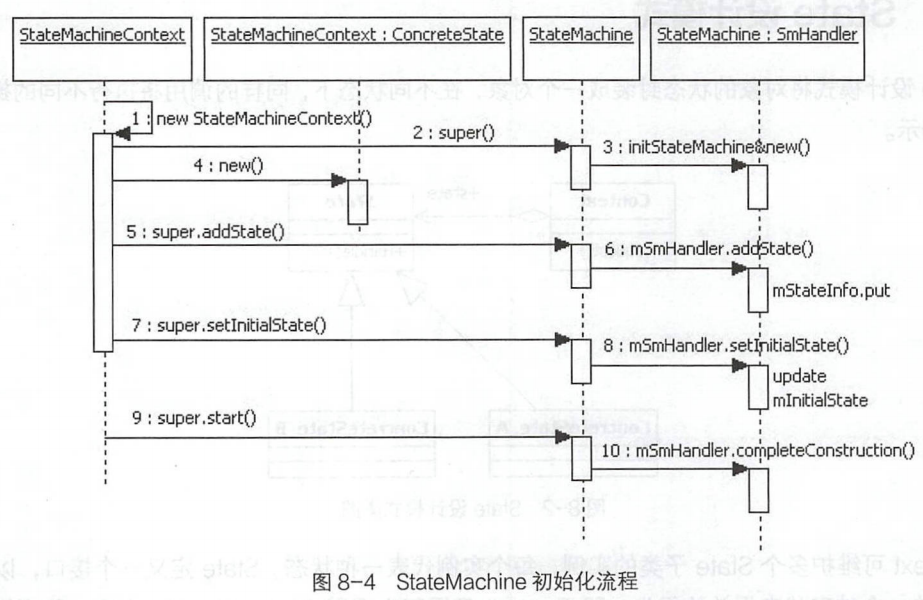

# 简述

- Android Telephony
  - `*#*#4636#*#*`测试工具如何进行信号实时变化
  - 如何切换飞行模式，同时切换无线、WiFi和蓝牙的连接
  - SIM卡的规格、业务、形态和驻网流程
  - 移动数据业务的核心DataCallTracker的初始化。
  - 状态模式StateMachine的类结构和初始化

# ServiceState网络服务

## `*#*#4636#*#*`测试工具

### 小区信息更新源头

- Radiolnfo界面通过向ITelephonyRegistry 系统服务注册小区信息变化的监听mPhoneStateListener.onCeIIInfoChanged接收到Callback 回调，获取当前最新的小区信息列表从而在Phone information界面显示。
- PhoneState 状态变化的消息源是com.android.phone进程中的GsmCdmaPhone对象，反推onCellInfoChanged,可追溯到ServiceStateTracker响应RILJ对象发出的EVENT_UNSOL_CELL_INFO_LIST 消息回调。经过mPhone.notify→Celllnfo→mNotifier.notifyCellnfo→mRegistry.notifyCellnfoForSubscriber调用过程，ltelephonyRegistry系统服务响应notifyCllInfoForSubscriber服务接口调用，最终遍历mRecords发出onCllnfoChanged调用，整个过程将传递Celllnfo列表对象。

### 信号实时变化

- 信号强度实时变化Phone information 界面的dBm控件展示了当前网络的信号强度，可通过它直接观察到信号强度的实时变化。
- 信号强度的实时更新实现机制与mCelllnfo 实时展示小区信息的原理是相似的，通过TelephonyManager注册PhoneStateListener.LISTEN_SIGNAL_STRENGTHS类型的监听完成信号强度更新的消息回调
- PhoneState 状态变化的消息源是com.android.phone进程中的GsmCdmaPhone对象，反推onSignalStrengthsChanged,可追溯到ServiceStateTracker响应RILJ对象发出的EVENT_ SIGNAL_STRENGTH_UPDATE和EVENT_GET_SIGNAL_ STRENGTH 消息回调。经过ServiceStateTracker.onSignalStrengthResult→mPhone.notifySignalStrength→mNotifier.notifySignalStrength→mRegistry.notifySignalStrengthForPhoneld调用过程，ITelephonyRegistry系统服务响应notifySignalStrengthForPhoneld 服务接口调用，最终遍历mRecords发出onSignalStrengthsChanged调用，整个过程将传递SignalStrength对象。
  - EVENT_GET_SIGNAL_STRENGTH消息是由ServiceStateTracker每隔20秒循环调用queueNextSignalStrengthPoll方法来查询当前最新的网络信号强度。
  - EVENT_ SIGNAL_STRENGTH_UPDATE则是RILJ根据变化的网络信号强度主动上报。

## 飞行模式

- 手机在飞行模式开启的情况下，将关闭所有的无线网络，包括无线通信模块、WiFi 和蓝牙
- Android平台飞行模式的实现机制。
  - 飞行模式开启关闭**入口**逻辑
  - 无线通信模块**响应**飞行模式开启关闭逻辑

### 飞行模式开启关闭入口逻辑

- 设置方式
  - 网络设置
    - 更新Settings.Global.AIRPLANE_MODE_ON 系统设置信息
    - 发出ACTION_AIRPLANE_MODE_CHANGED的广播
  - 通知栏快捷键
    - ConnectivityService系统服务提供了对飞行模式的控制接口setAirplaneMode，其处理逻辑和网络设置相同

### Radio模块开启关闭

- Intent.ACTION_AIRPLANE_MODE_CHANGED广播接收器中，开启或关闭Radio无线通信模块的处理逻辑是在PhoneGlobals类中。
- 流程PhoneAppBroadcast Receiver.onReceive接收到该广播之后，经过handleAirplaneModeChange→maybeTurnCellOff/ maybeTurnCellOn→
  setRadioPoweroff/setRadioPowerOn→PhoneUtils.setRadioPower→GsmCdmaPhone.setRadioPower()最终由GsmCdmaPhone对象的ServiceStateTracker对象向RILJ对象发起关闭或开启Radio无线通信模块的请求。

### WiFi模块开启关闭

- WifiServicelmpl中注册了Intent.ACTION_AIRPL ANE_MODE_CHANGED类型的广播接收器，在广播接收器中同步开关WiFi

### 蓝牙模块开启关闭

- BluetoothManagerService中监听Settings.Global.AIRPLANE_MODE_ON数据变化，完成蓝牙模块状态切换

## SIM卡业务

- SIM ( Subscriber ldentification Module )卡也称为用户身份识别卡，由CPU、ROM、RAM、EEPROM和I/O电路组成，与COS( Chip Operation System,芯片操作系统) 一起构成一个完整的计算机系统，具有独立的数据处理能力; COS控制SIM卡与外界交换信息，管理卡内存储器并在卡内完成各种命令的处理。
  - 电子式可擦除可编程只读存储器 （英语：Electrically-Erasable Programmable Read-Only Memory，简称：EEPROM或E2PROM），是一种只读存储器（ROM），可以通过电子方式多次复写。
- 规格
  - Full-size（FF）：与标准信用卡相同
  - Mini-SIM（2FF）
  - Micro-SIM（3FF）
  - Nano-SIM (4FF)
  - Embedded-SIM
- 业务
  - 存储功能：保存电话号码、短信等信息。
  - 安全管理：PIN、PIN2、PUK等安全管理。
    - PIN码（Personal Identification Number，又称PIN1码）：该密码可由用户自行设置，可用于开机解锁等操作，如果输错3次，SIM卡会被锁住，此时需要使用PUK码解锁
    - PUK码（Personal Unlock Key，又称PUK1码）：该密码由运营商提供，可用于在PIN码输错3次后解锁并重置PIN码，如果输错超过10次，SIM将无法继续使用，此时需要向运营商申请换卡
    - PIN2码：主要用于计费等，如果输错3次，SIM卡会被锁住，此时需要使用PUK2码解锁
    - PUK2码：该密码由运营商提供，可用于在PIN2码输错3次后解锁并重置PIN2码，如果输错超过10次，SIM将无法继续使用，此时需要向运营商申请换卡
  - 驻网鉴权：移动网络端匹配SIM卡内驻网鉴权的计算结果，保障只有运营商发出的合法SIM卡才能接入和使用其移动网络，达到身份验证的目的。
  - STK：STK ( SIM Tool Kit，SIM 卡应用工具包)运行卡内的小应用程序与手机用户进行交互，实现增值服务。
  - 业务通过APDU( Application Protocol Data Unit )与手机进行数据交互实现的，APDU可以是命令，也可以是命令的响应
- 形态
  - eSIM：又名嵌入式SIM（embedded-SIM），是一种直接嵌入设备（焊接在PCB板上）的可编程SIM卡。使用eSIM的手机、穿戴式装置、车载装置及未来物联网等设备可以无需配有SIM卡卡槽，用户不用插入实体SIM卡就能开通移动网络运营商提供的电信服务，当更换移动网络运营商时，运营商根据用户的更换请求，通过网络推送SIM配置文件至用户设备。
    - 面向物联网M2M ( Machine to Machine)的eSIM规范
    - 面向消费者可穿戴设备的eSIM规范
  - SoftSim：即用软件模拟SIM卡业务。因没有物理卡存在，与eSIM相似均采用空中发卡机制，由软件模拟SIM卡COS系统中的APDU响应来完成SIM卡的驻网鉴权。

### 驻网过程分析

- GSM网络的鉴权采用A3A8算法，又称Comp128算法，3G、4G网络的鉴权采用的则是Milenage算法。
  - A3A8：在手机注册移动网络的时候，移动网络会产生一个128 位16字节的随机数据RAND发送给手机，手机再将这个数据发给SIM卡，SIM卡使用自己的密钥Ki和RAND做运算以后，生成一个32位4字节的应答SRES发回给手机，最后发送到移动网络;移动网络收到SRES后进行相同运算，比较手机端和本地的运算结果是否相同，相同就说明这个卡是合法的，准其注册和使用移动网络服务。这个算法在GSM规范里面叫作A3, m= 128bit, K= 128bit, c= 32bit。这个算法要求已知m和k可以很简单地算出c,但是已知m和c却很难算出k。SIM卡计算出SRES后，还会使用RAND和K计算出通信过程中加密使用的密钥Kc,密钥Kc的长度是64位8字节，生成密钥K的算法是A8，因为A3和A8算法的输入参数完全相同，所以在实现的时候使用了同一个函数，同时生成SRES和Kc，因此统一称为A3A8算法。
  - 在通信过程中加密算法叫作A5。

### SoftSim 业务实现分析

1. 模拟SIM卡App应用：模拟COS ( Chip Operation System,芯片操作系统)对SIM卡的管理，完成APDU命令的响应逻辑，主要集中在模拟SIM卡文件系统和Milenage驻网鉴权算法这两个方面。
2. 打通与应用 APDU通道：将Modem与实体SIM卡的APDU交互完成驻网鉴权，修改为与AP侧SoftSim应用APDU交互，并扩展RIL接口，打通BP与AP侧APDU的数据交换通道。
   - 需要从技术上保障空中发卡过程中、 本地保存和使用的 SIM 卡信息不被泄露。将SIM卡、Ki、Kc等敏感信息进行非对称加密传输和保存，并在TEE ( Trusted Execution Environment )、QSEE ( Qualcomm Secure Execution Environment )等可信执行环境中解密及使用。

# Data Call移动数据业务

## DataCallTracker

- TeleService系统应用在加载Telephony业务模型的过程中，会同步创建DcTracker 对象。
- 构造方法业务逻辑
  - Handler 消息注册
  - 初始化 ApnContext
  - 创建DcController对象
  - 注册Observer
  - 注册广播接收器
- 

### Handler消息注册

- 调用registerForllEvents和registerServiceStateTrackerEvents两个方法的调用
  - DcTracker主要向RILJ、 GsmCdmaCallTracker、 ServiceStateTracker 三个对象发起HandlerMessage消息注册。
  - DcTracker注册的Handler消息类型，以DctConstants. EVENT_XXX为主。
  - DcTracker作为自定义的Handler对象，在发起Handler Message消息注册时，传入this对象，并在handleMessage方法中响应Message消息回调。

### 初始化ApnContext

1. 创建string数组networkConfigStrings从xml配置文件中获取mobile移动数据上网和mobile mms彩信移动数据上网等配置
2. 循环networkConfigStrings数组，首先根据网络配置的String 字符串信息创建NetworkConfig对象，然后使用NetworkConfig对象构造ApnContext对象。最后保存ApnContext对象。
3. 创建并保存 ApnContext 对象到mApnContexts、mApnContextsByid、mPrioritySortedApnContexts三个集合中
   - mPrioritySortedApnContexts列表中将根据ApnContext对象的priority属性(即config.xml配置信息的倒数第二个选项: 网络配置的优先级)排序; 
   - 优先级从高到低依次是: hipri、 mms、supl、 cbs、dun、fota、 ims、default、 ia、 emergency。

- NetworkConfig 和ApnContext的关系
  - NetworkConfig 对象的type属性( config.xml配置字符串中的第二个配置项)为ConectivityManager.TYPE _MOBILE _XXX, 对应关系可参考initApnContexts的switch分支处理逻辑。因此，3个集合中均保存了10 个ApnContext对象列表。

### APN

- APN ( Access Point Name )是Android手机实现移动数据上网业务必须配置的参数，用来决定手机通过哪种接入方式来访问网络，其配置信息全部记录在telephony.db 的SQLite数据库中名为carriers的表中。

- 配置关键字段

  - | 字段     | 说明                            |
    | -------- | ------------------------------- |
    | name     | APN配置名称                     |
    | numeric  | 运营商编号                      |
    | apn      | APN接入点，中国移动cmwap和cmnet |
    | Proxy    | 代理服务器地址                  |
    | port     | 端口号                          |
    | mmsproxy | 彩信代理服务器地址              |
    | mmsport  | 彩信代理服务器端口号            |
    | mmsc     | 彩信接入服务地址                |
    | type     | APN接入类型                     |

#### 增加APN配置

- 方法
  - 修改配置文件
    - 对应的xml配置文件在Android 8.1源码中的路径是:device/huawei/angler/apns-full-conf.xml。
    - 由TelephonyProvider中的initDatabase方法将apns-full-conf.xml文件中的APN信息插入到carriers数据库表中
  - APN配置管理界面
    - APN配置管理界面的进入路径是Settings→Network&Internet→Mobile network→ Access PointNames,在该界面中可手动修改APN配置，同时，提供的Reset to default功能可重置为默认配置信息。

### 创建DcController

- DcTracker的mDcc属性是DcController类型。DcController类继承自StateMachine 类，其有一个内部类DccDefaultState 对象mDccDefaultState，继承自State类。StateMachine实现了State状态模式。

### 注册Observer

- 在DcTracker的构造方法中完成了mApnObserver 和mSettingsObserver两个对象的创建，并且完成了Observer的注册。
  - mApnObserver监听Telephony.Carriers.CONTENT_URI，即Telephony数据库Carriers表中保存的APN信息是否发生改变; ApnObserver的onChange 方法响应APN配置信息的变化，通过sendMessage(obtainMessage(DctConstants.EVENT_ APN_ CHANGED))发 出Handler消息，最终由DcTracker的handleMessage方法响应。
  - mSettingsObserver则监听Settings.Global.DEVICE PROVISIONING_ MOBILE_DATA_ENABLED、Settings.Global.DATA_ ROAMING和Setings.Global.DEVICE_PROVISIONED数据库更新。

### 广播接收器

- mIntentReceiver作为DcTracker的匿名内部类对象，继承自BroadcastReceiver类。

### 加载ApnSetting

- DcTracker的mllApnSettings属性将保存当前运营商的APN配置信息列表，即ApnSetting对象列表。

## StateMachine

- StateMachine状态机类实现了State 设计模式，主要体现在蓝牙、Wifi 和Telephony三个模块中。
- 状态模式：在状态模式（State Pattern）中，类的行为是基于它的状态改变的。这种类型的设计模式属于行为型模式。
  - 意图：允许对象在内部状态发生改变时改变它的行为，对象看起来好像修改了它的类。
  - 主要解决：对象的行为依赖于它的状态（属性），并且可以根据它的状态改变而改变它的相关行为。
  - 何时使用：代码中包含大量与对象状态有关的条件语句。
  - 如何解决：将各种具体的状态类抽象出来。

### 类结构

- 
  - StateMachine 类对外提供状态相关操作的接口方法，而 SmHandler 类则是作为 StateMachine 状态机的核心，负责 Handle消息的发送和接收，用来管理和更新 State 对象。

### 初始化

- 