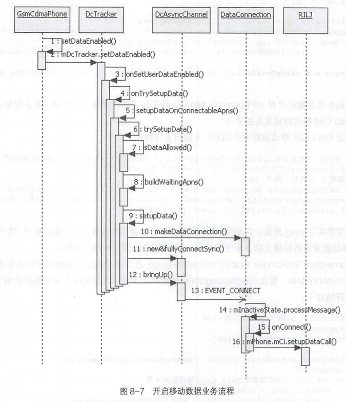
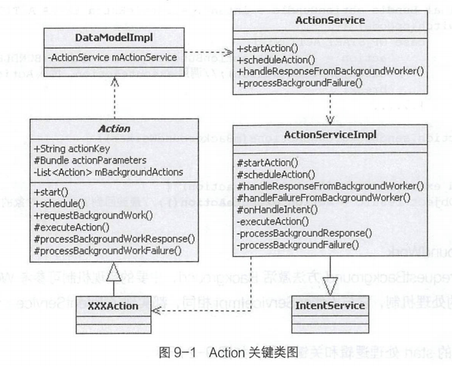

# 简述

- Android Telephony

  - 状态模式StateMachine的运行流程、以及state的责任链模式

  - 数据连接DataConnection的属性、方法以及状态切换

  - 开启移动数据流程和关闭移动数据流程

  - 如何对Android手机进行抓包

  -  SMS&MMS业务的短信发送流程

# Data Call移动数据业务

## StateMachine

### 运行流程

- 
  - SmHandler对象的handleMessage方法作为StateMachine的消息入口。DcController作为StateMachine的子类，调用getHandler方法将返回mSmHandler对象，RILJ对象发起EVENT_ DATA STATE_CHANGED的Message消息回调时，由SmHandler对象的handleMessage方法进行响应。
    - 在processMsg方法的处理逻辑中，完成了切换状态的前置任务，更新了mDestState,切换操作是在performTransitions方法中完成的。
    - 切换操作核心思想是根据mDestState设置mTempStateStack,然后再将mTempStateStack更新到mStateStack中，最终完成状态切换工作。
    - ConcreteState对象的exit和enter响应过程：performTransitions将更新当前状态，因此涉及新旧状态ConcreteState对象的响应，调
      用旧状态ConcreteState对象的exit 方法，退出当前状态;调用新状态ConcreteState 对象的enter方法，进入当前状态。

## DataConnection

- DataConnection (数据连接)类在Telephony业务模型中管理移动数据业务，一个DataConnection对象代表手机移动数据业务的一个数据连接。

### 类结构

- 

#### 关键属性

- 在DataConnection切换过程中或是不同的连接状态下，分别由这六个mXXXState对象的enter、exit 和processMessage三个方法响应不同的业务逻辑
- 具有GsmCdmaPhone、DcTracker 对象的引用。
- 保存ApnSetting和ApnContext配置信息。

#### 关键方法

- 包括对象创建、Data Call操作和消息通知
- DataConnection对象必须通过public static类型的makeDataConnection方法来创建，它的构造方法是private类型的。
- Data Call操作和消息通知对应的方法都是私有的，这些方法的调用方都是六大State对象。

### 状态切换

- 
  - DcInactiveState作为初始化状态，所有的状态转换最终都将回到此状态。

## 开启移动数据

- 开启关闭移动数据方式
  - 通知栏 Mobile data快捷控制
  - Mobile network设置界面
- 成功开启移动数据业务后可查看上网的基本信息：adb shell ifconfig
- 调用过程：TelephonyManager.setDataEnabled→ITelephony(PhoneInterfaceManager).setDataEnabled→phone.setDataEnabled→mDcTracker.setDataEnabled
- 流程:
  - mDcTracker.setDataEnabled()方法通过CMD_SET_USER_DATA_ENABLE类型的Handler 消息，转换成onSetUserDataEnabled方法调用
  - onSetUserDataEnabled()方法有两个逻辑处理分支:开启移动数据业务和关闭移动数据业务。
  - setupDataOnConnectableApns()方法中从优先级高的ApnContext对象开始遍历mPrioritySortedApnContexts列表，并判断ApnContext是否可连接。
  - setupData()
    - 使用createDataConnection方法创建DataConnection对象，并建立两个Handler消息传递通道AsyncChannel。
    - ApnContext和ApnSetting对象最后更新并建立关联。
    - 使用GsmCdmaPhone对象发出DataConnection变化消息通知。
    - 使用bringUp激活移动数据业务。
  - createDataConnection()
    - DataConnection.makeDataConnection创建DataConnection对象并启动StateMachine。
    - DcTracker对象的mDataConnections属性保存了DataConnection列表。
    - DcAsyncChannel打通了DcTracker 和DataConnection的两个Handler消息传递通道。
  - 最终需要RIL完成Data Call移动数据业务的处理，处理之后，发起 Callback 调用，DataConnection. SmHandler 对象的 handleMessage 方法进行晌应，根据状态由相应的状态子类进行处理
    - 根据RIL激活Data Call移动数据业务的返回信息,判断并获取激活Data Call移动数据业务的处理结果。再根据处理结果切换数据连接DataConnection状态。

### 前置条件分析

- isConnectable
  - 在setupDataOnConnectableApns方法中遍历mPrioritySortedApnContexts,找出isConnectable的ApnContext对象来激活移动数据业务
    1. 关注mState的状态，发现并不是CONNECTING、CONNECTED和DISCONNECTING这三个状态，因此都返回true
    2. 根据配置文件信息，isReady的条件判断和mDependencyMet 都默认为true。
    3. isConnectable的条件判断中，最关键的就是mDataEnabled,它在构造方法中默认为false。 TelephonyNetworkFactory 类可以改变mDataEnabled属性，这个类继承自NetworkFactory 。
- isDataAllowed
  - 不在紧急呼救业务中，internalDataEnabled 为true。
  - DcTracker.mAttached为true, Data Reg移动数据网络注册成功。
  - Radio Power为开启状态desiredPowerState和radioStateFromCarrier。
  - SIM卡加载完成，recordsLoaded为true。
  - 默认上网卡与当前DcTracker保持一致， 为defaultDataSelected。
- buildWaitingApns
  - DcTracker的buildWaitingApns 方法传递的参数是ApnContext 的requestedApnType 和radioTech,返回ApnSetting对象列表
    - 调用 getPreferredApn方法获取ApnSetting对象列表。getPreferredApn方法获取ApnSetting对象，通过缓存的id在mllAnSettings中进行匹配，缓存过程是调用setPreferredApn 方法实现的。第一次匹配是ApnContext的mApnType与ApnSetting的String 类型数组中的信息进行匹配;第二次匹配是注册数据网络radioTech与ApnSetting配置的bearerBitmask进行匹配。最终返回APN类型匹配、radioTech 匹配的ApnSetting列表。
    - 直接使用mAllApnSettings列表匹配ApnSetting对象。

### DcActiveState收尾工作

- DataConnection与RILJ交互，RIL的setupDataCall成功之后,状态mActivatingState将转换为mActiveState,根据StateMachine的处理机制，将调用此状态的enter方法，enter的处理逻辑
  - 更新mNetworkInfo:调用NetworkInfo 的setSubtype、setRoaming、 setDetailedState 和setExtraInfo方法来更新mNetworkInfo。
  - 注册消息:通过mPhone.getCallTracker).registerForXXX调用，向GsmCdmaCallTracker注册EVENT_DATA_CONNECTION_VOICE_CALL_STARTED和EVENT_ DATA_CONNECTION_VOICE_CALL_ENDED消息，Handler对象是SmHandler。
    - 在开启移动数据的情况下，DcActiveState将响应VoiceCall变化的消息回调，通过GsmCdmaCallTracker获取当前通话状态,将通话非IDLE状态设置为NetworkInfo.DetailedState.SUSPENDED。IDLE 状态设置为NetworkInfo.DetailedState.CONNECTED。
  - 保存 DataConnection对象到DcController.mDcL istActiveByCid列表。
  - 创建DcNetworkAgent对象。
    - DcNetworkAgent是DataConnection的内部私有类，将建立NetworkAgent 与ConnectivityService 之间的mTrackerHandler AsyncChannel消息通道。
    - 作用:在网络状态和能力信息发生改变时，使用mNetworkAgent.sendLinkProperties、mNetworkAgent.sendNetworkCapabilities 和mNetworkAgent. sendNetworkInfo调用,通过AsyncChannel消息通道向ConnectivityService发送网络信息变化的最新信息。

## 关闭移动数据

- 
  - onCleanUpAllConnections 方法响应移动数据业务关闭请求。
  - 循环mApnContext通过ApnContext对象获取到对应的DcAsyncChannel,发起tearDown或tearDownAll请求。
  - 除了发出EVENT_DISCONNECT还可以发出EVENT_DISCONNECT_ALL消息请求。DataConnection SmHandler对象响应此消息，交给当前状态mActiveState处理。
  - DataConnection.tearDownData()调用mPhone.mCi.deactivateDataCall(),回调Message消息类型是EVENT_DEACTIVATE_DONE。

## 获取Android手机上网数据包

- 流程

  - 获取上网数据包。

    - ```shell
      //抓取TCP数据包，将数据文件保存在虚拟设备的/sdcard/目录下的tcp.pcap文件中，可修改数据文件保存的目录
      adb shell tcpdump -i any -p -s 0 -w /sdcard/tcp.pcap
      //将抓取的TCP数据包路径复制到计算机当前目录下
      adb pull /sdcard/ tcp.pcap .
      ```

  - Wireshark分析数据。

# SMS&MMS业务

- 短消息业务( ShortMessaging Service, SMS )和彩信业务( Multimedia Messaging Service, MMS )。
  - 发送MO ( Mobile Originate )
  - 接收MT ( Mobile Terminate )

## 短信发送流程

### 进入短信应用

- 对应的Java代码是ConversationListActivity.java， 短信应用package 包路径为com.android.messaging。

### 短信编辑发送

- 
  - 点击发送短信按钮，其响应事件是调用ConversationMessageView 类的sendMessageInternal()方法
    - 如果短信验证成功，将调用mHost.sendMessage (message)，即ConversationFragment类的sendMessage方法开始发送Message。之后会调用InsertNewMessageAction类的insertNewMessage方法，InsertNewMessageAction继承自Action 类。
      - 先将message信息插入数据库表中。然后从数据库读取MessageData
      - 发起MmsUtils.sendSmsMessage()调用

- sendSmsMessage()
  - 拆分长短信 :如果短信中的内容超过160 个字节，将拆分成多条短信进行发送，divideMessage()和fragmentText()的返回值是`ArrayList<String>`,即长短信分割后的短信内容列表。
  - fragmentText()的短信拆分逻辑:拆分后的第一条短信长度没有达到一条短信的最大长度，这是由于拆分后的短信头中需要保存其短信的序列号，因此短信头增加了长度。而且长短信不能按照普通短信发送，否则，短信的接收端无法将长短信按照拆分后的短信序列号顺序重新拼接成为一条长短信。
  - 创建MESSAGE_DELIVERED_ACTION和MESSAGE_SENT_ACTION两个Intent对象，class为SendStatusReceiver, 最后添加到deliveryIntents 和sentIntents PendingIntent 中。
  - 调用lSms服务的sendMultipartTextForSubscriber接口发送长短信，调用sendTextForSubscriber接口发送普通短信,判断条件是`ArrayList<String>`的size,大于1发送长短信,否则发送正常短信。
  - SmsManager代码空间和运行空间:SmsManager在framework代码库中，供所有Android应用使用，运行在Messaging应用空间。它提供了短信拆分、短信发送、将短信复制到SIM卡上、从SIM卡上删除短信和小区广播等操作接口。

#### Action处理机制

- 
  - Action抽象类实现了Parcelable 接口，有28个子类，提供的start和schedule方法将调用DataModel的静态方法startActionService和scheduleAction,传入的参数是Action对象。
  - DataModellmpl作为普通Java类，继承自DataModel抽象类，并实现了其抽象方法;其startActionService和scheduleAction方法逻辑通过mActionService发起startAction和scheduleAction调用。
  - ActionService作为普通Java类,提供了五个ActionServicelmpl静态方法的代理调用。
  - ActionServicelmpl继承自IntentService 类，其提供的五个静态方法中的主要处理逻辑是启动ActionServicelmpl服务，onHandleIntent 则返回后台执行耗时的异步任务。
  - Action.executeAction是运行在后台的异步任务，使用了Android IntentService 的运行机制，而Messaging应用使用Action,并不关心如何异步以及后台调度等处理机制。