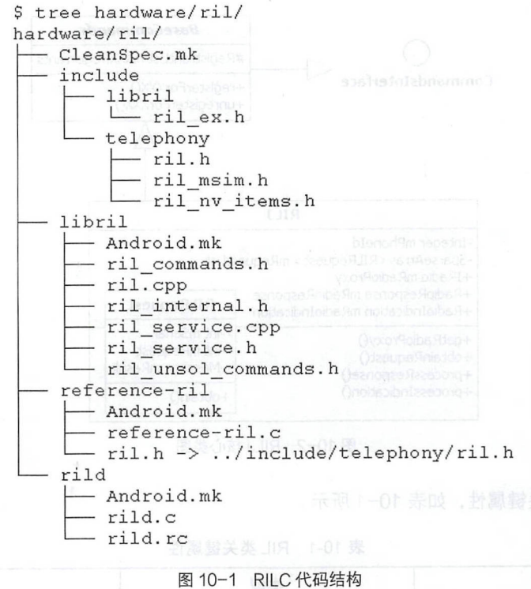
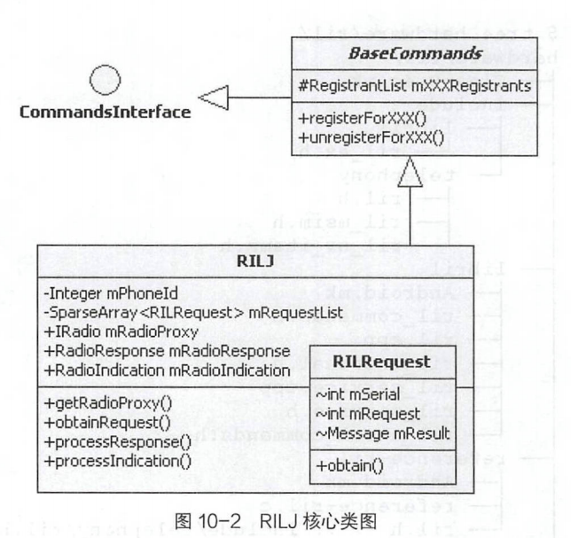

# 简述

- Android Telephony
  - 短信发送流程中sendTextForSubscriber()
  - RILJ响应短信发送回调业务：确认发送，重发机制，状态报告
  - 短信接收流程中的RIL接收、GsmlnboundSmsHandler处理，以及StateMachine状态机和Messaging 应用接收
  - 彩信的发送入口Imms系统服务、发送处理流程中请求、Http网络的消息处理机制和接收彩信
  - RIL的RILJ类结构和IRadio关联的服务
  - RIL消息：Solicited Request、Solicited Response和Unsolicited 

# SMS&MMS业务

## 短信发送流程

#### phony进程中的短信发送流程

- ISms系统服务运行在com.android.phone 进程空间，接口定义为ISms.aidl，UiccSmsController.java 实现了ISms
- isms 系统服务是在加载Telephony业务模型时，同步完成的初始化和系统服务的发布：在PhoneFactory.makeDefaultPhone逻辑中，通过ProxyController.getInstance调用创建ProxyController对象,再在ProxyController 的构造方法中创建UiccSmsController对象。
- UiccSmsController对象的sendTextForSubscriber方法响应Messaging应用发起的发送短信请求调用。
- 
  - SMSDispatcher是抽象类，主要有getFormat、sendText、 sendSms和sendSmsByPstn等抽象方法，其三个子类分别是CdmaSMSDispatcher、GsmSMSDispatcher 和ImsSMSDispatcher,，它们分别作为Cdma、Gsm和Ims类型的短信分发器。
  - getSmsTrackerMap()和getSmsTracker创建SmsTracker对象，mData是getSmsTrackerMap()根据destAddr、scAddr、text 和pdu ( Protocol Data Unit,短信协议数据单元)等参数，创建的HashMap; mSentIntent 和mDeliveryIntent 则是Messaging 应用传过来的回调PendingIntent对象。
  - sendSmsByPstn作为发送短信流程中SMSDispatcher对象最后调用的方法，将创建EVENT_ SEND_SMS_COMPLETE类型的Message对象和mCi.sendSMS向RILJ发起发送短信接口调用，将发送短信请求转换成RIL的处理逻辑。

### RILJ回调处理业务

- 分类
  - 确认短信发送结果
  - 重发机制
  - 状态报告

#### 确认短信发送结果

1. SMSDispatcher调用mCi.sendSMS发送短信，回调的Message对象是SMSDispatcher创建的EVENT_SEND_SMS_COMPLETE类型Message。
2. SMSDispatcher 作为自定义的Handler消息处理对象,在handleMessage方法中响应EVENT_SEND_SMS_COMPLETE类型Message消息。
3. 在SMSDispatcher对象的handleMessage方法中调用handleSendComplete方法，传入的参数msg.obj对象中将保留SmsTracker对象。
4. 将在Messaging应用中由SendStatusReceiver接收短信发送成功消息。

#### 重发机制

- SMSDispatcher 对象的 handleSendComplete 方法响应 RILJ 返回的短信发送结果，该方法有一个分支逻辑，分别为发送成功和发送异常
- 发送异常会尝试重发，即重发次数为3,重发时间间隔为2秒。
- 流程：handleMessage.EVENT_SEND_RETRY→sendRetrySms→mlmsSMSDispatcher.sendRetrySms→mGsmDispatcher.sendSms→sendSmsByPstn。
  - 整个过程将传递SmsTracker,最后调用SMSDispatcher的sendSmsByPstn方法重发短信。

#### 状态报告

- 短信发送状态报告:手机通过移动网络将短信成功发送到运营商的短信中心，短信中心再经过短信路由将短信成功发送给短信接收方，并将短信成功发送到短信接收方的消息发给短信发送方
- handleSendComplete中仅能确认短信成功发送到运营商的短信中心,而短信发送状态报告的作用和目的是精确地标识短信已被对方正常接收。
- 短信发送状态报告是MT类型的消息，Modem最先接收到，然后将消息分发给RIL，再由RILJ对象发出EVENT_NEW_SMS_STATUS_REPORT类型的Message消息。将在Messaging应用中由SendStatusReceiver接收短信状态报告,短信应用界面展示的短信发送状态将增加显示“√”

### 短信接收流程

#### RIL 接收短信消息

- RILJ接收到UNSOL_RESPONSE_NEW_SMS类型的消息，找到Radiolndication类中的newSms方法，将发出mRil.mGsmSmsRegistrant.notifyRegistrant消息通知。而mGsmSmsRegistrant的注册方为GsmInboundSmsHandler

#### GsmlnboundSmsHandler

- 

1. GsmInboundSmsHandler继承自抽象类InboundSmsHandler,而InboundSmsHandler又继承自StateMachine 类。
   - 共有五个状态对象: mDefaultState、mStartupState、mldleState、mDeliveringState 和mWaitingState,设置的初始化状态是mStartupState。
2. 在创建GsmCdmaPhone对象的过程中，同步创建了GsmInboundSmsHandler对象，完成了EVENT_NEW_SMS消息注册和StateMachine初始化操作。
3. 在GsmInboundSmsHandler的初始化过程中，ImsSMSDispatcher构造方法中初始化调用SmsBroadcastUndelivered.initialize, 发出InboundSmsHandler.EVENT_START_ACCEPTING_SMS 消息，将GsmInboundSmsHandler的状态切换到mldleState状态。
4. mldleState 的processMessage方法响应EVENT_NEW_SMS消息，执行deferMessage和transitionTo(mDeliveringState);接着mDeliveringState 状态将响应EVENT_NEW_SMS消息，调用handleNewSms方法。
5. handleNewSms()方法中，在dispatchNormalMessage方法中创建InboundSmsTracker对象;在addTrackerToRawTableAndSendMessage 方法中调用addTrackerToRawTable方法记录数据库并发送EVENT_BROADCAST_SMS消息，其参数是InboundSmsTracker对象。
6. 在EVENT_BROADCAST_SMS中
   - processMessagePart发出新短信广播：在processMessagePart中调用filterSms 方法来过滤接收到的短信，再发起dispatchSmsDeliveryIntent调用，主要逻辑是创建Intent对象。dispatchIntent调用sendOrderedBroadcastAsUser发出广播。
   - transitionTo(mWaitingState)：mWaitingState的主要作用是对新短信广播超时的处理
7. SmsBroadcastReceiver接收到新短信广播后，发出EVENT_BROADCAST _COMPLETE类型的消息，即mWaitingState退出短信广播发送超时处理机制。、
8. 接收到新消息后，最终发出的广播Action为Intents.SMS_RECEIVED_ACTION, 即android.provider.Telephony.SMS_ RECEIVED。

#### Messaging 应用接收新短信

- 操作
  - 在通知栏展示接收到新短信
  - 将短信内容保存到本地数据库中

1. Messaging应用的SmsReceiver广播接收器将接收GsmInboundSmsHandler发出的新短信消息广播通知android.provider.Telephony .SMS_RECEIVED。
2. SmsReceiver类的onReceive 方法接收到广播后，首先调用deliverSmsIntent 方法，接着调用deliverSmsMessages方法。
   1. 解析短信内容：getMessagesFromIntent方法首先在intent 对象中获取pdu 和format 两个信息，最后调用SmsMessage.createFromPdu(pdu, format)创建SmsMessage对象。
   2. 启动 ReceiveSmsMessageAction：ReceiveSmsMessageAction作为Messaging应用中的Action子类，调用start方法，在后台激活executeAction异步任务，将短信保存到数据库中，并发起新短信的通知栏显示。
3. 最后发出新短信的状态栏消息通知。

#### PDU

- 短信的发送和接收流程PDU的转换都是通过SmsMessage的两个静态方法完成的。

  - 短信发送流程中，将发送的短信内容转换为PDU信息后再发送给RILJ对象，最终将短信发送给短信接收方。
    - getSubmitPdu将文本信息转换为pdu byte数组。

  - 短信接收流程中，RILJ通过Telephony Framework 框架层将接收到短信的PDU信息发送给Messaging应用，转换为接收到的短信内容后，再展示给手机用户
    - createFromPdu将pdu byte数组转换为文本信息并创建SmsMessage对象

## 彩信

- 彩信业务MMS可看作短信业务SMS的扩展和升级，它突破了短信业务仅能收发文本信息的限制，可发送和接收多媒体信息。
- 彩信业务的设计基于WAP协议，作为WAP协议层上的网络应用，因此，在收发彩信的时候，可以传输多媒体信息。
- 
  - MmsService。提供了发送和接收彩信的接口，imms服务的实现是MmsServiceBroker,它代理MmsService服务。
  - MmsRequest模板类。实现了发送或接收彩信关键四个步骤的调度模板，首先请求MMS类型的Data Call 移动数据业务，接着加载ApnSetting,然后通过http下载或发送彩信内容，有Send和Download两个子类，最后由releaseNetwork释放Data Call移动数据业务。
  - MmsNetworkManager负责请求或释放MMS类型的Data Call移动数据业务。
  - MmsHttpClient负责http 数据传输，实现了数据的上传和下载。

### 彩信发送入口

- SmsManager提供了短信的发送入口，同样sendMultimediaMessage提供了彩信的发送入口
- 在Messaging应用中，短信发送流程和彩信发送流程基本一致 ，都是通过SendMessageAction的doBackgroundWork方法在后台异步执行，根据发送内容是短信或是彩信有两个处理分支。SmsManager的sendMultimediaMessage 方法的主要逻辑是获取imms系统服务，并调用imms.sendMessage()方法来发送彩信

#### imms 系统服务

- imms 系统服务的接口定义文件是IMms.aidl,接口实现是MnsService.java,包名 com.android . mms .service
- 运行资源信息：运行在 com.android . phone 进程空间，用户 id 是 android.uid.phone ，即 radio用户。
- MmsService 服务： MmsService 应用中仅有 com.android.mms.service. MmsService 服务
- IMms接实现了两个类: MmsServiceBroker 和MmsService。
  - imms系统服务是MmsServiceBroker服务在system_server系统进程启动过程中加载的，在onStart方法中调用publishBinderService("imms",new BinderService())增加了 名字为imms 的系统服务，
  - BinderService实现了IMms.Stub ,实现的接口处理逻辑是代理MmsSenvice服务对应的接口。首先绑定MmsService服务获取Client Binder对象,再通过Binder对象调用代理MmsService服务提供的服务接口。

### 彩信发送流程

- sendMessage响应发送彩信调用
  1. 创建SendRequest
  2. addSimRequest→addToRunningRequestQueueSynchronized
     - 调用getNetworkManager方法将创建MmsNetworkManager对象，并保存在mNetworkManagerCache缓存列表中。在创建MmsNetworkManager对象的逻辑中，最关键的是创建NetworkRequest对象,NetworkRequest的execute 方法中的业务逻辑：
       1. acquireNetwork请求MMS移动数据业务。
       2. ApnSettings.load加载MMS类型的APN设置信息。
       3. doHttp创建http连接发送彩信内容。
       4. releaseNetwork释放网络资源。

#### Data Call

- 
  - 对connectivityManager.requestNetwork()的调用，由ConnectivityService系统服务响应requestNetwork()接口调用。requestNetwork()的参数 mNetworkRequest请求NetworkCapabilities.NET_CAPABILITY_MMS类型的数据连接。ConnectivityService接收到mNetworkRequest请求后，调用sendUpdatedScoreToFactories方法，遍历mNetworkFactoryInfos列表发送网络请求
    -  nfi.asyncChanel.sendMessage使用AsyncChannel发送的Handler消息，com.android.phone进程中TelephonyNetworkFactory对象的needNetworkFor方法响应。发起DcTracker 对象的requestNetwork 调用，从而更新MMS类型ApnContext对象的可用状态为true,最终调用trySetupData,创建MMS类型的Data Call 移动数据业务。
    -  DataConnection成功发起MMS类型Data Call进入DcActiveState状态,创建DcNetworkAgent对象，向ConnectivityService发起registerNetworkAgent请求，经过ConnectivityService服务的处理，最终调用notifyNetworkCallbacks,由NetworkRequestCallback对象接收网络请求的结果。
    -  NetworkRequestCallback响应网络请求回调。更新mNetwork并发出MmsNetworkManager.thisnotifyAll,结束MmsNetworkManager等待。
    -  MmsNetworkManager对象的acquireNetwork调用有两种处理结果: MMS数据连接成功建立，返回void;抛出异常。

#### doHttp

- MmsRequest作为抽象类,它的两个子类SendRequest和DownloadRequest分别实现了doHttp抽象方法，这两个子类分别承载发送彩信和接收彩信的处理逻辑。
- SendRequest类的doHttp方法将创建MmsHttpClient对象并执行其execute方法，该方法中是一个非常标准的基于Http网络的消息处理机制，同时也说明了彩信业务是基于MMS类型的Data Call移动数据业务的网络应用。

### 接收彩信

1. 接收到一条彩信 , InboundSmsHandler的DeliveringState将首先接收到一条比较特殊的短信，在调用processMessagePart方法时，若判断接收的端口号是2948,则按照WAP Push的方式处理。
   - WAP Push叫作服务信息或推入信息，是一种特殊格式的短信，其类型和功能比较多，如SI、SL类型的WAP Push,或者OMA OTA (通过WAP Push更新本地APN配置)等功能。
2. 接着调用WapPushOverSms.dispatchWapPdu方法,将创建Action 为Intents.WAP_PUSH_DELIVER_ACTION 类型的Intent 对象，再次调InboundSmsHandler对象的dispatchIntent 发出广播通知，SmsBroadcastReceiver接收到此广播，将Action 转换为Intents.WAP_PUSH_RECEIVED_ACTION类型消息，第二次调用dispatchIntent 发出接收到WAP Push 消息的广播通知。即android.provider.Telephony.WAP_ PUSH_ RECEIVED 类型的广播，Messaging应用中的MmsWapPushReceiver将接收此广播,并激活ReceiveSmsMessageAction的executeAction后台异步处理机制。executeAction 处理逻辑
   1. 记录数据库
   2. 调用ProcessPendingMessagesAction.scheduleProcessPendingMessagesAction
      - 显示彩信基本信息，提供界面让用户手动下载彩信内容。
      - 激活DownloadMmsAction下载彩信内容。
      - 两个处理分支只是激活方式不同，最终的结果都是调用imms系统服务的downloadMessage进入运营商的彩信服务器，通过Http下载彩信内容。

# Radio Interface Layer

- 

- Radio Interface Layer (无线通信接口层，RIL) 运行在Android硬件抽象层(HAL)之上

  - Telephony RILJ

  - HAL层中的C/C++程序统一称为RILC
    - 
      - RIL .C将编译出rild 可执行文件和libril.so和libreference-ril.so两个动态库。
      - 头文件：在ril.h 头文件中，主要定义了以RIL开头的RIL_Init、RIL_register、RIL_ onRequestComplete等函数和RIL_Env、RIL_RadioFunctions 等结构体，以及RIL_REQUEST_XXX和RIL_UNSOL_XXX等RIL消息。
      - libril：主要有ril_ commands.h和ril_unsol_commands.h头文件，以及ril.cpp和ril_service.cpp 两个重要的C++代码文件。
      - reference-ril：依赖于libril。 作为Android源码中ril的参考实现，实现了RIL AT命令的交互机制;该目录下的ril.h头文件，是一个
        链接文件。
      - rild：rild.c文件编译出rild可执行文件，依赖于libril

## RILJ

- RILJ对象与Telephony业务模型产生最直接的交互，完成Telephony核心业务
- 
  - package包路径统一是 com.android.internal.telephony
  - RIL类继承自BaseCommands抽象类并实现了CommandsInterface接口。RIL 类的对象统一称为RILJ对象，Telephony业务模型中三大Tracker和SMSDispatcher等对象的mCi属性，就是RILJ对象，ci 即CommandsInterface的缩写。
  - BaseCommands抽象类mXXXRegistrants和mXXXRegistrant保存监听CallBack的消息对象，提供注册和取消注册的管理方法registerXXX和unregisterXXX。
  - RIL类有一个内部类RIL Request,作为RIL请求对象的封装类，提供mSerial请求序列号、mRequest请求类型和mResult消息回调对象等属性，提供静态方法obtain来统一创建RILRequest对象。

### RIL类的关键属性

- | 属性             | 类型                      | 描述                                   |
  | ---------------- | ------------------------- | -------------------------------------- |
  | mPhoneld         | Integer                   | Phoneld                                |
  | mRilVersion      | int                       | RIL版本号                              |
  | mState           | RadioState                | RADIO_UNAVAILABLE、RADIO_OFF、RADIO_ON |
  | mXXXRegistrants  | RegistrantList            | 39个mXXXRegistrants                    |
  | mXXXRegistrant   | Registrant                | 20个Registrant                         |
  | mRequestList     | `SparseArray<RILRequest>` | RILRequest RIL请求对象列表             |
  | mRadioProxy      | IRadio                    | IRadio服务Client                       |
  | mRadioResponse   | RadioResponse             | RadioResponse服务对象                  |
  | mRadioIndication | RadioIndication           | RadioResponse服务对象                  |

  - mRequestL ist列表保存内部类RILRequest对象。
  - RILJ的消息处理主要集中在39个RegistrantList对象和20个Registrant对象，其实现逻辑在父类BaseCommands中; RILJ 对象在接收到RILC发出的消息后，上述对象负责发出相应的Handler消息通知。
  - RadioState枚举类型在CommandsInterface接口中定义，共有三种状态的定义。
  - lRadio、RadioResponse和RadioIndication都是基于Service服务的处理框架，涉及跨进程的服务访问。

### RIL类的关键方法

- 类型

  - 控制接口：通话控制相关接口、移动数据业务控制接口、网络服务控制、发送短信接口

  - 查询接口：获取基带版本、查询Voice Call列表、查询Data Call列表、获取数据网络驻网状态、查询信号

  - 消息处理：初始化IRadio相关服务、创建RILRequest对象、保存RIL Request对象、处理RIL请求返回结果、处理RIL上报信息

- obtainRequest 封装了创建RILRequest 对象的过程，addRequest将保存RIL Request对象到mRequestList 列表中，还有findAndRemove
  RequestFromList、clearRequestList 等方法也是用来处理RIL Request对象的。

### RILRequest

- RILJ接收到Telephony业务模型发出的接口调用后将请求封装成RIL Request对象，主要保存请求消息类型以及Callback回调的Message消息对象等信息

- 关键属性

  - | 属性             | 说明                      |
    | ---------------- | ------------------------- |
    | int mSerial      | RILRequest对象唯一编号    |
    | int mRequest     | RIL请求类型               |
    | Message mResult  | RIL请求回调的Message对象  |
    | RILRequest mNext | 下一个 RILRequest处理对象 |

    - Message对象保存了请求参数，RIL 处理完RIL请求后，使用此对象发出Message消息通知，RIL请求方即可接收到发出请求的响应结果。

- 关键方法

  - obtain():RILRequest类中重载了obtain 方法，一个是private static obtain方法，将创建RILRequest对象;另一个是 public static obtain方法，作为private static obtain方法的代理，提供给RILJ对象调用。
    - synchronized(sPoolSync)同步机制保障了sPool 对象处理的正确性。
    - mSerial标识唯一的RILRequest对象，使用AtomicInteger自动加1取值。
    - mRequest和mResult作为RILRequest对象非常关键的属性，通过obtain方法传入的参数进行初始化操作。
  - onError():RIL 请求返回异常或失败， 将调用 RILRequest 对象的onError()方法
    - 调用CommandException.fromRilErrno方法获取CommandException对象，逻辑非常简单，即根据异常编号构造不同Error类型的CommandException对象。
    - 根据异常编号及对应的CommandException对象创建AsyncResult对象,更新mResult消息对象的obj属性，最后发出Message消息通知。

### lRadio关联的服务

- android.hardware.radio.V1_0包下的众多类，其中最关键的是IRadio类，其代码文件在Android源码编译输出的out目录下
  - 
  - .hal:HIDL( HAL interface definition language,硬件抽象层接口定义语言)与AIDL( Android interface definition language )类似。AIDL的实现基于Android Binder跨进程服务访问，用来定义Android基于Binder通信的Client与Service之间的接口; HIDL同样定义基于Binder通信的Client与Service之间的接口，用来定义与HAL层的交互接口，以及支持Java、C/C++接口程序的生成。
    - RadioIndication 和IRadioResponse， 对应的HIDL 接口描述文件分别是lRadioIndication.hal和lRadioResponse.hal。
- 作用
  - 编译实体类：根据types.hal中的结构定义编译出对应的实体类Java程序。
    - 编译出的RadioResponselnfo.java文件有三个public int属性: type、serial和error,与types.hal中的定义struct RadioResponseInfo相对应;并且生成了readFromParcel和writeToParcel等方法,可使用HwParcel进行序列化和反序列化操作。
  - 编译接口文件
    - 编译出lRadio.java文件
      - 继承android.hidl.base.V1_0.IBase 
      - 静态方法getService可获取对应服务调用的Client对象
      - Proxy作为代理，实现了IRadio 接口
      - 抽象类Stub同样实现了IRadio 接口，并继承自android.os.HwBinder类
- 创建RILJ对象时，将同步初始化IRadio、IRadioResponse 和IRadioIndication三个关键的接口服务。
  1. 在RIL类的构造方法中，同步创建mRadioRespons和mRadioIndication两个对象
     - RadioResponse和Radiolndication两个类分别继承自IRadioResponse和IRadioIndication两个接口类的内部Stub接口类; lRadioResponse和IRadiolndication 两个接口服务，将运行在com.android.phone进程空间，与RILJ对象相互引用。
  2. 在RIL类的构造方法中，调用getRadioProxy方法完成三个接口的初始化操作
     - lRadio.getService获取IlRadio服务对象
     - 设置回调的两个服务对象lRadioResponse和lRadioIndication

### RIL 消息

- 类别
  - Solicited
    - 常用的如dial拨号、answer接听电话、hangup挂断电话等这些AP侧主动请求的操作，称为Solicited消息。Solicited请求类的RIL消息，根据其消息传递方向，可分为Solicited Request和SolicitedResponse两种;正常情况下，Solicited Request 与Solicited Response消息成对出现，请求和应答是一一对应的。
  - UnSolicited
    - BP侧主动上报的消息，如通话状态变化、新短信、新彩信、基站信息等,称为UnSolicited消息。非请求类的RIL消息只有上报流程。

#### Solicited

- 
  - IRadio 服务：lRadio.Stub是HAL层实现了IRadio.hal 接口定义的服务。.
  - Solicited Request：是RILJ对象向HAL层lRadio服务发起的接口调用，最主要的参数是RIL Request对象mSerial(唯一编号)。
  - Solicited Response：IRadio服务处理完RIL请求后，调用com.android.phone进程中的RadioResponse服务对应的XXXResponse接口，将传递HAL层的处理结果RadioResponseInfo和数据对象。
  - RadioResponse 服务处理逻辑：调用RILJ 对象的processResponse和processResponseDone方法完成请求结果的回调，最关键的是通过mSerial (唯一编号)在mRequestList列表中匹配RILRequest对象，发出Message消息通知。

##### Solicited Request

- RILJ对象提供两类与RIL请求相关的接口:控制和查询接口，这些接口的处理逻辑非常相似
- RILJ接口与RIL请求类型在RIL.java代码中有静态的对应关系，如在getDataRegistrationState方法中创建RIL_REQUEST_DATA_REGISTRATION_STATE类型的RIL Request对象。
- 记录RILJ 请求日志
  - 格式：mSerial( 唯一编号)+消息请求方向>+requestToString(r. mRequest)调用将RIL请求编号转换成对应的字符串信息。
    - `>`是发送RIL请求，<是接收到RIL请求的返回信息。
- 调用IRadio服务对应的请求接口
  - RILJ响应的RIL请求最终会转换为IRadio服务对应接口的调用,参数是RILRequest对象mSerial(唯一编号属性)和RIL请求相关数据对象(在types.hal中定义)。
  - IRadio服务接口并未提供返回结果，也不传入RILRequest对象。

##### Solicited Response

- RILJ接收到的RIL请求响应在IRadio服务中通过跨进程调用RadioResponse对应的服务接口来返回IRadio接口请求的处理结果。
- 处理逻辑
  1. 在RadioResponseInfo对象中获取serial、error 和type信息。
  2. 使用唯一编号serial在mRequestl ist列表中获取RIL Request对象。
  3. 若mRequestList列表中移除对应的RILRequest对象，说明RIL请求已经完成。
- RIL类的processResponse方法，最终返回RIL 请求时保存的RIL Request对象。再次回到RadioResponse的处理逻辑，调用sendMessageResponse方法发出Message消息通知。最后，调用RILJ对象的processResponseDone方法进行收尾工作

#### Unsolicited

- com.android.phone进程中的Radiolndication服务将接收HAL层发出的UnSolicited消息接口调用。
- RadioStateChange
  - radioStateChanged与RIL_UNSOL_RESPONSE_RADIO_STATE_CHANGED、callStateChanged与RIL_UNSOL_RESPONSE_CALL_STATE_CHANGED等静态对应关系。
  - 调用mRil.unsljLogMore方法记录UnSolicited RIL日志,没有消息编号，消息方向为<
  - 使用RILJ对象的mXXXRegistrants和mXXXRegistrant属性发出对应的消息通知，主要是以Tracker为主的Telephony业务模型核心Handler对象在handleMessage方法中响应Message消息通知。

## rild

- rild.rc
  - init 进程将运行rild 可执行文件，加载ril-daemon service。
  - ril-daemon service进程使用radio用户。
- rild.c
  - RIL_startEventLoop
  - 获取RIL_RadioFunctions
  - 注册 RIL_RadioFunctions