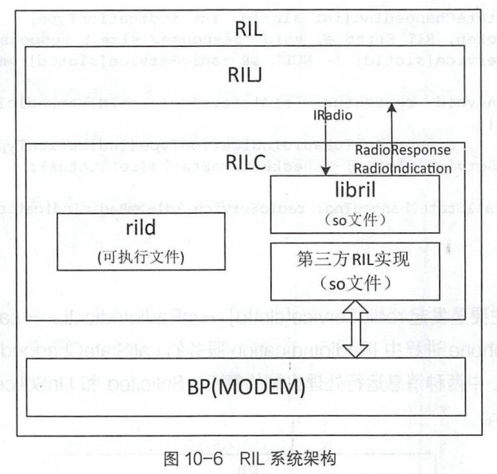

# 简述

- Android Telephony
  - rild的逻辑
  - libril的逻辑
  - rilc的消息处理逻辑
  - rilj和rilc和bp的关系
  - Telephony的系统服务

# Radio Interface Layer

- 
  - RIL主要分RILJ和RILC两部分。RILJ 运行在com.android.phone进程空间的Telephony Framework框架层，RILC运行在User Libraries系统运行库层中的HAL子层。

  - rild、libril 和第三方RIL实现都运行在rild 进程中，通过rild.rc配置文件由Linux init 进程进行加载和管理。

  - RILJ与RIL C通过IRadio、lRadioIndication 和lRadioResponse服务接口调用，完成Solicited和UnSolicited消息交互。

  - 第三方RIL库文件与Modem交互，完成Modem的操作控制和查询请求，以及接收Modem主动上报的消息。

  - 在RILConstants.java和ril.h中定义的RIL Solicited和UnSolicited消息是一致的，分别是RIL_REQUEST_XXX和RIL_UNSOL_XXX。

  - RILJ对象mRequestList列表中的RILRequest 对象与libril 中s_pendingRequests链表中的RequestInfo具有相同的处理逻辑，都是完成Solicited Request和Solicited Response消息处理。

## rild

- 
  1. 调用libril中的RIL_startEventLoop 函数;
  2. 调用第三方库中的RIL_ Init 函数，传入参数是指向RIL_Env结构体的s_riEnv指针，返回指向第三方库中RIL_RadioFunctions 结构体的s_callbacks 指针;
  3. 调用libril中的RIL_RadioFunctions函数，传入调用RIL_Init 函数返回的指向第三方库中RIL_RadioFunctions结构体的s_callbacks 指针。
- rild.rc主要逻辑
  - init 进程将运行rild 可执行文件，加载ril-daemon service。
  - ril-daemon service进程使用radio用户。
- rild.c主要逻辑
  - RIL_startEventLoop()
    - rild.c文件中的main方法将调用RIL_startEventLoop函数
    - rild进程中调用的RIL_startEventLoop 函数是libril中的实现
  - 获取RIL_RadioFunctions()
    - ril ibPath:main函数传入的参数信息中，rilLibPath 是获取Android 系统的Properties : [rild.libpath]:[/vendorlib64/ibril-qc-qmi-1.so]。
    - dlopen:以RTLD_ NOW方式打开动态链接库文件libril-qc-qmi-1.so。
    - dlsym:在libril-qc-qmi-1.so库文件中获取RIL_Init 函数地址并保存rllnit函数指针变量。
    - rillnit函数调用:调用libril-qc-qmi-1.so动态链接库中的RIL_Init 函数，传入指向RIL_ Env结构体的指针，返回指向RIL_RadioFunctions 类型的指针。
      - 动态链接库获取了libril 的RIL_ onRequestComplete、RIL_ onUnsolicitedResponse 等四个函数指针，是RIL请求之后回调的函数。
      - libril获取对应动态链接库文件中的onRequest、currentState 等函数指针，是继续发起RIL请求的响应函数。
  - 注册RIL_RadioFunctions()
    - RIL _register(funcs),其参数是获取动态链接库文件中RIL_RadioFunctions 结构体的地址，即指向RIL RadioFunctions 的指针。

## libril

- rild进程在加载过程中，会调用rild.c代码中的main函数，而main函数中将调用三个libril 中的函数
- RIL_startEventLoop()
- RIL_register()
- rilc_thread_pool():rild最后调用rilc_thread_pool 完成rild进程加载，ril service.cpp中提供了对应的函数.在rild进程中完成IRadio和lOemHook两个HIDL接口服务的启动。

### RIL_startEventLoop()

- 创建基于eventloop函数调用的子线程。会使用到pthread。

  - Linux 系统下的多线程遵循POSIX线程接口，称为pthread。编写Linux平台下的多线程程序时，需要引入头文件pthread.h。

  - 可移植作业系统接口（英语：Portable Operating System Interface，缩写为POSIX）是IEEE为要在各种UNIX操作系统上运行软件，而定义API的一系列互相关联的标准的总称

- eventLoop函数

  1. 修改s_ started 启动状态的取值为1,并发出状态修改通知,由RIL_ startEventL oop函数接收。
  2. 创建并激活s_ wakeupfd_ event 的事件处理,此事件的发送和接收实现的方式基于pipe管道
     - 通信: filedes[0]和filedes[1]。
     - ril_event双向链表中此时仅有一一个节点，那就是S_wakeupfd_event, 此节点的fd文件描述符为s_fdWakeupRead, RIL 事件的回调函数为: processWakeupCallback。
  3. 调用ril_ event_loop 函数，循环接收和处理ril_ event 事件。
     - rilevent_loop函数的处理逻辑的核心是for()循环，只要循环中的处理逻辑不发生变化，ril_event_loop函数调用是不会返回的。

- s_wakeupfd_event 事件处理
  - 创建 管道获取其输入和输出文件描述符s_fdWakeupRead、s_fdWakeupWrite。
  - 使用S_fdWakeupRead和processWakeupCallback创建s_wakeupfd_event 事件。
  - 增加并激活s_wakeupfd_event 事件。

- ril_ event_loop()函数
  - 启动子线程，调用ril_event_loop函数，进入for循环监听ril_event事件。
  - 完成s_wakeupfd_event 事件的节点初始化和激活。

### RIL_register()

- 首先验证callbacks参数,是否为空和版本号等,然后是拷贝参数，即保存指向RIL_RadioFunctions结构体的指针。因此，libril 中就可以调用第三方动态链接库文件提供的RIL请求相关函数，保障第三方厂家代码的安全和保密。
- radio::registerService() 调用
  - 定义了SIM卡的支持数：4张
  - Radiolmpl 对象：Radiolmpl类在ril_service.cpp中定义，继承自IRadio类。Radiolmpl类实现了IRadio.hal定义的接口。RILJ对象发出的IRadio接口调用将在Radiolmpl服务对象中响应，即rild进程响应RILJ发出的lRadio接口调用。
- registerAsService：为HIDL服务注册接口
  - serviceNames服务名：s_vendorFunctions和s_commands

## RILC

- 运行机制
  - Solicited消息处理机制
  - UnSolicited消息处理机制
- 
  - phone 进程与rild 进程交互，采用HIDL接口服务调用。com.android.phone进程中提供lRadioResponse服务和IRadiolndication 服务，rild 进程提供lRadio服务。
  - RIL_ register 调用建立了libril 与等三方ril互相持有对方的函数指针;在rild进程中，使用函数指针发起进程内的函数调用。
  - 在第三方ril动态链接库中，实现了将RIL请求转换为与BP的交互机制，不同厂家实现的机制不同; 高通平台，使用了QMI ( Qualcomm Message Interface )来完成AP与BP的通信。MTK使用AT

### Solicited消息处理机制

- IRadio服务接收Solicited Request消息，而IRadio服务的实现是在Radiolmpl类中，Radiolmpl类提供的接口处理机制基本一致。
- 发起语音通话拨号业务
  1. RILJ中的对应关系延伸到了libril中,而RIL_REQUEST_DIAL等RIL请求类型的定义在hardware/rilinclude/telephony/ril.h头文件中，与RILConstants.java文件中的定义是一致的。
  2. addRequestToList()：传入RIL请求唯一编号(RILJ 中生成)和RIL请求类型，创建并保存Requestlnfo。
     - pRI→pCI = &(s_ commands[request])匹配的回调函数：request取值为: RIL_REQUEST_DIAL，pRI→pCI→requestNumber为RIL_REQUEST_DIAL，RI→pCl→responseFunction是radio::dialResponse函数。
       - p：Pointer
       - RI：RequestInfo
       - CI：CommandInfo
  3. CALL ONREQUEST：CALL_ONREQUEST将调用第三方动态链接库中的onRequest函数。S_vendorFunctions是第三方动态链接库中RIL_Init 函数返回的RIL_RadioFunctions 结构体指针,而onRequest是指向第三方动态链接库中onRequest函数的指针。
  4. reference-ril.c文件中onRequest()
     - reference-ril.c文件中onRequest 参考实现的处理逻辑主要是根据传入的参数request,即RIL请求类型和请求数据创建command AT指令，并发送AT指令给BP处理;然后通过RIL_onRequestComplete，发起libril 中的OnRequestComplete函数调用，返回RIL请求的结果。
       - onRequest()请求参数RIL_Token, OnRequestComplete 发起回调的参数同样使用了RIL_Token,它们的调用是成对出现的，使用RIL_Token可匹配到对应的调用。
  5. OnRequestComplete函数调用
     - 调用checkAndDequeueRequestInfolfAck() 函数找到RIL请求对应的RequestInfo结构体，然后通过pRI→pCI→responseFunction发起XXXResponse函数调用。
  6. dialResponse()
     - 通过radioService[slotld]→mRadioResponse→dialResponse调用com.android.phone 进程中的lRadioResponse服务的dialResponse接口。

### Unsolicited消息

- 由于UnSolicited消息是HAL层主动上报的，BP产生的通信状态变化的消息将发送给AP，第三方ril库首先接收到，再发送给libril.libril 中的RIL_onUnsolicitedResponse函数将响应UnSolicited消息请求的调用。
- Call 状态变化
  1. 调用 s_unsolResponses[unsolResponselndex].responseFunction
     - unsolResponselndex=unsolResponse-RIL_UNSOL_RESPONSE_BASE减去了1000这个基数。
     - s_unsolResponses初始化和ril_unsol_commands.h的消息进行了对应。在ril_unsol_commands.h头文件中，固化了UnSolicited 消息类型与调用函数的对应关系:UnSolicited消息RIL_UNSOL_RESPONSE_XXX类型和调用函数XXXInd的关系。
     - radio:callStateChangedInd函数
       - radioService[slotld]→mRadioIndication→ callStateChanged调用，将调用com.android.phone进程中IRadiolndication服务的callStateChanged接口。

# Telephony系统服务

- Telephony模块中会提供一些System Service系统服务，供其他应用与Telephony模块进行交互。
- Android Telephony通过AIDL对外（第三方应用）提供系统服务， 第三方应用通过这些服务可查询Telephony主要的信息或状态，并且能够向Telephony注册观察者，监听Telephony相关的状态变化。

## PhoneInterfaceManager

- PhoneInterfaceManager类实现了ITelephony.Stub抽象类，该抽象类在Android编译过程中通过AIDL接口定义文件ITelephony.aidl的内容
  - Telephony相关的控制操作，如dial、endCall、setRadio、enableApnType、disableApn-Type等接口定义；
  - Telephony相关的查询接口，如isOffhook、isRadioOn、 getCallState、getDataState和getNetworkType等接口的定义；
  - 通话界面的显示接口，如showCallScreen和showCallScreenWithDialpad。

## TelephonyRegistry

- TelephonyRegistry负责登记、注册 Telephony相关状态的监听，提供了注册Telephony状态变化相关的Observer观察者对象的接口，某个应用成功完成Observer注册后，Telephony的状态一旦发生变化，Telephony-Registry便会发出通知给注册的Observer观察者。

## TelephonyManager

- TelephonyManager本身会注册成为系统服务供第三方应用使用，但提供的接口实现逻辑全部通过获取PhoneInterfaceManager和TelephonyRegistry服务对象实现具体的逻辑处理。