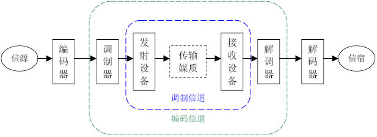
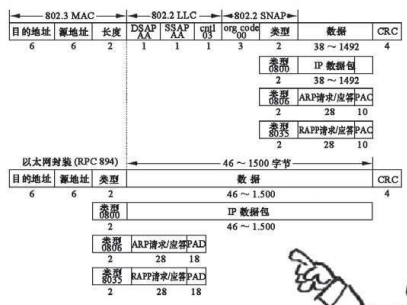
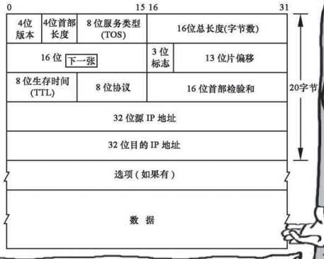
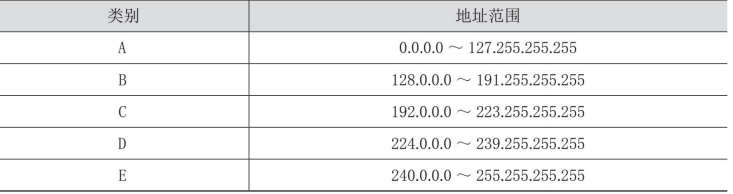
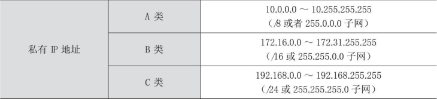

# 简述

- 大话通信
  - 从整体上了解了通信的三个关键要素：编码、寻址和网络优化
  - 编码的基础知识：香农公式、编码通道、调制通道
  - 如何将声音变成模拟型号
  - 如何进行编码中的数模转换、脉冲编码调制和信道编码、复用和解复用
  - 编码中的数据格式：以太网帧、ip数据包等
  - 如何实时传输视频。
  - 如何在电路交换网、以太网、ip网中寻址
  - IP路由协议

# 通信的原理

## 编码综述

- 如何把声音、图像、文字等信息变成电磁信号，如何把一系列的电磁信号有效地传送到对方，又如何在对端还原为声音、图像和文字
- 任何选择都是适应需求的，“绝对适合”任何场景和需求的选择是不存在的。任何编码都是为了适应不同的传送需求
- 电磁信号的可复制性和可再生性，差错控制。

## 寻址综述

- 给任何信息的出发点和目的地做个编号, 通过编号可以识别世界.上任何一个出发点和目的地
  - 如何在一个局部区域分配了地址之后，能够让全网知道该地址所在的位置。
- 通过相关机制，使信息依照一定的路径在这两者之间传送。
- 寻址方式
  - 用信令寻址后自动建立专门的通道
  - 在路由器上做好路由策略，让数据包根据这些策略寻找到达目的地的路径
  - 将目的地址在全网做广播宣告，真正的目的地址给出回应
  - 在出发地和目的地之间人工建立一条专门的通道等
- 无论是电话网、传输网，还是数据网，都各有各的编址方法和寻址方法；
  - 移动通信中的FDMA（频分多址，如TACS、 AMPS）、时分多址（TDMA）、码分多址（CDMA）等技术体制， 都有一整套完善的寻址方式。

## 网络优化综述

- 人们改造世界的过程：先保证解决基本问题，再思考如何用更好的方法解决问题。
  - 网络优化，就是在基本的通信问题（如连通性、信息还原能力）得以解决后，如何更方便、快捷、安全、经济地规划网络、建设网络、使用网络的问题。
- 互相通信问题：用什么方式能让许多人都能同时通话而投入的平均成本不会大幅度增加？有没有方法让很多人共用中间的传送线缆。
- 信息交互方式
  - “面向连接”。建立一条确定的线路然后传送信息
    - 实现：PSTN、帧中继、ATM、MPLS网络
  - “无连接”。让每个信息源发出的信息包“一跳一跳”（Hop-Hop）向下一个网络节点迈进，即采用“存储——转发”模式
    - 实现：传统IP网络

### 优化的高级阶段：人性化

- 通信理念发展的进程：前人无，我有->前人有，我优->前人优，我人性化。“人性化”是优化问题的高级阶段。
- “用户体验”,人性化是一个很难标准化的东西，但却是目前通信领域中最重要的课题之一

# 编码

- 背景
  - 以太的由来：19世纪，科学家们逐步发现光是一种波，而生活中的波大多需要传播介质（如声波的传递需要借助于空气，水波的传播借助于水等）。受经典力学思想影响，于是他们便假想宇宙到处都存在着一种称之为以太的物质，是这种物质作为光的传播中的介质。
  - 网络价值与用户数的平方成正比。网络使用者越多，价值就越大。
    - 网络的价值V =K ×N  ；（K  为价值系数，N  为用户数量。）
  - 编码是通信的基本组成部分，是通信里面的“语文课”
  - 信息用什么信息格式传送到目的地
    - 信息论中的信源编码和信道编码过程
    - 数模、模数转换、抽样、复用解复用
    - 各种数据帧、分组、信元等数据报文的封装格式。

- ==香农公式==：“在被高斯白噪声干扰的信道中，计算最大信息传送速率C 的公式”：C =B log2 （1+S /N ）。
  - B 是信道带宽 （Hz）
    - **信道**、频道或波道，是信号在通信系统中传输的通道，由信号从发射端传输到接收端所经过的传输媒质所构成。
    - **带宽**（英语：Bandwidth）指信号所占据的频带宽度；在被用来描述信道时，带宽是指能够有效通过该信道的信号的最大频带宽度。对于模拟信号而言，带宽又称为频宽，以赫兹（Hz）为单位。对于数字信号而言，带宽是指单位时间内链路能够通过的数据量。为了与模拟带宽进行区分，数字信道的带宽一般直接用波特率或符号率来描述。
  - S 是信号功率（W）
  - N 是噪声功率（W）
    - **噪声**（英语：Noise）在电子学中指，信号在传输过程中会受到一些外在能量所产生信号（如杂散电磁场）的干扰，这些能量即噪声。噪声通常会造成信号的失真。其来源除了来自系统外部，亦有可能由接收系统本身产生。噪声的强度通常都是与信号带宽成正比，所以当信号带宽越宽，噪声的干扰也会越大。
    - **信噪比**（英语：Signal-to-noise ratio，缩写为SNR或S/N），又称訊噪比，用于比较所需信号的强度与背景噪声的强度。其定义为信号功率与噪声功率的比率，以分贝（dB）为单位表示。大于比率1:1（高于0分贝）表示信号多于噪声。
  - 信道容量C 与信道带宽B 成正比，同时还取决于系统信噪比以及编码技术种类。
- 
  - **调制信道**是指信号从调制器的输出端传输到解调器的输入端经过的部分。对于调制和解调的研究者来说，信号在调制信道上经过的传输媒质和变换设备都对信号做出了某种形式的变换，研究者只关心这些变换的输入和输出的关系，并不关心实现这一系列变换的具体物理过程。这一系列变换的输入与输出之间的关系，通常用多端口时变网络作为调制信道的数学模型进行描述。
  - **编码信道**是指数字信号由编码器输出端传输到译码器输入端经过的部分。对于编译码的研究者来说，编码器输出的数字串行经过编码信道上的一系列变换之后，在译码器的输入端成为另一组数字串行，研究者只关心这两组数字串行之间的变换关系，而并不关心这一系列变换发生的具体物理过程，甚至并不关心信号在调制信道上的具体变化。编码器输出的数字串行与到译码器输入的数字串行之间的关系，通常用多端口网络的转移概率作为编码信道的数学模型进行描述。

##声音->模拟信号

- 声音是振动产生的声波，通过介质（气体、固体、液体）传播并能被人或动物听觉器官所感知的波动现象。振幅和频率
- 模拟信号（英语：analog signal）是指在时域上数学形式为连续函数的讯号。
- 贝尔发明的碳粒电话机，是基于振膜对碳粒造成忽紧忽松的压力引起其电阻大小的变化
  - 电流=电压/ 电阻，在电阻变化而电压不变的情况下，电流就会发生线性变化。
  - 忽大忽小的电流，就是电信信号。假设这些信号已经陆续传送到对方的听筒。听筒内有一电磁铁随电流大小而磁性不同，它对埋有金属丝的薄膜时吸时 
    放，薄膜便发出了像人说话一样的声音。
- 转换方式
  - 以信号的原始频率（或称为“基带频率”）表示或以另一种频率表示。
  - 电话网络可以将我们的信号与另一更高频率的信号（称为“载波”）结合，然后在不同的频率上传输这些合成的信号。
    - **载波**（carrier wave）是指被调制以传输信号的波形，一般为正弦波。一般要求正弦载波的频率远远高于调制信号的带宽，否则会发生混叠，使传输信号失真。
    - **调制**（英语：modulation）是一种将一个或多个周期性的载波混入想传送之信号的技术，常用于无线电波的传播与通信、利用电话线的数据通信等各方面。依调制信号的不同，可区分为数位调制及类比调制，这些不同的调制，是以不同的方法，将信号和载波合成的技术。调制的逆过程叫做“解调”，用以解出原始的信号。
    - 在模拟调制中，表示数据的模拟信号被转换成另一模拟信号，后者就是“已调载波”。

## 模数/数模转换( A/D和D/A )、PCM和线路编码

- 背景
  - 模拟信号在传输过程中，由于受到外界干扰，总能量会损失惨重，信号本身也会发生畸变和衰减。
- 如果模拟信号以规则的时间间隔抽样，且抽样速率是模拟信号中最高频率的两倍，那么所得样本是原始信号的精确表示。
  - **滤波器**：由电容、电感和电阻组成的滤波电路。滤波器可以对电源线中特定频率的频点或该频点以外的频率进行有效滤除，得到一个特定频率的电源信号，或消除一个特定频率后的电源信号。
  - 人类语音产生的频率的正常范围是300～ 3400Hz。分配4000Hz的信道，当模拟语音信号转换为数字形式时，要保证每秒8000次抽样。
  - 脉冲信号变成数字信号的过程中的关键步骤：量值“阶梯量化”，因为数字信号要求脉冲幅度只能取有限个数值。
  - 把每次抽样的幅度按照256个阶梯排列，每个排列都是一个8位的二进制数。8000×8=64000，也就是64kbit。将64kbit/s称为一路语音信号的带 
    宽需求量。这种量化的方式被称为==脉冲编码调制==（PCM，Pulse Code Modulation）。
    - 脉冲编码信号是一种类比信号(模拟信号)的数位化方法。PCM将信号的强度依照同样的间距分成数段，然后用独特的数位记号（通常是二进位）来量化。
  - 信道编码：将数字信息转换为可以在线路上传送的数字信号的过程。
    - 曼彻斯特编码（Manchester coding），又称自同步码、相位编码（phase encoding，PE），能够用信号的变化来保持发送设备和接收设备之间的同步。它用电压的变化来分辨0和1，从高电平到低电平的跳变代表1，而从低电平到高电平的跳变代表0
    - 差分曼彻斯特编码在每个时钟周期的中间都有一次电平跳变，这个跳变做同步之用。 在每个时钟周期的起始处：跳变则说明该比特是0，不跳变则说明该比特是1。
    - 不归零编码 (non-return-to-zero line code, NRZ) ：信号电平的一次反转代表1，电平不变化表示0，并且在表示完一个码元后，电压不需回到0
    - 原因：要考虑误码率最低、传送准确率最高、最易于差错恢复，需要遵从电流在导线中传导的物理规律。这就造成不同的技术体制采用的信道编码方式会有一定的差异。

## 复用与解复用

- 方式
  - 时分多路复用（Time-Division Multiplexing，TDM）是一种数字或者模拟（较罕见）的多路复用技术。两个以上的信号或数据流同时在一条通信线路上传输，时间域被分成周期循环的一些小段，每段时间长度是固定的，每个时段用来传输一个子信道。
    - Timeslot（时隙）专用于某一个单个通道的时隙信息的串行自复用的一个部分，通常指PCM E1和T1信号中的一个话音信道（64kbps）。是时分复用模式（TDM）中的一个时间片。
  - 频分多路复用（Frequency-division multiplexing，FDM），也叫分频多任务，是一种将多路基带信号调制到不同频率载波上再进行叠加形成一个复合信号的多路复用技术。
  - 波分复用（Wavelength Division Multiplexing，WDM）是利用多个激光器在单条光纤上同时发送多束不同波长激光的技术。每个信号经过数据（文本、语音、视频等）调制后都在它独有的色带内传输。
- “同步”：在若干个语音64kbit/s的信息流汇聚到一起时，必须步调一致，就像一个大型乐队，需要步调一致才能奏出美妙的音乐。

## 波特率和比特率

- 波特率是指载波调制状态以多进制数表示时单位时间内信号状态的改变次数。当采用二进制时，即为比特率。

## 数据技术的数据格式

- 技术体制采用不同的编码格式原因
  - 道路的特征：比如单行道和双向车道是不一样的，车道宽窄是不一样的，水运和空运是不一样的，道路不同，选用容器的类型也不完全相同。
  - 货物的特征：运送不同类型的货物，选用容器的类型也会相同。
  - 货物本身的运送要求：时间要求、安全性要求、完整性要求等，都会对选用容器的类型带来影响。
- 技术本身的特性和所承担的业务类型，决定了其编码格式。编码格式也决定了这种技术本身的特性和适用的业务类型。
- 在数据通信中，各种技术体制都有自己对数据格式的严格定义， 而每种技术体制的数据格式名称各不相同，加上翻译方法上的差别， 造成名称不像数据格式的定义那样统一。
  - IP的数据格式，有的人称为“IP数据包”（IP Packet），有的人称为“IP数据报”（IP Datagram）；
  - 以太网的数据格式，有的人称为“以 太网数据报”（Ethernet Datagram），有的人称为“以太网帧”（Ethernet Frame）；
  - 最统一的叫法，是帧中继中的“帧”和ATM技术中的“信元”（Cell）。
  - 一般来说，“数据报”是比较通用的说法，不限定在任何层，也不限定任何技术；而“帧”一般指数据链路层的数据报；“数据包”一般指网络层的数据报。

### 以太网帧

- 逻辑上，以太网使用总线型拓扑和载波侦听多路访问——冲突检测（CSMA/CD，Carrier Sense Multiple Access/Collision Detect）的总线争用技术。
- 以太网采用总线型结构，一根主线贯穿始末，其他的线只是主线的分叉，每台主机都通过网线连接到“总线”上
  - 状态切换
    1. 开始：如果线路空闲，则启动传输，否则转到第4步
    2. 发送：如果检测到冲突，继续发送数据直到达到最小报文时间（保证所有其他转发器或终端检测到冲突），再转到第4步。
    3. 成功传输：向更高层的网络协议报告发送成功，退出传 输模式。
    4. 线路忙：等待，直到线路空闲。
    5. 线路进入空闲状态：等待一个随机的时间，转到第1步，除非超过最大尝试次数。
    6. 超过最大尝试传输次数：向更高层的网络协议报告发送失败，退出传输模式。
  - 问题：以太网上的任何节点都可以选择是否监听线路上传输的所有信息
  - 以太网帧：
    - 循环冗余校验（Cyclic redundancy check，CRC）：是一种根据网络数据包或电脑文件等数据产生简短固定位数校验码的一种散列函数，主要用来检测或校验数据传输或者保存后可能出现的错误。生成的数字在传输或者存储之前计算出来并且附加到数据后面，然后接收方进行检验确定数据是否发生变化。
    - 前导码和帧开始符：采用0和1交替出现的7个字节的前导码和1个字节的帧开始符作为帧的开始
    - 以太网帧的长度是64~1518字节。

### IP数据包格式

- 
  - 版本号：版本号类型为IPv4和IPv6。
  - 首部长度：这是指IP包头的长度。IPv4以32 位（4字节）为一个单位，从“首部长度”4位的情况看，IP包头最大也就64字节，512位。
  - TOS：标识传送优先级。在具有QoS保障的IP网络，比如MPLS里，TOS的意义才真正体现出来。这个字段由现在不再使用的3个优先权位、4个TOS位和1个必须为0的未用位组成。4个TOS位是：最小延迟、最大吞吐量、最高可靠性和最小费用。这4位只能有1位为1
  - 字节总长度：这是整个IP包的总长度指示，以字节为单位。用这个字段和包头长度做减法，可以得出IP包中 
    数据部分的起始地址和长度。最大尺寸是2的16次方，即65536字节。	
  - 标识：第几个包
  - 片偏移：在最早那个数据包中的位置。标识和片偏移配合使用，才能使分段和重组工作正常进行。
  - 存活時間（Time To Live）：能跨越多少台路由器
  - 协议：携带的信息是属于哪类服务协议。1是ICMP，2是 IGMP，6表示TCP，17表示UDP。
  - 头检验：包头检验值。仅在包头范围进行计算，不涉及包头后面的任何数据。校验的目的只有一个：判断IP包头是否被正确传输。
  - 选项：是该数据包可选信息的可变长列表。
  - 数据：这是IP数据包携带的真实的数据信息。IP数据包其他所有字段，都是为了传送本字段而设立的。

### 帧中继帧格式

- 帧中继技术被用来连接两个局域网——企业分支机构之间的互连，或者企业连接到运营商的骨干IP网络上。

### ATM信元

- 通信网上的传递方式可分为同步传递方式（STM）和异步传递方式（ATM）两种。
  - STM：在由N 路原始信号复合成的时分复用信号中，各路原始信号都是按一定时间间隔周期性出现。PCM编码格式属于STM
  - ATM：各路原始信号不一定按照一定的时间间隔周期性地出现，因而需要另外附加一个标志来表明某一段信息属于哪一段原始信号。
- ATM的工作原理是：每个分组作为一个单元独立传输，分组之间的传输间隔为任意时间。
  - 信元的开始：ATM的信元头中藏有相关信息，可以识别信元处在哪个位置。这个隐藏的信息就是HEC。
  - 信元的逻辑链路归属：ATM信元头中的VPI/VCI值，就是链路标识符，通过这两个值的搭配使用，系统就能很容易识别这个信元属于哪条逻辑链路

### SDH与SONET

- 同步数字体系（SDH）与同步数字光纤网（SONET）是国际电信传输的两大标准体系，它们统一了世界上原有的数字传输系列，实现了数字传输体制上的国际标准及多厂家设备的横向兼容，比准同步数字体系（PDH）有更多的优势。
  - 语音、数字数据网（DDN）、帧中继、以太网、IP、ATM都可以承载在SDH/SONET 上。

## 图像和视频编码

- 通信中提到的图像和视频，有一个专用的英文词叫作Videograph，研究的核心问题是如何实时地传送它们。
  - 实时性要求
  - 清晰度
  - 音画同步
- 大规模应用的基础：国际音视频编解码标准
  - ISO制定的MPEG系列标准
  - ITU针对多媒体通信制定的H.26X系列视频编码标准和 G.7系列音频编码标准。
- H.265目的：在有限带宽下传输更高的网络视频，仅需原先的一半带宽，就可以播放相同质量的视频
- 第二代“信源编码”标准AVS：“信源”是信息的“源头”，信源编码技术解决的重点问题是数字音视频海量数据（初始数据、信源）的编码压缩问题，故也称“数字音视频编解码技术”。

# 寻址

- 交换机类别
  - 步进制自动交换机
    - 程控交换机
- 通信方向：两个网络节点设备之间的数据流方向，并不是指管线本身的数据流方向
  - 单工（Simplex）：数据只能在一个方向上流动，如传统的电视信号传送。
  - 半双工（Half-Duplex）：可切换方向的单工通信，从某一时刻看，是单工的；从总体看，又是双工的，如行业使用的对讲机。
  - 全双工（Full-Duplex）：通信允许数据在两个方向上同时传输，它在能力上相当于两个单工通信方式的结合，如我们的电话、互 
    联网、交互式视频通信等。
- 在任何一个通信网络上，每个节点都需要有规范的、可查询的地址标识。
- 不同的网络，地址标识的设置方式不同。
- 有了地址，还要有找到地址的方法。而同类的网络节点，寻址的方式、方法以及规则必须相同或者类似
  - 路由表（routing table）或称路由择域信息库（RIB, Routing Information Base），是一个存储在路由器或者联网计算机中的电子表格（文件）或类数据库。
    - 路由表存储着指向特定网络地址的路径（在有些情况下，还记录有路径的路由度量值）。
    - 路由表中含有网络周边的拓扑信息。
    - 路由表建立的主要目标是为了实现路由协议和静态路由选择。

## 电路交换网寻址

- 电话交换网的地址编号就是我们熟悉的电话号码。电话号码在全球都有统一的规范。
  - 原则
    - 电话交换网上的电话号码（地址）必须统一分配
    - 任何电话交换机都必须了解这一分配规则
    - 电话交换机将无条件执行人赋予它的功能
    - 电话交换网上的终端才分配号码，交换机本身并不分配电话号码
  - 分配
    - 给每个国家分配一个唯一标识的国家代码,比如中国是86,美国1
    - 中国大陸手机号码以1开头（未来预留92和98开头），共11位数，前7位数字通常称为手机号段，可用于区分运营商和归属地，其作用类似于固定电话区号，但并不能相互对应。 示例：1XX-YYYY-ZZZZ
      - 第1~3位数表示电信运营商（1XX）；
      - 第4~7位数表示地区号码，即归属地（YYYY）；
      - 第8~11位数表示客户号码（ZZZZ）。

## 以太网内的寻址

- MAC地址（英语：Media Access Control Address），直译为媒体存取控制位址，也称为局域网地址（LAN Address），MAC位址，以太网地址（Ethernet Address）或物理地址（Physical Address），它是一个用来确认网络设备位置的位址。
- 工作方式：初始节点是根据目标节点的地址 ，将目标节点的IP地址映射到中间节点的MAC地址，找到第一个中间节点。从第一个中间节点出发，根据目标节点的IP地址映射到第二个中间节点的MAC地址，从而找到第二个中间节点……，以此类推，直到当找到最后一个中间节点后，从最后一个中间节点出发，根据目标节点的地址映射到目的节点的MAC地址，从而将数据包传送给目标主机。
  - 不断地将目标节点的地址映射到一个个中间节点的MAC地址，再从一个个中间节点出发，直到找到最终的目标节点
  - MAC地址和IP地址的映射关系，被每台主机不断更新并保存，就成了“地址映射表”。

## IP网的寻址

- 全球唯一的IP网地址管理机构，互联网名称和数字地址分配机构（ICANN）负责负 IP地址的空间分配、协议标识符的指派、通用顶级域名（gTLD）以 及国家和地区顶级域名（ccTLD）系统以及根服务器系统的管理
- IP网络中，所有的终端都应该有IP地址，而网络上的路由器和带路由功能的交换机，一般情况下每个路由接口也都应分配IP地址
- 组成
  - “主机地址”
  - “子网掩码”，用来标识该IP地址所在的子网（大部分是局域网）网段有多大。
- 分类
  - A类、B类和C类是最常用的单播IP地址，D类地址用于组播，E类地址被保留用于扩展和实验开发与研究。
  - 特殊功能地址
    - 0.0.0.0/0，未知网络，通常默认保留，常用于代表“缺省网络”，在路由器表中用于描述“缺省路径”。缺省路径的意思是享有最低优先级，在没有特别定义的情况下，IP数据包会按照该地址所定义的路由表项进行转发。
    - 127.0.0.0/8，表示回环地址和本地软件回送测试之用，保留而不分配。
    - 255.255.255.255/32，有限广播地址。
    - 私有IP地址：
      - 这3个IP地址段不会被互联网的公用服务器使用，而是在局域网中使用。

- **域名系统**（英语：Domain Name System，缩写：DNS）是互联网的一项服务。它作为将域名和IP地址相互映射的一个分布式数据库，能够使人更方便地访问互联网。DNS使用TCP和UDP端口53[1]。当前，对于每一级域名长度的限制是63个字符，域名总长度则不能超过253个字符。

### IP路由

- IP路由的技术原理，就是将任何一个IP数据包的目的IP地址取出，与路由表对照，定位出口在哪里，并将IP数据包输送到该出口上去。当然，如果该输出端口为帧中继端口，那么IP数据包必须按照相关规范封装成特定DLCI值的帧中继帧格式，从该端口传送出去。
- 在PSTN里，每台交换机都存储着一张路由表，这张表，是人为输入的。整个PSTN是一个完全可管理的、可控制的、分层的网络。
- IP路由协议就是路由表获取和建立的机制
  - IP路由协议，如RIP2、OSPF、IS-IS和BGP
- 某主机发送同一数据包到多台主机（一次的、同时的），叫作“组播”。组播可以在一个局域网范围，也可以扩展到整个IP世界。
  - 组播能使一个或多个组播源把数据包只发送给特定的组播组。只有加入该组播组的主机才能接收到数据包，并不影响组播组之外的其他终端。
  - 组播组的地址：5类IP地址中的D类地址。这类地址的范围是224.0.0.0～239.255.255.255，它们又被划分为局部链接组播地址、预留组播地址、管理权限组播地址3类。
    - 局部链接组播地址是为路由协议和其他用途保留的地址，范围是224.0.0.0～224.0.0.255，只有256个地址，路由器并不转发属于这个范围的IP包。
    - 预留组播地址为224.0.1.0～238.255.255.255，可用于全球范围的网 
    - 管理权限组播地址是剩下的239.0.0.0～239.255.255.255，可供组织内部使用，类似于私有IP地址，不能用于互联网，可限制组播范围。
- 一台主机发送同一数据包到**子网**内所有主机，叫作“广播”