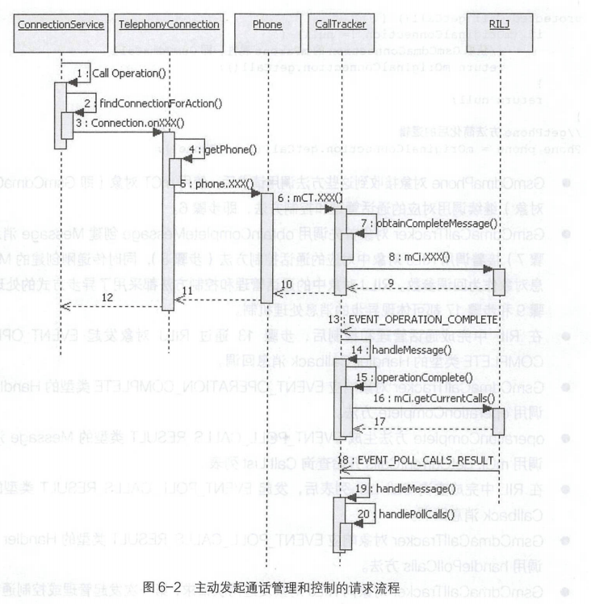

# 简述

- Android Telephone
  - GsmCdmaCallTracker的handler处理方式
  - GsmCdmaCallTracker与RILJ的交互
  - 通话管理和状态变化的消息回调方法handlePollCalls()方法

# Voice Call语音通话模型

## GsmCdmaCallTracker

### Handler消息处理方式

- Handler消息注册机制
  - GsmCdmaCallTracker 对象会被动接收并响应RILJ对象发出的通话状态变化、无线通信模块可用状态、无线通信状态不可用模块三种Handler消息
  - EVENT_CALL_STATE_CHANGE通话状态变化的Handler消息，仅在GsmCdmaCalITracker类中响应;也就是说，仅有GsmCdmaCallTracker对象会
    接收和响应RILJ对象发出的通话状态变化通知。
- Handler消息响应机制
  - 三种通话状态变化都会调用pollCallsWhenSafe()方法，在此方法中，当Voice Call 状态和Radio 状态发生改变时，RILJ 对象会向GsmCdmaCallTracker对象发出这三个对应的Handler消息; GsmCdmaCallTracker对象接收到这三个类型的Handler消息后，最终调用mCi.getCurrentCalls方法，向RILJ对象查询当前Call List (通话列表)。

- Handle消息CallBack（回调）处理方式
  - GsmCdmaPhone对象发起的通话管理和控制操作,实际上都是通过调用mCT相关的方法来完成的。mCT即GsmCdmaCallTracker对象，GsmCdmaCallTracker的通话控制方法，实现的逻辑框架基本一致, 全部采用Handler消息的回调处理机制，直接向RILJ对象发起通话管理和控制请求
    - 步骤
      - 调用 obtainCompleteMessage方法创建Message对象。
      - 使用mCi对象向RILJ对象发起通话管理和控制相关方法调用。
    - GsmCdmaCallTracker和RILJ提供的通话管理和控制方法的名称保持一致。
    - RIL对象发起消息回调后，在CallITracker对象中的响应和处理方式不同，但最终都会调用operationComplete方法处理，从字面意思理解就是完成了通话管理和控制操作(GSM网络制式)。
    - 接收到非EVENT_OPERATION_COMPLETE类型Handler消息的情况下，增加了phone.notifySuppServiceFailed方法调用;这个方法发出通话服务失败的消息通知，如无法切换通话、无法进行多方通话等消息通知。

### 与RILJ对象的交互机制

- GsmCdmaCallTracker与RILJ 对象的交互完成了通话的控制，以及通话状态和通话基本信息的保存、更新，在Telephony Call通话模型中非常重要和关键。
- 交互方式
  - CallTracker对象主动发起
  - CallTracker对象被动接收

#### CallTracker对象主动发起

- 流程
  1. GsmCdmaCallTracker对象发起dial、acceptCall. rejectCall 等通话管理和控制请求方法调用时，会调用RILJ对象提供的对应通话管理和控制方法。
  2. RIL处理完GsmCdmaCallTracker对象发出的通话管理和控制请求后,由RILJ对象使用Message消息对象发出Handler消息通知，GsmCdmaCallTracker 对象中的handleMessage方法接收和响应此消息，至此，完成了第一次的Handler消息回调处理。
  3. 接下来GsmCdmaCallTracker对象会进行第二次的Handler 消息回调处理流程，调用operationComplete方法来查询当前最新的Call List列表
  4. RIL处理完GsmCdmaCallTracker对象发出的查询当前最新的Call List 列表的请求后，由RILJ对象使用Message消息对象发出Handler消息通知, GsmCdmaCallTracker对象中的handleMessage方法接收和响应此消息，至此，完成了第二次的Handler消息回调处理。

- 
  1. ConnectionService和TelephonyConnection是TeleService 系统应用中的代码，运行在com.android.phone进程空间，用来接收Telecom系统应用发起的通话控制请求，并通过Telecom alld匹配到TelephonyConnection对象。
  2. TelephonyConnection通过getPhone方法，首先获取GsmCdmaConnection对象，然后获取到GsmCdmaPhone 对象，再调用GsmCdmaPhone对象的dial、acceptCall、rejectCall 等通话管理和控制方法。
  3. GsmCdmaPhone对象接收到这些方法调用请求后，使用mCT对象(即GsmCdmaCallTracker对象)继续调用对应的通话管理和控制方法
  4. GsmCdmaCallTracker对象首先调用obtainCompleteMessage创建Message消息对象接着调用RILJ对象中对应的通话控制方法，同时传递刚创建的Message消息对象作为回调参数。RILJ对象中的通话管理和控制方法都采用了异步方式的处理机制
  5. 在RIL中完成通话管理和控制后，通过RILJ对象发起EVENT_OPERATION_COMPLETE类型的Handler Callback消息回调。
  6. GsmCdmaCallTracker对象响应EVENT_ OPERATION_ COMPLETE类型的Handler消息,将调用operationComplete方法。
  7. operationComplete方法生成EVENT_ POLL_ CALLS_RESULT类型的Message消息对象，调用mCi. getCurrentCalls开始查询CallList列表。
  8. 在RIL中完成查询Call List列表后，发起EVENT_POLL_CALLS_ RESULT类型的HandlerCallback消息回调。
  9. GsmCdmaCallTracker对象响应EVENT_ POLL_ CALLS_ RESULT 类型的Handler消息,最终调用handlePollCalls方法。
- GsmCdmaCallTracker对象向RILJ对象发起两次请求，第一次发起管理或控制通话请求，第二次发起查询当前通话列表请求。RILJ对象处理这两次请求并发起两次处理结果的Callback消息回调，两次消息回调的Handler类型分别为EVENT_OPERATION_ COMPLETE和EVENT_POLL_CALLS_RESULT。

#### CallTracker对象被动接收

- GsmCdmaCallTracker对象的Handler 消息处理机制会被动接收和处理RILJ对象上报的三种类型的Handler消息，这三个消息与通话状态的关系非常密切
- 
  1. TeleService 系统应用加载Telephony业务模型创建GsmCdmaCallTracker对象的同时，向RILJ对象注册EVENT_CALL_STATE_CHANGE等三个类型的Handler消息。
  2. RILJ层接收到Modem发出的通话状态变化消息,向GsmCdmaCallTracker对象发出EVENT_CALL_ STATE_ CHANGE类型的Handler消息通知
  3. GsmCdmaCallTracker对象调用pollCallsWhenSafe方法响应EVENT_CALL STATE_CHANGE类型的Message消息。pollCallsWhenSafe方法首先会生成EVENT_POLL_CALLS_RESULT类型的Handler消息对象，接着使用此对象作为参数发起mCi.getCurrentCalls调用，向RILJ对象发出查询最新Cal lList列表的消息
  4. 在RIL中完成查询CallList列表后，发起EVENT_POLL_CALLS_RESULT类型的HandlerCallback消息回调。GsmCdmaCallTracker对象最终调用handlePollCalls方法响应EVENT_ POLL_ CALLS_ RESULT类型的Handler消息。
- CallTracker对象与RILJ 对象之间的交互不论采用什么形式，所有处理逻辑都会汇总到handlePollCalls方法，它会根据RILJ对象返回的Call List列表，更新通话状态以及发出相关的消息通知。可以说CallTracker类中的核心处理逻辑都集中到了此方法中

## handlePollCalls()方法

- GsmCdmaCallTracker 对象主动发起的通话管理或控制请求和被动接收到RILJ对象发起的通话状态变化的消息回调，都会调用mCi.getCurrentCalls方法查询Call List 获取当前所有的通话连接，查询的结果将交给handlePollCalls 方法处理。handlePollCalls方法将根据RILJ对象上报的Call List列表对象，更新GsmCdmaCallTracker类的三个Call对象和mConnections通话连接列表
- handlePollCalls()方法处理逻辑
  - 准备阶段，获取Call List列表。
  - 更新通话状态及对应信息。更新GsmCdmaCallTracker对象中的mState、mConnections、mForegroundCall、mBackground-Call和mRingingCall等属性。
  - 继续传递消息。根据当前最新的通话状态，发出通话状态变化的消息通知。

### 准备阶段

- 接收到Message消息后，获取Call List对象列表，然后声明一些重要的变量。
- RILJ 对象发给GsmCdmaCallTracker对象Handler消息中的result属性，通过强制类型转换成List列表对象。保存的是DriverCall对象列表，是在RILJ对象中创建的。

### 更新通话相关信息

1. 获取最新的DriverCall List 对象列表后，紧接着遍历mConnections保存通话连接对象列表，再通过DriverCall List 中对应的DriverCall 对象，更新GsmCdmaCallTracker对象中的通话相关信息。

2. 循环获取 conn 对象和 dc 对象：根据i数组mConnections的下标取值获取GsmCdmaConnection对象，然后通过curDC索引值获取polledCalls列表中的DriverCall对象dc,匹配DriverCall对象是通过dc.index==i+1关系来完成的，如果无法匹配到DriverCall 对象，则进入下一次循环完成DriverCall 对象的匹配
   - 通过MAX_CONNECTIONS_GSM和MAX_CONNECTIONS_CDMA两个常量的定义，mConnections数组最多可保存19个或8个GsmCdmaConnection对象。在循环connections数组的过程中，不论获取的conn对象如何取值，都会完成19次或8次循环。
   - dc对象的index是从1开始递增的。
   
3. 通话状态的变化
  
   - 根据conn和dc这两个对象基本信息的组合关系，可得出四种通话状态的变化
   
     - 出现新的通话
     - 通话连接断开
     - 通话连接断开并且有新的来电
     - 通话状态发生变化
   
   - | 条件                                                         | 说明                                              |
     | ------------------------------------------------------------ | ------------------------------------------------- |
     | conn == null && dc != null                                   | 主动拨号后第一次查询到此通话连接 和接收到来电请求 |
     | conn != null && dc== null                                    | 通话连接已经断开                                  |
     | conn!= null && dc != null && !conn.compareTo(dc)&& isPhoneTypeGsm() | GSM网络下，通话连接断开的同时,接收到新的来电请求  |
     | conn != null && dc != null                                   | 通话状态发生了变化                                |
   
     