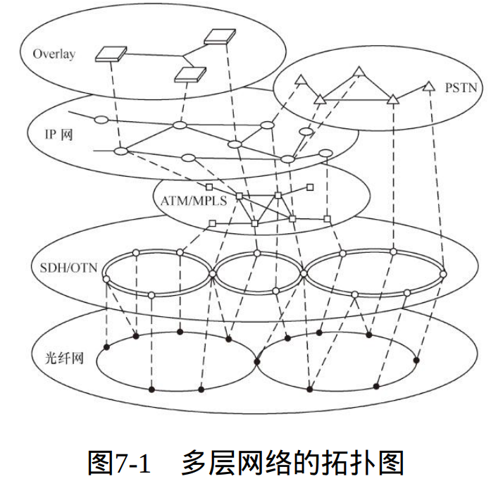

# 简述

- 大话通讯
  - 通信的基本框架层次：传送、语音、数据、支撑和综合网
  - 对于传送网来说，频谱和带宽的基础概念
  - 在了解传送网的概念的情况下
    - 了解有线网络的基础概率、传输介质和基于这种介质的网络技术
    - 了解无线网络的基础概念、传输介质和基于这种介质的网络技术
  - 对于语音层来说，PSTN公共电话交换网以及他的分层

# 通信网络框架

- 通信之美：错综复杂的逻辑关系、构思巧妙的设计理念、严丝合缝的理论推演、千变万化的表现形式
- 对每个类型的通信网络的研究重点进行提纲性分析
  - 目的：在不同业务种类的通信网技术之间进行比较，区分各种技术之间的关联。区分各个概念所属的范畴
- 分类本身的价值如果无法体现，反倒会引起更大的困惑

## 传送网：一切的基础

- 传送网是电信网的基础网络，专门用于多种业务的传送保障，使每个业务网的不同节点之间、不同业务网之间互相连接在一起，形成四通八达的业务网络。

- 研究重点：传送网的容量、安全性、容错能力、成本及其适用范围。

- 定位：它一般处于交换网、数据网、移动网和支撑网之下，是用来提供信号传送和转换的基础架构。
- 这一行业的从业人员往往管这个领域叫“传输专业”。

## 语音网

- 语音网为用户提供相互之间的语音通信，包括固定网（PSTN）和移动网（PLMN）的语音通信，它往往被称为“交换网”。

- 介质实体：程控交换机、移动基站、接入网设备、软交换、NGN、IMS，当然也包括电话机、传真机、手机、SIM卡等。

- 技术：有A/D和D/A转换、交换原理、电话号码管理、 传真技术、语音压缩技术等。

- 定位：PSTN是最成熟的电信网，和数据网的结合越来越紧密。随着NGN(Next Generation Network)/IMS技术的发展，PSTN被逐步替代。

- “交换专业”。

## 数据网

- 数据网是用来传送数据信息的，包括互联网数据、DDN、帧中继、VPN、视频业务等，随着业务的不断融合，语音也作为数据业务传送，典型的案例是4G网络的语音就全部采用VoLTE。
- 介质实体：路由器、交换机、防火墙、服务器、视频终端、MCU、音视频编码等。
- 技术：帧中继技术、ATM技术、 TCP/IP、路由协议、MPLS、P2P（P4P）、CDN、流媒体、未来数据网络（FDN）等。
- 定位：数据网技术体制多样，应用广泛，以TCP/IP为基础的数据网成为电信网的基础承载网络。
- “数据专业”。

## 支撑网

- 支撑网是现代电信网运行的支撑系统。一个完整的电信网除了有以传递电信业务为主的业务网之外，还需有若干个用来保障业务网正常运行、增强网络功能、加强网络控制和管理能力、提高网络服务质量的支撑网络。
- 范围：支撑网中传递相应的监测和控制信号。支撑网包括同步系统、公共信道信令网、传输监控系统、计费、认证和营账系统以及网络管理系统等，其并非业务开通必需的系统，但没有它们，电信网就不能称之为电信网；
- 作用：传统增值服务、管理、运维、营账、计费、监控等
- “支撑专业”。

## 综合网

- 背景：通信网中的新鲜事物，大都具备“不遵守规则”的特征。可能跨度几种网络， 综合几种技术体制的优势和特点，给通信学界带来新的热点，但是， 却难以分类。
- MSTP，将以太网技术、IP技术和SDH技术结合在一起，能够解决城域网中IP传送的安全问题
- NGN和移动网的IMS只是一种网络架构，它应该由语音网、数据网、支撑网等多种网络混合而成，提供的也是语音、数据以及它们相结合的业务（如Voicemail等）
- ATM网络是利用固定帧长的ATM技术，承载数据业务、语音业务和视频业务，其统计复用的特点，能够同时将多种业务根据各自服务要求等级在同一个网络上传送
- ASON,Automatically Switched Optical Network:在光传送网中引入控制平面，以实现网络资源的按需分配从而实现光网络的智能化。 使未来的光传送网能发展为向任何地点和任何用户提供连接的网，成为一个由成千上万个交换接点和千万个终端构成的网络，并且是一个智能化的全自动交换的光网络。

## 各种网络的结构关系

- 

# 传送介质和传输网

- 光纤，是一种由玻璃或塑料制成的纤维，利用光在这些纤维中以全内反射原理传输的光传导工具。
  - 全内反射（英语：Total Internal Reflection），又称全反射，是一种光学现象。当光线经过两个不同折射率的介质时，部份的光线会于介质的界面被折射，其馀的则被反射。但是，当入射角比临界角大时（光线远离法线），光线会停止进入另一介面，全部向内面反射。
  - 只发生在当光线从光密介质（较高折射率的介质）进入到光疏介质（较低折射率的介质），入射角大于临界角(critical angle)时。因为没有折射（折射光线消失）而都是反射，故称之为全内反射。
- 容量的影响因素：线路的介质本身，和线路“两端的设备”，都会对其承载带宽造成决定性影响

- 传送介质的选择依据
  - 拓扑结构：如星形结构不适合选用同轴电缆，可选择双绞线等方式（注意这里提到的星形结构是指物理结构，实际上双绞线组成的局域网从机理角度来说，应该是总线型结构）。
  - 容量：介质提供的传输速率、可靠性和差错率应能够满足要求。在可能的情况下，尽量选择可靠性高的介质。当然，可靠性高的介质，其本身的成本也会增加。
  - 应用环境：包括传输距离、环境恶劣程度、信号强度等。 
  - 成本：选择网络介质的一个重要因素是考虑已有投资成本，以及新投资的成本

##频谱、带宽

- 频谱
  - 频谱是频率谱密度的简称，是频率的分布曲线。复杂振荡分解为振幅不同和频率不同的谐振荡，这些谐振荡的幅值按频率排列的图形叫做频谱。
  - 电磁波在物理介质中传播，不同频率、波长的电磁波，其穿透过程和结果是不一样的；同一个频率的电磁波，在不同的物理介质中传送，其过程和结果也是不一样的。
- 通过频率：物理介质能够通过的电磁波的频率范围。
  - 作用
    - 频率越高，在相同时间内可做的动作就越多。并不是每个高频自身的波形都一定携带更丰富的信息量。
      - 调制把低频率的信号搬移到高频率中去，让信号更易于在线路上传送，不易受到干扰源的影响，使通信的传输距离和传输质量都获得质的飞跃。
        - 调制之前或解调之后的信号，称为“基带信号”，一般都在低频范围内，这时候每个波形承载的信息量越大，其数据带宽则越宽。
        - 调制之后的信号，称为“频带信号”，其数据带宽并没有发生改变，只是信号更容易在线路中传送了。
- 带宽
  - 频率范围（单位是 Hz），
  - 数据流的频率（单位是bit/s，每秒钟的位数）
  - 模拟通信和数字通信中，频率范围和数据流的频率所表示的含义有所不同

## 有线网络

### 传输介质

- 光纤
  - 模式组成：由圆柱形玻璃纤芯和玻璃包层构成，最外层是一种弹性耐磨的聚乙烯护套，整根光纤呈圆柱形。
  - 影响因素：纤芯的粗细、材料和包层材料的折射率
  - 模式
    - 单模光纤：单模光纤纤芯极细，直径一般小于10µm，模间色散很小，适合于远程通信，一般承载1310nm或者1550nm波长的光波
      - 模间色散：一种频率的光波以不同的角度入射到光纤中，到达终端的时间先后顺序不同，造成了脉冲展宽，从而出现的色散现象，这种现象将会降低数据精确度，造成了对传送距离的限制
    - 多模光纤：多模光纤纤芯较粗，通常直径在50µm（接近头发丝直径），模间色散较大，承载850nm或者1310nm波长的光波
      - 1310nm正好处于光纤的低损耗窗口，因此成为光纤通信的理想工作窗口，也是现在实用光纤通信系统的主要工作波段
  - 光纤收发器：将接收来的以太网电信号转化为光信号，并在光纤上传送，接收到光信号后还原为电信号，送入路由或者交换 设备、终端上的电接口。“光猫”
    - 单模光调制解调器
    - 多模光调制解调器
- 海底光缆：又称海底通讯光缆（英语：Submarine communication cables），是用绝缘材料包裹的导线，铺设在海底，用于设立国家或地区之间的电信或电力传输。

- 同轴电缆：同轴电缆由同轴的内外两个导体组成，内导体是一根金属线，外导体是一根圆柱形的套管，一般是细金属线编制成的网状结构，内外导体之间有绝缘层。
- 双绞线：每一对双绞线由绞合在一起的相互绝缘的两根铜线组成，每根铜线的直径在1mm左右，可以用于模拟或数字传输。
  - 作用：在通信中是为了抗干扰，也就是防止“噪声”对数据造成影响。
  - 分类
    - 屏蔽双绞线（STP，Shielded Twisted Pair）的抗干扰性好，性能高，用于远程中继线时，最大距离可以达到十几千米。价格高，被光纤取代
    - 非屏蔽双绞线（UTP，Unshielded Twisted Pair），其传输距离一般为100m左右，常用的有5类线、超5类线、6类线等， 5类线可以支持100Mbit/s，而6类线则可以支持1000Mbit/s的以太网连接，是连接桌面设备的首选传输介质。

### 网络技术

- 线路物理特征决定其传送的容限和特征
- 线缆两端连接着设备，它们的作用是接收外部信号并进行有效的信号调整，以保证信号在接下来的线路上稳定传送，或者将调整后的信号通过某种方式呈现出来。
- PDH：准同步数字系列(Plesiochronous Digital Hierarchy)
  - 在数字通信网的每个节点上都分别设置高精度的时钟，这些时钟的信号都具有统一的标准速率。尽管每个时钟的精度都很高，但总还是有一些微小的差别。为了保证通信的质量，要求这些时钟的差别不能超过规定的范围。因此，这种同步方式严格来说不是真正的同步，所以叫做“准同步”。
  - 在数字通信系统中，传送的信号都是数字化的脉冲序列。这些数字信号流在数字交换设备之间传输时，其速率必须完全保持一致，才能保证信息传送的准确无误，这就叫做“同步”。
- SDH：同步数字系列（Synchronous Digital Hierarchy）
  - 一开始提出了SONET（Synchronous Optical Network），通过一系列有关SONET的标准，而后ITU的前身CCITT接受了SONET概念，并将其重新定名为“同步数字系列”，使之成为不仅适用于光纤也适用于微波和卫星传输的通用技术体制。
  - SDH拥有全世界统一的网络节点接口（NNI），它是真正的数字传输体制上的国际性标准。
  - 优点
    - 它拥有一套标准化的信息结构等级，称为同步传送模块 （STM），并采用同步复用方式，使得利用 软件就可以从高速复用信号中一次分出、插入低速支路信号，不仅简化了上下话路的业务，也使交叉连接得以方便实现。SDH拥有丰富的开销比特（约占信号的5%），以用于网络的运行、维护，并实现了远程管理。
    - SDH具有自愈保护功能，可大大提高网络的通信质量和应付紧急状况的能力。SDH的环保护能力。
    - SDH网的结构有很强的适应性，PDH、ATM、IP甚至Ethernet都能够承载。

- MSTP：多业务传送平台（Multi-Service Transport Platform）
  - 背景：随着各种数据业务的比例持续增大，TDM、ATM和以太网等多业务混合传送需求的增多，广大用户的接入网和驻地网都陆续升级为宽 
    带，城域网原本的承载语音业务的定位无论是在带宽容量还是在接口数量上都不再能达到传输汇聚的要求。
  - 将传统的SDH复用器、光波分复用系统终端、数字交叉连接器、网络二层交换机以及IP边缘路由器等各种独立的设备合成为一个网络设备，进行统一的控制和管理，所以它也被称为基于SDH技术的多业务传送平台。
- WDM：波分复用 （WDM，Wavelength Division Multiplexing）
  - 光通信信号复用方式
    - 频分复用系统，指按频率进行分割
    - 时分复用系统，指按时间进行分割
    - 波分复用 （WDM，Wavelength Division Multiplexing）系统，指按波长进行分割
    - 空分复用 （SDM，Space Division Multiplexing）系统，指按空间进行分割
  - c=λf  ，频率f  与波长λ 的乘积则是光速c，光速c是恒定的，波长λ 和频率f  成反比关系。
    - 波长（wavelength）是指波在一个振动周期内传播的距离。
    - “频分”本应和“波分”没有区别，但在光通信系统中，由于波分复用系统采用专门的光学分光元件分离波长，不同于一般通信中采用的滤波器（限制不需要的频率通过的装置），所以两者属于完全不同的系统。
  - WDM利用一根光纤可以同时传输多个不同波长的光载波的特点，把光纤可能应用的波长范围划分成若干个“波段”，每个波段作为 一个独立的通道，来传输一种预定波长的光信号。光波分复用的实质是在光纤上进行光频分复用（OFDM），只是因为光波通常采用波长参数而不用频率参数来描述、监测与控制。
    - 密集波分复用（DWDM，Dense WDM）：波长的密度高
    - 粗波分复用（CWDM，Coarse WDM）：波长的密度低
- PTN：分组传送网(Packet Transport Network)：PTN就是利用传统传送思维来解决分组数据传送的一种技术，底层技术使用了MPLS标签转发，但是去掉了IP/MPLS中的动态部分，改由网管集中下发和管理，对于TDM业务则通过一系列的仿真技术来兼容(PWE3)。同时具有了分组数据的高效和传送网络强大OAM特性。
- IPRAN:IP化无线接入网(IP Radio Access Network)
  - IPRAN并非无线接入部分，而是对基站类设备进行用户的无线接入后，通过有线网络将数据信息在城域范围内传送到中心机房的传送技术
- SPN:切片分组网(Slicing Packet Network)
  - SPN架构融合了从物理层到网络层的功能，设备形态是光电一体的融合设备
- OTN:光传送网（optical transport network）
  - 以波分复用技术为基础，利用其中与SDH/SONET类似的电层，为客户信号提供在波长或子波长上传送、复用、交换、监控和保护恢复的技术。
- ASON:自动交换光网络(Automatically Switched Optical Network)
  - 以OTN为基础的自动交换传送网， 基本设想是在光传送网中引入控制平面，以实现网络资源的按需分配从而实现先网络的智能化

## 无线传输技术

- “无线网”是一个笼统的概念，不用线缆的传输都是无线传输
- 根据频率、应用场合、传送信号类型的不同，常见的无线网络通信系统除了广播、电视外，还有Wi-Fi、移动网（从GSM到5G）、蓝牙、ZigBee、对讲系统、LMDS/MMDS、卫星等。
- 频率或波长分类
  - 长波：主要沿地球表面进行传播，又称地波，也可在地面与大气层中的电离层之间形成的波道中传播，距离可达几千千米到上万千米，能穿透海水和土壤。但波长越长，干扰噪声也会越大。
  - 中波 ：中波在白天主要靠地面传播，夜间也可由电离层反射传播，主要用于广播和导航。一般中波广播（MW）采用了调幅方式（AM），。实际上中波广播只是诸多利用AM调制方式中的一种。
    - 振幅调变（Amplitude Modulation，AM），也可简称为调幅，是在电子通信中使用的一种调变方法，最常用于无线电载波传输信息。在振幅调制中，载波的振幅（信号强度）是与所发送的波形成比例变化的。
    - 振幅（amplitude）是在波动或振动中距离振荡中心的最大位移
  - 短波：短波主要靠电离层反射的天波传播，可经电离层一次或多次反射，传播距离可达几千甚至上万千米，适用于应急、抗灾通信和远距离越洋通信
  - 微波：微波主要是以直线距离传播，但受到地形、地物及雨、雪、雾、 灯天气因素影响较大。它传播稳定、传输带宽宽，地面传播距离只有几十千米，能穿透电离层，对空传播可达数万千米，主要用于干线或支线无线通信、卫星通信等。

### 微波通信

- 物理学中的微波，是指频率在300MHz～300GHz的微波信号，波长在0.1mm～1m的电磁波，也叫作“超高频电磁波”，说它“高”，是和一般的电磁波 
  相比；说它“微”，是指波长值很小。

- 波段

  - | 波段   | 频率      | 说明                                                         |
    | ------ | --------- | ------------------------------------------------------------ |
    | L波段  | 1～2GHz   | 常用于移动通信                                               |
    | S波段  | 2～4GHz   | 主要应用于微波接力通信和地球站之间的卫星通信。               |
    | C波段  | 4～8GHz   | 主要应用于微波接力通信和地球站之间的卫星通信，C波段是其中应用最多的。 |
    | X波段  | 8～13GHz  | 主要应用于微波接力通信和地球站之间的卫星通信。               |
    | Ku波段 | 13～18GHz | 主要应用于微波接力通信和地球站之间的卫星通信。               |
    | K波段  | 18～28GHz | 主要应用于空间通信和近距离的地面通信。                       |
    | Ka波段 | 28～40GHz | 主要应用于地球站与空间站之间的通信。                         |

    - 我国的3G、4G网络运行在L和S波段
    - 我国的5G将采用S和C波段。当前工业和信息化部向三大电信运营商发放了5G系统中低频段试验频率使用许可

- 微波站的设备包括天线、收发信机、调制器、多路复用设备以及电源设备、自动控制设备

- 微波作为通信首选频段的原因：频带宽、容量大、传播稳定，地面传播距离只有几十千米，能穿透电离层，对空传播可达数万千米。

  - 弱点
    - 经空中传送，微波易受其他外部环境的干扰，在同一微波电路上不能在同一方向使用相同的频率
    - 由于微波直线传播的特性，在电波波束方向上，不能有高楼阻挡

### 调制和解调

- 背景
  - 辐射效率：为了获得较高的辐射效率，天线的尺寸一般应大于发射信号波长的四分之一
  - 多路复用：将原始频率的信号调制到载波频率上，可以把多个基带信号分别搬移到不同的载波频率上，可以实现信道的多路复用
  - 干扰能力：经过调制后的信号，系统抗干扰、抗衰落能力明显增强，传输的信噪比也会提高
- 方式
  - 模拟信号->模拟调制
    - 调幅（AM）、调频（FM）和 调相（PM）等
  - 数字信号->数字调制
    - 振幅键控（ASK）:通过两种振幅图形表示0和1
    - 移频键控 （FSK）:用两种频率图形表示0和1
    - 移相键控（PSK）:两种相位变化表示0和1
    - 差分相移键控（DPSK）、正交幅度调制（QAM）、正交频分复用（OFDM）等
- 数字调制技术比模拟调制技术具有更好的抗噪声能力、稳定性高、灵活性强、安全性好，但传输带宽较大，对设备的处理能力要求也随之提高。目前，微波通信大都采用数字调制。

### 扩频

- 扩频（Spread Spectrum，SS）是将传输信号的频谱（spectrum）打散到较其原始带宽更宽的一种通信技术，常用于无线通信领域。
  - 扩频调制之后，其信号传输带宽应远大于原始信号；
  - 传输端会采用一个独特的码（code），此码与发送数据是无关的，接收端也必须使用这个独特的码才能解扩频以获得传输端的数据。
- 实现方式
  - 直接序列扩频（简称直序扩频，Direct-sequence spread spectrum，DSSS）
    - 直接用具有高码率的扩频码序列在发送端去扩展信号的频谱，而在接收端用相同的扩频码序列去进行“解扩”，把展宽的扩频信号还原成原始的信息。
    - 在应用中，实际信号与一系列精心挑选过的“噪声”信号相结合
  - 跳频（Frequency-hopping spread spectrum，FHSS）
    - 指用伪随机码序列进行频移键控，使载波频率不断跳变而扩展频谱的一种方法。
    - 移动通信信道环境恶劣，各种干扰会不约而至。为了抵御出现的某些频率的干扰，采用跳频技术是有效的方法之一。
  - 跳时扩频、混合扩频等。
- FHSS和DSSS构成了无线LAN初期标准的功能基础，并最终被融进我们再熟悉不过的Wi-Fi中

### WIFI

- Wi-Fi已经成为无线局域网（WLAN）的代名词
  - WLAN的最初目的是在传统的局域网中引入无线的概念，从而使局域网中的用户可以摆脱线缆的束缚而具有一定的移动性。
- AC（Access Controller）+AP(Access Point)
- 协议：802.11->802.11a->802.11b->802.11g->802.11n->802.11ac->802.11ax
  - 802.11ac及之前Wi-Fi标准采用的都是OFDM调制方式
  - 而802.11ax采用的是正交频分多址（OFDMA）调制方式，这项技术是OFDM技术的演进版本。

### 蓝牙技术

- 蓝牙技术（Blue Tooth）目的是实现终端之间短距离数据传送，比如手机和耳机之间、笔记本和手机之间、笔记本之间的数据传送。由于其传输速率不高，传输距离也不能太远，因此被称为“短距离无线电技术”。
- 蓝牙技术可使一些能随身携带的移动通信设备和计算机设备，不必借助电缆就能连网，并且能够实现无线接入互联网
- 蓝牙设备采用的是跳频技术（FHSS），能够抗信号衰减，有效地减少同频干扰，提高通信的安全性。与Wi-Fi早期所占用的频段一样，它也运行于全球范围开放的2.4GHz上。

### 其他无线通信技术

- WAPI:无线局域网鉴别与保密基础结构(WLAN Authentication and Privacy Infrastructure)，是无线局域网（WLAN） 中的一种传输协议，它与现行的802.11b传输协议比较相近。WAPI是针对IEEE802.11系列中所涉及的安全问题，经反复论证并充分考虑各种应用模式，在中国无线局域网国家标准GB15629.11中提出的WLAN安全解决方案。
  - WAPI是我国自行制定的无线网传输标准。
- “无线光纤”
  - LMDS：工作频段在10GHz以上的点到多点固定无线传输设备一般称为本地多点分配系统（LMDS，Local Multipoint Distribution System）
  - MMDS：3.5GHz频率的设备被称为多通道微波分配系统（MMDS，Multichannel Microwave Distribution System）。
- 超宽带（UWB，Ultra Wide Band）：该技术是一种以极低的功率（约20mW），在极宽的频率范围内（最高可达7.5GHz），以极高的速率（可达500Mbit/s）传输信息的无线通信技术。
- ZigBee技术：一种耗电极低的短距离无线网络技术。
- Z-Wave技术：Z-Wave是一种低成本、低能耗、高可靠性的短距离双向无线通信技术，主要应用于家庭自动化、小型工业控制等领域。
- RFID技术：无线射频识别技术（RFID，Radio Frequency Identification），它利用无线电射频与被识别物体进行双向通信，实现数据交换，从而达 
  到识别物体的目的。
- 无线Mesh网：又称为“无线网状网”或者“无线多路网”。它可以与各种宽带接入技术和移动通信技术结合在一起，组成一个含有多跳无线链路的无线网状网。

### 天线

- 所有无线网络都离不开天线
- 手机也有天线，但由于技术进步，被隐藏起来了。
- 无线电发射机输出的射频信号功率，通过馈线（电缆）输送到天线，由天线以电磁波的形式辐射出去。电磁波到达接收地点后，由天线接下来（仅仅接收很小一部分能量），并通过馈线送到无线电接收机。
- 分类
  - 频率：短波天线、超短波天线、微波天线等
  - 用途：通信天线、电视天线、雷达天线等
  - 方向性：全向天线、定向天线、点对点天线等
  - 外形：线状天线、面状天线
- 辐射原理
  - 当导体上通以高频电流时，在其周围空间会产生电场与磁场。按电磁场在空间的分布特性，可分为近区、中间区和远区。
  - 设R  为空间一点距导体的距离
    - 在R  <<λ /2π时的区域称近区，在该区内的电磁场与导体中电流、电压有紧密的联系。
    - 在R  >>λ /2π的区域称为远区，在 该区域内电磁场能离开导体向空间传播，它的变化相对于导体上的电流、电压就要滞后一段时间，此时传播出去的电磁波已不与导线上的 电流、电压有直接的联系了，此区域的电磁场称为辐射场。
    - 注意：
      - 当导线的长度L 远小于波长λ 时，辐射很微弱；
      - 导线的长度L 增大到波长的四分之一左右时，导线上的电流将大大增加，因而就能形成较强的辐射。

## 卫星通信

- 地球上（包括地面和低层大气中）的无线电通信站间利用卫星作为中继而进行的通信
  - 卫星在空中起“中继站”的作用，即把地球站发上来的电磁波放大后再反送回另一地球站
- 组成：卫星、对应的一系列装置
- 静止卫星在赤道上空3600km，它绕地球一周的时间恰好与地球自转一周一致。三颗相距120°的卫星就能覆盖整个赤道圆周

# 电话交换网

- 自动交换机从步进制、纵横制发展到程控交换机和今天的软交换

## PSTN 

- 分层架构
  - Class 1 (regional center)
  - Class 2 (sectional center)
  - Class 3 (primary center)
  - Class 4 (toll center)
  - Class 5 (local exchange)
- 在中国，最早划分是按照C1为大区中心、C2为省中心、C3为地区中心、C4为县中心、C5为端局设计的，但是在实际的交换网络建设中，C2、C3逐渐退化并最终消失，只有C1、 C4和C5交换机真实存在