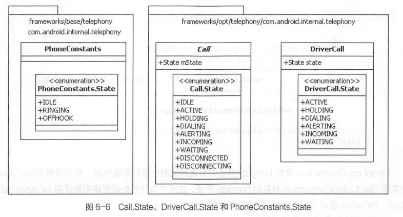

# 简述

- Android Telephone
  - 通话管理和状态变化的消息回调方法handlePollCalls()方法如何通知通话状态变化和更新状态
  - 通话管理模型的GsmCdmaCall、GsmCdmaConnection、DriverCall和Call
  - 通话断开中的本地主动断开和远程断开
  - android.telecom.Connection和com.android.internal.telephony.Connection
  - 展示通话信息并提供通话控制交互界面的InCallUi
  - ServiceState类结构的常量和属性

# Voice Call语音通话模型

## handlePollCalls()方法

### 准备阶段

### 更新通话相关信息

### 发出通知

- 完成循环mConnections数组更新GsmCdmaCallTracker对象通话相关信息后，根据最新的通话基本信息发出通话状态变化的相关消息通知。
- 调用updatePhoneState()方法是没有任何条件限制的，此方法将更新GsmCdmaCalITracker对象的mState状态

### 更新mState

- updatePhoneState()方法
- 通过 Call对象获取其mState状态从而更新GsmCdmaCallTracker的mState属性，它们之间的状态是保持同步的。
- 发出mState状态变化的消息通知。
- Call.State和PhoneConstants.State之间的状态转换
  - 
  - Call.State 共有九个状态，可对应PhoneConstants.State的三个状态。
  - 除去非IDLE 和INCOMING这两个状态，Call State剩余的七个状态将对应PhoneConstants.State的OFFHOOK状态。
  - PhoneConstants.State.RINGING 可理解为特殊的OFFHOOK状态。
  - Call.State.DISCONNECTED可转换为PhoneConstants.State.IDLE状态。
- GsmCdmaCallTracker和GsmCdmaCall 类中都有mConnections 数组，可保存多个GsmCdmaConnection通话连接对象
  - 关系: GsmCdmaCallTracker 对象的mConnections数组将保存所有的通话Connection 对象;保存三个GsmCdmaCall 对象的mConnections数组的集合，也同样保存了当前所有的通话Connection 对象
    - GsmCdmaCalTracker.mConnections = mRingigCall.mConnections + mForegroundCall.mConnections+mBackgroundCall. mConnections。

## 通话管理模型分析

- 创建GsmCdmaCallTracker对象的同时，将同步创建三个GsmCdmaCall对象，这三个对象分别代表了三路通话。
  - mRingingCall 来电
  - mForegroundCall 第一路通话
  - mBackgroundCall 第二路通话
- Telephony Call 通话模型最多支持三路通话，在每一路通话中 可以包含多个通话连接。每个GsmCdmaCall对象都有独立的mState状态和mConnections通话连接对象列表。
- 以GsmCdmaCall为核心的通话模型主要集中在GsmCdmaCall、GsmCdmaConnection 和DriverCall 三个关键类，它们共同构建了Telephony Voice Call语音通话模型; GsmCdmaConnection 和DriverCall对象作为基石则构建了以GsmCdmaCall对象为中心的通话模型框架。
- 当DriverCall List列表中的DriverCall对象发生变化时,根据DriverCall对象的基本信息创建或更新GsmCdmaConnection对象，与此同时，会同步更新GsmCdmaConnection对象的parent属性，即更新GsmCdmaCall对象的mState和mConnections属性，从而同步更新通话模型中的通话信息。
- GsmCdmaCall对象的状态更新的驱动入口是在GsmCdmaConnection对象的创建或更新的方法中。

### GsmCdmaCall类结构

- GsmCdmaCall类继承于Call 抽象类frameworks/opt/telephony/src/java/com/android/internal/telephony/Call.java,与Telecom系统应用中的Call对象不同

- 关键属性

  - | 属性         | 类型                    | 说明                     |
    | ------------ | ----------------------- | ------------------------ |
    | mState       | State                   | 当前通话的状态           |
    | mConnections | `ArrayList<Connection>` | 通话的连接对象列表       |
    | mOwner       | GsmCdmaCallTracker      | 所有者是GsmCdmalITracker |

- 关键方法

  - 更新Call State通话状态：update()、attach()、detach()、clearDisconnected()
  - 挂断电话的处理：hangup()、onHangupLocal()
  - 获得通话连接：getEarliestConnection()、getLatestConnection()

### GsmCdmaConnection类结构

- GsmCdmaCall类中涉及的GsmCdmaConnection类继承于Connection抽象类，即frameworks/opt/telephony/src/java/com/android/internal/telephony/Connection.java,与TeleService系统应用中的Connection不同
- 关键属性
  - GsmCdmaCalTracker.connections数组的下标值、通话连接的一些基本信息、电源管理
  - mParent的类型是GsmCdmaCall，它的来源是 GsmCdmaCall,即GsmCdmaCall对象拥有它。说明任意一个Connection 对象都归属于一个Call 对象。通俗来讲，任意一个通话连接都可归为GsmCdmaCallTracker三路通话中的一路。
  - GsmCdmaConnection类的关键属性用来保存通话连接比较全面的一些基本信息，如电话号码、通话计时时间等; GsmCdmaConnection 类和GsmCdmaCall类的mOwner属性都是GsmCdmaCallTracker对象。
- 关键方法
  - 更新状态、获取Call对象、获取通话连接的基本信息、获取通话状态、通话断开。

### GsmCdmaCall和GsmCdmaConnection的关系

- 
  - GsmCdmaConnection 作为基石，保存了通话连接的基本信息，多个GsmCdmaConnection对象组合成一路通话;GsmCdmaCall作为框架，主要管理mState当前通话状态和mConnections列表，一路通话中有多个通话连接。
  - 二者都在同一个包: com. andrid.iteteal.telephony。
  - GsmCdmaCall 类的mConnections属性可以保存多个GsmCdmaConnection对象;而GsmCdmaConnection对象的mParent属性，则是它对应的唯一GsmCdmaCall对象。
  - GsmCdmaCall和GsmCdmaConnection两个类的mOwner属性,都是GsmCdmaCallTracker对象。

### DriverCall、 Call、Connection

- DriverCall是RILJ中创建的对象，Modem查询完通话列表后，返回给RIL固定格式的字符串，RILJ对象将这些字符串信息拼装成DriverCall对象列表，一行字符串信息可创建一个DriverCall对象。
- DriverCall对象列表能够真实反映出Modem无线通信模块中所有通话连接的真实信息。

#### DriverCall和Connection

- 一个GsmCdmaConnection对象保存着一个通话连接的基本信息，这些基本信息在Telephony Voice Call语音通话模型中是GsmCdmaConnection对象根据DriverCall对象的一些基 本信息创建的,并且在GsmCdmaConnection对象创建成功后,还能通过新的DriverCall
  对象更新自身的一些基本信息，它们之间的匹配关系是通过mIndex下标来标识的。

- GsmCdmaConnection对象的创建或更新，其数据来源和依据都是DriverCall对象。

- GsmCdmaConnection对象在创建或更新的同时，同步调用mParent的更新方法来更新它所属的GsmCdmaCall对象，主要是mParent.attach、mParent.detach 和mParent.update这三个方法调用。

- mParent的切换

  - 在parentFromDCState方法中可找到通过DrierCall.State 获取对应mParent 的逻辑代码。

  - DriverCall对象的基本信息发生变化以后，由它创建的或通过mIndex下标对应的GsmCdmaConnection对象也会跟着调整。其中，最重要的就是更新了GsmCdmaConnection 对象的mParent。

  - 注意：在这个过程中不会创建新的GsmCdmaCall对象，只会在GsmCdmaCallTracker对象的三个GsmCdmaCall对象之间进行切换，其处理逻辑在parentFromDCState方法中可体现出来

  - | GsmCdmaConnection对象的mParent取值 | DriverCall.State          | 说明                                                         |
    | ---------------------------------- | ------------------------- | ------------------------------------------------------------ |
    | mForegroundCall                    | ACTIVE、DIALING、ALERTING | 第一路通话包含ACTIVE、DIALING和ALERTING三种状态的通话连接    |
    | mBackgroundCall                    | HOLDING                   | 第二路通话仅包含HOLDING状态的通话连接，即第二路通话的状态只能是HOLDING |
    | mRingingCall                       | INCOMING、WAITING         | 来电仅包含INCOMING和WAITING这两种状态的通话连接，在有一路或两路通话的情况下接收到来电，此时DriverCall.State的状态为WAITING |

    1. GsmCdmaCallITracker对象接收到新的来电请求消息后，首先会创建一个GsmCdmaConnection 对象，此对象的mParent 属性为mRingingCall对象。
    2. 然后，接听此来电请求，进入正在通话中状态，此时GsmCdmaCallTracker对象会更新之前创建的GsmCdmaConnection 对象。在更新过程中，mParent 的引用会更改为mForegroundCall对象，同时将mRingingCall 对象中的mConnections中的GsmCdmaConnection对象删除，完成GsmCdmaConnection对象的mParent的切换和更新。

#### DriverCall与GsmCdmaCall

- GsmCdmaCall对象可以保存多个GsmCdmaConnection通话连接基本信息对象，并且可以在GsmCdmaConnection对象中调用attach、detach和update这三个方法来更新GsmCdmaCall对象。三个方法主要更新mState和更新 mConnections。
- attach、detach 和update方法更新GsmCdmaCall对象时，仅在GsmCdmaConnection类中有相关方法的调用，意味着RIL上报的DriverCall 对象发生变化后，首先通过创建或更新GsmCdmaConnection对象来同步调用GsmCdmaCall 对象的更新方法，从而更新GsmCdmaCall对象的mState和mConnections。

- Telephony Voice Call语音通话模型分析过程中，有三种与Call相关的State：Call.State、DriverCall.State、PhoneConstants.State
  - 
    - Call.State和DriverCall.State 的状态一一对应，但Call.State 多出IDLE、 DISCONNECTED和DISCONNECTING三种状态; 
    - PhoneConstants.State与DrivrCall.State 没有直接的转换关系，需要通过Call.State进行中转。

## 通话连接断开处理机制

- 通话连接断开类型
  - 本地主动挂断通话
  - 远端断开通话连接(包括网络断开和对方挂断)
- 不论是本地主动挂断通话还是远端断开通话连接，其差异仅在于获取通话连接断开的原因，调用conn. onDisconnect来更新conn及mParent ( GsmCdmaCall )等通话相关信息，最后调用GsmCdmaCallTracker.intemalClearDisconnected方法清理所有与通话连接断开相关的信息。
- 本地主动挂断通话中,首先将对应某一路通话对象GsmCdmaCall的状态修改为DISCONNECTING,同时更新对应的GsmCdmaConnection对象断开通话连接的原因是LOCAL.
- 远端断开通话连接中，GsmCdmaCall对象并不会进入DISCONNECTING状态而是直接变为DISCONNECTED状态，对应的GsmCdmaConnection对象断开通话连接的原因可通过RIL查询Modem获取。
- IDLE待机状态是创建GsmCdmallTracker时，构造mRingingCall、mForegroundCall、mBackgroundCall三个Call对象的默认状态。

### 本地主动挂断通话

- ConnectionService接收Telecom系统应用发起的挂断通话请求，通过Telecom alld 匹配TelephonyConnection对象并调用TelephonyConnection的onDisconnect 方法进行挂断电话请求的响应
- TelephonyConnection类的hangup方法中有两种挂断电话的实现机制，分别调用GsmCdmaCall对象和GsmCdmaConnection对象的hangup方法，这两个方法的处理逻辑都是调用mOwner.hangup(this)，mOwner是对GsmCdmaCallTracker的引用。

#### 请求过程

- 查看GsmCdmaCalITracker类中的两个hangup方法，它们的处理逻辑分为三步
  1. 调用mCi对象hangupXXX挂断电话的相关方法，向RIL请求挂断电话。
  2. 调用GsmCdmall.onHangupl ocal或GsmCdmaConnection.onHangupLocal方法，完成Call对象或Connection对象的更新。
     - 挂断来电：更新GsmCdmaCall对象的状态为DISCONNECTING,这个状态在DrierCall.State中是没有定义的;同时设置GsmCdmaCall对象包含的所有GsmCdmaConnection对象的通话连接断开原因，设置为DisconnectCause.LOCAL。
     - 挂断通话：仅设置GsmCdmaConnection的mCause为DisconnectCause.LOCAL。
  3. 调用mPhone.notifyPreciseCallStateChanged方法，发出通话状态变化通知。

#### 响应过程

1. GsmCdmaCallTracker类中响应通话连接断开的处理方法：在handlePollCalls方法中，通话连接断开的GsmCdmaConnection对象会保存到mDroppedDuringPoll列表中,然后将围绕此列表对通话断开的GsmCdmaConnection对象进行处理
2. 在mDroppedDuringPoll列表的循环逻辑中，有两个主要的流程处理分支，其发现处理逻辑基本相同。其中，最关键的逻辑是获取通话连接断开的原因，最终调用conn.onDisconnect()处理通话连接断开。
3. 清理通话连接状态为DISCONNECTED的Connection对象

### 远端断开通话连接

1. 在handlePollCalls方法中，处理完本地主动挂断通话连接的请求之后，接着会处理是否从远端挂断电话的逻辑
2. GsmCdmaCalITracker对象会向RILJ对象查询最后一路通话连接断开的原因，RIL 处理完成后,回调的Handler消息类型为EVENT_GET_LAST_CALL_FAIL_CAUSE。
3. 在回调响应方法中获取causeCode,作为参数调用conn.onRemoteDisconnect()方法，最终调用onDisconnect()完成与通话连接从远端断开相关的处理并更新mState并发出通话状态变化的消息通知。

## 区分Connection

- 
  - 两个Connection抽象类对应的代码分别在frameworks/base/telecomm 和frameworks/opt/telephony代码库中
  - android.telecom.Connection的子类位于在TeleService代码库中，有TelephonyConnection抽象类，GsmConnection 和CdmaConnection作为TelephonyConnection抽象类的子类。
  - com.android.internal.telephony.Connection的子类代码在frameworks/opt/telephony代码库中，仅有一个子类com.android.internal.telephony.GsmCdmaConnection。
  - 运行空间：GsmConnection、CdmaConnection 和GsmCdmaConnection对象全部运行在com.android.phone进程空间。
  - 两个Connection的关系：TelephonyConnection对象的mOriginalConnection属性是GsmCdmaConnection对象的引用，在创建此对象时便建立起了依赖关系; GsmCdmaConnection 对象的mListeners 列表中，保存着TelephonyConnection内部匿名类对象mOriginalConnectionL istener,它重写了com.android.internal.telephony.Connection.ListenerBase类的方法。
  - 消息流转
    - TelephonyConnection通过mOriginalConnection属性访问Telephony Voice Call 语音通话模型中的属性和方法。
    - GsmCdmaConnection通过mListeners 列表，调用其Listener 接口，从而访问TelephonyConnection主类的方法，传递通话变化相关信息。
  - TelephonyConnection对象接收通话变化消息的通道
    - GsmCdmaPhone对象的RegistrantList消息回调( setOriginalConnection方法调用时注册Handler消息)。
    - GsmCdmaConnection对象的mListeners接口调用。
    - 两个通道接收到的通话变化消息，最后都是通过TelephonyConnection的mListeners消息调用进行传递的。TelephonyConnection mListeners保存着android.telecom.Connection.Listener对象，它有8个子类，其中最关键的是ConnectionService和TelephonyConferenceController类的mConnectionl istener内部匿名类对象。

## InCallUi

- Dialer应用中的InCallUi通话界面，用来展示通话信息并提供通话控制交互界面;代码主要集中在packages/apps/Dialer/javacom/andoid/incallui路径下，运行在Dialer应用空间。
- 根据界面加载顺序的关键处理逻辑
  - 初始化过程
  - addCall
  - updateCall

### 初始化过程

- InCallUi通话界面的初始化过程可理解为Telecom系统应用绑定InCallService 的过程,
  - onBind
    - InCallService的onBind响应逻辑，首先创建InCallPresenter. CallList和ExternalCallList等关键对象,并调用InCallPresenter 对象的setUp方法建立与CallList的消息传递框架结构
  - setInCallAdapter
    - 创建Phone对象并初始化其Listener消息处理框架。
- InCallPresenter与CalList的关系
  - 
    - InCallPresenter类实现了CallList.Listener接口，在Dialer应用进程中,可通过getinstance方法获取单例的InCallPresenter对象。
    - InCallPresenter 是InCallUi通话界面的消息中转和处理中心。
    - 在Dialer应用进程中，可通过Call ist.getInstance方法获取单例的CallList对象，其mListeners列表中有一个CallList.Listener对象是InCallPresenter, 在InCallPresenter的setUp方法中的调用逻辑为mCall ist. addl istener(this)。随后，InCallService的onBind 响应逻辑将启动InCallActivity 界面
    - InCallService接收到Telecom 系统应用发出的addCall、 updateCall 等接口调用后，将通过mPhone即android.telecom.Phone对象发出对应的mPhone.internalXXX调用。

### addCall

- 创建以 android.telecom.Phone和android.telecom.Call 对象为中心的Call.Callback 消息处理框架。加载 InCallFragment和InCallButtonGridFragment 界面，同时创建CallCardPresenter、CallButtonPresenter与InCallPresenter的消息处理框架。

- Telecom系统应用处理拨号请求或是接收到来电消息时，都会创建对象com.android.server.telecom.Call,并将其转换为ParcelableCall 对象,再通过调用lInCallService服务的addCall方法，传递ParcelableCall对象给InCallUi通话界面以进行通话信息的展示;
- 
- 

#### InCallUi通话界面

- InCallActivity通话界面的加载和显示可根据通话类型和状态分为两种情况
  - 通话中的 InCallUi界面
  - 来电响铃中的InCallUi 界面
  - 两种情况都将加载InCallActivity通话界面，因为其特殊定义，只能在Dialer应用中通过Class类的方式进行加载，而在InCallctivity 的getlntent方法中将获取加载此Activity 的Intent对象
  - 在InCallActivity的onStart 方法中，将调用showMainInCallFragment 方法来展示通话界面相关View控件。

### UpdateCall

- InCallUi无论展示的是来电界面还是通话中界面，接收到通话信息改变的消息通知时，比如:来电界面用户接听后进入到通话中状态、通话中被对方Hold或本地主动Hold当前通话等，都是Telecom系统应用向ICallervice服务发起updateCall接口调用

## 验证Call运行模型

- Android Voice Call 语音通话业务涉及多个Call对象，根据它们不同的用途和运行空间，可分为
  - 以GsmCdmaCall对象为核心的Telephony Voice Call语音通话业务模型：GsmCdmaCallTracker类的三个Call对象mRingingCall、mForegroundCall、 mBackgroundCall作为Telephony Voice Call 业务模型的核心
  - 以 com.android.server.telecom.Call为中心的Telecom交互模型：Telecom系统应用以com.android.server.telecom.Call为中心，建立了与TeleService和InCallUi两个应用的通话交互模型。
  - 围绕 android.telecom.Call 对象的通话界面InCallUi：InCallUi通话界面是围绕android.telecom.Call对象信息来展示通话信息和提供通话控制交互界面
    的。

# ServiceState网络服务

- ServiceState网络服务的管理和更新由ServiceStateTracker 对象完成,主要维护ServiceState类的两个实体对象: mSS和mNewSS,从而完成ServiceState服务状态的管理和更新。
- 解析ServiceState网络服务业务的关键运行流程和核心处理机制的两个方面。
  - ServiceState类。
  - ServiceStateTracker的运行机制。

## ServiceState

- Android手机插入SIM卡后，将有一个驻网的过程，来完成SIM卡中信息的验证和运营商移动网络的注册，完成后才能使用运营商提供的网络服务，如接打电话、发送接收短信彩信、移动数据上网等。
- ServiceState从字面意思可以理解为服务状态。在Android Telephony 业务模型中，使用ServiceState实体类来保存SIM卡网络注册成功后运营商网络的一些基本服务信息,如服务状态(VoiceCall语音通话和DataCall移动数据)、运营商信息、Radio无线通信模块使用的技术类型和状态、运营商网络是否处于漫游状态等网络服务的基本信息。
- ServiceState类作为保存网络服务基本信息的实体类，其代码源文件为: frameworks/base/telephony/java/androidtelephony/ServiceState.java

### 本质

- ServiceState类实现了Parcelable 接口，有两个方向
  - writeToParcel序列化过程，将对象数据写入外部提供的Parcel中。
  - createFromParcel反序列化过程，通过外部提供的Parcel获取基本数据来创建ServiceState对象。
- Android 中使用Parcelable接口实现序列化和反序列化必须实现writeToParcel方法和Parcelable.Creator 接口

### 关键常量

- | 分类             | 定义                     | 描述                               |
  | ---------------- | ------------------------ | ---------------------------------- |
  | 网络服务状态     | STATE_IN_SERVICE         | 服务状态正常                       |
  |                  | STATE_OUT_OF_SERVICE     | 不在服务中                         |
  |                  | STATE_EMERGENCY_ONLY     | 只能呼叫紧急号码                   |
  |                  | STATE_POWER_OFF          | 无线通信模块已经关闭               |
  | 网络注册信息     | RIL_REG_STATE_XXX        | （网络未注册、注册本地网络......） |
  | 无线通信网络类型 | RIL_RADIO_TECHNOLOGY_XXX | (2G、3G、4G......)                 |

  - ServiceState类中共定义了4种网络服务状态、10 个网络注册信息和19种无线通信网络类型。

### 关键属性

- | 属性                                              | 类型    | 描述                 |
  | ------------------------------------------------- | ------- | -------------------- |
  | mVoiceRegState                                    | int     | 网络服务状态(语音)   |
  | mDataRegState                                     | int     | 移动数据服务状态     |
  | mVoiceRoamingType                                 | int     | 语音漫游类型         |
  | mDataRoamingType                                  | int     | 移动数据漫游类型     |
  | mViceOperatorAlphaLong、mDataOperatorAlphaLong    | String  | 运营商名称           |
  | mDataOperatorAlphaShort、mVoiceOperatorAlphaShort | String  | 运营商名称           |
  | MVoiceOperatorNumeric、mDataOperatorNumeric       | String  | 运营商编号           |
  | mlsManualNetworkSelection                         | boolean | 手动选择运营商标志   |
  | mlsEmergencyOnly                                  | boolean | 仅有紧急呼救状态标志 |

  - ServiceState实体类主要从Voice Call语音通话业务和Data Call移动数据业务两个方面，保存运营商网络服务状态以及运营商的基本信息。