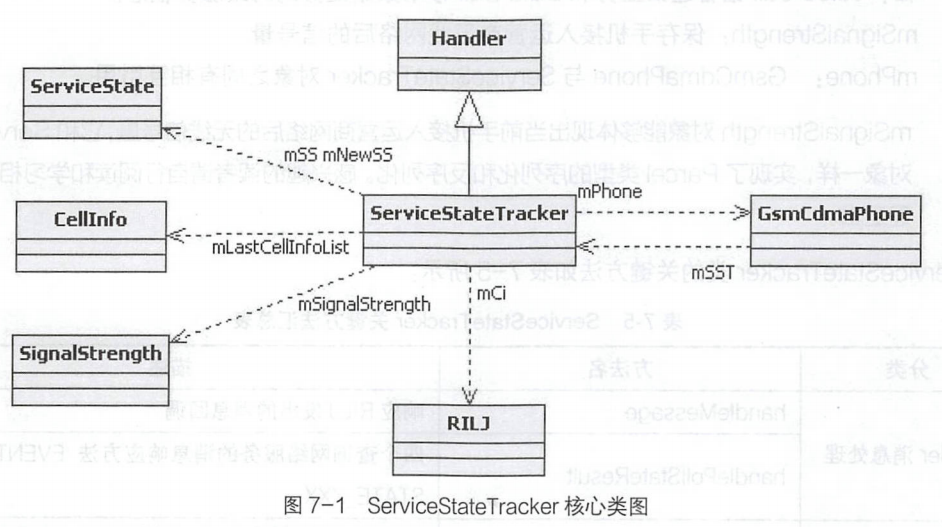
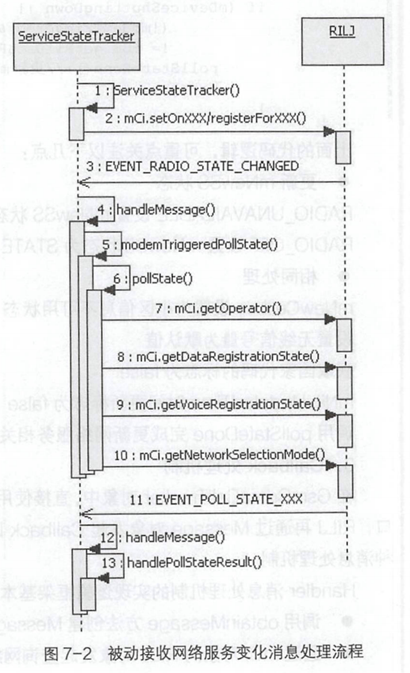

# 简述

- Android Telephony
  - ServiceState类结构中的方法
  - ServiceStateTracker的类结构：属性、方法
  - ServiceStateTracker的核心业务Handler消息处理机制：消息的注册、响应、Callback回调处理方式
  - 网络服务信息处理handlePollStateResult()方法：处理结果、获得并更新新网络状态、更新旧网络状态
  - `*#*#4636#*#*`测试工具的子项

# ServiceState网络服务

## ServiceState

### 关键方法

- ServiceState类实现了Parcelable接口，使用Parcel序列化方式，关键方法主要体现在以下三个方面。
  - get/set 方法
  - rilRadioTechnologyToString方法获取手机网络类型对应关系
  - toString 方法
    - toString方法将主要的网络服务信息转换为字符串

- ServiceState类的序列化过程和反序列化过程主要包括writeToParcel 序列化过程和createFromParcel反序列化过程.在序列化过程和反序列化过程中,对序列化流的操作将保持一致。

## ServiceStateTracker

- 以ServiceStateTracker类为核心的ServiceState网络服务信息的管理和运行机制。
- ServiceStateTracker可理解为网络服务信息业务管理的跟踪者，GsmCdmaPhone对象将网络服务信息交给它来管理和维护
  - 管理网络服务信息
  - 提供网络服务控制管理能力

### 关键属性

- 
  - ServiceStateTracker与GsmCdmaCallITracker类相同，它继承于Handler类，其实质是自定义Handler消息处理类。
  - ServiceState、Cellnfo 和SignalStrength三个类均实现了Parcelable 接口，对象都可以跨进程传递
  - ServiceStateTracker和GsmCdmaPhone对象相互引用。
  - mSS和mNewSS,保存接入的运营商网络服务状态以及运营商的基本信息，主要包括两个方面:VoiceCall语音通话业务和DataCall移动数据业务的网络服务信息。

### 关键方法

- | 分类             | 方法名                            | 描述                                                         |
  | ---------------- | --------------------------------- | ------------------------------------------------------------ |
  | Handler消息处理  | handleMessage                     | 响应RILJ发出的消息回调                                       |
  |                  | handlePollStateResult             | 四个查询网络服务的消息响应方法EVENT_POLL_STATE_XXX ;         |
  | 更新网络服务信息 | pollState/modemTriggeredPollState | 查询基本网络服务信息,包括getOperator查询电信运营商信息、getDataRegistrationState 查询移动数据注册状态、getVoiceRegistrationState查询语音注册状态、getNetworkSelectionMode 查询网络模式 |
  |                  | pollStateDone                     | 根据pollState的查询结果，完成mSS信息的更新并发出ServiceState变化的消息通知 |
  | 更新网络服务信息 | updateSpnDisplay                  | 更新网络运营商显示名称，SPN：Service Provider Name           |
  |                  | queueNextSignalStrengthPoll       | 查询当前无线信号                                             |
  |                  | onSignalStrengthResult            | 根据queueNextSignalStrengthPoll的查询结果，更新信号          |
  | 网络服务控制     | setRadioPower                     | 开关Radio无线通信模块                                        |
  |                  | enableLocationUpdates             | 开启位置更新消息上报                                         |
  |                  | disableLocationUpdates            | 关闭位置更新消息上报                                         |

  - pollStateDone方法根据查询网络服务的结果,更新mSS和mSignalStrength对象来完成网络服务信息的更新，主要处理逻辑与GsmCdmaCallTracker 对象的处理方式非常相似，handlePollCalls与handlePollStateResult方法相对应，都是处理RILJ对象返回的查询信息。
  - 网络服务的控制由GsmCdmaPhone对外提供统一的方法， 通过ServiceStateTracker mSST对象调用对应的方法来实现

### Handler 消息处理机制

- ServiceStateTracker类的本质是自定义的Handler消息处理类，Handler 消息的处理逻辑是当前类的核心业务。

  - 基本的Handler消息注册和响应处理机制

  - Handler 消息Callback回调处理方式

#### 消息注册

- 在ServiceStateTracker类的构造方法进行Handler消息注册
- ServiceStateTracker对象会被动接收并响应RILJ对象发出的七种类型的Handler消息。服务状态变化的Handler消息都定义在ServiceState Tracker抽象类
  中，并且仅在ServiceStateTracker 相关的类中产生响应。有且仅有ServiceStateTracker对象会接收和响应RILJ 对象发出的这几种与网络服务状态相关的
  Handler消息通知。

#### 消息响应

- 针对在构造方法中注册的七种Handler 消息，handleMessage响应逻辑中提取这七种Handler消息的响应逻辑
  - 在五个重要的Handler类型消息的响应过程中，会产生两次modemTriggeredPollState方法调用来查询网络服务信息，onSignalStrengthResult 方法调用更新网络信号，onRestrictedStateChanged方法调用更新网络注册信息。
    - modemTriggeredPollState方法，是Modem触发的查询PollState调用，将发起对pollState(true)的调用来查询当前最新网络服务信息
      - 查询网络服务逻辑:使用mCi对象连续向RILJ对象发出四个关于网络服务信息的查询请求
      - Radio 无线通信模块状态异常的处理逻辑

#### Callback 处理机制

- 在GsmCdmaCallTracker对象中,直接使用Message对象作为参数访问RILJ对象的通话管理接口，RILJ再通过Message对象发起Callback回调;在ServiceStateTracker类中，同样也采用了这种消息处理机制。
- 步骤
  - 调用 obtainMessage()方法创建Message对象.
  - 通过mCi 对象向RILJ对象发起查询网络服务信息的方法调用.
- 在RIL中处理完ServiceStateTracker对象发起的ServiceState相关的请求后，使用Message对象发起Callback回调消息通知。ServiceStateTracker 对象中的响应和处理方式全部一致
- 对四个查询网络服务的请求的响应方式都一样，都是调用handlePollStateResult 方法。
- handlePollStateResult与GsmCdmaCallTracker类中的handlePollCalls 方法的处理机制非常相似，都是处理向RILJ对象发起查询请求返回的结果。

#### 与RILJ对象的交互机制

- ServiceStateTracker与RILJ对象的交互完成了服务信息的管理和控制,并将服务信息保存在两个属性对象mSS和mNewSS中。与GsmCdmaCallITracker一样，其交互方式可分为两大类。
  - ServiceStateTracker 对象主动发起
  - ServiceStateTracker对象被动接收

##### 被动接受

- 
  - ServiceStateTracker 对象的Handler消息处理机制，它会被动接收RILJ 对象上报的七种类型的Handler消息,其中EVENT_ RADIO_STATE_CHANGED和EVENT_NETWORK_ STATE_CHANGED类型的Handler消息将触发modemTriggeredPollState调用
  - ServiceStateTracker与GsmCdmaPhone对象具有相同的生命周期。TeleService 系统应用加载Telephony业务模型的过程中,同步完成ServiceStateTracker对象的创建
  - 在handlePollStateResult方法中，对四种不同类型Handler 消息区分处理，主要是更新mNewSS对象对应的属性，最后调用pollStateDone方法完成收尾工作。pollStateDone方法主要是通过mNewSS更新mSS对象，若网络服务信息发生了改变，将发起对应的消息通知。

#####   主动发起

- ServiceStateTracker对象主动向RILJ 对象发起网络服务管理控制请求，其中最重要的是调用setRadioPower方法打开或关闭Radio无线通信模块，ServiceStateTracker 对象则会调用RILJ对象中对应的服务状态控制方法
- 由ServiceStateTracker对象主动向RILJ对象发起ServiceState管理和控制的交互流程
  1. mCi.setRadioPower交互，没有直接的Message消息回调处理过程
  2. 响应EVENT_RADIO_STATE_CHANGED类型的Handler消息。

##   handlePollStateResult方法

- RIL完成ServiceStateTracker对象发起的查询最新网络服务信息的请求后，RILJ对象使用ServiceStateTracker对象创建的Message发起Callback消息回调。在ServiceStateTracker对象中，由handlePollStateResult 方法进行网络服务信息处理，将查询出的当前最新网络服务信息更新并保存在ServiceStateTracker对象的多个属性中
  1. 异常处理。
  2. 调用 handlePollStateResultMessage方法，分别处理四个不同网络信息查询的返回结果。
  3. 收尾工作， 四个网络信息查询工作全部处理完成后，再更新mNewSS属性和调用pollStateDone方法。

###   处理网络信息查询结果

- EVENT_POLL_STATE_REGISTRATION逻辑分支将处理当前注册的语音网络服务信息的查询结果
- EVENT_POLL_STATE_GPRS逻辑分支将处理当前注册的移动数据网络服务信息的查询结果
- EVENT_POLL_STATE_OPERATOR逻辑分支将处理当前注册的运营商网络服务信息的查询结果
- EVENT_POLL_STATE_NETWORK_SELECTION_MODE逻辑分支将处理查询网络选择类型是手动还是自动
- GsmCdmaPhone对象通过getServiceState方法获取ServiceStateTracker对象的mSS属性，即当前网络服务信息，handlePollStateResultMessage 方法根据查询的网络服务信息更新mNewSS属性。mNewSS对象更新后，在pollStateDone方法中将最新的网络服务信息更新到ServiceStateTracker对象的mSS属性中。

###   再更新mNewSS属性

- 在handlePollStateResult方法中调用pollStateDone方法来完成查询网络服务信息结果的收尾工作，需要一个前提条件，就是EVENT_ POLL_ STATE _XXX类型的四个查询网络服务信息必须全部处理完成
- 在查询网络服务信息结束后根据ServiceStateTracker对象的mGsmRoaming和mDataRoaming属性，获取漫游标志roaming, 然后调用mNewSS.setVoiceRoaming(roaming)和mNewSS.setDataRoaming(roaming)完成mNewSS对象的更新。在mNewSS对象更新了Roaming和mlsEmergencyOnly状态后，才调用pollStateDone方法完成收尾工作。

###  收尾工作pollStateDone()方法

- pollStateDone方法的主要处理逻辑是完成查询网络服务信息结果的收尾工作
  - 对比mSS和mNewSS两个ServiceState对象的网络服务信息，获取hasXXX网络服务信息更新标志。
  - 更新mSS、mCellL oc对象信息，同时更新mRejectCode、mMaxDataCalls、 mReasonDataDenied等属性。
    - 在ServiceStateTracker 与RILJ 对象的交互过程中，首先更新ServiceStateTracker 对象的mNewXXX属性，在调用pollStateDone方法进行收尾工作时，更新ServiceStateTracker对象中对应的mXXX属性，即当前网络服务信息对象或属性
  - 发出网络服务变化的消息通知。
    - 在网络服务信息发生了变化以后，主要是调用 updateSpnDisplay方法更新SPN的显示。和通过 TelephonyManager设置驻网的运营商的名称和编号、是否漫游标志。TelephonyManager对应的处理逻辑是设置对应的SystemProperties
    - 通过GsmCdmaPhone对象的notifyServiceStateChanged方法调用，发出网络服务变化的通知
    - pollStateDone方法的其他消息通知，绝大部分都是发起mXXXRegistrants. notifyRegistrants调用

## `*#*#4636#*#*`测试工具

- 子项
  - Phone information
    - 网络服务信息
      - 获取方式：通过GsmCdmaPhone对象直接获取；通过ITelephonyRegistry回调。
    - 小区信息
  - Usage statistics
  - WiFi information

### ITelephonyRegistry

- ITelephonyRegistry消息的注册是在RadioInfo类的onResume方法中完成的
- TelephonyManager向ITelephonyRegistry服务监听了10个PhoneState变化的消息，Callback消息回调是mPhoneStatel istener,它继承自PhoneStatel istener类，重写了父类的11个方法。
- PhoneStateL istener类为了实现跨进程的Callback调用，有一个IPhoneStatel istenerStub类型的内部类对象callback, 继承了IPhoneStateListener .Stub，其中的方法逻辑是通过Handler消息转化为对主类方法的调用，从而实现了模板方法。
- ITelephonyRegistry系统服务运行在system_server 进程空间，加载Android系统的过程中将同步加入到系统服务中，服务名为"telephony.registry"。

- 
  - TelephonyRegistry实现了ITelephonyRegistry, 提供的系统服务主要有两个类型: listen/listenForSubscriber对mRecords进行管理( Callback列表)。
  - TelephonyRegistry的内部类Record将记录Callback信息。
  - GsmCdmaPhone对象触发PhoneState变化消息Callback调用。在创建GsmCdmaPhone对象时，将同步创建DefaultPhoneNotifier 对象并保存mNotifier引用。在DefaultPhoneNotifier的构造方法中，将获取ITelephonyRegistry服务的Binder对象。因此，GsmCdmaPhone 通过mNotifier发起PhoneState变化消息通知，通过第一次的跨进程调用( com.android.phone→system_ server )触发TelephonyRegistry提供的消息通知接口。
  - TelephonyRegistry接收notifyXXX调用，遍历mRecords,发出callback调用
  - ITelephonyRegistry系统服务的运行机制主要是两次跨进程接口调用
    1. GsmCdmaPhone对象调用ITelephonyRegistry 系统服务的ntifyXXX, 消息源头是com.android.phone进程中的GsmCdmaPhone对象;
    2. 通过已经注册监听的mRecords列表通过IPhoneStatel istener发起Callback回调，消息的处理终点在监听PhoneState变化的应用进程中。