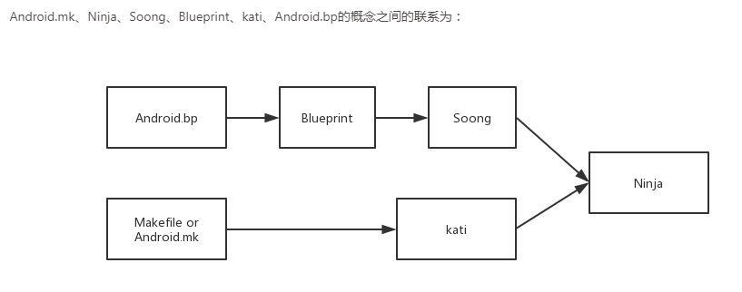

## 编译

- Android编译系统
  - **Makefile**：Android平台的编译系统，其实就是用Makefile写出来的一个独立项目。它定义了编译的规则，实现了“自动化编译”，不仅把分散在数百个Git库中的代码整合起来、统一编译， 而且还把产物分门别类地输出到一个目录，打包成手机ROM，还可以生成应用开发时所使用的SDK、NDK等。
    因此，采用Makefile编写的编译系统，也可以称为Makefile编译系统。
  - **Android.mk**：Makefile编译系统的一部分，定义了一个模块的必要参数，使模块随着平台编译。通俗来讲就是告诉编译系统，以什么样的规则编译你的源代码，并生成对应的目标文件。
  - **Ninja**：Ninja是一个致力于速度的小型编译系统，如果把其他的编译系统看作高级语言，那么Ninja 目标就是汇编。
  - **Soong**：Soong是谷歌用来替代此前的Makefile编译系统的替代品，负责解析Android.bp文件，并将之转换为Ninja文件
  - **Blueprint**：Blueprint用来解析Android.bp文件翻译成Ninja语法文件。
  - **kati**：kati是谷歌专门为了Android而开发的一个小项目，基于Golang和C++。 目的是把Android中的Makefile，转换成Ninja文件。
  - **Android.bp**：Android.bp，是用来替换Android.mk的配置文件。
  - 

- 编译时的`lunch`,编译目标的格式组成为BUILD-BUILDTYPE，比如`aosp_arm-eng`的BUILD为aosp_arm，BUILDTYPE为eng。
  - BUILDTYPE 指的是编译类型
    - user：用来正式发布到市场的版本，权限受限，如没有 root 权限，不能 dedug，adb默认处于停用状态。
    - userdebug：在user版本的基础上开放了 root 权限和 debug 权限，adb默认处于启用状态。一般用于调试真机。
    - eng：开发工程师的版本，拥有最大的权限(root等)，具有额外调试工具的开发配置。一般用于模拟器。
- 编译后的镜像文件
  - system.img：系统镜像，里面包含了Android系统主要的目录和文件，通过init.c进行解析并mount挂载到/system目录下。
  - userdata.img：用户镜像，是Android系统中存放用户数据的，通过init.c进行解析并mount挂载到/data目录下。
  - ramdisk.img：根文件系统镜像，包含一些启动Android系统的重要文件，比如init.rc。
- 单编
  - mmm：编译指定目录下的模块，不编译它所依赖的其它模块。
  - mma：编译当前目录下的模块及其依赖项。
  - mmma：编译指定路径下所有模块，并且包含依赖。
- 查看修改
  - 通过adb push或者adb install 来安装APK。
  - 使用make snod命令，重新生成 system.img，运行模拟器查看。

## 装饰器模式

- 装饰器模式（Decorator Pattern）允许向一个现有的对象添加新的功能，同时也不改变其结构。这种类型的设计模式属于结构型模式，它是作为现有类的一个包装。创建一个现有的包装类，并在保持这种类型的保护类的功能下，提供了更多的功能。
- **增加：**动态地给一个对象添加额外的职责。就功能而言，装饰器模式比生成子类更加灵活。
- **主要解决：**一般的，我们为了扩展一个类，使用继承方式实现，由于继承为类的影响经常特征，随着扩展功能的增加，子类会很膨胀。
- **什么时候使用：**在不想增加很多子类的情况下扩展类。
- **如何解决：**将具体职责划分，同时继承装饰者。
- **1、组件类代码** 实现类父类和角色。2、组件类应该引用继承类，具体扩展类继承类。
- **优点：**装饰类和被装饰类可以独立发展，不会连接，装饰模式是继承的一种替代模式，装饰模式可以动态扩展一个实现类的功能。
- **对比：**比较复杂。
- **使用： 1、扩展一个类的场景** 。 2、动态增加功能，撤销功能。
- **注意事项：**可代替继承。

## IMSI和IMEI

- IMSI：International Mobile Subscriber Identity
  - MCC+MNC+MSIN 
    - MCC：Mobile Country Code
    - MNC：Mobile NetworkCode
    - MSIN：Mobile Subscriber IdentificationNumber
- IMEI：International Mobile Equipment Identity

## WWAN

**Wireless wide area network**，是无线网络的一种形式。与局域网相比，广域网的规模更大，需要的技术也不一样。WWAN 通常与无线局域网(WLAN) 不同，它使用诸如2G、3G、4G LTE和5G等移动电信 蜂窝网络技术来传输数据。它有时被称为移动宽带。

## google message Setting

- **CarrierConfig**：配置文件位于packages/apps/CarrierConfig/assets/xxx.xml
  - **key**对应着CarrierConfigManager.java的配置。
  - **carrier_list.textpb**：配置文件的名字来源，文件名和carrier_list中一一对应。