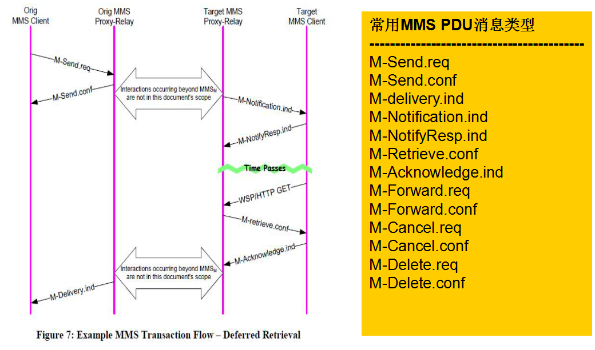

# 简述

- 结束spn获取显示追踪流程；MMS的基础概念和PDU组成；使用WireShark查看ntlog

# MMS

- MMS：Mutimedia Message Service
- WAP：Wireless Application Protocol
- SMIL：Synchronized Multimedia Integration Language
- 作用：文字、图片、视频、音频
- 流程：MT->WAP网关(无线网络)->SMSC（Internet）->MT
  - 发送：MMS client与WAP 网关建立连接，通过WAP 将信息发送至MMSC，MMSC暂时保存彩信，并会给发送方一个确认消息。
  - 接收：MMSC接收到消息后，通过PUSH协议给接收方发送一条WAPPUSH 消息，这个消息通常是一条特殊短信，里面包含彩信的位置URL。接收方收到短信通知后，从中取出URL，然后通过标准的HTTP GET请求从MMS Proxy-Relay上获取彩信。
- 

- PDU结构

  - 由MMS Header和MMS Body组成，MMS头由多个域名和域值组成，由客户端指定。
    - 一个MMS PDU对应一种消息格式。不同类型的MMS PDU有不同的MMS Header ；
    - 大多数MMS PDU只含有MMS头，它们起到建立和维持通信的作用，只有在M-Send.req和M-Retrieve.conf PDU中才有消息体。

- | 域名              | 说明                                     | 编码 |
  | ----------------- | ---------------------------------------- | ---- |
  | Bcc               | 密送者地址                               | 0x01 |
  | Cc                | 抄送者地址                               | 0x02 |
  | Content-Location  | 短息通知时用于存放MM所在服务器的Uri地 址 | 0x03 |
  | Content-Type      | 内容类型                                 | 0x04 |
  | Date              | 日期                                     | 0x05 |
  | Delivery-Report   | 状态报告（默认为不需要)                  | 0x06 |
  | Delivery-Time     | 报告时间                                 | 0x07 |
  | Expiry            | 有效期                                   | 0x08 |
  | From              | 发送者信息                               | 0x09 |
  | Message-Class     | 信息的类型(个人·广告·信息还是自动)       | 0x0A |
  | Message-ID        | 信息ID，识别不同的彩信                   | 0x0B |
  | Message-Type      | PDU类型                                  | 0x0c |
  | MMs-Version       | 使用MMS协议的版本                        | 0x0D |
  | Message-Size      | MM的大小                                 | 0x0E |
  | Priority          | 优先级                                   | 0x0F |
  | Read-Reply        | 是否需要阅读报告                         | 0x10 |
  | Report-Allowed    | 是否允许报告                             | 0x11 |
  | Response-Status   | 回复状态                                 | 0x12 |
  | Response-Text     | 回复文本                                 | 0x13 |
  | Sender-Visibility | 发送者是否可见(即是否匿名发送)           | 0x14 |
  | status            | 信息状态（是否立即接收，拒绝还是不支 持) | 0x15 |
  | Subject           | 主题                                     | 0x16 |
  | To                | 接收者地址                               | 0x17 |
  | Transaction-ld    | 传输ID(用于网络控制，识别不同的传输)     | 0x18 |