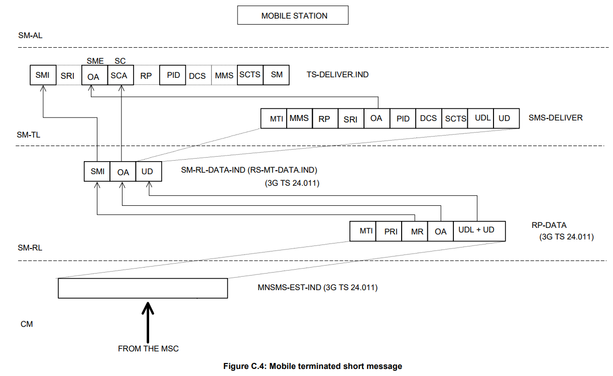
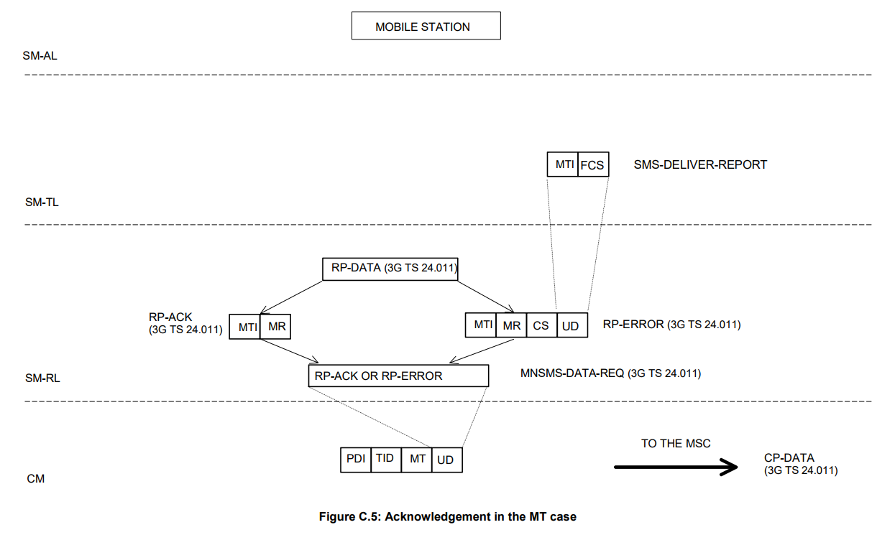
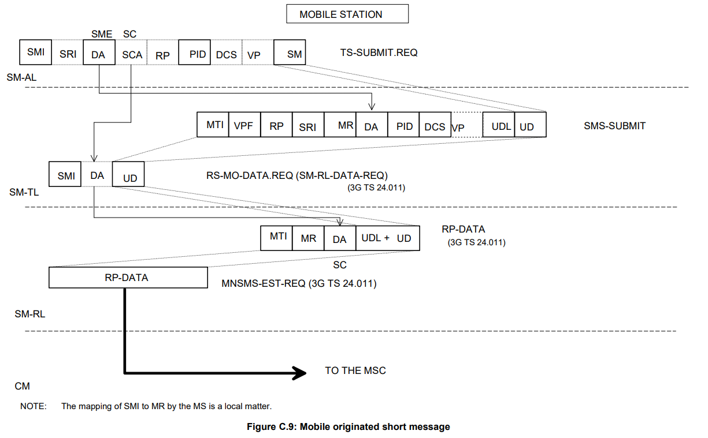
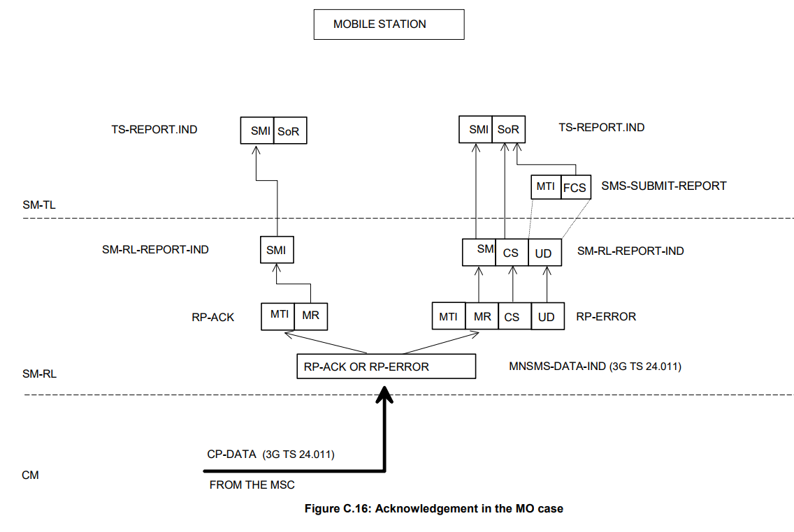

# 简述

- 再次对sms相关协议学习中遇到的问题与导师沟通和解决
- 确定下一步的计划
  1. 观看导师的jira，学习具体的问题处理方式
  2. LTE的机制和流程
  3. RCS

# 记录

## Short message information flow

### MT

- 

- 

  ### MO

- 

- 

## 缩写

- SMR                   Short Message  Relay  (entity)
  SMC                   Short Message  Control (entity)
  CM- sub             Connection  Management  sublayer 
  SM- CP               Short Message  Control Protocol
  MM- sub            Mobility  Management  sublayer 
  GMM-sub          GPRS  Mobility  Management  sublayer 
  RR- sub              Radio  Resource  Management  sublayer 
  LLC-sub              Logical  Link  Control  sublayer 
  GRR-sub             GPRS  Radio  Resource  sublayer  in  GSM 
  EMM-sub            EPS Mobility  Management  sublayer 
  5GMM-sub         5G  Mobility Management  sublayer

## Service provided by the CM- sublayer

- In order to  support the  Short  Message  Service,  the  CM- sublayer  provides  services  to  the  Short  Message  Relay  Layer.

- MNSMS service primitives on the MS-side

  - | SERVICE PRIMITIVES |      | PARAMETER |
    | ------------------ | ---- | --------- |
    | NAME               | TYPE |           |
    | MNSMS-ABORT        | Req  | Cause     |
    | MNSMS-DATA-        | Req  | MO RPDU   |
    | MNSMS-DATA-        | Ind  | MT RPDU   |
    | MNSMS-EST-         | Req  | MO RPDU   |
    | MNSMS-EST-         | Ind  | MT RPDU   |
    | MNSMS-ERROR        | Ind  | Cause     |
    | MNSMS-REL          | Req  | Cause     |

  - MNSMS- ABORT- REQuest：A  request  from  an  SMR  entity  to  release  a  CM- connection in  abnormal  cases.
  - MNSMS- DATA- REQuest：A  request  from  an  SMR  entity  to  send a  RPDU  on the  established  CM- connection.
  - MNSMS- DATA- INDication：An  indication  used  by the  SMC  entity  to pass  the  user  information  element  (RPDU)  of  a received  CP- DATA  message to SM- RL.
  - MNSMS- ESTablish- REQuest：A  request  from  an  SMR  entity  to  establish  a  CM- connection.  The  request  contains  a  RP- DATA  UNIT as  a  parameter. 
    -        establishment  of  a  CM- connection for  this  SMR  entity;
    -        forming  of the  CP- DATA  message  containing  the  RPDU;  and 
    -        passing  of CP- DATA to  the  MM- sublayer.
  - MNSMS- ESTablish- INDication：An  indication  used  by the  SMC  entity  to pass  the  SM- user  information  (RPDU)  of a  received  CP- DATA  message  to SM- RL.  It  implies  completion  of the  establishment  of the  CM- connection for  this  SMR  entity.

## Service provided by SM- RL

- In order to  support the  Short  Message  Service,  the  Short  Message  Relay  Layer  provides  services  to  the  Short  Message 
  Transfer  Layer.

- Definition of primitives on the MS side

  - 

  - | SERVICE PRIMITIVES     | PARAMETER |                       |
    | ---------------------- | --------- | --------------------- |
    | NAME                   | TYPE      |                       |
    | SM-RL-DATA-            | Req       | MO SMSTPDU            |
    | SM-RL-DATA-            | Ind       | MT SMSTPDU            |
    | SM-RL-MEMORY AVAILABLE | Req       | See subclause 3.3.1.3 |
    | SM-RL-REPORT-          | Req       | See subclause 3.3.1.4 |
    | SM-RL-REPORT-          | Ind       | See subclause 3.3.1.5 |

    - SM- RL- DATA- REQuest：A  request  from  the  SM- TL  entity  to  pass  the  SMS- TPDU  and  necessary control  information  to SM- RL
      - establishment  of  an SM- RL  connection  for  MO  message  transfer;
      - forming  of the  RP- DATA  message,  containing  the  SMS- TPDU;
      - transfer  of the  RP- DATA message  as  an RPDU  in an  MNSMS- EST- Req.
    - SM- RL- DATA- INDication：An  indication  used  by the  SMR  entity  to pass  the  SMS- TPDU  and  necessary  control  information  of a  received RP- DATA  message  to  SM- TL.