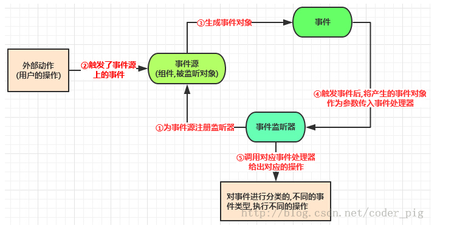
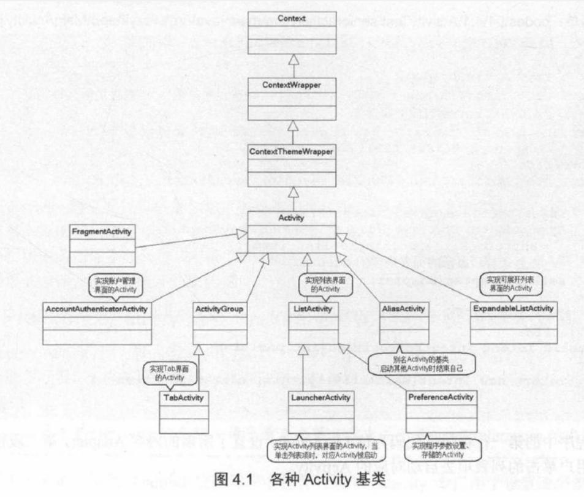

# 概述

- 疯狂Android讲义（168页-229页，第四章深入了解Activity和Fragment）
  - 第二章
    1. 对话框组件的剩余部分
    2. 菜单
    3. 活动条
  - 第三章
    1. 基于监听的事件处理
    2. 基于回调的事件处理
    3. 系统设置响应
    4. 消息传递机制
    5. 异步任务
  - 第四章
    - Activity的配置、启动、关闭
    - Activity间的数据交换，Intent的bundle

# 疯狂Android第二章

## 对话框dialog剩余部分

### 对话框风格的窗口

- ```xml
  <!-在AndroidManifest.xml文件中指定该窗口以对话框风格显示->
  <activity android:name=".MainActivity" android: theme="@android:style/Theme.Material.Dialog"></activity>
  ```

### PopupWindow

- PopupWindow可以创建类似对话框风格的窗口
- 使用流程
  1. 调用 PopupWindow的构造器创建PopupWindow对象。
  2. 调用PopupWindow的showAsDropDown(View v)将PopupWindow作为V组件的下拉组件显示出来;或调用PopupWindow的showAtLocation()方法将PopupWindow在指定位置显示出来。

### DatePickerDialog、TimePickerDialog

- 类似于picker，只是用对话框显示出来
- 使用流程
  1. 通过构造器创建DatePickerDialog、TimePickerDialog实例，调用它们的show0方法即可将日期选择对话框、时间选择对话框显示出来。
  2. 为DatePickerDialog 、TimePickerDialog 绑定监听器，这样可以保证用户通过DatePickerDialog、TimePickerDialog 选择日期、时间时触发监听器，从而通过监听器来获取用户所选择的日期、时间。
- 注意：选择日期对话框、选择时间对话框只是供用户来选择日期、时间的，对Android的系统日期、时间没有任何影响。

### ProgressDialog

- ProgressDialog代表了进度对话框，程序只要创建ProgressDialog 实例，并将它显示出来就是一个进度对话框。（已被Android 8 弃用，deprecated）

##菜单Menu

- 关系
  - Menu：选项菜单不支持勾选标记，并且只显示菜单的“浓缩(condensed) ”标题。add()方法用于添加菜单项; addSubMenu()用于添加子菜单。
    - SubMenu:它代表 一个子菜单。可以包含1~N个MenuItem (形成菜单项)。不支持菜单项图标，不支持嵌套子菜单。可以设置菜单头的图标和标题，用view设置菜单头
    - ContextMenu:它代表一个上下文菜单。可以包含1~N个Menultem (形成菜单项)。不支持菜单快捷键和图标。
- 添加子菜单和菜单
  1. 重写Activity的onCreateOptionsMenu(Menu menu)方法，在该方法里调用Menu对象的方法来添加菜单项或子菜单。
     - 如果希望所创建的菜单项是单选菜单项或多选菜单项，则可以调用Menultem的setCheckable(boolean checkable)来设置该菜单项是否可以被勾选。默认是多选菜单项。
     - 如果希望将一组菜单里的菜单项都设为可勾选的菜单项使用setGroupCheckable(int group, boolean checkable, boolean exclusive)来设置group组里的所有菜单项是否可勾选:如果将exclusive 设为true,那么它们将是一组单选菜单项。
  2. 如果希望应用程序能响应菜单项的单击事件，那么重写Activity 的onOptionsItemSelected(Menultem mi)方法即可。
     - 使用监听器可以为每个事件单独设置监听菜单事件。setOnMenuItemClickListener(MenuItem.OnMenuItemClickListener menultemClickListener)
- 点击菜单项跳转其他Activity：调用Menultem 的setIntent(Intent intent)方法

### ContextMenu

- Android 用ContextMenu来代表上下文菜单。因为ContextMenu继承了Menu,因此程序可用相同的方法为它添加菜单项。
- 开发上下文菜单与开发选项菜单的区别:开发上下文菜单不是重写onCreateOptionsMenu(Menu menu)方法，而是重写onCreateContextMenu (ContextMenu menu, View source, ContextMenu.ContextMenuInfo menulnfo)方法。
  - source：参数代表触发上下文菜单的组件。
- 使用步骤
  1. 重写Activity的onCreateContextMenu(ContextMenu menu, View source, ContextMenu.ContextMenuInfo menuInfo)方法。
  2. 调用Activity的registerForContextMenu(View view)方法为view组件注册上下文菜单。
  3. 如果希望应用程序能为菜单项提供响应，则可以重写onContextItemSelected(Menultem mi)方法，或为指定菜单项绑定事件监听器。

### 使用XML定义菜单

- 菜单资源文件通常应该放在\res\menu目录下，菜单资源的根元素通常是<men.../>, <men.../>元素无须指定任何属性。
  - <item..>元素:定义菜单项。<ite.../>元素用于定义菜单项，<iterm...> 元素又可包含<men.../>元素，位于<ite.../>元素内部的<men.../>就代表了子菜单。
    - 可以指定id，icon，title等
  - <group..>子元素:将多个iten.../>定义的菜单项包装成一个菜单组。用于控制整组菜单的行为，该元素常用属性：
    - checkableBehavior: 指定该组菜单的选择行为。可指定为none (不可选)、all (多选)和single (单选)三个值。
    - menuCategory: 对菜单进行分类，指定菜单的优先级。有效值为container、system、secondary和alternative。
    - visible:指定该组菜单是否可见。
    - enable:指定该组菜单是否可用。
- 使用菜单：重写Activity的onCreateOptionsMenu (用于创建选项菜单)、onCreateContextMenu (用于创建上下文菜单)方法，在这些方法中调用MenuInflater对象的inflate、方法加载指定资源对应的菜单即可。

### 使用PopupMenu创建弹出式菜单

- PopupMenu代表弹出式菜单，它会在指定组件上弹出PopupMenu,在默认情况下，PopupMenu会显示在该组件的下方或者上方。
- 使用流程
  1. 调用PopupMenu(Context context, View anchor)构造器创建下拉菜单，anchor 代表要激发该弹出菜单的组件。
  2. 调用MenuInflater的inflate(方法将菜单资源填充到PopupMenu中。
  3. 调用PopupMenu的show(方法显示弹出式菜单。

## 活动条ActionBar

- ActionBar位于屏幕的顶部。ActionBar 可显示应用的图标和Activity 标题，ActionBar 的右边还可以显示活动项( Action Item)。

- 功能

  - 显示选项菜单的菜单项(将菜单项显示成Action Item)。
  - 使用程序图标作为返回Home主屏或向上的导航操作。
  - 提供交互式View作为Action View。
  - 提供基于Tab的导航方式，可用于切换多个Fragment。
  - 提供基于下拉的导航方式。

- ActionBar关闭：安卓不低于3.0的版本都自动打开ActionBar，关闭

  - ```xml
    <application android: icon="@drawable/ic launcher" android: theme= "@android: style/Theme.Material.NoActionBar" android: label="@string/app name">
    </application>
    ```

  - ActionBar提供show（）和hide（）显示和隐藏ActionBar

- ActionBar显示选项菜单项：

  - setShowAsAction(int actionEnum):该方法设置是否将该菜单项显示在ActionBar上，作为Action Item。
  - android:showAsAction：XML属性设置
  - 如果ActionBar显示空间不足，有Menu按键的按Menu就可以看到，没有Menu按键提供三个的图标，点击可看到剩余的选项菜单项。

- 启用程序图标导航

  - ActionBar方法

    - | 方法                                            | 说明                                                         |
      | ----------------------------------------------- | ------------------------------------------------------------ |
      | setDisplayHomeAsUpEnabled(boolean showHomeAsUp) | 设置是否将应用程序图标转变成可点击的图标，并在图标上添加一个向左的箭头。 |
      | setDisplayOptions(int options)                  | 通过传入int 类型常量来控制该ActionBar的显示选项。            |
      | setDisplayShowHomeEnabled(boolean showHome)     | 设置是否显示应用程序图标。                                   |

- 添加Action View

  - 在ActionBar上除可以显示普通的Action Item 之外，还可以显示普通的UI组件。
    1. 定义Action Item时使用android:actionViewClass属性指定Action View的实现类。
    2. 定义Action Item时使用android:actionI ayout属性指定Action View对应的视图资源。

# 事件机制

- 当用户在程序界面上执行各种操作时，应用程序必须为用户动作提供响应动作，这种响应动作就需要通过事件处理来完成。

- 方式
  - 基于回调的事件处理
    - 做法：为Android界面组件绑定特定的事件监听器
  - 基于监听的事件处理
    - 做法：重写Android组件特定的回调方法，或者重写Activity的回调方法。

## 基于监听的事件处理

- 

- 处理模型对象
  - Event Source (事件源) ;事件发生的场所，通常就是各个组件，例如按钮、窗口、菜单等。
  - Event (事件) :事件封装了界面组件上发生的特定事情(通常就是一次用户操作)。如果程序需要获得界面组件上所发生事件的相关信息，一般通过Event对象来取得。
  - EventListener(事件监听器);负责监听事件源所发生的事件，并对各种事件做出相应的响应。

- 基于监听的事件处理机制是一种==委派式(Delegation) 事件处理方式==:普通组件(事件源)将整个事件处理委托给特定的对象(事件监听器);当该事件源发生指定的事件时，就通知所委托的事件监听器，由事件监听器来处理这个事件。
  - 每个组件均可以针对特定的事件指定一个事件监听器
  - 每个事件监听器也可监听一个或多个事件源。
  - 同一个事件源上可能发生多种事件，委派式事件处理方式可以把事件源上所有可能发生的事件分别授权给不同的事件监听器来处理;同时也可以让一类事件都使用同一个事件监听器来处理。
- 使用流程
  1. 获取普通界面组件(事件源)，也就是被监听的对象。
  2. 实现事件监听器类，该监听器类是一个特殊的类，必须实现一个XxxListener接口。
  3. 调用事件源的setXxxListener方法将事件监听器对象注册给普通组件(事件源)。

### 事件和事件监听器

- 事件监听器：**实现了特定接口的实例**

- **Android对事件监听模型做了进一步简化**:如果事件源触发的事件足够简单，事件里封装的信息比较有限，那就无须封装事件对象，将事件对象传入事件监听器。

- 但对于**键盘事件、屏幕触碰**事件等，此时**程序需要获取事件发生的详细信息**。例如，键盘事件需要获取是哪个键触发的事件;触摸屏事件需要获取事件发生的位置等，对于这种包含更多信息的事件，Android 同样会将事件信息封装成XxxEvent对象，并把该对象作为参数传入事件处理器。

- 在基于监听的事件处理模型中，事件监听器必须实现事件监听器接口，Android为不同的界面组件提供了不同的监听器接口，这些接口通常以内部类的形式存在。

  - View类的内部接口

    - | 接口                             | 说明                                           |
      | -------------------------------- | ---------------------------------------------- |
      | View.OnClickListener             | 单击事件的事件监听器必须实现的接口。           |
      | View.OnCreateContextMenuListener | 创建上下文菜单事件的事件监听器必须实现的接口。 |
      | View.onFocusChangeListener       | 焦点改变事件的事件监听器必须实现的接口。       |
      | View.OnKeyListener               | 按键事件的事件监听器必须实现的接口。           |
      | View.OnIongClickListener         | 长按事件的事件监听器必须实现的接口。           |
      | View.OnTouchListener             | 触摸事件的事件监听器必须实现的接口。           |

- **事件监听器的形式**

  - 内部类形式:将事件监听器类定义成当前类的内部类。
  - 外部类形式:将事件监听器类定义成一个外部类。
  - Activity本身作为事件监听器类:让Activity本身实现监听器接口，并实现事件处理方法。
  - Lambda表达式或匿名内部类形式:使用Lambda表达式或匿名内部类创建事件监听器对象。

#### 内部类作为事件监听器类

- 优点

  - 使用内部类可以在当前类中复用该监听器类。

  - 监听器类是外部类的内部类，所以可以自由访问外部类的所有界面组件。

#### 外部类作为事件监听器类

- 优点：如果某个事件监听器需要被多个GUI界面所共享，而且主要是完成某种业务逻辑的实现，则可以考虑使用外部类形式来定义事件监听器类。
- 缺点
  - 事件监听器通常属于特定的GUI界面，定义成外部类不利于提高程序的内聚性。
  - 外部类形式的事件监听器不能自由访问创建GUI界面的类中的组件，编程不够简洁。

#### Activity本身作为事件监听器类

- 优点：形式非常简洁
- 缺点：可能造成程序结构混乱，Activity的主要职责应该是完成界面初始化工作，但此时还需包含事件处理器方法，违背了设计时的本意，从而引起混乱。

#### Lambda表达式作为事件监听器类

- 优点：大部分时候，事件处理器都没有什么复用价值(可复用代码通常都被抽象成了业务逻辑方法)，因此大部分事件监听器只是临时使用一次，所以使用Lambda表达式形式的事件监听器更合适

#### 直接绑定到标签

- 优点：简单，直接在界面布局文件中为指定标签绑定事件处理方法。

## 基于回调的事件处理

- 对于基于回调的事件处理模型来说，事件源与事件监听器是统一的，或者说事件监听器完全消失了。当用户在GUI组件上激发某个事件时，组件自己特定的方法将会负责处理该事件。

- 使用回调机制类处理GUI组件上所发生的事件，需要为该组件提供对应的事件处理方法，这种事件处理方法通常都是系统预先定义好的，因此通常需要继承GUI组件类，并通过重写该类的事件处理方法来实现。

  - 为了实现回调机制的事件处理，Android为所有GUI组件都提供了一些事件处理的回调方法

  - View类的事件处理回调方法

    - | 方法                                                | 说明                                         |
      | --------------------------------------------------- | -------------------------------------------- |
      | boolean onKeyDown(int keyCode, KeyEvent event)      | 当用户在该组件上按下某个按键时触发该方法。   |
      | boolean onKeyLongPress(int keyCode, KeyEvent event) | 当用户在该组件上长按某个按键时触发该方法。   |
      | boolean onKeyShortcut(int keyCode, KeyEvent event)  | 当一个键盘快捷键事件发生时触发该方法。       |
      | boolean onKeyUp(int keyCode, KeyEvent event)        | 当用户在该组件上松开某个按键时触发该方法。   |
      | boolean onTouchEvent(MotionEvent event)             | 当用户在该组件上触发触摸屏事件时触发该方法。 |
      | boolean onTrackballEvent(MotionEvent event)         | 当用户在该组件上触发轨迹球事件时触发该方法。 |

- 使用流程

  1. 自定义View，自定义View时重写该View的事件处理方法
  2. 在界面布局文件中使用这个自定义View

- 基于监听和回调的事件处理的区别

  - 对于基于监听的事件处理模型来说，事件源和事件监听器是**分离**的，当事件源上发生特定事件时，该事件交给事件监听器负责处理。
  - 对于基于回调的事件处理模型来说，事件源和事件监听器是**统一**的，当事件源发生特定事件时，该事件还是由事件源本身负责处理。

### 基于回调的事件传播

- 几乎所有基于回调的事件处理方法都有一个boolean类型的返回值，该返回值用于标识该处理方法是否能完全处理该事件。
  - 如果处理事件的回调方法返回true, 表明该处理方法已完全处理该事件，该事件不会传播出去。
  - 如果处理事件的回调方法返回false,表明该处理方法并未完全处理该事件，该事件会传播出去。
- 对于基于回调的事件传播而言，某组件上所发生的事件不仅会激发该组件上的回调方法，也会触发该组件所在Activity的回调方法，只要事件能传播到该Activity。
- 传播顺序
  - 如果让任何一个事件处理方法返回了true,那么该事件将不会继续向外传播。
  - 当该组件上发生触碰事件时
    1. 触发该组件绑定的事件监听器
    2. 触发该组件提供的事件回调方法
    3. 传播到该组件所在的Activity

## 响应系统设置的事件

- 背景：有时候可能需要让应用程序随系统设置而进行调整

### Configuration 类

- Configuration类专门用于描述手机设备上的配置信息，这些配置信息既包括用户特定的配置项，也包括系统的动态设备配置。

- ```java
  //获得Activity的Configuration对象
  Configuration cfg = getResources().getConfiguration();
  ```

  - Configuration对象的常用属性

    - | 属性               | 说明                                                         |
      | ------------------ | ------------------------------------------------------------ |
      | float fontScale    | 获取当前用户设置的字体的缩放因子。                           |
      | int keyboard       | 获取当前设备所关联的键盘类型。该属性可能返回KEYBOARD NOKEYS、KEYBOARD QWERTY (普通电脑键盘)、KEYBOARD 12KEY (只有12个键的小键盘)等属性值。 |
      | int keyboardHidden | 该属性返回一个boolean值用于标识当前键盘是否可用。该属性不仅会判断系统的硬件键盘，也会判断系统的软键盘(位于屏幕上)。如果该系统的硬件键盘不可用，但软键盘可用，该属性也会返回KEYBOARDHIDDEN NO;只有当两个键盘都不可用时才返回KEYBOARDHIDDEN YES。 |
      | Locale locale      | 获取用户当前的Locale。                                       |
      | int mcc            | 获取移动信号的国家码。                                       |
      | int mnc            | 获取移动信号的网络码。                                       |
      | int navigation     | 判断系统上方向导航设备的类型。该属性可能返回NAVIGATION_ NONAV(无导航)、NAVIGATION DPAD (DPAD导航)、NAVIGATION_ TRACKBALL (轨迹球导航)、NAVIGATION WHEEL (滚轮导航)等属性值。 |
      | int orientation    | 获取系统屏幕的方向，该属性可能返回ORIENTATION LANDSCAPE (横向屏幕)、ORIENTATION PORTRAIT (竖向屏幕)、ORIENTATION SQUARE (方形屏幕)等属性值。 |
      | int touchscreen    | 获取系统触摸屏的触摸方式。该属性可能返回TOUCHSCREEN NOTOUCH ( 无触摸屏)、TOUCHSCREEN STYLUS ( 触摸笔式的触摸屏)、TOUCHSCREEN FINGER (接受手指的触摸屏)等属性值。 |

### 响应系统设置更改

- 基于回调的事件处理方法：重写Activity 的onConfigurationChanged(Configuration newConfig)方法， 当系统设置发生更改时，该方法会被自动触发。
- 为了让该Activity能监听更改的事件，需要在配置该Activity时指定android:configChanges属性

## Handler消息传递机制

- 背景：出于性能优化考虑，Android 的UI 操作并不是线程安全的。为了解决这个问题，Android 制定了一条简单的规则:只允许UI线程修改Activity 里的UI组件。Android平台只允许UI线程修改Activity里的UI组件，这样就会导致新启动的线程无法动态改变界面组件的属性值。

### Handler类

- 作用

  - 在新启动的线程中发送消息。
  - 在主线程中获取、处理消息。

- **新启动的线程何时发送消息呢?主线程何时去获取并处理消息呢?**

  - 为了让主线程能“适时”地处理新启动的线程所发送的消息，显然只能通过回调的方式来实现一一开发者只要重写Handler类中处理消息的方法，当新启动的线程发送消息时，消息会发送到与之关联的MessageQueue, 而Handler 会不断地从MessageQueue中获取并处理消息一一这将 导致Handler类中处理消息的方法被回调。

- | 方法                                                | 说明                                                         |
  | --------------------------------------------------- | ------------------------------------------------------------ |
  | handleMessage(Message msg)                          | 处理消息的方法。该方法通常用于被重写。                       |
  | hasMessages(intwhat)                                | 检查消息队列中是否包含what属性为指定值的消息。               |
  | hasMessages(int what, Object object)                | 检查消息队列中是否包含what属性为指定值且object属性为指定对象的消息。 |
  | Message obtainMessage()                             | 获取消息。                                                   |
  | sendEmptyMessage(int what)                          | 发送空消息。                                                 |
  | sendEmptyMessageDelayed(int what, long delayMillis) | 指定多少毫秒之后发送空消息。                                 |
  | sendMessage(Message msg)                            | 立即发送消息。                                               |
  | sendMessageDelayed(Message msg, long delayMillis)   | 指定多少毫秒之后发送消息。                                   |

### 	Handler、Loop、MessageQueue的工作原理

- 介绍
  - Message: Handler 接收和处理的消息对象。
  - Looper:每个线程只能拥有一个Looper.它的loop方法负责读取MessageQueue中的消息，读到信息之后就把消息交给发送该消息的Handler进行处理。
  - MessageQueue:消息队列，它采用先进先出的方式来管理Message。程序创建Looper对象时，会在它的构造器中创建MessageQueue对象。
  - Handler:它的作用有两个，即发送消息和处理消息，程序使用Handler发送消息，由Handler发送的消息必须被送到指定的MessageQueue。
    - 如果希望Handler正常工作，必须在当前线程中有一个Looper对象。为了保证当前线程中有Looper对象，可以分如下两种情况处理。
      - 在主UI线程中，系统已经初始化了一一个Looper对象，因此程序直接创建Handler即可，然后就可通过Handler来发送消息、处理消息了。
      - 程序员自己启动的子线程，必须自己创建一一个Looper对象，并启动它。创建Looper对象调用它的prepare(）方法即可。
        - prepare(）方法保证一个线程只会有一个Looper对象。
- 作用
  - Looper:每个线程只有一一个 Looper,它负责管理MessageQueue,会不断地从MessageQueue中取出消息，并将消息分给对应的Handler处理。
  - MessageQueue:由Looper负责管理。它采用先进先出的方式来管理Message。
  - Handler:它能把消息发送给Looper管理的MessageQueue,并负责处理Looper分给它的消息。

- 线程中使用Handler的流程
  1. 调用Looper的prepare()方法为当前线程创建Looper对象，创建Looper对象时，它的构造器会创建与之配套的MessageQueue。
  2. 有了Looper之后，创建Handler子类的实例，重写handleMessage()方法， 该方法负责处理来自其他线程的消息。
  3. 调用Looper的loop()方法启动Looper。

- ANR:Application Not Responding

## 异步任务( AsyncTask )

- 背景

  - 获取网络数据之后，新线程不允许直接更新UI组件。
    - 解决方案。
      - 使用Hanlder实现线程之间的通信。
      - Activity.runOnUiThread(Runnable).
      - View.post(Runnable)。
      - View.postDelayed(Runnable, long)。

- 作用：异步任务(AsyncTask)则可进一步简化这种操作。相对来说AsyncTask更轻量级- -些，适用于简单的异步处
  理，不需要借助线程和Handler即可实现。

- Async Task<Params, Progress, Result>是一个抽象类，通常用于被继承，继承AsyncTask时需要泛型参数。

  - Params: 启动任务执行的输入参数的类型。
  - Progress: 后台任务完成的进度值的类型。
  - Result: 后台执行任务完成后返回结果的类型。

- 使用流程

  1. 创建AsyncTask的子类,并为三个泛型参数指定类型。如果某个泛型参数不需要指定类型，则可将它指定为Void。

  2. 根据需要，实现AsyncTask的如下方法。

     - | 方法                                 | 说明                                                         |
       | ------------------------------------ | ------------------------------------------------------------ |
       | doInBackground(Param..)              | 重写该方法就是后台线程将要完成的任务。该方法可以调用publishProgress(Progress.. values)方法更新任务的执行进度。 |
       | onProgressUpdate(Progress... values) | 在doInBackground0方法中调用publishProgress(）方法更新任务的执行进度后，将会触发该方法。 |
       | onPreExecute()                       | 该方法将在执行后台耗时操作前被调用。通常该方法用于完成一~些初始化的准备工作，比如在界面上显示进度条等。 |
       | onPostExecute(Result result)         | 当doInBackground()完成后，系统会自动调用onPostExecute(）方法，并将doInBackground0方法的返回值传给该方法。 |

  3. 调用AsyncTask子类的实例的execute(Params... params)开始执行耗时任务。

  4. 规则

     - 必须在UI线程中创建AsyncTask的实例。
     - 必须在UI线程中调用AsyncTask的execute(方法。
     - AsyncTask的onPreExecute( 、onPostExecute(Result result) 、doInBackground (Param...params)、onProgressUpdate(rogres... values)方法， 不应该由程序员代码调用，而是由Android系统负责调用。
     - 每个AsyncTask只能被执行一-次，多次调用将会引发异常。

# 深入了解Activity和Fragment

- Activity 充当了应用与用户互动的入口点。可以将 Activity 实现为 Activity 类的子类。
- Android应用的多个Activity组成Activity 栈，当前活动的Activity位于栈顶。
- 当Activity处于Android应用中运行时，同样受系统控制，有其自身的生命周期

## Activity

- Activity是Android应用中最重要、最常见的应用组件(此处的组件是**粗粒度的系统组成部分**，并非指界面控件: widget)。 

- 

- 当一个Activity 类定义出来之后，这个Activity类何时被实例化、它所包含的方法何时被调用，这些都不是由开发者决定的，都应该由Android系统来决定。
- 创建一个 Activity 也需要实现一个或多个方法，其中最常见的就是实现onCreate(Bundle status)方法，该方法将会在Activity创建时被回调，该方法调用Activity 的setContentView(View view)方法来显示要展示的View。为了管理应用程序界面中的各组件，调用Activity的findViewByld(int id)方法来获取程序界面中的组件。

### ListActivity

- 如果应用程序界面只包括列表，则可以让应用程序继承ListActivity。

#### LauncherActivity

- LauncherActivity**继承了ListActivity**, 因此它本质上也是一个开发列表界面的Activity, 但它开发出来的列表界面与普通列表界面有所不同。它开发出来的列表界面中的每个列表项都对应于一个Intent,因此当用户单击不同的列表项时，应用程序会自动启动对应的Activity。

### 配置Activity

- Android应用要求所有应用程序组件( Activity、Service、 ContentProvider、 BroadcastReceiver)都必须显式进行配置。

- 只要为<application..>元素添加<activity...>子元素即可配置Activity。

  - 配置Activity 时通常指定属性

    - | 属性       | 说明                                                         |
      | ---------- | ------------------------------------------------------------ |
      | name       | 指定该Activity的实现类的类名                                 |
      | icon       | 指定该Activity对应的图标。                                   |
      | label      | 指定该Activity的标签。                                       |
      | exported   | 指定该Activity是否允许被其他应用调用。如果将该属性设为true,那么该Activity将可以被其他应用调用。 |
      | launchMode | 指定该Activity 的加载模式，该属性支持standard、singleTop、 singleTask 和singleInstance |

  - 在配置Activity时通常还需要指定一个或多个<intent-filter../>元素，该元素用于指定该Activity可响应的Intent。

### 启动、关闭Activity

- Activity启动其他Activity

  - | 方法                                                   | 说明                                                         |
    | ------------------------------------------------------ | ------------------------------------------------------------ |
    | startActivity(Intent intent)                           | 启动其他Activity。                                           |
    | startActivityForResult(Intent intent, int requestCode) | 以指定的请求码( requestCode)启动  Activity,而且程序将会获取新启动的Activity 返回的结果(通过重写onActivityResult()方法来获取)。 |

    - 启动Activity时可指定一个requestCode 参数，该参数代表了启动Activity的请求码。这个请求码的值由开发者根据业务自行设置，用于标识请求来源。

- 关闭Activity

  - | 方法                            | 说明                                                         |
    | ------------------------------- | ------------------------------------------------------------ |
    | finish()                        | 结束当前Activity。                                           |
    | finishActivity(int requestCode) | 结束以startActivityForResult(Intent intent, int requestCode)方法启动的Activity. |

### Bundle交换数据

- Activity之间进行数据交换使用“信使": Intent, 主要将需要交换的数据放入Intent 中。

  - 使用getIntent()方法就可以获得启动该Activity的Intent

- Intent数据交换方法

  - | 方法                             | 说明                                     |
    | -------------------------------- | ---------------------------------------- |
    | putExtras(Bundle data)           | 向Intent中放入需要“携带”的数据包。       |
    | Bundle getExtras()               | 取出Intent中所“携带”的数据包。           |
    | putExtra(String name, Xxx value) | 向Intent中按key-value 对的形式存入数据。 |
    | getXxxExtra(String name)         | 从Intent中按key取出指定类型的数据。      |

  - Bundle数据交换方法

    - | 方法                                           | 说明                                        |
      | ---------------------------------------------- | ------------------------------------------- |
      | putXxx(String key，Xxx data)                   | 向Bundle中放入Int、Long 等各种类型的数据。  |
      | putSerializable(String key, Serializable data) | 向Bundle中放入一个可序列化的对象。          |
      | getXxx(String key)                             | 从Bundle 中取出Int、Long 等各种类型的数据。 |
      | getSerializable(String key, Serializable data) | 从Bundle中取出一一个可序列化的对象。        |

```
单调性 奇偶性 周期性 有界性 奇函数如果在0点有定义,必须得有定义,那么他的函数值就一定等于0
```

route ip dhcp

| 名称                  | 类型   | 读写执行权限 | 描述                                                         | 默认值            | 支持度 |
| --------------------- | ------ | ------------ | ------------------------------------------------------------ | ----------------- | ------ |
| DHCPv4                | Object | RWP          | The Dynamic Host Configuration Protocol (DHCP) IPv4 object RFC2131. This entire object applies to IPv4 only. It contains the Client, Server, and Relay objects. | –                 | Y      |
| ClientNumberOfEntries | uint32 | RW           | The number of entries in the Client table.                   | default:          | Y      |
| DHCPv4.Client.{i}     | Object | RWP          | This object contains DHCP client settings for an associated IP Interface indicated by Interface. | –                 | Y      |
| IfName                | string | RWP          | ifname read from /etc/config/network will not be used when IP.Interface is available | default:          |        |
| Enable                | bool   | RWP          | Enables or disables the DHCP Client entry.                   | default: false    |        |
| Alias                 | string | RW           | A non-volatile unique key used to reference this instance. Alias provides a mechanism for a Controller to label this instance for future reference. | default:          |        |
| Interface             | string | RWP          | The value MUST be the Path Name of a row in the IP.Interface table. If the referenced object is deleted, the parameter value MUST be set to an empty string. The IP Interface associated with the Client entry. | default:          |        |
| Status                | string | R            | The status of this table entry. Enumeration of: - Disabled - Enabled - Error_Misconfigured | default: Disabled |        |
| DHCPStatus            | string | R            | The DHCP Client status as defined in RFC2131. Enumeration of: - Init - Selecting - Requesting - Rebinding - Bound - Renewing | default: Init     |        |
| IPAddress             | string | R            | IPv4 Address option received from the DHCP Server. An empty string when Status is not equal to Bound. | default:          |        |
| SubnetMask            | string | R            | Subnet mask option received from the DHCP Server. An empty string when Status is not equal to Bound. Value is information received via DHCP Option 1. | default:          |        |
| IPRouters             | string | R            | Comma-separated list (maximum list length 256) of IPv4Addresses. Items represent IP Router IPv4 Address(es) received from the DHCP server. An empty string when Status is not equal to Bound. Value is information received via DHCP Options 3, 33 or 121. | default:          |        |

lim f(x) =a 任意的e>0 存在X>0 当x>X的时候,恒有 |f(x) - a|<e

```
lan_mac=$(mtd_get_mac_ascii nvram lanmac)
wan_mac=$(mtd_get_mac_ascii nvram wanmac)
lan_mac=$(mtd_get_mac_ascii nvram lanmac)
cat /var/etc/environment
	[ -n "$wan_macaddr" ] && ucidef_set_interface_macaddr "wan" "$wan_macaddr"
	ifconfig eth0 hw ether 00:0C:29:0A:77:6E
	
	macaddr_random() {
	local randsrc=$(get_mac_binary /dev/urandom 0)

	echo "$(macaddr_unsetbit_mc "$(macaddr_setbit_la "${randsrc}")")"
}

openwrt-intel_x86-lgm-PRPL_MB_URX-641_pon.dtb
openwrt-intel_x86-lgm-PRPL_MB_URX-641_wav700_pon_fullimage.img
```

| Device.Ethernet.Interface.{i}. | object(0:) | R    | Ethernet interface table (a stackable interface object as described in [[Section 4.2/TR-181i2](https://usp-data-models.broadband-forum.org/tr-181-2-18-1-usp.html#R.TR-181i2)]). This table models physical Ethernet ports, but in terms of the interface stack it only models the PHY and Connection Access Method of the Ethernet interface MAC. A [*Link*](https://usp-data-models.broadband-forum.org/tr-181-2-18-1-usp.html#D.Device:2.Device.Ethernet.Link.) is also required to model a full Ethernet device.At most one entry in this table can exist with a given value for [*Alias*](https://usp-data-models.broadband-forum.org/tr-181-2-18-1-usp.html#D.Device:2.Device.Ethernet.Interface.Alias), or with a given value for [*Name*](https://usp-data-models.broadband-forum.org/tr-181-2-18-1-usp.html#D.Device:2.Device.Ethernet.Interface.Name). |
| ------------------------------ | ---------- | ---- | ------------------------------------------------------------ |
| Device.Ethernet.Link.{i}.      | object(0:) | W    | Ethernet link layer table (a stackable interface object as described in [[Section 4.2/TR-181i2](https://usp-data-models.broadband-forum.org/tr-181-2-18-1-usp.html#R.TR-181i2)]). Table entries model the Logical Link Control (LLC) layer. It is expected that an *Ethernet Link* interface can be stacked above any lower-layer interface object capable of carrying Ethernet frames.At most one entry in this table can exist with a given value for [*Alias*](https://usp-data-models.broadband-forum.org/tr-181-2-18-1-usp.html#D.Device:2.Device.Ethernet.Link.Alias), or with a given value for [*Name*](https://usp-data-models.broadband-forum.org/tr-181-2-18-1-usp.html#D.Device:2.Device.Ethernet.Link.Name), or with a given value for [*MACAddress*](https://usp-data-models.broadband-forum.org/tr-181-2-18-1-usp.html#D.Device:2.Device.Ethernet.Link.MACAddress). On creation of a new table entry, the Agent MUST (if not supplied by the Controller on creation) choose initial values for [*Alias*](https://usp-data-models.broadband-forum.org/tr-181-2-18-1-usp.html#D.Device:2.Device.Ethernet.Link.Alias), [*Name*](https://usp-data-models.broadband-forum.org/tr-181-2-18-1-usp.html#D.Device:2.Device.Ethernet.Link.Name) and [*MACAddress*](https://usp-data-models.broadband-forum.org/tr-181-2-18-1-usp.html#D.Device:2.Device.Ethernet.Link.MACAddress) such that the new entry does not conflict with any existing entries. |

```
IPv6：
1.IPV6 邻居发现协议ND
	地址解析:NS 发送和NA 响应
	重复地址检测:NS 发送和NA 响应
	前缀和默认路由发现:RS 和 RA
2.IPV4 V6过渡技术dslite 6in4 6to4 6rd()
3.对比学习ipv4和ipv6在协议,服务作用的联系和区别.

```

- tr181 High Level API接口验证:
  1. Device.IP:包括Interface, ActivePort, Diagnostics
  2. IP:包括Interface, ActivePort
  3. Device.Routing:包括Route 信息, Babel, and RIP 协议
- XGSPON 产测指令 lan相关接口确认

```shell
# Hardware MAC address can be setup in variety of ways by manufacturer. Following code tries to find a good match.
# - some manufacturer set it in /proc/environment/ethaddr
# - some manufacturer sets it on kernel command line
# - Assume first physical interface assigned in br-lan has a proper MAC Address setup
echo "111/proc/environment/ethaddr start " >> /tmp/log/test.txt
if [ -f "/proc/environment/ethaddr" ]; then
    HWMACADDRESS=$(cat /proc/environment/ethaddr  | tr [a-f] [A-F])
    echo "111/proc/environment/ethaddr HWMACADDRESS MAC Address: $HWMACADDRESS" >> /tmp/log/test.txt
elif grep -q ethaddr /proc/cmdline; then
    HWMACADDRESS=$(awk 'BEGIN{RS=" ";FS="="} $1 == "ethaddr" {print $2}' /proc/cmdline  | tr [a-f] [A-F])
    echo "111/proc/cmdline222 HWMACADDRESS MAC Address: $HWMACADDRESS" >> /tmp/log/test.txt

    # 打印 lan_mac 和 wan_mac 地址信息
    br_lan="$(cat /sys/class/net/br-lan/address | tr [a-f] [A-F])" 2>/dev/null
    echo "111ucidef_set_interface_macaddr222 default LAN MAC Address: $br_lan" >> /tmp/log/test.txt


elif [ -f "/etc/networklayout.json" ]; then
    LANIFNAME=$(jsonfilter -i "/etc/networklayout.json" -e '@.Bridges.Lan.Ports[0].Name')
    LANIFNAMEADDR=$(cat /sys/class/net/${LANIFNAME}/address | tr [a-f] [A-F])
    echo "111/etc/networklayout.json HWMACADDRESS MAC Address: $LANIFNAMEADDR" >> /tmp/log/test.txt

    if [ -n "$LANIFNAMEADDR" ] ; then
        HWMACADDRESS=$LANIFNAMEADDR
        echo "111/etc/networklayout.json set HWMACADDRESS=$LANIFNAMEADDR MAC Address: $HWMACADDRESS" >> /tmp/log/test.txt
    fi
fi

br_lan="$(cat /sys/class/net/br-lan/address | tr [a-f] [A-F])" 2>/dev/null
echo "ucidef_set_interface_macaddr111 default LAN MAC Address: $br_lan" >> /tmp/log/test.txt

wan_ifname="$(cat /proc/device-tree/wan/ifname)" 2>/dev/null

wanmac="$(cat /sys/class/net/$wan_ifname/address)" 2>/dev/null

echo "WAN MAC111 Address: wanmac = $wanmac" >> /tmp/log/test.txt
```

```
本周进展：

XGSPON 产测指令 lan相关接口确认
web ui接口确认

下周计划:
IPv6：
1.IPV6 邻居发现协议ND
	地址解析:NS 发送和NA 响应
	重复地址检测:NS 发送和NA 响应
	前缀和默认路由发现:RS 和 RA
2.IPV4 V6过渡技术dslite 6in4 6to4 6rd()
3.XGSPON 产测指令 lan相关接口确认
4.Zigbee 技术预研

```

```


（1）掌握程序的基本结构；变量与数据类型；变量声明与赋值。熟练掌握C语言程序的基本结构；掌握基本变量的声明与访问。
（2）掌握关系运算符与关系表达式；枚举法的思路；循环结构；分支结构。理解C语言最基本的运算符与关系表达式的概念；熟练掌握运算符与关系表达式的最基本使用；理解枚举法的基本思想；熟练掌握枚举法的最基本使用；理解循环结构；熟练掌握循环结构的最基本使用（for语句与while语句）；理解分支结构；熟练掌握分支结构的最基本使用。
（3）掌握数组与一维数组的基本使用；筛法与排序法；结构与结构数组；二维数组。理解数组的基本概念；熟练掌握一维数组的基本使用；掌握二维数组的基本使用；理解筛法与排序法；掌握筛选法与排序法的最基本的使用。理解结构的基本概念；熟练掌握结构的基本使用；掌握结构数组的基本使用。
（4）掌握函数的基本概念、使用与应用；递推；递归。理解函数的基本概念；熟练掌握函数的定义、声明、调用、返回的基本操作；了解递推数列的定义与算法的程序实现；了解递归及其实现的基本思路与方法。
（5）掌握指针的基本概念与基本使用；指针与数组；字符串及其处理；指针与结构；指针与结构数组；引用的概念与应用；利用引用来传递参数；几种参数传递方式的比较。理解指针的基本概念；掌握指针的基本使用；掌握指针与数组（一维）的基本使用；掌握字符串的基本使用；了解指针与结构；了解指针与结构数组；理解引用概念；掌握引用基本使用；了解利用引用传递参数；掌握几种参数传递方式的比较。
（6）掌握流的基本概念与常用输入输出流格式控制；文件流；理解I/O流、文件流的基本概念；熟练掌握I/O流与文件流的基本使用；了解I/O流与文件流的格式控制。


（1）了解数据结构和算法的形成和发展及在计算学科中所处的地位，并掌握数据结构和算法的基本概念和术语、算法描述及算法分析的基本方法。
（2）熟练掌握顺序线性表和链式线性表（重点单链表）及其基本操作，以及简单应用；顺序存储和链式存储的优缺点。
（3）掌握栈和队列的结构特征、顺序存储结构、基本操作及其简单应用；讲述栈与递归的关系，掌握核心概念——递归。
（4）掌握数组的定义及地址公式、特殊矩阵的存储方式及地址公式、稀疏矩阵的三元组存储方式及基本运算；了解广义表的基本概念。
（5）掌握树及二叉树的基本概念、基本性质和存储结构；熟练掌握二叉树的各种遍历（前序、中序、后序、层次）和恢复；掌握树、森林与二叉树的关系，及其相互转换方法；熟练掌握哈夫曼树及其编码的算法。
（6）掌握图的基本概念和存储结构（邻接矩阵、邻接表），掌握图的基本类型与运算（连通图、有向无环图、图的遍历）及各类典型应用（最小生成树、拓扑排序、关键路径、最短路径）。
（7）掌握各类存储结构的查找算法（顺序查找、折半查找、分块查找、二叉排序树查找），理解静态查找与动态查找的区别，掌握哈希表的基本思想、函数构造、冲突处理方法及查找）。
（8）掌握内部排序的基本概念及其常用排序方法（插入排序、二分插入排序、希尔排序、冒泡排序、快速排序、选择排序、堆排序、归并排序、基数排序），掌握各种不同排序方法的适用场合。
```

```
1.prplos 功能实现
	1.上网设置	Dynamic DNS 如果这个要整,我们该怎么来整理这块的内容
	2.系统管理	https,ssh
	3.诊断方式	镜像端口
2.MIFI feature确认
	1.Blacklist/White list(MAC filtering)
	2.Firewall(Port block/white list, port forwarding,)
```

```
localhost;127.*;10.*;172.16.*;172.17.*;172.18.*;172.19.*;172.20.*;172.21.*;172.22.*;172.23.*;172.24.*;172.25.*;172.26.*;172.27.*;172.28.*;172.29.*;172.30.*;172.31.*;192.168.*;localhost;127.*;10.*;172.16.*;172.17.*;172.18.*;172.19.*;172.20.*;172.21.*;172.22.*;172.23.*;172.24.*;172.25.*;172.26.*;172.27.*;172.28.*;172.29.*;172.30.*;172.31.*;192.168.*;*.tinno.com;*.dajitec.com;*.techmahindra.com;*.moxueyuan.com;*.baidu.com;docs.qq.com;*.csdn.net;tinnohr.wjx.cn;hefty.nets.hk;43.153.171.136;*.parawikis.com;*.qq.com;*.weixinbridge.com
```

```
        "Device.DynamicDNS.Client.1.": {
                "HostnameNumberOfEntries": 0,
                "Username": "",
                "Password": "",
                "Interface": "",
                "Status": "Error_Misconfigured",
                "LastError": "MISCONFIGURATION_ERROR",
                "Enable": false,
                "Alias": "cpe-Client-1",
                "Server": ""
        },
155200+42000+405000 = 602200

```

```
adb shell am start -W -n com.android.settings/.homepage.SettingsHomepageActivity

# 1. 将所有访问 192.168.0.1:80 的流量重定向到 127.0.0.1:80
iptables -t nat -A PREROUTING -d 192.168.0.1 -p tcp --dport 80 -j DNAT --to-destination 127.0.0.1:80

# 2. ACL 规则：允许来源为 192.168.0.100 的主机访问 192.168.0.1:80
iptables -A INPUT -p tcp -s 192.168.0.100 -d 192.168.0.1 --dport 80 -j ACCEPT

# 3. 丢弃其他所有访问 192.168.0.1:80 的流量
iptables -A INPUT -p tcp -d 192.168.0.1 --dport 80 -j DROP

```

```
FAILED: out_sys/soong/.intermediates/system/sepolicy/plat_sepolicy.cil/android_common/plat_sepolicy.cil
out_sys/host/linux-x86/bin/checkpolicy -C -M -c 30 -o out_sys/soong/.intermediates/system/sepolicy/plat_sepolicy.cil/android_common/plat_sepolicy.cil out_sys/soong/.intermediates/system/sepolicy/plat_sepolicy.conf/android_common/plat_sepolicy.conf && cat system/sepolicy/private/technical_debt.cil >>  out_sys/soong/.intermediates/system/sepolicy/plat_sepolicy.cil/android_common/plat_sepolicy.cil && out_sys/host/linux-x86/bin/secilc -m -M true -G -c 30 out_sys/soong/.intermediates/system/sepolicy/plat_sepolicy.cil/android_common/plat_sepolicy.cil -o /dev/null -f /dev/null # hash of input list: b2fb36d73cb820c27449c816f63a602f6e273fc6f61bf79de6eaee837802b968
neverallow check failed at out_sys/soong/.intermediates/system/sepolicy/plat_sepolicy.cil/android_common/plat_sepolicy.cil:14633 from system/sepolicy/private/domain.te:1167
  (neverallow base_typeattr_223 base_typeattr_421 (file (entrypoint)))
    <root>
    allow at out_sys/soong/.intermediates/system/sepolicy/plat_sepolicy.cil/android_common/plat_sepolicy.cil:16694
      (allow fxjmotnitor fxjmotnitor_exec (file (read getattr map execute open entrypoint)))
    <root>
    allow at out_sys/soong/.intermediates/system/sepolicy/plat_sepolicy.cil/android_common/plat_sepolicy.cil:16698
      (allow fxjmotnitor shell_exec (file (read getattr entrypoint)))

Failed to generate binary
Failed to build policydb
[  2% 137/4825 42m23s remaining] //system/sepolicy:product_sepolicy.conf Transform policy to conf: product_sepolicy.conf
[  2% 138/4825 42m23s remaining] //system/sepolicy:system_ext_sepolicy.conf Transform policy to conf: system_ext_sepolicy.conf
[  2% 139/4825 41m58s remaining] //system/sepolicy:plat_pub_policy.cil Building cil for plat_pub_policy.cil
[  2% 140/4825 39m32s remaining] //frameworks/base:framework-minus-apex-headers turbine
FAILED: out_sys/soong/.intermediates/frameworks/base/framework-minus-apex-headers/android_common/18c59a87d3904d958e1de08024dea9f9/turbine/framework.jar
prebuilts/jdk/jdk21/linux-x86/bin/java -XX:OnError="cat hs_err_pid%p.log" -XX:CICompilerCount=6 -XX:+UseDynamicNumberOfGCThreads -jar out_sys/host/linux-x86/framework/turbine.jar --output out_sys/soong/.intermediates/frameworks/base/framework-minus-apex-headers/android_common/18c59a87d3904d958e1de08024dea9f9/turbine/framework.jar.tmp --sources @out_sys/soong/.intermediates/frameworks/base/framework-minus-apex-headers/android_common/18c59a87d3904d958e1de08024dea9f9/turbine/framework.jar.rsp  --source_jars out_sys/soong/.intermediates/frameworks/av/media/audio/aconfig/android.media.audio-aconfig-java/android_common/gen/android.media.audio-aconfig-java.srcjar out_sys/soong/.intermediates/frameworks/av/media/audio/aconfig/android.media.audiopolicy-aconfig-java/android_common/gen/android.media.audiopolicy-aconfig-java.srcjar out_sys/soong/.intermediates/frameworks/av/media/audio/aconfig/android.media.midi-aconfig-java/android_common/gen/android.media.midi-aconfig-java.srcjar out_sys/soong/.intermediates/frameworks/av/media/audio/aconfig/android.media.soundtrigger-aconfig-java/android_common/gen/android.media.soundtrigger-aconfig-java.srcjar out_sys/soong/.intermediates/frameworks/av/media/aconfig/aconfig_mediacodec_flags_java_lib/android_common/gen/aconfig_mediacodec_flags_java_lib.srcjar out_sys/soong/.intermediates/frameworks/base/android.adaptiveauth.flags-aconfig-java/android_common/gen/android.adaptiveauth.flags-aconfig-java.srcjar out_sys/soong/.intermediates/frameworks/base/android.app.contextualsearch.flags-aconfig-java/android_common/gen/android.app.contextualsearch.flags-aconfig-java.srcjar out_sys/soong/.intermediates/frameworks/base/android.app.flags-aconfig-java/android_common/gen/android.app.flags-aconfig-java.srcjar out_sys/soong/.intermediates/frameworks/base/android.app.ondeviceintelligence-aconfig-java/android_common/gen/android.app.ondeviceintelligence-aconfig-java.srcjar out_sys/soong/.intermediates/frameworks/base/android.app.smartspace.flags-aconfig-java/android_common/gen/android.app.smartspace.flags-aconfig-java.srcjar out_sys/soong/.intermediates/frameworks/base/android.app.usage.flags-aconfig-java/android_common/gen/android.app.usage.flags-aconfig-java.srcjar out_sys/soong/.intermediates/frameworks/base/android.app.wearable.flags-aconfig-java/android_common/gen/android.app.wearable.flags-aconfig-java.srcjar out_sys/soong/.intermediates/frameworks/base/android.appwidget.flags-aconfig-java/android_common/gen/android.appwidget.flags-aconfig-java.srcjar out_sys/soong/.intermediates/frameworks/base/android.chre.flags-aconfig-java/android_common/gen/android.chre.flags-aconfig-java.srcjar out_sys/soong/.intermediates/frameworks/base/android.companion.flags-aconfig-java/android_common/gen/android.companion.flags-aconfig-java.srcjar out_sys/soong/.intermediates/frameworks/base/android.companion.virtual.flags-aconfig-java/android_common/gen/android.companion.virtual.flags-aconfig-java.srcjar out_sys/soong/.intermediates/frameworks/base/android.companion.virtualdevice.flags-aconfig-java/android_common/gen/android.companion.virtualdevice.flags-aconfig-java.srcjar out_sys/soong/.intermediates/frameworks/base/android.content.flags-aconfig-java/android_common/gen/android.content.flags-aconfig-java.srcjar out_sys/soong/.intermediates/frameworks/base/android.content.pm.flags-aconfig-java/android_common/gen/android.content.pm.flags-aconfig-java.srcjar out_sys/soong/.intermediates/frameworks/base/android.content.res.flags-aconfig-java/android_common/gen/android.content.res.flags-aconfig-java.srcjar out_sys/soong/.intermediates/frameworks/base/android.crashrecovery.flags-aconfig-java/android_common/gen/android.crashrecovery.flags-aconfig-java.srcjar out_sys/soong/.intermediates/frameworks/base/android.credentials.flags-aconfig-java/android_common/gen/android.credentials.flags-aconfig-java.srcjar out_sys/soong/.intermediates/frameworks/base/android.database.sqlite-aconfig-java/android_common/gen/android.database.sqlite-aconfig-java.srcjar out_sys/soong/.intermediates/frameworks/base/android.hardware.biometrics.flags-aconfig-java/android_common/gen/android.hardware.biometrics.flags-aconfig-java.srcjar out_sys/soong/.intermediates/frameworks/base/android.hardware.devicestate.feature.flags-aconfig-java/android_common/gen/android.hardware.devicestate.feature.flags-aconfig-java.srcjar out_sys/soong/.intermediates/frameworks/base/android.hardware.flags-aconfig-java/android_common/gen/android.hardware.flags-aconfig-java.srcjar out_sys/soong/.intermediates/frameworks/base/android.hardware.radio.flags-aconfig-java/android_common/gen/android.hardware.radio.flags-aconfig-java.srcjar out_sys/soong/.intermediates/frameworks/base/android.hardware.usb.flags-aconfig-java/android_common/gen/android.hardware.usb.flags-aconfig-java.srcjar out_sys/soong/.intermediates/frameworks/base/android.location.flags-aconfig-java/android_common/gen/android.location.flags-aconfig-java.srcjar out_sys/soong/.intermediates/frameworks/av/media/aconfig/android.media.codec-aconfig-java/android_common/gen/android.media.codec-aconfig-java.srcjar out_sys/soong/.intermediates/frameworks/base/android.media.tv.flags-aconfig-java/android_common/gen/android.media.tv.flags-aconfig-java.srcjar out_sys/soong/.intermediates/frameworks/base/android.multiuser.flags-aconfig-java/android_common/gen/android.multiuser.flags-aconfig-java.srcjar out_sys/soong/.intermediates/frameworks/base/android.net.platform.flags-aconfig-java/android_common/gen/android.net.platform.flags-aconfig-java.srcjar out_sys/soong/.intermediates/frameworks/base/android.net.vcn.flags-aconfig-java/android_common/gen/android.net.vcn.flags-aconfig-java.srcjar out_sys/soong/.intermediates/frameworks/base/android.net.wifi.flags-aconfig-java/android_common/gen/android.net.wifi.flags-aconfig-java.srcjar out_sys/soong/.intermediates/frameworks/base/android.nfc.flags-aconfig-java/android_common/gen/android.nfc.flags-aconfig-java.srcjar out_sys/soong/.intermediates/frameworks/base/android.os.flags-aconfig-java/android_common/gen/android.os.flags-aconfig-java.srcjar out_sys/soong/.intermediates/frameworks/base/android.os.vibrator.flags-aconfig-java/android_common/gen/android.os.vibrator.flags-aconfig-java.srcjar out_sys/soong/.intermediates/frameworks/base/android.permission.flags-aconfig-java/android_common/gen/android.permission.flags-aconfig-java.srcjar out_sys/soong/.intermediates/frameworks/base/android.provider.flags-aconfig-java/android_common/gen/android.provider.flags-aconfig-java.srcjar out_sys/soong/.intermediates/frameworks/base/android.security.flags-aconfig-java/android_common/gen/android.security.flags-aconfig-java.srcjar out_sys/soong/.intermediates/frameworks/base/android.server.app.flags-aconfig-java/android_common/gen/android.server.app.flags-aconfig-java.srcjar out_sys/soong/.intermediates/frameworks/base/android.service.autofill.flags-aconfig-java/android_common/gen/android.service.autofill.flags-aconfig-java.srcjar out_sys/soong/.intermediates/frameworks/base/android.service.chooser.flags-aconfig-java/android_common/gen/android.service.chooser.flags-aconfig-java.srcjar out_sys/soong/.intermediates/frameworks/base/android.service.controls.flags-aconfig-java/android_common/gen/android.service.controls.flags-aconfig-java.srcjar out_sys/soong/.intermediates/frameworks/base/android.service.dreams.flags-aconfig-java/android_common/gen/android.service.dreams.flags-aconfig-java.srcjar out_sys/soong/.intermediates/frameworks/base/android.service.notification.flags-aconfig-java/android_common/gen/android.service.notification.flags-aconfig-java.srcjar out_sys/soong/.intermediates/frameworks/base/android.service.appprediction.flags-aconfig-java/android_common/gen/android.service.appprediction.flags-aconfig-java.srcjar out_sys/soong/.intermediates/frameworks/base/android.service.voice.flags-aconfig-java/android_common/gen/android.service.voice.flags-aconfig-java.srcjar out_sys/soong/.intermediates/frameworks/base/android.speech.flags-aconfig-java/android_common/gen/android.speech.flags-aconfig-java.srcjar out_sys/soong/.intermediates/frameworks/base/android.systemserver.flags-aconfig-java/android_common/gen/android.systemserver.flags-aconfig-java.srcjar out_sys/soong/.intermediates/frameworks/base/android.tracing.flags-aconfig-java/android_common/gen/android.tracing.flags-aconfig-java.srcjar out_sys/soong/.intermediates/frameworks/base/android.view.accessibility.flags-aconfig-java/android_common/gen/android.view.accessibility.flags-aconfig-java.srcjar out_sys/soong/.intermediates/frameworks/base/android.view.contentcapture.flags-aconfig-java/android_common/gen/android.view.contentcapture.flags-aconfig-java.srcjar out_sys/soong/.intermediates/frameworks/base/android.view.contentprotection.flags-aconfig-java/android_common/gen/android.view.contentprotection.flags-aconfig-java.srcjar out_sys/soong/.intermediates/frameworks/base/android.view.flags-aconfig-java/android_common/gen/android.view.flags-aconfig-java.srcjar out_sys/soong/.intermediates/frameworks/base/android.view.inputmethod.flags-aconfig-java/android_common/gen/android.view.inputmethod.flags-aconfig-java.srcjar out_sys/soong/.intermediates/frameworks/base/android.webkit.flags-aconfig-java/android_common/gen/android.webkit.flags-aconfig-java.srcjar out_sys/soong/.intermediates/frameworks/base/android.widget.flags-aconfig-java/android_common/gen/android.widget.flags-aconfig-java.srcjar out_sys/soong/.intermediates/frameworks/base/backstage_power_flags_lib/android_common/gen/backstage_power_flags_lib.srcjar out_sys/soong/.intermediates/frameworks/base/backup_flags_lib/android_common/gen/backup_flags_lib.srcjar out_sys/soong/.intermediates/frameworks/base/camera_platform_flags_core_java_lib/android_common/gen/camera_platform_flags_core_java_lib.srcjar out_sys/soong/.intermediates/frameworks/base/com.android.hardware.input-aconfig-java/android_common/gen/com.android.hardware.input-aconfig-java.srcjar out_sys/soong/.intermediates/frameworks/base/com.android.input.flags-aconfig-java/android_common/gen/com.android.input.flags-aconfig-java.srcjar out_sys/soong/.intermediates/frameworks/base/com.android.internal.compat.flags-aconfig-java/android_common/gen/com.android.internal.compat.flags-aconfig-java.srcjar out_sys/soong/.intermediates/frameworks/base/com.android.internal.foldables.flags-aconfig-java/android_common/gen/com.android.internal.foldables.flags-aconfig-java.srcjar out_sys/soong/.intermediates/frameworks/base/com.android.internal.os.flags-aconfig-java/android_common/gen/com.android.internal.os.flags-aconfig-java.srcjar out_sys/soong/.intermediates/frameworks/base/com.android.internal.pm.pkg.component.flags-aconfig-java/android_common/gen/com.android.internal.pm.pkg.component.flags-aconfig-java.srcjar out_sys/soong/.intermediates/frameworks/base/com.android.media.flags.bettertogether-aconfig-java/android_common/gen/com.android.media.flags.bettertogether-aconfig-java.srcjar out_sys/soong/.intermediates/frameworks/base/com.android.media.flags.editing-aconfig-java/android_common/gen/com.android.media.flags.editing-aconfig-java.srcjar out_sys/soong/.intermediates/frameworks/base/com.android.media.flags.performance-aconfig-java/android_common/gen/com.android.media.flags.performance-aconfig-java.srcjar out_sys/soong/.intermediates/frameworks/base/com.android.media.flags.projection-aconfig-java/android_common/gen/com.android.media.flags.projection-aconfig-java.srcjar out_sys/soong/.intermediates/frameworks/base/com.android.net.thread.platform.flags-aconfig-java/android_common/gen/com.android.net.thread.platform.flags-aconfig-java.srcjar out_sys/soong/.intermediates/frameworks/base/com.android.server.contextualsearch.flags-java/android_common/gen/com.android.server.contextualsearch.flags-java.srcjar out_sys/soong/.intermediates/frameworks/base/com.android.server.flags.services-aconfig-java/android_common/gen/com.android.server.flags.services-aconfig-java.srcjar out_sys/soong/.intermediates/frameworks/base/com.android.text.flags-aconfig-java/android_common/gen/com.android.text.flags-aconfig-java.srcjar out_sys/soong/.intermediates/frameworks/base/com.android.window.flags.window-aconfig-java/android_common/gen/com.android.window.flags.window-aconfig-java.srcjar out_sys/soong/.intermediates/frameworks/base/device_policy_aconfig_flags_lib/android_common/gen/device_policy_aconfig_flags_lib.srcjar out_sys/soong/.intermediates/frameworks/base/display_flags_lib/android_common/gen/display_flags_lib.srcjar out_sys/soong/.intermediates/frameworks/base/dropbox_flags_lib/android_common/gen/dropbox_flags_lib.srcjar out_sys/soong/.intermediates/frameworks/base/framework-jobscheduler-job.flags-aconfig-java/android_common/gen/framework-jobscheduler-job.flags-aconfig-java.srcjar out_sys/soong/.intermediates/frameworks/base/framework_graphics_flags_java_lib/android_common/gen/framework_graphics_flags_java_lib.srcjar out_sys/soong/.intermediates/frameworks/base/hwui_flags_java_lib/android_common/gen/hwui_flags_java_lib.srcjar out_sys/soong/.intermediates/frameworks/base/power_flags_lib/android_common/gen/power_flags_lib.srcjar out_sys/soong/.intermediates/packages/modules/AdServices/sdksandbox/flags/sdk_sandbox_flags_lib/android_common/gen/sdk_sandbox_flags_lib.srcjar out_sys/soong/.intermediates/frameworks/base/surfaceflinger_flags_java_lib/android_common/gen/surfaceflinger_flags_java_lib.srcjar out_sys/soong/.intermediates/frameworks/base/telecom_flags_core_java_lib/android_common/gen/telecom_flags_core_java_lib.srcjar out_sys/soong/.intermediates/frameworks/base/telephony_flags_core_java_lib/android_common/gen/telephony_flags_core_java_lib.srcjar out_sys/soong/.intermediates/frameworks/base/core/res/framework-res/android_common/gen/android/R.srcjar out_sys/soong/.intermediates/frameworks/base/framework-javastream-protos/gen/gensrcs/system/server_configurable_flags/aconfigd/aconfigd.srcjar out_sys/soong/.intermediates/frameworks/base/framework-javastream-protos/gen/gensrcs/frameworks/base/proto/src/ipconnectivity.srcjar out_sys/soong/.intermediates/frameworks/base/framework-javastream-protos/gen/gensrcs/frameworks/proto_logging/stats/enums/app/app_enums.srcjar out_sys/soong/.intermediates/frameworks/base/framework-javastream-protos/gen/gensrcs/frameworks/proto_logging/stats/enums/app/media_output_enum.srcjar out_sys/soong/.intermediates/frameworks/base/framework-javastream-protos/gen/gensrcs/frameworks/proto_logging/stats/enums/app/remoteprovisioner_enums.srcjar out_sys/soong/.intermediates/frameworks/base/framework-javastream-protos/gen/gensrcs/frameworks/proto_logging/stats/enums/app/settings_enums.srcjar out_sys/soong/.intermediates/frameworks/base/framework-javastream-protos/gen/gensrcs/frameworks/proto_logging/stats/enums/app/tvsettings_enums.srcjar out_sys/soong/.intermediates/frameworks/base/framework-javastream-protos/gen/gensrcs/frameworks/proto_logging/stats/enums/app/wearsettings_enums.srcjar out_sys/soong/.intermediates/frameworks/base/framework-javastream-protos/gen/gensrcs/frameworks/proto_logging/stats/enums/app/job/job_enums.srcjar out_sys/soong/.intermediates/frameworks/base/framework-javastream-protos/gen/gensrcs/frameworks/proto_logging/stats/enums/app/wearservices/wearservices_enums.srcjar out_sys/soong/.intermediates/frameworks/base/framework-javastream-protos/gen/gensrcs/frameworks/proto_logging/stats/enums/display/display_enums.srcjar out_sys/soong/.intermediates/frameworks/base/framework-javastream-protos/gen/gensrcs/frameworks/proto_logging/stats/enums/adservices/common/adservices_api_metrics_enums.srcjar out_sys/soong/.intermediates/frameworks/base/framework-javastream-protos/gen/gensrcs/frameworks/proto_logging/stats/enums/adservices/common/adservices_enums.srcjar out_sys/soong/.intermediates/frameworks/base/framework-javastream-protos/gen/gensrcs/frameworks/proto_logging/stats/enums/adservices/enrollment/enums.srcjar out_sys/soong/.intermediates/frameworks/base/framework-javastream-protos/gen/gensrcs/frameworks/proto_logging/stats/enums/adservices/fledge/enums.srcjar out_sys/soong/.intermediates/frameworks/base/framework-javastream-protos/gen/gensrcs/frameworks/proto_logging/stats/enums/adservices/measurement/enums.srcjar out_sys/soong/.intermediates/frameworks/base/framework-javastream-protos/gen/gensrcs/frameworks/proto_logging/stats/enums/anr/enums.srcjar out_sys/soong/.intermediates/frameworks/base/framework-javastream-protos/gen/gensrcs/frameworks/proto_logging/stats/enums/apex/enums.srcjar out_sys/soong/.intermediates/frameworks/base/framework-javastream-protos/gen/gensrcs/frameworks/proto_logging/stats/enums/appsearch/enums.srcjar out_sys/soong/.intermediates/frameworks/base/framework-javastream-protos/gen/gensrcs/frameworks/proto_logging/stats/enums/autofill/enums.srcjar out_sys/soong/.intermediates/frameworks/base/framework-javastream-protos/gen/gensrcs/frameworks/proto_logging/stats/enums/contexthub/enums.srcjar out_sys/soong/.intermediates/frameworks/base/framework-javastream-protos/gen/gensrcs/frameworks/proto_logging/stats/enums/corenetworking/connectivity/enums.srcjar out_sys/soong/.intermediates/frameworks/base/framework-javastream-protos/gen/gensrcs/frameworks/proto_logging/stats/enums/corenetworking/platform/enums.srcjar out_sys/soong/.intermediates/frameworks/base/framework-javastream-protos/gen/gensrcs/frameworks/proto_logging/stats/enums/debug/enums.srcjar out_sys/soong/.intermediates/frameworks/base/framework-javastream-protos/gen/gensrcs/frameworks/proto_logging/stats/enums/devicepolicy/enums.srcjar out_sys/soong/.intermediates/frameworks/base/framework-javastream-protos/gen/gensrcs/frameworks/proto_logging/stats/enums/dnd/dnd_enums.srcjar out_sys/soong/.intermediates/frameworks/base/framework-javastream-protos/gen/gensrcs/frameworks/proto_logging/stats/enums/federatedcompute/enums.srcjar out_sys/soong/.intermediates/frameworks/base/framework-javastream-protos/gen/gensrcs/frameworks/proto_logging/stats/enums/hardware/biometrics/enums.srcjar out_sys/soong/.intermediates/frameworks/base/framework-javastream-protos/gen/gensrcs/frameworks/proto_logging/stats/enums/hardware/sensor/assist/enums.srcjar out_sys/soong/.intermediates/frameworks/base/framework-javastream-protos/gen/gensrcs/frameworks/proto_logging/stats/enums/healthfitness/api/enums.srcjar out_sys/soong/.intermediates/frameworks/base/framework-javastream-protos/gen/gensrcs/frameworks/proto_logging/stats/enums/healthfitness/ui/enums.srcjar out_sys/soong/.intermediates/frameworks/base/framework-javastream-protos/gen/gensrcs/frameworks/proto_logging/stats/enums/hotword/enums.srcjar out_sys/soong/.intermediates/frameworks/base/framework-javastream-protos/gen/gensrcs/frameworks/proto_logging/stats/enums/input/enums.srcjar out_sys/soong/.intermediates/frameworks/base/framework-javastream-protos/gen/gensrcs/frameworks/proto_logging/stats/enums/jank/enums.srcjar out_sys/soong/.intermediates/frameworks/base/framework-javastream-protos/gen/gensrcs/frameworks/proto_logging/stats/enums/media/enums.srcjar out_sys/soong/.intermediates/frameworks/base/framework-javastream-protos/gen/gensrcs/frameworks/proto_logging/stats/enums/media/audio/enums.srcjar out_sys/soong/.intermediates/frameworks/base/framework-javastream-protos/gen/gensrcs/frameworks/proto_logging/stats/enums/media/codec/enums.srcjar out_sys/soong/.intermediates/frameworks/base/framework-javastream-protos/gen/gensrcs/frameworks/proto_logging/stats/enums/media/drm/enums.srcjar out_sys/soong/.intermediates/frameworks/base/framework-javastream-protos/gen/gensrcs/frameworks/proto_logging/stats/enums/media/editing/enums.srcjar out_sys/soong/.intermediates/frameworks/base/framework-javastream-protos/gen/gensrcs/frameworks/proto_logging/stats/enums/media/hdr/enums.srcjar out_sys/soong/.intermediates/frameworks/base/framework-javastream-protos/gen/gensrcs/frameworks/proto_logging/stats/enums/media/midi/enums.srcjar out_sys/soong/.intermediates/frameworks/base/framework-javastream-protos/gen/gensrcs/frameworks/proto_logging/stats/enums/media/outputswitcher/enums.srcjar out_sys/soong/.intermediates/frameworks/base/framework-javastream-protos/gen/gensrcs/frameworks/proto_logging/stats/enums/mms/enums.srcjar out_sys/soong/.intermediates/frameworks/base/framework-javastream-protos/gen/gensrcs/frameworks/proto_logging/stats/enums/nearby/enums.srcjar out_sys/soong/.intermediates/frameworks/base/framework-javastream-protos/gen/gensrcs/frameworks/proto_logging/stats/enums/net/enums.srcjar out_sys/soong/.intermediates/frameworks/base/framework-javastream-protos/gen/gensrcs/frameworks/proto_logging/stats/enums/neuralnetworks/enums.srcjar out_sys/soong/.intermediates/frameworks/base/framework-javastream-protos/gen/gensrcs/frameworks/proto_logging/stats/enums/nfc/enums.srcjar out_sys/soong/.intermediates/frameworks/base/framework-javastream-protos/gen/gensrcs/frameworks/proto_logging/stats/enums/os/enums.srcjar out_sys/soong/.intermediates/frameworks/base/framework-javastream-protos/gen/gensrcs/frameworks/proto_logging/stats/enums/photopicker/enums.srcjar out_sys/soong/.intermediates/frameworks/base/framework-javastream-protos/gen/gensrcs/frameworks/proto_logging/stats/enums/pdf/enums.srcjar out_sys/soong/.intermediates/frameworks/base/framework-javastream-protos/gen/gensrcs/frameworks/proto_logging/stats/enums/server/enums.srcjar out_sys/soong/.intermediates/frameworks/base/framework-javastream-protos/gen/gensrcs/frameworks/proto_logging/stats/enums/server/display/enums.srcjar out_sys/soong/.intermediates/frameworks/base/framework-javastream-protos/gen/gensrcs/frameworks/proto_logging/stats/enums/server/job/enums.srcjar out_sys/soong/.intermediates/frameworks/base/framework-javastream-protos/gen/gensrcs/frameworks/proto_logging/stats/enums/server/location/enums.srcjar out_sys/soong/.intermediates/frameworks/base/framework-javastream-protos/gen/gensrcs/frameworks/proto_logging/stats/enums/service/enums.srcjar out_sys/soong/.intermediates/frameworks/base/framework-javastream-protos/gen/gensrcs/frameworks/proto_logging/stats/enums/service/procstats_enum.srcjar out_sys/soong/.intermediates/frameworks/base/framework-javastream-protos/gen/gensrcs/frameworks/proto_logging/stats/enums/stats/enums.srcjar out_sys/soong/.intermediates/frameworks/base/framework-javastream-protos/gen/gensrcs/frameworks/proto_logging/stats/enums/stats/accessibility/accessibility_enums.srcjar out_sys/soong/.intermediates/frameworks/base/framework-javastream-protos/gen/gensrcs/frameworks/proto_logging/stats/enums/stats/docsui/docsui_enums.srcjar out_sys/soong/.intermediates/frameworks/base/framework-javastream-protos/gen/gensrcs/frameworks/proto_logging/stats/enums/stats/hdmi/enums.srcjar out_sys/soong/.intermediates/frameworks/base/framework-javastream-protos/gen/gensrcs/frameworks/proto_logging/stats/enums/stats/ike/ike.srcjar out_sys/soong/.intermediates/frameworks/base/framework-javastream-protos/gen/gensrcs/frameworks/proto_logging/stats/enums/stats/intelligence/enums.srcjar out_sys/soong/.intermediates/frameworks/base/framework-javastream-protos/gen/gensrcs/frameworks/proto_logging/stats/enums/stats/location/location_enums.srcjar out_sys/soong/.intermediates/frameworks/base/framework-javastream-protos/gen/gensrcs/frameworks/proto_logging/stats/enums/stats/mediametrics/mediametrics.srcjar out_sys/soong/.intermediates/frameworks/base/framework-javastream-protos/gen/gensrcs/frameworks/proto_logging/stats/enums/stats/mediaprovider/mediaprovider_enums.srcjar out_sys/soong/.intermediates/frameworks/base/framework-javastream-protos/gen/gensrcs/frameworks/proto_logging/stats/enums/stats/mobiledatadownload/enums.srcjar out_sys/soong/.intermediates/frameworks/base/framework-javastream-protos/gen/gensrcs/frameworks/proto_logging/stats/enums/stats/otaupdate/updateengine_enums.srcjar out_sys/soong/.intermediates/frameworks/base/framework-javastream-protos/gen/gensrcs/frameworks/proto_logging/stats/enums/stats/privacysignals/enums.srcjar out_sys/soong/.intermediates/frameworks/base/framework-javastream-protos/gen/gensrcs/frameworks/proto_logging/stats/enums/stats/safetycenter/enums.srcjar out_sys/soong/.intermediates/frameworks/base/framework-javastream-protos/gen/gensrcs/frameworks/proto_logging/stats/enums/stats/storage/storage_enums.srcjar out_sys/soong/.intermediates/frameworks/base/framework-javastream-protos/gen/gensrcs/frameworks/proto_logging/stats/enums/stats/sysui/notification_enums.srcjar out_sys/soong/.intermediates/frameworks/base/framework-javastream-protos/gen/gensrcs/frameworks/proto_logging/stats/enums/stats/tls/enums.srcjar out_sys/soong/.intermediates/frameworks/base/framework-javastream-protos/gen/gensrcs/frameworks/proto_logging/stats/enums/stats/tv/tif_enums.srcjar out_sys/soong/.intermediates/frameworks/base/framework-javastream-protos/gen/gensrcs/frameworks/proto_logging/stats/enums/stats/wm/enums.srcjar out_sys/soong/.intermediates/frameworks/base/framework-javastream-protos/gen/gensrcs/frameworks/proto_logging/stats/enums/system/security/keystore2/enums.srcjar out_sys/soong/.intermediates/frameworks/base/framework-javastream-protos/gen/gensrcs/frameworks/proto_logging/stats/enums/telecomm/enums.srcjar out_sys/soong/.intermediates/frameworks/base/framework-javastream-protos/gen/gensrcs/frameworks/proto_logging/stats/enums/telephony/enums.srcjar out_sys/soong/.intermediates/frameworks/base/framework-javastream-protos/gen/gensrcs/frameworks/proto_logging/stats/enums/telephony/qns/enums.srcjar out_sys/soong/.intermediates/frameworks/base/framework-javastream-protos/gen/gensrcs/frameworks/proto_logging/stats/enums/telephony/satellite/enums.srcjar out_sys/soong/.intermediates/frameworks/base/framework-javastream-protos/gen/gensrcs/frameworks/proto_logging/stats/enums/telephony/security/enums.srcjar out_sys/soong/.intermediates/frameworks/base/framework-javastream-protos/gen/gensrcs/frameworks/proto_logging/stats/enums/transparency/enums.srcjar out_sys/soong/.intermediates/frameworks/base/framework-javastream-protos/gen/gensrcs/frameworks/proto_logging/stats/enums/uwb/enums.srcjar out_sys/soong/.intermediates/frameworks/base/framework-javastream-protos/gen/gensrcs/frameworks/proto_logging/stats/enums/view/enums.srcjar out_sys/soong/.intermediates/frameworks/base/framework-javastream-protos/gen/gensrcs/frameworks/proto_logging/stats/enums/view/inputmethod/enums.srcjar out_sys/soong/.intermediates/frameworks/base/framework-javastream-protos/gen/gensrcs/frameworks/proto_logging/stats/enums/wear/connectivity/enums.srcjar out_sys/soong/.intermediates/frameworks/base/framework-javastream-protos/gen/gensrcs/frameworks/proto_logging/stats/enums/wear/media/enums.srcjar out_sys/soong/.intermediates/frameworks/base/framework-javastream-protos/gen/gensrcs/frameworks/proto_logging/stats/enums/wear/modes/enums.srcjar out_sys/soong/.intermediates/frameworks/base/framework-javastream-protos/gen/gensrcs/frameworks/proto_logging/stats/enums/wifi/enums.srcjar out_sys/soong/.intermediates/frameworks/base/framework-javastream-protos/gen/gensrcs/frameworks/proto_logging/stats/enums/server/connectivity/data_stall_event.srcjar out_sys/soong/.intermediates/frameworks/base/framework-javastream-protos/gen/gensrcs/frameworks/proto_logging/stats/enums/stats/devicepolicy/device_policy.srcjar out_sys/soong/.intermediates/frameworks/base/framework-javastream-protos/gen/gensrcs/frameworks/proto_logging/stats/enums/stats/devicepolicy/device_policy_enums.srcjar out_sys/soong/.intermediates/frameworks/base/framework-javastream-protos/gen/gensrcs/frameworks/proto_logging/stats/enums/stats/dnsresolver/dns_resolver.srcjar out_sys/soong/.intermediates/frameworks/base/framework-javastream-protos/gen/gensrcs/frameworks/proto_logging/stats/enums/stats/launcher/launcher.srcjar out_sys/soong/.intermediates/frameworks/base/framework-javastream-protos/gen/gensrcs/frameworks/proto_logging/stats/enums/stats/connectivity/network_stack.srcjar out_sys/soong/.intermediates/frameworks/base/framework-javastream-protos/gen/gensrcs/frameworks/proto_logging/stats/enums/stats/connectivity/connectivity_service.srcjar out_sys/soong/.intermediates/frameworks/base/framework-javastream-protos/gen/gensrcs/frameworks/proto_logging/stats/enums/bluetooth/a2dp/enums.srcjar out_sys/soong/.intermediates/frameworks/base/framework-javastream-protos/gen/gensrcs/frameworks/proto_logging/stats/enums/bluetooth/enums.srcjar out_sys/soong/.intermediates/frameworks/base/framework-javastream-protos/gen/gensrcs/frameworks/proto_logging/stats/enums/bluetooth/hci/enums.srcjar out_sys/soong/.intermediates/frameworks/base/framework-javastream-protos/gen/gensrcs/frameworks/proto_logging/stats/enums/bluetooth/hfp/enums.srcjar out_sys/soong/.intermediates/frameworks/base/framework-javastream-protos/gen/gensrcs/frameworks/proto_logging/stats/enums/bluetooth/le/enums.srcjar out_sys/soong/.intermediates/frameworks/base/framework-javastream-protos/gen/gensrcs/frameworks/proto_logging/stats/enums/bluetooth/rfcomm/enums.srcjar out_sys/soong/.intermediates/frameworks/base/framework-javastream-protos/gen/gensrcs/frameworks/proto_logging/stats/enums/bluetooth/smp/enums.srcjar out_sys/soong/.intermediates/frameworks/base/framework-javastream-protos/gen/gensrcs/frameworks/proto_logging/stats/enums/bluetooth/leaudio/enums.srcjar out_sys/soong/.intermediates/frameworks/base/framework-javastream-protos/gen/gensrcs/frameworks/proto_logging/stats/enums/stats/style/style_enums.srcjar out_sys/soong/.intermediates/frameworks/base/framework-javastream-protos/gen/gensrcs/frameworks/proto_logging/stats/enums/stats/connectivity/tethering.srcjar out_sys/soong/.intermediates/frameworks/base/framework-javastream-protos/gen/gensrcs/frameworks/proto_logging/stats/enums/stats/textclassifier/textclassifier_enums.srcjar out_sys/soong/.intermediates/frameworks/base/framework-javastream-protos/gen/gensrcs/frameworks/proto_logging/stats/message/mediametrics_message.srcjar out_sys/soong/.intermediates/frameworks/base/framework-javastream-protos/gen/gensrcs/system/core/debuggerd/proto/tombstone.srcjar out_sys/soong/.intermediates/frameworks/base/framework-javastream-protos/gen/gensrcs/frameworks/base/core/proto/android/privacy.srcjar out_sys/soong/.intermediates/frameworks/base/framework-javastream-protos/gen/gensrcs/frameworks/base/core/proto/android/section.srcjar out_sys/soong/.intermediates/frameworks/base/framework-javastream-protos/gen/gensrcs/frameworks/base/core/proto/android/typedef.srcjar out_sys/soong/.intermediates/frameworks/base/framework-javastream-protos/gen/gensrcs/frameworks/base/core/proto/android/app/activitymanager.srcjar out_sys/soong/.intermediates/frameworks/base/framework-javastream-protos/gen/gensrcs/frameworks/base/core/proto/android/app/alarmmanager.srcjar out_sys/soong/.intermediates/frameworks/base/framework-javastream-protos/gen/gensrcs/frameworks/base/core/proto/android/app/appexitinfo.srcjar out_sys/soong/.intermediates/frameworks/base/framework-javastream-protos/gen/gensrcs/frameworks/base/core/proto/android/app/appstartinfo.srcjar out_sys/soong/.intermediates/frameworks/base/framework-javastream-protos/gen/gensrcs/frameworks/base/core/proto/android/app/location_time_zone_manager.srcjar out_sys/soong/.intermediates/frameworks/base/framework-javastream-protos/gen/gensrcs/frameworks/base/core/proto/android/app/notification.srcjar out_sys/soong/.intermediates/frameworks/base/framework-javastream-protos/gen/gensrcs/frameworks/base/core/proto/android/app/notification_channel.srcjar out_sys/soong/.intermediates/frameworks/base/framework-javastream-protos/gen/gensrcs/frameworks/base/core/proto/android/app/notification_channel_group.srcjar out_sys/soong/.intermediates/frameworks/base/framework-javastream-protos/gen/gensrcs/frameworks/base/core/proto/android/app/notificationmanager.srcjar out_sys/soong/.intermediates/frameworks/base/framework-javastream-protos/gen/gensrcs/frameworks/base/core/proto/android/app/pendingintent.srcjar out_sys/soong/.intermediates/frameworks/base/framework-javastream-protos/gen/gensrcs/frameworks/base/core/proto/android/app/profilerinfo.srcjar out_sys/soong/.intermediates/frameworks/base/framework-javastream-protos/gen/gensrcs/frameworks/base/core/proto/android/app/statusbarmanager.srcjar out_sys/soong/.intermediates/frameworks/base/framework-javastream-protos/gen/gensrcs/frameworks/base/core/proto/android/app/time_zone_detector.srcjar out_sys/soong/.intermediates/frameworks/base/framework-javastream-protos/gen/gensrcs/frameworks/base/core/proto/android/app/window_configuration.srcjar out_sys/soong/.intermediates/frameworks/base/framework-javastream-protos/gen/gensrcs/frameworks/base/core/proto/android/companion/context_sync_message.srcjar out_sys/soong/.intermediates/frameworks/base/framework-javastream-protos/gen/gensrcs/frameworks/base/core/proto/android/companion/telecom.srcjar out_sys/soong/.intermediates/frameworks/base/framework-javastream-protos/gen/gensrcs/frameworks/base/core/proto/android/content/activityinfo.srcjar out_sys/soong/.intermediates/frameworks/base/framework-javastream-protos/gen/gensrcs/frameworks/base/core/proto/android/content/clipdata.srcjar out_sys/soong/.intermediates/frameworks/base/framework-javastream-protos/gen/gensrcs/frameworks/base/core/proto/android/content/clipdescription.srcjar out_sys/soong/.intermediates/frameworks/base/framework-javastream-protos/gen/gensrcs/frameworks/base/core/proto/android/content/component_name.srcjar out_sys/soong/.intermediates/frameworks/base/framework-javastream-protos/gen/gensrcs/frameworks/base/core/proto/android/content/configuration.srcjar out_sys/soong/.intermediates/frameworks/base/framework-javastream-protos/gen/gensrcs/frameworks/base/core/proto/android/content/featureinfo.srcjar out_sys/soong/.intermediates/frameworks/base/framework-javastream-protos/gen/gensrcs/frameworks/base/core/proto/android/content/intent.srcjar out_sys/soong/.intermediates/frameworks/base/framework-javastream-protos/gen/gensrcs/frameworks/base/core/proto/android/content/locale.srcjar out_sys/soong/.intermediates/frameworks/base/framework-javastream-protos/gen/gensrcs/frameworks/base/core/proto/android/content/locusid.srcjar out_sys/soong/.intermediates/frameworks/base/framework-javastream-protos/gen/gensrcs/frameworks/base/core/proto/android/content/package_item_info.srcjar out_sys/soong/.intermediates/frameworks/base/framework-javastream-protos/gen/gensrcs/frameworks/base/core/proto/android/graphics/pixelformat.srcjar out_sys/soong/.intermediates/frameworks/base/framework-javastream-protos/gen/gensrcs/frameworks/base/core/proto/android/graphics/point.srcjar out_sys/soong/.intermediates/frameworks/base/framework-javastream-protos/gen/gensrcs/frameworks/base/core/proto/android/graphics/rect.srcjar out_sys/soong/.intermediates/frameworks/base/framework-javastream-protos/gen/gensrcs/frameworks/base/core/proto/android/hardware/sensorprivacy.srcjar out_sys/soong/.intermediates/frameworks/base/framework-javastream-protos/gen/gensrcs/frameworks/base/core/proto/android/hardware/location/context_hub_info.srcjar out_sys/soong/.intermediates/frameworks/base/framework-javastream-protos/gen/gensrcs/frameworks/base/core/proto/android/input/keyboard_configured.srcjar out_sys/soong/.intermediates/frameworks/base/framework-javastream-protos/gen/gensrcs/frameworks/base/core/proto/android/inputmethodservice/inputmethodservice.srcjar out_sys/soong/.intermediates/frameworks/base/framework-javastream-protos/gen/gensrcs/frameworks/base/core/proto/android/inputmethodservice/softinputwindow.srcjar out_sys/soong/.intermediates/frameworks/base/framework-javastream-protos/gen/gensrcs/frameworks/base/core/proto/android/internal/binder_latency.srcjar out_sys/soong/.intermediates/frameworks/base/framework-javastream-protos/gen/gensrcs/frameworks/base/core/proto/android/internal/locallog.srcjar out_sys/soong/.intermediates/frameworks/base/framework-javastream-protos/gen/gensrcs/frameworks/base/core/proto/android/internal/powerprofile.srcjar out_sys/soong/.intermediates/frameworks/base/framework-javastream-protos/gen/gensrcs/frameworks/base/core/proto/android/internal/processstats.srcjar out_sys/soong/.intermediates/frameworks/base/framework-javastream-protos/gen/gensrcs/frameworks/base/core/proto/android/internal/protolog.srcjar out_sys/soong/.intermediates/frameworks/base/framework-javastream-protos/gen/gensrcs/frameworks/base/core/proto/android/media/audioattributes.srcjar out_sys/soong/.intermediates/frameworks/base/framework-javastream-protos/gen/gensrcs/frameworks/base/core/proto/android/net/network.srcjar out_sys/soong/.intermediates/frameworks/base/framework-javastream-protos/gen/gensrcs/frameworks/base/core/proto/android/net/networkcapabilities.srcjar out_sys/soong/.intermediates/frameworks/base/framework-javastream-protos/gen/gensrcs/frameworks/base/core/proto/android/net/networkrequest.srcjar out_sys/soong/.intermediates/frameworks/base/framework-javastream-protos/gen/gensrcs/frameworks/base/core/proto/android/nfc/aid_group.srcjar out_sys/soong/.intermediates/frameworks/base/framework-javastream-protos/gen/gensrcs/frameworks/base/core/proto/android/nfc/apdu_service_info.srcjar out_sys/soong/.intermediates/frameworks/base/framework-javastream-protos/gen/gensrcs/frameworks/base/core/proto/android/nfc/card_emulation.srcjar out_sys/soong/.intermediates/frameworks/base/framework-javastream-protos/gen/gensrcs/frameworks/base/core/proto/android/nfc/ndef.srcjar out_sys/soong/.intermediates/frameworks/base/framework-javastream-protos/gen/gensrcs/frameworks/base/core/proto/android/nfc/nfc_fservice_info.srcjar out_sys/soong/.intermediates/frameworks/base/framework-javastream-protos/gen/gensrcs/frameworks/base/core/proto/android/nfc/nfc_service.srcjar out_sys/soong/.intermediates/frameworks/base/framework-javastream-protos/gen/gensrcs/frameworks/base/core/proto/android/os/appbackgroundrestrictioninfo.srcjar out_sys/soong/.intermediates/frameworks/base/framework-javastream-protos/gen/gensrcs/frameworks/base/core/proto/android/os/appbatterystats.srcjar out_sys/soong/.intermediates/frameworks/base/framework-javastream-protos/gen/gensrcs/frameworks/base/core/proto/android/os/backtrace.srcjar out_sys/soong/.intermediates/frameworks/base/framework-javastream-protos/gen/gensrcs/frameworks/base/core/proto/android/os/batterystats.srcjar out_sys/soong/.intermediates/frameworks/base/framework-javastream-protos/gen/gensrcs/frameworks/base/core/proto/android/os/batterytype.srcjar out_sys/soong/.intermediates/frameworks/base/framework-javastream-protos/gen/gensrcs/frameworks/base/core/proto/android/os/batteryusagestats.srcjar out_sys/soong/.intermediates/frameworks/base/framework-javastream-protos/gen/gensrcs/frameworks/base/core/proto/android/os/bundle.srcjar out_sys/soong/.intermediates/frameworks/base/framework-javastream-protos/gen/gensrcs/frameworks/base/core/proto/android/os/cpu_usage.srcjar out_sys/soong/.intermediates/frameworks/base/framework-javastream-protos/gen/gensrcs/frameworks/base/core/proto/android/os/cpufreq.srcjar out_sys/soong/.intermediates/frameworks/base/framework-javastream-protos/gen/gensrcs/frameworks/base/core/proto/android/os/cpuinfo.srcjar out_sys/soong/.intermediates/frameworks/base/framework-javastream-protos/gen/gensrcs/frameworks/base/core/proto/android/os/data.srcjar out_sys/soong/.intermediates/frameworks/base/framework-javastream-protos/gen/gensrcs/frameworks/base/core/proto/android/os/header.srcjar out_sys/soong/.intermediates/frameworks/base/framework-javastream-protos/gen/gensrcs/frameworks/base/core/proto/android/os/incident.srcjar out_sys/soong/.intermediates/frameworks/base/framework-javastream-protos/gen/gensrcs/frameworks/base/core/proto/android/os/kernelwake.srcjar out_sys/soong/.intermediates/frameworks/base/framework-javastream-protos/gen/gensrcs/frameworks/base/core/proto/android/os/looper.srcjar out_sys/soong/.intermediates/frameworks/base/framework-javastream-protos/gen/gensrcs/frameworks/base/core/proto/android/os/message.srcjar out_sys/soong/.intermediates/frameworks/base/framework-javastream-protos/gen/gensrcs/frameworks/base/core/proto/android/os/messagequeue.srcjar out_sys/soong/.intermediates/frameworks/base/framework-javastream-protos/gen/gensrcs/frameworks/base/core/proto/android/os/metadata.srcjar out_sys/soong/.intermediates/frameworks/base/framework-javastream-protos/gen/gensrcs/frameworks/base/core/proto/android/os/pagetypeinfo.srcjar out_sys/soong/.intermediates/frameworks/base/framework-javastream-protos/gen/gensrcs/frameworks/base/core/proto/android/os/patternmatcher.srcjar out_sys/soong/.intermediates/frameworks/base/framework-javastream-protos/gen/gensrcs/frameworks/base/core/proto/android/os/persistablebundle.srcjar out_sys/soong/.intermediates/frameworks/base/framework-javastream-protos/gen/gensrcs/frameworks/base/core/proto/android/os/powermanager.srcjar out_sys/soong/.intermediates/frameworks/base/framework-javastream-protos/gen/gensrcs/frameworks/base/core/proto/android/os/procrank.srcjar out_sys/soong/.intermediates/frameworks/base/framework-javastream-protos/gen/gensrcs/frameworks/base/core/proto/android/os/ps.srcjar out_sys/soong/.intermediates/frameworks/base/framework-javastream-protos/gen/gensrcs/frameworks/base/core/proto/android/os/statsdata.srcjar out_sys/soong/.intermediates/frameworks/base/framework-javastream-protos/gen/gensrcs/frameworks/base/core/proto/android/os/system_properties.srcjar out_sys/soong/.intermediates/frameworks/base/framework-javastream-protos/gen/gensrcs/frameworks/base/core/proto/android/os/tombstone.srcjar out_sys/soong/.intermediates/frameworks/base/framework-javastream-protos/gen/gensrcs/frameworks/base/core/proto/android/os/worksource.srcjar out_sys/soong/.intermediates/frameworks/base/framework-javastream-protos/gen/gensrcs/frameworks/base/core/proto/android/providers/settings.srcjar out_sys/soong/.intermediates/frameworks/base/framework-javastream-protos/gen/gensrcs/frameworks/base/core/proto/android/providers/settings/common.srcjar out_sys/soong/.intermediates/frameworks/base/framework-javastream-protos/gen/gensrcs/frameworks/base/core/proto/android/providers/settings/config.srcjar out_sys/soong/.intermediates/frameworks/base/framework-javastream-protos/gen/gensrcs/frameworks/base/core/proto/android/providers/settings/generation.srcjar out_sys/soong/.intermediates/frameworks/base/framework-javastream-protos/gen/gensrcs/frameworks/base/core/proto/android/providers/settings/global.srcjar out_sys/soong/.intermediates/frameworks/base/framework-javastream-protos/gen/gensrcs/frameworks/base/core/proto/android/providers/settings/secure.srcjar out_sys/soong/.intermediates/frameworks/base/framework-javastream-protos/gen/gensrcs/frameworks/base/core/proto/android/providers/settings/system.srcjar out_sys/soong/.intermediates/frameworks/base/framework-javastream-protos/gen/gensrcs/frameworks/base/core/proto/android/server/accessibility.srcjar out_sys/soong/.intermediates/frameworks/base/framework-javastream-protos/gen/gensrcs/frameworks/base/core/proto/android/server/accessibilitytrace.srcjar out_sys/soong/.intermediates/frameworks/base/framework-javastream-protos/gen/gensrcs/frameworks/base/core/proto/android/server/activitymanagerservice.srcjar out_sys/soong/.intermediates/frameworks/base/framework-javastream-protos/gen/gensrcs/frameworks/base/core/proto/android/server/animationadapter.srcjar out_sys/soong/.intermediates/frameworks/base/framework-javastream-protos/gen/gensrcs/frameworks/base/core/proto/android/server/apphibernationservice.srcjar out_sys/soong/.intermediates/frameworks/base/framework-javastream-protos/gen/gensrcs/frameworks/base/core/proto/android/server/appstatetracker.srcjar out_sys/soong/.intermediates/frameworks/base/framework-javastream-protos/gen/gensrcs/frameworks/base/core/proto/android/server/background_install_control.srcjar out_sys/soong/.intermediates/frameworks/base/framework-javastream-protos/gen/gensrcs/frameworks/base/core/proto/android/server/biometrics.srcjar out_sys/soong/.intermediates/frameworks/base/framework-javastream-protos/gen/gensrcs/frameworks/base/core/proto/android/server/blobstoremanagerservice.srcjar out_sys/soong/.intermediates/frameworks/base/framework-javastream-protos/gen/gensrcs/frameworks/base/core/proto/android/server/bluetooth_manager_service.srcjar out_sys/soong/.intermediates/frameworks/base/framework-javastream-protos/gen/gensrcs/frameworks/base/core/proto/android/server/face.srcjar out_sys/soong/.intermediates/frameworks/base/framework-javastream-protos/gen/gensrcs/frameworks/base/core/proto/android/server/fingerprint.srcjar out_sys/soong/.intermediates/frameworks/base/framework-javastream-protos/gen/gensrcs/frameworks/base/core/proto/android/server/intentresolver.srcjar out_sys/soong/.intermediates/frameworks/base/framework-javastream-protos/gen/gensrcs/frameworks/base/core/proto/android/server/jobscheduler.srcjar out_sys/soong/.intermediates/frameworks/base/framework-javastream-protos/gen/gensrcs/frameworks/base/core/proto/android/server/notificationhistory.srcjar out_sys/soong/.intermediates/frameworks/base/framework-javastream-protos/gen/gensrcs/frameworks/base/core/proto/android/server/peopleservice.srcjar out_sys/soong/.intermediates/frameworks/base/framework-javastream-protos/gen/gensrcs/frameworks/base/core/proto/android/server/powermanagerservice.srcjar out_sys/soong/.intermediates/frameworks/base/framework-javastream-protos/gen/gensrcs/frameworks/base/core/proto/android/server/powerstatsservice.srcjar out_sys/soong/.intermediates/frameworks/base/framework-javastream-protos/gen/gensrcs/frameworks/base/core/proto/android/server/statlogger.srcjar out_sys/soong/.intermediates/frameworks/base/framework-javastream-protos/gen/gensrcs/frameworks/base/core/proto/android/server/surfaceanimator.srcjar out_sys/soong/.intermediates/frameworks/base/framework-javastream-protos/gen/gensrcs/frameworks/base/core/proto/android/server/syncstorageengine.srcjar out_sys/soong/.intermediates/frameworks/base/framework-javastream-protos/gen/gensrcs/frameworks/base/core/proto/android/server/usagestatsservice.srcjar out_sys/soong/.intermediates/frameworks/base/framework-javastream-protos/gen/gensrcs/frameworks/base/core/proto/android/server/usagestatsservice_v2.srcjar out_sys/soong/.intermediates/frameworks/base/framework-javastream-protos/gen/gensrcs/frameworks/base/core/proto/android/server/windowcontainerthumbnail.srcjar out_sys/soong/.intermediates/frameworks/base/framework-javastream-protos/gen/gensrcs/frameworks/base/core/proto/android/server/windowmanagerservice.srcjar out_sys/soong/.intermediates/frameworks/base/framework-javastream-protos/gen/gensrcs/frameworks/base/core/proto/android/server/windowmanagertrace.srcjar out_sys/soong/.intermediates/frameworks/base/framework-javastream-protos/gen/gensrcs/frameworks/base/core/proto/android/server/windowmanagertransitiontrace.srcjar out_sys/soong/.intermediates/frameworks/base/framework-javastream-protos/gen/gensrcs/frameworks/base/core/proto/android/server/wirelesschargerdetector.srcjar out_sys/soong/.intermediates/frameworks/base/framework-javastream-protos/gen/gensrcs/frameworks/base/core/proto/android/server/alarm/alarmmanagerservice.srcjar out_sys/soong/.intermediates/frameworks/base/framework-javastream-protos/gen/gensrcs/frameworks/base/core/proto/android/server/inputmethod/inputmethodmanagerservice.srcjar out_sys/soong/.intermediates/frameworks/base/framework-javastream-protos/gen/gensrcs/frameworks/base/core/proto/android/server/location/context_hub.srcjar out_sys/soong/.intermediates/frameworks/base/framework-javastream-protos/gen/gensrcs/frameworks/base/core/proto/android/server/vibrator/vibratormanagerservice.srcjar out_sys/soong/.intermediates/frameworks/base/framework-javastream-protos/gen/gensrcs/frameworks/base/core/proto/android/service/adb.srcjar out_sys/soong/.intermediates/frameworks/base/framework-javastream-protos/gen/gensrcs/frameworks/base/core/proto/android/service/appwidget.srcjar out_sys/soong/.intermediates/frameworks/base/framework-javastream-protos/gen/gensrcs/frameworks/base/core/proto/android/service/battery.srcjar out_sys/soong/.intermediates/frameworks/base/framework-javastream-protos/gen/gensrcs/frameworks/base/core/proto/android/service/batterystats.srcjar out_sys/soong/.intermediates/frameworks/base/framework-javastream-protos/gen/gensrcs/frameworks/base/core/proto/android/service/diskstats.srcjar out_sys/soong/.intermediates/frameworks/base/framework-javastream-protos/gen/gensrcs/frameworks/base/core/proto/android/service/dropbox.srcjar out_sys/soong/.intermediates/frameworks/base/framework-javastream-protos/gen/gensrcs/frameworks/base/core/proto/android/service/graphicsstats.srcjar out_sys/soong/.intermediates/frameworks/base/framework-javastream-protos/gen/gensrcs/frameworks/base/core/proto/android/service/network_watchlist.srcjar out_sys/soong/.intermediates/frameworks/base/framework-javastream-protos/gen/gensrcs/frameworks/base/core/proto/android/service/notification.srcjar out_sys/soong/.intermediates/frameworks/base/framework-javastream-protos/gen/gensrcs/frameworks/base/core/proto/android/service/package.srcjar out_sys/soong/.intermediates/frameworks/base/framework-javastream-protos/gen/gensrcs/frameworks/base/core/proto/android/service/print.srcjar out_sys/soong/.intermediates/frameworks/base/framework-javastream-protos/gen/gensrcs/frameworks/base/core/proto/android/service/procstats.srcjar out_sys/soong/.intermediates/frameworks/base/framework-javastream-protos/gen/gensrcs/frameworks/base/core/proto/android/service/restricted_image.srcjar out_sys/soong/.intermediates/frameworks/base/framework-javastream-protos/gen/gensrcs/frameworks/base/core/proto/android/service/runtime.srcjar out_sys/soong/.intermediates/frameworks/base/framework-javastream-protos/gen/gensrcs/frameworks/base/core/proto/android/service/sensor_service.srcjar out_sys/soong/.intermediates/frameworks/base/framework-javastream-protos/gen/gensrcs/frameworks/base/core/proto/android/service/usb.srcjar out_sys/soong/.intermediates/frameworks/base/framework-javastream-protos/gen/gensrcs/frameworks/base/core/proto/android/util/common.srcjar out_sys/soong/.intermediates/frameworks/base/framework-javastream-protos/gen/gensrcs/frameworks/base/core/proto/android/util/event_log_tags.srcjar out_sys/soong/.intermediates/frameworks/base/framework-javastream-protos/gen/gensrcs/frameworks/base/core/proto/android/util/log.srcjar out_sys/soong/.intermediates/frameworks/base/framework-javastream-protos/gen/gensrcs/frameworks/base/core/proto/android/util/quotatracker.srcjar out_sys/soong/.intermediates/frameworks/base/framework-javastream-protos/gen/gensrcs/frameworks/base/core/proto/android/util/textdump.srcjar out_sys/soong/.intermediates/frameworks/base/framework-javastream-protos/gen/gensrcs/frameworks/base/core/proto/android/view/display.srcjar out_sys/soong/.intermediates/frameworks/base/framework-javastream-protos/gen/gensrcs/frameworks/base/core/proto/android/view/displaycutout.srcjar out_sys/soong/.intermediates/frameworks/base/framework-javastream-protos/gen/gensrcs/frameworks/base/core/proto/android/view/displayinfo.srcjar out_sys/soong/.intermediates/frameworks/base/framework-javastream-protos/gen/gensrcs/frameworks/base/core/proto/android/view/imefocuscontroller.srcjar out_sys/soong/.intermediates/frameworks/base/framework-javastream-protos/gen/gensrcs/frameworks/base/core/proto/android/view/imeinsetssourceconsumer.srcjar out_sys/soong/.intermediates/frameworks/base/framework-javastream-protos/gen/gensrcs/frameworks/base/core/proto/android/view/insetsanimationcontrolimpl.srcjar out_sys/soong/.intermediates/frameworks/base/framework-javastream-protos/gen/gensrcs/frameworks/base/core/proto/android/view/insetscontroller.srcjar out_sys/soong/.intermediates/frameworks/base/framework-javastream-protos/gen/gensrcs/frameworks/base/core/proto/android/view/insetssource.srcjar out_sys/soong/.intermediates/frameworks/base/framework-javastream-protos/gen/gensrcs/frameworks/base/core/proto/android/view/insetssourceconsumer.srcjar out_sys/soong/.intermediates/frameworks/base/framework-javastream-protos/gen/gensrcs/frameworks/base/core/proto/android/view/insetssourcecontrol.srcjar out_sys/soong/.intermediates/frameworks/base/framework-javastream-protos/gen/gensrcs/frameworks/base/core/proto/android/view/insetsstate.srcjar out_sys/soong/.intermediates/frameworks/base/framework-javastream-protos/gen/gensrcs/frameworks/base/core/proto/android/view/remote_animation_target.srcjar out_sys/soong/.intermediates/frameworks/base/framework-javastream-protos/gen/gensrcs/frameworks/base/core/proto/android/view/surface.srcjar out_sys/soong/.intermediates/frameworks/base/framework-javastream-protos/gen/gensrcs/frameworks/base/core/proto/android/view/surfacecontrol.srcjar out_sys/soong/.intermediates/frameworks/base/framework-javastream-protos/gen/gensrcs/frameworks/base/core/proto/android/view/viewrootimpl.srcjar out_sys/soong/.intermediates/frameworks/base/framework-javastream-protos/gen/gensrcs/frameworks/base/core/proto/android/view/windowlayoutparams.srcjar out_sys/soong/.intermediates/frameworks/base/framework-javastream-protos/gen/gensrcs/frameworks/base/core/proto/android/view/inputmethod/editorinfo.srcjar out_sys/soong/.intermediates/frameworks/base/framework-javastream-protos/gen/gensrcs/frameworks/base/core/proto/android/view/inputmethod/inputconnection.srcjar out_sys/soong/.intermediates/frameworks/base/framework-javastream-protos/gen/gensrcs/frameworks/base/core/proto/android/view/inputmethod/inputmethodeditortrace.srcjar out_sys/soong/.intermediates/frameworks/base/framework-javastream-protos/gen/gensrcs/frameworks/base/core/proto/android/view/inputmethod/inputmethodmanager.srcjar out_sys/soong/.intermediates/hardware/interfaces/audio/7.0/config/audio_policy_configuration_V7_0/gen/java/android_audio_policy_configuration_V7_0_xsdcgen.srcjar out_sys/soong/.intermediates/system/apex/apexd/apex-info-list/gen/java/com_android_apex_xsdcgen.srcjar out_sys/soong/.intermediates/frameworks/base/framework-minus-apex-headers/android_common/18c59a87d3904d958e1de08024dea9f9/gen/aidl/aidl0.srcjar out_sys/soong/.intermediates/frameworks/base/framework-minus-apex-headers/android_common/18c59a87d3904d958e1de08024dea9f9/gen/aidl/aidl1.srcjar out_sys/soong/.intermediates/frameworks/base/framework-minus-apex-headers/android_common/18c59a87d3904d958e1de08024dea9f9/gen/aidl/aidl2.srcjar out_sys/soong/.intermediates/frameworks/base/framework-minus-apex-headers/android_common/18c59a87d3904d958e1de08024dea9f9/gen/aidl/aidl3.srcjar out_sys/soong/.intermediates/frameworks/base/framework-minus-apex-headers/android_common/18c59a87d3904d958e1de08024dea9f9/gen/aidl/aidl4.srcjar out_sys/soong/.intermediates/frameworks/base/framework-minus-apex-headers/android_common/18c59a87d3904d958e1de08024dea9f9/gen/aidl/aidl5.srcjar out_sys/soong/.intermediates/frameworks/base/framework-minus-apex-headers/android_common/18c59a87d3904d958e1de08024dea9f9/gen/aidl/aidl6.srcjar out_sys/soong/.intermediates/frameworks/base/framework-minus-apex-headers/android_common/18c59a87d3904d958e1de08024dea9f9/gen/aidl/aidl7.srcjar out_sys/soong/.intermediates/frameworks/base/framework-minus-apex-headers/android_common/18c59a87d3904d958e1de08024dea9f9/gen/aidl/aidl8.srcjar out_sys/soong/.intermediates/frameworks/base/framework-minus-apex-headers/android_common/18c59a87d3904d958e1de08024dea9f9/gen/aidl/aidl9.srcjar out_sys/soong/.intermediates/frameworks/base/framework-minus-apex-headers/android_common/18c59a87d3904d958e1de08024dea9f9/gen/aidl/aidl10.srcjar out_sys/soong/.intermediates/frameworks/base/framework-minus-apex-headers/android_common/18c59a87d3904d958e1de08024dea9f9/gen/aidl/aidl11.srcjar out_sys/soong/.intermediates/frameworks/base/framework-minus-apex-headers/android_common/18c59a87d3904d958e1de08024dea9f9/gen/aidl/aidl12.srcjar out_sys/soong/.intermediates/frameworks/base/framework-minus-apex-headers/android_common/18c59a87d3904d958e1de08024dea9f9/gen/aidl/aidl13.srcjar out_sys/soong/.intermediates/frameworks/base/framework-minus-apex-headers/android_common/18c59a87d3904d958e1de08024dea9f9/gen/aidl/aidl14.srcjar out_sys/soong/.intermediates/frameworks/base/framework-minus-apex-headers/android_common/18c59a87d3904d958e1de08024dea9f9/gen/aidl/aidl15.srcjar out_sys/soong/.intermediates/frameworks/base/framework-minus-apex-headers/android_common/18c59a87d3904d958e1de08024dea9f9/gen/aidl/aidl16.srcjar out_sys/soong/.intermediates/frameworks/base/framework-minus-apex-headers/android_common/18c59a87d3904d958e1de08024dea9f9/gen/aidl/aidl17.srcjar out_sys/soong/.intermediates/frameworks/base/framework-minus-apex-headers/android_common/18c59a87d3904d958e1de08024dea9f9/gen/aidl/aidl18.srcjar out_sys/soong/.intermediates/frameworks/base/framework-minus-apex-headers/android_common/18c59a87d3904d958e1de08024dea9f9/gen/aidl/aidl19.srcjar out_sys/soong/.intermediates/frameworks/base/framework-minus-apex-headers/android_common/18c59a87d3904d958e1de08024dea9f9/gen/aidl/aidl20.srcjar out_sys/soong/.intermediates/frameworks/base/framework-minus-apex-headers/android_common/18c59a87d3904d958e1de08024dea9f9/gen/aidl/aidl21.srcjar out_sys/soong/.intermediates/frameworks/base/framework-minus-apex-headers/android_common/18c59a87d3904d958e1de08024dea9f9/gen/aidl/aidl22.srcjar out_sys/soong/.intermediates/frameworks/base/framework-minus-apex-headers/android_common/18c59a87d3904d958e1de08024dea9f9/gen/aidl/aidl23.srcjar out_sys/soong/.intermediates/frameworks/base/framework-minus-apex-headers/android_common/18c59a87d3904d958e1de08024dea9f9/gen/aidl/aidl24.srcjar out_sys/soong/.intermediates/frameworks/base/framework-minus-apex-headers/android_common/18c59a87d3904d958e1de08024dea9f9/gen/aidl/aidl25.srcjar out_sys/soong/.intermediates/frameworks/base/framework-minus-apex-headers/android_common/18c59a87d3904d958e1de08024dea9f9/gen/aidl/aidl26.srcjar out_sys/soong/.intermediates/frameworks/base/framework-minus-apex-headers/android_common/18c59a87d3904d958e1de08024dea9f9/gen/aidl/aidl27.srcjar out_sys/soong/.intermediates/frameworks/base/framework-minus-apex-headers/android_common/18c59a87d3904d958e1de08024dea9f9/gen/aidl/aidl28.srcjar out_sys/soong/.intermediates/frameworks/base/framework-minus-apex-headers/android_common/18c59a87d3904d958e1de08024dea9f9/gen/aidl/aidl29.srcjar out_sys/soong/.intermediates/frameworks/base/framework-minus-apex-headers/android_common/18c59a87d3904d958e1de08024dea9f9/gen/aidl/aidl30.srcjar out_sys/soong/.intermediates/frameworks/base/framework-minus-apex-headers/android_common/18c59a87d3904d958e1de08024dea9f9/gen/aidl/aidl31.srcjar out_sys/soong/.intermediates/frameworks/base/framework-minus-apex-headers/android_common/18c59a87d3904d958e1de08024dea9f9/gen/aidl/aidl32.srcjar out_sys/soong/.intermediates/frameworks/base/framework-minus-apex-headers/android_common/18c59a87d3904d958e1de08024dea9f9/gen/aidl/aidl33.srcjar out_sys/soong/.intermediates/frameworks/base/framework-minus-apex-headers/android_common/18c59a87d3904d958e1de08024dea9f9/gen/aidl/aidl34.srcjar out_sys/soong/.intermediates/frameworks/base/framework-minus-apex-headers/android_common/18c59a87d3904d958e1de08024dea9f9/gen/aidl/aidl35.srcjar out_sys/soong/.intermediates/frameworks/base/framework-minus-apex-headers/android_common/18c59a87d3904d958e1de08024dea9f9/gen/aidl/aidl36.srcjar out_sys/soong/.intermediates/frameworks/base/framework-minus-apex-headers/android_common/18c59a87d3904d958e1de08024dea9f9/gen/aidl/aidl37.srcjar out_sys/soong/.intermediates/frameworks/base/framework-minus-apex-headers/android_common/18c59a87d3904d958e1de08024dea9f9/gen/aidl/aidl38.srcjar out_sys/soong/.intermediates/frameworks/base/framework-minus-apex-headers/android_common/18c59a87d3904d958e1de08024dea9f9/gen/aidl/aidl39.srcjar out_sys/soong/.intermediates/frameworks/base/framework-minus-apex-headers/android_common/18c59a87d3904d958e1de08024dea9f9/gen/aidl/aidl40.srcjar --javacopts -Xmaxerrs 9999999 -encoding UTF-8 -sourcepath "" -g -XDskipDuplicateBridges=true -XDstringConcat=inline -J--add-modules=jdk.compiler -J--add-exports=jdk.compiler/com.sun.tools.javac.code=ALL-UNNAMED -J--add-exports=jdk.compiler/com.sun.tools.javac.model=ALL-UNNAMED -J--add-exports=jdk.compiler/com.sun.tools.javac.tree=ALL-UNNAMED -J--add-exports=jdk.compiler/com.sun.tools.javac.util=ALL-UNNAMED -g:source,lines -Xlint:-dep-ann -source 17 -target 17 -- --system out_sys/soong/.intermediates/build/soong/java/core-libraries/legacy-core-platform-api-stubs-system-modules/android_common/system --classpath out_sys/soong/.intermediates/frameworks/libs/modules-utils/java/aconfig-annotations-lib/android_common/turbine-combined/aconfig-annotations-lib.jar out_sys/soong/.intermediates/prebuilts/sdk/current/androidx/m2repository/androidx/annotation/annotation-jvm/1.9.0-alpha01/androidx.annotation_annotation/android_common/combined/androidx.annotation_annotation.jar out_sys/soong/.intermediates/tools/platform-compat/java/android/compat/annotation/app-compat-annotations/android_common/turbine-combined/app-compat-annotations.jar out_sys/soong/.intermediates/frameworks/base/ext/android_common/turbine-combined/ext.jar out_sys/soong/.intermediates/frameworks/base/api/framework-updatable-stubs-module_libs_api/android_common/74863456f64fd0ab20b0b2e2dffba8a0/turbine-combined/framework-updatable-stubs-module_libs_api.jar out_sys/soong/.intermediates/tools/platform-compat/java/android/compat/annotation/unsupportedappusage/android_common/turbine-combined/unsupportedappusage.jar out_sys/soong/.intermediates/hardware/interfaces/soundtrigger/aidl/android.hardware.soundtrigger3-V2-java/android_common/turbine-combined/android.hardware.soundtrigger3-V2-java.jar out_sys/soong/.intermediates/hardware/interfaces/common/fmq/aidl/android.hardware.common.fmq-V1-java/android_common/turbine-combined/android.hardware.common.fmq-V1-java.jar out_sys/soong/.intermediates/external/bouncycastle/bouncycastle-repackaged-unbundled/android_common/turbine-combined/bouncycastle-repackaged-unbundled.jar out_sys/soong/.intermediates/frameworks/base/core/sysprop/com.android.sysprop.foldlockbehavior/android_common/turbine-combined/com.android.sysprop.foldlockbehavior.jar out_sys/soong/.intermediates/frameworks/base/core/sysprop/com.android.sysprop.view/android_common/turbine-combined/com.android.sysprop.view.jar out_sys/soong/.intermediates/frameworks/base/framework-internal-utils/android_common/turbine-combined/framework-internal-utils.jar out_sys/soong/.intermediates/frameworks/base/mime/mimemap/android_common/turbine-combined/mimemap.jar out_sys/soong/.intermediates/frameworks/av/av-types-aidl-java/android_common/turbine-combined/av-types-aidl-java.jar out_sys/soong/.intermediates/frameworks/base/media/java/android/media/tv/tunerresourcemanager/tv_tuner_resource_manager_aidl_interface-java/android_common/turbine-combined/tv_tuner_resource_manager_aidl_interface-java.jar out_sys/soong/.intermediates/frameworks/base/media/soundtrigger_middleware-aidl-java/android_common/turbine-combined/soundtrigger_middleware-aidl-java.jar out_sys/soong/.intermediates/frameworks/libs/modules-utils/java/com/android/modules/utils/modules-utils-binary-xml/android_common/turbine-combined/modules-utils-binary-xml.jar out_sys/soong/.intermediates/frameworks/libs/modules-utils/java/com/android/modules/utils/build/modules-utils-build/android_common/turbine-combined/modules-utils-build.jar out_sys/soong/.intermediates/frameworks/libs/modules-utils/java/com/android/internal/util/modules-utils-fastxmlserializer/android_common/turbine-combined/modules-utils-fastxmlserializer.jar out_sys/soong/.intermediates/frameworks/libs/modules-utils/java/com/android/internal/util/modules-utils-preconditions/android_common/turbine-combined/modules-utils-preconditions.jar out_sys/soong/.intermediates/frameworks/libs/modules-utils/java/com/android/internal/util/modules-utils-statemachine/android_common/turbine-combined/modules-utils-statemachine.jar out_sys/soong/.intermediates/frameworks/libs/modules-utils/java/com/android/modules/utils/modules-utils-synchronous-result-receiver/android_common/turbine-combined/modules-utils-synchronous-result-receiver.jar out_sys/soong/.intermediates/frameworks/libs/modules-utils/java/com/android/modules/utils/modules-utils-os/android_common/turbine-combined/modules-utils-os.jar out_sys/soong/.intermediates/frameworks/libs/modules-utils/java/com/android/internal/logging/modules-utils-uieventlogger-interface/android_common/turbine-combined/modules-utils-uieventlogger-interface.jar out_sys/soong/.intermediates/frameworks/native/libs/permission/framework-permission-aidl-java/android_common/turbine-combined/framework-permission-aidl-java.jar out_sys/soong/.intermediates/frameworks/av/media/libaudioclient/spatializer-aidl-java/android_common/turbine-combined/spatializer-aidl-java.jar out_sys/soong/.intermediates/frameworks/av/media/libaudioclient/audiopolicy-aidl-java/android_common/turbine-combined/audiopolicy-aidl-java.jar out_sys/soong/.intermediates/frameworks/av/media/libaudioclient/sounddose-aidl-java/android_common/turbine-combined/sounddose-aidl-java.jar out_sys/soong/.intermediates/frameworks/libs/modules-utils/java/com/android/modules/expresslog/modules-utils-expresslog/android_common/74863456f64fd0ab20b0b2e2dffba8a0/turbine-combined/modules-utils-expresslog.jar out_sys/soong/.intermediates/frameworks/base/perfetto_trace_javastream_protos_jarjar/android_common/turbine-jarjar/perfetto_trace_javastream_protos_jarjar.jar out_sys/soong/.intermediates/build/make/tools/aconfig/aconfig_protos/libaconfig_java_proto_nano/android_common/turbine-jarjar/libaconfig_java_proto_nano.jar && (for o in out_sys/soong/.intermediates/frameworks/base/framework-minus-apex-headers/android_common/18c59a87d3904d958e1de08024dea9f9/turbine/framework.jar; do if cmp -s ${o}.tmp ${o} ; then rm ${o}.tmp ; else mv ${o}.tmp ${o} ; fi; done )
frameworks/base/core/java/android/app/FXJNETManager.java:11: error: could not resolve List
 public void addNetworkRestriction(List<String> ipName,int type) {
```

```
iptables -w 10 -A oem_in -s 127.0.0.1 -j DROP
iptables -L -v -n --line-numbers
Dear MTK:

是的,这个重新编译之后,check命令是可以正常执行的,而且在对应的chain里能看到对应的规则.

目前需要获取我们设置之后的内容,所以还有一个问题是iptables的get操作,好像没看到这块有,目前看到的是状态码的response,如果需要获得iptables命令的输出,比如iptables -t nat -L -v -n,有api或者可供参考的地方吗?请MTK帮忙check一下.

thanks
Dear MTK,

command 127退出了,不确定是什么地方,我使用了下面几种方式,都是127退出码,看上去这个退出码是没找到命令,请MTK check一下


//退出码127

12-24 03:01:58.506 E/NetdagentFirewall( 1033): Command exited with status 127


//使用的三种命令,都返回127

1.const char *command = "iptables -t nat -nvL";

2.const char *command = "sh -c \"/system/bin/iptables -t nat -nvL\"";
3.const char *command = "/system/bin/iptables -t nat -nvL";

networkmanagerservice

networkpolicyservice
所以我也一直在准备,希望到时候不止灵魂合二为一,身体也能并驾齐驱
```

```
%populate {
    object DynamicDNS {
        object 'Client' {
            instance add(1, 'cpe-Client-1', 'Alias' = "cpe-Client-1") {
                parameter 'Username' = "123" {
                    userflags  %upc_changed, %usersetting;
                }
                parameter 'Password' = "123" {
                    userflags  %upc_changed, %usersetting;
                }
                parameter 'Interface' = "" {
                    userflags  %upc_changed, %usersetting;
                }
                parameter 'Status' = "Error_Misconfigured";
                parameter 'LastError' = "MISCONFIGURATION_ERROR";
                parameter 'Enable' = true {
                    userflags  %upc_changed, %usersetting;
                }
                parameter 'Alias';
                parameter 'Server' = "Device.DynamicDNS.Server.13" {
                    userflags  %upc_changed, %usersetting;
                }
                object 'Hostname' {
                }
            }
        }        
    }
}
```

```
     @Override
     // return 0 for success
     public int setPortForwardingRules(String packageName, String rules) {
         return 0;
     }
     @Override
     // return 0 for success
     public String getPortForwardingRules() {

         return "";
     }
     @Override
     public void setNetworkFilteringRules(String packageName, String rules){

     }
     @Override
     public String getNetworkFilteringRules(){
        return "";
     }
     @Override
     public int setLanConfig(String config){
        return 0;
     }
     @Override
     public String getLanConfig(){
        return "";
     }

     @Override
     public int setReserveIpConfig(String packageName, String config){
        return 0;
     }
```

```
老滚5 怪物猎人崛起 美国末日 消失的 风花雪月 塞尔达 宝可梦 刺客信条 黑暗之魂3

gta 三部曲 文明6 怪物猎人:崛起 女神异闻录5r 马里奥奥德赛 

最终幻想7 
本周进展：
1.prplos 功能实现:
	1.上网设置	Dynamic DNS check对应的代码实现.  ubus 命令功能实现对应属性设置,向上层提	 供对应的ubus接口. 还需要环境来具体验证
	2.系统管理	1.ssh ubus 命令能实现对应属性设置,向上层提供对应的ubus接口命令
2.https 需要check对应的 lighttpd/uhttpd功能,在https上的实现
	3.诊断方式	镜像端口 check Firewall.Level和NAT.PortMapping的实现情况

2.MIFI feature确认:  netdagent 实现iptables 的set功能,目前验证可以正常set.对应iptables的get规则还需要编译验证.
	1.Blacklist/White list(MAC filtering) 
	2.Firewall(Port block/white list, port forwarding)
3.DHCP  主要开始处理lan ip的修改,
下周计划:
1.prplos 功能实现:
	1.上网设置	Dynamic DNS
	2.系统管理	https,ssh
	3.诊断方式	镜像端口
2.MIFI feature确认:
	1.Blacklist/White list(MAC filtering) 
	2.Firewall(Port block/white list, port forwarding)
vendor/tinno/common/frameworks/base/core/java/com/tinno/provider/
/share/B321MH/androidv/packages/modules/NetworkStack/src/android/net/dhcp
/share/B321MH/androidv/vendor/mediatek/proprietary/packages/services/Telephony/src/com/android/phone
```

```
这段话来自《自控力》书中的第一章总结，给我们提供了一些关于自控力和意志力的启发。以下是一些关键点：

### 1. **自控力是由三种力量组成的**
   - **I will**（我要做）：代表你对自己设定的目标和任务的承诺与决心。
   - **I won’t**（我不做）：代表抵制诱惑、避免不健康行为的能力。
   - **I want**（我想要）：代表你内心的欲望和对更好版本自我的追求。

   这启发我们，自控力并不是单一的力量，而是内心有多个层面的力量在相互博弈，理解这些不同的力量有助于我们管理自控力，并做出更理智的决策。

### 2. **面对挑战时，清晰认识自己**
   - **想象自己面对自控力的挑战**：这让我们能客观地分析自己所面临的困难，并从更理性角度看待问题。通过设想自己做出困难选择时，去理解为什么它会如此困难。
   - **认识到你内心的两个“自己”**：你的一个自我是冲动的，倾向于短期的愉悦；另一个是智慧的，倾向于长期的目标。认识到这两种“自己”，可以帮助你在挑战面前做出更有意识的选择。

   启发：我们每个人都在不断与内心的冲动和理性博弈，理解这一点能帮助我们避免被冲动主导行为，转而做出对长远有益的决策。

### 3. **追踪决策和培养专注力**
   - **记录自己的选择**：通过观察自己在某一天内做出的与自控力相关的每一个决定，我们能更清楚地意识到自己在面对诱惑时的反应，并找出哪些时刻最容易失控。
   - **五分钟冥想训练**：专注于自己的呼吸，并通过“吸气”和“呼气”提醒自己回到当下，这种简单的冥想训练能够帮助提高专注力，并在面对冲动时保持冷静。

  启发：自控力的提升离不开对自己行为的反思和训练。通过实践小小的习惯，比如记录决策和冥想训练，我们能够增强专注力，进而提高自己的自控力。

### 总结：
从这段话中，我们可以得出几个重要的启示：
- 自控力并不是一项简单的能力，而是由多种内心力量的博弈组成，认识到这些力量并学会调控它们是提升自控力的关键。
- 通过设想和追踪自己的决策，我们可以更清晰地理解自己的挑战，并做出更理智的选择。
- 培养专注力和冥想等习惯能够帮助我们在面对诱惑时保持清醒，进而做出有益的决策。

这些方法和思考可以帮助我们更好地管理自己的冲动和欲望，实现更积极的行为变化，进而成为更好的自己。

这一段的总结讨论了自控力、道德判断和如何避免通过“借信用”或“道德补偿”来放纵自己。以下是从这段总结中提炼的启示：

1. 避免将自控力挑战视为道德衡量
将自控力挑战与道德评价联系：许多人在面对自控力挑战时，可能会将成功视为“做好事”，然后因此给自己“坏事”的许可。这种方式会导致自我放纵和对不良行为的合理化。

启发：不要将自控力与道德或“做好事”的标签挂钩，而应专注于实际目标和价值。通过改变思维方式，避免将一次的自律作为“好行为”的表现，进而以此为借口放纵自己。

2. 避免“借信用”
明天补偿今天：许多人在犯错时会告诉自己，“今天的错误行为可以明天弥补”，这种想法常常导致延迟行动，甚至是重复犯错。它是借助未来的自控力来补偿今天的放纵。

启发：这个思维方式可能导致我们未能实际采取行动去改善行为，进而失去动力。需要避免这种“借信用”的想法，而要更加关注当前的目标和行动。

3. “光环效应”与合理化
光环效应：有时我们会因为某些积极的行为（例如节省、选择低脂食品或环保行为）而为某些不良行为寻找借口。这种行为会误导我们认为自己已经做得足够好，因此可以放纵自己。

启发：避免为自己的不良行为寻找“光环”效应，通过单一的善行就去合理化其他不良行为。要专注于整体的自控力和行为目标，而不是被短期的好行为所蒙蔽。

4. “我是谁”问题
自我认知：在面对自控力挑战时，思考“我是谁”。是追求目标的那个自我，还是需要控制和约束的那个自我？这种自我认知会影响我们的决策和自控力。

启发：理解自控力不仅仅是关于“控制自己”的问题，而是关于认识并选择成为那个更接近自己目标和价值的“自我”。通过意识到这一点，我们能够更加专注于内在动机，做出更符合长远目标的决策。

5. 避免通过过去的好行为给自己放纵的许可
记住“为什么”：下次当你想利用过去的好行为来给自己放纵的许可时，暂停一下，思考为什么你要做这些好行为，而不是是否“值得奖励”。

启发：通过反思我们的初衷（例如健康、目标或价值）而不是“是否做得好”，能帮助我们避免为自我放纵找借口，更加专注于行为本身的意义和目标。

6. 保持一致性
每天减少行为波动：针对自控力挑战，尽量减少每日行为的波动，使行为更加稳定和一致。

启发：通过培养一致性，我们可以减少外部诱惑对我们的影响，保持持续的自控力。每天都采取与目标一致的行为，避免大起大落，更能实现长远的目标。

总结：
从这一段中，我们得出的启示是，自控力不仅仅是一个单纯的“善与恶”的问题，而是与目标、价值观和一致性密切相关。避免通过道德补偿、光环效应或“借信用”来合理化不良行为，专注于内在动机和明确的目标，能够帮助我们建立更加稳定和有效的自控力。通过每天保持一致的行为和记住自控力的深层原因，我们能够减少诱惑的干扰，走向成功。

这一段的总结讨论了大脑如何错误地将奖励的承诺与幸福感等同，从而导致我们追求那些最终无法带来满足的事物。以下是从这段总结中提炼的启示：

1. 大脑错误地将奖励的承诺与幸福感等同
追求短期满足：大脑常常会将某些刺激（如食物、购物、娱乐）与奖励联系在一起，并错误地认为它们会带来持久的幸福感。实际上，很多时候这些行为只是暂时的满足，最终并没有带来真正的幸福。

启发：意识到大脑的这种误判，可以帮助我们避免在追求短期满足时失去对长远目标的关注。通过理解这一点，我们能更理智地做出选择，而不是被眼前的诱惑所左右。

2. 大脑中的多巴胺和奖励
多巴胺和欲望：多巴胺是大脑中与奖励和动机相关的神经递质。当我们期待获得奖励时，多巴胺会激活，促使我们追求满足。然而，许多短期的奖励并不能带来持续的幸福感，反而会加剧欲望的压力。

欲望引发的压力：当我们追求某个目标时，欲望本身可能会引发焦虑和压力。大脑的奖励系统会不断地渴望更多，但这种渴望并不会真正带来满足感。

启发：理解多巴胺的作用可以帮助我们更好地管理欲望和动机。通过认识到欲望可能带来的压力，我们可以更清晰地做出理性的决策，避免无休止的追求短期奖励。

3. 营销和环境的诱导
神经营销与环境触发：零售商和市场营销者利用大脑的奖励机制来设计购物环境和广告，以激发我们的购买欲望和即时满足感。这些营销策略能够巧妙地触发大脑中的奖励机制，让我们做出不理智的消费决策。

启发：认识到营销和环境的影响可以帮助我们更加警觉和理性地进行消费决策，避免被外界刺激轻易引导，从而更好地控制我们的欲望。

4. 自控力实验：利用奖励机制提高自控力
激活“我能做”的动机：如果有事情你一直拖延，可以通过将它与某种能激活你多巴胺神经元的活动联系起来来增加动机。例如，在做一件你不太愿意做的事时，可以奖励自己做一些让你感到愉悦的事情（如休息、吃喜欢的食物）。

测试奖励的承诺：有意识地去享受那些大脑认为会带来满足感的活动（例如零食、购物、看电视等），然后仔细观察这种满足感是否如大脑所承诺的那样持续。通过这种方式，你可以反思和检视自己是否真的从这些行为中获得了持久的满足，或者仅仅是短暂的逃避和麻痹。

启发：通过把大脑奖励机制与自控力目标结合起来，我们可以增加动力并克服拖延症。同时，通过检验那些看似能带来满足感的行为是否真的带来幸福，我们可以避免被短期的诱惑所控制，学会做出更符合长期目标的决策。

总结：
这一段的启示是，了解大脑如何通过奖励机制驱动我们追求短期满足，可以帮助我们更好地管理自己的欲望和自控力。通过识别营销和环境对我们决策的影响，以及意识到欲望带来的压力，我们可以避免陷入不断追求即时奖励的陷阱。同时，将奖励机制与自控力目标相结合，可以提高我们的动机，并帮助我们做出更加理性的选择。

大脑的奖励机制是通过神经递质，特别是 多巴胺（dopamine），来激活我们的欲望、动机和满足感。当我们遇到潜在的奖励或享受某种愉悦时，多巴胺就会释放，使我们感到满足并激励我们重复这些行为。简而言之，奖励机制是大脑为了促使我们重复有益的行为而设计的一种激励系统。

大脑奖励机制的工作原理
多巴胺的角色：

奖励预测：当我们遇到一个潜在的奖励（比如美食、金钱或社交奖励）时，大脑会预测这一奖励，并提前释放多巴胺。这会让我们感到兴奋和期待，促使我们去追求这个奖励。

享受的时刻：当我们实际获得奖励时，多巴胺的释放会让我们感到愉悦。例如，吃到美味的食物、获得社交认可或达成目标时，都会释放多巴胺。

重复行为：多巴胺的释放加强了行为和奖励之间的联系，促使我们在未来继续追求类似的奖励。

即时满足与短期奖励：

短期奖励：大脑的奖励机制常常让我们追求即时满足（例如，吃零食、刷社交媒体、购物等）。这些短期奖励能够迅速激活多巴胺，使我们感到愉悦，但这种满足感往往是短暂的，并不会带来长期的幸福或满足。

虚假的承诺：大脑有时将短期奖励（例如吃甜食或消费）误认为是通向长期幸福的途径。我们可能会过度追求这些短期的满足，而忽视了更有意义的长期目标。

如何避免被短期奖励影响？
增加自我意识：

认识短期奖励的诱惑：意识到短期奖励常常只是带来瞬间的愉悦，而不会带来持久的满足，能够帮助我们更理性地对待它们。

检视大脑的承诺：当我们面临诱惑时，主动停下来问自己：“这是否能让我真正满足？短期的享受是否值得我放弃长远的目标？”

设定长期目标：

聚焦长远的目标：明确自己的长远目标和价值观，避免被眼前的短期诱惑所分散。想想实现目标后能带来的满足感，这种满足感通常更持久、深刻。

把注意力转移到更具意义的事情上：例如，专注于自我成长、健康、事业进步等目标，而不是单纯的即时满足。

控制环境中的触发因素：

减少诱惑的环境：如果你知道某些环境或物品会激活你对短期奖励的渴望，尽量避免它们。例如，如果你容易在疲劳时吃零食，保持健康的食物在手边，或者将垃圾食品从家里移走。

主动选择：尽量减少接受“奖励”的机会，避免陷入商店、广告或社交媒体等环境中，它们设计来激发我们的多巴胺反应。

建立积极的习惯：

建立延迟满足的习惯：通过设定小的目标来逐步训练自己延迟满足。例如，设定每天一段时间专注于工作或学习，在完成任务后再奖励自己。

自我奖励机制：当你完成一个有意义的任务时，给予自己一个合理的奖励，但确保这个奖励是符合长期目标的（比如去健身、参加一个有益的活动等），而不是立即的短期诱惑。

反思和记录：

进行自我反思：通过写日记或反思的方式，记录自己在追求短期奖励时的感觉，以及它们是否真的带来了满足。通过这种方式，我们可以意识到短期奖励的虚假承诺。

测试和检验：有意识地去体验短期奖励，看是否真的能带来幸福。例如，试着去享受自己认为会带来快乐的食物或活动，然后记录下自己是否获得了持久的满足。

总结：
大脑的奖励机制让我们倾向于追求短期满足，但这种满足往往是短暂的，并不会带来持久的幸福感。通过增加自我意识、设定长期目标、优化环境、培养延迟满足的习惯，我们可以避免被短期奖励所影响，专注于更有意义的目标和行动，从而实现真正的长期满足和自我成长。

这一段的总结讨论了情绪、压力和罪恶感如何影响自控力，以及如何通过有效的策略来减轻这些负面情绪并提高自控力。以下是从这段总结中提炼的几个启示：

1. 情绪对自控力的影响
负面情绪导致屈服：当我们感到压力、焦虑或沮丧时，大脑会更容易寻求短期的安慰和逃避。这时候，负面情绪会激励我们去做那些我们知道不利于目标的事情，例如吃垃圾食品、拖延或做一些无意义的消遣。

罪恶感的陷阱：当我们在自控力失败后感到愧疚或自责时，这些情绪往往加剧了我们的压力，反而让我们更容易屈服于诱惑。负面的情绪和自我批评可能成为自控力失败的自我实现预言。

启发：了解情绪的影响，并避免让情绪主导决策，可以帮助我们减少屈服于诱惑的可能。通过管理情绪，特别是减少罪恶感和自我批评，我们可以增强自控力。

2. 缓解压力和负面情绪
寻找解压方式：当我们感到压力、焦虑或沮丧时，采取有效的应对策略是关键。运动、冥想、听音乐、与朋友或家人相处等活动都能有效减轻压力并改善心情。

减少外界压力源：媒体、社交网络和外界的负面信息常常加剧我们的焦虑和压力。学习去注意和过滤这些信息，可以帮助我们减少不必要的情绪负担。

启发：应对压力的策略不仅能缓解情绪，还能增强自控力。例如，通过运动、冥想或与亲朋好友共度时光，我们能放松身心，减轻情绪压力，更好地控制冲动。

3. 自控力失败后的应对策略
宽容与宽恕：当我们面对自控力失败时，不要过度自责。相反，以更加宽容和同情的态度看待自己的挫折，有助于恢复动力，而不是陷入负面情绪中继续做出错误的选择。

避免负面循环：罪恶感和自我批评往往会让我们陷入恶性循环，导致我们在下一次面临诱惑时更容易屈服。因此，学会从失败中恢复并采取建设性的行动是提升自控力的关键。

启发：自我宽恕和接纳失败是培养长期自控力的重要步骤。我们需要认识到，每一次失败并不意味着彻底放弃，而是学习和改进的机会。

4. 使用未来愿景来激励当下行为
通过未来愿景激励自己：想象未来的自己如何从当前的自控力行为中受益，帮助我们减少即时的诱惑。例如，可以通过想象自己健康的身心状态，或实现长期目标的喜悦，来增强当下的动机和决心。

行动胜过幻想：与其单纯幻想未来的美好，不如采取实际的步骤来改变当下的行为。通过将长远目标与当前行为联系起来，我们可以更好地管理欲望和冲动。

启发：将目标与未来愿景结合，能帮助我们保持长期动力并避免陷入即时享乐的陷阱。通过实际的行动，而非空想未来，来实现目标是更加有效的策略。

5. 自控力实验：解决压力与失败
有效的解压策略：当感到压力时，尝试采用如运动、冥想、听音乐等有效的解压方法，而不是依赖不健康的消遣（如过度吃零食、看电视等）。

宽恕自己失败：当遇到自控力失败时，学会宽容自己，而不是沉浸在负面情绪中，避免因为自责而再次屈服。

乐观的悲观主义：预测自己可能会遇到的诱惑，并制定应对计划。提前准备好应对策略能帮助我们在诱惑面前保持冷静，不至于轻易屈服。

启发：通过应对策略、宽恕自己和积极预防诱惑，我们能够更好地管理自控力，减少失败的可能性，并保持对目标的持续追求。

总结：
这一段的启示是，情绪和压力对自控力有着深远的影响。负面情绪，如压力和罪恶感，往往使我们更容易屈服于诱惑。通过采取有效的解压方法、宽容自己、避免自我批评，并且结合长远目标和实际行动来管理当下的欲望，我们可以更好地增强自控力。此外，乐观的悲观主义（预见诱惑并制定应对策略）也是成功实现自控力目标的重要方法。

这一段的总结探讨了未来视角对自控力的影响，特别是我们如何因为无法清晰地看见未来的奖励而陷入诱惑和拖延。以下是从这段总结中提炼的几个启示：

1. 无法清晰看见未来导致诱惑与拖延
未来奖励的折扣效应：当我们面临诱惑时，大脑倾向于将未来的奖励视为“不确定”或“遥远”的，因此更容易屈服于眼前的短期满足。例如，我们可能会拖延完成一个任务，因为当前的娱乐活动似乎比未来的成功和满足更有吸引力。

启发：认识到我们常常低估未来的回报，可以帮助我们更理性地做出决策。当诱惑来临时，提醒自己未来的奖励可能更重要，这有助于提高自控力。

2. 等待未来的“更强大”的自我
依赖未来的自己：许多人在面对困难任务时，常常想着“未来的我”会更有自控力，从而将任务拖延。我们往往希望自己未来能更有动力去做事，而不是当下去行动。

启发：这个思维模式可能导致拖延和没有实际行动。认识到未来的自己不一定会比现在的自己更强大，反而可以激励我们在当下采取行动，而不是一味等待未来的改变。

3. 过度的远见可能适得其反
眼前的诱惑更难抵挡：有些人可能会过度专注于未来的奖励，忽视了当下的选择和诱惑。虽然追求长期目标很重要，但在实际生活中，我们常常发现短期诱惑比长期奖励更具吸引力。

启发：过度远见可能导致我们忽视眼前的诱惑。找到平衡，既要关注长远目标，也要学会抵制眼前的诱惑，是提高自控力的关键。

4. 自控力实验：面对诱惑时的应对策略
等待十分钟：当面临诱惑时，强制自己等待十分钟。在这段时间内，回想并强调长期奖励的好处，例如完成任务后带来的成就感或未来的自我提升。通过延迟满足感，增强抵抗诱惑的能力。

降低折扣率：当我们面临诱惑时，可以将选择框架调整为“放弃短期的愉悦来获得更大的长期回报”。这种方式能帮助我们从长远的角度看待决策，提升自控力。

为未来的自己做承诺：通过预先承诺给自己设定规则或奖励，例如设定新的默认选择或通过奖励/惩罚来激励未来的自己，帮助自己避免在未来做出不理智的决策。

与未来的自己见面：想象未来的自己，写一封信给未来的自己，或者创造一个未来记忆。通过这种方式，我们能与未来的自己建立联系，提醒自己长期目标的重要性。

启发：这些实验方法能够帮助我们更好地控制短期诱惑，增强长期目标的吸引力。通过延迟满足、降低折扣率和与未来自我的联系，我们可以有效提高自控力。

总结：
这一段的核心启示是，我们往往因为无法清晰地看到未来的奖励而容易陷入诱惑和拖延。为了避免这种情况，重要的是认识到自己在面对短期诱惑时的情绪和心理偏差，并通过延迟满足、降低未来奖励的折扣率、为未来自己做承诺和与未来自我建立联系等策略，增强自控力。通过这些方法，我们可以在日常生活中做出更理性的决策，更好地实现长期目标


这一段的总结探讨了社交影响如何影响自控力，尤其是社交圈中的行为如何使自控力和诱惑变得“具有传染性”。以下是从这段总结中提炼的几个启示：

1. 社交圈对自控力的影响
社交网络的影响：你的社交圈会在一定程度上影响你的自控力。如果周围的人也面临类似的自控力挑战，那么你们可能互相影响，共同促进或破坏自控力。

模仿他人行为：我们常常会不自觉地模仿他人的行为。社交圈中的习惯和行为（无论好坏）可能会影响到我们的选择和自控力。

社交证明的作用：我们有时会用“大家都在做”来为自己的不良行为辩护。这种“社交证明”效应使得我们觉得自己在做的事情是合乎常理的，甚至可能降低我们抵抗诱惑的意愿。

启发：认识到自己可能受社交圈影响，特别是在面对诱惑和挑战时，可以帮助我们更有意识地选择与自己目标一致的人和环境，从而增强自控力。

2. 社交圈中的“传染效应”
你可能从谁那里“感染”行为？：你的“亲密他人”——如朋友、家人、同事等——可能影响你的行为，你也可能在不知不觉中影响到他们。例如，如果你周围的人不注重健康或常常拖延，你也更容易形成类似的习惯。

启发：关注你所接触的人的行为，选择那些对你有积极影响的社交圈，避免被不良行为所影响。

3. 使用社交证明来管理自控力
“但是，大家都这么做！”：我们有时会使用“大家都在做”来合理化自己的行为，尤其是在面对自控力挑战时。社交证明可能让我们忽视行为的负面后果，因为我们认为其他人也在做同样的事。

启发：认识到社交证明可能导致不理智的行为，可以帮助我们在面对诱惑时更加清晰地思考，不轻易被“大家都在做”的想法左右。

4. 增强自控力的社交策略
增强自控力“免疫系统”：为了避免“感染”他人不良的自控力行为，在每天开始时，花几分钟思考自己的目标。这不仅能提醒自己为何做出自控选择，还能帮助你集中精力避免被他人影响。

借助榜样的力量：当你需要更多自控力时，想一想你的榜样角色。通过反思这些榜样如何做出决策，可以激励你在面临挑战时保持坚定。

骄傲感的力量：公开自己的自控力挑战，并想象自己成功后所能获得的骄傲感。通过公开承诺，可以增加外部的社会压力，促使自己更加努力实现目标。

将自控力挑战变成群体项目：能否让他人参与你的自控力挑战？通过集体的努力，我们可以相互监督和激励，从而增加成功的可能性。

启发：社交圈的力量不仅可能影响你的行为，也可以作为支持和激励的来源。通过公开承诺、借助榜样的力量和群体参与，可以增强自控力，减少诱惑的影响。

总结：
这一段的核心启示是，社交圈的行为对我们的自控力有着深远的影响。我们常常会模仿他人的行为，或者受到“社交证明”的影响，做出与自己长期目标不一致的选择。通过提高对社交圈的意识，借助榜样的力量、公开承诺以及群体支持，我们可以增强自控力，并成功应对自控力挑战。


这一段的总结探讨了试图压抑思想、情感和渴望的反效果，强调了压抑往往会适得其反，反而让我们更容易去思考、感受或做我们最想避免的事情。以下是从这段总结中提炼的几个启示：

1. 反向反应（Ironic Rebound）
压抑效应的反效果：当我们试图压抑某些想法、情感或欲望时，往往会适得其反，反而更容易让这些东西浮现出来。例如，试图不去想某件事，结果可能会导致它更加频繁地出现在脑海中。

对欲望的压抑：当我们试图完全禁止某种行为或欲望时，通常会激发更强烈的渴望。比如，禁止自己吃某种食物可能会让你更加想吃它。

启发：了解压抑思想和欲望的反效果，可以帮助我们避免过度努力去“压制”某些情绪或欲望，而是以更健康的方式面对它们，减少它们对我们的影响。

2. 思想和情感的接纳
感受你的情感，但不要相信每个想法：当一个令人不快的想法出现时，意识到它的存在，并观察它在身体中的感觉，而不是试图强行消除它。然后，将注意力转向自己的呼吸，想象这些想法溶解或飘走。这种做法有助于你不被不良情绪或想法所控制。

启发：通过接纳并观察自己的情感和思想，而不是对抗它们，我们能够减少它们对我们的支配力，帮助自己保持冷静，做出更理智的决策。

3. 接纳渴望，但不要马上行动
接受渴望的存在：当渴望袭来时，认识到它并且不要立即分散注意力或与之争斗。提醒自己“白熊效应”（即越是试图压抑某个想法，它越是会反弹出现），并记住你要坚持的目标。通过这种方式，你可以减少渴望的强度，而不会让它控制你。

启发：通过接纳而非对抗渴望，可以减少对它的抵触情绪，从而使我们更容易坚持目标，而不是屈服于眼前的诱惑。

4. 驾驭冲动（Surf the Urge）
像乘风破浪一样面对冲动：当冲动产生时，保持注意力集中在身体的感觉上，就像乘风破浪一样去体验它，而不是试图推开它或立即行动。让冲动自行消退而不去反应，这种方式帮助我们更冷静地面对诱惑。

启发：这种方法可以帮助我们在面对诱惑时保持理智，而不是让情绪或冲动主导我们的行为。学会“驾驭冲动”而非被它控制，有助于更好地管理自控力。

总结：
这一段的核心启示是，压抑思想、情感和渴望往往适得其反，反而会增强这些情感和欲望的力量。通过接纳它们的存在，而不是强行压制，我们可以减少它们对我们的影响。具体的做法包括观察不快的想法而不做出反应，接受渴望但不立即行动，以及通过专注于身体感受来“驾驭冲动”。这些策略帮助我们增强自控力，减少即时诱惑对长期目标的干扰。
7e:6c:f0:e0:2d:fb
18	11.839116	192.168.0.186	192.168.0.1	ICMP	74	Echo (ping) request  id=0x0001, seq=1/256, ttl=128 (no response found!)
```

```
i want i will i won't
instinct
muscle
permit
blame
feel bad
instant gratification
infected
act
wanting for happiness


```

```
这段总结来自《非暴力沟通》（NVC），并展示了如何通过非暴力沟通原则来增强人与人之间的理解和联系，尤其在冲突和误解中。以下是几个关键启示：

1. 非暴力沟通促进同理心与连接
关注情感与需求：非暴力沟通鼓励我们在交流中关注对方的感受和需求，而不是仅仅专注于言辞或行为。这种方式帮助我们理解他人的痛苦和动机，从而避免冲突升级，并建立更深的理解。

深度聆听与尊重：通过认真聆听和尊重他人的感受，我们能够创造一个更具同理心和尊重的对话空间。这种方式不仅帮助我们理解对方，还能在沟通中培养彼此的信任和尊重。

启发：在日常沟通中，我们可以通过关注对方的情感和需求，而不是仅仅回应言辞或情绪，来建立更为积极和有效的交流。这样可以减少误解，增进人际关系的和谐。

2. 非暴力沟通不仅仅是语言
语言之外的表达：非暴力沟通不仅仅是通过语言来沟通，它还包括了无声的表达，如眼神、肢体语言以及内心的态度。这种沟通方式强调的是一种整体的存在感和与他人互动的方式，而不仅仅是通过话语来传达信息。

启发：我们的身体语言、眼神交流和内心的态度在沟通中同样重要。通过调整这些非言语的信号，我们可以更加有效地与他人建立联系，并传递出我们的尊重和理解。

3. 理解他人痛苦的根源
理解与接纳对方的情感：书中的对话展示了如何通过理解对方的痛苦，找到背后的需求。例如，在与愤怒的听众对话时，讲者并没有反驳或防卫，而是通过关注对方的情感和需求，成功转化了对方的愤怒为更有建设性的对话。

启发：当我们遇到他人愤怒或不满时，尝试理解他们背后的痛苦和需求，而不是马上回应或反驳。通过倾听和共情，我们不仅能够缓解冲突，还能推动更深层次的理解和解决方案。

4. 非暴力沟通是缓解冲突的强大工具
情感理解与接纳：即使在情绪激烈的时刻，通过认真倾听和表达同理心，我们可以转化对方的负面情绪，进而打开更有意义的对话渠道。这种方式能够在极端的冲突中找到和平的解决途径。

启发：非暴力沟通的技巧非常适用于冲突调解。无论是家庭、工作还是社会层面，我们都可以通过理解对方的情感、需求以及背后的痛苦来化解紧张局势，从而达成更积极的互动。

5. 改变对话的模式
避免评判与对抗：书中展示了如何通过接纳而非反驳对方的感受来避免冲突升级。在与愤怒的对话者互动时，讲者选择不进行评判或辩论，而是通过同理心来理解对方的需求，进而促进了对话的和解。

启发：在面对冲突或对立的时刻，避免立即做出反应，而是尝试通过同理心去理解对方的立场和情感。这种反应不仅有助于缓解冲突，还能为更健康的沟通创造条件。

总结：
从这一段中，我们得到的启示是，非暴力沟通不仅仅是一种语言技巧，更是一种深刻的态度和方式，强调理解、同理心和尊重。通过关注对方的情感和需求，而不是反应和防御，我们能够建立更加和谐的沟通关系，尤其在冲突和挑战中，这种沟通方式能够帮助我们更有效地解决问题并加深人际联系。


如何让自己不下意识的反驳或防卫,而是理解与接纳
如果这个

让自己在沟通中不下意识地反驳或防卫，而是学会理解与接纳，是提升自我控制力和情感智力的一个重要步骤。以下是一些实用的策略，可以帮助你在面对他人的意见或挑战时，保持冷静并更加理解对方：

1. 意识到自己反应的瞬间
留意反应的时刻：每当你意识到自己开始感到愤怒、被批评或防御时，停下来。深呼吸几秒钟，意识到自己正在进入反驳或防卫模式。通过增加自我意识，你能更清楚地感受到情绪的升起，从而选择不立即反应。

自我提醒：在任何交流中，可以提前提醒自己：“我会倾听，不急于反应。”

2. 练习倾听而非反应
积极倾听：与其急于回应，不如全身心地倾听对方的观点。在倾听时，试着理解对方的感受和背后的需求，而不是从自己的立场出发去判断对方。

确认对方的感受：你可以通过重复或总结对方的言辞来表示你在倾听。例如，“我听到你说……，你似乎感觉……”这种方式能够帮助你与对方建立更深入的联系。

3. 控制冲动反应
缓慢反应：如果对方的话触动了你的情绪，试着延迟你的反应。你可以用一些策略来缓和冲动反应，例如：“让我想一想”或“让我稍微冷静一下。”这种短暂的延迟会帮助你避免情绪化反应。

深呼吸：深呼吸是一种有效的减压技巧，可以帮助你放松，重新集中注意力。这不仅能帮助你减少冲动反应，还能帮助你保持理智。

4. 理解而非评判
好奇心驱动：与其立刻反驳或防卫，不如以好奇心来对待对方的观点。问自己：“对方为什么会这么说？背后是什么情感或需求？”这种思维方式能够帮助你超越表面，看到对方的真实感受。

从对方的角度看问题：尝试站在对方的立场上去理解问题。例如，想象自己是对方，面对相同的情境，你会有什么感受和需求？通过这种方式，你可以更容易产生共情，减少防卫反应。

5. 接纳与共情
接受差异：意识到每个人的感受和观点都是基于他们自己的经历和背景，完全理解对方可能需要时间。接纳这一点能够让你减少对对方观点的反驳，而是更愿意去理解。

表达共情：当对方表达感受时，用同理心回应，例如：“我能理解你感到很失望”或“我明白这对你来说很重要”。这种回应方式能够缓解对方的情绪，也有助于你自己保持冷静。

6. 把反驳变为请求澄清
转化反驳为提问：如果你不同意对方的观点，可以先提问而不是直接反驳。例如：“你能告诉我更多关于这个的想法吗？”或“你为什么这么认为？”这样能帮助你更深入地了解对方的立场，而不是立即进入防御模式。

7. 培养自我反思
反思情感：每次沟通后，花一些时间反思自己的反应。思考自己为何会有防卫或反驳的冲动，是什么触发了这些情绪。通过反思，你可以更清楚地认识到自己的情感触发点，并在下次沟通中做出更理智的反应。

设定目标：在每次沟通中，设定一个目标，比如“这次我会更倾听，而不是立刻反应”。通过持续的练习，你会越来越容易控制自己的反应。

总结：
要从反驳或防卫的反应模式中转变为理解与接纳，首先需要增加自我意识，意识到自己情绪反应的时刻。然后，通过积极倾听、控制冲动反应、理解对方的需求和情感，以及表达共情，你可以有效地避免冲动反应，促进更加和谐和建设性的沟通。这种转变不仅能改善你的沟通能力，还能加强与他人的连接，提升情感智力。


这段文字描述了人类在需求得到满足或未得到满足时的情感体验。可以将这些情感分为两大类：当需求得到满足时的情感 和 当需求未得到满足时的情感。以下是这两类情感的详细解析：

当需求得到满足时的情感
当我们感觉到自己的基本需求（如安全感、归属感、尊重、成就感等）得到满足时，我们通常会体验到积极、充实的情感状态。这些情感往往与心理和情感的 稳定性、舒适感、幸福感 有关，表现为：

积极、乐观的情感：如 happy, joyful, enthusiastic, excited, blissful（快乐、欢喜、兴奋、幸福），这些情感通常表示我们感到满足、充实，充满活力和对生活的热爱。

轻松和自在的情感：如 calm, relaxed, peaceful, contented（冷静、放松、宁静、满足），这些情感表明我们处于舒适的状态，没有过多的压力或烦恼，心情愉悦。

与他人的连接感：如 affectionate, loving, warm, friendly（亲切、爱意、温暖、友好），这些情感通常出现在我们与他人建立良好关系、感受到关爱和支持时。

动力和满足感：如 energetic, motivated, excited, enthusiastic（充满能量、积极、兴奋、热情），这些情感表现为内在动力的充沛，通常表明我们对未来充满希望和动力，准备迎接新挑战。

欣赏和感激：如 appreciative, grateful, thankful, thankful（感激、感谢），这些情感体现了我们对已获得的好事或他人给予的支持的认可和感恩。

自我实现和成就感：如 fulfilled, confident, proud, accomplished（充实、自信、骄傲、成就感），这些情感表示我们对自己所取得的成就和个人进步感到自豪和满意。

当需求得到满足时，我们通常感到 幸福、安全、自信，并且愿意分享这种感受，表现出 积极 和 热情。

当需求未得到满足时的情感
相反，当我们的需求未得到满足，特别是情感需求、社会需求或安全需求时，我们通常会体验到负面的情感。这些情感表现为：

焦虑和恐惧：如 afraid, anxious, fearful, scared（害怕、焦虑、恐惧），这些情感通常出现在我们感到不安全或处于危险环境时，无法满足基本的生理或情感需求。

愤怒和沮丧：如 angry, frustrated, irritated, exasperated（愤怒、沮丧、烦恼、恼火），这些情感通常与未满足的期望、需求或受到不公平对待有关，表现为失控、愤怒或不满。

无助和绝望：如 helpless, desperate, hopeless, forlorn（无助、绝望、无望、孤单），这些情感反映了在无法控制局面或得不到所需支持时的无力感。

孤独和疏离：如 lonely, withdrawn, aloof, detached（孤独、孤立、冷漠、疏远），这些情感表明我们感到与他人失去联系，缺乏社交支持，产生孤立感和孤独感。

自我怀疑和不安：如 confused, doubtful, insecure, pessimistic（困惑、怀疑、不安、悲观），这些情感通常与对自己或未来的迷茫和不确定性有关，表现为缺乏信心和希望。

压力和疲劳：如 stressed, tired, exhausted, fatigued（有压力、疲劳、精疲力竭、疲倦），这些情感通常与持续的压力、焦虑、过度劳累相关，表现为身心的疲惫和无法休息。

悲伤和失落：如 sorrowful, mournful, disappointed, despondent（悲伤、哀痛、失望、沮丧），这些情感反映了因失去、失败或未能达成期望而产生的伤感和失望。

当需求未得到满足时，我们通常感到 沮丧、愤怒、无助，甚至可能出现 焦虑、绝望、孤独 等情感，心情低落且容易陷入消极情绪。

综合分析：
满足的需求通常带来正面、积极、充实的情感，表明我们的生活各方面得到了平衡与满足。

未满足的需求则往往带来负面情绪，表明某些基本的情感需求、社交需求或生理需求未得到满足，导致我们感到不安、焦虑、孤独或沮丧。

从心理学角度来看，这种情感变化与 马斯洛需求层次理论 中的需求满足程度有关。我们通常在 生理需求、安全需求、归属需求 等层面得到满足时，感到舒适和愉悦；而当这些需求受到威胁或未得到满足时，情感上会产生负面反应。

非暴力沟通的第五段总结分析
第五段的核心内容强调了情感背后需求的认知，这是 非暴力沟通（NVC）中的第三个关键组成部分。它提醒我们，虽然他人的行为和语言可能触发我们的情绪反应，但这些行为并不是情绪的根本原因。情绪的根本来源是我们的需求，而我们如何回应他人的负面信息，也反映了我们对这些需求的感知和处理方式。

核心观点
他人的言行只是触发情绪的刺激源，而不是情绪的真正原因： 这意味着我们需要对自己的情感反应负责，而不是把责任归咎于他人的行为。比如，当某人批评我们时，虽然批评可能触发我们的负面情绪（如愤怒或伤心），但根本原因是我们的需求没有得到满足，比如尊重、理解或支持。

四种情绪接收方式：

责怪自己：将自己归咎于事情发生的原因。

责怪他人：将责任推给他人，认为是他们的行为导致了我们的情绪反应。

感知自己的情感和需求：承认自己的情感，并反思背后的需求，这有助于我们了解自己为什么会有这种情绪。

感知他人隐藏在负面信息背后的情感和需求：通过理解他人背后的需求，我们可以更同情地回应，而不是简单地进行反击。

批评和判断的本质： 当我们批评他人时，实质上是在表达我们自己未得到满足的需求和价值观。批评通常会引发他人的防御机制或者反击，这使得沟通变得更为困难。因此，将情感直接与需求相联系，能够使得对方更容易感受到我们的情感，从而进行更加富有同情心的回应。

情感责任的三个阶段：

“情感奴隶阶段”：在这个阶段，我们会认为自己对他人的情绪负责，这种责任感让我们感到压迫和焦虑。

“令人讨厌的阶段”：我们拒绝承认自己关心他人情感和需求，表现为情感的冷漠和疏离。

“情感解放阶段”：我们接纳自己对自己情感的完全责任，但不再负担他人的情感，知道自己不能以他人的痛苦为代价去满足自己的需求。

启发
情感责任的认知： 我们应该意识到，我们的情感反应是由自己的需求未得到满足引起的，而不是由他人的行为决定的。通过了解并识别自己的需求，我们能够更好地管理情感，而不是情绪化地回应他人的行为。比如，在遭遇批评时，我们可以冷静地思考：这种批评触发了我哪些未被满足的需求，是对“尊重”的渴望还是对“理解”的需求？

同理心的提升： 通过感知他人情感背后的需求，我们能够更好地理解他人的立场，而不是将其行为视为单纯的攻击。这种同理心的培养，能够帮助我们在沟通中避免对抗和误解，转而进入一种合作和理解的状态。例如，当同事批评我们时，我们可以试着理解他们是否也有类似的需求未被满足，这种思维方式帮助我们避免情绪化反应。

情感解放的路径： 从“情感奴隶阶段”到“情感解放阶段”的转变，是每个人成长的必经之路。我们必须学会不为他人的情感负责，而是关注自己的需求和情感，并学会在满足自己需求的同时考虑他人的需求。这种健康的边界感不仅能让我们保护自己，也能促进更深层次的共情和理解。

非暴力沟通的实践： 在日常沟通中，尽量避免使用批评、指责、诊断和解读他人行为的方式，而是学会用表达情感和需求的方式与他人交流。比如，我们可以说：“当你没有按时回复我时，我感到焦虑和失落，因为我需要安全感和可靠性。”而不是简单地批评对方“你总是忽略我”。通过这种方式，沟通会变得更加平和和有建设性。

总结：
非暴力沟通强调我们在面对情感时，要深入探寻背后的需求，而不是简单地将责任归咎于他人或情境。这种方式不仅能够帮助我们更好地理解自己和他人，也能推动更健康、更富有同情心的沟通方式。通过这种情感责任的转变，我们能够在日常生活中更加从容、平和地处理人际关系中的冲突和挑战。

非暴力沟通（NVC）第五段总结分析
非暴力沟通（NVC）的第五部分强调了如何通过清晰和尊重地提出请求来丰富我们的关系并满足彼此的需求。它强调表达时避免模糊、抽象或含糊不清的措辞，并且使用积极的行动语言，即明确说明我们请求的内容，而不是说我们不希望发生的事情。

核心概念分析
提出清晰的请求：

NVC鼓励我们在提出请求时要具体、明确，避免模糊或抽象的表达。与其说“我不希望你打扰我”，不如说“请等我说完再发言”。这种方式更加清晰和有效。

这样做可以减少误解，确保我们请求的内容更容易被理解和执行。

沟通的清晰度：

这部分强调我们需要确认对方是否准确理解了我们的请求。尤其是在团体交流中，信息可能会变得复杂或多样化，因此我们必须确保我们的请求是清晰的，否则可能会引发无效的对话。

例如，在会议中，如果我们不清楚自己需要的反馈类型，可能会导致小组成员误解请求，浪费时间。

请求与要求的区别：

这部分特别强调请求和要求的区别。当听者认为不遵守请求会受到指责或惩罚时，往往会将请求视为要求。

为了避免这种情况，我们需要表达出只有当对方自愿时，才希望他们遵从请求。例如，“如果你能给我反馈，我会非常感激”比“你现在必须给我反馈”更容易让对方感到不受压力和控制。

NVC的目标：

NVC的核心目标并不是改变他人的行为来满足我们的需求，而是通过诚实和共情建立起一种关系，使得每个人的需求最终都能得到满足。

NVC的重点是通过共情和理解，而非控制他人的行为，来促进人际关系的健康发展。当我们尊重彼此的需求时，更容易达到共识并实现双赢。

关键启发与意义
清晰沟通促进合作：

在提出请求时，越是清晰明确，我们就越能增加获得我们想要回应的机会。模糊的请求往往会让对方不清楚我们的需求，导致误解或未能有效回应。在团体交流中，明确表达需求有助于减少无效或浪费时间的对话。

请求中的共情：

NVC强调我们需要以一种共情的方式表达需求。当我们承认他人也有自己的需求或限制时，能够以更加尊重和理解的方式提出请求，从而增强彼此的关系。

请求是邀请，而非命令：

当我们提出请求时，应该把它视作一种邀请而非命令，这样对方可以选择是否满足我们的请求，而不感到被强迫。这种方式帮助避免产生怨恨或反感，促进双方的合作。

例如，“如果你明天能参加会议，我会很高兴，但我理解如果你有其他安排的话”比直接要求更能让人感到自由和尊重。

减少防御心理：
当请求被当作命令时，听者更容易产生防御心理，因为他们会觉得自己被迫做出回应。通过以请求而非命令的方式表达，我们能够避免这种防御反应，促使对方更加愿意合作。

鼓励责任感而非指责：
通过清晰和尊重的请求，我们能够鼓励他人的责任感，而不是通过指责让他们产生负面情绪。这种方式有助于建立更为正向的互动，让双方都能在尊重和理解的基础上共同满足彼此的需求。

启发与行动
清晰是沟通的力量：在日常沟通中，我们需要努力做到清晰、具体，尤其是在请求时避免模糊不清。明确的请求不仅能提高满足需求的可能性，还能减少误解和冲突。
共情优先于控制：NVC的核心在于共情，而不是通过改变他人的行为来实现自己的目标。通过理解他人的需求并尊重他们的意愿，我们能够建立更加健康和持久的关系。
尊重他人的自主权：通过明确表达请求而非要求，我们尊重了对方的自主权。让对方能够自由选择是否参与或回应请求，而不是因为害怕后果而被迫应答。

结论
非暴力沟通的第五部分强调了提出清晰、尊重和共情的请求对于建立良好关系的重要性。通过具体、明确的语言表达我们的需求，我们可以减少误解，提高合作的可能性，并促进双方需求的相互满足。NVC不仅帮助我们更好地沟通，还帮助我们在日常互动中建立更具共情和理解的关系。
```

```
条款 5.9-1 应在消费者 IoT 产品中内建弹性，考虑到数据网络和电力中断的可能性

能够在遇到 数据网络中断 或 电力中断 的情况下，仍然能够提供基本的功能和服务

数据网络中断：考虑到网络故障或信号丢失的可能性，IoT 设备应具备在没有互联网连接的情况下仍然能够继续运行的能力。例如，智能家居中的设备在网络断开后，仍应能够在本地控制下工作（如本地设置、定时器、手动操作等）。

电力中断：电力中断时，设备如果有电池备份或者其他冗余设计，应该能够继续运行或至少维持关键功能。

这条反映了 IoT 产品的高可用性，旨在减少因网络或电力故障导致的用户不便或功能缺失


条款 5.9-2：在丧失网络连接的情况下，消费者 IoT 设备应保持正常运行并具有本地功能；在恢复电力后，设备应能干净地恢复工作

在丧失网络连接的情况下：
设备应该 保持正常运行，即使没有网络连接，仍能执行本地任务或功能。这要求设备具备一定的 本地功能，即使在无法与外部服务器或云平台通信时，也能执行基础功能。很多 IoT 设备依赖互联网进行远程控制，但关键任务应能本地执行。

在恢复电力后，设备应能干净地恢复工作：
“干净地恢复” 指的是设备能够 无缝、 快速 恢复到正常状态。恢复工作时，设备不应丢失任何重要的数据或设置，最好能够回到恢复前的状态，甚至在某些情况下，还能在恢复过程中改善性能或稳定性。例如，智能家居设备在电力恢复后能够自动重新连接网络并恢复到上次的状态，且不需要用户手动干预。

这条规定强调的是 IoT 设备的 自恢复能力 和 无缝体验，尤其是在电力或网络问题恢复后，设备能尽快恢复服务并保持对用户的持续可用性。


条款 5.9-3：消费者 IoT 设备应以预期的、正常的、稳定的状态连接到网络，并有序地进行连接，同时考虑基础设施的能力
预期的、正常的、稳定的状态连接：设备应该能以一种可靠且高效的方式连接到网络。这意味着设备在网络恢复时，不应立即对外部网络造成负担，避免出现由于设备过多同时请求连接而造成的 网络拥堵 或 服务器崩溃。
有序地进行连接：在网络恢复或多个设备重新连接时，设备应按照合理的顺序进行连接，而不是所有设备同时发起连接请求。这种有序性可以通过 引入延迟 或 增量重试 来实现，避免大量设备同时请求服务器，进而影响到整个系统的稳定性和性能。
考虑基础设施的能力：考虑到网络带宽和服务器的负载能力，设备连接网络时要避免过度占用资源，确保不会因为过多的设备同时连接而造成系统负荷过大或服务质量下降。

EXAMPLE 1：智能家居在电力中断后失去与互联网的连接。当网络连接恢复时，家中的消费者 IoT 设备在随机延迟后重新连接，以最小化网络使用。
IoT 设备 应当以 有序 的方式进行连接，避免 大量设备同时连接 造成网络过载。这种情况下，网络恢复后可能会出现大量设备同时尝试重新连接，这样会给网络带来瞬时负担，导致服务不可用或响应变慢。
EXAMPLE 2:制造商在发布更新后，批量通知消费者 IoT 设备，以防止所有设备同时下载更新。
设备同时进行 固件或软件更新 会造成 带宽浪费 和 服务器负荷。为了避免这种情况，制造商选择 批量推送更新，即分阶段向设备推送更新通知。
通过将更新分批推送，制造商可以有效控制每个批次的 下载量 和 服务器请求数，避免所有设备在同一时刻都进行更新，从而减少 带宽占用 和 服务器压力。

核心在于 负载均衡 和 高效连接管理，旨在优化系统在多设备并发连接时的稳定性和性能。
```

