# 衔接

## 十字相乘法

- 十字相乘法是因式分解中十四种方法之一，另外十三种分别都是：1.提公因式法 2.公式法 3.双十字相乘法 4.轮换对称法 5.拆添项法 6.配方法7.因式定理法 8.换元法 9.综合除法 10.主元法 11.特殊值法 12.待定系数法 13.二次多项式。

- 十字分解法的方法简单来讲就是：十字左边相乘等于二次项，右边相乘等于常数项，交叉相乘再相加等于一次项。其实就是运用乘法公式运算来进行因式分解。
- 字分解法能用于二次三项式（一元二次式）的分解因式（不一定是在整数范围内）。

### 表达式

- x²+(a+b)x+ab=(x+a)(x+b)

### 举例

- a²+a-42
  1. 首先，我们看看第一个数，是a²，代表是两个a相乘得到的，则推断出(a+?)×(a-?)，
  2. 然后我们再看第二项，+a 这种式子是经过合并同类项以后得到的结果，所以推断出是两项式×两项式。
  3. 再看最后一项是-42 ，-42是-6×7 或者6×(-7)也可以分解成 -21×2 或者21×(-2)或者±3×±14。
  4. 首先，21和2无论正负，通过任意加减后都不可能是1，只可能是7或者6，所以排除前者。
  5. 然后，再确定是-7×6还是7×（-6）。
  6. ﹣7﹢6=﹣1，7﹣6=1，因为一次项系数为1，所以确定是7×﹣6。
  7. 所以a²+a-42就被分解成为(a+7）×(a-6），这就是通俗的十字分解法分解因式。

## 二次函数

### 函数性质

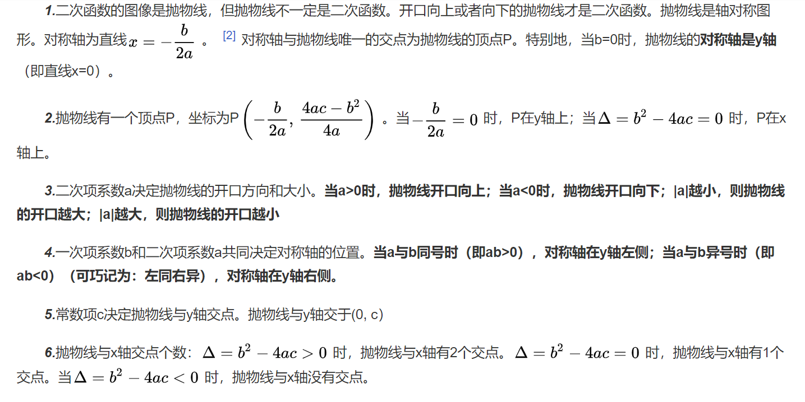

### 求根公式

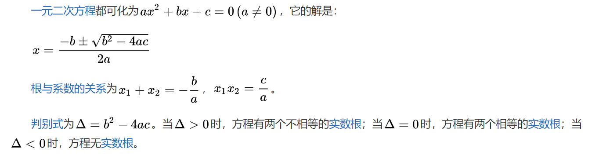

### 韦达定理

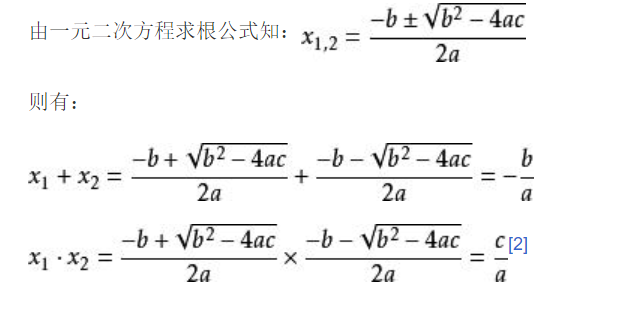

#### 三个推论

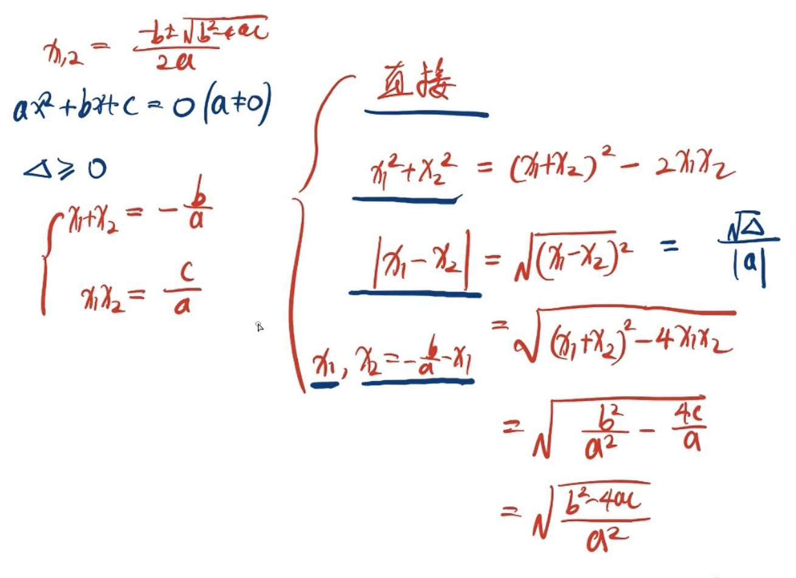

## 二次不等式

- 定义：含有一个未知数，且的未知数的最高次数是二次的不等式叫作一元二次不等式。

### 求解

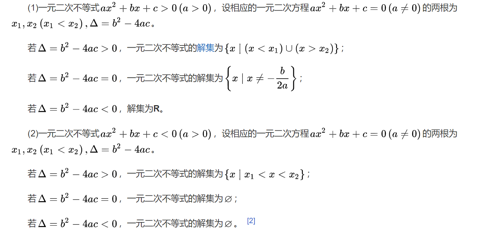

## 乘法公式

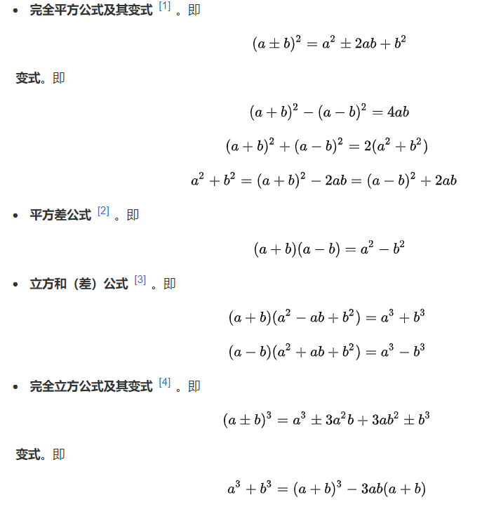

完全次方公式：可以使用杨辉三角

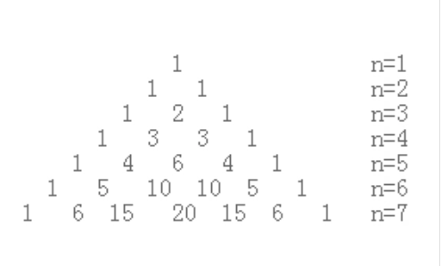

## 绝对值

- 代数意义

  - 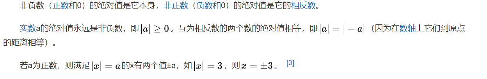

  - 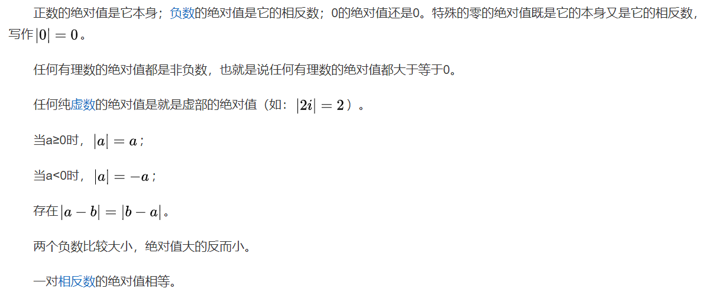

- 遇到绝对值就分类讨论

# 集合与常用逻辑用语

- 我们通常用大写拉丁字母A，B，C，…表示集合，用小写拉丁字母a，b，c，…表示集合中的元素.
- 如果a是集合A的元素，就说α属于（belong to）集合A，记作a∈A;如果a不是集合A中的元素，就说a不属于（not belong to)集合A，记作a∉A.

## 数集

- 集合是指具有某种特定性质的具体的或抽象的对象汇总成的集体，这些对象称为该集合的元素，数集就是数的集合。
- 集合的范围比数集的范围大，数集只是集合中的一种而已，属于数集的一定属于集合，但属于集合的不一定是数集。

### 数集类型

- 注意：+表示该数集中的元素都为正数，-表示该数集中的元素都为负数，`*表示在剔除该数集的元素0`（例如，R*表示剔除R中元素0后的数集。即`R*=R\{0}=R-∪R+=（-∞，0）∪（0，+∞）。）`。

- 所有正整数组成的集合称为正整数集，记作N*，Z+或N+；
  - 和整数一样，正整数也是一个可数的无限集合。在数论中，正整数，即1、2、3……；但在集合论和计算机科学中，自然数则通常是指非负整数，即正整数与0的集合，也可以说成是除了0以外的自然数就是正整数。正整数又可分为质数，1和合数。正整数可带正号（+），也可以不带。
  - Z表示整数集，来自于德语，德语中的整数叫做Zahlen
- 所有负整数组成的集合称为负整数集，记作Z-；
  - 负整数是在自然数前面加上负号(-)所得的数。例如，-1、-2、-3、-38……都是负整数，负整数是小于0的整数，用Z-表示。
- 全体非负整数组成的集合称为非负整数集（或自然数集），记作N；
  - 自然数（natural number），是非负（课本中已将0列为自然数）/正整数（1, 2, 3, 4……）。
  - N代表自然数集（非负整数集），而N*则表示正整数集，英文是natural number
- 全体整数组成的集合称为整数集，记作Z；
  - 整数（integer）是正整数、零、负整数的集合。整数的全体构成整数集，整数集是一个数环。在整数系中，零和正整数统称为自然数。-1、-2、-3、…、-n、…（n为非零自然数）为负整数。则正整数、零与负整数构成整数系。整数不包括小数、分数。
- 全体有理数组成的集合称为有理数集，记作Q；
  - 有理数是整数（正整数、0、负整数）和分数的统称，是整数和分数的集合。
  - 整数也可看做是分母为一的分数。不是有理数的实数称为无理数，即无理数的小数部分是无限不循环的数。是“数与代数”领域中的重要内容之一，在现实生活中有广泛的应用，是继续学习实数、代数式、方程、不等式、直角坐标系、函数、统计等数学内容以及相关学科知识的基础。
  - 有理数集可以用大写黑正体符号Q代表。但Q并不表示有理数，有理数集与有理数是两个不同的概念。有理数集是元素为全体有理数的集合，而有理数则为有理数集中的所有元素。
  - Q表示的是有理数集，由于两个数之比(商)叫做有理数，商的英文是quotient，所以用Q来表示
- 全体实数组成的集合称为实数集，记作R；
  - 有理数和无理数统称为实数.
  - 实数有两种分类方法：
    - 第一种方法是分为有理数和无理数, 有理数又可分为“正有理数”“零 ”和“负有理数 “（有理数是整数、有限小数或无限循环小数）, 无理数可分为”正无理数“ ”负无理数“（无理数即是无限不循环小数）
    - 第二种方法是可以按照实数的符号进行分类. 由于有理数和无理数都有正负之分，实数又可分类为”正实数“”零“和”负实数“. ”正实数“可以分为”正有理数“和”正无理数“，”负实数“也可分为”负有理数“和”负无理数“.
    - R表示集合理论中的实数集，而复数中的实数部分也以此符号为代表，英文是real number
- 全体虚数组成的集合称为虚数集，记作I；
  - 在数学中，虚数就是形如`a+b*i`的数，其中a,b是实数，且b≠0,i² = - 1。虚数这个名词是17世纪著名数学家笛卡尔创立，因为当时的观念认为这是真实不存在的数字。后来发现虚数`a+b*i`的实部a可对应平面上的横轴，虚部b与对应平面上的纵轴，这样虚数a+b*i可与平面内的点(a,b)对应。
  - 可以将虚数bi添加到实数a以形成形式a + bi的复数，其中实数a和b分别被称为复数的实部和虚部。一些作者使用术语纯虚数来表示所谓的虚数，虚数表示具有非零虚部的任何复数。
- 全体实数和虚数组成的复数的集合称为复数集，记作C。
  - 复数：Complex number。

### 数集与数集之间的关系

- `N*⊊N⊊Z⊊Q⊊R⊊C`，
- `Z*=Z+∪Z-`，
- Q={m/n|m∈Z,n∈N*}={分数}={循环小数},
- R∪I=C，
- *R*=R\{0}=R-∪R+=（-∞，0）∪（0，+∞），
- R=R-∪R+∪{0}=R*∪{0}={小数}=Q∪{无理数}={循环小数}∪{非循环小数}。

## 性质

- ==确定性==：每一个对象都能确定是不是某一集合的元素，没有确定性就不能成为集合，例如“个子高的同学”“很小的数”都不能构成集合。这个性质主要用于判断一个集合是否能形成集合。 
- ==互异性==：集合中任意两个元素都是不同的对象。 
- ==无序性==：一个集合中，每个元素的地位都是相同的，元素之间是无序的。集合上可以定义序关系，定义了序关系后，元素之间就可以按照序关系排序。但就集合本身的特性而言，元素之间没有必然的序。

## 表示方法

### 列举法

- 列举法就是将集合的元素逐一列举出来的方式  。例如，光学中的三原色可以用集合{红，绿，蓝}表示；由四个字母a,b,c,d组成的集合A可用A={a,b,c,d}表示，如此等等。

### 描述法

- 描述法的形式为{代表元素|满足的性质}。
- 设集合S是由具有某种性质P的元素全体所构成的，则可以采用描述集合中元素公共属性的方法来表示集合：S={x|P(x)}。例如，由2的平方根组成的集合B可表示为B={x|x2=2}。

### 图像法

### 图像法

- 图像法，又称韦恩图法、韦氏图法，是一种利用二维平面上的点集表示集合的方法。一般用平面上的矩形或圆形表示一个集合，是集合的一种直观的图形表示法

### 符号法

- 有些集合可以用一些特殊符号表示，N：非负整数集合或自然数集合{0,1,2,3,…}

### 区间法

- (表示开区间，[表示闭区间，1<x<=3记作(1,3]

## 集合之间的关系

- 在数学中，我们经常用平面上封闭曲线的内部代表集合，这种图称为 Venn图（Venn diagram）

### 子集

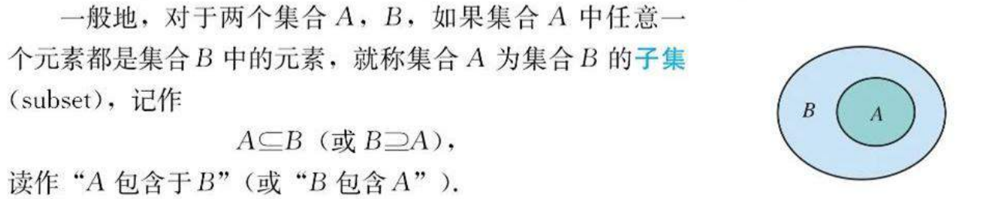

### 真子集

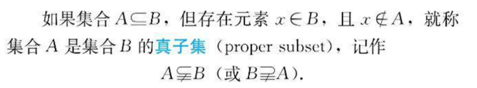

### 相等

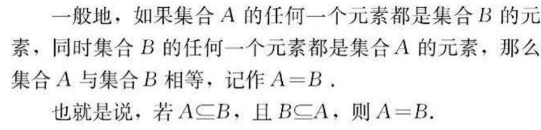

### 空集

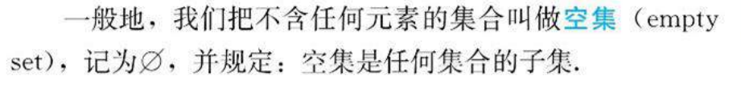

## 集合的基本运算

### 交集

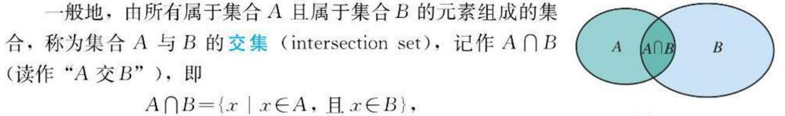

### 并集

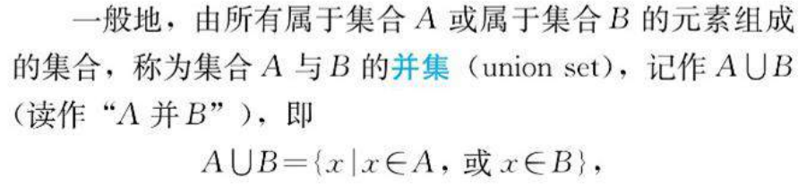

### 补集

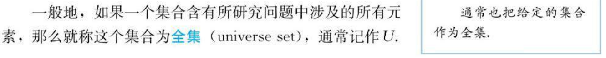

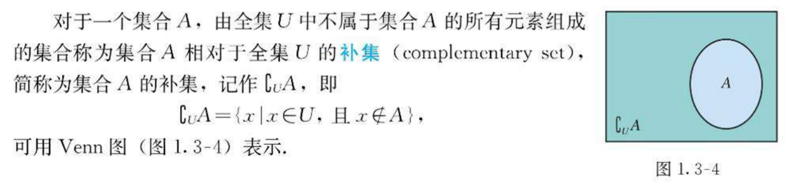

### 元素的个数

- 我们把含有限个元素的集合A叫做有限集，用card （A）来表示有限集合A中元素的个数.
  - card是英文cardinal(基数)的缩写.
  - 例如，A={a,b，c}，则 card(A)=3.
    - 子集2^n个
    - 真子集2^n-1个
    - 非空子集2^n-1个
    - 非空真子集2^n-2个

## 充分条件与必要条件

- 我们把用语言、符号或式子表达的，可以判断真假的陈述句叫做命题.

  - 判断为真的语句是真命题

  - 判断为假的语句是假命题.

- 中学数学中的许多命题可以写成“若p，则q'“如果p，那么q”等形式.
  - p称为命题的条件
  - q称为命题的结论.
- “若p，则q”形式的命题中p和q的关系，
  - 充分条件和必要条件
    - 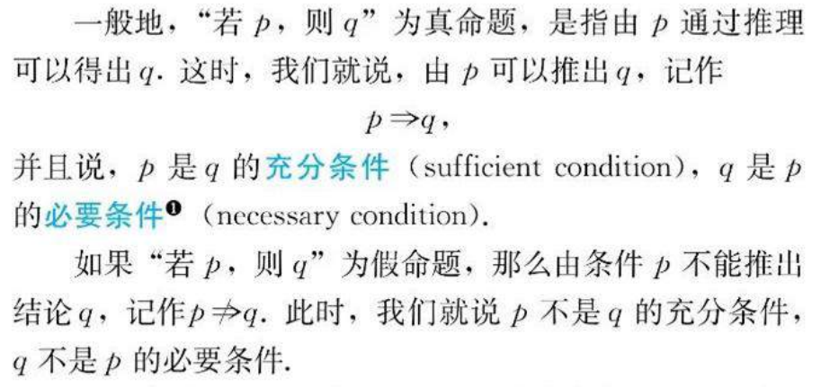
  - 充要条件
    - 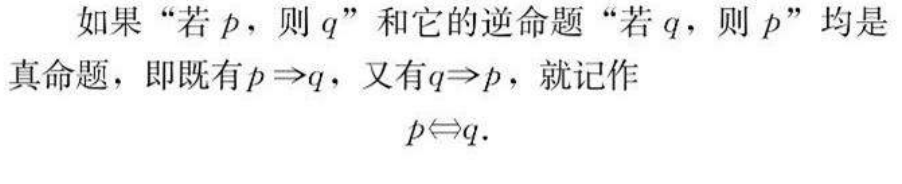
    - 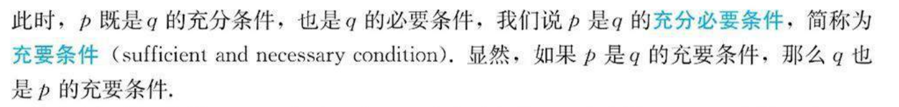

# 微积分

1. 导数（x->0）
   - 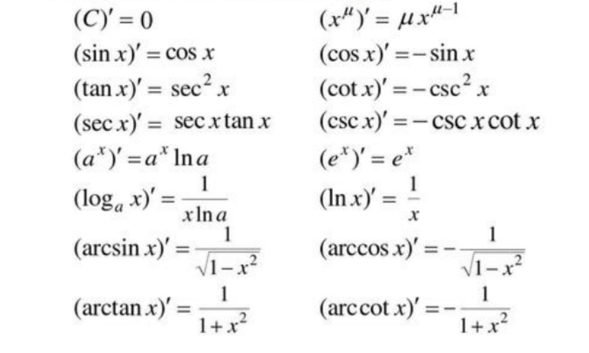
2. 等价无穷小
   1. 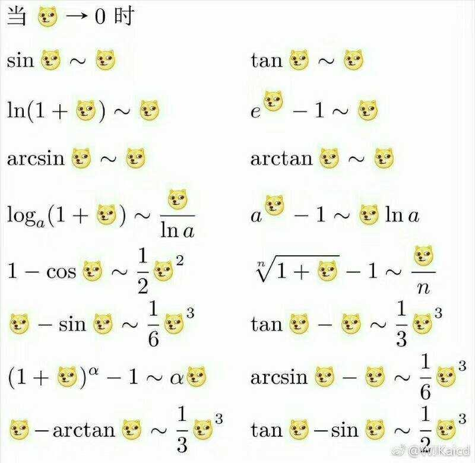
   2. 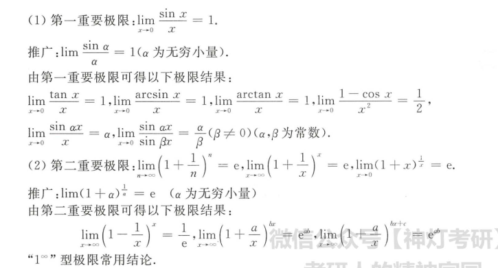
   3. 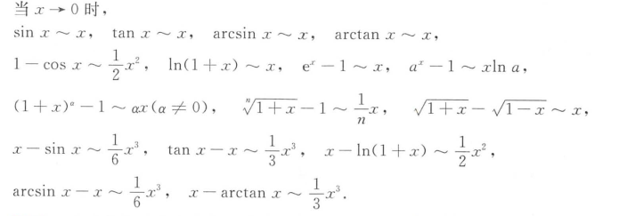
3. 泰勒公式
   - 