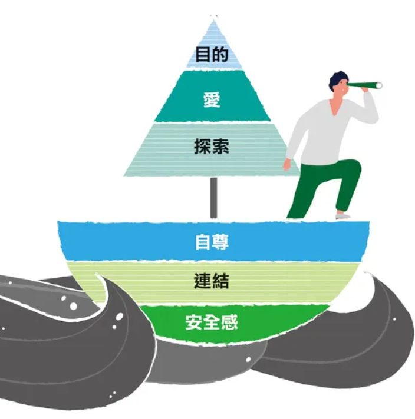

# Sorting Logic

## 需求层次理论

## 辅助学习，梳理逻辑关系

## 收藏

- 为什么？
- 我就是我,我很好，你也是；我是我，我拥有我，我只有我
- 学而不思则罔，思而不学则殆。
- 愚者 科学家、画家、音乐家、设计师、演员、律师、教师
- 人生中值得去做的每一件事情，都需要练习。事实上，人生本身只不过是一个漫长的练习过程，是一种永无止境地优化各种行为的努力。当你弄懂了练习的正确原理，学习某些新事物的任务将变成一种没有压力的愉快与平和的体验，变成一个适合你生活中各种领域的过程，并且促成你对生活中所有的艰辛与痛苦采用合适的视角来观察。
- 在历史的长河中，不管你爱与不爱都只是其中的尘埃。无论是谁，所能把握的不过也只是自己而已。
- 天生才华？
  - 杰出的人物通过年复一年的刻苦练习，在漫长而艰苦的过程中一步一步改进，终于成就了他们杰出的能力。
  - 意志力和天生才华，都是人们在事实发生了之后再赋予某个人的优点（无意志力和天生蠢材也是）。
  - 在追求卓越表现的要素凑齐的过程中落后了，居然还觉得补齐自身要素的努力毫无意义，真是难以理解。
- 人在紧张的时候有两种办法可以缓解紧张：
  1. 解决压力源
  2. 转移注意力
- 我本可以忍受黑暗，如果未曾见过光明。
- 某个人的故事已经结束了，而你的才刚刚开始
- 一件事情从没发生过和我不曾知道，又有什么区别呢？
- 小时候，它是港湾，他是块想家的石头；
  - 开始懂事了，父母总是说付出了多少，它是窝棚，他是寄人篱下要还债的牲畜；
    - 渐渐长大了，债欠的太多，变成了老子，它是战场，他是张牙舞爪的奶狗；
      - 长大成人了，它是营火，他可以休息，但不能过夜；
        - 、
- 吾生也有涯，而知也无涯0。以有涯随无涯，殆已！
- 光锥之内是无力,光锥之外是无知
- 以其终不自为大，故能成其大。上善若水。
- 没有值得尊敬的职业，只有值得尊敬的个人
- 人类最大的缺点就是永不满足,人类最大的优点也是永不满足
- 本来无一物，何处惹尘埃
- 上下四方谓之宇，往古来今谓之宙
- 读书读的是作者的心灵，写书写的是读者的心声
- 失败总是贯穿人生始终，想好了就尽力去做吧
- 讨好父母，没有回应。父母讨好，回应无能。
- 人的一生中，与你共度时光最多的还是你自己，尽量让自己成为一个有趣的人。
- Is life always this hard？Or is it when you're a kid？
- observations、feelings、needs、requests
- 基因为了更有效地达到其自私的目的，在某些特殊情况下，也会滋长一种有限的利他主义。
- 耐心与自律的问题是，要培养它们中的任何一个，需要同时具备它们两个。
- 当你的目标是只专注于自己现在正在做的事情时，那么，只要你在做，你便时时刻刻都在实现着目标。
- 一个人容易受到伤害的地方，就是他自我怀疑的地方。只有说到他自我怀疑的伤口，批评才会让他疼痛。
- you can love someone and still choose to say goodbye to them，you can miss a person everyday and still be glad that they're no longer  in your life
- 意外感、优越感、宣泄感、熟悉感：setup->1st story->assumption->target assumption->connector->reinterpretation->2nd story->punch
- Everybody is ignorant, only on different subjects.
- 真正的死亡是被所有人遗忘，真正的失败是自己都认输（2023.12.18）
- 不把别人的好当成天经地义，不把别人的坏当成天崩地裂
- 不要因为过度咀嚼自己小小的悲伤，而忘记身后一个诺大的世界
- Heft，grant me the serenity to accept the things I cannot change,the courage to change the things I can,and the wisdom to know the difference.
- 一个人经历多少失败才会觉悟
- The voyage of discovery is not in seeking new landscapes but in having new eyes.  
- 允许自己的不完美，原谅自己的不完美，改变自己的不完美
- 不要让你爱的东西,成为将来恨自己的理由
- 我对你无条件的爱,因为我有无条件的爱
- 自我批评只是简单指出你错误的地方，让你感觉糟糕，并不能指导你如何在下次做出改进。如果你仅仅只注意到自己做错了什么，你就失去了从正确经验中学习的机会，也失去了重复正确经验的机会。  类似的，如果每次只要一犯错误，你就否定自己，你也失去了从错误中学习、建设性地改变需要改变的地方的机会。  
- 人不可能完美无缺，错误和不完美是成长的一部分。相比追求“必须做到最好”，你更注重发自内心的目标和努力，把不完美视为挑战和学习的机会。如今，你不再苛求自己一定要成为最好的，而是满足于“尽力而为”，并把这视作足够的价值与收获。：把不完美看作挑战和学习的机会，而不是失败
- 面对负面情况或挑战时，采取“接纳-反思-行动”的策略是非常有效的。接纳情绪，避免回避；反思并质疑负面思维；最后通过实际行动逐步应对问题。记住，退步是前进的一部分，只要保持灵活应对的心态，并持续改进，你会从每次的挑战中变得更强。
-  “死亡”和“意义”构成了面对——存在/不存在——最基本的人类心理配对，人因为对死亡的基本恐惧和焦虑而去寻求意义，以缓解这种状态。在这个配对下，我们需要找到意义并作出一种主观选择，它叫“自由”；人必须在限制中接受自己并最求独特性，由此带来了一种逃脱不掉的状态叫做“孤独”，它让我们体验到意义可以是遁入融合逃避孤独，也可以是在追求卓越的过程中忍受孤独。
## 梳理中的感悟

1. 不一定有用
2. 应该边学习边整理，这样梳理时新产生的心理表征，可以投入到获得新的心理表征中，并且可以及时反馈自身学习情况，再去修正。
3. 着重记录认为重要的概念。
4. 请一定要问自己为什么
5. 学习之后要多复习
6. 练习之后要多复盘
   1. 复盘非常关键，相当于学习->犯错->修正的犯错和修正两个环节。
7. 不给自己留暧昧的地方。
8. 自己的知识整体是一张网，在局部可能是树，线性表。学习新知识时，刚开始是几个零散的知识点，慢慢变成线性结构，再变成树和图。学习的好坏，受度的多少和权的大小的影响，分在作用在广度和深度上。
   1. ..............
