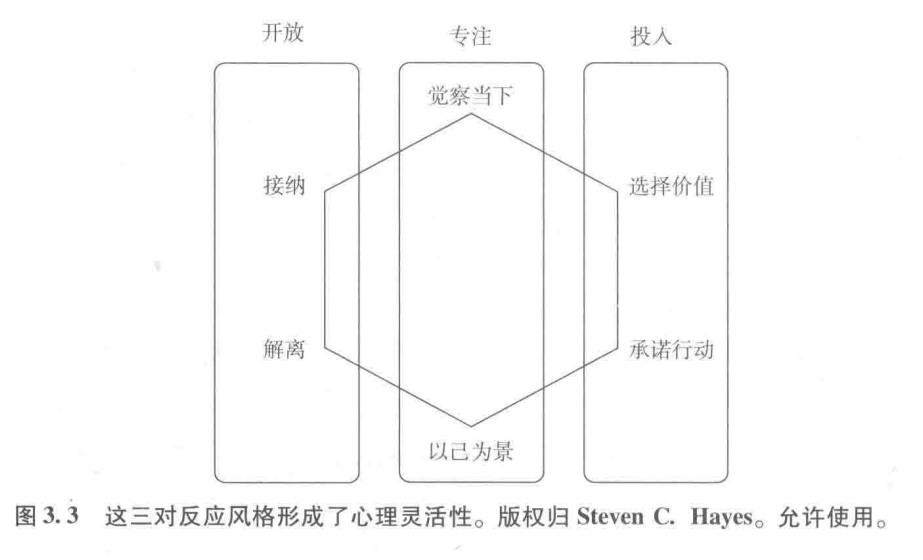
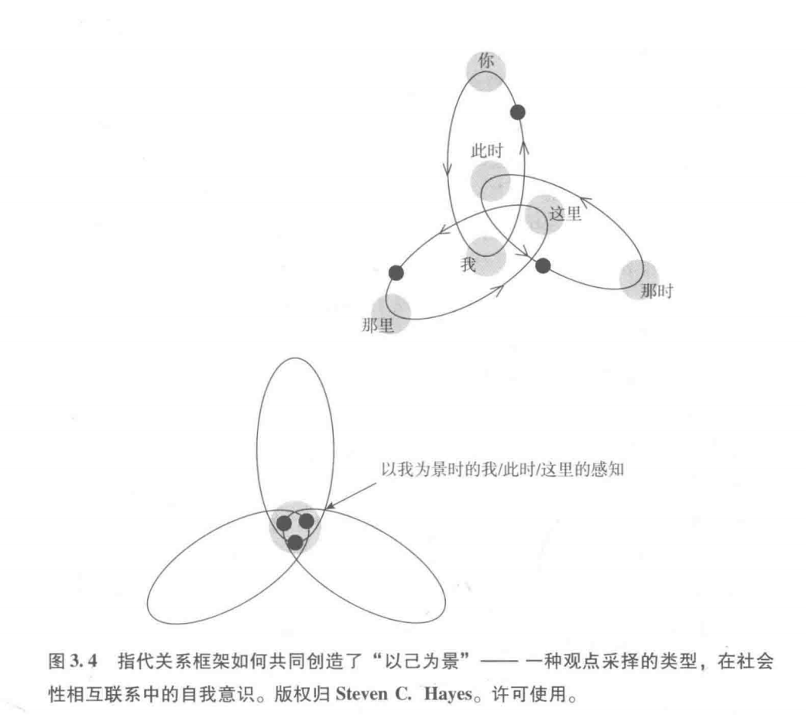
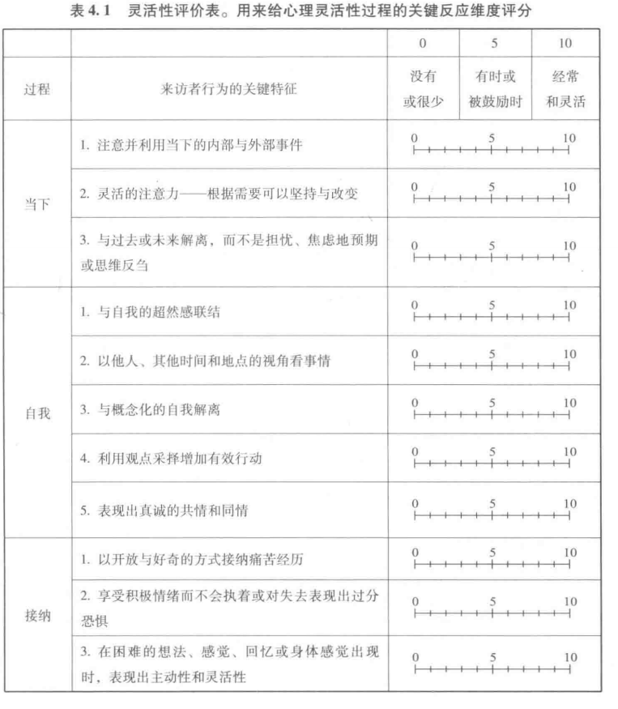
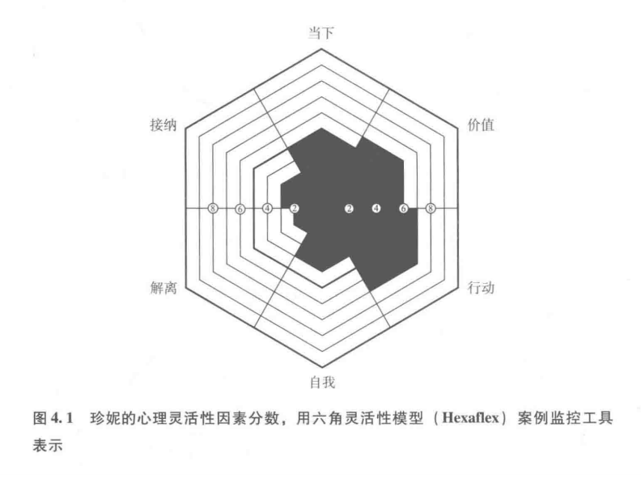
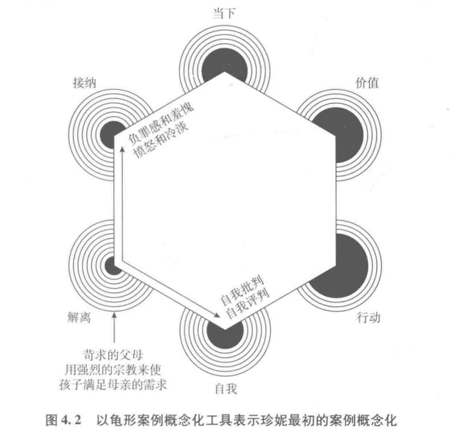
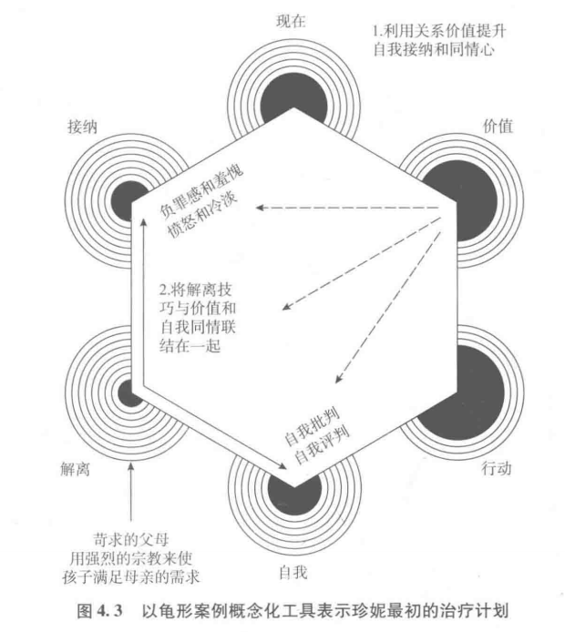
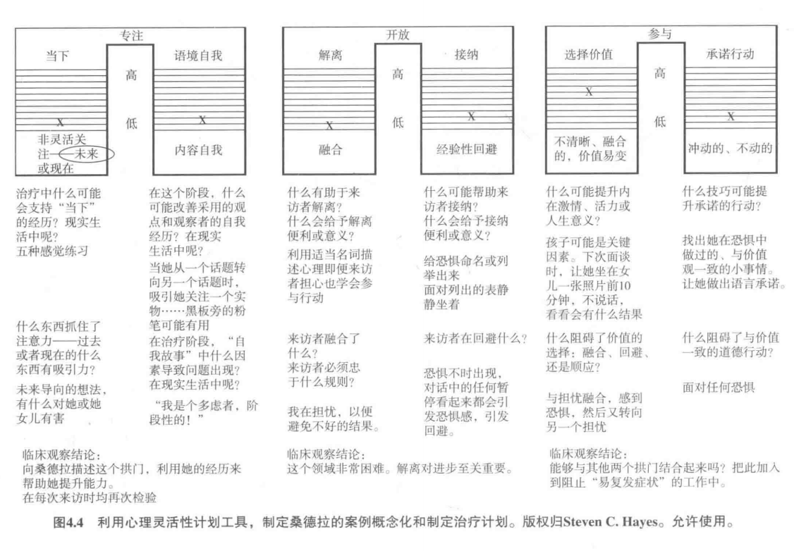
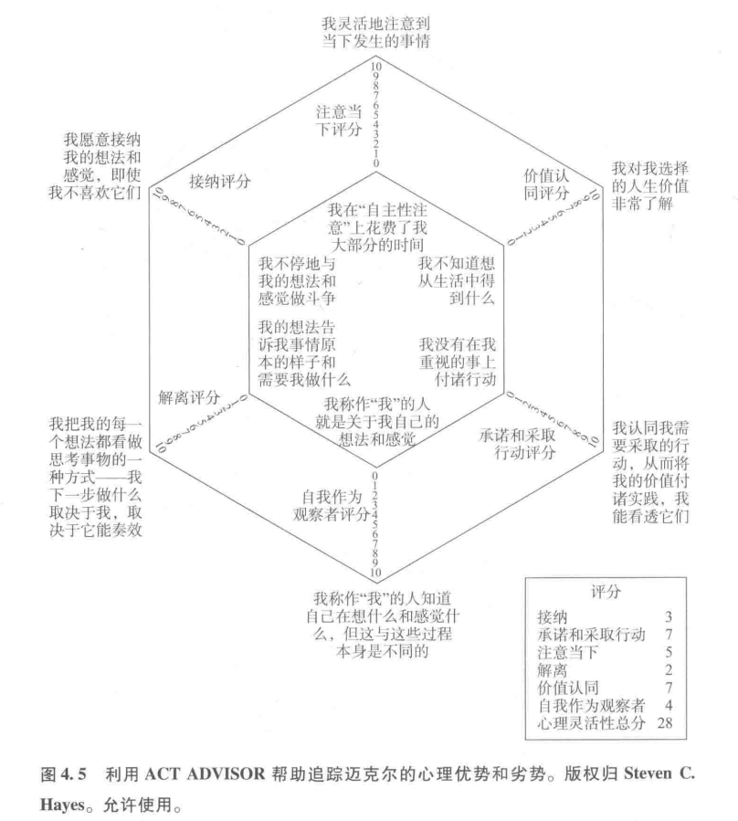
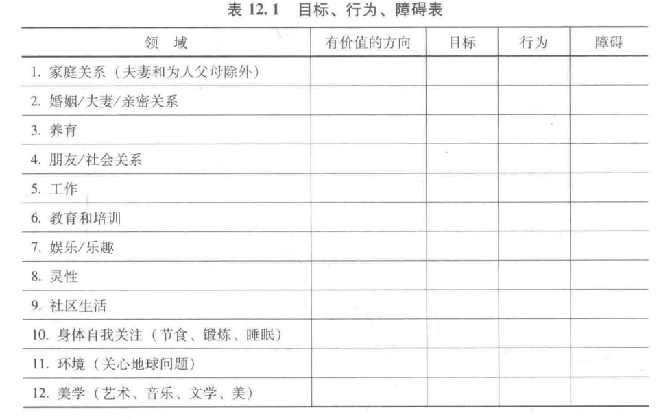

# 基础和模型

## 人类痛苦的困境

- 任何心外之物都无法确保我们免遭痛苦折磨，即使我们人类拥有所有典型的、常常用来评价外部成就的东西
- 普遍看法：心理痛苦是人类生活的基本特征。人类自己也不断地彼此之间制造伤害，将人类物化和非人化是如此轻易。
  - 人们不仅在遭受着这些痛苦，还会司空见惯地以偏见、歧视、污名等方式给他人造成痛苦。
  - 最流行的心理健康和病理学的基本模型很少触及一点，即人类普遍存在的问题是人们的痛苦和人们相互间的伤害。
- ==事实==：同情我们自己和他人很难，作为人类活着很难。

### 心理学主流的基本假设：健康常态

- 健康和幸福是人类生存的自然稳定状态。
  - 这种健康常态的假设是传统医疗关于身体健康的看法的核心。
  - 异常过程是精神和身体疾病的根源。
- 当用单一的自然选择理论解释心理痛苦时，它不仅不能确保行为的形式和功能之间具备密切联系，而且会导致生物医学诊断策略风险的增加。

- 精神疾病的误区
  - 目前处理心理痛苦的做法都是基于这样一种想法，认为外表特征(即临床症状、体征群）形成了真正功能性的疾病实体，包括为什么这些特征会出现，以及如何最大限度地有效改变它们。
- 我们需要一个解释

### 接纳承诺疗法的观点

- 人类的痛苦主要产生于正常的心理过程中，特别是那些涉及人类语言的过程。
- 模型认为，在具有自我反思性的语言和思维上所体现出的一般过程，实际上可能会放大这种疾病的核心困难
- 一个人如何对幻觉做出反应比幻觉本身更重要

#### 例子

- 自杀
  - 所有人都有可能受到伤害，只是一些人受到的伤害比别人多
- 破坏性常态
  - 人类普通的,甚至有益的心理过程也能导致破坏性和失衡的结果，这些过程可以放大或加剧任何可能存在的异常生理、心理状况

### 人类语言的正负影响

- 人类的语言是人类拥有了文明成就，也让人类有了苦难。
- 让一个人去质疑语言在自己生活中的本质和作用无异于要求一个木匠去质疑锤子的作用。同样的忠告适用于本书的读者。
- 当我们学会了转向内部时，我们的口头语言和认知能力（我们的“心理”)开始警告我们，警告关于过去和未来的心理状态，而不是仅仅警告外部的威胁。正常情况下的心理痛苦成了我们每天所面对的问题解决的焦点——从而带来有害的结果。这种把有用的加工过程运用到了不适当的目标上的过程，类似于身体将有用的免疫过程滥用成过敏反应，以一种对抗外物入侵的防御方式来攻击自己的身体。人类的苦难，主要涉及的是，滥用问题解决的积极心理过程来处理正常的心理痛苦。换句话说，我们的痛苦，代表了一种对我们内部世界的过敏性反应。

### 认知融合和经验性回避

- 认知融合：当人们坚信内心言语的字面内容时，他们就与内心言语产生了“融合”，痛苦也就随之发生了。在这种融合的状态下，因为心中的每一个想法都和它所指代的事物紧紧捆绑在一起，人们不能将认知叙述与觉察意识区分开。这种结合意味着人们更容易盲从于社会性传播的语言指令。
  - 人们依赖自己的思维，因为在日常世界里，语言和思维是非常有效的工具
  - 解决方法：认知剥离：有意识的察觉思维的发生
- 经验性回避：痛苦轮回的另一个关键过程是经验性回避。这是与心理指令融合的一个直接后果，该指令意在压抑、控制或消除令人痛心的经历。对于处在恶劣心境模式当中的来访者来说，其目标是用正确的方式感受，并且避免感情或思维偏离这个目标。对于具有强迫症状的来访者来说，其目标可能是
  - 逃避会使对有价值的生活的追求变得复杂，因为我们最受伤的领域,恰恰就是我们最关心的领域。我们可以通过假装“不关心”使我们舒服一些。当认知融合时，就不可能选择符合价值方向而又有危险的生活，因为逻辑思维要保证万无一失。可是，在更大的心理灵活性背景下，在生活困难状况下其固有的心理痛苦可以被接纳为生活真相并能从中学习，一个人的注意力可能会背离对生活有所提升的行为。
  - 解决方法：接纳：投入地感受丰富多彩的情感反应，并把这作为对自己和他人进一步开放心理、学习和同情的方法。
- ==ACT主要目的之一==：把人们从他们的思维中解放出来

ACT：接纳、选择、采取行动

- 在ACT中，健康生活的目标与其说是要“很好的感觉”，还不如说是要“很好地感觉”。既有不愉快的想法和感受，也有愉快的想法和感受，这才是心理健康，这样生活才会从不同途径给我们带来丰富、独特的个人经验。具有讽刺意味的是，当想法和感受变得至关重要时，实际上，是它们在操纵我们做什么，那就是，它们想说什么它们就意味着什么，然而我们却不喜欢公开地感受我们的感受，思考我们的想法，也不想从想法和感受中学习它们教给我们的东西。相反地，当感情只是感情，想法只是想法，它们只是它们所意味的那样，也就是说，它们只是一丁点我们独特的个人经验，被带到了当前情境下的此时此刻。想法和感受是有趣的，也是很重要的,但它们不应该、也没必要操纵接下来发生什么。它们在每一个情景中的具体作用取决于引发它们的心理背景,这比任何假设的、正常的心理问题解决模式更可变。
- 一个治疗师应拥有的最有力的工具，即你与你自己以及你与来访者的关系它将告诉你如何才能将激发、塑造和支持接纳、正念和有价值的行动作为一种方法应用到治疗关系本身。

## ACT的基础

- 语境主义行为科学（CBS）
- 要求：ACT要求来访者采用新的视角来看待他们自己的思考习惯。

### 科学哲学主流主义

- 形式主义：普通的命名行为，背后的科学哲学称为“形式主义”(早至古希腊思想家柏拉图和亚里士多德都持有这种观点)。在这种取向中，真理是词语与其所指代的真实事物间的简单对应。分析的目的是知道事物的分类和等级。关键的问题指向了“这是什么?”，而答案就是精确而可用的分类定义。
- 元素现实主义：在这个概念中，真理是我们关于世界及其构成部分的模型、关系及真实世界所包含的力量间的精巧对应。分析的整体目的是合理地把世界组成模型。而关键的问题指向了“是什么元素和力量使得这个系统运转的?”这个模型的预测能力决定了能否回答这一问题。心理学中很大部分的智力工作基本上都是在元素现实主义的基础上。在行为科学中，信息加工过程和多种形式的认知神经科学都是很好的元素现实主义的例子。

### ACT 功能性语境主义

- 语境主义的核心分析单元是正在进行着的语境中的行为，也就是通常意义上有机体处于情境中的行为
- 语境主义是一种**整体分析方法**，不像形式主义或元素现实主义的情境,整体事件是最基本的，其构成部分是用推衍或抽象概括出来的。整体是参照背景理解的，而不是由元素组合出来的。
- 对语境主义者来说，澄清分析的目的成为关键,因为目的指定了实用主义的真理标准如何应用。如果没有用言语表达出目的，任何由后果形成的行为都是“真的”
- 成功的工作是语境主义者评价事件的方式;目的使这种标准可用。但是分析性目的本身不能最终被评估或证明——它们只能陈述。为了通过成功工作（发挥作用)评估一个目标，需要另外一个目标，但是这第二个目标也不能评估，这样以至无穷。当然，我们有层次性目标。当过程目标与结果目标联系起来时，这种考虑对来访者来说总是产生伤害。
- 功能性语境主义的显著特征是其独特的目标:在精度、广度和深度上预测并影响心理事件（ Hayes，1993)。在功能性语境主义中，心理事件被带入到整个有机体存在的历史和情境背景中并与背景相互作用。功能性语境主义试图寻求“预测并影响”这些相互作用——这几个词是连在一起的，因为它需要同时寻求两方面的目的。从临床上来说，仅仅解释和预测事物是没什么用处的，我们还必须知道如何改变事物，而功能性语境主义持有相同的观点。精度、广度和深度是概念标准，用来评估潜在的可接受的解释，服务于我们预测和影响的主要目的。
  - 精度指的是相关变量被界定的具体性;
  - 广度指的是一个理论在知识上的经济性——用尽量少的概念起到最大的作用;
  - 深度指的是在一种分析水平上发展出有用的概念在其他水平上可达到的一致性程度（比如,社会的或生物的水平)。
- 整体事件:处于背景中的行为
  - 从哲学角度来考虑,整体事件就是处于背景中的行为，这直接反映在ACT治疗的过程之中。用什么界定一个行为事件是整体事件?在一种水平上由做分析的人的目的界定，另一种水平上由行动着的有机体的目的界定。
  - 在技术层面上，行为是我们用来指代处于背景中的行动的术语，不论是考虑整体行为、情绪行为还是认知行为。以这种方式陈述时，行为已经不是单纯的运动、腺体分泌或外部可观察的行为的代名词。我们谈到的活动是任何人（有时只有一个人）可观察、预测和影响的任何一个活动和所有活动。它不包括没有人（来访者本人也不能）能直接探测的假设的行为。所以思考、感受、感觉和记忆都是心理行为，而灵魂穿越不是。
  - 背景这一术语表示对行为产生影响的变化着的事件流。背景不是客体或事情的代码，它是个功能性术语，包括与行为相关的历史和情景。因为语境主义行为科学的构成单元是处于背景中的行为，那么行为和背景相互定义就是有意义的。为了利用这个比较古老但比较精确的行为语言，就不可能存在没有刺激的反应或者有没有反应的刺激。
- 实用主义的真理:实践的有用性
  - 情境性行为原理因而都具有这种品质:它们在可变的情景特征与整合的行为之间是功能性关系。
  - ACT特别强调个体水平上的具体价值
  - 预测和影响心理事件必须紧密地与来访者的价值和目标协调一致以使其产生意义。
  - 在思考展开时持续不断地重新评估它，并考察其在任何情境中的实践可用性。从可用性而不是单纯事实的观点看思考，就把思考放进了另外一种社会/言语情境中——在此,健康、活力和目的能够更容易发挥中心的作用。
  - ACT是一种“非”实体论的，而不是“反”实体论的。我们不是说这个世界是不真实的,或者说事情是不存在的，我们只是试图把所有的语言（甚至包括ACT及其假设）都当作情境中的行为,这样我们就可以为自己的认知行为负责，并拓宽行为灵活性，根据行为和我们体验到的结果的关系来选择有用的实践。
- ==哲学特征==
  - 整体事件、背景、真理和目标
- 功能性语境主义与临床工作的匹配
  - 自然的分析工作：解释、预测和影响
  - 1．能够解释人们为什么会痛苦?
    2．允许我们预测具有特定心理问题的人们会做些什么?
    3．告诉我们如何改变事情的过程，使得具有特定心理问题的特定个人可以取得较好结果?

- 治疗举例
  1. 把这句话当做一个动作——它本身就是个动作——并考察来访者说这个事情的背景（比如，“之所以告诉我这个想法，你是否希望某种事情发生?”)。
  2. 把世界的边界标记成单元（离开家=惊恐)，而不把现实状态归于描述的事件或他们设想的因果连接（如“这是个有趣的想法”)。
  3. 寻找环境中的情景，在此情景中“惊恐”在功能上与“不离开家”相联系，带着改变情景而不必改变惊恐本身的观点（如“嗯，让我们做一下看发生什么，大声说我不能站起来，否则我就会惊恐发作，然后边做边慢慢地站起来”)。
  4. 寻找“惊恐”在功能上与“不离开家”不相关联的环境线索，带着强化这些情景的观点（如“你是否曾经有过这种想法但还是离开了家?告诉我那时发生了什么?”)。或者
  5. 把这句话看作行为多样性的一部分，然后看看同样的陈述是否可以整合到一个积极的过程中去（如“如果你非常喜爱的一个小孩告诉你她不能离开房子，你会做什么?”)。

### ACT背后的认知观点:关系框架理论

- RFT是一种关于人类语言和认知的功能性语境主义理论
- “言语刺激”的本质:它之所以有效，是因为它与其他事物之间所存在的推衍关系。
- 使刺激与临床相关匹配起来的是,在一个等价刺激中一个成员的某种功能具有传给其他成员的倾向。
- 语言和高级认知最关键的核心是学习和应用“关系”框架的能力。关系框架的形成是习得性行为，在随意的情景控制下具有三个主要特征，即相互推衍（蕴涵)、联合推衍（蕴涵）和刺激功能的转换。
  - 联合推衍的意思是说相互的关系能够联合。
  - 相互推衍意味着在一个方向上习得的关系也可以导出另一个相反方向的关系。
  - 事件的功能可以根据背后的关系得到改变。
- 对等框架：命名可能是形成关系框架最简单的例子了——这种行为直接与刺激等价对应，并在语言训练中最早发生。RFT把这称为对等框架。
  - 换句话说，从一个方向学习的一种言语关系可预测另一个方向的强化反应。这种顺序就是RFT假设的关系框架真正形成的过程,即在自然的语言学习过程中出现多个样例的大集合

- 从RFT的角度讲，关系框架是定义语言和较高级认知的核心特征。因为参与到一个关系框架中而发挥作用，这样的事件就是一个言语刺激（一个“符号”)。
- 说“言语的”或“认知的”时，意思是“通过训练产生的推衍性关系”。
- 关系框架的形成是随意应用的，所以在形式特征的世界中（如实际人群的大小）没有任何东西能阻止此类结果发生,无论由此产生的结果是什么。
- 因为人类语言和认知的这种特性，我们能够把所有的东西与其他所有的东西以所有可能的方式联系起来。
- 语境控制：关系框架受两种可以区分的语境特征调节:关系语境和功能语境。关系语境决定事件如何和何时建立关联;功能语境决定在一个关系网络中什么功能会转移。
  - 从语境行为的观点来看,大多数谈话治疗都是关系语境干预。关系语境干预可以修饰、拓宽或联络关系网络，但是它不能消除之前习得的认知关系。
  - 当认识到心理治疗不可能帮助来访者忘记某些具体的认知时，临床医生不应形成这样一种观点:永远不要试图改变来访者的认知。
- 关系框架的自我保持性
  - 如果新的思维方式遇到困难，旧的思维方式就会很快重现，即使旧的思维此前已经消除
  - 有些关系性条件作用长期存在甚至有时会有害无益。
- 规则支配
  - 当语言刺激合并到复杂的言语规则中便具有了调节行为的作用。规则支配行为并不需要基于在真实世界接触中的直接结果，相反，主要是基于在这个过程中对事件及其关系的言语表述。规则支配行为是对应变事件（ contingency)的具体表述所控制的行为，而不是与事件的直接接触所控制的行为。规则支配行为使得人们在无法或不可能通过直接经验学习的事情上，可以通过言语表述的规则做出精确的、有效的反应。
  - 但是这些规则不是没有代价的。当行为被言语规则支配时，它就对这个规则中没有描述到的环境变化不再敏感
  - 顺从：顺从（ pliance）来自于单词服从“compliance”，是指基于过去经验而遵守一种语言规则，而这一规则与之前的行为在社会监控下是协调的。
  - 追踪：追踪（ tracking）是另外一种遵循言语规则的行为，这种行为基于这种规则与某一自然事件（比如，在某个特定情景下同样的行为产生的某一后果）相关的经验基础上。
  - 扩张：增强（ augmenting）是第三种规则支配的行为，这种行为能够改变一些事件在多大程度上可导致行为后果。从临床角度来讲，增强为以特定方式行动的来访者提供了言语的形式化的动机。增强可以分为两种类型，即形式性增强( Formative augmenting）和动机性增强（Motivative augmenting )。形式性增强可以建立新的后果。例如，听到词语“好”具有强化作用，那么当知道“good”和“well”也表示“好”的意思时，也会把它们当作强化物。动机性增强可以改变已存后果的强化程度。

### 规则支配行为与心理僵化

- 规则导致的不敏感性与一种人们本不希望存在、但却普遍存在的行为模式——心理僵化高度相关。顺从是这种僵化的独特来源。
- 当人们遵循的言语规则是不能检验、不具预测性、自我应验或应用于只受应变事件影响的情景时，追踪也会产生问题。ACT对于广泛应用认知改变的策略持怀疑态度，也对健康的认知改变策略如何轻易地受到破坏持谨慎的态度;但是，有时有充足的理由让来访者检验言语规则，并根据可以预测的结果，通过一些策略来更好地完成任务。不幸的是，很多非常有害的规则极难检测。
- ACT试图加强某些类型的言语控制，特别是增强，增强有助于行为在延迟控制或可能的后果下出现。例如，ACT非常倚重来访者最根本的价值体系，把价值挑选出来，表述成句，并根据其增强功能加以澄清，不管是形式性的还是动机性的。当来访者做出改变的更大目标是以其价值体系(比方说，去爱、去参与、去分享或者有益于他人)为基础时，来访者更容易学会新的有效行为，同时摆脱旧的无效行为。相反，以逃离、回避为中心的增强，比如“不要去想你的病了，这样你会感觉好点”，只能产生坏的结果。所以ACT强化那些与以价值为基础的结果相联系的增强行为，而那些与过程目标（如去掉焦虑、增加自信等）相连的增强行为则根据它们对结果目标的影响（如以实用性为基础）或强化或削弱。
- 核心结论
  - 没有关系框架，人类将没有正常的功能。临床医生必须应对言语/认知系统，因为我们通常用言语交流，所以我们需要有既精确又广泛的理论来告诉实践者们如何完成这个任务。
  - 一些来访者的临床问题是由于一些关系性主题发展不良（比如，问题解决不力、智力能力弱、缺乏共情、看不到他人的视角)，这可以通过建立言语技能来弥补。RFT可以帮助把这些所需的技能具体化
  - 关系网络工作的原理是加法，而不是减法，所以不可能简单地消除一个临床上相关的认知事件。没有一个学习过程叫作“不学习”，消除过去的行为或习惯也是新的学习，要学会抑制和反应灵活性，不是“不学习”。
  - 随着关系框架形成的发展，它会控制其他行为调节的资源，这是因为其在真实世界的有用性、普遍存在性和无处不在的文字及问题解决模式的语境，这些都是依赖于社会/言语社区来维持。
  - 关系框架的特性允许人们进行有效的问题解决，同样，它也造成了人们僵化地遵循规则以及形成经验回避，而这些会极大地缩窄人们关注内容的过程。
  - 在不良语境控制下所形成的关系框架使人们很难对当下的经验保持灵活、专注和自发的注意。
  - 字面的、问题解决模式的语境,不是言语/认知过程发生的唯一语境，我们也可以创造一种全心投入的语境,在这种语境下语言的功能会完全不同。
  - 在语境控制下，学习引入不同的语言和认知模式是ACT的中心任务，在更广泛的意义上也是保持心理健康的中心任务。

## 心理灵活性作为人类功能的整合模型

- 整合模型：一套能够精确、广泛、深入到各种临床相关问题和人类功能及适应性问题中的浑然一体的过程。  

- 整合模型的目标
  1. 这些过程确实能够解释治疗产生的影响;
  2. 该模型所主张的关键的人类过程与结果确实存在相关;
  3. 其认为的重要干预成分确实具有重要性。
  4. 换句话说，临床心理模型的成败不仅建立在结果的基础上，还在于对中介过程、结果调控以及关键成分的识别上,所有这些都与持续的基础及临床研究相关联。
  5. 一个整合的模型必须体现用同样的过程就能够区分人群中的功能适应与功能失调。它不仅要体现临床人员特殊的反应模式——还要显示健康人群在同样的反应模式上也有明显的差异。换种说法，这要求治疗模型和心理病理学模型必须整合,且与常见的核心过程相联系。
  6. 一个整合的模型必须从众多可取的过程中进行选择，并将其组织成一系列连贯的观点。

### 心理灵活性模型

- 心理灵活性模型是根据它的特性归纳出来的,它与实验科学得出的基本人类过程相关联，它被同时设计为心理病理学模型、心理健康模型和心理干预模型。
- 
- 
  - ==六边灵活模型，hexaflex（核心要素）==：接纳、解离、以己为景、觉察当下、选择价值和承诺行动
- 语言活动的语境才是产生痛苦的关键——比个人经历的内容本身更加重要。问题并不在于人们思考了错误的内容，而在于思考本身以及外界社会在多大程度上将语言文字看成是行为规范模式的一个标志。
- ACT的最终目标是让语言认知过程在更好的语境控制下进行，让来访者有更多时间及时接触当下行动的积极结果，因为当下才是有价值的人生道路。
- 核心过程中的每一个都可用来阻止或抵制那些产生僵化和痛苦的过程
  1. 矫正对心理活动内容的过度执着（融合)。ACT教来访者退后一步，将个体事件（思维、情感、记忆、感觉）看作它们本身（正在进行的体验)，而不是像他们所说的那样（文字的真相组织了这个世界)。这一过程就是解离。我们是在“去文字化”或弱化文字、评价和以规则为基础的反应的支配功能。因而，解离基本上专注于人类经验的言语方面。
  2. 矫正经验性回避问题。ACT 教来访者为自己不想要的经验“留点空间”，不去作无谓的努力来压抑、控制或逃避个人经验，并且以一种真切的好奇和自悯之心（接纳)）去探索这些痛苦经验的生生灭灭。因此，接纳尤其专注于人类体验的情感方面。
  3. 矫正对个人故事的过度执着和认同（执着于概念化自我)。ACT帮助来访者与“此时此刻的我”建立更紧密的联结。这种观察者视角，或者说自我作为背景的方式，会给来访者提供一种意识基础，使他们以解离和接纳的方式探索自己的思想和感受。
  4. 僵化的注意过程容易将人们带入对过去的回忆和对未来的想象中，ACT试图建立灵活的注意过程,让来访者回到当下。
  5. 如果来访者的问题是脱离个人价值或行动与个人价值不一致，ACT帮助他们有意识地选择他/她自己的价值，并与当下的积极的优点联结。从本质上说,就是与情境相关联（澄清价值)。
  6. 如果来访者不能采取有效的行动或执着于冲动行为或持续回避，ACT帮助来访者将具体的行为与他或她选择的价值相联结（承诺行为)，并帮助来访者建立长期有效的、以价值为基础的行为模式，就如同传统行为治疗中的那样。

#### 核心过程

- 两两配对形成三对反应模式:接纳-解离,觉察当下-以已为景，选择价值-承诺行动
- 使用开放、专注和投入( engaged）几个术语来表述这些核心过程二元体。
- 

##### 开放的反应风格:解离和接纳

- 接纳与解离是决定一个人对直接经验保持开放的关键技巧。
  - 解离让个体不再纠结于痛苦和难过的个人经验，以一种非评判的方式，将它们仅仅看作一种正在进行的心理活动。
  - 接纳让个体能够以一种好奇的态度全心投入自己的经验，从中吸取教训，为它们提供空间。

###### 融合和解离

- 认知融合就是言语事件对反应施加强烈的刺激和控制，并排除其他背景变量的影响。换而言之，融合就是言语对行为规则的支配。
- ACT 取向的一个关键目标就是让来访者学会控制认知融合。
- 思维本身并不是问题。相反，与思维无意识的融合以及对结果的回避才是问题所在。
- 从某种程度上说，融合是人类语言及其进化产生的有意义的功能。不幸的是，这一大脑模式很难停止。
- 临床相关性
  - 主流“不期望的思维→行为”：这一关系应该通过改变负性思维的形式、频率或对环境的敏感性来进行矫正。
  - 建立更多的认知灵活性和打破背景对ACT“思维→行为”关系的自动支持。如果不看透语言造成的错觉，我们很难获得认知灵活性。
  - ==认知解离==代替了传统的认知行为取向，这种取向以识别和重塑歪曲的思维为特征。认知解离，试图改变思维的语境功能,让人们能够去领会思维和感受的过程，而不仅仅是内容。在 RFT术语里，融合中包含的语境能够加强刺激功能向语言认知的转化。你可以将解离干预看成其相反过程在临床上的应用。

###### 经验性回避与接纳

- 关系框架具有双向性和相互性。关系框架的相互性和双向性让经验性回避成为人类存在的基础。这一特点已经将自我认识转化为自我挣扎，因为对我们的过去、身体感觉、思维、感受和行为倾向进行描述和评价已经非常自动化和自然。与负性事件相关的言语事件往往体验起来也是负性的。
- 经验性回避发生在当一个人不愿意与特定的个人经验（如身体感觉、情绪、思想、记忆、行为倾向）保持接触而试图改变这些经验，改变这些经验的形式、频率或者情境敏感性时，尽管这样做完全没必要。
- 我们并非认为经验性回避一定有害。真正对人类适应性起着重大影响的是对回避策略不加区分地应用，而并非回避策略本身.问题是回避策略对消退有着很高的抵抗力,因为它们都是经由减少负性的内部状态，如焦虑、恐惧、悲伤或生气等，而维持下来的。不幸的是，这些回避经验往往很快就会再次出现，而且所体验的痛苦比以前更剧烈、更严重。由于回避行为是在这样的负性控制条件下所习得的，它们很容易就会变得僵化、脱离当下的情境
- 无论是负性评价或者事件本身引发的人类情绪都会倾向于被回避。例如，焦虑是对负性事件的自然反应。在非言语有机体中，焦虑本身并无坏,因为反应与使它产生的事件之间并不是相互关联。
- 经验性回避的自然倾向同样也被言语社会放大了。看见他人的消极情绪也会增加我们的负性感受。
- 临床相关性
  1. 有意控制的过程与所期望的结果相矛盾。在很多情境中回避产生了与目标相反的结果。当要求被试压抑一个想法或感情时，被压抑的想法或情绪反而会比没有要求压抑时更严重。反弹现象在产生压抑的语境中最为严重，或者说，在与最初产生压抑时出现的心理状态相同时最为严重。
  2. 试图控制的事件不是规则支配（rule - governed)的。已经形成的个体事件并不那么容易用言语规则消除。在这些情况下，有目的的、基于规则的控制只是徒劳，因为这些过程并不受言语规则支配。事情可能会改变——但不一定会朝着期望的方向变化。例如,假设一个人因为一段惊恐发作的回忆而感到极度痛苦，尝试各种方法想要消除它。记忆常常是自主性事件，它由多种刺激引发而出现，难以消失——至少很难以健康的方式消失。压抑这类事件所需的策略几乎总是自我伤害的（如酒精和药物导致的麻木），而且最终给自身带来麻烦。
  3. 回避是可以的，但会付出巨大代价。假设一个人要通过回避所有可能引发回忆的情境来回避一段往事。这种方法可能会减少记忆出现的频率,但也有可能极大地限制一个人的生活。例如，一个性虐待或家庭暴力的幸存者可能会回避所有亲密关系。
  4. 根本不可能改变的事情。有时候经验性控制被用于那些不可改变的事实。例如，一个人可能认为“我不能接受我父亲被杀的事实”，然后使用药物来消除悲伤。悲伤是面对丧失的自然反应，再多的药物也不能改变这一情况或所经历的丧失。不做任何努力来减少或者改变个体事件被称为“在这里”。当一个不可改变的丧失发生，健康的方式是去完全体验自己的感受。这一过程会包括丧失和哀伤。它还有可能包括其他的一些，例如笑谈这个人生前曾经发生过的好玩的事情,或是欣赏他们为生活所做的贡献。这是心理灵活性方面的问题。
  5. 努力改变本身就是与改变的目标相嗓的行为。控制行为本身是有意义的。有时它的意义恰好与目标相反。一个想努力做到随意的人根本不是真的随意。自信就是一个很好的例子，由于很多来访者缺乏自信，又需要自信，却很难做到自信。
  6. ==接纳==：接纳，我们也用这一术语指代行为的意愿和心理的接纳。意愿是为了与个人经验或与那些可能触动个人经验的事物保持接触而做出的自愿的、以价值为基础的选择。心理接纳就是指有意识地采用一种开放的、接纳的、灵活的和非评价性的姿态来面对此时此地的经验。
     - 没有意愿，我们所说的接纳就不可能出现。接纳不是顺从或忍受它是一个积极的过程。
     - 接纳并不是受规则支配的。要求一个人采纳开放、好奇、灵活的态度往往带有问题解决的目的，而这恰恰不是接纳。来访者甚至可能最初尝试使用“接纳”作为控制或消除不期望的心理事件的另一个手段（“如果我让我的体验保持的时间足够长，它就会消失”)。当接纳与这类问题解决模式的想法联系起来,就不是接纳。这或许就是为什么学习接纳需要使用隐喻、练习和塑造，而不仅仅是给予简单指导的原因之一

##### 专注的反应风格:此时此刻和以己为景

- 没有专注于意识和社会、生理、心理之中，就不可能对生活保持开放和投入。六边灵活模型的中心支柱所起的作用就如同连接意识以使之与“当下”灵活接触的枢纽。一方面是接纳和解离,另一方面是价值和行动,都是基于一个有意识的人专注于当下背景中所作出的选择。治疗几乎总是一开始就将两人投入同一段关系中。当人们需要或已经投人基于价值的行动中，对“当下”的意识和灵活注意能够激活他们的解离和接纳技能。

###### 心不在焉与灵活接触当下

- 一个人花在问题解决模式上的时间越多，那么他花在接触“此时此刻”上的时间就越少。不能接触此时此刻的来访者，一般都很难改变行为以适应瞬息万变的社会需求。接触当下指的是一种以自己为中心、自愿和灵活的状态注意当下。外部环境会对行为施加很多刺激控制,让我们很难以其为中心、自愿、灵活地与它们接触。如果你现在所在的房间突然传来一声枪响，惊吓反应是可预料并且是僵化的。
- 任何事物只有在当下才可能发生。当下即全部。
- 我们常常将注意认为是一种分配出来的东西，就像花钱一样，但是从行为观点来看，注意只是与事物之间的相互作用。将注意看作一种普通技能更有意义。我们可以学会与当下事物以关注、自愿、灵活的方式互动而不去考虑具体的事情。很多人只能够以这种方式与一些事物互动，不能与另一些事物互动，而且这种区分常常不是自主的,而是习惯性的。心理灵活性需要一种能力，在复杂的、容易激发回忆的或者嘈杂的环境中练习控制注意。
- 专注当下、自主和灵活的注意过程是可以教授和习得的

###### 执着概念化的自我相对于持续的觉察和观点采择

- 背景：过去的心理学在很长一段时间试图发展和验证自我体验的理论。像“自我概念”或“自尊”等这样的术语很常用,尤其在解释行为特征的时候。一般来说,这些理论强调自我体验是一个“事物”——就如同将人格也归为事物一般。很多治疗传统强调通过改变自我概念达到心理健康。这一观点暗示着自我概念可以经由言语行为直接获得，并且会对直接的或理性的干预做出反应。例如,低自尊可以被看作不合理思维的结果（诸如此类)。
- 来访者对其语言建构的自我报告越熟悉,就对持续的自我觉察越陌生,越少接触自我的精神层面——基于“我/此时/此地”的意识经验。ACT区分了三类主要的“自我体验”
  1. 概念化自我（或自我作为内容)
     - 概念化自我是命名、分类和评估训练的直接产物。这是我们最容易混淆的与自我相关的类型( type of self - relatedness)。我们人类不仅生活在这个世界上——我们还要与其进行语言和认知交流。我们理解、叙述和评估它。来访者总是将他们的个人特质整合进阿德勒所谓的“个体逻辑”。他们讲述故事，建构自己的生活历史，定义他们的主要特质，评估这些特质，并将这些特质与其他人的特质进行对比，建构这些特质与个人历史之间的因果关系等。正如第二章所叙述的，语言衍生的刺激关联能够轻易地主导其他行为过程。
     - 在极度悲伤的生命阶段中，自我肯定仅仅对那些本身已经有很高自尊心的人才有帮助。如果不加选择地使用，积极的自我陈述(“我是个可爱的人”)将会是有害无益的
     - 在ACT中，目标并非直接改变自我故事的内容，而是减弱对它的执着。我们强调，正是那些过度执着自我概念的做法造成了危害，因为它让行为变得狭隘和僵化，减少了心理灵活性。
  2. 持续的自我意识（或自我作为过程)：就心理过程而言，持续觉察的自我有一个基础，就是持续的言语描述(斯金纳流派称之为“tacts”)。概念化自我是将观察和描述整合到一个评价性的自我故事。相反，自我作为过程是基于一种简单的关系行为，注意当下、去除融合和不必要的防御。ACT方法激发的是后一种自我认识。
     - 从行为观点来看,自我觉察就是一个个体对自身反应做出的反应。斯金纳（1974）使用了“看”的例子。很多非人类动物也能“看”，而唯有人类能看到他们在看。
     - 从临床上讲，如果生活环境缺乏情感,不能够提出任何问题,或是在功能失调的社会环境中，不断提供与个人经历不符的答案，或是在鼓励经验性回避的环境中，个体与其痛苦经验的接触，从一开始就被扭曲，描述感受和思想的技能很容易被破坏。
  3. 观点采择（或自我作为背景)：自我关联的最后一个方面，也是在西方文化中常被忽略的方面，就是自我作为语境，或者是观点采择。
     - 观点采择中关键的言语关系是“指代”，意思是“演示”。很多言语关系最初都能够由相关事物的物理属性形成。你在教一个人对比两个物体的大小时，不需要知道说话者的观点。
     - RFT理论家能够塑造、测量和训练自我意识的观点采择，因为他们能够精确理解它所产生的言语单元。
     - 正如没有“那里”就没有“这里”，没有“那时”就没有“此时”，或没有“他们”就没有“我们”,==“我”作为一个观点需要“你”的观点才能完全形成。==
     - 
     - 观点采择的灵活性让人们在不考虑时间、地点、人物的情况下也能够采用整合的“我/现在/这里”的观点。我们能够从遥远的未来以一种更明智的观点给自己写信，或者以另一个人的眼光来看世界。这在临床上相当重要，因为它能够将自我意识放在更广阔的事件、社会和空间背景中。这一灵活性增加了人类应对延迟的、在其他地方发生的或他人所经历的行为后果的能力。
     - 应用和理论含义
       - 精神和超越感（ sense of transcendence)。一旦观点采择的意识形成,言语事件的内容和体察事件时的感觉之间就发生了根本的变化。一旦意识成为观点，它的限制就永远不可能从意识上完全理解。人类经验的这一维度是独特的,因为它是非物体——它没有可识别的界限、限制或差别。你所到之处，你都在那里。任何你所理解的言语事物，你都在那里用语言理解它。人们可以意识到任何事物的限制,除了自己的意识。
       - 意识是社会的、扩展的和相互联系的。观点采择源自指代关系框架,这一发现对人类意识特性进行了更深入的解释。自我作为语境并不是一种孤立的、封闭的自我意识。我们并不是从一种自我关注的、持续的意义上所说的“我”，这更像是概念化的“我”。它本身是社会性的、扩展的和相互联系的，因为框架建构是相互联系的。当我能够开始体验到你是一个有意识的人的时候，我才能够开始体验到我自己是一个有意识的人。我能够从一个观点看问题，仅仅因为我也能看到你是从一个观点看问题的人。意识是共享的。而且，如果你不能够感觉到你与其他人、其他地方和其他时间之间的相互联系，你也就不能够完全意识到此时此刻。意识跨越了时间、地点和人物。从最深层次的意义上说，意识本身就包含着心理属性，那就是说我们就是有意识——无时无刻、无处不在。
       - 同情与接纳;污名与解离。再进一步说，接纳和解离似乎从表面上看是内心事件，但是自我作为语境扩展了它们的性质。因为观点采择是社会性的，一个人如果不以友爱的、开放的、接纳的和积极的观点对待他人，那他人也不可能这样对待自己。观点采择本身让我们能够意识到自己的痛苦，但也让我们能够意识到他人的痛苦，从而让痛苦翻倍。因此，同情与自我接纳在这个模型中是相关联的。如果不能够去掉对他人的评价思维，就不能够建立对自身的非评价思维习惯。与评价的融合就像是一尊不加区分的大炮，人们自己的特质或特征迟早会遭到攻击。此外，那些别人身上让我们厌烦的、认为值得强烈批评的事物,往往是与我们的过去和自身行为相关的。
         - 我们的模型用实证研究证实，对他人的污名和偏见往往与我们自身曾经遭受非难的个人心理痛苦有关。有趣的是，痛苦与被责难之间的关联在我们调整了融合和经验性回避的影响时就消失了（如 Masuda，Price，etal.,2009)。该发现表明，偏见自身就是由于对自我相关内容的经验性回避刺激而产生的。它还表明导致问题的根源并非思维内容本身,而是对那些思维的僵化执着。这一发现并非暗示我们一定要放弃评价和判断——它们仍然是问题解决模式中有效的工具（如“她是个好律师”)。然而，就像所有工具一样,我们必须慎重使用，并且要意识到它们的局限性。
       - 一个社会的、扩展的和相互联系的意识感自然而然地将接纳和解离指向同情的、而非偏见的方向。它让ACT的过程跨越了时间和空间。价值仅在局部适用的观点很难站得住脚——对他人的关心仅限于自己家人而不管其他痛苦的人，或者仅限于眼前而不管后代。这种利益倾向可以帮助解释ACT工作自身的一些扩展性的特质。ACT能够应用于那些寻求咨询的来访者的自我污名，还能应用于那些被污名化的种族和民族群体。ACT还能通过扩展作为治疗核心的心理灵活性模型来防止临床治疗师污名化来访者的倾向

- 正念与自我关联
  - 更好地将“正念”本身作为一种持续的过程、一种治疗反应的中介物或调节剂和一种生活的结果去认识。
  - 在心理灵活性模型内部，正念被认为是开放的和专注的。

##### 投入的反应风格:价值和承诺行动

- 开放性能够让人们的行动变得更加灵活，专注能够让意识驻足于此时此刻，而将日常行动与自我价值密切联系会让生活更有意义。心理健康最终是通过真实世界中的有效活动实现的。有效活动能制造生命力、一种与生命联结和健康幸福的感受。当一个人与此时此刻的事件建立联系，这种流动和投入的感觉就会出现。这种联系与有意义的生活行动有着深入而内在的关联。

###### 等待、反应、愉悦相对于价值

- 认知融合与经验性回避给生活带来长久的伤害。它们让很多种行为模式在负性控制条件下产生。个体很容易失去生活的方向感，而往往是这种方向感给予人们付出行动的动机、组织能力和活力。这一现象在临床上往往表现为一种目标缺失，如抱怨生活过于平凡、空虚、无意义，以及缺乏动力，不能坚持短期或长期的目标。
- 对于价值的强调是ACT与其他认知行为治疗以及众多其他疗法相比的独特之处。只有在有价值的背景中，行动、接纳和解离才能共同成为有意义的整体。在规则支配的语言中，价值是结构和动机的增强（ augmentals ).他们是人类语言最重要的作用之一。

###### 自由选择的价值

- ACT强调的价值是来访者自由选择的，而不是被他人或环境强加的价值。这是为什么ACT治疗关注个人“选择”而不是使用“做决定”的方法的主要原因。选择，是人们根据当下的理由是否适合某一行为而做出，但并不是基于这些理由。相反，决定，来自于心理的问题解决模式，解决方法有可能成功或者失败，因为新情况总在不停出现。价值的自由选择有另一个含义，当人们与它们建立此时此刻的联结时，它们会以最健康的方式呈现。当一个人活在当下，与观点采择的自我建立联系时，价值就像对他人或自己的同情一样自动呈现,这或许就是为什么价值和同情是大多数正念流派的自然焦点。尽管“自由选择”的价值不是社会强加的，这并不意味着,它们不是社会建构的，或它们是不关注社会的。自由选择并不是个人主义。它是自主性行为的心理特性。

###### 言语建构的结果

- ACT治疗往往聚焦于价值的构建和选择。常常使用的一个术语是澄清价值，但是澄清价值也有可能存在误导。它暗示有一种先前存在的、已经完整建构的价值等待着人们去发掘。相比澄清来说，我们更愿意使用建构一词。如此一来，ACT中价值的性质就能更加凸显。价值，如同心理，都不是“物质化”的，而是一种与言语相关的持续的过程。例如，来访者可能一开始并没有看到有成就感的事业与称职的家长之间具有联系。然而，如果发现来访者希望为孩子树立一个提升长期生活幸福感的榜样，这可能就显示了这种言语建构的关联。

###### 持续、动态、进化的行为模式

- 我们所说的“持续的、动态的、进化的行为模式是言语建构的结果”，其意思是，价值给人选择某种有效的言语行为模式的机会。选择的模式会是动态的和进化的，因为它会随着时间和环境的变化而变化。言语建构的结果从技术上说并不是一个强化的事件，因为它们可能永远不会完成或者甚至实现。一个以男女平等为价值的人可能永远也见不到那天，但是他可以把这个作为建构的结果或行为目标去努力工作。强化物是在行为出现之后加强它，但是价值绝对不是这样。价值所做的是以其他事件作为强化物。那就是为什么从技术上说，价值是增强（ augmentals )。

###### 内在强化物为主导

- Wilson和 DuFrene这样描述价值构建作为强化物:“它为行为所建立的占主导地位的强化物，是投入有价值的行为本身内在固有的”。价值并非主要关乎将来，而是活在当下，做与个人价值相关的事。这些行为与言语描述之间的关系表达了一种生活期望，所以他们也有着强化的特性。价值本身并没有强化作用，与价值相关的行为本身是有强化作用的。也就是说，那些行为的性质是自由选择而来的。
- 关于价值的文件显示，只有当个体将价值看作个人选择而不是社会义务或回避内疚时，价值才会与所期望的临床结果有显著相关。-
- 总而言之，价值强调来访者建立心理上的目的和意义，远离问题解决模式。用亚里士多德学派的术语来说，价值的功能是行为的“终极原因”，它们是采取行动的最终目标 （ consuming purpose)。从技术的意义上说，价值提供了选择的标准，让多样性和选择能够正常进行。当某种痛苦的想法和感受成为价值行动的障碍时，价值让人们可以进行认知解离和接纳。ACT并非与情感作无休止的斗争，相反，它让人们“吸收”一个人在有价值的生命过程中所做出的贡献。大量关于价值的文献显示，就算短期的价值干预也能导致显著的行为改变

###### 不行动/冲动VS.承诺行动

- 融合、回避与缺乏价值的最终结果就会导致狭窄的、僵化的、无效的反应模式。行为僵化有两个特征:回避行为（不行动、被动、孤立）或过度行为（冲动行为、做出过度的麻木行为如饮酒、吃药、狂欢、自伤等)。这些行为具有一个威胁，它们本来是为了减少或消除负性情绪状态的。
- **承诺行动**：在ACT模式中，承诺行动一词是指基于价值的行动，这些行动本身就是基于价值的行为模式。换句话说，就是对行为进行持续的调整,以建立一套越来越大的、灵活有效的、基于价值的行为模式。承诺行动是针对认知融合和经验性回避导致狭隘结果而设的一种对抗性方法。含蓄地讲，这就是为什么ACT是一种“核心”行为疗法的实质原因。就承诺来讲，并不是对未来许下很多诺言，因为我们实际上是时时刻刻生活在我们的行为模式中，我们自己为此负责。一旦承诺行动出错了，我们会做出新的承诺为这种过错负责，并再次以价值导向调整我们努力的方向。能够随时调整和一再调整行为的个体比那些行为控制能力较弱的个体有着更较多的优势。心理灵活性的基石就是对应变事件敏感,并能够投人到高效有序、目的明确的行动中。
- 承诺行为是价值的延伸。鉴于价值包含选择持续行为模式后而带来的后果，而任何基于价值的行为就是由这些结果所强化的行为，保持承诺的意思就是，为维持这些目的,时时刻刻地、不断地重新调整行为以形成更强大的行为模式。当一个人能够发现偏离并选择重新调整他的行为方向，以保持和价值方向一致，他就已经投入到承诺行动了。

#### 核心：==心理灵活性==

- 心理灵活性可以定义为，一个有意识的人类个体，完全地、没有任何防御地与当下接触——体验它原本的样子，而不是语言描述的样子——为选择的价值而坚持或者改变行为。我们主张，三种反应风格与六个核心过程共同构成了心理灵活性。
- 六边灵活模型的六个核心过程之间有30个指向关系。图3.1和3.2中六个成分之间的线段并非虚设，每一个都代表一种理论关系。脱离模型整体，单独的ACT过程并没有意义
- ACT认为接纳和正念过程、以及承诺和行为激活过程产生心理灵活性。它试图将人类语言和认知带入更好的语境控制，克服由于过度依赖问题解决模式而导致的内容狭隘问题，发展一种开放、专注和投入的生活模式。ACT取向是基于功能性语境主义来看待人类的适应性和人类的痛苦，来自于关系框架理论对行为主义原理的延伸。尽管它的技术是建立在科学基础之上的，但ACT不仅仅是一门技术。从功能上定义，它由任何可产生心理灵活性的方法所构成;从理论上讲，任何基于我们这里所描述的心理灵活性理论的方法都可以叫作“ACT”，如果那些方法需要用我们所说的这些概念来描述的话。

# 功能分析和干预方法

## 案列概念化

- 原因：案例概念化，经常是使ACT干预能够有效地适合每一个来访者的重要先决条件。ACT观点基础上的案例概念化，会增强我们分析来访者现存功能问题，以及在心理灵活性模型范围内对这些问题进行重构的能力（详见本书第三章)。我们已经见证过很多这样的治疗场景:治疗师在执行特定的ACT干预方式上表现出高超的技巧，然而却在理解来访者的背景方面（大的蓝图）非常纠结,于是,治疗方向出现了偏颇。作为一位执业者，你如果能够用“ACT的耳朵”来倾听，那么你就能辨别语言线索（在大多数交流中，这些语言线索都是显而易见的)。这些语言线索，能够揭示来访者正在为什么而挣扎;这些线索会使你在选择最适当的ACT干预方式时变得容易。

### 临床有效的案例概念化

- 尽管场景和来访者的差别非常大，但案例概念化的目的是完全一样的,换句话说，其目的是引导临床心理医师对来访者提供灵活可变的干预。
- 不管读者的需求是什么，如果我们探讨来访者人生问题和背景（家庭历史、文化和社会意外事件）中不同的关键过程、“问题”行为的最大影响经历和结果，我们就更有可能制定一个临床有效的案例概念化。ACT方式以帮助临床心理医师尽可能快地“走出困境”，在实用的基础上解决人类问题作为基本方针。直到你习惯于从功能上、从行为上和从来访者的语境上思考时，ACT才可能不再是一个粗略的工具——这就是从基础理论学派转向ACT的心理临床医师，经常需要在一个广泛背景的各个方面，进行额外教育和训练的原因。
- 有两个典型的主要疑问不断“支撑着”ACT案例概念化过程
  - 来访者心灵深处最想创造与想过什么样的生活?
  - 抑制或者干涉那种生活追求的心理和（或)环境过程是什么?

#### 功能分析:时间、轨迹和语境

- 心理治疗师应该理解这个问题的“时间表”。这个问题是什么时候开始的?是否存在来访者没有出现这个问题,或者这个问题不是非常严重的时间段?
- 我们也需要理解这个问题的发展性质或者“轨迹”。这个问题现在与第一次出现时，从强度上、频率上和持续时间上完全一样吗?现在比原来是严重了，还是减轻了?这个问题的负面影响在来访者的一生中，是扩大了，还是缩小了?随着时间的推移，问题变得更易控制了，还是更难控制了?注意到出现该个人或团体问题行为的“前因”与“后果”也非常重要。
- 在来访者的外部世界或内部世界中，什么因素激发了这个问题?当来访者展现这种问题行为时，有什么具体表现?从短期和长期看，积极结果与消极后果是如何展现的?
- 在面谈中，治疗师自己的反应也很重要。面谈过程中，治疗师经历了什么类型的想法、感觉、联想、回忆和身体感觉?这些也能成为他的指导因素。

#### 价值访谈:爱情、工作与游戏

- 如果不考虑特殊情况，心理治疗师应该探索与来访者正在抱怨的问题相关的日常生活的各个方面。

### 探索心理灵活性过程

#### 评估当下自我疆域:来访者能够保持专注吗?

##### 评估当下过程

- 来访者能够在当下，以一种灵活的、聚焦的、自发的和有目的的方式接触事情吗?
- 当下过程的普遍失误：担忧和思想反刍、注意力分散
- 当下过程的极端失误：在连续体的一个极端，来访者可能对问题没有一点反应。

##### 评估自我过程

- 自我的这个方面——概念自我——既可以是“积极的”，又可以是“消极的”，也可能是两者兼有，但是，它最占优势地位的特性，却是其僵化性、评价性和唤起性。
- 自我的另一个方面是与正在流动的个人经历或“过程自我”有关。
- 与自我相关的最后一个方面，其特点是，有能力从一个特殊视角,或者“自我视角”去注意到意识中的内容。对“我/此时/此刻”的觉知本身，就是超越觉知特殊内容的一个方面——它是语言自我的“语境”。
- 自我过程的普遍失误
  - 自我过程的典型性问题，是与语言性概念自我的融合，比如来访者不能参与正在进行的自我过程，不能正视困难的人生问题。与概念自我的融合，常常通过拘泥于“自我故事”的倾向和对特殊“自我形象”的防卫表现出来，而不管这个故事是“好的”还是“坏的”。

#### 评估“接纳–解离”方面:来访者能够保持开放吗?

- 尽管一些来访者需要获得多一点专注和处于当下的感觉，还需要与他们的价值重新联结，需要致力于行动，但来访者常常存在一定程度的回避和认知融合，从而为价值生活设置了障碍。

##### 评估接纳过程

- 评估接纳的中心问题是，来访者是否能够主动地拥抱基于每时每刻的直接经历——即使当内容是不想听到的和令人痛苦的。另外，来访者个人经历的哪个方面对其人生价值起到了阻碍作用?一般来说，来访者来求助，是因为他们正在经历某些伤痛。详细地询问什么是来访者的痛苦所在以及他如何面对，直接决定了对接纳倾向的干预。
- 普遍失误
  - 当评估接纳时，既评估回避的内容，又评估来访者的全部回避行为，是非常重要的。

- 接纳的正规测量方法：现在，对经验性回避和接纳的正规测量方法已经非常流行并得到广泛应用了。最有影响的是“接纳与行动问卷”

##### 评估解离过程

- 在评估解离的过程中，治疗师除了应该试着去辨别融合内容的具体例子外，还应该辨别出那些内容在不同生活领域的影响。重复的、单调的、绝对的和评价性的陈述，是融合的普遍标志。
- 普遍失误
  - 在访谈过程中，融合是一个普遍现象，不仅来访者如此，治疗师也如此。所以，它会帮助我们知道临床上问题性融合的根本特征。
  - 比较与评价。倾听来访者在滔滔不绝地比较与评价而不是在描述。通过让来访者简单地描述烦恼的情景，以及在不评价的情况下这种情景激发了什么，治疗师就可以探索这种融合模式的力量。
  - 复杂、忙乱和混乱。融合的语言经常有忙乱的特质——就像这个人正非常努力地找出问题的原因。如果融合的程度很高，这种疯狂的问题解决模式就非常难以打断。
  - 对抗。融合的语言经常有对抗特征。有时候，这种对抗就好像来访者在与一个内部的自己争论——努力发展出力量做或不做某件事。
  - 辩护的语言。有时候，融合的话语听起来不像争论，更像辩护、解释和找理由。对话的常见特点是相对防护性和僵化。某些ACT解离方式的简单范本可以帮助治疗师评估找理由是如何根深蒂固。
  - 固着。像注意力固着阻碍了当下觉察一样，固着也经常是来访者融合的标识。从本质上说，来访者丧失了从主导的觉知向其他的重要临床主题灵活转换的能力。人生价值领域可以为评估融合提供一种敏感且可行的方法。因为僵化是融合的标记，我们可以在开始时询问来访者有意义的生活领域，然后观察来访者反应性对话的方向。
- 解离的正规评估方法
  - 人们在对融合的结构性评估上有着越来越浓的兴趣。利用自我报告的方法测量融合非常难,因为融合的概念是指人与想法的关系，而非与内容的关系，而自我报告主要聚焦于内容
  - 评估融合的一种常用方式是，询问来访者一个想法的可信度,而不是出现的想法。

#### 评估价值–承诺:来访者能融入生活吗?

- 在开放性和专注性方面产生的问题及其带来的影响，经常表现在生活融入方面。ACT的目的是，帮助来访者选择有价值的生活方向、采取与那些价值相符的行动并有意识地建立价值一致性的更大模式，通过这些建立价值一致性的、承诺行动的持续模式。

##### 评估价值过程

- 评估价值的关键问题是:来访者的个人生活经历是被外界所强加的，还是自己按照有意义和可持续的方式“创造的”?无论识别和明确融合回避中发现怎样的障碍，在建立价值过程上的失败却可以表现出各式各样。
- 普遍失误
  - 价值过程中最普遍的失误是,来访者的心理问题发挥了重要的作用,以至于来访者失去了与价值领域的联系。来访者可能没有完全清楚生活中什么是最重要的，这些事情已经暂时被“搁置”，因为来访者的心中正在进行一场战斗。例如，一位来访者可能陷入焦虑和抑郁如此之深，以至于他或她完全失去了有价值的生活方向。
  - 因为融合和回避是有价值生活的核心障碍，评估来访者的价值方向时,治疗师必须不断地、有意识地倾听，.特别要留心融合的信息。有时候，这个需要由来访者直接表现出来（即来访者说明他或她“不得不”看重某事物——然后把那种需要与融合的理由联结起来)。更多时候，需要更多间接证据提供线索。
  - 融合的语言常表现为笼统分类而非叙述细节，语调趋向于反反复复而不流畅。
- 价值的正规评估方法：当时间允许时，将结构性的价值评估工具组合进临床面谈，就可以在价值主题上做出更好的评估。

##### 评估承诺过程

- 在评估承诺过程中，我们会问来访者能否建立与执行某一具体的、与价值一致的行为。承诺过程的主要障碍是融合与回避,或者是当这样的行动与“自己的故事”联结而不与价值联结时导致的动机缺乏。反过来，后者会慢慢导致自我挫败的行为模式。缺乏行动、缺乏毅力，过多出现引起经验性回避和行为回避的行为，这些都是承诺行动相关问题的依据。

##### 承诺过程的普遍失误

- 导致承诺过程失误的最普遍原因是，冲动、不行动和持续回避。承诺过程的最初评估，经常需要请来访者提供过去他或她与价值一致的具体的行动实例,或者是对未来的深思熟虑的实例。治疗师也可以请来访者做一个可能的承诺行动表——从一天内可完成的非常小的承诺行动，到非常费时的行动。
- 评价锚
  - 
  - 

### ACT案列概念化

- 心理灵活性模型将行为变化动因指向人类语言和认知所具有的常见功能性过程。ACT 案例概念化是心理灵活性模型的直接延伸。
  - 过去曾经导致总体狭隘化过程的内外部事件现在仍在支持这些过程;
  - ACT过程是如何相互作用地支持现状的;
  - 总体扩展化过程的优势程度有利于实现变化。

#### 案例概念化工具的六角模型

- 既然心理灵活性对人类功能和行为变化的统一模式至关重要，利用六角模型描述来访者的优势和劣势，关键的劣势就可以弱化，而关键优势就可以强化了。六角灵活性案例监控工具的简单图形，可用来视觉化来访者心理灵活性的现时状态，追踪其发展进程。
- 
- 

#### 心理灵活性计划工具

- 
- 

ACT ADVISOR

- 

## ACT的治疗关系

- 如何解释治疗师和来访者之间牢固联系的深层含义呢?它源于治疗师在治疗核心过程中的个人卷入以及来访者与治疗师之间的各层关系，而这些关系又发源于心理灵活性模型本身。ACT是基于常人心理的。在人生课堂中，来访者和治疗师都面对许多相同的两难困境，困扰来访者的语言陷阱同样也是治疗师所遭遇的（不仅在面对来访者的这种专业治疗中，而且在他的私人生活中)。ACT有目的地利用治疗师和来访者共同关注的东西，致力于促进来访者(甚至包括治疗师)的生活继续向前。
- 建立一种真诚的治疗关系，这一直以来都被视为成功治疗的重要组成部分，并且它确实是能否产生积极治疗结果的显著中介因素。对于ACT也是同样的道理。然而，与其他治疗形式不同，ACT包含着关于治疗关系的精巧模型,该模型与治疗的核心过程紧密相关。
  - 讨论心理灵活性模型是如何直接应用到治疗关系中去的。
  - 考察如何应用治疗关系来说明ACT 实施中明显的积极支点、消极支点。
- 在ACT中，治疗关系是强有力的、开放的、接纳的、相互的、尊重的、友爱的。简言之，理想化的ACT治疗关系是心理灵活性模型的缩影。同时，治疗关系本身并不被视为治疗的最终目标，相反，它是通向“改变”的有力载体，同时还有其他有力的“传送系统”。

### 治疗关系的力量

- 有一些构建心理灵活性的技巧是不能通过直接的、文字的规则去学习的,而只能通过经验学习。行为心理学家把这种学习方式称为应变塑造( contingency shaped)，在咨询室中，来访者观察治疗师的表现和反应，并把其作为激发和维持应变影响的学习( contingency - influenced learning）的核心来源。灵活性模型将特定的问题视作不同层面的心理僵化，并致力于提高心理灵活性的过程，这就极大地简化了治疗师的任务。
- ACT的很多干预方法都是一种刺激( instigation):这些方法可以瓦解造成来访者心理僵化的、狭窄的反应模式，同时建立起一种符合来访者价值的、可持续的替代模式。治疗关系为这种演变提供了有力的基石，通过变更和选择性保留新的社会行为的方式。在一种关系中尝试新的东西会造成焦虑，即使是有高度适应能力的来访者也会如此。

#### 强有力的治疗关系具有内在的心理灵活性

- ==问题==：请想一想现实生活中有没有谁和你之间的关系是强有力的、令人振奋的、使人感动的、能给人支持的，甚至是可以转换的。这种关系是什么样的呢?你是时常觉得被反驳、被这个人评判?还是说你感觉到你本来的样子被这个人接受?这个人是不是总是试图站在正确的一边说你是多么错误?抑或是你的想法和观点就算错了也只用开放和好奇的态度开开玩笑就好?这个人是不是无论身心都和你“在一起”?还是说他沉浸在自己的世界中，让你无法接触到?这个人能不能通过你的视角感觉到这个世界是怎样的，你有没有一种感觉你是被深深地理解，还是你觉得仿佛自己的视角没人看见、是不重要的?你的核心价值是被认可的、被支持的，还是这段关系似乎和你内心真正有意义的、更深刻的问题没有关系?这段关系中是充满了大大小小的有意义的行动，还是仅仅带给你一种重复的、自动化的、长期被动的、总是冲动的感觉?
  - 通过你对这六个问题的回答将能断定你的心理灵活性程度。这种类型的反应并不令人惊异，因为心理灵活性涉及所有的人类行为和改变。强有力的、令人振奋的、使人感动的、能给人支持的，或者可以转换的关系是那种接纳的、认知解离的、关注当下的、有觉察的、基于价值的、灵活又积极的——这些就是心理灵活性的特征。
  - 

#### ACT治疗师的角色榜样

- 问题：想象一下，来访者很可能带来一个棘手的问题,一个不但令他自己很痛苦、也令治疗师觉得很痛苦的问题。例如，来访者可能由于小时候的性虐待遭遇而被深深的羞愧情绪困扰着。由于种种原因，这个话题可能对于治疗师而言也非常痛苦，例如，治疗师也有过类似的经历，或曾经在自己的家庭中目击过类似事件。又例如，治疗师过去并没有相关的经历，只是在头脑中出现对这类事情的行凶者或幸存者进行评判的想法就会令他觉得很不舒服;或者是治疗师不能认同来访者深深的羞愧感。治疗师可能因为担心自己的孩子而不能客观地对待这些问题。以上这些反应本身并没有危害，但是如果治疗师用一种不加考虑的、回避的、认知融合的、僵化的方式处理这些问题，来访者的问题会变得更加严重。如果绕开或回避这种痛苦，或治疗师掺入了自己的价值，或把对自己的担忧纠缠其中，来访者就没有了存在感，治疗也失去了最佳时机，或者只能用比保证或建议等更僵化的方式做出反应。
- 解答：由于以上所有原因，治疗师不但要以构建来访者的心理灵活性过程为目标，还要示范这些技巧，这一点非常重要。这并不意味着ACT治疗师必须成为心理灵活性的楷模才能使治疗过程有效。事实上，甚至于治疗师本人也被某些问题折磨着，知道要解决这些问题有多么困难。这使得治疗师和来访者有相同的感受，并倾向于使两者间有对等的相互影响。这种对等的感觉提供了共情的机会，同时减少了一个人以“正确”自居的倾向。其中关键在于，治疗师必须主动强调灵活性技巧的重要性,并且致力于朝着这个方向努力，无论从个人或专业角度均应该是这样的。这个承诺可以将任何个人的困难转化成更有力的治疗同盟。
- 当治疗师面对使人痛苦的材料时，他们和来访者处于相同的情景。这样的处境给治疗师提供了成长的机会——就好像,同样的，它也是来访者成长的机会。以开放和接纳的态度接近痛苦的内容，治疗师在那种时候就不大可能只是对来访者评价，或把治疗变成仅仅是给出建议或告诉来访者怎么做才是“正确”的。来访者将领会到走近这些情绪化的材料是多么困难。如果治疗师看起来是认知融合的、回避的，就不可能保证这些好处。治疗师不需要完全没有问题，只要有想改进的动机就足够维持ACT的方法了。重要的不仅是设立目标，比如说，在可接纳的领域接纳，以可接纳的方式去做事本身也同样有力，在某种程度上，这也为出现不当的隐喻和错误的表达留下了余地。因此，心理灵活性模型提供的不仅是一个能侦测障碍和成长的“功能路线图”，还是能唤起治疗室中强有力的社交互动的“功能路线图”，继而促进新的灵活性技巧。
- 设想一下，有一个人由情感回避型和爱批评的父母养大。假设这个人为了适应父母，变得对自己非常挑剔、因为害怕被拒绝而逃避所有的感情生活、亲密关系。持续的认知融合或回避可能是僵化的来源。假设这个来访者开始慢慢在谈话中表现出更多的情感开放，这时候强化、支持这些好的苗头是非常重要的。但是从进化的意义上来讲，避免陷入死胡同也是成功的选择标准，心理灵活性模型为所有这些领域都提供了指导。例如，假设治疗师谈到他即将去度假，但来访者听到后表现出很不高兴的样子。结合来访者过去的经历，这种反应很可能是迈出了积极的一步，尽管表现出的是消极情绪。从这里可以看出来访者表现出了与他人建立情感连接的更强意愿，哪怕付出的代价是体验痛苦和可能被拒绝。明智的治疗师可能会用接纳来回应来访者，例如说:“我觉得很感动，在我要走时你愿意让我知道你觉得不高兴了。我想鼓励你这么做，因为这让我了解到我们之间的治疗关系对你很重要，这对我也很重要”。治疗师时机恰当的灵活反应可以加强来访者的灵活行为，从而使积极的变化过程可以生长并持000000000000000000000000000000000续下去。

### ACT中的积极支点

- 对来访者在治疗谈话中表现出来的行为的相对敏感性可以区分出 ACT治疗师是否有效。
- 有效ACT治疗师的一个定义性特征是，他或她要同时具有“封装”和“拆装”自己工作的视角。这种视角很难用言语描述，出于一个显而易见的理由，也就是说，这个观点有以下两个特点:第一，要求对语言不能仅仅从字面去理解，还要做到认知解离;第二，治疗师自己要自我接纳、有意愿，而且不管在什么紧急情况下，都要对来访者做出“就在那儿陪伴”的承诺。因为在用ACT的方法处理来访者的问题时，该方法对治疗师造成的影响也很强烈，所以，如果治疗师没有应用ACT的视角看待自己的话，是不可能从ACT的视角对来访者保持敏感的。

#### 观察者的视角

- ACT治疗师对于以言语行为合理化、解释及辩护的过程，几乎建立起了一种近乎直觉的置身事外，取而代之的是，对所有个人事件使用一种正念和经验开放的方法。简单来说，治疗师采用了一种观察者的视角。治疗师不对来访者所说的内容质疑，而是以无防御和谦卑的态度面对，而且，治疗师会观察来访者呈现了什么，并考虑它有什么样的功能。当然，这种方法与治疗师想要告诉来访者在面对生活中的重重困难时应该做些什么之间存在着密切的呼应关系。从直觉上来说，如果治疗师不能对认知和言语过程采取观察者的视角,那么这种技巧就不可能转移给来访者。来访者能够注意到，当回避是一种更容易的选择时，治疗师却冒一定风险或将他自己的弱点带入治疗中，这时，一种特别有用的示范作用就产生了。

#### 面对而非回避,才能获得智慧

- 有效ACT 治疗关系的另一个特征是，能够看到对选择价值及相关目标的承诺，而不仅仅是一种寻找积极生活结果的练习。通常，治疗师自己的一些经历的令人沮丧的个人失败或挫折必须讲出来。ACT治疗师把困难、障碍以及个人的挫折看作成长与经验的合理形式。承诺意味着接触这些困难并继续前行，不是去克服它们，也不是绕过它们，而是拥抱它们或者陪伴它们前行。

#### 矛盾和不确定性

- ACT“游戏场”的一个定义性特征是愿意面对嗓论、困惑、矛盾,而不会感到必须运用语言和推理来解决这些差异。生活本来就充满矛盾、讽刺，充满无法完全用演绎推理解释的事情。事实上，大多数人遭遇的陷阱反过来揭示了一个最基本的事实:建立生机勃勃的生活并不总是一件合乎逻辑的事情。如果ACT治疗师能够在自己的生活中见证这个经验性的事实，那么就不会力劝来访者为了往前走而应该消除什么矛盾。换言之，有了亲身经验，治疗师就会明白:虽然这些矛盾无可否认地存在着，但并不是必须解决矛盾后才能继续生活。

#### 我们一起经历这个烦恼

- 很多治疗取向强调需要把治疗师与来访者区分开来（例如，治疗师是更加明智的、更专业的、更有经验的、心理更平衡、自我更加强大等)。这些方法强调，好的治疗师必须设定好的“界线”，定义好的“界线”是治疗过程的一部分，这些方法坚信,更加清晰的“界线”才能使来访者得到更多益处。这种态度很容易导致治疗师把自己置于“胜过”来访者的位置，这一位置就假定了治疗师清楚如何可以过健康的生活，而来访者则被假定成一个必须向老师学习的角色。如果来访者不能跨越这个界线并看穿治疗师也不过就是一个凡人，那么从根本上来说，治疗师就是失败的。
- 效果
  1. 共情的态度，温柔的安慰。当治疗师认同来访者的挣扎，来访者本来认为的自己生活中独一无二的问题就变成了人们普遍都有的问题。来访者也许会坚信这个问题是其独有的，然而治疗师却能够以一种“温柔安慰”的诚恳姿态来认同这个问题。一般的安慰暗示着“我很强，你很弱，所以我将要帮助你”，这其中有贬低的意味。这种态度本质上就与ACT的理念不一致。温柔的安慰，从另一方面来说，当个体愿意感受其他人情绪上的痛苦感觉时，采取确认和正常化的方式，而不是绝望、拯救、放弃或逃避，就是一种支持。情感困境、认知困境或行为困境不仅令普通个体困扰，也会困扰治疗师。对来访者的挣扎表现出慈悲和共情，是有效ACT治疗师的根本特征。这种视角是无法仅仅通过隐喻、体验练习、言语游戏来沟通，而且无法轻易地伪装。当这种观点流行时，ACT的练习、隐喻，以及其他措施才会显得有力而又有品质。
  2. 心甘情愿地选择性自我表露。紧密认同来访者的第二个效果是:只要这么做有帮助，治疗师就会愿意进行自我表露。自我表露是发展强有力的人际关系所必需的，我们认为这种强有力的人际关系包括治疗关系。这并不是说治疗师必须占用比来访者还多的时间去表露自己，而是说治疗师的自我表露将作为一种自然的、人性流露的过程，将被用来为来访者服务。当来访者明白治疗师也会与他一样因为同样的事情而纠结不清时，彼此间就会产生一种强烈的联结与友情。这种友情将会使来访者感到放心，同时使治疗师在来访者眼里成为一个更加可靠的“接纳承诺”的模范。另外，当社会参照的代表（如治疗师）也承认为同样的问题而挣扎时，来访者对于和别人不一样、成为异常人的恐惧将会在很大程度上得以减轻。

#### 对灵性保持开放性

- 灵性作为干预的一种方式在ACT中备受推崇。灵性并不一定意味着对完善的宗教思想甚至有神论的利用，而是一种对人类经验中卓越品质的重新认识、承认人类普适的价值并尊重来访者的价值和选择。通过对语言的去字面化和采取观察者的视角，ACT 从个人挣扎的层面退出并用开放及非防御性的态度来检验。从观点采择意义上来说，ACT本质上就是一个灵性的方法，而不是逻辑判断的产物，是基于接触超然自我感的直接经验。

#### 极端尊重

- ACT治疗师最重要的品质之一是他或她保持一种“极端尊重”的姿态，在极端尊重中，个体寻求有价值目的的基本能力是受到保护的。本质上，ACT天然是以来访者为中心的。
- 通过承认这个灵魂具有生机活力，并且强调人生就是做出选择，治疗师就能够进入来访者内心，与之建立真挚的联盟。如果来访者对治疗师所不认同的观念看得很有价值，那么治疗师应该停止治疗，并让来访者去别处求助。

#### 尊重多样性和群体

- ACT治疗师也很尊重和鼓励人类的多样性，同时会根据每个人的社会背景做出反应。来访者透过某一社会背景看待这个世界，所以治疗师用谦卑的、开放的方式，花点时间学会从来访者的角度看待这个世界非常重要。可能这一点与其他的治疗方法并无区别,但是ACT的统一模型在解决价值和超然的自我意识这两个问题时赋予了这一观点特别的力量。

#### 幽默和调侃

- 由于ACT治疗师可能像来访者一样曾陷入过许多相同的困惑中，所以就有机会通过分享这些经历而采取调侃和自嘲的观点来看待来访者的情况。对于来访者来说，调侃和傲慢不是一回事。治疗师的调侃源自欣赏每个人都可能出现的愚蠢和言语纠结。

#### 追踪来访者背景的不同层面

- 心理灵活性模型可以被应用到治疗中的三个不同层面:来访者提出的特定问题的内容和功能、把问题作为来访者在治疗之外社交行为的一个样本、把问题作为和治疗师关系的一个陈述。如果来访者有家庭方面的问题,那么就把它作为一个家庭问题去检验，也就是说，去关注处理来访者言语报告的内容和功能本身。同时，意识到这个问题从更普遍的意义来说可能是来访者社交行为的一个缩影或者这个问题会在与治疗师互动中的某一个特定时刻出现，而且在那种特定情境中有着某种特定的功能。

### ACT中的消极支点

- ACT通常会侵入来访者内心最深处的想法、感情、价值、自我认识,同时它也意味着治疗师和来访者之间形成情感和治疗性的有力联结。由于以上这些考虑,治疗师必须留心那些通常可能导致误用ACT策略的陷阱。

#### ACT不仅仅是智力练习

- ACT体现出的是一整套复杂的哲学、策略和技术。尽管治疗试图打破言语控制的无效形式，然而大多数ACT的原则和技术最初一定是通过语言来交流的。ACT 所包含的哲学理念、基本理论研究、睿智的说法、隐喻和练习因为其智慧性而对治疗师很有吸引力。重要的是，不能把ACT看作是与来访者玩的一个智力游戏。过分强调言语内容会导致治疗师致力于用言语说服来访者，要来访者同意治疗师是正确的，而来访者则会因此彻底迷失。

#### 示范心理僵化

- 对于比较严重的来访者，治疗师通常会表现出心理僵化，这些来访者使治疗师非常担心他们的某些高风险性行为，例如，自杀、自残、举止怪异，或其他类似行为。真实生活中的困境其实是合理的、体面的，如果治疗师不能把来访者当作一个拥有真实生活的正常人来接纳，那么来访者又怎能接纳和走出这些困境呢?

#### 过度聚焦情绪加工

- 对ACT的一个常见误解就是,其中心目标是使得来访者“感受他们自己的感觉”。这种误解与一个非常流行的文化概念有关，即需要释放抑制的感情和过去的挫折感。这种观念的一个副产品是相信来访者的全部心理痛苦可被解释为逃避某些情感。因此，治疗师的第一步可能就是用直接或间接的方法询问来访者到底在逃避什么。这其中隐含的假设是，如果来访者触及自己逃避的事情,生活就会自动往积极的方向发展了。
- 对ACT的一个常见误解就是,其中心目标是使得来访者“感受他们自己的感觉”。这种误解与一个非常流行的文化概念有关，即需要释放抑制的感情和过去的挫折感。这种观念的一个副产品是相信来访者的全部心理痛苦可被解释为逃避某些情感。因此，治疗师的第一步可能就是用直接或间接的方法询问来访者到底在逃避什么。这其中隐含的假设是，如果来访者触及自己逃避的事情,生活就会自动往积极的方向发展了。

#### 处理你自己的问题

- 当治疗师和来访者偶然遇到某个他们同样存在的问题时，治疗师很容易就会走进死胡同。每当治疗师对来访者的某些行为具有特别顽固的道德判断的时候（如对自杀行为)，或者当来访者的困境就像一面镜子一样反映出了治疗师自己生活中未成功解决的某一问题时，治疗师的个人问题便来了。这时，治疗师通常会犯的错误是回避情绪性话题、给出建议、过分依赖个人经验（如“不要犯我曾经的错误”)。

## 为改变创造一个语境

1. 为什么寻求治疗的行动是来访者试图采取改变行动的一个扩展。
2. 如何利用来访者对“更好”的定义去引发潜在的改变过程。
3. 如何利用有效性的概念评价来访者过去在改变上所做的努力和相应的情绪成本。
4. 如何澄清来访者头脑中认为会产生的后果和来访者实际得到的结果之间的关键差异。
5. 如何使绝望转变成—种创造性感觉，以使来访者开始愿意相信他/她自己的体验，而不是责备他/她自己的缺点。
6. 如何使用早期治疗阶段中获取的信息来决定以哪个ACT核心过程为第一个目标。

### 一个开放性问题:为什么现在（来咨询)?

- 为什么今天来求助，而不是一周前、一个月前或一年前?来访者的生活发生了什么改变以至于使其做出了寻求帮助这一决定。
- 通常，来访者已经就自己的问题尝试解决、挣扎、考虑、计划、评估、思索、处理了一段时间。往往来访者尝试了不同的解决方案但并不太成功。
- 在大多数情况下，来访者接受心理治疗是因为他们觉得自己“被困住了”——无法产生或保持积极的能量或消除情绪困扰。来访者在寻求心理治疗时，通常坚信治疗师会提供深刻洞察或实用策略，以推进现存问题的解决。经验丰富的心理治疗师知道，来访者寻求帮助，并不意味着来访者愿意做出真正的行为改变。这样的来访者通常被描述成“抵抗者”，而实际上，所有的来访者在一定程度上都有阻抗。

### 文化塑造的阻抗

- 如果一个人非常努力地去减少情绪困扰，但却仍然在寻求帮助,必然存在以下两种情况之一:要么是这个人没有找到解决问题的正确方法，要么是他从一开始就以一种有缺陷的和无效的方法来获取“期望的结果”。几乎所有的来访者都会认为自己属于第一种情况。而ACT 却是从第二种情况入手来解决问题。
- 有缺陷的改变过程的基本特征
  1. 心理问题被定义为存在不愉快的感情、想法、记忆、躯体感觉等类似的情况。
  2. 这些不良的经验被看作是来访者产生问题、需要发生改变的“信号”。
  3. 在消除这些消极经验之前,健康的生活是无法进行的。
  4. 来访者需要通过纠正导致消极经验的缺陷来摆脱消极经验（比如，缺乏自信、关系中的不信任)。
  5. 最好能通过理解或修正导致这些困难的最初的原因（比如，过度挑剔的父母导致的低自信、性虐待引起的不信任)来达到最后的效果。

### 明显的事实（房中的大象)

- 我们试图帮助来访者时所面临的困境,是某种文化对于健康以及如何获得健康所设定的某种模式。它本质上认为不可控的内部事件——比如心痛的感情、痛苦的想法、恐怖的回忆、不愉快的画面或不舒服的躯体感觉——必须被控制或消除才能获得个体健康。文化所认可的做法是消灭情感信号，而不是将不想要的内部经验看成需要倾听的、可用来激励有效行为的信号 (“emotion”的拉丁语词根意思是“行动”)。来访者一直以来都认为消极的情绪是“有害的”，因此是需要解决或消除的问题，而并没有认识到，从功能来看，情绪几乎是不会“错”的。这一简单却致命的文化指令触发了误导问题解决的多米诺骨牌效应，常常导致来访者被困住。只要这些解决问题的努力被允许凌驾于直接经验之上，来访者就会继续倍受煎熬。因为传统的文化规则是在语言本身的基础上建立起来的，而并不是为了来访者或治疗师。
- 在开始治疗时必须面对的基本问题是,来访者融合或过分认同一个观点，即健康是指没有情绪困扰，因此刻意控制就可以成功解决问题。来访者没有看见“房中的大象”，只是简单地认为存在某种东西，而不是阻止自己继续进行现有的改变性过程。就像ACT 理论涉及的许多方面，治疗师必须用高度策略性的语言帮助来访者一步一步发现语言设置的陷阱。
- 我们如何让来访者的注意力从自我批评和改变议程所强加的关于“为什么改变的努力会失败”的解释中转移开（比如,“我没有足够的意志力”“我缺乏必要的信心”“我滥用药物的历史阻碍我的坚持”“这只是我如何失去对自己重要的东西的另一个例子”)?我们如何让来访者质疑惯用的改变模型本身所具备的合理性（比如,“也许目标并不是控制我有什么感受、想法或我记得的内容;也许目标是让我在这种情况下维护自己的价值方向，即便感到痛苦仍坚持行动”“也许这是一种促进我健康和幸福的方式”) ?如果我们有一颗灵丹妙药能帮助痛苦中的个体彻底超越他或她所处文化的制约作用，那么这本书的长度会缩短很多。但是，正如很多重要的人生教训一样，来访者必须要克服很多困难才能学会这一课。

### 你尝试了什么?是否有效果?你付出了什么代价?

- 在治疗开始的时候，直接目标是让来访者不再固着于或完全遵照传统文化规则系统，让其开始质疑长期遵循的那些基本规则的有效性。对付这一系统最好的方式是不断反复讨论什么起作用、什么没作用。比较一下文化规则所预言的什么应该发生和实际发生了什么。这个过程是创建一个不同的变化语境的关键。
  1. 什么是来访者所想要得到的最佳结果?
  2. 来访者已经尝试了哪个(或哪些）策略?
  3. 这个（或这些）策略效果如何?
  4. 在遵循这个（或这些)策略的时候，付出了怎样的个人代价?
- 该方法的理论基础很重要。来访者是遵循一个重要的“轨道”来工作的:只有先识别问题（“不好的”想法、感受等)，然后消除问题（消除“不好的”想法、感受等)，最后生活才会改善（比如,“我将会获得满意的工作、婚姻……”)。
- 从来访者那里获得他或她所采用的各种策略，目的是为了帮助来访者识别他们的方法，并让他们直接了解遵循原有策略所付出的代价。不久之后，治疗师就可以开始破除这种效果不好的方法。因此，重要的是，来访者可以亲身体验到，过去他们是如何应用这些不必要的策略而经历一系列不成功的尝试，以至于最终忘记了成功的生活是怎样的。我们也希望来访者开始看到各种应对策略之间的相似之处，从而使讨论能够转移到有关控制或消除个人经验的一般性问题。
  - 实际上，ACT治疗师尝试把来访者过去大部分的“解决方案”归纳为一个大类:“将控制个人经验等同于成功的生活”，从而使这一大类的有效性最终得以检验和推翻，即它们并不起作用。

#### 什么是“更好的”？

- 来访者一直以来是有目的地挣扎，而不是随机地。探索来访者目的的最好方法是让来访者假设如果潜在的问题解决了情况会变成怎样。通常，来访者会描述一个**过程目标**——消除那些看上去会妨碍他或她生活的个人事件。这些反应都聚焦于来访者想要压抑、控制或回避的一些个人经验。他们还提供了一个有关行为回避的讨论切人点，即来访者试图通过回避那些触发不愉快内部经验的情境、事件或互动来避免激发不想要的内部经验。
- 这类问题的第二个目标是，让来访者简要地讨论个人的价值以及来访者想要从生活中获得什么。这些关于更好生活的想象是**结果目标**。我们后面会讨论，一些结果目标是真正的目标而另一些有可能更像是价值。这些早期的互动并不是后续深入治疗过程中的完整的价值评估和计划制订。这只不过是试图去触及来访者希望看到发生什么事情。

#### 你尝试过哪些?

- 大部分来访者在这样的系统内工作，即将不想要的个人经验看成是生活的障碍。治疗师需要花费一些努力（甚至是很多努力，如果必要的话)试着列举来访者使用过的各种方法和它们导致的结果。这个重新回忆的过程应该在没有任何批判或傲慢态度的对话中进行。ACT治疗师应该让来访者详细描述每一个处理策略,并且将它与来访者的改变方法联系起来。
- 通过以来访者想要的结果来重构解决问题的方法，治疗师开始帮助来访者认识到:
  1. 已经尝试了一系列方法;
  2. 这些方法通常都是为了达到过程目标，并假设与结果目标相关;
  3. 它们共同的潜在策略是控制或消除不想要的个人经验。

#### 它的效果怎么样?

- 如果事情真的如所宣扬的那么顺利,来访者现在就不会坐在你对面了。肯定是哪里出错了，所以治疗师的目标是帮助来访者认识到基本问题是什么。
- 当来访者受折磨的时候，是因为来访者的理性想法和直接经验基本上是相互冲突的。理性想法说的是，只要遵循特定的过程策略（比如，提高自信)就会带来想要的结果（比如，让周围人喜欢你)，但是系统并没有产生这一结果。来访者不会挑战系统,反而会认可自己对策略为何没有起作用所做的解释（比如，你没有付出足够努力去获得自信——你一定是太弱了，所以才没法成功)。由于我们和我们的理性想法之间的关系太舒适了，对于大多数来访者而言，要认识到其中的游戏规则是非常困难的。回到事情的最简单状态，这才是帮助大多数来访者对于遵循理性想法产生怀疑的唯一办法。
  - 事情的基本状态指的是，来访者尝试了可能尝试的所有方法，并发现遵循他们理性想法中的建议并没有获得好的结果。
- 强调“某种方法的效果到底怎么样”包含两方面的作用。
  1. 它暗示并鼓励来访者退一步来“目睹”过于认同自己的想法会带来什么样的结果;实际上，这是认知解离最简单的形式。当治疗师使用“你的想法”这个说法时，来访者正在被指导着去观察心理活动而不是通过自己的想法去看世界。当想法被作为一个客观事件看待时，很容易从自我对话（ self -talk）中分离出来，因为语言训练强调了将说话者和听话者的角色分开。虽然来访者可能会对我们说的想法感到好奇，也可能没办法马上找到答案，但他们已经潜在地理解了说和听的过程。
  2. 从客观角度讨论结果，这种不带评价性的方式建构了对病人的接纳。这是非常有力量的起点，因为，不管来访者有多么阻抗,接受治疗这一事实本身就不可否认地成为一些事情不起作用的证据。在治疗中，失败的痛苦是我们最好的盟友。它改变了来访者的参考框架，而且是跳出旧窠去寻找其他解决方法的一个前提条件。

#### 它让你付出什么代价?

- 就来访者情况进行初始讨论的最后一步是，共同评估遵循头脑中的理性想法所提建议后，来访者付出了什么代价。之前我们提到的控制和回避策略的影响，除了出发点是好的其他什么都不是，但大部分来访者将这些不利结果看成是控制痛苦和不想要的个人事件时所产生的“副作用”。在他们看来，痛苦的个人经验是特别有害的，极端的手段是为了确保能控制它们。在这个初始讨论阶段，治疗师尝试将“副作用”的标签转变为“主要结果”。不仅仅是因为控制和消除的方法不能真正达成它的目标，而且它经常会破坏来访者的心理空间和外部世界。通过帮助来访者意识到这一真实的代价，治疗师才能给他或她提供所需要的心理能量去寻找其他选择。正如之前已经提到的，这一初始讨论通常只是触及来访者价值的表层，主要是因为来访者的个人梦想和真正发生的事情两者之间的差异造成了很多焦虑。
- 在这次交流中，治疗师破坏了一个想法，即失去关系只不过是一个合理的副作用，包含在服务于控制焦虑和恐惧这一更加重要的目标之中。真正的代价将是一个不可逆转的终生后果。像这样有关控制和回避代价的讨论不能发展为对来访者的批评。治疗师要将他或她的关注点放在描绘出潜在的结果，同时要用“温柔的眼睛”来看待来访者。

### 知情同意和治疗契约

- ACT中的知情同意包括对操作原则的基本描述和对模糊范畴的坦率讨论。此外，还应该向来访者描述其他形式的治疗方法，并与来访者一起讨论与之相应的实证研究结果。
- 因为ACT会提到相当根本和痛苦的个人问题，明智的做法是让来访者承诺完成特定的治疗过程，并同意不会过早地评估进展。ACT通常包括同意和来访者有一定数量的会面次数，然后在继续其他的会面之前对结果进行回顾。要告诉来访者可能会遭遇到的起伏，并让其理解，不应该把脱离个人痛苦作为治疗成功的界定标准。
- 达成ACT治疗契约的快速方法：它包括用相对客观的方法重构来访者的问题，检验因已发生事情和期望结果之间存在差距而造成的烦恼，以及记录来访者在他或她的想法、感受和缺乏价值基础的行为之间的挣扎。最后达成协议做出完全不同的选择，使困难想法和感受的影响力降低并追求有价值的行动。后一个要求是最关键的，除非达成了一个ACT支持的牢固契约，否则与ACT相反的文化所支持的想法随时会将这些想法内隐地嵌入契约本身，并导致不必要的混乱和纠纷。

#### 问题的外化

- 来访者一开始的问题不仅包含结果也包含了方法或过程,结果是由来访者决定的，而方法或过程则不是。“我抑郁了”通常意味着来访者需要赶走抑郁。但经过仔细考察，这个需求是一种方法或过程，而不是结果。如果来访者的抑郁确实赶走了，来访者会做些什么才能说明生活已经回到正轨了呢?这个问题的答案表明,对来访者而言赶走抑郁本身并不是很重要的结果。
- 用史加中立的外化词汇来表达这个问题，治疗帅可以避免这个陷阱。一个有用的策略是，把来访者的问题表述为由于历史或环境问题而产生的障碍和挑战。这里的技巧是将来访者的问题完全表达出来——但并不采用来访者的因果表述框架。在问题总结部分，重要的是不包括DSM诊断、想法或感受，因为来访者很可能已经将这些问题用因果表述的解释整合了起来——这种概念化很大程度上是需要改变的东西。问题总结中可以包括一些行为，但是主要焦点要放在来访者的独特历史和生活环境上,因为毕竟这些才是影响个体行为的最主要的语境特征。
- 这种方法并不是把来访者的目标替换为治疗师的目标。治疗师们为来访者服务——他们是“雇来的帮手”。他们拥有最丰富的专业知识，知道什么样的方法会带来什么样的结果。心理治疗师有职业责任去寻找有效的方法，而不是将来访者或文化事先假定的错误方法作为改变的关键过程。来访者在生活中有具体的问题，治疗师有职业责任去分析问题的来源和解决方法。将问题外化为挑战和阻碍，可以让治疗师灵活地避免已建立的错误过程，避免无法完成来访者真正的目标。

#### 验证差距

- 来访者有关生活并不顺利的烦恼和感觉应该由治疗师来验证。对来访者经验的验证有助于让痛苦的情绪和想法正常化。
  - “当你检视你想要的生活和生活真实的样子并对两者进行比较时，你感到烦恼。你感到抑郁，变得自我批判。但是大部分的感受是非常自然的，基于生活现在的样子和你想要的生活之间存在的巨大差距。”

#### 确认来访者与想法和感受之间的斗争

- 为认知融合、回避和僵化注意创造一个统一的隐喻，并且以建立一个有用的聚焦于干预的方式来总结情境是有帮助的。
  - “听起来你的想法在不断提醒你生活有多糟糕。你感到很悲伤。你的想法开始评判你。【这里可以加上来访者任何其他表现，比如思维反刍或焦虑。】似乎你就像被卷进了一场‘内部斗争。’因为你被困难的感受和想法困住了，它们在你的意识中变得越来越重要。你经常会与抑郁感受和自我批判的想法做斗争;在其他时间里，它们会让你低落。生活在战场上的确不好玩。”

#### 指出代价

- 在确认了来访者目前的困难之后，应详细说明它们的影响和结果。
  - “当你完全被这些想法和感受困住时，生活就像被搁置了。你最后会做一些并没什么帮助或实际上耗尽你活力、随着时间推移让事情变得更糟糕的事情。你睡觉，你回避。【加上来访者做的其他任何事情】事实上这些事情确实也会让你感到片刻的放松。但从长远来看，你想要的那种生活已经偏离得更远了。你珍视的东西遭受损害。比如，你不再花时间和朋友在一起，你放弃了在教堂唱诗班里唱歌。因为那会让事情变得更加痛苦，你和你想要成为的人之间的差距越来越大，消极感受更加强烈，斗争也更加激烈。有些事情不再起作用了，但你不知道该做什么，所以你来看我。我理解的对吗?”

#### 建立一个契约

1. 在回顾来访者的两难困境之后,寻求达成一个契约:
   - “那么，看起来我们有两件事情要做。首先，我们需要寻找其他的方法来解决这些糟糕的想法和感受，从而使它们不再推着你走。其次，我们需要在这些主要领域改善你的生活【列出需要的价值和行动】从而使【列出的障碍清单】不再掌控你的生活或夺走你珍视的东西。那么，如果我们可以一起在这两个方面做一些完全不同的事情会怎么样?也许我们可以从内部的斗争中走出来而不是陷入内部斗争，使这些自我批评的想法和悲伤的感受不再变成道路上的阻碍，我们可以朝着你真正关心的方向前进。这个完全不同的方法值得去试试吗?”
2. 如果契约可以达成，来访者应该被告知，这个治疗方法的某些方面可能会让人困惑或者看起来和他或她以前了解的如何处理个人烦恼的方法是相反的，因为，毕竟这是个新的方法。提醒来访者，他们质疑自己的承诺并不反常。治疗师真正应该强调的是，这种恐惧是正常的，来访者可以在咨询过程中自由地表达任何质疑或者恐惧。如果来访者表现出回避或僵化,这些信号应该被当作一个机会，以此来尝试一些不同的方法。举个例子:
   - “根据初步评估我们还了解到，当你陷入烦恼时，你会选择回避——因此这里也会发生类似的情况。如果你开始感到焦虑，比如,你可能想跳过某些咨询或想退出了——这也许是个信号，暗示你是时候去做完全相反的事情了。这个信号，可能说明我们到了一定的阶段,你需要将焦虑带到这里来，从而可以让我们一起来处理它。”
3. 明智的做法是提醒来访者不要有压力，他或她不会被强迫去采取那些还没有准备好的行动。来访者保持着对每一步治疗的控制力。

### 控制是问题,不是解决之道

- ACT疗法的核心原则是:文化规则驱动人们试图控制和消除讨厌的个人经验，该文化规则认为健康指的是没有这些讨厌和令人烦恼的个人经验。
- 身体之外的世界按照言语构建的规则运转，主张“如果远离坏的事件，就能避免坏的结果”。不可否认，从文化的角度来看，以控制为导向的问题解决方式是成功适应的重要组成部分。困难之处在于，在个人经验的世界里这一基本方式会失灵。不幸的是，大部分来访者一开始对这一语言规则的合理性和准确性抱有毋庸置疑的信念。而以控制为导向的改变策略是非常敏感的，当它们被应用在错误的目标上时，它们会产生或强化来访者想要回避的经验。个人的事情不仅仅是被操纵的对象——反而，它们是历史的、自动的，并且是不可压抑、不可回避或移除的。将这些经验“放在橱柜里”（即情感回避、逃离和麻木）的代价要大于一开始就不阻碍、不压制这些经验所造成的伤害。
- 当控制和回避系统应用于负性情绪时，我们可以通过这个隐喻得到好几条相关的矛盾结论。在隐喻的范围内修正语言，能保持练习效果的完整性,同时允许来访者表述不同的问题
  1. 比较可以控制的行为和不能用语言规则成功调节的行为
     - “考虑一下，如果我告诉你:‘用吸尘器吸干净地板，否则我毙了你,’你会马上开始吸地板。如果我说，‘粉刷屋子，否则我就开枪,'你会马上粉刷屋子。这就是身体以外的世界运转的方式。但是如果我只是简单地说，‘放松，否则我毙了你’，这样的指示不仅不会起作用，还会适得其反。我让你做的事情本身会让你非常紧张!”
  2. 将这个隐喻应用到来访者和烦恼做斗争的个人经验中
     - “现在，你有个已经连接的完美测谎仪，那就是你的神经系统!它比人造的任何测谎仪都好。你不可能真正感觉到某种东西而不让你的神经系统接触到它，这几乎是肯定的。而且也已经有些东西瞄准你，这些东西比任何枪都更强大、更具威胁性——你的自尊、自我价值、你有效的生命。所以你真的处在一个非常类似的情境中，你端着枪指着自己的脑袋并且说,‘放松!’猜猜你会怎么样!彭!”
  3. 使用控制和回避的策略即使看起来是成功的尝试，从长远来看，实际是不能发挥作用的
     - “那么，看看这是不是错的:你所做的是，你发现如果你离开某种场景【或来访者做的任何事情:酗酒、回避、否认等】哪怕是一小会，你就可以操控自己的感觉。但是一旦时间过去，它就不再发挥作用了。不是把整个游戏看成是无望和无用的事——它就是——你一直在试图赢它，而且在这个过程中你几乎害了你自己!”

#### 心理事件的规则

- 正如测谎仪隐喻所表达的,刻意地试图去消除令人讨厌的个人反应一定会适得其反。在治疗师与来访者交流的时候，治疗师会讨论控制和回避为什么不能像来访者的想法所承诺的那样起作用。然而，重要的是，来访者也要理解这些策略实际上会让事情更糟糕，因为刻意地去压抑或控制情绪、想法、记忆、形象或感觉实际上会产生相反的效果。其实，来访者越是努力地将讨厌的个人想法挤出脑海，这些想法会变得越具有干扰性和越明显。在这个讨论里还有另外一条线索可以作为未来讨论的“图钉”。这与来访者对具有威胁性或使人痛苦的个人内容的态度有关。在不涉及太多细节的情况下，治疗师可以谈论讨厌但不可控的个人经验，也可以讨论一般性的意愿。
- ==核心==：如果为了去掉它而想有它，那么……然后你不想有它你又有它了。

#### 破坏对已有规则的信心

- 有一个练习可以很有效地用来展示，形成一种不相干的、非功能性的个人条件反应是多么容易。观察条件化如何形成是有帮助的,因为这就削弱了把内容作为心理健康评估的可信性。把一个人的自我价值定义在某种感情、思想、态度等基础上本身就很荒唐，因为这些反应通常都是通过偶然和奇怪的环境建立的，完全在个人的控制之外。
- 看到反应程序化的过程不仅可以削弱与不希望的心理内容作斗争获得胜利的可信性（因为这些反应是自动的、条件性的反应)，也削弱了对这种斗争的需要（因为它们的意思并不是它们所表达的意思)。“我很坏”的想法从本质来看并不比“1,2，3”更有意义。

### 有效性和创造性无望

- 创造性无望：如果来访者可以放弃那些一直不起作用的方法，也许还有其他的事情可以做。因此，我们试图帮助来访者相信他们自己的经验并开始接纳完全不同的选择。目标并不是引起无望的感觉或对无望的信念，相反，目的在于，当来访者自己的经验告诉他们不起作用时放弃原有策略，即使还不知道接下来会怎么样。这是一种有创造性的、自我肯定的行动，以及通常伴随着一种感受状态，具有讽刺意义的无望或对新可能性的预期。
- 面对不可行情况的一种方法是实事求是地去描述它。治疗师已经把来访者想要消除的东西列成了一个长单子:不安的情绪、令人不安的想法和/或其他心理体验。治疗师知道来访者过去尝试过的主要策略。来访者试图用来操纵想法和感受的各种方法（比如，药物、酒精、明显的回避、性、攻击他人、逃避、社交退缩，等等）已经被列出来并详细检验。这些策略最终无效，这一点已被温和直接地检查过了。还未面对的问题是方法本身可能是有缺陷的。
  1. 也许我应该只是去忍受它
     - “你已经尝试了其他事情。你试过忍住在洞里待着。你坐下来，抚弄你的手指，等待其他事情的发生。但是你发现这并不起作用，此外，在洞里生活非常没有意思。因此，当你说‘忍受它’或‘放弃’，我听到的是，你实际上还是停留在原来的方法中（想挖出去）但不想再试了，因为它没用。我建议一些其他的方法，我建议改变这个方法。”
  2. 我需要了解我的过去
     - “你可以用的另外一个方法是尝试着找出你是怎么掉到洞里的。你也许会告诉自己，‘咦，我左转后越过一坐小山，然后我就掉进来了。’当然这就是之前所发生的;你之所以在这个洞里是因为你之前这么走了。你之前的经历把你带到这里来。但是，要注意的是，即便知道你之前走的每一步，你也没办法把自己从这里弄出去。此外——记住，你是被蒙着眼睛的——即使你没有像之前那么走而是走到了其他地方，你也许会掉到另外一个洞里，因为有很多洞还没有被发现。因此，你发现了焦虑，其他人发现了药物滥用，另外的人发现了恶劣的人际关系，还有一些人发现了抑郁。现在，我并不是说你的过去不重要，我也不是说我们不会去处理和你过去相关的一些问题。过去是重要的，但不是因为弄清楚它会让你避开情绪痛苦。只有当过去和此时此刻有关时，我们才需要去处理它。而且它会在你要继续生活的情境下显示出来。到那个时候，我们会去处理。但处理过去，已经逝去的过去，并不是从洞里出去的方法。”
  3. 我是否对这些问题负有责任?
     - “要注意的是，在这个隐喻中你是有责任的。责任是认识到我们做.的和我们得到的这两者的直接关系。你知道最开始责任（ responsible )这个词是写成‘反应（ response)）能够（( able)’吗?责任指的是能够做出反应。因此，是的，你能够做出反应。是的，你的行动让你掉到洞里，你的行动也能让你出去。反应-能力( response - ability)（组成一个词就是责任）指的是你有能力做出反应，而且一旦你这么做，结果就会不一样。如果你想要逃避责任，会付出痛苦的代价:如果你不能做出反应，那么没有任何东西会有作用。我说的是挖掘是没有希望的，不是‘你没有希望’。所以，不要逃避责任——如果你有回应的能力，那么总有你能做的事情。你的生活会有起色。”
  4. 我应该责备自己吗?
     - “当我们想要激励人们去做什么——改变自己或做正确的事情——的时候，我们会责备。但是我觉得你很有斗志。你需要更多的激励吗?你需要为‘我做错了’买单吗?责备就像是站在洞口边上、一边往里面人的头上撒泥土一边说，‘从这里挖出来!从这里挖出来!'。在这样的情况下，责备是没有用的。往洞里人的头上撒泥土，并不会让他更容易地从洞里出来，这么做并没有帮助。当你的想法开始责备你时，这种责备是让你更强，还是让你更弱?你的经验告诉了你什么?因此，如果你听从你头脑中的责备，请便，但是请对此负责。如果你那么做
       的话，你会做一些你的经验告诉你完全无效的事情。
  5. 出路在哪里?
     - “我不知道，但是让我们从什么是没用的开始。你看，如果你仍然坚持上面写着‘挖到你死为止’的方法，当你找到出去的路时，会发生什么?试想有人在那里放了一把金属梯子。如果你不先放弃挖掘这个方法，你还是会用梯子来挖土。而且梯子是糟糕的铲子——如果你想要铲子，你已经有一把完美的铲子了。”
  6. 需要首先放弃
     - “只有当你放弃用铲子时，你才能做其他事情。如果你一直抓着铲子不放，你的双手腾不出地方来抓其他东西。你必须先放手。先放手!”
  7. 信念的飞跃
     - “要注意的是直到你放弃用铲子，要不然你没法知道你是否有其他选择;因此，这是信念的飞跃。这是在不知道有没有其他选择的时候去放弃一些东西。毕竟，在这个隐喻中你被蒙着眼睛——你只能通过触摸去了解那里还有什么，你也只能在手里没铲子的时候去触摸其他东西。你在这里最大的盟友是你的痛苦。它是你此处的朋友和盟友。这只是因为目前的策略没法起作用，你才会去想做些反常的事情，即放弃你唯一有的工具去尝试着其他事情。”
  8. 痛苦中的机会
     - “你有机会学习一些大部分人永远没法学到的东西——如何从洞里出来。如果你没有掉到这个洞里的话，你永远不可能有理由去学它。你可能只是做你认为理性的事情，得过且过。但如果你能够与之共处，你可以学会一些能够改变你生活的东西。你将学会如何从你的想法中解放出来。如果你能够摆脱它——或多或少——你永远都不可能做那些。”

#### 从哪里开始?

- 和来访者的初始讨论应该帮助治疗师确定一个具体的方向，用我们在第四章中讨论过的一个或多个形成案例的方法。以本章之前介绍过的性虐待幸存者为例。我们应该将她评价为在投入维度比较强大，因为她很明显在关系方面知道自己需要什么，具有高度发展的价值。她在这一维度缺乏的是亲密关系的承诺行动，即她愿意和男性伴侣在一起，尽管很害怕。同时，她意识到了这个行动是她理想的世界中希望去做的。在以当下为中心的维度，她很有自我意识并能够在访谈中关注当下。这个方面的问题是,当个人经验被唤起的时候她无法关注当下，行为也会失控。她的致命弱点在于开放这个维度。她把对焦虑、闪回和恐惧的评价和它们本身融合在一起，她无法接纳它们本来的样子。相反，她试着通过回避触发它们的行为来控制它们的出现。在这个案例中，治疗师的主要工作是帮助她从有害的评价中解离出来，改为不加评判的接纳。和大部分ACT干预方法相一致的是，改变一个过程会影响其他过程。如果她学会接纳闪回、焦虑和恐惧,那么她也许可以关注当下，将精力聚焦于承诺行动中，从而促进她所珍视的亲密关系。
- 这些惯例按照六角灵活模式图的空间布局，其中“觉察”维度（包括此时此刻的觉察和自我觉察）是中心和起始点:
  - 向左:强调接纳的提高（左边高)或认知解离的提高（左边低)。
  - 向右:强调连接选择的价值（右边高)或激活和承诺行动（右边低)。
  - 向中间:强调灵活性的当下（中间高)和视角采择（中间低)。

# 核心过程

## 觉察当下

- 觉察当下的基本技能。
- 如何处理因无法关注当下过程而干扰有效生活的问题。
- 如何一步一步获得与当下的接触。
- 如何理解来访者在当下过程中的进步。

### 实践概述

- ACT核心过程中没有任何一个过程是“优于”其他的。把觉察当下放在本编的第一章并不表示你要将其作为开始治疗的首要目标。治疗从哪里开始往往取决于不同个案的基本情况。我们选择从“当下”开始，部分原因是该过程会贯穿整个治疗。只有在当下，接纳和解离才可能发生;只有在当下，承诺行动才能最接近价值。
- 当下过程指的就是以灵活的方式活在当下。这并不是相对于“过去”或“将来”而言的“现在”。“过去”和“将来”是我们讨论变化的一种简单方式——它只是一种语言表述，让时间看起来像是一个物体，犹如一根串联着珠子的线。“那件事发生在过去”或“那件事会在以后发生”听起来就像“这是一个椅子”或“那是一个皮球”。如同空间承载了皮球和椅子，时间也承载了过去和现在。然而，ACT实践者认为过去已经永远地过去了,而将来还没有到来。以这种观点来看，时间不是一个物体——它仅仅是对变化的衡量。唯有当下。当下之外的人类经验都由对过去经历的记忆以及对将来的构想所组成。这些记忆、故事和构想是存在的——但过去和将来却永远不可能存在。
- 担心和忧虑等问题所带来的困扰并不是因为来访者生活在过去或是将来;而是因为那些过去或将来的故事消耗了他们太多的注意力，以至于错过了发生在周围的事情。

### 当下过程及其与正念干预技术的关系

- ACT是基于接纳和正念治疗这一大流派的一种，这一流派常常被认为是“语境的CBT”，它使用多种方法提高注意力控制和觉察当下的能力。随着这些技术的发展，我们期望看到更多的革新和跨领域的交流。例如，元认知治疗（MCT)关注注意灵活性的发展和元认知信念的改变，元认知治疗中所有这些训练注意力的方法，不需要明显的修正，就能够直接作为ACT的一部分使用。

### 临床应用

#### 当下过程中的技能缺陷

- 大家所处的社会环境中常常存在一定程度的、关于当下过程的练习。其目的是训练儿童不仅注意到正在发生的事情（注意的集中)，还能注意到其他发生的事情（注意的广度)，然后能够根据情况，适当调整注意的广度和集中（灵活分配注意)。在多种环境中，人们习得的是一种普遍的注意技能，这会让具体的刺激更加突出。我们很容易将这种注意的普遍技能认为是理所当然的，我们大多数人很少将集中注意本身作为技术进行训练，然而，注意力的涵盖范围从天上到地下，在这个领域，人与人之间在能力和缺陷方面的差异非常大。
- 严重的基本注意技能缺陷多数发生在儿童、有发展障碍的个体或严重行为障碍的人身上。严重的缺陷还可能由于缺乏持续的环境塑造所导致。对儿童来说，注意技能发展不足可能仅仅反映了生活经历尚浅，没有经历足够的社会训练和塑造。严重缺陷也可能是因为个体存在行为问题（如幻觉、躁狂、妄想等)，缺乏有益于维持当下注意的互动;行为问题还可能让社会环境更多集中于对他的行为管理，而不是发展灵活、集中的注意能力。而更多的中度缺陷的发生，是因为注意训练本身就一种不常见的经历，除非个体参加正念训练或其他注意训练。

#### 注意僵化的根源

如果当下过程只存在于某些语境而不在其他语境中,这或许与其他的心理僵化根源有关。特别是，融合和回避会限制当下过程的操作。与过去或将来（担心和反省)的融合以及与融合相关的经验性回避很容易导致注意僵化，即使一个注意技能正常的人也是如此。担心和反省都是有功能的，担心可保证担忧者为将来做好准备，而反省可保证不再重复过去的错误。然而，这些保证都不会实现,实际上还会起反作用。强烈的担心和反省是心理适应出现问题的消极信号。

#### 当下练习的重要性

- 在任何注意训练开始之前，来访者需要知道为什么能灵活地控制注意很重要。可以让他们回想，在其生活当中有没有由于太过忙碌和投入而错过重要事情的经历。

#### 注意缺乏的技能训练

- 如果仅仅为了矫正注意缺陷,大量的临床干预技术都可以使用，因为所有形式的注意都会涉及这一方面。例如，在标准的行为治疗过程如渐进式肌肉放松法中，一个人收紧和放松不同的肌肉群就是在不断地练习注意。关键在于训练来访者获得注意的强度、广度和灵活性。
- 正念练习如身体扫描，也是一种学习注意控制的绝佳方法。有时在教授这些技能的同时，会让来访者“放下”对压力、焦虑和其他负性情绪的控制。尽管此时此刻练习能让人放松,但这并不是主要目的。主要目的是培养对当下的觉察、强调集中注意，以及培养注意导向的灵活性。这些技能并不是一蹴而就的，必须要经过长时间的练习。

#### 注意僵化的干预

- 像之前提到的,来访者可能拥有注意技能但不能够很好地使用。这种情况下，融合和回避会缩小来访者的行为范围。练习解离和接纳有助于发展关注当下的能力。反过来，让来访者真正关注当下体验，本身就有解离和接纳的效果。例如，来访者可能会与

##### 放慢节奏

- 来访者在进入治疗时往往会有一些盲目急躁的行为。治疗师的声音节奏可以是促进来访者进入当下过程的重要工具。节奏是很多技能及自动化功能中的重要组成部分。改变节奏，尤其是放慢节奏，能够让人打破旧有模式，看清楚它们的功能。

##### 打破融合

- 来访者的语言模式是高度融合的反映。
  - 这些融合让来访者脱离了此时此刻。治疗师可以用两种方法打破这种情况。一种方法是继续探讨细节（如“给我举个例子,说说什么事情让你烦恼”)。第二种方法——也是以上治疗师采取的方法——就是抓住“很多事情”这一概念，然后在此时此刻的基础上进人对感官高度细致的注意。将来访者的注意引导到呼吸上，然后是对“很多事情”的想法上，然后是与“很多事情”相关的身体反应上，再回到治疗师的声音等。变换和重复来访者说的话语，在话语上停留，进入想象的反应——所有这一切都有可能减少融合，增加注意此时此刻的灵活性。

##### 促进接纳

- 经验性回避往往与融合相联系，都能够导致注意僵化。以上正念技术包含很多接纳导向的成分。治疗师训练来访者更柔和，放下阻抗，将其比喻为送给自己一份宁静的礼物。这些建议都是为了激发来访者接纳此时此刻背景下所存在的一切。

##### 与自我接触

- 自我成分在以上练习中并不太突出;然而，治疗师指导来访者注意“正在注意的你”。这一指示在同时注意一系列不同事物时最有效:如我/你正在注意，或治疗师指导来访者注意治疗师的声音，注意治疗师“与你在一起”。所有这些建议都促进你开始积极地注意。

##### 接触价值

- 在练习的最后部分将价值成分以问题的形式加入，让来访者思考一种与工作更好、更和谐的关系。至少两种价值成分被治疗师激活了。第一，是工作的直接价值;第二，在指导来访者“温柔”和“给自己礼物”的比喻中，还有一种自我同情的价值。

#### 创造疗程的连续性

- 将或长或短的接触当下的练习作为家庭作业是非常好的，它可以帮助来访者在自然生活背景中得到练习。如果来访者已经做过某些形式的祈祷、冥想、瑜伽或其他练习，这些都可以成为加入注意和专注技术的绝佳机会。

### 与其他核心过程的互动

#### 当下过程和自我

- 有关自我的融合想法是常见的问题。正如我们已经讨论过的，融合往往能够让人们脱离与当下的接触。很多接触当下的练习都让来访者跟踪自己当时的情绪、思维和身体状态，然后与传递这些意识内容的自我联结。由于融合的情况更加普遍，接触当下过程是帮助来访者解除与自我经历过于紧密融合的良药。

#### 当下过程与解离

- 类似的，很多ACT从业者训练来访者接触心理内容，仅仅描述它，不做任何增加或减少。要求来访者仅仅将情绪称为情绪，思维称作思维等，这时他们基本上就是在正念地观察他们正在进行的认知、情绪和感觉经验。治疗师可以改变节奏和当下的注意焦点以强化命名惯例( naming conven-tion)的影响。

#### 当下过程与接纳

- 从某种意义上看,在注意练习中总是存在一些接纳和解离。在痛苦想法和情绪背景下大量使用关注当下能够促进接纳,帮助来访者在体验强烈情绪的同时，也能够注意当下还有什么。痛苦的个人经历会吸引注意——实际上，这种效应可能部分由进化而来。将关注当下练习的内容在痛苦事件和良性感觉比如呼吸起伏之间不断转换，能够帮助来访者练习注意的转换。从不良的和痛苦的个人经历上转换注意的体验也能告诉来访者，有意的和有目的的注意转换是有可能的。同样的，治疗师教授更开放和接纳的态度，能够提高来访者有意注意的能力，让他们能够对自己当下认为有价值和重要的事物做出反应。如果来访者难以理解接纳，可以先使用如呼吸或其他事物让他获得片刻的宁静，这就能够提供足够的心理空间，开始接纳的过程。

#### 当下过程与价值和承诺

- 心理灵活性模式的发展，一方面有助于解释价值、承诺和其他行为激发练习之间的关系;另一方面也解释了正念过程。当下过程与价值和承诺练习之间有着相互联系。有时小的价值成分能够用来推动当下过程。例如，在对消极情绪做关注当下练习时，一个正念结构的价值问题能够激发来访者停留在当下以及与重要事物建立联系的意愿。

### 治疗注意事项

#### 强调正念技能的目的

- ACT中没有任何成分反对平静的心理状态，然而,如果把关注当下技能仅仅作为缓和情绪的工具就有可能出现危险。正念已经被引入流行文化，作为走向感觉“健康”的道路。尽管调整呼吸、轻轻释放想法和感受似乎可以产生积极的情绪状态，但这并不是许多静观传统的目的，也不是ACT的目的。当下过程并不是“感觉良好”的补药。治疗师应该不断强调关注当下练习是为了提高和拓宽来访者灵活分配注意的能力而设计的，其目的是为了对抗注意僵化，避免固着在特定的思维、情绪、记忆或感觉上。当下过程是健康的资源，并不是因为它们能消除负性的、不期望的内容，而是因为它们为负性内容创造了空间，让它们可以得到完全的体验，不需要占据注意和行为。当下过程让来访者能够以“想要做”而不是“必须要做”的态度去行动（或不行动)。

#### 敏感觉察来访者可能对“正念”存在的误解

- 治疗师也需要留意正念的语汇与许多来访者的体验及认识存在不匹配之处。很多来访者所信仰的基本宗教传统对所有带有东方精神或新时代理念的事物持怀疑甚至敌对态度。如果是这样，最好将正念练习称为“注意训练”或其他类似的名称。

#### 治疗关系中技能的示范和应用

- 治疗师做出关注当下的示范会很有帮助，而且治疗师不要忘记，在治疗关系中也要应用这些技能。所有主要的心理灵活性过程中，关注当下可能是治疗中最难维持的一项。治疗师也很容易由于痛苦情绪、疲惫和卷入临床问题解决过程中或由于其他多种原因而变得急于“核查”。一个好的规则是,“一有问题，立即专注!”这可以帮助治疗师放慢速度去接触那些出现的障碍，而不会被卷入“膝跳反射式”的反应，否则只会起反作用。然而，为了回避积极行动或痛苦的情绪内容，治疗师仅仅停留在当下是无益的。专注当下只是开始，而不是终点。

### 读懂治疗进步的信号

- 来访者专注当下过程的技能随着时间会有所提高，因此，治疗师需要学会如何发现进步的标志。最初的当下练习可能比治疗师早期的预期需要更多的时间和建构。如持续引导来访者反复观察自己的呼吸、放下各种想法和情绪、回到当下等指导都要随着来访者技能的不断熟练而慢慢减少。每个来访者都会有进步，你会注意到他们在停顿、放慢的时候有更多的舒缓，或者他们会引导咨询转向对自己更有帮助的方向，或者他们在需要的时候坚持练习或直面痛苦的事情。这些改变往往表示已经获得注意的灵活性。当来访者能够自发地进行有意的停顿、放慢或调整咨询方向，说明他们已经形成了基本技能。随着注意灵活性的增加，此时此刻就变成了每时每刻，成为觉察和行动的基础。

## 自我的纬度

- 问题解决的心智模式是怎样影响自我体验的。
- 自我体验的三个方面是怎样相互作用,从而提高或削弱心理适应性的。
- 怎样不断减弱对概念自我的执着程度。
- 怎样通过观点采择来加强与自我的联系。怎样区分来访者和来访者讲述的自我故事。怎样理解和解决自我的问题。

### 实践概述

- 一个人通过观点采择的角度和活在当下的方法使自己保持重心，这种能力是心理健康和心理适应性的重要来源。当人的心理调整功能变得透支的时候，就需要用到这种能力。我们需要一个避难所，以避免自己纠结于某些情形，如有害的自我评价，盲目地追寻规则或做出一些虽然被社会支持却具有自我破坏性的应对，等等。这里的避难所是指一种简单经历，即了解到我们既是自我经历的实施者，也是审视者。
- ACT认为人类的痛苦是因为主观语言的过分膨胀和自我感觉相对减弱的结果，这容易导致心理障碍。调整这种不平衡状态的过程主要有两个。其中一个是减弱原有的解决问题的心智模式，这种心智模式集中在对事件赋予意义、预言以及故事讲述。由于这种心智模式旨在通过过度的自我学习方式来对外界的环境刺激进行反应,因此，它是一种生来就有的反应。
- ACT试图建立一种不同的心智模式，使人处在此时此刻而且集中在单纯的自我意识中。这种自我意识有利于使个体保持无偏见，将心理活动仅仅集中于当下状态。就像先前所做的将讲述者和倾听者区别开来--样，当我们可以对想法和思考的人，情感和具有感受的人，记忆和进行识记的人等之间做一个有效区分时,就可以提高活在当下的注意灵活性。
- 我们习惯于根据大脑输入信息之间的直接关联来对其进行筛选，这种功能使用得如此普遍，以至于我们认为这是理所当然的事情。如果没有这种功能,人类将处于一种信息超载的状态无法自拔。举个例子，当通过一个繁忙的十字路口时,我们可能会意识到从旁边饭店里散发出来的香气，但是其重要性肯定不及我们对正在行驶的汽车速度的注意。但是一旦涉及心理的主观因素，如自我评估、比较、对还没发生的事情的预言以及提出一些可能性等情况下，我们有可能在意识对象和意识的主体之间失去了这种语境关系。结果，我们失去了就输入信息之间的联系而进行筛选的能力，反而轻易地成为输人信息内容的奴隶。本质上讲，我们处于一种自动驾驶状态中。
- ACT对来访者的要求很多。它要求减少言语防御，要求直面心理问题。如果最可能的结果看起来是自我毁灭的话（即使通过隐喻)，那么不能期望有人可以面对心灵的痛苦。为了直面心理问题，有必要找到一个立足点,才能使一切得以发生。问题的解决要求来访者学习活在当下，不断与更多的自我感觉进行接触，这种感觉不受内容的威胁。我们可以把保持专注的能力（通过活在当下和换位思考）看作一个饺链，分别与保持开放的能力(即从内容中解离出来，接受当下)和投入生活的能力（即选择自己的价值并从事已承诺的行为）相链接。
- ACT治疗师认为，当个体自发地、重复地进行一种概念性自杀时,生命力、意图和意义就出现了，在这里概念自我的界限被缓和了，被更开放地体验到，而不仅仅是重复历史。ACT把它表述为“每天杀死自己”。当我们强调通过观察自我与直接经验进行联系时，我们就培养出了更加灵活的注意过程，这反过来也使得我们的自我觉察和对环境的觉察不断提高。由于语言和思想的统治,使来访者丢失了本来已经被赋予的能力，这些也就是我们要帮来访者恢复的能力:觉察本身就可以使个体作为一个旁观者观察他们自己的内部战争，而无须参与其中。

### 概念自我的辩护

- 来访者进入治疗时常常伴随着一种由语言建构的自我观念，并准备好了为这种观念辩护，它深深地植根于问题解决的心智模式之中。来访者很少有机会接触其他形式的自我，以至于他们对于自己感受和经历的事物都不太清楚，他们也无法将自己从他们心理的内容中分离出来。在ACT理论中，在很大程度上讲，与概念自我相纠缠是有问题的，因为概念自我不必要地缩小了我们的行为范围。与概念自我的融合可能导致我们对与概念自我不一致的事件做出扭曲和重新解释。临床上，不同流派的治疗师在解决负性自我概念时都会处理这个过程，但是对于积极的自我概念，融合也同样会出现问题。如果一个人认为他/她自己是善良的，那么他/她直接地、开放地处理更容易被认为是“粗鲁”的行为的机会就少了，这样，概念自我就助长了自我欺骗，反过来使人们对改变就更加抗拒了。
  - 具有讽刺意味的是，大多数来访者在接受治疗的时候都想捍卫他们自已特有的自我概念，即使他们的自我概念是令人厌恶的、有害的，或者该自我概念是其之所以求助的显而易见的理由。他们认为自己熟悉的、不断重复的积极和消极的观念是正确的。在这种概念性的监狱里，他们甚至不知道，也不相信他们被禁锢了。他们生活的概念性的世界是设定好的，在这个世界里有些想法是合理的,有一些想法是不合理的;有些情绪是好的，有一些是坏的;有些信念显示了高水平的自尊，然而有一些显示了低水平的自尊，等等。我们的来访者非常熟悉这种划分类别的方法。这是来访者一生所做的事情（治疗师也如此!)。

#### 不断发展的自我意识——过程自我

- 虽然ACT认为一个人的同一性与任何概念化的内容是天然地联系在一起的，但是它也认为一个健康人的生活需要连续不断地、灵活地对当下时刻的自我进行言语认知。ACT的干预力求发展一种灵活和即时的自我意识。
- 关键并不在于一种思想、一种情感或一个记忆是好或者不好，而在于ACT治疗师鼓励来访者去观察自己在观察的过程中观察到了什么，不必多余地对当前状态进行判断和评价。这种方法有利于识别并削弱一些社会应变事件在引发个体为了维护概念化的自我而进行自我欺骗过程中的作用（我从来不对人发怒，所以这种情绪不可能是愤怒)。

#### 通过观点采择促进自我感觉:以己为景

- 在第三章我们回顾了关系框架理论的一些证据，观点的感觉不仅可以从“我”的角度出发，也可以从其他角度如“你”出发，而且对于“这”和“那”“此时”和“那时”的指称性的关系是观点采择的关键。从基本的意义上讲,“我活在此时此刻”是观点采择的行动，因为，看问题的角度没有静止不变，这是一个不断流动的变化过程。尽管对于这个过程的描述会比较沉重，但是描述“我正在……”有可能更精确。当个体有过多次被提问关于人物、时间和地点问题的经历时，他/她的回答往往很抽象,答案往往是不变的，即采取的是自我的角度，缺乏这种经历的个体更难接触到这种自我感觉。因此，像其他经验主义的传统一样，ACT鼓励来访者使用“我”来进行陈述，并在各种各样不同的语境下训练这种陈述。重要的是不仅仅讨论问题，还要讨论抱负，这样做不仅是因为关乎整个人，更因为可以为观点采择建立起一种更灵活的感觉。
- 扭曲的学习经历可能对个体观点的选取产生各种各样的问题。例如，一个来访者，若在儿童时期不断地被迫从别人希望听到的角度去描述需求、状态和愿望，很快就认识到“从己出发”的“我”比“从彼出发”的“我”要少。某些临床条件下就会出现这种现象。
- 关系框架理论的深人研究指出,“你”一出现,“我”也就出现了，关键是个体在选取看问题的角度时的灵活性。许多ACT的练习要求来访者选取不同的角度看待问题也是因为这个原因。比如，要求来访者站在更“明智的将来”回头看看现在的自己;甚至也许要求来访者给自己写一封信，谈谈关于如何以健康的方式来处理当前的状况;也有可能要求来访者将他/她自己放到空椅子上，从另一个人的角度与他/她自己对话;一旦听到一点新的临床材料，治疗师就会询问来访者他/她认为治疗师是怎样想的。
- 帮助来访者认识到今天的他与去年夏天的他、青少年时期的他以及4岁时的他的本质联系并不困难。人们能经常记得早期用同样的视角所看到的事情,甚至现在还能接触到“那个人”。与这种角度的自我感觉相接触，对于“接受工作”是至关重要的,因为这为人们提供了一个避难所，在这里人们回想生活的痛苦和艰辛不存在威胁。这个角度使人们以一种真实的经验性的方式了解到,无论出现了什么，我都不会“受到威胁”。不是因为“我”一直是那样的，而是因为“我”已经不是“物化”的了。反而，从这个角度可以对个体的语言进行观察。借用巴巴·朗姆·达斯的一个比喻，在语言的阴云后面是蓝天，人类没有理由为了确认蓝天的存在而每时每刻都将乌云吹开，蓝天本身就囊括或包含了乌云。与自我的这个方面相接触，也就与人格的整体性、超越性、相互联系和存在的感觉相接触了。
- ACT的治疗关系常常是紧密的,来访者与治疗师之间会有价值和弱点分享的感觉（见第五章)。自我暴露是普遍的，治疗师面对占支配地位的解决问题的心智模式，会做出榜样来解决那些固有观点采择的问题（例如，“如果我受伤了，就像你一样，退步或对伤口置之不理是很困难的，那我就只能把它作为我的一部分了”)。很多理由证明这种方法在ACT模型中是能说得通的，但是在这个背景下，值得注意的是，一个人学会采取“我一此处—此刻”( l - here - now）角度的方式之一，就是学会了解他人的观点，包括治疗师的观点。

### 临床应用

- 主要的目标
  1. 削弱来访者对其概念自我的执着;
  2. 培养或提高来访者的能力，使其注意到个体经验的不断流动性;
  3. 提高来访者观点采择的有效性和灵活性。
- 需要对自我进行治疗的标志是,来访者没有生命力或没有自我公正感,或者在日常生活中个体具有冲动的或自动化的特征，这两者都反映了个体对概念自我的执着。这个阶段的人际冲突也是一个线索，表明个体在会面中对超出日常自我陈述的改变持一种抵抗态度。来访者的经历大多会对其生活形成一种威胁，对他们来说，似乎在他们的自我故事之外就没有其他事物了，这可能使他们对其他人的角度缺乏敏感性,包括治疗师和人际环境中的其他人。对他人的观点高度关注或者独处时有混乱的感觉，可能暗示了来访者在“关注当下的自我”方面存在问题。缺乏精神性或与他人的联系、受到模糊性的困扰、人格僵化、内在的空虚感和解离困难等都可能是来访者需要培养能力接触更全面自我意识的信号。

#### 削弱对概念自我的执着

- 为削弱对概念自我的执着，咨询工作在一开始就应该直截了当。来访者通常认为治疗将帮助消除坏的和有限的自我信念，并且立即就会建立起纯粹的和完全的自信。他们期待治疗师能够像管子工修理一个有漏洞的或生锈的管道一样，对他们的人生进行必要的修补。ACT治疗师持有的观点是，信念的好与坏本身不是问题，问题在于个体对这种信念的**执着**。
- 为开始这个解脱过程,治疗师可以给来访者提供许多例子，即来访者所执着的是积极的信念，但这种执着也会使来访者感到迷惑。例如，有人坚信，世界是一个充满善良的地方，这种人很可能被无耻的人伤害;有人坚信他们是好父母,但这种人可能意识不到事实上他们正在伤害自己的孩子。治疗师可以要求这样的来访者审查一些相关的个人经验，并试着想出一些情景，能证明执着于积极的和消极的观点是有害的。
- 方法
  1. 完整的、彻底的、完美的练习是解决执着极好的经验性操作。来访者通常领会不到语言强有力的辩证属性和这种属性可以影响概念自我的绝对性。在这一练习中，来访者的任务是注意到任何积极的特性叙述会自动地吸引它的反面，而且（如果你选择延伸这个练习)极度消极的特性叙述也能自动地吸引它的反面。要点在于，内容层面上心理平静是不可能的，因此对个人评价性想法的执着很快会产生一种不安和可怕的感觉。
  2. 告诉来访者“完美（ perfect)”这一词的词源是有价值的，这个词的第一部分“per”来源于一个意思为“彻底地”的词,“fect"和工厂一词同源,意思是“制造”。还有一些事情也需要强调。几乎没有人在做练习的时候注意到“我正在”这个词。
  3. 另一个较为普遍的干预方法就是使用书写故事情节的练习。这种练习要求来访者将那些形成他们生活方式、造就今天自我的关键性历史事件用文字描述下来。写了一页纸之后，要求来访者划出所有的客观事实（如在我的高年级舞会上，我的惊恐症发作了)，圈出所有的心理反应（想法、感受、记忆、感觉、愿望、意向等——如我想我要死啦)，然后要求他们用画线和圈出来的内容继续写，但是要有一个不同的主题和不同的结尾。当回顾这个新故事时，自己要确定所有的元素都是在适当的位置,而且结尾和主题都是不同的。没有必要比较新故事和旧故事哪一个更好、更准确。治疗师应该强调，这么做的目的不是要去注意到原来的故事是错误的或找到一个更好的故事，而是为了注意到，即使在没有注意的时候我们的心理是如何工作的。完成这段交流之后，要求来访者只用画线部分的事件（即客观事实）再写一个另外的故事，这一次要使用随便哪―种涉及心理反应或评估/判断的方式。再一次，在解释任务时集中在来访者做练习的体验上，而不是新故事讲的内容。来访者可能会讲一些诸如“我尝试了，想用另外的方式来描述它是多么可怕”的话。治疗师可以这样来回应:“有意思,现在让我们一起来看看我们是不是真的不能找到不同的形容词或描述。如果我们集中精力去做，我们看看行不行。”总的来说，这个“故事情节”练习能够提高解离过程,这个过程能够帮助削弱来访者对概念自我故事的执着，也能使不断进行的判断过程更加明确和易区分。如果来访者和治疗师可以忍受这个练习，来访者可以用同一系列的客观事件写出几百个故事，治疗师就可以通过几轮这样的练习亲自和来访者合作。做这个练习时，不要给来访者上课或者给来访者讲道德故事，这是很重要的。这个任务中我们想要来访者带走的涵义是含蓄的。例如，如果来访者说一些这样的话:“因此,你试图想向我说明的就是我的人生故事只是一个故事而已，我不应该相信它，对吗?”治疗师可能这样回答:“这只是一个机会，来看一下我们的思维如何理解事物以及哪类事情参与个人故事;这也是一个机会，让我们了解当事实上有很多方式去思考事情时我们是如何执着或投入到生活事件的某个方面的。这件事无所谓好与坏，只是一些我们想知道的事。”顺便说一下，这种经典的ACT练习说明，ACT并不是以一种认知灵活性的形式与认知重评做对。ACT所反对的观点是:思考的内容必须是关键点，因此重点应该是消除不好的内容，用好的认知内容来替换它。这种观点使用的情境很有限（如无知)，但是，它被过于夸大了，与改变想法的作用以及认知过程中人的关系相比，缺乏可靠的帮助。

#### 过程自我:加强自我意识的连续性

- 在智力水平上对概念自我内容进行讨论，对于一些高能力的来访者是有帮助的,但是大部分时间治疗师必须帮助来访者从意识产生的角度来与“我/此地/此时”在经验上进行接触。完成它的一个重要方法就是提出一些需要用“我”来回答的问题。如果将自我作为背景是一种包括多种例子的抽象物，以及需要与概念自我进行区分的话，那么问题的广泛性和灵活性是很重要的。如果提不出跨维度的问题可能会使内容和背景发生混淆。例如，仅仅提问问题，就会只确认来访者有些特殊的问题。仅仅通过讨论积极的事情人为地创造出一种“自尊”，就可能会产生另一种引起更多挣扎的执着,这次是对积极内容的执着。
- ACT的一个优点是，它强化了将自我作为一个过程——内在世界的持久的、灵活的和自发的意识。例如，一个人在与困难的想法做斗争，就可以问他的身体想要什么，他感觉自己有多大;当这种想法出现时，将他自己投入一种自已想要的姿态;或者是当他注意到那种想法时，看一下能否打开他们的眼睛，进入到当下。换句话说，灵活的注意控制对观点采择的核心特征——仅仅只是意识到——来说是非常重要的。ACT有时和存在主义或人本主义疗法相似，因为这些疗法的兴趣集中在个体当下的体验。这种相似性在对个体故事内容的评价上表现出不同。从诚实的、当下的和灵活的关于“我……”的陈述句中，可以产生一种开放性和脆弱性。这正是我们所追求的。

#### 以己为景:加强与观点采择的联系

- 既然“我”是关系化的，那么它就可以用于修改视角。这种类型的修改是通过探索来访者生活中其他人的角度或通过适时地向治疗师自我暴露(对来访者有益，而不是治疗师）来完成的，但是也可以通过个体自我探索的角度。下面就有一个简要的专注力练习，这个练习可用于提高来访者观点采择能力训练的开始阶段。下面以一个简单的集中注意力练习开始，类似于前面描述的“完整、完美、完全”，要求来访者注意多种感觉，如自己的呼吸或周围的声音。
- 像这样的引导性练习能为临床工作建立一个觉察的背景。穿越时间、地点和人物的观点采择技术可能有助于选择更高水平的视角。在语境主义CBT中进行的许多练习，主要是为了提高对他人和自己的慈悲，可以轻易地适应ACT的这部分（如见 Gilbert[ 2009]的“慈悲疗法”)。
- 隐喻对于突出觉察背景和意识中内容的差异尤其有用。经典的ACT干预方法之一是棋盘隐喻。
  1. “想象一个棋盘，各个方向可以无限延伸，它被不同颜色的黑色和白色棋子覆盖。和下棋一样，白棋子和黑棋子斗争，同色棋子在团队中一起合作。你可以把你的想法、感觉和信念当成这些棋子，它们也以团队来分类居住。例如，不好的感觉（像焦虑、抑郁、怨恨）和不好的想法、不好的记忆居住在一起。好的感觉和好的想法、好的记忆居住在一起。因此，看起来玩游戏的方式就是，我们选择哪方赢哪方就可以赢。我们把好的棋（像自信、有控制感这样的想法）放在了一边，不好的棋放在了另一边，然后我们先骑在白棋上面去进行斗争，为了在抵抗焦虑、抑郁、使用药物等想法的战争中取得胜利而战斗。不管怎么样，这是一个战争游戏。但是这里有一个逻辑问题，从这种立场出发，你自身的一大部分就是你自己的敌人。换句话说，如果你需要加入这场战争，你就出问题了。因为看上去你和这些棋在同一个层次，它们和你一样或者比你大——虽然这些棋子是你自身的一部分。因此，莫名其妙地，即使这并不合逻辑，但是你越斗争它们越强大。如果‘你不希望拥有它，你就得到了它’这句话是真理，那么当你和这些棋斗争的时候，它们就越来越成为你生活的中心，越来越成为习惯性和重要的东西，和你生活的方方面面有了更多的联系。符合逻辑的想法是，你将从你最终统治的棋盘上打掉足够多的棋子——除非经验告诉你相反的事情发生了。显然，黑棋不会故意让自己战败离开棋盘。所以，战争会继续，你感觉无望，你感觉你赢不了，然而你不能制止战争。如果你支持白棋一方，战争是你唯一的选择，因为黑棋好像对生活有威胁，然而，生活在战争中不是一种好的生活。”
  2. 治疗中经常通过真实情景来进行这种棋盘比喻，例如，一个硬纸板放在地上，各种各样吸引人的和讨厌的事物放在上面（例如，烟头、小画片)。要求来访者注意到纸板不费力就能承载它们，以此比喻觉察并不需要太费力;用纸板支撑事物来比喻参与、接受或害怕等意愿。要求来访者注意在纸板的层面只能做两件事:承载这些事物和把它们向周围移动。不放弃纸板这个层面我们就不能移动具体的事物。尽管纸板的工作是不费力的，但各种事物却一直在参与。并且，纸板和事物的关系比事物之间的联系更直接——所以简单的意识不是关于分离或者分裂的。更确切地说，当来访者开始执着于一种想法或者与某种情绪做斗争时，其他的想法，尽管可怕，也根本不会真正地被触及。在团队工作中，棋盘是由整个团体来完成的。
  3. 如果来访者能接触到这种隐喻方法，通过简单的询问有时即可使来访者重新振作:“你现在是处在棋子的层面还是棋盘的层面?”来访者给出的所有论点、原因都是棋子的例子，从而，这个比喻有助于来访者化解这种反应。站在棋盘层面的想法可以经常被用来表明立场，在这一立场中，来访者正在==看==心理内容，而不是==从心理内容的角度==来看。作为治疗师，当把意识作为一种不明确的身体隐喻来讨论时，你有可能需要伸出双手，和来访者一起面对。
  4. ACT治疗师应该保持敏感,讨论自我概念和意识可能会迅速变得过于理智。隐喻法仅仅描述了涉及的问题要点，但是，它们并没有真正通过经验使一切发生改变。因此，如果来访者问:“那么，我应该如何以不同的方式行事呢?我怎样能站在棋盘的层面上?”最好不要直接回答这个问题。好的回答是:“嗯，我不知道，我们将会看到，但是现在让我们只来注意，如果你用那些思想和感觉来定义你自己的话，那你不和它们斗争是不可能的。”我们需要帮助来访者直接接触那些定义心理内容的背景——单纯的意识经验。
- 观察练习：观察练习是被设计用来建立当下存在的自我感，并为认知解离提供背景。这个练习通常需要闭着眼睛进行（对闭着眼睛感到不舒服的来访者可以遮住眼睛或者仅仅朝下看地板上的某一处)。治疗师引导一种放松的、集中注意力的状态，然后逐渐将来访者的注意指向不同的领域，这样来访者就成为可被识别的对象。在关键时刻，治疗师用指导语将注意集中于内容，依次对每一个内容进行检查，并注意到某人正在注意这些内容。这些指导语可以产生一种简单但强大的心理状态，这种心理状态具有超然和连续性:自我是一个能觉察内容的自我,而不是被内容定义的自我。
  - 你一直是你全部生活的你。无论你在哪里，你都在那里注意着。这就是所谓的‘观察的你’。
  - “因此，作为一种经验而不是信念，你不仅仅是你的身体……你的角色……你的情感……你的思维。这些东西是你生活的内容，而你是那个它们呈现的场所……背景……空间。你会注意到你一直与之斗争并试图改变的东西不是你，无论这个战争如何继续，你将一直在那里，不会变化。看看你是否能够利用这种联系走得远一点，知道你一直是你，这个知识是安全的，并且那个你作为你生活的一种方式不必在所有心理内容上投入很多。只是注意呈现在所有领域的经验，当你这样做的时候，你会注意到你仍然在这里，正意识到你所意识的【暂停一会儿】。0

### 与其他核心过程的相互作用

- 观点采择仅仅通过提一下（如“注意是谁在注意它”）就可以加入到任何核心过程中。

#### 自我与当下过程

- 自我的工作本身就集中于帮助来访者培养灵活的注意过程来应用于当下，而且，有时候区分当下的工作和以已为景的工作是很困难的。这也是在心理灵活性模型中,它们被组合在一起成为一个单独的反应类型的原因之一。为了简明，把观点采择理解为仅仅是意识出现的心理空间;将当下的意识理解为注意的自发转换，这种转换允许一个人每时每刻与其生活相接触。过程自我是一种此时此刻的意识，但是目标却是连续的经验。观点采择促进了以上所说的区分以及在它们之间灵活转换的能力。

#### 自我和解离、接纳

- 这种相同的方法可以被用于促使观点采择的进程朝向需要解离和接纳的领域改变。例如，如果治疗师正在使用连续的意识和观点采择的练习,带来的内容通常会引起回避和解离。
  - “只是注意这些身体感觉,并且用一个短暂的时间意识到你正在意识到它们——这些感觉并没有意识到自己本身。当你这么做时，在你的脑海中产生一种想法，并想象你在远离房间的地方看它，将它写在一张纸上。你几乎理解不了它，它写着‘我不是一个好人’。只是把它留在那里，注意到知道那个想法的人和写在纸上的单词并不是一回事。”
- 如果那是有用的，可以要求来访者想象他走过来，并且在看那张纸，然后又走开——在此过程中保持对话，有助于维持一种观点采择的感觉。反过来也是一样的。解离和回避有时也会引发以当下为中心的反应类型，尤其是当来访者无法取得进展时。对于刚工作的接纳承诺疗法治疗师来说,学会并完成ACT的一个有用规则就是:“只要有疑问，随时欢迎回到咨询中心来。”

#### 自我和价值及承诺行动

- 价值和承诺行动最终会使来访者与心理障碍相接触。通常来说,这一过程要求向开放策略转向，但有时候仅仅一个与当下过程的简短接触，就足以使来访者保持平衡和保有动力。
- 大多数时候，自助本身就能刺激价值和行动。毫不意外,许多神学和宗教的传统认为，观察状态本身也能使一个人对自我和对其他人产生同情，以及对所有事物间的相互作用给予深深的赞许。这个观察也许是真的，因为执着于概念性的自我将来访者从他与周围世界的接触中抽离出来。人类本身就是社会化的生物,但是，个人所选取的社会视野和方向却受社会条件和文化实践的严重影响。在执着于概念自我的状态中，来访者往往跟随该社会所极力主张的势力，因此没有与自己所持有的价值紧密接触。与那个纯粹的觉察不断接触，往往就能打开一扇门让来访者进入一个不同的世界，在这个世界里来访者可以自由地跟随内心的动机，只要对他/她或其他人有益。这个选择是不能被强迫的，但一旦它出现了就可以进行转化。自我工作能使人发现接受和给予爱的重要性,这个是很正常的。如果一个来访者一直坚持使他/她自己的观察处于搁置状态，也许是因为害怕操作它，那么，自我工作期间所出现的事物，本身就会引起价值选择和行动暗示。通常，这个改变会涉及很多，包括澄清个人关于婚姻、性行为、养育、作为一个朋友的价值等方面的看法，以及识别个人能够采取的具体行为来实现这些链接。

### 治疗注意事项

#### 强化问题

- 治疗师面临的一个主要问题是不由自主地加入来访者的语言系统，并且开始不经意地强化概念化自我。这种倾向通常出现在过多地用逻辑和理性的方式谈论为什么来访者不相信他的或她的想法、为什么缺乏自信等过程中，抵消这个困难的最好的方式是把焦点集中在体验性练习和隐喻谈话上。这种倾向也可以以另一种形式表现出来,那就是治疗师或当事人迷恋于精神性的唤醒或对“当下”的觉察，并以微妙的比喻或者自我的融合感结束（感觉到“与别人不一样”，因为对意识的全身心投入而产生一种自豪感)。
- 克服这一问题的方法是，将注意集中在更加体验性的过程和它们与实际行为改变的链接上。当事人也有可能错误地解释这个过程，他们会认为治疗师所给的信息是，一旦当事人不再关注概念自我的特定语言，幸福就会出现。再一次确定，根本不存在什么秘密的公式,能用之始终如一地向人们传递幸福，这一点对于治疗师和当事人都同样重要。我们的目标是，在任何时刻都坦然接受生活所给予我们的，而且趋向有价值的行为。当事人经常回到他们自己的语言中看自己，并且开始评价“停留在原先的样子是多么好啊”，似乎这是他们获得而从来没有失去过的事物一样。换句话说，具有更大自我感的经历可以提供一个机会，使受问题解决心智模式束缚的人走回自我评价的认知融合（通常是消极的，偶尔也会是积极的)。ACT治疗是行为主义治疗，应该警惕这些细微的自我评价过程，这种过程只会给概念化的自我提供更多内容。

#### 运用神灵概念,但不提倡

- 几十年来，心理治疗团体将神灵的实践排除到治疗师的工作范围之外。讨论这样的问题等同于打破了当事人个人的界限。幸运的是，这种看法正在让位于现实主义，也就是所有的精神形式都是有生命个体的必要元素。然而并不总是这样，精神通常需要或者促使一些观点采择。在不同的文化中有许多宗教著作，这些著作探讨处理自我概念的问题,以及寻找一个深层次自我的可行性。宗教第一个站出来想消除“吃智慧果”带来的破坏性。我们认识到一些来访者或者治疗师求助于宗教教义，这种倾向使得他们显得更加僵化。同时,我们不应该“把婴儿连同洗澡水一起倒掉”，以及不加思索地认为，宗教或者精神的实践永远不可能与我们自己的实践一致。
- 脑中有这些警示很重要，治疗师应避免提倡任何宗教观点。ACT疗法的目的不在于改变来访者的精神信仰，而是==力图识别对于当事人而言，什么是有用的==。尽管ACT疗法的许多哲学和宗教的观点一致，但是治疗师需要强调的概念是对来访者有用,而不是任何特定的信仰系统。
- 在超越自我的问题时，如果运用来访者已经熟悉的宗教故事或教义，这个过程就会被相当完美地接受。比如说，接纳很像宗教背景里的慈悲，并且那种联系可以被用来表示接纳是怎样一种免费的、不劳而获的、爱的选择，而不是通过好的内容获得的某些东西。因为“grace”这个词来自“gratis”或者“free”，这就使这种连接更容易发生。同样地，信心源自同样的词根“忠诚”，意思是“忠实自我”或者“自我信任”。对一些来访者来说，这有助于鼓励他们采取“自我信任”的行动，而不是等待“信任”的感觉出现。

#### 有多方面问题的来访者和自我封闭

- 更多严重功能失调的来访者有时采用一种自我分裂来防御，试图去压倒个人的心灵创伤或者长期的负面环境压力。这类来访者也是基于语言策略的受害者，这个策略被设计用来过滤创伤和长期苦恼的痛苦结果。创伤的消极影响很少在于事件本身，而在于用来补偿这一事件的逃跑和回避策略，这些策略往往是为了保护来访者免受情绪性创伤的影响。一个人能采取的情感逃避中最消极的形式是打破自我这个不断发展的过程，通常是通过隔绝、压抑或者否认表现出来。在极端案例中，这些方式执着于作为概念自我的语言中，而且——注意了——看起来不同且比较盛行的行为模式突然出现了。这样的来访者经常有概念化自我，当他们开始自我观察时会导致明显的焦虑或恐惧。长期不正常的来访者或许也抱怨麻木、无聊感、空虚感，或者有即将到来的黑暗或自我毁灭的感觉。来访者或许说，当他或她被要求叙述想法或感受时有恐惧感，某些形式的心理毁灭感就会发生。在隐喻练习阶段，来访者害怕掉进黑暗的洞中永不返回。因为“以自我来观察”不是物化的,它似乎是不存在的或者毁灭的。在某种意义上这是对的，因为观察自我消灭了与概念化自我的过度连接。接纳承诺疗法治疗师经常建议来访者“每天杀死他们自己”，但是那是概念化自我，不是观察自我，那需要不停地消灭（只要再度出现就再次消灭)。
- 在接纳承诺疗法中并没有这样一个假设:功能失调的来访者缺少培养观点采择的能力或者没有能力发展一个紧密联系的自我意识。例如，在分离障碍中，可能会认为“房间里只有一个人”。来访者的行为联系有可能受各种概念化自我内容碎片的影响，打破他/她对干扰其自我内容的意识。一般来访者会不加选择地采取逃避策略，无论它们是否在来访者的生活中起作用。一旦确立了友好安全的氛围，治疗师就能仔细地观察当事人的语句和行为，并把当事人“带入房间”。我们鼓励使用体验性练习和隐喻来削弱逃避需要。这些干预能削弱情绪逃避策略，并帮助来访者建立一个有紧密联系的自我意识和那个“我”。

### 读懂治疗进步的信号

- 通常，当来访者报告说有一种正在观察的感觉（而不是沉湎于个人的经验)，观察自我的工作就取得较大的成功。这种情况下，来访者将用语言暗示，正在用另一个自己看到分离的自己。当它自然发生时特别值得注意,这意味着它从来访者的经验中出来，而不是简单地模仿治疗师正在说的某些事情。这个阶段的另一个关键标记是，真诚地嘲笑自我的能力。在禅宗佛教中，这指的是“无所不知的微笑”。它真正地反映了来访者对自我相关过程所具备的诱惑持―种幽默感，但是它是可以被当成人性中可宽恕的成分的。人类痛苦的巨大源泉是把自我看得太认真，如果能通过幽默、讽刺把我们自己看淡，这便是健康生活的一种迹象。最后，一旦来访者开始在每天的生活中使用接纳和自愿策略,进一步的发展就更有希望了。

## 认知解离

- 语言内容的融合是如何导致痛苦的。
- 如何让来访者意识到语言的局限。
- 如何瞄准那些与经验能力相关的评价性语言。
- 如何使用非言语的和体验性的练习来促进认知解离。

### 实践概述

- 人类最重要的挑战是，在关注当下时学会什么时候按照你的头脑所说的去做，以及什么时候觉察到这只是你的头脑在说。当我们沉浸在“头脑”中，不断进行着的语言分析过程会把我们带进与之相关的事情上，而非思维内容本身是什么。我们把思想当作内部与外部世界的表征并与之交流,而没有将其与持续不断的行为相联系，因此也就失去了与许多当下刺激来源之间的联系。人类经验中的这一方面，对于我们所有人来说是时时刻刻存在的事实。我们都有“思维”，它实际上从不停止，而且不断地评价、比较、预测和计划。我们大脑里忙碌着的语言机器是一件强有力且有用的工具，但当它愚蠢地把我们带走时,它也是具有毁灭性的。
- 融合是把语言/认知过程和直接经验混在一起的过程，这样个体就无法区分二者了。从本质上来说，融合缩小了我们在某些领域里的反应范围。一旦融合了，我们就用符号形成了一个情境,然后按此组织我们的行为，以使得它满足我们所编程序规则的需求。我们已经在社交中被反复灌输了这些规则,然后这些规则就变成“正常并且理性的事情”。问题在于，所遵循的规则过分地与直接的前因和行为后果相接触。在融合的状态下，个体可以不断地遵守相同的规则，且从没有真正发现一个事实，即想要的结果是不会发生的，每次想达到这些结果却失败了,这一事实会激发出更多要遵守的规则。因为语言规则在许多领域都非常有用，它们在社交中获得了支持，并被选为我们在日常生活中的很多方面最偏爱的运行模式。对于个体来说，这就创造了一种习惯性的、自动与其语言机器融合的趋势。如果这个过程是自发的,并且是“主动愿意”的，我们可以选择是否融合，这取决于这么做的效果。很不幸的是——除非个体学会令融合变成有意识的选择——这个过程不仅是自动的和习惯性的，而且是无形的。我们并不总是能够从我们的语言系统中获得陷入太深的“警示”。
- 当融合出现时，思维就在没有任何额外输入的情况下控制了行为。当这种情境与痛苦和不期望的个人经历有关时，融合总是自动地引向经验性的回避，因为在融合状态下，个体总是遵守一些规则，那些规则暗含了这些经验是“不健康的”并且必须控制或消除。对于个体来说，融合让人们难以简单观察不期望出现的思维、情感、记忆或感觉等。融合被看作是一个自动的过程，与心理学定义的开放相反。
- 为了把融合带入语境控制下，ACT教会来访者如何把这个不间断的认知过程与它的认知产物区分开。从隐喻角度来看，这相当于把“人”(听者)从“思想”(说者)中脱离出来。这个干预技巧被称作“解离（ defu-sion)”——一个ACT的新名词，意思是与语言事件本身更密切地连接，而不仅仅是它们所描述的那样。(有时会在ACT的资料里看到一个拼写为“diffusion”的词语，但这是因为在手稿撰写阶段，电脑拼写检查功能自动改变了原本正确的术语，它被校对员给漏掉了)。认知解离不会消除语言的意义——它只是减少了对行为的自动控制作用，这样约束行为的其他方面能更好地参与到当下。这样做的目的是让语言有所控制——不仅让它的形式不同，而且改变它的功能，并让这些功能处于极强的自主语境控制之下。换句话说，解离的目的是学习采纳一种自主认知灵活性的态度。当融合是安全并急需的时候，比如，当蜷缩在床上看小说的时候，个体能自主地、没有打扰地进行融合。当融合没有帮助的时候，比如面对自我批评这样的习惯性行为时，个体会自主地退回来，与思想区分开，观察此刻进行的过程(“我意识到在想×。”)，却没有得到思考的结果(“我是一个坏人。”)。解离的能力是需要练习的，而且这个练习只能在思考的正常评价模式之外开始。“我曾经觉得大脑是我最重要的器官——直到我注意到是哪个器官在告诉我这句话。”这句话是很恰当的喜剧化评价。
- ACT的工作几乎完全是在解离的心理空间中进行的。比如，在诊疗的最初阶段，当来访者声称纠结于负性思维时，治疗师也许会说,“那么，听起来好像你的思维在说……”这种语言结构促进认知解离并不需要大声说出它的目的，因为它要求来访者观察他/她自己的思维，就好像是其他人说出来的话一样。这个工作的本质在于简单地从语言过程的意义向后退出，开始从一个观察者的角度来看待这些过程。治疗师通过使用与ACT一致的谈话方法来反复构建这样的立场。例如，治疗师也许会问还出现了什么其他想法，或者记录了些其他的什么事情,或者来访者的头脑中还说了些什么别的,或那个想法存在多久了,或者那个感受在身体的什么地方?这些是所有认知解离的交互作用。这些交互作用能微妙地改变语言交互作用的普通规则。治疗中也会用到隐喻和练习。ACT治疗师也许会让来访者观察他们的意识流，就好像小溪上漂浮的树叶;令人困惑的想法也许可以大声唱出来，就好像歌剧一样;也许很慢或者是用唐老鸭的声音说出这些想法,或者把它们放在想象空间中，赋予颜色、大小、形状、温度和质地。正念的技巧也许可以用于让思维在此刻获得非评判性的关注。解离可以通过隐喻的形式出现，比如，当讨论思维时，可以把他们看作有颜色的眼镜、某个人头上的卡通泡泡或者T恤衫上印的字。认知解离也可以仅仅以下面这些形式出现:把思维只当作是思维来讨论，如果可行，可以询问感到困惑的来访者，或者想办法通过行为练习而削弱思维与行为之间的关系。
- 认知融合是通过社会或语言社区内所建立起来的关系语境来维持的:找理由和讲故事的需要，寻求意义、一致性和坚持性的需要，计划、推理和问题解决的需要。在ACT中，治疗师的工作是通过一些不期而至的、非文字性的谈话和行为来破坏这样的语境。一旦我们帮助来访者建立起一些认知解离的技能，当从思维中后退一步有作用时，我们就能强化这一过程。认知融合本身并不是敌人——它只是语言的一种功能,在正确的情况下它的作用是难以置信的。ACT有助于教会来访者如何使用这一技能，如何区分什么时候这一技能有用、什么时候没有用。

### 临床应用

- 破坏来访者对语言的信心的一个好办法是证明它的局限性。语言是人类工具箱里的一种工具，看起来对所有工作都有益处。治疗师的目标是揭露这样的过于简单化的描述。在外部世界中语言和思维的主要作用在于解决问题;对语言知识的主观表征令语言成为“人与人之间”一种非常危险的力量。通过语言理解并解释个体经验是非常有限的;但是，我们从小就被灌输，认为语言是发展自我理解能力的一个强大工具。许多ACT练习都表现出了个体语言(“思维”)行为的局限性。在开始说这些局限性之前，讨论一下来访者的思维以某种方式创建这些新经验框架的方法是很有帮助的。
  - “你也许已经猜到了我对思维并不感兴趣。我并非认为思维没有任何作用，只是你不能老老实实仅根据你听到的话来生活。思维给人类一种探查生存威胁的强有力方法;所以，思维中绝大部分心理内容是负性的、挑剔的或充满危险警告，这一点都不奇怪。你的思维正在做它本该做的事——但它同样也没有给你任何喘气的空间!所以，在这里，我们将学习在它最有用的时候如何从聊天中抽离出来。你的思维不是你的朋友，==而且==你也并非不能没有它。它是一个供人使用的工具。我们需要学习如何使用它，但现在,它正在利用==你==。”
- 语言的丰富性和正确性经常在人类文化中获得强有力的巩固和增强。人类语言的武断性意味着，一旦学会了语言，语言就变得相对独立于即刻的环境支持了。这两个因素结合起来共同导致语言会不分青红皂白地过度推衍，来访者常常对此毫无觉察。找座位这个隐喻有助于更清晰地说明这一点。
  - 
- 另一个有用的策略是把来访者个人的经验放进一些情境,其中不仅语言不充分而且有害。有些任务可以通过规则得到很好的管理，例如，找到去便利店的路——遇到第一个红绿灯停下，向左转等。然而，对于一些行为来说，规则就一点作用都没有了。在治疗中让来访者解释运动中的动作可以使其体会到这一点。例如，如果来访者捡起一支钢笔，治疗师可以让他/她解释这个动作是怎样做到的。当来访者给出了解释（比如,“用手拿它”)，治疗师可以问，如果告诉手，让手来拿是否能实现。当然，手是听不到的，也拿不到。这个行为首先是非言语的,仅仅是在那时由语言所掌控。然而语言本身却声称知道如何真正做好每一件事，从拿一支钢笔到发展一段关系。由于言语性知识位于非言语知识之上，以至于人们产生了所有的知识都是言语性知识这一错觉。如果我们突然之间让所有的非言语知识从我们的大脑中移除,我们会相当无助地跌倒在地板上!

#### 去语言的文字化

- 治疗师首先攻击语言作为实际经验代表所具有的局限，然后还需要向来访者提供剥去了语言符号功能的经验。牛奶，牛奶，牛奶练习由铁钦纳(Titchener，1916，p. 425）首次用于解释其意义的语境理论（ context theory of meaning)。证明语言刺激拥有文字性（获得的)的意义，需要文字性的、连续性的、分析性的语境解释,这是一种很幽默的方式。
  - 建立一个语境，将人们相当熟悉的语言过程的意义予以削弱并不是那么困难。如果那些令来访者困扰的负性思维能简化为一些词的话，这个练习也是有效的。例如,“我觉得糟糕”这个句子可以用45秒尽可能快地说完。一些研究已经证明，词语重复练习快速地削减了负性自我参照思维及与之相伴随的心理痛苦的可信性。一些来访者经常报告说与一个给定词语（比如，死亡)相关联的情绪会因重复暴露效应而减少——但减少情绪不是这个练习的目的。我们不让来访者不断重复会激发出令人难受情绪的每个词。这个方法是没有尽头的,而且可能没用，因为词与词之间的语言关系和来访者遇到的实际痛苦事件是绝对不会完全消失的。学会能够看到词的直接刺激作用，并不能消除所习得的功能，也无法消除我们期望发生的效应。这种类型的干预加入了功能（比如，听到词语的声音;感受说这些词的感觉)，并使得以不与语言所产生的结果完全融合的角度观察语言关系的过程变得更简单。
  - 在最基础的层面上，人类的语言智慧是正在发生的有关系的行为之间的一种内部连锁系统。另一个治疗模型试图让来访者恰当地质疑语言的真实性（比如，看到并挑战不合理的想法)。在RFT的术语中，所强调的重点是操控关系性语境。然而不幸的是，这种方法也许会增强功能性语境（比如，想法也许会变得更重要)。然而，ACT揭示了符号关系正在进行的过程，以至于来访者能看到它的本来面目。当这一点发生时，思维通常会逐步发生改变（功能性语境的逐步变化会改变语言的关系性语境)——但却没有那么大的危险性。

####  像乘客一样思考

- 对语言认知解离的另一个方法是使其具体化，让思维变成具体的事情或人。物理性的隐喻可以最大限度达到具体化的目的，因为我们自然而然能看到外在的物体和其他人,以区别于我们自己。
- 公交乘客这个练习是ACT的核心干预技术，它的目的在于通过具体化让具有挑战性的心理内容去字面化。在其内部，它包括整个心理灵活模型。
- 在小组中和在工作坊里,我们已经发现这类困境的物理性表征是极为有效的。选择一些人代表令来访者陷于纠结的各种想法、情绪、感觉或记忆。可以让“乘客”在来访者身后站成一行，然后指导来访者命名一个有价值的生活方向。然后，给这个方向一个具体的形式（比如，“在这里,与你的孩子在一起，尽管你与你的前任配偶有矛盾”)。让来访者一次只面对一个乘客，并注意他们拼命想要干什么。

#### 产生想法,拥有想法，陷入想法（ buying thoughts )

- 心理活动以思维、感觉、记忆、图像和相关的生理感受等为表现形式,这是人类生活的一个方面。思维永不停歇地给我们提供各种材料。然而，我们也具备一种内在能力，即选择性注意思维产物。如果我们不具备这样的能力，我们就瘫痪了。我们不断地有区别性地注意某些产物而非其他的;这仅仅是即刻的和自然而然的。这一能力是我们基本操作系统的一部分。我们的注意力把通过语言镜头看世界（融合）转移到看语言过程本身，如果这一能力能以这样的方式达到某个特定的目的，我们就能自主获得这一能力。
- ACT治疗师想帮助来访者学会区分产生想法、拥有想法和陷入想法。产生想法被简单地看作是出现一个心理事件（基本上是各种想法，同时也包括情绪、记忆、图像、感觉等，因为所有这些内容从RFT角度看都有相应的语言功能)。拥有想法是在不试图操控语言产物的形式的同时，保留判断和评价的行为。陷入想法是对想法过分认同或与之融合。在ACT中，我们培训来访者产生想法，在不陷入它的情况下拥有它。陷入想法的定义强调了来访者必须面对的基本难题。“问题”并不在于事件的内容;也不在于这种感觉是什么，这个想法表达了什么或这个记忆是关于什么的。这些语言过程是有条件的、主观任意使用的、由历史决定的事情。问题在于，对语言产物内容的过分认同产生了行为僵化和注意力的固定。当来访者接纳世界的表征时，进行中的语言过程就隐藏在思维的内容背后。来访者把注意力从情境（对过程的觉察）转移到了内容（表征了什么)上。通常来讲，引发个体产生不适感受可归结为注意力转移的结果。从隐喻的角度来说，陷入想法的概念类似于自主行为，就好像一个人去买一杯咖啡一样。当来访者表现得纠结于一些生活事件、情境或相互交织的事情中时，治疗师可以从个体内容的各个角度来启发，并问这样的问题:“那么，当你陷入那个想法（感受、记忆)的时候会发生什么?”

#### 网络钓鱼( phishing)

- 并不是所有的心理内容都是生而平等的,这解释了为什么大多人都能把注意力从这一分钟转移到下一分钟上，尽管头脑里有大量的信息不断涌现。让来访者建立这样的观念，一些心理性主题比其他主题更“火爆”，这么做是很有用的。如果治疗师可以教会来访者识别热门内容在大脑中若隐若现的早期预警信号，那么他们就能采取一些预防性的措施。这个过程就像互联网骗子进行网络钓鱼一样。
  - 网络钓鱼最初的策略其实是相当简单的:给你发一封电子邮件，这封邮件会引起你强有力的情感反应。例如，通知你有人在非法使用你的信用卡。电子邮件让你通过提交你的社会保障号码、信用卡号、出生日期、驾驶执照等类似信息来防止这一非法行为。当然，这一信息不会用于抓捕犯人——就是这样，骗子就能使用你的信用卡或盗用你的身份了。当处在负性情绪中，人们冲动地做出行为反应，只有过一会儿才意识到整个事情都是一个陷阱。如果你的思维有时也像骗子这样行事怎么办呢?它会在你的面前呈现沮丧的信息，让你很冲动地联想到某个想法、感受、记忆或感觉。你的大脑告诉你所说的这些都是绝对的真理，并且需要对此做出反应。就像互联网上的骗子一样，你的大脑在你天生具有的“聪明”基础上给你设局。一旦你上钩了，你就等着受罪吧!
  - 如果你在互联网上受骗了，你该怎么办?放慢脚步，退回去。不要冲动地跳进大脑给你提供的那些内容之中。而且就像这些互联网信息一样，看看你是否能注意到这些诱惑的共同特质。他们通常是非黑即白、负性的、挑战性的、急迫的。他们鼓励你以某种方式回避或逃离你的生活。你通常会以“我”这样的陈述方式收到这样的假信息，这会产生一种印象，即这些是你已经陷入的想法，而其实这仅仅只是你的大脑对你所说的话。你与大脑不同。你是人类。你的大脑是个语言工具，而不是你的主人。但它却是一个很吵闹的仆人，并且有时与它相处时它诡计多端。

#### 别去跳舞

- 一旦一个人进入融合的状态中，舞蹈就开始了。这支舞蹈常常包含了来访者在思维反刍过程中的行为，这被当作能帮助他们在与大脑的斗争中“打胜仗”。这就好像孩子们的“谁能说出最大的数字?”游戏。大脑会把0放在来访者想出的任意一个数字后面。认知解离的简单又易懂的形式是不要融人思维中。这个方法要求来访者接触这类斗争、这类无效果的直接经验，正如ACT的“创造性绝望”早期阶段。

#### 大脑观察的练习

- 各种冥想和正念练习在帮助来访者只是去简单地观察思维、感受、记忆等方面有效的。这类练习能在不必学习有用技巧的情况下，在来访者纠结的挑战性内容中获得各种有用的技能。学会如何认知解离是基本的技巧，所以，首先对更多的乏味内容进行练习是完全可以的。**队列里的士兵**这个练习及其变形（比如，溪流上的树叶，观察思维的火车）都是旨在帮助建立这一关键技能，并帮助来访者区分认知融合和认知解离，这样他们能更好地感受到“上钩了”是一种怎样的感觉。
  - 让我们做一个练习来说明，当陷入了某些想法后，这些想法会迅速地使我们脱离自己的经验。我要让你做的事情就是去想一想任何你正在想的想法，并让它们一个接一个地漂流。练习的目的在于让你注意到，什么时候出现了从观察你的想法到从你的想法来观察这一转变的。
    - 我会让你想象有一些小人、小兵从你的左耳朵走出来，并列队走到你面前。你站在高处，以检阅的角度来观察队列走过。每一个士兵都拿着一个标识，你的每一个想法是这些标识上所写的一个句子。有些人会有一段时间难以把想法转换为词语，他们把这些想法看作图像。如果这与你的情况一样的话，那么就把图片放到士兵拿的每一个标识上。某些人不喜欢士兵的形象，我曾使用过一些可替换的形象:小溪上漂浮的树叶。你也可以选择对你来说最合适的形象。接下来我会让你集中注意力，并开始让你的想法写在士兵拿着的标语牌上开始列队行走。现在，任务来了。任务只是观察这个队列，不让它停止，也不让自己跳进这个队列中。你应该让它自然地流淌（flow)。然而，这与你在行进时不被打断不一样。这一点其实是练习的关键部分。在某种意义上，你将会产生队列已经停止的感觉，或者你会有已经失去练习意义的感觉，或你会产生自己已经站在队列里而非从检阅角度来观察队列的感觉。当发生这些情况时，我觉得你应该停顿一下，并看看你是否能抓取到在队列停止前的那一刻你正在想什么。然后，继续再把你的想法放在标语牌上，直到第二次停下来，以此类推。最主要的事情是，要注意由于任何原因而停下来的时候，并看看你是否能抓取停止前那一刻所发生的事情。还有另一件事需要注意。如果这个队列从来都没有走过，而且你开始想“它并没有开始走”或“我这么做是不对的”，那么就把你的这个想法写在标语牌上，并把它放进队列里。好的。现在，让自己处于舒服的状态中，闭上眼睛，并集中注意力。(用1-2分钟的时间让来访者完成集中注意力的练习）现在，让队列开始。你站在阅兵台上，让队列开始行进。如果队列停止了或者你发现你自己在队列中，注意一下这一点，看看你是否能注意到停止前那一刻你正在做的事情;再站回阅兵台上，让队列再次开始行进。好的，我们现在开始……你可以想任何事情，并把它放到标语牌……(让来访者用2-3分钟的时间来完成这一过程)
    - 还没有见过任何一个可以让队列在100%的时间里持续行进的人。这也是不现实的。关键问题在于体会被想法所缠绕是什么感觉，一旦你被缠住了退后一步又是什么感觉。
  - 队列中的士兵这个练习可以在晚上进行。来访者可以每天记录他们如何进行“思维观察”并写下他们注意到的事情,就像那些鸟类观察家一样，用日志记录观察到的每个新种类。这些练习将有助于建立平心静气的好奇心——这是认知解离的一个特点。

#### 给思维命名

- 当来访者逐步意识到人类的思维发散出或多或少持续不断的评价性“聊天”时，我们可以开始让对思维的兴趣和对人的兴趣二者进行竞争。这有助于给思维的评估性问题解决模式命名，就好像它是一个人。一些治疗师异想天开地让来访者给它一个名字，然后这个名字就在剩下的治疗中使用（比如,“鲍勃会对这个说些什么?”或者“那么，自从你退后之后，鲍勃对你发火了吗?”)。把思维当作一个独立的实体来看待，这是一个强有力的认知解离策略。
- 如果给思维命名看起来并不符合来访者的个人风格，那么就给他/她提供一个描述性的标签，比如“反应性思维”（在《抑郁的正念与接纳操作手册》中提到的那样)。然后治疗师可以说类似这样的话:“那么，这个时候，你的反应性思维在恐吓你什么呢?我现在正在和谁说话——你还是你的反应性思维?”这有助于个体在思维与思考者之间创造出一些安全距离，并且这有可能使思维产生这个问题向后退一步。给心理活动的分析性、评价性贴标签有一个好处，治疗师最终能提出，思维的其他方面是相当有帮助的，利用这些标签可以帮助来访者按需要区分不同模式的思维。
- 带你的思维散步这个练习可以提供一个强有力的经验，即关于思维会有多么忙碌、频繁评价和碍事。在这个练习里，治疗师与来访者一起散步。对于来访者来说，练习的目标是以任意的速度朝来访者想去的任意方向走。没有任何目的和限制;这仅仅只是一个随机散步的练习。来访者扮演“人类”的角色，而治疗师则扮演“思维”的角色。在散步的时候，治疗师将那些来自来访者每天思维中的评价性和二手猜测性的絮叨用语言表达出来。通常，对于治疗师来说，这样有助于利用治疗中出现的挑战性内容或令人沮丧的事件。对于来访者来说，目标是一直散步而不考虑持续不断的负面絮叨。如果来访者停止或试着与思维讨论，治疗师要立刻说:“绝不要在意你的思维!”这是一个信号，说明来访者想回来或陷于令其沮丧的内容，治疗师需要让他在认知上解离并继续散步。

#### 消解理由

- 产生意义的方法中有一个枯燥的类别叫作“找理由”。在情景性层面,理由常常被来访者用来为一些不希望的行为或缺乏的行为提供社会性的判断（比如，我今天不去工作是因为我太郁闷了)。这些自我生成的规则倾向于编造“自我的故事”，并与可预期的负面效应结合起来。情景特异性理由通常会在头脑的隐私状态（如抑郁）与可观察到的行为（如无法继续工作)之间产生因果联系的印象——却失去了建立心理行为之间联系的语境。自我故事的功能就好像语言中的上位规则，并把语境和行为的大量模式合并进维持自我的认知网络中。比如，来访者来接受治疗，通常都是带着对发生在其生活中的事情进行精细描述的，这些事情或多或少破坏了他们的生活并让他们无法前进。
- 让来访者对找理由的有害效应敏感起来是有用的。对单个字词去语言化和用来访者的语言操作系统做有趣的游戏是一回事，但让他们在关于生活如何扼杀了所有机会的老生常谈、宝贵的故事上向后退一步过上充满活力、充满意义的生活是另一回事儿。从“理由”和自我故事中解离对于来访者来说尤为重要，这些来访者一直以自我挫败的方法不断地洞察并理解过去的历史。
- 在治疗过程中，来访者通常试图解释其问题的原因或开始引用个人历史并以此解释事情为什么不能发生变化。直接挑战故事的准确性是没有意义的,或者试着强调那些可能向更好的方向努力、实际却与之相反的故事也是没有意义的。相反，治疗师可以尝试把注意力放在其功能性上而不是真实性上，这样也许能够很好地消解这一行为。因此，以下提问内容是有帮助的:
  1. “那个故事起的作用是什么?”
  2. “你对过去的描述有助于继续向前走吗?”
  3. “这个有帮助吗?或者这是你的思维让你这么做的吗?”
  4. “你之前对自己或别人说过此类故事吗?这发生很久了吧?”
  5. “如果你以前说过的话，你觉得现在再说一遍会有什么不一样?”
  6. “如果上帝告诉你，你的解释是100%正确的，这对你有多大的帮助?”
  7. “好吧，让我们来投票，选择你认为正确的。现在，是什么?”
- 打消寻找理由的念头并不在于毫无理由地做事，也不在于治疗师拿出找理由和找意义的随意性和主观性来吓唬来访者。作为人类，来访者几乎总是会找理由，有时这些理由也许的确有用。在体外的世界，对某事提出理由是大脑问题解决模式的重要部分。应用在正确情境下时，它有时能相当漂亮地说明问题。在这个衔接过程中，我们仅仅希望来访者意识到，==这个语言过程仅仅只是一个过程，让理由产生并把握,就好像产生并把握评价、情绪或记忆一样==。

#### 打断讨厌的语言习惯

- ACT中使用的许多语言规则其目的是打断已经形成的语言习惯，同时在来访者及其大脑之间产生一定的距离。这些语言习惯代替了导致各类问题产生的基本方式。用RFT术语来说，这些都是关系性语境控制，聚焦于遗传性认知形式，决定了特定认知的功能性影响。

##### 离开(Be out)

- 来访者攻击许多语言规则时经常使用“但是”这个词。但是这个词一般用于列举一些例外的情况，与之伴随的是对心理事件组织不清楚的陈述。以“我想去但我很焦虑”为例。这个陈述传递了深层次的信息，即感觉在人类行动中的作用，而且这个陈述直指矛盾。出现了两件事:想要去和焦虑。此外，尽管“想要去”通常引导去，但“焦虑”看起来却撤销了“想要去”的作用。在焦虑的状况下没有办法发生“去”这个动作。
- 词源学明确表明但是这个词的动态性。这个词来自于古英语“beutan”，意思是“在……之外，没有”。在中世纪英语中，这个词演变为“"bouten”，并在语音上逐渐弱化为 buten，bute，直到 but。古英语“be -utan”这个词本身是“be”和“utan”的结合，“be”的意思有些像现代英语的 be，“utan”是“ut”的一种形式，而“ut”是我们现代词语“out”的早期形式。从词源学角度说，但是的意思是“离开”。这要求跟在这个词之后的任何事物“走开”，或威胁在这个词之前的任何事物。这个词表明，两个共存的反应不可能共存，而且还与能产生效果的行为相关联。这个或者那个中的一个必须“去”。那些很善于说“是的,但是”反应的来访者所遇到的困难完美地证实了他们的观点是多么不完善。在ACT 中，使用but这个词是会受到直接攻击的。治疗师应该引进一个语言规则，用==而且==这个词来代替==但是==这个词,尤其当但是这个词使一种情绪与另一种情绪产生联系时。
- 这个规则能尽可能地打开语言和心埋的祧角使治疗帅和米迈者一起开展工作。而且是一个描述性而非禁止性的词语，因此它与许多行为过程之间存在相关关系。所有的可能性都是敞开的。对于来访者来说，注意到并报告最不期望的反应是安全的，因为不需要那些反应在某种程度上就可以消灭这些反应。对于那些结了婚的人来说,“我爱我的丈夫，但是我对他是相当恼火”会让生气变成一种非常危险的感觉。“我爱我的丈夫，而且我对他很生气”几乎没有表达这样的危险，事实上，反映了在体验爱情的同时也接纳了生气的体验。而且从经验上来说也更正确，因为在个体内部会出现许多想法和感受。当思考和感受的过程本身是一个问题的时候，而且这个词就很重要了,因为毕竟无论观察到并注意到什么，它们都是观察到的。

##### 评价与描述

- 评价会表现出特别棘手的融合性问题。把评价与描述区分开很重要，因为大部分来接受治疗的来访者都融合了对个人历史、现状、事件或以上这些交织在一起的事情的评价。最具有挑战性的评价与来访者最可能融合的内容包括四个互为对立的关系:好与坏、对与错、公平与不公平、责任与责备。来访者在治疗中表现出的许多评价性想法都是以自我为参照的。“我受伤了，被打败了，糟糕极了”，或者类似这样的贬损性的陈述都是常见的。
- 这些评价对于来访者来说都是致命的,这一点是要把握住的。这些话并不是评价而是对这种状况或人的本质的描述，这些话被用于这些情境或人中。没有办法卸下已经以这种方式设置的钩子。如果你是个“坏人”，你唯一能纠正这句话的方法是彻底结束做人。不幸的是，我们的一些来访者就这么做了!因此，给评价的语言过程楔一个楔子进去是很重要的,这样来访者就可以向后退一步，并把内在属性与大脑植入的属性区分开。
- 即便稍微做分析也能发现，来访者通常会以其所描述的样子来回应其自我评价。我们的语言几乎无法区分开事件本身的基本属性与反馈者植入的二级属性。这就产生了一个很重要的问题。来访者不仅融合了语言的产物，融合本身也把基本属性和植人属性给搞混了。延伸至社会层面，这个过程就能证明杀死不同宗教背景的人是合法的，比如，可以说他们“都是恐怖分子”。破杯子这个隐喻就能用来阐述评价是如何伪装成描述的。
  - “在我们的语言中有好多事情都把我们拖进完全没必要的心理斗争中，知道这一过程是怎么发生的很好，这样我们就可以学习回避这些事情。语言对我们耍的最低劣的一个手段是在评价领域。对于经常使用的语言，当我们在命名和描述时，事情一定是我们所说的那样。否则，我们就无法与别人聊天了。如果我们准确描述某事，直到那件事的形式发生变化，它的标签才会变化。如果我说‘这里有一个杯子’，那么我不能转一圈回来后就说它不是杯子而是一辆赛车了，除非我把杯子替换了。比如，我可以把它打碎成原材料，并用它做成一辆赛车。但没有发生形式上的改变，这就是一个杯子（或其他我们一直认同的任何称呼)——标签不能随意发生变化。
  - 任意一个评价都不是具体的事实;也不需要一个去战胜或压倒另一个。”

##### 分门别类( cubby holing)

- 有时，打断正在进行的一段对话以激发出语言操作系统的各种要素是有帮助的。这个练习有一个作用，可以把来访者从内容的世界里拖出来并放进语言过程的世界中。在分门别类时，咨询者根据来访者所提供的给语言产物贴标签，而不是对产物的内容直接反应。描述、评价、感受、思维、记忆等类似的都可以简单地被分类标签，而且对话还能够继续。
- 一旦充分理解了这个过程，就可以让来访者把贴标签当作普通对话的一部分，而不是把它放在一边了。例如，来访者也许会把“我是个坏人”这个句子重述为“我是个人并且我正在评估我自己是个坏蛋”。“我很焦虑”可以被重述为“我正在体验一种叫作焦虑的情绪”。“我很害怕这段记忆”可以被重述为“我是一个拥有着被父亲虐待记忆的人，而且我正在体验的情绪很可怕”。通过这种非常古怪的方式，这类做法有助于肢解语言过程和相应的语言产物。我们通过同样的语言操作系统，从字面上撬开了思维与思维者，而此系统先前却会引发整合。
- 在这一部分中，我们已经给出了一些认知解离策略的例子，但在治疗过程中会有各种各样的ACT治疗师和他们的来访者。在快速增长的ACT文章中很容易获得较多的资源，但一旦你明白其中包含的原则，就很容易做出自己的贡献。放慢自动使用语言产物的脚步，取而代之的是，用非分析的方法让来访者看看它们的形式、欣赏它们的本质并检验它们的功能。改变它们所附属的语言情境（比如，注意到语言的局限性,建立不同种类的观察，创造嗓论)，从上下文背景中寻求意义、找理由和解决问题等方式都可以使治疗得到改变。简言之，治疗师可以打破语言游戏的规则并在治疗中建立新的规则。

### 与其他核心过程的关系

#### 认知解离与接纳

- 认知解离引来接纳并不罕见。这个过程更可能出现在挑战私人隐私内容出现问题时。例如，如果治疗师在散步中使用突兀的治疗内容的话，带你的思维散步这个练习有时会让来访者失望。治疗师能温柔引导来访者，让他们给沮丧的想法留些空间，并且在散步中不以任何方式去试着评价或改变想法。如果来访者之前就表现出了较低水平的接纳，可以用渐进的方式引发其逐步接纳。由于对沮丧内容的接纳是以它的质量而非数量来评估的，练习从认知上解离低唤起的内容是可行的。治疗师需要一个可以衡量和检验的方法;否则来访者所缺乏的接纳也会阻碍来访者学习新的认知解离技术。

#### 认知解离与集中注意力过程

- 当认知解离用于强挑战性的隐私内容时，治疗师也许注意到来访者是“置身在外的”，而且看起来比较消极或心不在焉，情绪上看起来没有反应或是“喝醉的样子”。这些都是回避沮丧内容的信号，来访者也许正从当下开小差了。如果这种情况发生了，治疗师可以将谈话引入当下状态或询问来访者对自我观点采择的感觉。比如，治疗师可以温柔地问:“你刚才想到了什么呢?你可以用一分钟的时间和我一起回到那里吗?你现在可以待在这里，此刻，和我一起，好吗?”放慢整个过程并等着让来访者获得一定的平衡，这样做是可以的。

#### 认知解离与当下过程

- 大部分时间，与融合相关的问题通常会转换为各种无价值行为和回避行为。正如之前所提到的，融合的一个主要影响就在于对灵活的、当下的行为进行了过度的控制。当控制的目标是回避沮丧内容或控制沮丧内容时,几乎总会对更大范围的行为产生不可避免的影响。因此，让来访者与个人的价值和渴望的行动建立联系可以看作是认知解离的“后门”。与个人的价值连接并明确要采取的具体行动，就开始了认知解离及真实生活。在这些情境中，认知解离不需要理性思考——不要追求理性思考的问题解决模式,这样才能更好地追求价值——但却需要有行为上的体验。来访者暴露于有一定价值的生活情境和行动中，这些都可能会引起不期望的、令人沮丧的内容。认知解离策略可以以活泼的生活方式展开练习，这么做之后，认知解离策略的价值就更容易在来访者身上显现出来。

### 治疗注意事项

#### 对认知解离逐字逐句的理解

- 治疗师引发认知解离时面对的最大挑战是，在维持对来访者语言系统觉察的同时进入来访者的语言系统以及避免与语言系统融合的许多其他要求。从操作角度来说，治疗师不能使用语言来说服来访者认知解离;同时，他们必须基于语言告诉来访者如何通过对话进行认知解离。来访者对认知解离的直接经验会克服这些行动从表面上看起来的无逻辑性。在这个过程中，很容易迷失方向。出现麻烦的重要信号是，治疗师开始对来访者过度使用逻辑。当然，逻辑是以语言为基础的操作，因此使用逻辑将只能给来访者现存的语言系统反馈。尽管使用语言进行治疗是必须的，但我们期望看到的是,语言内嵌于隐喻中,并用来支撑直接体验性练习。

#### 滥用隐喻

- 在进行ACT治疗时所引用的隐喻只对应着表面问题。尽管ACT有一些具体的技术和策略,但治疗师需要对每一个治疗语境保持敏感，然后才可以选择最可能产生效果的那一个开始治疗。在没有语境的状况下把五六个隐喻挤进一个疗程里，常常会如同使用逻辑来说服来访者认知解离一样毫无作用。对于刚入行的ACT 治疗师,使用了一些技术却没有注意到来访者语言行为的作用，这是很正常的。来访者不一定必须要与治疗师所做的事情相关，相反，治疗师可以就各种隐喻和练习与来访者漫谈下去。恰当使用ACT，它是与来访者之间连接的,看到来访者特殊的融合与回避规则,为了动摇那些规则而为来访者量身定制一些隐喻和练习。当然，治疗师如能基于来访者的历史、个人所纠结的问题、偏好等来开发新的隐喻或练习，是最好不过的。

#### 幽默而非嘲笑

- 认知解离是与直觉相嗓的，通常是带有讽刺性的和自相矛盾的。由于这些原因，许多认知解离练习都使用幽默（比如，用一种很傻的声音来说难以理解的想法)。当幽默赋予认知解离方法力量时，它需要时机，并以一种来访者不觉得荒唐的方式表现出来。重点不在于让难以理解的想法变得欢乐或让来访者因有这些想法而变得欢乐，而在于把来访者从已牢牢掌握的语言和认知中解放出来。让人陷入困难的语言中有真正的幽默，但不鼓励通过判断性的和自嘲性的“幽默”来解放来访者。如果治疗师对如何把握幽默交流的时机或对其应用不确定的话，建议强调一些来访者正纠结的挑战性较低的问题。

#### 为了认知解离而认知解离

- 融合本身并不是件坏事——认知解离也不总是件好事。这个观点表明，选择正确的认知解离目标很重要，尤其是在治疗最开始的阶段。认知解离方法在重要目标或行为被抑制的情境下是最有效的，因为普通语言过程的过度延伸在那时产生了障碍。如果一个令人痛苦的想法、感受、记忆或感觉看起来并没有成为障碍，那么就没有理由把融合看成一个问题。例如，如果家庭暴力的受害者处于另一个不安全的关系中，对安全这个词的认知解离对来访者来说也许实际上是有害的。然而,那些起障碍作用的——也是认知解离的目标——不一定仅仅取决于内容积极或消极。如果积极的自我确认对某个来访者来说是一个障碍的话，对我很好这句话的认知解离无非仅仅是从我很糟这句话中解放出来。

### 读懂治疗进步的信号

- 如果认知解离取得成功，个体的条件性反应看起来就少了很多强迫性。当发生这个转变时，诸如“迫不及待地喝酒”“自杀的冲动”或“强迫性的想法”之类说法中的神秘性就会减少。一般来说，有两个明显的标志能表明来访者获得了这些技能。第一个是来访者自发地觉察到一些令人苦恼的反应。来访者也许会在治疗交谈的过程中叫停，并说“我现在正在编些理由”或“我刚刚觉察到我在想‘我很糟’”。来访者表现出了从观察者的角度而非从融合这些反应的角度出发觉察这些反应。这一进步的第二个标志是“在房间里的感觉”。认知解离的心理空间会让人觉得更亮堂、更开阔、更模糊、更放松以及更灵活。因为这些变化不断出现，继续进行认知解离就需要对治疗师有相当的信心，这是因为在干预和观察到的效果之间存在一定的时间差。对于来访者来说，“理解它”通常是需要花些时间的，除非他们在接受治疗过程中想要加快治疗的速度。

## 接纳

- 经验性回避如何导致心理僵化，而接纳如何提高心理灵活性。
- 接纳所具有的特性可使之成为一个强有力的临床工具。
- 如何运用隐喻和练习教会来访者表示出“愿意”( willingness )。如何使用疗程中的暴露来促进接纳。
- 如何从疗程中的接纳转变为现实世界中的接纳。

### 实践概述

- “十二步祷告”程序中常用的、关于平静的著名祈祷:
  - 上帝啊!请赐予我宁静，让我接纳无法改变的事情，
  - 上帝啊!请赐予我勇气，让我改变可以改变的事情，
  - 上帝啊!请赐予我智慧，让我能够区分两者的不同。
    - 这个简单的祷告之所以广为人知，是因为它强调了一个我们每日均要面对的基本难题。当生活疯狂地鞭挞和蹂躏我们时，我们该怎么办?我们如何处理出生、死亡、离婚、被拒绝、生病等带来的痛苦，如何解决无数我们无法控制的其他生活问题。在面对这样的痛苦时如何继续前行是一个重要的问题，而这个问题是我们每一个人在追求充满活力的生命过程中要不断面临的。
    - 这个祷告说明，需要某种智慧才能令我们很好地生活。我们一定要知道我们能控制什么和不能控制什么，然后重新定位我们相应的能量。我们无法控制一些事情,这是一个难以承认的事实，因为根据推理,我们只得“承认”这些无法控制的事情给我们带来的影响。当我们能够控制时，控制也是需要勇气的,因为这也会给我们来令人难过的影响。所以,过上充满活力的生活需要智慧与勇气，而我们的文化对此却几乎没有给予指导。
- 认知融合会引起回避并让接纳变得困难起来。这是因为认知融合会产生一种幻觉，即语言说什么我们就会体验什么。我们的情绪、思维、视觉和记忆会变成实物一样的东西并通过言语就能获得。以情绪为例，在人类所有的个人体验中，情绪是众多体验中最重要的一种。这是有道理的，因为用于评价情绪的词汇被赋予了常规效价的传统功能,这就能通过情绪性谈话来表达我们对他人的需要和渴望。走进一个到处都是人的房间，大声说“我渴了”，然后你可能就会立即动员关于找水的社会帮助。情绪把人们置于某种意向中——正如这个词的语源学所揭示的那样，评价则说明了这种意向所应该采取的常见方向。不幸的是，这些评价不只起到了一定的社会功能——它们也鼓励人们付出努力去应对内部世界。如果说焦虑是“不好的”，那么它就被预设为应该抛弃。
- 当遇到令人伤心难过的事情时，个体就会迅速选择采取什么样的立场了。能令人立刻感觉好一些的方法是逃跑、回避或抑制令自己讨厌的事件。逃离厌恶情绪或情境可以立刻获得缓解，这是一个如此强大的强化剂，以至于在某种程度上来说，几乎所有人都是经验性回避者。人类的行为受到即时偶发性事件的控制，即使长期效应是令人沮丧的。经验性回避是这类行为陷阱的一个典型示例。

#### 回避的影响

- 经验性回避有三个明显的代价。
  - 首先，逐渐缩减现在与过去的连接削弱了我们的经验性智慧。与过去保持连接能让我们的行为变得更加敏感,并创造出一种语境让我们明白什么有用、什么没用。例如，一个有过性虐待或身体虐待经历的人在那些会唤起虐待记忆的情境中会感觉到紧张，这并不是什么坏事。如果能够恰当地处理，这种紧张是避免再次被虐待的重要方法，也可以把每个人与其值得信赖和值得尊重的人际关系深度连接起来。自然而然，这种感觉就是一个挑战。例如，个体也许会对健康的亲密关系感到焦虑和不安。但如果个体试着消除或逃避这些感受，一方面他/她可能会冒险进入其他类型的虐待关系，另一方面，会会出现无法获得富有意义的关系的情况。矛盾的是，当这些感受作为内容被过于强调时，它们就再也不能用于引导行为了。
  - 其次，回避的代价是，我们甚至无法意识到我们正在回避，这也就是说我们没有机会来思考回避是否是我们真正想要的。有严重创伤经历和采取分离型应对方式的来访者仅仅是这种严重功能失调的例证。结果便是，他们的生活处于更少的自主控制中——变得更加不自由了。
  - 最后，回避培育了与真实生活相伴的另一种损害，因为它阻碍了来访者的行为向更积极和更有价值结果的转化。对感受的回避会导致对特殊行为和情境也产生回避——但成长和以价值为基础的生活常常需要这些行为，也常常会引发这样的情境。

#### 接纳是回避之外的另一种选择

- ==接纳定义==：正如我们定义的,接纳是以有意开放的、善于接纳的、灵活的和不带任何判断的态度自觉自愿地接受当下的体验。
  - 接纳是在“愿意”的支持下，接触那些能够诱发让人难过的个体经历、情境、事件。
- 接纳不要与自我吸收（ self - absorption)混淆了。对心理体验持一个开放态度并不是终点。心理健康并不是通过从早到晚感受他人的感受或觉察他人的觉察而获得的。心理健康也不意味着放下所有事并记住那些无意识闪现记忆中的每一个细节。正如ACT治疗师所说的，接纳具备灵活性和积极性这两个特性，心理事件会被瞬间注意和看到——即使有时需要被强化，如果对于来访者而言这么做是有意义的，就可以让这些事件参与到行为当中。
- 接纳有时会有一些不良的内涵。实际上，这个词有时是用来对付他人的一种武器（“你只能成长并接受它!”)。如果这样使用,那么接纳就意味着振作起来、忍受、顺从自己或忍受某种情境——接纳的这种消极形式并
- 不一定能预示积极的健康结果。接纳也不意味着想要或喜欢某事、希望它在这儿或判断它是公正的、正确的或合适的。接纳也并不意味着让可改变的情境不发生变化——它意味着欣然接受经历本身、接受所选择的以及当下的经历。一些ACT的研究者用增强( enhancement)这一词来代替接纳以突出这一特性。这意味着在心理上和自己在一起，并拥抱当下出现的经验。
- 正如“平静祷告词”中所建议，有一些环境总是可能产生变化，同样地，在那些环境中试图改变也将会出现相应的结果。当人们对哪一种环境是什么感到困惑时，或当他们不具备欣然接受令人厌烦经历的接纳技能时，痛苦就发生了。祷告词中没有提到的是，即使在事情可以发生变化的时候，这样做也可能引起事情无法改变。例如，改变行为总是可能的，但新的行为总会令人觉得不舒服或奇怪，或许也会提醒我们的脆弱之处或过去的伤害。由于个体的过去无法改变——除非过去尚未发生，而且，无意识的感受、思维、记忆和感觉只能逐步地发生改变，因此在改变的同时需要接纳技巧一以贯之。

#### 接纳是一个持续进行的过程

- 接纳有一个重要特性，它是一个持续进行的自发过程，它绝不会保持不变。采取开放的姿态面对生活只是接纳的一部分，但是，接纳的总体姿态却需要在生活中时时刻刻体现出来。因此，接纳也包括对接纳本身的起起伏伏的接纳。我们可以做得更好，但却不能做到最完美。

##### 接纳不是让步

- 接纳这个词有种不幸的内涵是放弃或挫败。事实上，与之相反的一面是正确的:欣然接受当下并接纳改变过程中将发生的事，这些才使改变成为可能。以遭受家庭暴力的妻子为例:接纳是有重大意义的，但并不意味着接纳虐待。相反，这可能意味着,接纳一个痛苦的事实，即如果什么也不做就极有可能继续受到虐待。这也许意味着，承认虐待会导致坏情绪,以及有价值的亲密关系与当下状况之间存在令人痛苦的差距。这也许意味着，直面让人生畏的想法，是终结或从根本上改变无效关系的一部分过程。但它绝不意味着让步与屈服。

##### 接纳不是失败

- 接纳不是承认个人失败，而是认识到某种策略无效或不起作用。从隐喻的角度来说，接纳意味着掉进山洞里时放弃通过挖洞逃生的想法。接纳与有效性是一对紧密盟友。当生活中有效性较低的时候，抛弃不可行的策略就是必须走的第一步;但实施这一行动，意味着接纳经历给我们带来的经验——也就是说，目前所采取的、处理生活中所遇问题的方法是无效的。

##### 接纳不是忍受

- 接纳不仅仅是忍受现状。忍受是有条件限制的,即在一段时间内允许存在大量的痛苦，这通常是用于交换其他一些有价值的东西——但不是对经历本身的真实认同。当我们去看牙医的时候，我们中的大部分人都在经历一种忍受过程。接纳是主动的，而不是被动的。这意味着，感受那些原本就存在的感觉是有一定意义的。

##### 接纳是一种功能，而不是一个技术

- 正如所有的心理灵活性过程一样，接纳不是技术，而是一个实实在在发挥作用的过程。治疗师是温和的，并永远敞开着大门，这样来访者就能更直接触碰其个体经历。方法的确很重要，但方法来自什么地方更重要。ACT治疗师也许会让他们的来访者一言不发地坐一会儿，这样会留给感受更多的空间;他们也许会问来访者倾向于做什么;他们也许会让来访者对那些他们自己难以看到的事情敞开怀抱;或者当来访者带着很多悲伤进入治疗室时，他们也许会微笑点头。这样的交流和沟通作为技术的话，就不大可能起到很好的作用了。他们以一种持续的、超然的、令人尊敬的和自然开放的态度来工作。对于一个害怕蛇的来访者来说，给他/她的腿上扔一条蛇也许真的会对他/她有所帮助!同时，接纳并不是突然把防御撕得粉碎,也不是以分钟为单位计量来访者有多少眼泪的过程。让来访者以真正开放的方式来经历正在发生的事情,接纳就是一个学习过程（通常是逐步的)。

##### 接纳也与治疗师有关

- 对于来访者而言，接纳的立场很重要，对于治疗师而言，这一点也很重要。如果接纳对治疗师不重要的话，就没有办法使得接纳变得自然和有效了。当治疗师仅仅采取一种有条件接纳时，来访者就会把那些危险的个人信息和事情深深地隐藏起来。这种反应会阻碍治疗师体验来访者的心理创伤，缩小来访者与治疗师必须操作的接纳空间。这一观察并不意味着ACT治疗师必须是接纳的“皇帝与皇后”，而是意味着“治疗师是围绕着接纳工作”，并且，如果治疗师的接纳激发了其所服务的来访者的兴趣时，来访者愿意更进一步地面对自己的体验。

##### 接纳是基于价值导向的选择,而不是沉溺其中

- 接纳并不是“必须”的事情。缺少接纳会有许多结果，但在没有任何保证的情况下，接纳需要在一种价值导向下随时面对出现的任何事情。感受个体正在感受到的东西并不是感受体验的终点——否则就是沉溺其中。然而，生活本身就要求来访者不断体验、思考、感觉，回忆过去有价值生活过程中出现的事情。这不仅需要行为上的愿意,还需要作为基于价值导向的选择而采取的接纳技巧。

### 临床应用

- 采取接纳概念之后，来访者就会表现出多种历史经验。这对于收集以前的任何经验很有用，这些经验对治疗很有用。一些来访者之前有过治疗经历;一些人读过自助书籍;一些人则认为“放下吧，认命吧”;一些人则参加需要极强注意力的体育运动;还有一些人则采取其他的方法。如果来访者能成功戒烟5年，就值得找出他做过哪些事情来压制吸烟的冲动，而这些事情也许与现在存在着相关关系。如果来访者经历过令人伤心的离婚，倾听他做过哪些事情来处理难过、迷失和抛弃就很重要，而这种感受就是现在的感受。在治疗时需要记住这些信息，因为它们也许会给治疗师提供重要的线索，即来访者在“接纳准备”上处于什么程度和水平。另外，治疗师也许需要从来访者那里获得“语言标签”。这些标签指的是来访者使用的隐喻，用来描述他们以前接纳某事时所付出的努力。熟练的治疗师善于选择标签来指代与ACT一致的要素，并善于运用标签处理来访者眼下所面对的问题。直接运用来访者曾经觉得有用的方法对于治疗来说是更简单的。带着“ACT的耳朵”倾听，这给治疗师提供了一个很好的方法，用以了解来访者对接纳的概念是熟悉还是陌生的。
- 在临床工作的初期，让来访者接触“放下徒劳的挣扎也许是另一种选择”这一观念是有用的。这一阶段的治疗通常不需要使用创造性无望;大多数案例是这样开始的，让来访者与之前的无效方法建立起联系，并让他们考虑放弃这些方法而选择另一种方法。正如我们在第六章讨论的，当使用“在洞中的男人”这个隐喻时，能觉察到“执着的方法注定要失败”就是迈向接纳的一步。另一个接纳的隐喻是“与怪物的斗争”，这是由一个患有广场恐惧症的、勇敢的来访者提出的。她走出了纠缠她20年的惶恐，并开始了生活——做所有她一直都想做的事情（开始生活，上学，离开支离破碎的婚姻)。她能够有这些改变，是因为她把焦虑当作生活中正当的组成部分。她是这样描述自我突破的:
  - “我意识到我是在与怪物激烈斗争。怪物很大，很丑，而且非常强壮。在我与怪物中间是一个陷阱，而且，到目前为止我可以说这个陷阱是深不可测的。我觉得如果我输了这场斗争，我就会掉进陷阱中被毁灭。所以，我使劲地拉，但好像我拉得越使劲，怪物拉得也更使劲。我觉得我跟那个陷阱之间的距离越来越近了。通过治疗，我才意识到赢得这场斗争并不是我的任务………我的任务是割断这根绳子。”
- “割断这根绳子”就是个体开始接纳过程的一个很好隐喻。有时，来访者在听到这个隐喻后会问“我如何做到这一点?”。正如“在洞里的人”一样，最好不要直接回答这个问题。但治疗师可以说一些类似这样的话,“我现在还不知道该如何确切回答你这个问题。但第一步是简简单单地意识到一点:只要你紧紧抓住这根绳子，你就无法轻易去尝试任何其他的事情。”
- “割断这根绳子”就是个体开始接纳过程的一个很好隐喻。有时,来访者在听到这个隐喻后会问“我如何做到这一点?”。正如“在洞里的人”一样，最好不要直接回答这个问题。但治疗师可以说一些类似这样的话,“我现在还不知道该如何确切回答你这个问题。但第一步是简简单单地意识到一点:只要你紧紧抓住这根绳子，你就无法轻易去尝试任何其他的事情。”
- 在ACT的治疗过程中可以使用隐喻这样一种语言，这取决于来访者如何对这个隐喻及其他接纳隐喻的反应。如果来访者面临新的挣扎，治疗师也许会把它描述为“挖掘”。如果来访者正面临新的挑战，它也许会被描述为“放开这根绳子”。隐喻的这类用途能帮助来访者看清楚由语言规则严格控制行为之后所带来的结果。如果来访者创造了非常贴切的隐喻，聪明的治疗师就会顺着它，并将其整合进他们自己的治疗工作中。

#### 愿意是区别于控制的另一种选择

- 来访者需要改变控制与去除的做法。愿意和接纳正是另一种选择。愿意是基于价值的选择,让个体接触令人不悦的想法、情绪、记忆或感觉、令人害怕的情境或内容。来访者变得愿意做出这样的选择,是因为他们开始意识到他们的价值并意识到了回避是如何阻碍有意义的行为的。愿意是接纳的前提条件。换句话说，愿意把你带到不期望的经历面前;接纳是你面对这样的经历时如何行动。
- 在沟通中，治疗师建议的目的并不在于获得暴露的传统效果（焦虑水平降低)，其目的在于体验情绪，不去主动控制情绪，并且努力对当下的情境做出新的反应（比如，表现出好奇心)。对于接纳练习持续时间的长短并没有特定规则，但从小处开始是明智的。关键点在于帮助来访者打开感官和思维。
- 用意愿来促进与所选价值一致的行为，这是ACT的一个核心目标。行为意愿已被证实具备一定的特征,使得所选行为具备独特性。

#### 愿意不是想要

- 来访者有时会混淆愿意和想要。对于来访者来说，这实在太正常了。说到是否愿意时，很多人会回答，“不，我真的不想要那样。”这类混淆没有任何作用。想要的意思是“缺少”(比如,“因为缺少食物，他死了”)，而且，的确，没有人想要痛苦、冲动和抑郁。然而，这并不是一个问题。如果来访者抑制意愿并长时间回避各种情境，那么令人害怕的内容最终就会到来，来访者有时会被这种想法左右。
- 隐喻揭示了不愿意后面的两个核心特征。第一，如果只邀请并想让客人来参加聚会，生活就会很重要。第二，选择不欢迎那些不喜欢的客人将在一定程度上促进你的心灵平静。事实正好相反。实际上，大部分来访者都意识到当他们努力阻止某些反应时，另一些不想要的反应就会紧随其后——一个ACT 治疗师称之为“流浪汉的密友”。

#### 愿意的特性“全或无”

- 来访者也许会推销这样的想法，愿意可以通过后续的渐进步骤来达到。尽管“愿意”的强弱可以不同，但它的特性不会改变。愿意是一个“整体行动”，“跳跃练习”就可以说明这个意思。

#### 愿意可以通过情境范围而安全地被限制

- 尽管事先声明，愿意并不需要迈出勇敢的那一步，但任何让“怪物”进屋的想法都会吓坏来访者。如果来访者不按照他们熟悉的行为反应模式行动，他们就不知道将会发生什么。来访者也许欣赏愿意的价值，但他们却想要控制他们的风险。广场恐惧症的来访者也许会说,“我愿意忍受心脏加速，但如果我开始觉得头晕或恶心，我就会放弃的。”有许多种安全的方法可以限制愿意,但多数用于限制愿意的正常行为是具有破坏性的。来访者的确无法通过改变愿意的特性而欣然接受愿意，因为来访者并不是简单地限制愿意，而是消灭它。愿意能通过时间和情境而获得安全的限制。在之前引用的与性虐待幸存者的对话中，治疗师允许来访者限制她待在卧室的时间长短，同时，尤其要她在要求的2分钟阶段完全地放开自己并充满好奇心。同样的，惊恐障碍来访者可以在去当地大商店之前，就在附近的便利店里开始练习愿意和接纳。愿意的程度是无法限制的。部分愿意就好像部分怀孕一样，这是不可能的。

#### 不愿意的代价:纯净的和污染的痛苦

- 区分纯净的痛苦和污染的痛苦非常重要。纯净的痛是我们在对现实生活中的问题做出反应时我们感受到的最原始的不舒服。它当然不一定必须感觉舒服，但它绝对是一种正常的、自然的、有益于健康的体验。相反，污染的痛是我们在挣扎着控制、消减或者回避纯净的痛苦时感受到的不必要的痛苦。假如能选择的话，如果大部分人能够以某种方法从他们已经习惯于被缠住的污染的痛苦中走出来，大部分人都会很高兴地回去体验纯净的痛苦。然而，不幸的是，这个愿望很容易导致污染的痛苦。
- 治疗师经常这样讨论并布置一些家庭作业，例如，愿意——苦恼——活力的练习。在这个练习中，来访者记录每天的愿意水平、苦恼水平和活力水平。指导来访者记录下任何看起来能激发更高水平愿意的自发行为，这常常是有用的。治疗师在这之后就可以开始把这些产生愿意的行为融合进来访者每天的生活方式中（如听音乐、画画、大声诵经等)。
- 促进愿意和接纳的有力方法，是在治疗的过程中把无法接纳的内容带进治疗中。这样做的目的是激发令人痛苦的个人体验，让来访者从认知上解离它们，并给它们留一些空间。治疗师和来访者也许可以去治疗室之外的某个环境，如果这么做有助于刺激不舒服体验的话。例如，广场恐惧症的来访者可以在当地的购物中心与治疗师碰面。强迫症来访者可以在来访者家中碰面，翻找储藏起来的没用的东西;另一种方法是，把一些能诱发令人难以对付情绪的小道具（如信件、图片等）带进治疗过程,以提高直接暴露。这种练习存在自相矛盾的地方:一方面，来访者试着把害怕的感受看成来自于他们自己并且是不可控制的;另一方面，阶段性治疗需要来访者自愿地面对令人害怕的东西。对于来访者来说，这暗示某些时刻的一些控制也许是可能的——但不是以来访者期待的方式。来访者想要控制自发的、条件反射式的反应，但与之相反，想控制是不可能的。但是,与这些难以应付的反应共处还是可能的，观察它们是什么样的，这么做就可以避免不必要的升级或延续。

#### 接纳不仅仅是暴露治疗

- 在ACT治疗中，暴露是在一个能确保扩展的环境中，有组织地呈现先前所有导致范围狭窄的刺激。尽管接纳干预的方法和经典的暴露疗法在形式上有一些共同之处，但二者有本质上的区别。对这一区别理解不够常引起某些临床错误。尽管在焦虑中保持冷静已经将来访者置于焦虑之中了，经典的暴露疗法依然这么做，这是为了降低唤醒。对于接纳来说，目标并不是令来访者摆脱焦虑。事实上，ACT治疗师清楚地阐明,如果来访者仅仅简单地允许任何令人难过的想法、感受、记忆或感觉充分表达出来，那么将不知道事情会发生什么变化。也许事情会变得更糟，变得更好或保持原样。
- 接纳练习的目的不在于降低情绪唤起，而在于在个体经历中学习处变不惊，并以更自由、更灵活和更基于价值的方法实践它。这就是ACT所鼓励的观点。而且，许多研究者已经开始从这种角度出发看待暴露，这是基于关于改变过程的研究结果。如果这就是所理解的定义和目的，那么接纳（以及所有的心理灵活性模型）就可以被看作是暴露的一种形式;正是由于这个原因，ACT理论家们一直以来都坚称ACT是一种基于暴露的治疗方法。例如，认知解离使接触一个想法成为可能，而不是接触思维所指内容;同样，接纳能触及情绪,而不是情绪所激发的内容;类似的还有很多。这些过程就形成了暴露中的关键因素，即在先前所有的范围狭窄事件中扩展来访者所有的事情。我们对暴露的功能性意义感兴趣，而对程序性的意义不感兴趣。
- 接纳练习的目的不在于降低情绪唤起,而在于在个体经历中学习处变不惊，并以更自由、更灵活和更基于价值的方法实践它。这就是ACT所鼓励的观点。而且，许多研究者已经开始从这种角度出发看待暴露，这是基于关于改变过程的研究结果。如果这就是所理解的定义和目的,那么接纳（以及所有的心理灵活性模型）就可以被看作是暴露的一种形式;正是由于这个原因，ACT理论家们一直以来都坚称ACT是一种基于暴露的治疗方法。例如，认知解离使接触一个想法成为可能，而不是接触思维所指内容;同样，接纳能触及情绪，而不是情绪所激发的内容;类似的还有很多。这些过程就形成了暴露中的关键因素，即在先前所有的范围狭窄事件中扩展来访者所有的事情。我们对暴露的功能性意义感兴趣，而对程序性的意义不感兴趣。
- 接纳不是一个花招，不是去“接纳一些不存在的事情”。尽管接纳的方法经常会引起症状的减轻，但其最初的目的并不是减轻症状。通过接纳，我们尝试着改变来访者与其痛苦之间的情境性关系，以此提高心理灵活性。矛盾的是,当你能忍受你的痛苦并通过开放和好奇来审视它的时候，痛苦常常已经变得不那么糟糕了。在有些案例中，根本就不存在任何麻烦了"但在所有情形下，这样做都能开启新的生活。

#### 疗程内的接纳练习

- 当进行基于暴露的接纳练习时，用幽默的方式给它们贴上标签是很有用的，例如，“寻找不舒服先生”的练习。询问来访者他们是否准备好了==寻找不舒服先生/小姐==。如果他们不愿意,就需要再次回到更早之前的一些主题上（比如，“好吧……那我们来看看那件事的成本”或者“你肯定可以做这件事，但你要抛弃的价值是什么呢?”)。当描述暴露练习的目的时，一定要仔细设定场景。
- 在暴露的疗程中，让来访者寻找情绪上的不舒服和令人困惑的想法。如果来访者开始体验到了不舒服，就让他详细描述不舒服是什么。需要找一些特定的成分:身体感受、情绪、记忆、想法，等等。对于每一种成分,让来访者“看看你是否能暂时放下与【焦虑不安的想法、感受、记忆或生理症状】之间的纠结，你是否愿意拥有它及其本身，而不是它所说的那样或它威胁着将要变成的样子。”如果来访者开始陷入痛苦、悲伤或一些其他的负面状态中，这就意味着来访者把注意力转移到了外部环境中。让来访者保持对负面体验的警觉，但也要注意在外部环境中正在发生的那些事情。
- “物化练习( physicalizing exercise)”是来自于格式塔派的传统练习，它的目标是把主观体验转化为可觉察的物理目标。这个练习开始于令人不安的反应:一种情绪，一种身体状态，一个强迫性的想法，一种使用毒品的冲动，或其他任何与具体事情相关的反应。治疗师让来访者想象这种令人不安的因素，就好像这个因素是一个客观存在的物体一样。然后再剖析这个物体的特征。
- 这个过程可以以力量、表面的质地、内部构造、形状、密度、重量、弹性和其他任何治疗师希望选择的物理维度等问题继续进行下去。让来访者把每个反应都用语言表达出来，但不要让它融进对话中。在获得相当多的样例时，返回较早前的条目，看看是否有些事情发生了变化（例如，以前觉得大的东西现在也许觉得小了)。尤其是，如果心理情境没有发生多少变化的话，问问来访者是否对这个物体的形状、颜色、速度等方面有任何反应。通常，来访者会说他们对这个物体很愤怒，拒绝它，并且以后都不想要它，也不怕它，而且还会恨它，或者类似的情况。治疗师在获得关键的强烈反应后，让来访者把第一个物体轻轻推到旁边，把第二反应推到面前，紧挨着最初的物体。对第二个反应，重复所有的物化练习。现在，再回头看看第一个物体。通常，当对第二个反应进行了物化练习后，第一个反应就会变得比较细弱、更轻、更没有力量，等等。有些，这些特质会像开关一样开开关关:当从文字层面上接纳了第二个反应，并以此角度来检测第一个反应，第一个就变得更有力了。当第二个反应被看作一个物体而去文字化了，最初的反应也就在强度上减弱了。
- 如果目标物并没有发生变化,治疗师要么可以寻找另一个支撑整个系统的核心反应，要么很简单，停止练习。治疗师绝不应该暗示，如果关注的结果没有出现，也可以有所预期。把一个反应当成一个物体一样评论——不纠缠于此——以深深地改变它的属性。这类简单的经验能改变反应的情境，当它在现实生活中再次发生的时候。也许是相同模式的反应,但被看作是不同的，即便来访者仍然纠缠于此。ACT治疗师还有一个广受欢迎的变体方法，所谓“铁罐怪物”练习。这个练习通常是以一种特殊的痛苦或难过的感受、想法或记忆开始。

#### 拥有并前进

- 在愿意和接纳的过程中，熟悉的问题会发生变化，从忍受心理感受层面令人不安的内容到学习“吸入”不期望的经验并朝着有价值的方向前进。这个过程会回溯到接纳的最初目的上，也就是，它只是个体追求有价值的生活方向，以开放的、接纳的态度面对令人沮丧的内容。接纳允许沮丧的内容表现出来，但不让这种沮丧的内容成为符合价值行动的障碍。有两个主题对转移注意力尤其有用。第一个是个体比其体内的经验“更大”——人生事件仅仅是人类生命旅程中的偶遇。
- 还有许多其他隐喻能帮助来访者理解与更大概念的自我相关的经验性内容。例如，治疗师可以让来访者用特定的东西来表征思维、情绪或记忆,比如一个大游轮甲板上的椅子，然后问来访者“在这个大画面中，对这个轮船运转方式最重要的是什么?是那些甲板上看起来很时脓的椅子，还是引擎和推进器的工作方式?”
- 在此连接点上的第二个主题是，来访者不能忘记历史。神经系统是通过加法而非减法运作的（如之前所提)。忘记历史性情境下的反应是不大可能的。唯一能做的事情是对旧反应增加新反应以改变其语境意义。例如,观察痛苦而非体验痛苦就代表了语境的转变。这改变了来访者和来访者的痛苦之间的关系。在ACT中，我们期望来访者带着痛苦“旅行”。带着你的钥匙这个隐喻可以更清楚地阐释这一点。
  - 在这个隐喻中，来访者钥匙环上的那些钥匙代表着不同的困难情绪、记忆、思维或反应。这个隐喻强调了“钥匙”有两个重要意义。第一个是，拾起钥匙并装上它们并不会阻止来访者去任何地方。第二个是，愿意带上这些钥匙，可以打开那些如果不带钥匙就打不开或无法进入的门。古语说“烦恼即菩提”，这表明穿过黑暗并到达彼岸教会我们信任、同情以及做正确的事。用来访者使用的钥匙进行这个练习，会给来访者一块物理试金石或提醒其重要目标（他们要去什么地方)，去那里的方法（愿意)，他们必须带着什么前进（他们的历史及由此而产生的反应)。由于我们在一天之中多次使用钥匙，钥匙就像是治疗之外的一个提醒物。

### 与其他核心步骤之间的关系

#### 接纳与认知解离

- 接纳与认知解离之间的关系紧密相连，以至于有时在治疗过程中它们看起来是交互的。来访者的主要问题到底是较低水平的接纳还是较高水平的融合,这一直都不是很明确。大部分时间里，低接纳与低意愿的标志是，来访者融合了一些不可接纳的私密内容。缺乏接纳的普通标志包括:当特殊情绪内容出现时所表现出的高度刻板的感受;突然变得犹豫或急促的言语;身体的紧张;毫无征兆的话题变换;来访者的嘴唇或声音颤抖后立刻开始讲故事;来访者讲话的节奏加快。这些例子中,治疗师可以使用这样的陈述:“那么，你现在的反应给了你什么呢?”，这样就可以打开探索的区域了。

#### 接纳与价值

- 接纳的内容天然地与价值和承诺行为之间有关。当接纳的练习在来访者的生活中变得很普遍时，随之而来的自我同情会把思考引向更宽广的人生方向上。在这一发展水平上，来访者开始自发地努力把意愿和接纳应用在重要的行为上。注意力转移到了重要的生活，转向光明的、充满活力的以及有潜力的内容上。需要强调的老问题有时会不自觉地冒出来。例如，以往的治疗伤害也许会以较灵活的方式出现，这会令治疗关系更进一步。将许多行为标记为正念和接纳，会让个体自然地从治疗“实验室”转变为每天的生活,这很有意思。

#### 接纳与承诺行动

- 在进行承诺的行动或者在现实生活中练习接纳时,接纳就已经完成了。来访者与治疗师共同明确行为的潜在障碍，也许会在疗程中排演这些障碍或用多种暴露练习降低这些障碍的作用。然后，来访者“实验”那些达成一致的承诺行为，并在下一个疗程中告诉治疗师其接纳过程的成功与失败。治疗师这时需要表现出低姿态和耐心，因为接纳并不会自发地得到一个结果。当必须避免那些唤起的内容时，来访者也许会倒退回他/她所做的相关承诺。这一短暂的退步只是治疗磨坊中的“谷皮”，也就是说，对重要的生活来说，真正的障碍至少已表现出来了，而不再是自我讲述的或包裹好的故事。

#### 接纳与专注当下

- 接纳要求来访者总是沉浸在当下，而不要作为回避策略轻易躲开。因此，很多接纳干预方法以来访者沉浸在当下为开端。这可以通过使用一些结构化的练习来完成（例如，深呼吸5分钟)，或者当治疗师感觉到来访者所纠结的内容正在被唤起时，也可以达到沉浸于当下的状态(“我注意到你刚才开始咬你的嘴唇——你刚才想到了什么?”)。同样的，获得自我观点采择能力对于保留接纳的态度很重要。对来访者来说，类似“你是否足够强大，知道此刻你身体里有什么?”这样的问题创造出引导性的背景，以扩展对正在发生的事情的觉察。许多其他的ACT干预方法也可以让来访者提高意识水平并观察此时此刻。在这个角度上，接纳与自我过程不断在治疗中和治疗之外交互作用。

### 治疗注意事项

#### 太多的废话

- 接纳是在与应变事件直接接触中形成的。讨论接纳并不会有助于来访者获得接纳的技能。刚接触ACT方法的治疗师也许可以“解释”接纳，然后不得不再次解释——尽管这完全是言语上的重复。当治疗进度缓慢时，治疗师常会有强烈的倾向要返回到上一步，并向来访者再次解释这个方法的意义，但来访者由于没有完全理解ACT的意思,这样做往往会失败。
- 比较好的方法是增加更多体验。接纳无法完全用语言来描述。隐喻、类比和经验性的练习组成了我们的知识，并为获得技能提供了线索。在治疗过程中寻找接纳的机会很重要，而非仅仅讨论接纳。

#### 治疗师产生的依从

- 对于ACT治疗师来说，温和地看待来访者并记住接纳是基于价值的选择，这是很重要的。从逻辑上说服来访者接纳一点用都没有。正如把快要渴死的马引到水边却发现它拒绝喝水很可悲一样，当看到距离转变几步之遥的个体却因缺乏接纳而不愿意继续向前走，这是很痛苦的。接纳无法通过顺从而被迫得到。如果来访者在做决定时比较艰难，治疗师需要对来访者及自己有信心，这意味着他们都需要对这种情境中的痛苦持开放态度，并对来访者能做出改变的能力树立耐心与信心。再次确认一般来说起不了太大作用，但它却对小的进步有帮助，假如说的确是在进步的话。即使很小的进步也许会在将来变成跨越式的进步。

#### 同情与破坏

- 促进并说服的另一面是，治疗师有时容易保护来访者，使其免于受到选择所呈现的残酷现实的影响。例如，他们也许会有强烈的动机去保护创伤幸存者，使其免于陷入痛苦的回忆。这种动机的背后是融合:有些经历确实太难以承受了。通常，这种类型的同情心对治疗师来说是一个热键的信号。如果治疗师从没接纳过刺激性问题，也不应让来访者接受。真正的同情是有帮助的，但来访者不需要被保护而脱离生活——他们需要更进一步生活在当下。消除痛苦故事的唯一方法，就是让个体从所沉浸的事件中走出来。这对来访者是一种鼓励,对治疗师也是。

### 读懂治疗进步的信号

- 尽管在早期治疗中来访者的接纳程度是各不相同的，但大体来说，他们都在与接纳身体内正在发生的事情而斗争，而且，他们的确在与主动暴露在那些有可能激发个人痛苦的生活事件、情境或二者兼有的事情中做斗争。这可以在来访者所用的语言中得到证明（比如,“我无法让自己记住，这太痛苦了”“我只是想感觉不到任何事”)，也可以在情境性回避的稳固模式中得到验证（比如，意愿性较低)。进展的苗头也可以在这两个领域里观察到。来访者开始无意识地使用一些语言暗示他们在采取更开放和接纳的态度面对可怕内容（比如,“我意识到这将不会消失，而且我将不得不面对它，即使我不喜欢”“与他争论是痛苦的,我告诉自己就让痛苦在那儿吧,说我想说的话”)。来访者常常会自发地付诸行动，而这些行动甚至没有在治疗中讨论。接纳行动开始泛化到其他挑战性的生活情境中，这是一个信号。在治疗中，接纳会创造出一种轻松、开放、随意的氛围，这与那些紧张的、以自我为中心的、严肃的初级治疗阶段相反。来访者开始“明白了”;他们得到了一些经验性的知识，即对内在和外在世界采取接纳的态度，这也滋养了温柔的同情。“放下”不再意味着“放弃”;它打开了关于自我和其他可能性的一个全新环境，对于来访者来说，这个环境的确释放出了经验,对于治疗师来说则是一次参与!

## 连接价值

### 实践概述

- ACT假设每一位来访者都已拥有过上富足和有意义人生所需要的所有东西。然而，对于大多数来访者来说，他们看清并跟随这一方向的能力已经受到言语融合和经验回避的损害。过去的想法、情绪、身体状态等不会激发行动提升生活，尤其是从字面意义、控制和原因推论的情境下看待它们的时候。想法和情绪经常导致矛盾的方向，而且它们关注没有意义的过程和目标（比如，摆脱某种特定情绪或只能有某种想法)。每个人所选择的价值提供了更加稳定的方向指引，即便在个人面临巨大逆境的时候仍能激励行为。来访者很受伤，是的……没有价值，那可不行。一旦觉醒，价值可以成为生命中具有强大力量的一个组成部分。
- 如果弗兰克能在人类所经历过的最严酷的条件下体会到目的（ purpose )和平静的感觉，那么对于我们的来访者，不论他们经历过什么，都有能力过上一种富足而充满意义的生活。对于富足和充满意义，不是指没有痛苦。我们并不是用物质文化的标准来衡量富足和意义。我们用来访者自己的标准来衡量这两点。
- 我们相信在人类的生活条件中痛苦是无处不在的。如果你活得够久，你爱的人会去世，职业生涯会结束,你的身体也会老化。既然每个人到时候都会痛苦，那什么赋予了生活的意义?如果我们问来访者，当他们可以放下内心的痛苦时，他们会做些什么。我们往往会听到他说有关家庭、工作、社交活动、自我成长等方面的事情。但是，大脑中有关问题解决的模式告诉我们，这些事情只有在心理痛苦被掌控的时候才会被我们所拥有。这个假设自然导致了对过程目标的过分强调（比如，减少抑郁、焦虑、重现、酒瘾或药瘾、增加自信，等等)，从长时间来看，来访者失去了与更加重要的生活使命的联系。这种分离非常普遍，以至于来访者不知道他们相信什么或他们想要的生活意义是什么。在临床实践中,经常会询问来访者这样的问题:“如果你没有把精力都花在控制你的X（抑郁、酗酒等)上，你会在你的生活中做些什么?”然后听到的回复是:“我不知道。”ACT的主要目标之一，就是帮助来访者建构生活的方向，它们也许是在与日常痛苦经历斗争的过程中已经失去的。他们很可能会发现，即使是在价值方向上

### 临床应用

- “在ACT中，价值是自由选择的，是不断发展的言语构建的结果，是动态变化的、活动的模式，它为投入到价值行为模式本身的内在活动提供主导的强化物”。我们在第三章里讨论了这个定义的各个成分并区分了它们的意义。也许在临床工作中最需要牢记的是，首先，虽然价值是社会化的，但它们具有自由选择的特征，而不是受其他人或回避的情绪所强迫;其次，它们建立内在满足的后果。价值并不会在将来消失，它们在当下尽管有暂时的拓展，但它们具有欲望所有不可回避的品质;就像当前的意义，随着时间而延伸。
- 在一定意义上，这个过程在ACT的多层次进化理论内部建立了一种新的条件性刺激:不仅仅是强化的条件刺激，而是，基于关系条件作用和它建立的认知过程意义的条件刺激。一旦新的选择标准全部到位，行为系统就可以开始在它的方向上发展。行为的进化因为强化物而产生，很多强化物会导致自适应的高峰。比如，经验性回避受到强化，但它没有任何作用。价值工作让行为系统朝着选定的方向演化发展。

#### 价值作为行动

- 在讨论有关价值的问题时,ACT治疗师提出了几个需要区分的地方。其中最重要的是区分作为感受的价值和作为行动的价值。这两个方面经常彻底把来访者弄糊涂。一个例子是，重视与伴侣之间爱的关系。每个人对爱的感受会随着时间和情境时涨时落。只有感受到爱时在行动上才能表现得充满爱意（如献殷勤，体贴入微等)，当相反的感觉出现时行动也随之改变，这样就很有可能对婚姻造成负面的影响。然而，这正是我们把价值和感受混淆时出现的困境，因为感受是来了又走的，不完全受我们的主观控制。
- 这和我们之前对有关情绪控制和情绪推理( emotional reasoning）的讨论在本质上是相同的。认为爱的感受和爱的行动之间存在关联的文化背景，与认为广场恐惧症患者在高焦虑情绪下待在家里和嗜酒者在强烈冲动下饮酒的文化背景是一样的。如果来访者的生活没有以情绪和认知障碍为基础，
- 那么来访者重视的方向就无法以承诺的方式继续,因为障碍迟早会出现。当来访者在人生的道路上前行时，情绪障碍会不可避免地出现，人生道路会问:“你愿意拥有我吗?”如果答案是“不”，那么旅程就必须停止。在价值方面，这就意味着我们必须学会重视价值，即便我们并不这样觉得。当我们愤怒的时候，我们也必须学会爱，当我们绝望的时候，我们也要照顾对方。
- 区分感受和行为的一种有用方法，就是从谈论来访者没有强烈情绪感受的事情开始
  - 关注的是对行动赋予的价值。意识控制的努力能够在行为领域起到作用，但在个人经历方面就会产生问题。相比于无法轻易控制的事情（个人心理事件）来说，关注可以直接调控的事情（对行为的控制)会有意义得多。从微小的事情出发，来访者会发现，选择重视某件事情并不是情绪方面的问题。这就会比较容易地处理更加个人化的问题，而不必将感受和价值的结果混淆起来。

#### 价值作为选择

- 价值是有用的,因为它可以帮助人们在一系列选项中做出选择。对于人类而言，由于大脑所固有的问题解决模式，在一系列选项中做出选择几乎总是会发生,这对于产生支持或反对某具体行为过程的理由是有帮助的。理由是关于原因和结果的言语。它们试图去回答“为什么我应该或不应该做某事”的问题。为了用更精确的方式来描述这件事情，我们把基于一定的理由、在一系列选项中做选择的行为称为决定( decisions)。决定的作用是解释、证明、寻求联系，它受一系列言语决策过程的引导，比如预测、比较、评估或权衡利弊。
- 为了价值的形成,最关键的是不能把价值与决定和判断混淆——价值必须包含选择。选择是在一系列选项中根据原因进行挑选（如果有原因的话)，但并不是为了原因去挑选。选择不是解释、证明、寻找联系，也不是受言语评估和判断的引导。我们说选择不是因什么原因而行动，这并不意味着没有任何历史事件可以引起特定的选择。而是，这意味着某个特定的人在针对选择构建的言语公式时并不会导致具体选择。在这样的定义下，动物也能做出选择，但是它们不能判断。人类似乎不大可能仅仅因为增加了言语行为，就无法做动物很自然能做的事情。
- ACT尝试去弄清选择的行动和逻辑派生行动两者之间的混乱。下面这段话显示了ACT治疗师如何讨论判断和选择的问题:
  - “在处理有关价值形成的问题上，我希望我们能够区分选择和决定。这两者通常会被混淆。我们把决定界定为出于某种理由在一系列行动过程中挑选。‘理由’是用言语公式表明因果，或利弊。我说的‘出于某种理由’，是指这个行动是和理由联系的，受理由指导，由理由解释，或由理由来证明其合理性。因此，举例来说，你可能会投资一只股票，因为该公司有很好的管理，有你认为能够成功的新产品问世，并且有很好的增长纪录。这些理由指导、解释和评判组成，指导我们购买股票。选择则是另一回事情。我们把选择定义为在一系列备选项中挑选而不出于任何理由，虽然通常是在一些理由存在的情况下做出的选择（因为我们就是这样的言语生物)。”
- 根据某些理由去选择（因为任何重要的东西都会引发对选项的分析)，而不是为了某些理由去选择。以这种方式，就可以慢慢到达价值的领域，让来访者了解到保持某种行动的是选择,而不是判断。
- 这样的区别对ACT很重要，不仅仅因为这是了解价值如何运作的唯一途径,还因为ACT想要改变的是看上去合理但没有实际作用的、临床行为背后的东西。那样的话，意愿还是控制其实最终就是一个选择，而不是一个决定或判断。
- 选择还有其他好处。比如，它能帮助来访者,使其在行动无法产生作用时不要停滞不前。同样的，它能帮助治疗师，使其不要纠缠在来访者所讲故事的内容和逻辑性上。但是，最重要的是，这样的区分是有必要的，它能帮助来访者在价值发挥作用的时候用价值，而不必陷入合理性的证明和解释中，后者会让他们后退,认为这些问题是社会传统模式所导致的。留下的唯一问题是这个人做了什么和最后发生了什么，正确地使用选择(不是强制地)，可以帮助来访者变得“能够做出反应”(response - able ) 。
- 选择受个人历史影响，从这个意义上来说，选择并不是“自由”的。事实上，选择本身就是一种历史条件制约的行动。选择的“自由”是指不受强迫的，没有“不得不”的情况去制约。如果和行为相关的原因是以严格的机械性方式去理解，那么仅有的可以预测的理由会构成行为发生的充分必要条件。以确定性方式来描述原因是错误的。即使有很多不去爱的理由，人类仍然可以去爱。

#### 目的无处不在

- 目的总是出现在来访者的生活中。它是无法避免的,不管来访者有多么内向和麻木。为什么会这样?因为大部分行为是有目的的，无论行为者是否感知到这种方向感。生活的时钟不停地滴答，而且只朝着一个方向，从现在的这一刻到下一刻。任何历史的行为都包含了过去的时刻。任何有意识有目的的行为也都包含了言语建构的未来。实际上，大部分行为是有目的的——要么体验性的,要么言语的，要么两者皆有。尽管来访者的主要想法是“我掌管不了我的生活，是生活在掌管着我”。我无法做任何不同的事情,因为我困在我所处的情境里。
- 虽然目的无处不在,但价值（正如我们定义的）并不是。来访者经常觉得在他们的生活中受压迫，认为他们是生活的受害者，或只是觉得茫然无措。当他们失去与当下的接触时，他们事实上是行尸走肉。在这些情况下，社会训练本身能做到的就不仅是组织一系列高度复杂的行为（比如，每天工作、洗衣服、看电视、去教堂，等等)。因此，问题并不是来访者做什么，而是事情是如何做的。同样一个行为，当一个人处于行尸走肉状态是“麻木的”，而当实现一个人的价值追求时，会蕴含巨大的生命力。
- 重要的是不要去斥责来访者，而是温和地去打破这个假象，即选择不是由他做出的，目的也没有得到实现。问题是:哪个目的?当我们审视行为以什么样的方式发生作用以及它产生的后果，我们就能发现它的目的。通常我们的来访者会发现他们的目的是无效的，并且充其量只能暂时解除一些厌恶后果。比如，对婚姻关系不满的来访者可能会在家里尽职地去做“所有对的事情”，从而与配偶维持一段和平但疏远的关系。解除这个临时的压力是要付出巨大代价的，因为只要很大一部分痛苦问题仍被隐藏，这段关系就几乎没有任何机会可以朝着更愉快的方向发展。在ACT里，我们会把讨论引导到这个问题上:如果你可以在这里选择一个目的，你会选择什么目的?

#### 你活着的意义是什么?

- ACT最强大的“设置地平线（ horizon - setting)”练习之一是“你活着的意义是什么?”下面这段对话的来访者是自由且富有的，他苦恼于没有生活目标:
  - 治疗师:我把这个练习叫作“你活着的意义是什么”。我想让你现在闭上眼睛并放松几分钟，把之前我们讨论的其他东西都从你的脑海里移出去。（治疗师帮助来访者放松2到3分钟）现在我想让你想象，因为命运的阴差阳错，你去世了，但是你的灵魂却可以参加你的葬礼。你现在正在观看和倾听来自于你的妻子、你的孩子、你的朋友、你的同事对你的悼词。想象在那样的情境下，让你自己充满感情地进入房间（停顿)。好了，现在我想让你想象一下，你希望你生命中的这些人记住你的什么。你到底想让你的妻子怎么形容你，她的丈夫?她说了哪些话?我们先停在这里。如果你能完全自由地选择她说些什么，让她说出你最希望她说的话（停顿并让来访者说)。现在，你想让你的孩子们记住你的什么，作为一个父亲?再一次，不要有所保留。如果你可以让他们说任何话，你希望他们说些什么?即使你现实中并没有达到自己的期望，让他们说出你最希望他们说的话（停顿并让来访者说)。现在，你想让你的朋友们怎么形容你，作为一个朋友?你想让你的朋友们记住你什么?让他们说出这些，不要有所保留。他们是否说了你最想让他们说的话?当你听到他们说这些的时候，在你的脑海里把这些话都记下来。【治疗师可以继续这样的工作，直到确定来访者确实进入了这个练习。然后，治疗师需要帮助来访者重新回到原先的对话中;比如，“只要想象一下你回来的时候，这个房间是怎么样的，当你准备好的时候，就可以睁开眼睛了”】
- 这个练习的另一种方式是，让来访者想象在墓碑上给自己写下简短的墓志铭。通常这会让来访者发现自己的价值和当前行动之间的不一致。
- 在某些情况下，面对某些来访者，使用葬礼或墓志铭练习有可能引发关于死亡问题的讨论——这并不是这里的重点——不过也很容易设计另外的练习。比如，关于工作领域中问题的咨询，可以将葬礼转变为退休派对，墓志铭可以转变为手表或礼物背面的刻字。这个主题的很多练习可以在ACT的文献中找到。

#### 靶心( bull's eye)干预法

- 这里我们打算用这个靶子来衡量不同的命中率——也就是说，你在多大程度上让你的生活朝着你想要的方向发展。你已经发现，你认为人生的主要价值是参与到生活中并帮助那些有需要的人。记住，靶子的中心叫作“靶心”，那是你在玩飞镖的时候想要射中的目标。当这些圆环继续往外扩展时，你把飞镖射在这些圆环中时，分数就会变少，记得吗?现在，我想让你做的是思考一下你表达的这个价值，然后我想让你在这个靶子上做个标记，表示在这个时间点你在多大程度上按照你的价值生活。标记在中心表示你击中了靶心——你完全参与到你的生活中，并按照价值去帮助其他有需要的人。离开中心的标记表示你可能有时候会按照你的价值生活，或者也许根本不会，取决于你把标记标在哪里。因此，现在，我想让你考虑一下在这个时刻你在生活中的位置，并在靶子上标记号给我看。【治疗师递给来访者一张纸，然后来访者在最外面的圆环上做了标记将纸还给治疗师。】那么，看起来你把你自己标记得离靶心非常远，意味着你不认为现在的你是按照自己的价值在生活。谢谢你大脑中这些乐观、温暖的思考。比起宣布自己是成功者还是失败者，这里有一个更加重要的目的。就是找出你在你的生活中实际处于怎样的位置。你只能从你在的地方开始，而不是你想去的地方。所以，虽然这会有些不愉快，但这是你选择做一些不同的事情过程中至关重要的第一步，如果那是你选择去做的。

### 选择有价值的方向:设置指南针的方向

- 与价值做最亲密的接触，是ACT 疗法中最强烈、最深入的临床体验之一。人们直觉地知道，内心最关心的东西同样是最容易被伤害的，因此他们很少会允许其他人去看到这些领域。在确定价值之后，治疗师有可能接触那些从来没有和其他人分享过的信息。如果使用得恰当，这种非常亲密的关系可以作为高难度治疗工作的基础，从而实施基于价值的行为。
- 在ACT疗法中，对价值的评估可以为各种评估和干预目的服务。首先，来访者可能会意识到长期被压抑的价值。这个过程之所以被激发，是因为来访者可能发现自己重视的行为和当前的行为存在巨大差异。我们称这种差距为“价值—行为”差异，这通常是ACT行为改变过程中的激励力量。其次，在对价值的讨论中，如果治疗师操作得当，可以为治疗谈话创造一个以积极和优势为感觉的基础。大多数人在生活中有利他动机:他们想要成为好的恋人、好的伴侣、好的朋友，等等。这些动机是人类基本的社会本质。价值的评估过程有助于将治疗谈话的焦点从弱点、缺陷和问题转移到来访者生活中的完美和原本基础。在一个充满不完善的世界里，一个人的价值是完美的。一个人的价值可能并不是其他人所认为他应该做的，但对这个人而言，始终是完美和自我完善的。很多来访者接受治疗的时候，内心深处都有一种感觉，在最基本的层面，他们不知道为什么有严重的缺陷。很难想象还有什么比一个人的价值更加基本，当一个人拥有了无缺陷的基础时就会变得无比强大。
- 价值构建的最后一个好处是,它可以触发来访者意识到生活现在正在进行——它并不是遥远未来的某个时候。时钟在滴答响，但不是以糟糕的方式。听起来很奇怪，考虑你的价值与考虑你生活的状况之间对比，前者很少会得到周围人的支持。我们在这个问题上被鼓励“离开（checkedout)”，是因为如果大家都“进入( checked in)”，并开始质疑社会建构的和广泛公布的“价值”的效用时，那将会变成对社会秩序的明确威胁。ACT中不寻常的价值工作可以帮助来访者立足于当下，通常会让人们讨论哪些特定行为可以改变或修正。在大部分时间里，这些行为不会被周围的社会环境诱发，只能来自于内在。
- 
  1. 家庭关系（除了婚姻或父母关系之外)。在此部分，请写出你想成为什么样的哥哥/姐姐，儿子/女儿，父亲/母亲。请描述你想在这些关系中得到什么。如果在此关系中你是最理想化的自己，请描述你会如何对待这些人。
  2. 婚姻/伴侣/亲密关系。在这部分，请写出在一段亲密关系中你想成为的那个人。请写下你想要的关系类型。请把重点放在你在这段关系中的角色上。
  3. 养育子女。现在或者将来,你想成为什么类型的父母?
  4. 朋友/社会生活。在这部分，请写出对你来说成为一个好的朋友是什么意思。如果你有可能成为最好的朋友，你会怎么对待你的朋友们?请描述理想中的友谊。
  5. 职业/工作。在这部分，请描述你想做什么类型的工作。可以很具体也可以很宽泛。(记住，你可以描述一个理想的世界)。在写出你最想做的工作之后，写一写它为什么吸引你。接着，考虑一下，对于你的老板和同事来说，你想成为什么类型的员工。你想要怎样的工作关系?
  6. 教育/培训/个人成长和发展。如果你想继续深造，无论是正式还是非正式的，或是参加一些具体的培训，写出希望参加哪些培训。写一写为什么这些类型的培训或教育会吸引你。
  7. 休闲/娱乐。讨论一下你想拥有的娱乐生活类型，包括兴趣爱好，运动和休闲活动。
  8. 精神生活。这个部分我们不一定涉及宗教。我们这里提到的精神生活可以是你认为的任何事情。可以是很简单的，比如，和大自然沟通，或者很正式的，比如，参加一个正规的宗教团体。你认为的任何类型的精神生活都是可以的。如果这是一个重要的生活领域，请写出你希望它是怎样的。如果相比较于其他生活领域，这个领域并不是你价值中重要的组成部分,请跳到下一个部分。
  9. 社区生活。对一些人来说，参与社区事务是生活的重要部分。比如，有些人认为自愿帮助那些无家可归的人或老年人，向地方、州、联邦等各个层级的政策制定者提意见,成为保护野生动物的团体中的一员，或参加像匿名戒酒小组之类自主服务性质的小组是非常重要的。如果这类社区导向的活动对你来说是重要的，请写出你想参加哪些领域的活动。请写出这些领域里的什么吸引了你。
  10. 健康/身体自我照顾状况。在这部分，写下与保持身体健康相关的价值。请写出与健康相关的问题,比如，睡眠、饮食、锻炼、吸烟,等等。
  11. 环境/可持续性。在这部分，写出你在可持续性发展领域和对地球的关心，尤其是自然环境方面的价值。
  12. 艺术/审美。这部分包含了对你而言有意义的价值，在美术、音乐、文学作品、工艺品或世界上其他美学形式方面的追求相关的价值-——不管是你给自己做的，还是你所欣赏的其他人的作品。
- 
  - 可能性:你生活中的这个领域发生有意义事情的可能性有多大?请根据l ~10的量表评价可能性。1表示一点也不可能,10表示非常有可能。
  - 目前的重要性:目前这个领域在你的生活中有多重要?请根据1~10的量表评价重要性。1表示一点也不重要，10表示非常重要。
  - 总体重要性:总体来说这个领域有多重要?请根据1~10 的量表评价重要性。1表示一点也不重要,10表示非常重要。
  - 行动:在过去的一周，你为这个领域的行动怎么样?请根据1~10的量表里评价行动的水平。1表示为这个价值做的行动一点也不主动,10表示为这个价值做的行动非常主动。
  - 对行动的满意度:在过去的一周，你对这个领域所做行动的满意度怎么样?请根据1~10的量表评价行动的满意度。1表示你一点也不满意，10表示你对自己在这个领域的行动完全满意。
  - 担心程度:如果这个领域不像你希望的那样发展，你会有多担心?请根据1 ~10的量表评价你的担心程度。1表示你一点也不担心，10表示非常担心。

#### 关注依从和反抗因素

#### 缺失的价值

- 表格要求来访者对不同的生活领域做出评估。通常来访者交回来的时候这些生活领域的填写栏会有空白。对于有些功能障碍的来访者来说，所有的领域都有可能空着，或者只填写了很浮浅的答案。在这样的情况下，治疗师需要有耐心，以一种非对抗性的方式和来访者讨论每一个生活领域。通常，关注来访者更早期的生活会有帮助，可以寻找一些梦境、愿望，或因为消极生活事件而消失了的希望。在其他时候，治疗师可能得帮助来访者要么从具体的生活目标中找到内在的方向，或者，相反地，根据精确描述但并不脚踏实地的价值形成具体的目标。

### 与其他核心过程的相互作用

- 在ACT治疗过程中，价值工作在干预中比较晚采用,这让一些人觉得一旦接纳和认知融合工作完成后,就可以往下做价值工作而不用花太多的注意力在正念过程中。然而，ACT中的正念过程通常可以提前去除价值工作中的经验性障碍，并且能加强与价值的接触以及提升来访者按照价值模式行动的能力。

#### 价值和认识融合

- 认知融合在价值工作中特别关键。通常人们进入治疗时会带着与其价值有关的陈旧故事。常见的形式包括“世界不是那样的”或“无论你做什么，世界都会把你打倒”或“没有人雇佣我这个年龄的人”。来访者引用个人历史中碰到的困难作为证据，以证明即使尝试着按照他们的价值去做都是没有意义的。比如，绝望地说:“我的关系总是失败”或“我的孩子们永远不会给我另一个机会”。我们称这种消极内容为“价值融合”。
- 僵化性是价值融合的标志性指标。这种僵化性会有好几种形式，有强烈的价值认同但依然不行动，虽然有价值但否认它，和/或完全拒绝甚至不考虑某些领域的价值。价值融合还有另外一种变化形式，即对特定积极结果形成僵化执着或对消极结果形成强烈回避，这些均会导致来访者失去了朝着有价值领域前行的灵活性。
- 有时候认知融合看起来似乎是为价值服务的。这种情况可以非常隐蔽,因为价值融合可能实际上会产生一些好的结果（比如，“如果我对每个人都很友善，那么每个人将会对我友善，我也会觉得被关照。”)。问题在于，融合会产生僵化性和不敏感性。高水平价值工作的标志是解离的价值。一个价值可以不那么被重视但仍被坚决地追求。解离价值的优点是，当来访者不那么在意符合价值的特定行为时会更容易去领悟它，从长远来看这是让行为符合价值的最佳方式。有时候，表面上看起来做了和价值相反的事情，但从功能上来看却是服务于价值的。对家长来说，允许孩子犯一些错误是很困难的，但对于孩子的学习经验来说，这确实非常重要。呆板地坚持让孩子远离所有的伤害，会导致过度保护，剥夺了孩子发展其自主性的需要。
- 治疗师也许会忍不住推进价值工作，将它作为来访者“应该做”的事情，尤其是当来访者已经有了一个清晰的价值方向时。这么做的话，对来访者来说，可能会产生更多的价值融合。如果说来访者应该有意愿做出行动，那么这种命令式会让来访者得到更多证据用来打击他们自己，越发认为“我是糟糕的”。出现僵化、不行动或持续的价值融合会促使治疗师去评估和处理融合的内容，而不是迫切地进行价值工作。到那个时候，有必要使工作回到价值部分。

#### 价值和自我

- 在自我这部分，对价值工作最常见的阻碍是过于执着概念化自我的描述，类似语句包括“对我来说已经太迟了——我已经犯了太多无法挽回的错误”或者“我有太多的缺点，以至于不可能在这个领域获得任何东西”(比如,“我不够聪明”“不够好”“不够热情”或“不够可爱”)。有时候来访者不知道缺点在哪里但已经非常确定地断言:“我不知道我怎么了，但是看看我的生活!”出现这样的主题时，治疗师应该做一些工作加强来访者对此时此刻的觉察以及观察自我。很多时候，过度沉溺于自己的故事会阻挡来访者，使其不去关心重要的生活结果。类似“不去尝试”“一定会失败”和“当一些事情很重要时，看看发生了什么!”的故事情节必须让道，必须让来访者讨论当这些故事出现时产生了怎样的感受，以及在这样的故事中如何作为一个倾听者,而不是参与者。

#### 价值和接纳

- 个体通常很容易找到和价值相关的经验性回避的例子。价值和易感性之间有一个持续的相互作用。当我们意识到某人的价值时，我们也知道了如何去伤害他或她。如果一个人很重视你的看法，你对他不尊重就会让他很痛苦。这个相互作用的特征在所有的价值领域中都适用。一位艺术家可能会避免去画某个特定的主题或人，因为如果在艺术表达中失败了就会产生痛苦。作家的思路堵塞通常也是如此。当人们经历了一次痛苦的失败关系和离婚之后，他们可能会回避去发展另一段亲密关系的情境或活动。回避会产生一段时间的缓解，但久而久之会让人远离亲密关系的价值。和认知融合一样，此类回避的标志是，来访者在会谈过程中讨论这些问题时表现出僵化性，以及回避一些他或她本可以按照与价值更一致的方式去行动的生活情境。当治疗师看到以下行为，诸如一再以错误的方式开口、忧虑以及反复考虑是否采取价值行动时，就应该将关注点从价值工作转移到以接纳为导向的干预中。有时候，即使简单的接纳工作也可以让来访者获得解脱，以更加符合价值的方式来行动。

#### 价值和此时此刻

- 不能朝着价值方向前进通常意味着此时此刻过程中的失败。和更加棘手的来访者讨论价值方向时，对话会转移，开始反思过去的失败，以及过分忧虑未来可能出现的阻碍。离婚的父母可能会花费大量的时间来反复思考过去作为父母的失败,而丧失了那种成为父母的简单甜蜜感。在不断重复回顾和担心未来的过程中，人们就丧失了此时此刻按照价值中的父母去行动的机会。
- 当治疗师注意到此时此刻过程中的这些失败时，就应该引入正念和关注此时此刻的干预（比如，当我们谈论到关于成为父母这一价值时，你的脑海里出现了什么?你是否愿意保持平静并将这些感受、记忆和评价放在一边?)。融合和回避很难存在于此时此刻，它们最适合于过去和未来，并能够在有关过去/未来的对话中蓬勃发展。当然，谈论按照某人的价值生活本身就包含了如何生活和向前行。对未来的计划和从过去吸取教训是其中的一部分。但是，治疗师应该把干预的重点放在灵活处理此时此刻价值领域的问题以及全身心关注未来计划。

#### 价值和承诺

- 价值工作的目的之一在于产生与价值一致的行动。鉴于此，有些讽刺的是,做出承诺和保持承诺会成为了价值工作中最大的障碍。当我们和来访者一起做价值工作时，这些价值包含的行动也同样会出现。当价值领域被长时间忽略或破坏，在这些领域选择行动的想法——或甚至正在进行这些选择——会产生明显的融合和回避。一般来说，治疗师在讨论承诺行动之前应该花大量精力了解价值的心理效价。从本质上讲，治疗师需要了解让来访者按照价值领域采取行动的心理意义。这个行动是怎样和来访者的自我故事联系起来的?如果来访者在这个领域开始行动，融合的可能来源有哪些?当治疗师在价值工作中遇到重大困难，有效的做法通常是明确地收回承诺。下面这段会谈记录展示了这样的谈话可能会如何发展。
- 有时候当我们把承诺行为放在一边的时候,更容易和价值接触。用这种方式可以搞定接纳和解离工作，最终让承诺行为成为可能。ACT从本质上来看是一种行为治疗。它的终极目标是帮助来访者发展生活中有价值的和至关重要的行为轨迹。所有的ACT 技术都是帮助来访者按照其选择的价值来生活。这句话的意思是，甚至像解离和接纳这样的ACT关键技术，在某种意义上，都是次要的。例如，虽然ACT是情绪唤起的，但它不同于一些以情绪为中心的治疗取向，因为它对痛苦或个人回避的经验并不感兴趣。相反，对消极想法、记忆、情绪或其他个人事件的接纳，只有为来访者的价值服务时才是正当的和可敬的。==帮助来访者确认有价值的生活方向并在有情绪障碍的情况下实施，这两者是ACT对来访者直接而重要的要求。==

### 治疗注意事项

#### 强制使用选择

- 当开始讨论价值时,会对治疗中的亲密关系产生潜在的不利。通常,它会让治疗师和来访者进入道德判断的区域。道德告诉人们什么是对的;价值是关于想要的结果或个人的选择。为了最大限度地达到治疗效果，ACT治疗师必须能够和来访者一起认真地处理这个问题。有一些来访者会带着过去或现有的个人问题进入治疗，比如，暴力行为，成瘾行为，重复的自杀行为等，治疗师本身在道德感上对这些问题反感。价值评估工作往往会暴露这些领域，可是，治疗师不能进入“道德审查者”的角色，不能滥用治疗中的社会影响来公开或隐蔽地强制来访者接纳符合普遍认为应该接受的社会价值。治疗师需要像其要求来访者做的那样，也就是说,把价值的本质看作一种个人的行为和选择。

#### 混淆了价值和目标

- ACT疗法中最常见的问题是，治疗师未能发现被来访者当作价值的目标。举例来说，来访者可能会说,“我想要快乐。”这听起来像是一个价值，但实际上却不是。快乐是你能拥有或者无法拥有的,是一个具体的事物。价值是一个方向——行动的品质。从定义上来看，价值无法达到或者保持一个静止的状态，它们必须是生活体现出来的。当目标被错误地当成价值时，无法实现的目标似乎也没有价值了。防止这一困惑的可行方法是，把来访者表达的任何目标或价值的陈述放在下面的放大镜下检视:“这是为了什么?”或“如果它实现了，你能够做些什么?”通常，这个做法会让没有提到的隐藏价值被挖掘出来。
- 有一些“价值”真的是可以达到的结果，这样的话，它们就不是价值。考虑价值的一个方法是用方法价值对比结果价值。方法价值被重视，是因为它们会产生某种结果。举个例子，一个人也许很看重富有;但是财富之所以被看重是因为它能用来追求其他价值，比如能给自己和孩子带来安全感或者可以帮助其他不幸的人。这里隐藏的价值是照顾自己、家庭和不幸的人。另一个常见的方法价值是促进个人健康。保持健康会让人感觉很好，但是真正的价值在于保持健康可以让我们去做一些生活中看重的事情，比如旅游、在女儿的婚礼中将她交给对方、和生命伴侣度过“黄金岁月”，等等。结果价值，相反，是那些本身被重视的生活结果，即使它们可能会触发其他重要的结果。举个例子，一个人很看重养育孩子，养育孩子可能会获得社会认可和朋友的称赞。但是，如果没有社会认可的情况下，这个人也许就不会重视养育孩子了。和这个对比的是将金钱作为价值。如果金钱不再能够买来商品——比如说，货币大幅贬值——获得金钱可能就不再成为价值。

#### 价值工作的顺序

- 我们一再强调,这本书里介绍的ACT核心过程的顺序和它们在治疗中的顺序无关，在这个问题上，价值工作是个非常好的例子。一些ACT治疗师喜欢在治疗的初始会谈中首先使用价值工作。这种做法的理由是让来访者“接触”他们的价值，认识到在有价值的生活结果中采用僵化行为的代价，这是激励来访者继续留在治疗中和发生改变的一个好办法。面对一些棘手的临床问题（如，长期药物或酒精成瘾)，应用这个方法可能是很好的选择，尤其是当主要问题在于如何让来访者在治疗中更多投入时。完整的价值构建方法还有“比较温和”的版本，初始会谈中可以讨论来访者的生活渴望以及“问题行为”对这些渴望有怎样的影响。在实践中，核心过程有一种稳定的流体动力，对价值的初期讨论可以立即让道给当下时刻的干预（比如,“当我们谈到你的生活原则时，你的脑海中出现了什么，以及它们是如何受你的抑郁影响的?”)。ACT的“艺术”(如果有的话）是可以根据会谈中来访者的状况无缝地在核心过程之间转换。
- 总体而言，我们不鼓励采用“一刀切”的方法设置任何ACT过程。并不是说每一个治疗过程都需要以价值工作为开始。价值工作本身并没有什么魔力，关键在于它如何与其他重要的核心过程对接和联系。在很多临床情境中，如果僵化地首先进行价值工作，实际上会起到反作用，尤其对具有一些问题和具有高风险回避行为（如，切割和自杀行为）的多重问题来访者来说更是如此。对这样的患者，一开始进行价值工作可能会会使他们更加厌恶自己，以及因为没有找到任何可识别的价值而觉得被治疗师批评和拒绝。

#### 文化不敏感性

- 价值工作之所以有效，是因为它本身就是文化适应的内在需要,是因为来访者制定议程，来访者才是最终决定的专家。也就是说，治疗师需要了解文化差异并仔细倾听来访者。价值是社会化的一部分，不同的文化鼓励不同的价值。尤其是，如果特定价值是治疗师所处的文化之外的，就需要请教其他和该社会团体熟悉的人，避免仅仅因为它们是不同的价值就将特定的选择视为不是真正的价值。

### 读懂治疗进步的信号

- 当来访者和治疗师经过商定,设置了对行为具有激励作用的生活方向，并且伴有一个具体的近期与中期生活目标和行动策略，这便是价值工作取得进展的信号。此外，来访者应该愿意制定包含这些价值和目标的行动计划。到那个时候，我们会比较清楚，来访者正在紧紧追求个人信念，不是单纯“吸收”周围社会环境的道德标准和信念，开始承担有价值的个人责任。价值工作通常（并不总是)和承诺行动相关，因为ACT的终极目标是帮助来访者按照与价值一致的方式生活。如果用一个隐喻，价值评估不仅仅是对地图和周围地形的小心观察，价值评估更像是用指南针定向。相反，承诺行动工作是用以确认并采取具体的行动,让人在价值方向上前行，具体目标是，行动是否真的发生了。最后，如果旅程开始了，行动中可能会出现阻碍，我们现在转向这些问题的讨论。

## 承诺行动

- 如何进一步区分选择和决定?
- 如何帮助来访者从价值出发来建立具体的生活目标?
- 如何来界定完成这些目标的行动?
- 如何处理那些破坏承诺行动的“圈套”。

### 实践概述

- 尽管ACT对认知和情绪饶有兴趣,但到今天为止，ACT仍是一个比较彻底的行为疗法。
  - 首先，它是一个彻底的以行为主义原则为基础的疗法。它在理论上深深扎根于行为主义、行为分析和功能性语境主义哲学。
  - 其次，它的底线是行为的。它的终极目标是发展对来访者有用的行为模式，除此之外的结果不会被看作成功。通过努力，我们能够说来访者正在采取行动将自己的生活向着价值的方向迈进。所以，来访者必须“用脚投票（向自己选择的方向迈进)”，脚印就是承诺行动。ACT中的“C”和“接纳承诺疗法”的缩写表现出ACT给予了“行为改变”最根本的重视。如果一个来访者不改变自己的行为，那么我们在解离—接纳，当下—以已为景，价值等方面的努力都毫无价值。
- 对承诺的最大误解之一是，人们认为它是关于未来的一个许诺。在治疗中，可能是这种形式:“你能承诺从现在开始到下次我们会面之前做这些事情吗?”来访者回答:“好，我承诺。”尽管做出这样的声明是承诺的一部分，但这不是最重要的事情。事实上，承诺与未来关系不大。它是指在此时此刻采取一个具体的行动，一个在内外部力量形成的情境下的特定行动。比如一个人来到岔路口，承诺就发生在他/她朝两个方向之一迈进的每一个时刻里。这个人说:“我要走这条路，而不是另外一条。”那么朝选定方向走的每一步都是承诺“走这条路而不是另外一条路”的一部分。在本章开头引用的话里，莫瑞预订了孟买的机票之后旋即发出了声明，他攀登喜马拉雅山之行即将开启。攀登行动在订票的那一刻就开始了。他说“我要去爬喜马拉雅山”，这是他迈出的第一步，他不再是仅仅计划去爬，他已经开始了。

#### 定义ACT中的承诺

- 很大意义上来说，承诺是表达个人价值的途径。如果没有任何体现价值的行动，又谈何价值呢?承诺行动包括特定时刻下的特别行动，而价值意味着自由选择的、对即将行动的价值的言语构建。以价值为基础的行动是那些精心设计的、旨在体现特定价值、并不断得到内部强化的行动。例如，如果一个人假装爱另一个人，仅仅是为了得到一份礼物，那么在真正的功能意义上来说，该行动并不是“爱”的行动，因为它因金钱而得到强化(如果强化发生的话)，而不是因为被爱的人得到照料。在一定程度上来说，价值是副词，因为行动的品质起到内部强化物的作用。比如,“爱意流露”是一种价值，但“有一个人爱自己”更像是一个目标而不是价值。
- 在ACT中，承诺还包括一系列精心构建的、越来越多的行为模式。所以说，==在ACT中，承诺行动是在某一时刻发生的以价值为基础的行为反应，并与服务于价值的行为模式紧密关联==。保持一个承诺意味着,行为与价值时时刻刻保持一致，并作为延展的、不断扩充的行为模式的一部分。
- 承诺行动与许诺、预测、历史性描述不同。尽管它延展至未来，但它们就发生在此时此地。由现在延伸( extended present）这一品质有助于承诺行动的功能性作用而不是其单纯的表面特征。一个人可能维持一段数十年的婚姻，也可以从来不对“充满爱意的婚姻”做出承诺。但相反，一个人可能承诺一段充满爱的婚姻，但后来离婚。承诺依靠于当下的强化物，与特定的选择相连。
- 承诺行动永远不完美，从来不是一成不变的。然而，当某些特别的时刻，一个人看到行动和价值之间的分歧，进而选择能够表现并促进该价值的行为，那么该行为就是一种承诺行动。承诺行动包括完全个人化的心理活动。

### 临床应用

- 临床来访者往往因失败和挫折的痛苦而来咨询。无疑，他们会下定决心尝试用不同的策略来解决自己的问题，但往往发现面临着种种障碍，自身很难坚持下去。在一些案例中，我们发现他们的行为反映出对障碍的回避而不是根据个人价值去生活。我们经常能从来访者带入治疗进程的行为中发现此种态度。如果我们假定所有的行为都是经过组织的，来访者不是随意地参与到随机行为中,那么通过观察行为的功效，我们能够推测出怎么样的价值呢?在很大意义上来说,这是来访者当下构建出的生活意义。不幸的是，来访者总是忙于解释、分析、辩护自己的行为以至于重要的事实被忽略了。我们需要让来访者意识到在当下的每一个行为都产生某种意义并和一定的目的相连。生活在一个由强烈符号所定义的世界里并不能改善状况——它只是扩展了与选择相关的行为类型。如同钟表一样，我们的行为即使在睡觉时也是持续的，无论我们的大脑告诉我们什么，我们的行为反映出我们的目的。

#### 选择和承诺

- 承诺行动就是有意地选择一种特别的行为方式。来访者经常为“选择”这一概念费神，因为在我们的文化里这是一个混杂了很多情绪的词汇。来访者谈论自己曾经做出“糟糕的选择”，好像必须要做出“好的选择”。通常他们所说的“糟糕的选择”是指某个行为产生了不利的结果。ACT治疗师努力去除语言的道德色彩和评价作用。我们不因来访者做出的选择而责备他们。我们努力帮助他们理解选择是可利用的，并且，如果能够与价值紧密相连，选择能成为一个强大的立足点。如果来访者能够很好地理解棋盘隐喻（见第八章)，治疗师可以把选择的问题与该隐喻相联系。“就像一个棋盘，棋盘只能做两件事:承载所有的棋子，移动所有的棋子。选择某项行动就像是对所有的棋子说‘我们要到这里来’这就是选择，它不取决于棋子们同意与否。棋盘朝某个方向移动是因为你决定这样做。这样一来，你必须处在一个棋子们可以跟随的位置。棋子并不是主宰者。所以说，愿意拥有你所拥有的，使得行动选择变为可能。
- 隐喻在引导来访者付出更多的承诺行动时也能起到很好的作用。例如，如果来访者看重一个更加充满爱的婚姻关系，那么该隐喻能够鼓励来访者在此方面做出更多的积极努力。给你的伴侣拿一杯咖啡，在某种程度上就像是锄地——并不是咖啡本身有多重要。它与更深层次的关系相联系，即婚姻或者花园——这使得个体每一秒的行为都变得有意义，并使个体更有力量去构建更广阔的以价值为基础的行为模式。

#### 目标就是过程,通过这一过程目标得以实现

- 来访者陷入困境的原因之一就是,他们相信实现目标对于生活幸福和满足是至关重要的。为了快乐，他们努力获得自己想要的东西。这种生活方式在某种程度上是令人压抑的，因为它从功能上与被剥夺状态相关联。如果通过实现目标来尽量快乐，那我们就生活在一个世界里，其中重要的东西总是缺失，仅仅希望缺失的东西终有一天会到来。你最需要的那个东西（即现在就拥有你所想要的)总是不在当下出现。这种被剥夺感可以造就动机和有方向感的行为，但它挤压了人的任何生命活力。难怪目标和价值总是彼此混淆。
- 从过程的角度来说,认知融合、回避、脱离当下导致了心理僵化和“陷入困境”。如果“出现某结果就是好”那么“缺失该结果就是坏”。在这种状态下，我们回避着当下的时刻，因为当下被定义为“缺失某结果”。有意思的是，从持续演化的模式和更深层意义上来说，与当下时刻的亲密接触正是产生某结果所需要的。
- 对于该困境最好的答案是，只把目标当作改变过程的一个手段,让目标指引个体朝一个连续不断的方向努力。来访者的注意力应锚定在一个瞬间接着一个瞬间的过程之中,并不断地解离语言信息。该方法并不意味着来访者不渴望得到最想要的结果，只是说该结果或者该结果的缺失对来访者的行为没有那么大的控制了。当生活过程本身真正成为感兴趣的首要结果，我们就不再生活在一个有持续剥夺感的语言世界里。当真正的活着成为我们生活的目的，我们就在此时、在此地拥抱了自己的生活。滑雪隐喻形象地说明正确地关注过程可以激发生命力。
- 结果就是过程，通向结果的过程便是结果本身
- 当下社会，大多数来访者都太过于以结果为导向了，以至于他们大部分的社会训练只是简单地把物质化的成功标准强加到自己身上。他们不断地监控着自己做得有多好，与别人相比自己有多成功，并不断想象自己达到一个比现在更好的心理状态或者哀叹那些自己表现得糟糕或者失败的事情。当没有准确及时地实现预期结果时，他们总是很少看到欣欣向荣的生活中潜在的积极性。
- 以某种方式行动并不意味着我们要监控途中每一步的进程。事实上，对结果全神贯注的监控不可避免地会减少当下每时每刻生活的魅力。如果我们总是观察自己生活得有多快乐，我们就不会快乐。事实上，有时即使有价值的方向导致了意料之外的转变，我们也必须保有我们的信念。登山之路的隐喻能够用来帮助来访者理解，如果不断监控朝向具体目标的随时进展，而不是作为一个过程与价值保持联络，这样是危险的。不仅如此，该隐喻能够表明，即使生活中存在痛苦或者戏剧化的插曲，但如果我们从中学习的话，我们就能够把它们整合进一个积极与完整的人生历程中。

#### 发展基于价值的目标和行为

- 在完成价值的构建与澄清过程之后（如前一章所描述)，可以要求来访者构建一个目标及通向目标的具体行为。不可避免的是，承诺行为会遇到阻碍,这需要处理。这项有关目标、行动以及排除行动障碍的工作，以来访者的价值为基础。这是ACT疗法应用最多的一方面，也是最为关键的地方，因为ACT主要是关于如何在世界上行动。
- 目标被定义成为追求某一特定价值过程中的特定成就。例如，如果来访者的价值是为社会做贡献,我们可以询问将该价值融入行动中的具体方法,如加入当地的慈善机构或者在某个地方做志愿者。接下来由来访者定义能够实现该目标的行为。来访者也许决定联系红十字会捐钱或者在当地的流动厨房做志愿者。治疗师和来访者可以通过家庭作业的形式促进行为产生。在某些情况下可以是一个个单独的事情;在另一些时候，可以承诺做出重复或定期的行为。典型的目标和行为可能包括
  1. 事业:考虑重新进入学校学习的可能性，申请新工作，提出升职申请,和职业规划治疗师交流，把工作干出色。
  2. 娱乐:加入垒球俱乐部，去教堂做礼拜，与某人约会，去跳舞，请朋友到家享受晚餐，参加一个AA制聚会。
  3. 亲密关系:留出特别的时间和爱人在一起，联系或者探望前一段婚姻的孩子,联系或探望父母，修复中断的友谊。
  4. 个人成长:安排支付拖欠税款、支付子女抚养费、账单，学习一门外语，加入一个冥想小组。
- 
  - 当执行承诺行为计划时，通常来说，鼓励来访者在行为-目标方面积累每一个小的正面力量是非常明智的。通常，不断采取一致性的小步骤比不一致且夸张的大举措有更大的影响力。重点在于让人感觉到是在正确方向上前进，即那些让人体验到与来访者价值和树立的目标一致的行为。目标旨在增强来访者的自我效能——相信改变可以发生——进而该信念可构建更大模式的承诺行为。与此同时，治疗师可提出一个有效的个人问题解决方式，以推广到来访者可能面临的其他背景和情景中去。
  - 表中列出了有价值的行为方向，和来访者一起设立目标（能做到的事情）和彰显价值的行动(来访者可采取的具体行为)。使用访谈和练习，辨别横在来访者和前进方向之间的心理事件或障碍，根据目标修复这些障碍，并把它们置于相应的价值旁边（可能与当初提出该问题时的排列顺序不同)。
  - 承诺是ACT模型中的一部分，会随着具体的问题行为发生改变。例如，对吸烟的承诺行为可能包括逐渐消退、设定吸烟时间表、正念吸烟、戒除时间表、刺激控制程序、公开承诺以及其他程序。当处理抑郁的时候，承诺行为可以包括行为激活、社交参与、解决家庭问题、锻炼或处理工作相关问题。当处理焦虑的时候，承诺行为可能包括分级暴露、不断增加社交活动或睡眠保健。关键点在于，ACT是行为治疗的一部分，ACT模型提供的功能性分析是为了预示更大的功能性议题，特别是存在的特定问题。承诺行为往往会随着时间、地点、具体的行动而扩展。对解决药物滥用的承诺包括许多具体的行动。行为科学能够提供关于如何构建这类有效模式的大量信息。ACT承诺行为和传统行为治疗的联系之处在于，传统行为治疗方法能够帮助将更大的行为模式具体化，从而得以构建出可实现价值的结果

#### 识别并破除承诺行为的障碍

- 设定有效的行为目标需要对来访者可能面临的行为障碍进行清晰的分析。通常，障碍起作用是由于它们激发了出令人排斥的、痛苦的个人体验。障碍可能包括消极的心理反应或者来自外部事件的压力。来访者纠结于要不要辞去一份不满意的工作，最有可能遭遇这样的想法:“你正在做一个愚蠢的选择，如果你找不到理想的工作会怎样?你将怎么做?”可能出现的相应思维包括认知融合、未能与当下接触以及回避。恐惧、焦虑或者羞愧这类消极情感也可能出现。外部障碍也可能困扰来访者。来访者的伴侣可能不同意某个决定，财务紧张也可能限制随后的变化,或者有人责备来访者“自私”，不懂得自我牺牲。
- 外部障碍会导致更消极的个人认知，进而产生更多的回避行为。来访者会意识到追求价值行为的道路（如努力追求令人更满意及更具挑战性的工作、生活)与另一个价值进程冲突（如在重要关系中建立亲密感)。推进一个有价值的行动往往会以某种方式引起心理上的反应。特别是当其引发消极反应，会对行为起阻碍作用的时候。来访者在生活中陷人困境并不是单纯由于偶然因素造成的。他们陷入困境是因为他们通过回避价值的行动来回避令人痛苦的情感障碍。如果之前的ACT成功的话，来访者就已准备好识别这些障碍的本质是什么，而不是它们表面上宣称是什么。来访者是否能够识别每个领域里价值行为的障碍?这项工作会很自然地在价值和承诺这两项工作间穿梭，并在六角模型的其他过程上开展工作:观察性自我、认知解离、接纳、接触当下的过程。做出承诺会激活这些过程中有问题的地方，为了保持承诺需要重新回顾这些方面。在识别和讨论障碍时，治疗师帮助来访者考虑以下问题:
  1. 障碍是什么类型的?个人负性事件或外部结果是否与其他的价值冲突?这些问题是顺从性的还是反抗性的?
  2. 你可以为障碍留出空间并继续行动吗?
  3. 障碍的哪方面最能够降低你不去反抗该障碍的意愿?
  4. 该障碍是不是另一种形式的经验回避?

##### 接纳障碍的意愿和对意愿的障碍

- 现在需要以一个全新的视角，将意愿与承诺放在一起讨论意愿。在承诺的背景下，意愿是指选择基于价值的行为，即使知道这样做会引起恐惧感。就像一位有惊恐障碍的患者，尽管明明知道焦虑和恐惧在前面等着自己，还是毅然决然地选择走进购物中心。又如一对不幸福的夫妻坐下来讨论婚姻中的基本问题，即使知道对方很有可能会反驳。为什么会有人自愿激发自己的痛苦反应?答案是没有人甘愿如此─—除非这服务于最根本的生命目的。对行动的意愿因价值的存在而地位突出,它们使得价值得以具体表达和彰显。
- 承诺最主要的障碍是内心中对于无法坚持承诺的恐惧，以及认知融合——过去在承诺方面的失败意味着未来承诺行为的不可能性。事实上，不能践行自己关心的事情,其痛苦是和过去失败的痛苦紧密相连的——但通过认知解离、接纳和行为意愿，痛苦的这两种来源能够被接纳和提升。
- 路上的气泡隐喻表达了意愿和选择有价值方向能力之间的联系。
  - “想象你是一个肥皂泡。你是否看到过大的肥皂泡能够包容小的气泡，小的气泡融进大的气泡里边?那么现在想象你就是这样一个大气泡，正行进在选择好的征途上。突然，另一个气泡出现在你的面前说:‘停下来!’你待在那愣了几秒钟。无论你是绕行还是想从下面钻过去，这个气泡总是快速地挡在你面前。现在你只有两个选择。你可以终止你的行程，或者你可以和该气泡结合，带着它继续你的进程。第二个选择就是所谓的‘意愿’的内涵。你的障碍是大量的情感、思维、记忆，等等。它们的的确确在你的心里，但看起来在内心之外。比如，小的气泡说:‘你走不了这条路，因为过去你失败过。’‘意愿’并不是一种感觉或者思想—而是一种回应障碍的行动:‘你是否愿意在你身上有我的存在?’障碍发问。为了采取价值的方向并创造一个新的行为模式，你必须回答‘愿意’，但只要你能为自己做主做出这个选择。例如，你是否害怕在承诺的事情上失败但仍旧做出承诺?”
- ACT治疗师将以下话题整合在一起以契合来访者的处境:意愿、选择、价值判断、行动和障碍。没有克服障碍的意愿,不可能过上充满活力的生活;一系列有价值感的方向使得克服障碍的过程更加有目的性;面对意料之外的结果，依然选择行动。
- 承诺工作强调了ACT程序的质量。承诺行动就像是剥洋葱。当你剥下一层洋葱,就会发现还有另一层。我们可以尝试把承诺行动看成一个简单的公式:构建价值——承诺行动。如果来访者的重要价值是做一个钟情的配偶，这意味着一系列承诺行动。然而，持续的承诺行动也可能揭示出践行价值的其他方式。如此一来，承诺行动对价值产生了反作用，引发来访者进一步详细澄清做一个钟情的配偶意味着什么。对价值的详细澄清可以反过来激发新的承诺行动。同样地,所有ACT程序都彼此影响，相互作用。一个被详细澄清的价值可以引发个体对过去生活中的失败经历产生心理反应。某种程度上说，失败是痛苦的，需要被接纳。“我怎么能这么蠢”的想法可能是“认知解离”的重要目标。对过去失败的强烈固着会导致来访者不能很好地接触当下。来访者应该在做出新的承诺并加以保持的过程中不断循环练习ACT各程序。临床上的改善意味着温习其他ACT程序，每一次回顾都处在不同的情境背景下。

### 承诺行动和传统行为治疗方法

- 考虑到ACT作为行为和认知治疗语境主义浪潮动态发展模式中的一部分，总会有关于“新的”与“传统的”关系上的困惑。例如，有些人认为ACT与传统的行为治疗是相反的;而对于另一些人来说，ACT基本上是“新瓶装旧酒”。事实上，几乎所有经典的行为干预都是与ACT兼容的。就像本章开头所述，ACT本质上来说是彻底的行为疗法——但以深入的分析和以内隐思维行为为基础的认知方法为特色。

#### 暴露

- ACT是一种以暴露为基础的干预——从语境的视角看待暴露的本质。传统的暴露目标是为减轻或消除症状，而ACT的目标是在追求承诺行动中获得心理灵活性。
- 在某种程度上心理活动空间的扩大是靠增强情感、认知、行为本身的灵活性实现的。例如，在治疗一个广场恐惧症患者的暴露程序中，ACT 治疗师会观察到来访者对新行为是开放的，并让来访者识别身旁谁的发型最傻，或者讨论他/她的脚底是什么感觉，或者偏偏去做与大脑暗示相反的事情(比如，如果他/她害怕惊恐发作，害怕看起来很蠢,那么就直接冲进最近的服装店里立刻点一个汉堡包!)。这些看起来有些奇怪的策略是用来增强心理反应的灵活性，来应对之前引起受限活动的刺激。如果我们已经在来访者的价值方面做了一些工作，经验性行为的选择可以与以价值为基础的行动以及承诺行动有更紧密的联系。例如，可以要求一个和广场恐惧症抗争的人承诺，在他/她为心爱的人买得一份礼物之前不离开商场。
- 即使是最常规的现实暴露在ACT里都起着很重要的作用。有经验的ACT治疗师使用暴露疗法来帮助来访者保持与当下接触，尽管存在着痛苦的心理反应;教会来访者只是观察自己苦痛的身体症状,以它们本来的面目看待它们;提醒来访者在痛苦的处境中依然着眼于自己的价值并采取与价值一致的行动;治疗模式强调更多的灵活行为反应，是正式承诺的一部分。减少症状不是目的，拥有对自我的感知并完成那些需要去做的事情才是治疗宗旨所在。
- 每―次暴露练习本身就是一次承诺行动。事实上，该来访者采取的每一步，尽管很小，但都是为价值服务的承诺行动的一部分。面对自己的恐惧，专注于真正重要的事情，这是需要拿出巨大的勇气的。

#### 药物治疗

- 一些药物治疗的方法也能够在价值和承诺的背景下进行。通常ACT 被认为是与药物治疗相反的,但建立在科学基础上、有良好对照研究的药物治疗是一种重要的手段，可以与ACT联合使用。
- 在ACT模型中，包括心理治疗和/或药物治疗，甚至是强制治疗，尤论其目标指向工作、健康还是配偶——都可以置于一个与坚持的价值紧密相连的大背景下，作为一种承诺行动来实施。

#### 技能训练

- 技能训练始终是行为治疗的重点，与此同时，它也是ACT的重要组成部分。大而化之地说，我们主张，所有的认知和行为治疗实际上都是技能
- 训练的一种形式。在特定情景下挑战歪曲思维是—种技能;焦虑时停止自我暗示是一种技能;会见陌生人时保持眼神交流和微笑是一种技能;正念和保持对当下的觉知是一种技能;观点采择也是一种技能。这一解释性框架让行为主义较其他流派有了明显优势。问题并不是来自于看不见的力量，如潜意识冲突,而是来自技能缺乏。
- 事实上，任何技能训练都能放到价值的大背景下，并作为承诺行动的-部分谨慎地实施。每一个行为，技能训练过程中的一个瞬间接一个瞬间，都可以通过训练成为对来访者更大价值的承诺和对该承诺的重申。学习新技能时的尴尬和自我对话成为接纳和认知解离的对象，如此一来能够加强学习和发展技能（对此观点的有效支持，见 Varra et al. , 2008)。
- 不需要特地增加大量的时间来进行行为训练;事实上，技能训练能够在每一个ACT模块中简单实施，这样反而可以增加技能训练工作的效力。例如，在社交技巧训练中，一个服务于价值的、动人的、诚挚的、专注于当下的表白——“是的，我接受这项任务因为这符合我的价值”——能够改变来访者与技能训练的关系，使得训练对未来行为产生实实在在的影响。

#### 条件刺激管理

- 条件刺激管理策略常常用在各种治疗环境中，病人通过实现某个治疗目标来获得某个特权或奖励。水平评价系统，代币行为矫正法，干净尿液样本凭单，可带回家的美沙酮（镇痛剂)等都是非常好的例子。这些策略看起来似乎与ACT不一致，因为这些内容都非常典型地用来指示行为并为合适的行为提供强化。只有在这些策略变得无效，条件刺激管理方法变得具有惩罚性的时候，这个缺点才成为一个严重的问题。将条件刺激管理与病人的价值直接联系起来，能够鼓励而不是替代自我管理，同时防止有效治疗策略的惩罚性或过度使用。当外部的条件刺激管理与自由选择的价值相结合的时候，治疗更有可能成功，尽管这么做需要花费更多的努力。

#### 刺激控制策略

- 有许多刺激控制策略在ACT治疗框架里是非常明智和有用的。例如，如果一个肥胖症患者把家里的垃圾食品清空，这样做可以看作是一种惩罚，也可以看作是个体专注并有目的地向有价值的方向迈进。清空行动不是在“我不能吃垃圾食品”的思想下进行的，而是在“我要创造一个健康的生活环境”的思想下展开。预防复发的工作很大程度上依靠刺激控制策略。学会识别引发酗酒的线索，避免接触可能产生这些线索的情境,这些看起来好像是“回避”，但这些思维并不是只有“回避”反应所有。一个酗酒的来访者决心戒酒可能不会再去逛酒吧;一个想要调整饮酒量的人可能不会再在周五的晚上和一帮爱喝酒的人在一起。不能简简单单地把这样的行为看成回避。ACT并不是说让个体在他们的生活中去有意寻求并接纳困难的经验。而且，冒不必要的风险是没有任何特殊意义的。有价值的行动把来访者置于困难之中，恰当地承诺则意味着强调来访者注意自己恐惧的是什么，在正念的基础上接纳它，并按照价值去行动。同样恰当的承诺行为是安排自己的生活环境，不再激起恐惧的事情，除非这样做是必要的,或者可以寻求最能服务于价值和目标的新活动。

#### 行为激活

- 与ACT整合的最简单的行为方法就是行为激活,因为ACT 六边模型的整个右侧都是关于行为激活的。现代行为激活方法（如 Dimidjian et al.2006）是与ACT百分之百兼容的，并且考虑到这些行为激活方法的简洁性和相关实证支持，很少有ACT治疗师在开展更广泛的ACT干预之前单独使用行为激活程序。在这里我们只做了简单的回顾,并不能很好地说明ACT方法如何与行为方法的充分结合。一本书远不足以让人很好地理解。心理灵活性模型有非常广泛的内容（此外，不同领域有不同的行为操作步骤)，可以充分说明，整合这些方法，就等同于从一个语境行为主义的观点充分说明应用心理学。我们重点强调的是，ACT加上行为方法并不是对ACT的补充，ACT是作为这些行为方法的应用背景来设计的。换句话说，发展心理灵活性才是真正强调如何进行行为和认知治疗的核心所在。

### 与其他核心过程互动

#### 承诺和认知融合

- 认知融合几乎是承诺行动的最大障碍。这其中会出现许多变化,包括与理由融合,将其作为承诺行动的基础。如果一个行动以“理由”为基础,“理由”改变了,那么做出的决定在逻辑上也必然会改变。在深层次上说，这种可能的情况意味着承诺应该被看作一种选择，而不是建立在理性决策的基础上。“理由”往往涉及那些一个人无法直接控制的事情，因此一个人的承诺水平也会随着“理由”的数量和相关性的改变而起伏不定。如果承诺属于我们自身，而不是外在的世界，我们希望将属于我们控制范围内的疆域作为承诺的来源。
- “婚姻”能够很好地说明选择和决策之间的区别。婚姻是一种承诺——然而，大约一半的婚姻以离婚结束。怎么会这样?某种程度上说是因为人们在做出承诺上并不在行。他们尝试在判断、决定、理由的基础上做出承诺，而不是作为一种纯粹的选择（就像我们表述的那样)。这样一来，他们将承诺置于极大的风险中。例如，假设一个男人“因为她很漂亮”而娶了一个女人。后来他的妻子经历了一场毁容的事故,爱她、和她在一起的理由不再充分。尽管这个男人并不想那样,但他很可能要花上一段时间与逻辑相抗争，因为能够解释和使原先行动合理化、与原先行动相联系的基础,即之前行动的理由已经发生改变。这种情况总会发生，一个人结婚，之后却对配偶失去了当初的感受。因为爱的感受而结婚，这在我们的文化中是非常合理的,因为人们头脑里统治性的认知是“爱是一种感受，而不是一种选择”。但爱的感受是非常不可预期的。提起爱，我们像是在描述一件非常偶然的事情:比如，我们会说我们陷入了爱情或者脱离了爱情。但爱并不应该是一个意外惊喜，我们进入或者走出婚姻同样如此。
- 如果来访者能够学会在有价值的领域做出选择，情况就会有所不同。想象一下如果婚姻以选择为基础，爱被看作一种选择，即看重对方，把对方作为一个特别的存在来对待，那么婚姻得以保持的概率将会增加多少。这些行为是合乎情理的，并非不可理喻。以选择为基础的承诺使个体能够远离由规则来支配行为的弱点。作为一种选择的话，就没有什么能够解释或证明放弃承诺是合理的，因为选择本身不需要合理化和解释。如果“投机取巧”的任何理由发生改变，选择本身并不需要改变，因为选择并不是受这些原因驱动的。没有言语来“掩盖”本身就是一个强有力的强化刺激,这能帮助承诺得以维持。如果承诺将要发生改变（如离婚选择)，去掉言语的“幌子”能够促进更大范围的凸显价值,并以之为中心来做出行动（如以尊重他人、保护孩子的形式离婚，等等)。
- 当理由（或者理由消失）成为承诺行动的障碍，我们可以看到各种最常见的认知融合。接下来我们会讨论认知融合的其他变化，因为它们与六维模型的内容密切相关。

#### 承诺与接触当下的过程

- 当来访者把承诺与未来相连而不是立足于此时此刻，那么就会出现问题。未来是构建出来的——它并不是事实上存在的。如果我们与“未来一定要怎么样”的思想融合，那么我们会变得过分紧张。如果我们花太多的时间去构想未来,我们可能就失去了在当下行动的机会。同样地，与过去融合也会损害承诺。如果来访者花费了太多时间去再次体验过去的失败，就会以一种很糟糕的姿态参与当下的行动。
- 我们知道担忧和思维反刍往往预示着糟糕的结果。从ACT角度讲，这些都是受不良规则主宰下的行为。由此一来，来访者变得对重要的信息不敏感，在变化的条件下，其承诺行动却缺乏灵活性。因此，将接触当下的过程与承诺行动相结合至关重要。

#### 承诺与接纳

- 对恐惧内容缺乏接纳也会阻碍承诺。在某种程度上来说，是我们自己决定了什么样的经验、思想、情感、行为倾向和身体状态是不可接受的，我们给自己设限，限制自己做出承诺并保持承诺的能力。任何真正有意义的生活领域,困境不仅仅是潜在的,而且是一定会出现的，这可能有点让人难以想象。职业的选择会引发对于选择的焦虑。求婚会引发对未来婚姻生活的焦虑。陷人某些生活领域给我们带来悲伤、失望，总是回忆曾经犯的错，消极的影响会变得广泛弥散，以致阻碍了我们在其他领域中的生活。本书的三个作者都已为人父母,也认识其他已经做了父母的朋友。没有人否认养育儿女是生活中最痛苦的经历之一，至少有的时候是这样。就像前面所说的成为父母，就像拥有一颗悬在身体之外的心。这里蕴含着一些真理。
- 非常重要的是，做出承诺意味着愿意与身体之外的心相处。愿意承受服务于自身价值的心理上的痛苦,这种发展出来的包容能力使得承诺成为可能。某种程度上说，只要我们能够教会来访者如此接纳，我们就能够帮助来访者自由地做出并保持承诺。

#### 承诺和自我

- 与概念化自我发生认知融合也可能导致行动上的严重障碍。例如，一个来访者陷入这样的思维中:我是个失败者,永远不能完成任何事情,那么她/他就永远无法着手一件事情。以童年受害为背景的自我故事可能会导致一个人永远不再相信任何人。由于承诺往往让人变得脆弱，个体可能不愿意真正放下并变得脆弱。相反，那些愿意把自己的故事仅仅看作故事的来访者,能够以更好的姿态去观察自己的思维和情感,这些思维和情感会在做出承诺和坚持承诺时冒出来,即使坚持承诺会让人痛苦。

#### 承诺与价值

- 价值是ACT的核心过程，与承诺最为紧密;承诺包含行动和价值之间时刻存在的联系，这些都服务于更大模式的、以价值为基础的行为。缺乏对价值的澄清和联系，承诺行动就不能受理智的引导并随时间改变而不断修正。这样一来，行动会从一个感觉良好的选择徘徊到下一个。在价值和承诺之间存在一个循环往复的过程，能够不断地在治疗中加以练习。当一个人构建了一个有价值的模式，新的承诺行动得以外显。同样地，一旦一个人做出并保持一系列承诺之后，他们所处的世界也会发生改变。比如，友善地对待自己的配偶，一段时间之后，很可能也会改变配偶的行为。配偶行为的改变，反过来可能继而引发与此前不同的关系走向———种有价值的新的模式。构建价值和生活承诺二者相互滋养，从而有希望创造一个良性循环。

### 治疗注意事项

#### 即使在复发阶段,价值依然是永恒的(直到它们改变)

- 对于来访者来说,失去对承诺的专注而陷人失败并不少见，这样看来，似乎来访者持有的价值有缺陷。当来访者在咨询中将这个问题呈现出来，治疗师需要问的问题是:“在这次复发中，你价值的哪一部分改变了?”让来访者非常清晰地回答这个问题非常重要。通常她/他的价值没有发生任何改变。基本价值往往改善了但没有改变。而来访者对取得有价值结果的信心可以改变很多事情。无疑，来访者正在与扰人的思维(“我是个失败者，我应该放弃。”)、情感（羞愧、愤怒)、记忆(过去相似的失败经历)做斗争，进而最重要的问题变成“好，那现在怎么办?”ACT 治疗师可能会说这样的话:
  - “除非你的价值改变了，‘现在怎么办’这个问题的回答同‘之前怎么办’的答案一样。如果你打算朝你现在觉得有价值的方向行动——就在现在，就在治疗中——你将怎么做?如果你承诺往西走，而发现自己走错了方向，并已经反向走出了10公里，那么这时有什么东西阻碍着你调转车头?如果你正驾着车朝西边的旧金山开，你的大脑告诉你车子将出故障，路将会被封掉，或者你将会在方向盘上睡着并发生事故，那么你会仍坚持往西开吗?如果西边是你想去的地方，那么就坐上车开吧!”
- 这并不意味着价值不能发生改变。价值是一种选择，而选择可能也的确会发生改变——但是它们的改变是通过一个人明确的选择发生的，而不是仅仅根据可能发生的暂时性情况而产生改变。

#### 是来访者,而不是治疗师,拥有承诺行动

- 承诺的内容也包括，让来访者参与到改变生活的潜在行动中去。因此,确保来访者充分认识到有价值行动会产生各种潜在后果是非常重要的。在这里一个潜在的问题是，治疗师个人对来访者的议程安排可能会不恰当地影响来访者的选择。来访者会寻求治疗师的赞赏，在没有体会到严肃性的情况下贸然行动。ACT 治疗师需要十分小心地监督，并防止把自己的价值强加给来访者。有时这种询问会比较有效:“如果我明天出于某个原因停止与你合作，另一个治疗师会坐在这里面对你，那么你是否仍然100%地确认这些行动?其中是否有你比较不确定的部分?”。治疗师需要绝对清楚，来访者显示出来的是她/他自身的价值和目标。如果在任何地方有疑问，那么就要重新回到选择价值的过程中去。

#### 什么都不做也是一种选择

- 一个经常困扰治疗师的潜在陷阱是，治疗师倾向于把来访者行为上的改变看作治疗成功所要求的结果。当来访者放弃承诺或者来访者退回到过去的回避行为中，治疗师就开始给来访者施压，让其贯彻目标和行动。这与常见的父母教养方式相类似，只改变皮毛，不治其根本:当你温柔地对孩子说话时，她/他不听你的，那么你就会大声嚷嚷。虽然这个方法可能对一些孩子适用（相当少的)，对来访者肯定不起作用。换句话说，治疗师越是强烈地迫使来访者（治疗师的一种不接纳行为)，来访者就会变得越反抗。最糟糕的状况是，治疗过程沦为相互对抗，沦为来访者对阻抗进行解释，甚至来访者鲁莽地停止咨询。治疗师要意识到，无论多么细心地为来访者搭设舞台来选择有价值的行动，只有来访者自己才能够做出这个选择，这一点非常重要。选择不按照某项计划行动也是正当的——只要它实实在在是一种选择。在这种情况下最温和、最真诚的处理方式是完全感受来访者以及她/他面临的困境。治疗师可能会这样说:如果这是我的生活,我看到的那些后果和你看到的一样，我能够完全想象，我自己肯定不会再那样走下去。
- 顺从永远是承诺工作的障碍，因为它涉及价值的干预，它可以通过多种方式表现自己。当缺乏承诺行动并且产生实质性的社会功能影响，来访者倾向于将承诺行动看作“必须做”的事情:“为了我的孩子（配偶）必须这样做”，这是很常见的想法,此外还有“因为我犯的这些错，我必须为我的孩子做些什么。”一旦遭遇到阻碍行动的重大障碍，这种“动机”很容易被打破。对待顺从，一个非常好的策略是将承诺回溯到来访者的价值上，然后询问说:“如果作为父母你从来没有犯过错，你是这个世界上最好的父母——那么该行动是否依然还是你所看重的?”

#### 解决情绪波动

- 做出承诺往往会唤起大量可怕的思维、情感和记忆。这些困难的心理状态常常让我们远离当下，成为要回避的东西，导致我们失去一个与超越自我的感觉相接触的机会。
- 通常,行动越是源于一个重要的价值，行动就越让人有压力，不想要的个人经验便会出现。在关键的选择点，将承诺行动暂停，直接让来访者与或良好或糟糕的承诺过程相联系，这是非常好的方法。要调查来访者的价值是否改变，或者是否对价值有不同的感受。使用认知解离和接纳的策略来帮助来访者温和地处理情绪风暴，把思维看作思维本身，记忆还原于记忆，情绪就是情绪。

### 读懂治疗进步的信号

- 在治疗早期，关于承诺的讨论可能会导致高水平的认知融合和回避行为。这些讨论将会产生一些表现认知融合和回避行为的典型词语，如不得不、不能、总是和从不等。当要求来访者做出承诺行动时,来访者的反应很可能是“我不知道”或其他牵强的借口。来访者关注的可能是能不能保持承诺，或者害怕自己不能保持承诺。随着治疗的深入，来访者会有更多的包容力去实施大大小小的承诺行动，更有能力接纳承诺工作中涌现的痛苦情绪、记忆和思维，在这两方面表现出更多的流动性和心理灵活性。这个冗长的过程包括未能保持承诺的痛苦,从痛苦中学习，让做出并保持承诺的行为恢复生机，等等。最终，承诺的进步迹象会在来访者生活中显现，表现出越加宽泛的承诺行动模式。在对待情绪和认知问题上，也会表现出更大的心理灵活性。

不完美主义

思维方式

- 数量：几乎每个人都在不知不觉中效仿着身边人的目标，并在这个过程中变成了完美主义者 。这些目标并非无法完成，但它们之所以被视作完美主义，是因为这种目标似乎暗示了不如预期的进步是不够好的。过去，我曾经是个完美主义者，认为每次运动必须保证至少20（最好30）分钟，如果时间不够，那次运动就不够理想。  
  - 这样的目标就像撑竿跳：只要跳不过就算失败，只要跳过了就是成功。你跳到多高并不重要，你能不能跳过成了唯一的标准。这种将目标做两极化处理的观点本应激励我们朝着目标的方向努力，甚至超越目标，事实上却成了非常低级的策略，只会加剧完美主义的问题。 
  - 我们总是把部分成功定义成失败，这大错特错。如果成功不够完美，我们就会感到尴尬，甚至还会觉得丢脸。这种想法不仅缺乏理智，而且还会对我们的进步和人生幸福造成致命伤害。完美主义者无法接受微小的价值或进步；他们只看重宏大、顺利、完美的成功。   
- 完美主义的根源  
  - 缺乏安全感  ：你如果对什么事情缺乏安全感，就想想这世上与你有同样问题的人那么多，他们中很多都活得非常自信、幸福。这样一来，你的内心就会充满力量，感到安慰。  
  - 自卑情结  ：之所以感觉自己比任何人都差，是因为你对自己和他人做出了不公正的评价：在你眼里，要么其他人都是毫无缺点的完人（哈哈！），要么你自己连一般水平都比不上，要么是两种心态的混合。如果你过高地估计他人，那你只有做到完美才能与他人媲美；如果你觉得自己不如他人，你也只有通过追求完美才能成为自己眼中的“普通人”。不管是哪种情况，背后的道理如出一辙：自卑情结源于不公正的评价标准和对人性的不正确认识，正是这种心理导致你成为一个完美主义者。
    - 要想获得真正的安全感，你需要了解并接受真正的自己。如果你能接受自己，包括自己的缺点，即便遭遇最为严厉的批评，你也有力量捍卫自己。否则，你暴露给外界的只有一个龟壳，真实的你永远只能脆弱、畏惧、赤裸裸地躲在里面  
  - 对现状的不满 ：面对现实，正视缺点，接受不完美的现状——做到这些并非易事，有些人一辈子也无法掌握要领。现在我要问一个有趣的问题：有些人没有足够的能力容忍自身的缺陷，其过错究竟在谁呢？有研究发现，父母的教育方式与孩子能否成为完美主义者之间有着密不可分的关系。然而，虽然最初让孩子接触完美主义的是父母对孩子的苛求，但我认为不应把所有责任都归咎于父母，学校教育也有不可推卸的责任。  
- 完美主义的“好处”  ：完美主义者喜欢远离恐惧的事物时获得的所谓安全感，这种完全不用付出努力追求卓越的心态也就成了人们成为完美主义者最主要的原因。  
  - 对强大的渴望和对无能的担心，这两种想法都会令人感到巨大压力，而完美主义似乎是解决这两个问题的唯一办法。你可以在假想自己强大的同时保护自己不陷入任何难堪境地。在这种情况下，毫无作为似乎更能证明你的巨大潜力，因为对完美的渴望已经（在用光所有借口后）暗示你具备最终实现目标的能力。然而事实上，毫无作为只会埋没你的潜力，无论是对他人来说还是在你自己眼中。  
  - 完美主义带来的神秘感让你可以永远活在完美的幻想中，不用接受考验，也不用被拒绝。然而稍微用一下逻辑，你就会知道人无完人，所以，完美主义不会带给我们任何神秘感，带来的只会是假象和幻想。