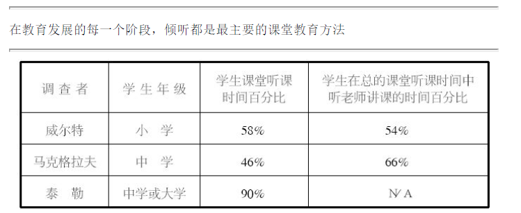
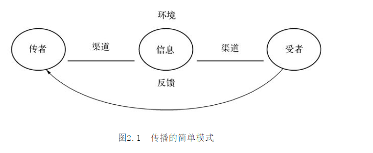
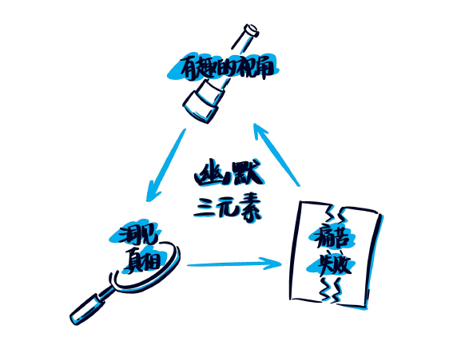
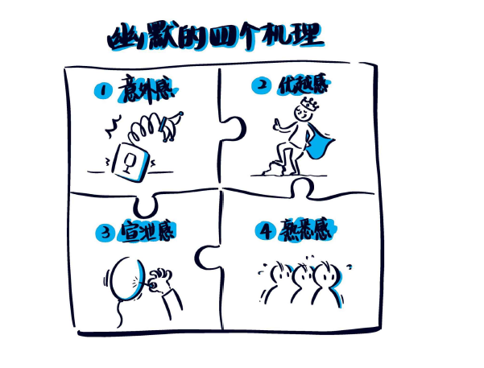
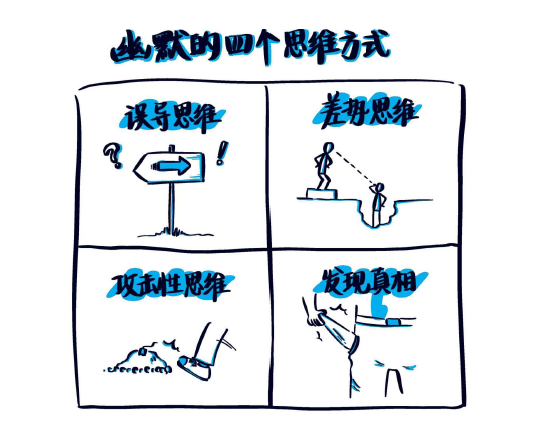
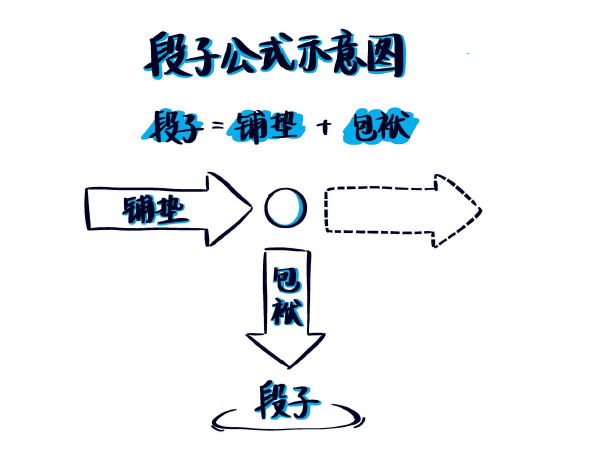
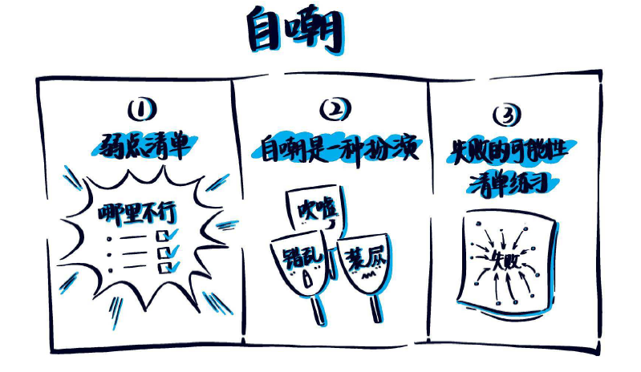

# 沟通的艺术

## 序言

## 背景

- 生理需求：沟通非常重要，沟通的存在与否会对生理健康产生很大影响。
- 认同需求：沟通的重要性绝不止于维持生存而已，它也是我们认识自己的方法
- 社交需求：沟通除了可以帮助我们诠释自我之外，也提供我们和他人之间重要的联结。
- 实际目标：在满足社交需求及塑造我们的自我认同之余，沟通还是达成沟通学者所谓的工具性目标最好用的方法。
  - **工具性目标( instrumental goal）**是指让他人按照我们的方式去表现。

## 流程

- **沟通**：有关使用信息来生成意义的过程
  - 线性观：沟通被描述为发送者对接收者所做的事
    - 
    - 外在噪音：沟通渠道中的噪音
    - 
  - 交流观：交流模式以“沟通者”取代“发送者”和“接收者”，沟通者这个词代表着我们同时发送和接收信息这个事实。
    - 
    - 生理噪音：生理因素，如生病
    - 心理噪音：因内在力量干扰造成无法准确地理解信息。

## 质化

1. 质化定义主张人际沟通只有在一方将另一方视为独一无二的个体,且无视沟通发生的场合与参与者的人数时才能成立。
2. 独特性( uniqueness)
   - 非人际沟通是由社会规则和社会角色决定的:前者如在他人说笑时适度地回应对方、不试图主宰谈话等;后者如顾客永远是对的、要尊敬长辈等。
   - 质化人际沟通讲求的是特定规则和特定角色的发展。比如,我们在某段关系中可能会和同伴互开一些无伤大雅的玩笑,而在另一段关系中则会尽量避免触怒对方。
3. 不可替代性( irreplaceability )。人际沟通的独特性使每一段关系都变得无可取代。
4. 相互依存性( interdependence)。简单来说，就是在一段质化人际关系中，你和对方的命运是相连的。
5. 公开( disclosure)。人际沟通通常（但并不总是）意味着公开一部分私人信息。
6. 内在的回报( intrinsic rewards )。在非人际沟通中，我们追求的是和参与者几乎无关的回报:我们坐在教室里听课、与想要购买二手车的买主交谈，都是为了达到某种目的，而这种目的通常并不是为了发展私下的关系。与此相反，在质化人际关系中，我们花费时间和朋友、爱人等其他人相处，因为我们知道这段时间是值得的

## 原则

1. 沟通可以是有目的或无目的的行为
2. 不沟通是不可能的
3. 沟通是不可复制的
4. 沟通是不可逆转的
5. 沟通同时具有内容和关系两个向度
   - 内容向度( content dimension)是指双方明确讨论的信息。
   - 关系向度( relational dimension)，用来表达你对对方的感觉。
6. 注意
   1. 沟通得越多不见得沟通得越好
   2. 意思不在字眼里。常犯的最大错误,估计就是把沟通( communicating )等同于把话说出来( saying )。对你来说恰到好处的表述，到了其他人耳中可能会解读出完全不同的意思。
   3. 成功的沟通并不表示彼此理解
   4. 沟通不会解决所有问题

## 方法

- 沟通能力( communication competence )。有效的沟通必须包含:能在大多数情况下维持或增进关系，并借此实现自己的目标。换句话来说，能力既要求有效性( effective)，又要求适当性（ appropriate )。
  1. 没有理想的沟通之道。你自己的经验也许就能告诉你，有效沟通的方法绝不只有一种。
  2. 沟通能力依情境而定。以程度( degree)或范围（ area)来划分
  3. 沟通能力可以后天学习
- 沟通高手的特质
  1. 拥有多样的行为反应。沟通高手能够从各式各样的沟通行为中选择他们的行动。
  2. 挑选恰当行为的能力。仅仅知道许多不同的沟通技巧并不能保证成功，懂得在不同的情境中使用最有效的技巧也是十分必要的。可以依据context、goal、knowledge of the other person
  3. 表现行为的技巧.在你已经挑选出最适合的沟通方式之后，能够有效地表现所需的沟通技巧也是很必要的。“说”和“做”之间有着很大的差异.
  4. 认知复杂度。社会科学家将人们看待事物时，能够组织其架构的技巧,称为认知复杂度( cognitive complexity )。
  5. 同理心。从多元角度看待一个情境固然非常重要，但在理解不同的观点之上还有一个步骤。同理心( empathy）是指如同对方那样去感受与经验对方的处境。
  6. 自我监控。认知复杂度和同理心能够帮助你更好地了解别人，而自我监控能使你更好地了解自己。心理学家们将观察自身的行为并借此调整自身行动的过程称为自我监控( self-monitoring )。
  7. 承诺承诺( commitment）是有效沟通——至少在质化人际关系中-的区辨特征之一。换句话说，那些看起来关心人际关系的人要比那些不关心的人更善于沟通。这种关心至少表现在两个方面。第一个是向他人做出承诺( commitment to the other person )。这有很多例子:愿意花时间陪伴对方而不是敷衍应付;乐意倾听对方说话而不是只顾自己说;使用对方能够理解的语言;在倾听对方的意见后能够以开放的心胸去调整自己的看法。沟通者第二个关心的是信息( the message)。他们总是真诚地倾听别人，似乎理解对方谈论的内容，同时还通过行为和言语证明对方的意见是重要的。
- 跨文化沟通的能力
  1. 动机愿意和陌生人达成沟通是一个重要的起步。研究显示那些愿意跟来自不同文化者沟通的人要比那些不愿意跨出去的人拥有更多不同背景的朋友。拥有适当的动机在各种沟通活动中都很重要，特别是在跨文化的人际互动中，因为挑战更大。
  2. 容忍模糊性。跟来自不同背景的人沟通可能会使你困惑。因为他们的信息在你看来，要么是模棱两可的，要么完全不能理解。这时你必须要有容忍模糊性的能力，才有可能接收甚至接受他们的想法。
  3. 开放心胸容忍模糊性是一回事,愿意对不同文化开放心胸是另一回事。当别人不符合我们的文化教养时，我们几乎本能地倾向于认为别人的沟通习惯是“错误”的。
  4. 知识和技巧。一个团体的工作规则和习惯可能完全不适用于另一个团体。
  5. 策略
     1. 被动观察( passive observation）是指留意不同文化中的成员的行为举止,并在实际的沟通中有效运用你洞察到的见解。
     2. 积极策略（ active strategy）是指通过阅读相关书籍、看电影、询问专家或隶属该文化的成员、选修有关跨文化沟通的课程等方式掌握相应的知识和技能。75
     3. 自我坦露( self-disclosure）是指自愿将自己的信息透露给想要进行沟通的跨文化对象。

# 十秒沟通术

- 人是受环境影响的动物，如果疏于表达，就会渐渐变得不会说话。
- 希望当即传递信息时，尽量选择老少皆知，甚至连初学日语的外国人也能明白的词词，以数字尤为有效。
  - 最想表达的信息放在最前面

# 倾听

## 倾听者要素

### 倾听者的认知框架和信息滤镜

- 当一个人说某件事时，听的人理解成了另一件事。

#### 认知框架

- ==认知框架是你对某个情境或话题的大概了解。==
  - 话语本身“不存在内在含义，只有在语境和语体构成的框架内才能够获得意义”。

#### 认知框架带来的偏见

- 认知框架虽然潜藏在意识之下，但也会导致偏见。在社交媒体上，这种现象随处可见。一道亮光划破天空，人们固有的框架会决定他们相信的事由。
- 我们也很容易发现，不同的变量，如性别、教育背景、与他人的关系和过往等，也会影响一个人对情境的理解。==如果你和某人经常往来，那么你们之间就会形成一个框架，通过这个框架，你可以看到你和这个人之间的所有互动。==

#### 信息滤镜

- ==信息滤镜是一个有意识的选择过程——让你把注意力集中在某件事上，而不是其他事上。==
- 认知框架是对一个情景的“大局”观，而信息滤镜则是一个有意识的选择过程——让你把注意力集中在某件事上，而不是其他事上。就像摄影一样，框架决定透过摄像机镜头所能看到的内容，而滤镜则决定镜头选择关注的焦点——哪些地方需要锐化，哪些地方需要虚化，哪里明，哪里暗。
- 滤镜能够改变我们接收他人信息的方式。必须注意的是，滤镜无所谓好坏，它只是一种管理我们大脑中输入信息的方法。
- 有效倾听源于你对自己的认知框架和信息滤镜的理解，同时你也需要知道，它们对你接收他人的消息会带来哪些影响。

#### 情绪管理

- 在倾听他人诉说时，要想确定我们自己以及他人的信息滤镜，我们就必须学会控制情绪。如果某人和你拥有相同的框架和滤镜，那么你就很容易理解他说的话。但，如果你的交谈对象和你拥有完全不同的世界观，那么你们之间的交谈就会变得越来越困难。
- 建议
  - 当你觉得自己变得情绪化时，后退一步，关注对方的情绪。他很愤怒，还是很兴奋，对你们所交流的话题充满热情？
  - 找到情绪变化的源头。在这种情况下，什么样的滤镜可能引发他们当前的情绪和行为？是否可能和你无关？
  - 开诚布公地指出他人的感受。如：“我们现在的交谈似乎让你变得很愤怒，我没理解错吧？”
  - 委婉地说出自己的感受，不要用对抗性方式表达（以第一人称“我”来表达，不要用“你”）。例如：“我想我很生气是因为……”
  - 认可他人的情绪体验，任何人都有权利表达自己的不同看法。
  - 即使谈话对方无法控制自己的情绪，你也要控制自己的情绪。不要做出情绪化反应。离开房间，给彼此留下冷静的空间。

### 七类倾听者

- 类型
  - 忧心者
    - 总是十分匆忙，不停地四处看，或者做其他事情。这类人经常一心多用，他们很难安静地坐在那里，听别人说话。
    - 交流建议：如果你正在和一个忧心者交谈，你可以问：“你现在方便吗？”或者说：“现在，我希望你专心听我说。”以这样的话头开始交谈，可以吸引他的注意力。交谈时，简明扼要，直接说要点，因为这类倾听者的注意力持续时间很短。
  - 神游者
    - 这类倾听者的身体虽然和你在一起，但他们的心早溜走了。从他们一脸茫然的表情上，你很容易看出来，他们要么在做白日梦，要么就在想其他的事情。
    - 如果你正在和一个神游者交谈，你可以时不时和他确认一下，问问他是否理解你正在说的话。和与忧心者交流一样，交流开始时，用一句话抓住他的注意力。谈话简单明了，直接说要点，因为这类倾听者的注意力持续时间也很短。
  - 打岔者
    - 这类倾听者随时都有可能插嘴说话，他们坐在那里，等待时机，随时准备打断你，为你代言。他们根本不听你说，全部心思都放在猜你要说什么以及自己要如何接话上
    - 如果你正在和一个打岔者交谈，当他插话时，立刻停下来，让他说，不然他根本无心听你说话。当他讲完时，你可以先对他的话予以认可，然后说：“正如我前面所说的……”引起他的注意，继续前面的话题。
  - 漠然者
    - 这类人在倾听时，态度冷漠，对什么都不在意。他们似乎并不关心你说了什么。
    - 如果你正在和一个漠然者交谈，你可以在表达你想法时戏剧化一些，然后问他问题，让他积极参与到谈话中来。
  - 好斗者
    - 他们全副武装，随时准备战斗；他们很喜欢反驳和指责他人。
    - 如果你正在和一个好斗者交谈，当他提出反对意见或者指责你时，你不要和他争论，往前看，不要向后看。可以各自保留不同意见，或者在下次谈话时再提出不同的解决办法。
  - 分析者
    - 他们自认为是优秀的倾听者，而且乐于助人。他们往往处于这样一种模式：不管你说什么，都能帮你分析分析，然后提出解决方案。
    - 如果你正在和一个分析者交流，你可以先说：“我只是想和你说点事，我不需要任何建议。”
  - 投入者
    - 他们拥有高超的倾听技巧，不仅能鼓励你继续发言，还能引导你找到自己的解决方案，并让你的想法得以展现。
      - 没有人能每时每刻都保持全身心投入倾听。
    - 如果你正在和一个投入者交谈，花些时间感谢他对谈话的专注，谢谢他能够对你们之间的话题感兴趣。
- 
  - 专心倾听、选择性倾听、分心的时间占比不是一成不变的。他们的时间占比取决于很多因素。

#### 两类分心

- 感觉干扰（周围事物造成的分心）和情绪干扰（你对周围事物的内心活动以及个人看法造成的分心）。

### 四大倾听类型

- 我们都曾有过这样的经历——听某个人说话时心不在焉。也许你正在忙着其他事情。也许你对谈论的话题不感兴趣。或者，你认为你正在认真听，但实际没有。
- 类型
  - 假装式倾听
    - 看起来在认真听，但实际上，可能在做白日梦，或者在想其他事情。
    - 当厌烦了或者不想听对方说的话时，人们往往就会陷入这种倾听模式。
  - 应对式倾听
    - 特里的倾听类型就是典型的应对式倾听，即为了解释或者捍卫自己的立场而倾听对方。
    - 应对式倾听时，你可能只会听进去部分内容，而且你会过滤掉那些无助于你应对的话语。
  - 学习式倾听
    - 在倾听时，会对倾听内容进行精准选择。倾听的目的不是理解说话人的感觉，或者换位思考。她的目的是获取信息。
    - 学习式倾听，即只听想听的内容，并选择性地过滤掉其余内容。
  - 共情式倾听
    - 共情式倾听，亦称“完人式倾听”，即在倾听时试图全方位理解对方，包括他的性格和他真实的、未说出口的
      想法和动机。
    - 共情式倾听的目的是试图全方位理解对方。

## 说话者要素

### 说话者的认知框架和信息滤镜

#### 说话者的认知框架会误导倾听者

- 具有相似背景（性别、教育背景、年龄、国籍等）的人往往对事物有相似的认知框架。

- ACES决策术
  - “Assumptions”（意为假设）、“Criteria” （ 意为标准） 、“Evoked Set” （ 意为激活域） 和“Search”（意为搜索）。假设就是“事情看起来如何”，即某人当前对问题的假设。（“唐是一个浑蛋。”）标准可以描述为：“我想
    要什么？”（“我想让唐赞美我的工作。”）激活域是一个学术术语，与以下问题有关——“你正在思考的问题有什么解决办法？”（“也许我需要把报告全都重写一遍。”）搜索是指为了解决问题，某人需要找到的信息。（ “ 我觉得我最好找到上个月的销售数据。”）

### 编码要素

- 成功编码消息取决于两个方面，一方面是简单明了传递信息的能力，一方面是你预测并消除干扰信息源（例如，文化问题、错误假设和信息缺失）的能力。成功编码的关键是了解听众。
- 如果你不了解你的沟通对象，那么你所传递的消息就很容易被误解。

#### 关系的重要性

- 影响我们编码消息的一个关键因素就是我们和倾听者之间的关系。

#### 个体差异

- 即使是同样的关系，也会因为卷入的个体不同而不同。例如母女关系，有些母女情同姐妹（“看到那边那个帅哥了吗”），有些母女关系则比较传统（“亲爱的，你交到新朋友了吗”）。当二联体（特指由两部分构成的事物）中一方对彼此之间的关系有了不同期待时，事情就会变得很有挑战性。

#### 环境因素

- “环境负荷”是一个专业术语，指一个人所承受的压力负荷，它专指直接环境中会给一个人带来压力的任何事物。

#### 令人愤怒的是消息，而不是消息的传递者

- 消息传递者最重要的四个品质（按重要性排序）
  1. 消息传递者的态度。消息传递者的态度是由他的认知框架和信息滤镜决定的；
  2. 消息的清晰度。消息清晰度则和我们讨论的编码因素息息相关。
  3. 隐私。隐私即我们谈论的环境因素。
  4. 解答疑问的能力。解答疑问的能力相关的是沟通风格的差异

### 沟通风格差异

#### 决策风格

- 确定何时、如何分享哪些信息构成了绝大多数沟通的基础。了解决策风格的个体差异有助于我们理解讲话者和倾听者如何看待沟通。
- 决策风格模型。该模型探究了人们是如何根据两个维度做决策的。这两个维度分别为：决策时所需信息的数量、决策时考虑到的备选方案的数量。

#### 信息使用

- 人们做决策时所使用的信息量差别很大。一些人只根据几条事实就得出结论。而另一些人得出结论前会收集并分析大量信息。使用信息量少的那些人，我们称为“易满足者”。“易满足”一词意味着只需几条信息就可以得出一个“足够好的”决策。和易满足者相对的称为“最大化者”。后者在做决定前，会考虑很多信息。

#### 焦点

- 决策风格模型也把注意力作为人们决策的一个维度。在谈到注意力时，人们通常有两种倾向。一种人属于“单焦点者”，他们会把精力集中在得出一个最佳解决方案上。另一种人属于“多焦点者”，在他们眼中，不同的解决方案或者选择都具有同等的吸引力。

#### 四大决策风格

- 单焦点最大化者：这类人在做决定前会收集大量信息，并进行分析，做决定时小心谨慎。他们希望找到一个最佳问题解决方案。这类人属于层级型决策风格。
- 多焦点最大化者：这类人会收集大量信息，并乐于考虑多种选择。对他们来说，做决策是一个过程，不一定是为了寻找单一答案。这类人属于综合型决策风格。
- 单焦点易满足者：就某个行动，这类人会利用最少信息快速做出明确的决定，因此他们属于果断型决策风格。
- 多焦点易满足者：这类人思维活跃、反应灵敏，对于任何一条信息，他们都可能给出不同的解释，赋予不同的意义。如果行动执行不顺，他们会迅速调整方向，因此他们属于灵活型决策风格。
- 角色风格：在特定场合，扮演你认为你应该扮演的角色
- 本色风格：你天生的决策风格

## 沟通为何失败

### 人际关系中的冲突

- 人际冲突都源于两个人之间沟通不畅。

#### 冲突阶段

- 冲突的发展是成阶段性的，通常是可预见的。管理冲突首先要确定冲突是什么时候、如何产生的。
- 组织冲突模型
  - 潜伏阶段：有潜在冲突。
  - 知觉阶段：冲突处于认知层面。冲突一方或者双方可能认识到了冲突的存在。
  - 感觉阶段：冲突处于感觉层面——冲突双方开始感觉烦躁。
  - 显性阶段：双方在行为上开始出现冲突——充满敌意、争吵，甚至发生肢体冲突。
  - 冲突后果：冲突造成的影响。
- 两个人在以前交流中累积的问题越多，潜在冲突就越有可能转化为显性冲突。

#### 解决冲突的三个阶段

- 阶段一：了解对方的看法。我们花大量的时间努力让他人倾听我们的想法，却根本不关心对方是怎么想的。
- 阶段二：解释自己的观点。只有在你充分听取了别人的观点并建立了他们的框架之后，你才能专心解释自己的观点。
- 阶段三：寻找解决方案。

### 你的冲突类型是什么

- 冲突类型的差异
  - 狮子型：这种类型的人看重的是“获胜”而不是彼此之间的关系。他们把冲突看作一场竞争。“我知道，他们一旦看到我的观点，就会改变主意听我的。”这类人秉持的是“我赢你输”的立场。
  - 鸵鸟型：这种类型的人为了避免冲突可以不惜一切。对他们来讲，冲突的存在才是问题。争论没有价值，因为它根本不会影响结果。“我宁愿忘记它。”这类人秉持的是“我输你也输”的立场。
  - 犬型：这种类型的人把关系看得比什么都重要，为了维持关系，他们会迁就对方的要求。和狮子型的人完全相反。“好吧，按你说的做。”这类人秉持的是“你赢我输”的立场。
  - 鱼型：这种类型的人就像一群鱼，重视团结协作。他们想要找出一种方法，让每个人都能够从中获益。这类人秉持的是“你赢我也赢”的立场。
  - 变色龙型：这种类型不如上述四种常见。这种类型的人可以从上述的四种类型之一转向另一种，即为了和另一种类型的人交流，暂时调整自己的类型。

## 掌握有效倾听的技巧

### 倾听阶梯

- 基本问题确定基本信息。
- 思考性问题使我们充实所获的基本信息。
- 评估性问题促使对方分享他们的想法和观点。

### 面试法

- 面试法包括一系列问题，目的是让倾听者提出有效问题。

### 肢体语言中的文化差异

### 非言语沟通方法——SOFTEN

- S=微笑（Smile）
- O=开放的姿态（Open posture）
- F=身体前倾（Forward lean）
- T= 接触（Touch）
- E=眼神交流（Eye contact）
- N= 点头（Nod）

# 倾听的艺术

## 引言

- 倾听的作用
  - 更清晰、更准确地理解信息；
  - 更精确地理解语言与非语言信息的传播；
  - 犯更少的错误；
  - 提高学术水平；
  - 更具批判性地思考；
  - 提高有效反馈；
  - 提高人际关系的质量。

## 理解倾听过程

- 以倾听的视角来理解传播是改进人际传播、提高传播效果的重要一步
- 明白倾听这一人类行为的复杂性是发展有效倾听技巧和行为的基础

### 有效倾听的必要性

#### 倾听角色的典范

- 大多数人都没有意识到有意义的口头传播是发送信息和接收信息的结果
- 孩子首先通过模仿他人学习倾听
- 希望孩子成为一名很好的倾听者的家长必须表现出他们经常乐意倾听孩子的意愿
- 不能或不愿意倾听是损害婚姻关系的主要因素
- 少年时代，大多数人都把朋友置于优先倾听者之首
- 教师是有效倾听的职业角色榜样
- 一名好教师既是好的演讲者又是好的听众，而后者比前者更重要
- 专心听他人讲话，是我们给予他人的最大尊重、呵护和赞美
- 无效倾听也使消费者在商业活动中受损
- 白领阶层的有效倾听率平均仅为25％
- 商业组织成员缺乏聆听技巧
- 史上最严重的一起航空事故就是因为有效倾听的缺失而导致的

#### 倾听是重要的

- 说、读、写及掌握复杂的认知技巧的能力都直接或间接地依赖于倾听技能
- 
- 倾听是人际口头交流中最重要的方式，但倾听的技巧并不因使用就能自动提升
- 倾听的重要作用由于大众传播媒体的发展而变得更为突出
- 信息从大众媒介流向意见领袖（如朋友、同事及家庭成员），再从意见领袖流向社会的其他成员
- 倾听能区分无知与有识、信息与误传、参与与分离、享受与厌倦之间的不同。
- 倾听的艺术使我们能把握住自己，并坚持自己的理想以经受日益扩散的来自商业的破坏、国家主义及意识形态的说服。

#### 有效倾听是值得的

- 有效倾听在商业活动中一个最主要的有价值的回报就是金钱
  - 真正良好的倾听会产生戏剧性的效果。这些效果包括我们会拥有满意度高的回头客，满意的雇员会选择继续留在公司，经理会得到雇员的信任，而销售员则会突破他的业绩。良好的倾听者能得到共事的人的高度评价……
  - 他们永远保持警惕，不管是在工作还是游玩，在吃饭还是睡觉，他们永远都竖起耳朵，倾听提议者、顾客、内部意见、敌人及任何风吹草动，这就是为什么他们在别人都没看到隐藏的问题和机会时就拿好了主意……他们每一个人仿佛都是被上帝祝福的“先听先觉”。
- 有效倾听者因能获得更多的信息而受益
- 有效倾听者能进一步加强社会关系网
- 倾听的另一个回报是改善家庭关系
- 倾听的再一个回报就是增加快乐感
- 人类最基本的需求就是了解和被了解

#### 倾听经常造成误解

- 听觉是构成倾听不可或缺的一部分
- 我们只有通过系统的训练才能使自己正确地分析形势并真正从体验中学到东西
- 如果一个人不具备倾听技巧，他对听到的东西的理解力会很弱
- 阅读与视觉有关，而倾听则与听觉有关
- 倾听不仅对身体而言是一项艰苦的工作，对思想而言也是如此
- 没有人在没有一个听众的情况下还能进行出色的公众讲演
- 既然说话者和倾听者是“同盟军”或搭档，那么他们就应该一起承担起成功交流的责任
- 倾听并不意味着同意或遵从

#### 倾听教学的现状

- 在所有语言技巧的教学中，最为人们所忽视的就是倾听
- 学校的教学重点放在阅读与写作上，而不是说话与倾听上
- 许多人在理论学习阶段并没有获得直接的、专业的倾听指导

### 传播过程

#### 传播的构成要素

- 传播是一个持续的人类互动过程，这一复杂的现象由多种要素构成：传者、信息、渠道、受者、反馈、环境和噪音。
  - 第一个要素是传播者，即说话的人，是信息产生的源头
  - 接着，编码过的信息通过传播渠道进行传输。
  - 然后，通过传播渠道传输的语言信息和非语言信息为接收者所接收、解码，他们对其进行过滤或转化为自己的语言代码，同时赋予其意义。
  - 反过来，作为一个接收者，他对自身所接收到的信息以某种反馈的形式重新发送至传者，这样，反馈就赋予了传播过程持续和动态的特点。
  - 在这个过程中，传播还受到其他两个重要因素的制约。
    - 环境，即传播活动所发生的场所就是其中一个因素。环境的温度、通风情况、光线强弱以及房屋大小都影响传播的效果
    - 噪音。噪音包括内部和外部的干扰。内部的干扰来自传播者自身。比如，传播者心情不愉快，心事重重
      （担忧、疲劳、饥饿、疾病、与上级关系有麻烦），或是对信息表达中运用某个词语或想法有情感上的障碍。干扰也可能是外部的，诸如房屋中的巨大声响、他人的谈话、同时发送的其他信息、渠道的不畅通或是信息缺乏连贯性等，这些干扰都可能导致信息丢失。
- 

#### 传播变量

- 传播技巧：影响传受双方的一个关键变量是传播技巧，即传播者在传播过程中运用的技能。
- 传播知识：对传播知识了解得越广泛，对传递的信息知道得越清楚，传播的效果就越好
- 传播态度：即积极或消极反应的精神状态，也会影响传播过程，传受双方必须共享这种态度。
- 传播与参照标准：传播者，包括演讲者与倾听者，他们的态度、知识和技巧形成了个人的参照标准，即看待问题的角度。这种参照标准由个人背景、生活阅历、社会文化环境和其他一切令某人成为独特个体的因素构成。这些因素共同
  形成了一个认知过滤器，我们通过它来接收刺激物，发送信息，并与周围的世界保持联系。
  - 我们能看到或听到的是我们想看到和听到的东西
- 信息内容与结构
- 语言代码与符号系统
- 渠道选择
- 环境

##提高目的性的倾听技巧

### 辨别性倾听

- 辨别性倾听即区分来自听觉或视觉的刺激。
- 辨别性倾听是理解性倾听、批判性倾听、治疗性倾听与欣赏性倾听形成的基础。
- 听觉的辨别力对发现或认识语言与非语言声音，认识语言的声音结构，察觉并区分口头暗示，理解方言和口音的区别，认识环境声音等具有重要性。
- 视觉辨别力对认识通过姿势、身体行为、手势、面部表情、眼神活动、外貌及用品、空间／距离、时间、触摸和环境因素等表达的非语言符号具有重要意义。
- 听觉与视觉的辨别力对发现欺骗性与常规性暗示具有重要意义。
- 有效的辨别性倾听者：
  - 会努力区别听觉与视觉的刺激；
  - 对来自传播者的语言与非语言的暗示非常敏感；
  - 能认识到倾听过程中辨别力的重要性。

- 辨别性倾听即区分各种听觉刺激
  - 在不同的场合，刺激也可能会有视觉的，如微笑、握拳、耸肩等。
  - 具备综合能力的听者可以洞察发言者的音调、音量和语速的变化，据此判断发言者何时从一个主题转入另一个主题。

#### 辨别性听力的运用

- 在人的一生中，我们非常依赖辨别性听力。当我们试着注意并确认生活环境中的声音同时使用这些声音来适应环境时，这就意味着我们开始培养辨别性听力。

#### 辨别性听力的重要性

- 有效学习口头和书面词汇有赖于辨别性听力
- 倾听的第一步是区分一条信息的各个部分

#### 辨别性听力的技巧

- 培养辨别性听力技巧是一个持续的过程

##### 洞察并区分口头暗示

- 口头暗示是辨别性倾听的重要组成部分
  - 伴随一个人口语的辅助语言或口头暗示，如音调、抑扬、张力、音量、强度、速度、质量、语调、嗓门大小。
  - 言语特征，如大笑、叹气、打哈欠。
  - 言语混乱或不连贯，如重复、省略、滑舌、纠正句子、错误开头、句子不完整、结巴等。
  - 有声停顿，指的是包含非语言发音的停顿，也称口头停顿，如啊、嗯等。
- 速度和音调的变化是判断情感表达最有影响力的因素
- 当非语言行为与言语发生矛盾时，非语言行为更能决定信息的整体印象，如触摸、态度（距离、前倾、眼神接触）、姿势、手势、面部表情，包括口头暗示，都远远超过言语所表达的意思，从而决定了信息传播的情感与意义。
- 要想更准确地解释他人口头表达的情感，有辨别力的听者要进行自我监测，也就是说，要对自身的表达行为有清醒的认识和控制，因为能自我监测的人可以更好地解释他人表达的情感。
- 加强口头暗示的理解
  - 女性音调较高且比男性更易表达情感。
  - 与男性相比，女性更易在句子结尾处提高音调（即使并非提问）。
  - 与女性相比，男性之间的交流声音更响亮。
  - 男性比女性讲话速度稍快一点。
  - 语速快的人比语速慢的人更具说服力。
  - 发言者使用各种口头表达方式以增强听者对信息的理解和记忆。
  - 呼吸和鼻音不利于听者的理解。
  - 与男性相比，女性的声音更积极、更快乐、更真诚、更具个性、更值得赞美和尊敬、更显焦虑、更热情，但男性声音更显自信，也更具威严。
  - 女性讲话比男性流利。
  - 男性的讲话中断比女性多。
  - 说话不连贯会影响发言者的可信度。
  - 处于焦虑状态的发言者说话易混乱、不连贯并伴有有声停顿。
  - 使用多种语调和音量、速度快、停顿少的讲话者更具说服力。
  - 男性的谈话更轻一些，谈话交流次数比女性更多一些。
  - 同性之间交流，女性讲话多一些。
  - 异性之间交流，男性讲话更多。
  - 谈话出现中断时，男性比女性更易采取主动。
  - 与男性相比，女性有更多的非语言行为。
  - 人们会把进行非语言行为（包括发出“嗯”、“啊”声）的人视为比较热情的人，他们也能够有效地促使其他人多讲话。

##### 理解方言与口音的差异

- 方言应该是指同门语言中的不同变体，各变体在发音、语法、用词这三方面存在显著的、系统的差异，如上海话和广东话。
- 口音主要是指同一方言里的不同变体，它们相互之间的区别特征主要体现在发音上以及少数用词差异上，不存在系统的语法和大量的用词方面的差别。
- 相同口音的人更易于沟通与接近，也更容易得到认可

##### 认识环境声音

- 细心的辨别性倾听者可以培养对环境声音的敏感性，这有助于提高我们的听觉效率。
- 倾听环境的声音是控制环境的一个重要部分

#### 视觉辨别

##### 洞察并区分非语言暗示

- 与口头方式相比，视觉系统传递更多、更可靠的情感信息
- 非语言传播的六大原则
  1. 任何非语言行为都可能有多种含义，因此应把它们看作是一种提示而非事实，并对其加以检验。
  2. 每个人都有自己的非语言行为。交流者之间越了解，就越能够解释彼此的非语言行为。
  3. 每种文化都有自身特定的非语言行为。
  4. 一组非语言行为比单个非语言信号承载更多的意义。
  5. 必须把非语言行为放到一个背景下去审视。
  6. 男性和女性似乎各有所长。
- 非语言传播的运用
  1. 用于补充语言信息。例如，在回答“是 ”时，点头以示肯定。或者在说“见到你太好了”时，紧紧抓住对方的手。
  2. 非语言信息可能与语言信息矛盾。例如，一个正在聚精会神地看电视或读报的人回应说“是的，我在听”，而其实他们继续读报或看电视。或者一位父亲正在训斥孩子，但脸部表情却忍俊不禁。
  3. 非语言信息可以取代语言信息。
  4. 非语言信息可以强调语言信息的一部分。
  5. 发言者使用非语言信息来重复语言信息。
- 非语言符号包括体态语言、外貌、人造物品、距离、时间、触摸、环境等
  - 体态语言。也许最能展现真相的就是面部表情和肢体语言。通过身体姿势、身体行为、面部表情和眼神活动，交流者可以表达许多信息，可能是“我有许多令人激动的消息要与你分享”，也可能是“我没有时间倾听”。
- 非语言行为分类体系
  1. 具有象征意义的非语言行为。这种非语言行为可以直接用沟通者很熟悉的对等的语言翻译出来，人们在使用它们的时候，都是有意识和目的的，而且在绝大多数时候，这种非语言行为是靠双手来进行的。例如，举起手掌，摇动食指或所有的手指所表达的意思是“过来”。把手掌放在一个空的地方并且用四个手指轻轻地拍就表示“坐在我旁边”。
  2. 进行说明和解释的非语言行为。能够直接与语言信息相联系的对讲话内容进行强调、指引、阐明、扩展的非语言符号。例如，一个人可能把下颚指向另外一个人，用来表示那个人就是他正在谈论的对象。或者在交谈过程中，一个人可能改变其身体姿势用来暗示他观点的改变。
  3. 表现情感的非语言行为。这类非语言行为在绝大多数时候是通过脸部表情来表达的。为了说明这一点，我们来举几个例子。害怕可以通过扬眉和睁大眼睛来表现；厌烦可以通过不断地跺脚、坐立不安、敲手指或连续不断地改变身体姿势来传达和表现。
  4. 习惯性非语言行为。这类非语言行为一般很少带有目的与意图，而是一个人的习惯行为。两种最常见的这类非语言行为是：自身习惯性非语言行为（触摸自己）和物体性非语言行为（触摸物体等）。自身习惯性非语言行为表现使用者的内心状态，如在焦虑和不自在的状态下，有的人会搓自己的后脖子或者拉自己的耳朵，以暗示自己的紧张。而物体性非语言行为如：把纸巾撕成碎片，或把纸填塞到很小的、包扎紧密的球状物里，从而暗示出自己的紧张心情。
  5. 常规性非语言行为。用于维持和调整沟通活动的非语言行为。例如，说话者在交流暂停的时候，避免与对方进行眼神接触，暗示说话者想继续谈论，而穿上外套则表示自己想结束交流活动。
- 身体行为和姿势。这个部分包含了与整个身体相关的行为，比如身体定位、开放和封闭的姿势、身体的倾斜、身体姿势、手势和头部运动。下面是一些与辨别性倾听者有密切关联的研究成果。
  1. 身体定位（交流者肩膀与双腿的前倾程度，而不是远离交流的另一方）
     1. 同性交流中，女性比男性表现出更直接的身体定位。
     2. 人们对自己喜欢的沟通对象表现出更为直接的身体定位。
     3. 表现出直接身体定位的沟通者通常被认为更全神贯注于交流活动。
     4. 人们在跟与自己拥有相同地位的人接触时更会表示出直接的身体定位。
     5. 与比自己社会地位低的人相比，人们通常更倾向于对比自己社会地位高的人表现出更直接的身体定位。
     6. 男性沟通者对他所喜欢的交流对象表现出不太直接的身体定位。
  2. 开放的和封闭的姿势（开放性身体姿势包括把膝盖张开，把腿伸直，使肘部离开身体，双手不触摸其他东西，不把腿交叉起来等等；封闭性身体姿势包括腿交叉在膝盖上或脚脖子上，手交叉叠放，手臂交叉在胸前等等）
     1. 人们对自己喜欢的交流对象表现出更为开放的身体姿势。
     2. 比起封闭式身体姿势的人，表现出开放式身体姿势的人通常被认为更主动、更积极。
     3. 比起封闭式身体姿势的交流者，表现出开放式身体姿势的沟通者更具有说服对方的能力。
     4. 男性比女性更具有扩张性。
     5. 比起与同性之间的交流，异性交流中的人们更倾向于伸展其手臂和双腿。
     6. 在交流活动中，女性的动作没有男性开放。
  3. 身体的倾斜（参与沟通的一方采用哪一种身体倾斜方式，是向前、向后，还是远离，这与另一方是密切相关的）
     1. 人们在遇到自己喜欢的沟通对象时，身体会更前倾。
     2. 在沟通过程中，身体向前倾斜的人通常被认为具有更高的热情。
     3. 在交流过程中，采用前倾姿势的沟通者更能激发对方讲话。
     4. 斜向一边：当交流的各方就座，相互的座位呈现某种角度时，如果倾斜是朝向其沟通对象的，那就暗示着沟通者对其沟通对象的喜欢或欣赏。
     5. 在交流过程中，采用前倾姿势的沟通者通常被认为更全神贯注于交流活动。
     6. 在异性交流活动中，人们更易采取身体前倾的姿势。
     7. 在交流过程中，男性比女性更放松，因此更易采取身体向后倾斜的姿势。
     8. 在交流过程中，人们对比自己社会地位低的人更易表现出斜向一边的姿势。
  4. 身体姿势.人们在与自己喜欢的人沟通时，身体姿势更放松、更自在（如躺卧，斜倚，把双脚搭在桌子上，斜靠在某个地方）。
     1. 男性比女性更会表现出轻松自在的身体姿势。
     2. 人们在与比自己社会地位低的人交谈时，其双腿与双手的姿势都更为放松自在。
     3. 社会地位高的人在与社会地位低的人交谈时，更易表现出轻松自在的身体姿势。
     4. 关系密切的同性好友在交谈过程中互相都能表现出轻松自在的身体姿势。
     5. 比起适度的轻松自在的身体姿势，过分紧张和过分随意的身体姿势都会被交流对方认为是消极的。
     6. 男性比女性在交谈过程中更易表现出烦躁不安的行为（如缓慢地移动身体，坐立不安，玩弄身边的物体，不断地转动身体，不断地移动双腿）。
  5. 手势（双手和手臂动作）
     1. 女性比男性更有可能表现出具有自我意识的行为（如修剪指甲，烦躁不安地扯拉自己的衣服，摸头发等）。
     2. 人们在与异性交谈时，更易玩弄身边的物体。
     3. 人们在与异性交谈时，会更多地使用手势进行交流。
     4. 女性之间的交谈，尤其在寻求赞同时，其一大特点就是高频率地使用手势。
     5. 女性比男性更倾向于快速地使用手势进行交流。
     6. 在发表演讲时，男性比女性更频繁地使用手势。
     7. 当说话者回答他们熟悉的问题或进行近距离沟通时，他们会更多地使用控制性手势（摸自己身上或者身边的东西）。
     8. 双手保持相对静止状态的交谈者会被认为是热情洋溢的，而在交谈中拍打手指的人则会被认为较冷酷。
     9. 频繁的手势可表示出喜欢、偏爱或是感情愉快的相互交流。
     10. 在交谈者表达问候时，伸展手势的使用能够传达出交谈者对对方的喜爱之情。
     11. 随着交谈者年龄的增加，其手势的使用也会增加。
     12. 当交谈者焦虑和不自在的程度加深时，他们触摸身上东西的频率也会提高，直到他们的焦虑和不自在的程度达到一定高度，他们就可能在交流中僵住而不表现出任何动作。
  6. 头部运动
     1. 女性之间在交谈时，寻求支持的一大特点就是不断地点头。
     2. 倾听者对说话者频频点头会延长说话者的讲话时间。
     3. 倾听者对说话者频频点头能对说话者产生积极影响。
     4. 倾听者对说话者频频的肯定性点头能够传达出对交流伙伴的喜爱之情。
     5. 在沟通过程中，不断增加点头频率的交谈者通常会被认为有较强的理解力、热情洋溢的交流态度和开放的思想。
  7. 面部表情。这种非语言元素主要表现为额头、眉毛、眼睛、鼻子、嘴巴、舌头、面颊以及下颚等的快速变化，这是交流情感和态度的一种主要方式。
     1. 作用
        1. 交谈者的面部表情在一定程度上能够表现出他们认为这样的交流过程是愉快的还是不愉快的；
        2. 能在一定水平上反映出他们对活动感兴趣的程度；
        3. 能在一定水平上表现出他们的参与程度与积极性；
        4. 能在一定水平上反映出交谈者相互理解的程度；
        5. 能表现出交谈者对彼此回应的自发性（处于自然状态还是被强迫状态）。
     2. 面部表情的解释较困难，因为它很容易控制
        1. 缓和某种强烈的情感（如某种强烈的情感可以通过控制而表现得较为温和）；
        2. 加强某种情感（如某种较温和的情感可以通过控制而表现得较为强烈）；
        3. 使某种情感中立化（可以通过控制来压抑某种真实的情感）；
        4. 掩盖某种情感（可以用其他错误的情感来掩盖某种真实的情感，或是表现出某人根本没有感受到的某种情感）。
  8. 眼神活动
     1. 在解释这些眼神传达的信息时，辨别性倾听者应该要考虑到眼神活动的各种类型：注视（一个人看的行为——可能朝向或不朝向另外一个人），相互注视（双方互相注视对方——注视的范围通常停留在脸的部
        位），还有眼神交流（双方相互直视对方的眼睛）。除此之外，辨别性倾听者还应考虑眼神活动的频率，比如注视的回避、注视持续的时间等。同时，他们还应考虑影响眼神活动的各种因素：交谈者的情感、态度、性格、性别、社会地位、文化背景、沟通者之间的距离、谈论的主题等等。

# 幽默感

## 重新认识幽默

1. 幽默不是搞笑，幽默是你从一个有趣的视角来讲述痛苦和真相，是一种智慧且有力量的自我表达。
   1. 
2. 幽默之所以让人发笑，是因为人们在幽默中产生了意外感、优越感、宣泄感和熟悉感，这就是幽默的四个机理。所有
   让人感觉好笑的事情，都是因为给你带来了这四种感受中的一个或多个。
   1. 
   2. 
3. 幽默也是有段位的，不同段位的幽默制造出的效果也会不同。你可以从逗乐别人的低段位开始学习幽默，然后进阶到
   让幽默成为人际关系的润滑剂，最后可以在幽默的内涵和深度上下功夫，在更高段位制造出有影响力的幽默。
4. 幽默可以通过刻意练习来提升，在幽默这件事情上，刻意练习比天赋更重要。幽默感的练习，同样遵循“刻意练习”的“一万小时定律”。

## 搞笑有套路，段子有公式

- 段子的基本公式：段子=铺垫+包袱
  - 所有的段子，都由两部分组成，第一部分是前面的一句话，我们把它叫作铺垫，第二部分是后面的一句话，我们把它叫作包袱。其中，铺垫是建立第一个思路，把你引向方向A；而包袱是揭示第二个思路，把你引向方向B，这就是我们在第1章讲到的意外感。前面的铺垫不需要好笑，你只需要陈述一个事实，越正经越严肃越好，好笑的部
    分是后面的包袱。
  - 
  - 注意
    1. 简洁是铺垫的第一原则。
  - 连接词:这个连接词不是铺垫和包袱中间的那个加号，而是你需要在铺垫的部分找一个概念词，这个词可以有两种解释。第一种解释是在社会语境下，人们马上会想到的主流含义；第二种解释是不太常用的另外一种意思。也就是说，第一种解释是人们都理解的常规的意思，一般是正经的，而第二种解释往往不那么正经。
  - 强化段子铺垫里的误导:有时候，为了让幽默的效果更强、更明显，需要在铺垫和包袱之间加一个短句子，这个短句子的功能是让听众毫不设防地相信铺垫里的误导，目的就是蒙蔽听众。
  - 误导思维
    - 所谓“答非所问”，就是不正面回答对方的问题，违背对方的预期。这是很易于使用的一个技巧。我称这个练习为废话里的王者练习。规则就是：无论对方问什么问题，你只要不顺着对方回答，就能给出让人意外的答案。这个技巧可以帮助你跳出对方预设的语境，永远不被对方的逻辑套牢。
      - 答非所问就像诸葛亮的空城计，最好只用一次。用多了会显得你很油滑，不真诚，不严肃，不愿意跟对方交流。答非所问是个让提问者有受挫感的技巧，用得多了双方的谈话将很难进行下去，所以千万记得要节制使用。
    - 情绪势能变化：情绪势能变化就是人们常说的先抑后扬或先扬后抑。
    - 好坏颠倒：如果你把对事物的判断颠倒过来，也可以形成误导思维。
    - 不协调：不协调是指把一个异质元素放到一个常见情境中，造成不搭的效果。这个技巧，往往只需要你改变熟悉情境中的一个元素就可以，这个元素可以是反常的，也可以是搞怪的，这样幽默的效果就出来了。

## 自嘲是你的铠甲

- 幽默的机理之一是优越感。自嘲就是把自己的痛苦告诉别人，让对方产生心理优势，从而产生幽默的效果。也就是
  说，自嘲本质上就是吐槽自己的失败和痛苦。
- 我们为什么要学会自嘲呢？因为想要自嘲，自己的内心必须强大，敢于直面失败和痛苦，还要敢于勇敢地当众把它说出来。这要求我们对自己的痛点有一个清醒的认知，知道自己真实的短处和缺点在哪里，然后去跟听众分享。所以自嘲的本质是自我接纳，而自我接纳是自我成长很重要的一部分。能与自己和谐相处，会让你成为更完善的人、更快乐的人，幸福指数飙升。
- 自嘲并不是一件容易的事情，因为从人类深层次的需求来讲，每个人都希望自己被关注、被尊重，以获得满足感和安全感，而自嘲是把自己的弱点和短处赤裸裸地展示给别人看，不仅会让自己难堪和痛苦，还有可能影响自己的形象。所以，我们愿意冒犯和攻击别人来制造幽默，却不敢攻击自己。
- 第一，接纳自己的不完美，敢于把自己的弱点展示出来；第二，用自嘲帮助自己成为受欢迎的人；第三，可以利用自嘲巧妙自吹，表现自己的实力。
- 自嘲第一步：建立不易崩塌的人设
  - 从人性的弱点出发，避免高大上的人设
  - 人设要忠于自己的真实情况
  - 不断丰富自己的人设
- 自嘲的技巧和方法
  - 夸张，就是把你的弱点或者你为自己设定的人设放大再放大，放大到一个荒诞的、不可信的程度。
  - 比惨
  - 利用发散思维，颠覆跟自己相关的刻板印象
- 脱敏训练，强大你的内心
  - 
    - 弱点清单：你哪里不行？:敢于自嘲的人，都能清醒认识自己的弱点，而且可以坦然接受弱点并勇敢将其说出来。所以，自嘲训练的第一步，就是找到并接受自己的弱点。
    - 自嘲是一种扮演
      - 用自吹自擂来自嘲
      - 打脸梗
      - 
