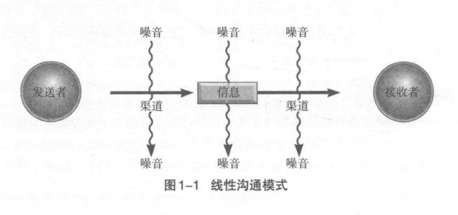
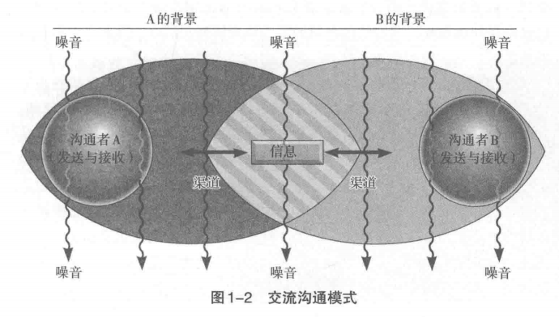

# 沟通的艺术

## 序言

## 背景

- 生理需求：沟通非常重要，沟通的存在与否会对生理健康产生很大影响。
- 认同需求：沟通的重要性绝不止于维持生存而已，它也是我们认识自己的方法
- 社交需求：沟通除了可以帮助我们诠释自我之外，也提供我们和他人之间重要的联结。
- 实际目标：在满足社交需求及塑造我们的自我认同之余，沟通还是达成沟通学者所谓的工具性目标最好用的方法。
  - **工具性目标( instrumental goal）**是指让他人按照我们的方式去表现。

## 流程

- **沟通**：有关使用信息来生成意义的过程
  - 线性观：沟通被描述为发送者对接收者所做的事
    - 
    - 外在噪音：沟通渠道中的噪音
    - 
  - 交流观：交流模式以“沟通者”取代“发送者”和“接收者”，沟通者这个词代表着我们同时发送和接收信息这个事实。
    - 
    - 生理噪音：生理因素，如生病
    - 心理噪音：因内在力量干扰造成无法准确地理解信息。

## 质化

1. 质化定义主张人际沟通只有在一方将另一方视为独一无二的个体,且无视沟通发生的场合与参与者的人数时才能成立。
2. 独特性( uniqueness)
   - 非人际沟通是由社会规则和社会角色决定的:前者如在他人说笑时适度地回应对方、不试图主宰谈话等;后者如顾客永远是对的、要尊敬长辈等。
   - 质化人际沟通讲求的是特定规则和特定角色的发展。比如,我们在某段关系中可能会和同伴互开一些无伤大雅的玩笑,而在另一段关系中则会尽量避免触怒对方。
3. 不可替代性( irreplaceability )。人际沟通的独特性使每一段关系都变得无可取代。
4. 相互依存性( interdependence)。简单来说，就是在一段质化人际关系中，你和对方的命运是相连的。
5. 公开( disclosure)。人际沟通通常（但并不总是）意味着公开一部分私人信息。
6. 内在的回报( intrinsic rewards )。在非人际沟通中，我们追求的是和参与者几乎无关的回报:我们坐在教室里听课、与想要购买二手车的买主交谈，都是为了达到某种目的，而这种目的通常并不是为了发展私下的关系。与此相反，在质化人际关系中，我们花费时间和朋友、爱人等其他人相处，因为我们知道这段时间是值得的

## 原则

1. 沟通可以是有目的或无目的的行为
2. 不沟通是不可能的
3. 沟通是不可复制的
4. 沟通是不可逆转的
5. 沟通同时具有内容和关系两个向度
   - 内容向度( content dimension)是指双方明确讨论的信息。
   - 关系向度( relational dimension)，用来表达你对对方的感觉。
6. 注意
   1. 沟通得越多不见得沟通得越好
   2. 意思不在字眼里。常犯的最大错误,估计就是把沟通( communicating )等同于把话说出来( saying )。对你来说恰到好处的表述，到了其他人耳中可能会解读出完全不同的意思。
   3. 成功的沟通并不表示彼此理解
   4. 沟通不会解决所有问题

## 方法

- 沟通能力( communication competence )。有效的沟通必须包含:能在大多数情况下维持或增进关系，并借此实现自己的目标。换句话来说，能力既要求有效性( effective)，又要求适当性（ appropriate )。
  1. 没有理想的沟通之道。你自己的经验也许就能告诉你，有效沟通的方法绝不只有一种。
  2. 沟通能力依情境而定。以程度( degree)或范围（ area)来划分
  3. 沟通能力可以后天学习
- 沟通高手的特质
  1. 拥有多样的行为反应。沟通高手能够从各式各样的沟通行为中选择他们的行动。
  2. 挑选恰当行为的能力。仅仅知道许多不同的沟通技巧并不能保证成功，懂得在不同的情境中使用最有效的技巧也是十分必要的。可以依据context、goal、knowledge of the other person
  3. 表现行为的技巧.在你已经挑选出最适合的沟通方式之后，能够有效地表现所需的沟通技巧也是很必要的。“说”和“做”之间有着很大的差异.
  4. 认知复杂度。社会科学家将人们看待事物时，能够组织其架构的技巧,称为认知复杂度( cognitive complexity )。
  5. 同理心。从多元角度看待一个情境固然非常重要，但在理解不同的观点之上还有一个步骤。同理心( empathy）是指如同对方那样去感受与经验对方的处境。
  6. 自我监控。认知复杂度和同理心能够帮助你更好地了解别人，而自我监控能使你更好地了解自己。心理学家们将观察自身的行为并借此调整自身行动的过程称为自我监控( self-monitoring )。
  7. 承诺承诺( commitment）是有效沟通——至少在质化人际关系中-的区辨特征之一。换句话说，那些看起来关心人际关系的人要比那些不关心的人更善于沟通。这种关心至少表现在两个方面。第一个是向他人做出承诺( commitment to the other person )。这有很多例子:愿意花时间陪伴对方而不是敷衍应付;乐意倾听对方说话而不是只顾自己说;使用对方能够理解的语言;在倾听对方的意见后能够以开放的心胸去调整自己的看法。沟通者第二个关心的是信息( the message)。他们总是真诚地倾听别人，似乎理解对方谈论的内容，同时还通过行为和言语证明对方的意见是重要的。
- 跨文化沟通的能力
  1. 动机愿意和陌生人达成沟通是一个重要的起步。研究显示那些愿意跟来自不同文化者沟通的人要比那些不愿意跨出去的人拥有更多不同背景的朋友。拥有适当的动机在各种沟通活动中都很重要，特别是在跨文化的人际互动中，因为挑战更大。
  2. 容忍模糊性。跟来自不同背景的人沟通可能会使你困惑。因为他们的信息在你看来，要么是模棱两可的，要么完全不能理解。这时你必须要有容忍模糊性的能力，才有可能接收甚至接受他们的想法。
  3. 开放心胸容忍模糊性是一回事,愿意对不同文化开放心胸是另一回事。当别人不符合我们的文化教养时，我们几乎本能地倾向于认为别人的沟通习惯是“错误”的。
  4. 知识和技巧。一个团体的工作规则和习惯可能完全不适用于另一个团体。
  5. 策略
     1. 被动观察( passive observation）是指留意不同文化中的成员的行为举止,并在实际的沟通中有效运用你洞察到的见解。
     2. 积极策略（ active strategy）是指通过阅读相关书籍、看电影、询问专家或隶属该文化的成员、选修有关跨文化沟通的课程等方式掌握相应的知识和技能。75
     3. 自我坦露( self-disclosure）是指自愿将自己的信息透露给想要进行沟通的跨文化对象。

# 十秒沟通术

- 人是受环境影响的动物，如果疏于表达，就会渐渐变得不会说话。
- 希望当即传递信息时，尽量选择老少皆知，甚至连初学日语的外国人也能明白的词词，以数字尤为有效。
  - 最想表达的信息放在最前面

# 倾听

## 倾听者要素

### 倾听者的认知框架和信息滤镜

- 当一个人说某件事时，听的人理解成了另一件事。

#### 认知框架

- ==认知框架是你对某个情境或话题的大概了解。==
  - 话语本身“不存在内在含义，只有在语境和语体构成的框架内才能够获得意义”。

#### 认知框架带来的偏见

- 认知框架虽然潜藏在意识之下，但也会导致偏见。在社交媒体上，这种现象随处可见。一道亮光划破天空，人们固有的框架会决定他们相信的事由。
- 我们也很容易发现，不同的变量，如性别、教育背景、与他人的关系和过往等，也会影响一个人对情境的理解。==如果你和某人经常往来，那么你们之间就会形成一个框架，通过这个框架，你可以看到你和这个人之间的所有互动。==

#### 信息滤镜

- ==信息滤镜是一个有意识的选择过程——让你把注意力集中在某件事上，而不是其他事上。==
- 认知框架是对一个情景的“大局”观，而信息滤镜则是一个有意识的选择过程——让你把注意力集中在某件事上，而不是其他事上。就像摄影一样，框架决定透过摄像机镜头所能看到的内容，而滤镜则决定镜头选择关注的焦点——哪些地方需要锐化，哪些地方需要虚化，哪里明，哪里暗。
- 滤镜能够改变我们接收他人信息的方式。必须注意的是，滤镜无所谓好坏，它只是一种管理我们大脑中输入信息的方法。
- 有效倾听源于你对自己的认知框架和信息滤镜的理解，同时你也需要知道，它们对你接收他人的消息会带来哪些影响。

#### 情绪管理

- 在倾听他人诉说时，要想确定我们自己以及他人的信息滤镜，我们就必须学会控制情绪。如果某人和你拥有相同的框架和滤镜，那么你就很容易理解他说的话。但，如果你的交谈对象和你拥有完全不同的世界观，那么你们之间的交谈就会变得越来越困难。
- 建议
  - 当你觉得自己变得情绪化时，后退一步，关注对方的情绪。他很愤怒，还是很兴奋，对你们所交流的话题充满热情？
  - 找到情绪变化的源头。在这种情况下，什么样的滤镜可能引发他们当前的情绪和行为？是否可能和你无关？
  - 开诚布公地指出他人的感受。如：“我们现在的交谈似乎让你变得很愤怒，我没理解错吧？”
  - 委婉地说出自己的感受，不要用对抗性方式表达（以第一人称“我”来表达，不要用“你”）。例如：“我想我很生气是因为……”
  - 认可他人的情绪体验，任何人都有权利表达自己的不同看法。
  - 即使谈话对方无法控制自己的情绪，你也要控制自己的情绪。不要做出情绪化反应。离开房间，给彼此留下冷静的空间。

### 七类倾听者

- 类型
  - 忧心者
    - 总是十分匆忙，不停地四处看，或者做其他事情。这类人经常一心多用，他们很难安静地坐在那里，听别人说话。
    - 交流建议：如果你正在和一个忧心者交谈，你可以问：“你现在方便吗？”或者说：“现在，我希望你专心听我说。”以这样的话头开始交谈，可以吸引他的注意力。交谈时，简明扼要，直接说要点，因为这类倾听者的注意力持续时间很短。
  - 神游者
    - 这类倾听者的身体虽然和你在一起，但他们的心早溜走了。从他们一脸茫然的表情上，你很容易看出来，他们要么在做白日梦，要么就在想其他的事情。
    - 如果你正在和一个神游者交谈，你可以时不时和他确认一下，问问他是否理解你正在说的话。和与忧心者交流一样，交流开始时，用一句话抓住他的注意力。谈话简单明了，直接说要点，因为这类倾听者的注意力持续时间也很短。
  - 打岔者
    - 这类倾听者随时都有可能插嘴说话，他们坐在那里，等待时机，随时准备打断你，为你代言。他们根本不听你说，全部心思都放在猜你要说什么以及自己要如何接话上
    - 如果你正在和一个打岔者交谈，当他插话时，立刻停下来，让他说，不然他根本无心听你说话。当他讲完时，你可以先对他的话予以认可，然后说：“正如我前面所说的……”引起他的注意，继续前面的话题。
  - 漠然者
    - 这类人在倾听时，态度冷漠，对什么都不在意。他们似乎并不关心你说了什么。
    - 如果你正在和一个漠然者交谈，你可以在表达你想法时戏剧化一些，然后问他问题，让他积极参与到谈话中来。
  - 好斗者
    - 他们全副武装，随时准备战斗；他们很喜欢反驳和指责他人。
    - 如果你正在和一个好斗者交谈，当他提出反对意见或者指责你时，你不要和他争论，往前看，不要向后看。可以各自保留不同意见，或者在下次谈话时再提出不同的解决办法。
  - 分析者
    - 他们自认为是优秀的倾听者，而且乐于助人。他们往往处于这样一种模式：不管你说什么，都能帮你分析分析，然后提出解决方案。
    - 如果你正在和一个分析者交流，你可以先说：“我只是想和你说点事，我不需要任何建议。”
  - 投入者
    - 他们拥有高超的倾听技巧，不仅能鼓励你继续发言，还能引导你找到自己的解决方案，并让你的想法得以展现。
      - 没有人能每时每刻都保持全身心投入倾听。
    - 如果你正在和一个投入者交谈，花些时间感谢他对谈话的专注，谢谢他能够对你们之间的话题感兴趣。
- 
  - 专心倾听、选择性倾听、分心的时间占比不是一成不变的。他们的时间占比取决于很多因素。

#### 两类分心

- 感觉干扰（周围事物造成的分心）和情绪干扰（你对周围事物的内心活动以及个人看法造成的分心）。

### 四大倾听类型

- 我们都曾有过这样的经历——听某个人说话时心不在焉。也许你正在忙着其他事情。也许你对谈论的话题不感兴趣。或者，你认为你正在认真听，但实际没有。
- 类型
  - 假装式倾听
    - 看起来在认真听，但实际上，可能在做白日梦，或者在想其他事情。
    - 当厌烦了或者不想听对方说的话时，人们往往就会陷入这种倾听模式。
  - 应对式倾听
    - 特里的倾听类型就是典型的应对式倾听，即为了解释或者捍卫自己的立场而倾听对方。
    - 应对式倾听时，你可能只会听进去部分内容，而且你会过滤掉那些无助于你应对的话语。
  - 学习式倾听
    - 在倾听时，会对倾听内容进行精准选择。倾听的目的不是理解说话人的感觉，或者换位思考。她的目的是获取信息。
    - 学习式倾听，即只听想听的内容，并选择性地过滤掉其余内容。
  - 共情式倾听
    - 共情式倾听，亦称“完人式倾听”，即在倾听时试图全方位理解对方，包括他的性格和他真实的、未说出口的
      想法和动机。
    - 共情式倾听的目的是试图全方位理解对方。

## 说话者要素