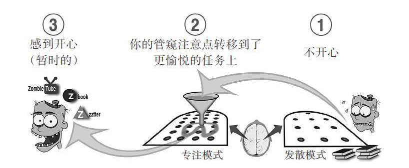
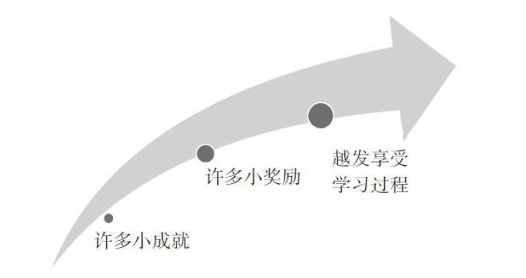

# 学习之道

## 开启大门

### 每个人都能提升学习能力

- 根本问题是把力气用错了地方——就像试图搬起踩在自己脚下的木头。我开始掌握一些小技巧，它们不仅让我学会如何学习，也让我懂得适可而止。我认识到，如果能把某些概念和技巧转化为自己的一部分，它们就会成为我的强大武器。同时，我告诉自己，不要试图一口吃个胖子，要给自己充裕的练习时间——就算我的同学会不时地先于我毕业，毕竟我一个学期学不了他们那么多课程。
- 大脑生来就配备了非凡的心算能力
- 目的：让你的思维过程暴露于光天化日之下，让你明白大脑如何学习，又是如何帮你自欺欺人——自以为在学，实际上却是在小和尚念经。

## 放松点

- 我们的大脑有两种截然不同的思维模式——专注模式和发散模式。你会在两种模式之间转换，择一而用。
- 如果我们开始就用专注模式处理新的概念和陌生的问题，很容易止步不前。
- 想要发掘新点子，解决问题，不仅需要最初的专注，接着也需要给注意力放个假，让它从眼前的问题上溜开一会儿。
- 定式效应就是说因死盯着有瑕疵的方法不放，而在解决问题时陷入僵局。切换到发散模式可以帮助我们从中解脱出来。记住这一点，有时候你的思考得灵活点。想要解决问题，理解概念，你可能需要在不同的概念之间转换。最初的想法反而可能是误导。

### 有时候太勤奋也是一种病

#### 为思维加力

1. 在你初读一本书的某个章节或某个部分，而且其中内容涉及数学或科学概念时，先宏观浏览一遍会比较好。不只是看表、公式或图片，还有小节标题、总结，甚至如果章节末尾有思考问题，最好也看看。这似乎有点反直觉——你还没有真正读过这一章呢。但它的确会为你的思维提供动力。

##### 专注思维和发散思维

- 注意力高度集中的状态和更加放松的休息状态。这两种思考状态基于不同的神经网络模型，我们将其分别称为专注模式（focused mode）和发散模式（diffuse mode），它们对学习都非常重要。在我们的日常活动中，大脑会频繁地在两种模式之间不停切换。尽管在意识清醒的状态下，你也无法同时处于两种思维模式之中，不过，对有些你并不太关注的事情，发散模式确实可以悄悄地在后台处理。
  - 专注模式下的思维活动对数学和科学的学习必不可少。它是利用理性、连贯、分解的途径直接解决问题的一种模式。专注模式与大脑前额叶皮层（位置就在脑门正后方）集中注意力的能力相关
  - 发散模式对学数学和科学也同样必不可少。如果我们在一个问题上挣扎了许久而不得思路，它会冷不防地提供一个新点悟。同时，它也与宏观视角相关联。当你放松注意力，任由思维漫步时，发散模式思维就出现了。松弛状态让大脑的不同区域得到相互联络的机会，并反馈给我们宝贵的灵感。

##### 为什么数学和科学知识会更难对付

- 利用专注思维模式来处理数学和科学问题，通常会比处理语言和人际交往相关问题费劲得多。这也许是因为上千年来，人类操控数学概念的能力并没有进化，并且数学概念往往比传统语言问题更加抽象隐晦
- 定式效应：脑海中已有的，或是最初的想法，会阻碍你产生更好的想法或答案

##### 接纳困惑

- 困惑是学习过程中的有益部分。当学生在一个问题上百思不得其解时，就会觉得这不是他们擅长的学科，那些聪明的学生尤甚。他们在高中的学习顺风顺水，这让他们完全没法想象困惑是正常和必需的。但学习本来就是从困惑中摸索问题答案的过程，能够描述出来问题就已经成功了一半。只要发现了困扰你的东西是什么，那么你就离解答出来不远了。

##### 拖延的前奏

- 如果拖延，你就没有时间供专注模式稳扎稳打，只够走马观花地过上一遍。这样也会增加你的压力，因为你清楚自己必须完成一个很讨厌的任务。其中的神经模型会变得模糊黯淡、残缺不全，你的思维基础七零八落、摇摇欲坠。

#### 心无旁骛，简而行之

- 用一个计时器设定25分钟，在这25分钟里，全神贯注于一项任务，什么任务都行。不用担心能不能完成它，专心去做就好。25分钟的时限一到，你就停下来奖励一下自己，看看网页，翻一下手机，做任何你想做的事情。注意，奖励和工作本身一样重要。
- 假如现在就要入睡了，你正在回顾这一天中完成的最重要的任务。你想到的任务是哪个呢？把它写下来，现在就去做。

## 　学习即创造

- 遇到数学或科学上的概念和难题，首先要让专注模式打头阵。它完成第一轮战斗后，就轮到发散模式了。
- 放松一下，做点别的！一旦工作期间出现了挫败感，转移注意力就该随之出现，让隐藏在后台的发散模式运转起来。
- 学好数学和科学最好的办法就是“每天进步一点点”。
- 让两种模式有足够的时间各行其是，你才能理解自己所学的知识。牢固的神经结构就是这样建立起来的。如果你有拖延问题，试着计时25分钟来一心一意地投入工作，别让发短信、上网或其他分心的事物上门打扰。
- 主要的记忆系统有两类：
  - 工作记忆——只能一次扔四个球的杂耍演员；
  - 长期记忆——能储存大量知识的仓库，不过要靠定期回访保持对其中内容的新鲜感。
- 间隔性重复有助于把信息从工作记忆转移到长期记忆。
- 同时，睡眠也是学习过程中的一个重要部分。它会帮助你：
  - 构造一般性思维活动所需的神经联结——这也是为什么考前一晚的睡眠很重要；
  - 攻克难题，真正理解所学的知识；
  - 巩固复习重点知识，修剪旁枝末节。

### 专注模式和发散模式之间的转换

- 睡觉（bed）、洗澡（bath）、坐公交（bus）
- 只要你放下手中的工作，停下来喘口气，发散模式就会乘虚而入，上蹿下跳，高屋建瓴地搜寻解决方案。当放松过后的你重新回到工作中时，就会收到一份迎面跳出的解决方案作为惊喜。就算问题的答案仍然犹抱琵琶，你对问题本身的理解也会更加深入。你在之前的专注模式中埋头苦干，然后某个瞬间，来自发散模式的意外解法就如同醍醐灌顶，灵光突现。

#### 创造力就是对自身能力的驾驭和拓展

- 发散模式能让你的学习更有深度和创造力，而解决数学和科学问题的背后往往正是创造力在运筹帷幄。许多人认为一个问题只有一个解法，但如果带着一点创意去看，其实各种解法俯拾皆是。

### 两种模式间的切换帮你掌握新知识

- 可别指望只靠发散模式，就能轻轻松松地如愿以偿。
- ==激活发散模式的一般方法==
  - 去健身房
  - 参加运动，如踢足球或打篮球
  - 慢跑、散步或游泳
  - 跳舞
  - 开车兜风（或者搭个顺风车）
  - 绘画或者涂鸦
  - 淋个浴或是泡个澡
  - 听音乐，尤其是纯音乐
  - 用乐器演奏熟悉的歌曲
  - 冥想或者祷告
  - 睡觉（召唤发散模式的终极法宝！）

- 以下激活发散模式的方法，最适合小小地用一下，给自己个奖励。（因为比起上述活动，下面提到的这些也许反而会把你拖进更专注的状态里。）
  - 打电子游戏
  - 上网
  - 和朋友聊天
  - 主动帮助别人处理个小任务
  - 阅读休闲读物
  - 给朋友发短信
  - 去看电影或戏剧
  - 看电视节目（让你昏昏欲睡的节目可不算）

### 别怕落在同学后面

- 放慢脚步，也许你会得到惊喜：细嚼慢咽反而让你比那些脑子快的同学学习得更深入。帮我武装起大脑的最重要窍门之一，就是不要想一口吃成个胖子。

### 避开思维定式（愚公移山未必是个好办法）

- 记住，做作业和考试时，接受大脑中的第一个想法，会有碍于你另觅佳径。
- 要解出难题或是学会新概念，至少要有一个你在无意识思考的时间段。而正是在这些你并非直接关注的时间间隔里，发散模式得以踱开到一边，用新角度看问题。在此之后，当注意力重新转回到问题上时，你就可以将发散模式传达的新想法和新模型整合起来了。

### 观察自己

- 下次当你对某些人或事感到挫败时，试着退后一步观察自己的行为。愤怒和失意偶尔会扮演走向成功的激将法，但它们也会关闭大脑中用于学习的关键区域。因此，不断增加的挫败感往往是个有益的暂停信号。它在暗示你，是时候转换到发散模式去了。

#### 当你真的被难住的时候该怎么办

- 自制力很强的人反而会更难关闭专注模式，好让发散模式进入工作状态。毕竟，他们的成功之道就在于，在别人都放弃的情况下仍坚持不懈。如果你就是这种人，那么这儿还有另外一个技巧：重视倾听。把同伴、朋友或亲人的意见放在心上，他们会在你沮丧到临界值时有所察觉。有时，正是旁观者清。

#### 失败也是一位良师

### 理解学习中的矛盾

- 学习的过程有时是自相矛盾的：正是我们要学的东西，让我们难以发挥学习能力；我们需要全神贯注才能解决问题，可专注也会阻碍我们找到所需的新方法；成功很重要，但辩证来看，失败也同样重要；持之以恒是关键，但南辕北辙只会带来不必要的挫折。在这本书里，你将遇到许多种学习中的悖论。你能猜到可能会有哪些吗？

### 工作记忆和长期记忆

- 在大脑中对正在处理的信息进行瞬时以及有意识加工的这部分记忆，叫作工作记忆。
- 长期记忆可以看作仓库。东西一旦存进去，它们通常就一直待在那儿了。这间仓库幽深广阔，可以容纳数十亿件物品，而且包裹很容易因为埋得太深，而难寻踪迹。

## 组块构建与避免能力错觉

- 练习有助于构建强壮的神经模型——那就是，形成理解的概念组块。
- 练习能带给你流畅而敏捷的思维，这正是考试中需要具备的。
- 构建组块的必需品：
  - 专注力（focused attention）；
  - 对基本概念的理解（understanding）；
  - 练习（practice）帮助你获取宏观背景信息。
- 简单回想，试着关上书回忆要点，是促进组块形成的最好办法之一。
  - 某种意义上说，回想有助于形成神经挂钩，这样就能把思维悬挂在上

### 聚精会神的时候，大脑在做什么

- 思维定式将你局限于一种方法里，无法跳出来去寻求更加简单有效的解决途径。可以说，尽管专注通常有助于解决问题，但它有时也会妨碍我们发现新办法。
- 专注模式学习的一个重要部分，就是让注意力把大脑各个部分连接在一起。有趣的是，注意力触手会在紧张状态下失去部分连接能力。这就是当你愤怒、紧张或害怕时，总觉得脑袋有点不够用的原因。
- 专注的练习和重复是创造记忆痕迹的过程。无论是一记完美的高尔夫击球、主厨熟练翻动的煎蛋，还是百投百中的罚球，核心皆在于此。舞蹈也一样，从笨拙的单脚旋转到优雅的专业舞者，要经历漫长的努力。任何专业技能的培养都是积跬步以成千里的过程。你对自由旋转、足跟转、踢腿动作的琐碎记忆，最终会结合成更完整、更具创造力的肢体表达。

### 组块（chunks）

- 组块是根据意义将信息碎片组成的集合。你可以把字母p，o和p连在一起，组成一个有意义的、便于记忆的组块——单词pop。这就像把电脑中繁杂的文件放在一起，保存成.zip格式的压缩包。在pop这样一个简单的组块下，是神经元之间的琴瑟和鸣，它们通过相互配合形成了和谐一致的音调。不管是名词缩写、想法，还是概念，都依赖于复杂的神经活动，将我们简化而抽象的思维组块捆绑在了一起。可以说，思维组块都是绝大多数科学、文学和艺术知识的构成基础。
- 要熟练地掌握数学和科学知识，就要创造一些概念组块——这是通过意义将分散的信息碎片组合起来的过程。

#### 构成组块的基本步骤

1. 塑造关乎不同概念和步骤的组块有多种方法，它们通常相当简单。
   - 当你接触新的数学或科学知识，例题中几乎总会提供现成的解题方法。因为首次尝试理解问题解法会让你的认知负担很重——以现成的完整解法开始要好一点。这就像，如果你要在陌生的道路上夜间驾驶，会打开GPS定位一样。已有解法的大部分细节都摆在面前，你的任务仅仅是弄明白它们存在的原因。这能帮你看清问题的关键特征和基本原理。
     - 借鉴例题可不是让你一刀切地不动脑筋、“听话照做”，而更像是借助旅行向导开始陌生之地的旅程。在向导的陪伴下观察身边发生的一切，很快你就会发现自己可以独自探索。你甚至开始另辟蹊径，找到向导不曾告诉过你的路。
   - 当你第一次遇到科学或数学中的全新概念时，往往不知其所云，就像看见左图的拼图碎片一样。如果不理解含义，也不考虑其所在的背景，仅记忆一个事实（如中图），是不能帮你理清头绪的，或者说，你仍不会明白一个概念是如何与其他已学概念拼合在一起的——要注意，这种情况下，拼图碎片没有凹凸状的互锁边缘，没法与别的碎片拼接起来。构建组块（chunking）（如右图）能帮你利用意义，组合起信息碎片，这是一种心智上的飞跃。新的逻辑整体更便于人们记住组块所包含的信息，也便于将其融入更大的学习背景。
2. 进行组块的第一步，就是把注意力集中在需要组块的信息上。
3. 组块活动的第二步是理解（understanding）。要把基本概念打包成组块，首先要理解这个基本概念。
4. 组块的第三步，是获取背景信息。你所看到的将不仅是如何进行组块，还有何时何地使用它们。

### 能力错觉与回想的重要性

- 试着回想学习材料，即提取练习（retrieval practice），效果比单纯阅读材料好得多。
- 在学习中进行回想——让大脑提取关键概念，而非通过重复阅读被动地获取知识，将让你更加集中高效地利用学习时间。
- 如果你只是看着答案做题，然后自欺欺人地说“太好了我懂啦”，那么答案根本就不属于你，因为你几乎没有把这些概念编织到基础神经回路上。仅仅看一眼问题答案，就以为自己会了，这就是学习中一种最普遍的能力错觉。

### 理解能力错觉

- 从笔记里挑一个数学或科学概念，或者从书中某一页挑都行。读一遍，然后拿开，看看自己能回忆多少内容，同时，试着去理解你正在回忆的内容，然后再把目光转回来，重读概念，再试着回忆一次。
- 如果你想要熟练掌握材料，以此考出好成绩或是在此基础上创造性思考，你就必须让它们牢牢地钉在记忆里
- “慢直觉”（slow hunch）。他是指，专注与发散的思维过程经过长年累月地细火慢炖，产生创造性的突破。达尔文的生物进化论，以及万维网都诞生于此。“慢直觉”的关键就是要用多角度思维感知一个概念。那样，概念的方方面面会临时而随机地组合在一起，直到最终，你的创意如出水芙蓉般诞生。

- 头脑中馆藏的组块思维越丰富，解决问题对于你来说就越容易，而且组块经验越丰富，你越会发现自己可以创造出更大规模的组块——丝带越来越长。
- 机遇的法则登场了：幸运女神只眷顾努力的人。
- 解题的途径有两种：第一种，是按顺序逐步推理；第二种，是更多跟随整体直觉。序列式思维是与跳跃式思维相对的思维方式，每一个小步骤都明确指向问题的答案，这也正是专注模式的用武之地。而直觉通常由看似不同的聚焦模式思维联结而成，需要的是创造性的发散模式发挥作用。
  - 大部分难题都是由直觉解决的，因为它们与你熟知的事物截然不同。
  - 要记住，发散思维会以半随机的方式创造联结，所以你需要通过专注模式对它给出的答案仔细验证。直觉并不总是对的！

### 理解困难怎么办

- 如果你不能理解课程中提到的方法，不妨驻足回顾一下。上网找找最先解决这个问题的人，或者那些最早使用这个方法的人。试着去理解那位颇具创造力的发明者，他是如何得到的概念，又是如何使用概念的。你往往可以找到一个简单解释，通过它你基本能认识到这种解法的必要性，以及使用这种方法的原因。

#### 常练不忘

- 一天之内再次强化学习模型，在构造神经模型的起始阶段至关重要。如果不强化，学习模型很快会从脑海中消失。

#### 构建组块的重要性

- 但在数学和科学的学习中，必须进行适量的练习和重复，否则就无法构建组块来支撑专业技能
- 相同时间内，仅靠对材料的练习和回想，学生的习得内容和学习深度都远远超过了其他方法
  - 提取知识和回想知识让我们不仅仅是重复的机器——提取过程本身增加了学习深度，并帮助我们逐渐形成组块
- 常把知识挂嘴边

### 到书桌外的世界回忆材料：散步的意义

- 离开平时的学习地点，到别处回想材料，可以让人从不同的角度看待问题，从而增进理解

### 整理，组块：战胜自己

-  如果组越来越多，而你又疏于练习，拼凑宏观视图会难上加难，因为拼图的碎块已经暗淡不清了。

### 穿插学习法，解决混杂交错的各种问题，而非在同一个问题上过度学习

- 穿插学习，是指把解题策略不同的题目混在一起练习。
- 实际上，要掌握一门新学科，是要学会挑选使用恰当的解题技巧的（不能只会用锤子）。唯一的解决途径就是去练习各种题目，运用不同技巧解决这些问题。学习期间一旦巩固了一种技巧的基本思路（这时会有点像骑在有辅助轮的自行车上），你就要开始穿插练习不同类型的题目
- 你需要让大脑逐步接受这个道理：仅知道怎样使用特定的解题技巧还不够，还得知道何时何地去使用才行。
- 许多人相信，过度学习就是通过不断地学和练来掌握知识。但是在科研文献中，这种表达是指学生掌握了某些理念，但仍对其不断地进行钻研和练习。
- 与其在同类技巧、概念上投入太长时间去学和练，不如把精力分配到更短的学习时间段上，以避免过度学习。这不是说长时间学习就一定是坏主意。只要学生不在同类技巧或概念上投入过多精力，那么学习时间长一点并没什么坏处。一旦理解了概念“X”，学习重心就应该转移到别的概念上，过几天再来回顾概念“X”

### 避免照猫画虎：练习改变思维

#### 在有限的学习时间里，可采用的学习技巧

- 读一读（但还不要去做）布置的家庭作业和模拟测试/小试题。
- 复习讲义笔记
- 重做课堂笔记中的例题。
- 完成布置的家庭作业和模拟测试/小试题。这样就可以为大脑构建“记忆肌肉”（muscle memory）组块来解决特定问题。

## 拖延

- 我们所拖延的都是感到不舒服的事情。但从长远来看，贪图一时之快未必对我们有益。
- 拖延就像在服用微量的毒药。一时看不出影响，但日积月累，危害极大。
- 在让你感觉痛苦的事情上多努力一点，最终你得到的好处会很
  多。
- 如同拖延，习惯有四个组成部分：
  - 信号；
  - 反应程序；
  - 奖励机制；
  - 信念。
- 要改变习惯，可以改变对信号的反应，或者干脆回避信号。奖励和信念有助于促成习惯上的长久转变。
- 关注过程（如花费时间的方式），而不是结果（想要达成的目标）。
- 用25分钟的番茄时间在短时段内保持高效率。每次成功地专注工作了一段时间，就给自己一个奖励。
- 确保规划一些自由时间，滋养你的发散模式。
- “心理对照”是一种强大的自我激励法——想想最糟糕的现状或者不堪回首的过去，然后将它们和乐观的未来做对比。
- 驻足与回顾
- 克服拖延症的方法
  - 记行程日志。这样当你实现自己的目标之后，就可以回头追踪
  - 并了解哪些是有效的方法，哪些是无效的方法。
  - 每天都对自己承诺要完成一定的惯常事务和任务。
  - 在晚上睡觉前写下你计划的任务，这样你的大脑就有时间详细考虑你的目标，从而帮助你确保能够成功。
  - 把你的工作细化成一系列小挑战。总是确保你（和你的小恶魔）得到足够的回馈。花几分钟时间尽情地享受幸福和胜利的快感。
  - 要慎重选择时间，直到你完成了这个任务才能奖励自己。
  - 小心拖延的信号。
  - 让自己身处少有拖延信号干扰的新环境中，比如安静的图书馆。
  - 障碍总会出现，但不要把你自己的问题全都归咎于外部因素。如果每件事都是别人的错，那就是时候好好审视一下自己了。
  - 相信自己的新时间系统。注意力集中的时候就要努力工作，该休息的时候要足够相信自己去休息，不要有负罪感。
  - 如果仍然无法摆脱拖延，要有后备计划。毕竟没有人是完美的。
  - 做第一个吃螃蟹的人。
  - 享受做小白鼠的时光！

### 化“坏”习惯为好帮手

- 首先要记住，陷入拖延很简单，但获得顽强的意志力可就难得多了。因为后者需要动用大量的神经资源。可以说用意志力来对抗拖延，就像在空中喷洒廉价劣质的空气清新剂一样完全徒劳无功。除非万不得已，否则不要把意志力浪费在抵抗拖延上。
- 对于大多数人来说，学数学或科学依赖于两个过程：一是短暂的学习期，这是“神经砖块”垒砌的过程；二是学习期之间的间隔，就是“思维水泥”凝固的过程。
- 现实就是，我们拖延的，往往是让我们感到不安的事情。
  - 值得注意的是，令人痛苦的就是预感本身。当“数学恐惧症”患者真正开始学数学的时候，痛苦就消失了。
  - 对一项任务的恐惧会比这项任务本身消耗更多的时间和能量。
- 拖延是个极具影响力的“关键”恶习，它会影响你人生的诸多方面。而一旦做出改变，数不尽的积极变化就会铺展在你的眼前。
- 人们往往讨厌做自己不擅长的事情。但如果你开始对某件事游刃有余，自然就会乐在其中了。
- 你会因为一心多用，让思维无法形成充分、丰富的联结，因为大脑中促成联结的部分还没来得及巩固联结，就被拉去做别的事情了。

### 大脑是如何拖延的

- 
  - 每次想到不怎么喜欢的事都会激活大脑中的痛觉中枢，所以你就会逃到那些令你更开心的事情中去，获得暂时性的感觉良好。
- 拖延会成瘾。它所提供的片刻兴奋与解脱是乏味现实的避风港。因此，你轻而易举地欺骗自己，上网查资料比看课本、做作业更能高效地利用一切时间；你也会自欺欺人地编故事：比如有机化学需要空间推理，而这正是你的弱项，所以你学不好是天经地义的；还有那些冠冕堂皇的荒唐借口：如果我考试前很久就开始学，我会忘。（你可别忘了，别的科目还有考试，到考试那天要一次学完所有欠下的科目，可就难于上青天了。）直到学期接近尾声，不得不开始为期末考试拼命恶补的时候，你才会面对现实。那就是，你之所以把有机化学弄成这个样子，无非是因为自己拖着不学而已。
- 拖延症不仅可以作为技不如人的借口，甚至会成为虚荣心的温床。“我做完了实验报告，参加了市场调查之后，昨天才开始备考的。当然啦，我本来可以做得更好。但有这么多事要忙，这样已经很不错啦。”更有甚者，哪怕是那些努力学习的人，也会误以为拖延能让他们显得精明能干：“我是昨天一晚上补完的期中考试内容哦！”
- 积习难改，人们很容易就会深深陷入拖延的陷阱。在它的暗示下，你任由自己沉沦于拖延的舒适反应。久而久之，已经习惯性拖延的你会身不由己地寻求那短暂而微小的愉悦感。而这种习惯性反应让你渐渐失去从前的自信，最后干脆不再指望能提高工作效率。这就是为何拖延症患者总宣称自己压力大、身体差、表现不好。如果放任下去，坏习惯就会根深蒂固，到那时再想摆脱它就悔之晚矣了。

#### 改变的可能

- 水滴石穿：你应该坚持每次学习一点点

### 深入理解拖延的习惯

- 习惯可以帮我们节省力气，它能为我们的大脑腾出空间进行别的活动。
- 习惯的组成
  1. 信号。这就是使你进入“出窍状态”的触发点。信号可以很简单，比如仅仅看到计划清单上面的第一个任务（提醒你“要开始做下周的作业啦”），或者是看到朋友发来的一条短信（提醒你“又可以偷懒了”）。信号本身没有好坏之分。你对信号的反应，也就是你的反应程序才是重点。
  2. 反应程序。这就是你的出窍状态——你的大脑在接到信号暗示时做出的常规性、习惯性的反应。小恶魔的反应可以是无害的或有益的，但在最坏的情况下，它可能会有很强的破坏性，它们会违抗常识。
  3. 奖励机制。习惯之所以得以发展和继续，是因为它能激励我们，让我们感到愉悦。拖延是一种很容易养成的习惯，因为它会如此迅速地奖励你，把你的注意力转移到更愉快的事情上去。但是好习惯也可以得到奖励。逃开拖延的魔爪，找到各种方式奖励自己学习数学和科学的好习惯会至关重要。
  4. 信念。习惯的强大效果，来自你对它的信念。比如你可能会觉得，自己不可能改掉把学习拖到最后一刻才做的习惯。想要改变习惯，你需要做的是改变自己内心深处的信念。

### 驾驭习惯（“小恶魔”），为你所用

- 改变旧习惯的窍门是寻找压力点——你对信号的反应。改变你对信号的反应，是唯一需要动用意志力的环节。
- 步骤
  1. 信号。识别出让你进入出窍和拖延状态的导火索。拖延问题就出在它是一种不假思索的习惯，你往往在无意识间就开始了拖延。
     - 
  2. 反应程序。这么说吧，你经常会把注意力从学习转移到不太痛苦的事情上。每次得到信号，你的大脑都想自动进入这个反应程序，所以当这个压力点出现的时候，你就必须主动注意去改变旧习惯了。改变的关键在于制订计划。培养新习惯可能会很有用。有些学生养成了一种习惯，比如上课前把智能手机放在车上，这样就消除了一个强大干扰。
  3. 奖励机制。有时这需要一番调查研究。你为什么要拖延？拖延能不能用情感上的补偿来替代？能不能以那种小有成绩，哪怕是微不足道的自豪感来替代？或用一种满足感来替代？你能否在内心打个小赌或是跟自己比个赛，然后争取胜利？能否让自己享用一杯拿铁，或去浏览自己最爱的网站？能否奖励自己毫无愧疚地看一晚上电视或上一晚上网？能不能在有更大收获时给自己更大的奖励，比如电影票、毛衣或是买点浮夸的小礼物？
  4. 信念。改变拖延的习惯，最重要的是要有“自己一定能行”的信念。你可能会发现，在工作进展中一旦遭遇压力，你就会很渴望退回到原先令你更舒适的习惯里去。但你对新系统效果的坚信不疑，能够助你渡过难关。巩固信念的方式之一就是发展一个新的朋友圈。要想培养“我能行”的信念，就要多和抱有这种信念的同学相处。
     - “心理对照”:将你现在的状态和你期望达到的状态做对比。
- 通过关注过程而非结果进入思绪
  - 将注意力放在过程而非结果上，可以让你避免对自己做出评价，（我快完成任务了吗？）并让你更放松地沉浸到
    工作进程中。
- 分解工作量才能细嚼慢咽：专注而简短地工作
  - 一心多用就像不断地揠苗助长。不断地转移注意力，也就意味着你脑中的新观点、新概念没有机会生根发芽。
- 隔绝干扰

## 搭建组块对抗发懵

- 关键点
  - 主动记忆和被动记忆
  - 搭建组块是指将某个概念整合到某个联结流畅的神经思维模型当中。
  - 搭建组块有助于增加工作记忆的可用内存。
  - 搭建一个含有概念和解题方案的组块资料库，可以形成解题直觉。
  - 当你在搭建组块资料库的时候，要刻意关注那些最棘手的概念和解题环节。
  - 偶尔也会遇到这种情况，尽管学得很努力，可命运却让你打出一手烂牌。但你要记得机遇的法则：如果准备充分、勤加练习并搭建思维方案库，你会发现幸运女神会更加眷顾你。换句话说，如果你不努力，那么必定会失败，但那些一直在不断努力争取的人定会体验更多的成功。

- 一旦你着手解决某个数学、科学问题，就会发现你做到的每个步骤，都会指示下一步的进行。内化吸收解题技巧能够加强神经活动，让你更易听清变强的直觉悄声说给你的暗语。当你看一眼就能看出某题解法，即对题目有真正的了解，说明你已经成功构建出一个命令组块，它的命令就如一首歌在你脑中横扫而过。组块资料库会以一种绝无仅有的方式，让你理解基本概念。
- 搭建强大组块的步骤
  - 全程在纸上解决一个重难点题目。（要保证的是，你有现成答案，不管是你以前做过这题，还是书中已有解答。但是不到万不得已，千万不要看答案。）在下手解题之前，或还没彻底得到答案之前，千万不能偷看答案，不能跳过任何步骤，或自欺欺人地说“太好了，搞定了”。要确保每个步骤都有理有据。
  - 重做一次，要格外注意关键步骤。如果你觉得重做同一道题有点奇怪，可以想想看，你不可能只弹一遍吉他就学会一首歌，也不可能只举一次哑铃就算完成了锻炼。
  - 休息一下。如果需要，你可以去研究下这门学科的其他内容，之后就去干点别的。比如做兼职、学习不同学科，或者去打打篮球。你要给发散模式留出足够的时间，让它去消化这个问题。
  - 睡眠。在你睡觉前，把这个问题再过一遍。如果卡住了，那么就反过来去聆听问题的声音。你的潜意识会告诉你接下来该怎么做。
  - 再来一次。第二天尽快地把这个问题再做一遍。这个时候你会发现，自己能做到更迅速地解题。你对这问题应该会有更深层次的理解。你甚至不明白自己当初为何会卡在这个问题上。到了这会儿，你就能神速计算每一步了。多关注问题中最困扰你的那个部分。这种持续关注难点的做法，叫作“刻意练习”。尽管这样做有时让人疲惫，但它是高效学习的最重要方面之一。（它的替代或者补充做法，是去解答一个相似的问题，看看能不能轻而易举地拿下它。）
  - 给自己添新题。再挑一道重难点题目，用之前做第一道题的相同方法来解这道题。本题答案会变成你组块资料库中的第二个组块。在解这道新题时，重复1~5步。如果已对这个题目得心应手，就去做下一道。你会惊喜地发现，尽管你的组块库只有几个固化组块，但已经可以大大提高你对学习材料的掌握程度，以及高效解决新题的能力。
  - “主动”重复。走去图书馆的路上，或是锻炼的时候，可以在头脑中回想解决某个题目的关键步骤。你也可以利用等公交、坐车，或者是等教授走进教师前摆弄拇指的闲余时间。这种主动排演能提高你回想关键概念的能力，有助于在家庭作业或考试中回想要点。
- 机遇的法则
  - 做刻意练习的时候你也应如此，要专注于学习解题步骤中最难的部分，并提高对这部分的解题速度。

- 遭遇瓶颈：突然间你的知识结构就要崩塌
  - 学习进展的过程并不合乎逻辑，这个过程就像每天把新包裹增添到你知识库的货架上。有时候，在构建理解的过程中你会遭遇瓶颈。之前合情合理的事物突然变得扑朔迷离
  - 掌握新知识是需要时间的。在理解过程中，你会经历一些时期，看似像理解力在发生倒退，而你会因此感到恼火。这是一个很自然的现象，它说明你的大脑正在推敲这些材料。摆脱暂时的困扰期之后，你就会发现自己的知识基础往前迈了一大步。
- 让一切井然有序：梳理你的学习材料
- 测试是一种强效的学习经历：时常给自己来场小测验
  - 要将诸多解决方案建立成组块，其中的重要原因之一就是：它们可以让你避免在考场上发懵。发懵，即恐慌到大脑一片空白——一旦工作记忆被填满，而大脑已经没有足够的空间来解决问题的其他关键部分了，人就会发懵。搭建组块会压缩已有知识，为工作记忆腾出内存空间，这样你就不会轻易就让神经超负荷运转。
  - 测试并不仅仅是衡量所学知识多少的手段。测试本身就是一种强效的学习经历。它可以改造你已有的知识体系或是为其添砖加瓦，同时可以显著地提高你记住学习材料的能力。
  - “测试效应”（testing effect）：通过测试而发生的知识构成上的改善，被称为“测试效应”（testing effect）。它的发生多是因为测试进一步强化并稳固了大脑中的相关神经模型。
  - 就算测试结果不理想或是没得到任何反馈，基于测试效应产生的改进依然会发生。尽管如此，在学习期间做自我测试时，你还是想要尽可能地去获得反馈，并用参考书检查答案，或是翻看书后，又或去别处验证自己的答案。不仅如此，后面我们还会谈到，和同学以及教师间的互动也会对学习过程有所助益。
  - 搭建固化组块之所以有益，是因为在创造这些组块期间，你会在其中穿插大量的小测验。

## 工具、建议和小技巧

- 思维技巧会是你强大的武器。以下罗列了一些最有效的技巧：
- 让自己待在无干扰环境下克服拖延，比如图书馆；
- 练习无视分心的想法，让它们成为眼前浮云；
- 如果自己态度不端正，就要改造自己的关注点，让注意力从负面转移到正面看法上；
- 意识到刚坐下开始投入工作前，有点负面小情绪是特别正常的现象。
- 让“开心一刻”成为你生活计划的一部分，是预防拖延的最关键要务之一。同时也是一个能让你避免拖延的最重要原因。
- 预防拖延的核心就是拥有合情合理的日计划和每周一次的周计划，它们可以保证你在宏观上保持前进步伐。
- 在前一天晚上写好第二天的计划。
- 先从最困难的事做起。

### 最好用的学习应用和方法

- 能认识到运用正面思维技巧会增加个人优势，这是一种幸运。因为负面思维技巧，可能会让你做无用功，或是把简单问题复杂化。而使用正面思维技巧能弥补负面方式带来的缺憾，就像在交作业前告诉自己，我还能让这份作业更完美些。
- 刚坐下投入工作前，有点负面小情绪是正常现象。如何应对这些情绪是才是关键。

### 自我实验：让自己变得更好的关键

### 孤军奋战与组队合作：别再苦思冥想，拖延行为需要差别对待

### 行动日志——你的个人实验记录册

## 增强你的记忆力

-  作为教育者，我们热衷于鼓励学生构建知识组块，而不是仅去记忆孤立的概念。这有时会让他们产生错觉，以为背和记没那么重要。（“为何我要去死记硬背那些能在书上找到的方程式？”）但因为有了重点概念，充满创造力的组块过程才能开花结果，所以记住重点非常重要。从中可得到的重要经验，是要不断揣摩推敲记住的知识，才能构建组块。

- 与生俱来的特大视觉空间记忆能力
  - 助记的视觉图像
  - 记忆宫殿法：记忆宫殿法需要你回想一个你熟悉的空间，比如自己家的布局，然后把它当成视觉形象的记事本，用来存储你想要记住的概念形象。记忆宫殿法对记忆互无关联的物品很管用
- 学着以更加训练有素且别具创意的方式来使用记忆，会有助于集中注意力，就算为了增强记忆而创造出天马行空的关联也没关系。
- 理解后再去记忆，你会对学习材料记忆犹新。随着思维宝库的不断强化，总有一天你会成为学习真正的主人。
- 比喻可以帮你更快地学会难懂的概念。
- 重复是在记忆消退前对其进行巩固的必要动作。
- 意群和口诀可以帮你简化学习内容，构成组块，这样就能更轻松地存储记忆了。
- 编故事，哪怕故事听起来会有点笨拙，但它也会让学习内容更好记。
- 写和说在一定上都有加强记忆的作用。自言自语
- 体育锻炼对新的神经元生长、新联结形成有强大的促进作用。

## 学会自我欣赏

- 一定时候，在能熟练运用组块资料之后，你应尽量不再去纠结于每一个小细节，而是自然而然地去解决问题。
- 有些学生能快速掌握材料，和他们一起学习确实会给人不小的打击。但是“平均水平”的学生常常在主动性上、做好事情的能力上以及创造力上都有优势。
- 把握创造力的一部分关键是要能从专注模式转换到更放松的、白日梦一般的发散模式。
- 太过专注会阻碍你发现真正要找的答案——就像用锤子钉一颗螺钉，因为你已经认定了那是一颗钉子。当你卡在一个问题上，有时候最好的方法就是把它放下，转而解决其他问题，或者干脆小睡一会儿。

## 塑造你的大脑

- 大脑发育的速度因人而异。许多人的大脑在25岁后才发育成熟。
- 在科学界，许多令人敬仰的重量级人物，起初显然是前途渺茫的问题少年。
- 在科学、数学、技术领域取得成功的专业人士，逐渐习得的一个特质，就是学会如何组块——提炼关键思想。
- 比喻或实体类比也能构造组块，这些组块能使一个截然不同的领域的概念对另一个领域产生影响。
- 无论你当前或今后有怎样的职业道路，要有开放心态，保证自己的学习宝库中常备数学和科学知识。你能因此储存更多的组块，从而更精明地应对生活、工作中的各种困难和挑战。

## 借方程的诗歌打开心灵之眼

- 方程只是抽象和简化概念的方法。这说明，方程包含的深层含义，与诗歌中的深层内涵有相似之处。
- 你的“心灵之眼”之所以重要，是因为它帮你在脑中排演，并把学过的知识拟人化。
- 迁移是把所学知识从一个知识背景应用到别处的能力。
- 关键是要掌握一个数学概念的组块精髓，这会有利于概念迁移和将之应用到新途径中。
- 在学习过程中一心多用会让学习无法深入，这样会限制你迁移所学知识的能力。

## 学习的复兴

- 自主学习是一种最深入、最有效的学习方式：
  - 自主学习能够提高你独立思考的能力；
  - 有时它会帮你解答出老师的奇怪考题。
- 在学习中，毅力往往比智力更重要。
- 锻炼自己去接触那些你敬仰的人。你会结识学识渊博的新导师，往往他们的一席话可能会改变你的未来。但是请爱惜他们的时间。
- 如果你没能快速掌握学习材料的重点，不要灰心。常让人惊讶的是，“学得慢”的学生会抓住根本问题，而这些部分通常为进度较快的学生所遗漏。真正了解前因后果能让你从更深层次理解问题。
- 人人都是既有竞争意识又有合作意识。总是会有人批评或低估所有你付出的努力，你要学着对这些问题淡然处之。

## 避免自负

- 即使你自信一切没有任何问题，专注模式还是会让你不经意地犯下致命的错误。温故知新，不同的神经活动过程可以让你重新审视结果，抓出错误。
- 和愿意提出不同见解的伙伴一起讨论，可以：
  - 找出你想法中的错误；
  - 更容易学会随机应变，更好地应对有压力的处境；
  - 确保你真的理解了你想让别人解释的知识，巩固已有的知识并提高学习能力；
  - 建立起重要的职业关系，帮你做出更好的选择。
  - 学习中的批评，无论你是批评者还是被批评者，都应该客观对待。它们是在帮助你理解所处理的问题。
  - 小心不要自欺欺人。

## 参加考试