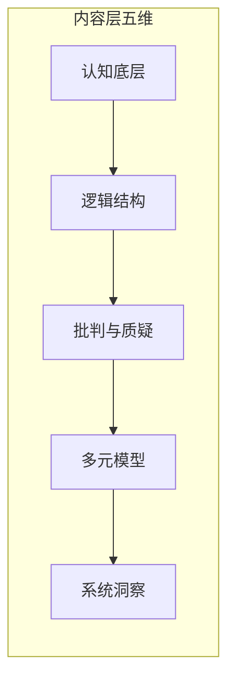

# 思维模型学习

本文对思维模型学习做**梳理与综合**：你前面给的内容（四维、五本书、对比表与行动建议）是**一个看法、一个例子**，已作为核心素材被纳入；在此基础上结合批判性思维、更多思维模型类资源及工作区内学习与刻意练习笔记，整理成一条清晰的问题—背景—内容层—过程层—路径—行动逻辑。经与市面框架对比，采用**双层模型**：内容层（五维）+ 过程层（元认知与迁移），并补充与认知科学、系统论的衔接及框架的边界与拓展方向。

---

## 一、问题与背景

### 要回答的问题是什么

如何系统学习「思维」、避免「买书如山倒，读书如抽丝」？学思维前需先厘清**思维是什么、如何衡量改进**。思维类书籍本质是在阅读大脑的「说明书」并升级其「底层算法」；若没有可操作的进阶视角，容易堆书不消化。

### 为什么会有这样的问题（背景）

市面上思维、认知、决策类书籍很多，质量参差不齐。读者常面临：不知道先读哪本、各本书解决什么问题、如何从「读过」变成「会用」。因此需要一种**可操作的进阶框架**——不是简单罗列书名，而是按**内容层五维**建思维进阶书架，并显性纳入**过程层**（如何学、如何用）。内容层五维为：认知底层、逻辑结构、批判与质疑、多元模型、系统洞察；过程层为元认知与迁移。下文先对思维做可操作界定并说明如何评估，再进入五维与书单。

---

### 思维是什么：定义与可操作界定

- **心理学/认知科学中的界定**：思维是人脑对客观世界的**高级认知活动**；借助语言、概念对事物进行**间接、概括**的反映，包含知觉、知识、问题解决、判断、语言、记忆等心智过程。既有**意识层面的推理**（如演算、论证），也有**较自动的过程**（如直觉、模式识别、情绪影响判断）——与卡尼曼的双系统（快/慢思考）一致。
- **与文档内容层五维的对应**：将「思维」操作化为五维，便于与书单对接：**认知底层**（思维由谁执行、易出什么错）→ **逻辑结构**（思维如何被组织与表达）→ **批判与质疑**（论证如何被评估与质疑）→ **多元模型**（思维用哪些工具）→ **系统洞察**（思维如何把握复杂与动态）。一句话概括：文档中的「学思维」= 在认知局限下，提升思维的**条理、质疑能力、工具与系统视角**，并减少偏误。

---

### 思维的量化与评估

- **量化/评估的几种方式**（并列呈现，不要求读者去做测验）：  
  - **标准化测验**：如 Cornell Critical Thinking Test（归纳、演绎、观察、可信度、假设等子维度）、CAT（Critical Thinking Assessment Test）等，用于推理能力与批判性思维技能；有信效度争议、多为教育场景。  
  - **思维品质维度**（中文教育/心理学常见）：深刻性、广阔性、敏捷性、灵活性、批判性、创造性等；可**自我对照或他人反馈**，不必依赖试卷。  
  - **文档内的可操作评估**：用**内容层自检（五维）**作为日常「量化」——遇到问题时，自问是偏误、缺结构、缺论证/质疑、缺模型还是缺系统视角，并对应到书与练习；与第五节「双层自检」呼应，形成「定义 → 维度 → 自检」闭环。
- **小结**：思维难以单一指标完全量化，但可通过「测验子维度 + 思维品质 + 内容层五维自检」多角度把握改进方向；书籍落实在「可练习、可调用的行为与选择」上。

---

## 二、内容层：五维视角

内容层回答「学什么」。五维在整体路径中的角色：**认知底层**（了解硬件局限、防错）→ **逻辑结构**（给思维装导轨、建序）→ **批判与质疑**（识别前提与谬误、评估论证）→ **多元模型**（扩充工具箱、避免单一视角）→ **系统洞察**（理解复杂世界的脉络、从线性到网状）。逻辑结构主攻表达与结构（金字塔），**批判与质疑**独立成维，对应《批判性思维工具》等，书单见第三节。各维之间既有递进关系，也可在实践中有交叉与并列使用。五维即对「思维」的**可操作分解**；各书在不同维度上界定并落实「好思维」，都落在**可练习、可自检的行为与选择**上，与上文定义、量化小节一一对应。

### 1. 认知底层：了解你的「硬件」局限

**位置与衔接**：在学习「怎么思考」之前，先知道大脑是怎么「坑」你的。只有意识到直觉（系统1）的不可靠，才会产生「刻意逻辑」（系统2）的动力；这一维为后面的逻辑结构提供动机。

#### 《思考，快与慢》—— 丹尼尔·卡尼曼

- **核心精髓**：系统1（直觉、快思考）与系统2（逻辑、慢思考）；人类偏好系统1，存在大量认知偏误（如锚定效应、可得性偏差）。
- **深度分析**：认知心理学的经典之作，相当于思维的「防错指南」。它说明人类天生懒惰、易受情境与启发式影响，仅「知道偏误」不足以避免错误，需与逻辑结构、批判性思维配合使用。
- **本书对思维的界定/可观测落脚点**：把「思维」操作化为**两种加工方式**（快/直觉 vs 慢/逻辑），好思维 = 在合适情境下启用系统 2、减少系统 1 的偏误；可观测：决策中的偏误率、是否做慢思考复盘。
- **学习价值**：建立「慢思考」意识，减少因直觉导致的低级错误；是后续逻辑训练与模型应用的前提。
- **本维可能缺什么**：单靠此书容易停留在「知道偏误」层面；未系统教「如何建序、如何论证」，需与金字塔原理、批判性思维衔接。情绪对判断的影响、群体与权力对认知的塑造，本书有触及但不作为主线。

---

### 2. 逻辑结构：给思维安装「导轨」

**位置与衔接**：有了「慢思考」的意识后，需要一套工具把混乱的思绪理清楚。认知底层负责「防错」，逻辑结构负责「建序」——二者配合：一个让你愿意用慢思考，一个教你怎么把慢思考变得有条理。

#### 《金字塔原理》—— 芭芭拉·明托

- **核心精髓**：结论先行、以上统下、归类分组、逻辑递进；MECE 原则（相互独立、完全穷尽）。
- **深度分析**：很多人觉得枯燥，但它是逻辑训练的基本功，强调思维的秩序。MECE、结论先行与「慢思考」互为配合：慢思考提供动机，金字塔提供结构。
- **本书对思维的界定/可观测落脚点**：把「思维」操作化为**有秩序的结构**（结论先行、MECE、归类分组）；好思维 = 表达与思考有条理、可被他人复述；可观测：汇报/文档的清晰度、逻辑链是否完整。「经得起质疑」由下一维「批判与质疑」负责。
- **学习价值**：提升表达与思考的条理；若内化，写作和演讲会更有说服力与清晰度。与批判性思维中的「论证结构、前提-结论」可衔接，用于识别与构建论证。
- **本维可能缺什么**：偏表达与呈现，对「如何质疑前提、如何识别谬误」着墨不多，由批判与质疑维及对应书单补足。

---

### 3. 批判与质疑

**位置与衔接**：逻辑结构负责「说得清」，本维负责「看得穿」——识别前提与谬误、评估证据、在证据不足时悬置判断、保持开放与寻证倾向。与卡尼曼的认知偏误形成三角：偏误让你「容易错」，逻辑结构让你「有条理」，批判与质疑让你「能质疑论证与假设」。

**核心能力**：分析论证结构（前提—结论）、评估证据与来源、识别常见谬误、克服自我中心与非理性假设；倾向层面包括寻求清晰陈述与理由、充分知情、考虑替代观点。对应书单与资源见第三节「批判性思维」；本节仅标明该维在框架中的定位及与逻辑结构的区别（前者重表达与结构，后者重论证评估与质疑）。

---

### 4. 多元模型：扩充你的「工具箱」

**位置与衔接**：若手里只有一把锤子，看什么都像钉子。多元模型提供跨学科的思维工具，避免单一学科的隧道视野；在逻辑结构与批判与质疑的基础上，进一步扩充可调用的「模型库」。

#### 《穷查理宝典》—— 查理·芒格

- **核心精髓**：普世智慧与跨学科思维模型；要处理复杂问题，须掌握数学、物理、生物、心理等学科的核心原理。
- **深度分析**：偏思维哲学与「地图」——教你从不同角度审视同一问题，避免认知的隧道视野。多元思维模型的本质是减少单一学科偏见。
- **本书对思维的界定/可观测落脚点**：把「思维」操作化为**可调用的模型集合**；好思维 = 多角度审视问题、避免单一学科偏见；可观测：能否在具体情境中说出/用到 1～2 个模型、是否出现「只用一个框架」的隧道视野。
- **学习价值**：建立跨学科的思维地图；不是工具手册，而是思维方式的升级。
- **本维可能缺什么**：多为演讲与随笔，模型未逐条拆解；与《思维模型》系列形成互补（后者偏教材与手册）。

#### 《思维模型》(The Great Mental Models) —— 沙恩·帕里什

- **核心精髓**：对芒格思想的系统化梳理；详细拆解「第一性原理」「逆向思维」「二阶效应」等模型。
- **深度分析**：若《穷查理宝典》是散文，本系列（如第 1–3 册）即教材，手把手教如何将模型应用到实际决策。
- **本书对思维的界定/可观测落脚点**：同上（可调用的模型集合）；好思维 = 多角度审视、避免隧道视野；可观测：情境中能否调用 1～2 个模型、是否过度依赖单一框架。
- **学习价值**：适合作为手册查阅与实操；与系统思维有交叉——模型即对复杂系统的简化，须注意「模型过多不练」的陷阱，即堆砌模型而不在情境中练习仍难以调用。
- **本维可能缺什么**：模型多而杂时，若缺乏刻意练习与反馈，易「读过就忘」；内化需要与「心理表征、情境化练习」结合（见后文与工作区 Deliberate Practice 的衔接）。

#### 思维模型的层次（成甲《好好思考》）

成甲将思维模型按抽象程度分为四层：**经验技巧型**（具体操作）→ **方法流程型**（系统方法）→ **学科原理型**（各学科核心原理）→ **哲学视角型**（底层哲学）。可与「认知底层→逻辑结构→批判与质疑→多元模型→系统洞察」的**学习进阶维度**并列使用：一为「模型的抽象层级」，一为「学什么的维度」。自检时可问：当前用的模型处在哪一层次、是否可上移到学科原理或哲学视角；芒格/帕里什所强调的多元模型多对应**学科原理型**，可据此选书与补缺。

---

### 5. 系统洞察：理解复杂世界的「脉络」

**位置与衔接**：世界往往不是线性的，而是网状的。前三维偏「线性表达与单点决策」；系统洞察完成从「线性思维」到「系统思维」的跨越，理解反馈、存量与流量、杠杆点，以及为何解决问题的方案常带来新问题。

#### 《系统之美》(Thinking in Systems) —— 德内拉·梅多斯

- **核心精髓**：反馈回路、存量与流量、杠杆点；系统行为的内生逻辑与演化。
- **深度分析**：系统思考的入门经典。说明为何方案会带来副作用、如何找到系统中的关键触发点；与「二阶效应」「反直觉结果」紧密相关。
- **本书对思维的界定/可观测落脚点**：把「思维」操作化为**对反馈、存量与杠杆点的把握**；好思维 = 看到方案的第二阶效应与系统结构；可观测：分析问题时是否画反馈环、是否追问「还会影响什么」。
- **学习价值**：对管理、创业和理解社会现象很有用；与多元模型中的「二阶效应」等可打通，形成动态、演化视角。
- **本维可能缺什么**：对「人」在系统中的地位、权力与价值选择讨论有限；可与存在主义、组织行为等结合以补足。

---

### 过程层：元认知与迁移

**为何单独成层**：市面框架（布鲁姆元认知知识、批判性思维中的元认知、高效学习「知行合一」）均强调「如何学、如何用」与「学什么」并重；仅读内容层书籍不练，难以迁移。

- **元认知**：对自身思维的觉察与调节——何时启用系统 2、何时切换专注/发散（参见 [Study.md](Psychology/Study.md)）、如何用费曼/自测检验理解、如何问题驱动选书与练习。
- **迁移**：从「读过」到「调用」——刻意练习、情境化应用、反馈闭环（参见 [Deliberate Practice.md](Psychology/Deliberate Practice.md)）；与「知识晶体化」的关联化→结构化→可迁移对应。
- **对应资源**：《学习之道》（专注/发散、记忆与间隔）、《刻意练习》（心理表征、反馈）；高效学习五大支柱（问题驱动、体系化、知行合一、多角度、关联）可作自检清单。
- **与内容层的关系**：内容层选书按五维，过程层决定如何读、如何练、如何复盘；二者交叉作用。

---

## 三、与其他资源的衔接（开放拓展）

批判性思维在框架中归属**内容层·批判与质疑**（论证评估与质疑）；过程层（元认知与迁移）见第二节末。以下为批判与质疑维的补充书单及更多资源，并与工作区内笔记衔接。

### 批判与质疑：补充书单与资源

可补充资源示例：

- **《批判性思维工具》（第 3 版）**（理查德·保罗、琳达·埃尔德）：推理元素、智力标准与智力特质；识别与克服非理性思维，与「系统 1/系统 2」互补。
- **《超越感觉：批判性思考指南》**（文森特·鲁吉罗）：心理障碍与清晰思考的抵触；书末有应用练习，适合入门。
- **《学会思考》**（C 计划，郭兆凡等）：本土化、零基础，思维可视化与步骤化，提供可操作的批判性思维工具。

### 更多思维模型类资源

- **《超级思维》(Super Thinking)**（加布里埃尔·温伯格、劳伦·麦肯）：图示化、贴近日常的模型集合（如艾森豪威尔矩阵、五问法、汉隆剃刀、沉没成本等），可作为「多元模型」维度的工具箱补充。
- **《Pause to Think: Using Mental Models to Learn and Decide》**（杰米·莱斯特）：偏学习与决策的入门，强调在学与决断中调用模型。

### 工作区内资源的衔接

- **专注/发散模式与系统 1/系统 2**：本工作区 [Study.md](Psychology/Study.md)（《学习之道》）中的**专注模式**与**发散模式**，与卡尼曼的**系统 1/系统 2** 并非同一划分。前者描述「注意力状态与神经模式」（专注 = 前额叶集中、分解问题；发散 = 放松、联结、灵感），后者描述「加工方式」（快/直觉 vs 慢/逻辑）。可对照理解：专注模式常承载系统 2 的运算，发散模式常冒出系统 1 的联想；学习新概念或难题时，需在两种模式间切换（参见 Study.md 中的「为思维加力」「两种模式间的切换」）。
- **心理表征与刻意练习**：上述内容属于**过程层（元认知与迁移）**，与第二节末过程层小节呼应。本工作区 [Deliberate Practice.md](Psychology/Deliberate Practice.md) 指出，刻意练习的目标之一是**发展心理表征**——与某事物对应的心理结构，用于找出规律、解释与组织信息、制定计划。思维模型要变成「可调用」的直觉，不能只靠阅读，而需要在**情境中反复练习并得到反馈**，使模型固化为高质量心理表征。这解释了「读过就忘」：缺少刻意练习与反馈，模型未进入可自动调用的层次。「调用而非读完」因此可与「刻意练习 + 心理表征」统一表述。

---

## 四、维度与书单的拓展（梳理时的综合与补充）

在综合你提供的四维与书单的基础上，经与市面框架对比，采用**方案 B**：内容层五维（批判与质疑独立成维）、成甲思维模型层次单独小节、过程层显性化。以下说明为何采用该结构及五维的用法。

### 为何采用当前结构（方案 B）

- **批判与质疑独立成维**：市面批判性思维框架普遍将「技能（分析、评估、推理）」与「倾向（开放、寻证、悬置判断）」及「元认知」并列；金字塔原理主攻表达与结构，批判性思维主攻论证评估与质疑——二者能力目标不同，合并为一维易模糊，故将批判与质疑升格为内容层第五维之一，与逻辑结构并列。
- **成甲层次单独成小节**：成甲《好好思考》的四层次（经验技巧→方法流程→学科原理→哲学视角）在中文市场常被用作「模型层次」轴，与学习进阶维度可并列；单独成小节便于自检「当前模型处在哪一层次、是否可上移」及选书对应。
- **过程层显性化**：布鲁姆修订版含元认知知识，高效学习强调知行合一；仅读内容层不练难以迁移，故将「元认知与迁移」单独成层，与内容层交叉作用。

### 五维是递进还是可并列、可交叉

整体上**递进**（先防错、再建序、再质疑、再扩充模型、再系统洞察）有助于安排阅读与练习顺序；实践中五维**可交叉**——例如在写报告时同时用到逻辑结构（金字塔）与系统洞察（反馈与杠杆点），或在决策时同时调用认知底层（警惕偏误）、批判与质疑（评估论证）与多元模型（二阶效应）。

### 书单与评价：梳理时的保留与增补

内容层五维及对应书单见第五节对比表；批判与质疑维书单见本节上文（第三节）。以下为梳理时的**补充说明与可选增补**：
- **《金字塔原理》**：若读者已有较强逻辑训练，可能觉得重复；但对多数职场表达场景，仍属高性价比的「导轨」书；适用人群可注明「尤其适合表达与汇报需提升者」。
- **《思维模型》系列**：与《穷查理宝典》都讲多元模型，前者更教材化、可查。可「先芒格建立哲学，再帕里什做手册」；若只选一本实操，帕里什更合适。
- **可增补**：《学习之道》（见 Study.md）作为「如何学」的伴侣书，与系统 1/系统 2、专注/发散结合；《刻意练习》作为「如何把模型练到能调用」的理论支撑；原五本书的推荐度不变，仅作拓展列。

### 盲区与边界

- **五维与过程层可能忽略的**：情绪对思维与判断的影响（虽卡尼曼有涉及）；群体与权力对认知的塑造（从众、权威、意识形态）；存在与意义对「为何要思考得更好」的驱动（可与本仓库存在主义笔记对照）。
- **思维模型本身的风险**：过度依赖少数模型会导致隧道视野；模型堆砌而不练仍无效；某些情境下「少即是多」——与其套用不贴切的模型，不如回到问题本身做朴素分析。

---

## 五、学习路径与行动建议

### 路径建议

- **内容层**：按五维选书。最小可行路径：先《金字塔原理》再《思考，快与慢》——先装「导轨」再装「防错」；随后可选逻辑结构、批判与质疑并列或先其一（如《批判性思维工具》或《学会思考》），再按需选读《穷查理宝典》或《思维模型》之一以扩充工具箱，《系统之美》作为系统视角的入门。拓展路径：五维各选 1–2 本，批判与质疑维必选 1–2 本。
- **过程层**：每读一本都配合元认知与迁移——用费曼检验理解、用情境题练习调用、用复盘与反馈固化；将《学习之道》《刻意练习》作为「如何学、如何练」的配套，强化「调用」而非「读完」。

### 核心原则：调用而非读完 + 双层自检

不要试图「读完」这些书，而要试图「调用」它们。思维类书最忌讳读过就忘；建议：

- **内容层自检**：日常遇到「无从下手」或「逻辑理不顺」时，问——是认知偏误？缺结构？缺论证/质疑？缺模型？还是缺系统视角？若纳入成甲层次，可加问：当前用的模型处在哪一层次、是否可上移。再选对应书中的工具拆解。自检即对「思维」的**日常量化**——不依赖试卷，用五维与对应书籍工具做自我诊断与改进。
- **过程层自检**：有没有在练、有没有反馈、是否问题驱动？
- 将「调用」与**刻意练习、反馈**结合：在真实情境中应用某一模型（如 MECE、二阶效应、杠杆点），并复盘是否用对、是否有效，使模型逐渐内化为可调用的心理表征。

### 对比表（内容层五维 + 过程层标注）

| 维度       | 书名           | 解决的问题                     | 推荐指数 |
|------------|----------------|--------------------------------|----------|
| 认知底层   | 《思考，快与慢》 | 认识大脑缺陷，减少低级错误     | ⭐⭐⭐⭐⭐ |
| 逻辑结构   | 《金字塔原理》   | 表达与思考有条理               | ⭐⭐⭐⭐   |
| 批判与质疑 | 《批判性思维工具》等 | 识别谬误、评估论证、悬置判断   | 见第三节书单 |
| 多元模型   | 《穷查理宝典》   | 建立跨学科思维地图             | ⭐⭐⭐⭐⭐ |
| 多元模型   | 《思维模型》系列 | 掌握可实操的思维工具           | ⭐⭐⭐⭐   |
| 系统洞察   | 《系统之美》     | 理解复杂事物的逻辑与演化       | ⭐⭐⭐⭐   |

**过程层对应资源**：《学习之道》(Study.md)、《刻意练习》——如何学、如何练、如何迁移；高效学习五大支柱可作自检清单。

---

## 六、思考，快与慢

本节对《思考，快与慢》做**深入和详细的分析与总结**，系统梳理双系统、主要偏误与启发式、前景理论、经验自我与记忆自我等核心内容。与第二节「1. 认知底层」中《思考，快与慢》的简要介绍呼应，但本节独立、完整，可单独作为对该书的理解与总结。

---

### 1. 系统1与系统2

#### 定义与特征

- **系统1（快思考）**：自动、快速、无意识、几乎不费力。处理直觉、模式识别、情绪联想、熟悉情境下的习惯反应。特点：联想激活（一个想法激活相关想法）、偏好连贯叙事、不擅长处理「不知道」或不确定性；常依赖启发式做判断；易受情境、情绪、启动效应影响；易出现系统性偏误。例：识别面孔、理解简单句子、察觉情绪、心算 2+2。
- **系统2（慢思考）**：慢、费力、需有意注意、占用认知资源。处理复杂演算、逻辑推理、多步规划、自我控制、有意记忆提取。可校正系统1 的冲动，但「懒惰」、偏好省力；易受认知负荷与疲劳影响。例：心算 17×24、在嘈杂中专注、克制冲动反应。

#### 认知轻松与认知紧张

- **认知轻松**：信息流畅、易于处理时，系统1 占主导；人更倾向于相信、喜欢、觉得熟悉；判断更依赖直觉。
- **认知紧张**：信息模糊、费力、不熟悉时，系统2 更易被唤起；但若疲劳或负荷过重，系统2 仍可能「偷懒」，默认接受系统1 的答案。
- **启示**：重复、清晰、押韵、高对比度会增强认知轻松，从而增加「真实性」感受；反之，模糊、复杂、低对比会引发认知紧张，促使人更谨慎——但也可能因费力而放弃思考。

#### 注意力与认知负荷

- 系统2 的注意力容量有限；同时执行多任务或保持复杂工作记忆会消耗资源，削弱对系统1 的监控。
- **自我耗损**：连续做需要自控的任务后，后续自控力下降；疲劳、饥饿、睡眠不足也会削弱系统2。
- **启示**：重要决策宜在认知资源充足时做；避免在疲劳、分心、时间压力下做复杂判断。

---

### 2. 主要认知偏误与启发式

#### 锚定效应

- **定义**：第一印象或首条信息（尤其是数字）过度影响后续判断，即使该信息与判断无关。
- **实验**：德国法官在掷骰子后对盗窃犯量刑，骰子显示大数时量刑更长；被试估计联合国中非洲国家比例时，受随机数字影响。
- **应用**：谈判中先出价者可设锚；定价中的「原价划线」；预估时易被第一个出现的数字锁住。**对策**：主动寻找对立锚点；意识到锚的存在并刻意调整。

#### 可得性启发式

- **定义**：根据记忆中易提取的例子估计频率或概率；易提取 ≠ 更常见。
- **偏误来源**：生动、近期、情绪化、亲身经历的事件更易被提取，从而被高估；媒体报道会放大罕见事件的可得性。
- **例**：飞机失事报道后，人们高估飞行风险；亲身经历车祸者高估车祸概率。**对策**：寻求基率数据；区分「易想到」与「更可能」。

#### 代表性启发式

- **定义**：根据事物与某类别的「典型」或「相似」程度判断其归属概率；易忽视基率与样本量。
- **例**：「史蒂夫很安静、喜欢读书，是图书管理员还是农民？」多数人选图书管理员，忽略农民基数远大于图书管理员。
- **小数定律**：小样本易被赋予与总体相同的期望；连续几次正面后预期「下一次该反面」的赌徒谬误。**对策**：优先考虑基率；注意样本量。

#### WYSIATI（What You See Is All There Is）

- **定义**：系统1 仅凭眼前信息构建连贯叙事，不主动寻求缺失信息；对「不知道」不敏感。
- **后果**：过早下结论；过度自信；忽视反例与沉默证据。**对策**：刻意追问「还有什么信息缺失」「反例是什么」。

#### 启动效应（Priming）

- **定义**：前序刺激无意识地影响后续判断与行为；无需意识参与。
- **例**：看到与「老」相关的词后走路变慢；看到金钱符号后更自私。语境、情绪、暗示均可启动。**启示**：环境与情境会悄然塑造判断与行为。

#### 光环效应（Halo Effect）

- **定义**：对某人或某物的整体印象（常基于单一突出特质，如外貌、自信）影响对其其他特质的判断。
- **例**：英俊、自信的演讲者被高估其内容质量；一家公司业绩好时，其管理、文化、战略均被正面评价。**对策**：分离评价维度；避免「一好百好」。

#### 过度自信与规划谬误

- **过度自信**：高估自身判断的准确性；专家在预测复杂、不可重复事件时尤甚。
- **规划谬谬误**：低估完成项目所需时间、成本与风险，高估收益；过于乐观地以「最佳情况」规划。**对策**：参考类似项目的实际数据（外部视角）；预留缓冲。

#### 后见之明偏误（Hindsight Bias）

- **定义**：事后觉得结果「本该如此」「早该料到」；高估事前的可预测性。
- **后果**：削弱从经验中学习；过度批评决策者。**对策**：做决策时记录预测与依据，事后对照。

---

### 3. 前景理论

卡尼曼与特沃斯基提出，用以替代期望效用理论，描述人在不确定情境下的实际决策。核心发现：人**不**按期望效用最大化行动，而是表现出系统性偏差。

#### 参照点与相对判断

- 判断基于**相对变化**（得与失），而非绝对水平；得失均相对于参照点而言。同一结果，参照点不同，体验不同。
- **例**：加薪 5% 在通胀 10% 时感觉像损失；在冻结薪酬时感觉像收益。

#### 损失厌恶

- 等量损失比等量收益的**心理权重更大**；损失带来的负效用约为收益正效用的 2 倍左右。
- **价值函数**：在参照点以上呈凹形（收益边际递减），在参照点以下呈凸形且更陡（损失敏感）；整体呈 S 形，损失侧更陡。
- **启示**：人对「避免损失」的动机强于「追求收益」；框架为「避免损失」比「获得收益」更有说服力。

#### 禀赋效应

- 拥有某物后对其估值上升；不愿放弃已拥有的，即使交换等价。
- **例**：随机分到马克杯的人，其出售意愿价格显著高于未拥有者的购买意愿价格。
- **与损失厌恶的关系**：放弃已拥有 = 损失，获得未拥有 = 收益；损失厌恶使放弃更痛苦。

#### 框架效应

- 同一信息用不同表述（gain frame vs loss frame）会导致不同选择。
- **例**：「存活率 90%」vs「死亡率 10%」——前者更易让人选择手术；「节省 200 元」vs「避免损失 200 元」——后者在营销中更有效。
- **启示**：表达方式会改变决策；审视问题时可有意识切换框架。

#### 确定性效应与概率加权

- 人对确定性结果赋予过高权重；从 99% 到 100% 的主观差距大于从 1% 到 2%。
- **概率加权**：小概率被高估，中等概率被低估；导致人们既买彩票（小概率大奖被高估）又买保险（小概率损失被高估）。

---

### 4. 经验自我与记忆自我

#### 两个自我

- **经验自我**：当下的体验（过程效用）；持续存在的感受，逐刻存在。
- **记忆自我**：事后回忆、讲故事；负责评价过去、做未来选择；**主导**大多数重大决策（如度假、医疗），而非经验自我。

#### 峰终定律与时长忽视

- **峰终定律**：事后对某段体验的评价主要由**高峰**（最 intense 的时刻）与**结尾**决定，总时长常被忽视。
- **时长忽视**：延长一段不愉快的体验，若结尾较好，事后评价可能反而提升——因为结尾被赋予更大权重。
- **实验**：冰水实验——两段冰水浸泡，一段更久但结尾稍温和，多数人事后更愿意重复更长的那段，尽管总痛苦更多。

#### 启示

- 我们常为「记忆自我」做决策，而非为「经验自我」；记忆会扭曲对体验的回顾。
- 设计体验时可利用峰终与结尾（如会议结尾留出正面总结）；但需注意这可能牺牲总体验的优化。
- 反思「我在为哪个自我做选择」有助于更清醒的决策。

---

### 5. 总结与文档框架衔接

#### 与文档框架的对应

本书对应**内容层·认知底层**；建立「慢思考」意识、认识偏误与启发式后，需与逻辑结构（金字塔）、批判与质疑（评估论证）配合使用。

#### 本书在整体框架中的位置与价值

认知底层的奠基之作，为后续五维中的逻辑结构、批判与质疑提供「为何要慢思考、为何要质疑」的动机与证据；理解双系统与偏误，是提升思维条理、质疑能力与系统视角的前提。

#### 可调用的自检问题

重大决策前可问：我是否在用系统1 的直觉？是否受锚定、可得性、损失厌恶影响？认知资源是否充足？信息是否完整（WYSIATI）？框架是否在操纵我的选择？

#### 局限与边界

仅「知道偏误」不足以避免错误；需刻意练习、情境化应用与反馈。情绪、群体与权力对认知的影响，本书有触及但不作为主线；噪声（同一问题不同判断的随机变异）与偏差的区分，在卡尼曼后续著作《噪声》中有进一步展开。

---

## 七、金字塔原理：深入学习和总结（1+2 大合集）

本节对《金字塔原理》与《金字塔原理Ⅱ》做**深入和详细的分析与总结**，系统梳理两本书的核心内容。与第二节「2. 逻辑结构」中的简要介绍呼应，本节独立、完整，可单独作为对该系列的理解与总结。**第一本**主攻原理与四篇结构；**第二本**为配套自主训练工作手册（Self-Study Course Workbook），含大量练习题与实战演练，与第一本配合使用可强化内化。

---

### 1. 两本书的定位与关系

- **《金字塔原理》**（第 1 本）：原著作，全书分为四篇——表达的逻辑、思考的逻辑、解决问题的逻辑、演示的逻辑。自 1973 年出版以来多次修订（如 1987 年版、1996 年扩充版等），为麦肯锡等咨询公司经典培训教材；侧重**概念、结构与方法论**。中心思想可概括为：任何内容都可归纳为一个中心论点，由若干（通常 3～7 个）论据支撑，论据本身再分层展开，形成金字塔。
- **《金字塔原理Ⅱ》**（第 2 本）：英文名 *The Minto Pyramid Principle Self-Study Course Workbook*，由明托基于其「金字塔原理课程工作坊」教材编写；侧重**练习题、习题与实战演练**，用于在阅读第一本后做刻意练习与巩固。
- **关系**：先读第一本建立框架与原则，再以第二本做「调用」与迁移；符合文档中过程层「从读到练」的闭环。

---

### 2. 金字塔结构与四大原则

#### 金字塔结构

- 思想按**层次**组织：顶层为**中心思想/结论**，其下为**关键论点**（通常 3～7 条），再下为支撑论据与事实；自上而下看是「结论→论据」，自下而上看是「事实→归纳→结论」。
- 符合人脑处理信息的习惯：先抓要点，再展开细节；每一层都是对下一层的概括。**两种构建方式**：
  - **自上而下**：先有结论或假设，再列出支撑要点，再逐点展开；适合目标明确、结构清晰的表达。
  - **自下而上**：先收集事实与观点，归类分组，归纳出上一层结论，层层上推直至顶层；适合探索性思考与复杂问题梳理。

#### 四大原则

- **结论先行**：每篇/每段只有一个中心思想，且放在最前面；读者先知道「你要说什么」，再接受「为什么」。避免「因为 A、因为 B、因为 C，所以……」的冗长铺垫。
- **以上统下**：每一层次的思想必须是对下一层思想的**总结概括**；上层从下层推导或归纳得出。检验方法：能否用「因此」或「综上」自然连接。
- **归类分组**：同一层级的思想必须属于**同一逻辑范畴**，便于比较与记忆；否则读者会混淆「你在比什么」。
- **逻辑递进**：同一组思想必须按**逻辑顺序**排列（见下文「逻辑顺序」），而非随意堆砌。顺序错误会导致「读起来顺但想不清」或「逻辑跳脱」。

#### MECE（Mutually Exclusive, Collectively Exhaustive）

- **相互独立**：同一组内各条不重叠、不交叉；任意两条不应能合并为一条，也不应存在包含关系。
- **完全穷尽**：该组在当下分析目的下没有重大遗漏；问「还有没有其他可能/维度」。
- **常见违反**：按「其他」或「 miscellaneous」收尾（说明分类未穷尽）；两条可合并（未相互独立）；按不同维度混在同一层（如既按时间又按部门）。分组时先明确「按什么维度分」，再检查 MECE。

---

### 3. 第一本：四篇核心内容

#### 第 1 篇：表达的逻辑

- **自上而下表达**：先给结论，再展开关键论点，再给论据；与「结论先行」「以上统下」一致。适合汇报、邮件、报告开头。
- **序言结构（SCQA）**：用**背景（Situation）—冲突（Complication）—疑问（Question）—答案（Answer）** 开场，建立共识、揭示矛盾、引出问题、再给出中心思想。序言通常 2～3 段，只写读者「已知或易接受」的背景与冲突，疑问往往隐含（如「那该怎么办？」），答案即全文/全篇的中心思想。
- **序言的四种写法**（要素顺序可变，依场景选）：
  - **标准式（SCQA）**：背景→冲突→疑问→答案；适合长文、报告、需逐步引导的读者。
  - **开门见山式（ASCQ）**：答案→背景→冲突；适合职场汇报、时间紧时结论先行。
  - **突出忧虑式（CSAQ）**：冲突→背景→答案；强调痛点与紧迫感，如风险提示。
  - **突出信心式（QSCA）**：问题→背景→冲突→答案；先抛问题制造悬念，适合演讲、故事。
- **疑问—回答式**：每一层级可视为对上一层级引发的「疑问」的「回答」；上一层提出一个疑问，下一层用一组论点回答，再对每个论点继续追问、回答，保持读者注意力与逻辑链不断。检查时可自问：读者看到这一层后会自然产生什么疑问？下一层是否在回答该疑问？

#### 第 2 篇：思考的逻辑

- **自下而上思考**：收集事实与观点后，先归类分组，再归纳出上层结论，层层上推直至顶层中心思想。避免「缺乏思想的概括」——即上层只是下层用词换一种说法，没有真正的归纳或演绎。
- **逻辑顺序**：同一组思想须按**一种**顺序排列，常见四种——
  - **时间顺序**：按事件或步骤的先后；适合流程、计划、历史叙述。
  - **结构顺序**：按空间、组织或构成部分（如地图、组织图、产品模块）；适合介绍整体构成。
  - **程度顺序**：按重要性或强弱（如先重要后次要，或先强后弱）；适合论证、建议排序。
  - **演绎顺序**：大前提→小前提→结论；适合「因此」链的严密推理。
- **归纳与演绎**：**归纳**将具有共同点的思想归类概括，常用时间/结构/程度之一；**演绎**按「因此」链推出结论。同一组内只选一种，避免混用（如三条按时间、一条突然变成演绎）导致读者困惑。归纳更易记、更易接受；演绎更严密但更长，适合需要强推理时。
- **同一逻辑范畴的检验**：组内思想是否都能回答同一个疑问？是否都能用同一类动词或同一维度描述？若不能，说明分组维度不统一。

#### 第 3 篇：解决问题的逻辑

- **界定问题**：用序言（背景—冲突—疑问）把「要解决什么问题」说清。问题界定错误会导致后续分析偏离。要素包括：**切入点/现状**（R1）、**目标/期望**（R2）、**现状与目标的差距**即问题；有时还需区分「是否已找到原因」与「是否已找到方案」。
- **诊断框架**：用 MECE 方式分解「可能的原因」或「需要分析的维度」，形成诊断框架。常见类型：**呈现结构**（如组织架构、流程环节）、**寻找原因**（按因果链或类别列可能原因）、**归类**（按维度把现象或选项分类）。框架建好后，再收集资料填入，避免盲目堆资料。
- **逻辑树**：将问题逐层分解为子问题或假设，形成树状结构。常见类型：**议题树**（把问题拆成若干子议题，再逐层分解）、**假设树**（先列假设，再列验证假设所需的论据与子论据）、**是否树**（二元分支，适合是非判断）。逻辑树与诊断框架都需遵守 MECE。
- **在问题解决各阶段应用**：问题界定→原因分析→方案设计→汇报呈现，均可套用金字塔与 MECE；最终汇报时，用「结论先行 + 关键论点 + 论据」呈现，序言用 SCQA 说明「要解决什么、结论是什么」。

#### 第 4 篇：演示的逻辑

- **书面**：多级标题、摘要、目录与正文的层级对应金字塔；每一级标题应是该部分内容的**概括句**（即结论），而非主题词。摘要/执行摘要用 1～2 段呈现全文中心思想与关键论点；图表标题应带结论（如「某指标较上月提升 15%」），而非仅「某指标趋势图」。
- **演示/简报**：每页只传递**一个**核心信息；用标题点出结论，用图表或要点支撑。考虑听众认知负荷：避免一页多结论、字多图少、层级过深。**讲故事**：用序言开场，用过渡页承上启下，结尾回到中心思想与行动建议。
- **金字塔与幻灯片**：每页对应金字塔的一层或一个分支；关键信息在上或加粗，细节在下；保持「一页一结论」便于听众抓取。

---

### 4. 第二本：工作手册与演练

- **定位**：配套第一本的**自主训练工作手册**，基于明托工作坊教材编写；面向已读过第一本、需要「练会」的读者。
- **内容特点**：大量**练习题与习题**，覆盖表达（写序言、改结构）、思考（分组、归纳、选顺序）、解决问题（建诊断框架、画逻辑树）、演示（设计幻灯片结构）等场景；通过做题巩固「结论先行、以上统下、归类分组、逻辑递进」与 MECE、序言结构、逻辑顺序的应用。
- **典型练习类型**：改写冗长段落为金字塔式；为给定材料写序言（SCQA）；检查并修正分组是否 MECE；为论点选合适的逻辑顺序；根据问题画逻辑树或诊断框架。
- **常见错误与纠正**：序言缺冲突或冲突不明确（读者不知「为什么要看」）；分组不 MECE（有重叠或漏项）；同一组内顺序混乱或混用归纳与演绎；标题是主题词而非概括句；一页多结论。练习时可对照答案或工作坊反馈，做针对性强化。
- **使用建议**：读完第一本后，按第二本逐章或按主题练习；对易错处反复练；与文档「过程层」中的刻意练习、反馈闭环一致。

---

### 5. 总结与文档框架衔接

#### 与文档框架的对应

本系列对应**内容层·逻辑结构**；提供「如何把思维与表达建序」的可操作方法，与认知底层（慢思考意识）、批判与质疑（论证评估）配合使用。

#### 在整体框架中的位置与价值

逻辑结构维的奠基之作；掌握金字塔与 MECE 后，写作、汇报、解决问题均有可复用的结构；第二本将「读完」落实为「练会」，符合过程层对迁移的要求。

#### 可调用的自检问题

写或讲之前可问：结论是否先行？每层是否以上统下？分组是否 MECE？顺序是否明确（时间/结构/程度/演绎）？序言是否具备背景—冲突—疑问—答案？标题/幻灯片是否用概括句而非主题词？一页是否只传递一个核心信息？

#### 局限与边界

偏表达与呈现，对「如何质疑前提、如何识别谬误」着墨不多，由批判与质疑维及对应书单补足；复杂系统与动态反馈、多主体博弈需结合系统洞察维（如《系统之美》）补充。

---

## 八、批判性思维工具：深入学习和总结

本节对批判性思维的**核心框架、推理元素、智力标准、常见谬误与实用工具**做深入和详细的分析与总结，系统梳理「如何评估论证、识别谬误、悬置判断」。与第二节「3. 批判与质疑」中的简要介绍呼应，本节独立、完整，可单独作为批判性思维的理解与实操指南。内容主要综合 Paul-Elder 框架、常见逻辑谬误分类及苏格拉底式提问等经典工具。

---

### 1. 批判性思维的定义与核心构成

#### 定义

批判性思维是**有目的的、自我调节的判断过程**，包括对产生该判断的证据、概念、方法、标准与情境的**解释、分析、评估与推理**。它既是一组**技能**（skills），也是一组**倾向**（dispositions）与**元认知**（metacognition）。

- **技能层面**：分析论证结构、评估证据与来源、识别谬误、做出合理推断。
- **倾向层面**：寻求清晰陈述与理由、充分知情、考虑替代观点、开放但审慎、在证据不足时悬置判断。
- **元认知层面**：对自身思维的觉察与调节——「我现在用的是什么假设？我的推理有无跳跃？我是否受情绪或偏见影响？」

#### 与文档框架的关系

- 批判性思维对应**内容层·批判与质疑**维，与逻辑结构（金字塔）形成互补：金字塔教「如何把思维建序」，批判性思维教「如何质疑与评估论证」。
- 与认知底层（系统 1/系统 2）的关系：系统 1 易产生偏误，批判性思维是系统 2 的**显性工具箱**——帮助识别偏误、检验假设、评估证据。

---

### 2. Paul-Elder 批判性思维框架

理查德·保罗（Richard Paul）与琳达·埃尔德（Linda Elder）提出的框架被广泛用于批判性思维教育，由三部分构成：**推理元素**（Elements of Reasoning）、**智力标准**（Intellectual Standards）、**智力特质**（Intellectual Traits）。三者交叉使用：用推理元素**拆解思维**，用智力标准**检验质量**，用智力特质**塑造倾向**。

---

#### 2.1 推理元素（Elements of Reasoning）

任何推理或思维都可分解为以下八个元素，用于**拆解与审视**自己或他人的思维：

| 元素 | 说明 | 自检问题 |
|------|------|----------|
| **目的（Purpose）** | 推理的目标或意图 | 我的目的是什么？目的是否清晰、现实、合理？是否有隐藏目的？ |
| **问题（Question at Issue）** | 要解决的核心问题或议题 | 我要回答的问题是什么？问题是否清晰？是否有多个问题被混为一谈？ |
| **信息（Information）** | 用于支撑推理的数据、事实、证据、经验 | 我依据什么信息？信息来源是否可靠？信息是否完整还是被选择性呈现？ |
| **概念（Concepts）** | 推理中使用的关键术语、理论、框架 | 我用了哪些核心概念？概念是否被清晰定义？是否存在歧义或被滥用？ |
| **假设（Assumptions）** | 推理中未经检验、被视为理所当然的前提 | 我假设了什么？这些假设是否合理、有证据支撑？是否有隐含假设未被审视？ |
| **推论（Inferences）** | 从信息与假设推导出的结论 | 我得出了什么推论？推论是否由证据充分支持？是否有逻辑跳跃？ |
| **观点（Point of View）** | 推理者的视角、立场、参照框架 | 我的观点/立场是什么？是否考虑过其他观点？我的观点是否过于狭隘或带有偏见？ |
| **后果（Implications & Consequences）** | 若接受该推论，将导致什么结果 | 如果我的推论正确，会有什么后果？是否有未考虑的负面后果？ |

**使用方法**：在评估自己或他人的论证时，逐一检查八个元素，找出**薄弱环节**（如假设未被检验、信息不完整、概念模糊、推论有跳跃）。

---

#### 2.2 智力标准（Intellectual Standards）

智力标准是用于**评估推理质量**的尺度，确保思维不仅「有结构」，而且「高质量」。常见标准包括：

| 标准 | 说明 | 自检问题 |
|------|------|----------|
| **清晰（Clarity）** | 表述是否清楚、易懂、无歧义 | 我能换一种说法吗？能举例说明吗？能更详细展开吗？ |
| **准确（Accuracy）** | 信息是否真实、可验证 | 这是真的吗？我怎么验证？来源是否可靠？ |
| **精确（Precision）** | 是否足够具体、详细 | 能否更具体？有没有量化或细节？ |
| **相关（Relevance）** | 是否与问题或目的相关 | 这与问题有什么关系？这真的能支撑结论吗？ |
| **深度（Depth）** | 是否触及复杂性与根本原因 | 有没有把问题简单化？有没有触及根本原因？ |
| **广度（Breadth）** | 是否考虑多个视角与维度 | 有没有其他看问题的方式？有没有考虑反面观点？ |
| **逻辑（Logic）** | 推论是否合理、前后一致、无矛盾 | 前后是否一致？结论是否由前提合理推出？ |
| **重要性（Significance）** | 是否抓住了核心、最重要的点 | 这是最重要的问题吗？有没有更关键的因素被忽略？ |
| **公正（Fairness）** | 是否公平对待各方观点、不带偏见 | 我是否公平考虑了其他立场？我的利益是否影响了判断？ |

**使用方法**：用智力标准**检验推理元素**——例如，问「我的信息准确吗？」「我的假设与问题相关吗？」「我的推论有逻辑吗？」「我的观点足够广吗？」

---

#### 2.3 智力特质/美德（Intellectual Traits/Virtues）

智力特质是长期培养的**思维倾向与品格**，决定批判性思维能否持续、真诚地被应用。包括：

| 特质 | 说明 |
|------|------|
| **智识谦逊（Intellectual Humility）** | 意识到自己知识的局限；不因无知而傲慢；承认「我可能是错的」。 |
| **智识勇气（Intellectual Courage）** | 敢于面对与挑战主流观点或自己曾持有的观点；敢于追随证据即使结论不受欢迎。 |
| **智识同理心（Intellectual Empathy）** | 能站在他人视角思考；在批评前真正理解对方立场与理由。 |
| **智识自主（Intellectual Autonomy）** | 能独立思考；不盲从权威或群体；在充分审视证据后形成自己的判断。 |
| **智识正直（Intellectual Integrity）** | 对自己应用与对他人同样严格的标准；承认自己思维中的矛盾与错误。 |
| **智识坚持（Intellectual Perseverance）** | 面对困难、障碍或挫折时坚持深入思考；不因复杂而放弃。 |
| **对理性的信心（Confidence in Reason）** | 相信通过证据与理性可以得出更好的结论；相信好思维是可学习的。 |
| **公正的思想家（Fairmindedness）** | 对所有观点一视同仁；不因个人利益或偏好而偏袒；追求真相而非「赢」。 |

**与技能的关系**：技能是「能不能做到」，特质是「愿不愿意、持续地做到」。缺乏特质，技能易沦为「只批判他人、不检验自己」的诡辩工具。

---

### 3. 苏格拉底式提问

苏格拉底式提问（Socratic Questioning）是通过**有层次的追问**来深化理解、揭示假设、检验逻辑的工具。可用于自我反思、讨论、教学。常见六类问题：

| 类别 | 目的 | 示例问题 |
|------|------|----------|
| **澄清问题** | 确保理解清晰 | 你说的 X 是什么意思？能举个例子吗？能换一种说法吗？ |
| **探究假设** | 揭示隐含前提 | 你假设了什么？这个假设总是成立吗？如果假设不成立会怎样？ |
| **探究理由与证据** | 检验支撑 | 你的证据是什么？证据来源可靠吗？有没有反例？ |
| **探究观点与视角** | 拓宽思考 | 有没有其他看问题的方式？对方会怎么反驳你？如果换一个立场呢？ |
| **探究后果与影响** | 追踪推论 | 如果你的结论正确，会导致什么后果？有没有没考虑到的影响？ |
| **反问问题本身** | 元层面审视 | 为什么这个问题重要？这个问题的前提是什么？有没有更好的问法？ |

**使用方法**：在分析论证或做决策时，依次或选择性地应用上述问题，逐层深挖。

---

### 4. 常见逻辑谬误

逻辑谬误是**表面上看似合理但实际上有缺陷的论证**。识别谬误是批判性思维的核心技能之一。以下按类别列出常见谬误：

#### 4.1 形式谬误（违反逻辑规则）

| 谬误 | 说明 | 示例 |
|------|------|------|
| **肯定后件** | 若 A 则 B；B；所以 A。（无效） | 如果下雨，地会湿；地湿了；所以下雨了。（可能是洒水车） |
| **否定前件** | 若 A 则 B；非 A；所以非 B。（无效） | 如果是鸟，就有翅膀；这不是鸟；所以没有翅膀。（蝙蝠有翅膀） |

#### 4.2 非形式谬误：相关性谬误

| 谬误 | 说明 | 示例 |
|------|------|------|
| **人身攻击（Ad Hominem）** | 攻击提出论证的人而非论证本身 | 「你没学过经济学，所以你的经济观点不值一听。」 |
| **诉诸权威（Appeal to Authority）** | 仅因权威人士说了就认为正确，而非检验证据 | 「这位诺贝尔奖得主说 X，所以 X 一定对。」 |
| **诉诸群众（Appeal to Popularity）** | 因多数人相信就认为正确 | 「大家都这么做/这么想，所以这是对的。」 |
| **诉诸情感（Appeal to Emotion）** | 用情绪代替证据说服 | 用恐惧、同情、愤怒等情绪操纵判断，而非给出理由。 |
| **诉诸传统（Appeal to Tradition）** | 因一直如此就认为应该如此 | 「这是传统，所以不应该改变。」 |
| **诉诸无知（Appeal to Ignorance）** | 因无法证伪/证实就认为真/假 | 「没有人能证明外星人不存在，所以外星人存在。」 |
| **红鲱鱼（Red Herring）** | 引入不相关话题转移注意力 | 在讨论政策时突然说「你为什么不关心孩子的教育？」 |
| **稻草人（Straw Man）** | 歪曲对方观点后再攻击 | 对方说「应适度限制」，被曲解为「你想完全禁止」再攻击。 |

#### 4.3 非形式谬误：因果谬误

| 谬误 | 说明 | 示例 |
|------|------|------|
| **假因果（Post Hoc / False Cause）** | 因 A 在 B 之前发生，就认为 A 导致 B | 「我吃了 X 药后感冒好了，所以 X 药治好了感冒。」（可能是自然痊愈） |
| **滑坡谬误（Slippery Slope）** | 未经证据断言一件事会不可避免地导致一系列负面后果 | 「如果允许 A，就会导致 B，再导致 C，最终灾难。」（未证明链条） |
| **单一原因（Oversimplified Cause）** | 将复杂现象归因于单一因素 | 「犯罪率上升是因为电子游戏。」 |

#### 4.4 非形式谬误：模糊与歧义

| 谬误 | 说明 | 示例 |
|------|------|------|
| **歧义谬误（Equivocation）** | 同一术语在论证中被赋予不同含义 | 「法律面前人人平等」与「人人能力平等」混为一谈。 |
| **合成谬误（Composition）** | 因部分具有某性质就认为整体也具有 | 「每个队员都很优秀，所以这支队伍一定赢。」 |
| **分解谬误（Division）** | 因整体具有某性质就认为部分也具有 | 「这家公司很成功，所以每个员工都很成功。」 |

#### 4.5 非形式谬误：其他常见

| 谬误 | 说明 | 示例 |
|------|------|------|
| **虚假二分（False Dichotomy）** | 将问题简化为仅有两个选项，而实际上有更多 | 「你要么支持我，要么就是敌人。」 |
| **循环论证（Begging the Question）** | 结论已隐含在前提中，未提供独立支撑 | 「圣经是真理，因为圣经是上帝的话，上帝不会撒谎。」 |
| **诉诸完美（Nirvana Fallacy）** | 因方案不完美就否定，而忽视「比现状好」 | 「这个政策不能解决所有问题，所以不应该实施。」 |
| **轶事证据（Anecdotal Evidence）** | 用个别案例代替统计证据 | 「我爷爷抽烟活到 90 岁，所以抽烟不影响健康。」 |
| **赌徒谬误（Gambler's Fallacy）** | 认为独立事件会相互影响 | 「连续五次正面，下一次一定是反面。」 |

**使用方法**：在阅读、讨论或写作时，检查论证是否存在上述谬误；用谬误名称标注可帮助清晰沟通「哪里有问题」。

---

### 5. 论证评估方法

#### 5.1 论证结构识别

- **论证 = 前提 + 结论**。前提是用来支撑结论的陈述；结论是前提试图证明的陈述。
- **识别步骤**：
  1. 找出结论（通常是作者想让你接受的核心主张）。
  2. 找出前提（支撑结论的理由或证据）。
  3. 识别隐含前提（未明说但论证成立所需的假设）。
- **标记词**：「因此」「所以」「由此可见」通常引出结论；「因为」「由于」「鉴于」通常引出前提。

#### 5.2 评估前提

- **前提是否为真？** 检验信息的准确性与来源。
- **前提是否可接受？** 即使不能直接验证，是否有合理理由接受？
- **前提是否充分？** 前提是否足以支撑结论，还是需要更多？

#### 5.3 评估推论

- **前提是否与结论相关？** 即使前提为真，是否真的能支撑该结论？
- **推论是否有效/有力？** 演绎论证检验「有效性」（前提真则结论必真）；归纳论证检验「有力性」（前提真则结论很可能真）。
- **有无逻辑跳跃或谬误？** 检查是否存在上述常见谬误。

#### 5.4 RED 模型（简化版）

Watson-Glaser 批判性思维测评使用的简化框架：

| 步骤 | 说明 |
|------|------|
| **R**ecognize Assumptions | 识别假设——论证中有哪些未经检验的前提？ |
| **E**valuate Arguments | 评估论证——证据是否充分？推论是否合理？ |
| **D**raw Conclusions | 得出结论——基于可用证据，能合理得出什么结论？ |

---

### 6. 批判性思维的应用场景与实操建议

#### 6.1 阅读与信息评估

- **来源检验**：作者是谁？发布平台是否可靠？是否有同行评审？
- **证据检验**：论证基于什么数据或事实？数据来源是否透明？有没有被选择性呈现？
- **利益与偏见**：作者或机构是否有利益冲突？观点是否过于一边倒？
- **对比阅读**：寻找反面观点或批评文章，检验论证的稳健性。

#### 6.2 写作与表达

- **明确假设**：在论证中主动说明你的前提与假设，便于读者评估。
- **预判反驳**：在论证中主动回应可能的反对意见，增强说服力。
- **避免谬误**：写完后用谬误清单自检，尤其注意稻草人、虚假二分、诉诸情感。

#### 6.3 讨论与决策

- **区分事实与观点**：明确哪些是可验证的事实，哪些是主观判断或价值立场。
- **追问证据**：面对主张时，习惯性追问「证据是什么？」「有没有反例？」
- **悬置判断**：证据不足时，承认「不知道」或「需要更多信息」，而非急于下结论。
- **公平考虑**：在评估前真正理解对方立场，避免稻草人。

---

### 7. 总结与文档框架衔接

#### 与文档框架的对应

本节对应**内容层·批判与质疑**维；提供「如何评估论证、识别谬误、悬置判断」的可操作工具，与逻辑结构（金字塔）、认知底层（系统 1/系统 2）配合使用。

#### 在整体框架中的位置与价值

批判与质疑维的核心工具箱；掌握 Paul-Elder 框架、苏格拉底式提问与常见谬误后，可系统检验自己与他人的思维质量。与卡尼曼的偏误形成互补：偏误说明「为何会错」，批判性思维工具说明「如何检查」。

#### 可调用的自检问题

- 我的目的、问题、假设是什么？（推理元素）
- 我的推理清晰、准确、相关、有深度吗？（智力标准）
- 我是否公平考虑了其他观点？（智力特质）
- 论证中有没有常见谬误？（谬误清单）
- 证据是否充分、来源是否可靠？（论证评估）

#### 局限与边界

批判性思维侧重「评估与质疑」，对「如何建序」着墨不多，由逻辑结构维（金字塔）补足；对复杂系统与动态反馈的把握需结合系统洞察维（《系统之美》）；批判性思维本身可能变成「为批判而批判」的诡辩工具——需以智力特质（公正、谦逊）为导向。

---

## 九、穷查理宝典：深入学习和总结

本节对《穷查理宝典》（*Poor Charlie's Almanack*）做**深入和详细的分析与总结**，系统梳理查理·芒格的普世智慧、多元思维模型、人类误判心理学及核心演讲内容。与第二节「4. 多元模型」中的简要介绍呼应，本节独立、完整，可单独作为对芒格思想的理解与总结。

---

### 1. 芒格其人与本书定位

#### 查理·芒格简介

- **身份**：伯克希尔·哈撒韦公司副董事长，沃伦·巴菲特长达六十余年的商业伙伴；律师出身，后转投资。
- **声誉**：被巴菲特称为「活着的传奇」「世界上最聪明的人之一」；以跨学科思维、逆向思考、极端理性著称。
- **风格**：言辞犀利、不避讳批评、偏好「告诉你什么会失败」（反向思考）；强调「不断学习」与「能力圈」。

#### 本书定位

- **内容来源**：由彼得·考夫曼编辑整理，汇集芒格**演讲、访谈、致股东信、相关评论与传记材料**；非芒格本人系统写作，而是「芒格思想集」。
- **结构**：主要包括——芒格传记与生平、「芒格主义」（核心思想摘录）、多篇重要演讲（如「人类误判心理学」「论基本的、普世的智慧」「专业人士需要更多的跨学科技能」等）、附录与评论。
- **阅读特点**：非线性、可跳读；演讲稿保留口语风格；重复出现的核心概念可跨篇对照理解。
- **与文档框架的关系**：对应**内容层·多元模型**维；提供「用什么工具思考」的跨学科视角与哲学，与《思维模型》系列（帕里什）形成「哲学 vs 教材」的互补。

---

### 2. 核心思想：普世智慧与跨学科思维

#### 普世智慧（Worldly Wisdom）

- **定义**：来自多个学科的**核心原理**，相互交织、可迁移应用于各类问题；不是「什么都懂」，而是「懂各学科最重要的几个大道理」。
- **来源**：芒格反复强调，真正的智慧**不在于某一专业**，而在于掌握多学科的**基本、普世原理**（如数学的复利、物理的临界质量、生物的进化、心理学的激励、经济学的规模效应等），并在实际问题中**交叉使用**。
- **与「隧道视野」的对立**：单一学科训练容易导致「拿着锤子看什么都像钉子」；普世智慧正是为了避免这种**工具单一、视角狭隘**的陷阱。

#### 跨学科思维（Latticework of Mental Models）

- **格栅模型**：芒格用「格栅」（latticework）比喻思维模型的组织方式——各学科的核心原理像格栅的节点，相互连接、相互支撑；遇到问题时，从多个节点出发、交叉检验。
- **模型来源学科**（芒格多次提及的核心学科）：
  - **数学**：复利、概率论、排列组合、决策树
  - **会计学**：财务报表、复式记账、成本核算
  - **工程学**：冗余备份、断点分析、质量控制
  - **物理学**：临界质量、倾覆点、均衡
  - **生物学**：进化论、生态位、适应
  - **心理学**：激励、认知偏误、社会证明
  - **经济学/微观经济学**：机会成本、规模效应、竞争优势
  - **统计学**：回归均值、样本偏差、贝叶斯推理
- **使用原则**：
  - **少而精**：不需要每个学科都精通，但需掌握每个学科**最核心的几个模型**。
  - **交叉使用**：面对复杂问题，依次或同时调用多个模型，检验是否得出一致结论（多模型验证）。
  - **避免「锤子综合征」**：若只用一个模型，容易过度拟合或忽视其他因素。

#### 「双轨分析」（Two-Track Analysis）

芒格建议在做重大决策时，同时运用两条轨道：

1. **理性分析**：用数学、逻辑、经济学等「硬」模型分析利弊、概率、期望值。
2. **心理分析**：考虑人类心理偏误（自己的与对方的）会如何扭曲判断与行为——「即使数字上划算，心理上能不能执行？对方会如何反应？」

---

### 3. 人类误判心理学（25 种心理倾向）

芒格在多次演讲中系统总结了**人类常见的心理误判倾向**，最完整的版本列出 25 条。这部分内容与卡尼曼《思考，快与慢》高度互补：卡尼曼侧重**实验与机制**，芒格侧重**投资与商业应用**。

以下按芒格原文顺序列出，并附简要说明与商业/投资启示：

| 序号 | 倾向 | 说明 | 启示 |
|------|------|------|------|
| 1 | **奖励与惩罚超级反应倾向** | 激励决定行为；人对奖惩的反应远超预期。 | 设计激励时，预判可能诱发的不当行为（「永远问'激励在哪里？'」）。 |
| 2 | **喜欢/热爱倾向** | 对喜欢的人或事物，倾向于高估优点、忽视缺点、扭曲事实。 | 警惕对「心爱」标的（人、股票、观点）的盲目。 |
| 3 | **讨厌/憎恨倾向** | 对讨厌的人或事物，倾向于高估缺点、忽视优点、扭曲事实。 | 警惕对「厌恶」标的的偏见；尝试公平评估。 |
| 4 | **避免怀疑倾向** | 大脑倾向于快速消除不确定性，匆忙下结论。 | 重大决策时，刻意容忍不确定性、延迟判断。 |
| 5 | **避免不一致倾向** | 一旦做出决定或形成信念，倾向于维持、抵制改变。 | 习惯与承诺会固化错误；定期复盘、允许改变。 |
| 6 | **好奇心倾向** | 人天生有求知欲，好奇心驱动学习。 | 保持好奇是「不断学习」的燃料。 |
| 7 | **康德式公平倾向** | 人期待公平对待；不公平会引发强烈负面情绪。 | 管理中保持公平感；不公平会削弱信任与士气。 |
| 8 | **羡慕/嫉妒倾向** | 看到他人拥有而自己没有时，产生负面情绪甚至破坏行为。 | 羡慕驱动非理性竞争；觉察并控制。 |
| 9 | **回馈倾向** | 倾向于以善报善、以恶报恶；互惠是社会粘合剂。 | 可用于建立信任，也可被操纵（如「免费试用」）。 |
| 10 | **受简单联想影响的倾向** | 仅凭联想（而非因果）做判断；「近朱者赤」效应。 | 广告、品牌、代言都在利用联想；觉察关联 ≠ 因果。 |
| 11 | **简单的、避免痛苦的心理否认** | 面对痛苦现实，大脑倾向于否认或扭曲。 | 坏消息往往被延迟或软化；刻意寻求「真实反馈」。 |
| 12 | **自视过高倾向** | 高估自己的能力、贡献、未来前景。 | 过度自信导致风险低估；用外部视角校正。 |
| 13 | **过度乐观倾向** | 对未来过度乐观，低估障碍与风险。 | 与「规划谬误」一致；参考基率、预留缓冲。 |
| 14 | **被剥夺超级反应倾向** | 对「失去」的痛苦远大于对「得到」的快乐（损失厌恶）。 | 框架为「避免损失」比「获得收益」更有说服力；也易被利用。 |
| 15 | **社会认同倾向** | 倾向于模仿他人行为、遵从群体。 | 群体压力下易从众犯错；独立思考是稀缺能力。 |
| 16 | **对比错误反应倾向** | 判断受参照物影响；小变化在大对比下被忽视。 | 「温水煮青蛙」；警惕逐步恶化或被「锚定」。 |
| 17 | **压力影响倾向** | 压力下行为可能极端偏离常态（既可能更好，也可能更差）。 | 重大决策避免在极端压力下做出。 |
| 18 | **易得性错误倾向** | 记忆中易提取的信息被赋予过高权重。 | 与卡尼曼「可得性启发式」一致；寻求基率。 |
| 19 | **不用就忘倾向** | 技能与知识若不使用会退化。 | 核心技能需定期练习；「调用而非读完」。 |
| 20 | **化学物质错误影响倾向** | 药物、酒精等化学物质会扭曲判断与行为。 | 重要决策避免在受影响状态下做出。 |
| 21 | **衰老错误影响倾向** | 认知能力随年龄下降；但可通过持续学习延缓。 | 「不断学习」既是习惯也是抗衰策略。 |
| 22 | **权威错误影响倾向** | 倾向于服从权威，即使权威错误。 | 服从合理权威是社会基础，但需保留独立判断。 |
| 23 | **废话倾向** | 人倾向于用大量无意义的话填充沉默。 | 沉默与简洁是稀缺；「说得少，说得对」。 |
| 24 | **重视理由倾向** | 给出理由（哪怕微弱）会显著增加顺从率。 | 请求时附上理由；也警惕被「伪理由」说服。 |
| 25 | **lollapalooza 效应** | 多种心理倾向同向作用时，效果呈指数级放大。 | 多重偏误叠加是极端行为的温床；识别「叠加」情境。 |

**使用方法**：遇到自己或他人的非理性行为时，用清单检验——「是哪一种或哪几种倾向在起作用？」芒格强调，单一倾向影响有限，但多种倾向**叠加**（lollapalooza）时可产生极端后果。

---

### 4. 反向思考（Inversion）

#### 核心理念

- **定义**：从「如何成功」转向「如何失败」——先想清楚什么会导致失败或灾难，然后**避免那些事**。
- **来源**：芒格引用数学家雅各比的名言——「反过来想，总是反过来想」（Invert, always invert）。

#### 应用方式

1. **问「怎样会失败」而非「怎样会成功」**：列出导致失败的因素，逐一规避。
2. **问「如果我是对手，我会怎么攻击自己」**：发现自身弱点。
3. **问「如果这笔投资归零，最可能的原因是什么」**：识别关键风险。

#### 与批判性思维的关系

反向思考是批判性思维的一种**实操技巧**——通过逆向提问，打破「确认偏误」（只看支持自己观点的证据）与「过度乐观」。

---

### 5. 能力圈（Circle of Competence）

#### 核心理念

- **定义**：每个人都有自己**真正理解**的领域（能力圈）；在圈内做决策成功率高，出圈则风险剧增。
- **芒格/巴菲特的表述**：「知道自己知道什么，更重要的是知道自己**不知道**什么。」

#### 关键原则

1. **识别边界**：诚实评估自己在哪些领域有真正的理解与经验，哪些只是「听过」或「略懂」。
2. **守住边界**：在能力圈内决策；对圈外的「机会」保持克制，即使看起来很诱人。
3. **扩展边界**：通过学习与实践，有意识地扩大能力圈——但扩展是渐进的，不能一步跨入陌生领域做重大决策。

#### 与多元模型的关系

多元模型扩充「工具箱」，能力圈界定「应用范围」——二者配合：用多元模型思考，但在能力圈内决策；对圈外问题，承认「不知道」或寻求专家。

---

### 6. 其他核心概念

#### 机会成本（Opportunity Cost）

- **定义**：选择 A 意味着放弃 B；真正的成本是「放弃的最优替代选项」。
- **芒格的应用**：投资时，不是问「这笔投资的预期回报是否正」，而是问「这笔投资是否比我能找到的其他投资更好」。
- **启示**：决策时始终追问「还有没有更好的选择」。

#### 安全边际（Margin of Safety）

- **定义**：在估算内在价值后，以显著低于该价值的价格买入，留出「犯错空间」。
- **芒格的表述**：「好公司 + 合理价格 > 平庸公司 + 便宜价格」——但即使是好公司，也需要安全边际。
- **启示**：承认估算有误差；预留缓冲应对不确定性。

#### 检查清单（Checklist）

- **芒格的主张**：复杂决策前，用**清单**逐条检验——避免遗漏、减少随机错误。
- **与飞行员检查清单的类比**：即使专家也会遗漏简单事项；清单是「系统 2 的辅助工具」。
- **内容示例**：投资清单可包括——激励分析、心理偏误检验、能力圈检验、反向思考（怎样会失败）、机会成本比较、安全边际等。

#### 「坐等投资法」（Sit on Your Ass Investing）

- **定义**：找到少数高质量标的后，长期持有、减少交易；「不作为」往往优于频繁操作。
- **与心理倾向的关系**：对抗「避免不一致倾向」（想改变）与「行动偏好」（想做点什么）。

---

### 7. 核心演讲内容摘要

《穷查理宝典》收录了芒格多篇重要演讲，以下为核心篇目的要点摘要：

#### 7.1 论基本的、普世的智慧，及其与投资管理和商业的关系

- **主题**：普世智慧的构成与来源；跨学科思维的必要性。
- **要点**：
  - 掌握各学科的「大道理」（重要原理）；不需要精通，但需理解核心。
  - 「格栅模型」——多个学科的核心原理相互支撑、交叉使用。
  - 批评学术界的「学科分割」与「锤子综合征」。
  - 投资中的应用：用多元模型分析企业竞争优势、管理层激励、行业动态。

#### 7.2 人类误判心理学

- **主题**：系统总结 25 种心理倾向（见上文第 3 节）。
- **要点**：
  - 心理学是「被低估的学科」；理解心理偏误对投资与商业至关重要。
  - 单一偏误影响有限，多重偏误叠加（lollapalooza）产生极端后果。
  - 实例：广告、传销、金融泡沫、企业欺诈中的心理机制。

#### 7.3 专业人士需要更多的跨学科技能

- **主题**：批评专业教育的狭隘；呼吁跨学科训练。
- **要点**：
  - 律师、医生、商人只学本专业是不够的；需要心理学、数学、工程学等基础。
  - 案例：药品审批、法律推理、企业估值中的跨学科应用。

#### 7.4 关于实用思维的实用思考

- **主题**：如何在实践中应用思维模型。
- **要点**：
  - 双轨分析：理性分析 + 心理分析。
  - 检查清单的使用。
  - 反向思考：先问「怎样会失败」。
  - 简化与聚焦：复杂问题往往可归结为几个关键变量。

#### 7.5 一艘船如何离开大海（芒格论自己的学习方法）

- **主题**：芒格的个人学习习惯与心智模式。
- **要点**：
  - 大量阅读（「我这辈子遇到的聪明人，没有一个不是每天都读书的」）。
  - 跨学科阅读：传记、历史、科学、心理学。
  - 终身学习：「每天睡觉前比醒来时更聪明一点」。

---

### 8. 与文档框架的衔接

#### 与文档框架的对应

本书对应**内容层·多元模型**维；提供「用什么工具思考」的跨学科视角与哲学，与《思维模型》系列（帕里什）形成「哲学 vs 教材」的互补。芒格的「人类误判心理学」与卡尼曼《思考，快与慢》高度互补，二者可对照学习。

#### 在整体框架中的位置与价值

多元模型维的奠基之作；提供「为何要跨学科」「用哪些学科」「如何组织模型」的思想地图；人类误判心理学部分补充认知底层维；反向思考、能力圈、检查清单可作为批判与质疑维的实操工具。

#### 可调用的自检问题

- 我是否只用了一个模型/视角？有没有从其他学科找工具？（多元模型）
- 激励在哪里？激励会诱发什么行为？（激励分析）
- 哪些心理倾向可能在影响我或对方？是否有叠加？（人类误判心理学）
- 怎样会失败？反过来想是什么？（反向思考）
- 这个问题在我的能力圈内吗？我真正理解吗？（能力圈）
- 有没有更好的替代选择？（机会成本）
- 我留了足够的安全边际吗？（安全边际）

#### 局限与边界

- 演讲与随笔为主，模型未逐条拆解；若需系统化手册，可与《思维模型》系列配合。
- 偏投资与商业场景；对其他领域（如科研、工程）需自行迁移。
- 强调「不做蠢事」而非「追求卓越」；对创新、冒险的讨论较少。
- 部分观点反映芒格个人价值观（如对某些行业的批评），需区分「普世原理」与「个人偏好」。

---

## 十、思维模型系列：深入学习和总结

本节对《思维模型》系列（*The Great Mental Models*，沙恩·帕里什 Shane Parrish 著）做**深入和详细的分析与总结**，系统梳理该系列四卷的核心模型与应用方法。与第二节「4. 多元模型」中的简要介绍呼应，本节独立、完整，可单独作为对该系列的理解与实操手册。

---

### 1. 作者与系列定位

#### 沙恩·帕里什（Shane Parrish）

- **身份**：Farnam Street（fs.blog）创始人；前加拿大情报机构分析师；致力于传播跨学科思维与决策科学。
- **Farnam Street**：以芒格常提的「Farnam Street」（伯克希尔·哈撒韦总部所在街道）命名，内容聚焦思维模型、决策、学习与生产力。
- **风格**：将芒格「普世智慧」系统化、教材化；每个模型配有定义、机制、应用示例与常见误用。

#### 系列定位

- **与《穷查理宝典》的关系**：芒格提供「为何要跨学科、用哪些学科」的思想地图；帕里什则将这些思想**逐条拆解、手册化**，可直接查阅与练习。二者形成「哲学 vs 教材」的互补。
- **系列结构**（目前四卷）：
  - **第 1 卷**：*General Thinking Concepts*（通用思维概念）——思维基础工具。
  - **第 2 卷**：*Physics, Chemistry, and Biology*（物理、化学与生物）——自然科学模型。
  - **第 3 卷**：*Systems and Mathematics*（系统与数学）——系统思维与数学工具。
  - **第 4 卷**：*Economics and Art*（经济与艺术）——经济学与人文视角。
- **阅读方式**：可按卷顺序读，也可按需跳读；每个模型相对独立，可作为「工具箱目录」查阅。

---

### 2. 第 1 卷：通用思维概念（General Thinking Concepts）

第 1 卷是基础，介绍**适用于几乎所有领域**的核心思维模型。

#### 2.1 地图与领土（The Map Is Not the Territory）

- **核心**：地图（模型、理论、描述）**不等于**领土（现实）；所有模型都是简化，必有遗漏与失真。
- **应用**：
  - 使用任何模型时，追问「这个模型简化了什么？遗漏了什么？」
  - 当模型预测与现实不符时，优先检查模型而非否认现实。
  - 区分「我对世界的理解」与「世界本身」。
- **常见误用**：把模型当真理；忽视模型的适用边界；用多个同类模型却仍是同一张「地图」。

#### 2.2 能力圈（Circle of Competence）

- **核心**：每个人都有真正理解的领域（能力圈）；在圈内决策成功率高，出圈则风险剧增。
- **应用**：
  - 诚实识别能力圈边界——「我真正理解这件事吗？还是只是听过？」
  - 在能力圈内决策；对圈外机会保持克制或寻求专家。
  - 有意识扩展能力圈——但扩展是渐进的，不能一步跨入陌生领域做重大决策。
- **与芒格的关联**：芒格/巴菲特的核心原则之一。

#### 2.3 第一性原理（First Principles Thinking）

- **核心**：把问题拆解到**最基本的事实或公理**，而非依赖类比或惯例；从基本事实出发重新推理。
- **应用**：
  - 追问「这件事最基本的真相是什么？」「哪些是事实，哪些是假设或惯例？」
  - 打破「一直这样做」的思维惯性；用于创新与问题重构。
  - 例：马斯克分析电池成本——不从「电池组价格」出发，而是从「电池的原材料成本」出发重新计算。
- **常见误用**：滥用导致「重新发明轮子」；忽视已有知识的价值；适合创新与重构，不适合所有日常决策。

#### 2.4 思维实验（Thought Experiment）

- **核心**：在脑中构建假设场景，推演逻辑后果；无需实际实验即可检验假设或揭示矛盾。
- **应用**：
  - 「如果……会怎样？」——检验假设、发现边界条件、预判后果。
  - 经典案例：爱因斯坦「追光实验」（如果以光速追光会看到什么？）、薛定谔的猫、电车难题。
  - 商业/决策中：「如果竞争对手明天做 X，我们会怎样？」「如果这个假设是错的，会发生什么？」
- **常见误用**：假设场景脱离现实；推演跳跃逻辑；把思维实验当作现实预测。

#### 2.5 二阶思维（Second-Order Thinking）

- **核心**：不仅考虑行动的**直接后果**（一阶），还考虑**后果的后果**（二阶及更高阶）。
- **应用**：
  - 追问「然后呢？」——「这个决定的直接结果是什么？这个结果会引发什么进一步结果？」
  - 识别意外副作用、反直觉结果、长期代价。
  - 例：补贴某行业（一阶：行业受益）→（二阶：吸引低效进入者、扭曲市场、最终拖累行业）。
- **与系统思维的关联**：二阶思维是系统思维的入门；系统思维进一步考虑反馈、非线性、涌现。

#### 2.6 概率思维（Probabilistic Thinking）

- **核心**：用**概率**而非确定性思考；承认不确定性，评估各种结果的可能性。
- **应用**：
  - 避免「非黑即白」思维；用「X 的概率大约是多少」替代「X 会/不会发生」。
  - 区分「运气」与「技能」——短期结果受概率影响大，长期结果更反映真实能力。
  - 贝叶斯更新：随着新证据出现，调整对概率的估计。
- **常见误用**：过度自信于点估计；忽视尾部风险（低概率高影响事件）；把「不太可能」等同于「不可能」。

#### 2.7 反向思考（Inversion）

- **核心**：从「如何成功」转向「如何失败」——先列出导致失败的因素，然后避免它们。
- **应用**：
  - 「怎样会失败？」「怎样会把这件事搞砸？」——然后逐一规避。
  - 打破「确认偏误」（只看支持自己的证据）。
  - 例：「如何拥有幸福婚姻？」→ 反过来问「如何毁掉婚姻？」——然后不做那些事。
- **与芒格的关联**：芒格引用数学家雅各比「反过来想，总是反过来想」。

#### 2.8 奥卡姆剃刀（Occam's Razor）

- **核心**：在其他条件相同时，**更简单的解释更可能正确**；不必要的复杂性应被「剃掉」。
- **应用**：
  - 面对多个可能解释时，优先考虑最简单的。
  - 避免过度拟合、阴谋论、无必要的假设。
  - 例：「为什么他没回消息？」——可能他只是忙，而非「他讨厌我」的复杂解释。
- **常见误用**：简单 ≠ 正确——奥卡姆剃刀是启发式而非定律；复杂问题有时需要复杂解释。

#### 2.9 汉隆剃刀（Hanlon's Razor）

- **核心**：**不要把可以用愚蠢解释的事情归咎于恶意**——多数错误来自无知、疏忽或能力不足，而非恶意。
- **应用**：
  - 在归因他人行为时，优先考虑「无心之失」而非「故意为之」。
  - 减少不必要的敌意与阴谋论；改善人际关系。
  - 例：同事没抄送你邮件——可能只是忘了，而非故意排挤你。
- **常见误用**：不能用于所有场景——确有恶意存在的情况需保持警觉。

---

### 3. 第 2 卷：物理、化学与生物（Physics, Chemistry, and Biology）

第 2 卷从自然科学中提取**可迁移到日常决策与商业**的思维模型。

#### 3.1 物理学模型

| 模型 | 核心 | 应用示例 |
|------|------|----------|
| **相对性（Relativity）** | 位置、速度、判断都依赖于参照系；没有绝对的「客观」视角。 | 理解「对方为什么这样想」——切换参照系；谈判中换位思考。 |
| **速度与加速度（Velocity & Acceleration）** | 方向与速率同样重要；加速度比速度更能预测未来状态。 | 关注「趋势的变化率」而非仅关注「当前水平」——例如增长的加速/减速。 |
| **惯性（Inertia）** | 物体倾向于保持当前状态（静止或匀速运动）；改变需要外力。 | 组织/习惯的惯性——改变需要「足够大的力」；理解「抗拒变化」的普遍性。 |
| **摩擦力与阻力（Friction & Drag）** | 运动会遇到阻力；减少摩擦可提高效率。 | 流程优化——找出「摩擦点」并消除；用户体验——减少「操作阻力」。 |
| **临界质量（Critical Mass）** | 达到某一阈值后，系统行为发生质变（如核反应链式反应）。 | 网络效应——用户数达到临界质量后增长加速；社会运动——参与者达到临界点后爆发。 |
| **杠杆（Leverage）** | 小力通过杠杆产生大作用。 | 找「高杠杆」行动——用最小投入撬动最大产出。 |
| **平衡（Equilibrium）** | 系统在各种力平衡时达到稳定状态；打破平衡需要外力或条件变化。 | 市场均衡、供需平衡；理解「为何现状难以改变」——因为当前是某种平衡。 |

#### 3.2 化学模型

| 模型 | 核心 | 应用示例 |
|------|------|----------|
| **催化剂（Catalysts）** | 催化剂加速反应但自身不被消耗；不改变反应方向，只改变速度。 | 找出「催化剂」——某些人、事件、政策可以加速变化而不被消耗；领导者可以是催化剂。 |
| **活化能（Activation Energy）** | 反应需要克服的最小能量门槛。 | 启动新项目/习惯的「初始阻力」——一旦克服，反应可自发进行；降低活化能可促进行动。 |
| **反应速率（Reaction Rates）** | 反应速度受温度、浓度、催化剂等因素影响。 | 「环境」影响行为速度——高压环境加速决策（不一定是好事）；集中资源（浓度）加速进展。 |
| **化合与分解（Bonding & Dissolution）** | 元素结合形成化合物；化合物可被分解。 | 团队/合作的「化学反应」——某些组合比单独更强；也可能「分解」。 |

#### 3.3 生物学模型

| 模型 | 核心 | 应用示例 |
|------|------|----------|
| **进化（Evolution）** | 变异 + 选择 + 遗传 = 适应性演化；适者生存，不适者淘汰。 | 市场竞争是「商业进化」——产品/公司经历选择；创新是「变异」，市场是「选择压力」。 |
| **适应（Adaptation）** | 生物通过改变自身适应环境；也可能过度适应导致脆弱。 | 过度优化于当前环境可能导致「路径依赖」——环境变化时无法适应。 |
| **生态位（Niches）** | 每个物种在生态系统中占据特定位置；生态位重叠导致竞争。 | 商业定位——找到独特生态位避免正面竞争；「蓝海」vs「红海」。 |
| **红皇后效应（Red Queen Effect）** | 「你必须不停奔跑才能留在原地」——竞争中不进则退。 | 竞争环境下，维持现状需要持续努力；技术/市场不断演进，停滞即落后。 |
| **自我复制（Self-Replication）** | 生物通过复制传播；复制越容易，传播越广。 | 产品/想法的「病毒传播」——易于复制/分享的内容传播更广。 |
| **共生与寄生（Symbiosis & Parasitism）** | 物种间可以互利共生，也可能一方剥削另一方。 | 合作关系——是真正的互利还是一方寄生？识别不健康的依附关系。 |

---

### 4. 第 3 卷：系统与数学（Systems and Mathematics）

第 3 卷聚焦**系统思维**与**数学/统计工具**，帮助理解复杂性与做量化判断。

#### 4.1 系统思维模型

| 模型 | 核心 | 应用示例 |
|------|------|----------|
| **反馈回路（Feedback Loops）** | 正反馈放大变化（滚雪球）；负反馈稳定系统（恒温器）。 | 识别「什么在放大/稳定当前趋势」——打破恶性循环、强化良性循环。 |
| **涌现（Emergence）** | 系统整体表现出部分所没有的性质；1+1 > 2。 | 团队「化学反应」——整体能力超过个体之和；文化、市场行为都是涌现。 |
| **瓶颈（Bottlenecks）** | 系统产出受最窄环节限制；优化非瓶颈环节收益有限。 | 「约束理论」——找到并打通瓶颈；资源优先投向瓶颈。 |
| **规模效应（Scale）** | 规模变化时，系统性质可能发生非线性变化。 | 「能 Scale 吗？」——小规模有效不代表大规模有效；规模带来新问题（管理、协调、复杂度）。 |
| **边际递减（Diminishing Returns）** | 追加投入带来的额外产出逐渐减少。 | 知道「何时该停」——继续投入不如转向其他机会；学习/练习的边际收益递减。 |
| **不可逆性（Irreversibility）** | 某些决策/行动一旦做出无法撤回。 | 对不可逆决策更谨慎；尽量保留可逆性（optionality）。 |
| **冗余（Redundancy）** | 系统中增加备份以应对故障。 | 关键系统需要冗余——航空、医疗、数据备份；过度冗余则浪费资源。 |

#### 4.2 数学与统计模型

| 模型 | 核心 | 应用示例 |
|------|------|----------|
| **回归均值（Regression to the Mean）** | 极端值后续趋于平均。 | 「杂志封面效应」——被夸后表现常回落；不要因一次极端结果过度反应。 |
| **幂律与正态分布** | 正态分布：多数值集中在均值附近；幂律：少数极端值主导。 | 识别「这是正态还是幂律」——幂律世界中，均值可能误导；关注尾部。 |
| **复利（Compounding）** | 增长建立在前期增长之上，产生指数效应。 | 知识、财富、关系的复利——「每天进步 1%」的长期效应；也适用于负面（债务、坏习惯）。 |
| **乘法思维（Multiplicative Thinking）** | 多环节相乘时，单一环节为零则整体为零。 | 风险管理——系统中不能有「单点故障」；加法 vs 乘法的区别。 |
| **采样与样本偏差（Sampling）** | 样本不代表总体；选择性样本导致偏差。 | 「幸存者偏差」——只看成功案例忽视失败者；数据来源决定结论质量。 |
| **贝叶斯思维（Bayesian Thinking）** | 用新证据更新先验概率；信念应随证据调整。 | 「我原来认为 X 的概率是 p，现在有新证据，概率变成多少？」 |
| **期望值（Expected Value）** | 各结果概率加权平均；决策依据 EV 而非单一可能结果。 | 概率 × 收益 — 概率 × 损失；但需注意尾部风险与不对称性。 |

---

### 5. 第 4 卷：经济与艺术（Economics and Art）

第 4 卷引入**经济学**思维与**人文/艺术**视角。

#### 5.1 经济学模型

| 模型 | 核心 | 应用示例 |
|------|------|----------|
| **机会成本（Opportunity Cost）** | 选择 A 意味着放弃 B；真正成本是放弃的最优替代。 | 「还有没有更好的选择？」——不仅看绝对收益，还要看相对收益。 |
| **沉没成本（Sunk Costs）** | 已发生、无法收回的成本；不应影响未来决策。 | 「已经投了这么多」不是继续投入的理由；看未来，不被过去绑架。 |
| **边际分析（Marginal Analysis）** | 决策基于**增量**成本与收益，而非平均或总量。 | 「再多做一单位，成本/收益是多少？」——用于定价、资源分配。 |
| **激励（Incentives）** | 行为受激励驱动；设计好激励，行为自然跟随。 | 「激励在哪里？」——理解人/组织的行为，先看激励结构。 |
| **稀缺性（Scarcity）** | 资源有限，需求无限；稀缺性创造价值。 | 时间是最稀缺的资源；稀缺驱动竞争与定价。 |
| **供需（Supply & Demand）** | 价格由供需平衡决定；供需变化引起价格变化。 | 市场分析的基础；预测价格变动——看供需哪一方在变。 |
| **竞争优势（Competitive Advantage）** | 持续胜出需要某种难以复制的优势（成本、差异化、网络效应等）。 | 「护城河」——我的优势是什么？能持续吗？别人能复制吗？ |
| **网络效应（Network Effects）** | 产品/服务的价值随用户数增加而增加。 | 平台型商业的核心；达到临界质量后形成正反馈。 |
| **委托-代理问题（Principal-Agent Problem）** | 代理人（员工、经理）的利益可能与委托人（股东、客户）不一致。 | 设计激励使代理人利益与委托人对齐；监督与透明度。 |
| **比较优势（Comparative Advantage）** | 即使某方在所有方面都更强，双方仍可通过专业化与交换获益。 | 分工与合作的基础；「我应该做什么，外包什么？」 |

#### 5.2 艺术与人文模型

| 模型 | 核心 | 应用示例 |
|------|------|----------|
| **叙事（Narrative）** | 人通过故事理解世界；叙事比数据更有说服力和记忆点。 | 用故事传达信息；理解「叙事」如何塑造认知与行为。 |
| **隐喻（Metaphor）** | 用熟悉的概念理解陌生事物；隐喻既帮助理解，也限制思维。 | 「公司是机器」vs「公司是生态系统」——隐喻决定我们如何看待与对待。 |
| **风格（Style）** | 形式与内容同样重要；风格传达信息、建立辨识度。 | 沟通风格、品牌风格、个人风格——「怎么说」和「说什么」一样重要。 |
| **专家型直觉（Expert Intuition）** | 经验丰富者在熟悉领域可凭直觉做出高质量判断。 | 直觉有时可靠（在自己的能力圈内、有及时反馈的领域）；但需区分「专家直觉」与「过度自信」。 |
| **局外人视角（Outsider's Perspective）** | 局外人不受行业惯例束缚，可能看到局内人看不到的机会或问题。 | 引入「外部视角」打破惯性；创新常来自行业外部。 |

---

### 6. 如何使用思维模型（方法论）

#### 6.1 建立模型库

- **少而精**：不追求「收集最多模型」，而是掌握**各学科最核心的几个**，并能熟练应用。
- **组织方式**：可按学科（如物理、心理、经济）或按用途（如决策、沟通、创新）组织。
- **定期复习**：模型不用会忘；用间隔复习或情境练习保持可调用性。

#### 6.2 单模型应用

- **识别情境**：遇到问题时，追问「这像什么？哪个模型可能适用？」
- **套用检验**：用模型分析，得出初步结论或预测。
- **检验边界**：「这个模型在这里的假设成立吗？有什么遗漏？」

#### 6.3 多模型交叉

- **多角度审视**：同一问题用**多个模型**分析，检验是否得出一致结论。
- **互补而非重复**：不同学科的模型提供不同视角；同类模型可能有重叠。
- **处理冲突**：若多个模型给出矛盾结论，追问「哪个模型的假设更贴合当前情境？」或「冲突本身说明什么？」

#### 6.4 避免常见陷阱

- **锤子综合征**：只用一个模型（「拿着锤子看什么都像钉子」）。
- **模型堆砌**：收集大量模型但不练习，无法调用。
- **强行套用**：把不适用的模型硬套到问题上。
- **忽视边界**：模型都有适用范围，出界则失效。

---

### 7. 核心模型速查表

以下为四卷核心模型的速查表，便于快速回顾与调用：

| 卷 | 类别 | 核心模型 |
|----|------|----------|
| 1 | 通用 | 地图与领土、能力圈、第一性原理、思维实验、二阶思维、概率思维、反向思考、奥卡姆剃刀、汉隆剃刀 |
| 2 | 物理 | 相对性、惯性、摩擦力、临界质量、杠杆、平衡 |
| 2 | 化学 | 催化剂、活化能、反应速率 |
| 2 | 生物 | 进化、适应、生态位、红皇后效应、共生与寄生 |
| 3 | 系统 | 反馈回路、涌现、瓶颈、规模效应、边际递减、不可逆性、冗余 |
| 3 | 数学 | 回归均值、幂律、复利、乘法思维、采样偏差、贝叶斯思维、期望值 |
| 4 | 经济 | 机会成本、沉没成本、边际分析、激励、稀缺性、供需、竞争优势、网络效应、委托-代理、比较优势 |
| 4 | 艺术 | 叙事、隐喻、风格、专家直觉、局外人视角 |

---

### 8. 与文档框架的衔接

#### 与文档框架的对应

本系列对应**内容层·多元模型**维；提供「用什么工具思考」的系统化手册，与《穷查理宝典》形成「教材 vs 哲学」的互补。部分模型（如反馈回路、规模效应）与系统洞察维重叠，可交叉学习。

#### 在整体框架中的位置与价值

多元模型维的「实操手册」；逐条拆解核心模型，可直接查阅与练习；与芒格的「普世智慧」理念一脉相承，但更教材化、可操作。

#### 可调用的自检问题

- 我在用哪个模型？还有没有其他适用的模型？（多模型交叉）
- 这个模型的假设在当前情境下成立吗？（边界检验）
- 我是否只用了一个视角/学科的模型？（锤子综合征自查）
- 这个问题更像物理/生物/经济/系统的哪种现象？（类比识别）
- 我有没有把模型当成现实本身？（地图 vs 领土）

#### 局限与边界

- 模型是简化，必有遗漏；不能代替对具体问题的深入分析。
- 需刻意练习才能「调用」；仅阅读难以内化。
- 部分模型偏商业与投资场景；对其他领域（如科研、艺术、人际）需自行迁移。
- 模型间可能存在冲突或重叠；使用时需判断适用性。

---

## 十一、系统之美：深入学习和总结

本节对《系统之美》（*Thinking in Systems: A Primer*，德内拉·梅多斯 Donella Meadows 著）做**深入和详细的分析与总结**，系统梳理系统思维的核心概念、系统行为、杠杆点与系统智慧。与第二节「5. 系统洞察」中的简要介绍呼应，本节独立、完整，可单独作为系统思维的理解与实操指南。

---

### 1. 作者与本书定位

#### 德内拉·梅多斯（Donella Meadows, 1941–2001）

- **身份**：环境科学家、系统动力学先驱；麻省理工学院博士；达特茅斯学院教授。
- **代表作**：《增长的极限》（*The Limits to Growth*, 1972）——用系统动力学模拟全球资源与人口，引发广泛讨论。
- **风格**：将复杂的系统理论写得**清晰、易懂、富有洞见**；强调系统思维是一种「看世界的方式」，而非仅仅是技术工具。

#### 本书定位

- **内容**：系统思维的**入门经典**；从最基本的系统概念（存量、流量、反馈）讲起，逐步深入到系统行为、杠杆点与系统智慧。
- **读者**：非专业读者也能读懂；适合想理解「为何解决问题的方案常带来新问题」「为何世界常表现出反直觉行为」的人。
- **与文档框架的关系**：对应**内容层·系统洞察**维；提供「从线性到网状、从单点到系统」的思维升级，与认知底层（偏误）、多元模型（工具箱）配合使用。

---

### 2. 系统的基本概念

#### 2.1 什么是系统（What is a System）

- **定义**：系统是一组**相互连接**的元素，以某种方式**组织起来**，以实现某种**功能或目的**。
- **三要素**：
  - **元素**（Elements）：系统的组成部分（如人、机器、规则、信念）。
  - **连接**（Interconnections）：元素之间的关系（如物质流、信息流、规则）。
  - **功能/目的**（Function/Purpose）：系统作为整体的行为或目标（显性或隐性）。
- **识别系统**：关键是识别**连接与目的**——同样的元素在不同连接与目的下，表现出截然不同的系统行为。
- **系统 vs 堆集**：一堆沙子是堆集（元素无显著连接与共同目的）；一支球队是系统（元素有连接、有共同目的）。

#### 2.2 存量与流量（Stocks and Flows）

- **存量（Stock）**：系统中**可测量、可积累**的东西；在任一时刻有一个确定的值。例：水库中的水量、银行账户余额、人口数量、知识积累。
- **流量（Flow）**：进入或离开存量的**速率**；是单位时间内的变化量。例：进水/出水速率、收入/支出、出生率/死亡率、学习速度/遗忘速度。
- **基本关系**：存量 = 过去流量的累积；存量的变化 = 流入量 − 流出量。
- **存量的缓冲作用**：存量变化慢于流量变化，为系统提供**稳定性与缓冲**——例如水库可以平滑降雨波动、储蓄可以平滑收入波动。
- **思维要点**：
  - 改变存量需要时间（即使流量立刻改变）。
  - 存量可以独立于流量存在一段时间（惯性）。
  - 理解系统行为，往往从识别**关键存量**与**影响它的流量**开始。

#### 2.3 反馈回路（Feedback Loops）

反馈回路是系统行为的**核心机制**——信息从系统输出回到输入，影响未来行为。

##### 负反馈（平衡回路，Balancing Loop）

- **作用**：使系统趋向某一目标或稳定状态；**抵消变化**。
- **机制**：当存量偏离目标时，反馈引发行动，使存量回到目标。
- **示例**：
  - **恒温器**：温度低于设定值 → 加热 → 温度升高 → 接近设定值 → 停止加热。
  - **身体体温调节**：体温升高 → 出汗 → 散热 → 体温下降。
  - **市场价格**：供过于求 → 价格下降 → 需求增加/供给减少 → 趋向均衡。
- **特征**：目标导向、稳定、抵抗变化；若系统有多个平衡回路，可能有多个稳定状态。

##### 正反馈（增强回路，Reinforcing Loop）

- **作用**：**放大变化**——好的更好、坏的更坏；滚雪球效应。
- **机制**：变化引发更多同向变化。
- **示例**：
  - **复利**：本金 → 利息 → 更多本金 → 更多利息……
  - **口碑传播**：用户多 → 口碑好 → 吸引更多用户……
  - **恶性循环**：贫困 → 教育不足 → 收入低 → 更贫困……
  - **军备竞赛**：一方增强军备 → 另一方感到威胁 → 也增强 → 循环升级。
- **特征**：指数增长或指数衰退；不可持续——终会遇到外部约束或触发平衡回路。

##### 反馈回路的组合

- 真实系统通常包含**多个正、负反馈回路**，相互作用、此消彼长。
- **主导回路**：在不同条件下，不同回路可能占主导，导致系统行为切换——例如「先高速增长，后趋于稳定或崩溃」。

#### 2.4 延迟（Delays）

- **定义**：系统中信息或物质传递需要**时间**；反馈不是即时的。
- **影响**：
  - **振荡**：延迟导致过度调整——等不及看到效果就继续加码，结果过头了。
  - **不稳定**：延迟越长，系统越难控制，越容易振荡或失稳。
- **示例**：
  - **淋浴水温**：调热水 → 水管中有延迟 → 等不及又调 → 忽冷忽热。
  - **经济政策**：政策出台 → 传导需要时间 → 效果滞后 → 可能已过度调整。
  - **人口政策**：出生率变化 → 影响劳动力需数十年。
- **思维要点**：识别系统中的延迟；在延迟存在时**耐心等待反馈**，避免过度调整。

#### 2.5 系统边界（System Boundaries）

- **定义**：为分析目的，人为划定的系统范围——哪些元素「在系统内」，哪些「在系统外」。
- **要点**：
  - 边界是**人为选择**，不是客观存在；不同边界导致不同分析结果。
  - 边界过窄：忽略重要外部因素；边界过宽：复杂度过高、难以分析。
  - 真实系统通常是**层层嵌套**的——子系统是更大系统的元素。
- **思维要点**：明确「我在分析什么系统」；追问「我是否忽略了边界外的重要因素」。

---

### 3. 系统行为与常见模式

系统行为由其**结构**（存量、流量、反馈、延迟）决定；相似结构产生相似行为。以下为常见的系统行为模式（system archetypes）。

#### 3.1 指数增长（Exponential Growth）

- **结构**：正反馈回路主导；增长建立在增长之上。
- **行为**：初期缓慢、后期急剧加速；曲线呈 J 形。
- **示例**：人口增长、病毒传播、复利、技术扩散早期。
- **警示**：指数增长不可持续——终会遇到资源限制、触发平衡回路。

#### 3.2 趋向目标（Goal-Seeking）

- **结构**：负反馈回路主导；存量向目标靠近。
- **行为**：存量逐渐接近目标并稳定。
- **示例**：恒温器、库存管理、学习技能直到达标。

#### 3.3 振荡（Oscillation）

- **结构**：负反馈回路 + 延迟；反馈滞后导致过度调整。
- **行为**：围绕目标上下波动。
- **示例**：淋浴水温、库存周期（牛鞭效应）、经济周期。
- **干预**：缩短延迟、减少调整幅度、接受一定波动。

#### 3.4 S 形增长（S-Shaped Growth）

- **结构**：正反馈驱动增长 + 负反馈限制（如资源有限）；两者交替主导。
- **行为**：初期缓慢 → 中期加速 → 后期减速趋于稳定（承载力）。
- **示例**：新产品扩散、人口增长受资源限制、学习曲线。

#### 3.5 增长与崩溃（Overshoot and Collapse）

- **结构**：正反馈驱动增长 + 存量对环境的损耗 + 延迟。
- **行为**：增长过快，超过可持续水平（overshoot）→ 资源耗尽或环境恶化 → 崩溃。
- **示例**：过度捕捞、泡沫破裂、过度放牧导致草场退化。
- **警示**：延迟掩盖了「已经超过承载力」的信号；等到看到后果时，往往已无法挽回。

#### 3.6 公地悲剧（Tragedy of the Commons）

- **结构**：共享资源（公地）+ 多个使用者 + 每个使用者的正反馈（多用多得）+ 负反馈延迟。
- **行为**：每个人理性最大化自身利益 → 集体过度使用 → 资源耗竭 → 所有人受损。
- **示例**：公共渔场、公共草地、大气污染、交通拥堵。
- **干预**：私有化、规制、教育、建立共识。

#### 3.7 竞争排斥（Competitive Exclusion）

- **结构**：多个主体争夺同一有限资源 + 正反馈（优势方获得更多资源，劣势方更少）。
- **行为**：优胜者「赢家通吃」，劣势者被淘汰或边缘化。
- **示例**：市场垄断、物种竞争、技术标准之争。

#### 3.8 成功归于成功（Success to the Successful）

- **结构**：竞争者共享有限资源 + 正反馈（初期优势者获得更多资源 → 更大优势）。
- **行为**：「马太效应」——富者越富、贫者越贫。
- **示例**：财富集中、学术引用、社交媒体关注度。

#### 3.9 转移负担（Shifting the Burden）

- **结构**：问题症状 + 两种解决方案：治标（见效快但不治本）vs 治本（见效慢但根治）+ 正反馈（治标越多 → 治本能力越弱）。
- **行为**：依赖治标方案 → 治本能力退化 → 更依赖治标 → 恶性循环。
- **示例**：用药物缓解症状而不改变生活方式、用补贴掩盖企业效率问题、用加班弥补流程缺陷。
- **干预**：识别「治标陷阱」；刻意投资治本方案，即使短期见效慢。

#### 3.10 目标侵蚀（Eroding Goals）

- **结构**：目标 + 平衡回路（努力达到目标）+ 另一条捷径：降低目标。
- **行为**：达不到目标时，不增加努力，而是降低目标 → 目标逐渐下滑。
- **示例**：质量目标下调、交付日期一再延后、道德底线逐步降低。
- **干预**：锚定绝对标准；不允许「因为达不到就调低目标」。

---

### 4. 杠杆点（Leverage Points）

杠杆点是系统中**干预效果最大**的地方——小的改变可带来大的行为变化。梅多斯列出 12 个杠杆点，按**有效性从低到高**排列（数字越小越有效）。

| 排序 | 杠杆点 | 说明 | 示例 |
|------|--------|------|------|
| 12 | **常数、参数、数字**（如税率、补贴额） | 最易调整，但通常效果有限；不改变结构。 | 调高碳税税率 |
| 11 | **缓冲区大小**（存量相对于流量的规模） | 存量越大，系统越稳定；但建设成本高。 | 增加战略储备、扩大现金储备 |
| 10 | **物质存量-流量结构**（基础设施） | 物理结构决定可能性；但改变缓慢、成本高。 | 重建电网、改建城市交通 |
| 9 | **延迟**（相对于系统变化速率） | 延迟影响振荡与稳定性；但很多延迟难以改变。 | 缩短决策-反馈周期 |
| 8 | **负反馈回路强度**（相对于其要纠正的影响） | 增强负反馈可增加稳定性；但可能被绕过或削弱。 | 加强监管、审计、反馈机制 |
| 7 | **正反馈回路增益**（驱动增长的回路强度） | 减弱正反馈可减缓失控增长；但可能被抵制。 | 限制投机杠杆、打破垄断正反馈 |
| 6 | **信息流结构**（谁能获取什么信息） | 信息流决定反馈能否起作用；「阳光是最好的消毒剂」。 | 公开排污数据、财务透明 |
| 5 | **规则**（激励、惩罚、约束） | 规则塑造行为；但规则本身可能被博弈、绕过。 | 宪法、法规、公司章程 |
| 4 | **自组织能力**（系统改变自身结构的能力） | 允许系统学习、适应、进化；高度灵活但需包容多样性。 | 鼓励创新、容忍试错、保留多样性 |
| 3 | **系统目标**（系统整体追求的方向） | 目标决定其他一切；改变目标可重塑系统。 | 从「GDP 最大化」转向「可持续发展」 |
| 2 | **范式**（产生系统目标、结构、规则的心智模型） | 范式是「理所当然」的假设；改变范式可重塑目标与结构。 | 从「人与自然对立」转向「人是自然一部分」 |
| 1 | **超越范式**（认识到没有任何范式是「真的」） | 最高杠杆：保持开放，不被任何单一范式束缚。 | 「所有模型都是错的，有些是有用的」 |

#### 使用要点

- **低杠杆点**（12–10）：最常被关注，因为容易量化、政治上可行；但效果有限。
- **中杠杆点**（9–6）：涉及反馈与信息；效果更大，但需要对系统结构的理解。
- **高杠杆点**（5–1）：涉及规则、目标、范式；最有效，但最难改变、最具争议。
- **反直觉**：人们常在低杠杆点上使劲（调参数），却忽视高杠杆点（改目标、范式）；或者**朝错误方向推动**杠杆点（如减弱本应加强的负反馈）。

---

### 5. 系统陷阱与对策

梅多斯总结了常见的**系统陷阱**（system traps）及可能的**出路**（ways out）。

| 陷阱 | 描述 | 对策 |
|------|------|------|
| **政策阻力** | 多方有不同目标，政策被相互抵消。 | 找到各方共赢的更高目标；或让各方感受到现状的代价。 |
| **公地悲剧** | 共享资源被过度使用。 | 私有化、规制、教育、建立共同体意识。 |
| **目标侵蚀** | 目标因达不到而被降低。 | 锚定绝对标准；用外部参照保持目标。 |
| **竞争升级** | 双方互相加码，无人敢先停。 | 单方面让步、第三方协调、制度性限制。 |
| **成功归于成功** | 赢家通吃，差距拉大。 | 多样化竞争维度、反垄断、再分配、给落后者机会。 |
| **转移负担** | 依赖治标而治本能力退化。 | 刻意投资治本；限制治标方案使用。 |
| **规则自利** | 规则被制定者用于自身利益。 | 分权、透明、外部监督。 |
| **寻求错误目标** | 追求可衡量的指标而忽视真正目标。 | 回到真正目标；指标只是手段。 |

---

### 6. 系统智慧（Systems Wisdom）

梅多斯在书末总结了**系统思维者应有的态度与习惯**：

#### 6.1 与系统共舞（Dancing with Systems）

- **敬畏复杂性**：承认系统的复杂性超出我们的完全理解；放弃「控制一切」的幻想。
- **学习为先**：把干预当作学习实验——观察反馈、调整假设、迭代改进。
- **拥抱不确定性**：接受不可预测性；设计有韧性的系统，而非追求「最优」但脆弱的系统。

#### 6.2 系统思维者的自我修养

| 习惯 | 说明 |
|------|------|
| **关注长期与整体** | 超越短期、局部视角；追问「长期会怎样」「对系统整体有什么影响」。 |
| **追踪反馈** | 任何行动都会引起反馈；观察反馈，调整行动。 |
| **识别延迟** | 延迟是振荡与失控的根源；识别延迟，耐心等待。 |
| **寻找杠杆点** | 不在低杠杆点上浪费精力；追问「哪里是真正的杠杆点」。 |
| **扩展边界** | 追问「我的分析边界是否太窄」「有没有忽略重要因素」。 |
| **保持谦逊** | 系统常出人意料；承认「我可能是错的」「系统比我聪明」。 |
| **尊重多样性** | 多样性是系统韧性的来源；避免「一刀切」。 |
| **关注非线性** | 线性外推常失败；注意临界点、倾覆点、指数变化。 |

#### 6.3 系统思维的伦理

- **责任**：干预系统有后果，后果可能超出预期；干预者对后果负有责任。
- **谦逊**：没有人能完全理解或控制复杂系统；干预应谨慎、可逆、小步迭代。
- **整体观**：考虑对系统所有利益相关者的影响，而非仅考虑自己。

---

### 7. 系统思维的应用场景

#### 7.1 组织与管理

- **识别反馈回路**：绩效考核激励了什么行为？是否有意外的正反馈（如内卷）或负反馈缺失？
- **识别延迟**：决策到效果需要多久？是否因延迟而过度调整？
- **识别存量与流量**：人才、知识、信任是存量；招聘、培训、离职是流量。
- **识别杠杆点**：调整参数（薪酬）还是改变规则（晋升机制）还是改变目标（公司使命）？

#### 7.2 公共政策

- **公地悲剧**：如何治理共享资源（环境、公共空间、公共财政）？
- **政策阻力**：不同利益群体的目标如何协调？
- **转移负担**：某些政策是否只是治标而削弱了治本能力？
- **目标侵蚀**：环境标准、教育质量是否因「达不到」而被降低？

#### 7.3 个人成长

- **习惯的反馈回路**：好习惯如何形成正反馈（越做越想做）？坏习惯的正反馈如何打破？
- **知识的存量与流量**：学习是流入，遗忘是流出；如何增加存量？
- **延迟与耐心**：学习效果有延迟；避免因看不到即时反馈而放弃。
- **杠杆点**：改变参数（每天学习时间）还是改变规则（学习方法）还是改变目标（学习目的）？

---

### 8. 核心概念速查表

| 概念 | 定义 | 要点 |
|------|------|------|
| **系统** | 相互连接的元素，以某种方式组织，实现某种功能/目的 | 元素 + 连接 + 目的 |
| **存量** | 可测量、可积累的东西 | 变化慢、提供缓冲 |
| **流量** | 进入或离开存量的速率 | 单位时间的变化量 |
| **负反馈** | 使系统趋向目标、抵消变化 | 稳定、目标导向 |
| **正反馈** | 放大变化、滚雪球 | 不可持续、终遇约束 |
| **延迟** | 信息或物质传递需要时间 | 导致振荡、过度调整 |
| **杠杆点** | 干预效果最大的地方 | 高杠杆在目标、范式 |
| **系统陷阱** | 常见的系统失灵模式 | 公地悲剧、转移负担、目标侵蚀等 |

---

### 9. 与文档框架的衔接

#### 与文档框架的对应

本书对应**内容层·系统洞察**维；提供「从线性到网状、从单点到系统」的思维升级，理解反馈、存量与流量、杠杆点，以及为何解决问题的方案常带来新问题。

#### 在整体框架中的位置与价值

系统洞察维的奠基之作；完成五维中从「认知底层→逻辑结构→批判与质疑→多元模型→系统洞察」的最后一步。与多元模型中的「二阶效应」「反馈回路」等可打通；为复杂问题的分析提供结构性框架。

#### 可调用的自检问题

- 我分析的系统是什么？边界在哪里？（系统识别）
- 关键存量是什么？影响它的流量有哪些？（存量-流量分析）
- 有哪些反馈回路？哪些是正反馈、哪些是负反馈？哪个回路当前占主导？（反馈分析）
- 系统中有哪些延迟？延迟是否导致振荡或过度调整？（延迟识别）
- 我在调整的是参数、反馈、规则、目标还是范式？有没有更高的杠杆点？（杠杆点检验）
- 这个方案是治标还是治本？会不会陷入「转移负担」？（陷阱自查）
- 长期会怎样？对系统整体有什么影响？（长期与整体视角）

#### 局限与边界

- 系统思维是「看世界的方式」，不是精确预测工具；真实系统的复杂性常超出模型。
- 对定量建模（如系统动力学仿真）着墨不多；深入应用需配合专业工具。
- 对「人」在系统中的能动性、价值选择讨论有限；可与组织行为、伦理学结合。
- 系统思维可能导致「因为复杂所以不行动」的瘫痪——需在理解复杂性与采取行动之间平衡。

