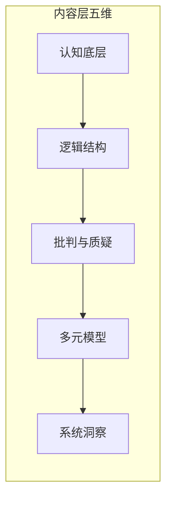

# 思维模型学习

本文对思维模型学习做**梳理与综合**：你前面给的内容（四维、五本书、对比表与行动建议）是**一个看法、一个例子**，已作为核心素材被纳入；在此基础上结合批判性思维、更多思维模型类资源及工作区内学习与刻意练习笔记，整理成一条清晰的问题—背景—内容层—过程层—路径—行动逻辑。经与市面框架对比，采用**双层模型**：内容层（五维）+ 过程层（元认知与迁移），并补充与认知科学、系统论的衔接及框架的边界与拓展方向。

---

## 一、问题与背景

### 要回答的问题是什么

如何系统学习「思维」、避免「买书如山倒，读书如抽丝」？学思维前需先厘清**思维是什么、如何衡量改进**。思维类书籍本质是在阅读大脑的「说明书」并升级其「底层算法」；若没有可操作的进阶视角，容易堆书不消化。

### 为什么会有这样的问题（背景）

市面上思维、认知、决策类书籍很多，质量参差不齐。读者常面临：不知道先读哪本、各本书解决什么问题、如何从「读过」变成「会用」。因此需要一种**可操作的进阶框架**——不是简单罗列书名，而是按**内容层五维**建思维进阶书架，并显性纳入**过程层**（如何学、如何用）。内容层五维为：认知底层、逻辑结构、批判与质疑、多元模型、系统洞察；过程层为元认知与迁移。下文先对思维做可操作界定并说明如何评估，再进入五维与书单。

---

### 思维是什么：定义与可操作界定

- **心理学/认知科学中的界定**：思维是人脑对客观世界的**高级认知活动**；借助语言、概念对事物进行**间接、概括**的反映，包含知觉、知识、问题解决、判断、语言、记忆等心智过程。既有**意识层面的推理**（如演算、论证），也有**较自动的过程**（如直觉、模式识别、情绪影响判断）——与卡尼曼的双系统（快/慢思考）一致。
- **与文档内容层五维的对应**：将「思维」操作化为五维，便于与书单对接：**认知底层**（思维由谁执行、易出什么错）→ **逻辑结构**（思维如何被组织与表达）→ **批判与质疑**（论证如何被评估与质疑）→ **多元模型**（思维用哪些工具）→ **系统洞察**（思维如何把握复杂与动态）。一句话概括：文档中的「学思维」= 在认知局限下，提升思维的**条理、质疑能力、工具与系统视角**，并减少偏误。

---

### 思维的量化与评估

- **量化/评估的几种方式**（并列呈现，不要求读者去做测验）：  
  - **标准化测验**：如 Cornell Critical Thinking Test（归纳、演绎、观察、可信度、假设等子维度）、CAT（Critical Thinking Assessment Test）等，用于推理能力与批判性思维技能；有信效度争议、多为教育场景。  
  - **思维品质维度**（中文教育/心理学常见）：深刻性、广阔性、敏捷性、灵活性、批判性、创造性等；可**自我对照或他人反馈**，不必依赖试卷。  
  - **文档内的可操作评估**：用**内容层自检（五维）**作为日常「量化」——遇到问题时，自问是偏误、缺结构、缺论证/质疑、缺模型还是缺系统视角，并对应到书与练习；与第五节「双层自检」呼应，形成「定义 → 维度 → 自检」闭环。
- **小结**：思维难以单一指标完全量化，但可通过「测验子维度 + 思维品质 + 内容层五维自检」多角度把握改进方向；书籍落实在「可练习、可调用的行为与选择」上。

---

## 二、内容层：五维视角

内容层回答「学什么」。五维在整体路径中的角色：**认知底层**（了解硬件局限、防错）→ **逻辑结构**（给思维装导轨、建序）→ **批判与质疑**（识别前提与谬误、评估论证）→ **多元模型**（扩充工具箱、避免单一视角）→ **系统洞察**（理解复杂世界的脉络、从线性到网状）。逻辑结构主攻表达与结构（金字塔），**批判与质疑**独立成维，对应《批判性思维工具》等，书单见第三节。各维之间既有递进关系，也可在实践中有交叉与并列使用。五维即对「思维」的**可操作分解**；各书在不同维度上界定并落实「好思维」，都落在**可练习、可自检的行为与选择**上，与上文定义、量化小节一一对应。

### 1. 认知底层：了解你的「硬件」局限

**位置与衔接**：在学习「怎么思考」之前，先知道大脑是怎么「坑」你的。只有意识到直觉（系统1）的不可靠，才会产生「刻意逻辑」（系统2）的动力；这一维为后面的逻辑结构提供动机。

#### 《思考，快与慢》—— 丹尼尔·卡尼曼

- **核心精髓**：系统1（直觉、快思考）与系统2（逻辑、慢思考）；人类偏好系统1，存在大量认知偏误（如锚定效应、可得性偏差）。
- **深度分析**：认知心理学的经典之作，相当于思维的「防错指南」。它说明人类天生懒惰、易受情境与启发式影响，仅「知道偏误」不足以避免错误，需与逻辑结构、批判性思维配合使用。
- **本书对思维的界定/可观测落脚点**：把「思维」操作化为**两种加工方式**（快/直觉 vs 慢/逻辑），好思维 = 在合适情境下启用系统 2、减少系统 1 的偏误；可观测：决策中的偏误率、是否做慢思考复盘。
- **学习价值**：建立「慢思考」意识，减少因直觉导致的低级错误；是后续逻辑训练与模型应用的前提。
- **本维可能缺什么**：单靠此书容易停留在「知道偏误」层面；未系统教「如何建序、如何论证」，需与金字塔原理、批判性思维衔接。情绪对判断的影响、群体与权力对认知的塑造，本书有触及但不作为主线。

---

### 2. 逻辑结构：给思维安装「导轨」

**位置与衔接**：有了「慢思考」的意识后，需要一套工具把混乱的思绪理清楚。认知底层负责「防错」，逻辑结构负责「建序」——二者配合：一个让你愿意用慢思考，一个教你怎么把慢思考变得有条理。

#### 《金字塔原理》—— 芭芭拉·明托

- **核心精髓**：结论先行、以上统下、归类分组、逻辑递进；MECE 原则（相互独立、完全穷尽）。
- **深度分析**：很多人觉得枯燥，但它是逻辑训练的基本功，强调思维的秩序。MECE、结论先行与「慢思考」互为配合：慢思考提供动机，金字塔提供结构。
- **本书对思维的界定/可观测落脚点**：把「思维」操作化为**有秩序的结构**（结论先行、MECE、归类分组）；好思维 = 表达与思考有条理、可被他人复述；可观测：汇报/文档的清晰度、逻辑链是否完整。「经得起质疑」由下一维「批判与质疑」负责。
- **学习价值**：提升表达与思考的条理；若内化，写作和演讲会更有说服力与清晰度。与批判性思维中的「论证结构、前提-结论」可衔接，用于识别与构建论证。
- **本维可能缺什么**：偏表达与呈现，对「如何质疑前提、如何识别谬误」着墨不多，由批判与质疑维及对应书单补足。

---

### 3. 批判与质疑

**位置与衔接**：逻辑结构负责「说得清」，本维负责「看得穿」——识别前提与谬误、评估证据、在证据不足时悬置判断、保持开放与寻证倾向。与卡尼曼的认知偏误形成三角：偏误让你「容易错」，逻辑结构让你「有条理」，批判与质疑让你「能质疑论证与假设」。

**核心能力**：分析论证结构（前提—结论）、评估证据与来源、识别常见谬误、克服自我中心与非理性假设；倾向层面包括寻求清晰陈述与理由、充分知情、考虑替代观点。对应书单与资源见第三节「批判性思维」；本节仅标明该维在框架中的定位及与逻辑结构的区别（前者重表达与结构，后者重论证评估与质疑）。

---

### 4. 多元模型：扩充你的「工具箱」

**位置与衔接**：若手里只有一把锤子，看什么都像钉子。多元模型提供跨学科的思维工具，避免单一学科的隧道视野；在逻辑结构与批判与质疑的基础上，进一步扩充可调用的「模型库」。

#### 《穷查理宝典》—— 查理·芒格

- **核心精髓**：普世智慧与跨学科思维模型；要处理复杂问题，须掌握数学、物理、生物、心理等学科的核心原理。
- **深度分析**：偏思维哲学与「地图」——教你从不同角度审视同一问题，避免认知的隧道视野。多元思维模型的本质是减少单一学科偏见。
- **本书对思维的界定/可观测落脚点**：把「思维」操作化为**可调用的模型集合**；好思维 = 多角度审视问题、避免单一学科偏见；可观测：能否在具体情境中说出/用到 1～2 个模型、是否出现「只用一个框架」的隧道视野。
- **学习价值**：建立跨学科的思维地图；不是工具手册，而是思维方式的升级。
- **本维可能缺什么**：多为演讲与随笔，模型未逐条拆解；与《思维模型》系列形成互补（后者偏教材与手册）。

#### 《思维模型》(The Great Mental Models) —— 沙恩·帕里什

- **核心精髓**：对芒格思想的系统化梳理；详细拆解「第一性原理」「逆向思维」「二阶效应」等模型。
- **深度分析**：若《穷查理宝典》是散文，本系列（如第 1–3 册）即教材，手把手教如何将模型应用到实际决策。
- **本书对思维的界定/可观测落脚点**：同上（可调用的模型集合）；好思维 = 多角度审视、避免隧道视野；可观测：情境中能否调用 1～2 个模型、是否过度依赖单一框架。
- **学习价值**：适合作为手册查阅与实操；与系统思维有交叉——模型即对复杂系统的简化，须注意「模型过多不练」的陷阱，即堆砌模型而不在情境中练习仍难以调用。
- **本维可能缺什么**：模型多而杂时，若缺乏刻意练习与反馈，易「读过就忘」；内化需要与「心理表征、情境化练习」结合（见后文与工作区 Deliberate Practice 的衔接）。

#### 思维模型的层次（成甲《好好思考》）

成甲将思维模型按抽象程度分为四层：**经验技巧型**（具体操作）→ **方法流程型**（系统方法）→ **学科原理型**（各学科核心原理）→ **哲学视角型**（底层哲学）。可与「认知底层→逻辑结构→批判与质疑→多元模型→系统洞察」的**学习进阶维度**并列使用：一为「模型的抽象层级」，一为「学什么的维度」。自检时可问：当前用的模型处在哪一层次、是否可上移到学科原理或哲学视角；芒格/帕里什所强调的多元模型多对应**学科原理型**，可据此选书与补缺。

---

### 5. 系统洞察：理解复杂世界的「脉络」

**位置与衔接**：世界往往不是线性的，而是网状的。前三维偏「线性表达与单点决策」；系统洞察完成从「线性思维」到「系统思维」的跨越，理解反馈、存量与流量、杠杆点，以及为何解决问题的方案常带来新问题。

#### 《系统之美》(Thinking in Systems) —— 德内拉·梅多斯

- **核心精髓**：反馈回路、存量与流量、杠杆点；系统行为的内生逻辑与演化。
- **深度分析**：系统思考的入门经典。说明为何方案会带来副作用、如何找到系统中的关键触发点；与「二阶效应」「反直觉结果」紧密相关。
- **本书对思维的界定/可观测落脚点**：把「思维」操作化为**对反馈、存量与杠杆点的把握**；好思维 = 看到方案的第二阶效应与系统结构；可观测：分析问题时是否画反馈环、是否追问「还会影响什么」。
- **学习价值**：对管理、创业和理解社会现象很有用；与多元模型中的「二阶效应」等可打通，形成动态、演化视角。
- **本维可能缺什么**：对「人」在系统中的地位、权力与价值选择讨论有限；可与存在主义、组织行为等结合以补足。

---

### 过程层：元认知与迁移

**为何单独成层**：市面框架（布鲁姆元认知知识、批判性思维中的元认知、高效学习「知行合一」）均强调「如何学、如何用」与「学什么」并重；仅读内容层书籍不练，难以迁移。

- **元认知**：对自身思维的觉察与调节——何时启用系统 2、何时切换专注/发散（参见 [Study.md](Psychology/Study.md)）、如何用费曼/自测检验理解、如何问题驱动选书与练习。
- **迁移**：从「读过」到「调用」——刻意练习、情境化应用、反馈闭环（参见 [Deliberate Practice.md](Psychology/Deliberate Practice.md)）；与「知识晶体化」的关联化→结构化→可迁移对应。
- **对应资源**：《学习之道》（专注/发散、记忆与间隔）、《刻意练习》（心理表征、反馈）；高效学习五大支柱（问题驱动、体系化、知行合一、多角度、关联）可作自检清单。
- **与内容层的关系**：内容层选书按五维，过程层决定如何读、如何练、如何复盘；二者交叉作用。

---

## 三、与其他资源的衔接（开放拓展）

批判性思维在框架中归属**内容层·批判与质疑**（论证评估与质疑）；过程层（元认知与迁移）见第二节末。以下为批判与质疑维的补充书单及更多资源，并与工作区内笔记衔接。

### 批判与质疑：补充书单与资源

可补充资源示例：

- **《批判性思维工具》（第 3 版）**（理查德·保罗、琳达·埃尔德）：推理元素、智力标准与智力特质；识别与克服非理性思维，与「系统 1/系统 2」互补。
- **《超越感觉：批判性思考指南》**（文森特·鲁吉罗）：心理障碍与清晰思考的抵触；书末有应用练习，适合入门。
- **《学会思考》**（C 计划，郭兆凡等）：本土化、零基础，思维可视化与步骤化，提供可操作的批判性思维工具。

### 更多思维模型类资源

- **《超级思维》(Super Thinking)**（加布里埃尔·温伯格、劳伦·麦肯）：图示化、贴近日常的模型集合（如艾森豪威尔矩阵、五问法、汉隆剃刀、沉没成本等），可作为「多元模型」维度的工具箱补充。
- **《Pause to Think: Using Mental Models to Learn and Decide》**（杰米·莱斯特）：偏学习与决策的入门，强调在学与决断中调用模型。

### 工作区内资源的衔接

- **专注/发散模式与系统 1/系统 2**：本工作区 [Study.md](Psychology/Study.md)（《学习之道》）中的**专注模式**与**发散模式**，与卡尼曼的**系统 1/系统 2** 并非同一划分。前者描述「注意力状态与神经模式」（专注 = 前额叶集中、分解问题；发散 = 放松、联结、灵感），后者描述「加工方式」（快/直觉 vs 慢/逻辑）。可对照理解：专注模式常承载系统 2 的运算，发散模式常冒出系统 1 的联想；学习新概念或难题时，需在两种模式间切换（参见 Study.md 中的「为思维加力」「两种模式间的切换」）。
- **心理表征与刻意练习**：上述内容属于**过程层（元认知与迁移）**，与第二节末过程层小节呼应。本工作区 [Deliberate Practice.md](Psychology/Deliberate Practice.md) 指出，刻意练习的目标之一是**发展心理表征**——与某事物对应的心理结构，用于找出规律、解释与组织信息、制定计划。思维模型要变成「可调用」的直觉，不能只靠阅读，而需要在**情境中反复练习并得到反馈**，使模型固化为高质量心理表征。这解释了「读过就忘」：缺少刻意练习与反馈，模型未进入可自动调用的层次。「调用而非读完」因此可与「刻意练习 + 心理表征」统一表述。

---

## 四、维度与书单的拓展（梳理时的综合与补充）

在综合你提供的四维与书单的基础上，经与市面框架对比，采用**方案 B**：内容层五维（批判与质疑独立成维）、成甲思维模型层次单独小节、过程层显性化。以下说明为何采用该结构及五维的用法。

### 为何采用当前结构（方案 B）

- **批判与质疑独立成维**：市面批判性思维框架普遍将「技能（分析、评估、推理）」与「倾向（开放、寻证、悬置判断）」及「元认知」并列；金字塔原理主攻表达与结构，批判性思维主攻论证评估与质疑——二者能力目标不同，合并为一维易模糊，故将批判与质疑升格为内容层第五维之一，与逻辑结构并列。
- **成甲层次单独成小节**：成甲《好好思考》的四层次（经验技巧→方法流程→学科原理→哲学视角）在中文市场常被用作「模型层次」轴，与学习进阶维度可并列；单独成小节便于自检「当前模型处在哪一层次、是否可上移」及选书对应。
- **过程层显性化**：布鲁姆修订版含元认知知识，高效学习强调知行合一；仅读内容层不练难以迁移，故将「元认知与迁移」单独成层，与内容层交叉作用。

### 五维是递进还是可并列、可交叉

整体上**递进**（先防错、再建序、再质疑、再扩充模型、再系统洞察）有助于安排阅读与练习顺序；实践中五维**可交叉**——例如在写报告时同时用到逻辑结构（金字塔）与系统洞察（反馈与杠杆点），或在决策时同时调用认知底层（警惕偏误）、批判与质疑（评估论证）与多元模型（二阶效应）。

### 书单与评价：梳理时的保留与增补

内容层五维及对应书单见第五节对比表；批判与质疑维书单见本节上文（第三节）。以下为梳理时的**补充说明与可选增补**：
- **《金字塔原理》**：若读者已有较强逻辑训练，可能觉得重复；但对多数职场表达场景，仍属高性价比的「导轨」书；适用人群可注明「尤其适合表达与汇报需提升者」。
- **《思维模型》系列**：与《穷查理宝典》都讲多元模型，前者更教材化、可查。可「先芒格建立哲学，再帕里什做手册」；若只选一本实操，帕里什更合适。
- **可增补**：《学习之道》（见 Study.md）作为「如何学」的伴侣书，与系统 1/系统 2、专注/发散结合；《刻意练习》作为「如何把模型练到能调用」的理论支撑；原五本书的推荐度不变，仅作拓展列。

### 盲区与边界

- **五维与过程层可能忽略的**：情绪对思维与判断的影响（虽卡尼曼有涉及）；群体与权力对认知的塑造（从众、权威、意识形态）；存在与意义对「为何要思考得更好」的驱动（可与本仓库存在主义笔记对照）。
- **思维模型本身的风险**：过度依赖少数模型会导致隧道视野；模型堆砌而不练仍无效；某些情境下「少即是多」——与其套用不贴切的模型，不如回到问题本身做朴素分析。

---

## 五、学习路径与行动建议

### 路径建议

- **内容层**：按五维选书。最小可行路径：先《金字塔原理》再《思考，快与慢》——先装「导轨」再装「防错」；随后可选逻辑结构、批判与质疑并列或先其一（如《批判性思维工具》或《学会思考》），再按需选读《穷查理宝典》或《思维模型》之一以扩充工具箱，《系统之美》作为系统视角的入门。拓展路径：五维各选 1–2 本，批判与质疑维必选 1–2 本。
- **过程层**：每读一本都配合元认知与迁移——用费曼检验理解、用情境题练习调用、用复盘与反馈固化；将《学习之道》《刻意练习》作为「如何学、如何练」的配套，强化「调用」而非「读完」。

### 核心原则：调用而非读完 + 双层自检

不要试图「读完」这些书，而要试图「调用」它们。思维类书最忌讳读过就忘；建议：

- **内容层自检**：日常遇到「无从下手」或「逻辑理不顺」时，问——是认知偏误？缺结构？缺论证/质疑？缺模型？还是缺系统视角？若纳入成甲层次，可加问：当前用的模型处在哪一层次、是否可上移。再选对应书中的工具拆解。自检即对「思维」的**日常量化**——不依赖试卷，用五维与对应书籍工具做自我诊断与改进。
- **过程层自检**：有没有在练、有没有反馈、是否问题驱动？
- 将「调用」与**刻意练习、反馈**结合：在真实情境中应用某一模型（如 MECE、二阶效应、杠杆点），并复盘是否用对、是否有效，使模型逐渐内化为可调用的心理表征。

### 对比表（内容层五维 + 过程层标注）

| 维度       | 书名           | 解决的问题                     | 推荐指数 |
|------------|----------------|--------------------------------|----------|
| 认知底层   | 《思考，快与慢》 | 认识大脑缺陷，减少低级错误     | ⭐⭐⭐⭐⭐ |
| 逻辑结构   | 《金字塔原理》   | 表达与思考有条理               | ⭐⭐⭐⭐   |
| 批判与质疑 | 《批判性思维工具》等 | 识别谬误、评估论证、悬置判断   | 见第三节书单 |
| 多元模型   | 《穷查理宝典》   | 建立跨学科思维地图             | ⭐⭐⭐⭐⭐ |
| 多元模型   | 《思维模型》系列 | 掌握可实操的思维工具           | ⭐⭐⭐⭐   |
| 系统洞察   | 《系统之美》     | 理解复杂事物的逻辑与演化       | ⭐⭐⭐⭐   |

**过程层对应资源**：《学习之道》(Study.md)、《刻意练习》——如何学、如何练、如何迁移；高效学习五大支柱可作自检清单。

---

## 【校验纪要】

| 核对点 | 证据来源 | 结果与说明 | 置信度 |
|--------|----------|------------|--------|
| 思维的定义与量化是否与内容层五维、书单一致 | 心理学/认知科学常见界定 + 文档内五维与自检 | 定义操作化为五维，量化含测验、思维品质、内容层五维自检；各书在对应维上给出可观测落脚点，与定义、量化一致 | 高 |
| 双层模型是否与市面框架对齐 | 批判性思维框架（技能+倾向+元认知）、布鲁姆元认知、高效学习知行合一、成甲层次 | 内容层五维（含批判与质疑独立）、过程层显性化、成甲层次单独小节，与市面一致 | 高 |
| 过程层是否已填充元认知与迁移要点 | 第二节末「过程层：元认知与迁移」、第三节工作区资源 | 已写为何成层、元认知、迁移、对应资源、与内容层关系 | 高 |
| 书单与五维、过程层对应是否一致 | 第二节各维、第三节批判与质疑书单、第五节对比表 | 原五本归属不变；批判与质疑维对应第三节书单；过程层标注《学习之道》《刻意练习》 | 高 |
