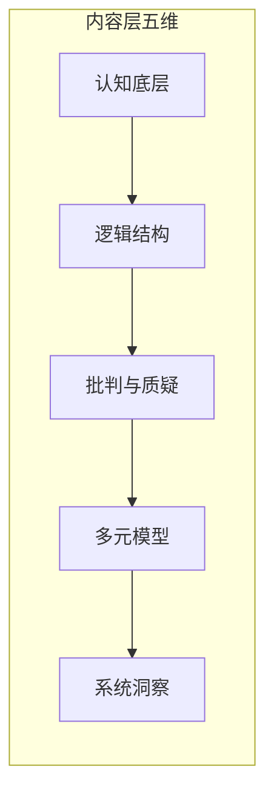

# 思维模型学习

本文对思维模型学习做**梳理与综合**：你前面给的内容（四维、五本书、对比表与行动建议）是**一个看法、一个例子**，已作为核心素材被纳入；在此基础上结合批判性思维、更多思维模型类资源及工作区内学习与刻意练习笔记，整理成一条清晰的问题—背景—内容层—过程层—路径—行动逻辑。经与市面框架对比，采用**双层模型**：内容层（五维）+ 过程层（元认知与迁移），并补充与认知科学、系统论的衔接及框架的边界与拓展方向。

---

## 一、问题与背景

### 要回答的问题是什么

如何系统学习「思维」、避免「买书如山倒，读书如抽丝」？学思维前需先厘清**思维是什么、如何衡量改进**。思维类书籍本质是在阅读大脑的「说明书」并升级其「底层算法」；若没有可操作的进阶视角，容易堆书不消化。

### 为什么会有这样的问题（背景）

市面上思维、认知、决策类书籍很多，质量参差不齐。读者常面临：不知道先读哪本、各本书解决什么问题、如何从「读过」变成「会用」。因此需要一种**可操作的进阶框架**——不是简单罗列书名，而是按**内容层五维**建思维进阶书架，并显性纳入**过程层**（如何学、如何用）。内容层五维为：认知底层、逻辑结构、批判与质疑、多元模型、系统洞察；过程层为元认知与迁移。下文先对思维做可操作界定并说明如何评估，再进入五维与书单。

---

### 思维是什么：定义与可操作界定

- **心理学/认知科学中的界定**：思维是人脑对客观世界的**高级认知活动**；借助语言、概念对事物进行**间接、概括**的反映，包含知觉、知识、问题解决、判断、语言、记忆等心智过程。既有**意识层面的推理**（如演算、论证），也有**较自动的过程**（如直觉、模式识别、情绪影响判断）——与卡尼曼的双系统（快/慢思考）一致。
- **与文档内容层五维的对应**：将「思维」操作化为五维，便于与书单对接：**认知底层**（思维由谁执行、易出什么错）→ **逻辑结构**（思维如何被组织与表达）→ **批判与质疑**（论证如何被评估与质疑）→ **多元模型**（思维用哪些工具）→ **系统洞察**（思维如何把握复杂与动态）。一句话概括：文档中的「学思维」= 在认知局限下，提升思维的**条理、质疑能力、工具与系统视角**，并减少偏误。

---

### 思维的量化与评估

- **量化/评估的几种方式**（并列呈现，不要求读者去做测验）：  
  - **标准化测验**：如 Cornell Critical Thinking Test（归纳、演绎、观察、可信度、假设等子维度）、CAT（Critical Thinking Assessment Test）等，用于推理能力与批判性思维技能；有信效度争议、多为教育场景。  
  - **思维品质维度**（中文教育/心理学常见）：深刻性、广阔性、敏捷性、灵活性、批判性、创造性等；可**自我对照或他人反馈**，不必依赖试卷。  
  - **文档内的可操作评估**：用**内容层自检（五维）**作为日常「量化」——遇到问题时，自问是偏误、缺结构、缺论证/质疑、缺模型还是缺系统视角，并对应到书与练习；与第五节「双层自检」呼应，形成「定义 → 维度 → 自检」闭环。
- **小结**：思维难以单一指标完全量化，但可通过「测验子维度 + 思维品质 + 内容层五维自检」多角度把握改进方向；书籍落实在「可练习、可调用的行为与选择」上。

---

## 二、内容层：五维视角

内容层回答「学什么」。五维在整体路径中的角色：**认知底层**（了解硬件局限、防错）→ **逻辑结构**（给思维装导轨、建序）→ **批判与质疑**（识别前提与谬误、评估论证）→ **多元模型**（扩充工具箱、避免单一视角）→ **系统洞察**（理解复杂世界的脉络、从线性到网状）。逻辑结构主攻表达与结构（金字塔），**批判与质疑**独立成维，对应《批判性思维工具》等，书单见第三节。各维之间既有递进关系，也可在实践中有交叉与并列使用。五维即对「思维」的**可操作分解**；各书在不同维度上界定并落实「好思维」，都落在**可练习、可自检的行为与选择**上，与上文定义、量化小节一一对应。

### 1. 认知底层：了解你的「硬件」局限

**位置与衔接**：在学习「怎么思考」之前，先知道大脑是怎么「坑」你的。只有意识到直觉（系统1）的不可靠，才会产生「刻意逻辑」（系统2）的动力；这一维为后面的逻辑结构提供动机。

#### 《思考，快与慢》—— 丹尼尔·卡尼曼

- **核心精髓**：系统1（直觉、快思考）与系统2（逻辑、慢思考）；人类偏好系统1，存在大量认知偏误（如锚定效应、可得性偏差）。
- **深度分析**：认知心理学的经典之作，相当于思维的「防错指南」。它说明人类天生懒惰、易受情境与启发式影响，仅「知道偏误」不足以避免错误，需与逻辑结构、批判性思维配合使用。
- **本书对思维的界定/可观测落脚点**：把「思维」操作化为**两种加工方式**（快/直觉 vs 慢/逻辑），好思维 = 在合适情境下启用系统 2、减少系统 1 的偏误；可观测：决策中的偏误率、是否做慢思考复盘。
- **学习价值**：建立「慢思考」意识，减少因直觉导致的低级错误；是后续逻辑训练与模型应用的前提。
- **本维可能缺什么**：单靠此书容易停留在「知道偏误」层面；未系统教「如何建序、如何论证」，需与金字塔原理、批判性思维衔接。情绪对判断的影响、群体与权力对认知的塑造，本书有触及但不作为主线。

---

### 2. 逻辑结构：给思维安装「导轨」

**位置与衔接**：有了「慢思考」的意识后，需要一套工具把混乱的思绪理清楚。认知底层负责「防错」，逻辑结构负责「建序」——二者配合：一个让你愿意用慢思考，一个教你怎么把慢思考变得有条理。

#### 《金字塔原理》—— 芭芭拉·明托

- **核心精髓**：结论先行、以上统下、归类分组、逻辑递进；MECE 原则（相互独立、完全穷尽）。
- **深度分析**：很多人觉得枯燥，但它是逻辑训练的基本功，强调思维的秩序。MECE、结论先行与「慢思考」互为配合：慢思考提供动机，金字塔提供结构。
- **本书对思维的界定/可观测落脚点**：把「思维」操作化为**有秩序的结构**（结论先行、MECE、归类分组）；好思维 = 表达与思考有条理、可被他人复述；可观测：汇报/文档的清晰度、逻辑链是否完整。「经得起质疑」由下一维「批判与质疑」负责。
- **学习价值**：提升表达与思考的条理；若内化，写作和演讲会更有说服力与清晰度。与批判性思维中的「论证结构、前提-结论」可衔接，用于识别与构建论证。
- **本维可能缺什么**：偏表达与呈现，对「如何质疑前提、如何识别谬误」着墨不多，由批判与质疑维及对应书单补足。

---

### 3. 批判与质疑

**位置与衔接**：逻辑结构负责「说得清」，本维负责「看得穿」——识别前提与谬误、评估证据、在证据不足时悬置判断、保持开放与寻证倾向。与卡尼曼的认知偏误形成三角：偏误让你「容易错」，逻辑结构让你「有条理」，批判与质疑让你「能质疑论证与假设」。

**核心能力**：分析论证结构（前提—结论）、评估证据与来源、识别常见谬误、克服自我中心与非理性假设；倾向层面包括寻求清晰陈述与理由、充分知情、考虑替代观点。对应书单与资源见第三节「批判性思维」；本节仅标明该维在框架中的定位及与逻辑结构的区别（前者重表达与结构，后者重论证评估与质疑）。

---

### 4. 多元模型：扩充你的「工具箱」

**位置与衔接**：若手里只有一把锤子，看什么都像钉子。多元模型提供跨学科的思维工具，避免单一学科的隧道视野；在逻辑结构与批判与质疑的基础上，进一步扩充可调用的「模型库」。

#### 《穷查理宝典》—— 查理·芒格

- **核心精髓**：普世智慧与跨学科思维模型；要处理复杂问题，须掌握数学、物理、生物、心理等学科的核心原理。
- **深度分析**：偏思维哲学与「地图」——教你从不同角度审视同一问题，避免认知的隧道视野。多元思维模型的本质是减少单一学科偏见。
- **本书对思维的界定/可观测落脚点**：把「思维」操作化为**可调用的模型集合**；好思维 = 多角度审视问题、避免单一学科偏见；可观测：能否在具体情境中说出/用到 1～2 个模型、是否出现「只用一个框架」的隧道视野。
- **学习价值**：建立跨学科的思维地图；不是工具手册，而是思维方式的升级。
- **本维可能缺什么**：多为演讲与随笔，模型未逐条拆解；与《思维模型》系列形成互补（后者偏教材与手册）。

#### 《思维模型》(The Great Mental Models) —— 沙恩·帕里什

- **核心精髓**：对芒格思想的系统化梳理；详细拆解「第一性原理」「逆向思维」「二阶效应」等模型。
- **深度分析**：若《穷查理宝典》是散文，本系列（如第 1–3 册）即教材，手把手教如何将模型应用到实际决策。
- **本书对思维的界定/可观测落脚点**：同上（可调用的模型集合）；好思维 = 多角度审视、避免隧道视野；可观测：情境中能否调用 1～2 个模型、是否过度依赖单一框架。
- **学习价值**：适合作为手册查阅与实操；与系统思维有交叉——模型即对复杂系统的简化，须注意「模型过多不练」的陷阱，即堆砌模型而不在情境中练习仍难以调用。
- **本维可能缺什么**：模型多而杂时，若缺乏刻意练习与反馈，易「读过就忘」；内化需要与「心理表征、情境化练习」结合（见后文与工作区 Deliberate Practice 的衔接）。

#### 思维模型的层次（成甲《好好思考》）

成甲将思维模型按抽象程度分为四层：**经验技巧型**（具体操作）→ **方法流程型**（系统方法）→ **学科原理型**（各学科核心原理）→ **哲学视角型**（底层哲学）。可与「认知底层→逻辑结构→批判与质疑→多元模型→系统洞察」的**学习进阶维度**并列使用：一为「模型的抽象层级」，一为「学什么的维度」。自检时可问：当前用的模型处在哪一层次、是否可上移到学科原理或哲学视角；芒格/帕里什所强调的多元模型多对应**学科原理型**，可据此选书与补缺。

---

### 5. 系统洞察：理解复杂世界的「脉络」

**位置与衔接**：世界往往不是线性的，而是网状的。前三维偏「线性表达与单点决策」；系统洞察完成从「线性思维」到「系统思维」的跨越，理解反馈、存量与流量、杠杆点，以及为何解决问题的方案常带来新问题。

#### 《系统之美》(Thinking in Systems) —— 德内拉·梅多斯

- **核心精髓**：反馈回路、存量与流量、杠杆点；系统行为的内生逻辑与演化。
- **深度分析**：系统思考的入门经典。说明为何方案会带来副作用、如何找到系统中的关键触发点；与「二阶效应」「反直觉结果」紧密相关。
- **本书对思维的界定/可观测落脚点**：把「思维」操作化为**对反馈、存量与杠杆点的把握**；好思维 = 看到方案的第二阶效应与系统结构；可观测：分析问题时是否画反馈环、是否追问「还会影响什么」。
- **学习价值**：对管理、创业和理解社会现象很有用；与多元模型中的「二阶效应」等可打通，形成动态、演化视角。
- **本维可能缺什么**：对「人」在系统中的地位、权力与价值选择讨论有限；可与存在主义、组织行为等结合以补足。

---

### 过程层：元认知与迁移

**为何单独成层**：市面框架（布鲁姆元认知知识、批判性思维中的元认知、高效学习「知行合一」）均强调「如何学、如何用」与「学什么」并重；仅读内容层书籍不练，难以迁移。

- **元认知**：对自身思维的觉察与调节——何时启用系统 2、何时切换专注/发散（参见 [Study.md](Psychology/Study.md)）、如何用费曼/自测检验理解、如何问题驱动选书与练习。
- **迁移**：从「读过」到「调用」——刻意练习、情境化应用、反馈闭环（参见 [Deliberate Practice.md](Psychology/Deliberate Practice.md)）；与「知识晶体化」的关联化→结构化→可迁移对应。
- **对应资源**：《学习之道》（专注/发散、记忆与间隔）、《刻意练习》（心理表征、反馈）；高效学习五大支柱（问题驱动、体系化、知行合一、多角度、关联）可作自检清单。
- **与内容层的关系**：内容层选书按五维，过程层决定如何读、如何练、如何复盘；二者交叉作用。

---

## 三、与其他资源的衔接（开放拓展）

批判性思维在框架中归属**内容层·批判与质疑**（论证评估与质疑）；过程层（元认知与迁移）见第二节末。以下为批判与质疑维的补充书单及更多资源，并与工作区内笔记衔接。

### 批判与质疑：补充书单与资源

可补充资源示例：

- **《批判性思维工具》（第 3 版）**（理查德·保罗、琳达·埃尔德）：推理元素、智力标准与智力特质；识别与克服非理性思维，与「系统 1/系统 2」互补。
- **《超越感觉：批判性思考指南》**（文森特·鲁吉罗）：心理障碍与清晰思考的抵触；书末有应用练习，适合入门。
- **《学会思考》**（C 计划，郭兆凡等）：本土化、零基础，思维可视化与步骤化，提供可操作的批判性思维工具。

### 更多思维模型类资源

- **《超级思维》(Super Thinking)**（加布里埃尔·温伯格、劳伦·麦肯）：图示化、贴近日常的模型集合（如艾森豪威尔矩阵、五问法、汉隆剃刀、沉没成本等），可作为「多元模型」维度的工具箱补充。
- **《Pause to Think: Using Mental Models to Learn and Decide》**（杰米·莱斯特）：偏学习与决策的入门，强调在学与决断中调用模型。

### 工作区内资源的衔接

- **专注/发散模式与系统 1/系统 2**：本工作区 [Study.md](Psychology/Study.md)（《学习之道》）中的**专注模式**与**发散模式**，与卡尼曼的**系统 1/系统 2** 并非同一划分。前者描述「注意力状态与神经模式」（专注 = 前额叶集中、分解问题；发散 = 放松、联结、灵感），后者描述「加工方式」（快/直觉 vs 慢/逻辑）。可对照理解：专注模式常承载系统 2 的运算，发散模式常冒出系统 1 的联想；学习新概念或难题时，需在两种模式间切换（参见 Study.md 中的「为思维加力」「两种模式间的切换」）。
- **心理表征与刻意练习**：上述内容属于**过程层（元认知与迁移）**，与第二节末过程层小节呼应。本工作区 [Deliberate Practice.md](Psychology/Deliberate Practice.md) 指出，刻意练习的目标之一是**发展心理表征**——与某事物对应的心理结构，用于找出规律、解释与组织信息、制定计划。思维模型要变成「可调用」的直觉，不能只靠阅读，而需要在**情境中反复练习并得到反馈**，使模型固化为高质量心理表征。这解释了「读过就忘」：缺少刻意练习与反馈，模型未进入可自动调用的层次。「调用而非读完」因此可与「刻意练习 + 心理表征」统一表述。

---

## 四、维度与书单的拓展（梳理时的综合与补充）

在综合你提供的四维与书单的基础上，经与市面框架对比，采用**方案 B**：内容层五维（批判与质疑独立成维）、成甲思维模型层次单独小节、过程层显性化。以下说明为何采用该结构及五维的用法。

### 为何采用当前结构（方案 B）

- **批判与质疑独立成维**：市面批判性思维框架普遍将「技能（分析、评估、推理）」与「倾向（开放、寻证、悬置判断）」及「元认知」并列；金字塔原理主攻表达与结构，批判性思维主攻论证评估与质疑——二者能力目标不同，合并为一维易模糊，故将批判与质疑升格为内容层第五维之一，与逻辑结构并列。
- **成甲层次单独成小节**：成甲《好好思考》的四层次（经验技巧→方法流程→学科原理→哲学视角）在中文市场常被用作「模型层次」轴，与学习进阶维度可并列；单独成小节便于自检「当前模型处在哪一层次、是否可上移」及选书对应。
- **过程层显性化**：布鲁姆修订版含元认知知识，高效学习强调知行合一；仅读内容层不练难以迁移，故将「元认知与迁移」单独成层，与内容层交叉作用。

### 五维是递进还是可并列、可交叉

整体上**递进**（先防错、再建序、再质疑、再扩充模型、再系统洞察）有助于安排阅读与练习顺序；实践中五维**可交叉**——例如在写报告时同时用到逻辑结构（金字塔）与系统洞察（反馈与杠杆点），或在决策时同时调用认知底层（警惕偏误）、批判与质疑（评估论证）与多元模型（二阶效应）。

### 书单与评价：梳理时的保留与增补

内容层五维及对应书单见第五节对比表；批判与质疑维书单见本节上文（第三节）。以下为梳理时的**补充说明与可选增补**：
- **《金字塔原理》**：若读者已有较强逻辑训练，可能觉得重复；但对多数职场表达场景，仍属高性价比的「导轨」书；适用人群可注明「尤其适合表达与汇报需提升者」。
- **《思维模型》系列**：与《穷查理宝典》都讲多元模型，前者更教材化、可查。可「先芒格建立哲学，再帕里什做手册」；若只选一本实操，帕里什更合适。
- **可增补**：《学习之道》（见 Study.md）作为「如何学」的伴侣书，与系统 1/系统 2、专注/发散结合；《刻意练习》作为「如何把模型练到能调用」的理论支撑；原五本书的推荐度不变，仅作拓展列。

### 盲区与边界

- **五维与过程层可能忽略的**：情绪对思维与判断的影响（虽卡尼曼有涉及）；群体与权力对认知的塑造（从众、权威、意识形态）；存在与意义对「为何要思考得更好」的驱动（可与本仓库存在主义笔记对照）。
- **思维模型本身的风险**：过度依赖少数模型会导致隧道视野；模型堆砌而不练仍无效；某些情境下「少即是多」——与其套用不贴切的模型，不如回到问题本身做朴素分析。

---

## 五、学习路径与行动建议

### 路径建议

- **内容层**：按五维选书。最小可行路径：先《金字塔原理》再《思考，快与慢》——先装「导轨」再装「防错」；随后可选逻辑结构、批判与质疑并列或先其一（如《批判性思维工具》或《学会思考》），再按需选读《穷查理宝典》或《思维模型》之一以扩充工具箱，《系统之美》作为系统视角的入门。拓展路径：五维各选 1–2 本，批判与质疑维必选 1–2 本。
- **过程层**：每读一本都配合元认知与迁移——用费曼检验理解、用情境题练习调用、用复盘与反馈固化；将《学习之道》《刻意练习》作为「如何学、如何练」的配套，强化「调用」而非「读完」。

### 核心原则：调用而非读完 + 双层自检

不要试图「读完」这些书，而要试图「调用」它们。思维类书最忌讳读过就忘；建议：

- **内容层自检**：日常遇到「无从下手」或「逻辑理不顺」时，问——是认知偏误？缺结构？缺论证/质疑？缺模型？还是缺系统视角？若纳入成甲层次，可加问：当前用的模型处在哪一层次、是否可上移。再选对应书中的工具拆解。自检即对「思维」的**日常量化**——不依赖试卷，用五维与对应书籍工具做自我诊断与改进。
- **过程层自检**：有没有在练、有没有反馈、是否问题驱动？
- 将「调用」与**刻意练习、反馈**结合：在真实情境中应用某一模型（如 MECE、二阶效应、杠杆点），并复盘是否用对、是否有效，使模型逐渐内化为可调用的心理表征。

### 对比表（内容层五维 + 过程层标注）

| 维度       | 书名           | 解决的问题                     | 推荐指数 |
|------------|----------------|--------------------------------|----------|
| 认知底层   | 《思考，快与慢》 | 认识大脑缺陷，减少低级错误     | ⭐⭐⭐⭐⭐ |
| 逻辑结构   | 《金字塔原理》   | 表达与思考有条理               | ⭐⭐⭐⭐   |
| 批判与质疑 | 《批判性思维工具》等 | 识别谬误、评估论证、悬置判断   | 见第三节书单 |
| 多元模型   | 《穷查理宝典》   | 建立跨学科思维地图             | ⭐⭐⭐⭐⭐ |
| 多元模型   | 《思维模型》系列 | 掌握可实操的思维工具           | ⭐⭐⭐⭐   |
| 系统洞察   | 《系统之美》     | 理解复杂事物的逻辑与演化       | ⭐⭐⭐⭐   |

**过程层对应资源**：《学习之道》(Study.md)、《刻意练习》——如何学、如何练、如何迁移；高效学习五大支柱可作自检清单。

---

## 六、思考，快与慢

本节对《思考，快与慢》做**深入和详细的分析与总结**，系统梳理双系统、主要偏误与启发式、前景理论、经验自我与记忆自我等核心内容。与第二节「1. 认知底层」中《思考，快与慢》的简要介绍呼应，但本节独立、完整，可单独作为对该书的理解与总结。

---

### 1. 系统1与系统2

#### 定义与特征

- **系统1（快思考）**：自动、快速、无意识、几乎不费力。处理直觉、模式识别、情绪联想、熟悉情境下的习惯反应。特点：联想激活（一个想法激活相关想法）、偏好连贯叙事、不擅长处理「不知道」或不确定性；常依赖启发式做判断；易受情境、情绪、启动效应影响；易出现系统性偏误。例：识别面孔、理解简单句子、察觉情绪、心算 2+2。
- **系统2（慢思考）**：慢、费力、需有意注意、占用认知资源。处理复杂演算、逻辑推理、多步规划、自我控制、有意记忆提取。可校正系统1 的冲动，但「懒惰」、偏好省力；易受认知负荷与疲劳影响。例：心算 17×24、在嘈杂中专注、克制冲动反应。

#### 认知轻松与认知紧张

- **认知轻松**：信息流畅、易于处理时，系统1 占主导；人更倾向于相信、喜欢、觉得熟悉；判断更依赖直觉。
- **认知紧张**：信息模糊、费力、不熟悉时，系统2 更易被唤起；但若疲劳或负荷过重，系统2 仍可能「偷懒」，默认接受系统1 的答案。
- **启示**：重复、清晰、押韵、高对比度会增强认知轻松，从而增加「真实性」感受；反之，模糊、复杂、低对比会引发认知紧张，促使人更谨慎——但也可能因费力而放弃思考。

#### 注意力与认知负荷

- 系统2 的注意力容量有限；同时执行多任务或保持复杂工作记忆会消耗资源，削弱对系统1 的监控。
- **自我耗损**：连续做需要自控的任务后，后续自控力下降；疲劳、饥饿、睡眠不足也会削弱系统2。
- **启示**：重要决策宜在认知资源充足时做；避免在疲劳、分心、时间压力下做复杂判断。

---

### 2. 主要认知偏误与启发式

#### 锚定效应

- **定义**：第一印象或首条信息（尤其是数字）过度影响后续判断，即使该信息与判断无关。
- **实验**：德国法官在掷骰子后对盗窃犯量刑，骰子显示大数时量刑更长；被试估计联合国中非洲国家比例时，受随机数字影响。
- **应用**：谈判中先出价者可设锚；定价中的「原价划线」；预估时易被第一个出现的数字锁住。**对策**：主动寻找对立锚点；意识到锚的存在并刻意调整。

#### 可得性启发式

- **定义**：根据记忆中易提取的例子估计频率或概率；易提取 ≠ 更常见。
- **偏误来源**：生动、近期、情绪化、亲身经历的事件更易被提取，从而被高估；媒体报道会放大罕见事件的可得性。
- **例**：飞机失事报道后，人们高估飞行风险；亲身经历车祸者高估车祸概率。**对策**：寻求基率数据；区分「易想到」与「更可能」。

#### 代表性启发式

- **定义**：根据事物与某类别的「典型」或「相似」程度判断其归属概率；易忽视基率与样本量。
- **例**：「史蒂夫很安静、喜欢读书，是图书管理员还是农民？」多数人选图书管理员，忽略农民基数远大于图书管理员。
- **小数定律**：小样本易被赋予与总体相同的期望；连续几次正面后预期「下一次该反面」的赌徒谬误。**对策**：优先考虑基率；注意样本量。

#### WYSIATI（What You See Is All There Is）

- **定义**：系统1 仅凭眼前信息构建连贯叙事，不主动寻求缺失信息；对「不知道」不敏感。
- **后果**：过早下结论；过度自信；忽视反例与沉默证据。**对策**：刻意追问「还有什么信息缺失」「反例是什么」。

#### 启动效应（Priming）

- **定义**：前序刺激无意识地影响后续判断与行为；无需意识参与。
- **例**：看到与「老」相关的词后走路变慢；看到金钱符号后更自私。语境、情绪、暗示均可启动。**启示**：环境与情境会悄然塑造判断与行为。

#### 光环效应（Halo Effect）

- **定义**：对某人或某物的整体印象（常基于单一突出特质，如外貌、自信）影响对其其他特质的判断。
- **例**：英俊、自信的演讲者被高估其内容质量；一家公司业绩好时，其管理、文化、战略均被正面评价。**对策**：分离评价维度；避免「一好百好」。

#### 过度自信与规划谬误

- **过度自信**：高估自身判断的准确性；专家在预测复杂、不可重复事件时尤甚。
- **规划谬谬误**：低估完成项目所需时间、成本与风险，高估收益；过于乐观地以「最佳情况」规划。**对策**：参考类似项目的实际数据（外部视角）；预留缓冲。

#### 后见之明偏误（Hindsight Bias）

- **定义**：事后觉得结果「本该如此」「早该料到」；高估事前的可预测性。
- **后果**：削弱从经验中学习；过度批评决策者。**对策**：做决策时记录预测与依据，事后对照。

---

### 3. 前景理论

卡尼曼与特沃斯基提出，用以替代期望效用理论，描述人在不确定情境下的实际决策。核心发现：人**不**按期望效用最大化行动，而是表现出系统性偏差。

#### 参照点与相对判断

- 判断基于**相对变化**（得与失），而非绝对水平；得失均相对于参照点而言。同一结果，参照点不同，体验不同。
- **例**：加薪 5% 在通胀 10% 时感觉像损失；在冻结薪酬时感觉像收益。

#### 损失厌恶

- 等量损失比等量收益的**心理权重更大**；损失带来的负效用约为收益正效用的 2 倍左右。
- **价值函数**：在参照点以上呈凹形（收益边际递减），在参照点以下呈凸形且更陡（损失敏感）；整体呈 S 形，损失侧更陡。
- **启示**：人对「避免损失」的动机强于「追求收益」；框架为「避免损失」比「获得收益」更有说服力。

#### 禀赋效应

- 拥有某物后对其估值上升；不愿放弃已拥有的，即使交换等价。
- **例**：随机分到马克杯的人，其出售意愿价格显著高于未拥有者的购买意愿价格。
- **与损失厌恶的关系**：放弃已拥有 = 损失，获得未拥有 = 收益；损失厌恶使放弃更痛苦。

#### 框架效应

- 同一信息用不同表述（gain frame vs loss frame）会导致不同选择。
- **例**：「存活率 90%」vs「死亡率 10%」——前者更易让人选择手术；「节省 200 元」vs「避免损失 200 元」——后者在营销中更有效。
- **启示**：表达方式会改变决策；审视问题时可有意识切换框架。

#### 确定性效应与概率加权

- 人对确定性结果赋予过高权重；从 99% 到 100% 的主观差距大于从 1% 到 2%。
- **概率加权**：小概率被高估，中等概率被低估；导致人们既买彩票（小概率大奖被高估）又买保险（小概率损失被高估）。

---

### 4. 经验自我与记忆自我

#### 两个自我

- **经验自我**：当下的体验（过程效用）；持续存在的感受，逐刻存在。
- **记忆自我**：事后回忆、讲故事；负责评价过去、做未来选择；**主导**大多数重大决策（如度假、医疗），而非经验自我。

#### 峰终定律与时长忽视

- **峰终定律**：事后对某段体验的评价主要由**高峰**（最 intense 的时刻）与**结尾**决定，总时长常被忽视。
- **时长忽视**：延长一段不愉快的体验，若结尾较好，事后评价可能反而提升——因为结尾被赋予更大权重。
- **实验**：冰水实验——两段冰水浸泡，一段更久但结尾稍温和，多数人事后更愿意重复更长的那段，尽管总痛苦更多。

#### 启示

- 我们常为「记忆自我」做决策，而非为「经验自我」；记忆会扭曲对体验的回顾。
- 设计体验时可利用峰终与结尾（如会议结尾留出正面总结）；但需注意这可能牺牲总体验的优化。
- 反思「我在为哪个自我做选择」有助于更清醒的决策。

---

### 5. 总结与文档框架衔接

#### 与文档框架的对应

本书对应**内容层·认知底层**；建立「慢思考」意识、认识偏误与启发式后，需与逻辑结构（金字塔）、批判与质疑（评估论证）配合使用。

#### 本书在整体框架中的位置与价值

认知底层的奠基之作，为后续五维中的逻辑结构、批判与质疑提供「为何要慢思考、为何要质疑」的动机与证据；理解双系统与偏误，是提升思维条理、质疑能力与系统视角的前提。

#### 可调用的自检问题

重大决策前可问：我是否在用系统1 的直觉？是否受锚定、可得性、损失厌恶影响？认知资源是否充足？信息是否完整（WYSIATI）？框架是否在操纵我的选择？

#### 局限与边界

仅「知道偏误」不足以避免错误；需刻意练习、情境化应用与反馈。情绪、群体与权力对认知的影响，本书有触及但不作为主线；噪声（同一问题不同判断的随机变异）与偏差的区分，在卡尼曼后续著作《噪声》中有进一步展开。

---

## 七、金字塔原理：深入学习和总结（1+2 大合集）

本节对《金字塔原理》与《金字塔原理Ⅱ》做**深入和详细的分析与总结**，系统梳理两本书的核心内容。与第二节「2. 逻辑结构」中的简要介绍呼应，本节独立、完整，可单独作为对该系列的理解与总结。**第一本**主攻原理与四篇结构；**第二本**为配套自主训练工作手册（Self-Study Course Workbook），含大量练习题与实战演练，与第一本配合使用可强化内化。

---

### 1. 两本书的定位与关系

- **《金字塔原理》**（第 1 本）：原著作，全书分为四篇——表达的逻辑、思考的逻辑、解决问题的逻辑、演示的逻辑。自 1973 年出版以来多次修订（如 1987 年版、1996 年扩充版等），为麦肯锡等咨询公司经典培训教材；侧重**概念、结构与方法论**。中心思想可概括为：任何内容都可归纳为一个中心论点，由若干（通常 3～7 个）论据支撑，论据本身再分层展开，形成金字塔。
- **《金字塔原理Ⅱ》**（第 2 本）：英文名 *The Minto Pyramid Principle Self-Study Course Workbook*，由明托基于其「金字塔原理课程工作坊」教材编写；侧重**练习题、习题与实战演练**，用于在阅读第一本后做刻意练习与巩固。
- **关系**：先读第一本建立框架与原则，再以第二本做「调用」与迁移；符合文档中过程层「从读到练」的闭环。

---

### 2. 金字塔结构与四大原则

#### 金字塔结构

- 思想按**层次**组织：顶层为**中心思想/结论**，其下为**关键论点**（通常 3～7 条），再下为支撑论据与事实；自上而下看是「结论→论据」，自下而上看是「事实→归纳→结论」。
- 符合人脑处理信息的习惯：先抓要点，再展开细节；每一层都是对下一层的概括。**两种构建方式**：
  - **自上而下**：先有结论或假设，再列出支撑要点，再逐点展开；适合目标明确、结构清晰的表达。
  - **自下而上**：先收集事实与观点，归类分组，归纳出上一层结论，层层上推直至顶层；适合探索性思考与复杂问题梳理。

#### 四大原则

- **结论先行**：每篇/每段只有一个中心思想，且放在最前面；读者先知道「你要说什么」，再接受「为什么」。避免「因为 A、因为 B、因为 C，所以……」的冗长铺垫。
- **以上统下**：每一层次的思想必须是对下一层思想的**总结概括**；上层从下层推导或归纳得出。检验方法：能否用「因此」或「综上」自然连接。
- **归类分组**：同一层级的思想必须属于**同一逻辑范畴**，便于比较与记忆；否则读者会混淆「你在比什么」。
- **逻辑递进**：同一组思想必须按**逻辑顺序**排列（见下文「逻辑顺序」），而非随意堆砌。顺序错误会导致「读起来顺但想不清」或「逻辑跳脱」。

#### MECE（Mutually Exclusive, Collectively Exhaustive）

- **相互独立**：同一组内各条不重叠、不交叉；任意两条不应能合并为一条，也不应存在包含关系。
- **完全穷尽**：该组在当下分析目的下没有重大遗漏；问「还有没有其他可能/维度」。
- **常见违反**：按「其他」或「 miscellaneous」收尾（说明分类未穷尽）；两条可合并（未相互独立）；按不同维度混在同一层（如既按时间又按部门）。分组时先明确「按什么维度分」，再检查 MECE。

---

### 3. 第一本：四篇核心内容

#### 第 1 篇：表达的逻辑

- **自上而下表达**：先给结论，再展开关键论点，再给论据；与「结论先行」「以上统下」一致。适合汇报、邮件、报告开头。
- **序言结构（SCQA）**：用**背景（Situation）—冲突（Complication）—疑问（Question）—答案（Answer）** 开场，建立共识、揭示矛盾、引出问题、再给出中心思想。序言通常 2～3 段，只写读者「已知或易接受」的背景与冲突，疑问往往隐含（如「那该怎么办？」），答案即全文/全篇的中心思想。
- **序言的四种写法**（要素顺序可变，依场景选）：
  - **标准式（SCQA）**：背景→冲突→疑问→答案；适合长文、报告、需逐步引导的读者。
  - **开门见山式（ASCQ）**：答案→背景→冲突；适合职场汇报、时间紧时结论先行。
  - **突出忧虑式（CSAQ）**：冲突→背景→答案；强调痛点与紧迫感，如风险提示。
  - **突出信心式（QSCA）**：问题→背景→冲突→答案；先抛问题制造悬念，适合演讲、故事。
- **疑问—回答式**：每一层级可视为对上一层级引发的「疑问」的「回答」；上一层提出一个疑问，下一层用一组论点回答，再对每个论点继续追问、回答，保持读者注意力与逻辑链不断。检查时可自问：读者看到这一层后会自然产生什么疑问？下一层是否在回答该疑问？

#### 第 2 篇：思考的逻辑

- **自下而上思考**：收集事实与观点后，先归类分组，再归纳出上层结论，层层上推直至顶层中心思想。避免「缺乏思想的概括」——即上层只是下层用词换一种说法，没有真正的归纳或演绎。
- **逻辑顺序**：同一组思想须按**一种**顺序排列，常见四种——
  - **时间顺序**：按事件或步骤的先后；适合流程、计划、历史叙述。
  - **结构顺序**：按空间、组织或构成部分（如地图、组织图、产品模块）；适合介绍整体构成。
  - **程度顺序**：按重要性或强弱（如先重要后次要，或先强后弱）；适合论证、建议排序。
  - **演绎顺序**：大前提→小前提→结论；适合「因此」链的严密推理。
- **归纳与演绎**：**归纳**将具有共同点的思想归类概括，常用时间/结构/程度之一；**演绎**按「因此」链推出结论。同一组内只选一种，避免混用（如三条按时间、一条突然变成演绎）导致读者困惑。归纳更易记、更易接受；演绎更严密但更长，适合需要强推理时。
- **同一逻辑范畴的检验**：组内思想是否都能回答同一个疑问？是否都能用同一类动词或同一维度描述？若不能，说明分组维度不统一。

#### 第 3 篇：解决问题的逻辑

- **界定问题**：用序言（背景—冲突—疑问）把「要解决什么问题」说清。问题界定错误会导致后续分析偏离。要素包括：**切入点/现状**（R1）、**目标/期望**（R2）、**现状与目标的差距**即问题；有时还需区分「是否已找到原因」与「是否已找到方案」。
- **诊断框架**：用 MECE 方式分解「可能的原因」或「需要分析的维度」，形成诊断框架。常见类型：**呈现结构**（如组织架构、流程环节）、**寻找原因**（按因果链或类别列可能原因）、**归类**（按维度把现象或选项分类）。框架建好后，再收集资料填入，避免盲目堆资料。
- **逻辑树**：将问题逐层分解为子问题或假设，形成树状结构。常见类型：**议题树**（把问题拆成若干子议题，再逐层分解）、**假设树**（先列假设，再列验证假设所需的论据与子论据）、**是否树**（二元分支，适合是非判断）。逻辑树与诊断框架都需遵守 MECE。
- **在问题解决各阶段应用**：问题界定→原因分析→方案设计→汇报呈现，均可套用金字塔与 MECE；最终汇报时，用「结论先行 + 关键论点 + 论据」呈现，序言用 SCQA 说明「要解决什么、结论是什么」。

#### 第 4 篇：演示的逻辑

- **书面**：多级标题、摘要、目录与正文的层级对应金字塔；每一级标题应是该部分内容的**概括句**（即结论），而非主题词。摘要/执行摘要用 1～2 段呈现全文中心思想与关键论点；图表标题应带结论（如「某指标较上月提升 15%」），而非仅「某指标趋势图」。
- **演示/简报**：每页只传递**一个**核心信息；用标题点出结论，用图表或要点支撑。考虑听众认知负荷：避免一页多结论、字多图少、层级过深。**讲故事**：用序言开场，用过渡页承上启下，结尾回到中心思想与行动建议。
- **金字塔与幻灯片**：每页对应金字塔的一层或一个分支；关键信息在上或加粗，细节在下；保持「一页一结论」便于听众抓取。

---

### 4. 第二本：工作手册与演练

- **定位**：配套第一本的**自主训练工作手册**，基于明托工作坊教材编写；面向已读过第一本、需要「练会」的读者。
- **内容特点**：大量**练习题与习题**，覆盖表达（写序言、改结构）、思考（分组、归纳、选顺序）、解决问题（建诊断框架、画逻辑树）、演示（设计幻灯片结构）等场景；通过做题巩固「结论先行、以上统下、归类分组、逻辑递进」与 MECE、序言结构、逻辑顺序的应用。
- **典型练习类型**：改写冗长段落为金字塔式；为给定材料写序言（SCQA）；检查并修正分组是否 MECE；为论点选合适的逻辑顺序；根据问题画逻辑树或诊断框架。
- **常见错误与纠正**：序言缺冲突或冲突不明确（读者不知「为什么要看」）；分组不 MECE（有重叠或漏项）；同一组内顺序混乱或混用归纳与演绎；标题是主题词而非概括句；一页多结论。练习时可对照答案或工作坊反馈，做针对性强化。
- **使用建议**：读完第一本后，按第二本逐章或按主题练习；对易错处反复练；与文档「过程层」中的刻意练习、反馈闭环一致。

---

### 5. 总结与文档框架衔接

#### 与文档框架的对应

本系列对应**内容层·逻辑结构**；提供「如何把思维与表达建序」的可操作方法，与认知底层（慢思考意识）、批判与质疑（论证评估）配合使用。

#### 在整体框架中的位置与价值

逻辑结构维的奠基之作；掌握金字塔与 MECE 后，写作、汇报、解决问题均有可复用的结构；第二本将「读完」落实为「练会」，符合过程层对迁移的要求。

#### 可调用的自检问题

写或讲之前可问：结论是否先行？每层是否以上统下？分组是否 MECE？顺序是否明确（时间/结构/程度/演绎）？序言是否具备背景—冲突—疑问—答案？标题/幻灯片是否用概括句而非主题词？一页是否只传递一个核心信息？

#### 局限与边界

偏表达与呈现，对「如何质疑前提、如何识别谬误」着墨不多，由批判与质疑维及对应书单补足；复杂系统与动态反馈、多主体博弈需结合系统洞察维（如《系统之美》）补充。

