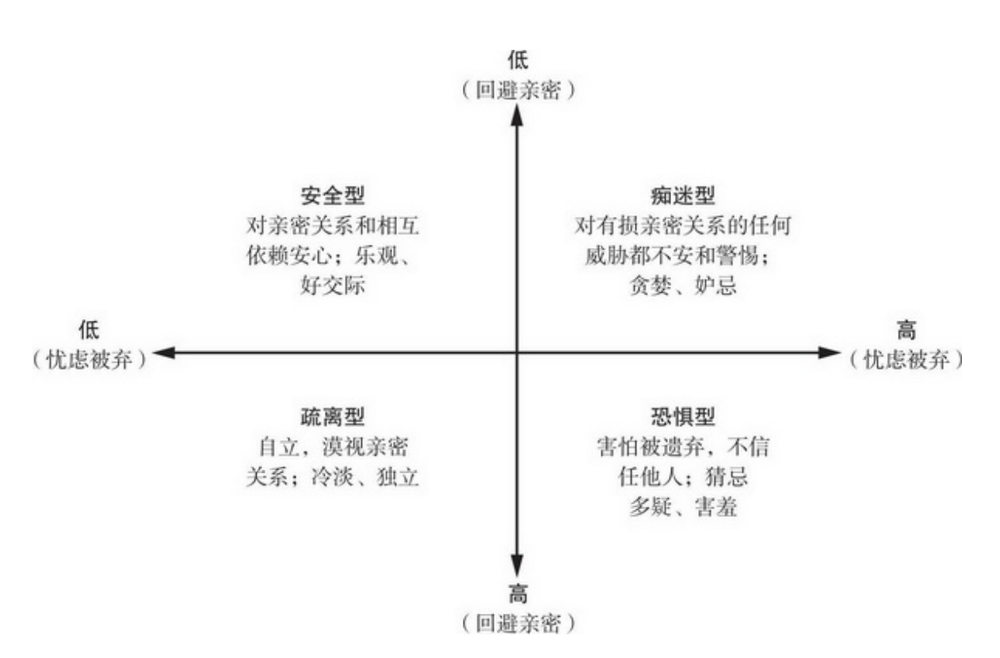

# 人际关系的构成

- 背景：人际关系必不可少，也至关重要
- 作用：人际关系是怎样建立、发展和运作的，什么情况下人际关系又会陷入愤怒和痛苦的深渊。
- 人 类是非常社会化的动物。如果剥夺了和他人的紧密接触，这会令人很痛苦，人类社会属性的核心部分正是对亲密关系的需要。能够享受孤独是一件多么难得的事情
- 紧密关系的基本构成要素：我们承传的文化、遭遇的经历、拥有的人格、共同的遗传以及人际交往。

## 亲密关系性质和重要性

### 性质

- 亲密关系（intimate relationship）：亲密关系和泛泛之交至少在六个方面存在程度差 异 ： **了 解 （knowledge ） 、 关 心 （ care ） 、 相 互 依 赖 性（interdependence）、相互一致性（mutuality）、信任（trust）和承诺（commitment）**。
  - 了解：亲密的伴侣彼此间有着广泛而私密的了解。他们熟知彼此的经历、爱好、情感和心愿，而且一般不会把这些信息透露给其他人。
  - 关心：亲密的伴侣关心对方，彼此能从对方身上感受到更多的关爱。如果人们认为自己的伴侣了解、理解并欣赏自己，其亲密程度就会增加
  - 相互依赖性：指亲密伴侣彼此需要的程度和影响对方的程度，这种相互依赖是频繁的（经常影响彼此）、强烈的（彼此都有显著的影响）、多样的（以多种不同的方式影响彼此）和持久的（彼此影响的时间很长）。人际关系变得相互依赖时，一方的行为在影响自己的同时也会影响对方
  - 相互一致性：由于紧密的联系，亲密伴侣常认为他们是天造地设的一对， 
    而不是两个完全分离的个体。他们表现出很高的相互一致性
  - 信任：期望对方会善待和 尊重自己。人们相信亲密关系不会带来伤害，并期 
    望伴侣能满足自己的要求，关注自己的幸福
  - 承诺：亲密伴侣通常会承诺他们的亲密关系，希望他们的关系能持续到地老天荒，并为此不惜投入大量的时间、人力和物力。
  - 这六个方面未必全部出现在亲密关系中，任何一个要素都可以**单独**出现于亲密关系之中。
- 人际关系最简单、最基本的特点是：种类多样，规格不齐。

### 归属需要

- 要与他人建立亲密关系的普遍而又强烈的内驱力，或许是我们人类的一种本性。
- 亲密关系中包含有人的归属需要（need to belong），如果这种需要得不到满足，就会发生各种各样的问题。
- 个体需要的亲密关系无需太多，几个便可。归属需要得到满足后，我们建立人际关系的内驱力就会降低（因而人际关系的质量比数量更重要）。归属需要也和我们伴侣是谁并无太大的关系，只要他们能给予我们持续的关爱和包容，我们的归属需要就能得到满足。
- 归属需要在亲密关系中的生理益处。亲密关系的质量还会影响人们的身心健康
- 演化学猜测：归属需要是人类长期演化的产物，逐渐成为所有人共同的自然倾向。孤僻的人更容易被淘汰

## 基本构成要素

- 考察在满足归属需要时，主要有哪些因素决定我们构建的人际关系。

### 文化的影响

- 亲密感情内在的归属需要的对立：即不断变化发展的文化，它是规范亲密关系的社会标准。
- 某些普遍的观念（比如婚姻和养育后代在我们人生中的作用）近年来发生了翻天覆地的变化。
- 文化标准是人们建立人际关系的基石，它影响着人们对人际关系的期望，限定了正常的人际关系模式。

#### 亲密关系变化的根源

- 影响因素可能涉及经济发展水平。社会工业化程度越高、越富足，就越能接纳单身、包容离婚和支持晚婚，而全世界的社会经济发展水平都提高了。
- 个人主义
- 新科技
- 特定文化下青年男女的相对数量。（猜想）
- 强势人群的利益：社会规范的演变总是要满足那些掌握经济、政治和法律权力的强势人群的利益。

### 个人经历的影响

- 人际关系还受到个体经历和经验的影响，最好的例子就是对人际关系总体取向有重大影响的**依恋类型**（attachment styles）。
  - 儿童
    - 安全型（secure）依恋:婴儿哭喊时，慈爱的照料者总是如约而至，得到此种呵护的小宝贝们就能舒心地依赖他人，觉得他人可以信任，能从别人那里获得安全和友善。快乐地与他人交往，很容易与他人发展出轻松信任的人际关系。
    - 焦虑—矛盾型（anxiousambivalent）:如果大人对孩子的照料无法预测而且 并不持续，照料者有时热情关注，有时却心不在焉、焦急烦躁，有时根本就不出现。由于不能确定照料者是否以及何时会回来关照自己，与他人的关系就会变得紧张和过分依赖，表现出对他人的过分贪求。
    - 回避型（avoidant）依恋：婴儿的照料者在关照孩子时，带着拒绝或敌对的态度勉强为之。孩子经常怀疑和迁怒他人，不容易形成信任和亲密的人际关系。
  - 成人
    - 安全型(secure)：在感情上很容易接近他人。不管是依赖他人还是被人依赖都感觉心安。不会担忧独处和不为人接纳。
    - 痴迷型(preoccupation)：希望在亲密关系中投入全部的感情,但经常发现他人并不乐意把关系发展到如自己期望的那般亲密。没有亲密关系让我不安,有时还担心伴侣不会像我看重他一样看重我。
    - 回避型
      - 恐惧型(fearful)：和他人发生亲密接触使我不安。感情上我渴望亲密关系，但很难完全相信他人或依赖他人。担心自己和他人变得太亲密会受到伤害。
      - 疏离型(dismissing)：即使没有亲密关系也安心。对我而言，独立和自给自足更加重要,我不喜欢依赖别人或让人依赖。
  - 
- 人际经验会**影响**个体后来人际关系的发展进程。
  - 当儿童面对危险的陌生环境时
    - 安全型的儿童会跑向妈妈，很快安静下来，然后开始勇敢地探索陌生的新环境。
    - 焦虑—矛盾型的儿童则会大哭大闹，紧紧抱住妈妈，完全不顾父母的安全保证。
    - 回避型的儿童往往躲开大人，保持和父母的距离，即使在害怕时也不愿意发生亲密接触。
  - 成人在处理亲密关系时也会表现出类似的反应方式
- 与自己和解：**在你的童年，你形成这样的人格，通常就是你能做的最好选择。**
- 人们避免和他人亲密接触的原因
  1. 人们期望和他人交往，但又对他人戒心重重，害怕被人拒绝和欺骗。
  2. 人们独立自主、自力更生，**真正地喜欢**我行我素和自由自在，而不愿意与他人发生紧密的依恋关系。
- 人际关系的适应行为
  - 婴儿和成人的行为表现都会反过来影响到对方对待自己的行为，这是一个双向的过程。
  - 年轻人把从家中学到的经验运用到了以后的人际关系上，然而，我们并不会被动地受童年经验的束缚，因为依恋类型不断地受到我们成人后经历的影响。依恋类型既然是习得的，就可能发生变化。尽管依恋能改变，但它们一旦确立后，既稳定又持久，并影响人们新建立的人际关系，加强已有的行为倾向。视乎人际交往经验的不同，我们习得的依恋类型既可随时间发生变化，也可永久保持稳定。

### 个体差异的影响

- 依恋类型一旦形成，就决定了人们与他人交往时显示出的独特个体特征。每个人都是由不同的经验和特质组合而成的独特个体。这些经验和特质又塑造了不同的能力和偏好，正是这些差异影响了我们的亲密关系。
- 个体差异常常是渐进微弱的而不是突然剧变的。
- 类型
  - 性别差异
  - 性认同差异
  - 人格差异
  - 自尊差异

#### 性别差异

- （在多数情况下）如果把拥有某种特质或能力的人数画成图，就得到一条独特的曲线即正态曲线。正态曲线描述了某种特质在特定水平上的人数。
  1. 大多数人的才华或能力只比平均水平略好或略次；
  2. 大多数特质的极端水平，即过高或过低的特质，都十分罕见。
- 重要观点
  - 有些两性差异的确存在，但非常小（不要被专业的术语误导,研究者提及的“显著的”性别差异通常指“统计学上的显著性”——就是说差异在数字上是可靠的——但差异或许根本不大）。
  - 两性性别内的行为和观点差异通常远大于两性之间的平均差异。
  - 由于两性的行为和观点在正态分布上重合的程度如此之大，以致即使平均得分低的性别中也有许多人的得分高于另一性别的平均得分。
- “性别差异”这种说法具有误导性，因为它只强调两性之间的差异性，而忽略相似性，这容易使人产生错误的认识。

#### 性认同差异

- 性别差异指的是源自身体的两性生物性差异。相反，性认同差异指的是由文化和教育引起的两性在社会性和心理上的差异，或者叫社会性别
- 性认同最好的例子是性别角色（gender roles），即社会文化所期待的男女两性应有的“正常”行为模式。
- 双性化（androgynous）：同时拥有传统上认为应该属于男性和女性的特质
  - 把与任务有关的“男子气”的才能称为 工具性（instrumental）特质
  - 把与社交和情感有关的“女人味”的技能称为表达性（expressive）特质。
- 性别角色期望的性别差异：男性的性别角色期望比对女性更为严格
- 性别角色的刻板印象限制了我们的潜能，甚至有时候还是错误的，但它仍将持续地存在。性别角色期望正是使亲密关系变得错综复杂的重要因素。

#### 人格

- 人们之间的某些重要差异（比如依恋类型和性认同差异）会受经验影响，历经岁月会发生变化，但也有些个体差异却更为稳定和持久。人格特质会影响人们一生的人际交往行为，人格特质较稳定，长期也只会缓慢地变化
- 核心特质
  - 开放性(openness to experience):富有想象力、不墨守成规、艺术气质,相对应的是拘泥、僵化和教条。
  - 外倾性( extraversion):开朗、合群、热情、喜欢社交，相对应的是谨慎、内敛及害羞。
  -  尽责性(conscientiousness):勤劳、可依赖、有序，相对应的是不可靠、粗心大意。
  - 宜人性( agreeableness ):同情心、合作性、对人信任，相对应的是易怒、暴躁和充满敌意。
  - 神经质( neuroticism):善变、容易担忧、焦虑和愤怒的程度。

#### 自尊

- 定义：人际交往中的自我评价
- 如果对自己的能力和特质持正面评价，自尊水平就高；如果怀疑自己，自尊水平就低。因为高自尊的人一般比低自尊的人活得更健康、更幸福，所以人们普遍认为自我感觉良好有益身心
- 自尊是人们的主观计量器，即“社会关系测量仪”（sociometer），可以测量我们人际关系的质量。如果他人 
  喜欢我们，我们就喜欢自己；如果他人积极地对待我们并看重与我们的关系，自尊水平就高。然而，如果我们不能吸引别人的关注——如果别人似乎并不在意我们是否会介入他们的生活——自尊水平就低。
- 有些人自己没有任何过错，却成了糟糕人际关系的牺牲品。尽管他们招人喜爱，有良好的社交能力，却因为他人的苛刻对待产生了低自尊。当这些人进入伙伴更友善、更欣赏的新人际关系时他们接受到的新反馈也不一定能慢慢提高他们的低自尊

### 人类本性的影响

- 演化历经无数代塑造着我们的人际关系，潜移默化地使每个人都表现出一定的倾向性
- 演化心理学观点
  - 任何普遍的心理机制之所以以它目前的形式存在，是因为它一直有利于人类解决过去的生存或繁殖问题
  - 现代人际关系中的共同模式：某些规律和性别差异之所以存在，是因为它们是心理机制长期演化的结果，在很久以前都是有适应意义的。
- 演化心理学三个基本假设
  1. 性选择（sexual selection）：性选择意味着能更成功地繁殖后代的优势。使人类成为今天这样的物种。诸如归属需要这类动机之所以成为人类的重要特征，是因为它具有适应性，赋予拥有这些动机的个体某种繁殖优势。到了一定程度时，与他人交好的愿望就具有遗传性。
  2. 两性之所以存在差异，只是因为某种程度上他们在过去面临着不同的繁殖困境。除了在那些不同、特异化的行为方式上（这种行为方式能更好地接近异性和提升后代的生存优势）存在性别差异外，男女双方在亲密关系中的行为应该很相似。男女双方在生养孩子上的养育投入（parental investment）的生物学差别，引起了男女双方在选择配偶时进化出不同的策略。
  3. 文化影响决定了演化形成的行为模式是否具有适应性——并且文化的变化比演化快得多。

- 无论人类本性是演化而来还是文化创造（或兼而有之），它的确存在，而且影响到我们的亲密关系。

### 人际互动的影响

- 人际关系常常大于人际关系中个人所特有的经验和人格各部分相加的总和。人际关系由每一个参与者的经历和才能组合而成

### 人际关系的消极面

- 亲密关系也有一些潜在的代价。我们需要亲密关系（没有它我们会备受煎熬），但有时我们和他人打交道也 
  会带来不幸和痛苦。

# 研究方法

- 掌握一些研究方法的基础知识对于正确理解人际关系科学十分有必要
- 严谨的科学家会系统而认真地收集和评价各种信息，但没有任何一种单一的研究方法能得出绝对明确的答案。要深入理解人际关系，需要综合许多研究的结果，需要以明智而审慎的态度评价和辨别不同的信息。
- 方向
  - 经常从社会各阶层抽取不同的人群样本作为研究对象； 
  - 考察家庭、朋友和爱情等多种不同类型的关系； 
  - 经常对这些人际关系做长期研究；
  - 既研究人际关系令人愉快的一面，也研究消极的一面； 
  - 经常在自然状态下追踪人际关系。
- 人际关系研究中的志愿者偏差( volunteer bias)：不管研究者采用的是方便取样还是代表性取样,都会面临志愿者偏差问题:在邀请来参加实验人中，接受邀请和不接受邀请的人或许存在差别。

## 提出问题

- 一些问题来自于个人经验。

- 可能来自先前的研究
- 问题分类
  1. 科学家可能尝试对某些事件或一系列事件的自然发生过程进行描述。这种情况下，科学家的目标是尽可能全面和精确地描述事件的性质。
  2. 研究者要确定事件之间的因果联系，以确定哪些事件对随后的结果有显著影响，哪些没有影响。对所有主持研究和参与关系研究的人而言，这种区分具有重要的意义。

### 参与者的选取

- 方便取样（convenience sample）：（相对地）方便研究者获取参与者。
- 采用代表性取样（representative sample）：要努力确保参与者大体要与研究的整个总体相似

## 研究的设计

- 相关(correlation)设计能回答这样的问题，“ X和Y这两个事件在一起变化吗?也就是说变量x和Y有某种关联吗?”。
  - X可能引起Y——在相似性和吸引力的例子中，知觉到的相似性可能引起了更多的喜欢。
  - Y可能引起X——可能是喜欢上某个人让我们认为自己与他有许多共同点
  - 其他影响因素，第三方变量可能同时引起X和Y，X和Y之所以相关的惟一原因是他们存在共同的影响因素。两个事件X和Y可能对彼此没有一点影响，而是其他影响因素，如他人的俊美长相，致使我们喜欢他们，并且认为他们和我们非常相像。
- 实验设计：实验（experiment）提供了原因和结果的最直截了当的信息，因为实验者创造并控制了他们要研究的条件。实验比其他设计能更清晰、更精确地测定因果联系。
- 发展性研究设计
  - 横断设计（cross-sectional  design）:即比较处在不同人生阶段或者不同年龄人的发展过程。只要人际关系研究的结果涉及年龄，我们就得质问结果究竟真的是年龄差异，还是不同年龄参与者的成长背景差异。
  - 纵向设计（longitudinal design）:即对同一群人在一段时间里反复进行测量。
  - 回溯设计（retrospective design）：追踪事件的时间变化，询问人们过去的经历

## 场景的选择

1. 实验室
2. 自然的日常生活环境

## 数据的性质

- 测量
  1. 人们对自己的思想、情感和行为的自我报告
  2. 对他人行为的观察。

- 对行为的测量应该同时具备心理测量学上的效度（validity）和信度（reliability）。
  - 效度：测量到的事件真正是我们试图测量的
  - 信度：如果这些事件不会发生变化，那么我们在不同时间的测量结果应该一样

### 自我报告

- 存在的问题
  - 参与者对问题的解释
  - 回忆或觉知的困难
  - 参与者报告的偏差：自我服务偏差（self-serving bias)、社会赞许性偏差（social desirability bias）

### 观察法

- 体验式取样（experience-sampling），它采用间断式的、短时间的观察，从而获取较长时间内实际发生的行为。
- 问题：反应性（reactivity）问题

### 生理测量

- 如果我们观察到的行为人们无法有意识地加以控制，就可以避免反应性问题。对人体自主的和生化的反应进行的生理测量就能做到这一点。生理测量的项目包括心率、肌肉张力、性唤起和荷尔蒙水平等，通过生理测量可以确定生理状态是怎样和社会行为关联的。

### 档案材料

- 历史档案（archives）也能避免反应性的问题。个人记录如照片和日记，公共媒体如报纸和杂志，政府记录如结婚证和人口统计信息等，都是人际关系研究的重要数据来源。

## 研究应遵循的道德规范

- 人际关系研究有时的确要询问敏感话题或者观察隐私行为。研究者不经意的探询可能警醒人们注意那些他们不曾意识到的人际关系问题或者挫折
- 努力探索增加人们快乐和减少痛苦的方法，是人际关系研究最根本的道德。

## 结果的解释和整合

- 许多人际关系研究要对所获得的数据进行统计分析以确定结果是否具有统计学上的“显著性”。
- 研究亲密关系要处理的问题的复杂性，也提到统计显著性检验针对的是可能性而不是确定性。能慎思而不盲信并了解到要学习的内容的复杂性。
- 元分析（meta-analyses）研究，即把先前许多不同的研究得出的结果结合在一起进行统计分析 。在元分析中，研究者把针对某一特定现象的所有现存研究汇编到一起，分析整合它们的结果以识别它们包含的共同规律。如果所有的先前研究都得出基本相同的结果，元分析使这一结果一目了然；如果存在不一致，元分析有可能揭示出原因。